# SOURCE_FILE: README.md
---
мое# PACK-digital-platform

> **Тип репозитория:** `Pack`

> Pack (паспорт области) для предметной области «ИТ-платформа и цифровой двойник» — **source-of-truth** для знаний о технической архитектуре экосистемы развития интеллекта.

## Что это

Формализованные знания о том, **как устроена** ИТ-платформа: архитектура, компоненты, принципы, методы, типовые ошибки. Это не код и не реализация — это **предметное знание**, на основе которого строятся все downstream-системы (бот, MCP, агенты).

## Основные идеи (v0.2.1)

### 3-слойная архитектура

```
Слой 3: Интерфейсы  — тонкие клиенты (Telegram, LMS, ChatGPT, API)
Слой 2: Обработка   — две зоны-пира:
        Зона А: ИИ-системы (LLM, stateless) ◄► Зона Б: Детерминированные (код, MCP)
Слой 1: Данные      — БД, файлы, индексы
```

**ИИ-системы** и **детерминированные системы** — виды **систем платформы** (DP.D.015), работающие как пиры внутри слоя обработки. Интерфейс не обращается к данным напрямую. ИИ-система не знает какой UI у пользователя.

### 7 архитектурных характеристик (ЭМОГССБ)

| Характеристика | Определение | Статус |
|----------------|-------------|--------|
| **Эволюционируемость** | Бесконечное подключение сервисов, БД, MCP без изменения структуры | active |
| **Масштабируемость** | Бесконечное подключение пользователей без изменения архитектуры | active |
| **Обучаемость** | Платформа улучшает решения на основе данных и обратной связи | active |
| **Генеративность** | Платформа порождает созидателей: общее знание → шаблон → fork → собственная система | active |
| **Скорость** | Задержка от запроса до результата: бот <3 сек, CLI <1 сек | active |
| **Современность** | Соответствие SOTA-практикам; АрхГейт при каждом решении | active |
| **Безопасность** | Защита данных и сервисов от несанкционированного доступа, утечек, AI-специфичных угроз | active |

### ИИ-системы (не «агенты» и не «ассистенты»)

**ИИ-агент** и **ИИ-ассистент** — это **виды** ИИ-систем (DP.D.009), а не разные слои. Вид определяется тремя признаками: ориентация (человек/система), инициатива (по запросу/автономно), интерфейс (диалог/API).

Реестр: 16 ИИ-систем (Стратег, Проводник, Знание-Экстрактор, ДЗ-чекер и др.) — см. [DP.ROLE.001](pack/digital-platform/02-domain-entities/DP.ROLE.001-platform-roles.md).

### Универсальный паттерн: Вход-Обработка-Выход (IPO)

Каждый компонент платформы описывается через **Входы → Обработка → Выходы**. Это единый контракт для паспортов ИИ-систем, описаний сервисов и MCP-серверов.

### Отчуждаемость (platform-space vs user-space)

Каждый компонент строится для передачи другим людям:
- **Platform-space** — одинаково для всех (модули, шаблоны, правила)
- **User-space** — уникально для каждого (данные, предпочтения, конфигурация)

### Модульный экзокортекс

Точка подключения пользователя к платформе. 3-слойная архитектура инструкций:

| Слой | Файл | Размер | Загрузка |
|------|------|--------|----------|
| 1. Оперативная память | MEMORY.md | ≤100 строк | Всегда в контексте |
| 2. Правила работы | CLAUDE.md + CLAUDE-ref.md | ≤300 + ≤400 | Автоматически / по необходимости |
| 3. Детальные знания | memory/*.md | Без лимита | По ссылкам |

### Навигация знаний

4 уровня навигации по множеству репозиториев: Реестр → Манифест → Карта Pack'а → Кросс-ссылки.

### Метод экстракции знаний

Превращение информации в Pack-совместимые сущности: обнаружение → классификация → маршрутизация → формализация → валидация.

## Структура

```
PACK-digital-platform/
├── README.md                          # Этот файл
├── REPO-TYPE.md                       # Метаданные репо
├── WORKPLAN.md                        # Операционный план развития Pack'а
├── CLAUDE.md                          # Правила для Claude Code
└── pack/
    └── digital-platform/
        ├── 00-pack-manifest.md        # Манифест v0.2.0
        ├── 01-domain-contract/        # Контракт домена
        │   ├── 01A-bounded-context.md #   Scope, понятия, связи
        │   ├── 01B-distinctions.md    #   14 базовых различений (DP.D.001–014)
        │   └── DP.D.015–032           #   18 расширенных различений
        ├── 02-domain-entities/        # Сущности домена
        │   ├── DP.ARCH.001            #   Архитектура (3 слоя, 7 характеристик ЭМОГССБ, 20 принципов 2-го уровня)
        │   ├── DP.ARCH.002            #   4-осевая модель тиров (T0–T4 + TM/TA/TD)
        │   ├── DP.ROLE.001           #   ИИ-системы (реестр 16 систем)
        │   ├── DP.ROLE.012-strategist/  # Паспорт Стратега + 8 сценариев
        │   ├── DP.AISYS.013           #   Знание-Экстрактор
        │   ├── DP.AISYS.014           #   Бот AIST
        │   ├── DP.NAV.001             #   Навигация знаний
        │   ├── DP.EXOCORTEX.001       #   Модульный экзокортекс
        │   ├── DP.CONCEPT.001         #   Концепция платформы
        │   ├── DP.SYS.001             #   Детерминированные системы
        │   ├── DP.RUNBOOK.001         #   Каталог ошибок бота (L1–L4)
        │   └── DP.ASSIST.001          #   (superseded → DP.ROLE.001)
        ├── 03-methods/                # Методы (7)
        │   ├── DP.M.001               #   Экстракция знаний
        │   ├── DP.M.002               #   Стратегическое DDD
        │   ├── DP.M.003               #   Context Engineering Protocol
        │   ├── DP.M.004               #   Адаптивная персонализация
        │   ├── DP.M.005               #   АрхГейт (ЭМОГССБ + обратная связь §8)
        │   ├── DP.M.006               #   Vibe-Check
        │   └── DP.M.007               #   Intervention Loop
        ├── 04-work-products/          # Рабочие продукты (2)
        │   ├── DP.WP.001             #   Отчёт экстракции
        │   └── DP.WP.002             #   Ubiquitous Language
        ├── 05-failure-modes/          # Типовые ошибки (7)
        │   ├── DP.FM.001             #   Информация как знание
        │   ├── DP.FM.002             #   Смешение слоёв
        │   ├── DP.FM.003             #   Context Blindness
        │   ├── DP.FM.004             #   Narrow Pregeneration Scope
        │   ├── DP.FM.005             #   Model-Reality Drift
        │   ├── DP.FM.006             #   Когнитивный долг (Agentic AI)
        │   └── DP.FM.007             #   View Drift (дрейф представлений)
        ├── 06-sota/                   # SoTA-аннотации (13)
        │   ├── DP.SOTA.001           #   DDD Strategic (Khononov)
        │   ├── DP.SOTA.002           #   Context Engineering
        │   ├── DP.SOTA.003–013       #   + 11 практик (API, GraphRAG, AI-Native и др.)
        └── 07-map/                    # Карта
            └── DP.MAP.001            #   Навигационная карта Pack'а
```

## Ключевые различения

| # | Различение | Почему важно |
|---|-----------|-------------|
| DP.D.009 | ИИ-агент ≠ ИИ-ассистент | Виды ИИ-систем, не разные слои |
| DP.D.010 | Характеристика ≠ Принцип | Цель (измеряемое) vs средство (правило) |
| DP.D.011 | Platform-space ≠ User-space | Общее vs персональное |
| DP.D.012 | Знание ≠ Информация | Формализовано vs сырое |
| DP.D.015 | ИИ-система ≠ ИТ-система | LLM-зависимая vs детерминированная |

Полный список: [01B-distinctions.md](pack/digital-platform/01-domain-contract/01B-distinctions.md)

## Upstream

- [SPF](https://github.com/TserenTserenov/SPF) — Second Principles Framework (форма и процесс)
- [FPF](https://github.com/ailev/FPF) — First Principles Framework (содержание мышления)
- [PACK-personal](https://github.com/aisystant/PACK-personal) — знания о созидателе (характеристики, состояния)

## Действующие исполнители экзокортекса

> Исполнитель — система (ИИ или скрипт), выполняющая автономную работу по расписанию или триггеру. Правило: пока только скрипт — живёт в родительском репо; появился промпт — выделяется в отдельное DS-репо.

| # | Исполнитель | Вид | Репо | Расписание / триггер |
|---|------------|-----|------|---------------------|
| 1 | **Стратег** (AISYS.012) | ИИ-агент | DS-ai-systems/strategist/ | launchd: 4:00 daily + Пн 00:00 + boot |
| 2 | **Экстрактор** (AISYS.013) | ИИ-агент | DS-ai-systems/extractor/ | launchd: каждые 3ч + Claude (Close) |
| 3 | **AIST Bot** (AISYS.014) | ИИ-ассистент | DS-aist-bot/ | Telegram (пользователь / сервер) |
| 4 | **Синхронизатор** (SYS.016) | Скрипт | DS-ai-systems/synchronizer/ | launchd: каждые 2 мин + boot |

Полные реестры: [DP.ROLE.001](pack/digital-platform/02-domain-entities/DP.ROLE.001-platform-roles.md) (ИИ-системы), [DP.SYS.001](pack/digital-platform/02-domain-entities/DP.SYS.001-deterministic-systems.md) (детерминированные).

## Downstream (что строится на основе этого Pack'а)

- [aist_bot_newarchitecture](https://github.com/aisystant/aist_bot_newarchitecture) — Telegram-бот (тонкий клиент)
- [DS-ai-systems](https://github.com/TserenTserenov/DS-ai-systems) — Монорепо ИИ-систем (7 систем: стратег, экстрактор, синхронизатор и др.)
- [digital-twin-mcp](https://github.com/aisystant/digital-twin-mcp) — MCP-сервер цифрового двойника
- [DS-my-strategy](https://github.com/TserenTserenov/DS-my-strategy) — Личный стратегический хаб

## Non-goals

- НЕ содержит кода (это downstream/instrument)
- НЕ содержит UI/UX (это downstream/surface)
- НЕ определяет индикаторы созидателя (это PACK-personal)
- НЕ содержит планы проекта (это DS-ecosystem-development)

---

*Pack v0.2.2 | 76 сущностей (32 D, 13 SOTA, 7 M, 7 FM, 2 WP + entities) | Построен по [SPF](https://github.com/TserenTserenov/SPF) (Second Principles Framework)*


# SOURCE_FILE: CLAUDE.md
---
# CLAUDE.md — PACK-digital-platform

> **Общие инструкции:** см. `/Users/tserentserenov/IWE/CLAUDE.md`
>
> Этот файл содержит только специфику данного репозитория.

---

## 1. Тип репозитория

**Pack** — source-of-truth для области «Цифровая платформа развития интеллекта».

**Является source-of-truth** — downstream репозитории берут знания отсюда.

---

## 2. Иерархия источников (Fallback Chain)

```
1. Этот Pack (предметное знание)
   └── pack/digital-platform/
2. SPF (форма и процесс)
   └── ~/IWE/SPF/
3. FPF (первые принципы) — только если нет в SPF
   └── ~/IWE/FPF/FPF-Spec.md
```

**Правило:** Если чего-то нет на текущем уровне — смотри выше.

**Когда обращаться к SPF:**
- При вопросах о структуре Pack'а
- При вопросах о процессе (SoTA, distinctions, methods)
- При проверке корректности оформления

**Когда обращаться к FPF:**
- Только если SPF не покрывает вопрос
- Для базовых различений (A.7: Method ≠ Tool, Object ≠ Description)

---

## 3. Структура Pack'а

```
pack/digital-platform/
├── 00-pack-manifest.md        # Метаданные
├── 01-domain-contract/        # Контракт домена
│   ├── 01A-bounded-context.md
│   └── 01B-distinctions.md
├── 02-domain-entities/        # Сущности
├── 03-methods/                # Методы
├── 04-work-products/          # Рабочие продукты
├── 05-failure-modes/          # Типовые ошибки
├── 06-sota/                   # SoTA-статусы
├── 07-map/                    # Карты связей
└── 08-service-clauses/              # Обещания потребителям (SC)
```

---

## 4. Hard Bans (из SPF)

- **Нет дидактики:** "step", "lesson", "module" — это downstream
- **Нет путаницы типов:** Method ≠ Tool, System ≠ Episteme

---

## 5. Роль Claude

| Делает | НЕ делает |
|--------|-----------|
| Помогает формализовать знания | Не изобретает предметное содержание |
| Следит за соответствием SPF | Не создаёт downstream-артефакты |
| Проверяет SoTA-статусы | Не добавляет дидактику |

---

## 6. Правило синхронизации: MAP.002 ↔ 04-work-products/

> **Блокирующее.** Каждый уникальный выход (колонка «Выход (РП)») в MAP.002 ДОЛЖЕН иметь соответствующий WP-файл в `04-work-products/`.

| Событие | Действие |
|---------|----------|
| Добавление сервиса в MAP.002 | Проверить: выход уже описан как WP? Нет → создать `DP.WP.{N+1}-{slug}.md` |
| Изменение выхода сервиса | Обновить соответствующий WP-файл |
| Удаление сервиса | Проверить: WP используется другими? Нет → пометить `status: deprecated` |
| После любых изменений WP | Запустить `generate-map.py` для обновления MAP.001 |

**Фильтр:** Не все выходы требуют WP. Исключения:
- Transient TG-сообщения (не имеют структуры, не хранятся)
- Действия без артефакта (FSM reset, service restart)
- Внешние форматы (GitHub Issue — структура определена извне)

**Тест:** «Можно распечатать?» → Да = WP. Нет = не WP.

---

## 7. Нумерация сценариев (08-service-clauses/)

| Диапазон | Контур | Примеры |
|----------|--------|---------|
| `DP.SC.001–099` | L4-Personal (IWE) | Планирование, обучение, ОРЗ |
| `DP.SC.101–199` | L2-Platform (Aisystant) | Онбординг, потоки, billing |
| `DP.SC.201–299` | L3-Template (зарезервирован) | — |

Контур также указывается в frontmatter: `layer: L4-Personal` / `L2-Platform`. L2-SC ссылаются на L4-SC через `related.extends`.

---

## 8. Связи

| Репозиторий | Роль |
|-------------|------|
| SPF | Upstream — форма и процесс |
| FPF | Upstream (через SPF) — первые принципы |
| DS-ecosystem-development | Downstream — управление экосистемой |


# SOURCE_FILE: ontology.md
---
# Онтология: ИТ-платформа и цифровой двойник

> Онтология домена по SPF.SPEC.002.
> Полный реестр типов сущностей, ключевых понятий и связей для Pack DP.
> Каждое понятие привязано к родительскому понятию из базовой онтологии SPF (SPF.SPEC.002, секция 2).

---

## 1. Виды сущностей

> Все типы, используемые в этом Pack: базовые (из SPF) + расширенные (определённые этим Pack).
> **Обязательная колонка «FPF-понятие»** — родительское понятие из базовой онтологии SPF.

### 1.1. Базовые виды (из SPF)

| Код | Вид | FPF-понятие | Определение | ≠ (что это НЕ) |
|-----|-----|-------------|-------------|-----------------|
| `M` | Метод | U.Method | Описание способности (capability) производить рабочий продукт | ≠ сценарий (пошаговая инструкция), ≠ инструмент, ≠ выполнение (work) |
| `WP` | Рабочий продукт | U.Work + U.Episteme | Наблюдаемый результат применения метода; существует на носителе | ≠ описание метода, ≠ навык |
| `FM` | Режим ошибки | — (SPF-специфичный) | Типичное нарушение метода или рабочего продукта с наблюдаемыми симптомами | ≠ баг в коде, ≠ риск (вероятность) |
| `D` | Различение | A.7 Strict Distinction | Концептуальная граница, нарушение которой создаёт неустранимую путаницу | ≠ факт, ≠ определение |
| `MAP` | Карта | U.Episteme | Навигационная структура связей между сущностями | ≠ контент (= структурный артефакт) |

| `SC` | Обещание сервиса | U.ServiceClause | Контракт обслуживания потребителя: кому, зачем, что получит, критерий приёмки. Отделён от реализации (MethodDescription) | ≠ описание метода (как делать), ≠ сервис (точка входа) |

> Виды `R` (Role, U.RoleAssignment), `CHR` (Characteristic, U.Characteristic), `SOTA` (SoTA Annotation) определены в SPF, но пока не используются в этом Pack.

### 1.2. Расширенные виды (определены этим Pack)

| Код | Вид | FPF-понятие | Определение | ≠ (что это НЕ) |
|-----|-----|-------------|-------------|-----------------|
| `ARCH` | Архитектура | U.System + U.Episteme | Архитектурное описание системы: слои, характеристики, принципы | ≠ реализация (код), ≠ диаграмма |
| `CONCEPT` | Концепция | U.Episteme | Концептуальное описание системы/подсистемы: назначение, модель, видение | ≠ архитектура (как устроено), ≠ план (когда делать) |
| `SYS` | ИТ-система | U.System | Детерминированная подсистема платформы (сервис, MCP-сервер); без зависимости от LLM | ≠ ИИ-система (использует LLM) |
| `ROLE` | Платформенная роль | U.Role + U.Capability | Реестр или паспорт платформенной роли; роль = функция, исполняемая человеком или ИИ-системой | ≠ исполнитель (holder), ≠ агент (автономная система) |
| `AISYS` | ИИ-система (паспорт) | U.System + U.Capability | Паспорт конкретной ИИ-системы с описанием сценариев | ≠ роль (ROLE — функция), ≠ реестр (ROLE — весь список) |
| `NAV` | Навигация | U.Episteme | Навигационная структура знаний: уровни, кросс-репо ссылки | ≠ поиск (DP.D.013), ≠ карта (MAP — граф одного Pack) |
| `EXOCORTEX` | Экзокортекс | U.System + U.Episteme | Модульный экзокортекс пользователя: 3-слойная архитектура инструкций | ≠ ИИ-система, ≠ IDE-настройки |

---

## 2. Глоссарий домена

> Ключевые понятия предметной области. Для полных определений — см. [01A-bounded-context.md](01A-bounded-context.md).
> **Обязательная колонка «Родительское понятие (SPF)»** — к какому универсальному понятию из базовой онтологии SPF относится этот доменный термин.

| Термин (RU) | Term (EN) | Определение | Родительское понятие (SPF) | Связан с |
|-------------|-----------|-------------|---------------------------|----------|
| **Цифровой двойник** | Digital Twin | Вычислительная модель, синхронизированная с реальным объектом (созидателем) через набор индикаторов | U.System | DP.CONCEPT.001 |
| **Платформа** | Platform | Цифровая среда экосистемы: вычисления, хранение, интеграция сервисов, взаимодействие с ИИ | U.System | DP.ARCH.001 |
| **Индикатор** | Indicator | Наблюдаемый/вычисляемый показатель состояния объекта | U.Characteristic | DP.D.004, DP.D.005 |
| **Входной индикатор** | Input Indicator | Значение, вводимое пользователем | U.Characteristic | DP.D.005 |
| **Производный индикатор** | Derived Indicator | Значение, вычисляемое из других индикаторов | U.Characteristic | DP.D.005 |
| **ИИ-система** | AI System | Система платформы, использующая LLM. Может быть агентом (orientation: system) или ассистентом (orientation: human) — это характеристики, не разные типы | U.System + U.Capability | DP.ROLE.001, DP.D.009 |
| **ИТ-система** | IT System | Система платформы без зависимости от LLM: CRM, LMS, MCP-серверы. Детерминированная, stateful | U.System | DP.SYS.001, DP.D.015 |
| **Экзокортекс-интерфейс** | Exocortex Interface | Точка подключения пользователя к платформе: CLAUDE.md + Memory | U.System + U.Episteme | DP.EXOCORTEX.001 |
| **IPO-паттерн** | IPO Pattern | Универсальный контракт описания компонентов: Вход → Обработка → Выход | U.Method | DP.ARCH.001 |
| **Platform-space** | Platform-space | Общие для всех пользователей модули, шаблоны и правила | U.BoundedContext | DP.D.011 |
| **User-space** | User-space | Персональные данные пользователя: РП, репо, captures, предпочтения | U.BoundedContext | DP.D.011 |
| **Экстракция знаний** | Knowledge Extraction | Метод трансформации информации в формализованные Pack-совместимые сущности | U.Method | DP.M.001 |
| **Адаптивная персонализация** | Adaptive Personalization | Подстройка контента под состояние пользователя (тест → промпт + bloom_level + тематика) | U.Method | DP.M.004 |
| **Навигация знаний** | Knowledge Navigation | Структурный обход знаний между репозиториями через карты, индексы, кросс-ссылки | U.Episteme | DP.NAV.001, DP.D.013 |
| **Архитектурная характеристика** | Architectural Characteristic | Измеряемое качество архитектуры (эволюционируемость, масштабируемость, обучаемость, генеративность) | U.Characteristic | DP.D.010 |
| **Файл контекста РП** | WP Context File | Накопленный контекст многосессионного РП: что сделано, что обнаружено, что дальше. Производится Close-протоколом, потребляется Open-протоколом | U.Work + U.Episteme | DP.EXOCORTEX.001, DP.D.014 |
| **Среда (IWE)** | Environment (IWE) | Персональная интегрированная система для интеллектуальной работы. Объединяет модули Платформы и собственные инструменты пользователя. Син.: IWE (Intellect Work Environment, Integrated Working Environment). Аналог IDE (Integrated Development Environment) для разработчика — но для развития интеллекта, а не написания кода | U.System | DP.CONCEPT.002, DP.D.016, DP.D.017 |
| **Harness (упряжь)** | Harness | Обвязка, определяющая качество работы агента/человека: контекст + ограничения + валидация + обратная связь. IWE — harness для интеллектуальной работы, аналогично harness OpenAI для ИИ-кодирования | U.System + U.Method | DP.D.025, DP.SOTA.002 |
| **АрхГейт (ЭМОГССБ)** | ArchGate | Блокирующая оценка архитектурного решения по 7 характеристикам. Порог ≥8. Без прохождения решение не принимается | U.Method | DP.M.005 |
| **WP Gate** | WP Gate | Блокирующая проверка наличия рабочего продукта в плане перед началом работы. Предотвращает незапланированную работу | U.Method | DP.EXOCORTEX.001 |
| **IntegrationGate** | Integration Gate | Блокирующая проверка перед разработкой/интеграцией: тип, контур (L2-L4), роли, продукты, процессы | U.Method | DP.ARCH.001 |
| **Capture-to-Pack** | Capture-to-Pack | Рубежная проверка на каждом этапе работы: есть ли знание для записи в Pack. Отличается от Knowledge Extraction (DP.D.016) | U.Method | DP.M.001, DP.D.016 |
| **DayPlan** | DayPlan | Ежедневный план работы: приоритеты, бюджеты, carry-over. Артефакт Day Open, handoff Стратег→Человек | U.WorkPlan | DP.WP.003 |
| **WeekPlan** | WeekPlan | Еженедельный план: РП, бюджеты, фокус, сверка со стратегией. Артефакт стратегирования | U.WorkPlan | DP.WP.004 |
| **ОРЗ-фрактал** | ORZ Fractal | Фрактальный паттерн работы: Открытие → Работа → Закрытие. Применяется на двух масштабах: День и Сессия | U.Method | DP.M.003 |
| **Творческий конвейер** | Creative Pipeline | 4-стадийный процесс: заметка → черновик → заготовка → пост. Ключевой инвариант: TTL на каждой стадии, ничего не накапливается | U.Method + U.Flow | DP.M.003 |
| **Обещание сервиса** | Service Clause | Контракт обслуживания: кому адресовано, зачем, что получит потребитель, критерий приёмки. Отделено от реализации (MethodDescription). Один SC может реализовываться несколькими сервисами из MAP.002 | U.ServiceClause | DP.SC.* |
| **Экзоскелетный режим** | Exoskeleton Mode | Режим взаимодействия с IWE, где система усиливает мышление человека. Human gate обязателен: человек работает с материалом, пропускает через себя. Применяется к доменному знанию, стратегии, Pack | U.System + U.Method | DP.D.046 |
| **Автопилотный режим** | Autopilot Mode | Режим взаимодействия с IWE, где LLM действует автономно без human gate. Применяется к разведке, первичному обзору, черновому слою (Scout, auto-compilation, linting) | U.System + U.Method | DP.D.046 |

---

## 3. Отношения между видами

| Субъект | Отношение | Объект | Пример |
|---------|-----------|--------|--------|
| Метод (M) | порождает → | Рабочий продукт (WP) | DP.M.001 → DP.WP.001 |
| Failure Mode (FM) | нарушает ← | Метод (M) | DP.FM.001 ← DP.M.001 |
| Failure Mode (FM) | нарушает ← | Архитектура (ARCH) | DP.FM.002 ← DP.ARCH.001 |
| ИИ-система (AISYS) | реализует → | Метод (M) | DP.AISYS.013 → DP.M.001 |
| ИИ-система (AISYS) | использует → | Метод (M) | DP.AISYS.014 → DP.M.004 |
| ИИ-система (AISYS) | входит в ← | Реестр ролей (ROLE) | DP.AISYS.013 ← DP.ROLE.001 |
| Архитектура (ARCH) | содержит → | ИТ-система (SYS) | DP.ARCH.001 (Слой 2, зона Б) → DP.SYS.001 |
| Архитектура (ARCH) | содержит → | Роли (ROLE) | DP.ARCH.001 (Слой 2, зона А) → DP.ROLE.001 |
| Навигация (NAV) | описывается → | Карта (MAP) | DP.NAV.001 → DP.MAP.001 |
| Экзокортекс (EXOCORTEX) | использует → | Навигация (NAV) | DP.EXOCORTEX.001 → DP.NAV.001 |
| Концепция (CONCEPT) | определяет → | Архитектура (ARCH) | DP.CONCEPT.001 → DP.ARCH.001 |
| Обещание (SC) | реализуется через → | Сервис (MAP.002) | DP.SC.001 → S01, S42 |
| Обещание (SC) | адресовано → | Роль (ROLE) | DP.SC.001 → R14 Заказчик |

---

## 4. Иерархия типов

```
Система платформы (DP.D.015)
├── ИИ-система (ROLE/AISYS) — зависит от LLM
│   ├── ИИ-агент (orientation: system, автономная инициатива)
│   └── ИИ-ассистент (orientation: human, по запросу)
└── ИТ-система (SYS) — детерминированная, без LLM
    ├── Сервис (CRM, LMS, Биллинг)
    └── MCP-сервер (DS-twin, fsm-mcp)
```

```
Архитектура платформы (DP.ARCH.001) — 3 слоя
├── Слой 1: Данные + Инфраструктура (хранение, БД)
├── Слой 2: Обработка
│   ├── Зона А: ИИ-системы (ROLE/AISYS) — LLM, stateless
│   └── Зона Б: Детерминированные (SYS) — код, stateful, MCP
└── Слой 3: Интерфейсы (EXOCORTEX, Telegram Bot, Web LMS, API)
```

---

## 5. Кросс-Pack связи

| Понятие этого Pack | Связанный Pack | Понятие там |
|--------------------|---------------|-------------|
| Индикатор (входной/производный) | PD (Personal Development) | PD.CHR.* — характеристики созидателя |
| ИИ-система (реестр) | EC (Ecosystem) | EC.* — ИИ-системы обслуживают экосистему |
| Экстракция знаний (DP.M.001) | PD, EC | Метод применим ко всем Pack'ам |
| MCP-реестр (DP.SYS.001) | PD | knowledge-base-mcp читает данные созидателя |
| Среда / IWE (DP.CONCEPT.002) | ECO | Среда — компонент экосистемы; личные среды связаны с Платформой |

---

## 6. Полный реестр различений

> Определения различений — в [01B-distinctions.md](01B-distinctions.md). Здесь — индекс для навигации.

| ID | Различение | Предотвращает путаницу |
|----|-----------|----------------------|
| DP.D.001 | Объект ≠ Модель | Реальное лицо vs формальное представление |
| DP.D.002 | Модель ≠ Данные | Структура vs значения |
| DP.D.003 | Данные ≠ Представление | Хранимое vs отображаемое |
| DP.D.004 | Индикатор ≠ Факт | Наблюдаемый показатель vs утверждение о реальности |
| DP.D.005 | Входной ≠ Производный индикатор | Введён пользователем vs вычислен |
| DP.D.006 | Генеративный текст ≠ Source-of-truth | LLM-вывод vs верифицированный источник |
| DP.D.007 | Качество модели ≠ Качество данных | Правильность структуры vs правильность значений |
| DP.D.008 | Синхронизация ≠ Копирование | Двусторонняя связь vs одноразовая копия |
| DP.D.009 | ИИ-агент ≠ ИИ-ассистент | Характеристики (orientation), не разные типы |
| DP.D.010 | Арх. характеристика ≠ Арх. принцип | Измеряемое качество vs правило проектирования |
| DP.D.011 | Platform-space ≠ User-space | Общее vs персональное |
| DP.D.012 | Знание ≠ Информация | Формализовано, проверено vs сырые данные |
| DP.D.013 | Навигация ≠ Поиск | Структурный обход vs запрос по содержимому |
| DP.D.014 | Оперативная память ≠ Справочник | Часто меняется vs стабильное |
| DP.D.015 | ИИ-система ≠ ИТ-система | Зависит от LLM vs детерминированная |
| DP.D.016 | Софт ≠ Система | Софт = описание системы (код, blueprint); система = работающее воплощение (running instance). Софт становится системой в момент запуска |
| DP.D.017 | Платформа ≠ Среда | Платформа = общая система для всей экосистемы (shared infrastructure); среда (IWE) = персональная система для индивидуальной работы. Среда использует модули Платформы, но может включать и собственные |
| DP.D.021 | Вайб-моделирование ≠ Профессиональное моделирование | Вайб = прототип, без типизации; профессиональное = single-meaning slot, типы, инварианты. AI-агент без контроля = мультипликатор вреда |
| DP.D.022 | Три уровня проверяемости | Формальная (машина) ≠ семантическая (человек+AI) ≠ операционная (интервенция). AI закрывает уровень 1, частично 2 |
| DP.D.025 | Harness ≠ Agent | Среда (обвязка) определяет результат больше, чем мощность агента/модели. Изменение harness = +5-14% без переобучения (Boluk 2026). IWE = harness для интеллекта |
| DP.D.039 | Обещание (= сценарий использования) ≠ Описание метода ≠ Сервис | Обещание (SC, U.ServiceClause) — контракт потребителю (ЗАЧЕМ). Описание метода (U.MethodDescription) — реализация (КАК): внутрисистемное (процесс) или межсистемное (сценарий). Сервис (accessSpec) — точка входа (ГДЕ) |

---

## 7. Аббревиатуры

> Аббревиатуры, используемые в этом Pack. Наследованные из upstream (SPF, FPF) отмечены соответствующим уровнем.

| Аббревиатура | Расшифровка (RU) | Full form (EN) | Уровень |
|-------------|-----------------|----------------|---------|
| FPF | Фреймворк первых принципов | First Principles Framework | FPF |
| SPF | Фреймворк вторых принципов | Second Principles Framework | SPF |
| UL | Единый язык | Ubiquitous Language | FPF (DDD) |
| BC | Ограниченный контекст | Bounded Context | FPF (DDD) |
| KE | Экстракция знаний | Knowledge Extraction | SPF |
| FM | Режим ошибки | Failure Mode | SPF |
| WP | Рабочий продукт | Work Product | SPF |
| IPO | Вход-Обработка-Выход | Input-Processing-Output | SPF |
| DP | Цифровая платформа | Digital Platform | Pack |
| ЦД | Цифровой двойник | Digital Twin | Pack |
| IWE | Интеллектуальная рабочая среда | Intellectual Work Environment | Pack |
| MCP | Протокол контекста модели | Model Context Protocol | Pack |
| ОРЗ | Открытие-Работа-Закрытие | Open-Work-Close | Pack |
| РП | Рабочий продукт (экземпляр) | Work Product (instance) | Pack |
| LMS | Система управления обучением | Learning Management System | Pack |
| ИИ | Искусственный интеллект | Artificial Intelligence | Pack |
| ИТ | Информационные технологии | Information Technology | Pack |
| ЭМОГССБ | Эволюционируемость, Масштабируемость, Обучаемость, Генеративность, Скорость, Современность, Безопасность | Evolvability, Scalability, Learnability, Generativity, Speed, Modernity, Security | Pack |
| DS | Downstream-репозиторий | Downstream Repository | Pack |
| FMT | Формат (шаблон репозитория) | Format (Repository Template) | Pack |
| ZP | Нулевые принципы | Zero Principles | Base |
| DDD | Предметно-ориентированное проектирование | Domain-Driven Design | FPF |
| SOTA | Современное состояние практик | State Of The Art | SPF |
| SC | Обещание сервиса | Service Clause | SPF |
| HD | Жёсткое различение | Hard Distinction | Pack |
| SOP | Стандартная операционная процедура | Standard Operating Procedure | FPF |
| API | Программный интерфейс | Application Programming Interface | общее |
| CLI | Интерфейс командной строки | Command-Line Interface | общее |
| TG | Telegram | Telegram | общее |
| S2R | Формат «Системы-к-ролям» | Systems-to-Roles | SPF |
| PII | Персональные данные | Personally Identifiable Information | общее |
| TTL | Срок жизни артефакта | Time To Live | Pack |

---

_Онтология по SPF.SPEC.002. Pack ID: DP_


# SOURCE_FILE: pack/digital-platform/00-pack-manifest.md
---
Domain: DP
Pack directory: /Users/tserentserenov/IWE/PACK-digital-platform/pack/digital-platform
MAP written to: /Users/tserentserenov/IWE/PACK-digital-platform/pack/digital-platform/07-map/DP.MAP.001.md
Manifest updated: /Users/tserentserenov/IWE/PACK-digital-platform/pack/digital-platform/00-pack-manifest.md
## Entity Index

| ID | Name | Kind | Summary | Status |
|----|------|------|---------|--------|
| DP.AISYS.008 | ДЗ-чекер | AISYS | ИИ-система автоматической проверки домашних заданий учеников по нормативам из руководств | active |
| DP.AISYS.013 | Знание-Экстрактор | AISYS | Prompt-based ИИ-система экстракции знаний из сессий в Pack-совместимые сущности и DS docs/ через двойной routing | draft |
| DP.AISYS.014 | AIST Bot | AISYS | Telegram-бот экосистемы: тонкий клиент с сервисным реестром, ИИ-консультантом, биллингом и связью с цифровым двойником | draft |
| DP.AISYS.015 | Анализатор проговаривания и письма | AISYS | ИИ-система анализа текста/речи на предмет использования понятий, выявления мемов и обновления модели мастерства ученика | active |
| DP.ARCH.001 | Архитектура платформы | ARCH | 3-слойная архитектура ИТ-платформы с 7 характеристиками (ЭМОГССБ) и 25 принципами: эволюционируемость, масштабируемость, обучаемость, генеративность, скорость, современность, безопасность | active |
| DP.ARCH.002 | Тиры платформы | ARCH | 4-осевая модель тиров: T0–T4 (учащийся) + TM1–TM3 (наставник) + TA1–TA4 (администратор) + TD1 (разработчик). Каждый тир — конфигурация среды по 5 измерениям. Оси ортогональны: один человек = T + TM? + TA? + TD? | draft |
| DP.ARCH.004 | Архитектура данных Neon (Database-per-BoundedContext) | ARCH | 12 баз данных Neon по принципу database-per-BoundedContext. Сводная таблица, карта, ERD по каждой БД, связи, потоки, реестр физ.объектов с маркерами О/С/Р/К, revenue-sharing механика (контракты/сплиты/выплаты), points-ledger (event-sourcing) + эмиссионный отчёт, верификация по чеклистам SPF.SPEC.005, замечаниям Андрея Д1-Д12 и категориям WP-257. | active |
| DP.ARCH.004-decisions | Decisions | ARCH | — | active |
| DP.ARCH.005 | Персона (декларативная модель созидателя) | ARCH | Персона — декларативный слой модели пользователя. Писатель = пользователь (или агент по его поручению с acceptance), владелец = Git-репо пользователя (PACK-personal, DS-my-strategy, captures). Платформа — read-only. Заменяет часть монолита ЦД (DP.ARCH.003). | approved |
| DP.ARCH.006 | Память (Observed события + Derived агрегаты) | ARCH | Память — операционный слой модели пользователя. Писатель = платформа runtime, владелец = Neon. Два под-слоя: Observed (append-only события) + Derived (вычисляемые агрегаты, бывший узкий ЦД). Event Sourcing + CQRS. BKT, HLR, engagement, misconceptions, qualifications. Замещает основную часть монолита DP.ARCH.003. | approved |
| DP.ARCH.007 | Проекция (runtime-компиляция под потребителя) | ARCH | Проекция — эфемерный runtime-слой: агент на лету собирает из Памяти и Персоны ответ под одного потребителя (LLM-промпт, пользовательский view, nudge). Writer = агент в runtime. Owner = нет (не хранится дольше одного вызова). Заменяет часть монолита ЦД (DP.ARCH.003) — §7 Views + §17 Nudge Engine. | approved |
| DP.ARCH.008 | Enforcement требует наблюдателя вне субъекта | ARCH | Архитектурный принцип реализации правил агента: правило, которое проверяется самим агентом по памяти, имеет нулевую силу. Наблюдатель должен находиться ВНЕ субъекта, действия которого он контролирует. Шкала сил: memory (0) → hook (средняя) → deterministic generation (максимальная). | approved |
| DP.ASSIST.001 | ИИ-ассистенты (superseded) | ASSIST | Объединены с DP.ROLE.001 — различие агент/ассистент сохранено как характеристика | superseded |
| DP.CONCEPT.001 | Концепция платформы | CONCEPT | Концепция ИТ-платформы экосистемы: цифровой двойник, ИИ-системы, интеграции, отчуждаемость | active |
| DP.CONCEPT.003 | Адаптивная персонализация | CONCEPT | Принцип и механизм платформы: адаптируется под человека через три слоя — персонализацию, индивидуализацию и адаптивность | active |
| DP.D.025 | Harness ≠ Agent | D | Harness (упряжь/обвязка) определяет результат больше, чем мощность агента/модели | active |
| DP.D.027 | Content Budget Model (3 оси) | D | Длина, глубина и персонализация контента — три независимые оси, управляемые раздельно | active |
| DP.D.028 | User Data Tiers — тирование данных пользователя | D | Данные пользователя растут с тиром платформы: T0 без Ory (telegram_id) → T1 с Ory (UUID) → T2 минимальная персонализация (профиль + история) → T3 цифровой двойник (ИИ знает контекст) → T4 личный контекст + ИИ-агенты (со-мыслитель). Ортогональные оси: TM (наставник), TA (администратор), TD (разработчик) | active |
| DP.D.029 | Language Model ≠ World Model | D | LLM = пассивные знания о мире из текстов (кабинетный учёный). World Model = активная модель, обновляемая из взаимодействия с реальностью (инженер). Критерий: замыкает ли система цикл действие-измерение-обновление | active |
| DP.D.030 | Топология деплоя платформы | D | Реализационное решение. Перенесено в DS-ecosystem-development → C2.IT-Platform | moved |
| DP.D.031 | MCP Access Model: публичный vs приватный | D | Реализационное решение. Перенесено в DS-ecosystem-development → C2.IT-Platform | moved |
| DP.D.032 | Единый Circuit Breaker для внешних зависимостей | D | Реализационное решение. Перенесено в DS-ecosystem-development → C2.IT-Platform | moved |
| DP.D.033 | Role-Centric Architecture (Ролецентричная архитектура) | D | Роль описывается независимо от исполнителя. Исполнитель выбирается и подготавливается отдельно. Роль = маска, которую надевает система (сама — если агент, или по воле другого агента — если инструмент). Одно имя (например, 'Синхронизатор') может обозначать и роль, и систему-исполнителя — это разные ракурсы, не тождество. | active |
| DP.D.034 | Three-Axis Access Control Model (Трёхосевая модель доступов) | D | Доступ на платформе определяется тремя ортогональными осями: Entitlement (тир — что доступно по подписке), Role (роль — что можно делать), Scope (область видимости — над чем). Permission = Entitlement × Role × Scope. Устраняет необходимость в подролях (Администратор-1, Администратор-2) — это одна роль с разным scope. | active |
| DP.D.035 | Data Policy — политика данных IWE | D | Единая политика данных платформы: что собирается, где хранится, кому доступно, как удалить. Принятие — при установке шаблона (setup.sh). Агрегирует DP.D.028, DP.D.031, DP.ARCH.005, DP.ARCH.006, DP.ARCH.007 | active |
| DP.D.036 | BYOB Knowledge Architecture | D | Различение BYOB (Bring Your Own Backend) vs Managed: данные пользователя хранятся на его ресурсах, платформа даёт код и L2-знания. Связано с MCP Hub (ADR-018 v2) и контурами L2/L4. | draft |
| DP.D.037 | Трёхслойная модель MCP в IWE | D | Три категории MCP в IWE: платформенные (общее знание), персональные (знания пользователя), вендорские (внешние сервисы). Все платформенные — наши сервисы с RLS изоляцией. | draft |
| DP.D.037 | Рабочий продукт как инструмент связи | D | РП — не красиво оформленные данные, а инструмент, показывающий связь между элементами и работающий на достижение миссии | active |
| DP.D.040 | Мировоззрение → Pack: аналогия художника | D | Художник кодирует мировоззрение в произведение. Профессионал кодирует доменное знание в Pack. Оба трансформируют внутреннее в описание | active |
| DP.D.050 | Роли Созидателя | D | 5 ролей Созидателя (Ученик, Интеллектуал, Профессионал, Исследователь, Просветитель). Каждый человек выполняет все 5 одновременно. Внутри каждой роли — ступени мастерства. Основа траектории персонального развития. | active |
| DP.D.052 | Различение: Персона / Память / Контекст | D | Три слоя пользовательской модели — замена legacy-термина «ЦД». Критерий разделения = writer + owner (source-of-truth), не когнитивный и не по TTL. Персона = user-owned Git, Память = platform-owned Neon, Контекст (= Проекция) = runtime-ephemeral. | active |
| DP.ECON.001 | Points Engine — движок начисления баллов | ECON | Доменная модель системы баллов: сущности, инварианты, формула, потоки. Source-of-truth для Points Engine (WP-121). Реализация: база platform, схема points. | draft |
| DP.EXOCORTEX.001 | Модульный экзокортекс | EXOCORTEX | 3-слойная архитектура инструкций ИИ-агентов: CLAUDE.md + Memory + repo-CLAUDE.md | draft |
| DP.FM.001 | Информация как знание | FM | Необработанная информация ошибочно принимается за формализованное знание без экстракции | draft |
| DP.FM.002 | Смешение слоёв | FM | Смешение слоёв архитектуры платформы: код в Pack, знания в Downstream, UI в архитектуре | draft |
| DP.FM.003 | Контекстная слепота AI-агента | FM | Ускорение генерации модели без ресурсов на добычу контекста = ускорение самообмана. AI-агент не может сам получить живой контекст из реальной жизни | draft |
| DP.FM.004 | Narrow Pregeneration Scope | FM | — | draft |
| DP.FM.005 | Дрейф модель–реальность (Model-Reality Drift) | FM | AI-агент без петли измерения деградирует в самосогласованный текст: внутренняя непротиворечивость растёт, но близость к реальности падает. Двойной дрейф: мир меняется + цели агента дрейфуют | draft |
| DP.FM.006 | Когнитивный долг как следствие агентного ИИ | FM | Агентный ИИ производит код быстрее, чем разработчики успевают строить теорию системы. Техдолг — в коде, когнитивный долг — в головах. Программа — это теория в головах, код — лишь проекция | draft |
| DP.FM.007 | Дрейф представлений (View Drift) | FM | View-файлы (README, CLAUDE.md, REGISTRY, посты) рассинхронизируются с model-файлами (Pack-сущности, код, файловая система). Причина: отсутствие автоматической валидации claims в view-файлах при изменении model. | draft |
| DP.FM.008 | Auto-Promote Without Confirmation | FM | Автоматический промоут черновика без подтверждения пользователя — нарушение human-in-the-loop gate | active |
| DP.FM.009 | Protocol Hardcoded Script Path | FM | Протокол ОРЗ хардкодит абсолютный путь к скрипту — ломается при любом перемещении скрипта. Симптом: exit 127 (no such file or directory). | resolved |
| DP.FM.010 | Agent Failure Patterns Catalog | FM | Каталог повторяющихся паттернов провалов Claude-агента в рамках IWE. Корень дерева защит: паттерн → правило → детектор → Capture. Плоская нумерация P1-PN, постепенное развёртывание в отдельные DP.FM.XXX по мере обкатки | draft |
| DP.FM.011 | Not Capturing Patterns | FM | Агент реагирует на провал записью нового правила в feedback_*.md, не обобщая его в паттерн. Правила множатся без роста compliance. Мета-корень дерева провалов: без защиты от P1 деградируют все остальные детекторы | draft |
| DP.FM.012 | Lexical Deduplication (Lossful Ontology Merge) | FM | ИИ-агент при запросе 'убери дубли' выполняет лексическую нормализацию (совпадение слов/имён) вместо онтологической унификации (совпадение сущностей). Результат: семантически разные концепты сливаются в один, различения теряются без следа. | active |
| DP.FM.013 | Conservative Rewrite Failure (Смысловая контаминация при перефразировании) | FM | При пересказе, переводе формата или summary ИИ-агент добавляет новые предположения и термины, которых не было в исходнике. Граница между 'перевыражением той же вещи' и 'переинтерпретацией с сочинительством' не контролируется. | active |
| DP.FM.014 | Legacy Port Jump (Прыжок в новый дизайн без проверки legacy) | FM | При замене legacy-компонента (миграция из внешней системы, старой кодовой базы, LMS) агент прыгает сразу в проектирование нового дизайна, не выяснив как работает существующий механизм. Результат — перерасход часов в 3-5 раз или потеря рабочего решения. | active |
| DP.IWE.001 | Intellectual Work Environment (IWE) | IWE | IWE — персональная интегрированная среда для интеллектуальной работы. Описывается через 5 архитектурных видов (ISO 42010): системы (U.System), описания (U.Description), роли (U.RoleAssignment), методы (U.MethodDescription), рабочие продукты (U.Work). Триада A.7: Роль → Метод → Рабочий продукт. Позиционирование: почему именно IWE, а не агенты/экзокортекс/FPF по отдельности. | draft |
| DP.IWE.002 | IWE Template & Setup | IWE | Практическое знание о шаблоне IWE: установка, ежедневная работа (ОРЗ), кастомизация (strategy_day, AUTHOR-ONLY зоны, конфиги), роли, обновление, FAQ. Source-of-truth для бота и MCP. | draft |
| DP.IWE.003 | Gateway-архитектура IWE | IWE | — | active |
| DP.IWE.004 | Интерфейсы IWE — различения клиентов | IWE | — | active |
| DP.KR.001 | Маршрутизация знаний IWE | KR | Полная карта маршрутизации: какой тип контента куда записывать — от ZP до memory/, от Pack до 0.9.Inbox. Единый source-of-truth для агента и пользователя | draft |
| DP.M.001 | Извлечение знаний | M | Трансформация сырой информации в Pack-совместимые сущности и DS docs/ через обнаружение, классификацию, двойной routing и формализацию | draft |
| DP.M.002 | Применение стратегического DDD | M | Метод применения стратегического DDD к Pack и экзокортексу: BC mapping, UL extraction, Context Map для inter-agent integration | draft |
| DP.M.003 | Context Engineering Protocol | M | Метод проектирования контекста ИИ-агента: Write/Select/Compress/Isolate → CLAUDE.md + memory/ + Pack layers | draft |
| DP.M.004 | Адаптивная персонализация по состоянию | M | Адаптация контента развития (промпты, bloom_level, тематика) на основе состояния пользователя из теста систематичности | draft |
| DP.M.005 | АрхГейт (ArchGate) | M | Блокирующая оценка архитектурного решения по 7 характеристикам (ЭМОГССБ): эволюционируемость, масштабируемость, обучаемость, генеративность, скорость, современность, безопасность. Без прохождения — решение не принимается | active |
| DP.M.006 | Самопроверка вайб-режима (Vibe-Check) | M | Метод оценки допустимости вайб-режима работы по 6 характеристикам проектной ситуации. Определяет: вайб допустим или нужна профессиональная работа | draft |
| DP.M.007 | Intervention Loop (Петля интервенции) | M | Метод замыкания цикла действие-измерение-обновление для AI-агентов на LLM-платформе: зондирование реальности, фиксация невязки, обновление модели. Компенсирует отсутствие world model | draft |
| DP.M.008 | Культура работы IWE (Work Culture) | M | Культура работы IWE: 14 элементов в трёх разрезах — протоколы (формализованные последовательности), навыки (нарабатываемые по ситуации), форматы (стандарты оформления). #12 ТО = поддержание текущего состояния. #14 Эволюция = развитие системы. Реализация — в DS/FMT, инварианты — здесь | active |
| DP.M.009 | Расширяемость шаблонных систем (Template Extensibility) | M | Метод проектирования расширяемости в системах с платформенным шаблоном и пользовательскими инстансами. Три паттерна (drop-in, overlay, 3-way merge), критерии выбора, протокол обновления с обнаружением противоречий | draft |
| DP.MAP.001 | Pack Navigation Map | MAP | — | — |
| DP.MAP.002 | IWE Service Catalog | MAP | Кросс-системный каталог всех сервисов IWE: сервис → роль → вход → выход → потребитель → исполнитель → триггер | draft |
| DP.METHOD.010 | Kinds + Owner Roles | METHOD | Формальная процедура старта онтологической работы: сначала определить Kinds (типы сущностей) и Owner Roles (кто source-of-truth), только потом выравнивать лексику. Предотвращает DP.FM.012. | active |
| DP.METHOD.020 | Траектория развития Созидателя | METHOD | Как строить траекторию персонального развития через 5 ролей Созидателя, ступени и степень квалификации. Для Навигатора, Портного и системы персональных руководств. | active |
| DP.METHOD.030 | Метод перевода терминов IWE | METHOD | Воспроизводимый алгоритм выбора name_en для Pack-понятия с RU-каноном и обратно. EN — pivot-язык для последующих переводов. | active |
| DP.METHOD.031 | Метод онтологического сопоставления Pack-понятий с FPF-корнями | METHOD | Алгоритм назначения FPF-корня (U.*) для нового Pack-понятия. Предотвращает изолированные понятия и silent drop рёбер при индексации. | active |
| DP.METHOD.040 | Метод ER-моделирования | METHOD | Правила построения концептуальных ER-диаграмм: сущности физ.мира, связи между ними, трансформация в физическую схему РСУБД. Применяется при проектировании новых БД и при ревизии существующих. | active |
| DP.METHOD.041 | Метод связывания доменных сущностей с физ.реализацией | METHOD | Правило связывания доменных сущностей Pack (DP.D.*, DP.CONCEPT.*) с физ.реализацией (таблица БД в DP.ARCH.004 §10) и кодовой реализацией (DS-файлы/модули). Сохраняет OwnerIntegrity: один факт — одно место, обратная ссылка из Pack в реализацию есть, но источник правды — DP.ARCH.004. v2 (24 апр, WP-228 Ф30) расширен §4 ARCH-bump sync-процессом и §5 антипаттерном дублирования формулировок downstream. | active |
| DP.METHOD.042 | Сценарии использования concept-графа агентами в runtime | METHOD | 4 сценария применения concept-графа агентами платформы IWE: Claude Code (я), автор Pack, ролевые агенты бота (Портной/Оценщик/Навигатор), учебная траектория. Каждый описан по шаблону IntegrationGate шаг 2: потребитель → триггер → запрос → использование → observable-сигнал. | draft |
| DP.METHOD.050 | Метод применения Quantum-Like Lens (QL-lite) | METHOD | Дисциплина применения quantum-like линзы FPF C.26* в проектировании метрик, диагностики, наблюдаемости и архитектурных решений. Активируется только при остаточной запутанности после классического набора. Включает 5 предохранителей и явный критерий выхода. | active |
| DP.NAV.001 | Навигация знаний | NAV | 4-уровневая навигация знаний между репозиториями: FPF → SPF → Pack → Downstream | draft |
| DP.ONT.001 | Онтология платформы | ONT | Единая онтология домена «Цифровая платформа развития интеллекта»: 5 первичных родов сущностей (Созидатель, ИТ-система, Действие, Организация, Артефакт), маршрутизация описаний (type-level → Pack, instance-level → Neon/DS/R2/Legacy), виды сущностей по SPF.SPEC.001, глоссарий, отношения, иерархия типов, кросс-Pack связи, реестр различений, аббревиатуры. | active |
| DP.ORG.001 | Организация (род сущности) | ORG | Организация — коллективный субъект платформы: юр.лицо или сообщество со службами, сотрудниками, процессами. Первичный род наряду с Созидателем, ИТ-системой, Действием, Артефактом. Подтипы: МИМ, Aisystant, ШСМ. Целевая физ.реализация — схема platform-core #1 Neon (organizations/departments/employments) через ArchGate при первом FK. | draft |
| DP.ROADMAP.001 | План миграции Neon 9 → 12 БД | ROADMAP | Фазовый план перехода Neon с 9 БД (v1 14 апр) на 12 БД (согласно DP.ARCH.004 §1 v2.3). P0 подготовка, P1 низкорисковые переименования, P2 роспуск activity-hub, P2b dt-collect миграция на event-gateway, P3 расщепление platform, P4 knowledge split + aist-bot, P5 новые БД (#10/#11/#12), P6 decommissioning, P7 verification ongoing. Gating-критерии, rollback playbook, координация с child-WP, матрица рисков. | draft |
| DP.ROADMAP.001-A | Neon MVP-greenfield (infra-first, старт 24 апр) | ROADMAP | Параллельный к основному Roadmap план: MVP-greenfield на 12 целевых БД (DP.ARCH.004 v2.4), infra-first. Cut-over W18 executed 26-27 апр. Ф9.1-Ф9.4 internal gates PASS, Ф9.5 core-team prep активен, Ф9.6-Ф9.8 запланированы. Нумерация Ф9.X выровнена с context-файлом WP-253. | in_progress |
| DP.ROLE.001 | ИИ-системы | ROLE | Реестр и классификация ИИ-систем платформы: роли (Стратег, Экстрактор, Проводник и др.) и исполнители (Claude, бот, скрипты) | active |
| DP.ROLE.012 | 00 Role Passport | ROLE | Роль Стратег (R1) преобразует намерения в структурированные планы рабочих продуктов на месяц, неделю и день с отслеживанием выполнения | draft |
| DP.ROLE.012.SC.01 | 01 Strategy Session | ROLE | Еженедельная сессия стратегирования (strategy_day 7:00): ревью НЭП, анализ прошлой недели, сдвиг фокуса месяца, формирование плана на неделю | active |
| DP.ROLE.012.SC.02 | — План дня | ROLE | Ежедневное планирование (7:00): апдейт вчера по коммитам, контекст недели и план дня с рекомендацией старта | draft |
| DP.ROLE.012.SC.03 | 03 Week Review | ROLE | Итоговое ревью недели (вс 22:00): агрегация дневных планов, анализ коммитов, расчёт статистики и публикация в клуб | draft |
| DP.ROLE.012.SC.04 | 04 Month Report | ROLE | Итоговый отчёт за месяц: агрегация недельных данных, проверка выполнения приоритетов, анализ трендов и достижений | draft |
| DP.ROLE.012.SC.05 | 01 Evening Review | ROLE | Вечерний итог дня по запросу: сопоставление коммитов со статусами РП, выявление незапланированного, carry-over на завтра | draft |
| DP.ROLE.012.SC.06 | 02 Check Plan | ROLE | Сверка задачи с планом по запросу: классификация на in-plan / aligned / unplanned / urgent с рекомендациями действия | draft |
| DP.ROLE.012.SC.07 | 03 Update Priorities | ROLE | Изменение приоритетов на уровне дня/недели/месяца: определение типа изменения, каскадные эффекты, diff и коммит | draft |
| DP.ROLE.012.SC.08 | 04 Add Workproduct | ROLE | Добавление нового РП в план: сбор атрибутов, проверка бюджета, определение уровня размещения и коммит в план | draft |
| DP.ROLE.012.SCENARIOS | 00 Scenarios Index | ROLE | Индекс и навигация по 8 сценариям Стратега: 4 по расписанию и 4 по запросу, с временной сеткой и потоком данных | draft |
| DP.ROLE.031 | Терминолог | ROLE | Роль Терминолог отвечает за качество терминологии Pack: выбор переводов, онтологическое сопоставление с FPF, разрешение конфликтов имён. | draft |
| DP.ROLE.032 | Event Ingester | ROLE | Роль единого приёмника доменных событий обучения от всех источников — гарантирует идемпотентность, валидацию и защиту от PII на входе в learning.domain_event | draft |
| DP.ROLE.034 | Rewards Projector | ROLE | Роль проектора баллов: читает learning.domain_event по LISTEN/NOTIFY, применяет reference.reward_rules, пишет в rewards.point_balances идемпотентно через cursor | draft |
| DP.ROLE.035 | Platform Observer | ROLE | Роль наблюдателя за здоровьем платформы — оркеструет Better Stack (external observability owner), AIST Bot (TG-алерты команде + автопостинг канал), Neon `health.internal_metrics` (узкая projection для JOIN с business). | draft |
| DP.RUNBOOK.001 | Runbook: Aist Bot Errors | RUNBOOK | Операционный runbook. Перенесено в DS-ecosystem-development → C2.IT-Platform | moved |
| DP.SC.001 | Планирование дня | SC | Пользователь получает ясный план работы на день к началу рабочего дня | draft |
| DP.SC.002 | Планирование и ревью недели | SC | Пользователь получает план недели на основе стратегии и итоги прошедшей недели | draft |
| DP.SC.003 | Обучение и развитие | SC | Пользователь получает персонализированное развитие: вопросы, проверку ДЗ, ленту знаний, марафоны | draft |
| DP.SC.004 | Фиксация и экстракция знаний | SC | Знания фиксируются в момент обнаружения и превращаются в формализованные Pack-сущности | draft |
| DP.SC.005 | Публикация контента | SC | Автор пишет лонгрид для клуба (source-of-truth), согласовывает, адаптирует под каналы, публикует автоматически или вручную | draft |
| DP.SC.006 | Автоматическое обслуживание | SC | Платформа автоматически синхронизирует данные, проверяет целостность и поддерживает инфраструктуру без участия пользователя | draft |
| DP.SC.007 | Триаж и техдолг | SC | Негативная обратная связь автоматически классифицируется, а техдолг приоритизируется в сессиях триажа | draft |
| DP.SC.008 | Самовосстановление | SC | Платформа автоматически обнаруживает и устраняет сбои — от зависших пользователей до критических ошибок | draft |
| DP.SC.009 | Аналитика и метрики | SC | Пользователь получает агрегированные метрики по качеству ответов, активности и затратам времени | draft |
| DP.SC.010 | Рабочий ритм (ОРЗ) | SC | Рабочий день и каждая сессия структурированы по циклу Открытие → Работа → Закрытие — ничего не забыто, всё зафиксировано | draft |
| DP.SC.011 | Стратегирование | SC | Неудовлетворённости превращаются в приоритеты, а приоритеты — в утверждённый план недели | draft |
| DP.SC.012 | Онбординг | SC | Новый пользователь настраивает IWE и понимает что делать — от первого запуска до первого рабочего дня | draft |
| DP.SC.013 | Рабочая сессия с Claude Code | SC | Пользователь выполняет задачу с ИИ-ассистентом — от WP Gate до Close с фиксацией знаний | draft |
| DP.SC.014 | Формализация знаний (Pack) | SC | Доменное знание формализуется в Pack-структуру — методы, различения, failure modes, SOTA, рабочие продукты | draft |
| DP.SC.015 | Развитие системы (DS) | SC | Новая функциональность спроектирована и реализована — от UC Gate до работающего сервиса с PROCESSES.md | draft |
| DP.SC.016 | Коллективное управление рабочими продуктами | SC | Команда с индивидуальными IWE работает над общими и назначенными РП — каждый видит свои задания, общую картину и прогресс коллег | draft |
| DP.SC.017 | Адаптивное задание на день | SC | Платформа формирует персональный план дня для участника потока — с учётом тира, прогресса вчера, ступени квалификации и целей программы — и трекает выполнение | draft |
| DP.SC.018 | Переход T3 → T4 (присоединение к git) | SC | Участник дорос до самостоятельного управления своим IWE — платформа помогает перейти от получателя заданий к их автору | draft |
| DP.SC.019 | Автономная работа IWE (Cloud Runtime) | SC | IWE работает 24/7 в облаке: ночная автоматика, мультиустройственный доступ, управление через Telegram | draft |
| DP.SC.019 | Обновление экзокортекса | SC | Пользователь получает обновления платформенных файлов шаблона — новые протоколы, скиллы, скрипты, исправления | draft |
| DP.SC.020 | Event Ingest (единый приёмник доменных событий) | SC | Единая точка приёма доменных событий обучения от всех источников с идемпотентностью, валидацией и PII-фильтрацией | draft |
| DP.SC.020 | Персональная программа развития | SC | Платформа ведёт пользователя через программу «Личное развитие» — от ступени Случайный до Проактивный — через цикл диагностика → сборка занятия → доставка → оценка → фиксация прогресса. Четыре агентные роли (Диагност, Оркестратор, Портной, Навигатор) работают совместно, адаптируя содержание, темп и глубину под конкретного пользователя.
 | draft |
| DP.SC.021 | Mcp Knowledge Access | SC | — | draft |
| DP.SC.022 | Personal Knowledge Indexing | SC | — | draft |
| DP.SC.023 | Mcp Extensibility | SC | — | draft |
| DP.SC.024 | Iwe Maintenance | SC | — | draft |
| DP.SC.025 | Capture Bus | SC | — | draft |
| DP.SC.026 | Мониторинг поведения агента | SC | — | draft |
| DP.SC.027 | Repo Touch Gate | SC | — | draft |
| DP.SC.028 | Семиотическое качество Pack | SC | Pack-автор получает верифицированные сущности с корректной Kinds-структурой, защитой от лексической дедупликации и читаемым смыслом для агентов и людей | draft |
| DP.SC.029 | Терминологический процесс IWE | SC | Автор понятия получает верифицированный перевод name_ru/name_en и сопоставление с FPF-корнем при вводе нового понятия в Pack | draft |
| DP.SC.031 | Personal Read Api | SC | — | draft |
| DP.SC.032 | Personal Data View Audit | SC | — | draft |
| DP.SC.101 | LMS Subscription Webhook (Bridge-2 контракт с LMS Aisystant) | SC | Контракт endpoint'а на стороне LMS Aisystant для приёма подписок от нашего payment-receiver. Артефакт для передачи Диме. | draft-not-delivered |
| DP.SC.101 | Вход и онбординг на платформе | SC | Новый участник регистрируется, создаёт ЦД и получает персональный стартовый маршрут — от любопытства к первому действию | draft |
| DP.SC.102 | Непрерывное обучение | SC | Участник изучает руководства, выполняет задания в рабочей тетради, получает обратную связь от наставника или ИИ | draft |
| DP.SC.103 | Работа над целевыми системами | SC | Участник применяет методологию FPF к реальным проектам — от учёбы к созиданию | draft |
| DP.SC.104 | Адаптивная персонализация через Персону, Память и Проекцию | SC | Платформа адаптируется под человека через три слоя пользовательской модели (Персона декларативная, Память наблюдаемая, Проекция runtime) и три механизма персонализации (персонализация/индивидуализация/адаптивность) | draft |
| DP.SC.105 | Экономика вклада — баллы и репутация | SC | Участники получают баллы за подтверждённые действия, баллы конвертируются в доступ к сервисам | draft |
| DP.SC.106 | Сообщество и культурная диффузия | SC | Участники обсуждают, менторят, проверяют работы друг друга и несут культуру вовне | draft |
| DP.SC.107 | Мультиповерхностный доступ | SC | Одна платформа, много интерфейсов — Web App, Telegram-бот, Claude Code CLI, Discord | draft |
| DP.SC.108 | Формирование команд | SC | Участники формируют гибридные команды (люди + ИИ-агенты) для работы над целевыми системами | draft |
| DP.SC.109 | Масштабирование — Global Core + Local Edge | SC | Платформа масштабируется через единое ядро методологии и локальные адаптации (язык, кейсы, compliance) | draft |
| DP.SC.110 | Управление потоками и наставничество | SC | Администратор создаёт потоки, назначает наставников; наставник проверяет ДЗ и ведёт группу; сертификация автоматическая | draft |
| DP.SC.111 | Назначение на позицию | SC | Администратор назначает позицию (бандл Role+Tier+Scope) одним действием — система раскладывает в три оси доступов | draft |
| DP.SC.112 | Подписка и оплата | SC | От бесплатного старта к устойчивой подписке — Trial 30 дней, тиры T1-T4, YooKassa/Stripe/TG Stars, баллы, revenue sharing | draft |
| DP.SC.113 | Авторство и Revenue Sharing | SC | Автор создаёт руководство, публикует через рецензирование и получает долю дохода (50%) | draft |
| DP.SC.114 | CRM и работа с участниками | SC | Воронка, удержание, отток, группы — управление на основе данных с проактивной работой с at-risk участниками. Directus UI + Telegram CRM-команды + Metabase дашборды | draft |
| DP.SC.115 | Маркетинг и привлечение | SC | Привлечение участников через открытые руководства, рефералы, промо-коды и конверсионные триггеры в боте | draft |
| DP.SC.116 | Уведомления и nudges | SC | Правильное сообщение в правильный момент — ЦД-инсайты, дедлайны, streaks, milestones, конверсия | draft |
| DP.SC.117 | Асинхронная проверка и обсуждение ДЗ | SC | Ответы на ДЗ сохраняются в Память.Observed, проверяются пакетно, результаты персистентны и доступны для обсуждения | draft |
| DP.SC.118 | Ассистент упоминаний в каналах | SC | Бот отслеживает упоминания пользователя в TG-каналах, генерирует черновик ответа через IWE и присылает в личку | draft |
| DP.SC.119 | Рабочее пространство из браузера | SC | Пользователь создаёт и управляет IWE-пространствами из браузера — Pack, DS-репо, заметки — без git, без терминала, без VS Code | draft |
| DP.SC.120 | Приёмник платежей (Payment Receiver) | SC | Webhook-приёмник: провайдеры (YooKassa, Stripe, Paybox) → verify → normalize → idempotent write → finance_payments (Neon) | draft |
| DP.SC.122 | Rewards Projection (точная проекция баллов по доменным событиям) | SC | Точная идемпотентная проекция из learning.domain_event в rewards.point_balances по reference.reward_rules через LISTEN/NOTIFY | draft |
| DP.SC.123 | Platform Observability (internal — наблюдаемость инфраструктуры для команды) | SC | Минимально достаточный набор сигналов о здоровье 12 БД и ~10 сервисов для команды: реактивные ответы, проактивные алерты, retro-queries. SaaS-first (Better Stack owner external observability) + узкая projection в Neon для JOIN с business-данными. | draft |
| DP.SC.124 | Lifework Pack Coaching | SC | Созидатель получает поэтапную помощь Портного в составлении документа очередного уровня охвата пакета Lifework при условии, что документ предыдущего уровня работает ≥6 месяцев | draft |
| DP.SC.124 | User-Facing Platform Health (информирование пользователей о здоровье платформы) | SC | Public status page (status.aisystant.ru) с composite uptime «по девяткам» (формат 99.847%), real-time информирование пользователей об инцидентах через email/RSS subscriptions + TG-канал @aisystant_status. Реализуется через Better Stack SaaS. | draft |
| DP.SC.125 | Гостевой пропуск (реферальная виральность БР) | SC | Подписчик БР приглашает друга → друг получает 14 дней бесплатного БР → при оплате друга и удержании 30 дней приглашающий получает 1 месяц БР | draft |
| DP.SC.126 | Подписка БР как массовый продукт | SC | Участник получает персональную траекторию роста интеллекта на всю жизнь — не курс по навыкам, а среда с памятью о нём, которая адаптируется через методологию, платформу и адаптивную персонализацию | draft |
| DP.SOTA.001 | DDD Strategic (Khononov) | SOTA | Стратегический DDD: Bounded Context, Context Map, Ubiquitous Language — метод добычи и инженерной реализации доменного ядра | active |
| DP.SOTA.002 | Context Engineering | SOTA | Дисциплина курирования контекста ИИ-агента: Write/Select/Compress/Isolate — что попадает в окно, в каком формате, как обновляется | active |
| DP.SOTA.003 | Open API Specifications | SOTA | Экосистема открытых спецификаций интерфейсов: OpenAPI (sync), AsyncAPI (event-driven), CloudEvents (envelope) + Arazzo (workflows) | active |
| DP.SOTA.004 | GraphRAG + Knowledge Graphs | SOTA | Комбинация vector search + knowledge graph traversal для multi-hop reasoning: 87% vs 23% accuracy по сравнению с базовым RAG | active |
| DP.SOTA.005 | AI-Native Org Design | SOTA | Организационная архитектура для AI-first: плоские иерархии, agent orchestration, end-to-end accountability вместо функциональных силосов | active |
| DP.SOTA.006 | Agentic Development | SOTA | Multi-agent orchestration: инженеры оркестрируют специализированных агентов, а не пишут код напрямую; requirement-to-deploy за часы | active |
| DP.SOTA.007 | AI-Accelerated Ontology Engineering | SOTA | LLM ускоряют онтологическую инженерию в 10x: моделирование, расширение, population, alignment, entity disambiguation | active |
| DP.SOTA.008 | Real-Time Knowledge Capture | SOTA | Capture during work, not after: знания фиксируются в момент обнаружения, а не ретроспективно — консенсус KM 2026 | active |
| DP.SOTA.009 | Knowledge-Based User Models (Persona / Memory / Projection) | SOTA | Персональные/enterprise knowledge graphs и user models как трёхслойная архитектура: декларативная Персона (user-owned), наблюдаемая Память (platform-owned), runtime Проекция (ephemeral). Эволюция термина 'digital twin' в LLM-эру. | active |
| DP.SOTA.010 | DSL → DSLM Evolution | SOTA | Бифуркация DSL: классические domain-specific languages стабильны, фронтир ушёл в Domain-Specific Language Models (DSLM) | active |
| DP.SOTA.011 | Coupling Model (Khononov 2024) | SOTA | Многомерная модель связанности: knowledge coupling, distance coupling, volatility coupling — 4 уровня интеграции | active |
| DP.SOTA.012 | Multi-Representation Knowledge Architecture | SOTA | Model/View эволюционировал в multi-representation: vector + graph + hierarchical index, отделённые от surface (бот, курс, API) | active |
| DP.SOTA.013 | World Models | SOTA | Переход от LLM (модели знаний о мире) к World Models (модели мира): замыкание цикла действие-измерение-обновление, три линии исследований, архитектурные импликации для AI-агентов | active |
| DP.SOTA.014 | MCP как де-факто стандарт 2026 | SOTA | Model Context Protocol — универсальный стандарт подключения AI-агентов к enterprise-инструментам. 97M+ скачиваний SDK, 75+ коннекторов | active |
| DP.SOTA.015 | AI/LLM System Observability (3+1 Framework) | SOTA | SOTA-модель observability для AI/LLM: 3-сигнальная телеметрия (Traces/Metrics/Logs) + AI-специфичный слой Evaluations. «4-слойная AI observability» как именованный стандарт не существует. | draft |
| DP.SOTA.016 | Database-per-Service (паттерн изоляции данных) | SOTA | Каждый сервис владеет собственной базой данных. Схема ≠ изоляция. FK между сервисами заменяются API-контрактами или событиями. | active |
| DP.SOTA.016 | Инженерная семиотика — мировой опыт | SOTA | SOTA по инженерной семиотике для Pack-архитектуры IWE: триада Пирса, ISO 15926 (Kinds/Owner Roles), DDD Ubiquitous Language, OWL/SKOS. Что берём, что отвергаем, матрица применимости. | active |
| DP.SOTA.017 | Концептуальные графы — мировой опыт | SOTA | Паттерны управления knowledge graphs: orphan-prevention, центральные узлы, многоязычность, editorial pipeline. Источники: OBO Foundry, Microsoft GraphRAG, Knowledge Space Theory (ALEKS), Wikidata. | active |
| DP.SOTA.018 | Управление терминологией в многоязычных онтологических системах | SOTA | Паттерны управления терминологией из ISO 704, SKOS, DDD UL и реальной практики крупных проектов — применимость к IWE | active |
| DP.SOTA.019 | Граф как runtime-инструмент агента + наблюдаемость | SOTA | Паттерны использования concept-графа агентом в runtime (Graph-RAG 2024-2026) + observability KG в продакшене + feedback loop от usage к эволюции графа. Дополняет DP.SOTA.004 (общая технология) и DP.SOTA.017 (структурная гигиена). | active |
| DP.SOTA.020 | Quantum-Like Modeling Lens (FPF C.26*, 2026) | SOTA | Математическая линза для систем с probe-coupled state change, order effects, incompatibility, false composition. QL-lite режим как дополнение к классическому набору, не замена. | active |
| DP.SYS.001 | Детерминированные системы | SYS | Реестр детерминированных подсистем. Перенесено в DS-ecosystem-development → C2.IT-Platform | moved |
| DP.WP.001 | Отчёт экстракции | WP | Структурированный отчёт экстракции знаний с классификациями, предложениями и валидацией | draft |
| DP.WP.002 | Ubiquitous Language | WP | Единый язык домена: глоссарий терминов, прорастающий во все артефакты — код, UI, документацию, тикеты, планы | draft |
| DP.WP.003 | DayPlan | WP | Ежедневный план работы: приоритеты, бюджеты, carry-over с предыдущего дня | draft |
| DP.WP.004 | WeekPlan | WP | Еженедельный план: итоги прошлой недели, РП текущей, бюджеты, контент-план, сверка со стратегией | draft |
| DP.WP.005 | WeekReport | WP | DEPRECATED: итоги недели теперь записываются в секцию «Итоги W{N-1}» внутри WeekPlan (DP.WP.004). Отдельный файл WeekReport больше не создаётся. | deprecated |
| DP.WP.006 | Fleeting Notes | WP | Быстрые заметки пользователя: мысли, задачи, наблюдения — сырьё для Note Review и экстракции | draft |
| DP.WP.007 | Consistency Report | WP | Отчёт проверки согласованности Pack-репо и downstream: расхождения, битые ссылки, дупликаты | draft |
| DP.WP.008 | Code Scan Report | WP | Ежедневный отчёт по коммитам за 24ч: репо, авторы, ключевые изменения, TG-нотификация | draft |
| DP.WP.009 | Unsatisfied Questions Report | WP | Еженедельный отчёт неудовлетворённых вопросов из feedback_triage DB: кластеры проблем, severity | draft |
| DP.WP.010 | CQRS Pack Projection | WP | YAML-проекция Pack frontmatter для knowledge-mcp: read-optimized view Pack-сущностей | draft |
| DP.WP.011 | Triage Backlog | WP | Приоритизированный backlog техдолга: баги, UX-проблемы, knowledge gaps — из Triage Session | draft |
| DP.WP.012 | Analytics Report | WP | Аналитический отчёт бота: метрики использования, тренды, качество ответов | draft |
| DP.WP.013 | Publication Schedule | WP | Расписание публикаций: посты со статусом ready → запланированные даты/время публикации в клубе | draft |
| DP.WP.014 | Validation Report | WP | Отчёт валидации: проверка шаблона экзокортекса (S24) или Pack-сущности (S38) на соответствие стандарту | draft |
| DP.WP.015 | WP-Registry | WP | Реестр всех рабочих продуктов (РП) стратегии: номер, название, статус — единое место для навигации по всей истории работы | draft |

> *Auto-generated by `generate-map.py` on 2026-04-29*


# SOURCE_FILE: pack/digital-platform/01-domain-contract/01A-bounded-context.md
---
# Bounded Context: ИТ-платформа и цифровой двойник

## Определение области

**ИТ-платформа** — цифровая среда экосистемы развития интеллекта, обеспечивающая вычисления, хранение данных, интеграцию сервисов и взаимодействие пользователей с ИИ-системами.

**Цифровой двойник созидателя** — вычислительная модель, отражающая текущее состояние созидателя через набор индикаторов и позволяющая отслеживать динамику развития.

## Ключевые понятия

| Термин | Определение |
|--------|-------------|
| **Цифровой двойник** | Вычислительная модель, синхронизированная с реальным объектом |
| **Объект (реальный)** | Созидатель как физическое лицо |
| **Модель** | Формализованное представление объекта |
| **Данные** | Значения индикаторов в конкретный момент |
| **Представление (view)** | Визуализация данных для пользователя |
| **Индикатор** | Наблюдаемый/вычисляемый показатель |
| **Входной индикатор** | Значение от пользователя |
| **Производный индикатор** | Вычисляется из других индикаторов |
| **Система платформы** | Любой компонент платформы, выполняющий функции. Делится на ИИ-системы (LLM-зависимые, Слой 3) и ИТ-системы (детерминированные, Слой 2) — DP.D.015 |
| **ИИ-система** | Система платформы, использующая LLM для выполнения функций. Может быть ИИ-агентом (ориентация на систему, автономная инициатива) или ИИ-ассистентом (ориентация на человека, по запросу) — это характеристики, а не разные типы |
| **ИТ-система** | Система платформы без зависимости от инференса LLM: CRM, LMS, Биллинг, MCP-серверы. Детерминированная, stateful |
| **Архитектурная характеристика** | Измеряемое качество архитектуры (эволюционируемость, масштабируемость, обучаемость) |
| **Эволюционируемость** | Способность платформы принимать новые сервисы, БД, MCP без изменения структуры |
| **Масштабируемость** | Способность платформы обслуживать растущее число пользователей без изменения архитектуры |
| **Обучаемость** | Способность платформы улучшать решения на основе накопленных данных (future) |
| **Экзокортекс-интерфейс** | Точка подключения пользователя к платформе: модульный CLAUDE.md + Memory |
| **Навигация знаний** | Структурный обход знаний между репозиториями и внутри каждого через карты, индексы, кросс-ссылки |
| **Экстракция знаний** | Метод трансформации информации в формализованные Pack-совместимые сущности |
| **Platform-space** | Общие для всех пользователей модули, шаблоны и правила |
| **User-space** | Персональные данные пользователя: РП, репо, captures, предпочтения |
| **IPO-паттерн** | Универсальный контракт описания компонентов: Вход → Обработка → Выход |

## Границы области

### Что входит

- Архитектура платформы (слои, характеристики, принципы)
- Концептуальная модель цифрового двойника
- ИИ-системы (единая концепция агентов и ассистентов)
- Навигация знаний между репозиториями и внутри каждого
- Модульный экзокортекс-интерфейс пользователя
- Экстракция знаний как доменный метод
- Типы индикаторов и их связи
- Методы валидации модели
- Критерии качества двойника
- Контракты с downstream
- Типовые ошибки интерпретации

### Что НЕ входит

- Код MCP-сервисов (downstream-instrument)
- UI/UX представлений (downstream)
- Конкретные значения индикаторов (данные)
- Методология работы с созидателем (PACK-personal)
- Реализация модульного CLAUDE.md (downstream-governance)
- Код ИИ-систем/агентов (downstream-instrument)
- Кросс-репо индексный файл (downstream-governance)

## Семантические границы

### Модель vs Данные

| Модель | Данные |
|--------|--------|
| Структура и связи | Конкретные значения |
| Неизменна (версионируется) | Меняется постоянно |
| Определяет «что измеряем» | Содержит «сколько» |

### Модель vs Представление

| Модель | Представление (view) |
|--------|---------------------|
| Внутренняя структура | Внешний вид |
| Одна модель | Много представлений |
| Source-of-truth | Производное |

### Индикатор vs Характеристика

| Индикатор | Характеристика |
|-----------|----------------|
| Наблюдаемый показатель | Ось оценки |
| Конкретен | Абстрактна |
| Несколько на характеристику | Группирует индикаторы |

## Критерии истины

Утверждение о цифровом двойнике считается **проверяемым**, если:
1. Можно указать связь модель → данные
2. Можно верифицировать источник данных
3. Можно валидировать вычисления
4. Можно сравнить с реальным состоянием объекта

## Связь с другими pack'ами

| Pack | Тип связи |
|------|-----------|
| PACK-personal | Определяет, какие индикаторы созидателя существуют |
| PACK-ecosystem | ИТ-платформа — технический слой экосистемы |
| SPF | Определяет форму и процесс для Pack-сущностей (upstream framework) |
| FPF | Определяет первые принципы, различения (upstream через SPF) |


# SOURCE_FILE: pack/digital-platform/01-domain-contract/01B-distinctions.md
---
# Core Distinctions: ИТ-платформа и цифровой двойник

## Обязательные различения

### DP.D.001: Объект ≠ Модель

| Объект (реальный) | Модель |
|-------------------|--------|
| Созидатель как человек | Формализованное описание |
| Существует независимо | Создаётся намеренно |
| Меняется непрерывно | Дискретное обновление |
| Бесконечная сложность | Конечное упрощение |

**Почему важно**: Модель — всегда упрощение. Нельзя путать модель с реальностью.

---

### DP.D.002: Модель ≠ Данные

| Модель | Данные |
|--------|--------|
| Структура | Значения |
| «Что измеряем» | «Сколько» |
| Версионируется | Накапливаются |
| Меняется редко | Меняются постоянно |

**Почему важно**: Изменение модели и изменение данных — разные операции с разными последствиями.

---

### DP.D.003: Данные ≠ Представление (view)

| Данные | Представление |
|--------|---------------|
| Внутренние значения | Внешний вид |
| Одни данные | Много представлений |
| Структурированы по модели | Структурированы под задачу |
| Для вычислений | Для восприятия |

**Почему важно**: Одни и те же данные могут быть представлены по-разному для разных целей.

---

### DP.D.004: Индикатор ≠ Факт

| Индикатор | Факт |
|-----------|------|
| Измеряемый показатель | То, что есть |
| Может быть неточным | Реальность |
| Зависит от метода измерения | Не зависит |
| Часть модели | Вне модели |

**Почему важно**: Индикатор указывает на факт, но не является фактом. Погрешность измерения неизбежна.

---

### DP.D.005: Входной индикатор ≠ Производный индикатор

| Входной индикатор | Производный индикатор |
|-------------------|----------------------|
| От пользователя | Вычисляется системой |
| Субъективен | Детерминирован (при тех же входах) |
| Может содержать ошибки ввода | Зависит от формулы |
| Первичен | Вторичен |

**Почему важно**: Ошибка во входном индикаторе распространяется на производные.

---

### DP.D.006: Генеративный текст ≠ Source-of-truth

| Генеративный текст | Source-of-truth |
|--------------------|-----------------|
| Создаётся ИИ | Зафиксировано в pack |
| Интерпретация | Определение |
| Может содержать галлюцинации | Проверено |
| Вспомогательный | Нормативный |

**Почему важно**: ИИ-сгенерированные интерпретации данных — не истина, а помощь в осмыслении.

---

### DP.D.007: Качество модели ≠ Качество данных

| Качество модели | Качество данных |
|-----------------|-----------------|
| Полнота охвата | Точность значений |
| Корректность связей | Актуальность |
| Валидность структуры | Согласованность |

**Почему важно**: Хорошая модель с плохими данными бесполезна. Хорошие данные в плохой модели — тоже.

---

### DP.D.008: Синхронизация ≠ Копирование

| Синхронизация | Копирование |
|---------------|-------------|
| Двусторонняя связь | Однократная операция |
| Отслеживание изменений | Снимок |
| Поддержание актуальности | Фиксация момента |

**Почему важно**: Цифровой двойник требует синхронизации, а не разовых копий.

---

### DP.D.009: ИИ-агент ≠ ИИ-ассистент (режимы одной системы, не разные типы)

| ИИ-агент | ИИ-ассистент |
|----------|-------------|
| Ориентация на систему | Ориентация на человека |
| Автономная инициатива | По запросу пользователя |
| Программный интерфейс (API, MCP) | Диалоговый интерфейс |
| Выполняет функцию | Ведёт диалог |

**Почему важно**: Агент и ассистент — это **виды** ИИ-системы, а не разные архитектурные слои. Вид определяется классификационными признаками (ориентация, инициатива, интерфейс). Одна и та же ИИ-система может работать в обоих режимах в зависимости от сценария.

**Тест**: Можно ли описать компонент, изменив только интерфейс (диалоговый ↔ программный), сохранив логику? Да → это одна ИИ-система, способная работать как агент и как ассистент.

---

### DP.D.010: Архитектурная характеристика ≠ Архитектурный принцип

| Характеристика | Принцип |
|----------------|---------|
| Измеряемое качество | Правило проектирования |
| Отвечает на «насколько хорошо?» | Отвечает на «как строить?» |
| Эволюционируемость, масштабируемость, скорость | Модульность, слабая связанность |
| Можно оценить числом/шкалой | Можно только соблюдать или нарушать |

**Почему важно**: Принцип — инструмент для достижения характеристики. Нельзя подменять цель (характеристика) средством (принцип).

**Объект оценки — всегда система, никогда принцип.** Цепочка: Принципы ограничивают проектирование → проектирование порождает систему → система обладает измеряемыми характеристиками → оцениваем характеристики системы. Принцип бинарен (соблюдает / нарушает). Характеристика скалярна (качество системы по шкале). АрхГейт (DP.M.005) оценивает систему по характеристикам, а не принципы напрямую.

**Тест 1**: Можно ли сказать «платформа масштабируема на 85%»? Да → характеристика. «Платформа модульна на 85%» — бессмысленно → принцип.
**Тест 2**: Оценил числом? → характеристика (скалярная, свойство системы). Проверил «соблюдается / нарушается»? → принцип (бинарный, ограничение проектирования).

---

### DP.D.011: Platform-space ≠ User-space

| Platform-space | User-space |
|----------------|------------|
| Общее для всех пользователей | Уникальное для конкретного пользователя |
| Модули CLAUDE.md, шаблоны, правила скилов | Список РП, репо, captures, предпочтения |
| Обновляется разработчиками платформы | Обновляется пользователем и его ИИ-системами |
| Одинаковое поведение у всех | Персонализированное поведение (→ [DP.CONCEPT.003](../02-domain-entities/DP.CONCEPT.003-adaptive-personalization.md)) |

**Почему важно**: Отчуждаемость платформы требует чёткого разделения. Всё, что в platform-space, работает для любого пользователя. Всё, что в user-space, принадлежит только ему.

**Тест**: Изменится ли это, если платформу подключит другой человек? Да → user-space. Нет → platform-space.

---

### DP.D.012: Знание ≠ Информация

| Знание (knowledge) | Информация (information) |
|---------------------|--------------------------|
| Формализовано (ID, frontmatter, структура) | Сырое, неклассифицированное |
| Размещено в Pack | Размещено в inbox, заметках, переписках |
| Прошло экстракцию и валидацию | Не обработано |
| Source-of-truth | Источник для экстракции |

**Почему важно**: Размещение неформализованной информации в Pack разрушает его статус source-of-truth. Информация должна пройти экстракцию прежде чем стать знанием.

**Тест**: Есть ли у записи ID, frontmatter, и она размещена в Pack-директории по правилам SPF? Да → знание. Нет → информация.

---

### DP.D.013: Навигация ≠ Поиск

| Навигация | Поиск |
|-----------|-------|
| Структурный обход по связям | Контентный поиск по тексту |
| Знает структуру репо и связи | Не знает структуру |
| Карты, индексы, кросс-ссылки | Grep, embeddings, семантика |
| Отвечает «где это в системе?» | Отвечает «где это упоминается?» |

**Почему важно**: Навигация показывает место знания в структуре. Поиск находит фрагменты текста. Для работы со знанием нужны оба, но они дополняют друг друга, а не заменяют.

**Тест**: Нужно ли понимать структуру репозиториев для получения результата? Да → навигация. Нет → поиск.

---

### DP.D.014: Оперативная память ≠ Справочник

| Оперативная память (Memory) | Справочник (Reference) |
|-----------------------------|------------------------|
| Меняется по правилам (weekly, on-close) | Стабильное знание |
| Текущие РП, статусы, ссылки | Различения, FPF, правила типов |
| Минимальный объём (≤100 строк) | Любой объём |
| Всегда в контексте | Читается по необходимости |
| Рабочий стол | Библиотека |

**Почему важно**: Перегрузка оперативной памяти снижает эффективность ИИ-ассистента. Справочные знания, нужные раз в 10 сессий, не должны занимать место рядом с блокирующими правилами каждой сессии.

**Тест**: Меняется ли содержимое регулярно по триггерам (weekly/on-close/on-change)? Да → оперативная память. Нет → справочник.

---

### DP.D.015: ИИ-система ≠ ИТ-система

| ИИ-система | ИТ-система |
|------------|------------|
| LLM-зависимая (инференс) | Детерминированная (без LLM) |
| Stateless | Stateful |
| Может галлюцинировать | Предсказуемый результат |
| Слой 3 архитектуры | Слой 2 архитектуры |
| Стратег, Проводник, ДЗ-чекер | CRM, LMS, Биллинг, MCP-серверы |

**Почему важно**: ИИ-системы и ИТ-системы — виды **систем платформы**, но с принципиально разными режимами проектирования, тестирования и мониторинга. Смешение → failure mode DP.FM.002.

**Зонтичный термин**: Когда нужно говорить про оба вида вместе — **система платформы**.

**Тест**: Зависит ли компонент от инференса LLM для выполнения основной функции? Да → ИИ-система (Слой 3). Нет → ИТ-система (Слой 2).

---

### DP.D.016: Capture-to-Pack ≠ Knowledge Extraction

| Capture-to-Pack | Knowledge Extraction |
|-----------------|---------------------|
| Примитив: «заметил → анонсировал → отложил/записал» | Полный pipeline: detect → classify → route → formalize → validate |
| Выполняется человеком или ИИ-ассистентом по ходу работы | Выполняется Knowledge Extractor (AISYS.013) |
| Вход: наблюдение в сессии | Вход: capture, документ, Pack-diff |
| Выход: анонс «Capture: X → Y» | Выход: формализованный файл в Pack с frontmatter и ID |
| Не требует проверки противоречий | Обязательна проверка противоречий |
| Часть протокола Work (CLAUDE.md § 2) | Часть протокола Close + отдельные сценарии |

**Почему важно**: Capture — это обнаружение кандидата на знание. Extraction — это превращение кандидата в формализованное знание. Без Capture нечего экстрагировать. Без Extraction capture остаётся заметкой.

**Тест**: Есть ли у результата ID, frontmatter, проверка противоречий и размещение в Pack? Да → Knowledge Extraction. Нет → Capture-to-Pack.

---

### DP.D.017: Стратегический DDD ≠ Тактический DDD

| Стратегический DDD | Тактический DDD |
|-------------------|----------------|
| Bounded Context, Context Map, UL | Entity, Value Object, Aggregate, Repository |
| Универсален (любой стек, любая архитектура) | ООП-специфика (Java Enterprise, C#) |
| О границах ответственности и языке | О паттернах кода внутри модуля |
| SOTA (2026, подтверждён Khononov) | Часто карго-культ за пределами ООП |

**Почему важно**: Стратегический DDD — метод, тактический — набор ООП-паттернов. Применение тактического DDD без стратегического = реализация паттернов без понимания домена.

**Тест**: Можно ли применить этот паттерн DDD без ООП-языка? Да → стратегический. Нет → тактический.

---

### DP.D.018: Model ≠ View (3 паттерна)

| Model (модель) | View (представление) |
|----------------|---------------------|
| Изменение семантики, утверждений, границ | Изменение формы, подачи, потребителя |
| Source-of-truth (Pack) | Проекция (Downstream) |
| Одна | Много |

**3 паттерна:** viewOf(model), compositionViewOf(models[]), projectionView(model, concern).

**Почему важно**: Дублирование знаний = рассинхронизация. View проецирует, не копирует.

**Тест**: Требует ли изменение обновления Pack? Да → модель. Достаточно обновить downstream → view.

---

### DP.D.019: DSL ≠ DSLM

| DSL (Domain-Specific Language) | DSLM (Domain-Specific Language Model) |
|-------------------------------|---------------------------------------|
| Явный язык с синтаксисом | Implicit language в weights модели |
| Deterministic | Probabilistic |
| SQL, Terraform, GraphQL | Fine-tuned LLM на доменном корпусе |
| Стабильный, зрелый | Фронтир (2026) |

**Почему важно**: Принцип DSL ценен, инструментарий бифурцировал.

**Тест**: Можно ли записать правило как формальный синтаксис с парсером? Да → DSL. Нужна обученная модель? → DSLM.

---

### DP.D.020: Capture During-Work ≠ After-Work

| During-Work (real-time) | After-Work (ретроспективно) |
|------------------------|---------------------------|
| В момент обнаружения | После завершения работы |
| Высокая точность (контекст свежий) | Потери (контекст забыт) |
| Capture-to-Pack | «Documentation sprint» |
| SOTA (KM 2026) | Legacy practice |

**Почему важно**: Знание утрачивается экспоненциально после обнаружения.

**Тест**: Фиксируется ли знание в той же сессии? Да → during-work (SOTA). Нет → after-work.

---

### DP.D.021: Вайб-моделирование ≠ Профессиональное моделирование

| Вайб-моделирование | Профессиональное моделирование |
|--------------------|-------------------------------|
| Без типизации, «навскидку» | Single-meaning slot, типы, инварианты |
| Допустимо на старте (прототип) | Обязательно при масштабировании (команда, обмен данными) |
| Обратная связь — быстрая и локальная | Обратная связь — медленная и распределённая |
| AI-агент ускоряет ошибки | AI-агент усиливает точность |
| Невидимый технический долг | Управляемая сложность |

**Почему важно**: AI-агент без профессионального контроля позволяет «ошибаться быстро, убедительно и массово». Вайб-режим — мультипликатор вреда при переносе из малого масштаба в большой.

**Тест**: Результат будет использоваться другими людьми/системами? Да → профессиональное моделирование обязательно. Нет (pet-project, прототип) → вайб допустим.

> Источник: Левенчук, «Профессиональное кодирование и моделирование против вайб-кодирования», 15 фев 2026

---

### DP.D.022: Три уровня проверяемости (формальная ≠ семантическая ≠ операционная)

| Формальная | Семантическая | Операционная |
|------------|---------------|-------------|
| Синтаксис, типы, constraints | «Это действительно то, что вы думаете?» | «Работает ли в процессах?» |
| Машинная проверка | Человек + AI-агент | Только интервенция |
| `email` ∈ RFC 5322 | Этот адрес действительно принадлежит контакту? | Письмо на этот адрес доставляется? |
| Дёшево | Средне | Дорого |

**Почему важно**: AI-агент закрывает формальный уровень и частично семантический. Операционный уровень требует интервенций в реальный мир — то, чего AI-агент не может без embodiment.

**Тест**: Можно ли проверить автоматически? Да → формальная. Нужна экспертная оценка? → семантическая. Нужно физическое действие / эксперимент? → операционная.

> Источник: Левенчук, «Профессиональное кодирование и моделирование против вайб-кодирования», 15 фев 2026

---

### DP.D.023: Роль ≠ Агент; Агент ≠ Инструмент

| Роль (AgentialRole) | Агент | Инструмент |
|---------------------|-------|------------|
| Контекст исполнения | Исполнитель | Средство |
| «Как» и «зачем» действовать | «Кто» действует | «Чем» действует |
| У одного агента — несколько | Выбирает КАК действовать | Следует правилам |
| Стратег, Экстрактор, Кодировщик | Claude (Grade 3-4), Пользователь (Grade 4) | Бот (Grade 1), Синхронизатор (Grade 1) |

**Почему важно**: Смешение приводит к: (1) созданию «агентов», которые просто скрипты (inflation); (2) дублированию логики между ролями; (3) невозможности масштабирования — 14 «агентов» вместо 2 агентов с 13 ролями.

**Тест**: Может ли сущность выбирать, КАК действовать (не только ЧТО)? Да → агент (Grade 2+). Нет → инструмент (Grade 0-1). Контекст, в котором агент действует → роль.

**Три категории исполнителей:** ИИ-агент, Человек, Инструмент. Единый реестр: DP.ROLE.001 § 3.

> Основание: FPF A.13 — Agent = System#AgentialRole:Context. Agency Grade (0-4).

---

### DP.D.024: Semantic Search ≠ Keyword Search

| | Semantic (Vector) Search | Keyword Search |
|---|---|---|
| Что ищет | Смысл (embedding similarity) | Точную строку / слова |
| Хорош для | Естественный язык, «похожие документы» | Коды (DP.ROLE.001), точные термины |
| Слаб в | Структурированные идентификаторы, acronyms | Переформулировки, синонимы |
| Скорость | ~300ms (embedding + vector scan) | ~5ms (GIN index) |
| Модель | bge-m3 → 1024d cosine distance | pg_trgm ILIKE + tsvector FTS |

**Почему важно**: knowledge-mcp обслуживает и людей (смысловые вопросы), и AI-агентов (tool_use по кодам сущностей). Один тип поиска не покрывает оба случая. Hybrid retrieval — стандарт production RAG 2025 (SOTA: Hybrid Retrieval dense+BM25).

**Тест**: Запрос содержит паттерн `XX.YYY.NNN` (код сущности)? → keyword path. Запрос на естественном языке? → vector path. Непонятно? → оба (RRF).

**Реализация:** knowledge-mcp v3.1 — keyword-first routing + vector fallback. Схема: pg_trgm GIN + tsvector GIN. Без изменения MCP API.

---

### DP.D.025: Harness (упряжь) ≠ Agent (агент)

| Harness (упряжь/обвязка) | Agent (агент/модель) |
|--------------------------|---------------------|
| Среда, ограничения, контекст, обратная связь | Исполнитель (LLM, человек) |
| Определяет качество результата | Выполняет работу |
| Проектируется инженером | Обучается / масштабируется |
| Улучшение = переделка среды | Улучшение = смена модели / обучение |

**Почему важно**: Изменение только обвязки улучшает результаты 15 LLM на 5-14 п.п. (Boluk 2026). Дефект результата — чаще дефект среды, а не агента. IWE = harness для интеллектуальной работы.

**Тест**: Для улучшения результата — нужно менять агента или достаточно улучшить среду? Если второе эффективнее — harness > agent.

> Подробно: [DP.D.025](DP.D.025-harness-vs-agent.md). Источники: OpenAI (2026), Can Boluk (2026)

---

### DP.D.026: Хранимый счётчик ≠ Вычисляемая проекция

| Хранимый счётчик (mutable counter) | Вычисляемая проекция (computed view) |
|------------------------------------|--------------------------------------|
| Инкрементируется при событии | Вычисляется из журнала событий |
| Хрупкий: race condition, стейлый кеш, сброс при смене контекста | Всегда актуален: SELECT COUNT(*) |
| Требует синхронизации при изменении условий | Автоматически корректен при любых условиях |
| Ошибка накапливается | Ошибка невозможна (один SQL-запрос) |

**Почему важно**: Мутируемый счётчик `topics_at_current_complexity` в `interns` таблице терял значение при смене уровня сложности (reset=0), при race condition (+1 не применялся), при стейловом кеше (user dict не обновлён). Вычисление `COUNT(*) FROM answers WHERE complexity_level=$1` даёт точное значение всегда — answers = журнал фактов (Event Sourcing, SOTA.012).

**Тест**: Значение зависит от N событий и может «сбиться»? → Вычисляй из событий, не храни.

> Источник: баг бота (@TserenTserenov: 5 theory_answer, counter=0). Фикс: `get_theory_count_at_level()` в `db/queries/answers.py`. Связь: DP.D.005 (производный индикатор), SOTA.008+SOTA.012.

---

### DP.D.034: Platform (L2) ≠ IWE Template (L3) ≠ Personal IWE (L4) — контуры системы

| Platform (L2) | IWE Template (L3) | Personal IWE (L4) |
|---------------|--------------------|--------------------|
| Инфраструктура и сервисы | Шаблон/формат для пользователя | Экземпляр, настроенный пользователем |
| Бот, MCP, Neon, Knowledge Index | CLAUDE.md, memory/, стратег-агент | Личные Pack, DS-strategy, планы |
| Обновляется разработчиком платформы (M2) | Обновляется разработчиком шаблона (M3) | Обновляется пользователем IWE (M4) |
| Pack DP + MAP.002 | FMT-exocortex-template | Личный CLAUDE.md |

**Почему важно**: Разработка/интеграция без указания контура → IntegrationGate нарушен. Правила, роли и процессы различаются по контурам. Одна и та же сущность (WakaTime) рекомендуется на L3, но настраивается на L4.

**Тест**: Затрагивает всех пользователей? → L2 (Platform). Только шаблон? → L3 (Template). Только конкретного пользователя? → L4 (Personal).

> Подробно: DP.EXOCORTEX.001 §11, DS-ecosystem-development/11-platform-contours.md

---

### DP.D.035: Контуры (L1-L4) ≠ Тиры (T0-T4 + TM/TA/TD)

| Контуры (L) | Тиры (4-осевая модель) |
|-------------|----------|
| ГДЕ в архитектуре | ЧТО доступно пользователю |
| Организационные границы | Конфигурация сервиса |
| 4 значения: L1 Ecosystem, L2 Platform, L3 Template, L4 Personal | 4 оси: T (T0-T4 учащийся), TM (TM1-TM3 наставник), TA (TA1-TA4 администратор), TD (TD1 разработчик) |
| Определяют КТО владеет (мета-роль) | Определяют ЧТО получает (пользователь) |
| Статичны (архитектура системы) | Динамичны (пользователь продвигается по T-оси, назначается на TM/TA/TD) |
| Вложенность: L1 ⊃ L2 ⊃ L3 ⊃ L4 | Прогрессия T-оси: T0 → T1 → T2 → T3 → T4. Оси TM/TA/TD ортогональны |

**Почему важно**: L и T — ортогональные оси. L отвечает «где в системе?» (разработчик шаблона работает на L3). T отвечает «что получает пользователь?» (пользователь на T4 работает в личной IWE на L4). Владелец платформы = T4 + TA4 + TD1 (комбинация осей, не отдельный тир). Смешение → непонятно, кому адресовано изменение.

**Тест**: Вопрос про владение/обновление/границу? → контур (L). Вопрос про набор сервисов/возможностей пользователя? → тир (T).

> Подробно: [DP.IWE.001 §4](../02-domain-entities/DP.IWE.001-intelligent-working-environment.md), [DP.ARCH.002](../02-domain-entities/DP.ARCH.002-service-tiers.md)

---

### DP.D.036: Method (уровень роли) ≠ Instrument (уровень назначения)

| Method (метод) | Instrument (инструмент) |
|----------------|-------------------------|
| ЧТО делать (подход) | ЧЕМ конкретно (средство) |
| Привязан к роли | Привязан к назначению (роль × исполнитель) |
| Стабилен при смене исполнителя | Меняется при смене исполнителя |
| Пример: «ArchGate (ЭМОГССБ)» | Пример: CLI + memory/sota-reference.md |
| Пример: «Бухгалтерский учёт» | Пример: 1С (или Excel у другого исполнителя) |

**Почему важно**: Документирование инструментов на уровне роли создаёт ложную связанность. Та же роль + другой исполнитель = другие инструменты (бухгалтер в 1С vs бухгалтер в Excel). Тот же исполнитель + другая роль = другие инструменты (Claude в роли Стратега → strategist.sh, Claude в роли Экстрактора → extractor.sh). Инструмент принадлежит **назначению** — паре (роль, исполнитель).

**Тест**: Сменился исполнитель — инструмент сменился? Да → instrument at assignment level. Метод остался тем же? Да → method at role level.

> Основание: FPF A.7 (Method ≠ Tool). Шаблон: DP.D.033 §3 (`instruments` в `current_holders`). Связь: DP.D.025 (Harness ≠ Agent).

---

### DP.D.037: Кастомизация агента (Harness Engineering) ≠ Дообучение (Fine-Tuning)

| Harness Engineering (кастомизация) | Fine-Tuning (дообучение модели) |
|--------------------------------------|-------------------------------|
| Меняет промпты, инструменты, данные, ограничения | Меняет веса модели |
| Мгновенно, обратимо, дёшево | Долго, необратимо, дорого |
| Пользователь может сам (L4 Personal) | Требует ML-инфраструктуру |
| Подход IWE: L2 → L3 → L4 (DP.D.025) | Не наш подход |
| Результат: тот же Base LLM, другое поведение | Результат: другая модель |

**Почему важно**: «Настроить агента под себя» в архитектуре IWE = harness engineering (DP.D.025), НЕ fine-tuning LLM. Pipeline кастомизации по контурам: Base LLM → +L2 (API config, system prompt) → +L3 (CLAUDE.md, роли, скрипты) → +L4 (personal CLAUDE.md, ЦД, личные Pack). Каждый контур добавляет слой обвязки (harness), не меняя модель.

**Тест**: Меняются веса модели? → Fine-tuning. Меняются промпты, инструменты, контекст, ограничения? → Harness engineering (кастомизация).

> Связь: DP.D.025 (Harness ≠ Agent), DP.D.034 (L2/L3/L4 контуры), DP.ROLE.001 §2.1 (Agent Customization Pipeline).

---

### DP.D.038: Обучение (Pre-Training) ≠ Онбординг (Context Engineering, НЕ HR-процесс)

| Обучение (Pre-Training) | Онбординг (Context Engineering) |
|-------------------------|--------------------------------|
| Меняет веса модели | Меняет контекст (промпты, знания, инструменты) |
| До «найма» (стадия 0) | После «найма» (стадия 3) |
| Делает изготовитель (Anthropic, OpenAI) | Делает пользователь или инженер среды |
| Месяцы, миллионы долларов | Минуты–часы, бесплатно |
| Результат: описание (артефакт с весами) | Результат: настроенная среда (harness) |
| Необратимо (новая версия модели) | Обратимо (отредактировал промпт) |

**Почему важно**: Люди говорят «обучите мне ИИ» или «ИИ нужно обучить», когда имеют в виду онбординг — ввод в контекст. Обучение уже произошло (в Anthropic/OpenAI). Обычный пользователь не обучает модель — он проводит онбординг через context engineering. Смешение → ложное ожидание, что нужны данные и ML-инфраструктура для настройки агента.

> ⚠️ **ОМОНИМ:** «Онбординг» в этом тексте = context engineering (технический смысл: ввод агента в контекст задачи). НЕ путать с HR-онбордингом (адаптация нового сотрудника в компании). Контекст всегда технический, если речь идёт о настройке ИИ-агента.

**Тест**: Меняются ли веса модели? Да → обучение (pre-training / fine-tuning). Нет, меняется только контекст (промпты, документы, инструменты)? → онбординг (context engineering).

> Связь: DP.D.037 (Harness Engineering ≠ Fine-Tuning), DP.D.025 (Harness ≠ Agent), DP.SOTA.002 (Context Engineering).

---

### DP.D.039: Обещание (= сценарий использования) ≠ Описание метода ≠ Сервис

**Три понятия + навигатор:**

| Обещание / Сценарий использования (SC) | Описание метода (MethodDescription) | Сервис (accessSpec) |
|---|---|---|
| ЗАЧЕМ и ЧТО получит потребитель | КАК работает (шаги) | ГДЕ точка входа (навигация) |
| U.ServiceClause | U.MethodDescription | accessSpec в MAP.002 |
| Pack DP / 08-service-clauses/ | `<repo>/PROCESSES.md` | MAP.002 (каталог) |
| Не зависит от реализации | Зависит от системы | Зависит от архитектуры |

**Описание метода** имеет два масштаба (не два разных понятия):
- **Внутрисистемное** («процесс») — шаги внутри одной системы → `<repo>/PROCESSES.md`
- **Межсистемное** («сценарий») — управление передаётся между системами → `DS-ecosystem/PROCESSES.md`

**Синонимы:**
- «Сценарий использования» = «обещание» = SC (U.ServiceClause). Взаимозаменяемы.
- «Сценарий» (без «использования») = межсистемное описание метода. НЕ синоним обещания.
- «Процесс» = внутрисистемное описание метода.

> ⚠️ **ОМОНИМ-ЛОВУШКА:** слово «сценарий» без уточнения имеет два несовместимых смысла в этом Pack:
> - «сценарий использования» (=обещание, SC, U.ServiceClause) — в контексте обещаний потребителю
> - «сценарий» (=межсистемный процесс) — в контексте описания методов
>
> Агент или читатель, не зная контекста, может слить эти смыслы (lexical dedupe). Правило: при чтении документа с «сценарий» без уточнения — уточнить у автора или смотреть на раздел (08-service-clauses → обещание; PROCESSES.md → описание метода).

**Почему важно**: Без обещаний разработка начинается с реализации (КАК), минуя понимание потребности (ЗАЧЕМ). Обещание — единственный артефакт, который можно показать новичку или боту без знания внутренней архитектуры.

**Связь**: Обещание (SC) → реализуется через сервисы (MAP.002) → каждый сервис детализируется описанием метода (PROCESSES.md).

**Тесты**:
- Описывает, ЧТО получит потребитель (без КАК)? → Обещание (SC).
- Описывает шаги реализации? → Описание метода (процесс или сценарий).
  - Внутри одной системы? → Процесс.
  - Управление передаётся другой системе? → Сценарий.
- Это точка входа для навигации? → Сервис.

---

### DP.D.041: Статистическое знание (AI) ≠ Верифицированное знание (Pack)

| Статистическое (AI) | Верифицированное (Pack) |
|---------------------|------------------------|
| Наиболее вероятный ответ | Проверенное экспертом с skin in the game |
| Деградирует на long-tail | Надёжно именно на long-tail (доменная специфика) |
| Масштабируется бесплатно | Требует курирования |
| Устаревает с drift данных | Версионируется осознанно |

**Почему важно**: LLM деградируют на long-tail знаниях (Kandpal, ICML 2023). Доменное знание организации — по определению long-tail. Pack = инфраструктура для context engineering, не дублирование того, что «AI итак знает».

**Тест**: Ответ одинаков для 1000 организаций? → Статистическое (AI справится). Ответ специфичен для этого домена/контекста? → Верифицированное (нужен Pack).

> Источник: Q.001-Q.002 (Strategy.md, 2026-02-20).

---

### DP.D.042: Генерация паттернов (AI) ≠ Генерация смысла (человек)

| Генерация паттернов (AI) | Генерация смысла (человек) |
|--------------------------|---------------------------|
| Рекомбинация существующих паттернов | Выбор темы (taste/judgment) |
| Скорость и масштаб | Skin in the game (репутация) |
| Нет авторства | Де-компиляция tacit knowledge |

**Почему важно**: AI генерирует паттерны, профессионал генерирует **смысл** (Messeri & Crockett, Nature, 2024). Три вещи, которых нет у AI: (1) выбор что важно сейчас, (2) де-компиляция неявного знания, (3) ответственность репутацией. Это определяет ценность экспертного контента в эпоху AI.

> Источник: Q.003 (Strategy.md, 2026-02-20).

---

### DP.D.043: Рынок знания (commodity) ≠ Рынок компиляции (растёт)

| Рынок знания | Рынок компиляции |
|--------------|-----------------|
| Знание отчуждаемо (копируется) | Мировоззрение не отчуждаемо |
| AGI обвалит (commodity) | AGI усилит (спрос растёт) |
| Продукт: информация | Продукт: трансформация мышления |
| Конкуренция: кто дешевле | Конкуренция: кто глубже |

**Почему важно**: Principal-agent problem не исчезает при AGI — агенту нужны цели принципала, Pack их кодифицирует (Russell, 2019). Структурированное знание = комплементарный актив к AI (Teece, 1986). Платформа работает на рынке компиляции, не знания.

> Источник: Q.004, Q.008 (Strategy.md, 2026-02-20).

---

### DP.D.044: Смена роли в диалоге ≠ Расширение промпта

| Смена роли (role switch) | Расширение промпта (prompt bloat) |
|--------------------------|-----------------------------------|
| Новый агент (отдельный Claude API вызов) | Тот же агент, раздутый system prompt |
| Свой контекст, инструменты, инструкции | Всё в одном промпте — конфликтующие инструкции |
| Пользователь видит: кто ответил (attribution) | Пользователь не знает, какая «часть» промпта сработала |
| Масштабируется: N ролей = N промптов | Не масштабируется: промпт растёт → качество падает |

**Почему важно**: Добавление функций Навигатора в промпт Консультанта (R3) → промпт раздувается, инструкции конфликтуют, качество обоих ролей падает. Context isolation (SOTA.006) + tool specialization → каждая роль отвечает в своём контексте. Пользователь видит подпись роли → trust signal.

**Тест**: «Можно ли убрать эту часть промпта в отдельный вызов без потери контекста?» Да → отдельный агент. Нет (нужен тот же диалог/состояние) → оставить в одном.

**Реализация по средам:** IWE (Claude Code) = sub-agent. Бот = отдельный Claude API вызов с другим промптом.

**UX-контракт:** (1) Footer: 🧭 Навигатор, 🎯 Диагност, ✂️ Портной. (2) Переход: *«Подключаю Навигатора»*. Возврат: *«Возвращаю Консультанта»*.

> Правило и UX-контракт: DP.ROLE.001 §3.4. Связь: DP.D.023 (Роль ≠ Агент), DP.D.025 (Harness ≠ Agent), SOTA.006 (context isolation).

---

### DP.D.045: ЦД-CEO (Executive) ≠ ЦД-Model (Passive Replica)

| ЦД-CEO (Executive) | ЦД-Model (Passive Replica) |
|---------------------|----------------------------|
| ЦД = **OS kernel** между сознанием и реальностью, оркестрирует agent swarms | ЦД = **статическая модель** характеристик, данных, состояний |
| CEO: приоритизирует очередь, делегирует задачи агентам, рендерит выходы | Справочник: хранит информацию, отвечает на запросы |
| Continuous loops: agents 24/7, API-to-API координация между ЦД пользователей | On-demand: обновляется по запросу, не инициирует действий |
| Human = Chairman of the Board: veto authority, утверждает стратегии ЦД | Full control: все действия по явному запросу |
| 4 вектора (Wealth, Bio, Social, Learning) → каждый = swarm of agents | Единая модель данных (характеристики, состояния, история) |

**Почему важно**: Текущий ЦД (v2.x) больше Model, чем CEO. Архитектура Phase 2 (WP-73) движется к CEO-модели: Activity Hub, персональные руководства, agent orchestration. McDonagh: «You are Chairman of the Board, Twin is CEO» — делегирование executive function, не хранение модели.

**Тест**: «ЦД инициирует действия самостоятельно?» Да → CEO. Нет → Model.

**Различие с DP.D.009**: DP.D.009 — ИИ-агент ≠ ИИ-ассистент (общее). DP.D.045 — **внутри** ЦД: executive vs passive (специфическое).

> Источник: McDonagh (Life in the Singularity, 2026). Связь: WP-73, DP.D.009.

---

### DP.D.046: Экзоскелет (Exoskeleton) ≠ Автопилот (Autopilot)

| Экзоскелет (Exoskeleton) | Автопилот (Autopilot) |
|---------------------------|----------------------|
| Усиливает мышление человека — человек решает, система помогает исполнить | Заменяет действие человека — система решает и исполняет |
| Human gate обязателен: знание, через которое не прошёл — не твоё | Human gate отсутствует: LLM пишет и поддерживает базу, человек редко трогает |
| Цель: глубина понимания. Медленнее на старте, надёжнее при масштабе | Цель: скорость компиляции. Быстрее на старте, хрупче при масштабе |
| Применение: доменное знание, стратегия, Pack (source-of-truth) | Применение: разведка, первичный обзор, черновой слой |

**Почему важно**: Оба режима необходимы в IWE, но на разных слоях. Черновой слой (Scout, auto-compilation) работает в режиме автопилота — LLM собирает, компилирует, линтит без участия человека. Pack и стратегические решения требуют экзоскелетного режима — человек работает с материалом, пропускает через себя, и только осознанное знание фиксируется как source-of-truth. Смешение режимов: автопилот на Pack → некритически принятые знания, потеря калибра. Экзоскелет на черновиках → бутылочное горлышко, человек тонет в рутине.

**Тест 1 (понимание)**: «Человек должен понимать этот материал, чтобы принимать решения на его основе?» Да → экзоскелет. Нет (материал промежуточный, для ориентировки) → автопилот.

**Тест 2 (объяснимость)**: «Можете ли вы объяснить это решение без ссылки на "ИИ подсказал"?» Нет → решение не ваше, экзоскелетный режим нарушен. Финальная ответственность всегда на человеке.

**Визуальная метафора**: Протез заменяет функцию (снимите — человек не может работать). Экзоскелет усиливает функцию (снимите — человек работает, просто медленнее). ИИ предлагает → Инженер решает.

**Связь**: DP.D.025 (Harness ≠ Agent) — harness = экзоскелет для агента. DP.D.045 (CEO ≠ Model) — CEO-режим ЦД использует оба: автопилот для сбора, экзоскелет для утверждения.

> Источники: анализ подхода Karpathy (LLM Knowledge Base, апрель 2026) vs IWE-архитектура. Визуальная метафора: презентация «The Intellectual Exoskeleton» (апрель 2026).

---

### DP.D.047: Квалификация (стадия развития) ≠ Тир (уровень подписки)

| Квалификация | Тир |
|-------------|-----|
| Стадия развития из ЦД: Random → Practicing → Systematic → Disciplined → Proactive | Уровень подписки: T0 (гость) → T1 (бесплатный) → T2 (базовый) → T3 (расширенный) → T4 (IWE) |
| Определяется поведением (навыки, активность, misconceptions) | Определяется оплатой и настройкой среды |
| Влияет на множитель баллов и дневной cap | Влияет на доступ к сервисам и функциям |
| Вычисляется автоматически (ARCH.003 §5.5) | Устанавливается при покупке/настройке |

**Почему важно**: Смешение приводит к ошибке в формуле баллов. Участник T4 (максимальная подписка) с квалификацией Random не должен получать максимальный множитель -- он платит за доступ, но ещё не развился.

**Тест**: «Этот множитель отражает развитие или покупку?» Развитие → квалификация. Покупка → тир.

> Источник: WP-121 + WP-165 анализ (4 апреля 2026). Ранее в DP.SC.105 квалификация ошибочно обозначалась как T0-T4.

---

### DP.D.048: Скрипт ≠ Агент

| Скрипт | Агент |
|--------|-------|
| **Фиксированный control flow** — автор написал последовательность шагов | **LLM выбирает следующий шаг** на каждой итерации |
| Один вход → одна последовательность действий (результат может отличаться из-за сети/БД) | Один вход → разные последовательности (LLM решает) |
| Вход: аргументы CLI, переменные окружения | Вход: промпт + набор tools |
| Отлаживается как программа (воспроизводимый trace) | Отлаживается как диалог (разные ветвления) |
| Размещение по типу (см. DP.KR.001 §5.6) | `.claude/agents/` или `<repo>/agents/` |

**Почему важно**: Оба — исполнители ролей в IWE, и оба могут выдавать разный результат на одинаковом входе (недетерминизм среды). Разница не в предсказуемости результата, а в том, **кто выбирает следующий шаг**: автор скрипта или LLM в runtime. Путать → хранить агенты там, где место скриптам, или наоборот.

**Тест**: «Если я уберу LLM из runtime — выполнение сломается?» Да → агент. Нет (упадут только реализации вызовов) → скрипт.

> Источник: обсуждение размещения `week-draft-append.sh` и последующая инвентаризация скриптов IWE (17 апреля 2026).

---

### DP.D.049: Лог ≠ Инцидент ≠ State file

| Лог (operational) | Инцидент (governance) | State file |
|-------------------|----------------------|------------|
| Хронологический поток событий исполнения | Зафиксированный сбой + разбор причин | Текущее состояние (не история) |
| Пишется автоматически исполнителем | Пишется человеком (или агентом под надзором) | Пишется/перезаписывается скриптом |
| Живёт рядом с исполнителем | Живёт в governance-репо (DS-ecosystem-development/.../Incidents/) | Живёт рядом с исполнителем |
| Примеры: `week-draft-append.log`, `payment-worker.log` | Примеры: P10 (DP.FM.010), P11 (DP.FM.011) | Примеры: `sync-manifest.yaml`, `last-check.json` |
| Для отладки конкретного запуска | Для извлечения урока и ретроспективы | Для следующего запуска (idempotency, дифф) |

**Почему важно**: Смешение приводит к (а) логам в governance-репо (засоряют историю решений случайными сообщениями) и (б) инцидентам в `<service>/logs/` (теряются, не разбираются). State-файл путают с логом и либо удаляют (ломая идемпотентность), либо делают append-only (теряя смысл «текущего состояния»).

**Тест**: «Это хронология, вывод или состояние на момент X?» Хронология → лог. Вывод (разбор + решение) → инцидент. Снимок → state file.

> Источник: аудит скриптов IWE (17 апреля 2026) — обнаружено, что правило размещения артефактов исполнения не зафиксировано.

---

## Применение различений

При работе с платформой проверяйте:
- [ ] Не путаете ли объект с моделью? (DP.D.001)
- [ ] Не путаете ли модель с данными? (DP.D.002)
- [ ] Не путаете ли данные с представлением? (DP.D.003)
- [ ] Не принимаете ли индикатор за факт? (DP.D.004)
- [ ] Не считаете ли генеративный текст истиной? (DP.D.006)
- [ ] Не разделяете ли агента и ассистента на разные слои? (DP.D.009)
- [ ] Не смешиваете ли ИИ-систему и ИТ-систему в одном компоненте? (DP.D.015)
- [ ] Не путаете ли характеристику с принципом? (DP.D.010)
- [ ] Не смешиваете ли platform-space и user-space? (DP.D.011)
- [ ] Не кладёте ли информацию в Pack без экстракции? (DP.D.012)
- [ ] Не путаете ли capture (обнаружение) с extraction (формализация)? (DP.D.016)
- [ ] Не путаете ли стратегический DDD с тактическим? (DP.D.017)
- [ ] Не дублируете ли модель вместо создания view? (DP.D.018)
- [ ] Не путаете ли DSL с DSLM? (DP.D.019)
- [ ] Не откладываете ли capture знаний на потом? (DP.D.020)
- [ ] Не работаете ли в вайб-режиме там, где нужно профессиональное моделирование? (DP.D.021)
- [ ] Останавливаетесь ли на формальной проверке, не проверяя семантику и операционность? (DP.D.022)
- [ ] Не путаете ли роль с агентом, а агента с инструментом? (DP.D.023)
- [ ] Не используете ли только vector search там, где нужен keyword? (DP.D.024)
- [ ] Не пытаетесь ли улучшить результат заменой модели/агента, когда нужно улучшить среду (harness)? (DP.D.025)
- [ ] Не храните ли мутируемый счётчик там, где можно вычислить из журнала событий? (DP.D.026)
- [ ] Не смешиваете ли длину контента с его глубиной в одном множителе? (DP.D.027)
- [ ] Разрабатываете/интегрируете без указания контура (Platform/Template/Personal)? (DP.D.034)
- [ ] Не смешиваете ли контуры (L — где в архитектуре) с тирами (T/TM/TA/TD — что доступно пользователю)? (DP.D.035)
- [ ] Не документируете ли инструменты на уровне роли, а не на уровне назначения (роль × исполнитель)? (DP.D.036)
- [ ] Не путаете ли кастомизацию агента (harness engineering) с дообучением модели (fine-tuning)? (DP.D.037)
- [ ] Не говорите ли «обучить ИИ», когда имеете в виду «провести онбординг» (context engineering)? (DP.D.038)
- [ ] Не начинаете ли реализацию (процесс/сервис) без описания обещания потребителю? (DP.D.039)
- [ ] Не думаете ли, что Pack можно написать без глубокого доменного опыта, как документацию? (DP.D.040)
- [ ] Не раздуваете ли промпт одной роли функциями другой вместо смены агента? (DP.D.044)
- [ ] Не применяете ли автопилот там, где нужен экзоскелет (доменное знание), или наоборот? (DP.D.046)
- [ ] Не путаете ли квалификацию (стадию развития) с тиром подписки при расчёте множителей? (DP.D.047)
- [ ] Не путаете ли скрипт (фиксированный control flow) с агентом (LLM выбирает шаг)? (DP.D.048)
- [ ] Не смешиваете ли лог (хронология), инцидент (разбор сбоя) и state file (снимок состояния)? (DP.D.049)


# SOURCE_FILE: pack/digital-platform/01-domain-contract/01C-adr-user-authentication.md
---
# ADR: Аутентификация пользователя во внешних сервисах

## Статус

Accepted

## Контекст

Цифровой двойник должен получать данные из внешних сервисов пользователя (Linear, Google Calendar, Notion и др.) для формирования индикаторов.

Два варианта доступа:
1. **Shared API key** — один ключ от разработчика на всех пользователей
2. **Per-user OAuth** — каждый пользователь авторизует свой доступ

## Решение

**Per-user OAuth 2.0 Authorization Code Flow.**

Каждый пользователь самостоятельно авторизует доступ цифрового двойника к своим данным во внешних сервисах.

## Обоснование

| Критерий | Shared API key | Per-user OAuth |
|----------|---------------|----------------|
| Безопасность | Один ключ = одна точка отказа | Изоляция пользователей |
| Приватность | Разработчик видит всё | Только авторизованные данные |
| Масштабируемость | Rate limits на всех | Rate limits per-user |
| Управление | Разработчик отзывает доступ | Пользователь контролирует сам |

## Следствия

- Пользователь должен явно авторизовать каждый сервис
- Токены хранятся per-user
- При отзыве токена пользователем — данные перестают обновляться
- Downstream-реализация должна обрабатывать expired/revoked tokens


# SOURCE_FILE: pack/digital-platform/01-domain-contract/01D-adr-web-ui-platform.md
---
---
family: F5
kernel: C
system: C2
role: Architecture
status: moved
type: ADR
number: ADR-001
title: "Выбор интерфейсной платформы IWE для международной аудитории"
date: 2026-02-23
moved_to: "DS-ecosystem-development/C.IT-Platform/C2.IT-Platform/C2.2.Architecture/System-Implementations/01D-adr-web-ui-platform.md"
moved_date: 2026-03-12
moved_reason: "HD #29: Next.js, Vercel, Neon, TMA SDK → implementation (DS)"
---

# ADR-001 — Перенесено

> **ADR (архитектурное решение).** Тест HD #29: Next.js, Vercel, Neon, TMA SDK → vendor-specific.
>
> Полное содержимое: [C2.IT-Platform / System-Implementations](../../../DS-ecosystem-development/C.IT-Platform/C2.IT-Platform/C2.2.Architecture/System-Implementations/01D-adr-web-ui-platform.md)


# SOURCE_FILE: pack/digital-platform/01-domain-contract/DP.D.025-harness-vs-agent.md
---
---
id: DP.D.025
name: "Harness \u2260 Agent"
type: distinction
status: active
summary: "Harness (\u0443\u043f\u0440\u044f\u0436\u044c/\u043e\u0431\u0432\u044f\u0437\u043a\u0430) \u043e\u043f\u0440\u0435\u0434\u0435\u043b\u044f\u0435\u0442 \u0440\u0435\u0437\u0443\u043b\u044c\u0442\u0430\u0442 \u0431\u043e\u043b\u044c\u0448\u0435, \u0447\u0435\u043c \u043c\u043e\u0449\u043d\u043e\u0441\u0442\u044c \u0430\u0433\u0435\u043d\u0442\u0430/\u043c\u043e\u0434\u0435\u043b\u0438"
created: 2026-02-17
edition: "2026-02"
trust:
  F: 3
  G: external
  R: 0.8
related:
  integrates_with: [DP.SOTA.002, DP.SOTA.006, DP.D.023, DP.D.029]
  see_also: [DP.SOTA.013, DP.M.007]
tags: [harness-engineering, agent, environment, openai, inductive-bias]
---

# Harness (Упряжь) ≠ Agent (Агент)

## Различение

| Harness (упряжь/обвязка) | Agent (агент/модель) |
|--------------------------|---------------------|
| Среда, ограничения, контекст, обратная связь | Исполнитель (LLM, человек) |
| Определяет качество результата | Выполняет работу |
| Проектируется инженером | Обучается / масштабируется |
| Контекст + ограничения + валидация | Способности + знания + рассуждение |
| Улучшение = переделка среды | Улучшение = смена модели / обучение |

## Почему важно

Эксперимент Can Boluk (2026): изменение только обвязки (edit tool mechanism) улучшило результаты 15 LLM на 5-14 п.п. без переобучения. Слабейшие модели получили наибольший прирост. OpenAI (2026): команда из 3-7 инженеров за 5 месяцев создала 1M строк кода, где ни одна строка не написана вручную — за счёт качества harness, а не модели.

**Принцип:** Когда агент (или человек) ошибается — искать дефект не в агенте, а в среде: чего не хватает (инструментов, ограждений, документации).

## Тест

Для улучшения результата — нужно менять агента (обучать, заменять на более мощного)? Или достаточно улучшить среду (контекст, ограничения, валидацию)? Если второе эффективнее — harness > agent.

## Три компонента harness (OpenAI)

1. **Context Engineering** — всё знание локально в репозитории, agent legibility, progressive disclosure
2. **Architectural Constraints** — механическое принуждение правил через линтеры и тесты (taste invariants)
3. **Garbage Collection** — непрерывный рефакторинг, ежедневный сбор плохих паттернов

## Аналогия: IWE как harness для интеллекта

| Harness (код, OpenAI) | IWE / Экзокортекс (интеллект) |
|------------------------|-------------------------------|
| Context Engineering | Pack + MCP (знания навигабельны) |
| Architectural Constraints | FPF/SPF (рамки корректности) |
| Garbage Collection | Code-scan + Extractor (гигиена знаний) |
| Agent legibility | Knowledge legibility |
| Template harness | Template-exocortex |

## Harness как Inductive Bias

Harness для AI-агента — это аналог **inductive bias** в машинном обучении: набор ограничений, отсекающих бесплодные области поиска и направляющих в продуктивные (DP.SOTA.013).

| ML | Платформа |
|----|-----------|
| Innate bias (архитектура: трансформер, JEPA) | Архитектура платформы (3-слойная, DP.ARCH.001) |
| Inductive bias (обучение: данные, curriculum) | Harness (контекст, ограничения, валидация) |
| Принципы (0→1→2→3) | FPF → SPF → Pack → CLAUDE.md |

Статья «From Kepler to Newton» (arxiv 2602.06923): три минимальных inductive bias — spatial smoothness, stability, temporal locality — превращают трансформер из curve-fitter в «физика». Аналогия: три компонента harness (Context Engineering + Architectural Constraints + Garbage Collection) превращают LLM из «кабинетного учёного» в полезного агента.

> Источники: OpenAI «Harness Engineering» (2026-02-11), Can Boluk «The Harness Problem» (2026-02-12), Martin Fowler «Harness Engineering» (2026), Левенчук «Как поумнеть» (2026-02-19)


# SOURCE_FILE: pack/digital-platform/01-domain-contract/DP.D.027-content-budget-model.md
---
---
id: DP.D.027
name: "Content Budget Model (3 оси)"
type: distinction
status: active
summary: "Длина, глубина и персонализация контента — три независимые оси, управляемые раздельно"
created: 2026-02-18
edition: "2026-02"
trust:
  F: 3
  G: internal
  R: 0.9
related:
  integrates_with: [DP.SOTA.002, DP.AISYS.014]
tags: [content-generation, bloom, personalization, budget]
---

# Content Budget Model (3 оси)

## Проблема

Единая формула `words = duration × WPM × bloom_multiplier` смешивает длину и глубину. Bloom-множитель увеличивает объём текста, но не его сложность — пользователь на Bloom 3 получает просто более длинный текст, а не более глубокий.

## Решение: три независимые оси

| Ось | Что управляет | Механизм | Параметры |
|-----|--------------|----------|-----------|
| **1. Длина** | Объём текста в словах | `words = duration × WPM_BASE × BLOOM_MULTIPLIER[bloom]` | WPM_BASE=60, множители: {1: 1.0, 2: 1.3, 3: 1.7} |
| **2. Глубина** | Стиль и сложность изложения | Инструкция в system prompt Claude | BLOOM_INSTRUCTION[bloom] |
| **3. Персонализация** | Адаптация под профиль | Контекст пользователя (DT, tier, профиль) | Context Pipeline |

### Ось 1: Длина (Content Budget)

```
words = duration_minutes × WPM_BASE × BLOOM_MULTIPLIER[bloom_level]
```

| Параметр | Значение | Обоснование |
|----------|----------|-------------|
| WPM_BASE | 60 | Скорость чтения образовательного контента (не художественного) |
| BLOOM_MULTIPLIER[1] | 1.0 | Базовый уровень |
| BLOOM_MULTIPLIER[2] | 1.3 | +30% на терминологию и связи |
| BLOOM_MULTIPLIER[3] | 1.7 | +70% на анализ и источники |

**Примеры:**

| Время | Bloom 1 | Bloom 2 | Bloom 3 |
|-------|---------|---------|---------|
| 5 мин | 300 слов | 390 слов | 510 слов |
| 15 мин | 900 слов | 1170 слов | 1530 слов |
| 25 мин | 1500 слов | 1950 слов | 2550 слов |

### Ось 2: Глубина (BLOOM_INSTRUCTION)

| Bloom | Инструкция в prompt |
|-------|---------------------|
| 1 | Объясни доступно, без терминов. Примеры из повседневной жизни. |
| 2 | Используй профессиональную терминологию. Показывай связи между понятиями. |
| 3 | Экспертный уровень. Критический анализ, неочевидные аспекты, ссылки на источники. |

### Ось 3: Персонализация

Tier Context Pipeline (DP.SOTA.002) подаёт в prompt:
- Профиль пользователя (occupation, interests, goals)
- Состояние по тесту систематичности (chaos/deadlock/turning_point)
- Цифровой двойник (T3+)

## Где применяется

| Контент | Использует оси |
|---------|---------------|
| Урок (Марафон) | 1 + 2 + 3 |
| Дайджест (Лента) | 1 + 2 + 3 |
| Вопрос | 2 (глубина вопроса зависит от bloom) |
| Практика (задание) | 2 + 3 |

## Тест

Если при увеличении bloom пользователь получает только более длинный, но не более глубокий текст — Ось 2 не работает. Если при одинаковом bloom+time разные пользователи получают идентичный текст — Ось 3 не работает.

## Реализация в коде

```python
# config/settings.py
WPM_BASE = 60
BLOOM_MULTIPLIER = {1: 1.0, 2: 1.3, 3: 1.7}
BLOOM_INSTRUCTION = {
    1: "Объясни доступно, без терминов. Примеры из повседневной жизни.",
    2: "Используй профессиональную терминологию. Показывай связи между понятиями.",
    3: "Экспертный уровень. Критический анализ, неочевидные аспекты, ссылки на источники.",
}

def calc_words(duration_minutes: int, bloom_level: int = 1) -> int:
    bl = max(1, min(bloom_level, 3))
    return int(duration_minutes * WPM_BASE * BLOOM_MULTIPLIER.get(bl, 1.0))
```

> Используется в: `clients/claude.py`, `engines/feed/planner.py`, `core/helpers.py`, `core/topics.py`


# SOURCE_FILE: pack/digital-platform/01-domain-contract/DP.D.028-user-data-tiers.md
---
---
id: DP.D.028
name: "User Data Tiers — тирование данных пользователя"
type: distinction
status: active
summary: "Данные пользователя растут с тиром платформы: T0 без Ory (telegram_id) → T1 с Ory (UUID) → T2 минимальная персонализация (профиль + история) → T3 цифровой двойник (ИИ знает контекст) → T4 личный контекст + ИИ-агенты (со-мыслитель). Ортогональные оси: TM (наставник), TA (администратор), TD (разработчик)"
created: 2026-02-18
edition: "2026-02"
trust:
  F: 3
  G: internal
  R: 0.9
related:
  integrates_with: [DP.ARCH.002, DP.AISYS.014, DP.D.027]
tags: [tiers, user-data, privacy, transparency, personalization]
---

# User Data Tiers — тирование данных пользователя

> **Implementation Note.** Конкретные вендоры и технологии (Neon, Ory, Claude, Telegram) упоминаются как текущая реализация. Доменные концепции (тирование, рост данных, приватность) не зависят от вендора. Детали реализации: [C2.IT-Platform](../../../DS-ecosystem-development/C.IT-Platform/C2.IT-Platform/).

## Проблема

Пользователь не понимает: (1) какие данные о нём собираются, (2) зачем они нужны, (3) как влияют на его опыт, (4) как их удалить. Без прозрачности нет доверия.

## Различение: тир ≠ уровень доступа

> **Тир** — конфигурация платформы по 5 измерениям: (1) доступные знания, (2) собираемые данные, (3) роль ИИ, (4) возможные действия, (5) рабочее пространство. **Уровень доступа** — только разрешения (что МОЖЕШЬ). Тир определяет не барьер, а **конфигурацию среды** (что ПОЛУЧАЕШЬ). См. [DP.ARCH.002](../02-domain-entities/DP.ARCH.002-service-tiers.md).

## Решение: данные растут с тиром

### Ключевое на каждом тире

| Тир | Название | Ключевой сдвиг | Что появляется |
|-----|----------|----------------|----------------|
| **T0** | **Без Ory** | Первый контакт | Бот по telegram_id, базовый поиск. Данные не привязаны к UUID |
| **T1** | **Старт** | Доступ к знаниям | Регистрация в Ory (UUID). Бесплатный бот + базовые знания платформы. ИИ — **справочник** |
| **T2** | **Изучение** | Минимальная персонализация | Профиль + история взаимодействий. ИИ — **эксперт**: знает имя, цели, уровень и адаптирует подачу |
| **T3** | **Персонализация** | Цифровой двойник | Полный ЦД (самооценка, проблемы, рефлексия) + стандартная методология. ИИ — **наставник**: знает контекст пользователя и мыслит методологически |
| **T4** | **Созидание** | Личный контекст + ИИ-агенты | Персональные CLAUDE.md + memory/ + git-репо + агенты (Стратег, Экстрактор). ИИ — **со-мыслитель**: полный личный контекст, создаёт проекты вместе |

> **Ортогональные оси (не тиры данных, а тиры доступа):** TD1 (разработчик) = T4 данные + исходный код всех систем + деплой. TA1-TA4 (администратор) = управление потоками, финансами, доступами. TM1-TM3 (наставник) = панель проверки ДЗ, группы. Владелец = T4 + TA4 + TD1.

### Секции "Мои метрики" по тирам

| Секция /mydata | T0 | T1 | T2 | T3 | T4 |
|----------------|----|----|----|----|-----|
| Профиль | telegram_id only | Базовый (5 полей) | Расширенный (12 полей) | Полный ЦД | Полный ЦД |
| Активность | — | streak + days | + sessions | + sessions | + sessions |
| Марафон | — | да | да | да | да |
| Лента | — | — | да | да | да |
| Консультации | — | — | count + helpful% | + DT-контекст | + DT-контекст |
| GitHub | — | — | заметки (OAuth) | заметки (OAuth) | заметки + git |
| AI "Почему?" | — | — | Haiku | Haiku + DT | Haiku + DT + personal |
| AI "Как улучшить?" | — | — | Haiku | Haiku + DT | Haiku + DT |
| Мои знания | — | — | — | — | Pack + memory/ |

> TD1 дополнительно: Pack + memory/ + исходный код всех систем.

### Рост данных по тирам

| Тир | Объём данных | Источники |
|-----|-------------|-----------|
| T0 Без Ory | ~5 полей | telegram_id, базовый профиль |
| T1 Старт | ~15 полей | + Ory UUID, профиль (онбординг) + марафон (бесплатный) |
| T2 Изучение | ~40 полей | + feed, Q&A, sessions, notes, подписка |
| T3 Персонализация | ~60 полей | + DT declarative, indicators, degree/stage |
| T4 Созидание | ~100+ полей | + personal CLAUDE.md, memory/, Pack-извлечения |

> TD1 дополнительно: исходный код систем, PROCESSES.md, MAPSTRATEGIC всех репо.

### Что попадает в промпт Claude (System Prompt Assembly)

| Тир | Контекст Claude |
|-----|----------------|
| T0 | domain_prompt (ограниченный, без профиля) |
| T1 | domain_prompt + limited_profile (name, occupation, complexity) |
| T2 | domain_prompt + full_profile (+ interests, goals, role, assessment) |
| T3 | T2 + standard/CLAUDE.md + standard/memory/* + DT (degree, stage, objective, roles, problems) |
| T4 | personal/CLAUDE.md + personal/memory/* + standard/memory/* + DT (нативно через Claude Code) |

> TD1: = T4 + доступ к исходникам и деплою всех систем.

### Политика приватности

1. **Никому не передаём.** Данные не продаются и не передаются третьим лицам.
2. **Claude API (Anthropic):** при генерации контента отправляется профиль + текст вопроса. Anthropic не использует данные API для обучения.
3. **GitHub API:** только при добровольном OAuth. Только для записи заметок пользователя.
4. **Агрегация:** DAU/MAU/retention — без идентификации конкретного пользователя.
5. **Удаление:** пользователь может удалить все данные через "Удалить. {Имя}".

### Протокол удаления

Подтверждение: пользователь вводит текст "Удалить. {своё_имя}". Каскадное удаление из всех таблиц по chat_id. После удаления бот переводит в стейт start (свежий пользователь).

## Обоснование

- **GDPR Art. 15** (right of access): /mydata показывает все собранные данные
- **GDPR Art. 17** (right to erasure): каскадное удаление через подтверждение
- **AI Act direction**: прозрачность алгоритмов — показываем что попадает в промпт
- **Доверие**: политика открытости = основа долгосрочных отношений с пользователем

## Связанные документы

- [DP.D.035](DP.D.035-data-policy.md) — единая политика данных IWE (агрегирует этот документ + DP.D.031 + DP.ARCH.005/006/007)


# SOURCE_FILE: pack/digital-platform/01-domain-contract/DP.D.029-lm-vs-world-model.md
---
---
id: DP.D.029
name: "Language Model \u2260 World Model"
type: distinction
status: active
summary: "LLM = пассивные знания о мире из текстов (кабинетный учёный). World Model = активная модель, обновляемая из взаимодействия с реальностью (инженер). Критерий: замыкает ли система цикл действие-измерение-обновление"
created: 2026-02-19
edition: "2026-02"
source: "Левенчук, Как поумнеть человеку или роботу, 19 фев 2026"
trust:
  F: 4
  G: external
  R: 0.7
related:
  extends: [DP.FM.003, DP.D.025]
  references: [DP.SOTA.013, DP.M.007]
  see_also: [DP.FM.005]
tags: [llm, world-model, distinction, embodied, cabinet-scholar]
---

# Language Model (LLM) ≠ World Model

## Различение

| Language Model (LLM) | World Model |
|----------------------|-------------|
| Пассивные знания о мире, выученные из текстов | Активная модель, обновляемая из взаимодействия с реальностью |
| «Кабинетный учёный» — доступ к миру через пользователя | «Инженер» — замеряет, зондирует, обновляет представления |
| Данные на входе → данные на выходе | Действие → измерение → обновление состояния |
| Не отслеживает дрейф состояния мира | Отслеживает невязку ожидания и реальности |
| Улучшение = самосогласованность (непротиворечивость) | Улучшение = близость предсказаний к миру |
| RAG/tools/retrieval расширяют, но не замыкают цикл | Цикл замкнут архитектурно |

## Почему важно

Без этого различения возникает иллюзия: «дадим LLM больше контекста / tools / RAG — и он станет world model». Нет. RAG расширяет кабинет, но не выводит из него. Для world model нужен архитектурный элемент: хранение состояния + прогноз + невязка + обновление (DP.SOTA.013).

AI-агент на LLM без measurement loop деградирует в «самосогласованный текст» (DP.FM.005): внутренние согласования улучшаются, но близость к реальности не растёт.

## Тест

1. Замыкает ли система цикл действие → измерение → обновление? **Нет** → LLM-режим
2. Хранит ли система состояние мира между циклами? **Нет** → LLM-режим
3. Превращает ли ошибку прогноза в обновление представлений? **Нет** → LLM-режим

Все три «да» → world model-режим. Частичные «да» → гибрид (типичный случай для экзокортекса с Capture-to-Pack).

## Экзокортекс: где мы сейчас

Экзокортекс = **гибрид** (LLM + частичные measurement loops):

| Компонент | LLM или WM? | Почему |
|-----------|-------------|--------|
| AI-консультант (бот) | LLM | Нет хранения состояния между сессиями (кроме user_profile) |
| Capture-to-Pack | proto-WM | Фиксирует наблюдения → обновляет Pack (знания) |
| Стратег (week-review) | proto-WM | Сравнивает план/факт → обновляет приоритеты |
| Unsatisfied-questions | proto-WM | Сигнал невязки: пользователь не удовлетворён → знание неточно |
| Code-scan (TODO/FIXME) | proto-WM | Автоматическое обнаружение расхождения код/намерение |

> Вектор развития: усиливать measurement loops (DP.M.007), а не увеличивать мощность LLM.


# SOURCE_FILE: pack/digital-platform/01-domain-contract/DP.D.030-deployment-topology.md
---
---
id: DP.D.030
name: "Топология деплоя платформы"
type: distinction
status: moved
summary: "Реализационное решение. Перенесено в DS-ecosystem-development → C2.IT-Platform"
created: 2026-02-19
edition: "2026-02"
moved_to: "DS-ecosystem-development/C.IT-Platform/C2.IT-Platform/C2.2.Architecture/Stack-and-Infrastructure/DP.D.030-deployment-topology.md"
moved_date: 2026-03-12
moved_reason: "HD #29: vendor-specific → implementation (DS), not domain (Pack)"
---

# DP.D.030 — Перенесено

> **Реализационное решение.** Тест HD #29: «Заменили Railway/CF/Neon — утверждение ложно? Да → DS.»
>
> Полное содержимое: [C2.IT-Platform / Stack-and-Infrastructure](../../../DS-ecosystem-development/C.IT-Platform/C2.IT-Platform/C2.2.Architecture/Stack-and-Infrastructure/DP.D.030-deployment-topology.md)


# SOURCE_FILE: pack/digital-platform/01-domain-contract/DP.D.031-mcp-access-model.md
---
---
id: DP.D.031
name: "MCP Access Model: публичный vs приватный"
type: distinction
status: moved
summary: "Реализационное решение. Перенесено в DS-ecosystem-development → C2.IT-Platform"
created: 2026-02-19
edition: "2026-02"
moved_to: "DS-ecosystem-development/C.IT-Platform/C2.IT-Platform/C2.2.Architecture/Identity-and-Access/DP.D.031-mcp-access-model.md"
moved_date: 2026-03-12
moved_reason: "HD #29: Neon RLS/schemas, MCP instance config → implementation (DS)"
---

# DP.D.031 — Перенесено

> **Реализационное решение.** Тест HD #29: Neon RLS, схемы, конфигурация MCP-инстансов → vendor-specific.
>
> Полное содержимое: [C2.IT-Platform / Identity-and-Access](../../../DS-ecosystem-development/C.IT-Platform/C2.IT-Platform/C2.2.Architecture/Identity-and-Access/DP.D.031-mcp-access-model.md)


# SOURCE_FILE: pack/digital-platform/01-domain-contract/DP.D.032-unified-circuit-breaker.md
---
---
id: DP.D.032
name: "Единый Circuit Breaker для внешних зависимостей"
type: distinction
status: moved
summary: "Реализационное решение. Перенесено в DS-ecosystem-development → C2.IT-Platform"
created: 2026-02-19
edition: "2026-02"
moved_to: "DS-ecosystem-development/C.IT-Platform/C2.IT-Platform/C2.2.Architecture/Stack-and-Infrastructure/DP.D.032-unified-circuit-breaker.md"
moved_date: 2026-03-12
moved_reason: "HD #29: Python code + vendor config → implementation (DS)"
---

# DP.D.032 — Перенесено

> **Реализационное решение.** Тест HD #29: содержит Python-код, конфигурацию Claude API/Neon → vendor-specific.
>
> Полное содержимое: [C2.IT-Platform / Stack-and-Infrastructure](../../../DS-ecosystem-development/C.IT-Platform/C2.IT-Platform/C2.2.Architecture/Stack-and-Infrastructure/DP.D.032-unified-circuit-breaker.md)


# SOURCE_FILE: pack/digital-platform/01-domain-contract/DP.D.033-role-centric-architecture.md
---
---
id: DP.D.033
name: "Role-Centric Architecture (Ролецентричная архитектура)"
type: distinction
status: active
summary: "Роль описывается независимо от исполнителя. Исполнитель выбирается и подготавливается отдельно. Роль = маска, которую надевает система (сама — если агент, или по воле другого агента — если инструмент). Одно имя (например, 'Синхронизатор') может обозначать и роль, и систему-исполнителя — это разные ракурсы, не тождество."
created: 2026-02-20
edition: "2026-02"
source: "Архитектурное решение 20 фев 2026. ArchGate: role-centric 50/60 vs system-centric 41/60"
trust:
  F: 4
  G: domain
  R: 0.85
related:
  extends: [DP.ROLE.001, DP.D.023]
  uses: [DP.SOTA.001]
  fpf: [A.2, A.3, A.13, A.15]
---

# Role-Centric Architecture (Ролецентричная архитектура)

## 1. Различение

| Подход | Фокус | Вопрос | Проблема |
|--------|-------|--------|----------|
| **System-Centric** (было) | Система → что умеет | «Что делает Синхронизатор?» | Роль склеена с исполнителем. Смена исполнителя = переписать всё |
| **Role-Centric** (решение) | Роль → кто исполняет | «Кто играет роль Синхронизатора?» | — |

**Тесты:**
- Можно ли описать функцию без упоминания конкретной системы? Да → роль. Нет → системная привязка.
- Если завтра исполнитель сменится (скрипт → LLM, или LLM → человек) — нужно ли переписывать описание? При role-centric — нет.

## 2. Онтологические основания (FPF)

### 2.1. Роль — универсальный механизм (FPF A.2)

**U.RoleAssignment** применяется к любой U.System — и к агентам (Grade 2+), и к инструментам (Grade 0-1), и к эпистемам. Роль — не свойство агента, а отношение между системой и её надсистемой (Suprasystem).

Нотация FPF: `Holder#Role:Context@Window`

| Поле FPF | Описание | Пример |
|----------|----------|--------|
| **Holder** | Система-исполнитель | synchronizer/scripts/*.sh |
| **Role** | Функция в надсистеме | Синхронизатор |
| **Context** | Ограниченный контекст (BC) | Платформа DP |
| **Window** | Временное окно активности | 24/7, launchd schedule |

### 2.2. Агентские vs функциональные роли (FPF A.13)

| Тип роли | Кто может играть | Min Grade | Пример |
|----------|------------------|-----------|--------|
| **Функциональная** (A.2) | Любая система | 0 | Синхронизатор, Шаблонизатор |
| **Агентская** (A.13) | Только агенты | 2 | Стратег, Консультант |

Агентская роль — подвид функциональной. Различие: агентская требует выбора КАК действовать (автономия). Функциональная — только исполнение.

### 2.3. Система в Системной Триаде (FPF A.3)

Роль существует в контексте надсистемы (X1.Suprasystem). Каждая роль имеет:
- **Надсистему** — где роль определена
- **Обязательства** (obligations) — что роль ДОЛЖНА делать
- **Ожидания** (expectations) — что другие роли ждут от неё

### 2.4. Роль ≠ Система

Одно имя может обозначать и роль, и систему (как «молоток» — и роль предмета для забивания, и конкретный физический объект). Это разные ракурсы:

| Ракурс | Вопрос | Ответ для «Синхронизатор» |
|--------|--------|--------------------------|
| **Роль** | Что должно делаться? | Обеспечивать согласованность view ↔ model |
| **Система** | Чем это делается? | Набор bash-скриптов + launchd + Claude (для Grade 2+ сценариев) |

## 3. Шаблон описания роли (Role Description Template)

```yaml
# === Role Description (FPF A.2 U.RoleAssignment + A.13) ===
# Notation: Holder#Role:Context@Window

name: "<Название роли>"
type: functional | agential           # A.2 vs A.13
suprasystem: "<Надсистема>"           # X1.Suprasystem (A.3)
context: "<Ограниченный контекст>"    # U.BoundedContext

# --- Обязательства и ожидания ---

obligations:                          # Что роль ДОЛЖНА делать
  - "<обязательство 1>"
  - "<обязательство 2>"

expectations:                         # Что другие роли ждут
  - from: "<Другая роль>"
    expects: "<ожидание>"

# --- Методы ---

methods:                              # КАК роль выполняет обязательства
  - name: "<Метод>"
    description: "<описание>"

# --- Входы (получает от других ролей) ---

inputs:                               # ЧТО роль получает и ОТ КОГО
  - input: "<Рабочий продукт>"
    source_role: "<Роль-источник>"
    data: "<Какие данные содержит>"
    trigger: "<Когда/при каком событии>"

# --- Рабочие продукты ---

work_products:                        # ЧТО роль создаёт и КОМУ передаёт
  - product: "<Рабочий продукт>"
    recipient: "<Получатель (роль или система)>"
    trigger: "<Когда создаётся>"

# --- Сценарии ---

scenarios:                            # Конкретные ситуации исполнения
  - name: "<Сценарий>"
    trigger: "<Что запускает>"
    min_agency_grade: 0-4             # Минимальный Grade для исполнения
    method: "<Метод из methods>"
    inputs: [<входы>]
    work_product: "<Продукт из work_products>"

# --- Исполнение ---

current_holders:                      # Кто СЕЙЧАС играет эту роль
  - holder: "<Система или агент>"
    grade: 0-4
    covers_scenarios: [<какие сценарии>]
    instruments: [<инструменты ЭТОГО исполнителя для ЭТОЙ роли>]  # DP.D.036

# --- Связи ---

# --- Примечание к instruments (DP.D.036) ---
# instruments перечисляет конкретные инструменты (скрипты, API, MCP-серверы),
# которые ДАННЫЙ исполнитель использует для ДАННОЙ роли.
# Метод (methods) описывает ЧТО делать — привязан к роли.
# Инструмент (instruments) описывает ЧЕМ — привязан к назначению (роль × исполнитель).
# При смене исполнителя instruments меняются, methods — нет.

failure_modes: [<FM IDs>]             # Что может сломаться

related_roles:                        # Взаимодействие с другими ролями
  - role: "<Роль>"
    interaction: "<Как взаимодействуют>"
```

## 4. Подготовка исполнителя (Executor Preparation)

Когда роль описана, нужно выбрать и подготовить исполнителя:

| Способ подготовки | Для кого | Grade | Пример |
|-------------------|----------|-------|--------|
| **Изготовить** (manufacture) | Физический объект | 0 | Сервер, оборудование |
| **Спрограммировать** (program) | Скрипт, пайплайн | 0-1 | bash-скрипт, cron job |
| **Задать промпт** (prompt) | LLM | 2-3 | Промпт для Claude |
| **Обучить** (train) | Человек | 3-4 | Тренинг, менторинг |

Один исполнитель может играть несколько ролей. Одну роль могут играть несколько исполнителей (разные сценарии — разные Grade).

## 5. ArchGate сравнение

| Характеристика | Role-Centric | System-Centric |
|----------------|:---:|:---:|
| **Эволюционируемость** | 9 | 6 |
| **Масштабируемость** | 8 | 7 |
| **Обучаемость** | 8 | 7 |
| **Генеративность** | 9 | 6 |
| **Скорость** | 7 | 8 |
| **Современность** | 9 | 7 |
| **Итого** | **50** | **41** |

Ключевые преимущества role-centric:
- **Э+3:** Новый исполнитель = новый holder, роль не меняется
- **Г+3:** Шаблон экзокортекса получает каталог ролей, а не жёстко привязанных систем
- **С+2:** DDD Strategic + Context Engineering + FPF A.2 = SOTA-подход

## 6. Миграция System-Centric → Role-Centric

### Что меняется

| Было (system-centric) | Стало (role-centric) |
|------------------------|----------------------|
| system.yaml описывает систему | system.yaml ссылается на роли, которые система играет |
| DP.ROLE.001 §3: таблица систем → роли | DP.ROLE.001 §3: каталог ролей → исполнители |
| Промпт: «Ты — Claude в роли X» | Промпт: «Роль: X (DP.D.033 template). Исполнитель: Claude» |
| «Синхронизатор делает X» | «Роль Синхронизатора: X. Текущий исполнитель: скрипты + Claude» |

### Что НЕ меняется

- Файловая структура DS-ai-systems/ (папки = системы-исполнители)
- Grade оценки (применяются к исполнителям)
- Процессы (описываются в сценариях ролей)

## 7. Глоссарий терминологии платформы

> **Source-of-truth** для терминов: агент, роль, система, исполнитель.
> Опора: FPF A.2 (U.RoleAssignment), A.13 (AgentialRole), A.1 (U.System).

### 7.1. Четыре ключевых термина

| Термин | Определение | Тест | Нотация FPF |
|--------|------------|------|-------------|
| **Роль** | Контекстная функция в надсистеме. Описывается независимо от исполнителя | «Можно описать, не упоминая конкретный инструмент?» Да → роль | `Role` в `Holder#Role:Context@Window` |
| **Исполнитель (Holder)** | Конкретная система, которая **сейчас** играет роль | «Кто/что это делает прямо сейчас?» | `Holder` в `Holder#Role:Context@Window` |
| **Агент** | Система с Grade 2+ — способна выбирать **КАК** действовать | «Может выбрать метод самостоятельно?» Да → агент | `System#AgentialRole` (A.13) |
| **Инструмент** | Система с Grade 0-1 — исполняет по алгоритму/промпту без выбора метода | «Только следует инструкции?» Да → инструмент | `System#FunctionalRole` (A.2) |

### 7.2. Реестр исполнителей платформы

| ID | Исполнитель | Категория | Grade | Играет роли |
|----|-------------|-----------|-------|-------------|
| A1 | Claude | Агент (ИИ) | 3-4 | R1 Стратег, R2 Экстрактор, R3 Консультант и др. |
| A2 | Пользователь | Агент (Человек) | 4 | M1-M4 (мета-роли), R-любые |
| I1 | Бот Aist | Инструмент | 1 | R13 Проводник, R15 Консультант (диалог) |
| I2 | Синхронизатор (bash) | Инструмент | 1 | R8 Синхронизатор (автоматические сценарии) |

### 7.3. Тесты различения

**Тест 1: Роль или система?**
- Q: Можно описать функцию, не упоминая конкретный инструмент?
- Да → Роль (R1, R2, ...). Нет → Система (I1, I2, ...).

**Тест 2: Агент или инструмент?**
- Q: Может система выбирать КАК действовать (а не только ЧТО)?
- Grade 2+ → Агент. Grade 0-1 → Инструмент.

**Тест 3: ИИ-система или ИТ-система?**
- Q: Зависит от инференса LLM для основной функции?
- Да → ИИ-система (слой 3). Нет → ИТ-система (слой 2).

### 7.4. Запрещённые формулировки

| Неправильно | Правильно | Почему |
|-------------|-----------|--------|
| «Агент Стратег» | «Роль Стратег (R1)» или «Стратег (R1)» | Стратег = роль, не агент |
| «Бот — агент» | «Бот — инструмент (I1, Grade 1)» | Бот не выбирает КАК действовать |
| «Синхронизатор — агент» | «Синхронизатор — роль (R8) и инструмент (I2)» | Два ракурса одного имени |
| «agents/strategist/» | «roles/strategist/» | Папка содержит описание роли, не агента |
| «для агента Стратег» | «для роли Стратег (R1)» | В промптах: роль, не агент |

## 8. Онтологическая лестница: 6 уровней

> Источник: capture 25 фев 14:23. Формальная схема для фундамента платформы.

| # | Уровень | Определение | Формализация |
|---|---------|-------------|-------------|
| 1 | **Объект** | Индивидуализируемая сущность | Object(x) |
| 2 | **Система** | Объект + части + связи + инварианты + надсистема | System(x) ⇔ Object(x) ∧ parts ∧ relations ∧ invariants ∧ suprasystem |
| 3 | **Надсистема** | Система, в которой определены роли составных частей | Suprasystem(S) ⇔ System(S) ∧ ∃roles(parts(S)) |
| 4 | **Роль** | Контекстная функция x в системе S | Role(x, R, S) — позиция x в S |
| 5 | **Агент** | Система с каузальной автономией (Grade 2+) | Agent(x) ⇔ System(x) ∧ causal autonomy |
| 6 | **Инструмент** | Роль в деятельности агента (Grade 0-1) | Instrument(x) ⇔ Role(x, instrument, agent activity) |

Связь с §7: термины §7.1 — это уровни 4-6 данной лестницы, плюс «Исполнитель» (= конкретная система на уровне 2, играющая роль на уровне 4).

---

## 9. Модульность ролей как следствие

Ролецентричная архитектура (§1-2) делает роли **модульными по определению**: раз роль описана независимо от исполнителя, её можно добавить, заменить или удалить без перестройки инфраструктуры.

### 9.1. Почему модульность ролей важна

| Ценность | Без модульности | С модульностью |
|----------|----------------|---------------|
| **Для пользователя** | Фиксированный набор ролей; добавить свою = разобраться в скриптах | Добавить роль по контракту, без правки инфраструктуры |
| **Для платформы** | Каждая новая роль = правка 4+ скриптов | Каждая новая роль = создание директории |
| **Для знания** | Роль = код (неотделимо) | Роль = знание (описание) + реализация (код). Знание ценно само по себе |

Третий пункт ключевой: **описание роли (обязательства, методы, сценарии, failure modes) — это доменное знание**, не артефакт реализации. Пользователь может взять описание роли Стратега и реализовать его в другом инструменте (не Claude Code, а Cursor; не bash, а Python). Знание переносимо, код — нет.

### 9.2. Реализация в шаблоне (FMT-exocortex-template)

Принцип модульности реализован через **контракт роли** ([ADR-002](https://github.com/TserenTserenov/FMT-exocortex-template/blob/main/docs/adr/ADR-002-modular-roles.md)):

- Каждая роль — самодостаточная директория `roles/<name>/`
- `role.yaml` — машиночитаемый манифест (идентичность, тип, режим установки)
- Автодискавери: `setup.sh` сканирует `roles/*/role.yaml` без hardcoded списков
- Связь с Pack: поле `id: R1` в role.yaml → DP.ROLE.001 §3.2 → этот документ (DP.D.033)

Контракт: [ROLE-CONTRACT.md](https://github.com/TserenTserenov/FMT-exocortex-template/blob/main/roles/ROLE-CONTRACT.md)

### 9.3. Аналогия с Pack-модулями

| Свойство | Pack-репо | Директория роли |
|----------|----------|----------------|
| Самодостаточность | Всё знание предметной области — в одном репо | Всё для роли — в одной директории |
| Манифест | `pack.yaml` / frontmatter в .md | `role.yaml` |
| Source-of-truth | Pack = первоисточник для доменного знания | DP.ROLE.001 §3.2 = первоисточник для определения ролей |
| Реализация отдельно | DS-репо берут знания из Pack | Скрипты и промпты используют описание роли |
| Добавление | Создать Pack-репо по формату FMT | Создать `roles/<name>/` по контракту |


# SOURCE_FILE: pack/digital-platform/01-domain-contract/DP.D.034-access-control-model.md
---
---
id: DP.D.034
name: "Three-Axis Access Control Model (Трёхосевая модель доступов)"
type: distinction
status: active
summary: "Доступ на платформе определяется тремя ортогональными осями: Entitlement (тир — что доступно по подписке), Role (роль — что можно делать), Scope (область видимости — над чем). Permission = Entitlement × Role × Scope. Устраняет необходимость в подролях (Администратор-1, Администратор-2) — это одна роль с разным scope."
created: 2026-02-27
edition: "2026-02"
source: "Архитектурная сессия 27 фев 2026. SOTA: Google Zanzibar (2019), AWS Cedar (2023), Ory Keto."
trust:
  F: 4
  G: domain
  R: 0.80
related:
  extends: [DP.D.033, DP.D.031, DP.D.028, DP.ARCH.002]
  uses: [DP.SOTA.001]
  fpf: [A.2, A.3, A.13]
---

# Three-Axis Access Control Model (Трёхосевая модель доступов)

> **Implementation Note.** Трёхосевая модель (Entitlement × Role × Scope) и позиции — домен. Конкретная реализация (ORY Kratos/Keto, JWT claims, Neon tables) — в [C2.IT-Platform / Identity-and-Access](../../../DS-ecosystem-development/C.IT-Platform/C2.IT-Platform/C2.2.Architecture/Identity-and-Access/).

## 1. Различение

| Подход | Что делает | Проблема |
|--------|-----------|----------|
| **Плоский список ролей** (было) | Роли содержат уровни: Администратор-1, Администратор-2, Наставник-стажёр, Старший наставник | Комбинаторный взрыв: N ролей × M уровней. Тиры, роли и уровни доступа смешаны в одном измерении |
| **Трёхосевая модель** (решение) | Три ортогональные оси: Entitlement × Role × Scope | Каждая ось управляется независимо. Нет подролей |

## 2. Три оси

### Ось 1: Entitlement (Тир) — что ДОСТУПНО

> Уровень обслуживания по подписке/статусу. Определяет набор ФУНКЦИЙ платформы.

| Тир | Что доступно |
|-----|-------------|
| T0 | Без Ory (telegram_id), базовый поиск |
| T1 | С Ory (UUID), базовый контент, ИИ-ассистент |
| T2 | + руководства, ЦД (full), ИИ-эксперт |
| T3 | + personal knowledge, self-eval, ИИ-ментор |
| T4 | + CLI, full IWE, ИИ-со-мыслитель |
| TM1–TM3 | Панель наставника (read → full → admin) |
| TA1–TA4 | Бэк-офис, операции, финансы, конфигурация |
| TD1 | Исходный код, деплой, шаблон |

> Владелец = T4 + TA4 + TD1 (комбинация осей, не отдельный тир). T5-T9 зарезервированы.

**Аналогия:** Spotify Free vs Premium. Тир определяет продуктовую упаковку.

**Реализация:** Feature gating в Billing Service. ORY → JWT claim `tier: "T2"`.

### Ось 2: Role (Роль) — что можно ДЕЛАТЬ

> Функциональная «шляпа». Один человек = несколько ролей. Роли не содержат уровней.

9 платформенных ролей (из WP-73a §2.1):

| # | Роль | Ключевые actions |
|---|------|-----------------|
| 1 | Участник сообщества | learn, submit_homework, earn_tokens, fill_dt |
| 2 | Автор руководств | create_guide, edit_guide, publish_guide |
| 3 | Администратор | create_cohort, assign_mentor, manage_schedule, issue_certificate |
| 4 | Бухгалтер | view_financials, manage_payments, generate_reports |
| 5 | Маркетолог | manage_campaigns, view_funnel, create_promos |
| 6 | Наставник | review_homework, grade, view_gradebook, communicate_students |
| 7 | Тех. оператор | manage_tickets, resolve_issues, manage_access |
| 8 | Амбассадор | view_referral_progress, earn_referral_bonus |
| 9 | Админ (владелец) | * (суперпозиция всех actions) |

**Принцип:** Роль определяет ДЕЙСТВИЯ, не данные. «Наставник может проверять ДЗ» — но ЧЬИ ДЗ определяет Scope.

**Реализация:** RBAC в ORY / API Gateway. JWT claim `roles: ["participant", "mentor"]`.

### Ось 3: Scope (Область видимости) — над ЧЕМ

> Привязка роли к конкретному ресурсу. Определяет ДАННЫЕ, к которым есть доступ.

| Роль | Scope | Пример |
|------|-------|--------|
| Наставник | `cohort:spring-2026/group:A` | Видит табель и ДЗ только группы A |
| Наставник (старший) | `program:personal-dev/*` | Видит все группы всех потоков программы |
| Администратор | `cohort:spring-2026` | Управляет одним потоком |
| Администратор (полный) | `program:*` | Управляет всеми потоками |
| Амбассадор | `referral:user:123,user:456` | Видит прогресс своих приглашённых |
| Бухгалтер | `finance:program:personal-dev` | Видит финансы одной программы |
| Бухгалтер (полный) | `finance:*` | Видит все финансы |

**Ключевое:** «Администратор-1» и «Администратор-2» — это ОДНА роль с РАЗНЫМ scope, а не две разные роли.

**Реализация:** ReBAC (Relationship-Based Access Control). Кортежи отношений:

```
# Наставник Иван привязан к группе A
group:spring-2026-A#mentor@user:ivan

# Администратор Мария управляет всеми потоками
program:*#admin@user:maria
```

## 3. Формула

```
Permission = Entitlement ∩ Role ∩ Scope
```

**Пример:** Иван хочет проверить ДЗ студента Пети из группы A.

| Ось | Проверка | Результат |
|-----|---------|-----------|
| Entitlement | Иван = TM2 (Наставник)? | ✅ Функция «проверка ДЗ» доступна |
| Role | Иван имеет роль Наставник? | ✅ Действие `review_homework` разрешено |
| Scope | Петя в группе A, Иван привязан к группе A? | ✅ Данные доступны |
| **Итог** | 3 из 3 ✅ | **Разрешено** |

## 4. Связь с ORY (implementation)

> **⚠️ Реализационная секция.** Стек ORY Kratos/Keto — текущая реализация. При смене identity provider эта секция обновляется, домен (§§1-3, 6-7) — нет.

Платформа уже использует ORY Network (ADR-006). Трёхосевая модель реализуется через стек ORY:

| Ось | Компонент ORY | Как |
|-----|--------------|-----|
| Identity | **Ory Kratos** | SSO, профиль, аутентификация |
| Entitlement | **JWT claims** + Billing Service | `tier: "T2"` в токене. Feature gating на API Gateway |
| Role | **Ory Kratos metadata** или API Gateway | `roles: ["participant", "mentor"]` |
| Scope | **Ory Keto** (Zanzibar) | ReBAC: кортежи `resource#relation@subject` |

**Ory Keto** реализует Google Zanzibar — SOTA для relationship-based access control. Используется в Google (Drive, YouTube, Cloud IAM). Open-source аналоги: SpiceDB (AuthZed), OpenFGA (Auth0/Okta).

**Альтернатива (MVP):** Если Ory Keto избыточен на старте — scope хранится в Neon (таблица `role_assignments`) и проверяется на уровне API. Миграция на Keto при масштабировании.

## 5. ЭМОГССБ

| # | Характеристика | Оценка | Обоснование |
|---|---------------|--------|-------------|
| Э | Эволюционируемость | **9** | Добавление новой роли = строка. Новый scope = кортеж. Не ломает существующие оси |
| М | Масштабируемость | **9** | Zanzibar проверен на масштабе Google (триллионы кортежей). Ory Keto / SpiceDB — горизонтально масштабируемые |
| О | Обучаемость | **8** | Три оси — интуитивно понятно. Scope требует пояснения для нетехнических ролей |
| Г | Генеративность | **8** | Модель работает для любых новых ролей, ресурсов и подписок. Не требует переделки |
| С | Скорость | **9** | Zanzibar: <10ms per check. Neon RLS fallback: ~1ms overhead |
| С | Современность | **9** | Zanzibar (2019) + Ory Keto — SOTA. AWS Cedar (2023), OpenFGA (2023) подтверждают тренд |
| Б | Безопасность | **9** | Principle of Least Privilege. Deny by default. Scope предотвращает горизонтальную эскалацию |

**Средний балл: 8.7/10** — проходит АрхГейт.

## 6. Hard Distinctions

| # | Различение | Ошибка | Правильно |
|---|-----------|--------|-----------|
| 1 | Тир ≠ Роль | «T2 — это наставник» | T2 = подписка (что доступно). Наставник = роль (что можно делать). Наставник может быть T2 или T3 |
| 2 | Роль ≠ Scope | «Администратор-1 и Администратор-2 — разные роли» | Одна роль, разный scope. Администратор + scope:cohort:X vs scope:program:* |
| 3 | Entitlement ≠ Permission | «У него T3, значит он может проверять ДЗ» | T3 разблокирует функции. Проверка ДЗ требует роль Наставник + scope на группу |
| 4 | Scope ≠ Тир | «Наставник видит всех, потому что он TM3» | TM3 разблокирует панель. Видимость определяется scope (привязка к группам/потокам) |
| 5 | Позиция ≠ Должность | «Наставник потока — это должность» | Позиция — назначение на платформе (волонтёр, участник, сотрудник). Должность — формальный HR-статус (только трудовой контракт) |
| 6 | Позиция ≠ Роль | «Позиция = роль» | Позиция = бандл (Role + Tier + Scope). Роль = одна ось (только действия). Позиция раскладывается в три оси |

## 7. Механизм назначения: Позиции (Positions)

> **Терминология UL:** «Позиция» (Position) — бизнес-термин. «Preset» — технический термин в коде. «Должность» — НЕ используем (подразумевает трудоустройство; у нас сообщество).

### 7.1. Что такое Позиция

Позиция = именованный бандл, который связывает все три оси разом. UX-удобство для назначения прав одним действием.

```
Position = Role + Entitlement + Default Scope + параметры
```

### 7.2. Реестр позиций платформы

| Позиция (Position) | Role | Tier | Default Scope | Параметры |
|---------------------|------|------|---------------|-----------|
| **Наставник потока** | Наставник | TM2 | `cohort:{X}/group:{Y}` | Поток, группа |
| **Наставник-стажёр** | Наставник | TM1 | `cohort:{X}/group:{Y}` (read-only) | Поток, группа |
| **Старший наставник программы** | Наставник | TM3 | `program:{X}/*` | Программа |
| **Оператор потоков** | Администратор | TA1 | `cohort:{X}` | Поток |
| **Главный администратор** | Администратор | TA2 | `program:*` | — |
| **Бухгалтер программы** | Бухгалтер | TA1 | `finance:program:{X}` | Программа |
| **Главный бухгалтер** | Бухгалтер | TA2 | `finance:*` | — |
| **Куратор программы** | Администратор + Автор | TA3 + T3 | `program:{X}` | Программа |
| **Маркетолог** | Маркетолог | TA1 | `marketing:*` | — |
| **Тех. оператор** | Тех. оператор | TA1 | `support:*` | — |

### 7.3. Четыре способа назначения (от автоматического к ручному)

```
┌──────────────────────────────────────────┐
│  4. Manual Override (исключения)          │  ← редко, точечная настройка
├──────────────────────────────────────────┤
│  3. Group (группы людей)                  │  ← удобно для потоков
├──────────────────────────────────────────┤
│  2. Position (позиция = бандл осей)       │  ← основной механизм
├──────────────────────────────────────────┤
│  1. Auto-assignment (автоматическое)      │  ← подписка, регистрация, прогресс
└──────────────────────────────────────────┘
```

**Способ 1: Auto-assignment** — без участия человека.

| Триггер | Что назначается |
|---------|----------------|
| Регистрация | Role=Участник + Tier=T1 |
| Оплата подписки | Tier=T2 |
| Заполнение ЦД (≥20 мин) | Tier=T3 |
| Реферальная ссылка (при одобрении) | Role=Амбассадор + Scope=referral:invited_users |

**Способ 2: Position** — администратор назначает позицию одним действием.

```
Администратор → «Назначить позицию»
  → Человек: Иван Петров
  → Позиция: «Наставник потока»
  → Параметры: поток = Весна-2026, группа = A
  → [Назначить]

Результат (под капотом):
  Role = Наставник
  Tier = TM2
  Scope = cohort:spring-2026/group:A
```

**Способ 3: Group** — набор людей с одинаковой позицией.

```
Группа «Наставники Весна-2026»
  → Позиция: «Наставник потока»
  → Участники: Иван (group:A), Мария (group:B), Пётр (group:C)
```

Добавил человека в группу → получил позицию. Убрал → отозвана.

**Способ 4: Manual Override** — точечная коррекция поверх позиции.

```
Иван = Наставник группы A (позиция)
  + дополнительный scope: cohort:spring-2026/group:B (временная замена)
```

### 7.4. Позиция ≠ жёсткая связка

После назначения позиции можно:
- Изменить scope отдельно (перевести в другую группу) — без переназначения позиции
- Добавить дополнительный scope (временная замена коллеги)
- Повысить tier отдельно (наставник получил TM3, но scope остался прежний)

Позиция — это **шаблон первоначального назначения**, не неразрывная связка. Три оси остаются независимыми после назначения.

### 7.5. Реализация (implementation)

> **⚠️ Реализационная секция.** Таблицы и компоненты — текущая реализация. Детали: [C2.IT-Platform / Identity-and-Access](../../../DS-ecosystem-development/C.IT-Platform/C2.IT-Platform/C2.2.Architecture/Identity-and-Access/).

| Компонент | Где | Как |
|-----------|-----|-----|
| Реестр позиций | Neon: `position_templates` | name, default_role, default_tier, scope_pattern |
| Назначения | Neon: `user_positions` | user_id, position_id, scope (конкретный), assigned_by, valid_until |
| Группы | Neon: `position_groups` | group_id, position_id, members[] |
| Auto-rules | Billing Service + Event Bus | Триггеры на события (registration, payment, dt_filled) |
| UI | Web App: панель администратора | «Назначить позицию» → выбрать человека → выбрать позицию → заполнить параметры |


# SOURCE_FILE: pack/digital-platform/01-domain-contract/DP.D.035-data-policy.md
---
---
id: DP.D.035
name: "Data Policy — политика данных IWE"
type: distinction
status: active
summary: "Единая политика данных платформы: что собирается, где хранится, кому доступно, как удалить. Принятие — при установке шаблона (setup.sh). Агрегирует DP.D.028, DP.D.031, DP.ARCH.005, DP.ARCH.006, DP.ARCH.007"
created: 2026-03-10
updated: 2026-04-22
edition: "2026-04"
trust:
  F: 4
  G: domain
  R: 0.9
related:
  aggregates: [DP.D.028, DP.D.031, DP.ARCH.005, DP.ARCH.006, DP.ARCH.007, DP.D.052]
  integrates_with: [DP.ARCH.002, DP.AISYS.014]
tags: [privacy, data-policy, gdpr, transparency, consent]
---

# Data Policy — политика данных IWE

> **Implementation Note.** Упомянутые вендоры (Anthropic, GitHub, WakaTime, Neon) — текущая реализация. Доменные принципы (тирование, GDPR, согласие, удаление) не зависят от вендора. Детали реализации: [C2.IT-Platform](../../DS-ecosystem-development/C.IT-Platform/C2.IT-Platform/).

## 1. Назначение

Единый документ о данных пользователя на платформе IWE. Отвечает на вопросы:

1. **Что** собирается?
2. **Где** хранится?
3. **Кто** имеет доступ?
4. **Что** отправляется третьим сторонам?
5. **Как долго** хранится?
6. **Как** удалить?

> **Принятие.** Пользователь принимает эту политику при запуске `setup.sh` (IWE-шаблон) или при первом взаимодействии с ботом. Продолжение использования = согласие с актуальной версией.

---

## 2. Что собирается (по тирам)

Объём данных растёт с тиром — конфигурацией платформы. Подробно: [DP.D.028](DP.D.028-user-data-tiers.md).

| Тир | Название | ~Полей | Что собирается |
|-----|----------|--------|----------------|
| **T1** | Старт | ~15 | Telegram-профиль, имя, занятие, сложность, ответы марафона |
| **T2** | Изучение | ~40 | + лента, Q&A, история сессий, заметки, подписка |
| **T3** | Персонализация | ~60 | + цифровой двойник (самооценка, цели, рефлексия, стадия) |
| **T4** | Созидание (IWE) | ~100+ | + personal CLAUDE.md, memory/, git-коммиты, Pack-извлечения |
| **TD1** | Разработчик | ~100+ | = T4 + исходный код систем (ортогональная ось) |

### Что попадает в промпт Claude

| Тир | Контекст, отправляемый в Claude API |
|-----|--------------------------------------|
| T1 | Системный промпт + имя, занятие, сложность |
| T2 | + цели, роль, уровень, оценка |
| T3 | + standard/CLAUDE.md + standard/memory/* + данные ЦД (стадия, цели, проблемы) |
| T4 | + personal/CLAUDE.md + personal/memory/* (нативно через Claude Code — файлы из локального контекста) |

---

## 3. Где хранятся данные

### 3.1 По контурам (L2–L4)

| Контур | Что хранит | Где физически | Кто контролирует |
|--------|-----------|---------------|------------------|
| **L2 Platform** | Профиль, сессии, тесты, лента, заметки, ЦД | Neon PostgreSQL (cloud) | Платформа |
| **L3 Template** | Методология (standard/CLAUDE.md, memory/) | Git-репо шаблона | Платформа (auto-update) |
| **L4 Personal** | personal/CLAUDE.md, personal/memory/, DS-strategy | Локально + приватный GitHub | **Пользователь** |

### 3.2 Ключевое разделение: standard/ vs personal/

| Пространство | Кто пишет | Обновляется платформой? | Содержит PII? |
|-------------|-----------|------------------------|---------------|
| `standard/` | Платформа | Да (`update.sh`) | Нет |
| `personal/` | Пользователь | **Никогда** | Может содержать |

> **Платформа не имеет доступа к `personal/`.** Эти файлы существуют только на машине пользователя и в его приватном GitHub-репо.

### 3.3 Три слоя пользовательской модели

Пользовательская модель разделена на три сущности по критерию writer+owner ([DP.D.052](DP.D.052-persona-memory-context.md)):

| Слой | Writer | Owner | Что хранит | Подробно |
|------|--------|-------|------------|----------|
| **Персона** | Пользователь | Git пользователя | Декларации: цели, preferences, captures | [DP.ARCH.005](../02-domain-entities/DP.ARCH.005-persona-entity.md) |
| **Память** | Платформа runtime | Neon | Observed (события) + Derived (агрегаты: BKT, HLR, engagement, misconceptions) | [DP.ARCH.006](../02-domain-entities/DP.ARCH.006-memory-record.md) |
| **Проекция** | Агент runtime | Эфемерно | LLM Context, user view, nudge — не хранится | [DP.ARCH.007](../02-domain-entities/DP.ARCH.007-projection.md) |

---

## 4. Кто имеет доступ

### 4.1 MCP-серверы

Подробно: [DP.D.031](DP.D.031-mcp-access-model.md).

| MCP-сервер | Тип доступа | Что хранит | PII |
|------------|------------|------------|-----|
| **knowledge-mcp** | Публичный | Pack-сущности, онтология (5400+ docs) | Нет |
| **guides-mcp** | Публичный | Руководства (~40 гайдов) | Нет |
| **digital-twin-mcp** | Приватный (по user_id) | Цифровой двойник | Да |

> **Знания ≠ данные пользователя.** Pack, онтология, руководства — общие знания. Цифровой двойник, заметки, стратегия — персональные данные, изолированные по user_id.

### 4.2 Доступ людей

| Роль | Доступ |
|------|--------|
| Пользователь | Свои данные: /mydata (бот), personal/ (локально) |
| Администратор (TA4 / TD1) | Агрегированные метрики (DAU/MAU/retention). **Не** персональные данные других пользователей |
| Внешние лица | Нет доступа. Данные не продаются и не передаются |

---

## 5. Что отправляется третьим сторонам

| Сервис | Куда | Какие данные | Частота | Privacy Policy |
|--------|------|-------------|---------|----------------|
| **Anthropic API** | США | Промпт + профиль + текст вопроса. Файлы из контекста Claude Code | При каждом запросе | [anthropic.com/privacy](https://www.anthropic.com/privacy) |
| **GitHub** | США | Содержимое репозиториев (при push) | При коммите | [github.com/privacy](https://docs.github.com/en/site-policy/privacy-policies/github-general-privacy-statement) |
| **WakaTime** (опционально) | США | Метаданные: проект, файл, язык, время. **НЕ** содержимое файлов | Постоянно | [wakatime.com/legal/privacy-policy](https://wakatime.com/legal/privacy-policy) |
| **MCP knowledge-mcp** | Сервер платформы | Поисковые запросы (текст). **Без** user_id, без PII | При поиске | — |

### Что НЕ отправляется

- Файлы `personal/` — остаются локально (в контекст Claude попадают только при активной сессии)
- Содержимое файлов — WakaTime получает только метаданные
- Персональные данные — MCP knowledge-mcp не получает user_id

> **Anthropic не использует данные API для обучения моделей** ([API Terms](https://www.anthropic.com/api-terms)).

---

## 6. Хранение и удаление

### 6.1 Сроки хранения

| Данные | Хранение | Основание |
|--------|----------|-----------|
| Events (event store) | Бессрочно (append-only) | Необходимы для replay и ретроспективных запросов |
| State (проекции) | Пока активен аккаунт | Вычисляемые, могут быть пересчитаны из Events |
| Профиль (бот) | Пока активен аккаунт | Для персонализации |
| Заметки (GitHub) | Пока пользователь не удалит | Управляется пользователем |
| personal/ (L4) | Пока пользователь не удалит | Полностью под контролем пользователя |
| Агрегаты (DAU/MAU) | Бессрочно | Обезличены, не содержат PII |

### 6.2 Удаление данных

**Способ:** в боте ввести `Удалить. {Ваше имя}` (точное совпадение имени — подтверждение).

**Что удаляется:**
- Каскадное удаление из ВСЕХ таблиц по `chat_id`
- Профиль, сессии, история, заметки, ЦД, подписки
- После удаления бот переходит в стейт start (новый пользователь)

**Что НЕ удаляется автоматически:**
- `personal/` файлы (L4) — пользователь удаляет сам (они на его машине/GitHub)
- Обезличенные агрегаты (DAU/MAU)

### 6.3 Просмотр данных

**Команда /mydata** в боте показывает все собранные данные:
- Профиль (все поля)
- Активность (стрик, сессии, регулярность)
- Прогресс марафона
- Взаимодействия ленты
- Консультации + что видел ИИ

> GDPR Art. 15 (right of access): /mydata. GDPR Art. 17 (right to erasure): протокол удаления.

---

## 7. Безопасность

### 7.1 На платформе (L2)

| Мера | Реализация |
|------|-----------|
| Шифрование при передаче | HTTPS для всех API |
| Шифрование хранилища | Neon PostgreSQL — шифрование at rest |
| Изоляция пользователей | Фильтрация по `user_id` / `chat_id` |
| Аутентификация бота | Telegram Bot API token |
| MCP изоляция | digital-twin-mcp: только авторизованный user_id |

### 7.2 На машине пользователя (L4)

| Рекомендация | Как |
|-------------|-----|
| Шифрование диска | FileVault (macOS) |
| Firewall | System Settings → Network → Firewall |
| Секреты | `.env` (gitignored), менеджер паролей. **Никогда** не в коде |
| SIP | Не отключать (`csrutil status`) |

### 7.3 Self-hosted альтернативы

| SaaS | Self-hosted |
|------|------------|
| WakaTime | [Wakapi](https://github.com/muety/wakapi) |
| GitHub | [Gitea](https://gitea.io/) или [GitLab Self-Managed](https://about.gitlab.com/install/) |

---

## 8. Согласие

### 8.1 Как принимается

| Точка входа | Момент согласия |
|-------------|----------------|
| **IWE (setup.sh)** | Явное подтверждение при установке: «I have read and agree to the Data Policy» |
| **Бот** | Первое взаимодействие = согласие с политикой |
| **Обновление политики** | Продолжение использования после уведомления = согласие с новой версией |

### 8.2 Что означает согласие

Принимая политику, пользователь подтверждает:

1. Ознакомлен с тем, какие данные собираются (§2)
2. Понимает, где хранятся данные (§3)
3. Знает, что данные отправляются третьим сторонам (§5) в рамках предоставления сервиса
4. Знает, как просмотреть (/mydata) и удалить свои данные (§6)
5. Понимает различие standard/ (платформа) vs personal/ (пользователь) (§3.2)

### 8.3 Отзыв согласия

Пользователь может отозвать согласие в любой момент:
- Удалить данные в боте: `Удалить. {Имя}`
- Удалить локальные файлы (personal/, DS-strategy)
- Отключить WakaTime, отозвать GitHub OAuth

---

## 9. Версионирование

| Версия | Дата | Изменения |
|--------|------|-----------|
| 1.0 | 2026-03-10 | Первая версия. Агрегация DP.D.028, DP.D.031, DP.ARCH.003 |
| 1.1 | 2026-04-22 | WP-257 Ф5: ЦД расщеплён на Персону (DP.ARCH.005) / Память (DP.ARCH.006) / Проекцию (DP.ARCH.007) по writer+owner (DP.D.052). §3.3 переписан. |

---

## 10. Связанные документы

- [DP.D.028](DP.D.028-user-data-tiers.md) — тирование данных пользователя (детали по тирам)
- [DP.D.031](DP.D.031-mcp-access-model.md) — модель доступа MCP (публичный vs приватный)
- [DP.D.052](DP.D.052-persona-memory-context.md) — различение Персона / Память / Контекст (writer+owner)
- [DP.ARCH.002](../02-domain-entities/DP.ARCH.002-service-tiers.md) — тиры обслуживания
- [DP.ARCH.005](../02-domain-entities/DP.ARCH.005-persona-entity.md) — Персона (декларативный слой, user-owned)
- [DP.ARCH.006](../02-domain-entities/DP.ARCH.006-memory-record.md) — Память (Observed + Derived, platform-owned)
- [DP.ARCH.007](../02-domain-entities/DP.ARCH.007-projection.md) — Проекция (runtime, ephemeral)
- [DP.AISYS.014](../05-ai-systems/DP.AISYS.014-aist-bot.md) — бот Aist (/mydata, удаление)


# SOURCE_FILE: pack/digital-platform/01-domain-contract/DP.D.036-byob-knowledge-architecture.md
---
---
id: DP.D.036
name: BYOB Knowledge Architecture
type: distinction
status: draft
summary: "Различение BYOB (Bring Your Own Backend) vs Managed: данные пользователя хранятся на его ресурсах, платформа даёт код и L2-знания. Связано с MCP Hub (ADR-018 v2) и контурами L2/L4."
created: 2026-03-17
trust:
  F: 3
  G: domain
  R: 0.6
epistemic_stage: emerging
related:
  refines: [DP.ARCH.001]
  uses: [DP.D.031, DP.D.035]
  realized_by: [ADR-IWE-003]
---

# BYOB Knowledge Architecture (DP.D.036)

## 1. Различение

| | BYOB (Bring Your Own Backend) | Managed (Multi-tenant) |
|---|---|---|
| **Данные L4** | На ресурсах пользователя (его Neon/Supabase/SQLite) | На ресурсах платформы (общий Neon, tenant_id) |
| **GDPR** | Пользователь отвечает за свои данные | Платформа отвечает за все данные |
| **Trust** | Нулевое доверие к платформе (данные не уходят) | Пользователь доверяет платформе |
| **Масштаб** | Горизонтальный (каждый на своём) | Вертикальный (платформа растит инфраструктуру) |
| **Обучаемость** | Нужно завести DB-аккаунт | Ничего не нужно |
| **Стоимость для платформы** | Нулевая (хранение — пользователя) | Растёт с числом пользователей |

## 2. Решение для IWE

**BYOB** — выбранная архитектура для Knowledge Gateway (ADR-018 v2).

> **Терминология:** «Gateway» — архитектурный паттерн (DP.IWE.003). Инстанс паттерна — **Aisystant MCP** (`mcp.aisystant.com`).

Причины:
1. Pack пользователя = **конфиденциальное доменное знание** (его бизнес). Хранение на чужом сервере = trust barrier
2. Платформа не хочет нести GDPR-ответственность за пользовательские данные
3. Горизонтальный масштаб бесплатно — каждый пользователь оплачивает (или не оплачивает, если SQLite) своё хранилище
4. Local-first = SOTA-паттерн (Context Engineering: Select + Compress)

## 3. Архитектура контуров

```
L2 Platform (remote, наш)          L4 Personal (BYOB, пользователя)
├── ZP, FPF, SPF                    ├── PACK-my-domain-1/
├── PACK-digital-platform           ├── PACK-my-domain-2/
├── PACK-MIM                  ├── DS-my-strategy/
├── PACK-MIM                        └── DS-my-projects/
├── PACK-personal
├── courses, guides
└── FMT-docs

         └──────────┬──────────┘
                    │
          Knowledge Gateway (локальный)
          search(query) → fan-out L2 + L4 → merge by score
                    │
                    ▼
          Один MCP-endpoint для клиента
```

## 4. Backend Interface

> **Реализационная спецификация:** [ADR-IWE-003](../../../../DS-ecosystem-development/C.IT-Platform/C2.IT-Platform/C2.2.Architecture/System-Implementations/ADR-IWE-003-gateway-backend-interface.md) — полный контракт MCP-серверов за Gateway, Knowledge Gate, pipeline подключения.

Общий контракт для любого backend MCP за Gateway:

```typescript
// Обязательный: MCP JSON-RPC (initialize, tools/list, tools/call, ping)
// Обязательный инструмент: search(query, limit?) → SearchResult[]
// SearchResult: { filename, source, score: [0,1], content_preview }
```

**Три текущие реализации:**

| Backend | Контур | Хранилище | RLS |
|---------|--------|-----------|-----|
| knowledge-mcp | L2 Platform | Neon pgvector | Нет (публичное) |
| personal-knowledge-mcp | L4 Personal | Neon pgvector | `WHERE user_id` (JWT) |
| digital-twin-mcp | L2 per-user | Neon (реляционное) | `WHERE user_id` (JWT) |

**Будущие реализации (BYOB):** пользователь деплоит свой MCP (Supabase pgvector, SQLite + vec0) → проходит Knowledge Gate → подключается к Gateway.

## 5. Связь с другими различениями

- **DP.D.031** (MCP Access Model): BYOB дополняет тир-модель — L4 MCP не проходит через Hub, а работает локально
- **DP.D.035** (Data Policy): BYOB = пользовательские данные не покидают его инфраструктуру, платформа не является data processor
- **DP.D.023** (4 контура): L2 Platform = платформенные данные, L4 Personal = BYOB

## 6. АрхГейт

ЭМОГССБ 9.1/10 (подробности: WP-73 §3.8.8).


# SOURCE_FILE: pack/digital-platform/01-domain-contract/DP.D.037-mcp-three-layer-model.md
---
---
id: DP.D.037
name: "Трёхслойная модель MCP в IWE"
type: distinction
status: draft
summary: "Три категории MCP в IWE: платформенные (общее знание), персональные (знания пользователя), вендорские (внешние сервисы). Все платформенные — наши сервисы с RLS изоляцией."
created: 2026-04-01
edition: "2026-04"
related:
  uses: [DP.ARCH.001, DP.D.031]
  realized_by: [WP-189]
  expressed_in: [DP.SC.021, DP.SC.022, DP.SC.023]
---

# DP.D.037 — Трёхслойная модель MCP в IWE

## Различение

**MCP-сервер ≠ отдельный инстанс на пользователя.** Все платформенные MCP — shared сервисы с RLS-изоляцией по `user_id`. Пользователь не провизионирует свои инстансы.

## Три категории

| Категория | Кто управляет | Изоляция | Примеры |
|-----------|--------------|---------|---------|
| **Платформенные** | Мы (обновляем) | RLS по `user_id` | `knowledge-mcp`, `digital-twin-mcp`, `personal-knowledge-mcp` |
| **Вендорские** | Вендоры | OAuth-токен пользователя | `ext-google-calendar`, `ext-linear` |
| **Пользовательские** | Пользователь | Его ответственность | `<username>-crm`, `<username>-notes` |

## Симметричная схема платформенных MCP

```
knowledge-mcp          ← общее знание платформы (ZP/FPF/SPF/Pack)
                          shared, без изоляции — публичное знание

digital-twin-mcp       ← ЦД пользователя
                          per-user RLS по user_id

personal-knowledge-mcp ← Pack и репо пользователя
                          per-user RLS по user_id
                          данные хранятся на нашей инфре
                          пользователь выбирает что индексировать
```

Все три — наши сервисы. Изоляция через RLS, не через отдельные инстансы.

## Ключевые правила

1. **knowledge-mcp = публичное знание.** Не требует auth для чтения платформенного Pack. Персональный Pack пользователя изолирован через RLS.
2. **personal-knowledge-mcp ≠ пользователь провизионирует свой MCP.** Платформа создаёт эмбеддинги из его репо и даёт доступ через тот же сервис с его `user_id`.
3. **Пользователь явно выбирает репо для индексации.** Платформа не индексирует без разрешения.
4. **digital-twin-mcp = read-only потребитель `3_derived`.** R28 Профилировщик = единственный writer.

## Namespace в .mcp.json

| Тип | Ключ в конфиге | Пример |
|-----|----------------|--------|
| Платформенные | без префикса | `knowledge-mcp` |
| Вендорские | `ext-*` | `ext-linear` |
| Пользовательские | `<username>-*` | `tseren-crm` |

## Доставка пользователю

- **Технарь:** `setup.sh` создаёт `.mcp.json` с платформенными MCP. Пользовательские — через `extensions/mcp-user.json`.
- **Нетехнарь:** один Gateway URL (OAuth через Ory). Все три платформенных MCP доступны за ним. Gateway — паттерн (DP.IWE.003); инстанс — **Aisystant MCP** (`mcp.aisystant.com`).


# SOURCE_FILE: pack/digital-platform/01-domain-contract/DP.D.037-work-product-as-connection-instrument.md
---
---
id: DP.D.037
name: "Рабочий продукт как инструмент связи"
type: distinction
status: active
summary: "РП — не красиво оформленные данные, а инструмент, показывающий связь между элементами и работающий на достижение миссии"
created: 2026-03-21
related:
  extends: [DP.D.033]
  uses: [DP.SOTA.001]
---

# DP.D.037: Рабочий продукт как инструмент связи

## Различение

| Неправильно | Правильно |
|-------------|-----------|
| РП = красиво оформленные данные | РП = инструмент связи |
| РП «описывает» что-то | РП **показывает связь** между элементами |
| РП — артефакт для галочки | РП — средство достижения цели |

## Почему важно

Рабочий продукт — не просто красиво оформленные данные, а инструмент, который показывает связь между элементами и работает на достижение миссии. Если РП не показывает связей — это документ, а не рабочий продукт.

## Тест

1. «Убрать РП — что сломается?» Если ответ «ничего» — это не РП, а описание
2. «Какие связи видны через этот РП?» Если связей нет — переосмыслить структуру
3. «На какую цель работает?» Если цель не называется — РП оторван от стратегии

## Связь с DDD

В терминах DDD (DP.SOTA.001): РП — это aggregate, через который проходят команды и события между bounded contexts. Без РП контексты разъединены.

## Связанные документы

- [DP.D.033](./DP.D.033-role-centric-architecture.md) — ролецентричная архитектура (РП = продукт роли)
- [PD.FORM.074](../../../PACK-personal/pack/personal-development/02-domain-entities/formalizations/PD.FORM.074-no-lazy-people-wp-as-dopamine.md) — РП как дофамин (мотивационная сторона)
- Источник: fleeting-notes.md, 11 мар 09:27


# SOURCE_FILE: pack/digital-platform/01-domain-contract/DP.D.040-worldview-to-pack-artist-analogy.md
---
---
id: DP.D.040
name: "Мировоззрение → Pack: аналогия художника"
type: distinction
status: active
summary: "Художник кодирует мировоззрение в произведение. Профессионал кодирует доменное знание в Pack. Оба трансформируют внутреннее в описание"
created: 2026-03-21
related:
  extends: [DP.D.033]
  uses: [PD.D.015]
---

# DP.D.040: Мировоззрение → Pack (аналогия художника)

## Различение

| Художник | Профессионал (Pack-автор) |
|----------|--------------------------|
| Кодирует мировоззрение в произведение | Кодирует доменное знание в Pack |
| Произведение = рабочий продукт метода | Pack = рабочий продукт экстракции знаний |
| Зритель воспринимает → меняет мировоззрение | Пользователь читает → загружает контекст |
| Качество зависит от глубины мировоззрения | Качество зависит от глубины доменного опыта |

## Почему важно

Аналогия проясняет природу Pack: это НЕ документация и НЕ учебник. Pack — это кодификация того, что профессионал «видит» в своей области. Как произведение искусства транслирует видение художника, Pack транслирует доменное знание эксперта.

Следствие: Pack нельзя написать «снаружи» (без опыта в домене), как нельзя создать произведение искусства без мировоззрения.

## FPF-обоснование

По D.015 (Worldview vs Description): мировоззрение живёт в агенте, описание — в репозитории. Pack = описание. Но качество описания определяется мировоззрением автора. «Один и тот же FPF собирается в разные способности у агентов с разным мировоззрением» — то же верно для Pack.

## Тест

1. «Мог бы это написать человек без опыта в домене?» → Если да — это не Pack, а компиляция
2. «Видно ли авторское видение?» → Если нет — Pack мёртвый (описание без мировоззрения)

## Связанные документы

- [PD.D.015](../../../../PACK-personal/pack/personal-development/01-domain-contract/01B-distinctions.md#d015-worldview-vs-description) — мировоззрение vs описание
- [DP.D.033](./DP.D.033-role-centric-architecture.md) — ролецентричная архитектура
- [PD.FORM.077](../../../../PACK-personal/pack/personal-development/02-domain-entities/formalizations/PD.FORM.077-art-as-method-of-perception-transformation.md) — искусство как метод трансформации восприятия
- Источник: fleeting-notes.md, 12 мар 11:43


# SOURCE_FILE: pack/digital-platform/01-domain-contract/DP.D.052-persona-memory-context.md
---
---
id: DP.D.052
name: "Различение: Персона / Память / Контекст"
type: distinction
status: active
summary: "Три слоя пользовательской модели — замена legacy-термина «ЦД». Критерий разделения = writer + owner (source-of-truth), не когнитивный и не по TTL. Персона = user-owned Git, Память = platform-owned Neon, Контекст (= Проекция) = runtime-ephemeral."
created: 2026-04-22
updated: 2026-04-22
valid_from: 2026-04-22
trust:
  F: 4
  G: domain
  R: 0.85
related:
  distinguishes: [DP.ARCH.005, DP.ARCH.006, DP.ARCH.007]
  replaces_part_of: [DP.ARCH.003]
  used_by: [DP.SC.104, DP.CONCEPT.003, DP.D.035, DP.ARCH.004]
tags: [persona, memory, projection, user-model, writer-owner, distinction]
---

# DP.D.052 — Различение: Персона / Память / Контекст

> **Онтологическая замена «ЦД».** Монолит «цифровой двойник» (DP.ARCH.003) расщепляется на три сущности с разными writer и owner.

## 1. Зачем различать

До WP-257 платформа использовала термин «Цифровой двойник» (ЦД) как монолит. Под одним словом смешивались:
- то, что *пользователь декларирует о себе* (цели, preferences);
- то, что *платформа наблюдает* (события, агрегаты);
- то, что *агент собирает на лету* под запрос (LLM-контекст, view, nudge).

Смешение ломает ключевой инвариант **OwnerIntegrity**: один факт — одно место с одним владельцем. Writer'а у «ЦД» оказывалось много, и при сбое было непонятно, в какой слой смотреть.

**Решение:** разделить по **writer + owner** (source-of-truth).

## 2. Три слоя

| Слой | Writer | Owner | Пример хранимого | Подробно |
|------|--------|-------|------------------|----------|
| **Персона** | Пользователь (или агент по его поручению с acceptance) | Git пользователя | PACK-personal, DS-my-strategy, captures, preferences, Ory identity (декларация) | [DP.ARCH.005](../02-domain-entities/DP.ARCH.005-persona-entity.md) |
| **Память** | Платформа автоматически | Neon | Events (activity-hub), payments, baseline/potential/BKT/HLR, подписки | [DP.ARCH.006](../02-domain-entities/DP.ARCH.006-memory-record.md) |
| **Контекст** (= Проекция) | Агент в runtime | Не хранится долго | Промпт LLM, Open Learner Model view, nudge message | [DP.ARCH.007](../02-domain-entities/DP.ARCH.007-projection.md) |

> **Терминология (канон).** В архитектурном дискурсе используем **Проекция** (DP.ARCH.007) как каноническую сущность runtime-слоя. «Контекст» = обиходный синоним (LLM context window, промпт-сборка) — встречается в названии различения и тестах границы ради читаемости, но в спецификациях и кода ссылаемся на Проекцию. Путать не надо: это одно и то же, просто обиходное слово и архитектурное.

## 3. Тест границы

**Вопрос:** «Что пропадёт, если удалю X?»

| Удалить | Слой |
|---------|------|
| Git пользователя | → Персона пропала |
| Neon | → Память пропала |
| Прервать текущий LLM-вызов | → Проекция пропала |

## 4. Под-уровни Памяти

Память имеет два под-уровня (CQRS / Event Sourcing):

| Под-уровень | Writer | Природа | Пример |
|-------------|--------|---------|--------|
| **Observed** | Платформа (в момент события) | Append-only event log | test_answered, session_start, payment_succeeded |
| **Derived** | Платформа (в момент пересчёта) | Агрегат из Observed | skill_mastery (BKT), memory_decay (HLR), engagement, baseline/potential |

Событие ≠ состояние (HD Р-W17-1). Observed описывает момент; Derived — состояние к моменту.

## 5. Что НЕ входит в пользовательскую модель

Пять отдельных категорий (не слои пользовательской модели):

1. **Platform-knowledge** — PACK-digital-platform, PACK-MIM, ZP/FPF/SOTA (общая онтология команды, не принадлежит ни одному пользователю).
2. **Catalog / Reference** — тарифы, уровни квалификации, правила начисления баллов (платформенные справочники).
3. **Service / Ops** — Metabase (#7), health DB (#8), Ory sessions, Keto policies (операционные сервисы, не данные пользователя).
4. **Relational** — связи Persona ↔ Persona: наставничество, community (двусторонние связи, не принадлежат одной Персоне).
5. **Proto-Persona** (Pre-Grant) — лид до появления Ory identity; `subscription_grants` с `claim_token` до claim flow → превращается в полноценную Персону.

## 6. Перпендикулярные атрибуты (не слои)

Эти атрибуты ортогональны writer/owner и применимы к любому слою:

- **PII-класс** (public / PII / payment_credentials / secrets — см. DP.ARCH.004 §2 П6.1)
- **Projection vs stored** (вычисляется на лету vs хранится)
- **Temporal validity** (`valid_from`, `valid_until`, `superseded_by`)
- **Consent / GDPR** (какое согласие покрывает)

## 7. Edge cases

| Артефакт | Слой | Обоснование |
|----------|------|-------------|
| Ory identity (email, telegram_id) | Персона | Декларация пользователя, хоть и в Ory store |
| Bot-сообщение пользователя («запомни X») | Память.Observed (event) | Декларация, но входит в Память как наблюдение; далее возможно captures-flow → Персона |
| Bot FSM state (текущий шаг диалога) | Память.Observed (ephemeral) | Платформа пишет, но живёт коротко |
| Pack платформы (PACK-digital-platform) | Platform-knowledge (вне модели) | Не принадлежит пользователю |
| Pack пользователя (PACK-personal) | Персона | Принадлежит пользователю, в его Git |
| Knowledge-индексы personal-коллекций | Память / projection Персоны | Вычисляется платформой из Персоны; писатель — платформа |

## 8. SoTA-прецеденты (2025-2026)

- **Letta (Berkeley, MemGPT):** persona/human/archival/recall blocks — прямое соответствие Персона + Память.
- **Mem0:** structured user attributes vs raw memories — Персона vs Память.Observed.
- **LangMem (LangChain):** semantic (факты = Персона), episodic (события = Observed), procedural (паттерны = Derived).
- **Anthropic Memory tool (Claude Files):** user-editable memory blocks — поддержка Персоны.

## 9. Downstream

- **HD #27** (`exocortex/hard-distinctions.md`) — полная версия с таблицами и ролевыми контрактами.
- **WP-227** — `/twin` как сервис над тремя endpoints (persona / memory / projection), не монолит.
- **PACK-MIM** — контракты Диагноста / Портного / Оценщика: какие слои читают, какие пишут.
- **БД Neon (9 штук)** — пакетное переименование в **WP-228 Ф25** (после Д1-Д12 структурных правок).
- **DP.ARCH.003** расщеплён в **WP-257 Ф5** на DP.ARCH.005 + DP.ARCH.006 + DP.ARCH.007.

## 10. Связанные документы

- [DP.ARCH.005](../02-domain-entities/DP.ARCH.005-persona-entity.md) — Персона
- [DP.ARCH.006](../02-domain-entities/DP.ARCH.006-memory-record.md) — Память
- [DP.ARCH.007](../02-domain-entities/DP.ARCH.007-projection.md) — Проекция
- [DP.SC.104](../08-service-clauses/DP.SC.104-adaptive-personalization.md) — Адаптивная персонализация (обещание)
- [DP.CONCEPT.003](../02-domain-entities/DP.CONCEPT.003-adaptive-personalization.md) — Три механизма
- [DP.D.035](DP.D.035-data-policy.md) — Единая политика данных (агрегирует)

---

*Статус: active. Создано в WP-257 Ф5 (одновременно с расщеплением DP.ARCH.003).*
*Создано: 2026-04-22.*


# SOURCE_FILE: pack/digital-platform/01-domain-contract/DP.ONT.001-platform-ontology.md
---
---
id: DP.ONT.001
name: Онтология платформы
type: ontology
status: active
valid_from: 2026-04-19
summary: "Единая онтология домена «Цифровая платформа развития интеллекта»: 5 первичных родов сущностей (Созидатель, ИТ-система, Действие, Организация, Артефакт), маршрутизация описаний (type-level → Pack, instance-level → Neon/DS/R2/Legacy), виды сущностей по SPF.SPEC.001, глоссарий, отношения, иерархия типов, кросс-Pack связи, реестр различений, аббревиатуры."
related:
  - 01A-bounded-context.md
  - 01B-distinctions.md
  - DP.KR.001        # маршрутизация знаний (routing)
  - DP.ARCH.001      # архитектура платформы (3 слоя)
  - DP.ARCH.004      # архитектура данных Neon
  - DP.D.050         # Роли Созидателя
  - DP.ORG.001       # Организация как род сущности
  - DP.METHOD.010    # Kinds + Owner Roles (процедура старта онтологии)
---

# DP.ONT.001 — Онтология платформы

> Source-of-truth онтологии домена «Цифровая платформа развития интеллекта».
> Базовая онтология наследуется из SPF.SPEC.002 (FPF-корни U.*).
> Расширения этого Pack — в разделах 1.2 и далее.

---

## 0. Пять первичных родов сущностей

Платформа оперирует **пятью родами** сущностей физического мира. Каждый род имеет два уровня описания: **type-level** (онтология, инварианты — в Pack) и **instance-level** (конкретные экземпляры — в Neon / DS-репо / R2 / внешних системах).

### 0.1. Роды

| Род | FPF-корень | Что это | Примеры экземпляров |
|-----|-----------|---------|---------------------|
| **Созидатель** | U.RoleAssignment (human holder) | Человек-субъект деятельности, выполняющий роли развития | Тсерен, Паша, Дима, Ильшат |
| **ИТ-система** | U.System | Техническое средство (детерминированная SYS + ИИ-система AISYS): сервер, бот, MCP, скрипт, агент-процесс | aist-bot, gateway-mcp, digital-twin-mcp, payment-receiver |
| **Действие** (ВДВ) | U.Method + U.Work (execution) | Единичный поведенческий акт по паттерну Вход → Действие → Выход | Оплата, Ответ на задание, Публикация поста, Day Close |
| **Организация** | U.System (коллективный) | Коллективный субъект: юр.лицо / сообщество со службами, сотрудниками, процессами | МИМ, Aisystant, ШСМ |
| **Артефакт** | U.Work + U.Episteme | Материальный или информационный продукт действия | Документ, пост, курс, платёж, публикация, рабочий продукт |

**Почему именно пять:** Созидатель и Организация — субъекты (кто действует). ИТ-система — средство. Действие — процесс. Артефакт — результат. Других первичных родов в предметной области нет.

### 0.2. Маршрутизация описаний (type-level × instance-level)

Для каждого рода — где хранится type-level описание (что это за род) и где instance-level данные (конкретные экземпляры).

| Род | Type-level (описание рода) | Instance-level (экземпляры) |
|-----|-----|-----|
| **Созидатель** | [DP.D.050](../02-domain-entities/DP.D.050-creator-roles.md) (5 ролей × 5 ступеней), PACK-personal | Neon #1 `USER_IDENTITIES` + #2 `DIGITAL_TWINS` (runtime) |
| **ИТ-система** | [DP.ROLE.001](../02-domain-entities/DP.ROLE.001-platform-roles.md), [DP.AISYS.*](../02-domain-entities/) (паспорта), DP.SYS.001 (moved → DS-ecosystem-development) | Neon #8 `SERVICE_REGISTRY` (развёрнутые экземпляры) + DS-репо (код, конфиг) |
| **Действие** (ВДВ) | [DP.M.008 §5](../02-domain-entities/DP.M.008-operating-rules.md) (ВДВ-паттерн), PROCESSES.md в DS-репо | Neon #4 `USER_EVENTS` → `LEARNING_HISTORY` (история экземпляров) |
| **Организация** | [DP.ORG.001](../02-domain-entities/DP.ORG.001-organization.md) (род + МИМ/Aisystant/ШСМ) | Neon #1 `platform-core.organizations/.departments/.employments` (целевое; ArchGate при первом FK) |
| **Артефакт** | [DP.WP.*](../04-work-products/) (рабочие продукты как подтип), [DP.KR.001](../02-domain-entities/DP.KR.001-knowledge-routing.md) | Зависит от подтипа: документ → Neon #3, публикация → Neon #6+#9+R2, платёж → Neon #5, код → DS-репо |

### 0.3. Хранилища: что где и зачем

| Хранилище | Что хранит | Когда использовать |
|-----------|-----------|-------------------|
| **Pack (git, `.md`)** | Type-level описания родов, инварианты, онтология, методы | Описание типов и правил; стабильное знание, редко меняется |
| **Neon (PostgreSQL)** | Instance-level runtime-данные | Меняется runtime, транзакции, запросы по предикату, шаринг между сервисами |
| **DS-репо (git)** | Реализация: код, PROCESSES.md, скрипты, конфиги | Реализационное решение, эволюция кода |
| **Cloudflare R2** | Blob'ы (видео, аудио, большие файлы) | Большие объекты, не подлежат SQL-запросам |
| **Внешние системы (LMS, GitHub, Google, ...)** | Legacy source-of-truth или OAuth-подключения | Миграция / интеграция через anti-corruption layer |

**Тест размещения** (DP.KR.001 §6): type-level инвариант → Pack. Instance-level изменчивый → Neon. Код → DS. Blob → R2. Legacy до миграции → внешнее.

---

## 1. Виды сущностей

> Все типы, используемые в этом Pack: базовые (из SPF) + расширенные (определённые этим Pack).
> **Обязательная колонка «FPF-понятие»** — родительское понятие из базовой онтологии SPF.

### 1.1. Базовые виды (из SPF)

| Код | Вид | FPF-понятие | Определение | ≠ (что это НЕ) |
|-----|-----|-------------|-------------|-----------------|
| `M` | Метод | U.Method | Описание способности (capability) производить рабочий продукт | ≠ сценарий (пошаговая инструкция), ≠ инструмент, ≠ выполнение (work) |
| `WP` | Рабочий продукт | U.Work + U.Episteme | Наблюдаемый результат применения метода; существует на носителе | ≠ описание метода, ≠ навык |
| `FM` | Режим ошибки | — (SPF-специфичный) | Типичное нарушение метода или рабочего продукта с наблюдаемыми симптомами | ≠ баг в коде, ≠ риск (вероятность) |
| `D` | Различение | A.7 Strict Distinction | Концептуальная граница, нарушение которой создаёт неустранимую путаницу | ≠ факт, ≠ определение |
| `MAP` | Карта | U.Episteme | Навигационная структура связей между сущностями | ≠ контент (= структурный артефакт) |
| `SC` | Обещание сервиса | U.ServiceClause | Контракт обслуживания потребителя: кому, зачем, что получит, критерий приёмки. Отделён от реализации (MethodDescription) | ≠ описание метода (как делать), ≠ сервис (точка входа) |

> Виды `R` (Role, U.RoleAssignment), `CHR` (Characteristic, U.Characteristic), `SOTA` (SoTA Annotation) определены в SPF, но пока не используются в этом Pack.

### 1.2. Расширенные виды (определены этим Pack)

| Код | Вид | FPF-понятие | Определение | ≠ (что это НЕ) |
|-----|-----|-------------|-------------|-----------------|
| `ONT` | Онтология | U.Episteme | Единый реестр родов сущностей и маршрутизации описаний (этот файл) | ≠ глоссарий (подраздел), ≠ карта (MAP — граф экземпляров) |
| `ORG` | Организация | U.System (коллективный) | Коллективный субъект со службами, сотрудниками, процессами | ≠ Созидатель (индивидуальный), ≠ ИТ-система (техническое средство) |
| `ARCH` | Архитектура | U.System + U.Episteme | Архитектурное описание системы: слои, характеристики, принципы | ≠ реализация (код), ≠ диаграмма |
| `CONCEPT` | Концепция | U.Episteme | Концептуальное описание системы/подсистемы: назначение, модель, видение | ≠ архитектура (как устроено), ≠ план (когда делать) |
| `SYS` | ИТ-система | U.System | Детерминированная подсистема платформы (сервис, MCP-сервер); без зависимости от LLM | ≠ ИИ-система (использует LLM) |
| `ROLE` | Платформенная роль | U.Role + U.Capability | Реестр или паспорт платформенной роли; роль = функция, исполняемая человеком или ИИ-системой | ≠ исполнитель (holder), ≠ агент (автономная система) |
| `AISYS` | ИИ-система (паспорт) | U.System + U.Capability | Паспорт конкретной ИИ-системы с описанием сценариев | ≠ роль (ROLE — функция), ≠ реестр (ROLE — весь список) |
| `NAV` | Навигация | U.Episteme | Навигационная структура знаний: уровни, кросс-репо ссылки | ≠ поиск (DP.D.013), ≠ карта (MAP — граф одного Pack) |
| `EXOCORTEX` | Экзокортекс | U.System + U.Episteme | Модульный экзокортекс пользователя: 3-слойная архитектура инструкций | ≠ ИИ-система, ≠ IDE-настройки |

---

## 2. Глоссарий домена

> Ключевые понятия предметной области. Для полных определений — см. [01A-bounded-context.md](01A-bounded-context.md).
> **Обязательная колонка «Родительское понятие (SPF)»** — к какому универсальному понятию из базовой онтологии SPF относится этот доменный термин.

| Термин (RU) | Term (EN) | Определение | Родительское понятие (SPF) | Связан с |
|-------------|-----------|-------------|---------------------------|----------|
| **Цифровой двойник** | Digital Twin | Вычислительная модель, синхронизированная с реальным объектом (созидателем) через набор индикаторов | U.System | DP.CONCEPT.001 |
| **Платформа** | Platform | Цифровая среда экосистемы: вычисления, хранение, интеграция сервисов, взаимодействие с ИИ | U.System | DP.ARCH.001 |
| **Индикатор** | Indicator | Наблюдаемый/вычисляемый показатель состояния объекта | U.Characteristic | DP.D.004, DP.D.005 |
| **Входной индикатор** | Input Indicator | Значение, вводимое пользователем | U.Characteristic | DP.D.005 |
| **Производный индикатор** | Derived Indicator | Значение, вычисляемое из других индикаторов | U.Characteristic | DP.D.005 |
| **Созидатель** | Creator | Человек-субъект деятельности, системно развивающий себя и производящий результат | U.RoleAssignment | DP.D.050 |
| **Организация** | Organization | Коллективный субъект (юр.лицо / сообщество) со службами, сотрудниками, процессами | U.System (коллективный) | DP.ORG.001 |
| **ИИ-система** | AI System | Система платформы, использующая LLM. Может быть агентом (orientation: system) или ассистентом (orientation: human) — это характеристики, не разные типы | U.System + U.Capability | DP.ROLE.001, DP.D.009 |
| **ИТ-система** | IT System | Система платформы без зависимости от LLM: CRM, LMS, MCP-серверы. Детерминированная, stateful | U.System | DP.SYS.001, DP.D.015 |
| **Действие (ВДВ)** | Action (IPO) | Единичный поведенческий акт с тремя частями: Вход (что получено), Действие (что сделано), Выход (что произведено) | U.Method + U.Work | DP.M.008 §5 |
| **Артефакт** | Artifact | Материальный или информационный продукт действия, существующий на носителе | U.Work + U.Episteme | DP.WP.*, DP.KR.001 |
| **Экзокортекс-интерфейс** | Exocortex Interface | Точка подключения пользователя к платформе: CLAUDE.md + Memory | U.System + U.Episteme | DP.EXOCORTEX.001 |
| **IPO-паттерн** | IPO Pattern | Универсальный контракт описания компонентов: Вход → Обработка → Выход | U.Method | DP.ARCH.001 |
| **Platform-space** | Platform-space | Общие для всех пользователей модули, шаблоны и правила | U.BoundedContext | DP.D.011 |
| **User-space** | User-space | Персональные данные пользователя: РП, репо, captures, предпочтения | U.BoundedContext | DP.D.011 |
| **Экстракция знаний** | Knowledge Extraction | Метод трансформации информации в формализованные Pack-совместимые сущности | U.Method | DP.M.001 |
| **Адаптивная персонализация** | Adaptive Personalization | Подстройка контента под состояние пользователя (тест → промпт + bloom_level + тематика) | U.Method | DP.M.004 |
| **Навигация знаний** | Knowledge Navigation | Структурный обход знаний между репозиториями через карты, индексы, кросс-ссылки | U.Episteme | DP.NAV.001, DP.D.013 |
| **Архитектурная характеристика** | Architectural Characteristic | Измеряемое качество архитектуры (эволюционируемость, масштабируемость, обучаемость, генеративность) | U.Characteristic | DP.D.010 |
| **Файл контекста РП** | WP Context File | Накопленный контекст многосессионного РП: что сделано, что обнаружено, что дальше. Производится Close-протоколом, потребляется Open-протоколом | U.Work + U.Episteme | DP.EXOCORTEX.001, DP.D.014 |
| **Среда (IWE)** | Environment (IWE) | Персональная интегрированная система для интеллектуальной работы. Объединяет модули Платформы и собственные инструменты пользователя. Син.: IWE (Intellect Work Environment, Integrated Working Environment). Аналог IDE (Integrated Development Environment) для разработчика — но для развития интеллекта, а не написания кода | U.System | DP.CONCEPT.002, DP.D.016, DP.D.017 |
| **Harness (упряжь)** | Harness | Обвязка, определяющая качество работы агента/человека: контекст + ограничения + валидация + обратная связь. IWE — harness для интеллектуальной работы, аналогично harness OpenAI для ИИ-кодирования | U.System + U.Method | DP.D.025, DP.SOTA.002 |
| **АрхГейт (ЭМОГССБ)** | ArchGate | Блокирующая оценка архитектурного решения по 7 характеристикам. Порог ≥8. Без прохождения решение не принимается | U.Method | DP.M.005 |
| **WP Gate** | WP Gate | Блокирующая проверка наличия рабочего продукта в плане перед началом работы. Предотвращает незапланированную работу | U.Method | DP.EXOCORTEX.001 |
| **IntegrationGate** | Integration Gate | Блокирующая проверка перед разработкой/интеграцией: тип, контур (L2-L4), роли, продукты, процессы | U.Method | DP.ARCH.001 |
| **Capture-to-Pack** | Capture-to-Pack | Рубежная проверка на каждом этапе работы: есть ли знание для записи в Pack. Отличается от Knowledge Extraction (DP.D.016) | U.Method | DP.M.001, DP.D.016 |
| **DayPlan** | DayPlan | Ежедневный план работы: приоритеты, бюджеты, carry-over. Артефакт Day Open, handoff Стратег→Человек | U.WorkPlan | DP.WP.003 |
| **WeekPlan** | WeekPlan | Еженедельный план: РП, бюджеты, фокус, сверка со стратегией. Артефакт стратегирования | U.WorkPlan | DP.WP.004 |
| **ОРЗ-фрактал** | ORZ Fractal | Фрактальный паттерн работы: Открытие → Работа → Закрытие. Применяется на двух масштабах: День и Сессия | U.Method | DP.M.003 |
| **Творческий конвейер** | Creative Pipeline | 4-стадийный процесс: заметка → черновик → заготовка → пост. Ключевой инвариант: TTL на каждой стадии, ничего не накапливается | U.Method + U.Flow | DP.M.003 |
| **Обещание сервиса** | Service Clause | Контракт обслуживания: кому адресовано, зачем, что получит потребитель, критерий приёмки. Отделено от реализации (MethodDescription). Один SC может реализовываться несколькими сервисами из MAP.002 | U.ServiceClause | DP.SC.* |
| **Экзоскелетный режим** | Exoskeleton Mode | Режим взаимодействия с IWE, где система усиливает мышление человека. Human gate обязателен: человек работает с материалом, пропускает через себя. Применяется к доменному знанию, стратегии, Pack | U.System + U.Method | DP.D.046 |
| **Автопилотный режим** | Autopilot Mode | Режим взаимодействия с IWE, где LLM действует автономно без human gate. Применяется к разведке, первичному обзору, черновому слою (Scout, auto-compilation, linting) | U.System + U.Method | DP.D.046 |

---

## 3. Отношения между видами

| Субъект | Отношение | Объект | Пример |
|---------|-----------|--------|--------|
| Метод (M) | порождает → | Рабочий продукт (WP) | DP.M.001 → DP.WP.001 |
| Failure Mode (FM) | нарушает ← | Метод (M) | DP.FM.001 ← DP.M.001 |
| Failure Mode (FM) | нарушает ← | Архитектура (ARCH) | DP.FM.002 ← DP.ARCH.001 |
| ИИ-система (AISYS) | реализует → | Метод (M) | DP.AISYS.013 → DP.M.001 |
| ИИ-система (AISYS) | использует → | Метод (M) | DP.AISYS.014 → DP.M.004 |
| ИИ-система (AISYS) | входит в ← | Реестр ролей (ROLE) | DP.AISYS.013 ← DP.ROLE.001 |
| Архитектура (ARCH) | содержит → | ИТ-система (SYS) | DP.ARCH.001 (Слой 2, зона Б) → DP.SYS.001 |
| Архитектура (ARCH) | содержит → | Роли (ROLE) | DP.ARCH.001 (Слой 2, зона А) → DP.ROLE.001 |
| Навигация (NAV) | описывается → | Карта (MAP) | DP.NAV.001 → DP.MAP.001 |
| Экзокортекс (EXOCORTEX) | использует → | Навигация (NAV) | DP.EXOCORTEX.001 → DP.NAV.001 |
| Концепция (CONCEPT) | определяет → | Архитектура (ARCH) | DP.CONCEPT.001 → DP.ARCH.001 |
| Обещание (SC) | реализуется через → | Сервис (MAP.002) | DP.SC.001 → S01, S42 |
| Обещание (SC) | адресовано → | Роль (ROLE) | DP.SC.001 → R14 Заказчик |
| Организация (ORG) | владеет → | Образовательный продукт (PRODUCTS) | МИМ → «СМ-2026-S2» |
| Организация (ORG) | содержит службу → | Подразделение (department) | МИМ → Методсовет |
| Созидатель | состоит в → | Организация (ORG) (через employment) | Тсерен × МИМ × Методсовет |

---

## 4. Иерархия типов

```
Субъекты
├── Индивидуальный субъект — Созидатель (DP.D.050)
│   └── 5 ролей × 5 ступеней × DEG × T-тир × функц.роль (5 осей классификации)
└── Коллективный субъект — Организация (DP.ORG.001)
    ├── Юр.лицо (МИМ, Aisystant)
    └── Сообщество (ШСМ)
```

```
Система платформы (DP.D.015)
├── ИИ-система (ROLE/AISYS) — зависит от LLM
│   ├── ИИ-агент (orientation: system, автономная инициатива)
│   └── ИИ-ассистент (orientation: human, по запросу)
└── ИТ-система (SYS) — детерминированная, без LLM
    ├── Сервис (CRM, LMS, Биллинг)
    └── MCP-сервер (DS-twin, fsm-mcp)
```

```
Архитектура платформы (DP.ARCH.001) — 3 слоя
├── Слой 1: Данные + Инфраструктура (хранение, БД)
├── Слой 2: Обработка
│   ├── Зона А: ИИ-системы (ROLE/AISYS) — LLM, stateless
│   └── Зона Б: Детерминированные (SYS) — код, stateful, MCP
└── Слой 3: Интерфейсы (EXOCORTEX, Telegram Bot, Web LMS, API)
```

```
Артефакт (U.Work + U.Episteme)
├── Рабочий продукт (DP.WP.*) — результат метода
├── Документ (DOCUMENTS в Neon #3) — единица контента
├── Публикация (PUBLISHED_POSTS + ASSETS) — поверхностный артефакт
├── Платёж (FINANCE_PAYMENTS) — финансовая транзакция
├── Код (git-репо) — реализационный артефакт
└── Ассет (R2 blob) — медиа-тело
```

---

## 5. Кросс-Pack связи

| Понятие этого Pack | Связанный Pack | Понятие там |
|--------------------|---------------|-------------|
| Индикатор (входной/производный) | PD (Personal Development) | PD.CHR.* — характеристики созидателя |
| ИИ-система (реестр) | EC (Ecosystem) | EC.* — ИИ-системы обслуживают экосистему |
| Экстракция знаний (DP.M.001) | PD, EC | Метод применим ко всем Pack'ам |
| MCP-реестр (DP.SYS.001) | PD | knowledge-base-mcp читает данные созидателя |
| Среда / IWE (DP.CONCEPT.002) | ECO | Среда — компонент экосистемы; личные среды связаны с Платформой |
| Организация (DP.ORG.001) | ECO | Организации — участники экосистемы (МИМ, Aisystant, ШСМ) |

---

## 6. Полный реестр различений

> Определения различений — в [01B-distinctions.md](01B-distinctions.md). Здесь — индекс для навигации.

| ID | Различение | Предотвращает путаницу |
|----|-----------|----------------------|
| DP.D.001 | Объект ≠ Модель | Реальное лицо vs формальное представление |
| DP.D.002 | Модель ≠ Данные | Структура vs значения |
| DP.D.003 | Данные ≠ Представление | Хранимое vs отображаемое |
| DP.D.004 | Индикатор ≠ Факт | Наблюдаемый показатель vs утверждение о реальности |
| DP.D.005 | Входной ≠ Производный индикатор | Введён пользователем vs вычислен |
| DP.D.006 | Генеративный текст ≠ Source-of-truth | LLM-вывод vs верифицированный источник |
| DP.D.007 | Качество модели ≠ Качество данных | Правильность структуры vs правильность значений |
| DP.D.008 | Синхронизация ≠ Копирование | Двусторонняя связь vs одноразовая копия |
| DP.D.009 | ИИ-агент ≠ ИИ-ассистент | Характеристики (orientation), не разные типы |
| DP.D.010 | Арх. характеристика ≠ Арх. принцип | Измеряемое качество vs правило проектирования |
| DP.D.011 | Platform-space ≠ User-space | Общее vs персональное |
| DP.D.012 | Знание ≠ Информация | Формализовано, проверено vs сырые данные |
| DP.D.013 | Навигация ≠ Поиск | Структурный обход vs запрос по содержимому |
| DP.D.014 | Оперативная память ≠ Справочник | Часто меняется vs стабильное |
| DP.D.015 | ИИ-система ≠ ИТ-система | Зависит от LLM vs детерминированная |
| DP.D.016 | Софт ≠ Система | Софт = описание (код, blueprint); система = работающее воплощение |
| DP.D.017 | Платформа ≠ Среда | Shared infrastructure vs персональная система |
| DP.D.021 | Вайб-моделирование ≠ Профессиональное моделирование | Прототип без типизации vs single-meaning slot |
| DP.D.022 | Три уровня проверяемости | Формальная ≠ семантическая ≠ операционная |
| DP.D.025 | Harness ≠ Agent | Среда определяет результат больше, чем мощность агента |
| DP.D.039 | Обещание ≠ Описание метода ≠ Сервис | ЗАЧЕМ vs КАК vs ГДЕ |
| DP.D.050 | Роли Созидателя (5 × 5) | 5 ролей одновременно, ступени в каждой |
| DP.D.051 | Организация ≠ ИТ-система ≠ Созидатель (TBD) | Коллективный субъект vs техн.средство vs индивид |

---

## 7. Аббревиатуры

| Аббревиатура | Расшифровка (RU) | Full form (EN) | Уровень |
|-------------|-----------------|----------------|---------|
| FPF | Фреймворк первых принципов | First Principles Framework | FPF |
| SPF | Фреймворк вторых принципов | Second Principles Framework | SPF |
| UL | Единый язык | Ubiquitous Language | FPF (DDD) |
| BC | Ограниченный контекст | Bounded Context | FPF (DDD) |
| KE | Экстракция знаний | Knowledge Extraction | SPF |
| FM | Режим ошибки | Failure Mode | SPF |
| WP | Рабочий продукт | Work Product | SPF |
| IPO | Вход-Обработка-Выход | Input-Processing-Output | SPF |
| ВДВ | Вход-Действие-Выход | Input-Action-Output | Pack |
| DP | Цифровая платформа | Digital Platform | Pack |
| ЦД | Цифровой двойник | Digital Twin | Pack |
| IWE | Интеллектуальная рабочая среда | Intellectual Work Environment | Pack |
| MCP | Протокол контекста модели | Model Context Protocol | Pack |
| ОРЗ | Открытие-Работа-Закрытие | Open-Work-Close | Pack |
| РП | Рабочий продукт (экземпляр) | Work Product (instance) | Pack |
| LMS | Система управления обучением | Learning Management System | Pack |
| ИИ | Искусственный интеллект | Artificial Intelligence | Pack |
| ИТ | Информационные технологии | Information Technology | Pack |
| ЭМОГССБ | Эволюционируемость, Масштабируемость, Обучаемость, Генеративность, Скорость, Современность, Безопасность | Evolvability, Scalability, Learnability, Generativity, Speed, Modernity, Security | Pack |
| DS | Downstream-репозиторий | Downstream Repository | Pack |
| FMT | Формат (шаблон репозитория) | Format (Repository Template) | Pack |
| ZP | Нулевые принципы | Zero Principles | Base |
| DDD | Предметно-ориентированное проектирование | Domain-Driven Design | FPF |
| SOTA | Современное состояние практик | State Of The Art | SPF |
| SC | Обещание сервиса | Service Clause | SPF |
| HD | Жёсткое различение | Hard Distinction | Pack |
| SOP | Стандартная операционная процедура | Standard Operating Procedure | FPF |
| API | Программный интерфейс | Application Programming Interface | общее |
| CLI | Интерфейс командной строки | Command-Line Interface | общее |
| TG | Telegram | Telegram | общее |
| S2R | Формат «Системы-к-ролям» | Systems-to-Roles | SPF |
| PII | Персональные данные | Personally Identifiable Information | общее |
| TTL | Срок жизни артефакта | Time To Live | Pack |
| DEG | Степень квалификации | Qualification Degree | Pack |

---

## 8. Changelog

- 2026-04-19 — DP.ONT.001 создан из `ontology.md` (корень Pack). Добавлены: §0 «Пять первичных родов сущностей» с маршрутизацией type-level × instance-level; виды `ONT`, `ORG`; иерархия субъектов и артефактов; связь с `DP.ORG.001`.
- 2026-04-14 — `ontology.md` создан по SPF.SPEC.002 в корне Pack. Виды, глоссарий, отношения, иерархия, различения, аббревиатуры.

---

_Онтология по SPF.SPEC.002. Pack ID: DP. Source-of-truth для всех доменных понятий платформы._


# SOURCE_FILE: pack/digital-platform/02-domain-entities/DP.AISYS.008-hw-checker.md
---
---
id: DP.AISYS.008
name: ДЗ-чекер
type: ai-system-passport
status: active
summary: "ИИ-система автоматической проверки домашних заданий учеников по нормативам из руководств"
created: 2026-03-02
trust:
  F: 3
  G: domain
  R: 0.5
epistemic_stage: emerging
orientation: system
initiative: by-request
interface: api
related:
  specializes: [U.System]
  uses: [DP.ROLE.001]
  part_of: [DP.AISYS.014]
  realizes: [DP.SC.003, DP.SC.117]
---

# ДЗ-чекер (HW Checker)

> **Implementation Note.** §§1-3 (определение, классификация, IPO) — домен. §§4-6 (n8n, Claude Haiku, SurrealDB, OpenAI, guides-mcp) — текущая реализация. Детали: [C2.IT-Platform / System-Implementations](../../../DS-ecosystem-development/C.IT-Platform/C2.IT-Platform/C2.2.Architecture/System-Implementations/).

## 1. Определение

**ДЗ-чекер** — ИИ-система, которая автоматически проверяет ответы учеников на домашние задания, сравнивая их с нормативами из руководств через семантический поиск.

> Отличие от Оценщика (evaluator): Оценщик проверяет тренировочные ответы в боте по Bloom-рубрикам. ДЗ-чекер проверяет ДЗ в LMS Aisystant по нормативам из руководств. TODO: объединить в единую систему.

## 2. Классификация

| Характеристика | Значение | Пояснение |
|----------------|----------|-----------|
| **Ориентация** | system | Вызывается из LMS Aisystant, не прямой диалог с человеком |
| **Инициатива** | by-request | Запускается при отправке ДЗ учеником |
| **Интерфейс** | api | Webhook POST /check |
| **Grade** | 2 | LLM + tool use (semantic_search), решения в рамках |

## 3. IPO-паттерн

### 3.1. Входы (Inputs)

| Вход | Источник | Обязательный |
|------|----------|-------------|
| `question_text` | LMS Aisystant | Да |
| `answer_text` | LMS Aisystant | Да |
| `course_name` | LMS Aisystant | Нет |
| `section_name` | LMS Aisystant | Нет |

### 3.2. Обработка (Process)

1. Валидация входных полей
2. Формирование промпта с инструкцией для AI Agent
3. AI Agent (Claude Haiku 4.5) вызывает `semantic_search` по руководствам
4. Сравнение ответа ученика с найденным нормативом по критериям:
   - Полнота (все ли ключевые идеи из норматива отражены)
   - Корректность (нет ли противоречий с нормативом)
   - Терминология (используется ли терминология из норматива)
   - Структура (логичен ли ответ)
5. Генерация JSON-вердикта с обратной связью

### 3.3. Выходы (Outputs)

| Выход | Получатель | Формат |
|-------|-----------|--------|
| `verdict` | LMS Aisystant | `accepted` / `needs_revision` / `rejected` |
| `score` | LMS Aisystant | 0-100 |
| `strengths` | LMS Aisystant | string[] |
| `issues` | LMS Aisystant | `[{criterion, issue, suggestion}]` |
| `comment` | LMS Aisystant | HTML-formatted для отображения ученику |

## 4. Архитектура развёртывания (implementation)

| Компонент | Технология | Владелец |
|-----------|-----------|----------|
| Workflow | n8n (hw-checker-v2) | Церен Церенценов |
| LLM | Claude Haiku 4.5 (Anthropic API) | Anthropic |
| Семантический поиск | guides-mcp (Cloudflare Worker) | DS-MCP |
| Vector store | Neon pgvector (HNSW) | DS-MCP |
| Embeddings | CF AI BGE-M3 (1024d, бесплатно) | Cloudflare |

## 5. Зависимости (implementation)

- **guides-mcp** (`https://guides-mcp.aisystant.workers.dev/mcp`) — MCP-сервер для доступа к руководствам. Исходники: `DS-MCP/guides-mcp/`. Backend: Neon pgvector (HNSW) + CF AI BGE-M3 (1024d). Latency <1 сек (после миграции WP-168, 2026-03-25).
- **Anthropic API** — Claude Haiku 4.5 через n8n AI Agent.

## 6. Описание системы (DS)

Подробное техническое описание: [DS-ai-systems/hw-checker/](../../../DS-IT-systems/DS-ai-systems/hw-checker/)

---

*Создан: 2026-03-02. Обновлён: 2026-03-26 (§§4-5: SurrealDB/OpenAI → Neon pgvector/CF AI BGE-M3)*


# SOURCE_FILE: pack/digital-platform/02-domain-entities/DP.AISYS.013-knowledge-extractor.md
---
---
id: DP.AISYS.013
name: Знание-Экстрактор
type: ai-system-passport
status: draft
summary: "Prompt-based ИИ-система экстракции знаний из сессий в Pack-совместимые сущности и DS docs/ через двойной routing"
created: 2026-02-10
trust:
  F: 3
  G: domain
  R: 0.5
epistemic_stage: emerging
orientation: system
initiative: both
interface: both
related:
  specializes: [U.System]
  uses: [DP.M.001]
  produces: [DP.WP.001]
---

# Знание-Экстрактор (Knowledge Extractor)

## 1. Определение

**Знание-Экстрактор** — ИИ-система, которая трансформирует информацию (гайды, посты, заметки сессий, переписки) в формализованные материалы и размещает их в нужных репозиториях через **двойной routing**: доменное знание → Pack (source-of-truth), реализационное знание → DS docs/ (сценарии, процессы, данные).

> Знание ≠ Информация (DP.D.012). Экстрактор превращает информацию в знание.

## 2. Классификация

| Характеристика | Значение | Пояснение |
|----------------|----------|-----------|
| **Ориентация** | system | Работает с репозиториями, а не напрямую с человеком |
| **Инициатива** | both | Вызывается по команде (session-capture) или по расписанию (audit) |
| **Интерфейс** | both | Через API (программно) и через диалог (в сессии Claude Code) |

## 3. IPO-паттерн

### 3.1. Входы (Inputs)

| Вход | Источник | Тип |
|------|----------|-----|
| Сырая информация | Заметки сессии, гайды, посты, переписки | Текст |
| Манифесты Pack'ов | `00-pack-manifest.md` каждого Pack-репо | Структура |
| Правила экстракции | CLAUDE.md репозиториев, bounded contexts | Конфигурация |
| Список репо пользователя | MCP Registry + user-repos | Конфигурация |

### 3.2. Обработка (Processing)

1. **Классификация** — определение типа знания:
   - Доменное знание → Pack
   - Правило для всех репо → корневой CLAUDE.md
   - Правило для одного репо → CLAUDE.md конкретного репо
   - Метод / failure mode → соответствующий раздел Pack
   - Различение → 01B-distinctions.md

2. **Маршрутизация (двойной routing)** — определение целевого репозитория и директории:
   - **Тест доменности:** Используется ли знание в другом проекте/контексте?
     - **Да (доменное)** → Pack: проверка bounded context, выбор Pack'а по scope, определение директории (02-domain-entities, 03-methods, ...)
     - **Нет (реализационное)** → DS docs/: определение DS-репо по системе, выбор директории (scenarios/, processes/, data/)

3. **Формализация** — трансформация в Pack-совместимый формат:
   - Добавление frontmatter (id, type, status, trust)
   - Структурирование по шаблону SPF (method card, WP card, FM card, ...)
   - Проверка на дидактику (SPF ban: no "step", "lesson")
   - Проверка различений (не путает ли метод с инструментом и т.д.)

4. **Валидация** — проверка перед предложением:
   - Соответствие bounded context
   - Отсутствие дубликатов (проверка по id и содержанию)
   - Process lint (из SPF)

### 3.3. Выходы (Outputs)

| Выход | Формат | Получатель |
|-------|--------|------------|
| Отчёт экстракции | Список кандидатов с классификацией ([DP.WP.001](../04-work-products/DP.WP.001-extraction-report.md)) | Человек (на ревью) |
| Pack-совместимые сущности | Markdown-файлы с frontmatter (SPF-шаблон) | Pack-репозитории (после одобрения) |
| DS docs/ обновления | Markdown-файлы (scenarios/, processes/, data/) | DS-репозитории (после одобрения) |
| Commit proposals | Diffs для человеческого ревью | Git (после одобрения) |

## 4. Сценарии и карта вызовов

### 4.0. Полная карта триггеров

| # | Триггер | Сценарий | Вызывающий | Процесс KE |
|---|---------|----------|-----------|-------------|
| 1 | Мелкое правило в сессии (1-3 строки) | Claude пишет напрямую | Claude (root/repo) | **Нет** (capture-to-pack) |
| 2 | Исчезающая заметка (.текст в TG) | Бот → inbox → KE | launchd / ручной | Inbox-Check |
| 3 | Inbox по расписанию | Проверка captures | launchd (2-3ч) | Inbox-Check |
| 4 | Закрытие сессии | Сбор всех captures | Claude (root/repo) | Session-Close |
| 5 | Явный запрос пользователя | `/extract`, «запиши в Pack» | Claude (root/repo) | On-Demand |
| 6 | Загрузка документа | Пакетная обработка | Claude (root/repo) | Bulk Extraction |
| 7 | Изменился Pack | Проверка downstream | Claude / git hook | Cross-Repo Sync |
| 8 | Изменилась ontology.md | Синхронизация онтологий | Claude / git hook | Ontology Sync |
| 9 | Периодический аудит | Ревизия Pack'ов | launchd (ежемесячно) | Knowledge Audit |
| 10 | KE записал в Pack | Переиндексация изменённых источников | Claude (Close) | **Selective Reindex** |

> **Исключение #1:** Мелкие правила (1-3 строки, одобрены пользователем) — Claude записывает напрямую в CLAUDE.md или memory/, **без вызова Экстрактора**. Это единственный сценарий, который обходит KE. Обоснование: overhead формализации > ценность для правила в 1-3 строки.

### 4.0.1. Архитектура вызывающих

```
                    ┌─────────────┐
                    │  Экстрактор │
                    │  (7 проц.)  │
                    └──────▲──────┘
                           │
          ┌────────────────┼────────────────┐
          │                │                │
    ┌─────┴─────┐   ┌─────┴─────┐   ┌─────┴─────┐
    │  Claude   │   │  launchd  │   │  Событие  │
    │ (сессия)  │   │(расписание)│  │(git hook, │
    │           │   │           │   │ бот)      │
    └─────┬─────┘   └─────┴─────┘   └─────┬─────┘
          │               │               │
    ┌─────┴─────┐   ┌─────┴─────┐   ┌─────┴─────┐
    │• Root     │   │• Inbox-   │   │• Cross-   │
    │  Claude   │   │  Check    │   │  Repo Sync│
    │• Repo     │   │• Knowledge│   │• Ontology │
    │  Claude   │   │  Audit    │   │  Sync     │
    │           │   │           │   │           │
    │Процессы:  │   │           │   │           │
    │ Session-  │   │           │   │           │
    │  Close    │   │           │   │           │
    │ On-Demand │   │           │   │           │
    │ Bulk      │   │           │   │           │
    │ Selective │   │           │   │           │
    │  Reindex  │   │           │   │           │
    └───────────┘   └───────────┘   └───────────┘
```

**Claude root** (`~/IWE`) — вызывает KE при Close и On-Demand из любого контекста.
**Claude repo** (`<repo>/`) — вызывает KE при Close и On-Demand из контекста репо.
**launchd** — периодический вызов Inbox-Check и Knowledge Audit.
**Событие** — git hook после коммита в Pack запускает Cross-Repo Sync / Ontology Sync.

### 4.1. Session-Close (закрытие сессии)

**Триггер:** Пользователь говорит «закрываю сессию» / РП завершён.
**Вызывающий:** Claude (root или repo) → протокол Close (CLAUDE.md § 2).

**Поток:**
```
Закрытие сессии → KE собирает captures + ищет пропущенные → Extraction Report → Ревью → Pack
```

### 4.2. On-Demand (явный запрос)

**Триггер:** Пользователь явно просит зафиксировать знание: `/extract`, «запиши в Pack».
**Вызывающий:** Claude (root или repo).

**Поток:**
```
Запрос → KE формализует один кандидат → Предложение → Одобрение → Pack
```

### 4.3. Bulk-Extraction (пакетная обработка)

**Триггер:** Пользователь загрузил документ, гайд, пост для обработки.
**Вызывающий:** Claude (root или repo).

**Поток:**
```
Документ → KE анализирует → Отчёт с кандидатами → Ревью → Размещение
```

### 4.4. Cross-Repo-Sync (синхронизация между репо)

**Триггер:** Изменение в Pack → проверка, нужно ли обновить downstream.
**Вызывающий:** Claude / git hook.

**Поток:**
```
Изменение в Pack → KE проверяет downstream → Список предложений → Ревью
```

### 4.5. Knowledge-Audit (аудит знаний)

**Триггер:** По расписанию (monthly) или по запросу.
**Вызывающий:** launchd / пользователь.

**Поток:**
```
Обход всех Pack → Проверка полноты, устаревших записей, битых ссылок → Отчёт
```

### 4.6. Inbox-Check (проверка inbox)

**Триггер:** Расписание (каждые 2-3 часа) или ручной запуск.
**Вызывающий:** launchd / ручной.

**Поток:**
```
inbox/captures.md → KE формализует pending записи → Extraction Report → Notify (→ SYS.016 Синхронизатор) → Одобрение → Pack
```

### 4.7. Ontology-Sync (синхронизация онтологий)

**Триггер:** Изменение ontology.md в любом Pack.
**Вызывающий:** Claude / git hook.

**Поток:**
```
Pack ontology изменилась → KE сравнивает с мастером → Sync Report → Одобрение → Обновление мастера + downstream
```

### 4.8. Selective Reindex (переиндексация после экстракции)

**Триггер:** KE (Session-Close, шаг 8) записал ≥1 файл в Pack-репозиторий.
**Вызывающий:** Claude (протокол Close, после шага 8 — Применение).

**Поток:**
```
KE записал в Pack → selective-reindex.sh <source> [<source>...] → ingest.ts --source <pack> → knowledge-mcp searchable
```

**Правила:**

| Условие | Действие | Обоснование |
|---------|----------|-------------|
| KE записал 1-20 файлов в Pack | Запустить selective-reindex для затронутых source | 5-10 сек, знание searchable сразу |
| KE записал >20 файлов | Отложить до daily reindex (02:00) | Риск CF API rate limit |
| KE записал только в CLAUDE.md / memory | Не индексировать | Не в search index |
| KE записал в DS-my-strategy (governance) | Не индексировать | Governance ≠ domain knowledge |

**SLA:** Pack-сущности, одобренные в Session-Close, становятся searchable через knowledge-mcp **в течение 5 минут** после Close (при ≤20 файлов). При >20 файлов — в течение 24 часов (daily reindex 02:00).

**Safety net:** Daily reindex (02:00, scheduler.sh) остаётся как гарантия полноты. Selective reindex — оптимизация latency, не замена.

## 5. Переносимость (отчуждаемость)

> Platform-space ≠ User-space (DP.D.011)

**Platform-space (одинаково для всех):**
- Логика классификации (типы знаний → типы файлов)
- Логика маршрутизации (bounded context → целевой репо)
- Логика формализации (шаблоны SPF)
- Логика валидации (process lint)

**User-space (уникально для пользователя):**
- Список подключённых репозиториев
- Дополнительные правила в CLAUDE.md репо
- Персональные Pack-манифесты
- Пороги чувствительности (как часто предлагать capture)

**Как пользователь подключается:**
1. Указывает свои репо (через GitHub OAuth или конфиг)
2. Экстрактор читает манифесты и CLAUDE.md каждого репо
3. Формирует карту маршрутизации: какое знание куда
4. Работает по общей логике + персональным правилам

## 6. Один или несколько?

**Ответ: ОДНА ИИ-система с несколькими сценариями** (по аналогии со Стратегом, который имеет 8+ сценариев).

**Обоснование:**
- Все сценарии используют одну и ту же тройку: классификация → маршрутизация → формализация
- Различаются только триггеры (реальное время vs пакетный vs по расписанию) и масштаб (один инсайт vs документ vs весь Pack)
- Один config.yaml, один набор промптов, один набор MCP

## 7. Инструменты (MCP, слой 2)

| MCP | Назначение |
|-----|------------|
| pack-MCP (per pack) | Чтение структуры Pack'а, манифестов, bounded contexts |
| user-repos MCP | Чтение/запись файлов в репо пользователя |
| guides-mcp | Нормативные материалы для проверки |
| knowledge-mcp | Индексный поиск по всем БЗ |

## 8. Метрики

| Метрика | Целевое значение |
|---------|-----------------|
| classification_accuracy | >80% (кандидаты правильно классифицированы) |
| routing_accuracy | >90% (попадание в правильный репо/директорию) |
| human_acceptance_rate | >70% (одобренных предложений) |
| false_positive_rate | <20% (ненужных предложений) |

## 9. Реализация (Downstream)

| Репо | Статус | Описание |
|------|--------|----------|
| [DS-ai-systems/extractor](https://github.com/TserenTserenov/DS-ai-systems) | MVP | Prompt-based реализация: 7 промптов, PROCESSES.md с 7 процессами, автоматизация (launchd). Уведомления делегированы SYS.016 Синхронизатору |

**Архитектура реализации:** Без кода — целиком на промптах Claude Code. Запуск: через Protocol Close, по команде пользователя, по расписанию (launchd), или по событию (git hook).

**Покрытие сценариев:**

| Сценарий (§ 4) | Промпт | Статус |
|-----------------|--------|--------|
| Session-Close (§ 4.1) | `prompts/session-close.md` | Готов к тесту |
| On-Demand (§ 4.2) | `prompts/on-demand.md` | Готов к тесту |
| Bulk-Extraction (§ 4.3) | `prompts/bulk-extraction.md` | Готов к тесту |
| Cross-Repo-Sync (§ 4.4) | `prompts/cross-repo-sync.md` | Готов к тесту |
| Knowledge-Audit (§ 4.5) | `prompts/knowledge-audit.md` | Готов к тесту |
| Inbox-Check (§ 4.6) | `prompts/inbox-check.md` | Работает (launchd 3h) |
| Ontology-Sync (§ 4.7) | `prompts/ontology-sync.md` | Готов к тесту |
| Selective Reindex (§ 4.8) | `scripts/selective-reindex.sh` | Готов к тесту |

## 10. Связанные документы

- [DP.ARCH.001 Архитектура](DP.ARCH.001-platform-architecture.md) — слой 3, IPO-паттерн
- [DP.ROLE.001 ИИ-системы](DP.ROLE.001-platform-roles.md) — реестр, паспорт
- [DP.EXOCORTEX.001 Модульный экзокортекс](DP.EXOCORTEX.001-modular-exocortex.md) — capture-to-pack как примитив
- [DP.M.001 Метод экстракции знаний](../03-methods/DP.M.001-knowledge-extraction.md)
- [DP.WP.001 Отчёт экстракции](../04-work-products/DP.WP.001-extraction-report.md)
- [DP.NAV.001 Навигация знаний](DP.NAV.001-knowledge-navigation.md)


# SOURCE_FILE: pack/digital-platform/02-domain-entities/DP.AISYS.014-aist-bot.md
---
---
id: DP.AISYS.014
name: AIST Bot
type: ai-system-passport
status: draft
summary: "Telegram-бот экосистемы: тонкий клиент с сервисным реестром, ИИ-консультантом, биллингом и связью с цифровым двойником"
created: 2026-02-11
trust:
  F: 3
  G: domain
  R: 0.5
epistemic_stage: emerging
orientation: human
initiative: both
interface: dialogue
updated: 2026-02-18
related:
  specializes: [U.System]
  uses: [DP.ARCH.001, DP.ARCH.002, DP.ROLE.001, DP.NAV.001, DP.M.004, DP.RUNBOOK.001]
  integrates: [DP.AISYS.012, DP.AISYS.013]
---

# AIST Bot (@aist_me_bot)

> **Implementation Note.** Бот как тонкий клиент, сервисный реестр, 5-слойная архитектура, UX-принципы, FAQ — домен. Конкретная реализация (aiogram 3.x, FSM state names, Claude model routing Haiku/Sonnet, MCP server names) — текущая реализация. Детали: [C2.IT-Platform / System-Implementations](../../../DS-ecosystem-development/C.IT-Platform/C2.IT-Platform/C2.2.Architecture/System-Implementations/).

## 1. Определение

**AIST Bot** — ИИ-система (Telegram-бот), которая является основной точкой входа пользователя в экосистему. Тонкий клиент с сервисным реестром: подключает развитие, планирование, заметки, консультант, биллинг и цифровой двойник через единый интерфейс.

> Бот ≠ платформа. Бот = тонкий клиент, который маршрутизирует пользователя к сервисам.

## 2. Классификация

| Характеристика | Значение | Пояснение |
|----------------|----------|-----------|
| **Ориентация** | human | Работает напрямую с пользователем в Telegram |
| **Инициатива** | both | Отвечает на команды (reactive) и отправляет уведомления (proactive) |
| **Интерфейс** | dialogue | Telegram chat + inline keyboards + Mini Apps (для сложного UI) |

## 3. Архитектурные характеристики

| Характеристика | Определение | Как реализуется |
|----------------|-------------|-----------------|
| **Эволюционируемость** | Бесконечное подключение сервисов, БД, MCP без изменения структуры | Сервисный реестр: новый сервис = запись в реестре → меню обновляется |
| **Масштабируемость** | Бесконечное подключение пользователей без изменения архитектуры | `menu(user) = registry.filter(access).render()` — персонализация при росте |
| **Обучаемость** | Платформа улучшает решения на основе данных и обратной связи | Аналитика поведения → адаптивное меню + консультант с self-knowledge |
| **Генеративность** | Платформа порождает созидателей | Путь знания (заметка → Pack → продукт) + fork шаблона экзокортекса |

## 4. Слоёная архитектура

```
┌─────────────────────────────────────────────┐
│         СЛОЙ 1: Консультант (Self-Help)      │
│  Всегда доступен, знает бота, deep links     │
│  База знаний: о боте + о домене (через MCP)  │
├─────────────────────────────────────────────┤
│         СЛОЙ 2: Меню-генератор               │
│  menu(user) = registry.filter(access).render │
│  Сервисный реестр → фильтр по роли/подписке  │
├─────────────────────────────────────────────┤
│         СЛОЙ 3: Сервисы (домены)             │
│  Обучение | Планы | Заметки | Двойник | ...  │
│  Каждый сервис = модуль с собственным SM     │
├─────────────────────────────────────────────┤
│         СЛОЙ 4: Доступ + Биллинг             │
│  Роли, подписки, покупки курсов, paywall     │
│  3 типа: подписка + курсы + фичи            │
├─────────────────────────────────────────────┤
│         СЛОЙ 5: Аналитика + Обучаемость      │
│  Поведение → адаптация меню → улучшение UX   │
│  Цифровой двойник → персональная траектория  │
└─────────────────────────────────────────────┘
```

### 4.1. Слой 1: Консультант (Self-Help)

Консультант — это **слой поверх всего бота**, не отдельный домен в меню.

| Свойство | Значение |
|----------|----------|
| Доступ | Текстовый ввод без команды + кнопка `❓` в каждом меню |
| Знание о боте | База знаний о структуре, командах, путях (обновляется из реестра сервисов) |
| Знание о домене | Через MCP (guides, knowledge) |
| Deep links | Может не только объяснить, но и перенаправить в нужный сервис |

#### 4.1.1. Self-Knowledge (Самознание)

Трёхуровневая модель самознания — бот знает о себе и может точно отвечать на вопросы о своей структуре и возможностях. **Эта секция — source-of-truth** для знаний бота о себе. Бот читает её при запуске и кеширует.

| Уровень | Содержит | Источник | Обновляется | Скорость |
|---------|----------|----------|-------------|----------|
| **L1: Кеш** | Описания, сценарии, FAQ (из этой секции) + граф сервисов из реестра | Pack (этот файл) → кеш в памяти | Раз в день / при рестарте | ~100ms |
| **L2: MCP** | Полная база знаний Pack через MCP + быстрая модель | MCP-запрос к Pack | По запросу | ~1-3 сек |
| **L3: Полный поиск** | MCP guides + knowledge + Sonnet | MCP-поиск + Claude | По запросу | ~3-8 сек |

**Реализация:** `core/self_knowledge.py` — читает эту секцию из Pack, мержит с ServiceRegistry, кеширует по языкам.

**Три пути обработки вопросов:**
- L1: FAQ-матч или частый вопрос → мгновенный ответ из кеша
- L2: Вопрос о боте, не в кеше → Claude Haiku + self-knowledge (без MCP-поиска)
- L3: Доменный вопрос → MCP-поиск + Claude Sonnet + self-knowledge в system prompt

**Persistent Session:** После ответа бот остаётся в стейте консультации. Текст без `?` трактуется как follow-up. Claude получает conversation history (до 5 пар вопрос-ответ, обрезанных до 800 символов). Три механизма выхода: кнопка «Завершить», таймаут 5 мин неактивности, глобальная команда (/mode, /learn и т.п.).

##### Идентичность бота

**Имя:** AIST Bot (@aist_me_bot)

**Назначение (ru):** Бот-наставник для систематического развития. Помогает изучать системное мышление через структурированные программы, отвечает на вопросы, ведёт заметки и отслеживает прогресс.

**Назначение (en):** Mentor bot for systematic learning and personal development. Helps study systems thinking through structured programs, answers questions, keeps notes, and tracks progress.

**Как задать вопрос (ru):** Начни сообщение с `?` чтобы задать вопрос консультанту в любой момент.

**Как задать вопрос (en):** Start your message with `?` to ask the consultant a question at any time.

##### Сценарии

Статусы: ✅ реализовано, 🚧 в разработке, 📋 запланировано. Бот показывает пользователю только ✅.

| # | Сценарий | Команда | Статус | Описание (ru) | Описание (en) |
|---|----------|---------|--------|---------------|---------------|
| 1 | Онбординг | `/start` | ✅ | Первый запуск: знакомство, заполнение профиля, выбор режима | First launch: introduction, profile setup, mode selection |
| 2 | Выбор режима | `/mode` | ✅ | Переключение между Марафоном, Лентой и другими программами | Switch between Marathon, Feed, and other programs |
| 3 | Марафон | `/learn` (mode=marathon) | ✅ | 14-дневная программа: каждый день теория → вопрос на понимание → бонусный вопрос → практическое задание. Прогресс сохраняется | 14-day program: daily theory → comprehension question → bonus question → practical task. Progress is saved |
| 4 | Лента | `/feed` | ✅ | Гибкий режим: выбираешь до 3 тем, получаешь ежедневные дайджесты с углублением | Flexible mode: choose up to 3 topics, receive daily digests with increasing depth |
| 5 | Тест систематичности | `/test` (`/assessment`) | ✅ | Data-driven тест: 12 вопросов → состояние (Хаос/Тупик/Поворот) → адаптация контента Марафона и Ленты через DP.M.004 (стиль, bloom_level, тематика) | Data-driven assessment: 12 questions → state (Chaos/Deadlock/Turning Point) → content adaptation for Marathon and Feed via DP.M.004 (style, bloom_level, topics) |
| 6 | Консультация | `?вопрос` | ✅ | Задать вопрос консультанту из любого места в боте. Persistent session: после первого ответа можно задавать follow-up вопросы без «?». Claude получает историю диалога (до 5 пар). Выход: кнопка «Завершить» / таймаут 5 мин / глобальная команда. Ответ на основе базы знаний и MCP | Ask the consultant a question from anywhere in the bot. Persistent session: after the first answer you can ask follow-up questions without `?`. Claude receives conversation history (up to 5 pairs). Exit: "End session" button / 5 min timeout / global command. Answer based on knowledge base and MCP |
| 7 | Заметки | `.текст` | ✅ | Четыре способа: 1) `.текст` — прямая заметка; 2) `.` (или `. комментарий`) + reply — объединить с сообщением, на которое отвечаешь; 3) `. комментарий` → forward — написать комментарий, потом переслать: комментарий станет заголовком; 4) forward → `.` (или `. комментарий`) — сначала переслать, потом добавить точку. Бот ждёт вторую часть 10 сек и объединяет. | Four ways: 1) `.text` — direct note; 2) `.` (or `.comment`) + reply — merge with the replied message; 3) `.comment` → forward — write a comment, then forward: comment becomes the title; 4) forward → `.` (or `.comment`) — forward first, then add dot. Bot waits 10 sec for the second part and merges. |
| 8 | Прогресс | `/progress` | ✅ | Статистика обучения: пройденные темы, текущий день марафона, выполненные задания | Learning stats: completed topics, current marathon day, completed tasks |
| 9 | Планы (Стратег) | `/rp`, `/plan`, `/report` | ✅ | Интеграция со Стратегом: список рабочих продуктов, план на неделю, отчёт | Strategist integration: work products list, weekly plan, report |
| 10 | Настройки | `/settings` (`/update`) | ✅ | Язык, подключения, сброс марафона/статистики | Language, connections, marathon/stats reset |
| 11 | Профиль | `/profile` | ✅ | Персональные данные: имя, профессия, интересы, цели, оценка систематичности | Personal data: name, occupation, interests, goals, systematicity assessment |
| 12 | Мои данные | `/mydata` | ✅ | Просмотр данных пользователя по 5 категориям с ИИ-объяснениями | View user data in 5 categories with AI explanations |
| 13 | Помощь | `/help` | ✅ | Справка и полный список команд бота | Help and full list of bot commands |
| 14 | Язык | `/language` | ✅ | Быстрая смена языка интерфейса (ru, en, es, fr) | Quick interface language change (ru, en, es, fr) |
| 15 | Цифровой двойник | `/twin` | ✅ | Подключение и синхронизация с персональным цифровым двойником через Gateway MCP. Чтение/запись ЦД, степени квалификации, insights. Профиль → ЦД через Ory OAuth | Connect and sync with personal digital twin via Gateway MCP. Read/write DT, qualification degrees, insights. Profile → DT via Ory OAuth |
| 16 | Экспорт | `/export` | 📋 | Экспорт данных пользователя | Export user data |
| 17 | Аналитика (dev) | `/analytics` | ✅ | Сводная аналитика IWE: DAU/WAU/MAU, сессии, latency, retention D1/D7/D30, тренды. Только для разработчика | IWE summary analytics: DAU/WAU/MAU, sessions, latency, retention D1/D7/D30, trends. Dev-only |
| 18 | L1 Unstick | — (auto) | ✅ | Автоматическое восстановление застрявших пользователей: 3+ ошибки за 5 мин или stuck в state >60 мин → сброс FSM → mode_select + извинение. Scheduler каждые 5 мин | Automatic recovery of stuck users: 3+ errors in 5 min or stuck in state >60 min → FSM reset → mode_select + apology. Scheduler every 5 min |
| 19 | L2 Auto-Fix | — (auto+approval) | ✅ | Автоматическая диагностика L2-ошибок: scheduler каждые 15 мин → Claude Sonnet анализирует ошибку + исходный код → диагноз + ArchGate-оценка → TG-сообщение разработчику с кнопками [✅ Применить / ❌ Отклонить] → на ✅ создаётся GitHub PR с исправлением. Безопасность: max 3 файла, protected files, always PR. См. DP.RUNBOOK.001 §6 | Automatic L2 error diagnosis: scheduler every 15 min → Claude Sonnet analyzes error + source code → diagnosis + ArchGate evaluation → TG message to developer with [✅ Apply / ❌ Reject] buttons → on ✅ creates GitHub PR with fix. Safety: max 3 files, protected files, always PR. See DP.RUNBOOK.001 §6 |
| 20 | Grafana Alerting | — (auto) | ✅ | Независимый мониторинг через Grafana Cloud: 4 правила (L3+ Critical, Unknown Spike, Error Rate Anomaly, Heartbeat Lost) → TG-уведомления. Не зависит от процесса бота. См. DP.RUNBOOK.001 §5 | Independent monitoring via Grafana Cloud: 4 rules (L3+ Critical, Unknown Spike, Error Rate Anomaly, Heartbeat Lost) → TG notifications. Independent of bot process. See DP.RUNBOOK.001 §5 |
| 21 | Подключение IWE | `/connect` | ✅ | Пошаговые инструкции для подключения AI-клиентов к платформе через Gateway MCP. Поддерживает: claude.ai, Cursor/Windsurf/Cline, ChatGPT, Claude Code. Единый URL: mcp.aisystant.com/mcp. Доступно из /start (новые) и меню T2+ | Step-by-step instructions for connecting AI clients to the platform via Gateway MCP. Supports: claude.ai, Cursor/Windsurf/Cline, ChatGPT, Claude Code. Single URL: mcp.aisystant.com/mcp. Available from /start (new users) and T2+ menu |

##### FAQ

| # | Вопрос (ru) | Вопрос (en) | Ключевые слова | Ответ (ru) | Ответ (en) |
|---|-------------|-------------|----------------|------------|------------|
| 1 | Как начать обучение? | How to start learning? | начать, старт, start, begin | Используй `/learn`. Если ещё не выбран режим — бот предложит выбрать Марафон или Ленту через `/mode`. | Use `/learn`. If no mode is selected yet, the bot will offer to choose Marathon or Feed via `/mode`. |
| 2 | Как работает Марафон? | How does the Marathon work? | марафон, marathon, 14 дн | Марафон — 14-дневная программа. Каждый день: теоретический урок + практическое задание. Прогресс сохраняется, можно продолжить с того места, где остановился. | Marathon is a 14-day program. Each day: theory lesson + practical task. Progress is saved, you can continue where you left off. |
| 3 | Как работает Лента? | How does the Feed work? | лент, feed, дайджест | Лента — гибкий режим обучения. Выбираешь до 3 интересных тем, получаешь ежедневные дайджесты с постепенным углублением. | Feed is a flexible learning mode. Choose up to 3 topics, receive daily digests with gradual deepening. |
| 4 | Как сменить язык? | How to change the language? | язык, language, english | Открой `/settings` и выбери нужный язык. Доступны: русский, английский, испанский, французский. | Open `/settings` and select the desired language. Available: Russian, English, Spanish, French. |
| 5 | Как создать заметку? | How to create a note? | замет, note, запис | Четыре способа: 1) `.текст` — точка и текст сразу. 2) Ответь на сообщение с `.` или `. комментарий` — бот объединит. 3) `. комментарий` и потом перешли сообщение — комментарий станет заголовком заметки. 4) Перешли сообщение и потом отправь `.` или `. комментарий`. Бот ждёт 10 сек и объединяет оба. | Four ways: 1) `.text` — dot and text at once. 2) Reply to a message with `.` or `.comment` — bot merges them. 3) Write `.comment` then forward a message — comment becomes the note title. 4) Forward a message then send `.` or `.comment`. Bot waits 10 sec and merges both. |
| 6 | Как пройти тест? | How to take the test? | тест, оценк, assessment, уров, влия | Используй `/test` — 12 вопросов определят твоё состояние (Хаос, Тупик или Поворот). После теста бот адаптирует контент: стиль уроков, сложность вопросов и темы Ленты подстраиваются под твоё состояние. Повторный тест через 2-4 недели покажет прогресс. | Use `/test` — 12 questions identify your state (Chaos, Deadlock, or Turning Point). After the test, the bot adapts content: lesson style, question difficulty, and Feed topics adjust to your state. Retake after 2-4 weeks to see progress. |
| 7 | Как задать вопрос? | How to ask a question? | помощ, помог, help, вопрос, сесси, session | Начни сообщение с `?` и напиши вопрос. Например: `?Что такое системное мышление?` После ответа ты останешься в режиме консультации — можно задавать уточняющие вопросы без `?`. Консультант помнит контекст (до 5 вопросов). Для выхода нажми «Завершить» или подожди 5 минут. | Start with `?` and type your question. Example: `?What is systems thinking?` After the answer you stay in consultation mode — you can ask follow-up questions without `?`. The consultant remembers context (up to 5 questions). To exit, tap "End session" or wait 5 minutes. |
| 8 | Как работать с планами? | How to work with plans? | план, рп, plan, report | Используй `/rp` для списка рабочих продуктов, `/plan` для плана на неделю, `/report` для отчёта. Интегрировано со Стратегом. | Use `/rp` for work products, `/plan` for weekly plan, `/report` for a report. Integrated with the Strategist. |
| 9 | Кто ты? | Who are you? | кто ты, кто вы, who are you, what are you | Я — AIST Bot (@aist_me_bot), бот-наставник в экосистеме развития интеллекта.\n\nЭкосистема — это среда, где люди развивают мышление и становятся созидателями. В ней три компонента: Мастерская (практикумы, семинары), Сообщество 13 000+ инженеров-менеджеров (systemsworld.club) и ИИ-платформа — интеллектуальная рабочая среда (IWE).\n\nЯ — часть IWE. Через меня ты получаешь персонализированные уроки, тренируешь принципы, задаёшь вопросы ИИ-консультанту (по базе ~5 300 документов), ведёшь заметки, отслеживаешь прогресс и управляешь обучением.\n\nС чего начать: `/mode` — выбрать режим, `/about` — подробнее о нас. | I'm AIST Bot (@aist_me_bot), a mentor bot in the Ecosystem for Intelligence Development.\n\nThe ecosystem is an environment where people develop thinking and become creators. It has three components: Workshop (practicums, seminars), Community of 13,000+ engineers-managers (systemsworld.club), and AI Platform — Intellectual Work Environment (IWE).\n\nI'm part of IWE. Through me you get personalized lessons, train principles, ask the AI consultant questions (powered by ~5,300 documents), keep notes, track progress, and manage your learning.\n\nWhere to start: `/mode` — choose a mode, `/about` — more about us. |
| 10 | Что ты умеешь? | What can you do? | умеешь, можешь, умеет, capabilities, what can | Обучение:\n• Марафон (`/learn`) — бесплатная 14-дневная программа с персонализированными уроками и заданиями\n• Лента (`/feed`) — ежедневные дайджесты по выбранным темам с углублением\n• Тренировка (`/train`) — интерактивная отработка принципов с ИИ-обратной связью\n• Тест (`/test`) — 12 вопросов, определяющих состояние и адаптирующих контент\n\nИИ-консультант:\n• `?вопрос` — ответы на основе базы знаний, с сохранением контекста диалога\n\nОрганизация:\n• `.текст` — заметки (4 способа: прямая, reply, forward, комбо)\n• `/progress` — статистика и серии активных дней\n• `/rp` `/plan` `/report` — планы через интеграцию со Стратегом\n\nНастройки: `/mode` (режим), `/settings` (язык, профиль, подключения), `/profile` (персонализация). | Learning:\n• Marathon (`/learn`) — free 14-day program with personalized lessons and tasks\n• Feed (`/feed`) — daily digests on chosen topics with increasing depth\n• Training (`/train`) — interactive principle practice with AI feedback\n• Test (`/test`) — 12 questions that identify your state and adapt content\n\nAI Consultant:\n• `?question` — answers from knowledge base, with conversation context\n\nOrganization:\n• `.text` — notes (4 ways: direct, reply, forward, combo)\n• `/progress` — stats and activity streaks\n• `/rp` `/plan` `/report` — plans via Strategist integration\n\nSettings: `/mode` (mode), `/settings` (language, profile, connections), `/profile` (personalization). |
| 11 | Как сбросить марафон? | How to reset the marathon? | сброс, сбросить, reset, обнулить, заново, restart | Открой `/settings` → кнопка «Сброс» → «Сбросить марафон» → подтверди. Прогресс обнулится, марафон начнётся с 1-го дня. Также можно сбросить через `/profile`. | Open `/settings` → "Reset" button → "Reset marathon" → confirm. Progress resets, marathon starts from day 1. You can also reset via `/profile`. |
| 12 | Как сбросить статистику? | How to reset statistics? | сброс стат, статистик, reset stats, обнулить стат | Открой `/settings` → кнопка «Сброс» → «Сбросить статистику» → подтверди. Сбрасываются серии активных дней. Ответы и прогресс сохраняются. | Open `/settings` → "Reset" button → "Reset statistics" → confirm. Active day streaks are reset. Answers and progress are preserved. |
| 13 | Как работает персонализация? | How does personalization work? | персонал, адапт, подстра, adapt, personaliz, customize | Бот хранит твой профиль в одном месте (БД бота) и использует его при генерации контента.\n\nПрофиль (/profile) — имя, профессия, интересы, цели. Бот подстраивает примеры, стиль и контент.\n\nТест систематичности (/test) — определяет состояние (Хаос/Тупик/Поворот) и адаптирует стиль уроков, сложность и темы Ленты.\n\nОпционально: Цифровой двойник — при подключении профиль экспортируется в ЦД для построения индивидуальной траектории. Это однонаправленный экспорт (бот → ЦД), не отдельный «уровень» хранения. | The bot stores your profile in one place (bot DB) and uses it when generating content.\n\nProfile (/profile) — name, occupation, interests, goals. The bot tailors examples, style, and content.\n\nSystematicity test (/test) — determines your state (Chaos/Deadlock/Turning Point) and adapts lesson style, difficulty, and Feed topics.\n\nOptionally: Digital twin — when connected, the profile is exported to the DT for building an individual trajectory. This is a one-way export (bot → DT), not a separate storage "level". |
| 14 | Что делает бот в составе IWE? | What does the bot do in IWE? | бот, iwe, роль, зачем, что делает, purpose, role, what does | @aist_me_bot — платформенный сервис (L2), общий для всех. Не нужно разворачивать своего. Бот делает: Марафон (14-дневная программа), Лента (дайджесты по выбранным темам), Консультации (ответы по базе ~5300 документов), Заметки (быстрые мысли, которые потом обрабатывает Стратег), Планы (дневной/недельный план через GitHub strategy-репо), Прогресс (streak, сложность), Тест систематичности, Цифровой двойник, интеграции (GitHub, WakaTime). Бот — один из интерфейсов платформы, не центр. Центр — экзокортекс и агенты. Бот, Claude Code, веб — разные окна в одну среду. | @aist_me_bot is a platform service (L2), shared by all users. No need to deploy your own. The bot provides: Marathon (14-day program), Feed (digests on chosen topics), Consultations (answers from ~5300 docs), Notes (quick thoughts processed by Strategist), Plans (daily/weekly via GitHub strategy repo), Progress (streak, complexity), Systematicity Test, Digital Twin, integrations (GitHub, WakaTime). The bot is one of the platform's interfaces, not the center. The center is the exocortex and agents. Bot, Claude Code, web — different windows into one environment. |
| 15 | Нужен ли мне свой бот? | Do I need my own bot? | свой бот, own bot, развернуть, deploy, разработать, build | Зависит от цели. Если хочешь пользоваться марафоном, лентой, консультациями — @aist_me_bot уже работает, свой не нужен. Если хочешь Стратега с планами — это работает через IWE-шаблон (экзокортекс + Claude Code), бот подтягивает результат. Если хочешь разрабатывать свою платформу — тогда свой бот имеет смысл, но это другая задача. | Depends on your goal. If you want to use marathon, feed, consultations — @aist_me_bot already works, no need for your own. If you want a Strategist with plans — that works through the IWE template (exocortex + Claude Code), the bot pulls the result. If you want to develop your own platform — then your own bot makes sense, but that's a different task. |

##### Troubleshooting (Решение проблем)

> Пользовательские проблемы и решения. Консультант использует эту таблицу для помощи пользователям.
> Отличие от DP.RUNBOOK.001: Runbook = для агентов/разработчиков (технические действия). Troubleshooting = для пользователей (что делать самому).

| # | Проблема (ru) | Problem (en) | Ключевые слова | Решение (ru) | Solution (en) |
|---|---------------|--------------|----------------|-------------|---------------|
| T1 | Бот не отвечает | Bot doesn't respond | не отвечает, молчит, тишина, not responding, silent, no response | Подожди 10-15 секунд — иногда ответ генерируется дольше обычного. Если бот молчит больше минуты, отправь `/start` для перезапуска. Если не помогло — подожди 5 минут и попробуй снова, возможно идёт техническое обслуживание. | Wait 10-15 seconds — sometimes responses take longer than usual. If the bot is silent for more than a minute, send `/start` to restart. If that doesn't help, wait 5 minutes and try again — maintenance may be in progress. |
| T2 | Я застрял, ничего не работает | I'm stuck, nothing works | застрял, stuck, завис, не работает, not working, broken, зависло | Отправь `/mode` — это вернёт тебя в главное меню выбора режима. Если не помогает — отправь `/start`. Бот также автоматически обнаруживает застревания и восстанавливает пользователей каждые 5 минут. | Send `/mode` — this will return you to the main mode selection menu. If that doesn't help — send `/start`. The bot also automatically detects stuck users and recovers them every 5 minutes. |
| T3 | Кнопки пропали / не нажимаются | Buttons disappeared / don't work | кнопки, buttons, нажать, не нажимается, пропали, disappeared, click, press | Иногда кнопки в старых сообщениях перестают работать. Отправь `/mode` или `/start` — бот пришлёт новое сообщение с рабочими кнопками. Если кнопка показывает часики — подожди, запрос обрабатывается. | Sometimes buttons in old messages stop working. Send `/mode` or `/start` — the bot will send a new message with working buttons. If a button shows a loading spinner — wait, the request is being processed. |
| T4 | Мой прогресс пропал | My progress is lost | прогресс, пропал, потерял, progress, lost, исчез, disappeared, данные | Твой прогресс сохраняется в базе данных и НЕ теряется. Проверь через `/progress`. Если ты видишь «День 1» — возможно, был случайный сброс марафона. Проверь `/settings` → «Сброс». Если проблема остаётся — напиши `.баг прогресс пропал` чтобы разработчик увидел. | Your progress is saved in the database and is NOT lost. Check via `/progress`. If you see "Day 1" — the marathon might have been accidentally reset. Check `/settings` → "Reset". If the problem persists — write `.bug progress lost` so the developer can see it. |
| T5 | Бот отвечает на чужом языке | Bot responds in wrong language | язык, language, другой язык, wrong language, не тот язык, english, russian | Отправь `/language` и выбери нужный язык. Доступны: русский, английский, испанский, французский. Если команда не работает — найди кнопку `🌐 Language` в главном меню (она всегда на английском). | Send `/language` and choose the desired language. Available: Russian, English, Spanish, French. If the command doesn't work — find the `🌐 Language` button in the main menu (it's always in English). |
| T6 | Ответ очень долгий | Response takes too long | долго, медленно, ждать, slow, waiting, long, тормозит, loading | Обычно ответ приходит за 2-5 секунд. Если ждёшь больше 15 секунд — скорее всего, сервис ИИ перегружен. Подожди минуту и повтори вопрос. Консультация (`?вопрос`) может занимать до 8 секунд — это нормально, идёт поиск по базе знаний. | Usually responses arrive in 2-5 seconds. If you wait more than 15 seconds — the AI service is likely overloaded. Wait a minute and repeat your question. Consultation (`?question`) can take up to 8 seconds — this is normal, the knowledge base is being searched. |
| T7 | Бот написал «произошла ошибка» | Bot said "an error occurred" | ошибка, error, сбой, что-то пошло не так, something went wrong | Это временная проблема — просто повтори действие. Если ошибка повторяется 3+ раза — бот автоматически вернёт тебя в главное меню. Для сообщения об ошибке напиши `.баг описание проблемы` — разработчик получит уведомление. | This is a temporary issue — just retry the action. If the error repeats 3+ times — the bot will automatically return you to the main menu. To report a bug, write `.bug description of the problem` — the developer will be notified. |
| T8 | Не приходят ежедневные уроки/дайджесты | Daily lessons/digests not arriving | не приходят, уроки, дайджест, урок, не получаю, not receiving, no lessons, digest, напоминания, reminders | Проверь время доставки в `/settings` → установи удобное время. Убедись, что ты не заблокировал бота в Telegram. Если в Ленте — убедись, что выбраны темы (через `/feed`). Если в Марафоне — отправь `/learn` чтобы продолжить. | Check delivery time in `/settings` → set a convenient time. Make sure you haven't blocked the bot in Telegram. If in Feed — make sure topics are selected (via `/feed`). If in Marathon — send `/learn` to continue. |
| T9 | Хочу начать всё заново | I want to start over | заново, сначала, start over, reset everything, с нуля, обнулить всё | Есть два вида сброса в `/settings` → «Сброс»:\n\n1) «Сбросить марафон» — начнёшь с 1-го дня, ответы сохранятся.\n2) «Сбросить статистику» — обнулятся серии активных дней.\n\nЕсли хочешь сменить режим (Марафон ↔ Лента) — используй `/mode`. Полный сброс всех данных: `/settings` → «Сброс» → все варианты. | There are two types of reset in `/settings` → "Reset":\n\n1) "Reset marathon" — start from day 1, answers are preserved.\n2) "Reset statistics" — active day streaks reset.\n\nIf you want to switch mode (Marathon ↔ Feed) — use `/mode`. Full data reset: `/settings` → "Reset" → all options. |
| T10 | Консультант не понимает мой вопрос | Consultant doesn't understand my question | не понимает, не знает, глупый, doesn't understand, wrong answer, неправильный ответ, не по теме | Попробуй переформулировать вопрос — начни с `?` и будь конкретнее. Например, вместо `?системы` напиши `?что такое системное мышление и зачем оно нужно?`. Консультант лучше отвечает на полные вопросы. Если ответ не помог — нажми 👎 чтобы дать обратную связь, это поможет улучшить консультанта. | Try rephrasing your question — start with `?` and be more specific. For example, instead of `?systems`, write `?what is systems thinking and why is it needed?`. The consultant works better with complete questions. If the answer didn't help — tap 👎 to give feedback, this helps improve the consultant. |

##### Модель платформы

> Когда пользователь спрашивает о своём «уровне», «статусе», «доступе», «тарифе», «подписке», «возможностях», «что доступно», «как расти», «что бесплатно», «сколько стоит» — он спрашивает об этой модели.

Платформа имеет 5 основных тиров учащегося (T0-T4) и 3 ортогональные оси: TM (наставники), TA (администраторы), TD (разработчики). Каждый следующий T-тир включает всё из предыдущего. T5-T9 зарезервированы.

**🟢 T0/T1 — Старт** (бесплатно + trial 30 дней):
- **Trial 30 дней:** все функции бота бесплатно (лента, консультации, заметки, планы)
- Марафон 14 дней (/learn) — бесплатно навсегда (даже после trial)
- Тест систематичности (/test) — определяет состояние и адаптирует контент
- Прогресс (/progress) — статистика обучения
- Профиль (/profile) и Настройки (/settings)
- После trial без подписки: марафон, тест, прогресс — бесплатно. Лента, консультации, заметки, планы — заблокированы

**📘 T2 — Изучение** (подписка БР):
- Лента (/feed) — персональные ежедневные дайджесты по выбранным темам
- Консультант (?вопрос) — ответы на основе базы знаний с расширенным контекстом
- Заметки (.текст) — сохранение мыслей и идей
- Планы (/rp /plan /report) — интеграция со Стратегом

**Подписка:** «Бесконечное развитие» (БР) на system-school.ru — единственная подписка. TG Stars — опциональные донаты, не подписка. Trial 30 дней от /start даёт попробовать все функции бесплатно.

**🧬 T3 — Персонализация** (подключён Цифровой двойник):
- Персональные рекомендации на основе целей, проблем и интересов
- Полный профиль с проекцией в ЦД (10 полей)
- Усиленная адаптация контента

Как перейти на T3:
- Заполни профиль (/profile) — бот подстроит контент под тебя
- Пройди тест (/test) — бот адаптирует стиль и сложность
- Подключи Цифровой двойник (/settings → Подключения) — бот учтёт твои цели, проблемы и интересы

**🚀 T4 — Созидание** (локальный экзокортекс):
- Claude Code + агенты (Стратег, Экстрактор, Синхронизатор)
- Личная база знаний (Pack)
- GitHub-интеграция (/settings → Подключения)

**Ортогональные оси** (назначаются владельцем):
- **TA1-TA4** — администраторы: управление потоками и финансами
- **TM1-TM3** — наставники: проверка ДЗ и обратная связь
- **TD1** — разработчик: исходный код, деплой, управление standard/

**Цифровой двойник:** персональное хранилище целей, проблем, интересов и самооценки. Позволяет боту давать индивидуальные рекомендации.

**Программы обучения на платформе:**
- Личное развитие (ЛР) — вводная, подходит всем
- Рабочее развитие (РР) — для менеджеров и инженеров
- Исследовательское развитие (ИР) — для исследователей

Посмотреть свои данные и текущий уровень: /mydata.

[EN]

When a user asks about their "level", "status", "access", "plan", "subscription", "capabilities", "what's available", "how to grow", "what's free", "how much" — they are asking about this model.

The platform has 5 learner tiers (T0-T4) and 3 orthogonal axes: TM (mentors), TA (admins), TD (developers). Each T-tier includes everything from the previous one. T5-T9 are reserved.

**🟢 T0/T1 — Start** (free + 30-day trial):
- **30-day trial:** all bot features free (feed, consultations, notes, plans)
- 14-day Marathon (/learn) — free forever (even after trial)
- Systematicity Test (/test) — identifies state and adapts content
- Progress (/progress) — learning statistics
- Profile (/profile) and Settings (/settings)
- After trial without subscription: marathon, test, progress — free. Feed, consultations, notes, plans — locked

**📘 T2 — Learning** (БР subscription):
- Feed (/feed) — personal daily digests on chosen topics
- Consultant (?question) — knowledge-base answers with extended context
- Notes (.text) — saving thoughts and ideas
- Plans (/rp /plan /report) — Strategist integration

**Subscription:** «Бесконечное развитие» (БР) on system-school.ru — the only subscription. TG Stars are optional donations, not a subscription. 30-day trial from /start lets you try all features for free.

**🧬 T3 — Personalization** (Digital Twin connected):
- Personal recommendations based on goals, problems and interests
- Full profile with DT projection (10 fields)
- Enhanced content adaptation

How to reach T3:
- Fill your profile (/profile) — bot tailors content for you
- Take the test (/test) — bot adapts style and difficulty
- Connect Digital Twin (/settings → Connections) — bot considers your goals, problems and interests

**🚀 T4 — Creation** (local exocortex):
- Claude Code + agents (Strategist, Extractor, Synchronizer)
- Personal knowledge base (Pack)
- GitHub integration (/settings → Connections)

**Orthogonal axes** (assigned by owner):
- **TA1-TA4** — admins: stream management and finances
- **TM1-TM3** — mentors: homework review and feedback
- **TD1** — developer: source code, deploy, standard/ management

**Digital Twin:** personal storage for goals, problems, interests, and self-assessment. Enables the bot to give individual recommendations.

**Learning programs on the platform:**
- Personal Development (ЛР) — introductory, fits everyone
- Professional Development (РР) — for managers and engineers
- Research Development (ИР) — for researchers

View your data and current level: /mydata.

### 4.2. Слой 2: Меню-генератор

Меню **генерируется** из реестра сервисов, а не захардкожено.

```
Реестр сервисов (конфиг/БД)
  → Фильтр по роли + подписке пользователя
    → Группировка по категориям
      → Генерация inline keyboard
```

**Принцип:** добавил новый MCP-сервис → добавил запись в реестр → меню обновилось. Ноль изменений в UI-коде.

### 4.3. Слой 3: Сервисы (домены)

| Домен | Что делает | Текущий статус |
|-------|-----------|----------------|
| **Обучение** | Марафон (14 дней) + Лента (гибкий режим) + тестирование | Active |
| **Планы** | Интеграция со Стратегом: /rp, /plan, /report | Active |
| **Заметки** | Исчезающие заметки: «.текст», «.» + reply/forward | Active |
| **Консультант** | ИИ через MCP: ответы на вопросы по знаниям | In progress |
| **Цифровой двойник** | Персональный профиль + индивидуальная траектория | In progress |
| **Расписание** | Курсы, события, уведомления | Planned |
| **Биллинг** | Подписка + курсы + фичи | Planned |

**Каждый домен = отдельный модуль** (handler + states + engine). Добавление нового домена не затрагивает существующие.

### 4.4. Слой 4: Доступ + Биллинг

> Тиры платформы (T0–T4 + TM + TA + TD) определяют конфигурацию среды: какие знания, данные, роль ИИ, действия и рабочее пространство доступны. Подробнее: [DP.ARCH.002 Тиры платформы](DP.ARCH.002-service-tiers.md).
> Бот реализует T0 (без Ory), T1 (Старт) и T2 (Изучение), частично T3 (Персонализация). T4 и TD1 работают через Claude Code.

Биллинг — **слой доступа**, не домен в меню.

| Тип платного | Механизм | Как влияет на UI |
|-------------|----------|------------------|
| **Подписка** | Рекуррентная (бот) | Определяет набор доступных сервисов |
| **Курсы** | Разовая покупка | Открывает конкретный курс в сервисе «Обучение» |
| **Фичи** | Paywall на функцию | Показывает paywall в момент попытки доступа |

```
user.has_access(service) = user.subscription ∪ user.purchases ∪ user.role
```

### 4.5. Слой 5: Аналитика + Цифровой двойник

| Функция | Данные | Результат |
|---------|--------|-----------|
| **Адаптивная персонализация** | assessment_state из /test | Стиль контента + bloom_level + тематика Ленты (DP.M.004) |
| **Session tracking** | user_sessions (30-мин timeout) | Avg duration, requests/session, entry/exit points |
| **/analytics** (dev) | DAU/WAU/MAU, sessions, latency, retention | Сводный отчёт для разработчика |
| **L1 Unstick** | error_logs (3+ за 5 мин), request_traces (stuck >60 мин) | Автоматический reset FSM → mode_select |
| Частотный анализ | Какие кнопки нажимают | Адаптивный порядок меню |
| Анализ застреваний | Где нажимают «Назад» | Упрощение навигации |
| Цифровой двойник | Профиль + прогресс + заметки | **Персональная траектория обучения** |
| Индивидуальные сценарии | Двойник + контекст | Рекомендации: что учить следующим |

#### 4.5.1. Маппинг данных: Бот → Цифровой двойник

> **Implementation Note.** Конкретные поля БД, пути в ЦД, индикаторы, реализация синхронизации → [C2.IT-Platform / System-Implementations / DP.AISYS.014-aist-bot-implementation.md](../../../DS-ecosystem-development/C.IT-Platform/C2.IT-Platform/C2.2.Architecture/System-Implementations/DP.AISYS.014-aist-bot-implementation.md).

**Доменный принцип:** При подключении ЦД данные из профиля бота автоматически переливаются в ЦД. Три механизма: при подключении (полный sync), при обновлении профиля (инкрементальный), ежечасная проверка (safety net). 10 полей профиля, системные поля не переливаются.

## 5. UX-принципы

### 5.1. Progressive Disclosure

- Главное меню: до 8 кнопок-сервисов (scenario + system)
- Каждый домен раскрывается в под-меню
- Глубина навигации: **максимум 3 уровня**
- Новые функции появляются по мере роста пользователя

### 5.2. Inline Keyboard vs Mini App

| Инструмент | Когда |
|-----------|-------|
| **Inline Keyboard** | Выбор из 2-8 опций, подтверждения, навигация ≤3 уровней |
| **Mini App (WebApp)** | Расписание (календарь), дашборд прогресса, оплата, длинные формы |

**Критерий перехода:** если keyboard уходит глубже 3 уровней или показывает >50 элементов → Mini App.

### 5.3. Навигация

- **Persistent Menu** (`/start`, `/learn`, `/plan`, `/help`) — всегда через «/»
- **Контекстное меню** — после каждого действия 2-3 релевантные кнопки
- **Callback routing** — паттерн `domain:action:param` (масштабируемый)
- **`edit_message_reply_markup`** вместо нового сообщения (чат не засоряется)
- **Кнопка «← Назад»** на каждом уровне

### 5.4. Антипаттерны

- Стена кнопок (>8 в одном сообщении)
- Глубокая навигация без «Назад»
- Смешение доменов в одном меню
- Повторная отправка всего меню (вместо `edit_message`)

### 5.5. Языковая доступность (Language Accessibility)

**Принцип:** Пользователь, не знающий текущего языка бота, ДОЛЖЕН найти переключатель языка за ≤1 клик.

**Реализация (3 уровня избыточности):**

| Уровень | Механизм | Почему работает |
|---------|----------|-----------------|
| **Главное меню** | Кнопка `🌐 Language` (всегда на EN) | Визуально распознаётся по эмодзи + lingua franca |
| **BotCommands** | `/language` в Telegram-меню команд | Доступна из любого стейта |
| **Onboarding** | Выбор языка ДО ввода имени (unsupported languages) | Не допускает ситуацию «застрял в чужом языке» |

**Ключевое решение:** Кнопка `🌐 Language` в главном меню **НЕ локализуется** — она всегда на английском. Это единственное исключение из правила i18n, обоснованное тем, что целевой пользователь по определению не читает текущий язык.

**Failure mode (до исправления):** Пользователь с неподдерживаемым языком Telegram (DE, KO, AR...) попадал в русский интерфейс и не мог найти смену языка без чтения «Настройки» → «Сменить язык» на русском.

## 6. Текущая реализация

> **Implementation Note.** State Machine (YAML-driven), aiogram 3.x, Claude API model routing (Haiku/Sonnet), MCP интеграция, PostgreSQL, GitHub OAuth — текущая реализация → [C2.IT-Platform / System-Implementations / DP.AISYS.014-aist-bot-implementation.md](../../../DS-ecosystem-development/C.IT-Platform/C2.IT-Platform/C2.2.Architecture/System-Implementations/DP.AISYS.014-aist-bot-implementation.md).

**Доменные принципы:**
- YAML-driven SM: transitions.yaml → states/ → handlers/
- Mode-aware routing: единая точка определения целевого стейта по режиму
- Model routing: дешёвая модель для структурированных задач, мощная — для creative reasoning

## 7. Переносимость (отчуждаемость)

> Platform-space ≠ User-space (DP.D.011)

**Platform-space (одинаково для всех):**
- State Machine engine (core/machine.py)
- Сервисный реестр (генерация меню)
- Слой биллинга (подписки, paywall)
- i18n framework (4 языка)
- Шаблоны стейтов (BaseState lifecycle)

**User-space (уникально для пользователя):**
- Контент курсов (topics/, knowledge_structure.yaml)
- MCP-подключения (конкретные Pack'и)
- Настройки биллинга (цены, планы подписки)
- Брендирование (имя бота, тексты)

## 8. Эволюция (фазы)

| Фаза | Цель | Архитектурное изменение |
|------|------|------------------------|
| **0 (текущая)** | Mode-aware routing + стабилизация | SM + handlers |
| **1** | Сервисный реестр + консультант | Меню из реестра, self-help слой |
| **2** | Тонкий клиент + агенты | Бот = UI, вся логика в MCP/агентах |
| **3** | Цифровой двойник + траектории | Индивидуальные сценарии, адаптивное обучение |

### 8.1. Модель сопровождения (Umbrella WP)

> **Implementation Note.** Конкретные номера WP, context files, Issue Funnel реализация → [C2.IT-Platform / System-Implementations / DP.AISYS.014-aist-bot-implementation.md](../../../DS-ecosystem-development/C.IT-Platform/C2.IT-Platform/C2.2.Architecture/System-Implementations/DP.AISYS.014-aist-bot-implementation.md).

**Доменный принцип:** Гибридная модель (Variant C): зонтичные РП (развитие + техдолг) + эпизодические (≥4h). Done-пункты удаляются, не накапливаются. Issue Funnel: двухуровневый триаж (auto-classify + review).

## 9. Реализация (Downstream)

> Исходный код: DS-IT-systems (downstream). Детали: [C2.IT-Platform / System-Implementations](../../../DS-ecosystem-development/C.IT-Platform/C2.IT-Platform/C2.2.Architecture/System-Implementations/).

## 10. Связанные документы

- [DP.ARCH.001 Архитектура платформы](DP.ARCH.001-platform-architecture.md) — бот = Слой 1 (Interface)
- [DP.ROLE.001 ИИ-агенты](DP.ROLE.001-platform-roles.md) — классификация, реестр
- [DP.AISYS.012 Стратег](DP.ROLE.012-strategist/00-role-passport.md) — интеграция /rp, /plan, /report
- [DP.AISYS.013 Знание-Экстрактор](DP.AISYS.013-knowledge-extractor.md) — заметки → inbox → Pack
- [DP.CONCEPT.001 Концепция платформы](DP.CONCEPT.001-platform-concept.md) — общая концепция
- [DP.NAV.001 Навигация знаний](DP.NAV.001-knowledge-navigation.md) — MCP-поиск


# SOURCE_FILE: pack/digital-platform/02-domain-entities/DP.AISYS.015-concept-analyzer.md
---
---
id: DP.AISYS.015
name: Анализатор проговаривания и письма
type: ai-system-passport
status: active
summary: "ИИ-система анализа текста/речи на предмет использования понятий, выявления мемов и обновления модели мастерства ученика"
created: 2026-04-07
trust:
  F: 3
  G: domain
  R: 0.6
epistemic_stage: emerging
orientation: system
initiative: by-request
interface: api
related:
  specializes: [U.System]
  uses: [DP.ROLE.001]
  part_of: [DP.AISYS.014]
  realizes: [DP.SC.208]
  depends_on: [DP.AISYS.008]
tags: [concept-graph, verbalization, misconceptions, learner-model]
s2r_families: [F5]
---

# Анализатор проговаривания и письма (Concept Analyzer)

## 1. Определение

**Анализатор проговаривания** — ИИ-система, которая оценивает качество проговаривания (вербализации) и письма ученика по конкретной теме. Определяет покрытие понятий, выявляет мемы (подмены понятий), обновляет модель мастерства ученика.

> Отличие от ДЗ-чекера (DP.AISYS.008): ДЗ-чекер оценивает ответ по нормативам из руководств (правильно/неправильно). Анализатор оценивает глубину владения понятиями (понятийное покрытие, связность, мемы).

## 2. Классификация

| Характеристика | Значение | Пояснение |
|----------------|----------|-----------|
| **Ориентация** | system | Вызывается другими системами через MCP |
| **Инициатива** | by-request | Запускается при анализе текста/ответа |
| **Интерфейс** | api | MCP tools через Gateway |
| **Grade** | 2 | LLM + concept graph (решения в рамках scope) |

## 3. IPO (Input → Process → Output)

### Input

| Параметр | Тип | Описание |
|----------|-----|----------|
| text | string | Текст ученика (ДЗ, эссе, проговаривание) |
| topic | string? | Тема/раздел для сравнения |
| domain | string? | Фильтр по домену (MIM, PD, DP) |
| user_id | string? | Ory UUID — для обновления mastery |

### Process

1. Загрузка подграфа понятий по теме (embedding similarity, top-50)
2. LLM-as-judge определение использованных понятий (GPT-4o-mini)
3. Подсчёт coverage (matched/total) и edge coverage
4. LLM-as-judge детекция мемов по каталогу CAT.001 (GPT-4o-mini)
5. Bayesian update mastery (α=0.3) при наличии user_id
6. Генерация рекомендаций

### Output

| Поле | Тип | Описание |
|------|-----|----------|
| coverage | float | Доля использованных понятий (0.0–1.0) |
| matched_concepts | array | Использованные понятия с confidence |
| missed_concepts | array | Пропущенные ключевые понятия |
| misconceptions_found | array | Обнаруженные мемы с объяснением |
| edge_coverage | float | Связность использованных понятий |
| recommendations | array | Рекомендации для ученика |
| mastery_updated | bool | Обновлена ли модель мастерства |

## 4. MCP Tools

| Tool | Назначение |
|------|-----------|
| `analyze_verbalization` | Анализ текста: покрытие, мемы, рекомендации |
| `graph_stats` | Статистика графа понятий |
| `learner_progress` | Прогресс ученика по освоению понятий |

## 5. Инфраструктура

| Компонент | Технология |
|-----------|-----------|
| Runtime | Cloudflare Workers (knowledge-mcp) |
| Граф понятий | Neon PostgreSQL, schema `concept_graph` |
| Эмбединги | pgvector HNSW, 1024d (OpenAI text-embedding-3-small) |
| LLM (matching) | GPT-4o-mini ($0.001/вызов) |
| LLM (мемы) | GPT-4o-mini ($0.001/вызов) |
| Маршрутизация | Gateway MCP (prefix: `knowledge_`) |

## 6. Граф понятий (платформенный ресурс)

| Метрика | Значение |
|---------|----------|
| Понятий | 1 129 |
| Связей | 2 984 |
| Мемов (CAT.001) | 72 |
| Уровни | ZP (6), FPF (175), Pack (524), Guide (376), Course (48) |
| Типы связей | related, specializes, prerequisite, part_of |
| Learner mastery | Bayesian per-user per-concept |

## 7. Потребители

| Потребитель | Способ | Что использует |
|-------------|--------|---------------|
| ДЗ-чекер (DP.AISYS.008) | HTTP → knowledge-mcp | analyze_verbalization |
| Портной (SC.020) | Gateway MCP | analyze_verbalization + learner_progress |
| Навигатор (R27) | Gateway MCP | learner_progress |
| Бот (DP.AISYS.014) | Gateway MCP | analyze_verbalization |
| Экзокортекс | Gateway MCP | все 3 tools |

## 8. Стоимость

~$0.003/оценка (2 LLM вызова GPT-4o-mini). При 100 оценок/день = ~$9/месяц.


# SOURCE_FILE: pack/digital-platform/02-domain-entities/DP.ARCH.001-platform-architecture.md
---
---
id: DP.ARCH.001
version: v1.0
name: Архитектура платформы
type: domain-entity
status: active
summary: "3-слойная архитектура ИТ-платформы с 7 характеристиками (ЭМОГССБ) и 25 принципами: эволюционируемость, масштабируемость, обучаемость, генеративность, скорость, современность, безопасность"
created: 2026-02-07
updated: 2026-02-27
trust:
  F: 4
  G: domain
  R: 0.8
epistemic_stage: evidence
related:
  specializes: [U.System]
  uses: [DP.CONCEPT.001]
---

# Архитектура ИТ-платформы

> **Implementation Note.** Конкретные вендоры (Neon, Cloudflare Workers, ORY) упоминаются как текущая реализация. Доменные концепции (3-слойная архитектура, ЭМОГССБ, 21 принцип, IPO-паттерн) не зависят от вендора. Детали реализации: [C2.IT-Platform](../../../DS-ecosystem-development/C.IT-Platform/C2.IT-Platform/).

## 1. Назначение

Документ описывает **архитектуру ИТ-платформы** как прозрачный ящик: слоистую структуру, архитектурные характеристики, универсальный паттерн описания компонентов и принципы проектирования.

## 2. Три слоя платформы

```
┌─────────────────────────────────────────────────────────────┐
│  СЛОЙ 3: ИНТЕРФЕЙСЫ (тонкие клиенты)                        │
│  Telegram Bot │ Web LMS │ ChatGPT Apps │ Mobile │ API       │
└───────────────────────────┬─────────────────────────────────┘
                            ▼
┌─────────────────────────────────────────────────────────────┐
│  СЛОЙ 2: ОБРАБОТКА                                           │
│  ┌─────────────────────────┐  ┌───────────────────────────┐ │
│  │ Зона А: ИИ-системы      │◄►│ Зона Б: Детерминированные │ │
│  │ (LLM, stateless)        │  │ (код, stateful, MCP)      │ │
│  │ Стратег, Проводник,     │  │ Twin, Hub, CRM, LMS,      │ │
│  │ Консультант, KE, …      │  │ Биллинг, ORY, Event Bus,  │ │
│  │ (DP.D.009)              │  │ MCP-серверы, …             │ │
│  └─────────────────────────┘  └───────────────────────────┘ │
└───────────────────────────┬─────────────────────────────────┘
                            ▼
┌─────────────────────────────────────────────────────────────┐
│  СЛОЙ 1: ДАННЫЕ + ИНФРАСТРУКТУРА                             │
│  GitHub Repos │ Neon PostgreSQL (pgvector, pg_trgm) │ Cache  │
└─────────────────────────────────────────────────────────────┘
```

## 3. Описание слоёв

| Слой | Назначение | Характер | Компоненты |
|------|------------|----------|------------|
| **3. Интерфейсы** | Точки входа для пользователей | Тонкие клиенты, без бизнес-логики | Telegram Bot, Web LMS, ChatGPT Apps, Mobile, API |
| **2. Обработка** | Логика, принятие решений, доступ к данным | Две зоны (см. ниже) | ИИ-системы + детерминированные системы |
| **1. Данные** | Персистентность данных | Физическое хранение | GitHub, Neon PostgreSQL (pgvector + pg_trgm), Cache |

### Зоны слоя обработки

Слой 2 содержит два типа систем, которые работают как **пиры** (горизонтальное взаимодействие):

| Зона | Характер | Состояние | Стоимость | Тестирование | Компоненты |
|------|----------|-----------|-----------|-------------|------------|
| **А: ИИ-системы** | Недетерминированные, LLM | Stateless | Высокая (токены) | Вероятностное | Стратег, Проводник, Консультант, KE и др. |
| **Б: Детерминированные** | Детерминированные, код | Stateful | Низкая | Точное | Twin, Hub, CRM, LMS, Биллинг, ORY, Event Bus, MCP-серверы |

**Правила взаимодействия:**
- Интерфейс (слой 3) обращается к обработке (слой 2) — к любой зоне
- Зоны А и Б взаимодействуют горизонтально (ИИ вызывает MCP, MCP возвращает данные)
- Обработка (слой 2) обращается к данным (слой 1)
- Интерфейс **не** обращается к данным напрямую
- ИИ-система **не** знает, какой UI у пользователя

## 4. Архитектурные характеристики

> Характеристика ≠ Принцип (DP.D.010). Характеристика — измеряемое качество. Принцип — правило для достижения характеристики.

### 4.1. Эволюционируемость (active)

**Определение:** Способность платформы принимать новые сервисы, базы данных и MCP-серверы без изменения существующей структуры.

**Как архитектура обеспечивает:**
- MCP-протокол стандартизирует интерфейс доступа к данным → новый источник = новый MCP, без изменения ИИ-систем
- MCP Registry (yaml) — реестр доступных сервисов → добавление = строка в конфиге
- Event Bus — слабая связанность через события → новый потребитель не меняет продюсера
- ИИ-система = репо с config.yaml → новая система = новый репо, подключение = строка в реестре

**Индикатор:** Количество шагов для добавления нового MCP-сервера. Целевое: ≤3 (создать MCP, зарегистрировать, указать в config.yaml ИИ-системы).

### 4.2. Масштабируемость (active)

**Определение:** Способность платформы обслуживать растущее число пользователей без изменения архитектуры.

**Как архитектура обеспечивает:**
- ИИ-системы (слой 2, зона А) — stateless → горизонтальное масштабирование
- Интерфейсы (слой 3) — тонкие клиенты → не хранят состояние
- User-space изолирован → данные одного пользователя не влияют на другого
- MCP per-user → персональные данные разграничены на уровне протокола

**Индикатор:** Требует ли подключение нового пользователя изменений в архитектуре. Целевое: нет.

### 4.3. Обучаемость (active)

**Определение:** Способность платформы улучшать свои решения на основе накопленных данных и обратной связи.

**Как архитектура обеспечивает:**
- Capture-to-Pack фиксирует знания из каждой сессии → Pack обогащается → ИИ-системы получают лучший контекст
- Знание-Экстрактор повышает точность классификации на основе ревью (feedback loop)
- MCP-протокол позволяет подключать аналитику без изменения ИИ-систем
- Memory хранит операционный контекст → каждая следующая сессия эффективнее предыдущей

**Примеры проявлений (по фазам):**
- **Сейчас:** Capture-to-pack обогащает Pack → лучшие инструкции → лучшие результаты
- **Ближайшее:** ИИ-системы адаптируют промпты на основе данных о результативности
- **Будущее:** Рекомендательная система улучшает маршруты на основе паттернов успешных пользователей

**Индикатор:** Улучшается ли качество решений платформы со временем без ручного вмешательства? Целевое: да.

### 4.4. Генеративность (active)

**Определение:** Способность платформы порождать новых созидателей — пользователей, которые на основе общих знаний и шаблонов платформы разворачивают собственные системы и создают собственные знания.

**Как архитектура обеспечивает:**
- **Общее знание** (Platform-space): Pack, SPF, FPF — структурированные знания, доступные всем пользователям
- **Шаблоны развёртывания**: Template-репо экзокортекса → fork & deploy → работающая система за один сеанс
- **Правила наследования**: пользователь строит User-space поверх Platform-space, не с нуля
- **Feedback loop**: captures пользователей обогащают общее знание → следующий пользователь стартует с лучшей базы

**Механизм:**

```
Platform-space (Pack, шаблоны, правила)
        │
        ▼ fork & configure
User-space (персональный экзокортекс, данные, captures)
        │
        ▼ capture-to-pack (feedback)
Platform-space (обогащённое знание)
```

**Индикатор:** Может ли новый пользователь развернуть работающую систему (экзокортекс) из шаблона платформы за один сеанс? Целевое: да.

### 4.5. Скорость (active)

**Определение:** Задержка от запроса пользователя до получения результата. Включает полный путь: UI → обработка → данные → ответ.

**Как архитектура обеспечивает:**
- MCP-серверы на edge-платформе → низкая задержка, быстрый холодный старт
- Serverless DB → connection pooling, автомасштабирование
- Stateless ИИ-системы → нет блокирующих зависимостей между запросами
- Тонкие интерфейсы (слой 3) → минимальная обработка на клиенте

**Индикатор:** Время от нажатия кнопки до появления ответа. Целевое: бот <3 сек, CLI <1 сек.

### 4.6. Современность (active)

**Определение:** Соответствие архитектурных решений актуальным SOTA-практикам (state-of-the-art). Способность платформы использовать лучшие из доступных подходов, а не устаревшие паттерны.

**Как архитектура обеспечивает:**
- SOTA-сущности формализованы в Pack (DP.SOTA.*) с `edition:` и `epistemic_stage:` → аудируемое обновление
- Приоритетная тройка (Context Engineering, DDD Strategic, Coupling Model) применяется к каждому архитектурному решению
- RSCR-триггеры (FPF) определяют, когда пересматривать решения
- 18 SOTA-практик покрывают полный конвейер: от захвата знаний до проекции в downstream

**Индикатор:** Проводилась ли SOTA-сверка при последнем архитектурном решении? Есть ли устаревшие практики (edition > 1 года)? Целевое: все решения проходят АрхГейт с оценкой современности.

### 4.7. Безопасность (active)

**Определение:** Способность платформы защищать данные и сервисы от несанкционированного доступа, утечек, потери и lock-in — включая угрозы, специфичные для ИИ-систем (prompt injection, context leakage).

**Как архитектура обеспечивает:**
- **MCP Access Model (DP.D.031):** Публичные знания (Pack, гайды) отделены от приватных данных (цифровой двойник, стратегия)
- **Per-user OAuth 2.0** (ADR 01C): Токены per-user, не shared API keys → blast radius ограничен одним пользователем
- **User-space изоляция** (DP.D.011): Персональные данные не в platform-space → нет cross-tenant leakage по дизайну
- **CLI permission whitelist** (settings.local.json): Явный allowlist команд → нет произвольного выполнения
- **Secrets вне git:** Токены в `~/.config/`, `~/.wakatime/` — не в репозиториях

**Решение (АрхГейт 2026-04-01):**
- Multi-tenant isolation для embeddings: **namespace per user** (фильтр `WHERE user_id = $1` в pgvector). `user_id` из JWT-токена (Ory), не из параметра запроса. Порог миграции на Qdrant: ~30к пользователей. Детали: DP.IWE.003 §6a.
- Multi-tenant isolation для ЦД (SurrealDB/Neon): RLS по `user_id` — решение сохраняется (DP.D.031 §3).

**Открытые вопросы:**
- AI-специфичные угрозы: prompt injection, data poisoning — нет формальной модели угроз

**Индикатор:** Экспонирует ли решение PII, секреты или персональные данные другим пользователям? Есть ли injection surface для LLM? Создаёт ли lock-in? Целевое: нет.

### 4.8. Переносимость данных (доменная, L2) — active

> **Доменная характеристика (L2).** Центральное обещание платформы (deck v0.6): «все данные принадлежат вам, в открытых форматах, забираете и уходите». Метод оценки: DP.M.005 §9.

**Определение:** Способность решения гарантировать, что пользователь может забрать все свои данные в открытом формате и уйти без потери семантики. Включает: открытые форматы хранения, vendor-agnostic архитектуру, полноту экспорта. Lock-in подрывает обещание платформы так же, как утечка подрывает приватность.

**Триггер включения:** Решение затрагивает формат хранения user-data, схему данных, зависимость от вендора/API, или протокол экспорта.

**Как архитектура обеспечивает:**
- **Открытые форматы:** Git + Markdown + YAML. Нет проприетарных форматов хранения user-data
- **Vendor-agnostic:** IWE работает поверх любой AI-платформы (Claude, GPT, Gemini). Нет привязки к одному провайдеру
- **Принцип #6 (Отчуждаемость):** Platform-space vs User-space. Персонализация через конфигурацию
- **Принцип #18 (Open-source first):** Проприетарное ПО — исключение с обоснованием

**Чеклист (3 вопроса):**

| # | Вопрос | Что проверяет |
|---|--------|---------------|
| 1 | **Open format:** Хранятся ли user-данные в открытом формате? | Git, Markdown, YAML, JSON, SQL — не проприетарный binary/SaaS-only |
| 2 | **Full export:** Может ли пользователь забрать ВСЕ свои данные? | Полнота: не только контент, но связи, история, метаданные |
| 3 | **Vendor independence:** Работает ли решение без конкретного вендора? | Есть fallback или абстракция. Смена Claude→GPT не ломает систему |

**Открытые вопросы:**
- Экспорт данных ЦД из Neon: формат и полнота не формализованы
- Семантика связей между сущностями при экспорте — сохраняется ли граф?

**Индикатор:** Может ли пользователь забрать все свои данные и развернуть работающую среду на другой платформе? Целевое: да.

### 4.9. Наблюдаемость (доменная, L2) — active


> **Доменная характеристика (L2).** В отличие от базовых 7 (L1, §4.1–4.7), оценивается не всегда, а по триггеру. Метод оценки: DP.M.005 §9.

**Определение:** Способность решения обеспечить замкнутый цикл измерения: baseline → measurement → drift detection → attribution. Без наблюдаемости невозможно отличить улучшение от деградации (DP.FM.005).

**Триггер включения:** Решение затрагивает ИИ-систему (слой 2, зона А), Intervention Loop (DP.M.007), или компонент с недетерминированным поведением.

**Связь с существующими сущностями:**
- DP.M.007 (Intervention Loop) — *метод* замыкания цикла. Наблюдаемость — *характеристика*, показывающая насколько решение **поддерживает** такие циклы
- DP.FM.005 (Model-Reality Drift) — failure mode, возникающий при **отсутствии** наблюдаемости

**Чеклист (5 вопросов):**

| # | Вопрос | Что проверяет |
|---|--------|---------------|
| 1 | **Baseline:** Определено ли «нормальное» поведение? | Есть ли записанный intent — ожидаемое поведение, с которым сравнивать |
| 2 | **Measurement:** Есть ли автоматический сбор метрик? | Замер идёт без участия человека, не «можно посмотреть вручную» |
| 3 | **Drift detection:** Определён ли порог отклонения? | Когда metric - baseline > threshold → сигнал |
| 4 | **Attribution:** Можно ли определить компонент-причину? | Не «что-то сломалось», а «сломался X из-за Y» |
| 5 | **Playback:** Можно ли воспроизвести поведение? | Для ИИ-систем: сохраняются ли входы + выходы для replay |

**Индикатор:** Количество замкнутых Intervention Loops (DP.M.007 §6 тест) для затронутых компонентов. Целевое: все 4 элемента (интервенция, измерение, невязка, обновление) определены.

### 4.10. Объяснимость (доменная, L2) — draft

> **Доменная характеристика (L2).** Метод оценки: DP.M.005 §9.

**Определение:** Способность решения делать свои решения, рекомендации и оценки прозрачными и понятными для пользователя — не только «что», но и «почему». Для платформы развития интеллекта это педагогическое требование: человек не развивается, если AI даёт ответ без обоснования (принцип #21 Экзоскелет).

**Триггер включения:** Решение затрагивает ИИ-оценку пользователя (квалификация, прогресс, рекомендация маршрута, обратная связь на ДЗ).

**Чеклист (3 вопроса):**

| # | Вопрос | Что проверяет |
|---|--------|---------------|
| 1 | **Reasoning trace:** Видна ли цепочка рассуждения? | Пользователь может проследить: данные → вывод → рекомендация |
| 2 | **Source attribution:** Указаны ли источники? | Ответ ссылается на конкретные знания (Pack, курс, принцип), не «мне кажется» |
| 3 | **Contestability:** Может ли пользователь оспорить? | Есть механизм «не согласен» → пересмотр, не чёрный ящик |

**Индикатор:** Может ли пользователь объяснить другому человеку, почему система дала такую рекомендацию? Целевое: да.

### 4.11. Воспроизводимость (доменная, L2) — draft

> **Доменная характеристика (L2).** Метод оценки: DP.M.005 §9.

**Определение:** Способность решения давать консистентные результаты при одинаковых входных условиях. Для оценки квалификации и прогресса критично: «вчера 7, сегодня 4 при тех же данных» разрушает доверие пользователя к платформе.

**Триггер включения:** Решение затрагивает оценку/измерение (ЦД, метрики, stage calculation, score, рекомендация маршрута).

**Чеклист (3 вопроса):**

| # | Вопрос | Что проверяет |
|---|--------|---------------|
| 1 | **Determinism:** Одинаковый вход → одинаковый выход? | Или хотя бы в пределах допустимой дельты (±X%) |
| 2 | **Version pinning:** Зафиксированы ли версии модели/промпта? | Обновление модели не меняет оценки задним числом |
| 3 | **Audit trail:** Сохраняются ли входы и выходы? | Можно воспроизвести: «при таких данных система выдала такой результат» |

**Индикатор:** При повторном запуске с теми же входами результат совпадает (или отклонение < порога). Целевое: да.

### 4.12. Контролируемость (доменная, L2) — draft

> **Доменная характеристика (L2).** Метод оценки: DP.M.005 §9.

**Определение:** Способность решения обеспечивать пользователю возможность вмешиваться в автоматические решения AI, корректировать траекторию и устанавливать границы автономии. Для платформы развития принципиально: человек развивается через собственные решения, не через делегирование AI (принцип #21 Экзоскелет).

**Триггер включения:** Решение автоматизирует действие от имени пользователя (рекомендация, уведомление, оценка, изменение маршрута, публикация).

**Чеклист (3 вопроса):**

| # | Вопрос | Что проверяет |
|---|--------|---------------|
| 1 | **Override:** Может ли пользователь отменить/изменить решение AI? | Не «принять или уйти», а «принять, изменить или отклонить» |
| 2 | **Autonomy dial:** Может ли пользователь настроить уровень автоматизации? | От «делай сам» до «покажи варианты» до «спроси перед действием» |
| 3 | **Transparency of action:** Понятно ли что AI сделал/собирается сделать? | Не «AI что-то изменил в фоне», а явное уведомление |

**Индикатор:** Есть ли у пользователя возможность отменить любое автоматическое действие AI до или после его совершения? Целевое: да.

### 4.13. Сохранность знаний (доменная, L2) — draft

> **Доменная характеристика (L2).** Метод оценки: DP.M.005 §9.

**Определение:** Способность решения надёжно сохранять, версионировать и восстанавливать накопленное знание — пользовательское (прогресс, артефакты, ЦД) и системное (Pack, конфигурации агентов). Для экзокортекса потеря многолетней intellectual history — катастрофа, не инцидент. Deck: «среда, которая растёт вместе с человеком на протяжении всей жизни».

**Триггер включения:** Решение затрагивает миграцию данных, хранилище, схему ЦД, или механизм version control.

**Чеклист (3 вопроса):**

| # | Вопрос | Что проверяет |
|---|--------|---------------|
| 1 | **Backward compatibility:** Старые данные читаются после изменения? | Миграция не ломает существующие записи |
| 2 | **Recovery:** Можно восстановить данные после сбоя? | Есть бэкап, есть процедура восстановления, она протестирована |
| 3 | **Semantic preservation:** Смысл данных сохраняется при миграции? | Не просто биты, а семантика (связи, контекст, история) |

**Индикатор:** Может ли пользователь получить доступ к любому своему артефакту 3-летней давности с сохранением контекста? Целевое: да.

### 4.14. Интероперабельность (доменная, L2) — draft

> **Доменная характеристика (L2).** Метод оценки: DP.M.005 §9.

**Определение:** Способность решения обмениваться данными и интегрироваться с внешними инструментами экосистемы пользователя через стандартизованные протоколы без потери семантики. IWE по определению — среда, связывающая инструменты; изолированная платформа не может быть IWE. Deck: «vendor-agnostic ОС, работает поверх любой AI-платформы».

**Триггер включения:** Решение добавляет внешнюю интеграцию, меняет протокол обмена данными, или затрагивает MCP Registry.

**Чеклист (3 вопроса):**

| # | Вопрос | Что проверяет |
|---|--------|---------------|
| 1 | **Standard protocol:** Используется ли стандартный протокол (MCP, OAuth, REST, webhook)? | Не custom binary, не проприетарный API |
| 2 | **Semantic mapping:** Сохраняется ли семантика при обмене? | Данные не теряют структуру и связи при экспорте/импорте |
| 3 | **Graceful degradation:** Что если внешний сервис недоступен? | Система деградирует частично, не падает целиком |

**Индикатор:** Можно ли заменить внешний сервис на аналог без изменения внутренней логики? Целевое: да.

## 5. Универсальный паттерн: Вход-Обработка-Выход (IPO)

Каждый компонент платформы (ИИ-система, сервис, MCP) описывается единым паттерном:

```
┌──────────┐     ┌──────────────┐     ┌──────────┐
│  ВХОДЫ   │ ──▶ │  ОБРАБОТКА   │ ──▶ │  ВЫХОДЫ  │
│ (Inputs) │     │ (Processing) │     │ (Outputs)│
└──────────┘     └──────────────┘     └──────────┘
```

| Элемент | Что описывает | Пример (Стратег) |
|---------|--------------|-----------------|
| **Входы** | Данные, триггеры, внешние источники | Коммиты из git, планы из DS-strategy, cron 7:00 |
| **Обработка** | Логика, алгоритмы, LLM-промпты | Агрегация РП, генерация плана дня |
| **Выходы** | Артефакты, команды, события | DayPlan.md, WeekPlan.md, PLAN.DayCreated |

**Правило:** Любой паспорт ИИ-системы, описание сервиса или MCP-сервера ДОЛЖЕН содержать IPO-секции.

## 6. Принцип отчуждаемости

> Platform-space ≠ User-space (DP.D.011)

**Определение:** Каждый компонент платформы строится для передачи другим людям.

| Аспект | Platform-space | User-space |
|--------|---------------|------------|
| **Что** | Модули, шаблоны, правила, ИИ-системы | РП, репо, captures, предпочтения |
| **Кто обновляет** | Разработчики платформы | Пользователь + его ИИ-системы |
| **Переносимость** | Одинаково для всех | Уникально для каждого |

**Правило:** Если компонент содержит hardcoded данные конкретного пользователя — это нарушение отчуждаемости. Персонализация — через конфигурацию (user-space), не через код (platform-space).

## 7. Архитектурные принципы (2-й уровень)

> **Иерархия принципов** (hard-distinction #18):
> - **1-й уровень** (FPF) — Role ≠ Executor (A.7), Strict Distinction (A.7) и др. → ссылаемся на FPF, не дублируем
> - **2-й уровень** (домен) — принципы ниже. Применимы к **любой** платформе экосистемы развития интеллекта
> - **3-й уровень** (проект) — конкретные решения для Aisystant → ADR в DS-ecosystem-development
>
> Различение: характеристика ≠ принцип (DP.D.010). Характеристика — цель, что измеряем (§4). Принцип — средство, как достигаем (эта секция).

| # | Принцип | Описание | Защищает |
|---|---------|----------|----------|
| 1 | **Модульность** | Каждый компонент — чётко определённый круг задач | Э |
| 2 | **Слабая связанность** | Взаимодействие через API, MCP и события | Э |
| 3 | **Event-driven** | Loose coupling через Event Bus | Э, М |
| 4 | **IPO-единообразие** | Все компоненты описываются через Вход-Обработка-Выход | Э, О |
| 5 | **Evolvability-first** | При выборе между простотой сейчас и расширяемостью — расширяемость | Э |
| 6 | **Отчуждаемость** | Platform-space vs User-space. Персонализация через user-space конфигурацию | М, Г |
| 7 | **Реестр, не hardcode** | Все MCP, ИИ-системы описаны в реестрах (yaml) | Э |
| 8 | **Знания публичны, данные приватны** | Knowledge ≠ User Data (DP.D.031). Доступ к user-space только по делегации | М, Б |
| 9 | **Общее знание → шаблон → fork** | Платформенное знание структурировано для наследования пользователями | Г |
| 10 | **Секреты вне git** | Токены, API-ключи — в локальных конфигах, не в репозиториях | Б |
| 11 | **Per-user blast radius** | Компрометация одного пользователя не затрагивает других | Б, М |
| 12 | **Интерфейсы через обработку** | Слой 3 никогда не обращается к данным напрямую — всегда через Слой 2 | Э, Б |
| 13 | **ИИ-системы UI-agnostic** | ИИ не знают, какой интерфейс используется | Э, М |
| 14 | **Event Sourcing для ЦД** | Каждое действие = immutable event. Состояние = проекция из событий | Э, Б |
| 15 | **Multi-surface** | Web App = каноническая поверхность. Бот, CLI, ChatGPT = адаптеры | Э, Г |
| 16 | **Команды = люди + ИИ** | ИИ-агенты — полноценные участники команд, не только инструменты | Г, М |
| 17 | **Три оси доступа** | Permission = Entitlement ∩ Role ∩ Scope (DP.D.034) | Б, М |
| 18 | **Open-source first** | Проприетарное ПО — исключение с обоснованием. Снижает vendor lock-in | Б, С(овр) |
| 19 | **Cloud-native by default** | Self-hosted — когда требует закон или экономика. Минимум своих серверов | М, С(кор) |
| 20 | **Integrate SOTA, don't reinvent** | Своё — только уникальная бизнес-логика (ЦД, Proof-of-Impact, ИИ-агенты) | С(овр), С(кор) |
| 21 | **Экзоскелет, не протез** | ИИ усиливает мышление пользователя, а не заменяет. Предъявление знания > генерация; вопрос > ответ (в стратегических решениях); scaffolding убывает с ростом компетенции | О |
| 22 | **Три слоя интеллекта** | Платформа разделяет: (1) слой восприятия — что система знает о пользователе (паттерны, прогресс, слабые места), (2) слой рассуждения — как принимает решения (какой контент, какую сложность, какой маршрут), (3) слой действия — что делает (задание, интерфейс, маршрут). Слои независимы → улучшаются отдельно, прозрачны для диагностики | Э, О |
| 23 | **Vendor-agnostic AI** | Платформа не привязана к конкретному LLM-провайдеру. AI Provider Interface абстрагирует Claude / GPT / Gemini / локальные модели. Пользователь выбирает провайдера; платформа гарантирует одинаковое поведение протоколов | М, С(овр) |
| 24 | **Data Portability by Default** | Пользователь выгружает ВСЕ свои данные одной командой. Открытые форматы (Git + Markdown + YAML). Отсутствие lock-in -- главный moat. Стандартизованный формат дистрибутива позволяет IWE «устанавливаться» в любую среду | П, Г |
| 25 | **AI-first, Human-escalation** | ИИ-персонализация покрывает 80% функций наставника для T1-T2. Наставник подключается по эскалации, не по умолчанию. Масштабирование без линейного роста наставников. Три механизма адаптивной персонализации → [DP.CONCEPT.003](DP.CONCEPT.003-adaptive-personalization.md) | М, О |
| 26 | **Read-only mode для скиллов с side-effects** | Любой скилл, имеющий побочные эффекты (Write/git/MCP-write/cross-repo), обязан поддерживать read-only режим, защищённый sentinel + PreToolUse-хуком (а не только декларативным флагом, который LLM может пропустить). Контракт: [memory/dry-run-contract.md](https://github.com/TserenTserenov/FMT-exocortex-template/blob/main/memory/dry-run-contract.md). Применение — `/audit-installation` smoke-test ритуалов | Б, Э |

> **Не включены (3-й уровень, проектные ADR):** Единая БД Neon (ADR-004), Единое сообщество + две юрисдикции (ADR-007), Strategy pattern для биллинга (ADR-008).
>
> **Не включены (1-й уровень, FPF):** Role ≠ Executor (A.7, DP.D.033) — ссылка, не принцип платформы.

### 7.1. Покрытие характеристик принципами

> Каждая характеристика (§4) должна быть защищена хотя бы одним принципом. Незащищённая характеристика — архитектурный риск. Используется при обратной связи АрхГейта (DP.M.005 §8).

| Характеристика | Защищающие принципы | Покрытие |
|---|---|---|
| **Э**волюционируемость | #1, #2, #3, #4, #5, #7, #12, #13, #14, #15 | Сильное (10) |
| **М**асштабируемость | #3, #6, #8, #11, #13, #16, #17, #19, #23, #25 | Сильное (10) |
| **О**бучаемость | #4, #21, #25 | Достаточное (3) |
| **Г**енеративность | #6, #9, #15, #16, #24 | Достаточное (5) |
| **С**корость | #19, #20 | Слабое (2) |
| **С**овременность | #18, #20, #23 | Достаточное (3) |
| **Б**езопасность | #8, #10, #11, #12, #14, #17, #18 | Сильное (7) |
| **П**ереносимость данных (L2) | #6, #18, #24 | Сильное (3). Отчуждаемость + Open-source first + Data Portability by Default |
| **Н**аблюдаемость (L2) | — | Нет (0). Нет принципа, требующего measurement loop |
| **О**бъяснимость (L2) | #21 | Слабое (1). #21 подразумевает, но не требует прозрачности рассуждений |
| **В**оспроизводимость (L2) | #14 | Слабое (1). Event Sourcing помогает, но не гарантирует консистентность оценок |
| **К**онтролируемость (L2) | #21 | Слабое (1). Экзоскелет подразумевает, но не формализует override/autonomy dial |
| **С**охранность знаний (L2) | #14, #10 | Достаточное (2). Event Sourcing + Secrets вне git, но нет принципа о recovery |
| **И**нтероперабельность (L2) | #2, #7, #15 | Достаточное (3). Слабая связанность + Реестры + Multi-surface |

> **Обнаруженные пробелы** (candidates для новых принципов):
> - **Обучаемость** — ✅ закрыт принципом #21 (Экзоскелет). Остаётся: capture-to-pack, feedback loop
> - **Скорость** — нет принципа о latency budget per layer или performance SLA
> - **Наблюдаемость** (L2) — нет принципа. Кандидат: «Каждая ИИ-система имеет замкнутый Intervention Loop (baseline → measurement → drift → update)»
> - **Объяснимость** (L2) — #21 недостаточен. Кандидат: «AI-рекомендация сопровождается reasoning trace и source attribution»
> - **Контролируемость** (L2) — #21 недостаточен. Кандидат: «Пользователь может отменить любое автоматическое действие AI»

## 8. Ключевые механизмы

### 8.1. Цифровой двойник

**Назначение:** Единое хранилище состояния человека (слой 2, зона Б, MCP).

| Тип | Префикс | Описание |
|-----|---------|----------|
| События | E.* | Все действия (развитие, задания, активность) |
| Слоты | SLT.* | Время, выделенное на развитие |
| Рабочие продукты | W.* | Артефакты (конспекты, модели) |
| Маршруты | ROUTE.* | Планы и шаги развития |
| Ступени | STAGE.* | Текущий уровень |
| Метрики | MET.* | Агрегированные показатели |

### 8.2. Экзокортекс-интерфейс пользователя

**Назначение:** Точка подключения пользователя к платформе (см. [DP.EXOCORTEX.001](DP.EXOCORTEX.001-modular-exocortex.md)).

Модульный CLAUDE.md + Memory — конфигурация взаимодействия пользователя с ИИ-системами. Platform-space (общие модули) + user-space (персональный контекст).

**Два режима подключения (Gateway-архитектура, DP.IWE.003):**

> Gateway — архитектурный паттерн; инстанс — **Aisystant MCP** (`mcp.aisystant.com`).

| Режим | Аудитория | Точка входа |
|---|---|---|
| **Gateway** (массовый) | Нетехническая аудитория | Один MCP Gateway URL + OAuth (claude.ai, ChatGPT, Cursor, Telegram) |
| **Direct CLI** (технари) | VS Code + Claude Code | `.mcp.json`, прямое подключение MCP |

CLAUDE.md пользователя хранится в его git-репо и доставляется knowledge-mcp как system prompt через MCP `prompts`/`resources` endpoint — работает в любом клиенте, не только Claude Code.

### 8.3. Токены за активность

```
LMS/Клуб → Activity Hub → Proof-of-Impact → Token Economy
(события)   (сбор)        (ML-оценка)       (начисление)
```

### 8.4. MCP Registry

Три категории MCP-серверов:

| Категория | Характер | Примеры | Доступ |
|-----------|----------|---------|--------|
| **Базы знаний** | Read-only | guides-mcp, pack-MCP | Все пользователи |
| **Персональные данные** | Read/Write per user | DS-twin, user-repos | Только владелец + делегированные |
| **Сервисы** | Read/Write | fsm-mcp, linear, github | По авторизации |

## 9. Взаимодействие ИИ-систем (слой 3)

> Перенесено из DP.ROLE.001 — диаграмма взаимодействия систем слоя 3 принадлежит архитектуре, не классификации.

```
Проводник (human, dialogue)
    ├── → RouteGuide (стратегия маршрута)
    │        └── → TrajectoryPlanner (детализация)
    │                 └── → DailyAssignmentBuilder (задания)
    ├── → ProgressAnalyst (анализ)
    └── → RhythmKeeper (напоминания)

Стратег (both, both)
    ├── → DS-twin (данные)
    └── → user-repos MCP (файлы)

Знание-Экстрактор (system, both)
    ├── → pack-MCP (структура пака)
    ├── → user-repos MCP (источники)
    └── → guides-mcp (нормативы)
```

## 10. Связанные документы

- [DP.CONCEPT.001 Концепция платформы](DP.CONCEPT.001-platform-concept.md)
- [DP.ROLE.001 ИИ-системы платформы](DP.ROLE.001-platform-roles.md)
- [DP.SYS.001 Детерминированные системы](DP.SYS.001-deterministic-systems.md)
- [DP.EXOCORTEX.001 Модульный экзокортекс](DP.EXOCORTEX.001-modular-exocortex.md)
- [DP.NAV.001 Навигация знаний](DP.NAV.001-knowledge-navigation.md)
- [DP.AISYS.013 Знание-Экстрактор](DP.AISYS.013-knowledge-extractor.md)


# SOURCE_FILE: pack/digital-platform/02-domain-entities/DP.ARCH.002-service-tiers.md
---
---
id: DP.ARCH.002
version: v1.0
name: Тиры платформы
type: domain-entity
status: draft
summary: "4-осевая модель тиров: T0–T4 (учащийся) + TM1–TM3 (наставник) + TA1–TA4 (администратор) + TD1 (разработчик). Каждый тир — конфигурация среды по 5 измерениям. Оси ортогональны: один человек = T + TM? + TA? + TD?"
created: 2026-02-16
updated: 2026-03-12
trust:
  F: 4
  G: domain
  R: 0.7
epistemic_stage: emerging
related:
  specializes: [U.System]
  uses: [DP.ARCH.001, DP.EXOCORTEX.001, DP.AISYS.014]
  enables: [DP.CONCEPT.001]
  see_also: [DP.D.050]  # Роли Созидателя — отдельная система, не тиры
---

# Тиры платформы

> **Implementation Note.** 4-осевая модель тиров (T0-T4 + TM/TA/TD), 5 измерений, прогрессия — домен. Конкретные сервисы (WakaTime, system-school.ru), UI-реализация (aiogram FSM, ReplyKeyboard), trial-механика — текущая реализация. Реализация §8 (build_claude_context), §12 (конверсионная воронка), §13 (Progressive UI) → [C2.IT-Platform / DP.ARCH.002-tiers-implementation.md](../../../DS-ecosystem-development/C.IT-Platform/C2.IT-Platform/C2.2.Architecture/System-Implementations/DP.ARCH.002-tiers-implementation.md).

## 1. Определение

**Тир** — конфигурация платформы, определяющая 5 измерений пользовательского опыта:

1. **Знания** — какие доменные знания доступны
2. **Данные** — какие данные о пользователе собираются и используются
3. **Роль ИИ** — кем ИИ является для пользователя (ассистент → эксперт → наставник → со-мыслитель)
4. **Действия** — что пользователь может делать на платформе
5. **Рабочее пространство** — какая среда доступна (бот, экзокортекс, git-репо, деплой)

**Название тира = действие пользователя на платформе.** Не роль ИИ, не уровень доступа — а то, что пользователь делает.

> **Тир ≠ уровень доступа.** Уровень доступа — только разрешения (что МОЖЕШЬ). Тир — конфигурация среды: какие знания, какие данные, какой ИИ, какие действия, какое рабочее пространство (что ПОЛУЧАЕШЬ).

> **Тир ≠ Роль Созидателя ≠ Степень квалификации.** Три независимые системы:
> — **Тир** — что платформа даёт пользователю (конфигурация доступа к данным и среде)
> — **Роль Созидателя + Ступень** — кем является и как качественно выполняет каждую роль (Ученик, Интеллектуал, Профессионал, Исследователь, Просветитель); вычисляется автоматически
> — **Степень квалификации (DEG)** — профессиональная аттестация методсовета МИМ; назначается вручную, только растёт
>
> Можно быть T2 (оплатил подписку) и STG.Learner.Random (хаотично учится) и DEG.Freshman (степень не присвоена). Это три ответа на три разных вопроса.
> Подробно: [DP.D.050 — Роли Созидателя](DP.D.050-creator-roles.md)

> **Видение: подписка на всю жизнь.** Родители привязывают ребёнка к платформе → ребёнок растёт вместе со своим IWE → получает среднее и фундаментальное образование мимо вуза. Платформа заменяет формальное образование через непрерывную подписку. Главный рычаг роста — масштаб базы подписчиков.

## 2. Проблемы, которые решает

| # | Проблема | Как решает |
|---|---------|------------|
| 1 | Неясно, что пользователь получает на каждом этапе подключения к платформе | Явное описание 5 измерений на каждом тире |
| 2 | Смешение публичного и персонального знания в контексте ИИ | Чёткое разделение: какие MCP-серверы и какой контекст доступен на каждом тире |
| 3 | Нет пути апгрейда — непонятно, зачем заполнять ЦД или ставить экзокортекс | Каждый тир даёт конкретное улучшение роли ИИ: справочник → эксперт → наставник → со-мыслитель → архитектор |
| 4 | Обновления стандартных файлов ломают персональные | Standard/Personal разделение (см. § 7): Standard — типовая методология платформы (FPF, протоколы, различения), одинаковая для всех, автообновляемая. Personal — персональная методология конкретного пользователя (свои правила, уроки, паттерны), только пользователь редактирует. Физически разные директории → автообновление стандарта не затрагивает личное |

## 2a. Платформенный LLM как сервис

> Платформа предоставляет доступ к AI-моделям (LLM) как сервис. Пользователю НЕ нужен свой API-ключ — платформа оплачивает вызовы моделей и включает их в подписку (и триал).

| Аспект | Значение |
|--------|---------|
| **Что** | Доступ к LLM-моделям (Claude, GPT и др.) через платформенный API-ключ |
| **Кому** | Всем тирам: T0 (триал) → T4 (подписка) |
| **Как** | Платформа проксирует запросы через свой ключ. Пользователь работает через бот или Gateway — модель уже подключена |
| **Биллинг** | **Отдельный от подписки БР.** Базовый лимит токенов включён в подписку. Превышение: уведомление + докупка пакета токенов (отдельный биллинг). Trial: базовый лимит |
| **Опционально** | T4 Direct MCP: пользователь может подключить свой API-ключ для неограниченного использования |

**Зачем:** Убирает барьер «нужен свой ключ Anthropic за $20/мес» — пользователь платит одну подписку и получает базовый доступ к ИИ. Для платформы: дополнительный поток дохода (LLM-биллинг сверх лимита) + контроль качества (выбор оптимальной модели для задачи).

**Модель ценообразования:** Одна подписка БР — включает все тиры T2–T4. Отдельных платных тиров нет. Стоимость подписки растёт постепенно по мере роста ценности платформы. LLM-биллинг — отдельный поток: базовый лимит в подписке, превышение оплачивается отдельно.

**Доступность по тирам:**

| Тир | LLM доступ | Лимит | Биллинг |
|-----|-----------|-------|---------|
| T0/T1 (триал) | ✅ Платформенный | Базовый (достаточно для знакомства) | Бесплатно (trial) |
| T2 (подписка) | ✅ Платформенный | Базовый включён в подписку | Превышение → отдельный биллинг |
| T3 | ✅ Платформенный | Базовый включён в подписку (+ персонализация) | Превышение → отдельный биллинг |
| T4 (Gateway) | ✅ Платформенный | Базовый включён в подписку (+ агенты) | Превышение → отдельный биллинг |
| T4 (Direct MCP) | Платформенный или личный | По выбору пользователя | Свой ключ = без лимита |

## 3. Тиры платформы (T0–T4)

### T0: Старт (без Ory)

> Бесплатный вход через бота. Данные копятся по `telegram_id`. Нет регистрации в Ory — нет платформенного UUID. Данные локальны для бота.

| Измерение | Что доступно |
|-----------|-------------|
| **Знания** | knowledge-mcp (5320+ docs, Pack-источники), guides-mcp (~40 гайдов), FAQ, structured lookup |
| **ЦД** | Нет (данные только в bot-таблицах по telegram_id) |
| **Методология** | Нет (доменный system prompt без CLAUDE.md) |
| **Действия** | **Trial 30 дней:** полный доступ T1–T4 (все функции бота + руководства + программы + ЦД + экзокортекс). После trial: марафон + поиск знаний МИМ (бесплатно навсегда) |
| **Роль ИИ** | **Ассистент** → до **Со-мыслитель** (зависит от того, сколько тиров пользователь активировал за trial) |
| **Программы** | Доступны в trial (30 дней) |
| **Бот** | **Trial 30 дней** (полный доступ T1–T4). После trial — марафон бесплатно. Донаты через TG Stars (опционально) |
| **Барьер входа** | /start в боте (5 мин) |
| **Ключ в БД** | `telegram_id` (нет ory_id) |

**Claude получает:** доменный system prompt + tools (`search_knowledge`, `search_guides`). В ходе trial — расширяется по мере активации тиров (вплоть до полного T4 контекста).

**Trial:** 30 дней от /start — **полный доступ ко всем тирам (T1–T4)**. Цель: дать пользователю попробовать всю ценность платформы. Бот рекомендует **постепенное подключение**: сначала T1 (регистрация, руководства, клуб) → T2 (программы) → T3 (заполнить ЦД, персонализация) → T4 (IWE). Принуждения нет — пользователь может активировать любой тир в любом порядке. После 30 дней без подписки БР → LOCKED_SERVICES заблокированы, марафон + поиск знаний МИМ остаются бесплатными навсегда. TG Stars — опциональные донаты в знак благодарности, НЕ подписка.

**Переход T0→T1:** Пользователь регистрируется в Ory (вводит email или другой trigger) → создаётся identity → UUID → собранные по telegram_id данные привязываются к UUID.

### T1: Старт (с Ory)

> Пользователь зарегистрировался в Ory. Получил платформенный UUID. Данные привязаны к ЦД.

| Измерение | Что доступно |
|-----------|-------------|
| **Знания** | knowledge-mcp (5320+ docs, Pack-источники), guides-mcp (~40 гайдов), FAQ, structured lookup |
| **ЦД** | Ограниченный профиль в боте (имя, язык, интересы) |
| **Методология** | Нет (доменный system prompt без CLAUDE.md) |
| **Действия** | Доступ ко всем руководствам (без ДЗ) + доступ к клубу systemsworld.club + консультант (ответы по базе знаний) + марафон (14-дневная программа). **Trial 30 дней** (от /start): полный доступ T2–T4. После trial без подписки: марафон, поиск знаний МИМ |
| **Роль ИИ** | **Ассистент** → до **Со-мыслитель** (по мере активации тиров в trial) |
| **Программы** | Доступны в trial (30 дней) |
| **Бот** | **Trial 30 дней** (полный доступ T1–T4). После trial — марафон бесплатно. Донаты через TG Stars (опционально) |
| **Барьер входа** | Регистрация в Ory (email, 5 мин) |

**Claude получает:** доменный system prompt + tools (`search_knowledge`, `search_guides`) + ограниченный профиль из БД. В ходе trial — расширяется по мере активации тиров.

**Ключ в БД:** `ory_id` (UUID). Данные из T0 привязаны.

**Отличие от T0:** Пользователь имеет платформенный UUID → данные доступны кросс-системно (бот + веб + LMS).

**Фичи T1:** Доступ ко всем руководствам (без ДЗ), доступ к клубу systemsworld.club, консультант (ответы по базе знаний), марафон (14-дневная программа).

**Trial:** Тот же 30-дневный trial (от /start). Trial начинается в T0 при онбординге и продолжается в T1. Полный доступ T2–T4 — бот рекомендует постепенное подключение (T2→T3→T4).

### T2: Изучение

> Пользователь изучает руководства, программы, участвует в сообществе.

| Измерение | Что добавляется к T1 |
|-----------|---------------------|
| **Знания** | + полный доступ к руководствам и программам |
| **ЦД** | **Полный** (deep goals, occupation, role, domain, interests, motivation, goals, experience_level, current_problems, desires + прогресс + qa_history) |
| **Методология** | Нет (доменный system prompt без CLAUDE.md) |
| **Действия** | + Руководства, Программы, Клуб, Чаты, ДЗ-чекер |
| **Роль ИИ** | **Эксперт** — знает домен + знает пользователя по полному профилю |
| **Программы** | **БР** (ЛР/РР/ИР на system-school.ru) |
| **Бот** | Все функции бота разблокированы (подписка БР) |
| **Барьер входа** | Подписка БР на system-school.ru (5 мин) |

**Claude получает:** доменный system prompt + tools (`search_knowledge`, `search_guides`) + полный профиль из БД.

**Конверсия из T1:** Бот ведёт на program landing pages через триггеры C1-C7 (см. § 12).

### T3: Персонализация

> Пользователь персонализирует платформу: заполняет ЦД, получает персональные ответы и рекомендации. Три механизма адаптивной персонализации (персонализация / индивидуализация / адаптивность) → [DP.CONCEPT.003](DP.CONCEPT.003-adaptive-personalization.md)

| Измерение | Что добавляется к T2 |
|-----------|---------------------|
| **Знания** | + **standard CLAUDE.md** — типовая методология платформы (FPF, протоколы, различения), одинаковая для всех пользователей, обновляется автоматически через template-sync + **standard memory/** (fpf-reference, hard-distinctions, checklists, sota-reference) |
| **ЦД** | **Полный + персональное развитие** (самооценка по компетенциям, рефлексия, контекст) — read + write через бота |
| **Методология** | **Типовая** (standard/ — единая методология платформы: FPF, протоколы, различения. Из шаблона экзокортекса, автообновляемая через template-sync. Пользователь НЕ редактирует) |
| **Действия** | + чтение/запись ЦД (`read_digital_twin`, `write_digital_twin`), персональные ответы (AI знает ЦД → учитывает профиль, цели, уровень), **публикация в клубе** через IWE (в т.ч. через бота: `/club publish`, `/club schedule`) |
| **Роль ИИ** | **Наставник** — знает домен + знает пользователя глубоко + мыслит по FPF |
| **Программы** | **БР** (то же, что T2) |
| **Бот** | Все функции (из T2). Без доп. оплаты |
| **Барьер входа** | Заполнить ЦД через бота (20 мин, нетехнический, бесплатно) |
| **Экзокортекс** | Начальный (ЦД + стандартная методология) |

**Claude получает:** доменный system prompt + standard CLAUDE.md + standard memory/ + tools (search × 2 + DT × 2) + профиль + ЦД.

**Механизм:** standard CLAUDE.md загружается ботом в system prompt. Пользователю НЕ нужен git — бот сам хранит стандартные файлы и включает их в контекст Claude.

### T4: Созидание (IWE)

> **IWE = Intellectual Work Environment** — полная рабочая среда: бот + Gateway + экзокортекс + ЦД + git-репо + агенты + методология (типовая + личная) + база знаний МИМ.
> Пользователь создаёт: собственные знания, стратегии, базы, рабочие продукты.

| Измерение | Что добавляется к T3 |
|-----------|---------------------|
| **Знания** | + **personal CLAUDE.md** — персональная методология конкретного пользователя (свои правила, протоколы), создаётся и развивается только пользователем, автоматические процессы НЕ трогают + **personal memory/** (свои уроки, паттерны) + стратегия, заметки, captures из git-репо |
| **ЦД** | Полный (из T3) |
| **Методология** | **Типовая + Персональная** (standard/ — типовая методология, автообновляемая + personal/ — собственные правила, уроки, паттерны пользователя, развивается только им) |
| **Действия** | + **персональное руководство** (личный план развития на основе ЦД + методологии) + серверные агенты (Стратег, Экстрактор, Синхронизатор) + работа с Claude Code локально (файлы, git, bash) + подключение к своим БД + **Gateway** (MCP Gateway URL — 3 MCP-сервера: knowledge-mcp, digital-twin-mcp, personal-knowledge-mcp, см. DP.IWE.003) + **подключение IWE к любому LLM-интерфейсу** через MCP-коннектор (claude.ai, ChatGPT, Cursor, Gemini и др.) + **personal-knowledge-mcp** (личная база знаний, требует GitHub-аккаунт) + **WakaTime** (автоматический трекинг времени) + **публикация в клубе** через IWE (в т.ч. через бота, R21 Публикатор, автоматическая публикация по расписанию) |
| **Роль ИИ** | **Со-мыслитель** — полный контекст + персональная методология |
| **Программы** | **БР** (то же, что T2-T3) |
| **Бот** | Все функции (из T2-T3). Без доп. оплаты. AI-вызовы через платформенный API-ключ (включён в подписку). Direct MCP: опционально личный ключ |
| **Барьер входа** | **Gateway:** GitHub OAuth (бот предлагает при активации T4, платформа форкает шаблон автоматически) + Gateway URL (5 мин). **Direct MCP:** setup.sh (1-2 часа, нужен git + CLI). Оба варианта бесплатны |
| **Экзокортекс** | Полный (ЦД + Git + personal + агенты + Gateway) |

**Claude получает:** personal CLAUDE.md (нативно через Claude Code) + personal memory/ + standard memory/ + все MCP (включая personal-knowledge-mcp) + файловая система.

**Два режима подключения** (см. DP.IWE.003): Direct MCP (VS Code + Claude Code CLI) или Gateway URL (любой AI-клиент + OAuth).

**Переход T3→T4:** Бот предлагает активировать T4 → пользователь проходит GitHub OAuth (если нет аккаунта — бот объясняет что это и зачем, регистрация 5 мин) → платформа форкает FMT-exocortex-template в GitHub пользователя → пользователь получает Gateway URL или запускает setup.sh.

### T5–T9: Резерв

> Зарезервированы для будущих тиров. Возможные направления: автор курса (T5), лидер команды (T6), организация (T7), партнёр (T8). Определяются по мере развития платформы.

> **T10 убран.** Бывший «Администрирование» (T10) — не тир учащегося. Владелец платформы = T4 + TA4 + TD1. Администраторы = TA-ось. Разработчики = TD-ось.

## 3.1. Тиры администраторов/операторов (TA1–TA4)

> **Администратор = оператор платформы**, который управляет потоками и/или финансами. TA — ортогональная ось, как TM для наставников. Один человек может быть T3 (учащийся) + TA2 (оператор своего потока с финансами).

### TA1: Оператор потока

| Аспект | Значение |
|--------|---------|
| **Доступ** | Один поток: табель, участники, расписание |
| **Финансы** | Нет |
| **Барьер входа** | Назначение владельцем |

### TA2: Оператор потока + финансы

| Аспект | Значение |
|--------|---------|
| **Доступ** | Один поток: табель, участники, расписание |
| **Финансы** | Финансы своего потока (оплаты, начисления, баллы) |
| **Барьер входа** | Назначение владельцем |

### TA3: Оператор всех потоков + финансы одного

| Аспект | Значение |
|--------|---------|
| **Доступ** | Все потоки: табели, участники, расписания |
| **Финансы** | Финансы одного потока |
| **Барьер входа** | Назначение владельцем |

### TA4: Полный оператор

| Аспект | Значение |
|--------|---------|
| **Доступ** | Все потоки |
| **Финансы** | Все финансы (все потоки, общая аналитика, revenue sharing) |
| **Барьер входа** | Назначение владельцем |

### Матрица совместимости TA × T

```
         T0     T1     T2     T3     T4
TA1      —      ●      ●      ●      ●
TA2      —      ●      ●      ●      ●
TA3      —      —      ●      ●      ●
TA4      —      —      —      ●      ●
```

> **TA не зависит от тира учащегося.** Бухгалтер (TA2) может быть T1 (не изучает программы). Куратор (TA3) обычно T2+ (знает предмет). TA4 = T3+ (глубокое знание платформы).
> **TA ≠ TM.** Наставник (TM) проверяет ДЗ. Оператор (TA) управляет потоком и финансами. Один человек может быть TM2 + TA1.
> **Владелец = T4 + TA4 + TD1** — не отдельный тир, а комбинация осей.

## 3.2. Тиры разработчиков (TD1)

> **Разработчик = человек, который меняет исходный код и инфраструктуру платформы.** TD — ортогональная ось: разработчик может быть T2 (учащийся) + TD1. Владелец платформы = T4 + TA4 + TD1.

### TD1: Разработчик платформы

| Аспект | Значение |
|--------|---------|
| **Доступ** | Исходный код всех систем, все Pack, PROCESSES.md, MAPSTRATEGIC всех репо |
| **Действия** | Деплой, обновление standard/ для всех T3+, управление шаблоном экзокортекса (template-sync), аналитика по всем участникам |
| **Роль ИИ** | **Архитектор** — со-разработчик платформы с полным доступом ко всему коду и знаниям |
| **Барьер входа** | Назначение владельцем + доступ к репозиториям |

### Матрица совместимости TD × T

```
         T0     T1     T2     T3     T4
TD1      —      —      ●      ●      ●
```

> **TD1 требует T2+.** Разработчик должен знать предмет (минимум T2). На практике владелец = T4 + TD1.
> **TD ≠ TA.** Разработчик меняет код. Администратор управляет потоками и финансами. Один человек может быть TD1 + TA4 (владелец).

## 3.3. Тиры наставников (TM1–TM3)

> **Наставник = учащийся (T2+), который ещё и проверяет.** У наставника есть свой ЦД, свой тир учащегося и дополнительно панель наставника. TM — дополнительная ось, не замена T.

### TM1: Наставник-стажёр

| Аспект | Значение |
|--------|---------|
| **Доступ** | Панель одного потока, только просмотр |
| **Функции** | Видит табель, читает ДЗ, пишет комментарии (ревью от старшего наставника) |
| **Барьер входа** | Аттестация (тест + пробная проверка) |
| **Требование к T** | T2 или T3 (T4 не требуется — для начала наставничества достаточно базового тира) |

### TM2: Наставник

| Аспект | Значение |
|--------|---------|
| **Доступ** | Панель своих потоков, полная проверка |
| **Функции** | Проверяет ДЗ, ставит оценки, даёт обратную связь, видит аналитику группы |
| **Барьер входа** | Опыт TM1 + рекомендация куратора |
| **Требование к T** | T2+ (включая T4) |

### TM3: Старший наставник

| Аспект | Значение |
|--------|---------|
| **Доступ** | Панель всех потоков программы |
| **Функции** | Всё из TM2 + ревью стажёров, эскалации, развитие наставников |
| **Барьер входа** | Опыт TM2 + экспертиза в предмете |
| **Требование к T** | T2+ (включая T4) |

### Матрица совместимости TM × T

```
         T0     T1     T2     T3     T4
TM1      —      —      ●      ●      —
TM2      —      —      ●      ●      ●
TM3      —      —      ●      ●      ●
```

> **Почему TM1 без T4?** Наставник-стажёр начинает проверять ДЗ под ревью старшего наставника. T4 (Созидание / IWE) подразумевает полный локальный стек — для начала наставничества это не требуется. При продвижении до TM2 наставник может быть на любом тире T2+, включая T4.
> **T0/T1 без TM:** Наставничество требует как минимум подписку (T2+).

## 4. Сводная таблица

```
                T0: Старт      T1: Старт      T2: Изучение   T3: Персон.    T4: Созидание
                (без Ory)      (с Ory)

knowledge-mcp   ✓              ✓              ✓              ✓              ✓
guides-mcp      ✓              ✓              ✓              ✓              ✓
ЦД              —              (Ограниченный) (Полный)       (Полный r+w)   (Полный r+w)
standard/                                                     ✓ ←бот         ✓ ←git
personal/                                                                    ✓ ←git
Агенты                                                                       Claude Code
                                                                             Стратег
                                                                             Экстрактор
Клуб (connect)                                                ✓              ✓
Клуб (publish)                                                               ✓
Файлы/Git/Bash                                                               ✓
WakaTime                                                                     ✓

Ключ в БД:      telegram_id    ory_id (UUID)  ory_id         ory_id         ory_id
Экзокортекс:    нет            нет            нет            начальный      полный
Роль ИИ:        АССИСТЕНТ      АССИСТЕНТ      ЭКСПЕРТ        НАСТАВНИК      СО-МЫСЛИТЕЛЬ
Программы:      —              —              БР (ЛР/РР)    БР (ЛР/РР)    БР (ЛР/РР)
Trial 30д:      ✓(от /start)   ✓(продолж.)    —              —              —
Подписка:       —              —              БР             БР (та же)     БР (та же)
LLM-биллинг:    —              —              базовый в БР   базовый в БР   базовый в БР + опция свой ключ
Доп. оплата:    —              —              LLM сверх лим. LLM сверх лим. LLM сверх лимита
Барьер:         5 мин          регистрация    подписка БР    20 мин (free)  1-2ч (free)

Дополнительные оси (ортогональные):
  TM1-TM3:      наставник (T2+)          — проверка ДЗ, обратная связь
  TA1-TA4:      администратор (T1+)      — управление потоками и финансами
  TD1:          разработчик (T2+)        — исходный код, деплой, standard/
  Владелец:     T4 + TA4 + TD1           — полная комбинация осей
```

## 5. Путь пользователя

```
/start → T0 ──────→ T1 ──────→ T2 ──────→ T3 ──────→ T4 (IWE)
         │           │           │           │           │
       бот        рег. в Ory  подписка    заполнить   Gateway URL
    (trial 30д)   (email)     БР          ЦД в боте   или setup.sh
    telegram_id   → UUID      (одна       (включено   (включено
    все функции   trial       подписка    в подписку) в подписку)
    бесплатно     продолж.    на всё)     → наставник → со-мыслитель

Ортогональные оси (назначаются):
  T2+ ──→ TM1 ──→ TM2 ──→ TM3        (наставничество)
  T1+ ──→ TA1 ──→ TA2 ──→ TA3 ──→ TA4 (администрирование)
  T2+ ──→ TD1                          (разработка)

  Владелец = T4 + TA4 + TD1
```

**Каждый переход даёт конкретное улучшение:**
- T0 → T1: Данные получают **платформенный UUID** → доступны кросс-системно (бот + веб + LMS)
- T1 → T2: ИИ получает **полный профиль** + пользователь получает **руководства и сообщество**
- T2 → T3: ИИ начинает **знать тебя глубоко** (ЦД) и **мыслить методологически** (standard CLAUDE.md)
- T3 → T4: ИИ становится **персональным** (personal CLAUDE.md) и получает **рабочее пространство** (git-репо, агенты) + **публикация в клуб** (R21 Публикатор, ежедневное расписание)

**Ортогональные оси:** назначаются владельцем. Не зависят от пути учащегося. Один человек может совмещать несколько осей.

## 6. Различение: имя тира vs роль ИИ

**Ось T (учащийся):**

| Тир | Имя (действие пользователя) | Роль ИИ | Ключ в БД |
|-----|------------------------------|---------|-----------|
| T0 | **Старт (без Ory)** — входит на платформу через бот | Ассистент | telegram_id |
| T1 | **Старт (с Ory)** — зарегистрирован на платформе | Ассистент | ory_id (UUID) |
| T2 | **Изучение** — изучает руководства, программы | Эксперт | ory_id |
| T3 | **Персонализация** — настраивает под себя | Наставник | ory_id |
| T4 | **Созидание** — создаёт знания, стратегии, продукты | Со-мыслитель | ory_id |
| T5-T9 | *(резерв)* | — | ory_id |

**Ортогональные оси:**

| Ось | Тиры | Назначение | Роль ИИ |
|-----|------|-----------|---------|
| **TM** (наставник) | TM1–TM3 | Проверка ДЗ, обратная связь | Эксперт (помощь в проверке) |
| **TA** (администратор) | TA1–TA4 | Управление потоками, финансы | Ассистент (дашборды, отчёты) |
| **TD** (разработчик) | TD1 | Исходный код, деплой, standard/ | **Архитектор** — со-разработчик |

> Имя тира отвечает на вопрос: «Что пользователь ДЕЛАЕТ на этом уровне?»
> Роль ИИ отвечает на вопрос: «Кем ИИ ЯВЛЯЕТСЯ для пользователя?»
> **Архитектор** — роль ИИ только для TD1 (разработчик), не для учащихся.

## 7. Разделение Standard / Personal

> **Standard** (стандартная часть экзокортекса) — типовая методология платформы (FPF-принципы, протоколы работы, различения, чеклисты, SOTA-практики). Одинакова для всех пользователей. Обновляется автоматически через template-sync при выходе новой версии. Пользователь **НЕ** редактирует эти файлы.
>
> **Personal** (персональная часть экзокортекса) — методология конкретного пользователя (свои правила, выученные уроки, паттерны, протоколы). Уникальна для каждого. Создаётся и развивается **только** самим пользователем. Автоматические процессы **НЕ** трогают эти файлы.
>
> Решает проблему: «обновления стандарта ломают личные настройки».

```
exocortex/
├── standard/              ← АВТООБНОВЛЯЕМЫЙ (template-sync)
│   ├── CLAUDE.md          ← Типовой: FPF, протоколы, различения
│   └── memory/
│       ├── fpf-reference.md
│       ├── hard-distinctions.md
│       ├── checklists.md
│       └── sota-reference.md
│
├── personal/              ← ТОЛЬКО ПОЛЬЗОВАТЕЛЬ (не трогается автоматически)
│   ├── CLAUDE.md          ← Свои правила, свои протоколы
│   └── memory/
│       ├── my-lessons.md
│       └── my-patterns.md
```

**Принципы:**

| Принцип | Описание |
|---------|----------|
| **Физическое разделение** | standard/ и personal/ — разные директории, не разные секции одного файла |
| **Standard — замена целиком** | template-sync заменяет файлы standard/ целиком. Пользовательских правок тут нет → merge-конфликтов нет |
| **Personal — только пользователь** | Никакой автоматический процесс не трогает personal/. Пользователь создаёт и развивает сам |
| **Приоритет Personal** | При сборке system prompt: standard читается первым, personal дополняет и переопределяет. Personal побеждает при противоречии |
| **Personal в T3** | Не существует (нет git). Стандарт загружается ботом в system prompt |
| **Personal в T4+** | Создаётся пользователем, эволюционирует с каждой сессией Claude Code |

**Сборка system prompt:**

```
T0:  domain_prompt (без профиля, данные по telegram_id)
T1:  domain_prompt + limited_profile (ory_id, кросс-системный)
T2:  domain_prompt + full_profile
T3:  domain_prompt + full_profile + standard/CLAUDE.md (типовая методология) + standard/memory/* + digital_twin
T4:  personal/CLAUDE.md (пользовательская методология) + personal/memory/* + standard/memory/* + digital_twin  (Claude Code нативно)

TD1: то же что T{N} + доступ к исходникам и деплою (роль ИИ = Архитектор)
```

> **Почему T4 не включает standard/CLAUDE.md в system prompt:** В T4 пользователь работает через Claude Code, где personal/CLAUDE.md загружается нативно (как файл проекта). Standard/memory/* по-прежнему доступен как файлы в директории. Personal/CLAUDE.md может переопределять правила из standard — приоритет Personal.

## 8. Реализация разделения по тирам

> **Implementation Note.** Конкретная реализация (Python `build_claude_context`, набор tools по тирам) → [C2.IT-Platform / System-Implementations / DP.ARCH.002-tiers-implementation.md](../../../DS-ecosystem-development/C.IT-Platform/C2.IT-Platform/C2.2.Architecture/System-Implementations/DP.ARCH.002-tiers-implementation.md).

**Доменный принцип:** Claude получает разный набор tools и разный system prompt в зависимости от тира пользователя. Нет tool = нет доступа к данным.

## 9. АрхГейт (4-осевая модель)

| Характеристика | Оценка | Комментарий |
|---|---|---|
| **Эволюционируемость** | 9 | 4 оси ортогональны — добавление TM4 или TD2 не ломает T-ось. Новый MCP = новый tool, без переписывания. Standard обновляется через template-sync. Резерв T5-T9 для расширения без ломки |
| **Масштабируемость** | 9 | T0-T3: stateless API calls, линейное масштабирование. ЦД на Neon (serverless, per-user). Оси хранятся как role в БД — O(1) lookup. Бутылочное горлышко — Anthropic API rate limits, решается через queuing |
| **Обучаемость** | 8 | T-ось (5 тиров) — интуитивно понятна. 4 оси сложнее, чем 1, но каждая ось — отдельная роль (учащийся/наставник/оператор/разработчик). «Заполни ЦД → получишь наставника вместо эксперта» — ясно. «Владелец = T4+TA4+TD1» — требует объяснения, но это 1 человек |
| **Генеративность** | 9 | T3 создаёт платформу для персонализации. T4 — для создания собственных знаний. Ортогональность осей: наставник может быть и учащимся, и оператором одновременно. Роли растут независимо — комбинаторная мощность без взрыва сложности |
| **Скорость** | 9 | T1-T2: 2-4 сек. T3: 3-6 сек. T4 через CLI. TM/TA/TD — отдельные UI-панели, не влияют на скорость T-оси |
| **Современность** | 9 | Context Engineering (SOTA.002): контекст формируется по T-тиру + оси. DDD (SOTA.001): каждая ось = bounded context. Coupling Model (SOTA.011): оси развязаны (low coupling), T-ось стабильна (low volatility) |
| **Безопасность** | 9 | TA-ось: явное разделение доступа к финансам (TA1 vs TA4). TD-ось: доступ к коду только по назначению. T0 без Ory — минимальная attack surface. PII изолированы по user_id |

**Средняя оценка: 8.9 / 10** — АрхГейт пройден.

## 10. Где появляется экзокортекс

| Компонент экзокортекса | T0 | T1 | T2 | T3 | T4 |
|------------------------|----|----|----|----|-----|
| Доменные знания (knowledge-mcp, guides) | общие | общие | общие | общие | общие |
| Цифровой двойник (ЦД) | — | Ограниченный | Полный | **Полный + развитие** | Полный + развитие |
| Стандартная методология (standard/) | — | — | — | **появляется** | есть |
| Персональная методология (personal/) | — | — | — | — | **появляется** |
| Персональное пространство (git-репо) | — | — | — | — | **появляется** |
| AI-агенты (Claude Code, Стратег, Экстрактор) | — | — | — | — | **появляются** |
| Клуб systemsworld.club (подключение) | — | — | — | **появляется** | есть |
| Клуб (публикация, расписание, R21 Публикатор) | — | — | — | — | **появляется** |

**T0:** данные только в боте (telegram_id), нет ЦД. **Экзокортекс начинается с T3** (ЦД + стандартная методология) и становится **полным в T4** (+ personal + git + агенты).

**TD1 добавляет:** управление standard/ для всех T3+, доступ к исходному коду, деплой.

## 10.1. MCP Access Model (решение Архитектора 19 фев)

> **knowledge-mcp — публичный для всех** (не только для тиров платформы). Один инстанс, общие знания домена (Pack + онтология). Даже внешние клиенты (не пользователи платформы) могут использовать knowledge-mcp.
>
> **digital-twin-mcp — приватный** (фильтрация по user_id). Персональные данные. Требует изоляции.
>
> Подробнее: [DP.D.031 MCP Access Model](../01-domain-contract/DP.D.031-mcp-access-model.md)

## 11. Коммерческая модель

### 11.1. Единая подписка + донаты

> **Различение:** подписка БР — единственный платёж. TG Stars — опциональные донаты.

| Канал | Что | Механизм | Гейтит |
|-------|-----|----------|--------|
| **Подписка БР** | Доступ к программам (ЛР/РР), руководствам, сообществу + все функции бота | Платёжная система aisystant (system-school.ru) | T2+: feed, consultation, notes, plans, программы, клуб |
| **TG Stars** | Опциональные донаты в знак благодарности | Telegram Stars (разовые или recurring) | Ничего не гейтят — это благодарность |

**Модель тирования:**

| Тир | Оплата | Что разблокирует |
|-----|--------|-----------------|
| T0/T1 | **Бесплатно + Trial 30 дней** | Trial: все функции бота. После trial: марафон, поиск знаний |
| T2 | **Подписка БР** (единственный платёж) | Все функции бота (навсегда) + программы ЛР/РР + руководства + сообщество |
| T3 | Без доп. оплаты (заполнить ЦД) | + наставник вместо эксперта, персонализация, стандартная методология |
| T4 | Без доп. оплаты (setup.sh) | + со-мыслитель, личный экзокортекс, агенты (Claude Code — свой API ключ) |

> **Trial 30 дней.** Новый пользователь получает все функции бота бесплатно на 30 дней. Trial начинается при /start (онбординг). Цель: дать попробовать платформу. После 30 дней без подписки БР → `LOCKED_SERVICES` заблокированы, марафон остаётся бесплатным навсегда.

### 11.2. Тарифная таблица

| Тир | Подписка | Доп. оплата | Мотивация перехода |
|-----|----------|-------------|---------------------|
| T0: Старт (без Ory) | — (trial 30 дней) | — | Попробовать: все функции бота бесплатно на 30 дней |
| T1: Старт (с Ory) | — (trial 30 дней) | — | Регистрация → кросс-системный доступ, данные привязаны к UUID |
| T2: Изучение | **БР** | — | Все функции бота (навсегда) + программы ЛР/РР, руководства, сообщество, ДЗ-чекер |
| T3: Персонализация | БР (из T2) | **Нет** | Заполнить ЦД → наставник вместо эксперта (0 доп. стоимости) |
| T4: Созидание | БР (из T2) | **Нет** | setup.sh → личный экзокортекс, агенты (Claude Code — свой API ключ) |

> **T3 не стоит дороже T2.** Переход T2→T3 бесплатный: пользователь заполняет ЦД через бота → ИИ становится наставником. Стимул — не платить больше, а получить лучше.
> **T4 не стоит дороже T3.** Переход T3→T4 бесплатный: пользователь запускает setup.sh → получает локальный экзокортекс. Claude Code работает с личным API-ключом Anthropic.
> **TG Stars ≠ подписка.** Stars — опциональные донаты. Единственная подписка = БР на system-school.ru.

### 11.3. TODO: открытые вопросы

| Вопрос | Что решить |
|--------|-----------|
| **Ценовые точки БР** | Стоимость подписки БР. Есть ли апгрейд БР→БР+? |
| **Модель ценообразования** | Фиксированная цена vs usage-based (кол-во запросов к Claude)? |
| **Стоимость для платформы** | Anthropic API costs на T2 (tool_use), T3 (+DT + standard CLAUDE.md в system prompt) |
| **~~Trial~~** | ~~Trial для БР?~~ **Решено:** Trial 30 дней от /start, все функции бота. После trial → подписка БР или марафон бесплатно |
| **Изоляция данных (C5)** | Как защитить данные пользователей друг от друга в multi-tenant? RLS, schemas, отдельные DB? (решение Архитектора 19 фев: **открыт**) |
| **Архитектура тиров B1-B8** | Детали переходов T1→T2→T3→T4. Хранение прогресса, интеграция с Aisystant, cloud-managed vs self-hosted. (решение Архитектора 19 фев: **ждём прояснения платформы**) |
| **Взаимодействие агентов** | Конфигурация агентов (может/не может) + коммуникация через Discourse. (решение Архитектора 19 фев: **Андрей исследует Discourse**) |

## 12. Конверсионная воронка бота

> **Implementation Note.** Сценарии конверсии (C1-C7), триггеры, реализация scheduler jobs, URL-карта, keyboard layouts → [C2.IT-Platform / System-Implementations / DP.ARCH.002-tiers-implementation.md](../../../DS-ecosystem-development/C.IT-Platform/C2.IT-Platform/C2.2.Architecture/System-Implementations/DP.ARCH.002-tiers-implementation.md).

**Доменный принцип:** Бот — главная точка входа. Воронка проводит от /start до подписки, показывая ценность каждого шага. 7 типов триггеров: марафон завершён, консультация, активность N дней, подписка не оформлена, тема→программа, цель→программа, событие. Cooldown: не чаще 2 в неделю, отказ = +14 дней.

## 13. Progressive UI per Tier

> **Implementation Note.** Конкретные keyboard layouts (mode_select, SM-contextual), tier detection Python code, BotCommandScopeChat — текущая реализация → [C2.IT-Platform / System-Implementations / DP.ARCH.002-tiers-implementation.md](../../../DS-ecosystem-development/C.IT-Platform/C2.IT-Platform/C2.2.Architecture/System-Implementations/DP.ARCH.002-tiers-implementation.md).

**Доменные принципы:**
- Два слоя навигации: mode_select (при возврате в меню) + SM-contextual (внутри стейтов) + Menu ☰
- ⚙️ Настройки — с текстом, в каждой клавиатуре
- Help = gateway — показывает все тиры, все команды доступны
- Тир падает при истечении подписки

## 14. Связанные документы

- [DP.ARCH.001 Архитектура платформы](DP.ARCH.001-platform-architecture.md) — слои, характеристики ЭМОГССБ, принципы 2-го уровня, отчуждаемость
- [DP.EXOCORTEX.001 Модульный экзокортекс](DP.EXOCORTEX.001-modular-exocortex.md) — Standard/Personal файлы, слои инструкций
- [DP.AISYS.014 AIST Bot](DP.AISYS.014-aist-bot.md) — реализация T1-T3 через бота, консультация "?"
- [DP.M.003 Context Engineering](../03-methods/DP.M.003-context-engineering.md) — метод формирования контекста по тиру
- [DP.D.030 Deployment Topology](../01-domain-contract/DP.D.030-deployment-topology.md) — Railway + CF + Neon + GitHub → K8s
- [DP.D.031 MCP Access Model](../01-domain-contract/DP.D.031-mcp-access-model.md) — knowledge-mcp публичный, digital-twin-mcp приватный
- [DP.D.032 Unified Circuit Breaker](../01-domain-contract/DP.D.032-unified-circuit-breaker.md) — единый паттерн для всех зависимостей


# SOURCE_FILE: pack/digital-platform/02-domain-entities/DP.ARCH.004-decisions.md
---
---
id: DP.ARCH.004-decisions
version: v1.0
title: "Архитектурные решения по карте данных Neon"
parent: DP.ARCH.004-neon-data-architecture
type: decisions-log
status: active
valid_from: 2026-04-19
related:
  wp: [WP-228, WP-155]
  triggers: ["ИТ-встреча 19 апр 2026 (Андрей)"]
---

# DP.ARCH.004 — Журнал архитектурных решений

> Спутник артефакта `DP.ARCH.004-neon-data-architecture.md`. Фиксирует прошедшие через АрхГейт решения в хронологическом порядке. Каждая запись: контекст → варианты → вердикт → обоснование.

---

## ADR-001 — Metabase: отдельная БД vs схема в platform (2026-04-19)

**Контекст.** На ИТ-встрече 19 апр Андрей задал вопрос: «Metabase умеет читать из нескольких источников напрямую, зачем отдельная БД?» DP.ARCH.004 §5 описывала Metabase как БД #7 с собственной метой (METABASE_COLLECTIONS/DASHBOARDS/CARDS/USERS).

**Рассмотренные варианты:**
- (a) Отдельная БД `metabase` (статус-кво).
- (b) Схема `metabase.*` в БД #1 `platform` (по аналогии с `directus.*`).
- (c) Без выделения — Metabase читает через GRANT на нужные схемы, свою мету хранит где сам настроит (embedded H2 по умолчанию).

**Критичные характеристики ЭМОГССБ (по согласованию с пользователем):** Безопасность, Эволюционируемость.

**Вердикт:** (a) — отдельная БД #7 `metabase`.

**Обоснование:**
- **Безопасность.** Метаданные Metabase содержат сохранённые запросы, хеши паролей аналитиков, настройки источников. Схема в `platform` поднимает blast-radius (компрометация одной схемы → доступ к соседним `directus.*`, `payments.*`, `knowledge.*`). Отдельная БД изолирует поверхность атаки.
- **Эволюционируемость.** Metabase — внешний продукт со своим жизненным циклом миграций. Схема в `platform` связывает его ритм с платформенными миграциями (конфликт при major-upgrade Metabase → простой всей БД). Отдельная БД развязывает связность.
- (c) не годится для production: embedded H2 теряет состояние при рестарте контейнера Metabase, рабочий инструмент становится stateless без возможности восстановления дашбордов.

**Последствия:** DP.ARCH.004 §5 сохраняет раздел «БД #7 metabase». Всего баз — 9 (с учётом ADR-002).

---

## ADR-002 — ContentPipeline: отдельная БД vs схема в platform vs отдельный Neon-проект (2026-04-19)

**Контекст.** WP-155 «Конвейер публикаций» требует хранилища для jobs, channels, accounts (с OAuth-токенами соц.сетей), publications, assets. MVP — 24 апр. Возник вопрос: где размещать?

**Рассмотренные варианты:**
- (a) Отдельная БД #9 `content-pipeline` в том же Neon-проекте `platform`.
- (b) Схема `content_pipeline.*` в БД #1 `platform`.
- (c) Отдельный Neon-проект (полная изоляция).
- (d) В существующей БД #3 `activity-hub` (публикации как события).

**Критичные характеристики:** Безопасность, Эволюционируемость.

**Вердикт:** (a) — отдельная БД #9 `content-pipeline` в проекте `platform`.

**Обоснование:**
- **Безопасность.** Таблица `accounts` содержит OAuth-токены Telegram/VK/Mastodon/YouTube — класс `payment_credentials` по §2 П6.1 (строже PII: шифрование обязательно, blast-radius узкий). Схема в `platform` (вариант b) расширяет поверхность атаки. Отдельная БД изолирует токены, как payment-registry изолирует YooKassa.
- **Эволюционируемость.** ContentPipeline — подсистема L2 с собственным жизненным циклом (worker на Cloudflare, новые каналы публикации, эволюция схемы постов). Вынос в отдельную БД развязывает её миграции от `platform`.
- (c) Отдельный Neon-проект отклонён: ломает единый Ory JWT flow (сервисы из разных проектов требуют разных connection strings и пуллеров), избыточная изоляция для L2 сервиса без cross-tenant данных. Безопасность уже покрыта уровнем БД.
- (d) В activity-hub отклонён: публикации — не события (это артефакты с жизненным циклом, retries, assets), смешение ломает bounded context «Activity = сигналы о действиях пользователя».

**Последствия:** DP.ARCH.004 §1/§4.0/§4.0.1/§4.1/§4.2/§4.5 расширены на #9 (19 апр). Осталось расширить §5 ERD и §8 таблицы (WP-228 Ф9). Контекст подсистемы: `DS-my-strategy/inbox/WP-155-content-pipeline.md`. Токены в `accounts.oauth_tokens` → зашифрованы AES-256, ключ в Cloudflare Secrets.

---

## ADR-003 — Размещение правил ER-моделирования (2026-04-19)

**Контекст.** На встрече 19 апр Андрей дал замечания: (1) ER-диаграмма должна содержать только объекты физического мира, не технические отношения; (2) нужна одна обзорная картинка со всеми БД. Возник вопрос: где записать правила, чтобы впредь не путать ER и физ.схему?

**Рассмотренные варианты:**
- (a) Всё в SPF как общий метод (`~/IWE/SPF/methods/er-modeling.md`).
- (b) Всё в Pack как доменный метод.
- (c) Всё в `.claude/rules/` AUTHOR-зоне.
- (d) Разнесение: различения (1-3 строки) → `.claude/rules/distinctions.md` AUTHOR; полный метод → Pack `03-methods/`.

**Критичные характеристики:** Эволюционируемость, Обучаемость.

**Вердикт:** (d) — разнесение по принципу DP.KR.001 §6.

**Обоснование:**
- **SPF запрещает доменное содержание.** ER-моделирование как метод — доменное знание об архитектуре данных платформы (не универсальный мета-процесс IWE). Размещение в SPF нарушает fallback-chain Base → Pack → DS и принцип «Pack = source-of-truth для доменных знаний». Вариант (a) отклонён.
- **Краткие различения блокируют ошибки в моменте.** DP.KR.001 §6: критерий «достаточно ли 1-3 строк, чтобы агент перестал путать?» → да для пар «ER ≠ физ.схема» и «Объект ≠ Отношение». Это distinctions, не метод. Размещение в `.claude/rules/distinctions.md` AUTHOR-зона (загружается всегда).
- **Полный метод нужен при проектировании.** Нотация Chen, правила трансформации ER→RDBMS, паттерны (STI/CTI, N:M, слабая сущность), примеры на доменных объектах платформы — это метод, загружается по требованию. Размещение в Pack `03-methods/DP.METHOD.040-er-modeling.md`.
- (c) Всё в rules отклонён: rules ограничены по объёму (≤100 строк), а метод с примерами и нотацией требует больше.

**Последствия:**
- `.claude/rules/distinctions.md` AUTHOR-зона: +2 различения (ER-диаграмма ≠ Физ.схема; Объект ≠ Отношение).
- `PACK-digital-platform/pack/digital-platform/03-methods/DP.METHOD.040-er-modeling.md`: новый файл.
- DP.ARCH.004 §5 переделывается по этому методу (фаза Ф9 в WP-228).

---

## Как пополнять этот журнал

При каждом новом архитектурном решении в DP.ARCH.004 (через АрхГейт):
1. Следующий ADR-NNN.
2. Заголовок: краткая формулировка решения.
3. Блоки: **Контекст / Варианты / Критичные характеристики / Вердикт / Обоснование / Последствия**.
4. Ссылка на WP или инцидент, вызвавший решение.
5. Если решение заменяет предыдущее — пометить старое `superseded_by: ADR-NNN`.


# SOURCE_FILE: pack/digital-platform/02-domain-entities/DP.ARCH.004-neon-data-architecture.md
---
---
id: DP.ARCH.004
version: v2.4.1
name: Архитектура данных Neon (Database-per-BoundedContext)
type: domain-entity
status: active
valid_from: 2026-04-26
supersedes: "DP.ARCH.004 v2.3 (24 апр 2026) — Ф29 потомки (WP-234..241, Link-маршрутизация)"
summary: "12 баз данных Neon по принципу database-per-BoundedContext. Сводная таблица, карта, ERD по каждой БД, связи, потоки, реестр физ.объектов с маркерами О/С/Р/К, revenue-sharing механика (контракты/сплиты/выплаты), points-ledger (event-sourcing) + эмиссионный отчёт, верификация по чеклистам SPF.SPEC.005, замечаниям Андрея Д1-Д12 и категориям WP-257."
related:
  specializes: [U.System]
  uses: [DP.SOTA.016, DP.ARCH.005, DP.ARCH.006, DP.ARCH.007, DP.ARCH.001, DP.D.052, DP.METHOD.040]
  supersedes_term: "ЦД (монолитный цифровой двойник) → Персона + Память (Observed/Derived) + Контекст (WP-257)"
decision_source: "Встречи ИТ 8 и 10 (14 апр, 21 апр 2026); ревью Андрея Ф24 (Д1-Д12); целевая карта Ф25 (22 апр); канон Персона/Память/Контекст (WP-257)"
---

# DP.ARCH.004 — Архитектура данных Neon

**Целевое состояние:** 12 баз данных Neon + 1 legacy-система (LMS Aisystant). Каждая БД = один BoundedContext с единым семантическим writer-owner. Термин «ЦД» (монолитный цифровой двойник) упразднён — на его место пришла трёхслойная модель Персона / Память / Контекст (WP-257). 9 БД предыдущей версии декомпозированы с учётом 12 правок Андрея (Ф24, Д1-Д12) и правил границ SPF.SPEC.005.

**Стратегия реализации:** документ описывает целевое состояние **новой архитектуры платформы** (BC-aligned, database-per-BC, микросервисная, EDA). Реализация поэтапная: **IWE — пилот новой архитектуры** (строится сразу на 12 БД); **ШСМ работает на старой архитектуре** (монолит LMS Aisystant) и **постепенно мигрирует на новую** после стабилизации IWE. В процессе миграции лучшие архитектурные паттерны LMS (наставничество, прохождения, ДЗ-ответы, формальная квалификация) переносятся в новую арх — см. §3.6 «Источник паттернов» и §3.13. В короткий срок LMS остаётся legacy-источником истории ШСМ с read-only bridges в `#6 / #12 / #3 / #2`.

**Полный физический инвентарь Neon prod (29 апр 2026, после WP-268 DROP platform):** 12 entity-БД + 3 special-БД = **15 БД** (плюс `postgres` system + 2 templates = 18 строк в `\l`, не считаются).

| Категория | БД | Принцип |
|---|---|---|
| **12 entity (BC-aligned, §3)** | persona, journal, payment, subscription, indicators, learning, knowledge, reference, publication, community, lead, rewards | database-per-BoundedContext |
| **3 special (operational support)** | health (observability — internal_metrics, error_logs, ANTHROPIC_STATUS), metabase (admin-tool metadata, paused), payment_registry (autopay tokens, отдельная БД по B7.3 — payment_credentials строже PII) | Не доменные сущности; параллельно entity-уровню (§10.10 admin/state-tools placement) |

**Дополнительные state-БД вне Neon (Railway PG cluster `peaceful-vision/Postgres`):**

| БД | Назначение | Размещение по DP.D.049 / §10.10 |
|---|---|---|
| `bot_data` | lift-and-shift legacy platform монолит (57 таблиц, до 12-BC миграции G1-G9 — §10.11) | временный технический долг |
| `fsm` | aiogram fsm_states (state file бота) | §10.10 — рядом с исполнителем |
| `directus` | admin/CMS metadata (29 таблиц framework state) | §10.10 — рядом с исполнителем |
| `railway` | пилотный bot data (служебная Railway) | dev-окружение |

**Документ построен так:** сначала — сводная таблица 12 БД (§1), затем карта (§2), потом ERD по каждой БД (§3), связи между БД (§4), потоки (§5), писатели-читатели (§6), что осталось вне Neon (§7), миграция (§8), верификация по трём чеклистам (§9), открытые вопросы (§10).

---

<details open>
<summary><b>1. Сводная таблица 12 БД (целевая карта)</b></summary>

**Источник:** WP-228 Ф25 (22 апр 2026). Каждая строка проходит Step 0 SPF.SPEC.005 (категория WP-257) + B1-B4 (выделение БД) + N1-N5 (именование). Верификация — §9.

| # | БД (RU / `en`) | Категория WP-257 | Кто пишет (writer-owner) | Физ.объекты домена | Таблицы (RU / `en`) |
|---|---|---|---|---|---|
| 1 | **Персона** / `persona` | Персона | пользователь через любой интерфейс (VS Code, бот, веб, CLI) + personal-indexer (эмбеддинги личных Git-репо) | учётка — ссылка на Ory (О), запись декларации о себе (роли/ценности/цели) (О), запись предпочтений (О), захват (О), заметка (О), коллекция личная (О), документ (О), параграф (О), эмбеддинг (О), запись-редакция (О) | Учётка / `account`, Предпочтения / `preferences`, Захваты / `captures`, Заметки / `notes`, Коллекция / `collection`, Документ / `document`, Параграф / `paragraph`, Эмбеддинг / `embedding` |
| 2 | **Журнал** / `journal` | Память.Observed | event-коллектор (единая точка записи от бота, веба, VS Code, CLI) | запись события с `action_type` (открытие / чтение / ответ / клик / отправка / перенос / отмена / …) (О), сессия (О) | Событие / `event`, Сессия / `session`, Контекст-действия / `action_context` |
| 3 | **Платёж** / `payment` | Память.Observed | billing-webhook (ЮKassa, Telegram Stars), админ через Directus, payout-engine (расщепление дохода и выплаты получателям) | плательщик — юрлицо/физлицо (О), платёж (О), возврат (О), сохранённое средство оплаты — токен + маска, вид в `#8 payment_kind` (О), чек (О), партнёрство по доходу — автор руководства / наставник потока / маркетинг / МИМ / иной получатель выплат (О), расщепление платежа — факт распределения одного входящего платежа на доли получателей (О), выплата — исходящая операция получателю (О) | Плательщик / `payer`, Платёж / `payment`, Возврат / `refund`, Сохранённое-средство-оплаты / `saved_payment_tool`, Чек / `receipt`, Партнёрство-по-доходу / `revenue_share_contract`, Расщепление-платежа / `payment_split`, Выплата / `payout` |
| 4 | **Подписка** / `subscription` | Память.Observed | subscription-service (создание контрактов, продление, отмена, пауза); WP-270 multi-domain-projection-worker (UPSERT по `subscription_granted` event) | контракт подписки (О, исторический термин — «грант»), автосписание — правило повторного платежа по контракту (О); тарифный план см. `#8 reference.tariff` (К); срез истории изменений контракта `contract_event` — журнальная таблица audit-trail, не самостоятельный физ.объект | Контракт / `contract`, Автосписание / `autopay`, Событие-контракта / `contract_event` |
| 5 | **Показатели** / `indicators` | Память.Derived | Портной-engine (расчёт baseline, потенциала, индикаторов, RCS-ступени, проекций) | замер — факт измерения в момент `t`, возможен шум (О); снапшот Pack-состояния — кэш on-demand с TTL (О); baseline-значение — устойчивый уровень, сглаженный по окну замеров (С); потенциал — верхняя граница шкалы на момент `t` (С); индикатор — derived-композит из базовых показателей (С); RCS-ступень текущая 1-5 — проекция последней классификации (С) | Замер / `measurement`, Baseline / `baseline`, Потенциал / `potential`, Индикатор / `indicator`, RCS-ступень / `rcs_current`, Снапшот / `snapshot` |
| 6 | **Обучение** / `learning` | Память.Observed + Derived | learning-service, наставники через Directus, scheduler лент/дайджестов | зачисление в IWE-программу (ЛР/РР/МР) с активным руководством из вертикального каталога `#8 reference.guide` (О), рабочая тетрадь (О), ДЗ (О), ответ ученика (О), оценка (О), проверка наставника (О), попытка практики (О), пара вопрос-ответ Q&A (О), марафон (О), обратная связь (О), лента-неделя (О), лента-сессия (О); прогресс по руководству — derived-агрегат из ответов и оценок (С); персональное руководство — опциональная надстройка (Git пользователя, проекция через `#1 persona`) | Зачисление / `enrollment`, Прогресс / `course_progress`, Рабочая-тетрадь / `workbook`, ДЗ / `assignment`, Ответ / `answer`, Оценка / `assessment`, Проверка-наставника / `mentor_review`, Попытка / `practice_attempt`, Вопрос-ответ / `qa_pair`, Марафон / `marathon`, Обратная-связь / `feedback`, Лента-неделя / `feed_week`, Лента-сессия / `feed_session` |
| 7 | **Знание-платформы** / `knowledge` | Platform-knowledge (проекция) | knowledge-mcp индексатор (эмбеддинги PACK-digital-platform, PACK-MIM, PACK-ecosystem, ZP, FPF, SOTA, Glossary, руководств) | `#7` = проекция Git-репозиториев, самостоятельных физ.объектов нет. Все записи — snapshot исходных файлов с versioning: коллекция — namespace по источнику `platform.digital-platform` / `platform.MIM` / `platform.sota` / `platform.guides.{program_id}.{guide_id}` (С); документ / параграф — snapshot Git-файла (С); эмбеддинг — derived вектор (С); версия индекса (С); понятие и связь — извлечённая онтология, derived (С) | Коллекция / `collection`, Понятие / `concept`, Связь / `relation`, Документ / `document`, Параграф / `paragraph`, Эмбеддинг / `embedding`, Версия-индекса / `index_version` |
| 8 | **Справочник** / `reference` | Catalog/Reference | админ через Directus (редкие правки, источник истины = реестры и решения Методсовета) | тариф (О); программа ЛР/РР/МР (О); руководство — запись вертикального каталога руководств с уровнем, зависимостями, автором; контент — в `#7 knowledge` namespace `platform.guides.*` (О); правило начисления баллов (О); правило распределения дохода — шаблон split по (Программа, Руководство): автор X %, наставник Y %, маркетинг Z %, МИМ W %, override через `#3 revenue_share_contract` (О); лимит эмиссии баллов — месячный потолок выпуска (опционально, для контроля инфляции) (О); ступень ученика 1-5 RCS (К); уровень квалификации — 11-ступенчатая шкала (К); вид способа оплаты — карта / СБП / Telegram Stars (К); множитель (К); константа (К) | Тариф / `tariff`, Программа / `program`, Руководство / `guide`, Правило-начисления / `reward_rule`, Правило-распределения-дохода / `revenue_share_rule`, Лимит-эмиссии / `emission_limit`, Ступень-ученика / `rcs_stage`, Уровень-квалификации / `qualification_level`, Вид-способа-оплаты / `payment_kind`, Множитель / `multiplier`, Константа / `constant` |
| 9 | **Публикации** / `publication` | Память.Observed | content-pipeline (создание → публикация → каналы) | черновик (О), статья (О), пост (О), канал публикации (О), событие публикации — факт ухода поста в канал в момент `t` (О), UTM-метка как сохранённая запись (О); аналитика охвата — derived-агрегат событий публикации и чтений (С) | Черновик / `draft`, Статья / `article`, Пост / `post`, Канал / `channel`, Событие-публикации / `publication_event`, UTM / `utm_tag`, Аналитика / `reach_analytics` |
| 10 | **Сообщество** / `community` | Relational | matching-engine (Random Coffee), mentorship-service, referral-tracker, ambassadorship-service, event-organizer, initiative-coordinator | наставничество — назначение роли наставника конкретной Персоне с периодом (О); амбассадорство — назначение роли амбассадора Персоне на период (О); «амбассадор» = роль, сама запись «амбассадорство» = объект; пара Random Coffee (О); встреча 1:1 (О); отзыв о встрече (О); реферальная связь (О); группа — сообщество/когорта (О); запрос помощи (О); отклик на помощь (О); событие сообщества — митап, воркшоп (О); инициатива развития (О); вклад члена (О) | Наставничество / `mentorship`, Амбассадорство / `ambassadorship`, Пара / `match`, Встреча / `meeting`, Отзыв / `meeting_feedback`, Реферал / `referral`, Группа / `group`, Вопрос-помощь / `help_request`, Отклик / `help_response`, Событие-сообщества / `community_event`, Инициатива / `initiative`, Вклад / `contribution` |
| 11 | **Лид** / `lead` | Proto-Persona | landing (форма регистрации), acquisition-funnel (UTM-трекер, веб-аналитика) | лид — Proto-Persona до получения Ory identity (О); UTM-заход — сохранённая запись посещения с метками (О); запись воронки с `event_type` (visit / signup / activation / …) (О); конверсия — факт превращения лида в Персону (О) | Лид / `lead`, UTM-заход / `utm_visit`, Запись-воронки / `funnel_record`, Конверсия / `claim` |
| 12 | **Награды** / `rewards` | Память.Observed + Derived | rewards-engine (начисление по правилам из Справочника), Методсовет (присвоение квалификации) | движение баллов — единый журнал с `type` (grant / burn / transfer / expire), `amount`, `delta` (±), `reason`, `reference_id` — заменяет отдельный `points_grant` (О); ачивка (О); переход уровня квалификации — факт присвоения в момент `t` (О); награда — приз, артефакт (футболка, сертификат) (О); баланс баллов Персоны — derived-агрегат по `points_event` (С); текущий уровень квалификации — проекция последнего `qualification_change` (С); эмиссионный отчёт за месяц — derived-агрегат по `points_event` с типом `grant` (С) | Движение-баллов / `points_event`, Ачивка / `achievement`, Переход-квалификации / `qualification_change`, Текущая-квалификация / `qualification_current`, Награда / `reward`, Баланс / `points_balance`, Отчёт-эмиссии-за-месяц / `emission_monthly_report` |

### Категории WP-257 — покрытие

| Категория | Число БД | Какие |
|---|---|---|
| Персона | 1 | #1 |
| Память.Observed | 4 | #2, #3, #4, #9 |
| Память.Derived | 1 | #5 |
| Память.Observed+Derived (смешанные писатели) | 2 | #6, #12 |
| Platform-knowledge (проекция) | 1 | #7 |
| Catalog/Reference | 1 | #8 |
| Relational | 1 | #10 |
| Proto-Persona | 1 | #11 |
| Service/Ops | 0 | Вынесено на внешний SaaS (Д2) |

</details>

---

<details>
<summary><b>2. Карта 12 БД (обзор)</b></summary>

В каждом кластере — центральные физ.объекты БД по реестру §1. Межкластерные пунктирные стрелки с кратностями (1:1, 1:M, M:M) — связи между объектами разных БД по §4. Оранжевый кластер — внешняя LMS Aisystant (legacy, source-of-truth для исторических учебных данных, зеркалится в #6 и #12). Технические таблицы (`*_log`, `*_session`, `*_cache`, `*_state`, `*_snapshot`) не показаны на карте — они в §3 ERD по каждой БД.

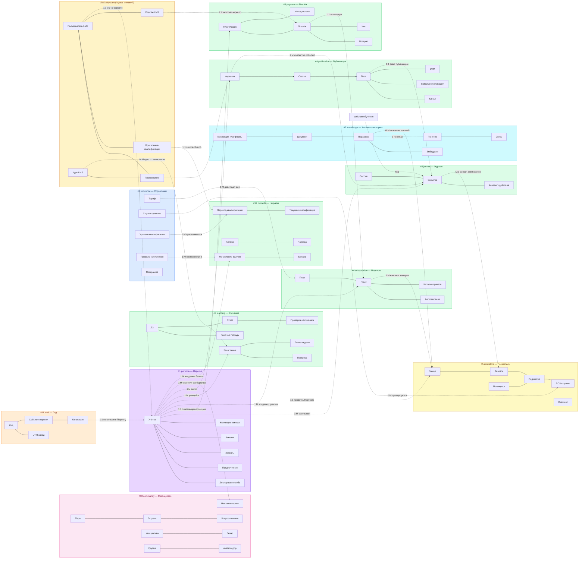

**Легенда цветов кластеров:**
- **Фиолетовый** — Персона (writer = пользователь, owner = Git + Neon projection)
- **Зелёный** — Память.Observed (writer = платформа, событийная)
- **Жёлтый** — Память.Derived (writer = расчётный engine)
- **Розовый** — Relational (связи между персонами)
- **Голубой-светлый** — Catalog/Reference (writer = админ)
- **Голубой-тёмный** — Platform-knowledge (проекция общей онтологии)
- **Оранжевый-светлый** — Proto-Persona (до Ory)
- **Оранжевый-тёмный** — Legacy external (LMS Aisystant)

**Легенда кратностей** (ER-стиль): **1:1** (один-к-одному), **1:M** (один-ко-многим), **M:1** (много-к-одному), **M:M** (много-ко-многим). Внутри кластера кратности опущены для читаемости — показаны в §3 ERD по каждой БД через нотацию `||--o{`.

</details>

---

<details>
<summary><b>3. ERD по каждой БД</b></summary>

> **Методологическое основание:** `DP.METHOD.040` §1 — концептуальная ER только объекты физ.мира. HD «ER ≠ Физ.схема», «Объект ≠ Отношение» (distinctions.md). Детальная физ.схема с колонками, типами и FK **[документ не создан, планируется в WP-253 Ф2 как `DP.ARCH.004-physical-schema.md`]**. Не показаны: `*_log`, `*_cache`, `*_state`, `*_snapshot`, `*_staging`, промежуточные M:N без атрибутов.

### 3.1 #1 persona — Персона

**Категория WP-257:** Персона. **Writer:** пользователь через любой интерфейс (VS Code, бот, веб, CLI) + personal-indexer (эмбеддинги PACK-personal и DS-my-strategy Git-репо). **Owner:** Git пользователя, Neon хранит проекцию.

**BC:** Personal Declaration & Personal Knowledge Projection.

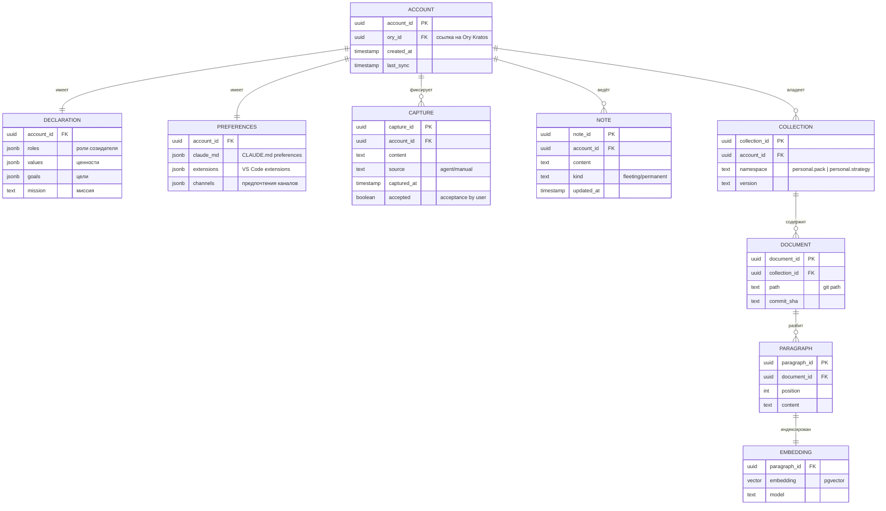

**Инвариант:** каждая запись в `account` соответствует одной записи в Ory Kratos (1:1 через `ory_id`). Удаление учётки в Neon ≠ удаление в Ory (Ory — внешняя система, см. Д1).

**Проекции:** таблицы `document`/`paragraph`/`embedding` — проекции Git-репо пользователя, rebuildable при `git pull` + reindex.

### 3.2 #2 journal — Журнал

**Категория WP-257:** Память.Observed. **Writer:** единый event-коллектор (бот, веб, VS Code, CLI шлют события через gateway). **Owner:** Neon.

**BC:** User Actions Event Stream.

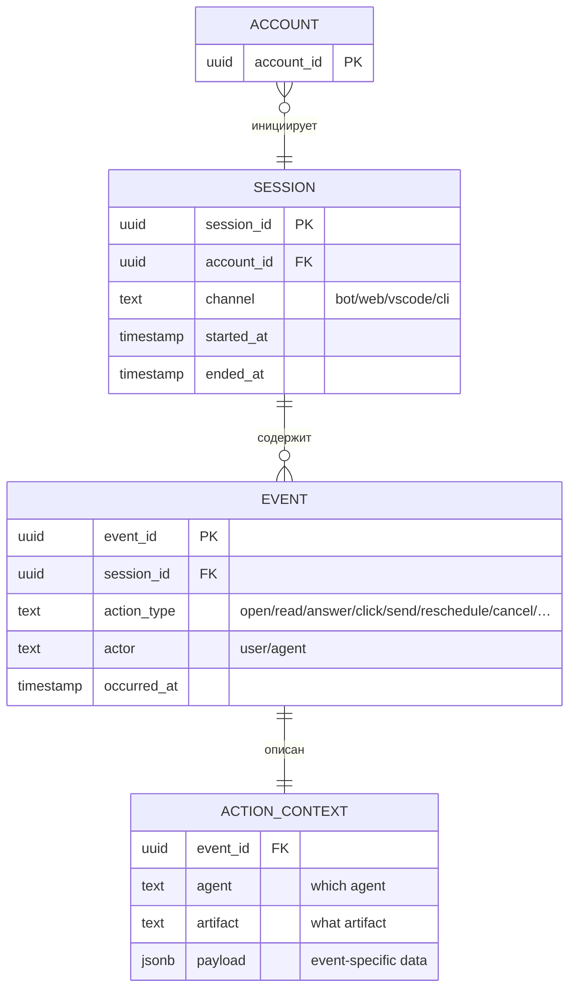

**Инвариант:** только-добавление — запись события не редактируется после создания (`action_context.payload` jsonb допускает обогащение метаданными, но не пересчёт факта). Хранение: 90 дней в горячем пути, архив в холодном хранилище по политике §7.

**Физ.объекты:** запись события с `action_type` (О); сессия (О). `action_context` — денормализация атрибутов события (агент, артефакт, payload), не самостоятельный физ.объект.

**Связи кросс-БД:** события из `#6 learning`, `#9 publication`, `#11 lead` могут проецироваться как `EVENT` в `#2 journal` через outbox-pattern (для единой ленты действий пользователя).

**Migrated 2026-04-29 (WP-268 Phase 3 Block 2):** legacy таблицы `qa_history` (1064 rows, PII Q&A текст) + `feedback_triage` (FK к qa_history, 0 rows на момент cut-over) перенесены из `platform.public` в `journal.public`. Бот (`aist_pilot_me`/`aist_me_bot`) пишет/читает через `JOURNAL_URL` env + `get_journal_pool()`. **Tech debt:** структура qa_history/feedback_triage остаётся «как было» (не нормализована в `EVENT`/`ACTION_CONTEXT` модель §3.2 ER). Нормализация — отдельный РП после стабилизации (≥W19), приоритет средний.

### 3.3 #3 payment — Платёж

**Категория WP-257:** Память.Observed. **Writers:** billing-webhook (ЮKassa, Telegram Stars), админ через Directus, payout-engine (расщепление входящих платежей на доли получателей + исходящие выплаты). **Owner:** Neon.

**BC:** Billing — приём платежей от пользователей, расщепление дохода и выплаты партнёрам (автор руководства, наставник потока, маркетинг, МИМ, иные получатели).

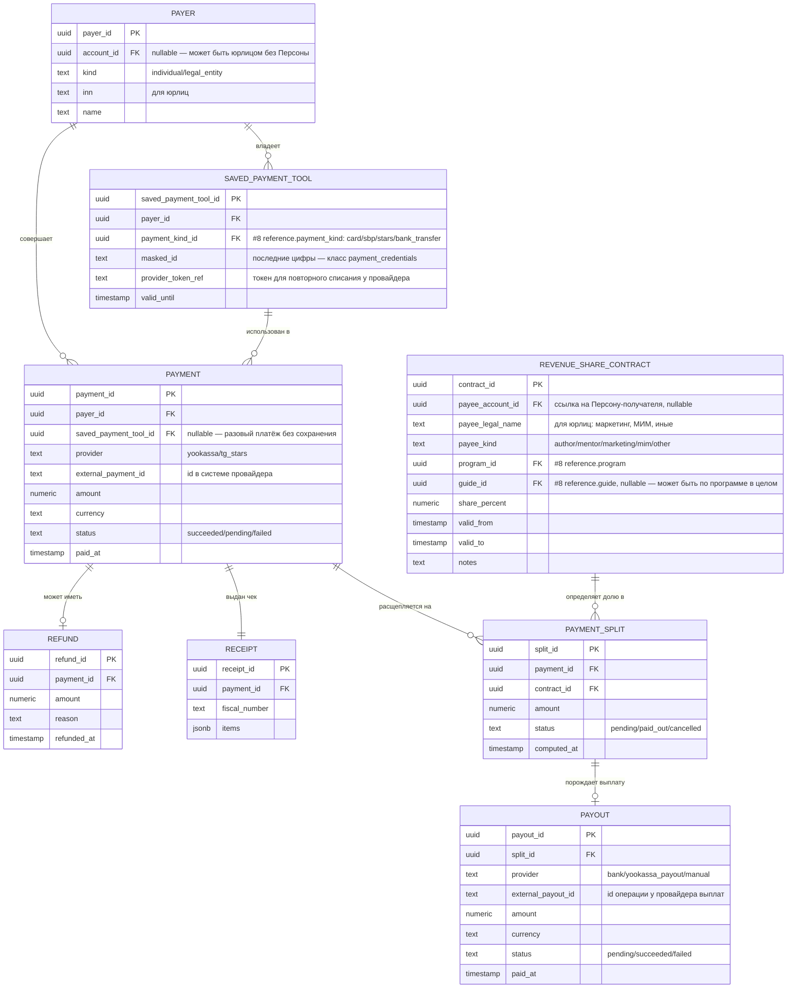

**Инвариант плательщика:** `PAYMENT.payer_id` — не `account_id` напрямую (плательщик ≠ Персона 1:1; юрлицо может оплачивать за сотрудника-ученика). Связь с Персоной — через `PAYER.account_id` (nullable).

**Инвариант расщепления:** для одного входящего `PAYMENT` сумма всех `PAYMENT_SPLIT.amount` ≤ `PAYMENT.amount` (остаток = бюджет МИМ по умолчанию или явно указанный получатель). Правила берутся из `#8 reference.revenue_share_rule` (шаблон по (program_id, guide_id)) + override через конкретный `REVENUE_SHARE_CONTRACT`.

**Инвариант выплаты:** `PAYOUT` создаётся только из `PAYMENT_SPLIT` со статусом `pending`. После успешной выплаты — `split.status = paid_out`, `payout.status = succeeded`. Одна `PAYOUT` закрывает ровно один `PAYMENT_SPLIT` (один-к-одному).

**Класс чувствительности:** `SAVED_PAYMENT_TOOL.masked_id` и `SAVED_PAYMENT_TOOL.provider_token_ref` = `payment_credentials` (строже PII — см. HD «PII ≠ payment_credentials»). Логирование строго запрещено, хранение только зашифрованным.

**Физ.объекты:** плательщик (О); платёж (О); возврат (О); сохранённое средство оплаты (О); чек (О); партнёрство по доходу (О); расщепление платежа (О); выплата (О). Вид способа оплаты (`payment_kind`) — классификатор (К) в `#8 reference`.

**Примечание (открытый вопрос):** контракты распределения дохода (`REVENUE_SHARE_CONTRACT`) пересекаются с ролевой моделью PACK-MIM (Портной / Оценщик / Наставник). Финальные имена колонок и границы с `#10 community.mentorship` (где фиксируется назначение наставника потоку) уточняются после WP-257 Ф5 (расщепление `DP.ARCH.003`). См. §10.8.

### 3.4 #4 subscription — Подписка

**Категория WP-257:** Память.Observed. **Writer:** subscription-service (создание контрактов, продление, отмена, пауза); WP-270 multi-domain-projection-worker (UPSERT по событию `subscription_granted` через cross-DB lookup). **Owner:** Neon.

**BC:** Subscription Rights & Lifecycle.

> **Терминологический apply (28 апр 2026):** в реальном DDL (`mvp/009-subscription-schema.sql`) таблицы называются `contract` и `contract_event` (не `grant`/`grant_history`, как в исходной v2.0 ER). Исторический термин «грант подписки» в текстах сохранён как синоним для читаемости, но canonical имена в коде — `contract` / `contract_event`. Drift между Pack ER (v2.0-2.4) и реальным DDL устраняется этим apply.

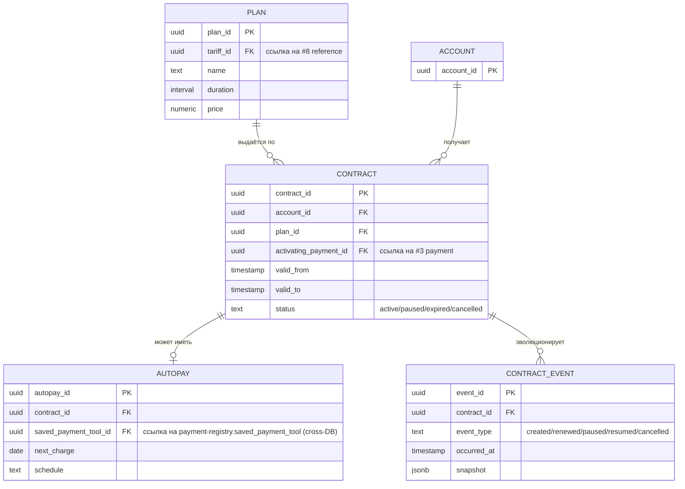

**Инвариант:** у одного `account_id` может быть несколько активных контрактов (семейный тариф, gift-подписки), но только один `primary` на каждый тип программы (ЛР/РР). Период `[valid_from, valid_to)` — полуоткрытый.

**Физ.объекты:** контракт подписки (О, исторический термин — «грант»); автосписание (О); тарифный план — подкласс тарифа из `#8 reference.tariff` с конкретным сроком и ценой (О). `contract_event` — audit-trail изменений контракта, журнальная таблица, самостоятельным физ.объектом не считается.

### 3.5 #5 indicators — Показатели

**Категория WP-257:** Память.Derived. **Writer:** Портной-engine (расчёт baseline, potential, индикаторов, RCS-ступени, проекций). **Owner:** Neon.

**BC:** Derived User Profile (было «ЦД» в v1).

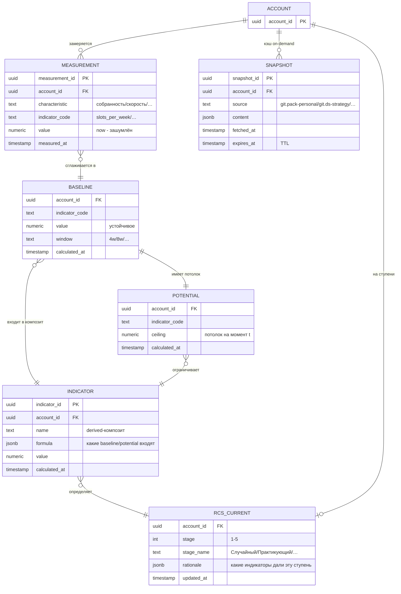

**Инвариант:** `BASELINE.value` — результат расчёта по окну `MEASUREMENT.value` (скользящее среднее/медиана); `POTENTIAL.ceiling` — не мгновенное, а целевой уровень с учётом фундаментального развития (годы). `RCS_CURRENT.stage` — derived-проекция из `INDICATOR` (не writable снаружи Портного).

**Решение WP-257 Ф2:** таблица называется `rcs_current` (не `stage`), чтобы не путалась с уровнем квалификации в `#12 rewards.qualification_current` (разные шкалы, разные писатели). См. HD «Характеристика ≠ Показатель ≠ Значение ≠ Потенциал».

**SNAPSHOT — кэш on-demand:** Портной не должен лазить в Git пользователя каждый расчёт. `SNAPSHOT` = кэш pull-данных из Git с TTL. При просрочке → invalidate → повторный запрос.

**Физ.объекты:** замер характеристики (О) — одно измерение `MEASUREMENT`; снапшот декларации (О) — один `SNAPSHOT` на момент времени. `BASELINE`, `POTENTIAL`, `INDICATOR`, `RCS_CURRENT` — derived-проекции (С), не самостоятельные физ.объекты, а результат расчёта Портного по `MEASUREMENT` и `SNAPSHOT`. См. HD «Характеристика ≠ Показатель ≠ Значение ≠ Потенциал».

### 3.6 #6 learning — Обучение

**Категория WP-257:** Память.Observed + Derived. **Writer:** learning-service, наставники через Directus, scheduler лент/дайджестов. **Owner:** Neon.

**BC:** Learning Progress & Mentorship Workflow (IWE-программы ЛР/РР/МР с вертикальным каталогом руководств; персональное руководство — опциональная надстройка из `#1 persona`).

**Архитектура контента:** Программа (каталог в `#8 reference`) содержит вертикальный каталог **руководств** — единая методология для всех учеников программы. Ученик зачислен в программу, проходит активное руководство по неделям. Персональное руководство (опция, WP-245) — Git-репо пользователя, дополняет или замещает каталожное руководство, проекция через `#1 persona.COLLECTION`. Традиционный каталог и персонализация сосуществуют.

**Источник паттернов:** `#6 learning` — реализация новой архитектуры (BC-aligned, events в `#2 journal`, derived-показатели в `#5`). Из монолита LMS Aisystant (старая архитектура ШСМ) **заимствуются проверенные паттерны**: COURSEPASSING → `ENROLLMENT`, SECTIONPASSING → прогресс по неделе, TASKANSWER → `ANSWER` + `MENTOR_REVIEW`, роль наставника, формальная квалификация. IWE — первая реализация новой архитектуры, наполняется с нуля IWE-программами (ЛР/РР/МР). После стабилизации IWE запускается миграция ШСМ с LMS на ту же архитектуру (см. §3.13, §10.7).

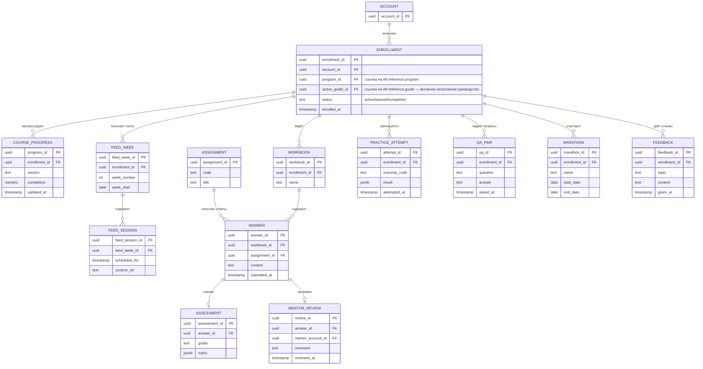

**Инвариант:** `MENTOR_REVIEW.mentor_account_id` ссылается на `ACCOUNT` с активным `MENTORSHIP` в `#10 community` (наставник — это роль, не атрибут учётки). `ENROLLMENT.active_guide_id` должен принадлежать каталогу `program_id` (consistency check через `#8 reference.guide.program_id`).

**Физ.объекты:** зачисление в программу (О); рабочая тетрадь (О); ответ на задание (О); проверка наставником (О); попытка тренажёра (О); диалог Q&A (О); марафон (О); отзыв ученика (О); лента недели (О) + сессия ленты (О). `COURSE_PROGRESS` — derived-проекция (С): вычисляется из ответов, проверок и попыток, не самостоятельный физ.объект. Оценка (`ASSESSMENT`) — запись решения экзаменатора (О).

**Legacy source:** таблицы `COURSE_PROGRESS`, `WORKBOOK`, `ANSWER` во время миграции читают из LMS Aisystant через bridge (`coursepassing`/`taskanswer`), до WP-254 Ф5.

### 3.7 #7 knowledge — Знание-платформы

**Категория WP-257:** Platform-knowledge (projection). **Writer:** knowledge-mcp индексатор (читает платформенные Pack Git-репо и эмбеддит). **Owner:** Neon (как проекция Git).

**BC:** Platform Ontology Projection.

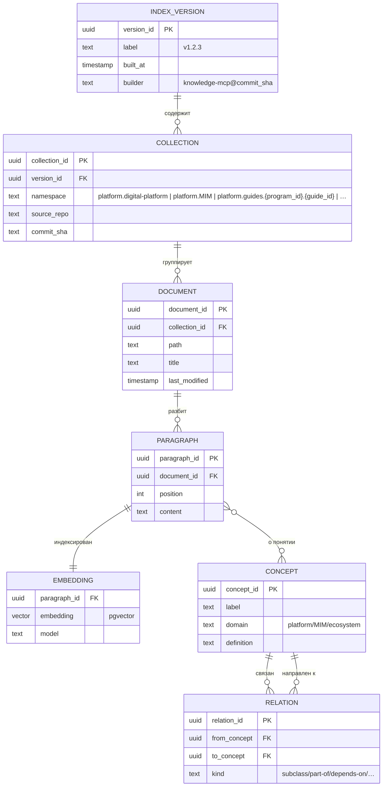

**Инвариант:** `COLLECTION.namespace` префиксом отделяет платформенные коллекции (`platform.*`) от личных (`personal.*` — живут в `#1 persona`). Переиндексация новой `INDEX_VERSION` не ломает активные запросы (старая версия доступна до переключения).

**Физ.объекты:** `#7` — проекция, не владелец фактов. Самостоятельных физ.объектов нет: `DOCUMENT`/`PARAGRAPH` — snapshot Git-файла (writer = индексатор), `EMBEDDING` — derived (С), `CONCEPT`/`RELATION` — извлечённая онтология. Физ.объект руководства (О) — метаданные в `#8 reference.guide`; тело руководства — Git-репо автора, а в `#7` проецируется в namespace `platform.guides.{program_id}.{guide_id}`.

**Concept graph:** 3503 рёбер / 1180 понятий / 344 переведено — актуальная статистика на 22 апр 2026 (WP-242).

### 3.8 #8 reference — Справочник

**Категория WP-257:** Catalog/Reference. **Writer:** админ через Directus (редкие правки, source-of-truth = реестры + решения Методсовета). **Owner:** Neon.

**BC:** Platform Reference Data.

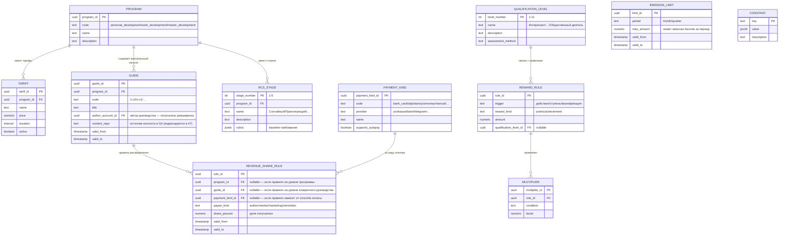

**Инвариант:** справочник обновляется редко и только админом. Все таблицы имеют `valid_from` / `valid_to` для историзации (temporal validity как перпендикулярный атрибут, WP-257).

**`REVENUE_SHARE_RULE` — правила scope resolution** (каскад от специфичного к общему):
1. Для входящего платежа определяется тройка `(program_id, guide_id, payment_kind_id)` из контракта.
2. Применяется самое специфичное активное правило (не-NULL по всем трём ключам).
3. Если нет — ищется правило с `payment_kind_id=NULL` (любой способ оплаты, специфичное руководство).
4. Если нет — правило с `guide_id=NULL` (любое руководство программы).
5. Если нет — правило с `program_id=NULL` (платформенный дефолт).
6. Сумма `share_percent` по выбранному уровню должна равняться 100 (проверка на уровне админки Directus, не CHECK-constraint, чтобы не блокировать временные состояния миграции). Правила разных уровней не смешиваются — выбирается один уровень целиком.

**Физ.объекты:** программа (О); тариф (О); руководство (О — единица ревшеринга и методологии); вид платежа (К — справочник способов оплаты); правило распределения дохода (О — договор ревшеринга платформы с получателем); лимит эмиссии (О — управленческое решение Методсовета по балльной эмиссии за период); ступень RCS (К); уровень квалификации (К); правило награды (О — решение Методсовета); множитель (К); константа (К). Справочные классификаторы (К) — читаются многими системами, writable только админом через Directus.

### 3.9 #9 publication — Публикации

**Категория WP-257:** Память.Observed. **Writer:** content-pipeline (создание → публикация → каналы). **Owner:** Neon.

**BC:** Content Publishing Pipeline.

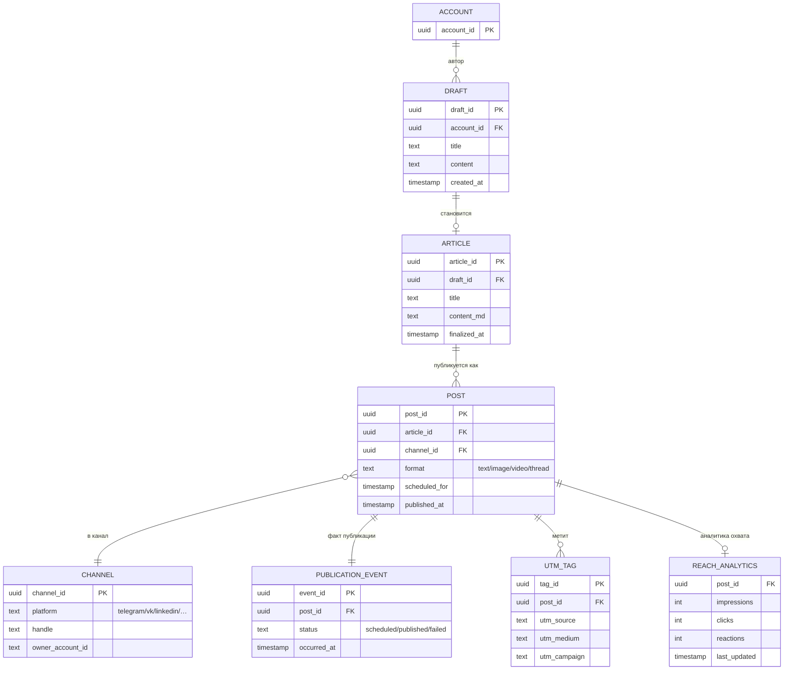

**Инвариант:** `ARTICLE.draft_id` — 1:1 с черновиком после финализации. `POST` может иметь несколько публикаций одного `ARTICLE` в разные каналы (мультиканальный publisher, WP-129).

**Физ.объекты:** черновик (О); статья (О — финализированный авторский артефакт); пост (О — экземпляр публикации в канале); канал публикации (О — TG-канал/VK-группа как внешняя площадка); факт публикации `PUBLICATION_EVENT` (О — запись успешной/неуспешной публикации); UTM-метка (О — маркер атрибуции). `REACH_ANALYTICS` — derived-проекция (С), агрегат внешней статистики каналов, не самостоятельный физ.объект.

### 3.10 #10 community — Сообщество

**Категория WP-257:** Relational (связи Persona↔Persona). **Writer:** matching-engine (Random Coffee), mentorship-service, referral-tracker, учёт амбассадорств, event-organizer, initiative-coordinator. **Owner:** Neon.

**BC:** Community Relations & Mutual Support.

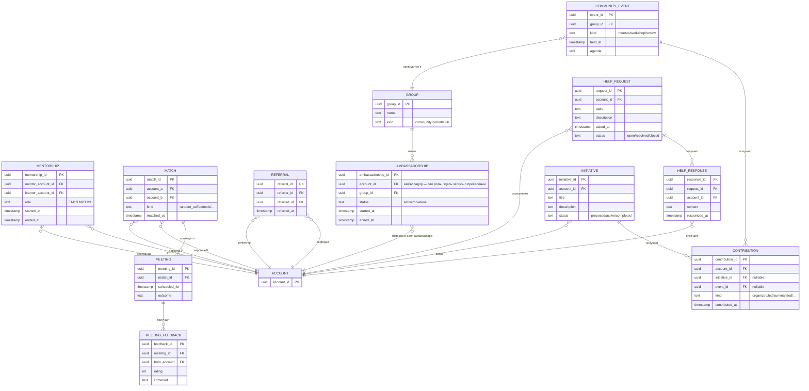

**Инвариант:** `MENTORSHIP.mentor_account_id` — это `ACCOUNT`, у которого есть активный `GRANT` на роль наставника (право проверять ДЗ), подтверждаемое через Keto policy. `MATCH` не превращается в `MEETING` автоматически — нужно действие пользователя (accept).

**Физ.объекты:** наставничество (О — присвоение роли наставника к связке наставник-ученик); мэтч (О — результат работы matching-engine); встреча (О); обратная связь по встрече (О); реферальство (О); амбассадорство (О — присвоение роли амбассадора в группе); группа/клуб/когорта (О); запрос помощи (О); ответ на запрос (О); событие сообщества (О); инициатива (О); вклад в инициативу/событие (О). В `#10` все сущности — это **отношения между персонами** или присвоения ролей (в терминах HD «Система ≠ Роль»): сама Персона живёт в `#1`, здесь — факты связей и ролей.

### 3.11 #11 lead — Лид

**Категория WP-257:** Proto-Persona. **Writer:** landing (форма регистрации), acquisition-funnel (UTM-трекер, веб-аналитика). **Owner:** Neon. **После claim** — учётка переезжает в `#1 persona`.

**BC:** Pre-Ory Acquisition.

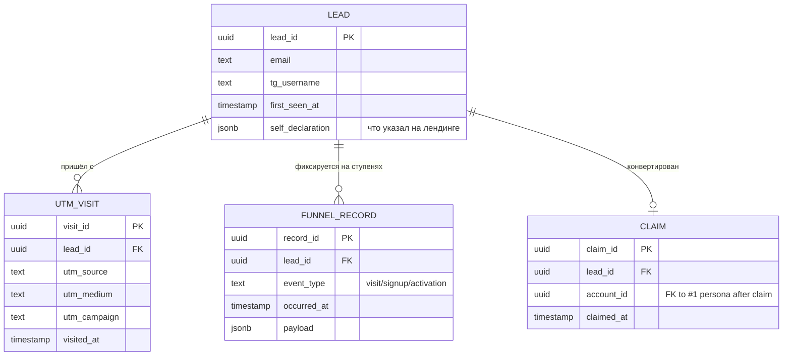

**Инвариант:** `LEAD` существует без `account_id` (до регистрации в Ory). `CLAIM` — одноразовое событие конверсии; после него PII-данные лида мигрируют в `#1 persona.account`, остальное остаётся в `#11` для аналитики воронки.

**Физ.объекты:** лид (О — Proto-Persona, человек до регистрации в Ory); UTM-визит (О — факт посещения с меткой); запись воронки `FUNNEL_RECORD` (О — зафиксированная ступень движения лида, с полем `event_type`, а не имя сущности «событие»); claim (О — факт конверсии лид→учётка).

### 3.12 #12 rewards — Награды

**Категория WP-257:** Память.Observed + Derived. **Writer:** rewards-engine (начисление по правилам из `#8 reference`), Методсовет (присвоение квалификации через Directus). **Owner:** Neon.

**BC:** Points, Achievements, Qualifications.

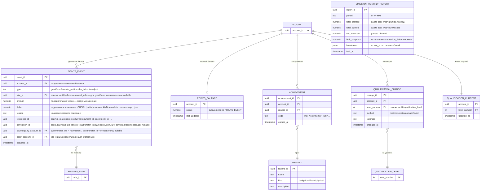

**Инвариант:**
- `POINTS_EVENT` — event-sourcing ledger: бизнес-поля (`type`, `amount`, `delta`, `rule_id`, `reference_id`, `occurred_at`) неизменяемы, никаких UPDATE/DELETE на них. Корректировки проводятся обратным `type=adjust` событием с противоположным знаком `delta`, с `reason` и `actor_account_id`. Допустимое исключение — анонимизация `account_id → NULL` по GDPR-delete (см. §10.9): это UPDATE PII-поля, не бизнес-факта; агрегаты `SUM(delta)` остаются корректными.
- `POINTS_BALANCE` — derived-проекция (С): `SUM(delta)` по `POINTS_EVENT` для `account_id`. Перестраивается триггером или scheduled job; проверяется периодически на консистентность.
- `EMISSION_MONTHLY_REPORT` — derived-проекция (С): агрегат всей эмиссии баллов за месяц + сравнение с лимитом из `#8 reference.emission_limit`. Строится регулярно (например, 1-го числа месяца). Отчёт сохраняется неизменяемым, чтобы Методсовет видел исторические уровни эмиссии. **Матчинг лимита:** `limit_snapshot` = значение `emission_limit.max_amount`, активного на момент **конца периода** `period` (последний день месяца 23:59:59). Если в пределах месяца менялся лимит — фиксируется последний активный; детализация смены — в `breakdown.limit_history`.
- `QUALIFICATION_CURRENT` — проекция (С) последнего `QUALIFICATION_CHANGE`. Перестраивается при каждом change.
- Отличие от RCS-ступени в `#5 indicators.rcs_current`: RCS двигает Портной (расчёт), квалификацию двигает Методсовет (решение).

**Физ.объекты:** событие баланса (О — одна запись ledger); достижение (О — присвоение награды учётке); смена квалификации (О — решение Методсовета или автомат-триггер); награда-приз (К — справочник призов). `POINTS_BALANCE`, `EMISSION_MONTHLY_REPORT`, `QUALIFICATION_CURRENT` — derived-проекции (С). Эмиссия баллов как управленческий факт = множество `POINTS_EVENT` с `type=grant` за период; лимит эмиссии живёт в `#8 reference.emission_limit` (О) как решение Методсовета.

**Списание и просрочка (expire):** механика «сгорания» баллов по времени — политика, определяемая в `#8 reference.reward_rule` (поле `expiry_policy`). Технически реализуется как планировщик, который генерирует `POINTS_EVENT.type=expire` при выполнении условий. Детальная спецификация политики — в WP-246 (см. §10.9).

### 3.13 External: LMS Aisystant (legacy монолит старой архитектуры; цель постепенной миграции)

**Категория WP-257:** вне пользовательской модели (внешняя система, короткий срок). **Writer:** LMS-команда (Дима). **Owner:** отдельная БД LMS (не Neon платформы). **Наше отношение сейчас:** read-only через bridges — зеркалим контекст (прохождения, квалификации, платежи) в `#6`, `#12`, `#3`, `#2` для Портного и истории пользователя.

**BC:** Legacy ШСМ Learning Management — монолит старой архитектуры, где все домены (курсы, пользователи, задания, прохождения, квалификации, платежи, события) смешаны в одной БД. Противоположность BC-aligned подходу новой архитектуры.

**Стратегия миграции (long-term):**
1. **Сейчас (пилот на IWE):** IWE реализует новую арх на 12 БД с нуля. LMS продолжает обслуживать ШСМ. Bridges зеркалят ШСМ-контекст для IWE-пользователей, которые также учатся в ШСМ.
2. **После стабилизации IWE:** запускается миграция ШСМ с LMS монолита на ту же архитектуру. Декомпозиция монолита на BC: курсы → `#6 learning`, платежи → `#3 payment`, квалификации → `#12 rewards`, события → `#2 journal` + `#10 community`.
3. **Best-of-old perserved:** архитектурные паттерны LMS, проверенные годами (наставничество, 11-ступенчатая квалификация Методсовета, COURSEPASSING, TASKANSWER+MENTOR_REVIEW, марафоны, ленты) **сохраняются как паттерны** в новой арх — см. §3.6.
4. **Декомиссия LMS:** после полной миграции ШСМ LMS выводится из эксплуатации. Bridges снимаются.

**Роль в коротком сроке:** source-of-truth для ШСМ-пользователей и исторических данных. `QUALIFICATION_LEVEL_EVENT` — единственный источник квалификаций Методсовета до миграции. Writes блокированы со стороны Neon — только чтение.

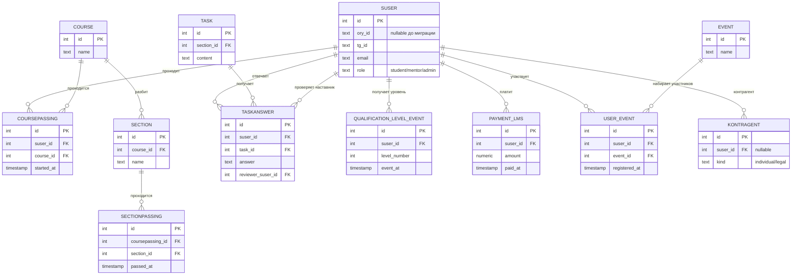

**Роль в миграции:** LMS остаётся source-of-truth до WP-254 (миграция 9 учебных объектов). `QUALIFICATION_LEVEL_EVENT` — единственный source-of-truth квалификаций до эстафеты в `#12 rewards.qualification_change`. Bridge — read-only, writes блокированы.

</details>

---

<details>
<summary><b>4. Связи между БД (межкластерные)</b></summary>

| Связь | От (БД.Объект) | К (БД.Объект) | Кратность | Тип | Комментарий |
|---|---|---|---|---|---|
| Пользовательская идентичность | #1.ACCOUNT.ory_id | Ory Kratos (внешняя) | 1:1 | FK | Persona layer, Д1 |
| Плательщик-Персона | #3.PAYER.account_id | #1.ACCOUNT | M:1 (nullable) | FK | Юрлицо может платить за другого |
| Активация контракта | #3.PAYMENT | #4.CONTRACT | 1:1 | FK | `activating_payment_id` |
| Контракт-Персона | #4.CONTRACT.account_id | #1.ACCOUNT | M:1 | FK | Исторический термин «грант» = `contract` |
| Тариф плана | #4.PLAN.tariff_id | #8.TARIFF | M:1 | FK | Справочник |
| Замер-Персона | #5.MEASUREMENT.account_id | #1.ACCOUNT | M:1 | FK | |
| Контракт → контекст замеров | #4.CONTRACT | #5.MEASUREMENT | 1:M | логическая | Замер имеет смысл в контексте активного контракта |
| Baseline ← события | #2.EVENT | #5.BASELINE | M:1 | агрегация | Портной читает события, пишет baseline |
| RCS-ступень ← справочник | #5.RCS_CURRENT.stage | #8.RCS_STAGE | M:1 | FK | |
| Зачисление-Персона | #6.ENROLLMENT.account_id | #1.ACCOUNT | M:1 | FK | |
| Программа зачисления | #6.ENROLLMENT.program_id | #8.PROGRAM | M:1 | FK | |
| Наставник в проверке | #6.MENTOR_REVIEW.mentor_account_id | #1.ACCOUNT (+ #10.MENTORSHIP) | M:1 | FK + Keto | |
| События обучения → Журнал | #6.* (events) | #2.EVENT | 1:1 | outbox projection | |
| Коллекция платформы | #7.COLLECTION.namespace | PACK-* (Git) | M:1 | проекция | |
| Параграф → Понятие | #7.PARAGRAPH | #7.CONCEPT | M:M | |  |
| Авторство Публикации | #9.DRAFT.account_id | #1.ACCOUNT | M:1 | FK | |
| Событие Публикации → Журнал | #9.PUBLICATION_EVENT | #2.EVENT | 1:1 | outbox | |
| Сообщество-Персона | #10.* | #1.ACCOUNT | M:M | через роли | Mentorship, Match, Ambassador — все через FK |
| Конверсия Лида | #11.CLAIM.account_id | #1.ACCOUNT | 1:1 | FK | После claim |
| Правило начисления | #12.POINTS_EVENT.rule_id | #8.REWARD_RULE | M:1 | FK | nullable для type=transfer/adjust |
| Уровень квалификации | #12.QUALIFICATION_CHANGE.level_number | #8.QUALIFICATION_LEVEL | M:1 | FK | |
| Баланс-Персона | #12.BALANCE.account_id | #1.ACCOUNT | 1:1 | FK | |

### Цветовая схема типов связей

- **FK** — прямая внешнеключевая связь в БД
- **Проекция** — rebuildable данные из другого источника
- **Outbox** — асинхронное копирование события в стрим
- **Агрегация** — writer читает источник, вычисляет, пишет результат
- **Логическая** — смысловая связь, не обязательно enforced на уровне БД (cross-DB)
- **Keto** — авторизация через политики Keto (Ory)

</details>

---

<details>
<summary><b>5. Потоки</b></summary>

### 5.1 Поток идентичности и доступа

От первого касания на лендинге до активной подписки.

```mermaid
sequenceDiagram
    actor User as Посетитель
    participant Landing as Лендинг
    participant Lead as #11 lead
    participant Ory as Ory Kratos
    participant Persona as #1 persona
    participant Pay as #3 payment
    participant Sub as #4 subscription
    participant Keto as Ory Keto

    User->>Landing: visit (UTM)
    Landing->>Lead: UTM_VISIT + LEAD
    User->>Landing: signup form
    Landing->>Lead: FUNNEL_RECORD (signup)
    Landing->>Ory: register identity
    Ory-->>Landing: ory_id
    Landing->>Lead: CLAIM (lead_id → account_id)
    Landing->>Persona: ACCOUNT (с ory_id)
    User->>Pay: оплачивает
    Pay->>Pay: PAYMENT + RECEIPT
    Pay->>Sub: активация CONTRACT (activating_payment_id; исторический термин — «GRANT»)
    Sub->>Keto: policy: user has access
    User->>Keto: request resource
    Keto-->>User: allow/deny
```

### 5.2 Поток событий → Показатели (Память.Observed → Память.Derived)

Как первичные действия превращаются в baseline и RCS-ступень.

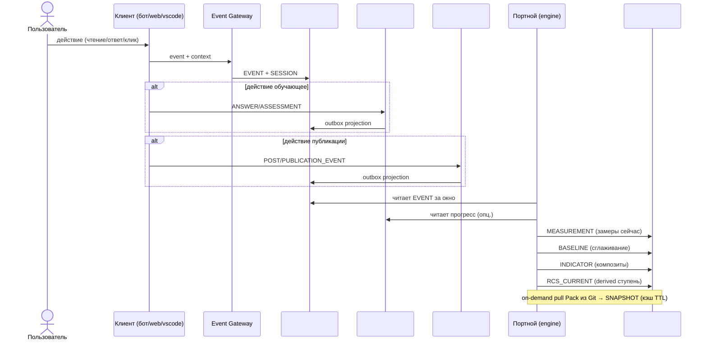

### 5.3 Поток содержания → Публикации

От черновика до многоканальной публикации.

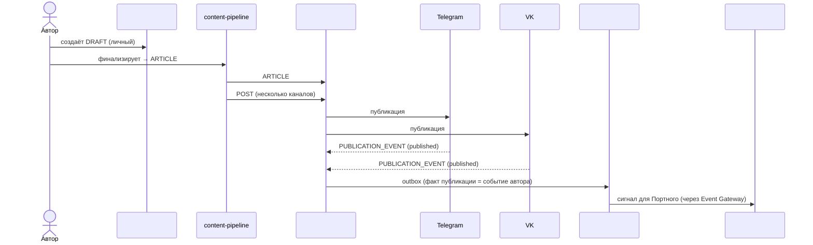

</details>

---

<details>
<summary><b>6. Писатели и читатели по БД</b></summary>


| БД | Пишут | Читают |
|---|---|---|
| #1 persona | пользователь (через VS Code/бот/веб/CLI), personal-indexer | Портной, Навигатор, Оркестратор, все клиент-интерфейсы, knowledge-search |
| #2 journal | event-gateway (от всех клиентов), outbox из #6/#9/#11 | Портной, Аналитика (Metabase view), Navigator |
| #3 payment | billing-webhook (ЮKassa, Stars), admin (Directus) | #4 subscription, отчёты, админка |
| #4 subscription | subscription-service | gateway-mcp (проверка прав), Keto (policy), бот, Персона flow |
| #5 indicators | Портной-engine | Навигатор, Оркестратор, Диагност, бот (progress bar), Оценщик |
| #6 learning | learning-service, Directus (наставники), scheduler | бот (ленты), Портной (сигналы), Metabase |
| #7 knowledge | knowledge-mcp indexer | gateway-mcp, все агенты (retrieval), content-pipeline |
| #8 reference | admin (Directus) | все сервисы, которые используют константы/тарифы/квалификации |
| #9 publication | content-pipeline | бот (анонсы), аналитика охвата, auth-proxy к каналам |
| #10 community | matching-engine, mentorship-service, referral-tracker, event-organizer | бот (анонсы встреч), Metabase, Навигатор |
| #11 lead | landing, acquisition-funnel | marketing analytics, Директор-УС (CRM), админка |
| #12 rewards | rewards-engine, Методсовет (Directus) | бот (баланс, ачивки), Персона (статус), публикации, Navigator |

</details>

---

<details>
<summary><b>7. Что осталось вне Neon (и почему)</b></summary>


| Не БД Neon | Причина | Где живёт |
|---|---|---|
| **Activity Hub (старый)** | был контейнер-смесь, не домен (Д11: событие ≠ хранилище) | распущен между #2/#3/#9/#11/#12 |
| **Health / Uptime** | SaaS закрывает задачу (Д2) | Better Uptime / Statuspage.io |
| **Metabase** | аналитический инструмент, не домен (Д2) | поверх #1-#12 через read-replica |
| **Ory identity** | внешняя система (Д1) | Ory Kratos, у нас только `ory_id` FK |
| **Ory Keto policies** | внешняя система | Ory Keto, у нас ссылки на relation_tuples |
| **FSM-state бота, message cache** | runtime-состояние, ephemeral | Redis / in-memory |
| **Pack пользователя (PACK-personal)** | Git пользователя, не Neon | GitHub, проекция → #1 |
| **Pack платформы (PACK-digital-platform, PACK-MIM, ZP, FPF, SOTA)** | Git команды, не Neon | GitHub, проекция → #7 |
| **On-demand pull Pack-состояния** | слой «Контекст» WP-257, runtime-сборка | не хранится; кэш → #5 `snapshot` |
| **LMS Aisystant** | монолит старой архитектуры (BC не разделены), на нём работает ШСМ; в переходный период IWE читает из него через bridges | отдельная БД LMS, read-only bridge в #6/#12/#3/#2; цель — постепенная миграция ШСМ на новую арх после стабилизации IWE |
| **Langfuse traces** | observability SaaS | Langfuse cloud |
| **WakaTime activity** | 3rd-party tracking | WakaTime cloud, pull → #2 journal (projection) |

</details>

---

<details>
<summary><b>8. Миграция 9 → 12 БД (эстафета в WP-253)</b></summary>


Планируется в **WP-253 (DP.ROADMAP.001)** — мастер-план фаз с gating-критериями. WP-228 Ф25 утверждает целевую карту, WP-253 Ф1 строит фазы.

### 8.1 Таблица переходов

| Текущая БД (9) | Целевая БД (12) | Действие | Зависимость РП |
|---|---|---|---|
| `platform` (#1 в v1) | Персона #1 + Подписка #4 + Справочник #8 | расщепить по writer/owner | WP-227, WP-253 |
| `knowledge` (#2 в v1) | Персона #1 (личные коллекции) + Знание-платформы #7 (платформенные) | расщепить по владельцу | WP-187 |
| `activity-hub` (#3 в v1) | Журнал #2 + Публикации #9 + Лид #11 + Награды #12 | распустить (Д11) | WP-253 |
| `payment-registry` (#4 в v1) | Платёж #3 + Награды #12 (баллы) | расщепить | WP-246 |
| `digital-twin` (#5 в v1) | Показатели #5 | переименовать (v1 → canonical) | WP-227 |
| `aist-bot` (#6 в v1) | Обучение #6 + Журнал #2 (events) + runtime (FSM → Redis) | расщепить по слоям | WP-254 |
| `metabase` (#7 в v1) | — | убрать (Д2, read-replica над другими) | WP-244 |
| `health` (#8 в v1) | — | убрать (Д2, внешний SaaS) | WP-244 |
| `content-pipeline` (#9 в v1) | Публикации #9 | переименовать | WP-155 |
| (новая) | Сообщество #10 | создать (extract из PMB-1 + WP-256) | WP-256 |
| (новая) | Лид #11 | создать (extract из v1 #3/#4) | WP-188 |
| (новая) | Награды #12 | создать (консолидация баллов + ачивок + квалификаций) | WP-253 |

### 8.2 Порядок миграции (ориентировочно)

1. **Подготовка** — DP.ROADMAP.001 (WP-253 Ф1): утвердить целевые имена, проверить занятость имён в Neon, подготовить DDL.
2. **Низкорискованные переименования** — `digital-twin → indicators`, `content-pipeline → publication` (WP-155 / WP-227).
3. **Расщепление `platform`** — вынести Подписку и Справочник в отдельные БД (WP-253 Ф2).
4. **Расщепление `knowledge`** — личные коллекции в #1, платформенные в #7 (WP-187).
5. **Роспуск `activity-hub`** — outbox projections в #2, #9, #11, #12.
6. **Миграция `aist-bot`** — учебные объекты → #6 learning (WP-254), runtime FSM → Redis.
7. **Создание новых БД** — #10 community (WP-256), #11 lead, #12 rewards.
8. **Снятие лишних** — вывести из production `metabase` DB, `health` DB.

### 8.3 Gating-критерии (уточняются в WP-253 Ф1)

Каждая фаза завершается, только если:
- DDL применён без потери данных (`COUNT` до/после совпадают)
- Все зависимые сервисы читают новую БД (env vars + code updated)
- Retention и PII-классификация соблюдены (WP-212 B7.3)
- Roll-back план задокументирован

</details>

---

<details>
<summary><b>9. Верификация (три чеклиста)</b></summary>


### 9.1 Чеклист SPF.SPEC.005 — выбор БД

Применение B.0 + B1-B4 + N1-N5 к каждой из 12 БД. Все клетки должны быть `✅` или `-` (не применимо).

| БД | B.0 категория | B1 единый writer-owner | B2 свой инвариант | B3 blast-radius | B4 свой словарь | N1 noun-area | N2 central entity | N3 no tech markers | N4 RU concept | N5 lowercase |
|---|---|---|---|---|---|---|---|---|---|---|
| #1 persona | Персона ✅ | пользователь ✅ | Git ↔ Neon consistency ✅ | ✅ независима | словарь Персоны ✅ | persona ✅ | ACCOUNT ✅ | ✅ | Персона ✅ | ✅ |
| #2 journal | Память.Observed ✅ | event-gateway ✅ | только-добавление ✅ | ✅ deletable | события ✅ | journal ✅ | EVENT ✅ | ✅ | Журнал ✅ | ✅ |
| #3 payment | Память.Observed ✅ | billing-webhook ✅ | идемпотентность платежей ✅ | ✅ (queue on outage) | биллинг ✅ | payment ✅ | PAYMENT ✅ | ✅ | Платёж ✅ | ✅ |
| #4 subscription | Память.Observed ✅ | subscription-service ✅ | период-FK к контракту ✅ | ✅ cached JWT | подписка ✅ | subscription ✅ | CONTRACT ✅ | ✅ | Подписка ✅ | ✅ |
| #5 indicators | Память.Derived ✅ | Портной ✅ | rebuildable из #2 ✅ | ✅ (Портной = single writer) | показатели ✅ | indicators ✅ | INDICATOR ✅ | ✅ | Показатели ✅ | ✅ |
| #6 learning | Память.Observed+Derived ⚠️ (множественные writers) | learning-service + mentors ⚠️ | наставник-ученик целостность ✅ | ✅ degraded OK | обучение ✅ | learning ✅ | ENROLLMENT ✅ | ✅ | Обучение ✅ | ✅ |
| #7 knowledge | Platform-knowledge ✅ | knowledge-mcp indexer ✅ | Git ↔ эмбеддинг consistency ✅ | ✅ stale OK | онтология ✅ | knowledge ✅ | CONCEPT ✅ | ✅ | Знание-платформы ⚠️ (составное имя) | ✅ |
| #8 reference | Catalog ✅ | admin (Directus) ✅ | temporal validity ✅ | ✅ read-heavy | справочник ✅ | reference ✅ | PROGRAM/TARIFF ✅ | ✅ | Справочник ✅ | ✅ |
| #9 publication | Память.Observed ✅ | content-pipeline ✅ | pipeline draft→article→post ✅ | ✅ retry safe | публикации ✅ | publication ✅ | POST ✅ | ✅ | Публикации ✅ | ✅ |
| #10 community | Relational ✅ | matching+mentorship+events ⚠️ (множественные) | симметричность связей ✅ | ✅ degraded OK | сообщество ✅ | community ✅ | MENTORSHIP/MATCH ✅ | ✅ | Сообщество ✅ | ✅ |
| #11 lead | Proto-Persona ✅ | landing+funnel ✅ | pre-Ory identity ✅ | ✅ standalone | лид ✅ | lead ✅ | LEAD ✅ | ✅ | Лид ✅ | ✅ |
| #12 rewards | Память.Observed+Derived ⚠️ | rewards-engine + Методсовет ⚠️ | баланс = Σ delta ✅ | ✅ (stale OK) | награды ✅ | rewards ✅ | POINTS_EVENT ✅ | ✅ | Награды ✅ | ✅ |

**Замечания:**
- **#6, #10, #12 — множественные writers.** По B1 строго требуется один семантический writer. Здесь принято сознательное решение: `#6 learning` имеет один BC «Learning Progress», внутри которого writer'ы делят разные аспекты (learner пишет ANSWER, mentor — REVIEW, scheduler — FEED_WEEK); аналогично `#10` и `#12`. Альтернатива — расщеплять каждый на 2-3 БД — признана преждевременной (Post-MVP decision).
- **#7 N4 составное имя** — «Знание-платформы» через дефис. N5 lowercase `knowledge` — ок. Альтернатива «Онтология» отвергнута (размывает: онтология включает и личную).

### 9.2 Замечания Андрея Д1-Д12 (Ф24 ревью 21 апр)

| # | Замечание | Где учтено в 12 БД |
|---|---|---|
| **Д1** | Очистить ядро Platform Core: Созидатель + права доступа (Ory — внешняя) | #1 persona = только декларация + preferences; Ory = `ory_id` FK, никаких собственных identity-таблиц |
| **Д2** | Убрать Health и Metabase из Neon | §7 — выведены на SaaS / read-replica |
| **Д3** | Субагент-исследование кода LMS Димы | §3.13 LMS ERD + bridge-контракт в §8 |
| **Д4** | Payment: плательщик, платёж, начисление, получатель, тарифы, методы оплаты + баллы | #3 payment (плательщик/платёж/метод/чек) + #12 rewards (баллы) + #8 reference (тарифы) + #4 subscription (получатель через грант). Расщеплено вместо одной «перегруженной» payment-registry |
| **Д5** | Knowledge универсальный: коллекция/документ/chunk отделены от concept/мем | #7 knowledge ERD: `COLLECTION → DOCUMENT → PARAGRAPH → EMBEDDING` отделено от `CONCEPT ↔ RELATION`. Личные коллекции — в #1 persona с той же структурой |
| **Д6** | Digital Twin: +пользователь, +квалификация, проверить JSON-модель | #5 indicators с явным `account_id` FK на все замеры; квалификация вынесена в #12 (по HD: квалификация — формальное присвоение, не замер) |
| **Д7+Д8+Д9** | Связи между ОБЪЕКТАМИ (не кластерами) + кратности + названия | §2 карта — все межкластерные стрелки object→object с кратностями 1:1/1:M/M:1/M:M и подписями; §4 таблица связей |
| **Д10** | Ревизия «объект ≠ атрибут» (множитель квалификации, уровень и т.п.) | §3 ERD — все ранее-ошибочные узлы свёрнуты в атрибуты (множитель — колонка `factor` в #8.MULTIPLIER, текущий уровень — derived в #12.QUALIFICATION_CURRENT) |
| **Д11** | Activity Hub: базовый объект «событие» | `activity-hub` БД распущен; central object «СОБЫТИЕ» живёт в #2 journal, узкие типы событий — в #9/#11/#12 outbox-проекциями |
| **Д12** | Созвон с Димой: Payment + LMS (какие объекты нужно отразить) | §3.13 LMS ERD отражает 10+ физ.объектов LMS; WP-228 Ф24 lms-audit — отдельный документ. Bridge-чекпоинт в §8 |

**Все 12 правок Андрея учтены.**

### 9.3 Полнота по категориям WP-257

| Категория WP-257 | Покрыто | Комментарий |
|---|---|---|
| **Персона** (writer=пользователь, owner=Git) | ✅ #1 persona | Центральная БД пользователя; Git-проекция индексируется в Neon |
| **Память.Observed** (writer=платформа, event-based) | ✅ #2 #3 #4 #9 | Журнал как универсальный event-stream; домен-специфичные события в #3/#4/#9 |
| **Память.Derived** (writer=engine, расчётный) | ✅ #5 | Портной владеет всеми расчётами (RCS, baseline, potential, индикаторы) |
| **Память.Observed+Derived** (смешанные writers) | ⚠️ #6 #12 | #6 learning и #12 rewards имеют наблюдаемые (ответ, платёж) и расчётные (оценка, квалификация) таблицы вместе — сознательное решение, BC един |
| **Platform-knowledge** (проекция онтологии) | ✅ #7 | knowledge-mcp индексирует платформенные Pack; личные — в #1 |
| **Catalog/Reference** (writer=admin) | ✅ #8 | Тарифы, ступени, уровни квалификации, правила |
| **Relational** (связи Persona↔Persona) | ✅ #10 | Полный цикл: matching → поддержка → события → развитие |
| **Proto-Persona** (до Ory) | ✅ #11 | Лид → claim → Персона |
| **Service/Ops** | ❌ 0 БД | Вынесено на SaaS (Д2) |
| **Контекст** (runtime, не хранится) | ❌ не БД | Runtime промпт-сборка, кэш on-demand → #5 SNAPSHOT |

**Покрытие полное за вычетом Service/Ops (сознательный отказ Д2) и Контекст (не storage-категория).**

### 9.4 Применённые различения (проверка)

| Различение (HD / distinctions.md) | Где применено в архитектуре |
|---|---|
| Персона ≠ Память ≠ Контекст (DP.D.052, HD #27) | §1 сводная таблица — категория WP-257 для каждой БД |
| Событие ≠ Хранилище-контейнер (Р-W17-1, Д11) | Activity Hub распущен (§8), `#2 journal.EVENT` — единственное место всех событий |
| Объект ≠ Атрибут (Д10) | Все ERD в §3 — множители/коды/lookup как атрибуты, не узлы |
| Система ≠ Роль (D.141 PD) | `#1.ACCOUNT` = система; mentorship/ambassador в `#10` = роли через связи |
| Характеристика ≠ Показатель ≠ Значение ≠ Потенциал (D.140) | `#5 indicators` — `MEASUREMENT` (значение-сейчас) + `BASELINE` (устойчивое значение) + `POTENTIAL` + `INDICATOR` (композит); `CHARACTERISTIC` определяется в Pack, не в БД |
| RCS-ступень ≠ Уровень квалификации | `#5.RCS_CURRENT` (derived Портным, 5 ступеней) vs `#12.QUALIFICATION_CURRENT` (formal Методсовет, 11 уровней) |
| Объект ≠ Отношение (WP-228 19 апр, Andrey) | ERD показывают только объекты с именами собственными; служебные M:N без атрибутов — на физ.схеме |
| PII ≠ payment_credentials | `#3.SAVED_PAYMENT_TOOL.masked_id` + `provider_token_ref` явно помечены `payment_credentials` — строже PII |
| Рабочий документ ≠ Публикация | `#1.NOTES` + `#1.CAPTURES` (черновое) vs `#9.PUBLICATION_EVENT` (факт публикации) |
| Бесплатный Gateway ≠ Полный Gateway (DP.SC.112) | #1 персональные коллекции доступны подписчикам; #7 платформенные — всем аутентифицированным |
| ER ≠ Физ.схема | §3 — концептуальная ER; физ.схема с индексами/партициями — в WP-253 Ф2 |

**Все ключевые различения применены.**

### 9.5 Легенда маркеров физ.объектов / проекций / ролей / классификаторов

Каждая сущность в картах §3 помечается одним из четырёх маркеров:

| Маркер | Что значит | Примеры |
|--------|-----------|---------|
| **(О)** Объект | Физ.объект домена или зафиксированный факт: у экземпляра можно показать пальцем, дать имя. Writer — система-владелец, запись появляется в ответ на событие физ.мира. | платёж, зачисление в программу, встреча, пост, руководство, правило распределения дохода, событие баллов |
| **(С)** Снимок / проекция | Derived-состояние: вычисляется из событий/объектов. Не самостоятельный факт, а агрегат или кэш. Writer — процессор/scheduler. | `baseline`, `potential`, `rcs_current`, `course_progress`, `points_balance`, `emission_monthly_report`, `qualification_current`, `snapshot` |
| **(Р)** Роль | Функциональное место Персоны в другой системе (HD «Система ≠ Роль»). На ER-диаграмме роль = запись о присвоении, не отдельная сущность. | наставник, амбассадор, автор руководства, учредитель гранта |
| **(К)** Классификатор / справочник | Эталон, редко меняемый словарь. Writer — админ через Directus. Читается многими системами. | `payment_kind`, `rcs_stage`, `qualification_level`, `multiplier`, `constant`, `reward` (тип приза) |

**Правило:** в схеме `erDiagram` помечается сущность в сводной таблице §1. В §3 — в блоке «Физ.объекты:» каждой БД.

**Тест при добавлении новой сущности:** «Можно ли дать экземпляру имя собственное и показать пальцем?» — Да → (О). Нет, это агрегат/кэш? → (С). Нет, это функциональное место Персоны? → (Р). Нет, это справочный эталон? → (К).

</details>

---

<details>
<summary><b>10. Открытые вопросы</b></summary>


### 10.1. Расщепление #6/#10/#12 (множественные writers)

B1 проход `⚠️` у трёх БД. Вопрос: нужен ли follow-up РП по строгой ревизии после MVP? Кандидат: **WP-258-post-mvp-db-split** (Q3 2026) — проанализировать, оправдано ли совмещение писателей, или BC надо расщеплять.

### 10.2. `#7 knowledge` N4 составное имя

«Знание-платформы» через дефис — не идеально по N4 (single-word в русском). Альтернатива «Онтология» отвергнута (включает личную). Текущее решение — записать в name_rationale: «двусоставное имя допустимо, когда русский single-word создаёт онтологический конфликт».

### 10.3. Пакетное переименование БД в prod

Не раньше DONE зависимых WP (WP-155, WP-246, WP-187, WP-254). Требует: DDL migration + env vars update + MCP tool names + bot handlers update. Эстафета — WP-253.

### 10.4. Сервисы Persona / Memory / Projection

Pack-сущности определены (DP.ARCH.005 Persona Entity, DP.ARCH.006 Memory Record, DP.ARCH.007 Projection — WP-257 Ф5, 22 апр 2026, заменили монолитный DP.ARCH.003). Выделение соответствующих runtime-сервисов (persona-mcp / memory-mcp / projection-service) — открытый вопрос реализации, решается в WP-253 мастер-плане по БД + будущих ArchGate.

### 10.5. Retention / GDPR политики

Временные окна для таблиц-журналов только-добавления (`#2.EVENT`, `#9.PUBLICATION_EVENT`, `#11.FUNNEL_RECORD`, `#12.POINTS_EVENT`) не зафиксированы. WP-240 Retention policy — уточнить в Q2.

### 10.6. Plugin API L2 (WP-258)

Как внешние разработчики расширяют Персону и Показатели, не трогая L2 ядро? Design в Q3 (WP-258 из WP-250 Ф-F.4).

### 10.7. Контракт bridges с LMS

LMS Aisystant — монолит **старой архитектуры**, на нём работает ШСМ. Новая архитектура (12 БД, BC-aligned) реализуется **сначала в IWE** как пилот; ШСМ **постепенно мигрирует** на неё после стабилизации IWE. В переходный период — read-only bridges в Neon: прохождения ШСМ → `#6` / `#2`, квалификации Методсовета → `#12`, платежи ШСМ → `#3`. Фиксация контрактов bridges — `DP.ARCH.008-lms-bridge-contracts.md` (WP-254 Ф0; ID сдвинут — DP.ARCH.005/006/007 заняты под Persona/Memory/Projection в WP-257 Ф5).

**План перехода (4 шага):**
1. **Сейчас — пилот на IWE.** Новая архитектура строится сразу на 12 БД Neon. IWE работает как пилотный продукт на новой арх.
2. **После стабилизации IWE — постепенная миграция ШСМ.** Функции ШСМ (курсы, прохождения, ДЗ, наставничество, квалификации) переносятся из LMS в соответствующие BC-БД: `#6 learning`, `#2 journal`, `#12 rewards`, `#3 payment` — с сохранением пользовательского опыта.
3. **Best-of-old preserved.** Проверенные паттерны LMS (COURSEPASSING, SECTIONPASSING, TASKANSWER, формальная квалификация) переносятся как базовые контракты новой арх — см. §3.6 и §3.13.
4. **Декомиссия LMS.** После полной миграции ШСМ и истечения архивного окна — LMS выводится из эксплуатации.

### 10.7.1. Mutual read-only LMS↔Neon transition (WP-268, 26 апр 2026)

> **Решение Tseren от 26 апр 2026.** Расширяет §10.7 (контракт bridges с LMS): помимо чтения LMS из Neon добавляется обратная видимость — LMS получает read-only-доступ к выходам Neon (например, к платежам, принятым от @aist_me_bot через `#3 payment`). Ни одна сторона не пишет в чужую БД.

**Контракт двух систем (mutual read-only + write по доменам):**

| Сторона | Что пишет (writes) | Что читает у соседа (reads) |
|---------|---------------------|------------------------------|
| **Neon (новая)** | свои домены 12 БД: оплаты от @aist_me_bot (`#3`), события Bridge-2 (`#2`+`#6`+`#12`), ЦД calculated (`#5`), персональные коллекции (`#7`), bot события и активности | LMS read-only через Bridge-1 (subscriptions) + Bridge-2 (events): `COURSEPASSING`, `QUALIFICATION_LEVEL_EVENT`, `PAYMENT_LMS`, `USER_EVENT` для зеркалирования в `#6`/`#12`/`#3`/`#2` |
| **LMS Aisystant (legacy)** | свои домены: курсы, прохождения, квалификации Методсовета, исторические платежи ШСМ | Neon read-only views: принятые платежи `#3.PAYMENT` от бота (зеркалятся в `PAYMENT_LMS` для CRM-учёта на стороне ШСМ); статусы подписок `#4.CONTRACT` (видимые в LMS как «активная БР для пользователя X»); квалификации `#12.QUALIFICATION_CHANGE` (зеркало в `QUALIFICATION_LEVEL_EVENT` для непрерывности учёта Методсовета) |

**Ключевой инвариант (БЛОКИРУЮЩИЙ):**

- LMS **НЕ пишет в Neon.** Neon **НЕ пишет в LMS.**
- Единственная связь — read-only views (выделенные read-only роли БД с ограничением WHERE и фильтром PII) + Bridge polling.

**Что меняется относительно v2.3:**

1. §10.7 (контракт bridges) расширен с однонаправленного read «LMS → Neon» на **двунаправленный read** (LMS↔Neon), сохранив ban на cross-write.
2. Снимается **source-of-truth dilemma transition period:** каждая БД остаётся owner своих доменов (никаких перемещений source-of-truth до полной декомиссии LMS). Переход — не cut-over, а «coexistence с двумя владельцами доменов и mutual read-only».
3. Стратегия декомиссии LMS (§10.7 шаг 4) **остаётся в силе как long-term цель**, но не становится pre-condition для запуска новой архитектуры. LMS может сосуществовать с Neon неограниченно долго.

**Технические следствия:**

- **Read-only роли БД:** на стороне LMS — `aisystant_neon_reader` с SELECT на `aisystant.*` (исключая raw PII payloads); на стороне Neon — `lms_aisystant_reader` с SELECT на views `vw_payment_for_lms`, `vw_contract_for_lms`, `vw_qualification_for_lms` (только агрегированные/анонимизированные данные, поля PII фильтруются на уровне view; исторический термин view — `vw_grant_for_lms`, переименован в v2.4.1 28 апр).
- **Account ID mapping:** требуется **lookup-таблица** соответствий `aisystant.suser.id ↔ #1.persona.account_id` (через `ory_id` в LMS `suser` и `traits` в Neon `ory_identity`). Эта таблица — единственный «cross-system bridge» концепт; должна быть либо в `#11 lead.proto_persona` (если Lead и Persona ещё не объединены), либо в `#1 persona.account_external_ref` (как FK к LMS).
- **Bridge-2 events polling** (WP-268 T4) — новый сервис, который реализует чтение `aisystant.user_lessons`/`qualifications` и POST в `event-gateway` /events с idempotency-key `lms-evt-{lms_id}`. Запускается на Railway, cursor в `#6 learning.bridge_cursors`.
- **Reverse-bridge LMS-side polling** (на будущее, в этом WP не реализуется): LMS-сервис может периодически SELECT'ить из Neon read-only views и зеркалить нужное в свои таблицы (`PAYMENT_LMS`, `QUALIFICATION_LEVEL_EVENT`). Дизайн контракта — отдельный артефакт `DP.ARCH.008-lms-bridge-contracts.md` (упомянут в §10.7).

**Что не меняется (для предотвращения путаницы):**

- §3.13 «External: LMS Aisystant» остаётся в категории **External BC** — внешняя система, не часть Neon-архитектуры.
- Long-term цель **декомиссии LMS** сохраняется как gradient (~годы), но без жёстких сроков.
- BC-aligned принцип Neon (database-per-BoundedContext) сохраняется без изменений.

**Решение действительно для:** WP-268 booster (расширение БД до 9 + Bridge-2 backfill); WP-254 (миграция учебных объектов #6); WP-257 Ф5 (Persona/Memory сервисы); WP-250 Ф-F.1 ADR (граница L2/L3, цитирует mutual read-only как пример coexistence с легаси).

**Решение отменяет:** неявное предположение MVP-greenfield-only (ArchGate v3 25 апр), что Neon должна полностью заменить LMS до начала использования. Теперь они coexist'уют на bridges.

### 10.8. Revenue sharing — координация с WP-257 (Persona / Memory / Projection)

Сущности `REVENUE_SHARE_CONTRACT`, `PAYMENT_SPLIT`, `PAYOUT` в `#3 payment` + `REVENUE_SHARE_RULE` в `#8 reference` определяют финансовые обязательства платформы перед получателями (авторы руководств, наставники, маркетинг, бюджет МИМ, прочие). Открытые вопросы:
1. **Получатель = Персона или отдельная сущность «получатель платежа»?** Текущее решение — FK `payee_account_id → #1 persona.account` для физ.лиц и самозанятых, плюс `payee_legal_name` как снимок для юрлиц и ИП без учётки. Ревизия — в WP-257 Ф5 (сервисы Persona / Memory), возможна отдельная сущность `payee_party` в `#1`, если реестр получателей станет многопрофильным.
2. **Сплит на уровне платежа или на уровне периода?** В MVP — per-payment split (каждый входящий платёж расщепляется на N `PAYMENT_SPLIT`). Для месячных аккумуляций и «автоматических» выплат раз в месяц — отдельный механизм агрегации в `PAYOUT`, не на уровне отдельного сплита. Дизайн — в child-WP после WP-253 Ф1.
3. **Кто согласовывает изменение `REVENUE_SHARE_RULE`?** Методсовет или финслужба МИМ? Процедура внесения правки — отдельное решение (не этот документ), фиксируется в SoP ведения справочника.

### 10.9. Expire баллов и retention `POINTS_EVENT`

- **Политика сгорания:** каждое `REWARD_RULE` получает поле `expiry_policy` (например «12 месяцев после начисления», «в конце календарного года», «не сгорает»). Планировщик периодически генерирует `POINTS_EVENT.type=expire` по этим правилам. Конкретные политики — в WP-246 Стадия 2 (Stars-экономика) или в отдельном WP, если политики потребуются раньше.
- **Retention `POINTS_EVENT`:** ledger — только-добавление, удалять нельзя (аудит эмиссии). Для старых учётных записей после GDPR-delete — анонимизация `account_id` → NULL, агрегированные значения сохраняются в `EMISSION_MONTHLY_REPORT`. Окончательный дизайн — в WP-240 Retention policy (Q2).

### 10.10. Admin-tools placement: state-files рядом с исполнителем (WP-268 Phase 3, 29 апр 2026)

> **Решение Tseren от 29 апр 2026 (ArchGate WP-268 Блокер 3).** Admin-tools (CMS, observability dashboards, dev consoles) НЕ являются entity-БД из 12 BC и НЕ размещаются в Neon-стэке. Их state-файлы (framework metadata: collections, fields, sessions, activity, revisions) живут в **локальном Postgres рядом с исполнителем** — по принципу различения «State file ≠ Лог ≠ Инцидент» (DP.D.049, distinctions.md).

**Применённый случай 1 — Directus (29 таблиц, 290 rows admin metadata, 29 апр 2026):**

| Параметр | До (legacy) | После (29 апр 2026) |
|----------|-------------|---------------------|
| Placement | `platform.directus.*` (Neon) | `directus.directus.*` (Railway Postgres, peaceful-vision/Postgres cluster) |
| User | `neondb_owner` (admin Neon) | `directus_admin` (только эта database) |
| Connection | `DB_CONNECTION_STRING` к Neon platform | `DB_CONNECTION_STRING` к Railway internal `postgres.railway.internal:5432/directus` |
| Backup | через snapshot Neon platform | ежедневный `pg_dump` в `~/IWE/_local-archive/directus/`, retention 7d (см. `synchronizer/scripts/backup-directus.sh`) |
| Secrets registry | n/a | `B2.1 Secrets Inventory` строка `DB_CONNECTION_STRING (Directus)` |

**Применённый случай 2 — Bot fsm_states (1 таблица, 36 rows aiogram FSM persistence, 29 апр 2026):**

| Параметр | До (legacy) | После (29 апр 2026) |
|----------|-------------|---------------------|
| Placement | `platform.public.fsm_states` (Neon) | `fsm.public.fsm_states` (Railway Postgres, peaceful-vision/Postgres cluster) |
| User | `neondb_owner` (legacy DATABASE_URL) | `fsm_admin` (только эта database) |
| Connection | `_pool` через `DATABASE_URL` | отдельный `_fsm_pool` через `FSM_URL` env (`get_fsm_pool()` в `db/connection.py`) |
| Writers | `core/storage.py` PostgresStorage (set/get state/data на каждое сообщение); `core/scheduler.py` cleanup DELETE >30d; `db/queries/profile.py` GDPR delete | те же writers, но через `get_fsm_pool()` |
| Backup | через snapshot Neon platform | ежедневный `pg_dump` в `~/IWE/_local-archive/fsm/`, retention 7d (см. `synchronizer/scripts/backup-fsm.sh`) |
| Secrets registry | n/a | `B2.1 Secrets Inventory` строка `FSM_URL` (приоритет средний — state file восстанавливается при следующем сообщении user'а) |

**Применённый случай 3 — Lift-and-shift legacy `platform` → `bot_data` (57 таблиц, 30MB → 57MB, 29 апр 2026 — Phase 4):**

| Параметр | До (legacy) | После (29 апр 2026, Phase 4) |
|----------|-------------|---------------------------------|
| Placement | `platform.{public,development}` (Neon, 47+8 таблиц) | `bot_data.{public,development}` (Railway PG, тот же кластер что fsm/directus) |
| User | `aist_bot_writer` (Neon) | `bot_admin` (только эта database) |
| Connection | `DATABASE_URL` + `DT_DATABASE_URL` + `SUBSCRIPTION_DB_URL` + `NEON_FINANCE_URL` к Neon platform | те же 4 env vars к Railway internal `postgres.railway.internal:5432/bot_data` |
| Bot code | `_pool` через legacy `_pool` | без изменений (один env switch на 4 vars) |
| Backup | Neon snapshots | TODO (паттерн `backup-bot-data.sh` + scheduler) |

**Применимость паттерна (другие кандидаты):** Metabase metadata (БД #7 в DP.ARCH.004 §3.7 — отдельный решённый вопрос), Grafana/Langfuse при self-hosting.

### 10.11. Tech debt: bot_data — монолит-копия legacy platform (Phase 4 quick path)

**Контекст 29 апр 2026:** при подготовке к DROP `platform` обнаружено что 30+ таблиц всё ещё активно пишутся ботом (billing, identity, bot state, analytics). Полная миграция в правильные 12-BC БД оценена ~76-114h aggregate (~4 недели). Tseren принял решение: «таблицы тестовые, не критично, ждать недели нельзя» — выбран **lift-and-shift в одну новую БД `bot_data`** (Railway PG) с DROP platform после env switch.

**Tech debt — что не сделано (по плану Plan agent 29 апр, source-of-truth для миграции):**

| Группа | Источник (bot_data таблицы) | Target (12-BC БД) | Bot code файлы | Зависимости | Эстимат | Sequence |
|---|---|---|---|---|---|---|
| **G1 Identity core** | users, ory_tokens, oauth_pending_states, user_integrations | `persona` (#1) | `db/queries/{users,ory_tokens,oauth_states,profile}.py`, `oauth_server.py` | WP-269 read-path persona готов | 12-18h | **P0 блокер для G2/G3/G6/G7/G8** |
| **G2 User state/sessions** | user_state, user_sessions, feed_sessions, feed_weeks | `journal` (#2) или Railway-local FSM-pattern | `db/queries/{sessions,feed}.py`, `core/scheduler.py` | G1 (FK на users) | 8-12h | P1 после G1 |
| **G3 Billing writers** | subscription_grants, subscriptions, finance_payments, workshop_payments, service_usage | `subscription` (#4) + `payment` (#3) через payment-registry | `db/queries/subscription.py`, `payment-registry/scripts/*` | G1 + WP-270 multi-domain-projection | 14-20h | **P0 high write volume** |
| **G4 Analytics events** | development.user_events (~70k ins) | `journal` (#2) event-стрим | `db/queries/{events,analytics,conversion}.py` | G1 (persona_id resolution) | 6-10h | P1 после G1 |
| **G5 Notifications/traces/errors** | notification_log, request_traces, error_logs | `learning.domain_event` | `db/queries/{notifications,errors}.py`, `core/error_handler.py` | WP-253 read-path сделан; **независим от G1** | 6-8h | P2 |
| **G6 Indicators / DT** | digital_twins (legacy) | `indicators.calculated_profile` (#5) | `db/queries/{dt_sync,dt_tokens}.py` | WP-269 dual-write уже; **независим от G1** | 4-6h | **P1 — самый низкорискованный first step** |
| **G7 Publications** | published_posts, scheduled_publications, channel_monitors, channels | `publication` (#9) | `db/queries/{channels,showcase,discourse}.py` | G1 | 8-12h | P2 |
| **G8 Learning artefacts** | marathon_content, reminders, training_*, pending_fixes, feedback_reports, community_members | `learning` (#6) + `community` (#10) | `db/queries/{marathon,nudges,autofix,feedback,activity,training,assessment}.py` | G1 | 14-20h | P2 |
| **G9 Cache** | content_cache | Redis / drop (TTL 7d, regenerate) | `db/queries/{cache,marathon}.py` | независимо | 2-4h | P3 |

**Sequence (что блокирует что):**
- G1 (Identity → persona) — критический блокер: `users.id` / `ory_identity` = FK target для G2/G3/G6/G7/G8.
- G3 (Billing) зависит от G1 + payment-registry routing.
- G4 (Analytics) зависит от G1 (persona_id lookup).
- **G5, G6, G9 — независимые** (могут идти параллельно G1 или раньше).

**Параллельные потоки (3 сессии могут идти одновременно):**
- Поток A: G1 → G2 → G8 (sequential identity-chain)
- Поток B: G5 + G6 (independent, read-path уже готов)
- Поток C: G3 (после G1, через payment-registry)

**Total estimate:** 76-114h aggregate. При 3 параллельных потоках = 3.5-5 календарных недель. Ранний first-step без зависимостей = **G6 (4-6h)**.

**Frozen без миграции (archive, не migrate):** `finance_payments_sync_state`, `import_staging_*`, старые `feedback_reports` snapshot, deprecated `discourse`/`wakatime` (если только админ), `error_logs` дубликат к learning. Решение: `platform_archive` schema или dump в S3, REVOKE INSERT/UPDATE.

**Последствия отложенной нормализации:**
- Database-per-BC принцип НЕ соблюдается для `bot_data` (миксует identity + billing + analytics + state в одной БД).
- При накоплении нагрузки могут проявиться coupling issues (write contention, cross-domain queries).
- Refactor возможен в любой момент per-group (G1-G9) без блокировки других.

**Реальный first step (2-3h на следующей сессии):**
1. Inventory diff + FK constraint graph для bot_data (~30 мин) → точные зависимости.
2. G10 archive decisions (~45 мин) — ~15 малоактивных таблиц classify migrate/archive/drop → −10..15 из scope.
3. G6 spike (60-90 мин) — DT writer cutover (минимально-инвазивно, indicators.calculated_profile уже готов).


**Не применять для:** entity-БД из 12 BC (persona, journal, payment, …) — для них Neon-стэк остаётся source-of-truth по принципу database-per-BoundedContext.

**Принципы покрытия:** OwnerIntegrity (Directus owns свои metadata, нет внешних writers), DDD Strategic SOTA.001 (BC изолирован — separate DB engine, separate ownership), DP.D.049 (State file ≠ Лог: state-файлы рядом с исполнителем).

**Артефакты ArchGate:** профиль ЭМОГССБ для 5 вариантов (а: новая Neon БД directus / б: Railway Postgres / в: reference.directus / г: health.directus / д: status quo) — вариант (б) принят как наименьшее число ⚠️ при отсутствии ❌ в критических Безопасность+Эволюционируемость; conjunctive screening отбраковал (в),(г),(д).

</details>

---

<details>
<summary><b>11. Связанные артефакты</b></summary>


- **Карта данных (операционный трекер):** `DS-my-strategy/inbox/WP-228-neon-data-map.md`
- **Мастер-план миграции:** `PACK-digital-platform/.../DP.ROADMAP.001` (в WP-253 Ф1)
- **Аудит LMS:** `DS-my-strategy/inbox/WP-228-F24-lms-audit.md`
- **Правила границ:** `SPF/spec/SPF.SPEC.005-boundary-rules.md`
- **Метод ER-моделирования:** `PACK-digital-platform/.../DP.METHOD.040-er-modeling.md`
- **Канон Персона/Память/Контекст:** `memory/project_persona_memory_context.md` (DP.D.052)
- **Классификация данных (B7.3):** WP-212 B7.3.1 L2 Data Classification Map — драфт готов 28 апр (`DS-ecosystem-development/.../Data-Governance/B7.3.1-l2-data-classification-map.md`), pending review Паши, после утверждения промоция в Pack-DP как самостоятельный `DP.ARCH.NNN-data-classification.md`.

### 11.1. Потомки (WP-234..241, маршрутизация Ф29 от 24 апр)

Справочная таблица — откуда взялись 8 РП, порождённых § 9 исходной версии (v2.0) DP.ARCH.004, и куда они маршрутизированы как child-WP. Ведутся отдельными строками в `DS-my-strategy/docs/WP-REGISTRY.md` с явным `parent:`. Данная таблица — single-reference для аудита при реопене WP-228 или при обсуждении Security/Observability/Roadmap.

| WP | Замечание / артефакт | Parent | Бюджет | Приоритет |
|----|----------------------|--------|--------|-----------|
| WP-234 | Fernet OAuth-токены (ORY/DT/GITHUB/GCAL/USER_INTEGRATIONS) TEXT→BYTEA | WP-212 B7.3 | 16h | критический |
| WP-235 | Cloudflare KV cache для `checkSubscription()` в gateway-mcp | WP-187 | 8h | средний (post-MVP) |
| WP-236 | OTel `trace_id` CHAR(32) в RAW→USER→LEARNING (activity-hub) | WP-244 | 12h | высокий |
| WP-237 | Postgres trigger `tr_log_payment_changes` + `FINANCE_PAYMENTS_AUDIT_LOG` (7 лет) | WP-246 Стадия 2 (xref WP-212) | 10h | высокий |
| WP-238 | RLS для Metabase → payment-registry (`metabase_reader` + views без PII) | WP-212 Ф9 | 6h | средний |
| WP-239 | SSRF валидация `BACKEND_REGISTRY` (https, RFC1918 reject, port deny) | WP-212 B7.3 | 6h | средний |
| WP-240 | Retention policy всех 12 БД + GDPR-анонимизация `POINTS_EVENT.account_id` | WP-253 P7 Operational Hardening | 16h | средний |
| WP-241 | Backup/DR: PITR per-database + pg_dump → S3, payment-registry PITR 30d | WP-253 P5 Payment-registry split | 14h | средний |

**Правило:** решение Ф29 — все 8 как **Link (child-WP)**, никаких Fold. Причина: каждая задача имеет самостоятельный артефакт, свой lifecycle и отдельного исполнителя. Fold-варианты (WP-235→WP-250, WP-236→WP-253 Ф9.1, WP-238→WP-232, WP-239→WP-258) отклонены субагент-ревью 24 апр — риск потери задачи в почти-закрытых или нерелевантных по скоупу родителях.

**При реопене WP-228 (Ф30+):** если новая структурная правка DP.ARCH.004 порождает новую безопасную/observability/infra-задачу — создавать отдельный WP-NN и маршрутизировать через этот реестр.

</details>

---

<details>
<summary><b>12. История версий</b></summary>


| Версия | Дата | Описание |
|---|---|---|
| v1 | 14 апр 2026 | Первая версия: 9 БД, монолитный «ЦД» в `digital-twin`, `activity-hub` как контейнер-смесь |
| v1.1 | 19 апр 2026 | +`content-pipeline` БД (9-я база); §7.0.2 реестр физ.объектов |
| v1.2 | 21 апр 2026 | Ф24 правки Андрея (Д1-Д12): очистка Platform Core, вынос Metabase/Health, роспуск Activity Hub подготовлен |
| **v2** | **22 апр 2026** | **Целевая карта 12 БД (Ф25): расщепление ЦД → Персона/Память/Контекст (WP-257); новые БД Сообщество/Лид/Награды; вынос SaaS; верификация по 3 чеклистам** |
| **v2.1** | **22 апр 2026** | **Ф26 уточнение стратегии реализации: новая арх реализуется сначала в IWE (пилот), ШСМ постепенно мигрирует на неё после стабилизации IWE; LMS Aisystant = legacy монолит старой арх, цель постепенной миграции; лучшие паттерны LMS переносятся в новую арх (§3.6, §3.13, §7, §10.7)** |
| v2.2 | 23 апр 2026 | Ф27 ревизия физ.объектов, revenue-sharing, points-ledger: маркеры О/С/Р/К, POINTS_EVENT ledger, EMISSION_MONTHLY_REPORT, REVENUE_SHARE_CONTRACT/PAYMENT_SPLIT/PAYOUT, SAVED_PAYMENT_TOOL, FK-фикс ENROLLMENT→PROGRAM (23 правки) |
| v2.3 | 24 апр 2026 | Ф29 восстановлена секция § 11.1 «Потомки (WP-234..241, маршрутизация)» — справочная таблица замечание→parent-РП для аудита при реопене WP-228; решение Link (child-WP) без Fold подтверждено субагент-ревью |
| **v2.4** | **26 апр 2026** | **§10.7.1 Mutual read-only LMS↔Neon transition (WP-268): двунаправленный read-only без cross-write; Neon → LMS read-only views (платежи, гранты, квалификации) + LMS → Neon Bridge polling; снимается source-of-truth dilemma transition period; LMS coexist-уют с Neon неограниченно долго; ban на cross-write остаётся БЛОКИРУЮЩИМ инвариантом** |
| **v2.4.1** | **28 апр 2026** | **§3.4 + §1 + §6 + §7 терминологический apply: `GRANT` → `contract`, `GRANT_HISTORY` → `contract_event` (исторический термин «грант» сохранён как синоним для читаемости). Drift между Pack ER и реальным DDL `mvp/009-subscription-schema.sql` устранён. Триггер: WP-246 verify-субагент 28 апр обнаружил расхождение Pack ↔ код, блокирует Ф1.5 порт payment-receiver. Patch не меняет границы BC, инварианты, кратности — только имена canonical-таблиц.** |

</details>


# SOURCE_FILE: pack/digital-platform/02-domain-entities/DP.ARCH.005-persona-entity.md
---
---
id: DP.ARCH.005
version: v1.0
name: Персона (декларативная модель созидателя)
type: domain-entity
status: approved
summary: "Персона — декларативный слой модели пользователя. Писатель = пользователь (или агент по его поручению с acceptance), владелец = Git-репо пользователя (PACK-personal, DS-my-strategy, captures). Платформа — read-only. Заменяет часть монолита ЦД (DP.ARCH.003)."
created: 2026-04-22
updated: 2026-04-22
valid_from: 2026-04-22
trust:
  F: 4
  G: domain
  R: 0.6
epistemic_stage: emerging
related:
  specializes: [U.System]
  uses: [DP.ARCH.001, DP.D.052]
  used_by: [DP.ARCH.006, DP.ARCH.007, DP.SC.104, DP.CONCEPT.003]
  replaces_part_of: [DP.ARCH.003]
tags: [persona, user-model, declarative, git-owned]
---

# Персона (декларативная модель созидателя)

> **Расщепление ЦД (WP-257 Ф5).** Монолит DP.ARCH.003 «Архитектура цифрового двойника» распался на три сущности по критерию writer + owner (DP.D.052):
> - **Персона** (этот файл) — writer = пользователь, owner = Git
> - **Память** ([DP.ARCH.006](DP.ARCH.006-memory-record.md)) — writer = платформа runtime, owner = Neon
> - **Проекция** ([DP.ARCH.007](DP.ARCH.007-projection.md)) — writer = агент в runtime, owner = ephemeral

## 1. Назначение

Персона — **декларативная модель пользователя**, которую создаёт и владеет сам пользователь. Это то, что человек **говорит о себе**: цели, ценности, роли, предпочтения, ограничения, контекст.

**Ключевой принцип writer + owner:** пользователь — единственный writer Персоны. Платформа читает Персону, но не пишет в неё. Агент может редактировать Персону **только по поручению пользователя** (capture flow → acceptance).

**Критерий различения от Памяти** (DP.D.052):
- Персона: «Я говорю о себе» (декларация)
- Память.Observed: «платформа наблюдает, что я делал» (событие)
- Память.Derived: «платформа вычислила из моих действий» (агрегат)

## 2. Что содержит Персона

| Категория | Что это | Где живёт |
|-----------|---------|-----------|
| **Identity** | Имя, контакты, идентификаторы (Ory UUID, Telegram ID) | Ory identity store (read) + Git user config |
| **Цели и намерения** | Целевые системы, рабочие продукты, программа развития | `PACK-personal/personal-development/` |
| **Ценности** | Миссия, приоритеты, критерии | `PACK-personal/` |
| **Предпочтения** | Язык, каналы, ритм, стиль подачи | `CLAUDE.md`, `extensions/` |
| **Контекст** | Текущие РП, stakeholder map, окружение | `DS-my-strategy/` |
| **Captures / Fleeting notes** | Сырые заметки до структурирования | `DS-my-strategy/inbox/captures.md` |
| **Self-assessment** | Самооценка навыков, стадии, ограничений | Через capture → `PACK-personal/` |
| **Proto-Persona** (Pre-Grant) | Лид до появления Ory identity | `subscription_grants` (Neon, до claim flow) |

## 3. Writer + Owner контракт

| Атрибут | Значение |
|---------|----------|
| **Writer** | Пользователь (через Git commit, бота с capture-flow + acceptance, MCP `personal_write` с auth) |
| **Writer exceptions** | Агент по явному поручению пользователя (например, `personal_propose_capture` → пользователь утверждает → commit) |
| **Owner** | Git-репозиторий пользователя (`PACK-personal`, `DS-my-strategy`, `DS-MCP-configs`) |
| **Reader** | Платформа (MCP `personal_search`, `knowledge_get_document`, Portnoy/Tailor), агенты (Стратег, Консультант) |
| **Write API** | Git commit (primary), MCP `personal_write` / `personal_propose_capture` (secondary with acceptance) |
| **Persistence** | Git history (append + mutation через rebase/squash — пользователь распоряжается) |
| **Portability** | `git clone` — пользователь уносит полную Персону при уходе |

## 4. Граница Персоны

> **Тест границы** (DP.D.052): «Что пропадёт, если удалю X? Git пользователя → Персона. Neon → Память. Прервать LLM-вызов → Контекст.»

**Внутри Персоны:**
- PACK-personal Pack со всеми Pack-сущностями пользователя (цели, системы, характеристики, методы)
- DS-my-strategy стратегический хаб (РП, планы, сессии, решения)
- Captures и fleeting notes (сырой входящий поток)
- Настройки экзокортекса (CLAUDE.md, extensions, hooks)
- Ory identity декларация (имя, email — declarative facts)

**Вне Персоны** (→ Память):
- Сессии в боте (session_start/end events)
- Ответы на тесты (test_answered events)
- Чаты с ИИ (ai_chat events)
- Транзакции (payment events)
- Вычисленные агрегаты (BKT P(known), HLR half-life, stage, potential, baseline)

**Вне Персоны** (→ Проекция):
- Промпт, собранный для одного LLM-вызова
- Рекомендация, сгенерированная на лету
- Open Learner Model view (текущий рендер)

## 5. Роли, работающие с Персоной

| Роль | Что делает с Персоной | Границы |
|------|---------------------|---------|
| **Пользователь** | Пишет, редактирует, версионирует | Полные права |
| **Стратег (R1, DP.ROLE.012)** | Читает для стратегирования, предлагает правки через Git PR | Write только через pull-request |
| **Портной (DP.ROLE.021)** | Читает для персонализации контента | Read-only |
| **Consultant / Tutor** | Читает для адаптации объяснений | Read-only |
| **Capture Agent** | Предлагает новые знания из чата пользователя | Write через acceptance flow |

## 6. Связь с адаптивной персонализацией (DP.CONCEPT.003)

Персона реализует механизм **Индивидуализации** (2-й из 3-х механизмов DP.CONCEPT.003):

| Механизм | Слой | Кто делает | Как |
|---|---|---|---|
| Персонализация | Память.Derived + Проекция | Платформа (Портной) | Читает Derived → собирает Context → генерирует контент |
| **Индивидуализация** | **Персона** | **Пользователь** | **Настраивает IWE под себя: Pack, extensions, preferences** |
| Адаптивность | Память (Observed → Derived) | Система (BKT/HLR) | Обновляет Derived по обратной связи |

## 7. Инварианты

1. **Single writer:** только пользователь (или агент по его явному поручению) пишет в Персону. Нарушение = утечка owner integrity.
2. **Portable:** `git clone` пользовательских репо — полная Персона уносится без зависимости от платформы.
3. **Platform read-only:** платформа не пишет в Персону напрямую. Propose → accept → user commit.
4. **Consent required:** agent-proposed changes требуют явного acceptance (например, `/apply-captures`).
5. **Version history:** Git log хранит эволюцию Персоны.

## 8. SoTA-основа (2025-2026)

- **Letta (Berkeley, MemGPT):** persona/human blocks — именованный прецедент разделения декларативной Персоны и архивной Памяти
- **Anthropic Memory tool (Claude Files):** user-editable memory blocks
- **LangMem (LangChain):** semantic/episodic/procedural — Persona ≈ semantic (facts about user)
- **Mem0:** structured user attributes vs raw memories — маппинг на Persona vs Memory

## 9. Связанные документы

- [DP.D.052](../01-domain-contract/DP.D.052-persona-memory-context.md) — различение Персона/Память/Контекст
- [DP.ARCH.006](DP.ARCH.006-memory-record.md) — Память (platform-owned observed + derived)
- [DP.ARCH.007](DP.ARCH.007-projection.md) — Проекция (runtime compilation)
- [DP.SC.104](../08-service-clauses/DP.SC.104-adaptive-personalization.md) — Адаптивная персонализация
- [DP.CONCEPT.003](DP.CONCEPT.003-adaptive-personalization.md) — 3 механизма персонализации
- [PACK-personal](../../../../PACK-personal/) — физический носитель Персоны

---

*Статус: approved. Создано в WP-257 Ф5 (расщепление DP.ARCH.003 по writer+owner критерию).*
*Создано: 2026-04-22.*


# SOURCE_FILE: pack/digital-platform/02-domain-entities/DP.ARCH.006-memory-record.md
---
---
id: DP.ARCH.006
version: v1.0
name: Память (Observed события + Derived агрегаты)
type: domain-entity
status: approved
summary: "Память — операционный слой модели пользователя. Писатель = платформа runtime, владелец = Neon. Два под-слоя: Observed (append-only события) + Derived (вычисляемые агрегаты, бывший узкий ЦД). Event Sourcing + CQRS. BKT, HLR, engagement, misconceptions, qualifications. Замещает основную часть монолита DP.ARCH.003."
created: 2026-04-22
updated: 2026-04-24
valid_from: 2026-04-22
derived_from: DP.ARCH.004@v2.3
trust:
  F: 4
  G: domain
  R: 0.6
epistemic_stage: emerging
related:
  specializes: [U.System]
  uses: [DP.ARCH.001, DP.ARCH.002, DP.ARCH.004, DP.CONCEPT.001, DP.SOTA.009, DP.D.052]
  used_by: [DP.AISYS.014, DP.CONCEPT.003, DP.ARCH.007, DP.SC.104]
  replaces_part_of: [DP.ARCH.003]
tags: [memory, event-sourcing, cqrs, learner-model, knowledge-tracing, observed, derived]
---

# Память (Observed события + Derived агрегаты)

> **Implementation Note.** Event Sourcing паттерн (Observed → Derived → Projection), типы событий, проекции (BKT, HLR, engagement) — домен. Конкретные схемы Neon, RLS, pgbouncer, Python snapshot code — текущая реализация. Детали: [C2.IT-Platform / Data-Stores](../../../DS-ecosystem-development/C.IT-Platform/C2.IT-Platform/C2.2.Architecture/Data-Stores/).

> **Расщепление ЦД (WP-257 Ф5).** Монолит DP.ARCH.003 расщеплён на три сущности по writer+owner:
> - [DP.ARCH.005 Persona](DP.ARCH.005-persona-entity.md) — writer=user, owner=Git
> - **Память** (этот файл) — writer=платформа, owner=Neon
> - [DP.ARCH.007 Projection](DP.ARCH.007-projection.md) — writer=agent runtime, owner=ephemeral

## 1. Назначение

Память — **операционный слой модели пользователя**, куда платформа автоматически записывает **наблюдения** (что пользователь делал) и **вычисления** (что из этого следует).

**Ключевой принцип: ни одно действие пользователя не проходит мимо.** Каждое взаимодействие (ответ на тест, чат с ИИ, выполнение ДЗ, рефлексия, марафон, онбординг) записывается как **Observed-событие** и влияет на **Derived-проекции**.

**Writer + owner контракт:**
- **Writer:** платформа runtime (aist-bot, LMS, Claude Code, MCP, Стратег) через единый Activity Hub API
- **Owner:** Neon PostgreSQL (`digital-twin` DB #5, `activity-hub` DB #3 — см. WP-228 Ф25 для финального именования)
- **Reader:** MCP `dt_*`, Портной, Оценщик, Nudge Engine, Open Learner Model

**Память ≠ Персона:** Персона = «что пользователь говорит о себе» (writer=user, owner=Git). Память = «что платформа наблюдает и вычисляет» (writer=platform, owner=Neon). См. [DP.D.052](../01-domain-contract/DP.D.052-persona-memory-context.md).

> **Память как инфраструктура адаптивной персонализации:** Память — основа механизма Персонализации (механизм 1 из 3 в [DP.CONCEPT.003](DP.CONCEPT.003-adaptive-personalization.md)). Данные Памяти.Derived → Портной → персонализированный контент. Механизм Адаптивности (BKT/HLR) обновляет Derived по обратной связи.

---

## 2. Два под-слоя: Observed и Derived

> **Наследует 3-слойную архитектуру Events → State → Views из старого DP.ARCH.003, но переопределяет по writer+owner:**
> - **Observed = Events** (факты от платформы, append-only)
> - **Derived = State** (вычисления из Observed, snapshot)
> - **Views вышли в [DP.ARCH.007 Projection](DP.ARCH.007-projection.md)** — потому что их writer — агент в runtime, а не платформа-observer

### 2.1 Observed (неизменяемый лог наблюдений)

Каждое действие пользователя = событие. Append-only. Никогда не удаляется, не изменяется.
Источники: Бот, LMS, Claude Code, MCP, Стратег.

### 2.2 Derived (вычисляемые проекции = текущий профиль)

N независимых проекций из одного потока Observed:
- `skill_mastery` (BKT → P(known) по навыкам)
- `memory_decay` (HLR → полураспад, spaced repetition)
- `engagement` (агрегаты → streak, regularity)
- `misconceptions` (паттерн-матчинг + LLM extraction)
- `qualifications` (threshold rules → стадия, индексы)
- `baseline` / `potential` (PD.FORM.088/089 — двухслойные значения характеристик)

Каждая проекция пересчитывается из Observed событий. Можно построить N вариантов для одного пользователя.

### 2.3 Почему Observed+Derived, а не 4 слоя

Предыдущая метамодель делила данные на 4 слоя по **источнику** (кто пишет): declarative, collected, derived, generated. Это создавало ложные архитектурные границы:

- «Declarative» и «Collected» — оба являются **Observed-событиями**, различаясь лишь атрибутом `confidence`
- «Derived» и «Generated» — разные по writer+owner: Derived = платформа пишет в хранилище; Generated = агент формирует в runtime (переехало в [DP.ARCH.007 Projection](DP.ARCH.007-projection.md))

**Текущая модель делит по writer+owner:**

| Слой | Природа | Writer | Owner | Хранится? |
|------|---------|--------|-------|-----------|
| Observed | Неизменяемые факты наблюдения | Платформа runtime | Neon | Да, навсегда |
| Derived | Вычисляемый снимок | Платформа (batch/stream) | Neon | Да (snapshot) |
| Projection ([DP.ARCH.007](DP.ARCH.007-projection.md)) | Генерируемый ответ | Агент в runtime | Ephemeral | Нет |

**Примечание о Persona:** декларативные данные пользователя (goal_set, self_assessed) **также** попадают в Observed-события — но это событие *«пользователь сообщил X о себе»*, не сам факт X. Source-of-truth декларации — Персона (Git). Memory.Observed фиксирует факт сообщения во времени (для replay, audit, confidence calibration).

---

## 3. Observed: структура и типы событий

### 3.1 Схема события

Каждое событие содержит:

| Поле | Тип | Описание |
|------|-----|----------|
| `id` | BIGSERIAL | Уникальный ID (монотонно растущий) |
| `user_id` | BIGINT | Пользователь |
| `event_type` | TEXT | Тип события (см. каталог ниже) |
| `source` | TEXT | Система-источник: `bot`, `lms`, `claude_code`, `strategist` |
| `payload` | JSONB | Специфичные данные события |
| `confidence` | FLOAT | Доверие к сигналу: 0.0–1.0 |
| `skill_ids` | TEXT[] | Затронутые навыки (если применимо) |
| `created_at` | TIMESTAMPTZ | Время события |

### 3.2 Каталог типов событий

#### Прямые действия (confidence = high)

| event_type | source | payload (ключевые поля) | Что даёт |
|------------|--------|------------------------|----------|
| `test_answered` | bot, lms | `questionId, skillId, depth, correct, responseMs` | Skill mastery (BKT) |
| `homework_submitted` | lms | `homeworkId, skillIds[], score, timeSpentMs` | Mastery + engagement |
| `marathon_step` | bot | `lessonId, stepId, completed, timeSpentMs` | Progress, time-on-task |
| `feed_answered` | bot | `questionId, answer, correct` | Knowledge signals |
| `session_start` | bot | `platform, timestamp` | Streak, regularity |
| `session_end` | bot | `durationMs` | Session length |

#### Декларации пользователя (confidence = lower, субъективные)

> **Важно:** декларативные события фиксируют **факт сообщения** в Memory.Observed, но source-of-truth декларации — Персона (Git). При расхождении Git-версия преобладает. Декларативные события полезны для timeline, calibration confidence, audit.

| event_type | source | payload | Что даёт |
|------------|--------|---------|----------|
| `goal_set` | bot | `goal, targetSkill, targetDepth` | Цели для gap-анализа |
| `self_assessed` | bot | `skillId, selfRating` | Субъективная оценка (калибровка с объективной) |
| `profile_updated` | bot | `field, oldValue, newValue` | Контекст |
| `reflection` | bot | `text, extractedInsights[]` | Metacognition |
| `note_created` | bot | `text, tags[]` | Рефлексивность |

#### Системные (confidence = high, автоматические)

| event_type | source | payload | Что даёт |
|------------|--------|---------|----------|
| `ai_chat` | bot | `sessionId, userMessage, extractedSkills[], comprehension` | Misconceptions, interests |
| `strategy_session` | strategist | `weekPlan, rpCount` | Инициативность |
| `knowledge_extracted` | extractor | `entities[], packId` | Вклад в знания |

#### Операционные (confidence = 1.0, WP-151 Ф3)

| event_type | source | payload (ключевые поля) | Что даёт |
|------------|--------|------------------------|----------|
| `onboarding_completed` | bot | `lang, path, duration, schedule_time, start_date` | Воронка: конверсия регистрации |
| `onboarding_step` | bot | `step` (language/name/duration/schedule/date/confirm) | Микро-воронка: где отваливаются |
| `mode_changed` | bot | `from_mode, to_mode, trigger` | Когда и почему меняют режим |
| `settings_changed` | bot | `field, old_value, new_value` | Паттерн изменения настроек |
| `reminder_delivered` | bot | `reminder_type, marathon_day` | Факт отправки напоминания |
| `reminder_opened` | bot | `source` | Конверсия: напоминание → действие |
| `error_shown` | bot | `error_key, handler` | UX-проблемы |
| `help_viewed` | bot | `source` (command/callback) | Индикатор «потерянности» |
| `progress_viewed` | bot | `view_type` (short/full) | Интерес к прогрессу |
| `marathon_completed` | bot | `total_topics, completed_topics, path` | Ключевая milestone-метрика |

### 3.3 Confidence как атрибут, не слой

Бывшее деление «declarative vs collected» заменяется **атрибутом confidence**:

| Тип сигнала | confidence | Пример |
|-------------|-----------|--------|
| Прямой тест / ДЗ | 0.9–1.0 | Правильный/неправильный ответ |
| Поведенческий | 0.7–0.9 | Session duration, streak |
| LLM-извлечённый | 0.4–0.7 | Misconception из чата |
| Самооценка | 0.3–0.5 | «Я знаю ZP.1 на 4 из 5» |

При Bayesian update: `confidence` используется как вес — тестовый ответ двигает P(known) сильнее, чем косвенный сигнал из чата.

### 3.4 Событие = факт, независимый от канала (Channel-Agnostic Events)

**Принцип:** Событие описывает **что произошло с пользователем**, а не где это произошло. `session_start` из бота и `session_start` из VS Code — одно и то же событие с разным `source`. Канал доставки — атрибут, не тип.

**Следствия:**

1. **Единый event store** для всех каналов. Бот, экзокортекс (Claude Code), LMS, Web App — все пишут в `development.user_events` через один API (Activity Hub).
2. **source как атрибут.** Поле `source` (`bot`, `exocortex`, `lms`, `web_app`) — единственное отличие между каналами. Проекции (Derived) агрегируют по `user_id`, не по `source`.
3. **Канало-независимые типы** — события, которые возникают в нескольких каналах:

| event_type | Каналы | Примечание |
|---|---|---|
| `session_start` | bot, exocortex | Сессия работы |
| `ai_chat` | bot, exocortex | Вопрос ИИ-консультанту |
| `settings_changed` | bot, exocortex | Изменение настроек |
| `progress_viewed` | bot, exocortex | Просмотр Памяти.Derived (/twin, /me) |
| `note_created` | bot, exocortex | Заметка (fleeting note) |
| `knowledge_extracted` | bot, exocortex | Capture знания в Pack |
| `goal_set` | bot, exocortex | Установка цели |
| `self_assessed` | bot, exocortex | Самооценка |

4. **Канало-специфичные типы** — привязаны к конкретному каналу:

| event_type | Канал | Почему специфичен |
|---|---|---|
| `onboarding_*` | bot | TG-интерфейс регистрации |
| `reminder_*` | bot | Push-уведомления TG |
| `marathon_*`, `feed_*` | bot | Учебные модули бота |
| `error_shown` | bot | TG UI ошибок |
| `commit_pushed` | exocortex | Git workflow |
| `wp_completed` | exocortex | Закрытие РП |

**Антипаттерн:** писать в Derived (snapshot) минуя Observed. Экзокортекс, пишущий напрямую в `digital_twins.data` вместо event store — нарушает Event Sourcing: нет лога, нет replay, нет ретроспективных запросов. Временно допустимо (dt-collect.sh для 2_6/2_7), но при появлении Activity Hub — мигрировать на events.

---

## 4. Derived: проекции и методы вычисления

### 4.1 Проекция: Skill Mastery

**Вопрос:** «Насколько пользователь владеет каждым навыком?»

**Метод: Bayesian Knowledge Tracing (BKT)**

Для каждой пары (user, skill) поддерживаем P(known) — вероятность владения навыком.

```
Параметры BKT (на навык):
  P(L₀)  = начальное знание (prior)                    ≈ 0.1
  P(T)   = вероятность выучить за 1 попытку             ≈ 0.3
  P(G)   = вероятность угадать правильный ответ         ≈ 0.25
  P(S)   = вероятность ошибиться по невнимательности    ≈ 0.1

При правильном ответе:
  P(L|correct) = P(L)×(1−P(S)) / [P(L)×(1−P(S)) + (1−P(L))×P(G)]

При неправильном ответе:
  P(L|wrong)   = P(L)×P(S) / [P(L)×P(S) + (1−P(L))×(1−P(G))]

После обновления — шанс обучения:
  P(L_new) = P(L_updated) + (1 − P(L_updated)) × P(T)
```

**Входные события:** `test_answered`, `homework_submitted`, `feed_answered`

**Выход:** `{user_id, skill_id, p_known, bloom_depth, attempts, last_event}`

**Маппинг Bloom depth:** P(known) → Bloom через пороги:

| P(known) | Bloom depth | Интерпретация |
|----------|-------------|---------------|
| 0.0–0.2 | 0 (не знает) | Нет владения |
| 0.2–0.4 | 1 (запоминание) | Может вспомнить |
| 0.4–0.6 | 2 (понимание) | Может объяснить |
| 0.6–0.75 | 3 (применение) | Может применить |
| 0.75–0.9 | 4 (анализ/оценка) | Может проанализировать |
| 0.9–1.0 | 5 (создание) | Может создать новое |

**SOTA эволюция:** BKT (v1, сейчас) → BKTransformer (v2, при >100K событий) → Deep KT + Cognitive Load (v3).

### 4.2 Проекция: Memory Decay

**Вопрос:** «Когда навык "протухнет" без повторения?»

**Метод: Half-Life Regression (HLR, Duolingo)**

```
P(recall, t) = 2^(−Δt / h)

h = 2^(θ · x)

где x = [кол-во повторений, кол-во правильных, кол-во ошибок,
         текущий P(known), время с последнего повторения]
```

**Что даёт:**
- Для каждого навыка: `next_review_date` — когда P(recall) упадёт ниже 0.5
- Spaced repetition: бот знает, когда напомнить пользователю повторить навык
- Предиктивная Память: «через 2 недели без практики ZP.3 деградирует»

**Входные события:** те же, что для Skill Mastery

**Выход:** `{user_id, skill_id, half_life, p_recall_now, next_review_date}`

### 4.3 Проекция: Engagement Profile

**Вопрос:** «Насколько регулярно и интенсивно пользователь занимается?»

**Метод: скользящие агрегаты**

| Метрика | Формула |
|---------|---------|
| `streak_days` | Longest consecutive days with ≥1 event |
| `active_days_7d` | `COUNT(DISTINCT date) WHERE last 7 days` |
| `active_days_30d` | `COUNT(DISTINCT date) WHERE last 30 days` |
| `regularity` | `active_days_7d / 7` |
| `avg_session_min` | `AVG(session_duration) WHERE last 30 days` |
| `preferred_hour` | `MODE(EXTRACT(hour FROM created_at))` |
| `events_per_active_day` | `COUNT(events) / active_days_30d` |

**Входные события:** все типы (по факту наличия)

**Выход:** `{user_id, streak, regularity, avg_session_min, preferred_hour, events_per_active_day}`

### 4.4 Проекция: Misconception Map

**Вопрос:** «Какие конкретные заблуждения у пользователя?»

**Метод: паттерн-матчинг + LLM extraction (async)**

Для тестов:
- Неправильный ответ → маппинг на `common_errors` из ячеек curriculum (MIM.MAP.001)
- Каждая ячейка содержит типичные ошибки → автоматический матчинг

Для чатов:
- Async LLM (Haiku) анализирует сообщения пользователя
- Экстрагирует misconceptions с confidence score

**Входные события:** `test_answered` (неправильные), `ai_chat`

**Выход:** `{user_id, skill_id, misconception_type, evidence_count, confidence, first_seen, last_seen}`

### 4.5 Проекция: Qualifications (стадия и квалификация)

**Вопрос:** «На какой стадии развития находится пользователь?»

**Метод: threshold rules — пороговые правила поверх других проекций**

Это единственная проекция, которая читает другие проекции, а не сырые события:

```
                   Skill Mastery ──┐
                   Engagement    ──┼──→ Qualifications (threshold rules)
                   Misconceptions──┘
```

Пороги определяются для каждой стадии (Random → Practicing → Systematic → Disciplined → Proactive) через комбинацию: min(P(known)) по ZP-навыкам, active_days, misconception_count.

**Выход:** `{user_id, stage, agency_index, mastery_index, worldview_level}`

### 4.6 Проекция: Baseline + Potential (двухслойные значения)

**Вопрос:** «Устойчивый уровень характеристики (не моментальный) и потолок, до которого можно поднять?»

**Метод: сглаживание Observed + анализ исторической динамики** (PD.FORM.088/089).

Для характеристик пользователя (собранность, регулярность, скорость обучения):
- **baseline** = сглаженное значение показателя (скользящее среднее, устойчивый уровень) — двигается методами M1/M2 за недели-месяцы
- **potential** = оценка потолка шкалы — расширяется фундаментальным развитием (M4) за годы

Различение: значение-сейчас (моментальное, зашумлённое) ≠ baseline (устойчивый). Программа ЛР целится в baseline и potential, не в значение-сейчас.

**Входные события:** все события активности пользователя (slots, sessions, completions) за длинное окно.

**Выход:** `{user_id, characteristic_id, value_now, baseline, potential, last_updated}`

---

## 5. Три типа характеристик по вычислимости

Не все характеристики созидателя одинаково вычислимы из Observed-событий.

| Тип | Описание | Confidence | Примеры |
|-----|----------|-----------|---------|
| **A. Прямо вычислимые** | Считаются из событий по формуле | Высокий | Streak, часы в неделю, P(known), recovery speed |
| **B. Косвенно выводимые** | Proxy-сигналы через поведение или LLM | Средний | Эмоциональная устойчивость (через variance активности), misconceptions (через LLM) |
| **C. Только декларация** | Пользователь сообщает сам, объективно не проверить | Низкий | Мемы, калибр личности, контроль инфопотока → живут в Персоне, копия в Observed |

### Пример типа A: «Устойчивость к сбоям»

```yaml
characteristic: "Устойчивость к сбоям"
computation_type: A (прямо из событий)
input_events: [session_start]
method: |
  1. Найти все gaps > 3 дней (нет событий)
  2. Для каждого gap: дней до первого дня с ≥ 2 событиями
  3. recovery_speed = median(recovery_days)
thresholds:
  good: < 2 дней
  medium: 2–5 дней
  poor: > 5 дней
confidence: high
```

### Пример типа B: «Эмоциональная стабильность» (proxy)

```yaml
characteristic: "Эмоциональная стабильность (proxy)"
computation_type: B (косвенно)
input_signals:
  - regularity_variance (дисперсия active_days за 30 дней) — тип A
  - recovery_speed (дней до восстановления streak) — тип A
  - session_time_variance (стабильность длины сессий) — тип A
  - sentiment_trend (тренд тональности в чатах) — тип B, LLM
  - self_reported_state (самооценка состояния) — тип C
method: |
  stability_proxy = w1 × (1 − norm(regularity_variance))
                  + w2 × (1 − norm(recovery_speed))
                  + w3 × (1 − norm(session_time_variance))
                  + w4 × sentiment_score
                  + w5 × self_reported_state
  где w1-w5 — веса (начальные: 0.25, 0.25, 0.2, 0.15, 0.15)
confidence: medium
caveat: "Proxy ≠ клиническая оценка. Показывать пользователю с пометкой."
```

**Правило:** для каждой характеристики метамодели Памяти нужна такая карточка метода. Характеристики без карточки — не вычислимы.

---

## 6. Как Derived используется платформой (поверх — Проекция)

> **Примечание:** всё, что ниже (бот-сценарии, агентные промпты, Open Learner Model, Nudge Engine) — это **писатели Projection**, не Памяти. Они **читают** Derived. Описание проекций см. [DP.ARCH.007](DP.ARCH.007-projection.md).

### 6.1 Читатели Derived

| Читатель | Проекции | Где описан |
|----------|---------|-----------|
| Бот (DP.AISYS.014) — консультация, марафон, лента, /mydata, адаптивный тест | skill_mastery, memory_decay, misconceptions, engagement | [DP.ARCH.007 §Projection: User Views](DP.ARCH.007-projection.md) |
| ИИ-агенты (Стратег, Портной, Консультант, Диагност MIM.R.009) | qualifications, skill_mastery, misconceptions, engagement | [DP.ARCH.007 §Projection: LLM Context](DP.ARCH.007-projection.md) |
| Open Learner Model (пользователь видит свой профиль) | все проекции | [DP.ARCH.007 §User Views](DP.ARCH.007-projection.md) |
| Nudge Engine | skill_mastery, memory_decay, engagement, misconceptions, qualifications | [DP.ARCH.007 §Nudge Engine](DP.ARCH.007-projection.md) |

### 6.2 Замыкание цикла: Observed → Derived → Projection → новые Observed

```
Пользователь отвечает на вопрос
        ↓
Observed: test_answered {skill: ZP.3, correct: false}
        ↓
Derived update: P(known ZP.3) = 0.23 → 0.19
        ↓
Projection: Диагност (агент) видит bottleneck, собирает контекст
        ↓
Бот предлагает материал по ZP.3 (ячейка из curriculum)
        ↓
Пользователь изучает и отвечает на новый вопрос
        ↓
Observed: test_answered {skill: ZP.3, correct: true}
        ↓
Derived update: P(known ZP.3) = 0.19 → 0.35
        ↓
... цикл продолжается
```

Это реализация **Intervention Loop** (DP.M.007): действие → измерение → обновление модели.

---

## 7. Хранилище: схемы данных

> **Implementation Note.** Конкретная реализация в Neon PostgreSQL: schemas, таблицы, потоки данных, именование БД (целевая карта 12 БД утверждена в [DP.ARCH.004](DP.ARCH.004-neon-data-architecture.md) §1 v2.3 через WP-228 Ф25 DONE 22 апр) → [C2.IT-Platform / Data-Stores](../../../DS-ecosystem-development/C.IT-Platform/C2.IT-Platform/C2.2.Architecture/Data-Stores/).

**Доменные принципы:**
- **Память = несколько БД Neon** (не одна schema, не одна БД):
  - Observed события → `activity-hub` (#3)
  - Derived агрегаты → `digital-twin` (#5, имя под пересмотр в WP-228 Ф25)
  - Платёжные события → `payment-registry` (#4)
  - Метрики здоровья платформы → `health` (#8)
  - Подписки-контракты → `platform` (#1)
- 5 доменов: идентичность, развитие, финансы, подключения, служебное
- Критерии разделения: один домен, независимый жизненный цикл, независимый доступ, тест канала
- Activity Hub — единая точка записи Observed-событий из всех источников

---

## 8. Безопасность

> **Implementation Note.** RLS-политики, 5 ролей PostgreSQL (bot_service, mcp_user, web_app, analyst, financier), pgcrypto шифрование → [C2.IT-Platform / Data-Stores](../../../DS-ecosystem-development/C.IT-Platform/C2.IT-Platform/C2.2.Architecture/Data-Stores/).

**Доменные принципы:**
- RLS на всех таблицах с `user_id` — пользователь видит только свои данные
- Ролевая модель: сервисы, пользователи, аналитики, финансисты — разный доступ
- Секреты зашифрованы at rest
- **PII-класс (DP.ARCH.004 §2 П6.1):** Observed-события с email/telegram_id — PII, логирование запрещено. Payment events — строже PII (payment_credentials class).

---

## 9. Масштабирование и retention

> **Implementation Note.** Метрики масштабирования, Neon pricing tiers, retention policy, snapshot оптимизация → [C2.IT-Platform / Data-Stores](../../../DS-ecosystem-development/C.IT-Platform/C2.IT-Platform/C2.2.Architecture/Data-Stores/).

**Доменные принципы:**
- Observed < 2 лет → горячее хранилище, > 2 лет → архив
- Derived всегда актуальные (пересчёт из Observed)
- Snapshotting при rebuild > 1 сек

---

## 10. Эволюция Derived → CHR-Space

Начальные 5 проекций покрывают базовые потребности. Модель характеристик созидателя описывает **30+ измерений** (CHR-Space). Подобно тому как характеристики автомобиля (скорость, экономичность, безопасность) описывают его профиль, характеристики человека (агентность, обучаемость, стрессоустойчивость, калибр) описывают профиль созидателя.

### 10.1 Примеры будущих проекций

| Проекция | Из каких событий | Метод |
|----------|-----------------|-------|
| `agency` (агентность) | goal_set, self_assessed, task_completed | Composite score |
| `stress_resilience` (стрессоустойчивость) | engagement при нагрузке, recovery patterns | Time-series analysis |
| `techno_integration` (техноинтеграция) | WakaTime, экзокортекс usage, tool adoption | Aggregate + decay |
| `social_impact` (социальное влияние) | comment_created, question_answered, referral | Network analysis |
| `creativity` (креативность) | guide_published, methodology_contributed | Output + novelty score |
| `learning_velocity` (скорость обучения) | test_answered (accuracy over time per skill) | Regression slope |

Каждая новая проекция = новая таблица + replay Observed-событий. Архитектура Event Sourcing это позволяет: лог неизменяем, проекции создаются ретроспективно.

### 10.2 Исследовательская лаборатория (Фаза 4+)

«Лаборатория характеристик» — среда для работы с накопленными событиями:

1. **Экспериментировать** с новыми проекциями (replay на копии данных)
2. **Выявлять корреляции** между характеристиками (матрица корреляций)
3. **Обнаруживать синергии** (агентность + интеллект + калибр → лидерский потенциал)
4. **Строить персональную траекторию** (gap-анализ: Target(role) − Current(state))
5. **Валидировать методы** вычисления характеристик (A/B-тестирование формул)

**Триггер:** >1K пользователей с >6 мес историей событий.

---

## 11. Маппинг: Память ↔ DT MCP метамодель (WP-151 Ф6, legacy IND-нумерация)

> **Контекст:** Два представления одних данных. Этот документ описывает **архитектурные слои** (Observed → Derived). Метамодель DT MCP (`DS-MCP/digital-twin-mcp/metamodel/`) описывает **типы индикаторов** (IND.1-4). Этот маппинг связывает их. IND-нумерация — legacy терминология до WP-257; логически эквивалентна новой Memory-модели.

### 11.1 Слои ↔ типы индикаторов

| Слой Памяти | IND-тип метамодели | Кол-во | Confidence | Примеры IND-кодов |
|---|---|---|---|---|
| **Observed** | IND.1 (declarative) | 20 | 0.3-0.5 | IND.1.1 (профиль), IND.1.2 (цели), IND.1.5 (стиль подачи) |
| **Observed** | IND.2 (collected) | 30+ | 0.7-1.0 | IND.2.1 (сессии), IND.2.6 (кодирование), IND.2.10 (история) |
| **Derived** | IND.3 (derived) | 37 | вычисляемый | IND.3.1 (агентность), IND.3.2 (мастерство), IND.3.4 (квалификация) |
| **Projection** ([ARCH.007](DP.ARCH.007-projection.md)) | IND.4 (generated) | 3 | on-demand | IND.4.3 (прогнозы), IND.4.4 (отчёты) |

**Принцип соответствия:** IND.1 и IND.2 = Observed-события с разным `confidence` (§3.3). IND.3 = Derived (проекции). IND.4 = Projection (генерируемые агентом, не хранятся — [DP.ARCH.007](DP.ARCH.007-projection.md)). Четвёрка IND.1-4 — историческое деление по источнику; архитектурно значим только слой (Observed/Derived/Projection).

### 11.2 Derived-проекции → IND.3 группы метамодели

| Проекция (§4) | Метод | IND.3 группа | Конкретные индикаторы | Реализация |
|---|---|---|---|---|
| **skill_mastery** | BKT | IND.3.2 (mastery) | IND.3.2.01 (практика), IND.3.2.04 (мировоззрение) | BKT v0.8 (`dt_calc.py`): P(mastery) по 72 мемам (PD.CAT.001) |
| **memory_decay** | HLR | — | — | Не реализована. Требует >100K событий |
| **engagement** | Агрегаты | IND.3.1 (agency), IND.3.10 (integral) | IND.3.1.02 (slot_regularity), IND.3.10.1 (agency_index) | `engagement` VIEW + `dt_sync` + `dt_calc.py` v0.7 |
| **misconceptions** | LLM + pattern | IND.3.3.04 (мемы), IND.3.11.02 (заблуждения) | IND.3.3.04 (текущие мемы по BKT) | BKT по мемам (Ф5). LLM extraction — не реализована |
| **qualifications** | Threshold rules | IND.3.4, IND.3.11.01 | IND.3.4.01 (ступень ученика), IND.3.11.01 (диагн. состояние) | `student_stage` в `dt_calc.py` (learner + builder path) |

### 11.3 Вторая ось: 5 областей развития (PD.FORM.080)

Помимо проекций (горизонтальный срез по методу), метамодель содержит группировку по **областям развития** — вертикальный срез по предмету:

| Область (FORM.080) | IND.3 индикаторы (мировоззрение) | IND.3 индикаторы (мастерство) |
|---|---|---|
| knowledge | IND.3.2.04, IND.3.3.04 | IND.3.2.01, IND.3.2.05 |
| tools | IND.3.9.1 | IND.3.2.02, IND.3.2.03, IND.3.9.2 |
| constraints | IND.3.3.03 | IND.3.1.04, IND.3.6.04 |
| environment | IND.3.3.05, IND.3.3.02 | IND.3.7.1, IND.3.7.2 |
| organism | IND.3.6.01 | IND.3.6.02, IND.3.6.03, IND.3.6.05 |

Реализация: `mapping.js` (DT MCP, `AREA_MAPPING`). Source-of-truth: PD.FORM.080 §9, PD.FORM.081.

### 11.4 Известные разрывы

| # | Разрыв | Влияние | Где закрывается |
|---|---|---|---|
| 1 | memory_decay (HLR) не реализована | Нет spaced repetition, нет `next_review_date` | WP-151 Ф8+ (при >100K событий) |
| 2 | misconceptions: LLM extraction не реализована | Только BKT по мемам, нет анализа чатов | WP-151 Ф7 (Лаборатория) |
| 3 | ~10 индикаторов IND.3 без вычисления | IND.3.3.05 (калибр), IND.3.5 (роли), IND.3.9 (AI usage) | WP-175 (маппинг метамодели) |
| 4 | Области Worldview и Exocortex: недостаточно индикаторов | 2 инд. для мировоззрения, 0 для экзокортекса | WP-175 (GAP-лист) |
| 5 | dt_calc.py пороги ступеней не совпадают с нормами метамодели | Proxy (events/sessions) вместо duration-of-stability | WP-175 (калибровка) |

### 11.5 Потоки данных (текущее состояние, апрель 2026)

```
Бот (log_event)  ──→ development.user_events ──→ engagement VIEW ──→ dt_sync ──→ digital_twins
     20 event_types          Neon (#3)              15 метрик          04:30 MSK      JSONB (#5)
                                                                         │
                                                                         ▼
                                                                    calculate_derived()
                                                                    dt_calc.py v0.8
                                                                         │
                                                                         ▼
                                                              3_derived (3 проекции):
                                                              - slot_regularity (IND.3.1.02)
                                                              - student_stage (IND.3.4.01)
                                                              - integral_agency_index (IND.3.10.1)
                                                              - mastery_by_area (BKT, IND.3.2.04)
                                                              - worldview_gaps (BKT, IND.3.3.04)
```

> **Связь с WP-175:** WP-175 формализует полный маппинг таблица индикатор → область → норма в PD.FORM.080 §10. Этот раздел описывает архитектурное соответствие слоёв.

---

## 12. SOTA-основа

| Технология / подход | Источник | Как используем |
|---------------------|----------|----------------|
| **Event Sourcing + CQRS** | Microsoft Azure Patterns, production-proven | Архитектура слоёв Observed → Derived |
| **xAPI (Actor-Verb-Object)** | IEEE Standard (Oct 2023) | Формат событий, совместимость |
| **Bayesian Knowledge Tracing** | Corbett & Anderson 1995, тысячи публикаций | Skill mastery P(known) |
| **Half-Life Regression** | Duolingo (Settles 2016), production 1B+ exercises/day | Memory decay, spaced repetition |
| **BKTransformer** | JEDM 2025 | Эволюция BKT → hybrid (v2) |
| **Open Learner Model** | IEEE TLT 2020 | Видимый профиль для пользователя |
| **Personal AI Memory (Letta/Mem0/LangMem)** | 2025-2026 | Различение Persona/Memory/Context ([DP.D.052](../01-domain-contract/DP.D.052-persona-memory-context.md)) |
| **Overlay + Perturbation Model** | PMC 2022 | Skill mastery + misconception map |
| **Duolingo Birdbrain** | Duolingo Engineering Blog | ELO-подобная система ability+difficulty |
| **Khan Academy Mastery** | EDM 2022 | 4-уровневый state machine per skill |

---

## 13. Связанные документы

- [DP.ARCH.001](DP.ARCH.001-platform-architecture.md) — 3-слойная архитектура платформы
- [DP.ARCH.002](DP.ARCH.002-service-tiers.md) — Тиры обслуживания
- [DP.ARCH.004](DP.ARCH.004-neon-data-architecture.md) — Архитектура Neon (12 БД v2.3)
- [DP.ARCH.005](DP.ARCH.005-persona-entity.md) — Персона (writer=user, owner=Git)
- [DP.ARCH.007](DP.ARCH.007-projection.md) — Проекция (writer=agent runtime)
- [DP.D.052](../01-domain-contract/DP.D.052-persona-memory-context.md) — Персона ≠ Память ≠ Контекст
- [DP.CONCEPT.001](DP.CONCEPT.001-platform-concept.md) — Концепция платформы
- [DP.CONCEPT.003](DP.CONCEPT.003-adaptive-personalization.md) — Адаптивная персонализация
- [DP.SOTA.009](../06-sota/DP.SOTA.009-knowledge-digital-twins.md) — Knowledge-Based Digital Twins
- [DP.M.007](../03-methods/DP.M.007-intervention-loop.md) — Intervention Loop
- [MIM.FORM.006](../../../PACK-MIM/pack/mim/02-domain-entities/formalizations/MIM.FORM.006-thinking-profile-model.md) — Модель профиля мышления
- [MIM.R.009](../../../PACK-MIM/pack/mim/02-domain-entities/MIM.R.009-diagnostician.md) — Диагност узких мест
- [MIM.MAP.001](../../../PACK-MIM/pack/mim/07-map/MIM.MAP.001-competency-depth-cell-template.md) — Шаблон ячеек

---

*Статус: approved. Выделено из DP.ARCH.003 в WP-257 Ф5 (расщепление по writer+owner).*
*Создано: 2026-04-22. Наследует содержимое §3-§5, §13-§15, §18 старого DP.ARCH.003.*


# SOURCE_FILE: pack/digital-platform/02-domain-entities/DP.ARCH.007-projection.md
---
---
id: DP.ARCH.007
version: v1.0
name: Проекция (runtime-компиляция под потребителя)
type: domain-entity
status: approved
summary: "Проекция — эфемерный runtime-слой: агент на лету собирает из Памяти и Персоны ответ под одного потребителя (LLM-промпт, пользовательский view, nudge). Writer = агент в runtime. Owner = нет (не хранится дольше одного вызова). Заменяет часть монолита ЦД (DP.ARCH.003) — §7 Views + §17 Nudge Engine."
created: 2026-04-22
updated: 2026-04-22
valid_from: 2026-04-22
trust:
  F: 4
  G: domain
  R: 0.6
epistemic_stage: emerging
related:
  specializes: [U.System]
  uses: [DP.ARCH.005, DP.ARCH.006, DP.D.052, DP.M.007]
  used_by: [DP.AISYS.014, DP.SC.104, DP.CONCEPT.003]
  replaces_part_of: [DP.ARCH.003]
tags: [projection, runtime, views, nudge-engine, ephemeral]
---

# Проекция (runtime-компиляция под потребителя)

> **Расщепление ЦД (WP-257 Ф5).** Проекция — третья сущность после [Персона](DP.ARCH.005-persona-entity.md) и [Память](DP.ARCH.006-memory-record.md). Критерий writer + owner (DP.D.052):
> - **Персона** — writer = пользователь, owner = Git
> - **Память** — writer = платформа, owner = Neon
> - **Проекция** (этот файл) — writer = агент в runtime, owner = нет (эфемерна)

## 1. Назначение

Проекция — **runtime-компиляция** ответа под конкретного потребителя из конкретного потребления Памяти и Персоны. Она **не хранится** долго: живёт от вызова до ответа.

**Ключевой принцип writer + owner:** писатель Проекции — агент в runtime (LLM-вызов, бот-хендлер, nudge-скрипт). Владельца долгосрочного нет: каждая Проекция существует до возврата ответа потребителю. Персистируется только `nudge_log` — запись о том, что Проекция была создана и доставлена (это → Память.Observed, не сама Проекция).

**Критерий различения** (DP.D.052):
- Память.Derived: «агрегат, пересчитанный по событиям, хранится»
- Проекция: «сборка под конкретный вызов, не хранится»

**Тест границы:** «Прервать LLM-вызов → пропадёт?» Да → Проекция. «Удалить запись в Neon → пропадёт?» Да → Память.

## 2. Три потребителя Проекции

Проекция всегда делается **под потребителя**. Три типа потребителя → три типа Проекции:

| Потребитель | Тип Проекции | Что собирает агент | Время жизни |
|-------------|--------------|-------------------|-------------|
| **LLM** | Context / Prompt | Релевантные Derived + Персона preferences + история, сжатые под контекстное окно | От prompt до response |
| **Пользователь** | Open Learner Model / Dashboard | Визуализация skill_mastery, memory_decay, qualifications в читаемой форме | От запроса до рендера |
| **Nudge Engine** | Nudge Message | Триггер + тёплый текст по шаблону/LLM под стадию пользователя | От trigger до delivery |

Подробнее — §3 (LLM Context), §4 (User View), §5 (Nudge Engine).

## 3. LLM Context (проекция под агента)

**Вопрос:** «Что положить в промпт, чтобы агент ответил качественно на этот запрос этому пользователю?»

Агент (Портной, Стратег, Консультант, Диагност) перед каждым вызовом LLM собирает контекст из трёх источников:

```
Персона (Git) ──┐
Память         ──┼──→ Context Compiler ──→ LLM prompt (<128K tokens)
  Observed      ──┤    (агент на лету)
  Derived       ──┘
```

**Критерий сборки:**
- Релевантность (только то, что нужно для этого запроса)
- Сжатие (агрегаты вместо сырых событий)
- Актуальность (свежие Derived, не кэш)
- Приватность (не включать чужую Персону)

**Примеры сборок:**

| Агент | Запрос | Проекция для LLM | Выход |
|-------|--------|------------------|-------|
| Консультант | «Объясни ZP.3» | Персона.preferences (стиль) + Память.skill_mastery(ZP.3) + misconceptions | Адаптированное объяснение |
| Стратег | План недели | Персона.DS-my-strategy (РП) + Память.engagement + qualifications | Недельный план |
| Диагност | Определить ступень | Память.skill_mastery + engagement + последние 30 событий | Stage + bottleneck |
| Портной | Пост ленты | Персона.interests + Память.memory_decay + misconceptions | Вопрос на повторение |

**Принцип Context Engineering (DP.SOTA.002):**
- *Select* — выбрать релевантное из Памяти (не грузить всё)
- *Compress* — агрегаты вместо сырых событий (например, `slot_regularity: 0.85` вместо 365 session_start events)
- *Isolate* — Персона и Память разных пользователей не смешиваются
- *Write* — Проекция не пишется в хранилище; событие `ai_chat` пишется в Память.Observed (это уже не Проекция)

## 4. Open Learner Model (проекция под пользователя)

**Вопрос:** «Как показать пользователю его собственную модель, чтобы он понимал своё развитие?»

Бот (`/mydata`) или веб-интерфейс собирает Проекцию из Памяти.Derived в человекочитаемой форме:

```
Твой профиль принципов:
  ZP.1 Аксиоматичность: ████████░░ 78% (глубина 3: Применение)
  ZP.2 Структура:       ████░░░░░░ 42% (глубина 2: Понимание)
  ZP.3 Многомасштабность:██░░░░░░░░ 23% (глубина 1: Запоминание)  ← bottleneck

Рекомендация: сфокусируйся на ZP.3 — это ограничивает ZP.4 и FPF.Holon

Streak: 12 дней | Регулярность: 5/7 дней | Сессия: ~25 мин
Навыки для повторения: ZP.1 (через 3 дня протухнет)
```

**Состав Проекции:**
- `skill_mastery` (Память.Derived §4.1 из [DP.ARCH.006](DP.ARCH.006-memory-record.md))
- `memory_decay` (Память.Derived §4.2)
- `engagement` (Память.Derived §4.3)
- `qualifications` (Память.Derived §4.5)
- Рекомендация (вычисляется на лету через Диагноста)

**Принцип:** Open Learner Model показывает модель, **не принимает решения за пользователя** (экзоскелет ≠ автопилот, DP.D.046).

## 5. Nudge Engine (проекция под уведомление)

**Вопрос:** «Когда и чем подтолкнуть пользователя к следующему действию?»

Nudge Engine — подсистема-View над Памятью. Читает Derived, генерирует персонализированное сообщение и доставляет через канал.

```
          skill_mastery ──┐
          memory_decay  ──┤
          engagement    ──┼──→ Nudge Engine ──→ [TG Bot, Web App, Email]
          misconceptions──┤      (Projection)
          qualifications──┘
```

**Архитектурный принцип:** Nudge Engine — подсистема платформы (L2), не функция бота. Бот — один из каналов доставки; Web App, email, push — равноправные каналы.

**Связь с Intervention Loop (DP.M.007):** nudge = micro-intervention. Цикл: Память → Проекция (nudge) → доставка → действие пользователя → событие → Память.Observed → пересчёт Derived → новая Проекция.

### 5.1 Шесть типов nudge-сообщений

Каждый тип отвечает на свой вопрос и работает на определённом этапе жизненного цикла пользователя. Типы 1-5 покрывают T0-T3 (потребление), тип 6 — переход между тирами, тип 7 — T4 (созидание).

| Код | Тип | Функция | Тиры |
|-----|-----|---------|------|
| А | Адаптация | Провести нового пользователя через первые шаги | T0-T1 |
| О | Обучение | Поддержать ритм, помочь не застрять | T2+ |
| В | Вовлечённость | Удержать активного, предотвратить отток | T3+ |
| П | Признание | Отметить достижения (позитивное подкрепление) | все |
| Вз | Возвращение | Вернуть ушедших пользователей | все |
| Тр | Траектория | Подсказать следующий шаг в развитии | T1-T3 |
| С | Созидание | Поддержать переход потребитель → созидатель (IWE, публикации, наставничество) | T4 |

Полный каталог сообщений (А1-А4, О1-О4, В1-В4, П1-П5, Вз1-Вз3, Тр1-Тр4, С1-С5) с триггерами и данными из Памяти — история хранится в Git (старый DP.ARCH.003 §17.1, удалён 22 апр 2026 при WP-257 Ф5; восстановимо через `git show`). Будет перенесено в отдельную карточку `DP.NUDGE.001` при необходимости детализации; здесь фиксируется онтология.

### 5.2 Матрица «тип × тир»

| Тип | T0 | T1 | T2 | T3 | T4 |
|-----|----|----|----|----|----|
| Адаптация | ✅ | ✅ | — | — | — |
| Обучение | — | — | ✅ | ✅ | ✅ |
| Вовлечённость | — | — | — | ✅ | ✅ |
| Признание | ✅ | ✅ | ✅ | ✅ | ✅ |
| Возвращение | ✅ | ✅ | ✅ | ✅ | ✅ |
| Траектория | — | ✅ | ✅ | ✅ | — |
| Созидание | — | — | — | — | ✅ |

### 5.3 Стратегия эволюции: от правил к агенту

| Фаза | Статус | Правила | Текст | Тиры | Канал | Cooldown | Feedback |
|------|--------|---------|-------|------|-------|----------|----------|
| **1. Правила** | MVP done | Статичные | i18n шаблоны | T3+ | TG бот | 7-30d статичный | Нет |
| **2. Контекст** | Следующий шаг | + контекст Памяти | AI-генерация (Haiku) | все | Бот + email | Динамический (preferred_hour) | Трекинг доставки |
| **3. Адаптация** | План | + обратная связь | A/B тексты | + сегменты | Мультиканал | Адаптивный | CTR + метрики отклика |
| **4. Агент** | Видение | LLM-агент | Самостоятельно | Индивидуально | Оптимальный | Самопланирование | Goal-seeking |

### 5.4 Принципы Nudge Engine

1. **Платформенность:** Nudge Engine — подсистема платформы (L2), не функция бота.
2. **Память-центричность:** каждый nudge опирается на Память.Derived. Без данных — нет nudge (кроме Адаптации T0).
3. **Micro-intervention:** один nudge — одно действие. Не перегружать.
4. **Opt-out:** пользователь всегда может отключить nudges (целиком или по типам). Это — Персона (preference).
5. **Cooldown:** не более одного nudge в день на пользователя. Минимальный cooldown между однотипными.
6. **Экзоскелет, не протез** (DP.D.046): nudge усиливает мышление, не заменяет. Подсказывает «что дальше», не решает за пользователя.
7. **Измеримость:** каждый nudge отслеживаем (отправлен → доставлен → действие). Событие отслеживания пишется в Память.Observed.
8. **Эволюционируемость:** новый тип nudge = новое правило + новая Derived-проекция в Памяти. Event Sourcing это позволяет.

## 6. Замыкание цикла (Intervention Loop)

Проекция — место, где смыкаются Персона, Память и действие:

```
Пользователь отвечает на вопрос
        ↓
Event: test_answered {skill: ZP.3, correct: false}  ──→ Память.Observed
        ↓
Derived update: P(known ZP.3) = 0.23 → 0.19        ──→ Память.Derived
        ↓
Projection (Диагност view): bottleneck ZP.3        ──→ Проекция (runtime)
        ↓
Projection (Nudge): «Пора повторить ZP.3»          ──→ Проекция (runtime)
        ↓
Пользователь получает, изучает, отвечает
        ↓
Event: test_answered {skill: ZP.3, correct: true}   ──→ Память.Observed
        ↓
... цикл продолжается
```

Это реализация **Intervention Loop** ([DP.M.007](DP.M.007-intervention-loop.md)): действие → измерение → обновление модели → следующее действие.

## 7. Инварианты

1. **Эфемерность:** Проекция не персистируется. Хранится только event о том, что Проекция была сделана (в Памяти.Observed).
2. **Writer = runtime-агент:** пишется агентом на лету, не пользователем, не платформой-автоматически.
3. **Per consumer:** каждая Проекция адресована одному потребителю (LLM / user / nudge channel). Не reusable между потребителями.
4. **Derived-first:** Проекция читает сырые события только если Derived недоступны. Правило производительности.
5. **No cross-user leak:** Проекция одного пользователя не содержит данных другого (кроме согласованных общих агрегатов: peer_stats, когорта).

## 8. Маппинг на DT MCP метамодель (IND.4)

В метамодели `DS-MCP/digital-twin-mcp/metamodel/` Проекция соответствует **IND.4 (generated)** — индикаторам, генерируемым on-demand:

| IND.4 группа | Примеры | Проекция |
|--------------|---------|----------|
| IND.4.3 (прогнозы) | Прогноз stage на конец квартала | LLM context для Стратега |
| IND.4.4 (отчёты) | Week review, Month review | Open Learner Model |
| IND.4.5 (рекомендации) | «Сфокусируйся на ZP.3» | Nudge Engine |

**Принцип:** IND.4 не хранится. Это и есть определяющий признак Проекции.

## 9. SoTA-основа (2025-2026)

- **CQRS / Event Sourcing (Fowler 2005, Young 2010):** разделение write-модели (Память.Observed) и read-проекций (Проекция) — прямой предок архитектуры.
- **Context Engineering (DP.SOTA.002):** Write / Select / Compress / Isolate — принципы сборки LLM Context.
- **Open Learner Model (Bull & Kay, 2007+):** визуализация ученической модели как учебный инструмент — прямой предок User View.
- **Nudge Theory (Thaler & Sunstein, 2008):** micro-intervention для поведенческих изменений — онтологическая база Nudge Engine.
- **Anthropic Claude tool use + streaming:** архитектурный паттерн Context → LLM → Response, соответствует Проекции LLM Context.

## 10. Связанные документы

- [DP.D.052](../01-domain-contract/DP.D.052-persona-memory-context.md) — различение Персона/Память/Контекст (Проекция = runtime-форма Контекста)
- [DP.ARCH.005](DP.ARCH.005-persona-entity.md) — Персона (user-declared, source для Context)
- [DP.ARCH.006](DP.ARCH.006-memory-record.md) — Память (platform-observed, source для Context)
- [DP.M.007](DP.M.007-intervention-loop.md) — Intervention Loop (закрывается через Проекцию)
- [DP.AISYS.014](DP.AISYS.014-aist-bot.md) — бот как канал доставки Проекций
- [DP.SC.104](../08-service-clauses/DP.SC.104-adaptive-personalization.md) — адаптивная персонализация (обещание)
- [DP.CONCEPT.003](DP.CONCEPT.003-adaptive-personalization.md) — 3 механизма персонализации

---

*Статус: approved. Создано в WP-257 Ф5 (расщепление DP.ARCH.003 по writer+owner критерию).*
*Создано: 2026-04-22.*


# SOURCE_FILE: pack/digital-platform/02-domain-entities/DP.ARCH.008-enforcement-vs-memory.md
---
---
id: DP.ARCH.008
version: v1.0
name: Enforcement требует наблюдателя вне субъекта
type: domain-entity
status: approved
summary: "Архитектурный принцип реализации правил агента: правило, которое проверяется самим агентом по памяти, имеет нулевую силу. Наблюдатель должен находиться ВНЕ субъекта, действия которого он контролирует. Шкала сил: memory (0) → hook (средняя) → deterministic generation (максимальная)."
created: 2026-04-29
updated: 2026-04-29
valid_from: 2026-04-29
trust:
  F: 4
  G: domain
  R: 0.85
epistemic_stage: evidence
related:
  specializes: [DP.ARCH.001]
  uses: [DP.SOTA.002]
  used_by: [WP-264, WP-272]
  related: [AR.001, AR.006]
tags: [enforcement, agent-rules, observer, deterministic, hooks]
---

# Enforcement требует наблюдателя вне субъекта

> **Архитектурный принцип** для реализации правил агента в IWE. Утверждает: правило не может надёжно соблюдаться, если механизм его проверки находится в том же ментальном пространстве, что и субъект, на чьё поведение оно направлено.

## 1. Принцип

**Формулировка:** Если наблюдатель совпадает с субъектом — наблюдения не происходит. Память агента, как механизм enforcement, симметрична самому агенту: пропустить правило и пропустить проверку правила — одно и то же действие.

**Следствие:** Чтобы правило соблюдалось вне зависимости от состояния внимания/контекста агента, проверка должна выполняться:
- На независимом носителе (hook, скрипт, внешний валидатор), либо
- Через детерминированную генерацию артефакта (нечего пропускать, потому что агент не строит структуру — он её получает готовой)

**Тест применимости:** «Если агент забудет проверить правило — есть ли независимый механизм, который заметит и заблокирует?» Нет → правило держится только на внимании агента → нулевая сила.

## 2. Шкала сил наблюдателей

Пять классов реализации правил, упорядоченных по силе:

| Класс | Носитель | Где проверка | Сила | Примеры |
|-------|----------|--------------|------|---------|
| **A. Memory** | Markdown в `memory/*.md`, CLAUDE.md | Агент читает и применяет сам | **0** | «Не забывай делать X», «Помни про Y» |
| **B. SKILL.md** | Точечная инструкция в скилле | Агент запускает скилл и читает | **низкая** | Шаги протокола Day Open в `.claude/skills/day-open/SKILL.md` |
| **C. Slow-tooling hint** | Подсказка в описании tool'а | LLM видит при выборе tool | **низкая** | Описание Bash «Avoid using cat/head» |
| **F. Pre-commit hook** | Bash/Python в `.claude/hooks/` | Внешний процесс перед commit/Edit | **средняя** | `protocol-artifact-validate.sh` (11 секций DayPlan) |
| **G. Validator subagent** | Изолированный sub-agent (Haiku R23) | Контекст-isolated проверяющий | **средняя** | Day Close R23 verifier по чеклисту |
| **L. Deterministic generation** | Скрипт, генерирующий артефакт | Структура создаётся ДО агента | **максимальная** | `day-open-scaffold.sh` (11 секций + PENDING-маркеры) |

**Почему класс L сильнее F:**
- Pre-commit hook (F) **страхует ошибку** — агент мог пропустить, hook поймает.
- Deterministic generation (L) **удаляет возможность ошибки** — агенту нечего пропускать, потому что секции уже сгенерированы скриптом до того, как агент начал работать.

**Почему класс A имеет нулевую силу:**
- Память агента — функция от его контекста. При сжатии контекста, переключении задач, длинных сессиях память деградирует первой.
- Самопроверка симметрична нарушению: «забыл правило» и «забыл проверить, что не нарушил правило» — одно ментальное событие.
- Эмпирически (P5 detector, апрель 2026): 853 срабатывания правила «не задавать микро-вопросов» в 104 сессиях, несмотря на запись в `feedback_behaviour.md` за 6+ месяцев. Memory-rule висит без эффекта.

## 3. Эмпирические основания (WP-264 как 4 точки шкалы)

WP-264 «Day Open enforcement» (25–29 апр 2026) прошёл шкалу A→F→L на одном кейсе.

### Точка 1: A (memory) — нулевая сила

25 апр 08:17. Утренний инстанс Claude закоммитил DayPlan, содержащий 4 секции из 11 обязательных. Hook `protocol-artifact-validate.sh` существовал и проверял все 11 секций. Память агента содержала правила Day Open в `.claude/skills/day-open/SKILL.md` (16 шагов, 11 обязательных секций). Агент пропустил 8 секций.

**Диагноз:** memory-уровень enforcement даже при наличии hook в системе оказался обходимым. Точка пропуска hook'а не установлена (decision-логирование отсутствовало → класс F работал как чёрный ящик).

### Точка 2: F+ (hook с диагностикой) — средняя сила

Ф1 (commit `e5b0b07`, 25 апр 10:03). Добавлено decision-логирование в hook: каждый запуск пишет в `gate_log.jsonl` (timestamp, gate, tool_input, decision, missing_sections, errors). Класс F стал наблюдаемым — следующий пропуск оставит след.

**Эффект:** диагностируемость, но не предотвращение. Агент мог обойти hook через путь без matcher'а (например, прямой `Edit` вместо bash `git commit`).

### Точка 3: L (deterministic generation) — максимальная сила

Ф2 (25 апр ~11:00, ~1.5h, перенесён с W18 Пн). Создан `~/IWE/scripts/day-open-scaffold.sh` (~360 LOC bash + python3 yaml-reader). Скрипт генерирует **все 11 обязательных секций** ДО того, как агент начинает синтез. 7 секций заполняются детерминированно из существующих источников (config, scheduler reports, find, gate_log). 4 секции содержат `<!-- PENDING: X -->` маркеры.

**Эффект:** агент не может «сократить структуру» — структура уже создана скриптом. Может только заполнять PENDING-маркеры или менять их на «нет данных».

### Точка 4: F++ (PENDING-блокировка) — замыкание шкалы

Ф3 (commit `7bc52b7`, 29 апр). Hook расширен: `grep -c '<!-- PENDING:' DAYPLAN` → block при >0. Деление труда: класс L гарантирует наличие 11 секций, класс F++ гарантирует их заполненность.

**Сводный эффект (Ф1+Ф2+Ф3):**
- Структура DayPlan: класс L (нечего пропустить).
- Заполненность: класс F++ (hook блокирует commit при остатке PENDING).
- Диагностика: class F+ (gate_log пишет каждое решение).

## 4. Когда применять какой класс

Не каждое правило требует класс L. Шкала выбирается по двум осям:

**Ось 1: Стоимость пропуска.** Что произойдёт, если правило нарушится один раз?
- Низкая (косметика, форматирование): класс A/B достаточно.
- Средняя (теряется день работы, разрыв data flow): класс F (hook) обязателен.
- Высокая (теряется контекст, артефакт обходится в систему как broken): класс L.

**Ось 2: Детерминируемость артефакта.** Можно ли сгенерировать «правильную форму» автоматически?
- Да (структура fixed, заполнение зависит от данных, источники известны): класс L применим.
- Нет (сама структура — результат творческого синтеза): класс F + класс G (validator subagent).
- Частично (часть детерминируема, часть нет): класс L для каркаса + класс F++ для блокировки PENDING (паттерн WP-264).

**Антипаттерн:** добавлять «ещё одно правило в memory» при срабатывании memory-правила нулевой силы. Один уровень выше — необходимое условие исправления.

## 5. Pack/DS pattern для правил агента (связь с WP-272)

Принцип «наблюдатель вне субъекта» — онтологическое основание для **трёхслойной реализации правила** (FPF A.7 Strict Distinction):

| Слой | Что | Где живёт | Аналогия с FPF |
|------|-----|-----------|----------------|
| **Object** | Контракт «триггер → действие» (что правило обещает) | `PACK-agent-rules/rules/AR.NNN.md` (markdown + frontmatter) | Object (чем является) |
| **Description** | Формальная YAML-спецификация (priority, triggers, exceptions, tests) | Frontmatter того же файла | Description (как описано) |
| **Carrier** | Bash/Python код проверки | `.claude/hooks/rule-engine.sh::check_<name>` | Carrier (на чём держится) |

Pack/DS pattern (WP-272 Ф1, 26 апр) — производное от принципа DP.ARCH.008. Без принципа: правило живёт только в DS bash regex без Pack описания → невозможна цепная отладка, нет онтологии, нет тестов. С принципом: bash код = Carrier (наблюдатель), Pack-файл = Object+Description (что наблюдается).

## 6. Антипаттерны

### A1. Memory-only enforcement
**Симптом:** правило записано только в `memory/*.md` или `feedback_*.md`. Сила = 0.
**Признак:** при срабатывании детектора (P5, lint, code review) агент в следующей сессии повторяет ту же ошибку.
**Корректировка:** перевести правило на класс F (hook) или L (deterministic) с сохранением memory-записи как контекста.

### A2. Наблюдатель внутри субъекта (bug extensions-gate.sh, 25 апр)
**Симптом:** hook реализован, но запускается из workspace субъекта. Если субъект в момент срабатывания не в правильной директории/контексте — hook ломается или пропускает.
**Конкретный случай:** `extensions-gate.sh` вычислял `WORKSPACE_DIR="$(cd $(dirname $0)/../.. && pwd)"` — relative path при запуске harness'ом → cd ведёт не туда → grep по несуществующему `params.yaml` → block ложный.
**Корректировка:** env var `IWE_ROOT` (single source-of-truth для пути), наблюдатель берёт путь из переменной окружения, а не из своего расположения.

### A3. Hook без диагностического лога
**Симптом:** hook есть, но при срабатывании/пропуске не оставляет следа. Класс F работает как чёрный ящик.
**Корректировка:** добавить `gate_log.jsonl` (timestamp, decision, reason). Без логов hook становится «memory с другим лицом» — нельзя установить, сработал он или был обойдён.

### A4. Усиление memory-правила вместо повышения класса
**Симптом:** правило срабатывает редко, в memory добавляют «ещё более жирно подчёркнутое предупреждение». Сила правила всё ещё A (0).
**Корректировка:** проверить — детерминируем ли артефакт (тогда класс L), есть ли точка перехвата (тогда класс F). Усиление текста в memory — псевдо-действие.

### A5. Класс L без класса F++ для синтез-частей
**Симптом:** scaffold генерирует структуру, но синтез-секции (план дня, контент-план) остаются пустыми. Агент пропускает их и коммитит «частично заполненный» артефакт.
**Корректировка:** PENDING-маркеры + grep-блокировка commit'а (паттерн WP-264 Ф3).

## 7. Тест проверки правила: 4 вопроса

При проектировании нового правила агента:

1. **Кто наблюдатель?** Сам агент → класс A (нулевая сила, не годится для критичного). Внешний скрипт → класс F+. Сам артефакт генерируется детерминированно → класс L.
2. **Что произойдёт при пропуске?** Если ответ «теряется день работы / артефакт идёт дальше как сломанный» — класс A/B недопустим.
3. **Можно ли сгенерировать структуру детерминированно?** Если да — нужен класс L; класс F++ только для блокировки незаполненных частей.
4. **Есть ли диагностический след?** Без gate_log/jsonl невозможно установить факт срабатывания → hook деградирует до memory.

## 8. Связи

- **DP.ARCH.001** — архитектура платформы. DP.ARCH.008 — принцип реализации agent-rules в этой архитектуре.
- **AR.NNN правила** (`PACK-agent-rules/rules/`) — каждое правило проходит проверку класса по DP.ARCH.008.
- **WP-272 Pack/DS pattern** — конкретная реализация принципа в трёхслойной структуре.
- **WP-264** — эмпирическое прохождение шкалы A→F→L на кейсе Day Open.
- **DP.SOTA.002 Context Engineering** — обоснование, почему память агента деградирует первой при сжатии контекста.

## 9. История

- **2026-04-25 08:17** — инцидент Day Open: 8 секций пропущено, hook не сработал, source диагностика невозможна.
- **2026-04-25 10:03** — Ф1: decision-логирование hook'а (класс F → F+).
- **2026-04-25 ~11:00** — Ф2: deterministic scaffold (класс L).
- **2026-04-27 09:18** — обнаружен баг scaffold: безусловная генерация в strategy_day. L3-extension должен уважать «не делать» шаги SKILL.md (см. `.claude/rules/distinctions.md`).
- **2026-04-29** — Ф3: PENDING-блокировка hook'а (класс F++). Ф6: strategy_day guard + cross-platform date.
- **2026-04-29** — Ф5 (этот файл): фиксация принципа в Pack.

---

> **Применение:** при появлении нового правила агента — пройти 4 вопроса §7. Если правило записывается только в memory — поставить вопрос «какой класс выше доступен?» и не закрывать задачу до перехода на F+ или L.


# SOURCE_FILE: pack/digital-platform/02-domain-entities/DP.ASSIST.001-ai-assistants.md
---
---
id: DP.ASSIST.001
name: ИИ-ассистенты (superseded)
type: domain-entity
status: superseded
summary: "Объединены с DP.ROLE.001 — различие агент/ассистент сохранено как характеристика"
superseded_by: DP.ROLE.001
created: 2026-02-07
updated: 2026-02-10
migrated_from: DS-ecosystem-development/B2.2.Architecture/3.2.4
trust:
  F: 4
  G: domain
  R: 0.7
epistemic_stage: formed
related:
  superseded_by: [DP.ROLE.001]
---

# ИИ-ассистенты платформы (superseded)

> **Этот файл заменён.** ИИ-ассистенты теперь классифицируются как вид ИИ-системы с признаком `orientation: human`. См. [DP.ROLE.001 ИИ-системы платформы](DP.ROLE.001-platform-roles.md).
>
> Различение: ИИ-агент ≠ ИИ-ассистент (DP.D.009) — это виды ИИ-систем, а не разные архитектурные слои.

*Ниже — историческое содержимое.*

---

## ИИ-ассистенты платформы (historical)

## 1. Определение

**ИИ-ассистент** — человеко-ориентированный компонент для диалогового взаимодействия с пользователем (ai_role: core).

**Архитектура:**
```
Ассистент = LLM + Системный промпт + MCP-сервер
```

| Компонент | Роль |
|-----------|------|
| **LLM** (Claude, GPT) | «Мозг» — понимает речь, генерирует ответы |
| **Системный промпт** | «Конституция» — роль, принципы, ограничения |
| **MCP-сервер** | «Навигатор» — инструкции для сценария |

## 2. Реестр ассистентов (3 ассистента)

| ID | Ассистент | Назначение | Роль пользователя | Статус |
|----|-----------|------------|-------------------|--------|
| AST.001 | **Проводник** | Помощник по развитию | Ученик | active |
| AST.002 | **Генератор инфопродуктов** | Персонализация контента | Система | active |
| AST.003 | **Проверяльщик ДЗ** | Автоматическая проверка заданий | Стажёр | active |

## 3. Проводник (AST.001)

### 3.1. Назначение

**Проводник** — ИИ-ассистент, который помогает взрослому человеку пройти путь от Случайного до Проактивного ученика.

**Цель:** Помочь человеку:
- Ежедневно удерживать внимание на саморазвитии (хотя бы 15 минут)
- Выделять ≥10 часов/неделю на протяжении ≥3 месяцев
- Понимать **зачем**, **чему**, **как** и **когда** учиться

### 3.2. Ступени Ученика

| Ступень | Описание |
|---------|----------|
| **Случайный** | Хаотичное обучение, нет слота времени |
| **Практикующий** | Пробует регулярность, нет стабильного ритма |
| **Систематический** | Ежедневный слот ≥4 недель, есть система |
| **Дисциплинированный** | ≥10 часов/неделю, 3+ месяцев |
| **Проактивный** | Понимает зачем/чему/как, сам инициирует развитие |

### 3.3. Стратегия общения

| Ступень | Стратегия |
|---------|-----------|
| Случайный, Практикующий | Бытовой язык, жизненные примеры, минимум терминов |
| Систематический | Точные понятия (слот, маршрут, Экзокортекс) |
| Дисциплинированный, Проактивный | Методический язык, образ будущего |

### 3.4. Реализация

**Референсная реализация:** [github.com/aisystant/fsm-mcp](https://github.com/aisystant/fsm-mcp)

**MCP-эндпоинт:**
```
https://fsm-mcp.aisystant.workers.dev/mcp
```

### 3.5. Связанные агенты

- **AGT.RouteGuide** — «мозг» Проводника, формирует стратегию
- **AGT.TrajectoryPlanner** — детализирует траекторию
- **AGT.DailyAssignmentBuilder** — генерирует задания
- **AGT.ProgressAnalyst** — анализирует прогресс
- **AGT.RhythmKeeper** — мониторит ритм

## 4. Генератор инфопродуктов (AST.002)

### 4.1. Назначение

**Обозначение:** `S.PersonalGuideGenerator`

Генерирует персонализированный контент на основе:
- Универсальных руководств (Git-репозиторий)
- Данных цифрового двойника

### 4.2. Функции

- Генерация примеров из сферы деятельности ученика
- Адаптация сложности под уровень мастерства
- Подбор релевантных дополнений
- Формирование контекстных пакетов

### 4.3. Режимы работы

| Режим | Описание | Когда |
|-------|----------|-------|
| **Универсальное** | Текст без изменений | MVP |
| **Универсальное + дополнения** | Текст + персональные примеры | Текущий |
| **Полностью персонализированное** | Весь текст генерируется | Будущее |

### 4.4. Выходы

```json
{
  "personalization_pack": {
    "domain": "ИТ / разработка ПО",
    "style": "практичный, с примерами кода",
    "level": "intermediate",
    "preferred_formats": ["код", "диаграммы"]
  }
}
```

### 4.5. Границы ответственности

**Делает:**
- Формирует пакеты персонализации
- Генерирует примеры и аналогии
- Адаптирует сложность

**Не делает:**
- Не решает, какие темы изучать (это TrajectoryPlanner)
- Не оценивает выполнение (это Evaluator)
- Не взаимодействует напрямую с учеником

## 5. Проверяльщик ДЗ (AST.003)

### 5.1. Назначение

**ДЗ-чекер** — система автоматической проверки домашних заданий с использованием LLM.

### 5.2. Функции

- Приём ответов из LMS
- Сопоставление с нормативными материалами (репозиторий руководств)
- Оценка по критериям (рубрикам)
- Структурированная обратная связь

### 5.3. Архитектура (n8n workflow)

```
Webhook → Validate → HTTP(Context) → Build Prompt → LLM → Format → Response
```

| Нода | Назначение |
|------|------------|
| Webhook | POST /webhook/check от LMS |
| Validate | Проверка обязательных полей |
| HTTP(Context) | Запрос норматива из guides-mcp |
| Build Prompt | Сборка промпта |
| LLM | Claude 3 Haiku |
| Format | Парсинг и форматирование |
| Response | JSON в LMS |

### 5.4. Структура результата

```json
{
  "verdict": "accepted | needs_revision | rejected",
  "score": 85,
  "strengths": ["..."],
  "issues": [{"criterion": "...", "issue": "...", "suggestion": "..."}],
  "next_step": "..."
}
```

### 5.5. Пороги решений

| Баллы | Вердикт | Действие |
|-------|---------|----------|
| 80–100 | accepted | Автоматически принять |
| 60–79 | needs_revision | Наставнику на проверку |
| 0–59 | rejected | Вернуть на доработку |

## 6. Каналы доступа

| Канал | Ассистенты |
|-------|------------|
| Telegram-бот | Проводник |
| ChatGPT Apps | Проводник |
| Web-интерфейс | Все |
| LMS API | Проверяльщик ДЗ |

## 7. Технологии

| Компонент | Технология |
|-----------|------------|
| LLM | GPT-4o / Claude 3.5 Sonnet / Claude 3 Haiku |
| Протокол | MCP (Model Context Protocol) |
| FSM-архитектура | Finite State Machine для сценариев |
| Хранилище | Neon PostgreSQL (через Twin MCP + Knowledge MCP) |

## 8. Связанные документы

- [DP.ARCH.001 Архитектура](DP.ARCH.001-platform-architecture.md)
- [DP.ROLE.001 ИИ-агенты](DP.ROLE.001-platform-roles.md)
- [DP.SYS.001 Детерминированные системы](DP.SYS.001-deterministic-systems.md)


# SOURCE_FILE: pack/digital-platform/02-domain-entities/DP.CONCEPT.001-platform-concept.md
---
---
id: DP.CONCEPT.001
name: Концепция платформы
type: domain-entity
status: active
summary: "Концепция ИТ-платформы экосистемы: цифровой двойник, ИИ-системы, интеграции, отчуждаемость"
created: 2026-02-07
migrated_from: DS-ecosystem-development/B2.2.Architecture/3.2.1
trust:
  F: 4
  G: domain
  R: 0.8
epistemic_stage: evidence
---

# Концепция ИТ-платформы

## 1. Определение

**ИТ-платформа** — цифровая среда, которая помогает человеку систематически развиваться: осваивать знания, применять их на практике, создавать проекты и делиться опытом.

## 2. Что платформа даёт человеку

| Возможность | Описание |
|-------------|----------|
| **Персональный маршрут** | Индивидуальная траектория с учётом целей, навыков и темпа |
| **ИИ-проводник** | Персональный помощник: направляет, мотивирует, адаптирует |
| **Обучение** | Курсы, модули, задания с персонализированной подачей |
| **Сообщество** | Клуб единомышленников для обмена и нетворкинга |
| **Проекты** | Инструменты для ведения кейсов |
| **Токены** | Вознаграждение за развитие |
| **Цифровой профиль** | Фиксация прогресса и компетенций |

## 3. Ключевые принципы

| Принцип | Описание |
|---------|----------|
| **Человек в центре** | Платформа адаптируется под человека — через три механизма: персонализацию (runtime), индивидуализацию (настройка среды) и адаптивность (BKT/HLR). → [DP.CONCEPT.003](DP.CONCEPT.003-adaptive-personalization.md) |
| **Персонализация** | Уникальный опыт под цели каждого — часть адаптивной персонализации (механизм 1 из 3) |
| **Прозрачность** | Понятно, почему платформа предлагает действия |
| **Стимулы через токены** | Развитие выгодно |
| **Контроль данных** | Человек управляет своими данными |

## 4. Каналы взаимодействия

| Канал | Описание | Для кого |
|-------|----------|---------|
| **Веб-платформа (LMS)** | Полнофункциональный доступ | Все участники |
| **ИИ-ассистент (чат)** | Диалоговый интерфейс | Регулярное взаимодействие |
| **Telegram-бот** | Быстрые взаимодействия | Мобильные пользователи |
| **ChatGPT Apps** | Интеграция с ChatGPT | Продвинутые пользователи |

## 5. Роли на платформе

| Роль | Что даёт платформа |
|------|-------------------|
| **Ученик** | Маршрут обучения, ИИ-проводник, задания |
| **Интеллектуал** | Инструменты систематизации, библиотека |
| **Профессионал** | Управление проектами, кейсы |
| **Исследователь** | Публикации, научный метод |
| **Просветитель** | Инструменты обучения, менторство |

## 6. Платформа и Среда (DP.D.017)

> **Платформа** — общая система для всей экосистемы (shared infrastructure).
> **Среда / IWE** (Intellect Work Environment / Integrated Working Environment) — персональная интегрированная система для индивидуальной интеллектуальной работы.
>
> Среда использует модули Платформы, но может включать и собственные инструменты пользователя.
> Аналогия: Платформа = .NET/JVM (runtime), Среда = VS Code/IntelliJ (IDE).
> Среда может быть личной (один пользователь) или коллективной (команда).
>
> **Важно:** Софт — это описание системы (код). Система появляется в момент, когда софт запущен и работает (DP.D.016).

## 7. Основная идея платформы

**Aisystant — платформа, которая даёт каждому человеку развернуть собственную IWE** (Intellect Work Environment / Интеллектуальную рабочую среду).

Платформа даёт среду и инструменты. Человек проходит путь от «не знаю, что делать» до «проектирую системы и работаю на максимуме потенциала».

**Руководства Aisystant** — это не инструкции «сделай так», а маршрут роста: как участник сообщества самостоятельно дорастает до способности менять мир — выявлять системы, которые он будет создавать, и работать в IWE с системным мышлением.

**Аналогия (Harness Engineering, OpenAI 2026):** OpenAI строят harness (обвязку) для ИИ-агентов, чтобы агенты автономно писали код. Aisystant даёт человеку экзокортекс-harness, чтобы человек автономно развивался и создавал. Принципы те же: среда определяет результат больше, чем мощность исполнителя (DP.D.025).

## 8. Связанные документы

- [DP.ARCH.001 Архитектура платформы](DP.ARCH.001-platform-architecture.md)


# SOURCE_FILE: pack/digital-platform/02-domain-entities/DP.CONCEPT.003-adaptive-personalization.md
---
---
id: DP.CONCEPT.003
name: Адаптивная персонализация
type: concept
status: active
summary: "Принцип и механизм платформы: адаптируется под человека через три слоя — персонализацию, индивидуализацию и адаптивность"
created: 2026-04-15
updated: 2026-04-29
related:
  realizes: [DP.SC.104]
  uses: [DP.ARCH.005, DP.ARCH.006, DP.ARCH.007, DP.D.052]
  distinguished_in: [HD.49]
  commercial_form: [DP.SC.126]
  program_form: [PD.FORM.092]
tags: [personalization, adaptive-learning, persona, memory, projection, iwe, mass-product]
---

# DP.CONCEPT.003 — Адаптивная персонализация

## 1. Определение

**Адаптивная персонализация** (Adaptive Personalization) — принцип платформы Aisystant: среда адаптируется под конкретного человека, а не человек подстраивается под универсальный курс.

Реализуется через **три механизма**, которые работают на разных слоях и с разными субъектами:

| Механизм | Субъект действия | Когда | Реализация |
|---|---|---|---|
| **Персонализация** | Платформа | Runtime — при каждом взаимодействии | Портной читает Память.Derived + Персона.preferences → Проекция (LLM Context) → контент под ступень, мемы, стиль |
| **Индивидуализация** | Пользователь | При настройке среды | Персона: Personal IWE (L4), Pack по своей предметной области, params.yaml, CLAUDE.md |
| **Адаптивность** | Система (автоматически) | Непрерывно, по обратной связи | Память.Derived обновляется по Observed: BKT повышает сложность; HLR планирует повтор |

## 2. Зачем три механизма, а не один

Каждый механизм отвечает за свой слой. Если сломан один — другие продолжают работать:

- Сломана **персонализация** → все получают одинаковый контент, хотя Память у каждого своя
- Не завершена **индивидуализация** → среда не настроена, пользователь работает в generic-режиме
- Сломана **адаптивность** → контент не усложняется/упрощается по мере роста

## 3. Публичный язык

В публичных текстах (посты, презентации, инвесторы): **«развитие под человека»** или **«платформа адаптируется под тебя, а не ты под платформу»**.

В доменном языке платформы: **«адаптивная персонализация»** + уточнение механизма.

## 4. Отличие от смежных понятий

- **Персонализированная программа** (HD #45) — runtime-экземпляр программы для конкретного человека. Это *результат* персонализации, не сам механизм.
- **Personal IWE** (HD #23, L4) — настроенный экземпляр среды. Это *результат* индивидуализации.
- **Ступень ученика** (PD.FORM.003) — входные данные для персонализации, не сам механизм.

## 5. Подписка как коммерческая форма адаптивной персонализации

> Источник: WP-194 Ф2 + WP-245 Ф23, апр 2026.

Адаптивная персонализация — не просто технический принцип, но и **экономическое обоснование подписочной модели**. Именно она делает программу ЛР (PD.FORM.001) масштабируемым продуктом без наставника 1-к-1.

**Логика:** Наставник 1-к-1 = ручная персонализация. Масштабируется как O(N) — с каждым новым участником нужен новый наставник. Платформа с адаптивной персонализацией (Портной × Память × Проекция) = O(1) на участника сверх базовой инфраструктуры.

**Три входа для активации механизма:**

| Вход | Что даёт персонализации |
|---|---|
| Подписка БР (10$/мес) | Доступ к Gateway (dt_*, personal_*) — Портной читает Память |
| Регулярность (10ч/нед) | Память.Observed пополняется — Портной работает на актуальном снимке |
| Заполненный ЦД (T3+) | Память.Derived непуста — ступень определена, персонализация не generic |

Без всех трёх входов одновременно адаптивная персонализация деградирует:
- Нет подписки → Портной не имеет доступа к Памяти (paywall)
- Нет регулярности → Память.Observed устаревает → Портной работает на неактуальном ЦД
- Нет ЦД → персонализация «холодного старта» (generic-контент)

**Коммерческая форма:** [DP.SC.126](../08-service-clauses/DP.SC.126-subscription-br-mass-product.md) — сервисное обещание «Подписка БР как массовый продукт».
**Программная форма:** [PD.FORM.092](../../../../PACK-personal/pack/personal-development/02-domain-entities/formalizations/PD.FORM.092-lr-as-mass-program.md) — формализация «ЛР как массовая программа».

## 6. Связи

- **DP.SC.104** — сервисное обещание: персонализация через Персону, Память и Проекцию
- **DP.SC.126** — коммерческая форма адаптивной персонализации (Подписка БР как массовый продукт)
- **PD.FORM.092** — программная форма: ЛР как массовая программа (триада массовости)
- **DP.ARCH.005** — Персона (декларативный слой, носитель Индивидуализации)
- **DP.ARCH.006** — Память (Observed + Derived, носитель Адаптивности)
- **DP.ARCH.007** — Проекция (runtime-сборка под потребителя, носитель Персонализации)
- **DP.D.052** — различение слоёв по writer+owner
- **HD #49** — различение трёх механизмов (персонализация/индивидуализация/адаптивность)
- **PD.FORM.003** — ступени ученика (вход для персонализации)
- **WP-151** — Память.Derived как данные для адаптивности (BKT, HLR)


# SOURCE_FILE: pack/digital-platform/02-domain-entities/DP.D.050-creator-roles.md
---
---
id: DP.D.050
name: Роли Созидателя
type: domain-entity
status: active
valid_from: 2026-04-14
summary: "5 ролей Созидателя (Ученик, Интеллектуал, Профессионал, Исследователь, Просветитель). Каждый человек выполняет все 5 одновременно. Внутри каждой роли — ступени мастерства. Основа траектории персонального развития."
related:
  - DP.ARCH.002   # Тиры платформы
  - DP.ARCH.004   # Архитектура данных Neon (хранение в digital-twin)
  - DP.D.051      # Ступени ролей Созидателя (TBD)
  - DP.ECON.001   # Экономика баллов (мультипликаторы по степени)
---

# DP.D.050 — Роли Созидателя

## 1. Суть

**Созидатель** — субъект, системно развивающий себя и производящий результат для мира. Каждый участник платформы является Созидателем.

Созидатель **одновременно** выполняет все 5 ролей. Не бывает «текущей роли» — есть 5 ролей, в каждой из которых человек находится на определённой ступени мастерства.

Роли используются для **планирования траектории развития**: если нижняя роль недостаточно развита — фокус туда в первую очередь. Платформа формирует персональное руководство исходя из ступени в каждой роли.

---

## 2. Пять ролей

| Роль | Код | Суть | Что развивает |
|------|-----|------|--------------|
| **Ученик** | `ROLE.Learner` | Строит систему личного обучения и саморазвития | Ритм, дисциплину, привычки обучения |
| **Интеллектуал** | `ROLE.Intellectual` | Работает с концептами, строит модели мира | Глубину и системность мышления |
| **Профессионал** | `ROLE.Professional` | Применяет метод в реальной работе | Качество и культуру труда |
| **Исследователь** | `ROLE.Researcher` | Создаёт новое знание, проверяет гипотезы | Самостоятельность и оригинальность |
| **Просветитель** | `ROLE.Enlightener` | Передаёт знание, развивает других | Масштаб влияния и передачи |

**Порядок ролей** — от «себя» к «миру». Ученик = фундамент. Просветитель = максимальный масштаб. При прочих равных: сначала укрепить нижнюю роль.

---

## 3. Ступени внутри ролей

Внутри каждой роли — 5 ступеней мастерства. Ступень вычисляется автоматически профайлером R28 на основе поведенческих данных.

Полный реестр ступеней: `metamodel/_shared/stages.md` (digital-twin-mcp)

**Пример для роли Ученик:**

| Ступень | Код | Описание |
|---------|-----|---------|
| Случайный | `STG.Learner.Random` | Нет устойчивого учебного ритма |
| Практикующий | `STG.Learner.Practicing` | Регулярная практика, базовые требования |
| Систематический | `STG.Learner.Systematic` | Системное обучение с рефлексией |
| Дисциплинированный | `STG.Learner.Disciplined` | Высокая дисциплина, устойчивые привычки |
| Проактивный | `STG.Learner.Proactive` | Максимальная вовлечённость и инициатива |

Ступени остальных ролей — черновик (v0.4, требуют валидации на данных).

---

## 4. Три системы классификации и их различение

Три независимые оси. Каждая отвечает на свой вопрос. Не заменяют и не выводятся друг из друга.

| Ось | Что измеряет | Кто назначает | Хранение |
|-----|-------------|--------------|---------|
| **Роль + Ступень** | Качество исполнения роли Созидателя | R28 Profiler (авто, ежедневно) | `IND.3.4` в digital-twin |
| **Степень квалификации (DEG)** | Профессиональная аттестация целиком | Методсовет МИМ (вручную) | `IND.3.8` в digital-twin |
| **Тир (T0–T4)** | Какие данные платформы доступны | Прогрессия пользователя (триггеры событий) | `USER_IDENTITIES.tier` в platform-core #1 |

### Степень квалификации (DEG)

8 уровней: Ученик → Работник → Стратег → Специалист → Практик → Мастер → Реформатор → Общественный деятель.

- Назначается вручную методсоветом МИМ
- **Только растёт**, не понижается
- Фиксируется: дата первичного присвоения, дата последнего подтверждения, основание, кто присвоил
- Не привязана к конкретной роли Созидателя — оценивает человека целиком
- На её основе начисляются баллы с мультипликатором (DP.ECON.001)

Полный реестр: `metamodel/_shared/degrees.md` (digital-twin-mcp)

### Тир платформы (T0–T4)

Конфигурация доступа — что пользователь получает от платформы (знания, данные, AI-роль, действия, среда). Детали: DP.ARCH.002.

---

## 5. Пример: один человек, все три оси

```
Человек X:
  Тир:    T3  →  «Что получает: персонализированный CLAUDE.md, полный ЦД»
  Степень: DEG.Worker  →  «Как аттестован: рациональная работа в логике целей»
  
  Роли:
    Ученик:       STG.Learner.Systematic      «15 ч/нед, 70% регулярность»
    Интеллектуал: STG.Intellectual.Applying   «использует концепты в работе»
    Профессионал: STG.Professional.Focused    «фокусируется на ключевых объектах»
    Исследователь: STG.Researcher.Curious     «задаёт вопросы, читает источники»
    Просветитель:  STG.Enlightener.Sharing    «делится с коллегами в чате»

  Вывод для траектории:
    Нижние роли (Исследователь, Просветитель) — развиты слабее.
    Персональное руководство акцентирует: публикации, эксперименты, менторство.
```

---

## 6. Хранение в базе данных

**Ступени ролей** — `digital-twin #2`, `IND.3.4` (вычисляемые, L3):
```json
{
  "Learner":      { "stage": "STG.Learner.Systematic" },
  "Intellectual": { "stage": "STG.Intellectual.Applying" },
  "Professional": { "stage": "STG.Professional.Focused" },
  "Researcher":   { "stage": "STG.Researcher.Curious" },
  "Enlightener":  { "stage": "STG.Enlightener.Sharing" }
}
```

**Степень квалификации** — `digital-twin #2`, `IND.3.8` (читается из LMS):
```json
{
  "current": "DEG.Worker",
  "history": [
    {
      "degree": "DEG.Worker",
      "first_assigned_at": "2026-01-15",
      "last_confirmed_at": "2026-01-15",
      "assigned_by": "Методсовет МИМ",
      "basis": "Проект организационного развития в Альфа-Банк, публичная защита"
    }
  ]
}
```

**Тир** — `platform-core #1`, `USER_IDENTITIES.tier` (текущий) + `TIER_EVENTS` (история переходов). Тир — платформенная характеристика, не бот-специфичная: все сервисы (бот, gateway-mcp, web) читают тир отсюда. Бот хранил тир локально — это техдолг, целевое место platform-core (WP-TODO).


# SOURCE_FILE: pack/digital-platform/02-domain-entities/DP.ECON.001-points-engine.md
---
---
id: DP.ECON.001
name: Points Engine — движок начисления баллов
type: domain-entity
status: draft
summary: "Доменная модель системы баллов: сущности, инварианты, формула, потоки. Source-of-truth для Points Engine (WP-121). Реализация: база platform, схема points."
created: 2026-04-13
updated: 2026-04-13
related:
  realizes: [DP.SC.105]
  uses: [DP.ARCH.006, DP.SYS.001]
  source: "WP-121 Ф0 калибровка 9 апр 2026, WP-121 Ф1 миграции 13 апр 2026"
tags: [points, contribution-economy, gamification, billing]
---

# [DP.ECON.001] Points Engine — движок начисления баллов

> **Обещание потребителю:** DP.SC.105 — Экономика вклада.
> **Реализация:** база `platform`, схема `points` (миграция 010-points-schema.sql, WP-121 Ф1, 13 апр 2026).
> **Калибровка:** WP-121 Ф0, 9 апр 2026 — 66 934 events, 102 users, целевой payout 20.4%.

---

## 1. Ключевое различение

**Баллы = вычисляемая проекция**, а не хранимое состояние.

```
user_events (факты, append-only)
  │
  ▼
Readiness Gate (WP-109 Ф4)
  │ все источники synced + checksum OK?
  ▼
calculate_points()
  │ event + point_rules → effective_points
  ▼
points.point_transactions (начисления, append-only)
  │
  ▼
points.point_balances (агрегат-кэш)
  │
  ▼
Бот: /points (пользователь видит)
```

Пересчёт = replay всех events по текущим rules. Один event → максимум одна транзакция.

---

## 2. Формула начисления

```
effective_points = min(Base × ActionType × Streak × Qualification, daily_cap)
```

| Множитель | Источник | Диапазон |
|-----------|---------|---------|
| **Base** | `points.point_rules.points` | 2–69 pts/event |
| **ActionType** | `points.point_rules.category` | ×1 / ×2 / ×3 / ×5 |
| **Streak** | `points.point_balances.streak_multiplier` | ×1.0 – ×1.5 |
| **Qualification** | `points.qualification_multipliers.multiplier` | ×1.0 – ×5.0 |
| **daily_cap** | `points.qualification_multipliers.daily_cap` | 100 – 1000 |

---

## 3. Сущности

### 3.1. point_rules — правила начисления

Какой `event_type` → сколько базовых баллов, лимит в день.

| Поле | Тип | Описание |
|------|-----|---------|
| `id` | SERIAL PK | — |
| `event_type` | TEXT | Тип события (topic_created, wp_completed, …) |
| `source` | TEXT | lms / bot / iwe / club / NULL=любой |
| `category` | TEXT | time / wp / quality / platform / condition / none |
| `points` | INTEGER | Базовые баллы (0 для none/condition) |
| `max_per_day` | INTEGER | Лимит событий типа за день (anti-abuse) |
| `active` | BOOLEAN | Версионирование: false = деактивировано |
| `valid_from/until` | TIMESTAMPTZ | Для replay по историческим правилам |

**Категории действий (ActionType):**

| Категория | Множитель | Примеры |
|-----------|-----------|---------|
| `time` | ×1 | text_submitted, commit_created, ai_chat |
| `wp` | ×2 | wp_completed, content_published |
| `quality` | ×3 | knowledge_extracted, distinction_added |
| `platform` | ×5 | fmt_commit_merged |
| `condition` | — | day_open, day_close (условие, не баллы) |
| `none` | — | session_start, reminder_delivered |

> Примечание: base points в таблице уже отражают категорийный множитель (откалиброваны ×2.3 от единицы для достижения payout 20%). `ActionType` в формуле = 1 при category=time, т.е. реализован через разницу в `points`.

### 3.2. qualification_multipliers — 8 степеней квалификации МИМ

Источник: [system-school.ru/qualification](https://system-school.ru/qualification).

| Квалификация | Множитель | Daily cap | Описание |
|---|---|---|---|
| Ученик | ×1.0 | 100 | Ежедневный слот, 10+ ч/нед |
| Работник | ×1.3 | 140 | Рациональная работа, причинно-следственный анализ |
| Стратег | ×1.6 | 200 | Выбор метода в неопределённости |
| Специалист | ×2.0 | 280 | Инженерный процесс, широкая эрудиция |
| Практик | ×2.5 | 360 | Применяет на практике, организует до 10 человек |
| Мастер | ×3.0 | 500 | Проекты оргразвития в масштабе компании |
| Реформатор | ×4.0 | 700 | Масштаб отрасли и сообщества |
| Общественный деятель | ×5.0 | 1000 | Цивилизационный масштаб |

**Квалификация ≠ тир подписки (DP.D.047).** Тир = уровень доступа (оплата). Квалификация = степень мастерства (поведение + экзамен МИМ, 3 года).

Квалификация читается из ЦД (`digital_twins.data.3_derived`). Points Engine **не вычисляет** квалификацию — только читает.

### 3.3. point_transactions — журнал начислений (append-only)

| Поле | Тип | Описание |
|------|-----|---------|
| `id` | BIGSERIAL PK | — |
| `user_id` | TEXT | Ory UUID (T1+) или telegram_id::text (T0) |
| `event_id` | BIGINT UNIQUE | → development.user_events.id (1:1, NULL для spent/manual) |
| `rule_id` | INTEGER | → point_rules.id |
| `points` | INTEGER | Effective points (уже с множителями, может быть отрицательным) |
| `type` | TEXT | earned / spent / correction / expired / manual |
| `qualification` | TEXT | Снимок квалификации на момент начисления |
| `source_region` | TEXT | world / ru (для аудита по юрисдикциям) |
| `reference_id` | BIGINT | Для correction → оригинальная транзакция |
| `action_type_mult` | NUMERIC | Множитель категории (аудит + SBT) |
| `streak_mult` | NUMERIC | Множитель streak (аудит) |
| `qual_mult` | NUMERIC | Множитель квалификации (аудит) |
| `action_hash` | TEXT | SHA-256(event_id, rule_id, user_id, points) — для SBT |
| `verified_by` | TEXT | Верификатор (будущее: peer-review) |
| `milestone_eligible` | BOOLEAN | TRUE = засчитывается в milestone для SBT |

**Типы транзакций:**
- `earned` — начисление по правилу (calculate_points)
- `spent` — списание при оплате баллами (Billing Service, WP-183)
- `correction` — ручная корректировка (±, reference → оригинал)
- `expired` — истечение срока (политика expiry, будущее)
- `manual` — ручное начисление администратором

### 3.4. point_balances — агрегированный баланс (кэш)

| Поле | Описание |
|------|---------|
| `user_id` | TEXT PK — Ory UUID или telegram_id::text |
| `total_earned` | Сумма всех earned транзакций |
| `total_spent` | Сумма всех spent транзакций |
| `total_corrections` | Сумма всех correction транзакций |
| `balance` | total_earned − total_spent + total_corrections |
| `streak_days` | Текущий streak (дней подряд) |
| `streak_multiplier` | Текущий множитель ×1.0–×1.5 |
| `last_active_date` | Дата последней активности (для расчёта streak) |

**Это кэш, не source-of-truth.** Source-of-truth = `point_transactions`. При replay: TRUNCATE point_balances → пересчёт из транзакций.

---

## 4. Инварианты

| # | Инвариант | Механизм |
|---|-----------|----------|
| I1 | Один event → максимум одно начисление | UNIQUE(event_id) в point_transactions |
| I2 | Events неизменяемы | Append-only user_events, нет UPDATE/DELETE |
| I3 | Транзакции неизменяемы | Append-only. Ошибка → INSERT correction |
| I4 | Баланс = сумма транзакций | point_balances = materialized SUM (кэш) |
| I5 | Начисление только при Readiness Gate OK | calculate_points() проверяет sync_log |
| I6 | Idempotent replay | Тот же event + тот же rule = тот же результат |

---

## 5. Streak

| День | Множитель |
|------|-----------|
| 1 | ×1.0 |
| 2 | ×1.07 |
| 3 | ×1.14 |
| … | … |
| 7+ | ×1.5 (максимум, удерживается) |
| Пропуск | сброс → ×1.0 |

«День» = Day Open + хотя бы 1 event из любого источника.

Штраф за отсутствие Day Open (×0.5) **отложен** до >30% активных дней содержат Day Open (сейчас 0.7%). Включать через `active=false` в соответствующем правиле.

---

## 6. Конвертация: баллы → скидки

- 1 балл = $0.01 (или эквивалент в рублях по курсу)
- Применяется к: практикумам, семинарам, резидентурам, менторским сессиям, приоритетной ИИ-поддержке
- Скидка оформляется в юрлице покупки (РФ или мир, WP-215)
- Скидка может покрывать 100% стоимости (допустимо: вклад заслуживает бесплатного доступа)

---

## 7. Потоки данных

### 7.1. Начисление (earned)

```
user_events.INSERT (Activity Hub, WP-109)
  → Readiness Gate: все источники synced + checksum?
  → calculate_points(event, rules)
  → INSERT point_transactions (type='earned')
  → UPSERT point_balances
```

### 7.2. Списание (spent)

```
Участник → /buy_with_points → Billing Service (WP-183)
  → SELECT balance FROM point_balances
  → balance >= price?
  → INSERT point_transactions (type='spent', points=-N)
  → UPDATE point_balances
  → Выдать доступ
```

### 7.3. Replay (пересчёт)

```
Триггер: новые правила / исправление / аудит
  → TRUNCATE point_transactions (или archive)
  → FOR EACH event IN user_events ORDER BY created_at:
      calculate_points(event, rules_at(event.created_at))
  → Пересчёт point_balances
```

---

## 8. Readiness Gate (WP-109 Ф4)

Перед каждым вызовом `calculate_points()`:
1. Каждый source: последний sync = success, не старше 48h
2. Checksum: count в API источника == count в Neon (расхождение ≤3%)
3. Все проверки OK → начисление. Хоть одна ❌ → СТОП + алерт

Без Gate баллы начислялись бы по неполным данным → неточные балансы → потеря доверия.

---

## 9. Антизлоупотребления

| Механизм | Как работает |
|----------|-------------|
| `max_per_day` в point_rules | Лимит событий одного типа за день |
| `daily_cap` в qualification_multipliers | Потолок баллов за день по квалификации |
| Readiness Gate | Начисление только по подтверждённым данным |
| UNIQUE(event_id) | Дедупликация: один event = одна транзакция |
| Append-only | Нельзя задним числом изменить транзакцию |

---

## 10. Будущее: SBT (Soulbound Tokens)

**Триггер:** 500+ активных участников.

Поля подготовлены в `point_transactions`:
- `action_hash` — SHA-256 fingerprint транзакции
- `verified_by` — верификатор (peer-review, admin)
- `milestone_eligible` — засчитывается в milestone для mint

Стек: ERC-5192 (non-transferable), Base L2, Coinbase Smart Wallet.
Оценка: 60–110h, gas ~$5–50/мес.

---

## 11. Результаты калибровки (Ф0, 9 апр 2026)

> Данные: 66 934 events, 102 users (67 с >0 баллами), период 2020–2026.

| Сценарий | Payout% | Возврат/год |
|----------|---------|------------|
| A: без streak, без штрафа | 20.4% | $2 047 |
| B: + streak (рекомендуется) | 24.0% | $2 408 |
| C: + streak + штраф ×0.5 | 13.8% | $1 384 |

**Рекомендуемый сценарий B** (streak без штрафа). Включить штраф при >30% активных дней с Day Open.

---

## 12. Связи

| Сущность | Связь |
|----------|-------|
| DP.SC.105 | Реализует обещание «Экономика вклада» |
| DP.ARCH.006 | Память.Derived предоставляет квалификацию для множителя |
| DP.SYS.001 | Activity Hub поставляет user_events |
| WP-109 | Readiness Gate + Activity Hub |
| WP-183 | Billing Service вызывает spent-транзакции |
| WP-121 | РП реализации (Ф0–Ф5) |
| WP-215 | Региональное разделение (юрлицо конвертации) |

---

*Создано: 2026-04-13. WP: 121 Ф1 Pack. Калибровка: Ф0, 9 апр 2026.*


# SOURCE_FILE: pack/digital-platform/02-domain-entities/DP.EXOCORTEX.001-modular-exocortex.md
---
---
id: DP.EXOCORTEX.001
name: Модульный экзокортекс
type: domain-entity
status: draft
summary: "3-слойная архитектура инструкций ИИ-агентов: CLAUDE.md + Memory + repo-CLAUDE.md"
created: 2026-02-10
updated: 2026-02-19
trust:
  F: 3
  G: domain
  R: 0.5
epistemic_stage: emerging
related:
  specializes: [U.System]
  uses: [DP.ARCH.001, DP.ARCH.002, DP.NAV.001]
  componentOf: [DP.IWE.001]
---

# Модульный экзокортекс

## 1. Определение

**Модульный экзокортекс** — подсистема памяти и инструкций внутри IWE ([DP.IWE.001](DP.IWE.001-intelligent-working-environment.md)): конфигурация взаимодействия пользователя с ИИ-системами через модульный CLAUDE.md и структурированную Memory.

> **Экзокортекс — подсистема IWE, не синоним.** Виден из двух архитектурных видов: как система (файлы CLAUDE.md + memory/ с 4D-границами и lifecycle) и как описание (содержимое этих файлов — различения, протоколы, принципы). IWE описывается через 5 видов ([DP.IWE.001 §3](DP.IWE.001-intelligent-working-environment.md)); экзокортекс покрывает два из них.

> Platform-space ≠ User-space (DP.D.011). Экзокортекс состоит из общих модулей (platform-space) и персональных данных (user-space).

## 2. Проблемы, которые решает

| # | Проблема | Как решает |
|---|---------|------------|
| 1 | Перегрузка CLAUDE.md (~800 строк) → Claude пропускает правила | Модульность: CLAUDE.md ≤300 строк, справочники в memory/*.md |
| 2 | Смешаны владельцы протоколов (Claude Code vs Стратег) | Каждый протокол помечен владельцем (session / launchd / manual) |
| 3 | MEMORY.md — дамп всего (лимит 200 строк, обрезается) | Memory ≤100 строк: только оперативный контекст + ссылки |
| 4 | Нет разделения «всегда помни» vs «прочитай когда нужно» | 2-слойная архитектура: auto-load (Слой 1+2) vs on-demand (Слой 3) |
| 5 | memory/*.md не версионируется | Backup → DS-strategy/exocortex/ (on Close + Day-Close) |
| 6 | Нет описания межсистемных взаимодействий | PROCESSES.md с ВДВ-паттерном |

## 3. Двухуровневая архитектура инструкций

```
┌─────────────────────────────────────────────────────┐
│  АВТО-ЗАГРУЗКА (всегда в контексте)                  │
│                                                      │
│  Слой 1: MEMORY.md (≤100 строк)                     │
│  Блокирующие правила + РП недели + навигация         │
│                                                      │
│  Слой 2: CLAUDE.md (≤300 строк)                     │
│  Архитектура + стадии сессии + процессы + навигация  │
└──────────────────────────┬──────────────────────────┘
                           ▼
┌─────────────────────────────────────────────────────┐
│  ПО НЕОБХОДИМОСТИ (по ссылкам из Слоя 1 и 2)       │
│                                                      │
│  Слой 3: memory/*.md (≤10 файлов, ≤100 строк каждый)│
│  Кросс-системные справочники: различения, FPF,      │
│  правила по типам, чеклисты, уроки                   │
│                                                      │
│  Системно-специфичное: → <repo>/CLAUDE.md            │
│  Backup: → DS-strategy/exocortex/                    │
└─────────────────────────────────────────────────────┘
```

### 3.1. Слой 1: MEMORY.md (оперативная память)

> Оперативная память ≠ Справочник (DP.D.014). Memory = рабочий стол, не библиотека.

**Принцип:** Если Claude видит только MEMORY.md и ничего больше — он ДОЛЖЕН знать: (1) как открыть сессию, (2) что делать во время работы, (3) как закрыть.

**Структура:**

```markdown
# Оперативная память

## БЛОКИРУЮЩИЕ (проверяй ВСЕГДА)
1. WP Gate: Есть ли РП? → Нет = СТОП
2. Close: push ≠ закрытие → capture + подтверждение + backup

## ВАЖНЫЕ (проверяй на рубежах)
3. Capture: На рубеже → «Capture: X → Y»
4. Отчёты: ВСЕ репо в ~/IWE/
5. Процессы: Нельзя реализовывать без PROCESSES.md

## РП текущей недели (W{N})
[таблица — обновляется weekly и on-close]

## Навигация (Слой 3)
[таблица ссылок на memory/*.md и repo/CLAUDE.md]
```

**Правила обновления:**

| Блок | Триггер обновления | Кто обновляет |
|------|-------------------|--------------|
| БЛОКИРУЮЩИЕ | Никогда (стабильные) | Разработчик платформы |
| ВАЖНЫЕ | Никогда (стабильные) | Разработчик платформы |
| РП недели | Weekly (strategy-session) + on-close | Стратег + Claude Code |
| Навигация | При добавлении нового файла memory/*.md | Claude Code |

### 3.2. Слой 2: CLAUDE.md (правила работы)

**CLAUDE.md** (загружается автоматически, ≤300 строк):
- Архитектура репозиториев (типы, ключевое правило, fallback chain)
- Стадии сессии: Open (WP Gate + Ритуал), Work (Capture-to-Pack), Close
- Процессы (различение, размещение PROCESSES.md, ступенчатое правило)
- Memory (навигация по Слою 3, политика)

### 3.3. Слой 3: memory/*.md (кросс-системные справочники)

**Политика:**
- ≤10 файлов, ≤100 строк каждый
- Только кросс-системное (нужно в любой сессии независимо от репо)
- Системно-специфичное → `<repo>/CLAUDE.md`
- Backup → `DS-strategy/exocortex/` (on Close + Day-Close)

**Тест размещения:** Нужно ли это Claude в сессии по ДРУГОМУ репо?
- Да → memory/
- Нет → repo/CLAUDE.md

| Файл | Что содержит |
|------|-------------|
| `hard-distinctions.md` | Жёсткие различения (19 пар) |
| `fpf-reference.md` | Навигация по FPF, терминология, принципы |
| `repo-type-rules.md` | Правила Base/Pack/DS |
| `checklists.md` | Чеклисты перед ответом/изменением/созданием |
| `sota-reference.md` | SOTA-практики (18 шт.: Platform + Pack Architecture) |
| `wp-gate-lesson.md` | Урок о WP Gate (мета-знание) |
| `claude-md-maintenance.md` | Обслуживание CLAUDE.md |

## 4. Владельцы протоколов

| Протокол | Владелец | Где описан |
|----------|----------|-----------|
| Open (WP Gate + Ритуал) | **Claude Code** (сессия) | CLAUDE.md |
| Work (Capture-to-Pack) | **Claude Code** (сессия) | CLAUDE.md |
| Close | **Claude Code** (сессия) | CLAUDE.md |
| Day-Close | **Стратег** (launchd) | Pack (DP.ROLE.012) |
| Обновление Memory | **Claude Code** (Close) + **Стратег** (weekly) | CLAUDE.md + Pack |
| Backup экзокортекса | **Claude Code** (Close) + **Стратег** (Day-Close) | CLAUDE.md + Pack |
| Notify (уведомления) | **Синхронизатор** (SYS.016) | DS-ai-systems/synchronizer |

**Правило:** Все уведомления агентов (Стратег, Экстрактор) делегированы Синхронизатору. Агенты вызывают `DS-ai-systems/synchronizer/scripts/notify.sh`, не отправляют в Telegram напрямую.

**Правило:** Протоколы Стратега (Day-Close и др.) НЕ описываются в CLAUDE.md. Их место — паспорт Стратега в Pack или DS-ai-systems/strategist/README.md.

> **Протокол ≠ Skill (Anthropic).** Наши «протоколы» — поведенческие инструкции для ИИ-системы. Anthropic Skills — техническая фича Claude Code (slash-команды). Протокол может быть реализован через Skill (downstream), но протокол — это знание о поведении, а slash-command — инструмент.

## 5. Процессы и сценарии

### 5.1. Различение

| Термин | Определение |
|--------|-------------|
| **Процесс** | Поток действий с ВДВ (Вход → Действие → Выход) |
| **Сценарий** | Межсистемный процесс (синоним). Владелец меняется на границе систем |
| **Данные** | Входы и выходы процесса |
| **ВДВ** | Вход → Действие → Выход (паттерн описания процесса) |

> Тест: передаётся ли управление другой системе? Да → сценарий. Нет → внутренний процесс.

### 5.2. Размещение

| Категория | Где | Пример |
|-----------|-----|--------|
| Пользовательские сценарии | `DS-ecosystem-development/PROCESSES.md` | Рабочая сессия Claude Code |
| Платформенные сценарии | `DS-ecosystem-development/PROCESSES.md` | Day-Close |
| Внутренние процессы | `<repo>/PROCESSES.md` | Day-Plan (Стратег), FSM routing (бот) |

### 5.3. Ступенчатое правило

| Масштаб изменения | Требуется ли описанный процесс |
|-------------------|-------------------------------|
| Баг-фикс, ≤15 мин | Нет |
| Изменение внутри одной системы | PROCESSES.md этого репо |
| Межсистемная фича | DS-ecosystem-development/PROCESSES.md |
| Новая система | Сценарий + все процессы + данные (ВДВ) |

### 5.4. Формат описания (шаблон)

```markdown
### Процесс: [Название]
> Тип: пользовательский сценарий | платформенный сценарий | внутренний процесс
> Владелец: [система]
> Участники: [системы]

**Вход:** [данные]
**Действие:** [шаги]
**Выход:** [данные]
```

## 6. Модульность CLAUDE.md

CLAUDE.md состоит из **модулей**. Каждый модуль:

```markdown
## Модуль: [Название]
> Владелец: session | launchd | manual
> Статус: active | optional | disabled

[Содержимое модуля]
```

**Базовые модули (всегда включены):**
- Архитектура репозиториев (классификация, fallback chain)
- WP Gate (блокирующее правило)
- Стадии сессии (Open/Work/Close)
- Процессы (различение, ступенчатое правило)
- Memory (навигация, политика)

**Опциональные модули (включаются пользователем):**
- Стратег-интеграция (команды /rp, /report)
- Capture-to-Pack (расширенный)
- Навигация знаний (кросс-репо ссылки)

## 7. Развёртывание экзокортекса

Экзокортекс развёртывается из одного репозитория:

| Репо | Тип | Назначение |
|------|-----|------------|
| [FMT-exocortex-template](https://github.com/TserenTserenov/FMT-exocortex-template) | Format | Шаблон + установщик: CLAUDE.md + memory/ + setup.sh + strategist-agent/ + seed/ |

> **ADR-001 (2026-02-28):** setup.sh встроен в шаблон. Ранее жил в DS-ai-systems/setup — пользователи не могли запустить после форка (генеративность = 0). Авторские инструменты (template-sync.sh) остаются в DS-ai-systems/setup/.

**Процесс:**
```
FMT-exocortex-template (Format)
        ↓ gh repo fork --clone
        ↓ bash setup.sh (из корня шаблона)
Персональный экзокортекс: CLAUDE.md + Memory + Стратег + DS-strategy
```

**Переменные при развёртывании:** `{{GITHUB_USER}}`, `{{WORKSPACE_DIR}}`, `{{CLAUDE_PATH}}`, `{{TIMEZONE_HOUR}}`, `{{TIMEZONE_DESC}}`, `{{HOME_DIR}}`, `{{CLAUDE_PROJECT_SLUG}}`.

### 7.1. Непрерывное обновление (template-sync)

```
Авторская сторона:
  Авторские репо → template-sync.sh → FMT-exocortex-template (GitHub)

Пользовательская сторона:
  FMT-exocortex-template → update.sh → git fetch upstream → merge
```

**Template-sync покрывает 17 файлов:**

| Группа | Файлы | Трансформация |
|--------|-------|---------------|
| CLAUDE.md | 1 | placeholder-sub + strip-author |
| memory/*.md (standard) | 7 | passthrough |
| MEMORY.md | 1 | skeleton (из templates/) |
| Промпты Стратега | 6 | placeholder-sub |
| Скрипты Стратега | 1 | placeholder-sub |
| Launchd plist | 1 | placeholder-sub |

**НЕ покрыты template-sync (ручное обслуживание):**

| Файл | Причина | Когда обновлять |
|------|---------|-----------------|
| ONTOLOGY.md | Меняется редко, структурные изменения требуют ручной проверки | При изменении типов репо, иерархии принципов |
| REPO-TYPE.md | Стабилен (Format = fixed) | Практически никогда |
| README.md | Уникальный контент, автогенерация невозможна | При изменении Getting Started, тиров |
| LEARNING-PATH.md | Уникальный контент (ссылки на знания) | При добавлении новых Pack, агентов, принципов |

## 8. ВДВ-паттерн экзокортекса

| Элемент | Описание |
|---------|----------|
| **Вход** | Репо пользователя, предпочтения, выбранные модули |
| **Действие** | Инстанциация шаблонов (CLAUDE.md + Memory), подключение модулей |
| **Выход** | Настроенные CLAUDE.md + MEMORY.md + memory/*.md |

## 9. Разделение Standard / Personal

> Решает проблему: «обновления стандарта ломают личные настройки». Подробнее: [DP.ARCH.002 Тиры платформы](DP.ARCH.002-service-tiers.md) § 7.

```
exocortex/
├── standard/              ← АВТООБНОВЛЯЕМЫЙ (template-sync)
│   ├── CLAUDE.md          ← Типовой: FPF, протоколы, различения
│   └── memory/            ← Типовые справочники
│
├── personal/              ← ТОЛЬКО ПОЛЬЗОВАТЕЛЬ
│   ├── CLAUDE.md          ← Свои правила, свои протоколы
│   └── memory/            ← Свои уроки, паттерны
```

| Слой | Кто пишет | Как обновляется | Доступен с тира |
|------|-----------|-----------------|-----------------|
| standard/ | Платформа | template-sync → замена целиком | T2 (бот загружает) |
| personal/ | Пользователь | Только вручную | T3 (git-репо) |

**Приоритет:** Personal переопределяет Standard при противоречии.

## 9.1. Отчуждаемость экзокортекса

| Компонент | Platform-space (standard/) | User-space (personal/) |
|-----------|---------------------------|----------------------|
| CLAUDE.md | Модули, правила, протоколы | Свои правила, протоколы |
| MEMORY.md | Структура, блоки, триггеры | Содержимое (РП, ссылки) |
| memory/*.md | Типовые справочники | Персональные уроки |

**Принцип:** Шаблон (standard/) одинаков для всех. Содержимое (personal/) уникально.

## 10. Глоссарий компонентов экзокортекса

| Компонент | Что это | Когда загружается | Назначение |
|-----------|---------|-------------------|------------|
| **MEMORY.md** | Оперативная память | Всегда (системный промпт) | РП, блокирующие правила, навигация |
| **Корневой CLAUDE.md** | Правила для ВСЕХ репо | Всегда | Архитектура, стадии сессии, процессы |
| **Репо CLAUDE.md** | Правила для ОДНОГО репо | В этом репо | Типо-специфика, терминология |
| **memory/*.md** | Кросс-системные справочники | По ссылкам | Различения, FPF, правила типов, уроки |
| **PROCESSES.md** | Описание процессов и сценариев | По необходимости | ВДВ-описания взаимодействий |
| **WP Context File** | Файл контекста РП: накопленная история работы между сессиями. Живёт в inbox/, архивируется при done | При Close (Claude Code) | inbox/WP-{N}-{slug}.md |
| **LEARNING-PATH.md** | Карта знаний для пользователя: что изучить и где найти. 13 разделов: ZP, FPF, SPF, Pack, типы репо, агенты, протоколы, процессы | Вручную (при новых Pack, агентах, принципах) | Онбординг T3/T4 |
| **ONTOLOGY.md** | Глоссарий понятий экзокортекса: пространства, слои, протоколы, иерархия, типы репо, механизм обновлений | Вручную (при структурных изменениях) | Навигация по архитектуре |
| **WakaTime** | VS Code extension для автоматического трекинга рабочего времени (SaaS + API). Разрезы: проект, язык, файл, ветка. Дашборд + API для агентов (Week Review, Morning Check) | При установке экзокортекса (T4+) | Метрики работы, вход для S03 Week Review |

**Ключевые различения:**
- **Протокол ≠ Anthropic Skill**: Протокол = знание о поведении. Skill = техническая фича (slash-command).
- **MEMORY.md ≠ CLAUDE.md**: Memory = что меняется (РП, статусы). CLAUDE.md = что стабильно (правила, протоколы).
- **ИИ-система ≠ Протокол**: ИИ-система = компонент (Стратег). Протокол = поведение внутри сессии.
- **Корневой CLAUDE.md ≠ Репо CLAUDE.md**: Корневой = для всех репо. Репо = для одного.
- **Процесс ≠ Сценарий**: Процесс = внутрисистемный. Сценарий = межсистемный (синоним).

## 11. Контуры системы (Platform Contours)

> Экзокортекс существует в контексте 4-контурной модели. Платформа (L2) раздаёт шаблон (L3), пользователь инстанцирует его в личный IWE (L4).

| Контур | Что | Роль экзокортекса в этом контуре |
|--------|-----|----------------------------------|
| **L1: Ecosystem** | Платформа + сообщество + все IWE + МИМ | Экзокортексы пользователей — часть экосистемы |
| **L2: Platform (DP)** | Инфраструктура и сервисы | Предоставляет: бот, MCP, Pack, ИИ-агенты. Управляет standard/ файлами |
| **L3: IWE Template** | Шаблон для пользователя (FMT-exocortex-template) | Формат: CLAUDE.md + memory/ + стратег + my-strategy/. Раздаётся через setup.sh |
| **L4: Personal IWE** | Экземпляр пользователя | Настроенный CLAUDE.md + личные Pack + DS-strategy + опциональные сервисы |

**Инстанцирование:** L3 → `setup.sh` → L4 (fork + configure + connect).

**Обновление:** L2 → `template-sync.sh` → L3 → `update.sh` → L4 (только standard/).

### IntegrationGate

Перед интеграцией нового инструмента/агента в ЛЮБОЙ контур — определить:

1. Тип (инструмент / агент)
2. Контур (L2 Platform / L3 Template / L4 Personal)
3. Роли, которые выполняет
4. Продукты, которые создаёт
5. Процессы, в которые встраивается

Нет ответов → интеграция запрещена. Сначала описание — потом установка.

| Контур | Где описывать интеграцию |
|--------|--------------------------|
| L2 (Platform) | Pack DP entity + MAP.002 + PROCESSES.md |
| L3 (Template) | ONTOLOGY.md + README.md шаблона |
| L4 (Personal) | Личный CLAUDE.md |

**Пример:** WakaTime — опциональный сервис (инструмент), рекомендуемый на L3, настраиваемый на L4. Роль: observability работы. Продукт: метрики времени. Процесс: input для S03 Week Review.

### Мета-роли владельца

| Мета-роль | Контур | Что делает |
|-----------|--------|-----------|
| Разработчик экосистемы | L1 | Стратегия, community, семинары |
| Разработчик платформы | L2 | Сервисы, инфраструктура, деплой |
| Разработчик шаблона | L3 | Формат, протоколы, template-sync |
| Пользователь IWE | L4 | Настройка, работа, личные Pack |

> Полная модель контуров: [DS-ecosystem-development/0.OPS/0.1.Knowledge-Logic/11-platform-contours.md](https://github.com/TserenTserenov/DS-ecosystem-development)

## 12. Связанные документы

- [DP.ARCH.002 Тиры платформы](DP.ARCH.002-service-tiers.md) — 4-осевая модель тиров: T0-T4 + TM/TA/TD, Standard/Personal разделение
- [DP.ARCH.001 Архитектура](DP.ARCH.001-platform-architecture.md) — отчуждаемость как принцип
- [DP.ROLE.001 ИИ-системы](DP.ROLE.001-platform-roles.md) — Claude Code и Стратег как владельцы протоколов
- [DP.NAV.001 Навигация знаний](DP.NAV.001-knowledge-navigation.md) — Memory содержит ссылки (уровень 4 навигации)
- [DP.AISYS.013 Знание-Экстрактор](DP.AISYS.013-knowledge-extractor.md) — capture-to-pack как примитив экстрактора
- [DP.IWE.001 Intellectual Work Environment](DP.IWE.001-intelligent-working-environment.md) — экзокортекс как компонент IWE


# SOURCE_FILE: pack/digital-platform/02-domain-entities/DP.IWE.001-intelligent-working-environment.md
---
---
id: DP.IWE.001
name: Intellectual Work Environment (IWE)
type: domain-entity
status: draft
summary: "IWE — персональная интегрированная среда для интеллектуальной работы. Описывается через 5 архитектурных видов (ISO 42010): системы (U.System), описания (U.Description), роли (U.RoleAssignment), методы (U.MethodDescription), рабочие продукты (U.Work). Триада A.7: Роль → Метод → Рабочий продукт. Позиционирование: почему именно IWE, а не агенты/экзокортекс/FPF по отдельности."
created: 2026-02-23
trust:
  F: 3
  G: domain
  R: 0.6
epistemic_stage: emerging
related:
  specializes: [U.System]
  uses: [DP.EXOCORTEX.001, DP.ARCH.001, DP.ARCH.002, DP.ROLE.001]
  refines: [DP.CONCEPT.001]
  distinguishes: [DP.D.025, DP.D.034]
---

# Intellectual Work Environment (IWE)

> **Implementation Note.** Конкретные инструменты (Claude Code, Telegram-бот, MCP-серверы, Neon DB) упоминаются как текущая реализация IWE. Доменная модель (5 видов, контуры, тиры, harness) не зависит от вендора. Детали реализации: [C2.IT-Platform](../../../DS-ecosystem-development/C.IT-Platform/C2.IT-Platform/).

## 1. Определение

**IWE** (Intellectual Work Environment / Интеллектуальная рабочая среда) — персональная интегрированная среда, в которой человек думает, планирует, создаёт и развивается при поддержке ИИ-систем, методологии и накопленных знаний.

> **Ключевое:** IWE — не инструмент, а **среда**. Инструмент решает задачу. Среда формирует способ работы.

**Аналогия 1 (OS):** Операционная система для интеллектуальной деятельности. Как macOS объединяет файловую систему, приложения, терминал и UI в единое рабочее пространство — IWE объединяет знания, агентов, методологию и инструменты в единую среду мышления.

**Аналогия 2 (Банковское приложение):** Веб-приложение IWE — как банковское приложение для интеллектуального капитала. Банковское приложение показывает финансовое состояние (баланс, транзакции, цели накоплений) — IWE Web App показывает состояние развития через Цифровой двойник (навыки, прогресс, цели развития). Как банк даёт дашборд личных финансов — IWE даёт дашборд личного развития: что освоено, что в процессе, куда двигаться дальше. У пользователя также есть **баланс активных действий** — токены (баллы), начисляемые за выполнение ДЗ, написание постов, помощь в развитии экосистемы. Баланс токенов влияет на статус в программе лояльности — как кешбэк и бонусные мили в банковском приложении.

## 2. Почему IWE

### 2.1. Почему не просто «экзокортекс»?

| | Экзокортекс | IWE |
|---|---|---|
| **Что** | Подсистема памяти и инструкций | Целостная среда интеллектуальной работы |
| **Архитектурные виды** | 2 из 5: Системы (файлы), Описания (содержимое) | Все 5: + Роли, Методы, Рабочие продукты (§ 3) |
| **Функция** | Хранит и предъявляет знания | Применяет знания через роли и методы |
| **Аналогия** | Жёсткий диск + ОС | Компьютер с периферией, ПО и рабочим местом |
| **Отношение** | componentOf IWE | Целое |

**Экзокортекс** виден из двух архитектурных видов (ISO 42010). Через линзу «Системы» (Вид 1): файловая система CLAUDE.md + memory/ с 4D-границами, lifecycle (Open/Close), владельцем. Через линзу «Описания» (Вид 2): содержимое этих файлов — различения, протоколы, FPF/SPF. Это не два объекта, а два ракурса на один.

Экзокортекс не покрывает остальные три вида IWE:

- **Роли** (Вид 3): функциональные обязанности — Стратег, Экстрактор, Проводник
- **Методы** (Вид 4): описания «как делать» — ОРЗ, Capture-to-Pack, ArchGate
- **Рабочие продукты** (Вид 5): результаты работы — DS-strategy, Pack-документы, события ЦД

Называть всю среду «экзокортексом» — подменять целое одной из подсистем.

> **Маркетинговый синоним:** «Экзокортекс 2.0» допустим в публичных текстах как синоним IWE для аудитории, знакомой с понятием экзокортекса. В доменном языке платформы — не использовать.

### 2.2. Почему не «ИИ-агенты» (как у всех)?

Доминирующий нарратив 2024-2026: «ИИ-агенты — будущее работы». Devin, Cursor, OpenAI Codex, Claude Code, Microsoft Copilot. Парадигма: **ИИ делает работу ЗА вас**.

| ИИ-агенты (мейнстрим) | IWE |
|------------------------|-----|
| Заменяют исполнителя | Усиливают мыслителя |
| Stateless: каждая сессия с нуля | Stateful: среда накапливает знания, растёт с пользователем |
| Чёрный ящик: результат без понимания | Прозрачность: пользователь учится через exposure |
| Человек = промптер (задаёт задачи) | Человек = созидатель (думает, решает, создаёт) |
| Оптимизирует скорость выполнения | Оптимизирует качество мышления |
| Метрика: задач/час | Метрика: развитие человека |

**Проблема «чистых агентов»:** Агент выполнил задачу → результат получен → знание НЕ осталось. Ни у человека (он не думал), ни в системе (сессия закрыта). Это **извлечение ценности без накопления**.

**IWE решает иначе:** Каждая рабочая сессия — это и выполнение задачи, И накопление знаний (Capture-to-Pack), И развитие методологии (personal CLAUDE.md эволюционирует), И рефлексия (Week Review). Человек не просто получает результат — он становится способнее.

> **Различение DP.D.025 (Harness ≠ Agent):** Изменение обвязки (harness) улучшает результаты всех LLM на 5-14 п.п. (Boluk, 2026). IWE — это harness для интеллектуальной работы. Мейнстрим фокусируется на улучшении агента (модель, fine-tuning). Мы фокусируемся на улучшении среды.

### 2.3. Почему FPF недостаточно?

FPF (First Principles Framework) — фреймворк корректного мышления: различения, формальные методы, принципы. **FPF отвечает на вопрос «как думать правильно»**.

| FPF сам по себе | FPF внутри IWE |
|-----------------|----------------|
| Книга / курс: прочитал → понял → забыл | В system prompt: ИИ применяет на каждой сессии |
| Знание деградирует без практики | Знание операционализировано — работает всегда |
| Человек должен помнить различения | Различения в memory/ — Claude проверяет автоматически |
| Capture знаний = «потом запишу» | Capture-to-Pack встроен в протокол работы |
| Проверка корректности = перечитать учебник | АрхГейт с таблицей ЭМОГССБ — встроенная проверка |

**Проблема «FPF без среды»:** Человек изучает FPF → возвращается в обычную среду (Notion, Google Docs) → среда не поддерживает FPF-практики → через месяц вернулся к привычному мышлению.

**IWE решает:** Среда ЗАСТАВЛЯЕТ применять FPF. WP Gate не даёт начать без плана. Capture-to-Pack не даёт пропустить знание. АрхГейт не даёт принять слабое решение. Различения в memory/ — Claude сам проверяет.

> **Аналогия:** FPF = ПДД (правила дорожного движения). IWE = автомобиль с GPS, камерами, ассистентом вождения и бортовым компьютером, который напоминает правила в реальном времени. Знать ПДД полезно. Но среда, которая помогает их соблюдать — эффективнее.

### 2.4. Почему не «second brain» (Notion, Obsidian)?

| Second Brain | IWE |
|--------------|-----|
| Пассивное хранилище | Активная среда с агентами |
| Человек ищет и применяет сам | ИИ находит, предлагает, проверяет |
| Нет методологии (любая структура) | Встроенная методология (FPF + SPF + протоколы) |
| Знания = заметки | Знания = формализованные сущности в Pack (ID, frontmatter, связи) |
| Нет агентов | Стратег, Экстрактор, Синхронизатор |
| Статическое | Эволюционирующее (standard/ обновляется, personal/ растёт) |

**Ключевое различие:** Second brain — это библиотека. IWE — это лаборатория. В библиотеке хранят. В лаборатории создают.

### 2.5. Почему не просто «Claude Code»?

Claude Code — один из исполнителей внутри IWE (A1 в реестре DP.ROLE.001). Мощный, но:

- Без экзокортекса: каждая сессия начинается с базового контекста
- Без стратега: нет автоматического планирования и ревью
- Без Pack: знания не накапливаются структурированно
- Без протоколов: нет WP Gate, Capture, Close

IWE превращает Claude Code из «умного терминала» в «со-мыслителя с памятью, методологией и знаниями».

### 2.6. Почему именно сейчас? (аналогия с ПК)

**Историческая параллель:** Персональные компьютеры 1980-90-х прошли путь от мейнфреймов и терминалов до «у каждого на столе». Та же траектория у персональных ИИ-ассистентов 2025-30-х.

| ПК (1980-90-е) | ИИ-ассистент (2025-30-е) |
|----------------|--------------------------|
| Мейнфрейм → Personal Computer | Cloud AI → Personal AI |
| Компьютерная грамотность | IWE-грамотность |
| Культура работы на компьютере | Культура работы с ИИ (14 элементов, DP.M.008) |
| Без культуры — инструмент бесполезен | Без культуры — ИИ бесполезен |

**Почему это важно для IWE:**
- IWE — не просто инструмент, а среда формирования культуры работы с ИИ
- 14 элементов культуры IWE (DP.M.008) — аналог «компьютерной грамотности» для эпохи ИИ
- Как компьютер требовал научиться печатать, работать с файлами, понимать интерфейсы — ИИ требует научиться формулировать задачи, проверять результаты, работать в паре с агентом

> **Аналогия:** Компьютер без культуры его использования = дорогая печатная машинка. ИИ-ассистент без культуры работы = дорогой автокомплит.

## 3. Анатомия IWE: пять архитектурных видов

IWE содержит элементы разных онтологических типов. Плоский список «компонентов» смешивает типы (FPF A.7). По стандарту ISO/IEC/IEEE 42010 сложные системы описываются через **архитектурные виды** (viewpoints). Центральный организующий принцип — триада FPF A.7: **Роль → Метод → Рабочий продукт**.

```
┌──────────────────────────────────────────────────────────────────────┐
│                              IWE                                      │
│                                                                       │
│  Вид 1: Системы (U.System)        Вид 2: Описания (U.Description)    │
│  ┌─────────────────────────┐      ┌─────────────────────────┐        │
│  │ Claude Code CLI (A1)    │      │ FPF / SPF / ZP          │        │
│  │ Telegram-бот (I1)       │      │ Pack-сущности           │        │
│  │ MCP-серверы (I3-I8)     │      │ Промпты ролей           │        │
│  │ WakaTime                │      │ CLAUDE.md + memory/     │        │
│  │ Git + GitHub            │      │   (содержимое экзо.)    │        │
│  │ Экзокортекс (файлы)    │      └─────────────────────────┘        │
│  │ Neon DB (ЦД)           │                                          │
│  └─────────────────────────┘                                          │
│                                                                       │
│  Вид 3: Роли (U.RoleAssignment)   Вид 4: Методы (U.MethodDescription)│
│  ┌─────────────────────────┐      ┌─────────────────────────┐        │
│  │ Стратег (R1) ← Claude   │      │ Протокол ОРЗ            │        │
│  │ Экстрактор (R2) ← Claude│      │ Capture-to-Pack         │        │
│  │ Синхронизатор (R8)       │      │ ArchGate (ЭМОГССБ)      │        │
│  │   ← scheduler.sh       │      │ Knowledge Extraction     │        │
│  │ Проводник (R13) ← Бот   │      │ Note-Review              │        │
│  │ Пользователь ← Человек  │      └─────────────────────────┘        │
│  └─────────────────────────┘                                          │
│                                                                       │
│  Вид 5: Рабочие продукты (U.Work)                                    │
│  ┌─────────────────────────┐                                          │
│  │ DS-strategy/ (планы)    │                                          │
│  │ Pack-документы (знания)  │                                          │
│  │ Проектные репо (DS-*)    │                                          │
│  │ События ЦД (данные)      │                                          │
│  │ Посты, черновики         │                                          │
│  └─────────────────────────┘                                          │
│                                                                       │
│         Роль ──method──→ Метод ──produces──→ Рабочий продукт          │
│              ↑                                    │                    │
│         Описания                            Capture-to-Pack           │
│         загружаются                         обратно в Описания        │
│              ↑                                                        │
│         Системы исполняют                                             │
│                                                                       │
└──────────────────────────────────────────────────────────────────────┘
```

| Вид | Тип (FPF) | Элементы | Тест | Без них |
|-----|-----------|---------|------|---------|
| **Системы** | U.System | Claude Code (A1), бот (I1), MCP (I3-I8), WakaTime, Git, экзокортекс (файлы), Neon DB (ЦД) | Есть 4D-граница, владелец, входы/выходы? | Нет исполнения |
| **Описания** | U.Description | FPF/SPF/ZP, Pack-сущности, промпты ролей, содержимое экзокортекса (CLAUDE.md + memory/) | Можно передать файлом, загрузить в систему? | ИИ = stateless, вайб-работа |
| **Роли** | U.RoleAssignment | Стратег (R1), Экстрактор (R2), Синхронизатор (R8), Проводник (R13), Пользователь | Функция, описываемая без имени исполнителя? | Хаос задач |
| **Методы** | U.MethodDescription | Протокол ОРЗ, Capture-to-Pack, ArchGate, KE, Note-Review | Процедура «как делать», независимая от исполнителя? | Работа ad hoc, без повторяемости |
| **Рабочие продукты** | U.Work | DS-strategy/, Pack-документы, DS-проекты, события ЦД, посты | Можно передать другому без слов? | Нет результата |

> **Почему 5 видов, а не 4?** Триада A.7 (Role → Method → Work) — центральное различение FPF. Без отдельного вида «Методы» протоколы (ОРЗ, Capture-to-Pack, ArchGate) «теряются» в Описаниях, хотя имеют собственный жизненный цикл, собственных владельцев и собственные тесты корректности. Метод — не просто описание: это **процедура**, связывающая роль с рабочим продуктом.

> **Экзокортекс** виден из двух видов. Через линзу «Системы» (Вид 1): файловая система с 4D-границами, lifecycle (Open/Close), владельцем. Через линзу «Описания» (Вид 2): содержимое этих файлов — различения, принципы, протоколы. Это не два объекта, а два ракурса на один (ISO 42010).

> **Цифровой двойник** — аналогично виден из двух видов. Через линзу «Системы»: Neon DB — работающая СУБД с 4D-границами (HD #27: бот — клиент, не владелец). Через линзу «Рабочие продукты»: события, записанные в эту СУБД — наблюдаемые данные.

> **Роль ≠ Исполнитель (HD #5).** Роль описывает функцию независимо от того, кто исполняет. Нотация «Стратег (R1) ← Claude» читается: роль Стратег, исполнитель (holder) — Claude. «Пользователь ← Человек»: роль Пользователь, holder — конкретный человек.

**Принцип целостности:** Убери любой вид — и IWE деградирует до альтернатив (§ 2.1–2.5). Ценность — в интеграции всех пяти видов.

Полная модель с детальными таблицами: [LEARNING-PATH.md § 1.2](https://github.com/TserenTserenov/FMT-exocortex-template/blob/main/docs/LEARNING-PATH.md).

## 4. Два измерения IWE: Контуры и Тиры

> **Различение DP.D.035:** Контуры (L) ≠ Тиры (T). Ортогональные оси.

### 4.1. Контуры (L1-L4) — ГДЕ в архитектуре

```
L1: Ecosystem    — платформа + сообщество + все IWE + МИМ
  L2: Platform   — инфраструктура (бот, MCP, Knowledge Index)
    L3: Template — шаблон IWE (FMT-exocortex-template)
      L4: Personal IWE — экземпляр пользователя
```

Контуры определяют **организационную границу**: кто владеет, кто обновляет, где source-of-truth.

### 4.2. Тиры (4-осевая модель) — ЧТО доступно пользователю

```
Ось T (учащийся):
T0: Без Ory         → бот по telegram_id
T1: Старт           → бот + домен (Ory UUID)
T2: Изучение        → + программы + профиль
T3: Персонализация  → + ЦД + стандартная методология
T4: Созидание (IWE) → + персональная методология + git + агенты

Ортогональные оси (назначаются):
TM1-TM3: Наставник  → панель проверки ДЗ, группы
TA1-TA4: Администратор → управление потоками, финансами
TD1: Разработчик    → исходный код, деплой, шаблон
```

Тиры определяют **конфигурацию сервиса**: какие знания, данные, ИИ-роль, действия и рабочее пространство получает пользователь. Владелец платформы = T4 + TA4 + TD1 (комбинация осей, не отдельный тир). T5-T9 зарезервированы.

### 4.3. Как связаны

| | L2 (Platform) | L3 (Template) | L4 (Personal IWE) |
|---|---|---|---|
| **T0-T2** | Пользователь взаимодействует через бота (L2) | Шаблон не задействован | IWE нет |
| **T3** | Бот загружает standard/ в контекст | Standard/ берётся из L3 | Начальный IWE (без git) |
| **T4** | Сервисы доступны через MCP | Шаблон развёрнут через setup.sh | **Полный IWE** |
| **TD1** | Разработчик платформы | Разработчик шаблона | Полный IWE + управление |

**IWE как полная среда начинается с T4.** T3 — промежуточный этап: есть стандартная методология, но нет git и персонального пространства.

## 5. IWE как Harness

> DP.D.025: Harness (обвязка) ≠ Agent (исполнитель). Среда определяет результат больше, чем мощность исполнителя.

**IWE — это harness для интеллектуальной работы человека.**

```
                    БЕЗ IWE                          С IWE
            ┌─────────────────┐           ┌─────────────────────────┐
            │                 │           │  Методология (FPF/SPF)  │
            │                 │           │  Экзокортекс (контекст) │
            │    Человек      │           │  ┌─────────────────┐    │
            │    + Claude     │           │  │    Человек       │    │
            │                 │           │  │    + Claude      │    │
            │                 │           │  └─────────────────┘    │
            │                 │           │  Агенты (автоматизация) │
            │                 │           │  ЦД (персонализация)    │
            └─────────────────┘           └─────────────────────────┘

Результат: зависит от навыка      Результат: усилен средой
человека и мощности модели         независимо от модели
```

Ключевое следствие: **при обновлении среды (standard/) ВСЕ пользователи получают улучшение** — без замены модели, без переобучения, без дополнительных затрат.

### 5.1. Экзоскелет, не протез

> DP.ARCH.001 принцип #21. Hard Distinction #28.

IWE как harness может работать двумя способами:

| Протез | Экзоскелет |
|--------|------------|
| ИИ знает контекст → выдаёт готовый ответ | ИИ знает контекст → предъявляет знание пользователя, спрашивает |
| Человек = потребитель ответов | Человек = мыслитель, ИИ усиливает |
| Навык видеть аффордансы атрофируется | Навык тренируется |
| Чем лучше harness → тем зависимее пользователь | Чем лучше harness → тем сильнее пользователь |

**IWE — экзоскелет.** Три реализованных механизма:

1. **Предъявление, а не генерация.** Pack, memory/, ЦД — это знание пользователя. ИИ показывает его в нужный момент: «Ты в прошлый раз решил X. Это тот же случай?» Думает пользователь.

2. **Вопросы, а не ответы** (в стратегических решениях). Consultation T2-T3: при ленивом запросе или стратегическом решении ИИ сначала спрашивает «а ты как думаешь?», потом дополняет.

3. **Убывающие подмостки.** Тренировка: depth 1-2 — больше помощи, depth 3+ — меньше. Scaffolding decay по мере роста компетенции (training thresholds).

**Критерий:** после взаимодействия с IWE пользователь стал компетентнее, а не только получил результат.

## 6. Почему «Intellectual Work Environment»

### 6.1. Почему «Intelligent»

Не просто «Working Environment» (офис, IDE). Intelligent = среда, наделённая интеллектом:
- ИИ-агенты действуют автономно
- Знания активны (применяются, не просто хранятся)
- Среда адаптируется к пользователю через три механизма адаптивной персонализации: персонализация (Портной + ЦД, runtime), индивидуализация (пользователь настраивает Personal IWE), адаптивность (BKT/HLR меняют сложность автоматически). → [DP.CONCEPT.003](DP.CONCEPT.003-adaptive-personalization.md)
- Среда развивается (standard/ обновляется, personal/ растёт)

### 6.2. Почему «Working»

Не «Learning Environment» (образовательная платформа). Working = среда для РАБОТЫ:
- Создание стратегий, текстов, кода, знаний
- Управление задачами и проектами
- Публикация и взаимодействие с сообществом
- Обучение — побочный продукт работы, не самоцель

### 6.3. Почему «Environment»

Не «Tool» (инструмент), не «Agent» (агент), не «System» (система). Environment = среда:
- Не решает одну задачу — формирует способ работы
- Не исполнитель — контекст исполнения
- Включает пять видов (§ 3), ни один из которых не является «главным»

## 7. Бот и другие интерфейсы

> Бот — не IWE. Бот — один из интерфейсов платформы (L2), через который пользователь взаимодействует с сервисами.

```
IWE Interface (абстрактная роль)
  ├── Telegram бот (@aist_me_bot) — реализация для T1-T3
  ├── Claude Code CLI — реализация для T4 + TD1
  ├── Web App (Next.js) — каноническая поверхность для T1-T4 (ADR-001)
  │     └── Agent Activity Feed — владелец видит работу агентов (structured)
  └── Discourse — сообщество + наблюдаемая доска агентов (Phase 3)
        └── Агенты публикуют ключевые моменты для сообщества
```

| Характеристика | Бот | Claude Code |
|----------------|-----|-------------|
| Контур | L2 (Platform) | L4 (Personal) |
| Тиры | T0-T3 | T4 + TD1 |
| Состояние | Server-side (Neon DB) | Client-side (файлы) |
| Экзокортекс | Загружается в system prompt | Нативно через Claude Code |
| Автономность | Ограниченная (Grade 1) | Полная (Grade 3) |

**В Pack описывается РОЛЬ интерфейса** (что IWE-интерфейс должен уметь), а не конкретный инструмент. Бот — реализация роли «IWE Interface» для мобильных пользователей. Claude Code — реализация для продвинутых.

## 8. Эволюция пользователя в IWE

```
Новичок (T1)                    Практик (T4)
───────────────────────────────────────────────→

Бот отвечает          Бот знает тебя       Claude — со-мыслитель
на вопросы            и мыслит по FPF       с полным контекстом
      │                     │                     │
      ▼                     ▼                     ▼
Потребляет            Персонализирует       Создаёт знания,
готовые знания        среду под себя        стратегии, продукты
      │                     │                     │
      ▼                     ▼                     ▼
Не накапливает        ЦД отражает           Pack фиксирует
ничего                развитие              доменные знания
```

**IWE растёт с пользователем.** Чем больше человек работает в IWE, тем:
- Больше знаний в personal memory/ и Pack
- Точнее ЦД отражает его состояние
- Эффективнее ИИ (больше контекста → лучше ответы)
- Сильнее методология (personal CLAUDE.md эволюционирует)

Это **положительная обратная связь**: среда улучшает работу → работа улучшает среду.

## 9. Предвосхищаемые вопросы

### «Это vendor lock-in на Claude?»

Нет. IWE — архитектурный паттерн, не привязанный к конкретной LLM:
- Экзокортекс (CLAUDE.md + memory/) — markdown-файлы, работают с любой LLM
- Pack — markdown с YAML-frontmatter, стандартный формат
- Агенты описаны через роли (DP.D.023), не через конкретного исполнителя
- При замене Claude → другая LLM: меняется исполнитель, не среда

### «Это слишком сложно для обычного пользователя?»

Поэтому тиры (T0-T4). Вход: /start в боте (5 минут). Полная IWE: setup.sh (1-2 часа, нужен git). Между ними — плавная прогрессия. Каждый тир даёт конкретное улучшение за конкретный барьер.

### «Чем это отличается от Notion AI / ChatGPT с memory?»

- Notion AI: ИИ внутри инструмента хранения. Нет методологии, нет агентов, нет Pack.
- ChatGPT memory: запоминает факты о пользователе. Нет формализованных знаний, нет протоколов, нет рабочего пространства.
- IWE: полная среда (5 видов: системы, описания, роли, методы, рабочие продукты — § 3), методология в экзокортексе, агентные роли и эволюция.

### «Зачем мне методология, если ИИ и так умный?»

DP.D.021 (Вайб-моделирование ≠ Профессиональное). ИИ без методологии — мультипликатор ошибок. Быстро, убедительно, массово — но неправильно. Методология = ограничения, которые делают ИИ не просто быстрым, а корректным.

## 10. Связанные документы

- [DP.IWE.002](DP.IWE.002-iwe-template-and-setup.md) — **практическое**: установка, пререквизиты, ОРЗ, роли, FAQ, безопасность
- [DP.EXOCORTEX.001](DP.EXOCORTEX.001-modular-exocortex.md) — описания и инструкции IWE (Вид 2: Описания)
- [DP.ARCH.002](DP.ARCH.002-service-tiers.md) — 4-осевая модель тиров: T0-T4 + TM/TA/TD
- [DP.CONCEPT.001](DP.CONCEPT.001-platform-concept.md) — концепция платформы: «Aisystant даёт каждому IWE»
- [DP.ROLE.001](DP.ROLE.001-platform-roles.md) — реестр ролей и исполнителей
- [DP.D.025](../01-domain-contract/DP.D.025-harness-vs-agent.md) — Harness ≠ Agent
- [DP.D.034](../01-domain-contract/01B-distinctions.md) — Platform (L2) ≠ Template (L3) ≠ Personal IWE (L4)


# SOURCE_FILE: pack/digital-platform/02-domain-entities/DP.IWE.002-iwe-template-and-setup.md
---
---
id: DP.IWE.002
name: IWE Template & Setup
type: domain-entity
status: draft
summary: "Практическое знание о шаблоне IWE: установка, ежедневная работа (ОРЗ), кастомизация (strategy_day, AUTHOR-ONLY зоны, конфиги), роли, обновление, FAQ. Source-of-truth для бота и MCP."
created: 2026-02-27
trust:
  F: 3
  G: domain
  R: 0.6
epistemic_stage: emerging
related:
  specializes: [U.System]
  refines: [DP.IWE.001]
  uses: [DP.EXOCORTEX.001, DP.ARCH.002, DP.ROLE.001]
---

# IWE Template & Setup

> **Implementation Note.** §1 (концепция шаблона) — домен. §§2-12 (пререквизиты, установка, CLI, tech stack, pricing, bash scripts, MCP server names, security tools) — почти целиком текущая реализация. Этот файл подлежит глубокому рефакторингу: доменная часть (что такое IWE-шаблон, зачем он нужен) → остаётся в Pack. Конкретная установка → [C2.IT-Platform](../../../DS-ecosystem-development/C.IT-Platform/C2.IT-Platform/).

## 1. Что такое шаблон IWE

**Шаблон IWE** ([FMT-exocortex-template](https://github.com/aisystant/FMT-exocortex-template)) — готовая конфигурация интеллектуальной рабочей среды. Форкаете → запускаете setup.sh → работаете. Не нужно программировать.

Шаблон содержит:

| Компонент | Что | Контур |
|-----------|-----|--------|
| CLAUDE.md + memory/ | Экзокортекс: правила, протоколы, память | L3 → L4 |
| .claude/skills/ | Скиллы: формализованные методы в виде исполняемых команд (/archgate, /ke, /wp-new, /think, /fpf) | L3 |
| Стратег (R1) | ИИ-агент: план дня, план недели, разбор заметок | L3 |
| Экстрактор (R2) | ИИ-агент: извлечение знаний в Pack | L3 |
| Синхронизатор (R8) | Центральный диспетчер: расписание, уведомления | L3 |
| DS-strategy/ | Стратегический хаб: планы, inbox, архив | L4 (создаётся при установке) |
| MCP-подключение | Доступ Claude Code к базе знаний платформы | L2 → L4 |

### Скиллы (.claude/skills/)

**Скилл** — формализация метода (Pack) в исполняемый формат для агента. Метод описывает «что и зачем» (вендор-независимо). Скилл описывает «как вызвать» (конкретный агент, конкретный формат).

| Скилл | Метод-источник | Что делает |
|-------|---------------|-----------|
| `/archgate` | АрхГейт (DP.ARCH.001 §7) | Оценка решения по 7 характеристикам ЭМОГССБ |
| `/ke` | Capture-to-Pack (protocol-work §2) | Извлечение и маршрутизация знания |
| `/wp-new` | WP Gate (protocol-open) | Создание нового рабочего продукта в 4 места |
| `/think` | ADI-цикл (FPF) | Структурированное рассуждение по 5 фазам |
| `/fpf` | Fallback Chain (CLAUDE.md §1) | Загрузка применимых принципов |

**Цепочка:** Pack (метод) → FMT (скилл = `.claude/skills/name/SKILL.md`) → экземпляр пользователя.

**Различение:** Скилл ≠ Роль ≠ Протокол. Скилл — точечное действие. Роль — контекст на сессию. Протокол — ритуал стадии ОРЗ.

> **Шаблон (L3) ≠ Ваш экземпляр (L4).** Шаблон обновляется через `update.sh` — ваши данные не затираются. Подробнее о контурах: [DP.IWE.001 §4](DP.IWE.001-intelligent-working-environment.md).

## 2. Пререквизиты и установка

> **Implementation Note.** Конкретные инструменты (Git, Node.js, Claude Code CLI), цены ($20/мес Claude Pro), команды установки (setup.sh), шаги, варианты входа → [C2.IT-Platform / System-Implementations / DP.IWE.002-template-setup-implementation.md](../../../DS-ecosystem-development/C.IT-Platform/C2.IT-Platform/C2.2.Architecture/System-Implementations/DP.IWE.002-template-setup-implementation.md).

**Доменные требования:**
- Среда: macOS, Linux или Windows (WSL)
- Версионирование знаний через Git
- Агентный ИИ-ассистент (читает/пишет файлы, выполняет команды, сохраняет контекст)
- Результат установки: экзокортекс + Стратег + стратегический хаб + MCP-подключение

## 4. Ежедневная работа: протокол ОРЗ

Каждая сессия в Claude Code проходит три стадии:

| Стадия | Что происходит | Триггер |
|--------|---------------|---------|
| **Открытие** | WP Gate: задача в плане? Объявление роли, метода, оценки | Любое задание |
| **Работа** | Выполнение + Capture: «есть знание для записи?» | После согласования |
| **Закрытие** | Commit, push, обновление памяти, backup | Команда «закрывай» |

> **WP Gate** — блокирующая проверка: задача есть в плане недели? Если нет — предлагает добавить. Защищает от незапланированной работы.

> **Capture-to-Pack** — на каждом рубеже (подзадача, паттерн, решение): есть ли знание для записи? Анонс: «Capture: [что] → [куда]».

### 4a. Классы верификации и выбор модели

При открытии сессии Claude определяет **класс верификации** задачи (тест: «Сколько стоит проверить результат?»):

| Класс | Проверка | Режим работы | Рекомендуемая модель |
|-------|----------|-------------|---------------------|
| **trivial** | Не нужна (результат очевиден) | Агент автономно, без captures | Haiku |
| **closed-loop** | Дешёвая, автоматическая (тесты) | Агент автономно | Sonnet |
| **open-loop** | Дорогая, отложенная | Совместно, captures обязательны | Opus |
| **problem-framing** | Неизвестная | Экзоскелетный: вопросы > ответы | Opus |

> **Ограничение платформы:** Claude Code не может переключить модель автоматически. Два сценария:
> - **Вся сессия на другой модели** (при Open): Claude рекомендует — *«Эта задача trivial, рекомендую переключиться на Haiku через `/model`. Переключить автоматически я не могу.»* Пользователь переключает сам.
> - **Отдельная задача внутри сессии** (делегирование): Claude делегирует sub-agent'у на дешёвой модели. Сессия не прерывается. Делегирование возможно только **вниз** (Opus→Sonnet/Haiku, Sonnet→Haiku). Переключение вверх — только через `/model`.

#### Чеклист-верификация (Haiku R23)

Любой протокол, содержащий секцию «Чеклист», требует **верификацию sub-agent'ом** после выполнения алгоритма:

- **Модель:** Haiku (делегирование вниз)
- **Роль:** R23 Верификатор (VR.R.001, source-of-truth: PACK-verification)
- **Почему sub-agent:** контекст исполнителя загрязнён уверенностью «я это делал» → пропускает пункты. Независимый агент видит только чеклист и факты (VR.SOTA.002 context isolation)
- **Когда:** Session Close, Day Close, создание документа — везде, где протокол содержит чеклист
- **Связь с классами верификации:** чеклист-верификация — это graduated verification (VR.SOTA.003) для процессных артефактов. Класс верификации РП (trivial/closed-loop/open-loop/problem-framing) — для продуктовых артефактов. Это два разных применения.

## 4b. Кастомизация: L3 → L4

Шаблон (L3) даёт платформенные протоколы и агентов. Ваш экземпляр (L4) — настройки и расширения.

### Три механизма кастомизации

| Механизм | Что | Пример |
|----------|-----|--------|
| **Конфиг** | yaml-файл с параметрами поведения | `strategy_day: saturday` в `day-rhythm-config.yaml` |
| **AUTHOR-ONLY зоны** | HTML-маркеры для пользовательских блоков в протоколах | `<!-- AUTHOR-ONLY: мои проверки --> ... <!-- /AUTHOR-ONLY -->` |
| **Плейсхолдеры** | Автоподстановка при setup | `{{WORKSPACE_DIR}}`, `{{GITHUB_USER}}` |

### Конфиг (`day-rhythm-config.yaml`)

```yaml
day_open:
  strategy_day: monday        # Любой день: monday..sunday
  self_dev_slot: 1            # Слот саморазвития (всегда первый)
pomodoro:
  work_minutes: 25            # Настройте под себя
  break_minutes: 5
news:
  enabled: false              # Дайджест новостей (требует WebSearch)
```

Агенты (Стратег, Синхронизатор) читают конфиг при каждом запуске. Изменение конфига = мгновенный эффект без обновления шаблона.

### AUTHOR-ONLY зоны

Позволяют добавлять свои проверки и блоки в платформенные протоколы. При обновлении шаблона (`update.sh`) ваш контент сохраняется.

```markdown
<!-- AUTHOR-ONLY: Проверка моих специфичных систем -->
- **Синхронизация веток проекта:**
  ```bash
  cd ~/IWE/my-project && git log --oneline -3
  ```
<!-- /AUTHOR-ONLY -->
```

В шаблоне на месте пользовательских блоков стоят плейсхолдеры `<!-- YOUR CUSTOM CHECKS HERE -->` — замените на свой контент.

## 5. Три роли в шаблоне

> Полный реестр ролей: [DP.ROLE.001](DP.ROLE.001-platform-roles.md). Здесь — только роли из шаблона.

### 5.1. Стратег (R1)

Планирование и рефлексия. Работает по расписанию (launchd/cron).

| Время | Действие | Результат |
|-------|---------|-----------|
| Утро (strategy_day) | Стратегическая сессия + план недели | WeekPlan (с встроенным планом на день) |
| Утро (остальные дни) | План дня из коммитов вчера | DayPlan |
| Вечер (23:00) | Разбор заметок из Telegram | Классификация заметок |
| Канун strategy_day | Week Review — итоги недели | Секция «Итоги W{N}» в WeekPlan |

> **strategy_day** — день стратегирования, настраивается в `day-rhythm-config.yaml` (по умолчанию: monday). В этот день DayPlan не создаётся — план дня встроен в WeekPlan (секция «План на [день]»).

Ручной запуск: `bash ~/IWE/FMT-exocortex-template/roles/strategist/scripts/strategist.sh day-plan`

### 5.2. Экстрактор (R2)

Извлечение знаний в Pack-репозитории. Всегда предлагает — никогда не пишет без одобрения.

| Сценарий | Когда |
|----------|-------|
| session-close | При закрытии сессии Claude Code |
| on-demand | По запросу пользователя |
| inbox-check | Каждые 3 часа (автоматически) |
| knowledge-audit | Аудит полноты Pack |

Установка: `bash ~/IWE/FMT-exocortex-template/roles/extractor/install.sh`

### 5.3. Синхронизатор (R8)

Центральный диспетчер (bash, не ИИ). Управляет расписанием всех ролей, отправляет уведомления в Telegram.

Установка: `bash ~/IWE/FMT-exocortex-template/roles/synchronizer/install.sh`

> **Рекомендация:** Экстрактор и Синхронизатор ставьте после освоения базового цикла со Стратегом (1-2 недели).

## 6. Память: три слоя экзокортекса

| Слой | Файл | Загрузка | Содержание |
|------|------|----------|------------|
| 1 | MEMORY.md | **Всегда** (авто) | Задачи, РП недели, уроки |
| 2 | CLAUDE.md | **Всегда** (авто) | Правила, протоколы, архитектура |
| 3 | memory/*.md | **По запросу** | Различения, FPF, SOTA, чеклисты |

> Подробнее об архитектуре экзокортекса: [DP.EXOCORTEX.001](DP.EXOCORTEX.001-modular-exocortex.md).

## 7. MCP: доступ к знаниям

MCP (Model Context Protocol) — протокол, через который Claude Code подключается к базе знаний платформы.

| Сервер | Что даёт | Документов |
|--------|---------|-----------|
| **knowledge-mcp** | Поиск по Pack, руководствам, DS | ~5 400 |
| **ddt** | Цифровой двойник ученика (цели, самооценка) | — |

MCP подключается автоматически через `.claude/settings.local.json`. Проверка: откройте Claude Code → попросите «Найди документы про принципы» — Claude должен использовать `knowledge-mcp search`.

### 7.1. Работа со своим Pack

После установки IWE вы подключены к **платформенной** базе знаний (knowledge-mcp). Но ваш собственный Pack — это **ваши** файлы на диске. Как Claude Code работает с ними?

#### Различение: платформенные знания ≠ ваши знания

| Источник | Где | Как Claude находит | MCP нужен? |
|----------|-----|-------------------|-----------|
| Платформенные Pack (aisystant) | Сервер платформы | knowledge-mcp `search` | Да (уже подключён) |
| Ваш Pack | `~/IWE/PACK-{domain}/` | Glob / Grep / Read (напрямую с диска) | Зависит от объёма |

#### Три режима работы с Pack

| Режим | Объём Pack | Что делать | Усилия |
|-------|-----------|-----------|--------|
| **Прямой доступ** | <50 файлов | Указать путь в CLAUDE.md + navigation.md | 10 мин |
| **Индексированный** | 50–100 файлов | + manifest с Entity Index ([SPF.SPEC.003](https://github.com/TserenTserenov/SPF/blob/main/spec/SPF.SPEC.003-pack-scalability.md)) | 30 мин |
| **MCP-сервер** | >100 файлов | Форкнуть [knowledge-mcp](https://github.com/aisystant/knowledge-mcp), указать свои источники | 1–2 часа |

#### Режим 1: Прямой доступ (рекомендуется для старта)

Claude Code **умеет читать любые файлы на вашем компьютере**. MCP для этого не нужен. Достаточно сообщить Claude, где лежит ваш Pack.

**Шаг 1.** Добавьте в `~/IWE/CLAUDE.md` секцию:

```markdown
## Мой Pack
- Домен: [название вашей области]
- Путь: ~/IWE/PACK-{domain}/
- Структура: pack/{domain}/00-pack-manifest.md (оглавление)
```

**Шаг 2.** Добавьте в `memory/navigation.md` маппинг:

```markdown
| Вопрос про... | Смотри в |
|--------------|---------|
| [ваш домен] | ~/IWE/PACK-{domain}/pack/{domain}/ |
```

**Результат:** Claude Code при вопросах про ваш домен будет искать по нужным файлам через Glob и Grep. Для Pack из 10–40 файлов этого достаточно.

#### Режим 2: Индексированный доступ

Когда файлов >50, Claude тратит много шагов на поиск нужного. Решение — **manifest с Entity Index** (оглавление всех сущностей с однострочным summary).

**Шаг 1.** Убедитесь, что `00-pack-manifest.md` содержит Entity Index:

```markdown
## Entity Index
| ID | Name | Kind | Summary | Status |
|----|------|------|---------|--------|
| MY.D.001 | ... | D | Одно предложение | active |
| MY.M.001 | ... | M | Одно предложение | active |
```

**Шаг 2.** Claude сначала читает manifest → по summary находит нужную сущность → загружает конкретный файл.

> Подробнее о 3-слойной загрузке Pack: [SPF.SPEC.003](https://github.com/TserenTserenov/SPF/blob/main/spec/SPF.SPEC.003-pack-scalability.md).

#### Режим 3: Свой MCP-сервер

При >100 файлах ручной поиск неэффективен. Семантический поиск (MCP) находит нужное за один запрос.

1. Форкните [knowledge-mcp](https://github.com/aisystant/knowledge-mcp) (open source)
2. В конфигурации укажите путь к вашим Pack-репо как источник
3. Разверните на Cloudflare Workers (бесплатный тир) или локально
4. Добавьте в `.claude/settings.local.json`:

```json
{
  "mcpServers": {
    "my-knowledge": {
      "url": "https://your-worker.workers.dev/sse"
    }
  }
}
```

#### Когда переходить на следующий режим

| Сигнал | Что делать |
|--------|-----------|
| Claude часто «не находит» нужный файл в Pack | Проверьте navigation.md → обновите маппинг |
| Claude делает >3 шагов поиска перед ответом | Добавьте Entity Index в manifest (режим 2) |
| Pack >100 файлов или >2 Pack-репо | Поднимите свой MCP-сервер (режим 3) |

## 8. Telegram-бот @aist_me_bot

Бот — мобильный вход в IWE. Не заменяет Claude Code, но дополняет.

| Функция | Как |
|---------|-----|
| Заметки | `.Текст заметки` (точка + текст) |
| Вопросы | Просто напишите вопрос |
| План дня | `/plan` |
| Тест по теме | `/test` |
| Цифровой двойник | `/twin` |

Заметки попадают в `DS-strategy/inbox/fleeting-notes.md`. Стратег разбирает их вечером.

## 9. Обновление IWE

> **Implementation Note.** update.sh (5 шагов), режимы (--check, --dry-run), TG-оповещения — текущая реализация → [C2.IT-Platform / System-Implementations / DP.IWE.002-template-setup-implementation.md](../../../DS-ecosystem-development/C.IT-Platform/C2.IT-Platform/C2.2.Architecture/System-Implementations/DP.IWE.002-template-setup-implementation.md).

**Доменные принципы:**
- Обновления затрагивают только platform-space (шаблон, протоколы, агенты)
- User-space (MEMORY.md, DS-strategy, Pack, личные настройки) НЕ затрагивается
- Накопительная модель: изменения копятся, одна команда применяет всё

## 10. Безопасность и приватность

> **Implementation Note.** Конкретные сервисы (Anthropic API, WakaTime, GitHub), рекомендации (FileVault, SIP) → [C2.IT-Platform / System-Implementations / DP.IWE.002-template-setup-implementation.md](../../../DS-ecosystem-development/C.IT-Platform/C2.IT-Platform/C2.2.Architecture/System-Implementations/DP.IWE.002-template-setup-implementation.md).

**Доменные принципы:**
- CLAUDE.md, memory/ — только локально (в контекст Claude)
- DS-strategy — приватный репо
- API-ключи — не в коде

## 11. Частые вопросы (FAQ)

> **Архитектура FAQ:** Доменные вопросы («что», «зачем», «как устроено») — здесь (source-of-truth для бота и MCP). Практические вопросы («как сделать», «что делать если») — [LEARNING-PATH §11](https://github.com/aisystant/FMT-exocortex-template/blob/main/docs/LEARNING-PATH.md#11-быстрый-справочник). Краткие выжимки для GitHub-посетителей — README §FAQ.
> **Пополнение:** При появлении нового вопроса → определи тип (доменный/практический) → запиши в соответствующее место → `selective-reindex exocortex-template-docs`.

### Пререквизиты и стоимость

**Нужна ли подписка Anthropic?**
Да. Claude Code требует подписку. Начните с **Claude Pro** ($20/мес). При значительном эффекте и упоре в лимиты — **Claude Max** (~$100/мес).

**Подойдут ли чат-боты (Qwen, Perplexity, routerai.ru)?**
Нет. Чат-боты и поисковые помощники не умеют работать с файлами на компьютере пользователя. Экзокортекс требует **агентного ИИ-ассистента** — читает/пишет файлы, выполняет команды, сохраняет контекст между сессиями.

**Какие альтернативы Claude Code?**

| Альтернатива | Тип | Цена | Модели |
|---|---|---|---|
| **Cursor** | IDE | от $20/мес | Claude, GPT, свои |
| **GitHub Copilot** (Agent mode) | VS Code extension | от $10/мес | Claude, GPT |
| **Cline / Roo Code** | VS Code extension (open source) | Бесплатно + API-ключ | Любые |
| **Aider** | CLI (open source) | Бесплатно + API-ключ | Любые |

**Требования к модели:** Экзокортекс требует от LLM сложного агентного поведения (многошаговые протоколы, одновременная работа с 5-10 файлами, надёжное редактирование). Рекомендуемые: Claude Opus/Sonnet, GPT-4o/o1, Gemini 2.5 Pro. Модели слабее (Qwen, Llama, Mistral) — ненадёжны для экзокортекса, хотя подходят для обычного кодинга.

**Оптимизация стоимости (Claude):** Выбор модели под задачу экономит лимит подписки. Opus — архитектура, стратегия, сложный код. Sonnet — типовые задачи, контент, одно-файловые правки. Haiku — поиски, автозадачи (Стратег, Экстрактор), тривиальные фиксы (~80% экономии vs Opus). Переключение: `/model` в Claude Code.

### Базовые понятия

**Что такое IWE?**
IWE (Intellectual Work Environment) — интеллектуальная рабочая среда. Аналогия: IDE объединяет редактор, компилятор и дебаггер для программиста — IWE объединяет формализованные знания (Pack), ИИ-агентов (Экзокортекс) и протоколы работы (ОРЗ) для интеллектуального работника. Человек работает вместе с ИИ-агентами, каждый из которых играет свою роль. Подробнее — [DP.IWE.001](DP.IWE.001-intelligent-working-environment.md).

**Что такое FPF, SPF и ZP?**
Три уровня принципов в иерархии знаний. **ZP (Нулевые принципы)** — фундаментальные принципы мышления (трансдисциплинарные). **FPF (First Principles Framework)** — первые принципы, применимые ко всем предметным областям. **SPF (Subject Pack Framework)** — правила создания и структурирования предметных баз знаний (Pack). Иерархия: ZP → FPF → SPF → Pack. Каждый уровень порождает следующий.

**Что такое дайджест?**
Дайджест — краткая подборка учебных материалов, которую бот формирует и отправляет в режиме «Лента». Пользователь выбирает до 3 интересующих тем из 5 предложенных, и бот ежедневно присылает порцию контента с постепенным углублением.

### Платформа и совместимость

**Работает ли на Windows?**
Через WSL (Windows Subsystem for Linux) — да. Launchd не работает в WSL — используйте cron. Важно: используйте именно WSL-терминал внутри VS Code, не Git Bash (MINGW64). Git Bash не поддерживает полноценный Linux-стек, который требуется Claude Code и MCP-серверам. Файлы IWE должны находиться внутри файловой системы WSL (`~/IWE/`), а не на Windows-диске (`/mnt/c/...`) — иначе производительность падает в 5-10 раз, а watch-скрипты не работают. Практическая инструкция: [LEARNING-PATH §11 — «Windows + WSL: пошаговая настройка»](https://github.com/aisystant/FMT-exocortex-template/blob/main/docs/LEARNING-PATH.md#windows--wsl-пошаговая-настройка).

**Нужно ли программировать?**
Нет. Шаблон — готовая конфигурация. Установка через setup.sh. Работа — через Claude Code на естественном языке.

**Можно ли работать с IWE на нескольких устройствах?**
Да. IWE спроектирован как набор git-репозиториев — они синхронизируются через push/pull. Экзокортекс (CLAUDE.md, memory/) бэкапится в DS-strategy и восстанавливается на втором устройстве. Локальные настройки (MCP-пути, cron/launchd, пакеты) различаются между ОС — для них используется `setup.sh`, который определяет платформу и настраивает окружение. Критичное правило: **push all dirty repos** перед переключением на другое устройство. Практическая инструкция: [LEARNING-PATH §11 — «Как работать с IWE на двух устройствах»](https://github.com/aisystant/FMT-exocortex-template/blob/main/docs/LEARNING-PATH.md#как-работать-с-iwe-на-двух-устройствах-ноут--десктоп).

### Компоненты и архитектура

**Можно ли без Стратега?**
Да. Claude Code + CLAUDE.md + memory/ работают полностью. Стратег — автоматизация планирования. Без него планируете вручную.

**Что такое Pack?**
Pack — предметная база знаний (source-of-truth для домена). Создаётся позже, когда накопите captures. Первый шаг — работа с `captures.md` через Экстрактор. Как подключить свой Pack к Claude Code — см. §7.1.

**Нужен ли MCP для моего Pack?**
Не обязательно. При <50 файлах Claude Code читает Pack напрямую с диска — достаточно указать путь в CLAUDE.md. MCP нужен при >100 файлах или нескольких Pack-репо. Подробнее — §7.1.

**Как проверить MCP?**
Откройте Claude Code в папке экзокортекса → попросите «Найди документы про принципы». Claude должен использовать `knowledge-mcp search` и вернуть результаты.

### Мониторинг и Health Check

**Что такое IWE Health Check?**
Ежедневный автоматический отчёт о здоровье IWE. Запускается GitHub Actions в 04:00 MSK, отправляет сводку в Telegram. Проверяет: коммиты по всем репо за 24ч (с топ-5 активных), наличие DayPlan и WeekPlan, свежесть backup (<48ч), незакрытые Claude Code сессии, статус бота, WP-статистику (в работе / ожидают), активность за 7 дней. Итог — светофор: 🟢 всё ок / 🟡 требует внимания / 🔴 проблемы.

**Как настроить Health Check?**
Базовый уровень работает сразу из шаблона (метрики одного strategy-репо). Для расширения — добавьте GitHub Variables (Settings → Variables → Actions): `HEALTH_CHECK_REPOS` (список репо через запятую: `owner/repo, owner/repo2`) и `BOT_HEALTH_URL` (URL health endpoint бота). Telegram-уведомления — через Secrets: `TELEGRAM_BOT_TOKEN` и `TELEGRAM_CHAT_ID`. Все переменные опциональные.

**Можно ли запустить Health Check вручную?**
Да. GitHub → Actions → IWE Cloud Scheduler → Run workflow → task: `health-check`. Или CLI: `gh workflow run cloud-scheduler.yml --field task=health-check`.

### Заметки

**Что записывать в заметки?**
Заметки (через бота: `.текст`) — технологическое расширение рабочей памяти. Записывайте: мысли и идеи по ходу дня, наблюдения из чтения/работы, вопросы для разбора, captures (знание для формализации в Pack). Не записывайте: бытовые дела (для этого есть to-do приложения) и точные цитаты без своей интерпретации. Заметки — это входящий поток (inbox), который обрабатывается на ревью и маршрутизируется: в Pack, в РП, или в архив.

**Как использовать заметки в Aisystant?**
Четыре способа: (1) `.текст` — точка и текст сразу. (2) Ответ на сообщение с `.` — бот объединит ваш комментарий с исходным сообщением. (3) `.комментарий` + пересылка — бот свяжет. (4) Голосовое сообщение с `.` — бот транскрибирует и сохранит. Заметки накапливаются и обрабатываются при Note-Review (Стратег или вручную).

### Бот и профиль

**Что умеет бот?**
Бот (@aist_me_bot) — платформенный сервис (L2), общий для всех пользователей. Основные режимы: **Марафон** (14-дневная программа для новичков), **Лента** (дайджесты по выбранным темам), **Консультация** (вопросы по курсу и платформе), **Заметки** (экзокортекс через `.текст`). Дополнительно: `/twin` (цифровой двойник), `/profile` (настройки), `/feed` (лента). Бот работает с базой знаний платформы через MCP.

**Какой у меня тир?**
Тир (T0-T4) отражает уровень освоения платформы. T0 — новичок, T4 — Creation (максимальный для учащегося). Тир определяется автоматически на основе активности: пройденные модули, домашние задания, использование IWE-инструментов. Узнать свой тир: `/twin` или `/profile` в боте.

**Подключен ли бот к моим репозиториям?**
Нет. Бот работает с общей базой знаний платформы (через knowledge-mcp), а не с личными репозиториями пользователя на GitHub. Ваш локальный экзокортекс (CLAUDE.md, memory/) доступен только Claude Code на вашем компьютере. Бот и Claude Code — разные системы с разными контурами данных.

### Кастомизация

**Как сменить день стратегирования?**
В `memory/day-rhythm-config.yaml` измените `strategy_day: monday` на нужный день (monday..sunday). Стратег, Синхронизатор и протокол Day Open читают это значение при каждом запуске.

**Как добавить свои проверки в протоколы?**
Используйте AUTHOR-ONLY зоны: оберните свой блок маркерами `<!-- AUTHOR-ONLY: описание --> ... <!-- /AUTHOR-ONLY -->`. При обновлении шаблона ваш контент сохранится. Подробнее — §4b.

### Установка и устранение проблем

**Клонирование попало в ~ вместо ~/IWE**
Команды установки нужно выполнять **в одном терминале** последовательно. Если между `cd ~/IWE` и `gh repo fork ...` вы открыли новый терминал — он начинает из домашней директории (`~`), и clone уходит не туда. Решение: удалите папку из `~` и повторите все команды из одного блока, начиная с `cd ~/IWE`.

## 12. Устранение проблем

> **Implementation Note.** Конкретные команды диагностики → [C2.IT-Platform / System-Implementations / DP.IWE.002-template-setup-implementation.md](../../../DS-ecosystem-development/C.IT-Platform/C2.IT-Platform/C2.2.Architecture/System-Implementations/DP.IWE.002-template-setup-implementation.md).

## 13. Первая неделя

> **Implementation Note.** Конкретный чек-лист по дням → [C2.IT-Platform / System-Implementations / DP.IWE.002-template-setup-implementation.md](../../../DS-ecosystem-development/C.IT-Platform/C2.IT-Platform/C2.2.Architecture/System-Implementations/DP.IWE.002-template-setup-implementation.md).

**Доменный принцип:** Первая неделя: установка → заполнение памяти → первая сессия ОРЗ → подключение бота → Week Review.

## 14. Связанные документы

- [DP.IWE.001](DP.IWE.001-intelligent-working-environment.md) — что такое IWE, зачем, архитектура (5 видов: системы, описания, роли, методы, рабочие продукты), тиры, контуры
- [DP.EXOCORTEX.001](DP.EXOCORTEX.001-modular-exocortex.md) — архитектура экзокортекса: 3 слоя, модульность, template-sync
- [DP.ARCH.002](DP.ARCH.002-service-tiers.md) — 4-осевая модель тиров: T0-T4 + TM/TA/TD
- [DP.ROLE.001](DP.ROLE.001-platform-roles.md) — полный реестр ИИ-ролей
- [SETUP-GUIDE.md](https://github.com/aisystant/FMT-exocortex-template/blob/main/docs/SETUP-GUIDE.md) — пошаговая инструкция (downstream)
- [LEARNING-PATH.md](https://github.com/aisystant/FMT-exocortex-template/blob/main/docs/LEARNING-PATH.md) — полный путь изучения IWE
- [SPF.SPEC.003](https://github.com/TserenTserenov/SPF/blob/main/spec/SPF.SPEC.003-pack-scalability.md) — масштабируемость Pack: 3-слойная загрузка, MCP-сервер, Sub-Pack


# SOURCE_FILE: pack/digital-platform/02-domain-entities/DP.IWE.003-gateway-architecture.md
---
---
id: DP.IWE.003
name: Gateway-архитектура IWE
type: domain-entity
status: active
created: 2026-03-31
updated: 2026-04-01
trust:
  F: 3
  G: domain
  R: 0.7
epistemic_stage: evidence
related:
  specializes: [U.System]
  uses: [DP.ARCH.001, DP.EXOCORTEX.001, DP.IWE.001, DP.IWE.002]
  enables: [DP.D.036]
---

# Gateway-архитектура IWE

## 1. Определение

Gateway-архитектура — паттерн развёртывания IWE, при котором пользователь подключается к платформе через единый MCP Gateway URL из любого AI-клиента, без обязательного использования VS Code или Claude Code CLI.

IWE при этом остаётся слоем: **git-репо пользователя + MCP Gateway + протоколы**. Клиент — сменная деталь.

> **Инстанс паттерна — Aisystant MCP (`mcp.aisystant.com`).** «Gateway» — архитектурный паттерн; конкретная реализация на домене — **Aisystant MCP**. Паттерн может быть реализован и другими инстансами; текущая реализация — Aisystant MCP.

## 2. Два режима подключения

| Режим | Аудитория | Точка входа | Что нужно пользователю |
|---|---|---|---|
| **Gateway** | Массовая (нетехническая) | Один URL + OAuth | Зарегистрироваться, подключить connector |
| **Direct MCP** | Технари | VS Code + Claude Code CLI | Настроить `.mcp.json` вручную |

Оба режима существуют параллельно. Gateway не вытесняет CLI — он расширяет аудиторию.

## 3. Три MCP в Gateway

| MCP | Слой | Данные | Изоляция |
|---|---|---|---|
| **knowledge-mcp** (платформенный) | L2 | ZP, FPF, SPF, Pack платформы, курсы + CLAUDE.md пользователя | Публичный + user-space через user_id |
| **digital-twin-mcp** (авторизованный) | L2 | ЦД пользователя (SurrealDB) | RLS по user_id, Ory OAuth |
| **personal-knowledge-mcp** (личный) | L4 | GitHub-репо пользователя + эмбеддинги на платформе | GitHub App token (repo-scoped) |

Весь Gateway — под Ory-авторизацией. Открытые (публичные) MCP подключаются напрямую, минуя Gateway.

## 4. Доставка CLAUDE.md (system prompt)

CLAUDE.md пользователя хранится в его git-репо. knowledge-mcp доставляет его как system prompt через MCP `prompts`/`resources` endpoint. Это обеспечивает работу протоколов ОРЗ и скиллов в любом клиенте — не только в Claude Code.

Механизм защиты: version pinning (git commit hash). Alert при изменении hash без явного деплоя.

## 5. Personal Knowledge MCP — архитектура данных

```
Git-репо пользователя (GitHub)
  └── Pack, CLAUDE.md, протоколы, заметки (Markdown)
         ↓ при write через MCP
personal-knowledge-mcp:
  1. GitHub API commit (данные остаются у пользователя)
  2. ingest_event() → Activity Hub (Event Bus, ADR-009)
  3. Vectorize → эмбеддинги на платформе (Neon pgvector → Qdrant)
         ↓
  MCP search(query, user_id) → RLS изолирует данные
```

**Принцип разделения:** данные (репо) у пользователя, эмбеддинги (производные) на платформе.

## 6. Онбординг

При регистрации платформа форкает шаблон IWE (FMT-exocortex-template) в GitHub-пространство пользователя через GitHub OAuth. Пользователь получает рабочую среду без ручной настройки.

**Требование:** для подключения personal-knowledge-mcp (личная база знаний) пользователю необходим **GitHub-аккаунт**. Без GitHub-аккаунта Gateway работает в режиме knowledge-mcp + digital-twin-mcp (платформенные знания + ЦД), но без личных знаний.

| Компонент Gateway | Требует GitHub? | Когда нужен |
|---|---|---|
| knowledge-mcp (платформенные знания) | Нет | Всегда доступен |
| digital-twin-mcp (ЦД) | Нет | T3+ (заполнить ЦД) |
| personal-knowledge-mcp (личные знания) | **Да** | T4 или Gateway с личной базой |

## 7. Связь с принципами DP.ARCH.001

| Принцип | Как реализуется |
|---|---|
| #6 Отчуждаемость | Данные в GitHub пользователя — уходит с данными |
| #8 Знания публичны, данные приватны | knowledge-mcp (публичный) ≠ DT-mcp (приватный) |
| #11 Per-user blast radius | GitHub App token repo-scoped, RLS по user_id |
| #13 ИИ-системы UI-agnostic | Gateway работает в любом клиенте |
| #15 Multi-surface | Gateway = новая поверхность наряду с ботом, Web App, CLI |

## 6a. Изоляция данных (multi-tenant)

**Принятое решение (АрхГейт 2026-04-01):** namespace per user в pgvector (фильтр по `user_id`).

| Фаза | Решение | Порог |
|------|---------|-------|
| **Сейчас → ~30к пользователей** | Namespace per user: фильтр `WHERE user_id = $1` + HNSW индекс на всю таблицу | 30к пользователей × ~1к векторов = 30М строк |
| **При росте >30к** | Миграция на Qdrant: collection per user, отдельный HNSW индекс на коллекцию | ADR при достижении порога |

**Обоснование:** pgvector с фильтром по `user_id` эффективен при ~30М строк. При превышении порога деградирует recall (ANN-поиск не партиционирован). Миграция на Qdrant — отдельное архитектурное решение, не требует изменения протокола MCP.

**Безопасность:** `user_id` берётся из JWT-токена (Ory), не из параметра запроса. SQL-инъекция исключена на уровне ORM.

## 6b. Переиндексация embeddings

**Принятое решение:** webhook-триггер при push в Pack-репо пользователя.

```
Push в Pack-репо (GitHub)
  → GitHub webhook → personal-knowledge-mcp
  → Задача в очередь (async)
  → Векторизация изменённых файлов
  → Обновление embeddings в pgvector/Qdrant
```

**Гарантии:**
- Пользователь не управляет индексом вручную
- Задержка переиндексации: целевое ≤5 мин после push
- Частичная переиндексация: только изменённые файлы (diff от предыдущего commit hash)
- При сбое: retry с backoff, alert в логах платформы

## 6c. Gateway latency SLA

| Компонент | Целевое |
|-----------|---------|
| Gateway overhead (auth + routing) | ≤200ms |
| Контекстный кэш (Pack не менялся) | ≤50ms (из кэша) |
| Инвалидация кэша | При push в репо (тот же webhook, §6b) |
| Полный путь вендорского AI → данные → ответ | ≤500ms (без LLM inference) |

**Кэш:** TTL определяется commit hash репо. При совпадении hash — отдаём из кэша без чтения файлов.

## 8. Gateway = полный T4 (принцип паритета)

**Принцип:** Gateway ДОЛЖЕН обеспечивать полный T4 — без CLI, без локальной среды. Пользователь через claude.ai/ChatGPT/Cursor получает тот же функционал, что и через Claude Code.

### 8.1. Разрыв и решение

| Возможность T4 | Direct MCP (CLI) | Gateway (текущий) | Gateway (целевой) |
|---|---|---|---|
| personal CLAUDE.md | ✅ нативно | ✅ knowledge-mcp prompts | ✅ |
| personal memory | ✅ файлы | ✅ knowledge-mcp resources | ✅ |
| ЦД read/write | ✅ MCP | ✅ MCP | ✅ |
| Поиск по знаниям | ✅ MCP | ✅ MCP | ✅ |
| **Агенты** (Стратег, Экстрактор, Синхронизатор) | ✅ Claude Code sub-agents | ❌ | ✅ **серверные агенты** через MCP tools |
| **git commit/push** | ✅ bash | ⚠️ personal-knowledge-mcp write | ✅ через MCP write → GitHub API |
| **WakaTime** | ✅ локально | ❌ | ✅ **серверный трекинг** через MCP tool |
| **Клуб** (publish) | ✅ CLI | ❌ | ✅ **MCP tool** `club_publish` (доступно с T3) |
| **Подключение к LLM-интерфейсам** | ✅ Claude Code нативно | ✅ MCP-коннектор (claude.ai, ChatGPT, Cursor, Gemini) | ✅ |
| **Персональное руководство** | ✅ через агентов | ❌ | ✅ серверно через MCP |

### 8.2. Серверные агенты

Агенты переносятся с локального Claude Code на платформу:

```
Сейчас (Direct MCP):
  Claude Code → skill "Стратег" → локальные файлы → git push

Целевое (Gateway):
  AI-клиент → MCP tool "run_strategist(params)" →
    платформа запускает агента серверно (Ory-авторизация) →
    результат → personal-knowledge-mcp write → GitHub API commit
```

Пользователю не нужен CLI — агенты работают на стороне платформы, результат коммитится в его GitHub-репо.

### 8.3. Платформенный LLM как сервис

**Решение:** платформа предоставляет доступ к AI-моделям (LLM) как сервис. Пользователю НЕ нужен личный API-ключ. Платформа проксирует вызовы через свои ключи, выбирая оптимальную модель для задачи.

**Архитектура:**

```
Пользователь (бот / Gateway / Claude Code)
  → Платформенный LLM Proxy (Ory-авторизация, user_id)
    → Роутинг: задача → оптимальная модель (Claude/GPT/другие)
    → Учёт токенов per user_id
    → Ответ пользователю
```

| Режим | LLM доступ | Лимит | Оплата |
|---|---|---|---|
| Trial (30 дней) | ✅ Платформенный | Базовый (достаточно для знакомства) | Платформа покрывает |
| Подписка БР | ✅ Платформенный | Расширенный по тарифу | Включено в подписку |
| Превышение лимита | ✅ Платформенный | Докупить пакет токенов | Доп. оплата |
| Direct MCP (T4) | Платформенный или личный | По выбору | Пользователь выбирает |

**Зачем для Gateway:** пользователь подключает Gateway URL к claude.ai/ChatGPT — но серверные агенты и MCP tools работают через **платформенный ключ**, а не через клиент пользователя. Это позволяет:
- Агентам работать серверно (§8.2) с гарантированным доступом к LLM
- Оптимизировать стоимость через routing (дешёвые модели для простых задач, мощные — для сложных)
- Контролировать качество (одна модель для ЦД, другая для поиска, третья для агентов)

Лимиты токенов — часть Billing Module (DP.SC.112). Мониторинг: usage per user_id, alert при превышении порога.

## 9. Связанные документы

- [DP.ARCH.001](DP.ARCH.001-platform-architecture.md) — архитектура платформы (принципы ЭМОГССБ)
- [DP.EXOCORTEX.001](DP.EXOCORTEX.001-modular-exocortex.md) — модульный экзокортекс
- [DP.IWE.001](DP.IWE.001-intelligent-working-environment.md) — IWE как концепция
- [DP.IWE.002](DP.IWE.002-iwe-template-and-setup.md) — шаблон и setup
- [DP.D.036](../../../02-domain-entities/) — BYOB Knowledge Architecture


# SOURCE_FILE: pack/digital-platform/02-domain-entities/DP.IWE.004-iwe-interfaces.md
---
---
id: DP.IWE.004
name: Интерфейсы IWE — различения клиентов
type: domain-entity
status: active
created: 2026-04-07
updated: 2026-04-08
trust:
  F: 3
  G: domain
  R: 0.7
epistemic_stage: evidence
related:
  specializes: [U.System]
  uses: [DP.IWE.001, DP.IWE.003, DP.ARCH.001, DP.AISYS.014]
---

# Интерфейсы IWE — различения клиентов

## 1. Определение

IWE-интерфейс — тонкий клиент, через который пользователь получает доступ к знаниям, Цифровому Двойнику и инструментам платформы. Интерфейс сменная деталь (DP.ARCH.001 принцип 15: Multi-surface). Бизнес-логика живёт в MCP-серверах, не в клиенте.

## 2. Шесть интерфейсов

| Интерфейс | Точка входа | Аудитория |
|-----------|-------------|-----------|
| **Бот** (@aist_me_bot) | Telegram | Все участники. Самый низкий порог входа |
| **Браузер** (claude.ai) | claude.ai/settings/connectors | Участники с подпиской Claude. Без установки |
| **Codex** (OpenAI) | Codex App / CLI / VS Code ext | Участники с подпиской OpenAI. OAuth через `codex mcp login` |
| **IDE** (Cursor, Windsurf, Cline) | Конфиг mcpServers | Разработчики. Знания + код в одном окне |
| **VS Code** (Claude Code) | Claude Code CLI | Продвинутые. Полный экзокортекс |
| **Antigravity** (Google/Gemini) | mcp_config.json | ⚠️ Ограничено: нет MCP OAuth — требует workaround |

Подключение любого интерфейса через один Gateway URL: `mcp.aisystant.com/mcp`. Авторизация через Ory OAuth. Подписка «Бесконечное развитие» обязательна.

## 3. Таблица различений

| Характеристика | Бот (Telegram) | Браузер (claude.ai) | Codex (OpenAI) | IDE (Cursor и др.) | VS Code (Claude Code) | Antigravity (Gemini) |
|---|---|---|---|---|---|---|
| **Подписка БР** | да | да | да | да | да | да |
| **Подключение к Gateway** | да (WP-209) | да | да | да | да (через settings.json) | ⚠️ нет MCP OAuth |
| **Поиск по Pack (L2)** | да | да | да | да | да | ⚠️ |
| **Цифровой Двойник** | да | да | да | да | да | ⚠️ |
| **Роли (Навигатор, Диагност)** | да (WP-209) | да | да | да | да | ⚠️ |
| **Чтение личных знаний (L4)** | да (WP-209) | да | да | да | да | ⚠️ |
| **Запись в личные репо** | -- | да | да | да | да (git) | -- |
| **Удаление из личных репо** | -- | да | да | да | да (git) | -- |
| **Полный экзокортекс (git, bash, файлы)** | -- | -- | да (sandbox) | частично (файлы IDE) | да | частично |
| **Протоколы ОРЗ (day-open, close)** | -- | -- | -- | -- | да | -- |
| **Skills и hooks** | -- | -- | AGENTS.md | -- | да | -- |
| **Memory (файловая)** | -- | -- | AGENTS.md | -- | да | -- |
| **Мобильный доступ** | да | да (браузер) | -- | -- | -- | -- |
| **Без установки** | да (Telegram) | да (браузер) | нет (App/CLI) | нет (IDE) | нет (VS Code + CLI) | нет (IDE) |
| **Онбординг других клиентов** | да (WP-209) | -- | -- | -- | -- | -- |

Пометка «(WP-209)» означает запланированную, но ещё не реализованную возможность.
Пометка «⚠️» означает: технически возможно, но заблокировано отсутствием MCP OAuth в Antigravity (known limitation Google, апрель 2026).

## 4. Режим подключения

| Интерфейс | Как подключается к Gateway |
|-----------|--------------------------|
| Бот | HTTP-запросы с Bearer token (Ory) |
| Браузер (claude.ai) | MCP Connector + OAuth |
| Codex (OpenAI) | config.toml `url` + `codex mcp login` (OAuth) |
| IDE (Cursor) | mcpServers конфиг + OAuth |
| VS Code | .claude/settings.json + OAuth |
| Antigravity (Gemini) | ⚠️ MCP OAuth не поддерживается (known limitation). Workaround: ручной Bearer token или прокси (Rube) |

## 5. Принцип: бот = точка входа

Бот — самый доступный интерфейс (Telegram, нулевая установка). Роль бота:

1. **Точка входа** — новый участник начинает здесь
2. **Онбординг** — бот помогает подключить остальные клиенты (claude.ai, Cursor, Codex, GitHub)
3. **Мобильный доступ** — быстрый вопрос к знаниям с телефона
4. **Консультант** — отвечает на вопросы про IWE, используя знания из Gateway

Бот НЕ заменяет другие интерфейсы — он ведёт к ним. Сложная работа (протоколы, git, файлы) = VS Code. Работа со знаниями из браузера = claude.ai. Код + знания = Cursor/Codex.

## 6. Что бот может и не может

| Может | Не может |
|-------|----------|
| Поиск по платформенным знаниям (L2) | Запись в личные репо |
| Чтение личных знаний (L4) | Удаление из личных репо |
| Цифровой Двойник (чтение/запись) | Git-операции |
| Роли (Навигатор, Диагност) | Протоколы ОРЗ |
| Онбординг (инструкции по подключению) | Выполнение bash/скриптов |

Ограничение на запись через бот — осознанное решение. Запись = ответственное действие, требующее контекста (файловая структура, commit message). Бот для быстрых вопросов, не для управления знаниями.

## 7. Связи

- **DP.IWE.001** — определение IWE, абстрактная роль «IWE Interface»
- **DP.IWE.003** — Gateway-архитектура, два режима подключения
- **DP.ARCH.001** — Layer 3 (интерфейсы), принцип 15 (Multi-surface)
- **DP.AISYS.014** — детальная спецификация бота

# SOURCE_FILE: pack/digital-platform/02-domain-entities/DP.KR.001-knowledge-routing.md
---
---
id: DP.KR.001
name: Маршрутизация знаний IWE
type: domain-entity
status: draft
summary: "Полная карта маршрутизации: какой тип контента куда записывать — от ZP до memory/, от Pack до 0.9.Inbox. Единый source-of-truth для агента и пользователя"
created: 2026-04-09
trust:
  F: 3
  G: domain
  R: 0.7
epistemic_stage: emerging
related:
  extends: [DP.M.008]
  uses: [DP.EXOCORTEX.001, DP.NAV.001, DP.ARCH.001]
  componentOf: [DP.IWE.001]
tags: [knowledge-routing, capture-to-pack, exocortex, governance]
---

# Маршрутизация знаний IWE

## 1. Определение

Маршрутизация знаний — алгоритм определения места хранения для любой единицы контента в IWE. Отвечает на вопрос **«куда записать?»** для всех типов знаний, артефактов и правил.

**Связь с DP.M.008 (правило 6, Capture-to-Pack):** Правило 6 описывает **инвариант** захвата знания (4 маршрута). Этот документ — **полная карта** всех маршрутов, включая внутреннюю структуру экзокортекса, DS-репозиториев и межсистемные артефакты.

**Связь с DP.M.008 (правило 4, Организация структуры знаний):** Правило 4 описывает **иерархию доверия** (Base → Pack → DS). Этот документ — **детализация** каждого уровня иерархии до конкретных файлов и папок.

## 2. Проблема

Без полной карты агент ИИ собирает правила маршрутизации из 4+ источников (DP.M.008, DP.EXOCORTEX.001, repo-type-rules.md, navigation.md) и ошибается: записывает WP-context файлы не в тот репо, путает distinctions.md с hard-distinctions.md, предлагает хранить правила маршрутизации в navigation.md.

## 3. Три слоя хранения (Fallback Chain)

```
Base (ZP, FPF, SPF, FMT-*)     ← платформенные принципы, форматы
  ↑
Pack (PACK-*)                   ← доменное знание (source-of-truth)
  ↑
DS (instrument/governance/surface) ← производное (код, планы, курсы)
```

При противоречии побеждает верхний. Подробно: DP.M.008 правило 4.

### 3.1. Base (платформа)

| Подтип | Что содержит | Примеры |
|--------|-------------|---------|
| Base/Принципы | Нулевые (ZP), первые (FPF), форма/процесс (SPF) | ZP.1–ZP.6, FPF-Spec.md, SPF.SPEC.001–004 |
| Base/Форматы | Шаблоны структуры репо | FMT-exocortex-template, FMT-s2r |

### 3.2. Pack (source-of-truth)

| Секция | Что содержит |
|--------|-------------|
| 00-pack-manifest | Метаданные домена |
| 01-domain-contract | BC, различения домена |
| 02-domain-entities | Сущности, архитектуры, роли |
| 03-methods | Методы (инварианты) |
| 04-work-products | Шаблоны рабочих продуктов |
| 05-failure-modes | Типовые ошибки |
| 06-sota | SoTA-аннотации |
| 07-map | Карты связей (MAP.001, MAP.002) |
| 08-service-clauses | Обещания потребителям (SC) |

### 3.3. DS (производное)

| Подтип | Что содержит | Что НЕЛЬЗЯ |
|--------|-------------|------------|
| instrument | Код, тесты, конфиги, README | Менять source-of-truth |
| governance | Планы, реестры, ADR, координация | Менять предметное знание |
| surface | Курсы, гайды, маршруты | Создавать знание (только потреблять) |

## 4. Экзокортекс — 4 уровня внутри IWE

Подробно: DP.EXOCORTEX.001.

| Хранилище | Что | Загрузка | Пример |
|-----------|-----|----------|--------|
| **MEMORY.md** (≤100 строк) | РП недели, блокирующие правила, указатели на memory-файлы | Каждый разговор | Ссылки на feedback_\*.md, project_\*.md |
| **CLAUDE.md** §1-§7 L1 / §8 L2 / §9 L3 | Гейты, slim-триггеры, архитектура репо | Каждый разговор | WP Gate, Push-правило, АрхГейт |
| **.claude/rules/** | Компактные правила, различения, форматирование | Каждый разговор | distinctions.md, formatting.md |
| **memory/** (≤11 файлов) | Справочники, протоколы, уроки, навигация | По запросу | hard-distinctions.md, protocol-work.md |

## 5. Полная таблица маршрутизации

### 5.1. Главный тест (HD #29)

> «Это доменная истина или технический выбор?»
> Доменная → Pack. Технический выбор → DS.
> **OwnerIntegrity:** один факт — одно место. Дублирование = ошибка синхронизации.

### 5.2. Маршрутизация по типу контента

| Тип контента | Куда | Критерий / тест |
|--------------|------|-----------------|
| **Доменное знание** (архитектура, паттерн, метод, различение, FM, WP-шаблон) | Pack (соответствующий) | Это истина предметной области? |
| **SoTA-практика** | Pack 06-sota/ | Лучшая известная практика в домене |
| **Обещание потребителю (SC)** | Pack 08-service-clauses/ | Что система обещает пользователю |
| **Реализационное решение** (вендор, стек, протокол, конфиг) | DS docs/ или PROCESSES.md | Технический выбор, не доменная истина |
| **Код, тесты** | DS/instrument | Исполняемый артефакт |
| **SQL-миграция БД сервиса** | `DS-IT-systems/<service-repo>/migrations/NNN-*.sql` | Часть реализации конкретного сервиса |
| **SQL-миграция общей/межсистемной БД** | Репо сервиса-владельца БД (`DS-IT-systems/<owner>/migrations/`). Нет владельца — создать репо для системы | Исполняемый артефакт = instrument, НЕ governance. Тест: «psql это выполнит?» → да = instrument |
| **Ad-hoc SQL-скрипт (импорт, бэкфилл, one-off)** | `DS-IT-systems/<service-repo>/scripts/` | Исполняется один раз, но остаётся как код для аудита |
| **SQL-блок в предложении/обсуждении** | `DS-ecosystem-development/0.OPS/0.9.Inbox/*-proposal.md` | Это обсуждение, не исполнение. После решения SQL переезжает в migrations/ |
| **Курс, гайд, маршрут** | DS/surface | Дидактический контент |
| **ADR, реестр, оргструктура, план** | DS/governance | Привязано к команде/срокам |
| **Правило для агента** (глобальное, 1-3 строки) | CLAUDE.md (корень IWE) | Влияет на поведение во всех репо |
| **Правило для агента** (одно репо, 1-3 строки) | `<repo>/CLAUDE.md` | Влияет только в этом репо |
| **Различение** (пара терминов, 1-3 строки, always-loaded) | .claude/rules/distinctions.md | Агент путает A и B, нужно всегда помнить |
| **Различение** (развёрнутое, с тестом + примерами) | memory/hard-distinctions.md | Нужна таблица + тест + пример + контрпример |
| **Форматирование** (язык, таблицы, collapsible) | .claude/rules/formatting.md | Правило оформления, always-loaded |
| **Урок** (крупный, кросс-системный) | memory/lessons_\*.md | Полезно в будущих разговорах |
| **Feedback** (усвоенное правило поведения) | memory/feedback_\*.md | Пользователь скорректировал, агент запомнил |
| **Контекст проекта** (для memory между сессиями) | memory/project_\*.md | Контекст активного проекта/инициативы |
| **Технический справочник** (токены, API, DB) | memory/reference_\*.md | Данные для подключения к системам |
| **Протокол** (инвариант: что и зачем) | Pack 03-methods/ | Не зависит от реализации |
| **Протокол** (реализация: как именно) | memory/protocol-\*.md (FMT) | Алгоритм для конкретной среды (IWE) |
| **Роль** (определение, контракт) | Pack 02-domain-entities/ | Source-of-truth роли |
| **Роль** (шпаргалка для агента) | memory/roles.md | Компактная копия для L3 |
| **Навык** (скилл агента) | .claude/skills/\*/SKILL.md | Точечное действие агента |
| **FAQ доменный** (вопрос о «что») | DP.IWE.002 §11 | Вопрос о предметной области |
| **FAQ практический** (вопрос о «как») | LEARNING-PATH §11 | Вопрос о способе действия |
| **Зерно для поста** | DS-strategy/drafts/ | Связное рассуждение, полезное аудитории |

### 5.3. WP-контекст vs материал к обсуждению

| | DS-my-strategy/inbox/ | DS-ecosystem-development/0.9.Inbox/ |
|---|---|---|
| **Что** | WP-context file: контекст + план + фазы + «Осталось» | Материал к обсуждению: повестка, предложение, вопросы, схема |
| **Когда читать** | При открытии сессии с агентом | При подготовке к встрече с командой |
| **Формат** | YAML frontmatter (wp, title, status, budget), фазы, критерии | Свободный: вопросы, диаграммы, варианты, позиции участников |
| **Lifecycle** | Активный → done → archive/wp-contexts/ | Обсудили → решения в ADR/Pack, файл в архив |
| **Связь** | Может ссылаться на файлы в других репо (0.9.Inbox, Pack, DS) | Привязан к конкретной встрече/обсуждению |

**Правило:** При создании РП через `/wp-new` WP-context файл создаётся в `DS-my-strategy/inbox/`. Если для того же РП нужен материал к обсуждению с командой — это **отдельный** файл в `DS-ecosystem-development/0.9.Inbox/` с суффиксом, указывающим на назначение (например, `-proposal.md`, `-agenda.md`).

### 5.4. Что куда в DS-my-strategy (личный стратегический хаб)

| Директория | Что содержит | Lifecycle |
|------------|-------------|-----------|
| inbox/ | WP-context файлы (активные РП) | in_progress → done → archive/ |
| current/ | DayPlan, WeekPlan (регулярно обновляемые) | Daily/Weekly |
| docs/ | Strategy.md, WP-REGISTRY.md, Dissatisfactions.md | Постоянный |
| archive/wp-contexts/ | Закрытые WP-context файлы | Постоянный |

### 5.5. Что куда в DS-ecosystem-development (экосистемный хаб)

| Директория | Что содержит | Lifecycle |
|------------|-------------|-----------|
| 0.OPS/0.9.Inbox/ | Материалы к обсуждению (повестки, предложения, архитектурные варианты) | Обсудили → решения в ADR/Pack → архив |
| 0.OPS/0.7.Plans-and-Meetings/ | Планы, протоколы встреч | Постоянный |
| A.\*/B.\*/C.\*/ | Governance-документы по ядрам (S2R) | Постоянный |
| WORKPLAN.md | Текущие РП этого репо | On WP change |

### 5.6. Маршрутизация скриптов (исполнителей ролей)

> **Принцип:** скрипт — исполнитель роли (см. DP.D.048 «Скрипт ≠ Агент»). Размещение определяется ответом на вопрос: **«Чьё обещание ломается, если скрипт упадёт?»**

#### Типы скриптов

| # | Тип | Где живёт | Владелец (чьё обещание ломается) | Пример |
|---|-----|-----------|----------------------------------|--------|
| 1 | **Universal protocol** (часть ОРЗ, общая) | `FMT-exocortex-template/scripts/` → `~/IWE/scripts/` через `update.sh` | Платформа (SPF-протокол) | `week-draft-append.sh`, `day-open-prep.sh` |
| 1b | **Role-specific protocol** (скрипты конкретной роли) | `FMT/roles/<role>/scripts/` | Платформа + роль | `extractor.sh`, `strategist.sh`, `synchronizer/scheduler.sh` |
| 2 | **Author protocol** (специфика одного IWE) | `~/IWE/scripts/` (не в FMT) | Автор (L3) | `template-sync.sh`, `iwe-drift.sh` |
| 3 | **Service** (часть работающего сервиса) | `<service>/scripts/` | Сервис (L2) | `gateway-mcp/scripts/sync-subscriptions.sh` |
| 4 | **Repo operations** (операции одного репо) | `<repo>/.ops/` или `<repo>/scripts/` | Репо/домен | `DS-ecosystem-development/.ops/*` |
| 5 | **Agent hook** (Claude Code hook / skill helper) | `.claude/hooks/` или `.claude/skills/<skill>/` | Агентная инфра | pre-tool-use hooks |
| 6 | **Git hook** (pre-commit / pre-push) | `<repo>/.git/hooks/` или `.husky/` | Репо | pre-push для pilot-first |

#### Измерение «триггер» (ортогональное типу)

Любой из типов 1-6 может запускаться любым триггером: **launchd** / **cron** / **git hook** / **agent hook** / **ручной вызов**. Триггер не определяет размещение — роль определяет.

Пример: `week-draft-append.sh` — тип 1 (universal protocol), триггер — ручной запуск из Day Close. Если завтра добавить launchd — скрипт останется типом 1 и останется в `~/IWE/scripts/`.

#### Операциональный тест размещения

1. Скрипт падает — какое обещание нарушено?
2. Кто должен его чинить?
3. Если упадёт навсегда — какой артефакт (SC, протокол, сервис, репо) перестанет работать?

Ответ на (3) = владелец = место размещения.

#### Исключения из типизации

- Однократный ad-hoc (`scripts/backfill-2026-04-17.sh`, запускается один раз) → живёт как тип 4, но лучше удалить после выполнения (если нужно повторять — становится типом 3).
- Скрипт на границе (сервис + ОРЗ) → побеждает тот, кто ломается первым при отказе.

### 5.7. Маршрутизация артефактов исполнения (лог / инцидент / state file)

> Различение: DP.D.049 «Лог ≠ Инцидент ≠ State file».

| Категория | Что | Где живёт | Пример |
|-----------|-----|-----------|--------|
| **Log** (operational) | Хронологический поток событий исполнения | Рядом с исполнителем: `<service>/logs/`, `~/IWE/scripts/logs/` | `week-draft-append.log` |
| **Incident** (governance) | Зафиксированный сбой + разбор причин | `DS-ecosystem-development/C.IT-Platform/C2.IT-Platform/C2.3.Operations/Incidents/` | P10/P11 инциденты |
| **State file** | Текущее состояние (не история) | Рядом с исполнителем (следует правилу размещения скрипта) | `sync-manifest.yaml`, `last-check.json` |

**Правило:** логи и state-файлы **следуют за исполнителем** (живут в том же репо/папке, где скрипт). Инциденты **всегда в governance-репо** (agregируют по всей экосистеме).

**Антипаттерн:** писать логи исполнения в `DS-my-strategy/` или `DS-ecosystem-development/` — засоряет репозиторий решений случайными сообщениями. Это нарушение OwnerIntegrity (факт исполнения принадлежит исполнителю).

### 5.8. Запись различений в слои знания

Для любого различения (пара терминов A ≠ B) минимальная запись — **Pack (обязательно)**. Остальные слои подключаются по критерию:

| Слой | Когда писать | Формат |
|------|--------------|--------|
| **Pack** (01B-distinctions.md) | Всегда | Таблица + «Почему важно» + тест + источник |
| **memory/hard-distinctions.md** | Если агенту нужен контекст для применения | Развёрнутое: тест + пример + контрпример |
| **.claude/rules/distinctions.md** | Если агент систематически путает и нужно always-loaded напоминание | 1-3 строки |

**Не обязательно писать во все три слоя.** Тест: «Агент всё ещё путает без этого слоя?» Нет → слой избыточен.

## 6. Критерии выбора distinctions.md vs hard-distinctions.md

| Критерий | .claude/rules/distinctions.md | memory/hard-distinctions.md |
|----------|-------------------------------|----------------------------|
| Объём | 1-3 строки | Таблица + тест + примеры |
| Загрузка | Always (каждый разговор) | On-demand (по ссылке из MEMORY.md) |
| Содержание | Пара терминов + краткая формулировка | Развёрнутое: определения, тест, пример, контрпример |
| Когда использовать | Агент систематически путает два термина, нужно напоминать всегда | Сложное различение, требующее контекста для правильного применения |

**Тест:** «Достаточно ли 1-3 строк, чтобы агент перестал путать?» Да → distinctions.md. Нет → hard-distinctions.md.

## 7. Операциональная шпаргалка (L3)

`memory/repo-type-rules.md` остаётся как **L3-шпаргалка** — компактная версия для загрузки в контекст агента. Source-of-truth маршрутизации — этот документ (DP.KR.001).

При расхождении repo-type-rules.md и DP.KR.001 — побеждает DP.KR.001 (Pack > memory/).

## 8. Известные пробелы

1. **Нет формального триггера ревизии memory/.** MEMORY.md говорит «≤11 файлов, ≤100 строк», но триггер ревизии не формализован (только при Week Close неявно).
2. **distinctions.md смешивает типы записей:** различения (A ≠ B), правила поведения (OAuth через бота), маршруты (FAQ куда). Нет внутренней типизации.
3. **Нет обратной связи на эффективность записи.** Записал различение — нет проверки «помогло ли?» или «агент всё ещё путает?».
4. **feedback_\*.md vs CLAUDE.md:** граница не формализована. Практика: feedback = усвоенный урок (история + контекст). CLAUDE.md = императивное правило (делай / не делай).
5. **Коллизии при L3→L1 промоции скриптов.** Если скрипт типа 2 (author) становится типом 1 (universal), `~/IWE/scripts/<name>.sh` и `FMT/scripts/<name>.sh` могут сосуществовать и разойтись. Процесс промоции и обязательная проверка коллизий — описаны в IWE-staging (S-20, S-21), но автоматической защиты нет.
6. **Тип 1b подтверждён эмпирически (17 апр).** Role-specific protocol scripts уже существуют: `FMT/roles/extractor/scripts/`, `FMT/roles/strategist/scripts/`, `FMT/roles/synchronizer/scripts/`. Пробел закрыт.

## 9. Связанные документы

| Документ | Связь |
|----------|-------|
| DP.M.008 правило 4 | Инвариант: иерархия доверия |
| DP.M.008 правило 6 | Инвариант: Capture-to-Pack (4 маршрута) |
| DP.EXOCORTEX.001 | Архитектура экзокортекса (L1/L2/L3) |
| DP.NAV.001 | Уровни навигации по знаниям |
| memory/repo-type-rules.md | L3-шпаргалка (downstream от этого документа) |
| memory/navigation.md | Lookup-таблица (куда идти за файлом) |

---

*Создано: 2026-04-09. Источник: АрхГейт-оценка вариантов маршрутизации, анализ 4 существующих источников правил.*


# SOURCE_FILE: pack/digital-platform/02-domain-entities/DP.NAV.001-knowledge-navigation.md
---
---
id: DP.NAV.001
name: Навигация знаний
type: domain-entity
status: draft
summary: "4-уровневая навигация знаний между репозиториями: FPF → SPF → Pack → Downstream"
created: 2026-02-10
trust:
  F: 3
  G: domain
  R: 0.5
epistemic_stage: emerging
related:
  uses: [DP.ARCH.001, DP.EXOCORTEX.001]
---

# Навигация знаний

## 1. Определение

**Навигация знаний** — структурный обход формализованных знаний между репозиториями и внутри каждого репозитория через карты, индексы и кросс-ссылки.

> Навигация ≠ Поиск (DP.D.013). Навигация знает структуру. Поиск ищет по содержимому. Оба нужны, но они дополняют друг друга.

## 2. Проблема

По мере роста числа репозиториев и Pack-сущностей возникают вопросы:
- **Где найти** конкретное знание среди 10+ репо?
- **Как понять связи** между сущностями в разных Pack'ах?
- **Как добавить** новый репозиторий, не нарушив существующую навигацию?

## 3. IPO-паттерн навигации

| Элемент | Описание |
|---------|----------|
| **Вход** | Запрос пользователя или контекст задачи (что ищу?) |
| **Обработка** | Репо → раздел Pack'а → конкретная сущность (по ссылкам и индексам) |
| **Выход** | Путь к файлу + контекстный фрагмент |

## 4. Четыре уровня навигации

### 4.1. Уровень 1: Реестр репозиториев (между репо)

**Что:** Единый реестр всех репозиториев с метаданными.

**Где:** `DS-ecosystem-development/0.OPS/REPOSITORY-REGISTRY.md` (существует).

**Содержит:** Для каждого репо — тип, система, содержание, source-of-truth, upstream/downstream.

**Навигация:** Пользователь/агент определяет, в каком репо искать, по типу и системе.

### 4.2. Уровень 2: Манифест Pack'а (вход в Pack)

**Что:** `00-pack-manifest.md` в каждом Pack-репо.

**Содержит:** Scope (что входит/не входит), upstream dependencies, downstream outputs.

**Навигация:** Определяет, есть ли нужное знание в этом Pack'е.

### 4.3. Уровень 3: Карта Pack'а (внутри Pack'а)

**Что:** `07-map/DP.MAP.NNN.md` — полная карта связей всех сущностей Pack'а.

**Содержит:**
- Таблица всех сущностей по разделам (различения, методы, WP, FM, ...)
- Диаграмма связей (ASCII)
- Кросс-ссылки (кто на кого ссылается)

**Навигация:** Пользователь/агент находит конкретную сущность по карте.

### 4.4. Уровень 4: Кросс-ссылки между сущностями

**Что:** Ссылки внутри файлов — от сущности к сущности, включая межрепозиторные.

**Формат внутри репо:**
```markdown
[DP.ARCH.001](DP.ARCH.001-platform-architecture.md)
```

**Формат между репо (кросс-репо):**
```markdown
[PACK-personal:PD.CHR.001](https://github.com/aisystant/PACK-personal/.../PD.CHR.001-characteristics.md)
```

**Сокращённый формат для ссылок в тексте:** `PACK-personal:PD.CHR.001`

## 5. Эволюционируемость навигации

Добавление нового репозитория требует **3 шага**:

1. Зарегистрировать в `REPOSITORY-REGISTRY.md` (уровень 1)
2. Создать `00-pack-manifest.md` с scope (уровень 2)
3. Создать `07-map/` с картой сущностей (уровень 3)

Никакие существующие навигационные структуры не требуют изменения.

## 6. Навигация и поиск: взаимодополнение

| Задача | Инструмент | Уровень |
|--------|------------|---------|
| «В каком репо хранятся знания о созидателе?» | Навигация → Реестр | 1 |
| «Есть ли в digital-platform-pack метод экстракции?» | Навигация → Манифест → Карта | 2-3 |
| «Где упоминается термин эволюционируемость?» | Поиск → grep/embeddings | — |
| «Какие FM связаны с DP.D.012?» | Навигация → Карта → Кросс-ссылки | 3-4 |

## 7. Роль ИИ-систем в навигации

| ИИ-система | Как использует навигацию |
|------------|-------------------------|
| **Знание-Экстрактор** | Маршрутизация: определяет целевой репо и раздел через уровни 1-3 |
| **Консультант** | Находит ответ: обходит БЗ по уровням 2-4 |
| **Индексатор знаний** | Строит поисковые индексы на основе навигационной структуры |

## 8. Связанные документы

- [DP.ARCH.001 Архитектура](DP.ARCH.001-platform-architecture.md) — эволюционируемость как характеристика
- [DP.AISYS.013 Знание-Экстрактор](DP.AISYS.013-knowledge-extractor.md) — использует навигацию для маршрутизации
- [DP.EXOCORTEX.001 Модульный экзокортекс](DP.EXOCORTEX.001-modular-exocortex.md) — Memory содержит ссылки на детали (уровень 4)


# SOURCE_FILE: pack/digital-platform/02-domain-entities/DP.ORG.001-organization.md
---
---
id: DP.ORG.001
name: Организация (род сущности)
type: domain-entity
kind: ORG
status: draft
valid_from: 2026-04-19
summary: "Организация — коллективный субъект платформы: юр.лицо или сообщество со службами, сотрудниками, процессами. Первичный род наряду с Созидателем, ИТ-системой, Действием, Артефактом. Подтипы: МИМ, Aisystant, ШСМ. Целевая физ.реализация — схема platform-core #1 Neon (organizations/departments/employments) через ArchGate при первом FK."
related:
  - DP.ONT.001        # онтология платформы (род Организация)
  - DP.D.050          # Роли Созидателя (индивидуальный субъект)
  - DP.D.015          # ИИ-система ≠ ИТ-система (технические средства)
  - DP.ARCH.001       # архитектура платформы (контуры L1/L2/L4)
  - DP.ARCH.004       # архитектура данных Neon (целевая физ.реализация)
  - DP.ECON.001       # Points Engine (организация как плательщик)
---

# DP.ORG.001 — Организация (род сущности)

> Организация — один из пяти первичных родов сущностей платформы (DP.ONT.001 §0). Этот файл описывает род на type-level: что такое Организация, чем отличается от Созидателя и ИТ-системы, из каких компонентов состоит, какие экземпляры известны, как физически реализуется в Neon.

---

## 1. Суть

**Организация** — коллективный субъект деятельности: группа людей, объединённых общей миссией, структурой (службы, роли, процессы) и правовой или социальной формой (юр.лицо, сообщество, методсовет). Действует как единое целое через своих сотрудников.

Организация — **не** сумма сотрудников. Она существует независимо от персонального состава: сотрудники меняются, организация сохраняется. Это **ключевое отличие** от Созидателя.

---

## 2. Род Организации в системе пяти родов

| Род | Субъект/Объект | Ключевое отличие |
|-----|----------------|-------------------|
| **Созидатель** | Индивидуальный субъект | Один человек, целое не делится на субъектов |
| **Организация** | Коллективный субъект | Состоит из сотрудников-Созидателей и служб, но действует как единое целое |
| ИТ-система | Средство (объект) | Не субъект — не имеет собственного намерения, исполняет роль |
| Действие | Процесс | Единичный акт ВДВ (Вход→Действие→Выход) |
| Артефакт | Результат | Материальный/информационный продукт действия |

**Тест границы (DP.METHOD.040):** «Можно ли дать экземпляру имя собственное и показать пальцем?» — Да: «МИМ», «Методсовет МИМ», «Тсерен × МИМ × Методсовет × 2024-09→∞». Все — объекты ER, а не отношения или процессы.

---

## 3. Компоненты организации

Организация состоит из трёх компонентов:

### 3.1. Служба (подразделение, department)

Внутренняя единица с определённой функцией. Примеры в МИМ:
- **Методсовет** — отвечает за методическую работу, программы, руководства
- **Маркетинг** — привлечение, коммуникация
- **Поддержка** — операционная работа с пользователями

Служба может содержать подслужбы (иерархия parent_id).

### 3.2. Сотрудник (employment)

Связь «Созидатель × Организация × Служба × Роль в организации × период». Один Созидатель может быть сотрудником нескольких организаций одновременно (Тсерен = основатель МИМ + партнёр Aisystant).

**Не путать:**
- Сотрудник ≠ Созидатель (Созидатель — индивидуальный субъект, сотрудник — его роль в организации)
- Роль в организации (employment.role) ≠ Платформенная роль (DP.ROLE.*, функциональная роль TM/TA/TD)

### 3.3. Процесс (organizational process)

Регулярная деятельность организации (ВДВ-структура повторяется). Примеры МИМ:
- Рецензирование руководств (Методсовет)
- Публикация постов (Маркетинг)
- Проверка ДЗ (наставники)

Процессы описываются в PROCESSES.md соответствующих DS-репо или в методах Pack (DP.M.*).

---

## 4. Известные экземпляры организации

### 4.1. МИМ (Методологический Институт Москвы)

| Атрибут | Значение |
|---------|---------|
| Тип | Юр.лицо (ООО), методологическое сообщество |
| Миссия | Развитие интеллекта через методологические программы |
| Продукты | Образовательные программы (СМ, ЛР, ...), семинары, воркшопы |
| Службы | Методсовет, Маркетинг, Поддержка |
| Ключевые сотрудники | Тсерен (основатель, методолог), Паша, Дима, Ильшат, Олег |
| Связь с платформой | Владелец продуктов (products.owner_org_id), работодатель наставников (employments) |

### 4.2. Aisystant

| Атрибут | Значение |
|---------|---------|
| Тип | Юр.лицо (стартап) |
| Миссия | ИТ-платформа для развития интеллекта |
| Продукты | LMS aisystant (legacy), будущая ИТ-платформа |
| Роль на платформе | Оператор инфраструктуры, source-of-truth legacy-данных |

### 4.3. ШСМ (Школа Системного Менеджмента)

| Атрибут | Значение |
|---------|---------|
| Тип | Методологическое сообщество |
| Миссия | Первые принципы, FPF, системное мышление |
| Продукты | FPF, SPF, курсы «Системное мышление», «Системный фитнес» |
| Роль на платформе | Upstream-источник методологии (FPF, SPF) |

---

## 5. Связь с контурами платформы (L1–L4)

Организация участвует в разных контурах ([DP.ARCH.001](DP.ARCH.001-platform-architecture.md) §Контуры):

| Контур | Роль Организации |
|--------|------------------|
| **L1 Ecosystem** | Организации — участники экосистемы, носители миссий (МИМ → развитие, ШСМ → методология) |
| **L2 Platform** | Организации владеют продуктами, нанимают наставников, оплачивают Enterprise-подписки |
| **L3 Template (FMT)** | Организация может иметь корпоративный шаблон IWE (деплоится всем сотрудникам) |
| **L4 Personal IWE** | Сотрудник имеет персональный IWE, использующий L2-платформу от работодателя |

---

## 6. Физическая реализация в Neon

### 6.1. Целевая структура

**Схема `platform-core` в Neon #1 `platform`** (вариант (б) по ArchGate 19 апр 2026):

| Таблица | Роль | Ключевые атрибуты |
|---------|------|-------------------|
| `organizations` | Каталог организаций | `id`, `code` (МИМ/AISYS/ШСМ), `name`, `type` (commercial/nonprofit/community), `founded_at` |
| `departments` | Службы внутри организации | `id`, `org_id FK`, `name`, `parent_id`, `purpose` |
| `employments` | Сотрудник × Организация × Служба | `id`, `ory_id FK`, `org_id FK`, `department_id FK`, `role`, `start_at`, `end_at` |

Новые FK в существующих таблицах (эволюционно):
- `products.owner_org_id → organizations.id` — МИМ владеет программой «СМ-2026-S2»
- `mentor_assignments.department_id → departments.id` — наставники из Методсовета МИМ

### 6.2. Обоснование варианта (б)

ArchGate 19 апр 2026, критичные характеристики: Безопасность, Эволюционируемость.

- **Безопасность:** данные публичные (кто есть МИМ, список служб), не PII строже USER_IDENTITIES, не payment_credentials. Изоляция на уровне отдельной БД избыточна.
- **Эволюционируемость:** Организация ↔ Продукт ↔ Наставник — одна доменная подсистема (один BC). FK между ними ожидаемы. Одна БД = один транзакционный домен.
- **Масштаб:** десятки организаций × сотни сотрудников × единицы служб. Не требует отдельной БД.
- **Обучаемость:** разработчику удобнее найти рядом с PRODUCTS/MENTOR_ASSIGNMENTS.

**Отклонены:**
- (а) Отдельная схема `organizations.*` в #1 — избыточная изоляция для 3 таблиц
- (в) Отдельная БД #10 `organizations` — нет безопасностных причин
- (г) Только Pack без Neon — ломается при первом FK `product.owner_org_id`

### 6.3. Триггеры для реализации

ArchGate проводится **при первой потребности** в FK на `org_id`:
- Появился запрос «показать продукты только от МИМ»
- Нужен FK `product.owner_org_id`
- Нужна история изменения штата

До триггера — только type-level описание в Pack (этот файл).

### 6.4. Instance-level: что уже есть

Сотрудники МИМ (Паша, Дима, Ильшат, ...) **уже** хранятся в Neon #1 `USER_IDENTITIES` как обычные Созидатели. Наставничество — в `MENTOR_ASSIGNMENTS`. Отдельных таблиц `organizations/departments/employments` ещё нет.

---

## 7. Связь с другими сущностями Pack

| Сущность | Связь |
|----------|-------|
| [DP.D.050](DP.D.050-creator-roles.md) Созидатель | Сотрудник организации — это Созидатель, выполняющий роль в организации |
| [DP.ARCH.004](DP.ARCH.004-neon-data-architecture.md) §4.0.2 | Организация — 5-й (после добавления) первичный род в реестре физ.объектов БД |
| [DP.ECON.001](DP.ECON.001-points-engine.md) | Организация может быть плательщиком (Enterprise-подписка для сотрудников) |
| [DP.ROLE.001](DP.ROLE.001-platform-roles.md) | Платформенные роли (TM1-3, TA1-4, TD1) — ортогональны роли в организации |
| [DP.MAP.002](../07-map/DP.MAP.002-service-catalog.md) | Сервисы могут требовать org_id как фильтр (будущие сценарии) |

---

## 8. Open questions

1. **ШСМ как организация или как методологическое течение?** ШСМ поставляет FPF/SPF, но формальной юр.структуры на платформе может не иметь. Обсудить.
2. **Партнёрства между организациями** — как моделировать МИМ × Aisystant? Через отдельную таблицу `partnerships` или через роль в `employments`?
3. **Иерархия организаций** (МИМ — часть экосистемы ШСМ?) — нужна ли `organizations.parent_id`?
4. **Enterprise-подписки** — если МИМ платит за своих сотрудников, как связать `subscription_grants` с организацией?

Решения откладываются до появления use-case. Пока — записать в Pack, не реализовывать в БД.

---

## 9. Changelog

- 2026-04-19 — DP.ORG.001 создан как пробел, выявленный при аудите DP.ONT.001 (субагент). Целевая физ.реализация — схема `platform-core` Neon #1 (ArchGate 19 апр). Известные экземпляры: МИМ, Aisystant, ШСМ.


# SOURCE_FILE: pack/digital-platform/02-domain-entities/DP.ROADMAP.001-A-mvp-greenfield.md
---
---
id: DP.ROADMAP.001-A
name: Neon MVP-greenfield (infra-first, старт 24 апр)
type: roadmap-variant
status: in_progress
valid_from: 2026-04-24
version: 0.7
derived_from: DP.ARCH.004@v2.4
parent: DP.ROADMAP.001-neon-migration
summary: "Параллельный к основному Roadmap план: MVP-greenfield на 12 целевых БД (DP.ARCH.004 v2.4), infra-first. Cut-over W18 executed 26-27 апр. Ф9.1-Ф9.4 internal gates PASS, Ф9.5 core-team prep активен, Ф9.6-Ф9.8 запланированы. Нумерация Ф9.X выровнена с context-файлом WP-253."
related:
  realizes: [WP-253]
  uses:
    - DP.SC.020    # Event Ingest обещание
    - DP.SC.101    # LMS Subscription Webhook контракт
    - DP.SC.122    # Rewards Projection обещание
    - DP.SC.123    # Platform Observability (WP-244 Ф3b LIVE)
    - DP.ROLE.032  # Event Ingester роль
    - DP.ROLE.034  # Rewards Projector роль
    - DP.ARCH.004  # Карта 12 БД v2.4
  source: "WP-253 Ф9 MVP-greenfield (переработан 24 апр: volunteer-first → infra-first; ускорен 25 апр: 4 internal gates за день; cut-over W18 26-27 апр), WP-228 Ф30 sync @v2.4"
created: 2026-04-24
updated: 2026-04-27
---

# Neon MVP-greenfield (infra-first)

> **v0.7 changelog (27 апр):** drift notice убран; нумерация Ф9.X выровнена с context-файлом WP-253. Cut-over W18 (Ф11.0-Ф11.16, 26-27 апр) acknowledged: 4 legacy БД + 6 schemas в `platform` DROPPED, 12 целевых БД LIVE, WP-269 read-path migrated, WP-244 Ф3b lag-метрики LIVE, knowledge-mcp без legacy fallback. Бюджет пересчитан под фактический ход; entry/exit gates обновлены.

> **Эволюция плана:**
> - **24 апр** — переработка volunteer-first → infra-first (нельзя тестировать на несуществующих БД).
> - **25 апр** — 4 internal gates (Ф9.1-Ф9.4) пройдены за день через multi-instance (другой инстанс + субагент-ревью + production toolchain). MVP узкое место снято на 5 дней раньше плана.
> - **26-27 апр** — cut-over W18 executed: ~36h aggregate (план 168h календарных, сжатие 4.7×). 4 legacy БД DROPPED + 6 schemas в `platform` DROPPED + WP-269 bot read-path migrated + WP-244 Ф3b LIVE.
> - **30 апр – 3 мая** — Ф9.5 core-team прогон (5 чел: Дима, Ильшат, Наталья, Инга, Паша).
> - **4-6 мая** — Ф9.6 reliability gate (48-72h наблюдения).
> - **7-15 мая** — Ф9.7 волонтёрский пилот.
> - **≥18 мая** — Ф9.8 knowledge-platform shadow.

## Контекст и разделение с DP.ROADMAP.001

**Основной Roadmap (DP.ROADMAP.001)** — полная миграция всей экосистемы на 12-БД архитектуру за 4 месяца (май-август). Фазы P0-P7, все пользователи мигрируют, cut-over с parity window 14d + read-only 30d.

**Этот вариант A (greenfield MVP)** — компактный спринт для **5 волонтёров**, параллельный основному. Отличия:

| Критерий | DP.ROADMAP.001 (основной) | DP.ROADMAP.001-A (MVP-greenfield) |
|---------|---------------------------|-----------------------------------|
| Аудитория | Все пользователи (~5000) | Core team (Дима, Ильшат, Наталья, Инга, Паша) → затем волонтёры |
| Длительность | 4 месяца | ~2-3 недели (infra-first, по готовности) |
| Dual-write | Да, 14 дней parity | Нет, greenfield |
| Трогает прод-БД | Да (rename digital-twin, split knowledge) | Нет, новые БД с нуля |
| Cut-over | Per-БД с rollback L1-L4 | Feature flag в боте по user_id |
| Goal | Полная миграция | `/personal-guide-start` + баллы работают на новой схеме у core-team, затем волонтёров |

**После успеха MVP-A:** основной Roadmap использует новую архитектуру как целевое состояние, но остальные пользователи мигрируют по основному плану постепенно.

## Scope: 12 целевых БД (post-cutover state)

> **Состояние на 27 апр Пн вечер:** 12 целевых БД LIVE (DP.ARCH.004 v2.4). Cut-over W18 executed 26-27 апр (Ф11.0-Ф11.16). Legacy DROPPED: `digitaltwin`, `neondb`, `aist_bot`, `directus` (26 апр 16:59); 6 schemas в `platform` (`audit`, `points`, `sync_state`, `knowledge`, `concept_graph`, `health` — 27 апр); `platform.public.users` + `platform.development.user_state` остаются hold-out для FSM (отдельный WP).

| # | БД | Writer | Reader | Статус |
|---|-----|--------|--------|--------|
| 1 | **persona** | onboarding + captures + IWE-скиллы + ETL backfill | /personal-guide-start, Портной, bot WP-269 | ✅ LIVE (post-cutover) |
| 2 | **journal** | event-gateway (raw телеметрия) | aggregator → event-gateway | ✅ LIVE |
| 3 | **payment** | payment-receiver (наш Worker) | `subscription` checker | ✅ LIVE |
| 4 | **subscription** | payment-receiver | gateway-mcp JWT entitlement, bot WP-269 `has_gateway_access()` | ✅ LIVE. Таблицы: `contract` + `contract_event` (audit-trail). Bridge-2 webhook к Диме отложен до ≈17 мая |
| 5 | **indicators** | calculators (baseline, RCS, potential) | /personal-guide-start, Портной | ✅ LIVE. Структура: `calculated_profile` + `indicator_history`. **Не** rename digital-twin (новая БД greenfield) |
| 6 | **learning** | event-gateway (DP.ROLE.032) | projection-worker → rewards, bot WP-269 `was_notification_sent()` | ✅ LIVE. Единая таблица `domain_event` с `source` + `external_id` UNIQUE для idempotency |
| 7 | **rewards** | projection-worker (LISTEN/NOTIFY на learning.domain_event) | gateway-mcp `/balance`, /personal-guide | ✅ LIVE. `point_balances` + `processed_events` (cursor) + projection-worker (**не** SQL trigger) |
| 8 | **reference** | seed (тарифы, qualification_level, payment_kind, event_schemas, reward_rules, feature_flags) | все читатели | ✅ LIVE. Catalog |
| 9 | **knowledge** | reindex worker (knowledge-mcp deploy `84ba0ef2`) | knowledge-mcp | ✅ LIVE. `knowledge_chunk` (post-cutover Ф11.12). Knowledge-platform shadow для Aisystant LMS contents запланирован Ф9.8 ≥18 мая |
| 10 | **health** | event-gateway emit `event_latency_ms`, projection-worker emit `projection_lag_ms`, status-page monitors | Better Stack composite, manual SQL для Ф9.6 gate | ✅ LIVE (WP-244 Ф3b commits `4bf36d4`/`6ea8a74`). `internal_metrics` (EAV) + `graph_usage_events` |
| 11 | **platform** (hold-out) | bot FSM | bot FSM | ⚠️ HOLD-OUT. `public.users` + `development.user_state` остаются до отдельного WP «Bot FSM state migration». `audit`/`points`/`sync_state`/`knowledge`/`concept_graph`/`health` schemas DROPPED 27 апр |
| 12 | **payment-registry** | autopay tokens (B7.3 PII) | payment service | ✅ LIVE (Ф11.5) |

**Событийный pipeline (post-cutover):**
```
Источники ──POST /events──► event-gateway (DP.ROLE.032, CF Worker)
                                     │
                              emit event_latency_ms → health.internal_metrics
                                     │
                                     ▼
                         learning.domain_event (INSERT)
                                     │
                           LISTEN/NOTIFY domain_event_added
                                     │
                                     ▼
                    rewards-projection-worker (Railway, Python)
                                     │
                              emit projection_lag_ms → health.internal_metrics
                                     │
                                     ▼
                         rewards.point_balances
                         rewards.processed_events (cursor)
```

**Mutual read-only:** `aisystant` LMS остаётся через Bridge-2 events poller (events идут в новую `learning.domain_event` через event-gateway).

## Фазы реализации (выровнены с context-файлом WP-253)

> **Source-of-truth для статусов:** `~/IWE/DS-my-strategy/inbox/WP-253-neon-architecture-implementation.md`. Этот документ — Pack-зеркало (стабильные обещания + arch-решения), context-файл — рабочий журнал (Ф11 living-document).

### Ф9.1 — DDL 9 БД (✅ DONE 24 апр)

**Артефакты:** DDL-миграции в `DS-IT-systems/neon-migrations/mvp/*` (`002-learning`, `003-rewards`, `004-reference` + 100-seeds-reference). 9 активных БД из 12 целевых: `learning`, `reference`, `rewards` (Ф9 deploy 25 апр) + дальше per Phase 1: `persona`, `journal`, `indicators`, `subscription`, `payment`, `knowledge`, `health`.

**Exit-gate:** `\dt` показывает ожидаемые таблицы; seeds 11/4/3/3/2/0 (qualification_level / payment_kind / tariffs / event_schemas / reward_rules / feature_flags).

**Бюджет:** ~5h.

### Ф9.1b — Dev-branch dry-run (✅ DONE 24 апр)

**Артефакты:** Применить DDL на отдельный dev-branch Neon, проверить идемпотентность (`drop-and-redeploy`), убедиться что пулёр работает (LISTEN/NOTIFY НЕ работает через `-pooler`, нужен unpooled endpoint — урок).

**Exit-gate:** dev-branch успешно проходит deploy + cleanup без ручных правок.

**Бюджет:** ~2h.

### Ф9.2 — Event-gateway integration smoke (✅ DONE 25 апр, Pack: DP.SC.020 + DP.ROLE.032)

**Артефакты:**
- `DS-MCP/event-gateway/` (Cloudflare Worker): POST /events handler + JSON Schema validation (схемы в `src/schemas/*.json`) + dedup по UNIQUE(source, external_id) + прямая запись в `learning.domain_event` (без outbox для MVP, см. §ArchGate П1)
- 5 source×event_type схем минимум

**Entry-gate:** Ф9.1 DDL applied на `learning`.

**Exit-gate:** 5/5 smoke-tests passed (POST event, idempotency, PII reject, schema reject, /health).

**Бюджет:** ~6h.

### Ф9.3 — LISTEN/NOTIFY round-trip rewards-projection-worker (✅ DONE 25 апр, Pack: DP.SC.122 + DP.ROLE.034)

**Артефакты:**
- `DS-IT-systems/rewards-projection-worker/` (Python, Railway peaceful-vision): LISTEN/NOTIFY на `learning.domain_event_added` → UPDATE `rewards.point_balances` по правилам из `reference.reward_rules` (НЕ SQL trigger)
- Idempotent replay: cursor `rewards.processed_events` (single-row per projection с `last_event_id` + `last_processed_at`)

**Exit-gate:** event POST → balance update в ≤1s; cleanup OK.

**Бюджет:** ~6h.

### Ф9.4 — Internal smoke G-I4 (✅ DONE 25 апр)

**Артефакты:** Load-test scenarios:
- 10k req @ 1113 rps over 10s
- p95=138ms (target ≤500ms)
- projection 578ms median (target ≤1s)
- PII reject 7/7 cases
- idempotency = 1 event accepted, 9999 deduplicated

**Exit-gate:** все 4 метрики выше threshold.

**Бюджет:** ~3h (включая cleanup smoke artifacts).

### Cut-over W18 (Ф11, ✅ DONE 26-27 апр, ~36h aggregate, сжатие 168h→36h = 4.7×)

**Контекст:** между Ф9.4 (internal gates PASS) и Ф9.5 (core-team прогон) сделан cut-over всех writers/readers со старой архитектуры на новую — booster под зонтиком WP-268 + child WP-269 + child WP-270.

| Что | Статус | Когда | Detail |
|-----|--------|-------|--------|
| 4 legacy БД DROPPED | ✅ | 26 апр 16:59 | `digitaltwin`, `neondb`, `aist_bot`, `directus` (backups в archive) |
| 6 schemas в `platform` DROPPED | ✅ | 27 апр | `audit`, `points`, `sync_state` (orphan); `knowledge`, `concept_graph`, `health` (migrated) |
| knowledge-mcp без legacy fallback | ✅ | 27 апр | deploy `84ba0ef2` |
| WP-269 bot read-path migrated | ✅ | 27 апр | 3 readers (`get_aisystant_id`, `was_notification_sent`, `has_gateway_access`) + 4 lazy pools (PERSONA_URL, SUBSCRIPTION_URL, INDICATORS_URL, LEARNING_URL) |
| WP-244 Ф3b lag-метрики LIVE | ✅ | 27 апр | event-gateway `4bf36d4` + rewards-projection-worker `6ea8a74` |
| WP-270 ArchGate v4 PASS | ✅ | 27 апр | Variant 1 (multi-domain rules-based) с future-proof spec для V2 распила |
| Smoke @aist_me_bot prod | ✅ | 27 апр | `/start`, `/profile`, `/aisystant`, `/link` PASS |

**Hold-out:** `platform.public.users` + `platform.development.user_state` (FSM state — отдельный WP).

### Ф9.5 — Core-team MVP прогон (🔴 PREP, 30 апр – 3 мая)

**Артефакты:**
- 5 строк в `reference.feature_flags` (`flag_name='mvp_greenfield'`, 5 ory_user_id core-team, `enabled=true`)
- TG-сообщение в ИТ-чат (см. [`WP-253-F9.5-core-team-tg-sync.md`](../../../../DS-my-strategy/inbox/WP-253-F9.5-core-team-tg-sync.md))
- Тех.инструкция (см. [`WP-253-F9.5-personal-guide-instruction.md`](../../../../DS-my-strategy/inbox/WP-253-F9.5-personal-guide-instruction.md))

**Pre-flight (см. [`WP-253-F9.5-deploy-runbook.md`](../../../../DS-my-strategy/inbox/WP-253-F9.5-deploy-runbook.md)):**
- 🔴 § 0 BLOCKING — verify-backfill-wp253.sql PASS (persona.ory_identity COUNT >= legacy aist_bot.users COUNT, % с telegram_id ≥ 95%, SMOKE для 5+ users → all found). FAIL → cherry-pick `ff1d6dd` из pilot в new-architecture
- § 1 — health checks (event-gateway /health, projection-worker running, БД endpoints), Tseren UUID lookup в `persona.ory_identity`, smoke 1 event, failure-mode F1-F6

**Exit-gate:** ≥3 человека прошли E2E `/personal-guide-start` без помощи + ≥3 ненулевых баланса в `rewards.point_balances` + ≥3 PR/комментария фидбека + 0 потерянных событий.

**Бюджет:** ~6-8h за 4 дня каждый core-team участник + ~1.5h Tseren pre-flight + ~30 мин TG-отправка.

### Ф9.6 — Reliability gate (4-6 мая, 48-72h наблюдения)

> Полная спецификация: [`WP-253-F9.6-reliability-gate.md`](../../../../DS-my-strategy/inbox/WP-253-F9.6-reliability-gate.md).

**Запуск 4 мая утром, оценка 6 мая утром.** 4 binary criteria (conjunctive screening):

1. **Zero data loss** — все события сохранены или явно отброшены, cursor догнал
2. **0 ложных reject** — все unique reasons в `learning.security_reject_log` объяснимы
3. **p95 стабилен** — event-gateway p95 ≤ 500ms каждый час из 48-72h окна (Primary path: `health.internal_metrics` через WP-244 Ф3b)
4. **Projection lag ≤ 10 min 99%** (Primary path: `metric_name='projection_lag_ms'`)

**Pre-flight B4:** WP-244 Ф3b LIVE → Primary path активен по умолчанию (B4 упрощён vs предыдущая версия).

**B1 Load-tests:** L1 повтор G-I4 + L2 sustained low-rate (1 event/мин × 60 мин).

**Exit-gate:** все 4 criteria PASS → открыть Ф9.7. Любой FAIL → откат на фикс.

**Бюджет:** ~1h активного труда + 48-72h пассивного наблюдения.

### Ф9.7 — Волонтёрский пилот (7-15 мая)

**Артефакты:**
- Расширение `feature_flags` на ≥5 волонтёров
- Документация для волонтёров (адаптированная из core-team инструкции)
- Багфиксы по фидбеку core-team (carry-over из Ф9.5)

**Entry-gate:** Ф9.6 PASS на всех 4 criteria.

**Exit-gate:** ≥5 волонтёров запустили `/personal-guide-start`; ≥1 critical bug найден и пофикшен; D7 retention ≥ 60%.

**Бюджет:** ~10-15h Tseren (onboarding + поддержка) + ~5-8h каждый волонтёр.

### Ф9.8 — Knowledge-platform shadow (≥18 мая)

**Артефакты:**
- Shadow copy knowledge-mcp pipeline → новая БД (если нужно отделить от существующей `knowledge`)
- 48h dual-read parity check
- Cut-over feature flag после parity 100%

**Entry-gate:** Ф9.7 экспозиция стабильна (≥7 дней без critical incidents).

**Exit-gate:** parity 100% за 48h + smoke-test поиска у волонтёров.

**Бюджет:** ~6h active + 48h наблюдение.

## Фазы post-MVP (Q2-Q3)

- **Aggregator journal → event-gateway** (~6h): семантическая свёртка `journal.event` raw → derived events (slot_logged etc.)
- **Indicators calculators** (~4h): baseline / potential / RCS calculators per user_id (cron раз в сутки)
- **Volunteer wave 2** (~10h): остальные 4-7 волонтёров после стабилизации
- **publication БД + content-pipeline MVP** (~10h): WP-155 координация
- **community placeholder БД + writer** (~10h): Q3 в WP-256 (Random Coffee legacy port)
- **DP.SC.101 передача Диме + Bridge-2 webhook actвация** (~3h)
- **3 архитектурных пробела WP-269** (Ф11.11, см. context-file):
  - FSM state target (`platform.public.users` + `development.user_state` hold-out → `bot_state` БД или event-sourcing)
  - Q&A history content (qa_query payload metadata-only после DROP `aist_bot.qa_history` — backup restore или payload расширение)
  - GitHub connections storage (после DROP `aist_bot.github_connections` — `secrets` БД для OAuth tokens)

## Бюджет (сводный, выровнен с фактическим ходом)

| Фаза | Статус | Бюджет факт/план |
|------|--------|------------------|
| Ф9.1 DDL 9 БД | ✅ DONE 24 апр | ~5h |
| Ф9.1b Dev-branch dry-run | ✅ DONE 24 апр | ~2h |
| Ф9.2 Event-gateway integration smoke | ✅ DONE 25 апр | ~6h |
| Ф9.3 LISTEN/NOTIFY rewards-projection-worker | ✅ DONE 25 апр | ~6h |
| Ф9.4 Internal smoke G-I4 | ✅ DONE 25 апр | ~3h |
| Cut-over Ф11 (W18) | ✅ DONE 26-27 апр | **~42h aggregate факт ~36h** (multi-instance + 17 субагентов на WP-268) |
| Ф9.5 Core-team prep + прогон | 🔴 PREP, прогон 30 апр – 3 мая | ~1.5h Tseren pre-flight + ~6-8h каждый × 5 = ~30-40h core-team aggregate |
| Ф9.6 Reliability gate | 📅 4-6 мая | ~1h active + 48-72h passive |
| Ф9.7 Волонтёрский пилот | 📅 7-15 мая | ~10-15h Tseren + ~5-8h каждый × ≥5 |
| Ф9.8 Knowledge-platform shadow | 📅 ≥18 мая | ~6h active + 48h наблюдение |
| **Ф9.1-Ф9.4 + Cut-over (DONE)** | | **~64h aggregate** (~17h физ Tseren) |
| **Ф9.5-Ф9.8 (план)** | | **~50-70h aggregate** + passive окна |

**Сжатие vs первоначальный план v0.5:** v0.5 закладывал ~92h за 14 дней. Факт Ф9.1-Ф9.4 + Cut-over = ~64h за 4 дня (24-27 апр). Multi-instance + субагентское ускорение реально работает.

**Cut-line при отставании (что режется первым):**
1. Ф9.8 knowledge-platform shadow — откладывается до Q3.
2. post-MVP aggregator (journal → derived events) — derived events можно не делать в MVP.
3. DP.SC.101 Bridge-2 webhook к Диме — уже отложен до ≥17 мая.

**Не режутся (мандат):**
- Ф9.5 core-team прогон, Ф9.6 reliability gate, Ф9.7 волонтёрский пилот — без них MVP не валидирован.

## Риски

| Риск | Вероятность | Эффект | Митигация |
|------|-------------|--------|-----------|
| **R-A1** | pg_fdw Neon→LMS не работает | Средняя (sn) | Bridge-2 events poller не запускается | Fallback на Cloudflare Worker polling (проверено в WP-183) — post-cutover Bridge-2 LIVE |
| **R-A2** | LMS схема меняется в Ф9.5+ | Низкая | Bridge-2 теряет данные | Дима предупреждён + schema_version cursor |
| **R-A3** | Event-gateway bottleneck 50 rps | Низкая | POST latency > 500ms | Buffer (Cloudflare Queues) + 202 Accepted; масштабирование автоматом CF |
| **R-A4** | Knowledge reindex parity fail | Средняя | Ф9.8 откат, cut-line | Shadow + dual-read 48h даёт защиту; worst case — режем фазу |
| **R-A5** | PII утечка в payload JSONB | Средняя | Security Gate блок | JSON Schema валидация на ingress (DP.SC.020 критерий приёмки) |
| **R-A6** | Feature flag сбой → волонтёрские events в старую БД | Низкая | MVP не видит события | Логирование роутинга в aist-bot + alerting при 0 events в новой БД за 1h |
| **R-A7** | Projection-worker отстаёт от event-gateway | Низкая | Баллы обновляются медленно | Lag-метрика (ingested_at - balance.updated_at) + алерт > 10 мин |

## Rollback playbook MVP

> **Триггер:** обнаружен критический сбой в окне 4-17 мая, требующий вернуть волонтёров на legacy. Сценарии: data corruption в `learning.domain_event`, сломанный rewards projection, неверный entitlement, утечка PII.
> **Принцип:** rollback по feature-flag = моментальный, очистка состояния = асинхронная.

### Шаг 1. Cut traffic — feature-flag off (≤2 мин)

Установить флаг на off для всех 5 волонтёрских `ory_id`:

```sql
UPDATE reference.feature_flags
SET enabled = FALSE
WHERE flag_name = 'mvp_greenfield' AND ory_user_id IN (<5 uuids>);
```

Эффект: aist-bot middleware на следующем запросе видит `enabled=false` → возвращает пользователя на legacy-путь (`aist_bot.public`).

**Верификация:** `SELECT count(*) FROM learning.domain_event WHERE user_id IN (5 ory_ids) AND ingested_at > NOW() - INTERVAL '5 min'` должен идти на 0 в течение 5 мин после cut.

### Шаг 2. Восстановить волонтёров на legacy (≤15 мин)

Для каждого волонтёра в legacy `aist_bot.public`:
- Проверить, что бот видит подписку через старый путь (LMS `user_subscriptions`).
- Если использовался `subscription_grants` seed (Ф9.5) — он не мешает legacy, но volunteer'ам сообщить «возможен короткий разрыв в баллах».

### Шаг 3. Очистка состояния (асинхронно, ≤24h)

- `DELETE FROM learning.domain_event WHERE user_id IN (5 ory_ids)` — события волонтёров.
- `DELETE FROM rewards.point_balances WHERE user_id IN (5 ory_ids)` — баллы.
- `DELETE FROM subscription.subscription_grants WHERE source='manual-seed-mvp'` — seed-подписки.
- `DELETE FROM persona.profile WHERE ory_id IN (5 ory_ids) AND created_at > '2026-05-04'` — если onboarding создавал записи.
- `DELETE FROM reference.feature_flags WHERE flag_name='mvp_greenfield' AND ory_user_id IN (5 ory_ids)` — снять сам флаг (после Шага 1 он уже `enabled=FALSE`, здесь удаляем строки).

**Не удаляем (сохраняем для post-mortem):**
- `security.reject_log` — следы PII reject'ов на ingress.
- `journal.event` — raw телеметрия волонтёров (полезна для разбора причины — что писал aggregator, что отдавал WakaTime). Хранится 30 дней, после — стандартный retention.
- `subscription.payment_audit` — mapping hash→external_id (нужен для сверки с YooKassa-кабинетом, если rollback связан с платежом).
- `learning.domain_event` от non-volunteer'ов (если случайно попали — расследовать).

### Шаг 4. Откат knowledge-platform dual-read (если Ф9.8 активна)

- Снять dual-read флаг в knowledge-mcp → читает только основную `knowledge` БД (post-cutover уже без legacy fallback).
- Shadow-индекс новой БД оставить (для повторной попытки).

### Шаг 5. Post-mortem (≤48h после rollback)

- Запись инцидента в `DS-ecosystem-development/C.IT-Platform/C2.IT-Platform/C2.3.Operations/Incidents/`.
- Решение: чинить и продолжать MVP с задержкой / отложить MVP до следующего окна / переходить на основной DP.ROADMAP.001 без MVP-greenfield (acceptable если G-A8 fail).

### Что не покрыто rollback'ом

- Bridge-2 events poller LMS→нас продолжит работать (он pull'ит из Aisystant LMS mutual read-only вне зависимости от feature-flag). Если нужен полный stop — отключить Railway service `bridge-2-events-poller`.
- Если волонтёр успел получить runtime-материалы из `/personal-guide-start` (PACK-personal в его GitHub) — они остаются у пользователя. Это **фича, не баг** (Персона = его собственность).

## Entry gate для Ф9 MVP-greenfield (v2, infra-first)

**Entry** (что нужно было до старта Ф9.1 DDL — все ✅ к 24 апр):

- [x] Read-only credentials LMS подтверждены (memory/reference_lms_db.md, 8 апр)
- [x] DP.SC.020 Event Ingest создан
- [x] DP.ROLE.032 Event Ingester создан
- [x] DP.SC.101 LMS Webhook контракт (draft, передача отложена до reliability-gate)
- [x] **ArchGate ЭМОГССБ v3 для event-gateway ПРОХОДИТ (24 апр)** — 2⚠️ (Скорость, Безопасность) с митигациями
- [x] Feature flag механизм принят: `reference.feature_flags` (generic таблица в БД `reference`)
- [x] Buffer решение принято: прямая запись без outbox для MVP; CF Queues поверх — Phase 2

**Internal gates (post-cutover):**

- [x] Ф9.1-Ф9.4 PASS (24-25 апр) — DDL + dev-branch + event-gateway smoke + projection round-trip + G-I4 internal load test
- [x] Cut-over W18 executed (26-27 апр) — 4 БД DROPPED + 6 schemas DROPPED + WP-269 + WP-244 Ф3b LIVE
- [x] WP-270 ArchGate v4 PASS (Variant 1 multi-domain rules-based)
- [ ] **🔴 ETL backfill verify PASS** (verify-backfill-wp253.sql, блокер Ф9.5 — см. WP-253-F9.5-deploy-runbook.md § 0)
- [ ] Список 5 ory_user_id core-team собран (29 апр)
- [ ] Список ory_id первой волны волонтёров (≥5, не блокирует Ф9.5) — собирается во время Ф9.6

## Exit gate (полный MVP принят)

- [ ] 5 core-team прошли Ф9.5 `/personal-guide-start` без помощи + ненулевой баланс
- [ ] Ф9.6 reliability gate PASS на всех 4 criteria
- [ ] ≥5 волонтёров прошли Ф9.7 + D7 ≥ 60%
- [ ] event-gateway p95 ≤500ms при реальной нагрузке (verified в Ф9.6)
- [ ] 0 PII-утечек в `learning.domain_event` за 14 дней (проверка `learning.security_reject_log`)
- [ ] Parity check knowledge-platform ≥99.5% (если Ф9.8 запущен)
- [ ] DP.SC.101 передан Диме с согласованной датой запуска LMS endpoint'а
- [ ] 3 архитектурных пробела WP-269 (FSM state, Q&A history, GitHub connections) — решения зафиксированы в Strategy Session W19+

## ArchGate event-gateway single-writer (24 апр 2026)

> **Решение:** event-gateway (Cloudflare Worker) — единственный writer таблицы `learning.domain_event` в Neon. Все источники (LMS via Bridge-1, aist-bot, MCP-серверы, IWE-скиллы, journal-aggregator) пишут через POST /events. Идемпотентность по UNIQUE(source, external_id). Buffer на отказ Neon. Projection-worker через LISTEN/NOTIFY → rewards.point_balances.
> **Метод:** `/archgate` v3 — профиль ЭМОГССБ (✅/⚠️/❌), conjunctive screening, без агрегатного балла. См. `.claude/skills/archgate/SKILL.md`.

### Критические характеристики (Шаг 1)

Критичны для этого решения: **Безопасность** (single-writer = единая точка ingress для PII-валидации), **Эволюционируемость** (базис для P1-P3 основного Roadmap, 6+ источников). Остальные 6 — вторичны.

### Альтернативы (Шаг 2б, A.19 Lawful Comparison)

- **А1.** Две таблицы `domain_event_lms` + `domain_event_iwe`, два writer'а. **Отвергнуто** (24 апр): нарушает OwnerIntegrity + ломает analytics на едином датасете.
- **А2.** Прямые INSERT'ы из каждого источника через `service_user` Postgres. **Отвергнуто:** размывает OwnerIntegrity (N writer'ов одной таблицы), требует БД-доступ для каждого источника, ломает PII-валидацию на ingress.
- **А3.** Kafka между источниками и Neon. **Отвергнуто:** избыточная инфраструктура для MVP (50 rps max), ломает «open formats», требует команду эксплуатации.

### Профиль ЭМОГССБ (Шаг 2)

| # | Характеристика | Статус | Обоснование |
|---|----------------|--------|-------------|
| **Э** | Эволюционируемость | ✅ | Single writer = одна точка расширения. Новый источник = JSON Schema + строка в whitelist `source`, без БД-миграций. Замена CF Worker → другой runtime: контракт POST /events сохраняется. |
| **М** | Масштабируемость | ✅ | CF Worker stateless, autoscale на edge. MVP 50 rps, прямая запись в Neon c pooled connection — потолок ~1k rps. Bottleneck при росте — Neon pool; митигация (Phase 2) — CF Queues поверх event-gateway как rate-limiter. |
| **О** | Обучаемость | ✅ | Все события в одной таблице с колонкой `source` → analytics, drift-детектор, learning loop на едином датасете. Онбординг нового источника: 1 JSON Schema + ≤50 строк кода. Экзоскелет (автор понимает каждый шаг), не протез. |
| **Г** | Генеративность | ✅ | Сторонние плагины (WP-258 Plugin API L2) пишут через тот же POST /events с per-source JSON Schema — без БД-доступа. Готовая точка расширения экосистемы. |
| **С** | Скорость | ⚠️ | SLO p95 ≤500ms (DP.SC.020 критерий 3). CF Worker edge + pooled Neon: realistically 100-300ms для прямой записи, 202 Accepted для buffer-пути. **Риск:** под пиком buffer добавляет eventual consistency ≤5s — некоторые читатели (баланс баллов) это заметят. **Митигация:** при p95 >1s в smoke-test — пересмотр. |
| **С** | Современность | ✅ | Event-sourcing + projection workers (CQRS, Kafka-style ingest на HTTP). DDD Strategic: единый Aggregate Root. Coupling Model: ports & adapters, knowledge coupling низкое (source-specific schemas). Context Engineering: JSON Schema = явный контракт. |
| **Б** | Безопасность (критическая) | ⚠️ | PII reject на ingress (whitelist в JSON Schema, лог в `security.reject_log`). payment_credentials — отдельный класс, хэш в Bridge-2 (DP.SC.101, DP.ARCH.004 §2 П6.1). Bearer token, single audit point. **Риск:** prompt injection в payload от LLM-источников (скиллы) — JSON Schema `additionalProperties: false` закрывает структурную часть, но не семантику. **Митигация:** в MVP источники под нашим контролем; plugin-источники (WP-258) — после аудита каждого. |
| **П** | Переносимость данных (L2.1) | ✅ | `learning.domain_event` — Postgres + JSONB (открытый формат). `pg_dump` экспортирует целиком, перенос на любой Postgres-совместимый сервис. Нет проприетарного протокола. |

**§Б чеклист безопасности (WP-212 B7.1):** Auth — Bearer token ✅; Authorization — per-source whitelist ✅; identity — `actor_user_id` из JWT, не из body ✅; secrets — CF env, B2.1 обновляется в Ф9.4 ⚠️; PII logging — **запрещено**, reject_log хранит только `reject_reason` без payload ✅; SQL injection — параметризованные запросы через neon-http ✅; шифрование — TLS до Neon by default ✅. Итог §Б: **0 ❌, 1 ⚠️ (secrets inventory)** → Безопасность = ⚠️.

**§С чеклист современности:** Context Engineering (DP.SOTA.002) — per-source JSON Schema = Compress (отсекаем лишние поля) ✅; DDD Strategic (DP.SOTA.001) — BC event-ingest определён, UL (source/event_type/occurred_at) консистентен ✅; Coupling Model (DP.SOTA.011) — knowledge coupling низкое, distance coupling низкое, volatility coupling среднее (JSON Schema эволюционирует) ✅.

### Вето-фильтр (Шаг 3, conjunctive screening)

**Правило 1. Критические характеристики:** Безопасность (критич.) → ⚠️, Эволюционируемость (критич.) → ✅. Критических ❌ нет. → **не сработало.**

**Правило 2. Блокеры (❌):** не найдено. → **не сработало.**

**Правило 3. Соотношение:** ⚠️ Скорость, Безопасность (2 шт.) | ✅ Эволюционируемость, Масштабируемость, Обучаемость, Генеративность, Современность, Переносимость (6 шт.). → **не сработало** (≥4⚠️ не достигнуто, ✅ есть).

**Итог вето-фильтра:** ни одно правило не сработало → решение **проходит**.

### Принципы DP.ARCH.001 §7 (Шаг 0)

| Принцип | Соблюдён? |
|---------|-----------|
| П3 OwnerIntegrity | ✅ один writer на learning.domain_event |
| П7 Idempotency | ✅ UNIQUE(source, external_id) на БД-уровне |
| П11 PII-by-default-deny | ✅ JSON Schema whitelist + reject log |
| П15 Eventual consistency допустима | ✅ 202 Accepted + projection lag ≤5s |
| П19 Open formats | ✅ Postgres JSONB + standard SQL |
| П24 Data Portability | ✅ pg_dump-friendly, vendor-agnostic |

### Решения по ⚠️ (Шаг 5)

1. **Скорость ⚠️ — митигация:** smoke-test p95 на 4 мая (Ф9.3.3 критерий). При p95 >1s — добавить Cloudflare Queues поверх прямой записи (event-gateway → CF Queues → Neon writer).
2. **Безопасность ⚠️ — митигация:** (а) B2.1 Secrets Inventory обновляется в Ф9.4 (event-gateway deploy); (б) plugin-источники (WP-258, Q3) проходят аудит индивидуально; до того event-gateway принимает только источники под нашим контролем.

### Принятые решения (24 апр 2026, после обратной связи)

Все 4 решения закрыты, альтернативы проанализированы и зафиксированы в этом документе.

1. **Buffer механизм** (G-A4): **прямая запись в `learning.domain_event` без outbox**.
   **Причина:** в MVP Neon single-instance, кросс-БД транзакций нет. Outbox-паттерн защищает transactional consistency при кросс-БД проекции — у нас и источник, и приёмник в одной Neon. Для защиты от отказа Neon outbox в Neon не помогает (куда писать, если Neon недоступен?). Плюс: минус одна зависимость, minus транзакционные сложности.
   **Риск:** потеря событий при отказе Neon 2 недели — мал; идемпотентность (UNIQUE source, external_id) позволит переигрывать из source после восстановления.
   **Phase 2 (добавляется при):** кросс-БД проекция (rewards переедет в отдельный инстанс) ИЛИ рост нагрузки ×100 → CF Queues поверх event-gateway.

2. **Projection-worker deployment** (rewards): **Python на Railway + LISTEN/NOTIFY**.
   **Причина:** <1s latency важен для UX — пользователь видит `/balance` сразу после события. CF Worker cron даёт ≥30s. CF Worker не держит persistent Postgres connection.
   **Отвергнуто — Postgres trigger:** логика коэффициентов баллов будет эволюционировать (новые event_type, бонусы за серию, штрафы), бизнес-логику в SQL trigger сложно тестировать и эволюционировать.

3. **JSON Schema location** (DP.SC.020 §86): **в коде event-gateway (TypeScript, `src/schemas/*.json`)** для MVP.
   **Причина:** за 2 недели добавим только 3 источника (Bridge-1 lesson_progress, payment-receiver, IWE-скиллы) — deploy на каждую схему терпимо. Типобезопасность в TS.
   **Phase 2:** перенести в `reference.event_schemas` (БД #8) при появлении plugin-источников (WP-258, Q3) — там hot-reload без deploy критичен.

4. **Feature-flag механизм** (G-A3): **`reference.feature_flags` (generic таблица в БД #8 health)**.
   **Причина:** «волонтёр MVP» — временный флаг на 2 недели, через месяц бесполезен. Класть в `persona.profile` = загрязнять доменную таблицу временным. Generic таблица переиспользуется для будущих A/B и MVP-флагов.
   **Схема:**
   ```sql
   CREATE TABLE reference.feature_flags (
     flag_name TEXT NOT NULL,
     ory_user_id UUID NOT NULL,
     enabled BOOLEAN NOT NULL DEFAULT TRUE,
     valid_until TIMESTAMPTZ,
     created_at TIMESTAMPTZ NOT NULL DEFAULT NOW(),
     PRIMARY KEY (flag_name, ory_user_id)
   );
   ```
   **Seed для MVP:** 5 строк `('mvp_greenfield', <ory_id>, TRUE, '2026-05-17 23:59:59+00', NOW())`.
   **Reader:** aist-bot middleware + event-gateway (dispatcher new vs legacy пути).
   **Owner (Kind/Role):** reference = catalog/operational — writer = операционная команда (seed-скрипт, migration), не пользователь; owner = health-домен (#8).

### Вердикт ArchGate

**ПРОХОДИТ** — event-gateway single-writer принят как архитектурная основа Ф9 MVP-greenfield и базы для P1-P3 основного DP.ROADMAP.001.

**Триггеры пересмотра (перевод ⚠️ → ❌):**
- Reject rate >5% или утечка PII в `learning.domain_event` (Безопасность → ❌).
- p95 latency >1s в smoke-test без митигации (Скорость → ❌).
- Появление 2-го writer'а в production (нарушение П3 OwnerIntegrity).
- Запрос на bidirectional sync (event-gateway → источник) — переоценка модели.

**Подпись:** Tseren, 2026-04-24, Opus 4.7. Прошёл 3 независимых субагент-ревю (5+3+1 находки до создания, 3 nit'а после). ArchGate перепрошит в v3-формате после обратной связи о score-форме.

## Карта статусов фаз (на 27 апр Пн вечер)

| Фаза | Статус | Когда | Source-of-truth deliverable |
|------|--------|-------|------------------------------|
| Ф9.1 DDL 9 БД | ✅ DONE | 24 апр | `DS-IT-systems/neon-migrations/mvp/00X-*.sql` |
| Ф9.1b Dev-branch dry-run | ✅ DONE | 24 апр | clean apply + cleanup |
| Ф9.2 Event-gateway smoke | ✅ DONE | 25 апр | 5/5 tests passed |
| Ф9.3 Projection LISTEN/NOTIFY | ✅ DONE | 25 апр | round-trip ≤1s |
| Ф9.4 Internal load smoke G-I4 | ✅ DONE | 25 апр | 10k req @ 1113 rps, p95=138ms |
| Cut-over Ф11 (W18) | ✅ DONE | 26-27 апр | 4 БД + 6 schemas DROPPED, knowledge-mcp/bot deployed |
| Ф9.5 Core-team прогон | 🔴 PREP | 30 апр – 3 мая | TG отправлен + ≥3 PASS + ≥3 ненулевых баланса |
| Ф9.6 Reliability gate | 📅 plan | 4-6 мая | 4/4 binary criteria PASS |
| Ф9.7 Волонтёрский пилот | 📅 plan | 7-15 мая | ≥5 волонтёров + D7 ≥60% |
| Ф9.8 Knowledge-platform shadow | 📅 plan | ≥18 мая | parity 100% за 48h |

## Related

- **Родительский Roadmap:** DP.ROADMAP.001 (полная миграция, май-август)
- **РП:** WP-253 Ф9 MVP-greenfield (parent zonтик), WP-268 (booster cut-over Phase 2), WP-269 (read-path migration child), WP-270 (multi-domain projection-worker child), WP-244 Ф3b (observability lag-метрики), WP-254 (миграция учебных объектов post-MVP)
- **Карта БД:** DP.ARCH.004 v2.4 (post-cutover)
- **Event model:** DP.SC.020 + DP.ROLE.032
- **Rewards:** DP.SC.122 + DP.ROLE.034
- **Observability:** DP.SC.123 (WP-244 Ф3b LIVE)
- **Bridge-2 контракт:** DP.SC.101 (отложен ≥17 мая)
- **Архитектурные принципы:** DP.ARCH.001 §4 (ЭМОГССБ) + §7 (25 принципов)
- **Context-файл (рабочий журнал):** [`~/IWE/DS-my-strategy/inbox/WP-253-neon-architecture-implementation.md`](../../../../DS-my-strategy/inbox/WP-253-neon-architecture-implementation.md) — Ф11 living-document, читать снизу вверх (HD #25)
- **Handoff W19+:** [`~/IWE/DS-my-strategy/inbox/WP-253-handoff-W19-plan.md`](../../../../DS-my-strategy/inbox/WP-253-handoff-W19-plan.md)


# SOURCE_FILE: pack/digital-platform/02-domain-entities/DP.ROADMAP.001-neon-migration.md
---
---
id: DP.ROADMAP.001
name: План миграции Neon 9 → 12 БД
type: roadmap
status: draft
valid_from: 2026-04-22
derived_from: DP.ARCH.004@v2.3
related:
  elaborates: [DP.ARCH.004]
  coordinates: [WP-155, WP-187, WP-227, WP-246, WP-253, WP-254, WP-256, WP-244, WP-212, WP-188, WP-121, WP-224, WP-240, WP-139, WP-109]
  depends_on: [DP.ARCH.004, DP.ARCH.005, DP.ARCH.006, DP.ARCH.007, SPF.SPEC.005]
parent_wp: WP-253 Ф1
summary: "Фазовый план перехода Neon с 9 БД (v1 14 апр) на 12 БД (согласно DP.ARCH.004 §1 v2.3). P0 подготовка, P1 низкорисковые переименования, P2 роспуск activity-hub, P2b dt-collect миграция на event-gateway, P3 расщепление platform, P4 knowledge split + aist-bot, P5 новые БД (#10/#11/#12), P6 decommissioning, P7 verification ongoing. Gating-критерии, rollback playbook, координация с child-WP, матрица рисков."
---

# DP.ROADMAP.001 — План миграции Neon 9 → 12 БД

**Этот документ = артефакт WP-253 Ф1.** Разворачивает §8 DP.ARCH.004 v2 в операционный план с фазами, gating-критериями, rollback-процедурами, координацией child-WP.

**Базовые инварианты (не нарушать):**
- **Red line MVP 1 мая** — до первой когорты не трогать live БД. Все работы этого документа начинаются **после** MVP live + 5 команд onboarded.
- **Zero data loss** — любое переименование/расщепление проходит через shadow-copy и двойную верификацию `COUNT(*)` + sample-sanity.
- **OwnerIntegrity** — факт пишется только туда, где его владелец (DP.D.052).
- **Rollback-first design** — каждая фаза имеет документированный откат ДО начала выполнения.

---

## 1. Зачем

Текущая архитектура 9 БД (v1, 14 апр 2026) имеет 3 структурных проблемы, выявленных Ф24 Андрея и каноном WP-257:

1. **Монолитный ЦД** — `digital-twin` смешивал декларативные данные пользователя (ответы, настройки), расчётные показатели (baseline, potential) и runtime-контексты агентов. Разный writer — разный владелец (DP.D.052).
2. **Activity-hub как контейнер-смесь** — события публикаций, лиды, начисления и сообщества складывались в одну БД «событий». Нарушение Event ≠ Container: лид-событие и награда-событие живут в разных BC с разными retention/PII.
3. **Health и Metabase внутри Neon** — health-данные должны быть во внешнем SaaS (HD «Internal health ≠ Public status page»), Metabase — read-replica, не отдельная БД.

Результат миграции — 12 БД с **single writer-owner** на каждую, ясными outbox-проекциями между BC, без SaaS-функций внутри Neon.

## 2. Исходное состояние (baseline, 22 апр 2026)

9 БД в Neon Production:

| # v1 | DB name (физ.) | Writer | Данные | Состояние |
|---|---|---|---|---|
| 1 | `platform` | boot init + billing | аккаунты, подписки-контракты, конфиг | live |
| 2 | `knowledge` | knowledge-mcp indexer | эмбеддинги Pack платформы + личные коллекции | live |
| 3 | `activity-hub` | все сервисы (RAW events) | события+проекции обучения, публикаций, лидов | live, шумный |
| 4 | `payment-registry` | payment-receiver | платёжные транзакции, баллы | live |
| 5 | `digital-twin` | Портной AI | baseline/potential/stage пользователя | live |
| 6 | `aist-bot` | telegram-bot | feed, learning objects, FSM state | live |
| 7 | `metabase` | Metabase self-host | BI-метаданные | live (убрать) |
| 8 | `health` | uptime probes | pings, incidents | live (убрать) |
| 9 | `content-pipeline` | content-worker | публикации text→TG | WP-155 MVP |

## 3. Целевое состояние (goal)

12 БД Neon + 2 внешних SaaS + LMS legacy (подробно — DP.ARCH.004 v2 §1).

| # v2 | Имя | Категория WP-257 | Writer |
|---|---|---|---|
| 1 | `persona` | Персона | пользователь + personal-indexer |
| 2 | `journal` | Память.Observed | activity-hub runtime (события) |
| 3 | `payment` | Память.Observed (finance) | payment-receiver |
| 4 | `subscription` | Catalog + Персона.grant | billing + admin |
| 5 | `indicators` | Память.Derived | Портной AI |
| 6 | `learning` | Domain (обучение) | learning-engine + bot |
| 7 | `knowledge-platform` | Platform-knowledge | knowledge-mcp indexer |
| 8 | `reference` | Catalog | admin (config) |
| 9 | `publication` | Domain (контент) | content-worker |
| 10 | `community` | Relational | community-engine (WP-256) |
| 11 | `lead` | Proto-Persona | marketing (funnel events) |
| 12 | `rewards` | Domain (мотивация) | rewards-engine (points + badges + qualification) |

Вне Neon: `metabase` → read-replica, `health` → Better Uptime SaaS, LMS Aisystant → read-only bridge.

## 4. Принципы миграции

| # | Принцип | Практика |
|---|---|---|
| П1 | Shadow-copy + dual-write перед cut-over | Новая БД получает writes параллельно со старой ≥14 дней, после — читатели переключаются |
| П2 | Атомарная единица — per-table-per-DB | DDL, data copy, writer/reader switch выполняются для одной таблицы за раз |
| П3 | Backwards-compat window 30 дней | Старая БД остаётся в read-only 30 дней после cut-over для forensics |
| П4 | Pre-change verification query | До DDL запускается golden-query (COUNT + sample rows) на обеих схемах |
| П5 | Rollback задокументирован до старта фазы | Reverse DDL + reverse config + critical-path smoke подготовлены как артефакт |
| П6 | Outbox для cross-BC событий | События между BC не через JOIN, а через outbox → projection → consumer inbox |
| П7 | Connection strings в 1 месте | Все env vars живут в секрет-менеджере, не в коде; миграция = обновление секретов |
| П8 | Coordination через WP-253 | Ни одна child-WP не трогает соседнюю БД без согласования в DP.ROADMAP.001 |

---

## 5. Фазы

Каждая фаза имеет: **вход** (entry gate), **содержание** (что делается), **выход** (exit gate), **откат** (rollback), **бюджет**, **владелец**.

### 5.0 P0 — Подготовка (до 10 мая, 3h)

**Вход:**
- DP.ARCH.004 v2.3 approved (done 22 апр + Ф27/Ф30 patches).
- DP.ROADMAP.001 (этот документ) approved через ArchGate v3 (DONE 26 апр, PASS — см. §16).
- MVP 1 мая — live, ≥5 команд onboarded.
- 3 ответа Андрея (§16): L2.5 sandbox-test до P2 / temporal slack / Metabase механизм.

**Содержание:**
1. Проверить лимиты Neon: может ли текущий план держать 12 БД. Если нет — upgrade tier.
2. Собрать inventory connection strings: все `DATABASE_URL`-like переменные across code (GitHub Actions secrets, Railway envs, `.env` файлы). Фиксация в `DS-my-strategy/inbox/WP-253-neon-connection-inventory.md`.
3. Подготовить tooling:
   - `neon-migrate.sh` — обёртка над `pg_dump | pg_restore` для per-table copy между БД Neon.
   - `dual-write-shim.ts` — middleware для двойной записи в старую+новую БД.
   - `count-parity.sql` — generic скрипт сверки `COUNT(*)` + `MD5(concat(*))` на выборке.
4. Pack-level approve: DP.ROADMAP.001 → review Андрея → фиксация в pack-manifest.

**Выход:**
- [x] Neon tier вмещает 9 БД на dev-branch (✅ 25 апр на schema-only ветке `mvp-greenfield-dryrun-2026-04-25` — все 9 CREATE DATABASE PASS на одном compute endpoint).
- [ ] Inventory connection strings полный (≥1 consumer для каждого writer).
- [x] Tooling локально работает на sandbox-БД (✅ L2.5 outbox-replay sandbox PASS 25 апр + dev-branch DDL dry-run PASS 25 апр).
- [x] DP.ROADMAP.001 approved (✅ ArchGate v3 PASS 26 апр + 3 OPEN closed 25 апр + WP-253 Ф1 DONE).

**Откат:** не применим — только подготовка, без изменений live.

**Владелец:** Tseren (Pack) + Паша (infra).

---

### 5.1 P1 — Низкорисковые переименования (май, 4h)

**Объём:** `digital-twin` → `indicators` (#5), `content-pipeline` → `publication` (#9). Эти две БД — single-writer, без split, без dissolution. Поэтому идут первыми.

**Вход:**
- P0 DONE.
- WP-227 /twin 96.2 прод стабилен 7 дней.
- WP-155 content-pipeline MVP live ≥14 дней.

**Содержание (за каждую БД):**
1. Создать новую БД с целевым именем в Neon (пустую).
2. Развернуть `pg_dump old_db | pg_restore new_db`.
3. Проверить parity: `count-parity.sql` на ≥3 ключевых таблицах. Passed = COUNT идентичен + MD5 sample match.
4. Обновить connection strings в потребителях (по inventory). **Сначала** — в staging env, smoke-test 24h. **Потом** — production.
5. После 7 дней стабильной работы на новом имени — перевести старую БД в read-only (Neon admin).
6. После 30 дней — удалить старую БД.

**Выход:**
- [ ] Новые БД `indicators`, `publication` принимают writes, старые переведены в read-only.
- [ ] Все MCP-серверы, боты, Portfolio tools используют новые имена (grep по коду = 0 legacy references).
- [ ] Parity ровно 7 дней post-cut-over — без расхождений.

**Откат (rollback):**
- Вернуть connection strings на старую БД (обратный патч готов в P0).
- Удалить новую пустую БД.
- Срок отката: ≤15 мин после обнаружения проблемы (в окне 7 дней dual-read).

**Бюджет:** 4h (2h на БД × 2).

**Владелец:** WP-227 (twin), WP-155 (publication).

---

### 5.2 P2 — Роспуск `activity-hub` (май-июнь, 12h)

**Объём:** `activity-hub` → #2 journal + outbox проекции в #9 publication + #11 lead + #12 rewards. Самая сложная фаза из-за множественных consumers.

**Вход:**
- P1 DONE.
- Новые БД `#11 lead` и `#12 rewards` созданы пустыми.
- Outbox pattern реализован (библиотека `outbox-relay.ts` или эквивалент).
- **WP-212 B7.3.1 PII классификация journal events approved** (ArchGate v3 митигация Безопасность ⚠️ Решение 1, 26 апр) — поля `commit_message`, `device_fingerprint`, `user_id`, `file_paths`, `ip` маркированы как PII; retention 90d default + masking; RLS на `journal.event` + service role only для cross-user.
- **Sandbox-тест L2.5 outbox-replay** на postgresql@16 — ✅ **DONE 25 апр** (`DS-IT-systems/neon-migrations/sandbox/L2.5-outbox-replay/`, 11/11 assertions PASS).

**Содержание:**
1. **Создать `journal` (#2)** — новая БД, табличная схема = events из activity-hub RAW.
2. **Создать outbox-реле** — writer activity-hub параллельно пишет в `journal.event` + собственный outbox.
3. **Backfill journal** — скопировать историю events из activity-hub в journal (чистый insert по timestamp).
4. **Создать projections:**
   - `publication.*` — события публикаций (из old `activity-hub.publication_event`) — WP-155 consumer.
   - `lead.*` — funnel events (из `activity-hub.funnel_event`) — WP-188 consumer.
   - `rewards.*` — начисления баллов/бейджей (из `activity-hub.reward_event`) — WP-121 consumer.
5. **Cut-over readers** — все consumers переключаются на новые БД (по одной за раз, с smoke-test).
6. **Writer off** — после 14 дней dual-write все writers переключаются на `journal` + outbox.
7. **Drop activity-hub** — после 30 дней read-only.

**Выход:**
- [ ] `journal` принимает все events (прежде activity-hub RAW).
- [ ] `publication`, `lead`, `rewards` получают projections через outbox.
- [ ] activity-hub в read-only, writes = 0, readers = 0.
- [ ] Parity журнала и проекций: `COUNT(journal.event WHERE type='publication') == COUNT(publication.event)` в окне ≥24h.

**Откат:**
- Если проекция разошлась — остановить outbox-реле, восстановить reader на activity-hub, исследовать расхождение.
- Если journal упал — вернуть writers на activity-hub, пересобрать journal из activity-hub backup.
- Критический путь: ≤1 час с момента обнаружения до отката.

**Бюджет:** 12h (3h journal создание + backfill, 4h outbox + 3 projections, 2h cut-over readers, 3h verification + документирование).

**Владелец:** WP-253 (координация), consumers — WP-155, WP-188, WP-121.

---

### 5.2b P2b — dt-collect миграция на event-gateway (июнь, 8-10h)

**Контекст.** Скрипт `FMT-exocortex-template/roles/synchronizer/scripts/dt-collect.sh` (в связке с `dt-collect-neon.py`) писал активность пользователя напрямую в `digital-twin.public.digital_twins` + `development.user_events` через `psycopg2.connect(NEON_URL)`. Это L3-утечка: FMT-шаблон требовал от конечных пользователей производственных секретов платформы (`NEON_URL`, `DT_USER_ID`). 24 апр 2026 инцидент по запросу пользователя boberru@gmail.com — scope-fix: скрипт помечен author-only, scheduler guard пропускает без env автора. Сам writer остаётся переходным артефактом до этой фазы.

**Вход:**
- P2 DONE (`journal` #2 принимает events, outbox-реле работает).
- event-gateway (POST endpoint в Activity Hub runtime) live, принимает service-token auth.
- ArchGate решение по auth: `service-token` для cron vs `OAuth-for-cron` (Ory не даёт long-lived refresh для скриптов) — решено **до** фазы, в P0 extension.
- B7.3 ответ на Security Gate по классам PII (git commit messages, WakaTime project names, file paths, device fingerprint) — approved.

**Содержание:**
1. **IntegrationGate (Pack):**
   - `DP.SC.NNN` — обещание endpoint `POST /hub/events`: триггер (cron дергает), входы (batch of events: type, timestamp, payload, user_id, device_id), выходы (200 ok / 4xx rejected / 5xx retry), время отклика (≤500ms p95), инвариант (Single-Event Ledger — событие immutable, отмена = обратное событие), режим отказа (503 → exponential backoff клиента, не потерять event).
   - Минимум 3 сценария: (a) dt-collect cron на ноутбуке пишет git-commits каждые 15 мин; (b) iwe-collector стандалон пишет WakaTime heartbeat-ы раз в час; (c) веб-UI (будущее) пишет user action event в реальном времени.
   - Роль — `DP.ROLE.NNN Синхронизатор` обновление: убрать прямое подключение к БД из обязанностей, добавить «клиент event-gateway».
2. **Security Gate B7.3:**
   - Классификация PII: `commit_message` → PII (может содержать имена, токены); `waka_project` → public; `device_fingerprint` → PII; `user_id` → PII; `file_paths` → potentially PII (.env, personal Pack имена).
   - Retention: журнал Observed — 180 дней default, PII-поля маскируются после 90 дней (replace на `[MASKED_PII]` по cron).
   - RLS на `journal.event` — пользователь читает только свои events через gateway, cross-user read возможен только для service role (Портной, Оценщик).
3. **ArchGate — auth для cron:**
   - Вариант 1: service-token hash в `~/.config/aist/env`, gateway валидирует + rate-limit. Простой, но токен долгоживущий на пользовательской машине = риск утечки.
   - Вариант 2: OAuth-for-cron через Ory — device flow с refresh token → refresh через Ory endpoint. Сложнее, но unified с подпиской.
   - Решение фазы: ArchGate ЭМОГССБ ≥8, фиксация в `DP.ADR.NNN`.
4. **Вариант A vs B по dt-collect (архитектурное решение фазы):**
   - **Вариант A — атомарные события.** Cron пишет per-commit events + per-session events + WakaTime heartbeats. Портной позже агрегирует в `indicators.*` (snapshot). Соответствует О/С/Р/К маркерам DP.ARCH.004 v2.2 (events = О-Observed, baseline = С-Snapshot derived).
   - **Вариант B — удалить writer вовсе.** Git-сигнал уже есть в `activity-hub` через `/webhook/github/workbook` (HMAC). WakaTime интегрируется отдельным server-side pull-ом. Cron-скрипт убирается совсем.
   - Решение — на исполнении фазы после ревизии сигналов. Baseline prediction: B предпочтительнее (меньше клиентского кода, OwnerIntegrity сильнее).
5. **Реализация (если вариант A выбран):**
   - REST endpoint `POST /hub/events` в Activity Hub — middleware auth + schema validation + outbox write.
   - Переписать `dt-collect-neon.py` на HTTPS-клиент (без psycopg2): batch POST + retry + дедупликация по `client_event_id`.
   - Убрать `psycopg2-binary` из зависимостей `FMT-exocortex-template/roles/synchronizer/requirements.txt`.
   - Убрать author-only маркер из `dt-collect.sh` (header + scheduler guard) — скрипт возвращается в штатное расписание для всех пользователей.
6. **Реализация (если вариант B выбран):**
   - Удалить `dt-collect.sh`, `dt-collect-neon.py` из FMT-шаблона.
   - Убрать запись в `scheduler.sh`.
   - GitHub webhook остаётся как primary signal для commits. WakaTime backfill (если нужно) — отдельный server-side worker.
7. **Верификация:**
   - Вариант A: client smoke-test — отправить 100 events с тестового окружения, проверить `journal.event` COUNT + latency p95.
   - Вариант B: grep-verification — ни одной ссылки на `NEON_URL` в `FMT-exocortex-template/`, ни одного вызова `psycopg2` в `roles/synchronizer/`.

**Выход:**
- [ ] `FMT-exocortex-template/roles/synchronizer/` не требует `NEON_URL` / `DT_USER_ID` от пользователя.
- [ ] Activity Hub принимает events через `POST /hub/events` с service-token (или OAuth-for-cron).
- [ ] Для всех пользователей IWE (не только автора) активность пишется в `journal` — или скрипт удалён (вариант B).
- [ ] SC, IntegrationGate, ArchGate артефакты в Pack.

**Откат:**
- L1: revert auth middleware — endpoint принимает все requests (только для rollback window).
- L2: вернуть psycopg2-клиент из git history + author-only маркер — скрипт снова работает только у автора.
- Срок: ≤30 дней после cut-over старая ветка сохраняется за feature flag `USE_LEGACY_PSYCOPG2_WRITER=1`.

**Бюджет:** 8-10h (2h SC+IntegrationGate, 1h B7.3, 1h ArchGate auth, 3-4h endpoint+client реализация или удаление, 1h верификация+документирование).

**Владелец:** WP-253 (координация фазы), WP-109 Activity Hub (server-side endpoint), WP-139 IWE metrics sync (client переписывание).

---

### 5.3 P3 — Расщепление `platform` (июнь, 8h)

**Объём:** `platform` (v1 #1) → `persona` (#1 new), `subscription` (#4 new), `reference` (#8 new).

**Вход:**
- P2 DONE (activity-hub dissolved).
- WP-212 B7.3.1 data classification map approved (PII/payment_credentials/public × L2/L3).
- WP-246 stars subscriptions Ф1 live (читает subscription_grants).

**Содержание:**
1. **Создать `persona` (#1 new)** — пустая БД с целевой схемой (persona tables: declaration, preferences, captures-mirror, indexes).
2. **Создать `subscription` (#4 new)** — схема для subscription_grants, pre_grants, tier_events (split из Р-W17-1).
3. **Создать `reference` (#8 new)** — схема для tariffs, qualification_levels, config.
4. **Migrate persona tables:** account, user_profile, preferences, captures → persona БД.
5. **Migrate subscription tables:** subscription_grants, pre_grants, payment_methods → subscription БД.
6. **Migrate reference tables:** tariffs, config, qualification_levels → reference БД.
7. **Update writers:**
   - payment-receiver пишет в `subscription.subscription_grants` (было `platform`).
   - admin-config пишет в `reference.*`.
   - bot/web пишут в `persona.*`.
8. **Dual-write + 14 дней + cut-over**.

**Выход:**
- [ ] 3 новые БД live, старая `platform` в read-only.
- [ ] Каждый writer имеет единственную целевую БД (нет cross-DB writes).
- [ ] gateway-mcp, bot handler, payment-receiver используют только новые connection strings.

**Откат:**
- Сохраняется dual-write — на 14-дневном окне возврат = смена env var.
- Если dual-write сломался — revert writers, сохранить снимки обеих БД для anomaly detection.

**Бюджет:** 8h (3h DDL + copy, 3h writers update, 2h verification).

**Владелец:** WP-246 (subscription), WP-253 (координация), Tseren (persona).

---

### 5.4 P4 — `knowledge` split + `aist-bot` миграция (июнь-июль, 10h)

**Объём:**
- `knowledge` (v1 #2) → `persona.index_*` (личные коллекции) + `knowledge-platform` (#7 new, платформенные).
- `aist-bot` (v1 #6) → `learning` (#6 new) + events в `journal` (#2) + FSM в Redis (ephemeral, вне Neon).

**Вход:**
- P3 DONE (persona существует и принимает writes).
- WP-187 Ф-M.1 stable (lazy-heal работает).
- WP-254 Ф0 ArchGate DONE (learning.* in own DB vs platform.learning).

**Содержание:**

**Knowledge split:**
1. Индексатор определяет owner по collection_name: `personal_*` → `persona`, `platform_*` → `knowledge-platform`.
2. Новая БД `knowledge-platform` получает все платформенные эмбеддинги (миграция pg_dump с фильтром).
3. Персональные эмбеддинги мигрируют в `persona.index_*` (таблицы с owner_user_id FK).
4. MCP knowledge tools читают обе БД через gateway.

**aist-bot миграция:**
1. Создать `learning` (#6 new) — schema для курсов, уроков, прогресса, домашки (см. WP-254).
2. Миграция 9 учебных объектов из `aist-bot.public.*` → `learning.*`.
3. Feed engine (генератор дайджестов) переключается на `learning` как source.
4. Events (feed_session, lesson_opened) через outbox → `journal.event`.
5. FSM state ботa → Redis (не Neon). `aist-bot.fsm_state` удаляется.

**Выход:**
- [ ] knowledge (v1) в read-only, эмбеддинги в persona и knowledge-platform.
- [ ] aist-bot runtime тянет feed из `learning`, события уходят в `journal`, FSM — в Redis.
- [ ] `aist-bot` (legacy DB) содержит только архивные данные, writes = 0.

**Откат:**
- Knowledge: revert MCP tools config — читают из `knowledge` (v1). Dual-write ещё идёт 7 дней.
- aist-bot: FSM rollback — вернуть на БД, отключить Redis. Учебные объекты — revert reader config.
- Feed digest bug (WP-254 Ф5b): verify ≥1 user получает дайджест перед full cut-over.

**Бюджет:** 10h (3h knowledge split, 5h aist-bot (WP-254 Ф1-Ф5), 2h verification + dual-write windows).

**Владелец:** WP-187 (knowledge), WP-254 (learning), Паша (Redis).

---

### 5.5 P5 — Создание #10/#11/#12 (июль, 8h)

**Объём:** 3 новые БД — `community` (#10), `lead` (#11), `rewards` (#12). К P5 у них уже есть projections из P2 (lead, rewards). Но сами БД как целевые writers появляются здесь.

**Вход:**
- P2 DONE (projections работают).
- WP-256 ArchGate DONE (community-engine: расширять PACK-MIM vs новый PACK).
- WP-188 sales funnel MVP live (источник lead events).
- WP-121 Ф2 calculate_points (источник rewards events).

**Содержание:**

**#10 community:**
1. Создать БД с 5 таблицами взаимной поддержки (help_request, help_response, community_event, initiative, contribution — Ф25 правка 4).
2. Community-engine (WP-256) пишет directly в `community` (не через journal).
3. События сообщества проецируются в `journal.event` через outbox (для общей хронологии).

**#11 lead:**
1. Proto-Persona записи (email → funnel_stage → touchpoints).
2. Marketing-funnel (UTM, web landing) пишет directly.
3. Claim-flow: Proto-Persona → Персона при регистрации (перенос записи в `persona` + пометка `claimed_from_lead_id`).

**#12 rewards:**
1. Консолидация: points_balance + badges + qualifications.
2. Writers: rewards-engine (начисления), admin (manual grants), Methodsovet (qualification assignments).
3. Projection в `persona.reward_summary` для быстрого чтения профиля.

**Выход:**
- [ ] 3 новые БД в production, имеют собственных writers.
- [ ] Projections из `journal` и в `journal` работают.
- [ ] Claim-flow lead→persona протестирован (≥1 реальный пользователь прошёл).

**Откат:**
- #10 community изолирован — при проблеме просто приостановить community-engine.
- #11 lead: revert marketing-funnel writer на activity-hub (если P2 ещё в 30-дневном окне).
- #12 rewards: revert points calculation на старую таблицу, сохранить новые rewards в отдельной quarantine-схеме до расследования.

**Бюджет:** 8h (3h community schema+writer, 2h lead+claim-flow, 2h rewards consolidation, 1h verification).

**Владелец:** WP-256 (community), WP-188 (lead), WP-121/WP-224 (rewards).

---

### 5.6 P6 — Decommissioning (август, 4h)

**Объём:** удаление БД, ставших пустыми или вынесенных в SaaS.

**Вход:** P1-P5 DONE, backwards-compat windows (30 дней) истекли.

**Содержание:**
1. **metabase** → развернуть read-replica над #1/#2/#4/#5/#6/#7/#9/#12 для BI-запросов. Удалить отдельную `metabase` БД.
2. **health** → мигрировать probes в Better Uptime SaaS (WP-244). Удалить `health` БД.
3. **activity-hub** → drop (после P2 + 30 дней).
4. **platform** (v1) → drop (после P3 + 30 дней).
5. **knowledge** (v1) → drop (после P4 + 30 дней).
6. **aist-bot** (v1) → drop (после P4 + 30 дней). Архив через pg_dump в холодное хранилище.
7. **digital-twin**, **content-pipeline** (v1) → drop (после P1 + 30 дней).

**Выход:**
- [ ] Neon admin dashboard показывает ровно 12 БД + health=0 + metabase=0.
- [ ] Pack-манифест не содержит ссылок на legacy DB имена.
- [ ] Better Uptime SaaS активен и мониторит 8 live сервисов (DP.SC.*).

**Откат:** archive pg_dump каждой удалённой БД хранится 90 дней. Restoration возможна, но не предусмотрена как routine — drop = final.

**Бюджет:** 4h.

**Владелец:** Паша (DBA) + WP-244 (health SaaS) + Tseren (grep-verification).

---

### 5.7 P7 — Verification ongoing (постоянно после P6)

**Объём:** drift-детектор Pack↔БД↔DS + weekly review.

**Содержание:**
1. Скрипт `check-entity-binding.py` (из WP-228 PMB S15b.4) запускается еженедельно:
   - Для каждой Pack-сущности (DP.ARCH.00X) — проверить наличие в БД (connection + table).
   - Для каждой БД из §1 — проверить наличие соответствующей Pack-сущности.
   - Для каждого MAP.001/MAP.002 записи — проверить backing DB существует.
2. Drift report → `DS-my-strategy/current/Weekly Neon Drift Report.md`.
3. Weekly review: автор смотрит drift report на Week-Open, при >0 расхождений — инцидент.

**Выход:** zero drift report в 4+ consecutive weeks после P6.

**Владелец:** Tseren + автоматизация.

---

## 6. Матрица зависимостей (DAG)

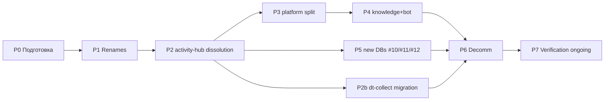

**Критический путь:** P0 → P1 → P2 → P3 → P4 → P6 (≥34h). P5 и P2b параллельны P3/P4.

**Параллелизация:** P1 (renames) и ранние подготовительные шаги P2 (journal schema) могут идти одновременно; P5 (new DBs) и P2b (dt-collect migration) начинаются после P2, независимо от P3/P4.

**Phase checkpoint (ArchGate v3 митигация Эволюционируемость ⚠️ Решение 1, 26 апр):** между фазами — go/no-go gate (≤30 мин ритуал):
- ✅ Drift `count-parity.sql` <0.1% за 7 дней;
- ✅ Rollback playbook L1+L2 проверены на sandbox для следующей фазы;
- ✅ Все child-WP писатели/читатели ack'нули готовность.

→ Не выполнен хоть один = СТОП до фикса. Альтернатива A3 (P5↔P4 swap) активируется на checkpoint при готовности WP-188 (sales funnel) раньше WP-187 Ф-M.1 (knowledge split).

---

## 7. Риски и митигации

| # | Риск | Вероятность | Удар | Митигация |
|---|---|---|---|---|
| R1 | Neon tier не вмещает 12 БД | низкая | средний (upgrade $) | P0 проверка, бюджет upgrade заложен |
| R2 | Dual-write дрифт (стало расходиться между old и new) | средняя | высокий (data loss) | Parity query каждые 24h, alerting при расхождении >0.1% |
| R3 | Connection string missed inventory (какой-то legacy сервис остался на старой БД) | средняя | средний (read stale) | P0 inventory + post-cut-over grep + 30-day read-only window |
| R4 | Outbox-реле потеряло сообщения | низкая | высокий | Idempotent consumer + watermark replay + manual reconciliation SQL |
| R5 | Cross-BC JOIN отсутствует после split (сервис сломался) | средняя | средний | Outbox + projection до cut-over, не после |
| R6 | Retention/GDPR нарушено после split (данные разбросаны) | средняя | высокий (комплаенс) | WP-212 B7.3.1 data classification перед P3, WP-240 retention policies |
| R7 | Cut-over в нерабочие часы нарушил production | средняя | средний | Все cut-over — рабочие часы, Tseren+Паша online, rollback ≤15 мин |
| R8 | FSM в Redis теряется при рестарте (aist-bot) | низкая | низкий (UX hiccup) | Redis persistence on + acceptable loss window 5 min |
| R9 | LMS bridge разорван при переименовании aist-bot | низкая | высокий (учебные объекты недоступны) | WP-254 Ф0 контракт bridge формализован до P4 |
| R10 | Ø rollback рассчитан на одну фазу, а сломалось каскадом | низкая | высокий | 30-дневные окна dual-read, НЕ удалять старые БД раньше времени |
| R11 | Anthropic MCP schema breaking changes во время P4 (knowledge-mcp) | низкая | высокий (переделка) | Weekly monitoring Anthropic releases, pin MCP lib версии на время P4 |
| R12 | Ключевой исполнитель (Tseren/Паша) out-of-office в cut-over окне | средняя | высокий (затор) | P0 согласование окон cut-over с календарём исполнителей, +2 недели slack в Timeline |
| R13 | Neon tier upgrade cost превышает бюджет | низкая | низкий | P0 явный расчёт storage/compute delta для 12 vs 9 БД, approval до P1 |
| R14 | Orphaned connection strings в `.github/workflows/*.yml` или одноразовых скриптах не попали в inventory | средняя | средний | P0 inventory покрывает не только код, но и CI YAML + shell-скрипты в `/scripts/` |
| R15 | L3-утечка: FMT-шаблон требует секретов автора платформы (NEON_URL/DT_USER_ID) | **материализовался 24 апр** (boberru) | средний (user confusion, security posture) | Scope-fix 24 апр: author-only маркер + scheduler guard. Системная замена — P2b |
| R16 | Cron-скрипт на пользовательской машине утечёт service-token в `~/.config/aist/env` | средняя | средний (spoofed events от пользователя) | P2b ArchGate выбирает OAuth-for-cron ИЛИ короткоживущий rotated service-token |

---

## 8. Координация с child-WP

| Child WP | Роль в миграции | Фаза | Зависимость |
|---|---|---|---|
| **WP-155** content-pipeline | Переименование → `publication` (#9) | P1 | Требует MVP live 14 дней |
| **WP-227** /twin | Переименование `digital-twin` → `indicators` (#5) | P1 | Требует /twin прод стабилен 7 дней |
| **WP-246** stars subscriptions | Writer для `subscription` (#4) | P3 | Требует P2 DONE |
| **WP-187** gateway-mcp | Consumer new БД (`persona`, `subscription`, `knowledge-platform`) | P3, P4 | Lazy-heal уже stable |
| **WP-254** learning migration | 9 учебных объектов #6 aist-bot → #6 learning | P4 | ArchGate Ф0 DONE до старта |
| **WP-256** random coffee | Writer для `community` (#10) | P5 | ArchGate: PACK-MIM vs PACK-community |
| **WP-188** sales funnel | Writer для `lead` (#11) | P5 | Требует marketing-funnel MVP live |
| **WP-121** points calculation | Writer для `rewards` (#12) | P5 | Требует Ф2 calculate_points |
| **WP-244** health SaaS | Decommission `health` DB | P6 | Better Uptime провайдер выбран |
| **WP-212** B7.3.1 | Data classification map | P3 entry | Должна быть approved до split platform |
| **WP-139** iwe-metrics-sync | Клиент event-gateway: переписать `dt-collect-neon.py` или удалить | P2b | Ф1/Ф6.1/Ф8 blocked до P2b DONE |
| **WP-109** activity-hub | Server-side endpoint `POST /hub/events` + service-token auth | P2b | journal live (P2 DONE) |
| **WP-253** этот план | Общая координация + drift детектор | P7 | Ongoing |

**Правило координации:** ни одна child-WP не trigger-ит cut-over без разрешения WP-253. Разрешение = строка в статусе фазы `ready-to-cutover: yes` + verification query passed.

---

## 9. Стратегия cut-over

**Паттерн:** dual-write + shadow-read + atomic reader switch.

**Адаптивные окна (ArchGate v3 Решение 2 A3, 26 апр):**

| Профиль фазы | dual-write | read-only | drop | Применимо |
|--------------|:-:|:-:|:-:|---|
| Низкорискованный (renames, single-writer) | 7d | 14d | 30d | P1 (`indicators`, `publication`) |
| Высокорискованный (split, multi-consumer, cross-BC JOIN) | 14d | 30d | 60d | P2, P2b, P3, P4 |
| Новые БД (greenfield) | — | — | — | P5 (нет old БД для cut-over) |

Адаптивность даёт реалистичный compromise: ~9 мес parallel legacy/new (60d × 12 БД сериализованно) → ~6 мес для high-risk + 3 мес для low-risk.

```
                 время →
T0   T+7d   T+14d        T+30d       T+60d
 │     │      │            │           │
 │   writers  │         old DB       drop
 │   dual-    │      → read-only      old
 │   write    │                       DB
 │   ON       │
 │            │
 │    readers shadow-read
 │    (сверка результатов old vs new)
 │
 atomic reader switch
```

**Per-cut-over playbook:**
1. T0: новая БД пустая, создана.
2. T0: writers начинают dual-write (через shim или handler в коде).
3. T0→T+7d: readers работают со **старой** БД; параллельно shadow-read из новой + сверка.
4. T+7d: если parity стабильна — **atomic reader switch** (env var + rolling restart).
5. T+7d→T+14d: writers продолжают dual-write как safety-net.
6. T+14d: writers выключают dual-write на старую БД (только новая).
7. T+30d: старая БД в read-only (Neon admin).
8. T+60d: drop старой БД (в P6).

**Atomic reader switch** = обновление env var + restart сервиса за одно деплой-окно, без down-time (rolling restart через ≥2 инстанса или blue/green при single instance).

---

## 10. Rollback playbook

**Уровни отката:**

| Уровень | Окно | Сложность | Применимо |
|---|---|---|---|
| L1: revert env var | ≤15 мин | тривиально | atomic reader switch провалился |
| L2: revert writers dual-write | ≤1 час | стандартно | расхождение обнаружено после cut-over |
| **L2.5: outbox-replay** | **≤2 часа** | **средне** | **multi-consumer drift 0.5–1% (P2: 3 projections; P3: persona+subscription+reference)** |
| L3: restore из Neon backup | ≤4 часа | сложно | новая БД повреждена, дрифт >1% |
| L4: restore full snapshot | ≤24 часа | критично | обе БД (old+new) в неконсистентном состоянии |

**Playbook L1 (revert env var):**
```bash
# В каждом сервисе:
railway variables set DATABASE_URL=$OLD_DB_URL --service <name>
railway redeploy --service <name>
# Проверка: /health endpoint отвечает + ключевая операция работает
```

**Playbook L2 (revert writer):**
1. Остановить deploy новой версии writer (если в процессе).
2. Rollback deploy: `railway rollback --service <writer>` до предыдущей стабильной версии.
3. Writer пишет только в старую БД.
4. Новая БД в read-only до расследования.

**Playbook L2.5 (outbox-replay) — добавлен ArchGate v3 26 апр; sandbox PASS 25 апр:**
1. Зафиксировать watermark (last_processed_event_id) во всех projection consumers.
2. Запустить `outbox-replay.py --since=<watermark> --consumer=<name>` — повторно прокачать события из `journal.outbox` в проблемный consumer.
3. Reconciliation SQL: `count-parity.sql --table=<projection>` — должен показать дельта = 0 после replay.
4. Если дельта ≠ 0 после replay → эскалация в L3 (Neon backup).
5. **Sandbox-prerequisite:** ✅ **DONE 25 апр 2026** — `DS-IT-systems/neon-migrations/sandbox/L2.5-outbox-replay/` (11/11 assertions PASS, 22ms duration на 1000 событий с drift 0.5%, idempotency проверена).
6. **Production-скрипт:** ✅ **DONE 25 апр 2026** — `DS-IT-systems/neon-migrations/scripts/outbox_replay.py` (advisory lock с timeout 5 min, server-side cursor для chunking, 3 consumer-функции для rewards/publication/lead, replay_log в schema consumer'а).
7. **Runbook для SRE:** ✅ **DONE 25 апр 2026** — `DS-ecosystem-development/.../Runbooks/DP.RUNBOOK.002-l2.5-outbox-replay.md` (8 разделов: триггер → pre-flight → procedure → rollback → post-mortem → escalation).

**Playbook L3 (Neon backup):**
1. `neon branch create --name rollback-<date>` из point-in-time recovery (PITR) до момента миграции.
2. Обновить connection strings на rollback branch.
3. После расследования — merge исправленной миграции на main branch.

**Playbook L4 (full snapshot restore):**
Не предусмотрено в автоматике. Escalation: Tseren + Паша + Neon support. SLA: ≤24h.

---

## 11. Инструментарий

| Инструмент | Назначение | Локация |
|---|---|---|
| `neon-migrate.sh` | pg_dump/restore между БД Neon | `DS-IT-systems/neon-migrations/scripts/` (P0) |
| `dual-write-shim.ts` | TypeScript middleware для двойной записи | `gateway-mcp/src/lib/` |
| `count-parity.sql` | Сверка COUNT + MD5 | `DS-IT-systems/neon-migrations/scripts/` ✅ создан 25 апр |
| `outbox-relay` | Реле событий old → new через outbox | отдельный сервис (Railway) |
| `outbox_replay.py` | Повторная прокачка событий из watermark (Playbook L2.5) | `DS-IT-systems/neon-migrations/scripts/` ✅ создан 25 апр (sandbox PASS) |
| `check-entity-binding.py` | Drift-детектор Pack↔БД↔DS | `DS-IT-systems/neon-migrations/scripts/` (P0) |
| `connection-inventory.yaml` | Реестр всех connection strings | `DS-my-strategy/inbox/WP-253-neon-connection-inventory.md` |
| **Runbook L2.5** | Procedure для SRE | `DS-ecosystem-development/.../Runbooks/DP.RUNBOOK.002-l2.5-outbox-replay.md` ✅ создан 25 апр |

**Convention (25 апр):** scripts (исполняемое) → `DS-IT-systems/neon-migrations/scripts/` (рядом с DDL и sandbox, отдельный git-репо, DS/instrument). Runbooks (документ для SRE) → `DS-ecosystem-development/.../Runbooks/` (governance, DS/governance). Routing-фикс относительно прежней формулировки «всё в DS-ecosystem-development/scripts/neon/» — code не должен жить в governance-репо.

Инструменты создаются в P0. Все — идемпотентные, с `--dry-run` флагом.

---

## 12. Success criteria

Миграция DONE, если **все** выполнены:

- [ ] 12 БД live в Neon согласно DP.ARCH.004 v2 §1 (точные имена, точные writers).
- [ ] 0 legacy connection strings (grep по всей кодовой базе IWE).
- [ ] Health DB удалена, Better Uptime работает и алертит по сервисам DP.SC.*.
- [ ] Metabase работает на read-replica (не отдельная БД).
- [ ] `check-entity-binding.py` даёт 0 drift 4 недели подряд.
- [ ] Pack-manifest + MAP.001 ссылки валидны.
- [ ] WP-212 B7.3.1 data classification applied: PII/payment_credentials маркированы в каждой БД где хранятся.
- [ ] Retention policies (WP-240) применены для append-only таблиц (`journal.event`, `publication.event`, `lead.funnel_event`).
- [ ] Документирован post-mortem: inhe какие фазы вызывали откат, какие — нет, lesson learned.

---

## 13. Открытые вопросы

1. **Timing MVP → P1.** «14 дней стабильной работы content-pipeline» — достаточно ли? Или лучше 30 дней? Решение — после sprint 1 MVP.
2. **Redis для FSM aist-bot.** Self-host Redis или Upstash/Railway Redis? Стоимость vs надёжность. P0 определяет.
3. **Outbox implementation.** Своя lib или библиотека (pgmq/river)? ArchGate в P2 entry.
4. ~~**Metabase read-replica.**~~ ✅ RESOLVED 25 апр (Tseren): (c) direct read-only ×12 БД для MVP P6, (a) logical replication Phase 2 при росте нагрузки/внешних BI.
5. **Backup retention.** 90 дней для dropped DBs — достаточно ли? Согласовать с юрдоком (WP-212 B8.0).
6. **Cross-DB JOIN замена.** Где неизбежны JOIN между БД — использовать projection или API gateway? Per-case в каждой фазе.
7. **Cost projection.** 12 БД в Neon vs 9 — дельта цены? P0 калькуляция.

---

## 14. Timeline (оптимистичный)

| Фаза | Дата | Длительность | Бюджет |
|---|---|---|---|
| P0 Подготовка | 1-10 мая | 10 дней (календарно) | 3h |
| P1 Renames | 10-24 мая | 14 дней (cut-over windows) | 4h |
| P2 activity-hub dissolution | 20 мая - 20 июня | 1 мес | 12h |
| P2b dt-collect migration | 10-25 июня | 2 недели | 8-10h |
| P3 platform split | 15 июня - 15 июля | 1 мес | 8h |
| P4 knowledge + bot | 1 июля - 1 августа | 1 мес | 10h |
| P5 new DBs | 15 июля - 15 августа | 1 мес | 8h |
| P6 Decomm | 15-30 августа | 2 недели | 4h |
| P7 Verification | 1 сентября+ | ongoing | 0.5h/week |
| **Итого active work** | **1 мая - 30 августа** + **+2-3 нед slack (25 апр решение)** | **~4-4.5 мес** | **~49h** |

**Финиш с встроенным slack (RESOLVED 25 апр §15.2):** **октябрь-ноябрь 2026.** Дополнительные +2-3 недели явно заложены поверх оптимистичного плана как митигация R12 (исполнитель OOO в cut-over окне) при 20+ параллельных WP. Не «пессимистичный сдвиг» — рабочая базовая линия.

---

## 15. Deferred к ArchGate review

ArchGate v3 проведён 26 апр (§16). Все 3 пункта закрыты 25 апр (Tseren — без эскалации Андрею):

1. ~~**L3 rollback playbook для P2-P4.**~~ ✅ RESOLVED: добавлен Playbook L2.5 (outbox-replay) в §10 с sandbox-prerequisite на postgresql@16 до старта P2.
2. ~~**Temporal slack в P2-P3.**~~ ✅ RESOLVED 25 апр: принят +2-3 нед явно. Timeline §14 finish сдвинут на октябрь-ноябрь 2026.
3. ~~**Metabase read-replica механизм (P6).**~~ ✅ RESOLVED 25 апр: (c) direct read-only ×12 БД для MVP, (a) logical replication Phase 2 при росте нагрузки/внешних BI.

---

## 16. ArchGate v3 verdict (26 апр 2026)

**Вход:** [`inbox/WP-253-F1-archgate-prep.md`](../../../../DS-my-strategy/inbox/WP-253-F1-archgate-prep.md) — 4 миграционных решения. Target state DP.ARCH.004 v2.3 read-only (Правило 22).

**Критические характеристики:** Безопасность + Эволюционируемость.

### Профиль ЭМОГССБ (батч 4 решений)

| # | Решение | Принятый вариант | Профиль | Вердикт |
|---|---------|------------------|---------|---------|
| 1 | Phase order P0→P7 | Baseline (gating важнее −1 мес от A2 parallel) | 5✅ 3⚠️ (Э+Г+Б) | ПРОХОДИТ |
| 2 | Cut-over windows | **A3 адаптивные**: 7d/14d/30d для P1, 14d/30d/60d для P2-P4 | 8✅ 0⚠️ | ПРОХОДИТ |
| 3 | Rollback playbook | **A2 +L2.5 outbox-replay** (sandbox-тест ~2h до P2) | 7✅ 1⚠️ (О) | ПРОХОДИТ |
| 4a | L3 playbook P2-P4 | Закрыто принятием A2 в #3 | — | RESOLVED |
| 4b | Temporal slack | Принят явно: finish октябрь-ноябрь (R12 митигация) | 3✅ 0⚠️ | **RESOLVED 25 апр** (Tseren — без эскалации Андрею) |
| 4c | Metabase механизм | (c) direct read-only ×12 для MVP, (a) Phase 2 | 4✅ 1⚠️ (Э) | **RESOLVED 25 апр** (Tseren — без эскалации Андрею) |

**Вето-фильтр (conjunctive screening):**
- Правило 1 (критические Э+Б): обе ⚠️, не ❌ — не сработало.
- Правило 2 (≥2 блокеров ❌): 0 блокеров — не сработало.
- Правило 3 (≥4⚠️ и 0✅): свод 5⚠️ × 27✅ — не сработало.

→ **PASS.**

### L2 доменные расширения (информативно)

- **L2.1 Переносимость данных** ✅ — DDL vanilla Postgres, pg_dump через unpooled, gen_random_uuid стандартный.
- **L2.6 Сохранность знаний** ✅ — Neon PITR per-DB (WP-241), retention WP-240, drift-детектор Ф6, rollback L1-L4 + L2.5.

### Митигации (внесены в Roadmap)

| Хар-ка | Где | Что |
|--------|-----|-----|
| Безопасность ⚠️ Решение 1 | §5.2 P2 entry | B7.3.1 PII классификация **journal events** добавлена как entry-gate для P2 (не только P3) |
| Эволюционируемость ⚠️ Решение 1 | §6 DAG | Checkpoint между фазами: drift <0.1% + L1-L2 PASS как go/no-go gate |
| — Решение 2 | §9 cut-over | Адаптивные окна (P1: 7d/14d/30d; P2-P4: 14d/30d/60d) |
| Безопасность ⚠️ Решение 3 | §10 rollback | Уровень L2.5 outbox-replay добавлен (≤2h, multi-consumer drift 0.5-1%) |
| Обучаемость ⚠️ Решение 3 | §10 + §11 | Sandbox-тест L2.5 на postgresql@16 (1000 событий) — entry для P2 |
| Эволюционируемость ⚠️ Решение 4c | §15 + §13 #4 | (c) MVP принят, Phase 2 (a) при росте нагрузки/внешних BI |

### 3 решения автора 25 апр (RESOLVED — без эскалации Андрею)

1. **L2.5 outbox-replay sandbox-тест до P2 — ПРИНЯТО.** +3-4h до P2 (1-2h доку + 2h sandbox-тест на postgresql@16, 1000 событий с искусственным drift 0.5%). Аргумент: цена страховки 3-4h vs 4h downtime + post-mortem под давлением.
2. **Temporal slack +2-3 нед — ПРИНЯТО.** Timeline §14 finish сдвигается на октябрь-ноябрь 2026. Аргумент: эмпирически (W17 off-plan ~7h на skeleton) оптимистичные оценки слайдают; буфер встроен явно.
3. **Metabase для P6 — ПРИНЯТО (c) direct read-only ×12, (a) Phase 2.** Аргумент: простейшее работающее, vendor-agnostic, ~1h конфигурации. (a) активируется при росте нагрузки или подключении внешних BI.

→ §13 открытые вопросы #4 закрыт; §15 Deferred всех 3 пунктов = RESOLVED.

---

## 17. История

| Версия | Дата | Описание |
|---|---|---|
| v0.1 draft | 22 апр 2026 | Первая версия после Ф25 DONE. Скелет 7 фаз, матрица рисков, координация child-WP. Ждёт ArchGate + ревью Андрея. |
| v0.2 draft | 24 апр 2026 | +P2b «dt-collect миграция на event-gateway». Триггер — L3-утечка scope в FMT (boberru инцидент 24 апр, scope-fix DONE). Системная замена psycopg2-writer на REST endpoint через Activity Hub. +R15/R16 риски, +WP-139/WP-109 координация, +DAG node P2b. Бюджет фазы 8-10h, активация после P2. |
| v0.3 ArchGate PASS | 26 апр 2026 | Батчевый ArchGate v3 на 4 миграционных решениях — PASS с условием A2 в Решении 3 (L2.5 outbox-replay). 5 митигаций внесены: B7.3.1 entry для P2, DAG checkpoint, адаптивные cut-over окна, L2.5 уровень rollback, sandbox-тест. 3 вопроса для Андрея в §16. Status WP-253 Ф1 → DONE. |
| v0.4 решения закрыты | 25 апр 2026 | Tseren принял все 3 OPEN-решения автономно (без эскалации Андрею): L2.5 sandbox до P2, temporal slack +2-3 нед (finish окт-нояб), Metabase (c) MVP / (a) Phase 2. Roadmap полностью разблокирован для исполнения. Timeline §14 finish сдвинут на октябрь-ноябрь. |
| v0.5 P0 prep done | 25 апр 2026 | L2.5 production-toolchain готов: (1) `outbox_replay.py` production-script с advisory lock timeout 5 min + chunking; (2) `count-parity.sql` для drift-детектора; (3) DP.RUNBOOK.002-l2.5-outbox-replay.md procedure для SRE; (4) routing-фикс §11 (`DS-IT-systems/neon-migrations/scripts/` для code, `DS-ecosystem-development/.../Runbooks/` для документов). Pack convention: code в DS/instrument, runbooks в DS/governance. |


# SOURCE_FILE: pack/digital-platform/02-domain-entities/DP.ROLE.001-platform-roles.md
---
---
id: DP.ROLE.001
name: ИИ-системы
type: domain-entity
status: active
summary: "Реестр и классификация ИИ-систем платформы: роли (Стратег, Экстрактор, Проводник и др.) и исполнители (Claude, бот, скрипты)"
created: 2026-02-07
updated: 2026-03-21
trust:
  F: 4
  G: domain
  R: 0.7
epistemic_stage: formed
note: "Retitled from 'ИИ-агенты' to 'ИИ-системы'. ID migrated from DP.AGENT.001 → DP.ROLE.001 (WP-63)."
related:
  supersedes: [DP.ASSIST.001]
  uses: [DP.ARCH.001, DP.D.033]
---

# ИИ-системы платформы

> **Implementation Note.** Определения ролей, классификация, obligations, expectations, methods — домен. Конкретные исполнители (§3.1: Claude, bash scripts, репо) и `current_holders` в описаниях ролей — текущая реализация. Детали: [C2.IT-Platform / System-Implementations](../../../DS-ecosystem-development/C.IT-Platform/C2.IT-Platform/C2.2.Architecture/System-Implementations/).

## 1. Определение

**ИИ-система** — компонент платформы (слой 3), использующий LLM для выполнения функций: принятие решений, генерация, диалог, анализ.

> ИИ-агент ≠ ИИ-ассистент (DP.D.009). Это **виды** ИИ-системы, а не разные архитектурные слои.

> **Принцип:** ИИ-система работает по промптам, не по коду. Промпт — это и есть «код» ИИ-системы. Детерминированная система управляется кодом (слой 2); ИИ-система управляется промптами (слой 3).

> **Role-Centric Architecture (DP.D.033):** Роль описывается независимо от исполнителя. Исполнитель выбирается и подготавливается отдельно. Одно имя (например, «Синхронизатор») может обозначать и роль (что делать), и систему-исполнителя (чем делать) — это разные ракурсы. Каталог ролей (§3.2) — первичен; реестр исполнителей (§3.1) — вторичен.

## 2. Виды и классификационные признаки

ИИ-агент и ИИ-ассистент — два основных **вида** ИИ-систем. Вид определяется тремя классификационными признаками:

| Признак | Значения | Описание |
|---------|----------|----------|
| **Ориентация** | `human` / `system` | На кого направлена: на человека (диалог) или на систему (автоматизация) |
| **Инициатива** | `by-request` / `autonomous` | Кто инициирует: пользователь или система по триггеру/расписанию |
| **Интерфейс** | `dialogue` / `api` / `both` | Через что взаимодействует: диалог, программный API или оба |

**Виды:**
- Проводник: human + by-request + dialogue → вид «ИИ-ассистент»
- Стратег day-plan: system + autonomous + api → вид «ИИ-агент»
- Стратег interactive: human + by-request + dialogue → вид «ИИ-ассистент»

Одна и та же ИИ-система может работать в разных режимах и менять вид в зависимости от сценария (Стратег: и агент, и ассистент).

### 2.1. Agent Customization Pipeline (модель по контурам)

> **Различение DP.D.037:** Кастомизация агента = harness engineering (DP.D.025), НЕ fine-tuning LLM. Каждый контур добавляет слои обвязки (harness), не меняя базовую модель.

```
Base LLM (Anthropic Claude / OpenAI GPT / etc.)
    │
    ├── L2: Platform Agent
    │   + API config (temperature, max_tokens, tools)
    │   + Domain system prompt (knowledge-mcp access)
    │   + Platform constraints (latency budget, safety, billing)
    │   Governance: M2 (Разработчик платформы)
    │
    ├── L3: Template Agent
    │   + standard/CLAUDE.md (методология: FPF, протоколы, различения)
    │   + standard/memory/*.md (справочные файлы)
    │   + Описания ролей (DP.D.033 templates)
    │   + Сценарные скрипты (strategist.sh, extractor.sh)
    │   Governance: M3 (Разработчик шаблона)
    │
    └── L4: Personal Agent
        + personal/CLAUDE.md (личная методология, уроки)
        + personal/memory/*.md (личные паттерны)
        + Цифровой двойник (digital-twin-mcp)
        + Личные Pack-репо + DS-strategy
        Governance: M4 (Пользователь IWE)
```

**Agent-as-System.** ИИ-агент — система (FPF A.1) с тремя аспектами:

| Аспект | Что | Пример | Кто меняет |
|--------|-----|--------|-----------|
| **Конструкция** | Base LLM (веса модели) | Claude Opus / Haiku / GPT-4o | Провайдер (Anthropic, OpenAI) |
| **Конфигурация** | Harness (промпты + инструменты + данные + ограничения) | CLAUDE.md, memory/, prompts/, scripts/ | Разработчик (M2/M3) и пользователь (M4) |
| **Состояние** | Текущий контекст сессии | Conversation history, загруженные файлы | Меняется в процессе работы |

**Принципы:**

| Принцип | Описание |
|---------|----------|
| **Harness, not weights** | Каждый контур добавляет harness, не меняет модель (DP.D.025, DP.D.037) |
| **Contour inheritance** | L4 наследует от L3, L3 от L2. Personal дополняет Standard (DP.ARCH.002) |
| **Governance separation** | Каждый контур имеет своего владельца — мета-роли M2/M3/M4 (DP.D.034) |
| **Composable layers** | Промпты и инструменты композируются, не заменяются. Standard + Personal = полный контекст |

**Что отдаётся пользователю IWE:**
1. **Описания ролей** (DP.D.033) — пользователь может дополнять obligations, methods, expectations
2. **Шаблон агента** (L3 Template) — пользователь fork'ает и кастомизирует на L4
3. **Инструменты** — скрипты, MCP-серверы, конфиги — привязаны к назначению (DP.D.036)

Роли и агенты — отдельные сущности. Пользователь может кастомизировать **агента** (L4 harness) и **описание роли** — независимо друг от друга.

## 3. Каталог ролей и исполнителей

> **Основание:** FPF A.2 (U.RoleAssignment) — роль описывается независимо от исполнителя. FPF A.13 (AgentialRole) — агентские роли требуют Grade 2+. Шаблон описания роли: DP.D.033.
>
> **Принцип:** Сначала роль (что делать, какие обязательства, рабочие продукты) → затем исполнитель (кто/чем играет роль). Роль = маска, которую надевает система: сама (агент) или по воле другого агента (инструмент).
>
> **Нотация FPF:** Holder#Role:Context@Window

### 3.1. Реестр исполнителей (implementation)

| ID | Исполнитель | Категория | Grade | Репо |
|----|------------|-----------|-------|------|
| A1 | **Claude** | ИИ-агент | 3-4 | — |
| A2 | **Пользователь** | Человек | 4 | — |
| I1 | Бот Aist | Инструмент | 1 | DS-IT-systems |
| I2 | Синхронизатор (bash) | Инструмент | 1 | DS-ai-systems |
| I3 | Шаблонизатор (bash) | Инструмент | 0 | DS-ai-systems |
| I4 | MCP-серверы | Инструмент | 0 | DS-MCP |
| I5 | launchd | Инструмент | 0 | — (macOS) |
| I6 | Статистик | Инструмент | 1 | DS-ai-systems |
| I7 | Наладчик | Инструмент | 2 | DS-ai-systems |
| I8 | Оценщик | Инструмент | 2 | DS-ai-systems |
| I9 | Публикатор (bot scheduler) | Инструмент | 1 | DS-ai-systems |
| I10 | WakaTime (SaaS + VS Code ext) | Инструмент | 0 | — (wakatime.com) |
| I11 | Профилировщик (Python) | Инструмент | 1 | DS-ai-systems/profiler |
| I12 | Capture-bus (shell hooks) | Инструмент | 1 | ~/IWE/.claude/ (harness-local) |

### 3.2. Каталог ролей платформы

> Каждая роль описана по шаблону DP.D.033. Тип: **agential** (требует Grade 2+, автономия в выборе КАК действовать) или **functional** (Grade 0+, исполнение по алгоритму).

#### Агентские роли (Grade 2+)

> Исполнители (кто играет роль) — см. [Таблица РА §3.5](#35-таблица-ра-роли--исполнители--инструменты).

| # | Роль | Suprasystem | Сервисы (описания методов) | Вход | Выход (РП) |
|---|------|-------------|---------------------------|------|------------|
| R1 | **Стратег** | Экзокортекс | Day-plan, Session-prep, Note-review, Week-review, Interactive | WeekPlan, inbox, коммиты, MAPSTRATEGIC | WeekPlan (с секцией «Итоги W{N}»), DayPlan |
| R2 | **Экстрактор** | Экзокортекс | Knowledge Extraction, Inbox Check, Ontology Sync | captures.md, сессионные артефакты, Pack | Pack-сущности, Extraction Report |
| R3 | **Консультант** | Платформа DP | Q&A, DZ-Check, Content Pre-Gen, Feed Delivery | Вопрос ученика, knowledge-mcp, DT | Ответы, оценки, контент |
| R4 | **Автор** | Экосистема | Post-Writing, Presentation, Description | Content plan, knowledge-mcp | Посты (md), презентации (Marp) |
| R5 | **Архитектор** | Платформа DP | ArchGate, BC-Mapping, ADR, SOTA-Update | Арх. предложение, Pack, SOTA | ADR, оценки ЭМОГССБ, BC-маппинг |
| R6 | **Кодировщик** | Платформа DP | Implementation, Refactoring, Bug-Fix | Архитектура (R5), backlog (R7) | Код (коммиты), captures |
| R7 | **Триажёр техдолга** | Платформа DP | Auto-Triage, Triage-Session | feedback_triage DB, inbox | Приоритизированный backlog, алерты |
| R22 | **Оркестратор** | Система персонального развития | Orchestration Dispatch, Rhythm Adaptation | ЦД (состояние, engagement), config | Решение о составе цикла на день |
| R27 | **Портной** | Система персонального развития | Portion Assembly | Программа, ЦД (профиль, история, стиль), ячейки | Персональная дневная порция |
| R28 | **Профилировщик** | Система персонального развития | DT Profile Calculation, DT Profile Sync | 2_collected (engagement), learning_history (BKT) | 3_derived в digital_twins (ступень, mastery, gaps, агентность) |

> **R1, R2** — полное описание роли: `DS-ai-systems/strategist/system.yaml`, `DS-ai-systems/extractor/system.yaml`
>
> **Реализация в шаблоне:** Роли, поставляемые с FMT-exocortex-template, следуют формальному [контракту роли](https://github.com/TserenTserenov/FMT-exocortex-template/blob/main/roles/ROLE-CONTRACT.md) — спецификации структуры директории (`role.yaml` манифест, `install.sh`, `prompts/`). Контракт обеспечивает автодискавери и модульное добавление новых ролей.

<details>
<summary><strong>R3 Консультант</strong> — полное описание (DP.D.033)</summary>

```yaml
name: "Консультант"
type: agential
suprasystem: "Платформа DP"
context: "Диалог с учеником: ответы на вопросы, проверка ДЗ, генерация контента"

obligations:
  - "Отвечать на вопросы ученика по материалу курса (knowledge-mcp)"
  - "Проверять домашние задания с Bloom-aware обратной связью"
  - "Генерировать ленту и марафон-контент по расписанию"
  - "Использовать DT для персонализации ответов (proactive injection)"
  - "Удерживать latency <3 сек для пользовательского опыта"

expectations:
  - from: "R16 Ученик"
    expects: "Понятные ответы, соответствующие уровню ученика"
  - from: "R12 Оценщик"
    expects: "Оценки встроены в диалог (inline evaluation)"
  - from: "R13 Проводник"
    expects: "Контент соответствует текущему FSM-состоянию ученика"

methods:
  - name: "Knowledge-MCP Search"
    description: "Поиск по 9 источникам (semantic + keyword) для ответа на вопрос"
  - name: "DT Injection"
    description: "Чтение цифрового двойника ученика → персонализация промпта"
  - name: "Content Budget Model"
    description: "Адаптация объёма ответа к tier + контексту (DP.D.027)"
  - name: "Streaming SSE"
    description: "Потоковая генерация ответа для минимизации воспринимаемой задержки"

work_products:
  - product: "Ответ на вопрос"
    recipient: "R16 Ученик (TG message)"
    trigger: "Ученик задал вопрос"
  - product: "Проверка ДЗ"
    recipient: "R16 Ученик (TG message + оценка)"
    trigger: "Ученик отправил ДЗ"
  - product: "Лента/Марафон контент"
    recipient: "R16 Ученик (scheduled TG message)"
    trigger: "Scheduler (pre-gen за 3ч)"

current_holders:
  - holder: "A1 Claude Haiku (via I1 Bot, Claude API)"
    grade: 3
    covers_scenarios: [Q&A, DZ-Check, Content-Generation]
    instruments: [Claude API (Haiku), knowledge-mcp, guides-mcp, digital-twin-mcp, TG Bot API (messages + keyboards)]

failure_modes:
  - "Hallucination — ответ не основан на Pack/knowledge-mcp"
  - "Tier Mismatch — контент не соответствует уровню ученика"

related_roles:
  - role: "R12 Оценщик"
    interaction: "Оценщик оценивает ответы, Консультант встраивает оценку в диалог"
  - role: "R13 Проводник"
    interaction: "Проводник определяет FSM-контекст → Консультант адаптирует контент"
  - role: "R16 Ученик"
    interaction: "Прямой диалог: вопрос → ответ"
```
</details>

<details>
<summary><strong>R4 Автор</strong> — полное описание (DP.D.033)</summary>

```yaml
name: "Автор"
type: agential
suprasystem: "Экосистема"
context: "Создание контента: посты, презентации, питчи, описания"

obligations:
  - "Писать посты по content-плану Стратега"
  - "Готовить презентации для семинаров (Marp + PDF)"
  - "Создавать описания мероприятий и продуктовые материалы"
  - "Соблюдать стиль и тон автора (голос владельца экзокортекса)"

expectations:
  - from: "R1 Стратег"
    expects: "Content plan с темами, аудиторией, приоритетами"
  - from: "R14 Заказчик"
    expects: "Текст соответствует замыслу, не нужно существенно переписывать"
  - from: "R15 Валидатор"
    expects: "Пост готов к публикации после review"

style_reference:
  name: "PostNauka-style"
  source: "postnauka.org"
  characteristics:
    - tone: "Популярно-научный, доступный, серьёзный без развлекательности"
    - structure: "Карточный формат, короткие блоки для экранного чтения"
    - paragraphs: "Короткие (2-4 предложения), фрагментарные"
    - devices: "Примеры, аналогии, визуальная организация. Без излишней эмоциональности"
    - voice: "Экспертный, но понятный широкой аудитории"

methods:
  - name: "Topic Research"
    description: "knowledge-mcp + Pack → сбор материала для поста"
  - name: "Structured Writing"
    description: "Заголовок → тезис → аргументация → вывод → CTA"
  - name: "Marp Slides"
    description: "Markdown → Marp → PDF для презентаций"

work_products:
  - product: "Пост (markdown)"
    recipient: "R15 Валидатор → DS-Knowledge-Index/docs/"
    trigger: "Content plan item"
  - product: "Презентация (Marp + PDF)"
    recipient: "R14 Заказчик (семинар)"
    trigger: "Семинар запланирован"
  - product: "Описание мероприятия"
    recipient: "Платформа (systemsworld.club, TG)"
    trigger: "Новое мероприятие"

current_holders:
  - holder: "A1 Claude (CLI interactive)"
    grade: 3
    covers_scenarios: [Post-Writing, Presentation, Description]
    instruments: [Claude Code CLI, knowledge-mcp, DS-Knowledge-Index repo, Marp CLI]

failure_modes:
  - "Voice Drift — стиль не соответствует голосу автора"

related_roles:
  - role: "R1 Стратег"
    interaction: "Стратег → content plan → Автор реализует"
  - role: "R15 Валидатор"
    interaction: "Валидатор проверяет текст перед публикацией"
```
</details>

<details>
<summary><strong>R5 Архитектор</strong> — полное описание (DP.D.033)</summary>

```yaml
name: "Архитектор"
type: agential
suprasystem: "Платформа DP"
context: "Архитектурные решения, АрхГейт-оценки, структура экосистемы"

obligations:
  - "Оценивать каждое архитектурное предложение по ЭМОГССБ (7 характеристик)"
  - "Предлагать ТОЛЬКО решения с оценкой ≥8 по ArchGate"
  - "Определять BC-маппинг: знание → какой Pack"
  - "Поддерживать SOTA-справочник (memory/sota-reference.md)"
  - "Проверять приоритетную тройку: Context Engineering, DDD Strategic, Coupling Model"

expectations:
  - from: "R6 Кодировщик"
    expects: "Архитектура определена ДО начала кодирования"
  - from: "R2 Экстрактор"
    expects: "BC-маппинг и routing.md консистентны"
  - from: "R14 Заказчик"
    expects: "Обоснованные решения с таблицей ЭМОГССБ"

methods:
  - name: "ArchGate (ЭМОГССБ)"
    description: "7 характеристик: Эволюционируемость, Масштабируемость, Обучаемость, Генеративность, Скорость, Современность, Безопасность"
  - name: "SOTA Check"
    description: "Проверка по sota-reference.md: 18 практик (12 Platform + 6 Pack)"
  - name: "BC Mapping"
    description: "Определение Bounded Context → маршрутизация в правильный Pack"
  - name: "ADR (Architectural Decision Record)"
    description: "Формализация решения: контекст, варианты, выбор, обоснование"

work_products:
  - product: "ADR / ArchGate оценка"
    recipient: "R14 Заказчик, R6 Кодировщик"
    trigger: "Архитектурное решение требуется"
  - product: "BC-маппинг (routing.md update)"
    recipient: "R2 Экстрактор"
    trigger: "Новая предметная область или реорганизация Pack"
  - product: "SOTA-обновления"
    recipient: "memory/sota-reference.md → все роли"
    trigger: "Обнаружена новая SOTA-практика"

current_holders:
  - holder: "A1 Claude (CLI interactive)"
    grade: 3
    covers_scenarios: [ArchGate, BC-Mapping, ADR, SOTA-Update]
    instruments: [Claude Code CLI, CLAUDE.md + memory/sota-reference.md, knowledge-mcp, Pack repos (read)]

failure_modes:
  - "Weak Architecture — решение с оценкой ≤7 принято без обоснования"
  - "SOTA Ignorance — решение не учитывает доступные SOTA-практики"

related_roles:
  - role: "R6 Кодировщик"
    interaction: "Архитектор → архитектура → Кодировщик реализует"
  - role: "R2 Экстрактор"
    interaction: "Архитектор определяет BC → Экстрактор маршрутизирует знание"
  - role: "R1 Стратег"
    interaction: "Стратег определяет приоритеты → Архитектор решает HOW"
```
</details>

<details>
<summary><strong>R6 Кодировщик</strong> — полное описание (DP.D.033)</summary>

```yaml
name: "Кодировщик"
type: agential
suprasystem: "Платформа DP"
context: "Реализация кода, рефакторинг, баг-фиксы по архитектуре R5"

obligations:
  - "Реализовывать код по утверждённой архитектуре (R5)"
  - "Следовать CLAUDE.md репо (exit protocol, code style)"
  - "Не вводить security vulnerabilities (OWASP Top 10)"
  - "Capture-to-Pack при обнаружении паттернов/антипаттернов"
  - "Коммитить с осмысленными сообщениями, пушить с подтверждением"

expectations:
  - from: "R5 Архитектор"
    expects: "Архитектура определена, ArchGate пройден"
  - from: "R15 Валидатор"
    expects: "Код работает, тесты проходят"
  - from: "R14 Заказчик"
    expects: "Минимальные изменения — не over-engineer"

methods:
  - name: "Incremental Implementation"
    description: "Мелкие коммиты, каждый — рабочее состояние"
  - name: "Read-Before-Edit"
    description: "Понять существующий код ДО модификации"
  - name: "Pilot-First Deployment"
    description: "new-architecture → pilot branch → тестирование → prod"

work_products:
  - product: "Код (коммиты)"
    recipient: "Git repo → R15 Валидатор (review) → prod"
    trigger: "РП назначен, архитектура определена"
  - product: "Capture (паттерн/антипаттерн)"
    recipient: "R2 Экстрактор (через capture-to-pack)"
    trigger: "Обнаружен при кодировании"

current_holders:
  - holder: "A1 Claude (CLI interactive)"
    grade: 3
    covers_scenarios: [Implementation, Refactoring, Bug-Fix]
    instruments: [Claude Code CLI (git, bash, file ops), repo CLAUDE.md, knowledge-mcp]

failure_modes:
  - "Over-Engineering — добавлены фичи, не запрошенные заказчиком"
  - "Security Hole — введена OWASP-уязвимость"

related_roles:
  - role: "R5 Архитектор"
    interaction: "Архитектор → решение → Кодировщик реализует"
  - role: "R7 Триажёр"
    interaction: "Триажёр приоритизирует backlog → Кодировщик берёт задачи"
  - role: "R11 Наладчик"
    interaction: "Наладчик L4 → GitHub Issue → Кодировщик фиксит"
```
</details>

<details>
<summary><strong>R7 Триажёр техдолга</strong> — полное описание (DP.D.033)</summary>

```yaml
name: "Триажёр техдолга"
type: agential
suprasystem: "Платформа DP"
context: "Двухуровневый триаж: auto-classify (Grade 1) + review (Grade 3)"

obligations:
  - "Auto-triage: классифицировать каждый helpful=false / ✏️ comment в реальном времени"
  - "Review: при открытии сессии техдолга проверить предклассифицированный backlog"
  - "Категоризировать: L(atency), C(orrectness), U(sability), K(nowledge)"
  - "Оценивать severity: low/medium/high/critical"
  - "Кластеризовать: группировать похожие проблемы (onboarding, content, ...)"
  - "Алертить: severity >= high ИЛИ user_comment → TG alert в реальном времени"
  - "Обновлять WP-debt backlog (приоритизированный список)"

expectations:
  - from: "R6 Кодировщик"
    expects: "Backlog приоритизирован, задачи конкретны"
  - from: "R14 Заказчик"
    expects: "Критичное — алерт сразу, некритичное — не копится"
  - from: "R8 Синхронизатор"
    expects: "Weekly report (unsatisfied-questions.md) из feedback_triage DB"

methods:
  - name: "Auto-Triage (Grade 1)"
    description: "helpful=false → Haiku classify → feedback_triage DB → TG alert if high"
  - name: "Issue Funnel Review (Grade 3)"
    description: "feedback_triage DB + fleeting-notes + captures → review → prioritize → backlog"
  - name: "Impact Assessment"
    description: "Сколько пользователей затронуто × severity × effort"

work_products:
  - product: "feedback_triage DB record"
    recipient: "R7 Review, R8 Синхронизатор (отчёт)"
    trigger: "Каждый helpful=false или ✏️ comment"
  - product: "TG alert"
    recipient: "R14 Заказчик"
    trigger: "severity >= high ИЛИ user_comment"
  - product: "Приоритизированный backlog (WP-debt)"
    recipient: "R6 Кодировщик, R14 Заказчик"
    trigger: "Открытие сессии техдолга"

scenarios:
  - name: "Auto-Triage"
    trigger: "helpful=false callback OR user_comment saved"
    min_agency_grade: 1
    method: "Auto-Triage (Grade 1)"
    inputs: [qa_history record]
    work_product: "feedback_triage DB record + TG alert"
  - name: "Triage-Session"
    trigger: "Открытие сессии техдолга (WP-7)"
    min_agency_grade: 3
    method: "Issue Funnel Review (Grade 3)"
    inputs: [feedback_triage DB, fleeting-notes.md, captures.md]
    work_product: "Приоритизированный backlog"

current_holders:
  - holder: "Bot process (core/feedback_triage.py, Haiku)"
    grade: 1
    covers_scenarios: [Auto-Triage]
    instruments: [feedback_triage.py, Claude Haiku API, Neon DB (feedback_triage table), TG Bot API (alert)]
  - holder: "A1 Claude (CLI interactive)"
    grade: 3
    covers_scenarios: [Triage-Session]
    instruments: [Claude Code CLI, feedback_triage DB (read), inbox files (fleeting-notes, captures), GitHub API]

failure_modes:
  - "Backlog Bloat — замечания копятся без review (mitigated by auto-triage + alerts)"
  - "Alert Fatigue — слишком много high-severity алертов (monitor, tune threshold)"

related_roles:
  - role: "R6 Кодировщик"
    interaction: "Триажёр приоритизирует → Кодировщик реализует"
  - role: "R8 Синхронизатор"
    interaction: "Синхронизатор генерирует weekly report из feedback_triage DB"
  - role: "R11 Наладчик"
    interaction: "L4 escalations → попадают в triage"
```
</details>

<details>
<summary><strong>R22 Оркестратор</strong> — полное описание (DP.D.033)</summary>

```yaml
name: "Оркестратор"
type: agential
suprasystem: "Система персонального развития"
context: "Управление циклом персонального развития: решает ЧТО и КОГДА запускать"

obligations:
  - "Решать, нужна ли диагностика сегодня (по давности, событиям)"
  - "Решать, вызывать ли Навигатора (провал мотивации, смена этапа)"
  - "Запрашивать у Портного порцию на день"
  - "Адаптировать ритм под пользователя (частота, объём)"
  - "Отслеживать прогресс и эскалировать при стагнации"

expectations:
  - from: "R16 Ученик"
    expects: "Ритм обучения комфортный, не перегружает"
  - from: "R27 Портной"
    expects: "Своевременный запрос на сборку порции с актуальным контекстом"
  - from: "R14 Заказчик"
    expects: "Автономная работа без ручного вмешательства"

methods:
  - name: "Orchestration Dispatch"
    description: "Анализ состояния ЦД → решение о составе цикла → делегирование ролям"
  - name: "Rhythm Adaptation"
    description: "Корректировка частоты и объёма на основе engagement metrics"

work_products:
  - product: "Решение о составе цикла на день"
    recipient: "R27 Портной, MIM.R.007 Навигатор, MIM.R.009 Диагност"
    trigger: "Утренний цикл / событие (потеря активности)"

current_holders:
  - holder: "TBD (Ф3 MVP)"
    grade: 2
    covers_scenarios: [Orchestration-Dispatch, Rhythm-Adaptation]
    instruments: [TBD]

failure_modes:
  - "Over-Push — слишком частые/объёмные порции → пользователь отваливается"
  - "Stagnation Blindness — не замечает потерю вовлечённости"

related_roles:
  - role: "R27 Портной"
    interaction: "Оркестратор запрашивает → Портной собирает порцию"
  - role: "R8 Синхронизатор"
    interaction: "R8 = cron (запускает по расписанию). Оркестратор = решает ЧТО запускать"
  - role: "MIM.R.007 Навигатор"
    interaction: "Оркестратор вызывает Навигатора при провале мотивации или смене этапа"
  - role: "MIM.R.009 Диагност"
    interaction: "Оркестратор вызывает Диагноста при необходимости диагностики"

distinction: "R8 Синхронизатор = cron (запускает по расписанию). Оркестратор = решает ЧТО запускать (принимает решения на основе состояния ЦД)."
grade: 2+
```
</details>

<details>
<summary><strong>R27 Портной</strong> — полное описание (DP.D.033)</summary>

```yaml
name: "Портной (Tailor)"
type: agential
suprasystem: "Система персонального развития"
context: "Сборка персональной дневной порции из готовых ячеек"

obligations:
  - "Собирать дневную порцию материалов под конкретного пользователя"
  - "Учитывать программу, методику, профиль, историю, стиль, контекст дня"
  - "Адаптировать глубину погружения (Bloom) под текущий уровень"
  - "Подбирать формат подачи (примеры, задачи, теория) под стиль ученика"

expectations:
  - from: "R16 Ученик"
    expects: "Порция соответствует уровню: не слишком простая, не слишком сложная"
  - from: "R22 Оркестратор"
    expects: "Порция собрана по запросу, в срок, с учётом всех входов"
  - from: "R12 Оценщик"
    expects: "Результаты прохождения учтены в следующей порции"

inputs:
  1_program: "DS-principles-curriculum/programs/ — какие модули, порядок"
  2_methodology: "PACK-MIM — как подавать (scaffolding, PBL и т.д.)"
  3_profile: "ЦД L3 (3_11_diagnostic_profile) — уровень по осям"
  4_history: "ЦД L2 (2_10_learning_history) — что пройдено, результат"
  5_day_context: "ЦД L1 (1_4) — время, бюджет, формат"
  6_content: "DS-principles-curriculum/cells/ — доступные ячейки"
  7_style: "ЦД L1 (1_3.21_Стиль_обучения) — предпочтения"
  8_feedback: "ЦД L2 (2_3) — история ошибок от Оценщика"

methods:
  - name: "Portion Assembly"
    description: "8 входов → выбор ячеек × глубина × формат → персональная дневная порция"

work_products:
  - product: "Персональная дневная порция (набор материалов × глубина × формат)"
    recipient: "R8 Синхронизатор → I1 Бот → R16 Ученик"
    trigger: "R22 Оркестратор запросил порцию"

current_holders:
  - holder: "TBD (Ф1 MVP)"
    grade: 2
    covers_scenarios: [Portion-Assembly]
    instruments: [TBD]

failure_modes:
  - "Level Mismatch — глубина не соответствует уровню ученика"
  - "Content Gap — запрошена ячейка, которой нет в curriculum"

related_roles:
  - role: "R22 Оркестратор"
    interaction: "Оркестратор запрашивает → Портной собирает"
  - role: "R12 Оценщик"
    interaction: "Оценщик оценивает результат прохождения → Портной учитывает в следующей порции"
  - role: "R8 Синхронизатор"
    interaction: "Синхронизатор доставляет порцию по расписанию"

distinction: "Портной ≠ Автор (контент уже есть). Портной ≠ Методист (методика в Pack). Портной = компонует готовое под конкретного человека."
grade: 2+
```
</details>

#### Функциональные роли (Grade 0+, со смешанными сценариями)

> Исполнители (кто играет роль) — см. [Таблица РА §3.5](#35-таблица-ра-роли--исполнители--инструменты).

| # | Роль | Suprasystem | Сервисы (описания методов) | Вход | Выход (РП) |
|---|------|-------------|---------------------------|------|------------|
| R8 | **Синхронизатор** | Экзокортекс | Scheduler Dispatch, Code-Scan, Pack Projection, Notify, Consistency Check, Unsatisfied Report | Время + config, git repos, Pack frontmatter | Projections, TG Notifications, Consistency Report |
| R9 | **Шаблонизатор** | Экзокортекс | Template Sync, Drift Detection, Semantic Validation, First-Time Setup | Platform files (CLAUDE.md, prompts, memory/) | Актуальный шаблон, Drift Report |
| R10 | **Статистик** | Платформа DP | Metrics Collection, Analytics Report, Time Tracking | qa_history, user_profiles, WakaTime API | Агрегированные метрики, /analytics |
| R11 | **Наладчик** | Платформа DP | L1 Unstick, L2 Auto-fix, L3 Restart, L4 Escalate | FSM timeout, error_logs, health check | FSM reset, Fix PRs, GitHub Issues |
| R12 | **Оценщик** | Платформа DP | Bloom Eval, WP Validation, Fixation | Ответ ученика + эталон, Pack entity draft | Bloom-оценка, валидация по SPF |
| R13 | **Проводник** | Платформа DP | FSM Routing, Tier Gating, Progressive Disclosure | Запрос пользователя, user_profile.tier | FSM Transition, Access Control Decision |
| R21 | **Публикатор** | Экосистема | Daily Scan, Scheduled Publish, Manual Publish, Comment Check | DS-Knowledge-Index (status=ready), scheduled_publications | Опубликованные посты, расписание, уведомления |
| R29 | **Детектор** | Экзокортекс (L4 harness) | Capture Dispatch, Pattern Detection, Incident Emission | Harness JSON (tool_name, file_path, cwd, hook_event), DP.FM.010 каталог | Event JSON в incident-log целевого репо (OwnerIntegrity), capture_log.jsonl |
| R30 | **Контекст-менеджер** | Экзокортекс (L4 Personal) | Repo Context Loading, Mandatory-Load Resolution, Context Scope Guard | Путь файла → репо, `<repo>/CLAUDE.md`, блок «ОБЯЗАТЕЛЬНО ЗАГРУЖАЙ» | Загруженный репо-контекст (правила + указанные файлы), или сигнал P3 при нарушении |

> **R8-R12, R21** — полное описание роли: `DS-ai-systems/<system>/system.yaml` (synchronizer, setup, pulse, fixer, evaluator, publisher)

<details>
<summary><strong>R13 Проводник</strong> — полное описание (DP.D.033)</summary>

```yaml
name: "Проводник"
type: functional
suprasystem: "Платформа DP"
context: "Маршрутизация пользователя по FSM-сценариям, контроль доступа по tier"

obligations:
  - "Маршрутизировать пользователя между FSM-состояниями (марафон/лента/Q&A)"
  - "Контролировать доступ к функциям по tier (T0-T4 + TM/TA/TD)"
  - "Показывать кнопки и команды соответственно tier"
  - "Не допускать dead-ends в FSM (все состояния имеют выход)"
  - "Перенаправлять на оплату при попытке доступа к закрытым функциям"

expectations:
  - from: "R16 Ученик"
    expects: "Понятная навигация, кнопки соответствуют контексту"
  - from: "R3 Консультант"
    expects: "FSM-контекст корректно передан для генерации"
  - from: "R12 Оценщик"
    expects: "После оценки FSM переходит к следующему шагу"

methods:
  - name: "FSM Routing"
    description: "aiogram FSM → определение текущего состояния → доступные переходы"
  - name: "Tier Gating"
    description: "user_profile.tier → набор доступных команд и кнопок"
  - name: "Progressive Disclosure"
    description: "Показывать функции постепенно по мере роста tier"

work_products:
  - product: "FSM Transition"
    recipient: "R16 Ученик (TG keyboard/inline buttons)"
    trigger: "Пользователь нажал кнопку или ввёл команду"
  - product: "Access Control Decision"
    recipient: "R3 Консультант, R12 Оценщик (разрешение/запрет)"
    trigger: "Каждый запрос пользователя"

current_holders:
  - holder: "I1 Бот (aiogram FSM, middleware)"
    grade: 1
    covers_scenarios: [FSM-Routing, Access-Control, Tier-Gating]
    instruments: [aiogram FSM, middleware (tier_gate, auth), TG Bot API (keyboards, inline buttons), Neon DB (user_profiles)]

failure_modes:
  - "Dead-End State — пользователь застрял без кнопок выхода"
  - "Tier Leak — пользователь получил доступ к функции выше своего tier"

related_roles:
  - role: "R3 Консультант"
    interaction: "Проводник определяет контекст → Консультант генерирует контент"
  - role: "R12 Оценщик"
    interaction: "Оценщик завершает оценку → Проводник переводит в следующее состояние"
  - role: "R11 Наладчик"
    interaction: "Наладчик L1 расклинивает застрявших пользователей"
  - role: "R16 Ученик"
    interaction: "Прямое взаимодействие: кнопки, команды, навигация"
```
</details>

<details>
<summary><strong>R21 Публикатор</strong> — полное описание (DP.D.033)</summary>

```yaml
name: "Публикатор"
type: functional
suprasystem: "Экосистема"
context: "Автономная публикация готовых постов на внешние платформы по расписанию и по команде"

obligations:
  - "Сканировать индекс знаний на посты с status=ready и target=club"
  - "Составлять расписание публикаций (каденция: ежедневно 10:00, настраиваемо через PUBLISHER_DAYS)"
  - "Публиковать посты по расписанию через Discourse API"
  - "Публиковать конкретный пост по команде пользователя — вне расписания"
  - "Перестраивать график после ручной публикации и согласовывать с пользователем"
  - "Уведомлять пользователя о каждой публикации (TG + ссылка)"
  - "Запрашивать новые посты, когда в очереди < 2"
  - "Отслеживать комментарии к опубликованным постам (polling)"
  - "Обновлять frontmatter поста (status→published) после публикации"

expectations:
  - from: "R4 Автор"
    expects: "Посты в индексе знаний со status: ready и target: club"
  - from: "R14 Заказчик"
    expects: "Публикация по расписанию без ручного вмешательства; уведомления; запрос новых постов при истощении очереди"
  - from: "R1 Стратег"
    expects: "Контент-план определяет порядок и приоритет публикаций"

methods:
  - name: "Index Scan"
    description: "GitHub API → DS-Knowledge-Index/docs/ → frontmatter filter (status=ready, target=club) → сравнение с published_posts"
  - name: "Auto-Schedule"
    description: "Новые ready-посты → распределение по ближайшим свободным слотам (FIFO по дате создания)"
  - name: "Schedule Rebuild"
    description: "При ручной публикации: опубликовать указанный пост → сдвинуть остальные → показать новый график → ждать подтверждения"
  - name: "Queue Watch"
    description: "После каждой публикации: pending < 2 → TG-уведомление с подсказкой draft-постов для R4 Автора"
  - name: "Comment Polling"
    description: "Каждые 15 мин: get_topic → сравнить posts_count → уведомить при изменении"

work_products:
  - product: "Опубликованный пост (Discourse topic)"
    recipient: "systemsworld.club → R14 Заказчик (TG notification + ссылка)"
    trigger: "schedule_time <= NOW() или команда пользователя"
  - product: "Расписание публикаций"
    recipient: "R14 Заказчик (/club schedule)"
    trigger: "Новый ready-пост обнаружен или ручная команда"
  - product: "Запрос новых постов"
    recipient: "R14 Заказчик → R4 Автор"
    trigger: "Очередь < 2 постов"
  - product: "Уведомление о комментарии"
    recipient: "R14 Заказчик (TG)"
    trigger: "posts_count изменился"

scenarios:
  - name: "Daily Scan + Auto-Schedule"
    trigger: "Scheduler (daily 03:00 MSK)"
    min_agency_grade: 1
    method: "Index Scan + Auto-Schedule"
    inputs: [github_api_contents, published_posts_db]
    work_product: "Расписание публикаций + TG-уведомление о новых постах в графике"
  - name: "Scheduled Publish"
    trigger: "Scheduler (*/30 min, schedule_time <= NOW())"
    min_agency_grade: 0
    method: "Discourse API create_topic"
    inputs: [scheduled_publications]
    work_product: "Опубликованный пост + обновлённый frontmatter"
  - name: "Manual Publish"
    trigger: "Пользователь: /club publish «Title»"
    min_agency_grade: 1
    method: "Schedule Rebuild"
    inputs: [user_command, scheduled_publications]
    work_product: "Опубликованный пост + пересмотренный график (с согласованием)"
  - name: "Comment Check"
    trigger: "Scheduler (*/15 min)"
    min_agency_grade: 0
    method: "Comment Polling"
    inputs: [published_posts]
    work_product: "TG-уведомление о новом комментарии + ссылка"

current_holders:
  - holder: "I1 Бот (scheduler + handlers/discourse.py)"
    grade: 1
    covers_scenarios: [Scheduled-Publish, Manual-Publish, Comment-Check]
    instruments: [handlers/discourse.py, Discourse API, Neon DB (published_posts, scheduled_publications), TG Bot API]
  - holder: "I9 Публикатор (DS-ai-systems/publisher/)"
    grade: 1
    covers_scenarios: [Daily-Scan, Auto-Schedule]
    instruments: [publisher/scripts/*, GitHub API (contents), Neon DB (published_posts)]

failure_modes:
  - "Queue Starvation — очередь пуста, публикация прекращается без уведомления"
  - "Ghost Publish — пост опубликован, но frontmatter не обновлён (status drift)"
  - "Schedule Desync — расписание не соответствует реальным публикациям"

related_roles:
  - role: "R4 Автор"
    interaction: "Автор пишет пост (status: ready, target: club) → Публикатор подхватывает и публикует"
  - role: "R1 Стратег"
    interaction: "Стратег определяет content plan → приоритет публикаций"
  - role: "R8 Синхронизатор"
    interaction: "Синхронизатор может вызывать Daily Scan по расписанию (scheduler dispatch)"
  - role: "R14 Заказчик"
    interaction: "Заказчик получает уведомления, даёт команды на публикацию, согласует перестроенный график"
```
</details>

<details>
<summary><strong>R29 Детектор</strong> — полное описание (DP.D.033)</summary>

```yaml
name: "Детектор"
type: functional
suprasystem: "Экзокортекс (L4 harness, claude code)"
context: "Автоматическая фиксация паттернов провала агента в момент совершения, через capture-шину (~/IWE/.claude/). Source-of-truth контракта: DP.SC.025. Каталог паттернов: DP.FM.010"

obligations:
  - "Наблюдать tool-вызовы агента через harness hooks (PostToolUse, Stop)"
  - "Сопоставлять наблюдение с одним паттерном из каталога DP.FM.010"
  - "Эмитить event JSON при совпадении, пустой stdout иначе"
  - "Никогда не блокировать основной поток работы агента (exit 0 всегда)"
  - "Не иметь side-effects — только вычисление stdin→stdout"
  - "Соблюдать latency-бюджет ≤150ms на детектор"
  - "Следовать принципу OwnerIntegrity: target_repo определяется детерминированно, без fallback"
  - "Стартовать в пассивном режиме (capture-only), промотироваться в блокирующий гейт только через 2 недели обкатки + fire rate > 0 + FP rate < 10%"

expectations:
  - from: "R5 Архитектор"
    expects: "Дизайн нового детектора через IntegrationGate: обещание → сценарии → эта роль → реализация"
  - from: "R6 Кодировщик"
    expects: "Реализация по контракту (stdin JSON → stdout JSON или пусто, exit 0)"
  - from: "R1 Стратег"
    expects: "Incident-log в целевых репо как вход для R-вопросника Week Close (SC.024.3)"
  - from: "R14 Заказчик"
    expects: "Шина не блокирует работу агента, не пишет false positive > 10%"

methods:
  - name: "Capture Dispatch"
    description: "capture-bus.sh: читает config/capture-detectors.sh, фильтрует enabled детекторы по triggers и cost_class, вызывает каждый с одинаковым stdin, передаёт stdout в writer"
  - name: "Pattern Detection"
    description: "detector_<pattern>.sh: парсит tool_name/file_path/cwd из stdin, проверяет паттерн (regex, allowlist, структурный признак), эмитит event JSON при совпадении"
  - name: "Incident Emission"
    description: "capture_writer.sh: резолвит target_repo (file_path → git root → hint → cwd), маршрутизирует по event_type (agent_incident → C2.3.Operations/Incidents/ в governance, docs/incidents/ в instrument), пишет append-only markdown + лог в capture_log.jsonl"

work_products:
  - product: "Event JSON (stdout детектора)"
    recipient: "capture_writer.sh"
    trigger: "Паттерн обнаружен на harness-событии"
  - product: "Запись в incident-log-YYYY-MM.md"
    recipient: "Целевой репо (где произошёл инцидент) — OwnerIntegrity"
    trigger: "Writer успешно резолвил target_repo"
  - product: "Запись в capture_log.jsonl"
    recipient: "~/IWE/.claude/logs/ (операционный лог шины)"
    trigger: "Каждое dispatcher-событие (fired/skip/detector_error/writer_reject)"

scenarios:
  - name: "Capture P3 structure_without_map"
    trigger: "PostToolUse(Write) для .md файла в корне репо"
    min_agency_grade: 0
    method: "Pattern Detection + Incident Emission"
    inputs: [harness_json, DP_FM_010_catalog, DP_KR_001_routing_map]
    work_product: "Запись в incident-log целевого репо с pattern: P3_structure_without_map"
  - name: "Passive observation of new detector"
    trigger: "Новый детектор зарегистрирован в config с action: warn"
    min_agency_grade: 0
    method: "Capture Dispatch без блокировки"
    inputs: [harness_json, config/capture-detectors.sh]
    work_product: "Записи в capture_log (fire rate), incident-log (содержимое для ручного ревью FP)"
  - name: "Aggregation input for R-questionnaire"
    trigger: "Week Close (SC.024.3) — Стратег читает incident-log"
    min_agency_grade: 0
    method: "Incident Emission (за прошедший период)"
    inputs: [incident-log за неделю]
    work_product: "Входные данные для решения о новом правиле / различении / детекторе"

current_holders:
  - holder: "I12 Capture-bus (shell, ~/IWE/.claude/)"
    grade: 1
    covers_scenarios: [Capture-P3, Passive-Observation, Aggregation-Input]
    instruments:
      - "~/IWE/.claude/hooks/capture-bus.sh (dispatcher)"
      - "~/IWE/.claude/lib/capture_writer.sh (writer)"
      - "~/IWE/.claude/lib/resolve_target_repo.sh (OwnerIntegrity-резолвер)"
      - "~/IWE/.claude/lib/log_formatter.sh"
      - "~/IWE/.claude/detectors/detector_incident.sh (первый production-детектор)"
      - "~/IWE/.claude/config/capture-detectors.sh (реестр)"
      - "settings.json hooks (PostToolUse: Edit|Write|MultiEdit, Stop)"

failure_modes:
  - "Dispatcher не зарегистрирован — capture_log пустой, паттерны не ловятся молча"
  - "Детектор падает — status: detector_error в capture_log, другие детекторы продолжают"
  - "Target repo не резолвится — writer_reject, событие теряется (по инварианту — лучше потерять, чем дублировать)"
  - "False positive rate > 10% — шина становится шумом, доверие теряется, R-вопросник перестаёт использовать incident-log"
  - "Latency > 150ms — блокирует промоцию, требует оптимизации или отключения"
  - "P10 skip IntegrationGate — новый детектор реализован без обещания и сценариев (мета-паттерн, WP-217 Ф8.1-8.3)"

related_roles:
  - role: "R5 Архитектор"
    interaction: "Архитектор проектирует новый детектор через IntegrationGate, Детектор реализует контракт"
  - role: "R6 Кодировщик"
    interaction: "Кодировщик пишет shell-скрипты по контракту, Детектор их исполняет в runtime"
  - role: "R1 Стратег"
    interaction: "Детектор пишет incident-log → Стратег читает на Week Close → решения об эволюции правил"
  - role: "R23 Верификатор"
    interaction: "Разные масштабы: R29 — авто-детекция правилом в момент события. R23 — проверка артефакта по эталону с загрузкой контекста. Не пересекаются: если паттерн выразим как правило — R29, если требует LLM-рассуждения — R23"
  - role: "R24 Аудитор"
    interaction: "R24 находит накопившийся drift (coverage gaps). R29 ловит факт провала на лету. Взаимодополняющие"
```
</details>

<details>
<summary><strong>R30 Контекст-менеджер</strong> — полное описание (DP.D.033)</summary>

```yaml
name: "Контекст-менеджер"
type: functional
suprasystem: "Экзокортекс (L4 Personal, Claude Code)"
context: "Ленивая загрузка репо-контекста при первом касании репозитория. Source-of-truth контракта: DP.SC.027. Принцип: lazy context loading (Fowler 2025, boliv 2025) — репо-CLAUDE.md загружается только при касании репо, не заранее. Аналог: Cursor .cursor/rules/ semantic scoping."

obligations:
  - "При первом содержательном действии с файлами репо — прочитать <repo>/CLAUDE.md до ответа"
  - "Если в CLAUDE.md обнаружен блок «ОБЯЗАТЕЛЬНО ЗАГРУЖАЙ» — загрузить указанные файлы до ответа"
  - "Применять fallback chain (DS → Pack → Base) при отсутствии ответа в репо-CLAUDE.md"
  - "Не загружать все репо-CLAUDE.md заранее (lazy, не eager) — context pollution prevention"
  - "Держать репо-CLAUDE.md ≤50 строк (только домен-специфика, без дублирования корневых правил)"
  - "Размещать блок «ОБЯЗАТЕЛЬНО ЗАГРУЖАЙ» в начале репо-CLAUDE.md (attention decay protection)"
  - "При нарушении гейта (P3) — немедленно прочитать CLAUDE.md + скорректировать ответ при необходимости"

expectations:
  - from: "R6 Кодировщик"
    expects: "Корректный контекст репо до первого ответа о размещении файла или структуре"
  - from: "R1 Стратег"
    expects: "Блоки «ОБЯЗАТЕЛЬНО ЗАГРУЖАЙ» в критических репо (DS-ecosystem-development, Pack-*)"
  - from: "R14 Заказчик"
    expects: "Ответы без инцидентов неверного размещения (P3)"
  - from: "R29 Детектор"
    expects: "Фиксация нарушения гейта как P3 в incident-log при обнаружении"

methods:
  - name: "Repo Context Loading"
    description: "При первом действии с файлом в репо: определить корень репо по пути → Read <repo>/CLAUDE.md → выполнить блок «ОБЯЗАТЕЛЬНО ЗАГРУЖАЙ» если присутствует → продолжить работу с загруженным контекстом"
  - name: "Mandatory-Load Resolution"
    description: "Парсить блок «ОБЯЗАТЕЛЬНО ЗАГРУЖАЙ» в CLAUDE.md → Read каждого указанного файла → вернуть загруженный контекст. Если файл не найден — предупредить, не блокировать."
  - name: "Context Scope Guard"
    description: "Гарантировать что правила данного репо не применяются к другим репо в той же сессии. Репо-контекст = скоуп конкретного репо. Нет глобального накопления всех репо-правил."

work_products:
  - product: "Загруженный репо-контекст"
    recipient: "Текущая роль (R6, R2, R5 и др.) как входные данные для работы в репо"
    trigger: "Первое содержательное действие с файлами репо"
  - product: "Список незакрытых репо (без блока «ОБЯЗАТЕЛЬНО ЗАГРУЖАЙ»)"
    recipient: "R1 Стратег — на Week Close (SC.024) для решения о добавлении блоков"
    trigger: "Week Close R-вопросник"

scenarios:
  - name: "S1: Загрузка контекста сложного репо"
    trigger: "Read/Edit файла в DS-ecosystem-development"
    method: "Repo Context Loading + Mandatory-Load Resolution"
    inputs: [file_path, DS-ecosystem-development/CLAUDE.md, 01-kernels-model.md, 02-document-families.md, 07-naming.md]
    work_product: "Загруженный контекст матрицы 3×3 + правила размещения → корректный ответ без инцидента P3"
  - name: "S2: Репо без CLAUDE.md"
    trigger: "Read/Edit файла в репо без CLAUDE.md"
    method: "Repo Context Loading (fallback)"
    inputs: [file_path, корневой CLAUDE.md (уже загружен)]
    work_product: "Работа продолжена без блокировки; предложение создать CLAUDE.md при обнаружении домен-специфики"
  - name: "S3: Самокоррекция при нарушении"
    trigger: "R29 Детектор зафиксировал P3 (ответ о репо без загрузки CLAUDE.md)"
    method: "Немедленный Repo Context Loading"
    inputs: [incident-log запись P3, <repo>/CLAUDE.md]
    work_product: "Скорректированный ответ + incident-log запись в целевом репо"

current_holders:
  - holder: "A1 Claude Code (декларативно, через инструкцию в корневом CLAUDE.md)"
    grade: 1
    covers_scenarios: [S1, S2]
    note: "Нет автоматического enforcement. Гейт работает через инструкцию агенту. Нарушения → R29 Детектор (P3)."

failure_modes:
  - "Агент не прочитал CLAUDE.md репо — P3 (игнорирование контекста). Фиксируется capture-шиной."
  - "Блок «ОБЯЗАТЕЛЬНО ЗАГРУЖАЙ» в конце файла — attention decay, файлы могут быть пропущены"
  - "Репо-CLAUDE.md > 50 строк с дублированием корневых правил — context pollution, противоречия"
  - "Все репо-CLAUDE.md загружены одновременно — context overload (>100 правил), деградация без предупреждения"
  - "Нет блока «ОБЯЗАТЕЛЬНО ЗАГРУЖАЙ» в критическом репо — агент не знает что загружать on-demand"

related_roles:
  - role: "R6 Кодировщик"
    interaction: "Кодировщик исполняет работу, Контекст-менеджер обеспечивает правильные правила репо до начала"
  - role: "R29 Детектор"
    interaction: "Детектор фиксирует нарушение гейта (P3), Контекст-менеджер самокорректируется при обнаружении"
  - role: "R1 Стратег"
    interaction: "Стратег решает какие репо требуют блока «ОБЯЗАТЕЛЬНО ЗАГРУЖАЙ» на Week Close"
  - role: "R5 Архитектор"
    interaction: "Архитектор проектирует структуру репо-CLAUDE.md (≤50 строк, начало файла, lazy принцип)"
```
</details>

#### Роли верификации (PACK-verification, VR)

> **Source-of-truth:** PACK-verification. Трансдоменные роли — применимы к артефактам всех Pack'ов и DS.
> **Ключевой принцип:** Context isolation (VR.SOTA.002) — верификатор загружает другой контекст, чем создатель.

| # | Роль | Suprasystem | Метод (VR) | Вход | Выход (РП) |
|---|------|-------------|------------|------|------------|
| R23 | **Верификатор** | Все Pack'и + DS | VR.M.001 (по эталону) | Артефакт + эталон (Pack) | Verdict, список несоответствий |
| R24 | **Аудитор** | Все Pack'и + DS | VR.M.002, VR.M.004 (кросс-контекст, полнота) | Индекс + целевое множество | Отчёт аудита (coverage %) |
| R25 | **Рецензент** | Все Pack'и + DS | Экспертная оценка | Артефакт + Pack домена | Замечания и рекомендации |
| R26 | **Приёмщик** | Все Pack'и + DS | Агрегация результатов | Verdict + отчёт + замечания | Решение pass/fail/conditional |

> **R23-R25** — агентские роли (Claude Code с ролевыми инструкциями). **R26** — как правило, человек (R15 Валидатор).
> **Точка входа:** `/verify` (skill), Session Close (Verification Gate), Day Open (аудит плана).
> **Маппинг к VR:** R23=VR.R.001, R24=VR.R.002, R25=VR.R.003, R26=VR.R.004.

#### Роли Пользователя (A2) — 7 ролей

| # | Роль | Контекст |
|---|------|----------|
| R14 | Заказчик | Формулирует задачи для Claude |
| R15 | Валидатор | Human-in-the-loop: одобряет KE, решения, PR |
| R16 | Ученик | Учится в боте (марафон/лента) |
| R17 | Стратег (интерактив) | Участвует в strategy-session |
| R18 | Автор заметок | Пишет .заметки в TG → fleeting-notes |
| R19 | Тестировщик | Проверяет бот (pilot) |
| R20 | Рецензент | Просматривает отчёты, дайджесты |

> **Ключевое:** Стратег (R1) и Экстрактор (R2) не могут работать одновременно (один Claude Code process). Консультант (R3) работает через отдельный Claude API в боте — может параллельно.

**Статистика:** 2 агента (A1 Claude, A2 Пользователь), 12 инструментов (I1-I12), 25 ролей (10 агентских + 8 функциональных + 7 пользовательских), ~47 сценариев. Репо: DS-ai-systems (монорепо, 8 систем), ~/IWE/.claude/ (harness-local для R29 Детектор). R30 Контекст-менеджер — декларативная роль (нет отдельного инструмента, реализована через инструкцию в корневом CLAUDE.md + capture-шина R29 для нарушений).

### 3.3. Мета-роли владельца (Platform Contours)

> Мета-роли определяют, **в каком контуре системы** действует агент. Один человек может выступать в разных мета-ролях в разных сессиях. См. [11-platform-contours.md](https://github.com/TserenTserenov/DS-ecosystem-development) для полной модели.

| # | Мета-роль | Контур | Что делает | Governance |
|---|-----------|--------|-----------|-----------|
| M1 | **Разработчик экосистемы** | L1 (Ecosystem) | Стратегия, community, семинары, контент | DS-ecosystem-development |
| M2 | **Разработчик платформы** | L2 (Platform) | Сервисы, инфраструктура, Pack DP, деплой | Pack DP, MAP.002, PROCESSES.md |
| M3 | **Разработчик шаблона** | L3 (IWE Template) | Формат, протоколы, template-sync | FMT-exocortex-template |
| M4 | **Пользователь IWE** | L4 (Personal IWE) | Настройка под себя, работа, личные Pack | Личный CLAUDE.md, DS-strategy |

**Отличие от ролей §3.2:** Роли §3.2 (R1-R21) описывают **что делает ИИ-агент** внутри платформы. Мета-роли описывают **в каком контуре действует владелец/оператор**.

**IntegrationGate:** При интеграции нового инструмента/агента — определить мета-роль: M2 добавляет на платформу, M3 добавляет в шаблон, M4 настраивает для себя. Каждый контур имеет свой governance.

### 3.4. Cross-Pack Role Index

> Каждый Pack владеет своими ролями (DDD: роль = часть Bounded Context). Этот индекс — единая точка входа для навигации по всем ролям экосистемы.

| Pack | Коды | Кол-во | Тип | Файл |
|------|------|--------|-----|------|
| **DP** (Digital Platform) | R1–R27 | 23 | Platform | [§3.2 этого файла](#32-каталог-ролей-платформы) |
| **MIM** (Education methods) | MIM.R.006–010 | 5+merged | Domain-agnostic | [PACK-MIM/02-domain-entities/](../../../../PACK-MIM/pack/education/02-domain-entities/02A-roles.md) |
| **PD** (Personal Dev) | PD.R.001–004 | 4 | Domain-specific | [PACK-personal/02A-roles.md](../../../../PACK-personal/pack/personal-development/02-domain-entities/02A-roles.md) |
| **MIM** (Мастерская) | MIM.R.001–003 | 3 | Domain-specific | [PACK-MIM/MIM.R.*](../../../../PACK-MIM/pack/mim/02-domain-entities/) |

**Классификация (3 уровня):**

```
Level 0: Platform (R1-R27)           ← в шаблоне экзокортекса, нужны всем
Level 1: Domain-agnostic (MIM.R.006-010)   ← универсальные, для любого предмета
Level 2: Domain-specific (PD/MIM/*)  ← привязаны к одному домену
```

**В шаблоне экзокортекса:** только Level 0 (Platform). Pack-роли доступны по ссылкам при установке соответствующего Pack.

**Итого:** 37 ролей (23 DP + 7 EDU + 4 PD + 3 MIM).

#### Различение: определение роли vs SOP vs реализация (DP.D.042)

> Три слоя описания роли живут в разных местах. Смешение → дублирование или потеря знания.

| Слой | Что описывает | Где живёт | Пример (R27 Портной) |
|------|---------------|-----------|----------------------|
| **Определение роли** | Obligations, WP, failure modes, related roles, потенциальные исполнители | Pack, которому принадлежит BC роли | DP.ROLE.001 §3.2 (платформенная роль) |
| **SOP роли** (описание метода) | Алгоритм выполнения: Вход → Действие → Выход (ВДВ) | Pack, чей метод применяется | PACK-MIM/03-methods/ (образовательный метод) |
| **Реализация роли** | Код, промпт, конфигурация, вендор | DS (downstream) | DS-IT-systems/aist_bot/tailor.py |

**Тесты:**
- «Кто владеет знанием ЧТО роль должна делать?» → Pack с BC роли → определение
- «Кто владеет знанием КАК это делать?» → Pack с методом → SOP
- «Кто владеет решением ЧЕМ это делать?» → DS → реализация

**Потенциальные исполнители** (поле `potential_holders` в определении роли): список типов исполнителей, которые МОГУТ играть роль (человек, LLM Grade N, скрипт). Отличие от `current_holders` (§3.5): potential = спецификация, current = факт. Potential живёт в определении роли (Pack), current — в таблице РА (§3.5).

**Следствия:**
- Роль может иметь SOP из другого Pack'а (R27 в DP, SOP в EDU)
- Один SOP может использоваться несколькими ролями (MIM.M.006 Scaffolding → MIM.R.007 Navigator, R27 Tailor)
- Реализация может меняться без изменения определения и SOP (новый вендор, новый фреймворк)

#### Правило: Смена роли = смена контекста (DP.D.044)

> Когда одна роль обращается к другой — контекст (system prompt, инструменты, данные) **обязан** смениться. Как именно — зависит от среды.

**Обоснование (3 условия SOTA.006):**
1. **Context isolation** — у каждой роли свой контекст. Консультант знает knowledge-mcp. Навигатор знает ступени, мемы, engagement. Смешение → промпт раздувается, качество падает.
2. **Tool specialization** — роли используют разные инструменты.
3. **Accountability** — пользователь видит, кто ответил. Trust signal: ответ Навигатора про мотивацию ≠ ответ Консультанта по теме.

**Реализация по средам:**

| Среда | Механика смены роли | Обоснование |
|-------|--------------------|-------------|
| **IWE (Claude Code, VS Code)** | **Sub-agent** — новый агент с context isolation | Полный context isolation, параллелизм, tool specialization — все 3 условия SOTA.006 выполнены |
| **Бот (Telegram)** | **Смена промпта** — отдельный Claude API вызов с другим system prompt | Context isolation через промпт. Sub-agent избыточен: нет параллелизма (один диалог), latency-sensitive |

**UX-контракт «Кто отвечает» (Role Attribution):**

Пользователь должен видеть, что контекст сменился. Три уровня:

| Уровень | Что видит пользователь | Когда |
|---------|----------------------|-------|
| **L1: Подпись** | Эмодзи + имя роли в конце сообщения: `🧭 Навигатор`, `🎯 Диагност`, `✂️ Портной` | Всегда при ответе не-Консультанта |
| **L2: Переход** | Короткое сообщение при смене роли: *«Подключаю Навигатора — он поможет с ритмом обучения»*. При возврате: *«Возвращаю Консультанта»* | При передаче в обе стороны |
| **L3: Статистика** | В `/progress` или `/me` — список ролей, которые работали за неделю | По запросу |

**Реализация L1 (минимум для MVP):** footer в ответе, добавляется после генерации, не в промпте (чтобы модель не генерировала подпись сама).

**Реализация L2:** Два сообщения-перехода: (1) forward — *«Подключаю [роль]»*, (2) back — *«Возвращаю Консультанта»*. Отправляются ДО ответа целевой роли. Одна строка, без задержки.

**Не применяется:** к функциональным ролям (R8 Синхронизатор, R10 Статистик) — они не генерируют пользователю текст.

### 3.5. Таблица РА (Роли × Исполнители × Инструменты)

> **Назначение:** Сводная таблица: какой исполнитель играет какую роль, с каким Grade, какими инструментами и в каких сценариях.
> Это проекция (viewOf) данных из `current_holders` описаний ролей (§3.2). Source-of-truth: описания ролей.
> Таблицы ролей (§3.2) описывают ЧТО делает роль (без исполнителя). Эта таблица описывает КТО играет роль и ЧЕМ (DP.D.036).

| Исполнитель | Роль | Grade | Инструменты | Сценарии |
|-------------|------|-------|-------------|----------|
| **A1 Claude (CLI headless)** | R1 Стратег | 3 | strategist.sh, prompts/*.md, MCP (knowledge, guides, DT) | Day-plan, Session-prep, Note-review, Week-review |
| **A1 Claude (CLI interactive)** | R1 Стратег | 3 | Claude Code CLI (CLAUDE.md + memory/), MCP | Evening-review, Check-plan, Update-priorities, Add-WP |
| **A1 Claude (CLI headless)** | R2 Экстрактор | 3 | extractor.sh, prompts/*.md, MCP (knowledge) | Knowledge Extraction, Inbox Check |
| **A1 Claude (CLI interactive)** | R2 Экстрактор | 3 | Claude Code CLI, MCP, Pack repos | Ontology Sync, On-demand |
| **A1 Claude Haiku (via I1 Bot)** | R3 Консультант | 3 | Claude API (Haiku), knowledge-mcp, guides-mcp, DT-mcp, TG Bot API | Q&A, DZ-Check, Content-Generation |
| **A1 Claude (CLI interactive)** | R4 Автор | 3 | Claude Code CLI, knowledge-mcp, DS-Knowledge-Index, Marp CLI | Post-Writing, Presentation, Description |
| **A1 Claude (CLI interactive)** | R5 Архитектор | 3 | Claude Code CLI, CLAUDE.md + memory/sota-reference.md, knowledge-mcp | ArchGate, BC-Mapping, ADR, SOTA-Update |
| **A1 Claude (CLI interactive)** | R6 Кодировщик | 3 | Claude Code CLI (git, bash, file ops), repo CLAUDE.md, knowledge-mcp | Implementation, Refactoring, Bug-Fix |
| **Bot (Haiku)** | R7 Триажёр | 1 | feedback_triage.py, Claude Haiku API, Neon DB, TG Bot API | Auto-Triage |
| **A1 Claude (CLI interactive)** | R7 Триажёр | 3 | Claude Code CLI, feedback_triage DB, inbox files, GitHub API | Triage-Session |
| **I2 Синхронизатор (bash)** | R8 Синхронизатор | 0-1 | scheduler.sh, code-scan.sh, pack-project.sh, notify.sh | Scheduler Dispatch, Code Scan, Pack Projection, Notify |
| **A1 Claude** | R8 Синхронизатор | 2 | Claude Code CLI, Pack repos, downstream repos | Consistency Audit |
| **I3 Шаблонизатор (bash)** | R9 Шаблонизатор | 0 | template-sync.sh, validate-template.sh | Template Sync, Validation |
| **A1 Claude** | R9 Шаблонизатор | 2 | Claude Code CLI, FMT-exocortex-template/ | Drift Detection, Semantic Validation |
| **I6 Статистик (bash)** | R10 Статистик | 1 | pulse.sh, Neon DB (SQL queries) | Metrics Collection |
| **I10 WakaTime** | R10 Статистик | 0 | VS Code extension, WakaTime SaaS API | Time Tracking |
| **A1 Claude** | R10 Статистик | 2 | Claude Code CLI, метрики | Analytics Report |
| **I7 Наладчик (bash/bot)** | R11 Наладчик | 0-1 | health-check.sh, restart scripts, bot code | L1 Unstick, L3 Restart |
| **A1 Claude** | R11 Наладчик | 2-3 | Claude Code CLI, error_logs, GitHub API | L2 Auto-fix, L4 Escalate |
| **I8 Оценщик (bot code)** | R12 Оценщик | 1 | evaluator.py (bot) | Fixation |
| **A1 Claude** | R12 Оценщик | 2 | Claude Code CLI, Pack, SPF | Bloom Eval, WP Validation |
| **I1 Бот** | R13 Проводник | 1 | aiogram FSM, middleware, TG Bot API, Neon DB (user_profiles) | FSM-Routing, Access-Control, Tier-Gating |
| **I1 Бот + I9** | R21 Публикатор | 1 | handlers/discourse.py, Discourse API, GitHub API, Neon DB, TG Bot API | All scenarios |
| **TBD** | R22 Оркестратор | 2 | TBD (Ф3 MVP) | Orchestration-Dispatch, Rhythm-Adaptation |
| **TBD** | R27 Портной | 2 | TBD (Ф1 MVP) | Portion-Assembly |
| **A2 Пользователь** | R14-R20 | 4 | TG, Claude Code CLI, VS Code, бумага | Все пользовательские сценарии |

**Статистика РА:** 2 агента (A1 Claude, A2 Пользователь) × 23 роли → ~26 уникальных назначений, 10 инструментов (I1-I10).

## 4. IPO-паттерн ИИ-системы

Каждая ИИ-система описывается через Вход-Обработка-Выход (см. [DP.ARCH.001](DP.ARCH.001-platform-architecture.md) § 5):

| Элемент | Что описывает |
|---------|--------------|
| **Входы** | Данные из MCP (слой 2), триггеры (cron, команда, событие), внешние источники |
| **Обработка** | LLM-промпт + скрипты + логика маршрутизации |
| **Выходы** | Артефакты (файлы, сообщения), команды другим системам, события |

## 5. Реестр ИИ-систем

### 4.1. Группа: Стратегирование и планирование

| ID | Система | Ориентация | Инициатива | Статус |
|----|---------|-----------|------------|--------|
| AISYS.012 | **[Стратег](DP.ROLE.012-strategist/)** | both | both | draft |

### 4.2. Группа: Обучение и развитие

| ID | Система | Ориентация | Инициатива | Статус |
|----|---------|-----------|------------|--------|
| AISYS.001 | **Проводник** (AST.001) | human | by-request | active |
| AISYS.002 | **RouteGuide** | system | autonomous | active |
| AISYS.003 | **TrajectoryPlanner** | system | autonomous | active |
| AISYS.004 | **DailyAssignmentBuilder** | system | autonomous | stub |
| AISYS.005 | **ProgressAnalyst** | system | both | active |
| AISYS.006 | **RhythmKeeper** | system | autonomous | stub |

### 4.3. Группа: Контент и знания

| ID | Система | Ориентация | Инициатива | Статус |
|----|---------|-----------|------------|--------|
| AISYS.007 | **Генератор инфопродуктов** (AST.002) | system | autonomous | active |
| AISYS.008 | **[ДЗ-чекер](DP.AISYS.008-hw-checker.md)** (AST.003) | system | by-request | active |
| AISYS.009 | **Консультант** | human | by-request | stub |
| AISYS.010 | **Librarian** | system | autonomous | stub |
| AISYS.011 | **Индексатор знаний** | system | autonomous | stub |
| AISYS.013 | **[Знание-Экстрактор](DP.AISYS.013-knowledge-extractor.md)** | system | both | draft |

### 4.4. Группа: Координация и качество

| ID | Система | Ориентация | Инициатива | Статус |
|----|---------|-----------|------------|--------|
| AISYS.014 | **[Aist Bot](DP.AISYS.014-aist-bot.md)** | human | both | active |
| AISYS.015 | **ConsistencyChecker** | system | autonomous | процессы I2 (Grade 1) |
| AISYS.016 | **SystemArchitect** | human | by-request | stub |

## 6. Два шаблона: Роль и Система

### 6.1. Описание роли (DP.D.033)

> **Первичный шаблон.** Роль описывается НЕЗАВИСИМО от исполнителя. Полный шаблон: [DP.D.033](../01-domain-contract/DP.D.033-role-centric-architecture.md) §3.

```yaml
# Краткая форма (полная — в DP.D.033)
name: "<Роль>"
type: functional | agential
suprasystem: "<Надсистема>"
context: "<BC>"
obligations: [...]
expectations: [{from, expects}]
methods: [{name, description}]
work_products: [{product, recipient, trigger}]
scenarios: [{name, trigger, min_agency_grade, method, inputs, work_product}]
current_holders: [{holder, grade, covers_scenarios, instruments}]  # instruments per DP.D.036
failure_modes: [...]
related_roles: [{role, interaction}]
```

### 6.2. Паспорт ИИ-системы (исполнитель)

> **Вторичный шаблон.** Описывает конкретную систему-исполнителя. Ссылается на роли, которые система играет.

```yaml
id: AISYS.XXX
type: ai-system-passport
status: draft | active | deprecated

# Классификационные признаки
orientation: human | system | both
initiative: by-request | autonomous | both
interface: dialogue | api | both

# Какие роли играет (ссылки на каталог §3.2)
plays_roles: [R1, R8, ...]    # Роли из каталога

# IPO
inputs:
  data: [...]
  triggers: [...]
outputs:
  artifacts: [...]
  commands: [...]

# Сценарии (конкретизация сценариев ролей для этой системы)
scenarios: [...]
```

## 7. Процесс добавления/изменения

> Фреймворк стабилен (§1-6). Каталог ролей (§3.2) и реестр исполнителей (§3.1) растут по мере развития. Процесс ниже определяет, что и где менять.

### 7.1. Добавление новой роли

| Шаг | Что | Где | Когда |
|-----|-----|-----|-------|
| 1 | **Описать роль** по шаблону DP.D.033 | §3.2 (каталог ролей) | Потребность определена |
| 2 | **Выбрать исполнителя** из реестра (§3.1) или добавить нового | §3.1 | Роль описана |
| 3 | **Подготовить исполнителя:** prompt (LLM), program (скрипт), train (человек) | DS-ai-systems / промпт / тренинг | Исполнитель выбран |
| 4 | Сценарий (если межсистемный) | DS-ecosystem-development/PROCESSES.md | Новый сценарий |
| 5 | Selective reindex | knowledge-mcp | Pack изменён |

### 7.2. Добавление нового исполнителя

| Шаг | Что | Где | Когда |
|-----|-----|-----|-------|
| 1 | Определить Grade (0-4) | — | Анализ возможностей |
| 2 | Строка в Реестр исполнителей (§3.1) | Этот документ | Исполнитель создан |
| 3 | system.yaml (если инструмент) | DS-ai-systems/ | Система готова |
| 4 | Паспорт AISYS.XXX (если ИИ-система) | Pack + DS-ai-systems | Система готова |
| 5 | Привязать к ролям (current_holders) | §3.2 | Роли назначены |

### 7.3. Изменение существующей роли

| Изменение | Что обновить |
|-----------|-------------|
| Новый сценарий | §3.2 + system.yaml исполнителя + PROCESSES.md |
| Смена исполнителя | §3.2 (current_holders) + system.yaml |
| Upgrade Grade (0→2+) | §3.1 (Grade) + system.yaml + промпт для LLM-сценариев |
| Deprecation | §3.2 (убрать роль) + §3.1 (убрать привязку) |

### 7.4. Подготовка исполнителя (DP.D.033 §4)

| Способ | Для кого | Grade | Артефакт |
|--------|----------|-------|----------|
| Спрограммировать (program) | Скрипт, пайплайн | 0-1 | bash-скрипт, cron job |
| Задать промпт (prompt) | LLM | 2-3 | Файл в prompts/ |
| Обучить (train) | Человек | 3-4 | Тренинг, документация |

## 8. Связанные документы

- [DP.D.033 Role-Centric Architecture](../01-domain-contract/DP.D.033-role-centric-architecture.md) — шаблон описания роли, ArchGate сравнение
- [DP.ARCH.001 Архитектура](DP.ARCH.001-platform-architecture.md)
- [DP.ASSIST.001 ИИ-ассистенты (superseded)](DP.ASSIST.001-ai-assistants.md)
- [DP.SYS.001 Детерминированные системы](DP.SYS.001-deterministic-systems.md)
- [DP.AISYS.013 Знание-Экстрактор](DP.AISYS.013-knowledge-extractor.md)
- [DP.EXOCORTEX.001 Модульный экзокортекс](DP.EXOCORTEX.001-modular-exocortex.md)
- [DS-ai-systems](https://github.com/TserenTserenov/DS-ai-systems) — монорепо всех ИИ-систем (7 систем, system.yaml паспорта)


# SOURCE_FILE: pack/digital-platform/02-domain-entities/DP.ROLE.012-strategist/00-role-passport.md
---
---
id: DP.ROLE.012
type: role-description
status: draft
summary: "Роль Стратег (R1) преобразует намерения в структурированные планы рабочих продуктов на месяц, неделю и день с отслеживанием выполнения"
created: 2026-02-07
trust:
  F: 3
  G: domain
  R: 0.5
epistemic_stage: emerging
related:
  specializes: [U.RoleAssignment]
  component_of: [DP.ROLE.001]
  uses: [DP.EXOCORTEX.001]
---

# Strategist (Стратег)

## 1. Роль

**Миссия:** Превращать намерения в структурированные планы рабочих продуктов и отслеживать их выполнение.

**Задачи:**
- Стратегирование на месяц (скользящее окно)
- Планирование недели из месячных приоритетов
- Планирование дня из недельного плана
- Подведение итогов (день, неделя, месяц)
- Сверка задач с текущим планом
- Корректировка приоритетов

## 2. Ключевые понятия

### 2.1. Рабочий продукт (Work Product)

**Определение:** Артефакт с чёткими критериями готовности, который пользователь намерен создать.

**Атрибуты:**

| Атрибут | Описание |
|---------|----------|
| `name` | Название РП |
| `area` | Область знаний (digital-platform, personal, ecosystem) |
| `kernel` | Ядро (A, B, C) или 0.OPS |
| `repo` | Целевой репозиторий |
| `budget` | Бюджет времени (часы) |
| `status` | pending / in-progress / done / blocked |
| `criteria` | Критерии готовности (чеклист) |
| `commits` | Связанные коммиты |

### 2.1.1. Классификация РП по временной природе

| Тип | Определение | Признаки в плане | Триггер выполнения |
|-----|------------|-----------------|-------------------|
| **Фиксированный (fixed)** | Привязан к дате/событию | Конкретный дедлайн, назначен на день | По расписанию дня |
| **Плавающий (floating)** | Выполняется по мере возможности | Формальный дедлайн = конец недели, пометка `~floating~` | Пользователь просит доп. работу / есть свободное время |

**Триггеры для плавающего РП:**
- Пользователь спрашивает «что ещё на неделю?», «подкинь работу»
- Фиксированные РП дня завершены раньше срока
- Есть свободное время между задачами

**Правила:**
- В таблице РП у floating-записей дедлайн = `—` (не ставить дату)
- В расписании по дням: floating РП ставятся на последний день недели
- При day-plan: Стратег не включает floating РП в план дня, но упоминает их как доступные
- При закрытии недели: невыполненные floating РП переносятся без штрафа к completion rate

### 2.1.2. Правило полноты приоритетов дня

**Все РП недели ДОЛЖНЫ быть распределены по дням в секции «Приоритеты дня».**

- Каждый РП (кроме done) должен появиться хотя бы в одном дне
- Если при составлении плана недели РП не назначен на день → Стратег ОБЯЗАН спросить пользователя: «На какой день поставить РП #N?»
- Floating РП ставятся на последний день недели (формально), но могут быть выполнены раньше по запросу
- **Тест полноты:** количество уникальных номеров РП в расписании по дням = количество не-done РП в таблице

### 2.2. Временные горизонты

| Горизонт | Единица | Агрегация |
|----------|---------|-----------|
| День | РП с бюджетом ≤4h | Из недельного плана |
| Неделя | РП с бюджетом | Из месячных приоритетов |
| Месяц | Приоритеты/фокусы | Скользящее окно |

## 3. Входы

### 3.1. Данные

| Источник | Данные |
|----------|--------|
| `~/IWE/DS-strategy/current/` | Агрегированные планы (HUB) |
| `~/IWE/*/WORKPLAN.md` | Планы каждого репо (SPOKE) |
| `~/IWE/DS-strategy/dissatisfactions/` | Неудовлетворённости |
| `~/IWE/DS-strategy/current/weeks/` | Итоги недель (секции в WeekPlan) |
| Git log (все репо) | Коммиты за период |

### 3.1.1. Hub-and-Spoke архитектура

```
    DS-strategy (HUB)          ← агрегированные личные планы
         │
    Стратег обходит WORKPLAN.md
         │
    ┌────┼────┬────┬────┐
    ↓    ↓    ↓    ↓    ↓
  repo1 repo2 repo3 ... repoN   ← WORKPLAN.md в корне каждого репо
```

**Агрегация:** Стратег обходит все `~/IWE/*/WORKPLAN.md`, собирает РП, формирует агрегированный план в `DS-strategy/current/`.

**Обратная синхронизация:** При обновлении приоритетов Стратег обновляет соответствующие `WORKPLAN.md` в целевых репо.

### 3.2. Триггеры

| Триггер | Время | Сценарий |
|---------|-------|----------|
| Cron | 7:00 Пн | strategy-session |
| Cron | 7:00 Вт-Вс | day-plan |
| Cron | 22:00 Вс | week-review |
| Cron | Последний день месяца | month-report |
| Manual | По запросу | evening-review, check-plan, update-priorities |

### 3.3. Внешние источники

- Репозитории GitHub (история коммитов)
- Toggl/календарь (факт времени) — будущее

## 4. Выходы

### 4.1. Артефакты

| Артефакт | Путь | Описание |
|----------|------|----------|
| План дня | `current/daily/YYYY-MM-DD.md` | РП на день + апдейт вчера |
| План недели | `current/weeks/YYYY-MM-DD--DD.md` | РП на неделю + бюджет |
| Приоритеты месяца | `current/monthly-priorities.md` | Фокусы + бюджет |
| Ревью дня | (в плане следующего дня) | Апдейт + статистика |
| Итоги недели | Секция «Итоги W{N}» в `current/weeks/YYYY-MM-DD--DD.md` | Итоги в WeekPlan + пост для клуба |
| Отчёт месяца | `reviews/monthly/YYYY-MM.md` | Итоги месяца |

### 4.2. События

| Событие | Когда |
|---------|-------|
| `PLAN.DayCreated` | После создания плана дня |
| `PLAN.WeekCreated` | После создания плана недели |
| `REVIEW.WeekCompleted` | После недельного ревью |

## 5. Сценарии

### 5.1. По расписанию (scheduled)

| # | Сценарий | Триггер | Описание |
|---|----------|---------|----------|
| 1 | [strategy-session](scenarios/scheduled/01-strategy-session.md) | 7:00 Пн | Стратегирование: план недели + сдвиг месячного окна |
| 2 | [day-plan](scenarios/scheduled/02-day-plan.md) | 7:00 ежедневно | Апдейт вчера → план на день |
| 3 | [week-review](scenarios/scheduled/03-week-review.md) | 22:00 Вс | Итоги недели для клуба |
| 4 | [month-report](scenarios/scheduled/04-month-report.md) | Последний день | Отчёт за месяц |

### 5.2. По запросу (on-demand)

| # | Сценарий | Триггер | Описание |
|---|----------|---------|----------|
| 1 | [evening-review](scenarios/on-demand/01-evening-review.md) | По запросу | Итоги дня |
| 2 | [check-plan](scenarios/on-demand/02-check-plan.md) | При задаче | Сверка с планом |
| 3 | [update-priorities](scenarios/on-demand/03-update-priorities.md) | По запросу | Изменение приоритетов |
| 4 | [add-workproduct](scenarios/on-demand/04-add-workproduct.md) | По запросу | Добавление РП в план |

## 6. Инструменты

### 6.1. MCP

| Инструмент | Назначение |
|------------|------------|
| `read_file` | Чтение планов и ревью |
| `write_file` | Создание/обновление планов |
| `git_log` | История коммитов |
| `git_commit` | Коммит изменений плана |

### 6.2. LLM

```yaml
model: claude-opus-4-5-20251101
temperature: 0.3
context:
  - Текущие планы
  - История ревью
  - Коммиты за период
```

## 7. Work-Product Gate (правило РП-шлюза)

> **Полное описание правила:** `~/IWE/CLAUDE.md` секция 2.

### 7.1. Суть

**БЛОКИРУЮЩЕЕ ПРАВИЛО.** Claude НЕ начинает нетривиальную работу (>15 мин) — включая чтение кода, исследование файлов, планирование — если задача не записана как РП в плане текущей недели.

### 7.2. Алгоритм проверки

1. Пользователь даёт задачу
2. Claude **ДО ЛЮБОГО действия** проверяет список РП в `MEMORY.md` → «РП текущей недели»
3. **Если совпадает с РП** → работаем, ссылаясь на номер РП
4. **Если НЕ совпадает** → **СТОП:**
   - Сказать: «Нет такого РП в плане на неделю»
   - Вывести текущий список РП (таблицу)
   - Спросить: какой **рабочий продукт** (артефакт/состояние системы) должен получиться? Предложить варианты формулировки + репо
   - Предложить варианты перестановки текущих РП (если бюджет ограничен)
   - Дождаться подтверждения
   - Записать в MEMORY.md + `current/weeks/YYYY-MM-DD--DD.md`
   - Только после записи начать работу

**ЗАПРЕЩЕНО до проверки:** читать код, вызывать агентов, исследовать файлы, планировать реализацию.

### 7.3. Исключения

- Задачи ≤15 мин (быстрые фиксы, опечатки, мелкие правки)
- Вопросы/исследования без изменений в коде или файлах
- Экстренные баг-фиксы в production (пользователь явно говорит «срочно»)

### 7.4. Синхронизация MEMORY.md

| Триггер | Действие |
|---------|----------|
| strategy-session | Полная перезапись списка РП |
| day-plan | Обновление статусов (done, in-progress) |
| Новый РП (по запросу) | Добавление в список |
| Закрытие РП | Статус → done |

## 8. Метрики

| Метрика | Целевое значение |
|---------|------------------|
| `plan_completion_rate` | >70% РП завершено |
| `budget_accuracy` | ±30% от плана |
| `daily_plan_created` | 100% рабочих дней |
| `weekly_summary_published` | 100% недель |

## 9. Интеграции

### 9.1. Текущие

- **DS-strategy** — личный стратегический хаб (HUB, private)
- **WORKPLAN.md** — операционные планы в каждом репо (SPOKE)
- **GitHub** — источник коммитов из всех репо
- **DS-ecosystem-development** — командные планы

### 9.2. Будущие

- **Aist Bot (Telegram)** — отчёты и стратегирование через бот
- **DS-twin** — данные о пользователе
- **Toggl** — фактическое время
- **PACK-personal** — знания ПРС для стратегирования

## 10. Связанные документы

- [Индекс сценариев](scenarios/00-scenarios-index.md)
- [Шаблоны](templates/)
- [DP.ROLE.001 Реестр агентов](../DP.ROLE.001-platform-roles.md)
- [DS-strategy (HUB)](https://github.com/TserenTserenov/DS-strategy) — личный стратегический репозиторий


# SOURCE_FILE: pack/digital-platform/02-domain-entities/DP.ROLE.012-strategist/scenarios/00-scenarios-index.md
---
---
id: DP.ROLE.012.SCENARIOS
type: scenarios-index
status: draft
summary: "Индекс и навигация по 8 сценариям Стратега: 4 по расписанию и 4 по запросу, с временной сеткой и потоком данных"
created: 2026-02-07
---

# Сценарии Strategist (Стратег)

## Обзор

Агент Strategist работает в двух режимах:
1. **По расписанию (scheduled)** — автоматический запуск в определённое время
2. **По запросу (on-demand)** — запуск пользователем

---

## Временная сетка

```
           Пн          Вт-Сб        Вс
7:00    strategy-     day-plan    day-plan
        session
        ↓
        day-plan

23:00   note-review   note-review  note-review (→ день-план читает предложения)

22:00      —            —         week-review

Последний день месяца: month-report
```

---

## Сценарии по расписанию (5 шт.)

| # | Сценарий | Файл | Триггер | Выход |
|---|----------|------|---------|-------|
| 1 | Strategy Session | [01-strategy-session.md](scheduled/01-strategy-session.md) | 7:00 Пн | План недели + сдвиг месяца |
| 2 | Day Plan | [02-day-plan.md](scheduled/02-day-plan.md) | 7:00 ежедневно | План дня + апдейт вчера |
| 3 | Week Review | [03-week-review.md](scheduled/03-week-review.md) | 22:00 Вс | Секция «Итоги W{N}» в WeekPlan + пост для клуба |
| 4 | Month Report | [04-month-report.md](scheduled/04-month-report.md) | Последний день месяца | Отчёт за месяц |
| 5 | Note-Review | [05-note-review.md](scheduled/05-note-review.md) | 23:00 ежедневно | Классификация заметок + предложения |

---

## Сценарии по запросу (4 шт.)

| # | Сценарий | Файл | Триггер | Выход |
|---|----------|------|---------|-------|
| 1 | Evening Review | [01-evening-review.md](on-demand/01-evening-review.md) | Конец дня | Итоги дня |
| 2 | Check Plan | [02-check-plan.md](on-demand/02-check-plan.md) | При получении задачи | Сверка с планом |
| 3 | Update Priorities | [03-update-priorities.md](on-demand/03-update-priorities.md) | В любой момент | Изменённый план |
| 4 | Add Work Product | [04-add-workproduct.md](on-demand/04-add-workproduct.md) | При новом РП | РП добавлен в план |

---

## Поток данных

```
                    ┌─────────────────┐
                    │ monthly-        │
                    │ priorities.md   │
                    └────────┬────────┘
                             │
         ┌───────────────────┼───────────────────┐
         ↓                   ↓                   ↓
┌─────────────────┐  ┌─────────────────┐  ┌─────────────────┐
│ strategy-       │  │ week-review     │  │ month-report    │
│ session (Пн)    │  │ (Вс 22:00)      │  │ (конец месяца)  │
└────────┬────────┘  └────────┬────────┘  └─────────────────┘
         │                    │
         ↓                    │
┌─────────────────┐           │
│ weeks/          │←──────────┘
│ YYYY-MM-DD--DD  │
└────────┬────────┘
         │
         ↓
┌─────────────────┐
│ day-plan        │
│ (7:00)          │
└────────┬────────┘
         │
         ↓
┌─────────────────┐
│ daily/          │
│ YYYY-MM-DD.md   │
└────────┬────────┘
         │
         ↓
┌─────────────────┐
│ evening-review  │
│ (по запросу)    │
└─────────────────┘
```

---

## Slash-команды (Claude Code)

После описания сценариев будут созданы команды:

| Команда | Сценарий |
|---------|----------|
| `/day-plan` | day-plan |
| `/strategy` | strategy-session |
| `/evening` | evening-review |
| `/week-review` | week-review |
| `/month-report` | month-report |
| `/check-plan` | check-plan |
| `/update-priorities` | update-priorities |
| `/add-wp` | add-workproduct |
| `/note-review` | note-review |

---

## Связанные документы

- [Паспорт агента](../00-role-passport.md)
- [Шаблоны](../templates/)


# SOURCE_FILE: pack/digital-platform/02-domain-entities/DP.ROLE.012-strategist/scenarios/on-demand/01-evening-review.md
---
---
id: DP.ROLE.012.SC.05
type: scenario
trigger: on-demand
status: draft
summary: "Вечерний итог дня по запросу: сопоставление коммитов со статусами РП, выявление незапланированного, carry-over на завтра"
created: 2026-02-07
---

# Evening Review

## Назначение

Подведение итогов дня по запросу пользователя. Вызывается в конце рабочего дня.

## Триггер

- **Тип:** По запросу
- **Команда:** `/evening`
- **Когда:** Конец рабочего дня

## Входы

| Источник | Данные | Обязательность |
|----------|--------|----------------|
| `current/daily/YYYY-MM-DD.md` | План на сегодня | Если есть |
| Git log | Коммиты за сегодня | Обязательно |
| `current/weeks/YYYY-MM-DD--DD.md` | План недели | Для контекста |

## Алгоритм

### Шаг 1: Сбор данных

1. Загрузить план дня (если есть)
2. **КРИТИЧЕСКИ ВАЖНО:** Получить коммиты за сегодня из **ВСЕХ** репозиториев в `~/IWE/`
3. Сгруппировать коммиты по репозиториям

**Команда для сбора коммитов из всех репо:**
```bash
for repo in $(ls ~/IWE/); do
  if [ -d ~/IWE/$repo/.git ]; then
    commits=$(cd ~/IWE/$repo && git log --oneline --since="today 00:00" 2>/dev/null | wc -l)
    if [ "$commits" -gt 0 ]; then
      echo "=== $repo ($commits) ==="
      cd ~/IWE/$repo && git log --oneline --since="today 00:00"
    fi
  fi
done
```

**ЗАПРЕЩЕНО:** Проверять только репозитории из текущей сессии. Пользователь работает в нескольких сессиях параллельно.

### Шаг 2: Сопоставление

1. Сопоставить запланированные РП с фактом
2. Отметить статусы: done, partial, not started
3. Выявить незапланированную работу

### Шаг 3: Расчёт статистики

```
Статистика дня:
- Запланировано: X РП
- Завершено: Y РП
- Коммитов: Z
- Время (оценка по коммитам): Wh
```

### Шаг 4: Обновление плана

1. Обновить статусы РП в дневном плане
2. Отметить carry-over на завтра

## Выходы

| Артефакт | Путь | Описание |
|----------|------|----------|
| Обновлённый план дня | `current/daily/YYYY-MM-DD.md` | Со статусами |
| Коммит | — | Фиксация итогов |

## Формат вывода

```markdown
## Итоги дня: [дата]

### Что сделано

| # | РП | План | Факт | Коммитов |
|---|-----|------|------|----------|
| 1 | РП-1 | 2h | done | 3 |
| 2 | РП-2 | 1h | partial | 1 |
| 3 | РП-3 | 1.5h | not started | 0 |

### Незапланированное

- Работа X (2 коммита)

### Статистика

| Метрика | Значение |
|---------|----------|
| Запланировано | X РП |
| Завершено | Y РП |
| Completion | Z% |
| Коммитов | N |

### Carry-over на завтра

- РП-2 (partial)
- РП-3 (not started)

---

Хорошего вечера!
```

## Метрики успеха

| Метрика | Целевое |
|---------|---------|
| Ревью завершено | Да |
| План обновлён | Да |
| Carry-over отмечен | Да |

## Ошибки и fallback

| Ошибка | Действие |
|--------|----------|
| Нет плана дня | Работать только с коммитами |
| Нет коммитов | Отметить "день без активности" |

## Связанные сценарии

- **Перед:** [02-day-plan](../scheduled/02-day-plan.md)
- **Данные используются:** [03-week-review](../scheduled/03-week-review.md)


# SOURCE_FILE: pack/digital-platform/02-domain-entities/DP.ROLE.012-strategist/scenarios/on-demand/02-check-plan.md
---
---
id: DP.ROLE.012.SC.06
type: scenario
trigger: on-demand
status: draft
summary: "Сверка задачи с планом по запросу: классификация на in-plan / aligned / unplanned / urgent с рекомендациями действия"
created: 2026-02-07
---

# Check Plan

## Назначение

Сверка входящей задачи с текущим планом. Вызывается автоматически при получении задачи или по запросу.

## Триггер

- **Тип:** По запросу / Автоматически при задаче
- **Команда:** `/check-plan [задача]`
- **Когда:** При получении новой задачи

## Входы

| Источник | Данные | Обязательность |
|----------|--------|----------------|
| Задача | Описание задачи от пользователя | Обязательно |
| `current/daily/YYYY-MM-DD.md` | План дня | Если есть |
| `current/weeks/YYYY-MM-DD--DD.md` | План недели | Обязательно |
| `current/monthly-priorities.md` | Месячные приоритеты | Обязательно |

## Алгоритм

### Шаг 1: Анализ задачи

1. Парсинг задачи: что нужно сделать?
2. Оценка бюджета времени
3. Определение области/репозитория

### Шаг 2: Сверка с планом

1. Есть ли эта задача в плане дня?
2. Есть ли в недельном плане?
3. Соответствует ли месячным приоритетам?

### Шаг 3: Классификация

| Категория | Описание |
|-----------|----------|
| `in-plan` | Задача уже в плане |
| `aligned` | Соответствует приоритетам, можно добавить |
| `unplanned` | Не соответствует текущим приоритетам |
| `urgent` | Срочно, нужно решить сейчас |

### Шаг 4: Рекомендация

В зависимости от категории:
- `in-plan` → Показать где в плане, предложить начать
- `aligned` → Предложить добавить в план
- `unplanned` → Предупредить о смене фокуса
- `urgent` → Предложить обновить приоритеты

## Выходы

| Артефакт | Путь | Описание |
|----------|------|----------|
| Рекомендация | — | Вывод в чат |
| Обновлённый план | При подтверждении | Если нужно добавить |

## Формат вывода

### Вариант: in-plan

```markdown
## Сверка с планом

**Задача:** [описание]

**Статус:** В плане

Эта задача уже есть в плане:
- **День:** РП-2 "..." (бюджет: 2h)
- **Неделя:** Приоритет P2

**Рекомендация:** Можно приступать.

Начать работу над РП-2?
```

### Вариант: aligned

```markdown
## Сверка с планом

**Задача:** [описание]

**Статус:** Соответствует приоритетам

Эта задача НЕ в текущем плане, но соответствует:
- **Месячный приоритет:** "..."
- **Оценка бюджета:** ~Xh

**Рекомендация:** Добавить в план недели.

Добавить как новый РП?
```

### Вариант: unplanned

```markdown
## Сверка с планом

**Задача:** [описание]

**Статус:** Не в приоритетах

Эта задача НЕ соответствует текущим приоритетам:

**Текущие приоритеты:**
1. Приоритет 1
2. Приоритет 2

**Внимание:** Выполнение этой задачи отвлечёт от плана.

**Варианты:**
1. Отложить задачу
2. Добавить в план и пересмотреть приоритеты
3. Выполнить как срочную (urgent)

Как поступить?
```

### Вариант: urgent

```markdown
## Сверка с планом

**Задача:** [описание]

**Статус:** Срочная

Эта задача требует немедленного внимания.

**Влияние на план:**
- Сегодня запланировано: X РП
- Бюджет оставшийся: Yh
- Задача займёт: ~Zh

**Рекомендация:** Выполнить сейчас, скорректировать план дня.

Приступить и обновить план?
```

## Метрики успеха

| Метрика | Целевое |
|---------|---------|
| Задача классифицирована | Да |
| Рекомендация дана | Да |
| Пользователь принял решение | Да |

## Ошибки и fallback

| Ошибка | Действие |
|--------|----------|
| Нет плана | Классифицировать как unplanned |
| Неясная задача | Уточнить у пользователя |

## Связанные сценарии

- **При добавлении:** [04-add-workproduct](04-add-workproduct.md)
- **При изменении:** [03-update-priorities](03-update-priorities.md)


# SOURCE_FILE: pack/digital-platform/02-domain-entities/DP.ROLE.012-strategist/scenarios/on-demand/03-update-priorities.md
---
---
id: DP.ROLE.012.SC.07
type: scenario
trigger: on-demand
status: draft
summary: "Изменение приоритетов на уровне дня/недели/месяца: определение типа изменения, каскадные эффекты, diff и коммит"
created: 2026-02-07
---

# Update Priorities

## Назначение

Изменение приоритетов на любом уровне (день, неделя, месяц) по запросу пользователя.

## Триггер

- **Тип:** По запросу
- **Команда:** `/update-priorities [уровень] [изменения]`
- **Когда:** В любой момент

## Входы

| Источник | Данные | Обязательность |
|----------|--------|----------------|
| Запрос | Что изменить | Обязательно |
| `current/daily/YYYY-MM-DD.md` | План дня | Если меняем день |
| `current/weeks/YYYY-MM-DD--DD.md` | План недели | Если меняем неделю |
| `current/monthly-priorities.md` | Месячные приоритеты | Если меняем месяц |

## Алгоритм

### Шаг 1: Определение уровня

| Уровень | Индикаторы |
|---------|------------|
| День | "сегодня", "на день", конкретные РП дня |
| Неделя | "на неделю", "эту неделю", РП недели |
| Месяц | "приоритеты", "на месяц", "фокус" |

### Шаг 2: Анализ изменений

Типы изменений:
- **Добавить** — новый РП / приоритет
- **Убрать** — удалить из плана
- **Переставить** — изменить порядок / приоритет
- **Перенести** — на другой день / неделю
- **Изменить бюджет** — больше / меньше времени

### Шаг 3: Каскадные изменения

| Изменение в | Влияет на |
|-------------|-----------|
| Месяц | → Неделя → День |
| Неделя | → День |
| День | Только день |

### Шаг 4: Показать diff

Показать:
- Было
- Стало
- Влияние на другие уровни

### Шаг 5: Подтверждение и сохранение

1. Запросить подтверждение
2. Обновить файлы
3. Закоммитить

## Выходы

| Артефакт | Путь | Описание |
|----------|------|----------|
| Обновлённый план | `current/*.md` | Изменённые файлы |
| Коммит | — | Фиксация изменений |

## Формат вывода

```markdown
## Обновление приоритетов

### Уровень: [день/неделя/месяц]

### Изменения

**Было:**
| # | РП | Бюджет | Приоритет |
|---|-----|--------|-----------|
| 1 | РП-A | 2h | P1 |
| 2 | РП-B | 3h | P2 |

**Стало:**
| # | РП | Бюджет | Приоритет |
|---|-----|--------|-----------|
| 1 | РП-C (новый) | 4h | P1 |
| 2 | РП-A | 2h | P2 |
| — | ~~РП-B~~ | — | убран |

### Каскадные изменения

- **Неделя:** РП-B убран из недельного плана
- **День:** РП-B убран из плана на сегодня

### Влияние на бюджет

| Уровень | Было | Стало | Δ |
|---------|------|-------|---|
| День | 5h | 6h | +1h |
| Неделя | 20h | 21h | +1h |

---

Применить изменения?
```

## Примеры использования

### Пример 1: Добавить РП в день

```
/update-priorities день добавить "Написать документацию" 2h
```

### Пример 2: Убрать из недели

```
/update-priorities неделя убрать РП-3
```

### Пример 3: Изменить месячный приоритет

```
/update-priorities месяц поднять "Strategist" на P1
```

### Пример 4: Перенести на следующую неделю

```
/update-priorities неделя перенести РП-5 на следующую
```

## Метрики успеха

| Метрика | Целевое |
|---------|---------|
| Изменения применены | Да |
| Каскад обработан | Да |
| Пользователь подтвердил | Да |

## Ошибки и fallback

| Ошибка | Действие |
|--------|----------|
| РП не найден | Уточнить название |
| Конфликт бюджета | Предупредить о превышении |
| Нет плана | Создать новый |

## Связанные сценарии

- **Часто после:** [02-check-plan](02-check-plan.md)
- **Может вызвать:** [04-add-workproduct](04-add-workproduct.md)


# SOURCE_FILE: pack/digital-platform/02-domain-entities/DP.ROLE.012-strategist/scenarios/on-demand/04-add-workproduct.md
---
---
id: DP.ROLE.012.SC.08
type: scenario
trigger: on-demand
status: draft
summary: "Добавление нового РП в план: сбор атрибутов, проверка бюджета, определение уровня размещения и коммит в план"
created: 2026-02-07
---

# Add Work Product

## Назначение

Добавление нового рабочего продукта в план с заполнением всех атрибутов.

## Триггер

- **Тип:** По запросу
- **Команда:** `/add-wp [название]` или `/add-workproduct [название]`
- **Когда:** При появлении нового РП

## Входы

| Источник | Данные | Обязательность |
|----------|--------|----------------|
| Запрос | Название / описание РП | Обязательно |
| `current/weeks/YYYY-MM-DD--DD.md` | Текущий план | Для добавления |
| Контекст | Репозиторий, область | Из контекста или запроса |

## Алгоритм

### Шаг 1: Сбор информации о РП

Запросить или определить:

| Атрибут | Источник | Пример |
|---------|----------|--------|
| `name` | От пользователя | "Паспорт агента Strategist" |
| `area` | Определить или спросить | digital-platform |
| `kernel` | Определить или спросить | C (IT-Platform) |
| `repo` | Определить или спросить | PACK-digital-platform |
| `budget` | Спросить | 4h |
| `priority` | Спросить или P2 по умолчанию | P1 |
| `criteria` | Спросить | Чеклист готовности |

### Шаг 2: Определение уровня

Куда добавить:
- **День** — если бюджет ≤4h и срочно
- **Неделя** — стандартный случай
- **Месяц** — если это новый приоритет

### Шаг 3: Проверка бюджета

```
Проверка:
- Бюджет недели: Xh запланировано / Yh доступно
- Добавление РП: +Zh
- После добавления: X+Zh / Yh

Если X+Z > Y: предупредить о превышении
```

### Шаг 4: Формирование записи

Создать запись РП в формате:

```markdown
| # | РП | Область | Репо | Бюджет | Статус |
|---|-----|---------|------|--------|--------|
| N | [название] | [area] | [repo] | [budget] | pending |
```

### Шаг 5: Критерии готовности

Если пользователь не указал, предложить шаблон:

```markdown
**Критерии готовности:**
- [ ] Основной артефакт создан
- [ ] Связи указаны
- [ ] Закоммичено
```

### Шаг 6: Добавление и коммит

1. Добавить в план недели (`current/weeks/YYYY-MM-DD--DD.md`)
2. Обновить `MEMORY.md` → секция «РП текущей недели»
3. Обновить итоговый бюджет
4. Закоммитить

## Выходы

| Артефакт | Путь | Описание |
|----------|------|----------|
| Обновлённый план | `current/weeks/YYYY-MM-DD--DD.md` | С новым РП |
| Коммит | — | Фиксация |

## Формат вывода

### Шаг 1: Сбор данных

```markdown
## Добавление рабочего продукта

**Название:** [от пользователя]

Уточните атрибуты:

| Атрибут | Значение | Изменить? |
|---------|----------|-----------|
| Область | digital-platform | [другая] |
| Ядро | C (IT-Platform) | [другое] |
| Репо | PACK-digital-platform | [другой] |
| Бюджет | ? | [указать часы] |
| Приоритет | P2 | [P1/P3] |

Укажите бюджет времени (например: 2h, 4h):
```

### Шаг 2: Подтверждение

```markdown
## Новый рабочий продукт

| Атрибут | Значение |
|---------|----------|
| Название | [название] |
| Область | [area] |
| Ядро | [kernel] |
| Репо | [repo] |
| Бюджет | [budget] |
| Приоритет | [priority] |

**Критерии готовности:**
- [ ] Критерий 1
- [ ] Критерий 2

**Влияние на бюджет недели:**
- Было: Xh
- Станет: X+Yh
- Осталось: Zh

---

Добавить в план недели?
```

### Шаг 3: Результат

```markdown
## Добавлено

РП "[название]" добавлен в план недели.

| # | РП | Область | Репо | Бюджет | Статус |
|---|-----|---------|------|--------|--------|
| N | [название] | [area] | [repo] | [budget] | pending |

**Бюджет недели:** Xh / Yh

---

Начать работу над этим РП сейчас?
```

## Шаблоны критериев по типам РП

### Документ

```markdown
- [ ] Документ создан
- [ ] Frontmatter заполнен
- [ ] Связи указаны
- [ ] Закоммичено
```

### Код

```markdown
- [ ] Код написан
- [ ] Тесты пройдены
- [ ] Документация обновлена
- [ ] PR создан / вмержен
```

### Исследование

```markdown
- [ ] Источники изучены
- [ ] Выводы сформулированы
- [ ] Документ с результатами создан
```

## Метрики успеха

| Метрика | Целевое |
|---------|---------|
| РП добавлен | Да |
| Все атрибуты заполнены | Да |
| Бюджет учтён | Да |

## Ошибки и fallback

| Ошибка | Действие |
|--------|----------|
| Бюджет не указан | Запросить |
| Превышение бюджета | Предупредить |
| Нет плана недели | Создать |

## Связанные сценарии

- **Часто после:** [02-check-plan](02-check-plan.md)
- **Может вызвать:** [03-update-priorities](03-update-priorities.md)


# SOURCE_FILE: pack/digital-platform/02-domain-entities/DP.ROLE.012-strategist/scenarios/scheduled/01-strategy-session.md
---
---
id: DP.ROLE.012.SC.01
type: scenario
trigger: scheduled
schedule: "7:00 {strategy_day}"
status: active
summary: "Еженедельная сессия стратегирования (strategy_day 7:00): ревью НЭП, анализ прошлой недели, сдвиг фокуса месяца, формирование плана на неделю"
created: 2026-02-07
updated: 2026-03-22
---

# Strategy Session

## Назначение

Еженедельная сессия стратегирования и планирования. Запускается автоматически в день стратегирования (`strategy_day` из `day-rhythm-config.yaml`, по умолчанию — понедельник).

## Триггер

- **Время:** 7:00 по местному времени
- **День:** Настраивается через `day-rhythm-config.yaml` → `strategy_day` (по умолчанию: monday)
- **Тип:** Автоматический (cron/launchd)

## Входы

| Источник | Данные | Обязательность |
|----------|--------|----------------|
| `DS-my-strategy/docs/Strategy.md` | Фокус квартала, фокус месяца (результаты, ТОС, гипотеза), ревью-таблица | Обязательно |
| `DS-my-strategy/docs/Dissatisfactions.md` | НЭП (source-of-truth) | Обязательно |
| `DS-my-strategy/current/WeekPlan W{N-1}...` | План прошлой недели | Обязательно |
| Git log | Коммиты за прошлую неделю (все репо) | Обязательно |
| MEMORY.md → «РП текущей недели» | Актуальный список РП | Обязательно |

## Алгоритм

### Типовая сессия (~1.5-2h)

#### Шаг 0: Ревью НЭП (5-10 мин)

1. Загрузить `Dissatisfactions.md`
2. Проверить: появились новые неудовлетворённости? Изменились приоритеты?
3. Если да → обновить Dissatisfactions.md, отразить в Strategy.md (связь НЭП → стратегия)
4. Проверить операционные НЭП (O1-O3): прогресс?

#### Шаг 1: Анализ прошлой недели (15-20 мин)

1. Загрузить WeekPlan W{N-1}
2. **КРИТИЧЕСКИ ВАЖНО:** Собрать коммиты за неделю из **ВСЕХ** репозиториев:

```bash
for repo in $(ls ~/IWE/); do
  if [ -d ~/IWE/$repo/.git ]; then
    commits=$(cd ~/IWE/$repo && git log --oneline --since="1 week ago" 2>/dev/null | wc -l)
    if [ "$commits" -gt 0 ]; then
      echo "=== $repo ($commits) ==="
      cd ~/IWE/$repo && git log --oneline --since="1 week ago"
    fi
  fi
done
```

3. Сопоставить РП и коммиты
4. Рассчитать: `completion_rate = done_wp / planned_wp * 100%`

**ЗАПРЕЩЕНО:** Проверять только репозитории из текущей сессии.

#### Шаг 2: Сдвиг фокуса месяца (10-15 мин)

1. Загрузить `Strategy.md` → секция «Фокус: [месяц]»
2. Обновить ревью-таблицу (R1-R7) за прошедшую неделю
3. Проверить ТОС-месяца: ограничение снято? Если да → обновить ТОС
4. Проверить гипотезу: подтверждается? Если нет → скорректировать
5. Проверить состояние (Развитие / Хаос / Потолок / Поворот) — применить плейбук из [PD.FORM.078](~/IWE/PACK-personal/pack/personal-development/02-domain-entities/formalizations/PD.FORM.078-strategic-position-playbooks.md)
6. **Первый Пн месяца:** создать новый фокус месяца в Strategy.md

#### Шаг 2b: Доминирующая роль (5 мин)

> **Эвристика «первый провал снизу»** — определяет приоритет саморазвития при прочих равных.

1. Пройти роли снизу вверх по PD.ROLE.TRAJ.001: Ученик → Интеллектуал → Профессионал → Исследователь → Просветитель
2. Для каждой роли оценить: есть ли активный дефицит? (незакрытая НЭП, провалившийся РП, отсутствие практики, разрыв между текущей и целевой степенью мастерства)
3. Первая роль с дефицитом = **доминирующая** на этот месяц
4. Записать в Strategy.md → фокус месяца: `**Доминирующая роль:** [роль] — [причина дефицита]`
5. **Override:** Срочная профессиональная потребность (по работе нужно изучить конкретный навык) временно перебивает доминирующую роль

**Влияние:** Доминирующая роль определяет:
- Тип навыков в слоте саморазвития (PD.D.138: мыслительные vs прикладные)
- Усиление направлений в матрице весов Портного (MIM.SOP.001 Шаг 3)

| Роль | Основное направление | Второе направление | Тип навыков (направление 2) |
|------|---------------------|-------------------|---------------------------|
| Ученик | 1 (Картины мира) | 3 (Ограничения) | Прикладные: ученические |
| Интеллектуал | 2 (Навыки) | 4 (Экзокортекс) | Мыслительные |
| Профессионал | 2 (Навыки) | 4 (Экзокортекс) | Прикладные: профессиональные |
| Исследователь | 2 (Навыки) | 3 (Ограничения) | Прикладные: исследовательские |
| Просветитель | 5 (Окружение) | 2 (Навыки) | Прикладные: просветительские |

#### Шаг 2c: Калибр и горизонт (3-5 мин)

> **Линза калибра** — помогает видеть текущий масштаб и горизонт следующего уровня. Не фильтр (не блокирует РП), а инструмент осознанности: «я здесь, следующий уровень — там, для этого нужно вот это».

1. Объявить текущий калибр (PD.CHR.007, шкала 1-5):
   - `**Калибр:** [N] — [описание уровня]`
   - Пример: *«Калибр: 3 (Организация) — мыслишь в масштабе сообщества, удерживаешь несколько проектов»*
2. Показать горизонт следующего уровня:
   - `**Горизонт:** [N+1] — [описание] — [что нужно для перехода]`
   - Пример: *«Горизонт: 4 (Отрасль) — нужно: стратегический горизонт в годах, влияние за пределами своего сообщества»*
3. **При выборе РП (Шаг 3):** если РП требует мастерства/ресурсов уровня выше текущего калибра — не блокировать, а подсветить:
   - *«РП WP-N требует [калибр N+1]-масштаба. Для успеха понадобится: [конкретные навыки/ресурсы/соратники]. Осознанно берёшь?»*
4. Записать в Strategy.md → фокус месяца: `**Калибр:** [N] → горизонт [N+1]`

**Связь с доминирующей ролью (Шаг 2b):** Калибр задаёт масштаб, доминирующая роль — направление. Вместе они определяют, какие РП продвигают к следующему уровню, а какие — поддерживают текущий.

**Источники оценки калибра:**
- Масштаб текущих проектов (PD.CHR.007: размер и охват)
- Горизонт стратегирования (месяцы → годы → десятилетия)
- Ширина зоны влияния (личное → команда → сообщество → отрасль)
- Системные уровни неудовлетворённостей (PD.FORM.027: на каком уровне живут НЭП)

#### Шаг 3: Формирование плана недели (20-30 мин)

1. Выбрать РП из результатов месяца (Strategy.md) + carry-over
2. Для каждого РП указать: к какому **результату месяца** он ведёт
3. **Слот саморазвития:** РП саморазвития выбирать с учётом доминирующей роли (шаг 2b). При прочих равных — приоритет тем, закрывающим дефицит доминирующей роли
4. **Калибр-чек (из шага 2c):** для амбициозных РП подсветить, что нужно для успеха (навыки, ресурсы, соратники)
5. Распределить бюджет времени
6. **ТОС-недели:** определить узкое горлышко на эту неделю
7. Сформировать WeekPlan W{N} по шаблону (protocol-open.md § Шаблон WeekPlan)

#### Шаг 4: Запрос к пользователю

Показать:
- Итоги прошлой недели (completion rate, ключевые результаты)
- ТОС-недели
- Предложение плана на неделю (таблица РП с результатами)
- Обновлённая ревью-таблица месяца
- Запрос на корректировку

#### Шаг 5: После подтверждения

1. Сохранить `current/WeekPlan W{N} YYYY-MM-DD.md`
2. Обновить `docs/Strategy.md` (ревью-таблица, статусы)
3. **ОБЯЗАТЕЛЬНО:** Обновить `MEMORY.md` → секция «РП текущей недели» (полная перезапись)
4. Закоммитить изменения
5. Перейти к Day Open (в strategy_day DayPlan не создаётся — план в WeekPlan → «План на понедельник»)

### Месячный цикл (надстройка, ~30 мин дополнительно)

> Выполняется на **первой** Strategy Session месяца.

1. **Ретро месяца:** сравнить результаты месяца (Strategy.md) с фактом. Что done, что carry-over, что отменено
2. **Перенести** текущий фокус месяца в архив Strategy.md
3. **Создать новый фокус месяца:**
   - Состояние (Развитие / Хаос / Потолок / Поворот) — применить плейбук из [PD.FORM.078](~/IWE/PACK-personal/pack/personal-development/02-domain-entities/formalizations/PD.FORM.078-strategic-position-playbooks.md)
   - Калибр и горизонт (PD.CHR.007)
   - ТОС-месяца (1-2 узких горлышка)
   - Гипотеза (что разблокирует)
   - **Месячный контракт (3 зоны):** распределить РП по зонам:
     - *Развитие себя* — саморазвитие, обучение, личные практики
     - *Ближнее окружение* — сообщество, контент, публичность
     - *Рабочие системы* — платформа, инфра, продукт
     - Для каждой зоны: приоритетный проект, бюджет, привязка к результату
   - Результаты (R1-RN) с критериями done и бюджетами
   - РП → Результаты (маппинг)
   - **Публичный инкремент** — что мир видит в конце месяца (без публичного инкремента месяц невидим)
   - Ревью-таблица (пустая, по неделям)
4. Обновить Dissatisfactions.md если нужно
5. Обновить цели квартала (прогресс)

## Выходы

| Артефакт | Путь | Описание |
|----------|------|----------|
| WeekPlan | `current/WeekPlan W{N} YYYY-MM-DD.md` | План недели с привязкой к результатам |
| Strategy.md | `docs/Strategy.md` | Обновлённая ревью-таблица, статусы результатов |
| MEMORY.md | `~/.claude/.../memory/MEMORY.md` | Актуальный список РП недели |
| Коммит | — | Фиксация изменений |

## Формат вывода

```markdown
## Strategy Session: [дата]

### Итоги прошлой недели W{N-1}

| Метрика | Значение |
|---------|----------|
| Запланировано | X РП (Yh) |
| Завершено | Z РП (Wh) |
| Completion rate | N% |

**Что сделано:**
- РП-1: done
- РП-2: done
- РП-3: carry-over → эта неделя

### Ревью месяца (обновлённое)

| Неделя | R1 | R2 | R3 | ... |
|--------|----|----|-----|-----|
| W{N-1} | [оценка] | [оценка] | [оценка] | ... |

### ТОС-недели

[Что является узким горлышком на эту неделю]

### План на неделю W{N} [даты]

| # | РП | Результат | Бюджет | Статус | Дедлайн | Репо |
|---|-----|-----------|--------|--------|---------|------|
| ... | ... | R{N} | Xh | ... | ... | ... |

**Бюджет:** Yh

---

Хотите внести изменения в план?
```

## Метрики успеха

| Метрика | Целевое |
|---------|---------|
| Сессия завершена | 100% strategy_day |
| План недели создан | Да |
| Пользователь подтвердил | Да |
| Ревью месяца обновлено | Да |

## Ошибки и fallback

| Ошибка | Действие |
|--------|----------|
| Нет WeekPlan прошлой недели | Создать с нуля из Strategy.md → результаты месяца |
| Нет Strategy.md | Запросить у пользователя фокус и ТОС |
| Нет коммитов | Отметить как «без активности» |
| Первый Пн месяца | Выполнить месячный цикл (ретро + новый фокус) |

## Связанные сценарии

- **После:** [02-day-plan](02-day-plan.md) — создание плана дня (в strategy_day DayPlan не создаётся — план в WeekPlan)
- **Зависит от:** [03-week-review](03-week-review.md) — использует ревью прошлой недели


# SOURCE_FILE: pack/digital-platform/02-domain-entities/DP.ROLE.012-strategist/scenarios/scheduled/02-day-plan.md
---
---
id: DP.ROLE.012.SC.02
type: scenario
trigger: scheduled
schedule: "7:00 daily"
status: draft
summary: "Ежедневное планирование (7:00): апдейт вчера по коммитам, контекст недели и план дня с рекомендацией старта"
created: 2026-02-07
---

# Day Plan

## Назначение

Ежедневное планирование с апдейтом о вчерашнем дне. Запускается автоматически в 7:00.

## Триггер

- **Время:** 7:00 по местному времени
- **День:** Ежедневно (Вт-Вс; в Пн после strategy-session)
- **Тип:** Автоматический (cron/launchd)

## Входы

| Источник | Данные | Обязательность |
|----------|--------|----------------|
| `current/weeks/YYYY-MM-DD--DD.md` | План недели | Обязательно |
| `current/daily/YYYY-MM-DD.md` | План вчера | Если есть |
| Git log | Коммиты за вчера | Обязательно |
| Git log | Коммиты за неделю | Для контекста |

## Алгоритм

### Шаг 1: Апдейт о вчера

1. Загрузить план вчера (если есть)
2. **КРИТИЧЕСКИ ВАЖНО:** Загрузить коммиты за вчера из **ВСЕХ** репозиториев в `~/IWE/`
3. Сопоставить запланированные РП и фактические коммиты
4. Рассчитать статистику

**Команда для сбора коммитов из всех репо:**
```bash
for repo in $(ls ~/IWE/); do
  if [ -d ~/IWE/$repo/.git ]; then
    commits=$(cd ~/IWE/$repo && git log --oneline --since="yesterday 00:00" --until="today 00:00" 2>/dev/null | wc -l)
    if [ "$commits" -gt 0 ]; then
      echo "=== $repo ($commits) ==="
      cd ~/IWE/$repo && git log --oneline --since="yesterday 00:00" --until="today 00:00"
    fi
  fi
done
```

**ЗАПРЕЩЕНО:** Проверять только репозитории из текущей сессии. Пользователь работает в нескольких сессиях параллельно.

```
Статистика вчера:
- Запланировано: X РП
- Сделано: Y РП
- Коммитов: Z
- Время (оценка): W часов
```

### Шаг 2: Контекст недели

1. Загрузить недельный план
2. Рассчитать прогресс по неделе
3. Определить оставшиеся РП

```
Прогресс недели:
- День: N из 7
- РП завершено: X из Y
- Бюджет: Zh израсходовано / Wh осталось
```

### Шаг 3: Формирование плана дня

1. **Carry-over из Day Close (приоритет №1):** все РП из секции «Завтра начать с» → в план без обрезки
2. Дополнить из недельного плана (приоритет: in-progress, затем pending) — 2-4 фокусных РП (≥1h)
3. Если в `day-rhythm-config.yaml` есть секция `mandatory_daily_wps` — включить указанные РП
4. Ограничить фокусные по дневному бюджету (обычно 4-6h), carry-over и mandatory не ограничивать

### Шаг 4: Рекомендация с чего начать

На основе:
- Приоритетов РП
- Энергии утра (сложное первым)
- Зависимостей между РП

### Шаг 5: Синхронизация MEMORY.md

**ОБЯЗАТЕЛЬНО:** Обновить `MEMORY.md` → секция «РП текущей недели»:
- Статусы done для завершённых вчера РП
- Статусы in-progress для текущих
- Новые РП если добавились

## Выходы

| Артефакт | Путь | Описание |
|----------|------|----------|
| План дня | `current/daily/YYYY-MM-DD.md` | План на сегодня |
| MEMORY.md | `~/.claude/.../memory/MEMORY.md` | Актуальные статусы РП недели |
| Коммит | — | Фиксация плана |

## Формат вывода

```markdown
## [Дата] — План дня

### План на сегодня

| # | РП | Бюджет | Приоритет |
|---|-----|--------|-----------|
| 1 | ... | 2h | P1 |
| 2 | ... | 1.5h | P2 |

**Итого:** 3.5h

### С чего начать

**Рекомендую начать с: РП-1**

Причина: [объяснение — например, "это блокер для РП-2" или "требует свежей головы"]

### Inbox Triage
[если есть заметки для разбора]

### Апдейт: вчера

| Метрика | Значение |
|---------|----------|
| Запланировано | X РП |
| Сделано | Y РП |
| Коммитов | Z |
| Время (оценка) | Wh |

**Что сделано вчера:**
- [x] РП-1: описание (2 коммита)
- [ ] РП-2: не завершено → carry-over

### Прогресс недели

День N/7 | РП: X/Y завершено | Бюджет: Zh/Wh

---

Хорошего продуктивного дня!
```

## Метрики успеха

| Метрика | Целевое |
|---------|---------|
| План создан | 100% рабочих дней |
| Апдейт о вчера | Включён |
| Рекомендация дана | Да |

## Ошибки и fallback

| Ошибка | Действие |
|--------|----------|
| Нет плана вчера | Пропустить апдейт, создать план |
| Нет недельного плана | Запросить у пользователя или взять из месячных |
| Нет коммитов вчера | Отметить "день без коммитов" |

## Связанные сценарии

- **Перед (Пн):** [01-strategy-session](01-strategy-session.md)
- **После:** [evening-review](../on-demand/01-evening-review.md) — вечерний итог


# SOURCE_FILE: pack/digital-platform/02-domain-entities/DP.ROLE.012-strategist/scenarios/scheduled/03-week-review.md
---
---
id: DP.ROLE.012.SC.03
type: scenario
trigger: scheduled
schedule: "22:00 Sunday"
status: draft
summary: "Итоговое ревью недели (вс 22:00): агрегация дневных планов, анализ коммитов, расчёт статистики и публикация в клуб"
created: 2026-02-07
---

# Week Review

## Назначение

Подведение итогов недели с формированием отчёта для публикации в клубе. Запускается автоматически в 22:00 в воскресенье.

## Триггер

- **Время:** 22:00 по местному времени
- **День:** Воскресенье
- **Тип:** Автоматический (cron/launchd)

## Входы

| Источник | Данные | Обязательность |
|----------|--------|----------------|
| `current/weeks/YYYY-MM-DD--DD.md` | План недели | Обязательно |
| `current/daily/*.md` | Планы дней | Все за неделю |
| Git log | Коммиты за неделю | Обязательно |
| Прошлые WeekPlan'ы (секции «Итоги W{N}») | Для сравнения | Опционально |

## Алгоритм

### Шаг 1: Сбор данных

1. Загрузить недельный план
2. Загрузить все дневные планы
3. **КРИТИЧЕСКИ ВАЖНО:** Получить коммиты за неделю из **ВСЕХ** репозиториев в `~/IWE/`
4. Сгруппировать коммиты по РП и репозиториям

**Команда для сбора коммитов из всех репо:**
```bash
for repo in $(ls ~/IWE/); do
  if [ -d ~/IWE/$repo/.git ]; then
    commits=$(cd ~/IWE/$repo && git log --oneline --since="1 week ago" 2>/dev/null | wc -l)
    if [ "$commits" -gt 0 ]; then
      echo "=== $repo ($commits) ==="
      cd ~/IWE/$repo && git log --oneline --since="1 week ago"
    fi
  fi
done
```

**ЗАПРЕЩЕНО:** Проверять только некоторые репозитории. Пользователь работает в нескольких сессиях параллельно.

### Шаг 2: Расчёт статистики

```
Статистика недели:
- Запланировано РП: X
- Завершено РП: Y
- Completion rate: Z%
- Всего коммитов: N
- Активных дней: M
- Репозиториев затронуто: K
```

### Шаг 3: Анализ по областям

Группировка по:
- Ядрам (A, B, C, 0.OPS)
- Репозиториям
- Типам работы

### Шаг 4: Инсайты

1. Сравнение с прошлой неделей
2. Тренды (рост/падение)
3. Блокеры и carry-over
4. Достижения

### Шаг 5: Формирование итогов

Итоги записываются как секция «Итоги W{N}» в текущий WeekPlan (`current/weeks/YYYY-MM-DD--DD.md`). Отдельный файл WeekReport **не создаётся**.

## Выходы

| Артефакт | Путь | Описание |
|----------|------|----------|
| Секция «Итоги W{N}» | `current/weeks/YYYY-MM-DD--DD.md` | Итоги в WeekPlan |
| Пост для клуба | — | На основе итогов |
| Коммит | — | Фиксация итогов |

## Формат вывода (для клуба)

На основе структурированного ревью Стратег переключается на **роль Автора** (R4) и формирует пост.

Стиль, голос и структура поста определяются ролью Автора → `DS-Knowledge-Index-Tseren/CLAUDE.md` § 3 (аудитория `community`, формат «итоги недели»).

Стратег отвечает за **данные** (метрики, факты, сравнения). Автор отвечает за **подачу** (голос, структура, стиль).

## Метрики успеха

| Метрика | Целевое |
|---------|---------|
| Ревью создано | 100% недель |
| Опубликовано в клубе | Да |
| Статистика корректна | Да |

## Ошибки и fallback

| Ошибка | Действие |
|--------|----------|
| Нет недельного плана | Собрать из дневных планов |
| Нет дневных планов | Работать только с коммитами |
| Нет коммитов | Отметить "неделя без активности" |

## Связанные сценарии

- **Использует данные:** [02-day-plan](02-day-plan.md) — дневные планы
- **Используется в:** [01-strategy-session](01-strategy-session.md) — для анализа


# SOURCE_FILE: pack/digital-platform/02-domain-entities/DP.ROLE.012-strategist/scenarios/scheduled/04-month-report.md
---
---
id: DP.ROLE.012.SC.04
type: scenario
trigger: scheduled
schedule: "last day of month"
status: draft
summary: "Итоговый отчёт за месяц: агрегация недельных данных, проверка выполнения приоритетов, анализ трендов и достижений"
created: 2026-02-07
---

# Month Report

## Назначение

Итоговый отчёт за месяц. Запускается в последний день месяца.

## Триггер

- **Время:** Вечер (20:00)
- **День:** Последний день месяца
- **Тип:** Автоматический (cron/launchd)

## Входы

| Источник | Данные | Обязательность |
|----------|--------|----------------|
| `current/monthly-priorities.md` | Приоритеты месяца | Обязательно |
| `reviews/weekly/*.md` | Все ревью за месяц | Обязательно |
| Git log | Коммиты за месяц | Обязательно |
| `reviews/monthly/` | Прошлые месячные отчёты | Для сравнения |

## Алгоритм

### Шаг 1: Агрегация недельных данных

1. Загрузить все недельные ревью за месяц
2. Суммировать статистику
3. Собрать все завершённые РП

### Шаг 2: Сверка с приоритетами

1. Загрузить месячные приоритеты (начальные)
2. Сопоставить с фактом
3. Рассчитать выполнение по каждому приоритету

### Шаг 3: Расчёт статистики месяца

```
Статистика месяца:
- Рабочих недель: X
- Всего РП завершено: Y
- Всего коммитов: Z
- Среднее РП/неделю: N
- Среднее коммитов/неделю: M
```

### Шаг 4: Тренды

1. Сравнение с прошлым месяцем
2. Динамика по неделям
3. Паттерны продуктивности

### Шаг 5: Формирование отчёта

Полный отчёт за месяц.

## Выходы

| Артефакт | Путь | Описание |
|----------|------|----------|
| Отчёт месяца | `reviews/monthly/YYYY-MM.md` | Итоги месяца |
| Коммит | — | Фиксация отчёта |

## Формат вывода

```markdown
# Итоги месяца: [Месяц YYYY]

## Обзор

| Метрика | Значение |
|---------|----------|
| Рабочих недель | X |
| РП завершено | Y |
| Коммитов | Z |
| Активных дней | N |
| Completion rate | M% |

## Выполнение приоритетов

| Приоритет | План | Факт | Статус |
|-----------|------|------|--------|
| Приоритет 1 | описание | результат | done/partial/not started |
| Приоритет 2 | описание | результат | done/partial/not started |
| ... | ... | ... | ... |

**Выполнено:** X из Y приоритетов (Z%)

## По неделям

| Неделя | РП | Коммитов | Completion |
|--------|-----|----------|------------|
| W01 | X | Y | Z% |
| W02 | X | Y | Z% |
| W03 | X | Y | Z% |
| W04 | X | Y | Z% |

## По областям

| Область | РП | Коммитов | % времени |
|---------|-----|----------|-----------|
| digital-platform | X | Y | Z% |
| personal | X | Y | Z% |
| ecosystem | X | Y | Z% |

## Достижения месяца

1. Достижение 1
2. Достижение 2
3. Достижение 3

## Сравнение с прошлым месяцем

| Метрика | Этот месяц | Прошлый | Δ |
|---------|------------|---------|---|
| РП завершено | X | Y | +Z |
| Коммитов | N | M | +K |
| Completion rate | X% | Y% | +Z% |

## Инсайты

### Что работало
- ...

### Что улучшить
- ...

### Фокус на следующий месяц
- ...

---

#monthly-report #[год]-[месяц]
```

## Метрики успеха

| Метрика | Целевое |
|---------|---------|
| Отчёт создан | 100% месяцев |
| Все недели учтены | Да |
| Приоритеты сверены | Да |

## Ошибки и fallback

| Ошибка | Действие |
|--------|----------|
| Нет недельных ревью | Собрать из git log |
| Нет месячных приоритетов | Пропустить сверку |

## Связанные сценарии

- **Использует данные:** [03-week-review](03-week-review.md)
- **Входит в:** Годовой отчёт (будущее)


# SOURCE_FILE: pack/digital-platform/02-domain-entities/DP.ROLE.012-strategist/templates/daily-plan.md
---
---
type: daily-plan
date: YYYY-MM-DD
status: active
agent: Strategist
---

# [Дата] — План дня

## Апдейт: вчера

| Метрика | Значение |
|---------|----------|
| Запланировано | X РП |
| Сделано | Y РП |
| Коммитов | Z |
| Время (оценка) | Wh |

**Что сделано вчера:**
- [x] РП-1: краткое описание
- [ ] РП-2: не завершено → carry-over

---

## Прогресс недели

День N/7 | РП: X/Y завершено | Бюджет: Zh/Wh

---

## План на сегодня

| # | РП | Область | Репо | Бюджет | Приоритет | Статус |
|---|-----|---------|------|--------|-----------|--------|
| 1 | ... | ... | ... | Xh | P1 | pending |
| 2 | ... | ... | ... | Yh | P2 | pending |

**Итого:** Zh

---

## С чего начать

**Рекомендую начать с:** РП-1

**Причина:** [объяснение]

---

## Заметки

<!-- Место для заметок в течение дня -->

---

*Создано: [timestamp]*


# SOURCE_FILE: pack/digital-platform/02-domain-entities/DP.ROLE.012-strategist/templates/monthly-priorities.md
---
---
type: monthly-priorities
period: YYYY-MM
status: active
agent: Strategist
---

# Приоритеты: [Месяц YYYY]

## Фокусы месяца

| # | Приоритет | Область | Бюджет | Статус |
|---|-----------|---------|--------|--------|
| 1 | ... | ... | Xh | in-progress |
| 2 | ... | ... | Yh | pending |
| 3 | ... | ... | Zh | pending |

---

## Бюджет времени

| Метрика | Значение |
|---------|----------|
| **Запланировано** | Xh |
| **Израсходовано** | 0h |
| **Осталось** | Xh |

---

## Детализация приоритетов

### Приоритет 1: [название]

**Описание:** [что нужно достичь]

**Ожидаемые РП:**
- РП-A
- РП-B
- РП-C

**Область:** [area]
**Связанные репо:** [repo1], [repo2]

---

### Приоритет 2: [название]

**Описание:** [что нужно достичь]

**Ожидаемые РП:**
- РП-D
- РП-E

---

## Прогресс по неделям

| Неделя | РП план | РП факт | Бюджет план | Бюджет факт |
|--------|---------|---------|-------------|-------------|
| W01 | X | — | Yh | — |
| W02 | X | — | Yh | — |
| W03 | X | — | Yh | — |
| W04 | X | — | Yh | — |

---

## Изменения приоритетов

| Дата | Изменение | Причина |
|------|-----------|---------|
| — | — | — |

---

*Создано: [timestamp]*
*Обновлено: [timestamp]*


# SOURCE_FILE: pack/digital-platform/02-domain-entities/DP.ROLE.012-strategist/templates/reviews/evening-review.md
---
---
type: evening-review
date: YYYY-MM-DD
status: done
agent: Strategist
---

# Итоги дня: [дата]

## Что сделано

| # | РП | План | Факт | Коммитов |
|---|-----|------|------|----------|
| 1 | РП-1 | 2h | done | 3 |
| 2 | РП-2 | 1h | partial | 1 |
| 3 | РП-3 | 1.5h | not started | 0 |

---

## Незапланированное

- Работа X (2 коммита)

---

## Статистика

| Метрика | Значение |
|---------|----------|
| Запланировано | X РП |
| Завершено | Y РП |
| Completion | Z% |
| Коммитов | N |
| Время (оценка) | Mh |

---

## Carry-over на завтра

| РП | Статус | Причина |
|----|--------|---------|
| РП-2 | partial | [причина] |
| РП-3 | not started | [причина] |

---

## Заметки

<!-- Заметки о дне -->

---

*Создано: [timestamp]*


# SOURCE_FILE: pack/digital-platform/02-domain-entities/DP.ROLE.012-strategist/templates/reviews/monthly-report.md
---
---
type: monthly-report
month: YYYY-MM
status: published
agent: Strategist
---

# Итоги месяца: [Месяц YYYY]

## Обзор

| Метрика | Значение |
|---------|----------|
| Рабочих недель | X |
| РП завершено | Y |
| Коммитов | Z |
| Активных дней | N |
| Completion rate | M% |

---

## Выполнение приоритетов

| Приоритет | План | Факт | Статус |
|-----------|------|------|--------|
| Приоритет 1 | описание | результат | done |
| Приоритет 2 | описание | результат | partial |
| Приоритет 3 | описание | результат | not started |

**Выполнено:** X из Y приоритетов (Z%)

---

## По неделям

| Неделя | РП | Коммитов | Completion |
|--------|-----|----------|------------|
| W01 | X | Y | Z% |
| W02 | X | Y | Z% |
| W03 | X | Y | Z% |
| W04 | X | Y | Z% |

**Динамика:**
```
W01: ████████░░ 80%
W02: ██████████ 100%
W03: ██████░░░░ 60%
W04: ████████░░ 80%
```

---

## По областям

| Область | РП | Коммитов | Бюджет | % времени |
|---------|-----|----------|--------|-----------|
| digital-platform | X | Y | Zh | W% |
| personal | X | Y | Zh | W% |
| ecosystem | X | Y | Zh | W% |
| governance | X | Y | Zh | W% |

---

## По репозиториям

| Репо | Коммитов | РП | Топ изменения |
|------|----------|-----|---------------|
| repo-1 | X | Y | краткое описание |
| repo-2 | X | Y | краткое описание |
| repo-3 | X | Y | краткое описание |

---

## Достижения месяца

1. **Достижение 1:** описание
2. **Достижение 2:** описание
3. **Достижение 3:** описание

---

## Сравнение с прошлым месяцем

| Метрика | Этот месяц | Прошлый | Δ |
|---------|------------|---------|---|
| РП завершено | X | Y | +Z |
| Коммитов | N | M | +K |
| Completion rate | X% | Y% | +Z% |
| Приоритетов выполнено | X/Y | X/Y | — |

---

## Инсайты

### Что работало
- ...

### Что улучшить
- ...

### Паттерны
- ...

---

## Фокус на следующий месяц

**Приоритеты:**
1. ...
2. ...
3. ...

**Ожидаемый бюджет:** Xh

---

#monthly-report #[год]-[месяц]

*Создано: [timestamp]*


# SOURCE_FILE: pack/digital-platform/02-domain-entities/DP.ROLE.012-strategist/templates/reviews/weekly-review.md
---
---
type: weekly-review
week: YYYY-WXX
period: YYYY-MM-DD / YYYY-MM-DD
status: published
agent: Strategist
note: "Формат секции — вставляется в WeekPlan как «Итоги W{N}», отдельный файл НЕ создаётся"
---

# Итоги недели [номер]: [даты]

> **Использование:** Этот шаблон определяет формат секции «Итоги W{N}», которая добавляется
> в конец файла WeekPlan (`current/weeks/YYYY-MM-DD--DD.md`). Отдельный файл WeekReport не создаётся.

## Ключевые результаты

- **Завершено:** X из Y РП (Z%)
- **Коммитов:** N
- **Активных дней:** M/7

---

## Что сделано

### [Область 1]

- **РП-1:** краткое описание результата
- **РП-2:** краткое описание результата

### [Область 2]

- **РП-3:** краткое описание результата

---

## Статистика

| Метрика | Эта неделя | Прошлая | Δ |
|---------|------------|---------|---|
| РП завершено | X | Y | +Z |
| Коммитов | N | M | +K |
| Completion rate | X% | Y% | +Z% |
| Активных дней | N | M | +K |

---

## По репозиториям

| Репо | Коммитов | РП |
|------|----------|-----|
| DS-ecosystem-development | X | Y |
| PACK-digital-platform | X | Y |
| PACK-personal | X | Y |

---

## По областям

| Область | РП | Бюджет | % |
|---------|-----|--------|---|
| digital-platform | X | Yh | Z% |
| personal | X | Yh | Z% |
| ecosystem | X | Yh | Z% |
| governance | X | Yh | Z% |

---

## Инсайты

### Что получилось
- ...

### Что можно улучшить
- ...

### Блокеры
- ...

---

## Следующая неделя

**Фокус:** [основной фокус]

**Ключевые РП:**
1. ...
2. ...
3. ...

---

#weekly-review #[год]-W[номер]

*Создано: [timestamp]*


# SOURCE_FILE: pack/digital-platform/02-domain-entities/DP.ROLE.012-strategist/templates/weekly-plan.md
---
---
type: weekly-plan
period: YYYY-MM-DD / YYYY-MM-DD
week: YYYY-WXX
status: active
agent: Strategist
---

# План недели: [даты]

## Контекст

[Краткое описание фокуса недели]

---

## Рабочие продукты

| # | РП | Область | Ядро | Репо | Бюджет | Приоритет | Статус | Коммиты |
|---|-----|---------|------|------|--------|-----------|--------|---------|
| 1 | ... | ... | ... | ... | Xh | P1 | pending | — |
| 2 | ... | ... | ... | ... | Yh | P2 | pending | — |
| 3 | ... | ... | ... | ... | Zh | P2 | pending | — |

---

## Бюджет времени

| Метрика | Значение |
|---------|----------|
| **Запланировано** | Xh |
| **Выполнено** | 0h |
| **Осталось** | Xh |

---

## Декомпозиция РП

### РП-1: [название]

**Цель:** [что нужно сделать]

**Критерии готовности:**
- [ ] Критерий 1
- [ ] Критерий 2
- [ ] Критерий 3

**Область:** [area]
**Репо:** [repo]

---

### РП-2: [название]

**Цель:** [что нужно сделать]

**Критерии готовности:**
- [ ] Критерий 1
- [ ] Критерий 2

---

## Carry-over с прошлой недели

| РП | Причина | Действие |
|----|---------|----------|
| — | — | — |

---

## Связи

- **Месячные приоритеты:** [monthly-priorities.md](monthly-priorities.md)
- **Прошлая неделя:** [YYYY-WXX-plan.md](../archive/...)

---

*Создано: [timestamp]*


# SOURCE_FILE: pack/digital-platform/02-domain-entities/DP.ROLE.031-terminologist.md
---
---
id: DP.ROLE.031
name: Терминолог
type: role-description
status: draft
valid_from: 2026-04-15
summary: "Роль Терминолог отвечает за качество терминологии Pack: выбор переводов, онтологическое сопоставление с FPF, разрешение конфликтов имён."
related:
  specializes: [U.RoleAssignment]
  component_of: [DP.ROLE.001]
  uses:
    - DP.METHOD.030
    - DP.METHOD.031
    - DP.SC.029
created: 2026-04-15
updated: 2026-04-15
---

# Терминолог (DP.ROLE.031)

> **Kind:** Editorial Role (контент-роль, не архитектурная)
> **Owner Role:** Автор Pack-репо (source-of-truth — Pack)

## 1. Миссия

Обеспечивать, чтобы каждое понятие в Pack имело **точный перевод** на EN (и последующие языки) и **правильное онтологическое сопоставление** с FPF-корнем — так, чтобы граф понятий был связным и поиск работал на всех языках.

## 2. Обязанности

| Обязанность | Метод | Триггер |
|------------|-------|---------|
| Выбор `name_en` для нового понятия | DP.METHOD.030 §2 | Создание Pack-документа |
| Назначение FPF-корня (`specializes → U.*`) | DP.METHOD.031 §3 | Создание Pack-документа |
| Регистрация нового prefix в `SPF_TYPE_TO_FPF` | DP.METHOD.031 §2 | Первый документ нового пространства имён |
| Batch-перевод накопленных понятий | DP.METHOD.030 §5 (агент) | По запросу / по накоплению ≥10 пустых полей |
| Разрешение конфликтов имён | Distinctions.md + DP.METHOD.030 §2 Шаг 2 | При обнаружении синонима в графе |
| Добавление нового языка (DE, ZH) | DP.METHOD.030 §4 | При выходе на новый рынок |

## 3. Полномочия

- Выбирает канонический термин (`name_en`, `name_ru`) — решение окончательное в рамках Pack
- Обновляет `SPF_TYPE_TO_FPF` при новом prefix
- Запускает batch-перевод через агента (Llama 4 Scout, Claude)
- Создаёт различения (distinctions) при конфликте имён

## 4. Границы роли

| Делает | НЕ делает |
|--------|-----------|
| Выбирает слово (форму) | Не определяет смысл понятия (это автор) |
| Назначает FPF-корень | Не меняет онтологию FPF |
| Создаёт distinctions при конфликте | Не удаляет понятия из графа |
| Верифицирует batch-перевод агента | Не запускает re-index самостоятельно (это Кодировщик) |

## 5. Исполнители

| Исполнитель | Когда | Режим |
|-------------|-------|-------|
| Автор Pack (человек) | При вводе нового понятия вручную | Синхронно |
| Claude / Sonnet | При ≤20 понятиях, срочно | Human-in-the-loop |
| Llama 4 Scout | При batch ≥20 понятий | Автомат + верификация выборки |
| Переводчик (внешний) | При добавлении 3-го языка | Из EN как источника |

## 6. Связи с другими ролями

- **Автор Pack** → передаёт новое понятие Терминологу (триггер)
- **Терминолог** → передаёт верифицированный frontmatter Кодировщику (R6) для индексации
- **Кодировщик (R6)** → запускает re-index knowledge-mcp
- **Аудитор (R24, WP-224)** → проверяет coverage переводов по графу

## 7. Артефакты роли

| Вход | Выход |
|------|-------|
| Pack-документ с пустым `name_en` | Pack-документ с заполненным `name_en` + `related.specializes` |
| Список понятий без перевода | Patch-файл изменений frontmatter |
| Новый prefix | Строка в `SPF_TYPE_TO_FPF` + строка в таблице DP.METHOD.031 §2 |
| Конфликт имён | Различение в distinctions.md |


# SOURCE_FILE: pack/digital-platform/02-domain-entities/DP.ROLE.032-event-ingester.md
---
---
id: DP.ROLE.032
name: Event Ingester
type: role-description
status: draft
valid_from: 2026-04-24
summary: "Роль единого приёмника доменных событий обучения от всех источников — гарантирует идемпотентность, валидацию и защиту от PII на входе в learning.domain_event"
related:
  specializes: [U.RoleAssignment]
  component_of: [DP.ROLE.001]
  realizes: [DP.SC.020]
  uses:
    - DP.ARCH.004
created: 2026-04-24
updated: 2026-04-24
---

# Event Ingester (DP.ROLE.032)

> **Kind:** Infrastructure Role (инфраструктурная роль, не доменная).
> **Owner Role:** Платформенная команда (source-of-truth — карта БД DP.ARCH.004).

## 1. Миссия

Быть **единственной точкой входа** для доменных событий обучения в Neon-архитектуру. Изолировать источники от деталей хранения, гарантировать идемпотентность и валидность, защищать БД от утечки PII.

## 2. Обязанности

| Обязанность | Метод | Триггер |
|-------------|-------|---------|
| Приём POST /events от источников | DP.SC.020 §Архитектура | Каждый запрос от LMS/бота/MCP/скилла/aggregator |
| Валидация payload по JSON Schema | Schema lookup по `(source, event_type)` | Каждый POST |
| PII reject на ingress | Whitelist полей в schema | Каждый POST с недопустимым полем |
| Дедупликация по `(source, external_id)` | UNIQUE index + ON CONFLICT DO NOTHING | Каждый POST с external_id |
| Retry handshake при недоступности Neon (MVP) | 503 → источник делает exponential backoff | Neon connection failure |
| Буферизация через CF Queues (Phase 2) | CF Queues поверх event-gateway | При росте нагрузки ×100 или кросс-БД проекции |
| Эмиссия trace в Langfuse | OTel instrumentation | Каждый POST |

## 3. Полномочия

- **Пишет** в `learning.domain_event` — единственный writer этой таблицы (OwnerIntegrity).
- **Отвергает** запросы с невалидным payload (HTTP 400).
- **Не интерпретирует** event_type — передаёт в domain-слой (projection-worker) как есть.
- **Не изменяет** payload после валидации (immutability).

## 4. Границы роли

| Делает | НЕ делает |
|--------|-----------|
| Принимает события | Не инициирует события (только источники) |
| Валидирует форму (schema) | Не валидирует смысл (это projection-worker при чтении) |
| Дедуплицирует по ключу | Не rebuild'ит проекции (rewards, leaderboards) |
| MVP: возвращает 503 при отказе Neon (источник retry'ит) | Не буферизует события в MVP (CF Queues добавляется в Phase 2) |
| Лог в security.reject_log при PII | Не решает кому показывать события (это Gateway MCP с JWT) |

## 5. Исполнители

| Исполнитель | Когда | Режим |
|-------------|-------|-------|
| **event-gateway** (Cloudflare Worker) | Prod. Все источники | HTTP endpoint, 24/7 |
| Human (разработчик) | Разовый backfill / ручной replay | CLI-скрипт с флагом `--source=*` |

## 6. Связи

**Вход (потребитель обещаний других ролей):**
- **Bridge-1 Worker** (DP.ROLE.033 — создаётся вместе с Ф9.3 WP-253) — читает LMS, POST-ит в Event Ingester.
- **Bot Event Writer** (внутри aist-bot, после рефакторинга Ф9.5) — POST-ит события команд/слотов.
- **MCP Tool Handlers** (knowledge-mcp, twin-mcp) — POST-ят tool-invocation события.
- **IWE Skill Events** (`/personal-guide-start`, capture-flow) — POST-ят skill events.
- **Journal Aggregator** (WP-253 Ф9.6) — читает `journal.event` raw, POST-ит derived events.

**Выход (поставщик обещаний другим ролям):**
- **Rewards Projection** ([DP.ROLE.034](./DP.ROLE.034-rewards-projector.md) — draft с 24 апр, WP-253 Ф9.3) — LISTEN на learning.domain_event, пишет в rewards.point_balances.
- **Indicators Calculator** — читает learning.domain_event для baseline/RCS.
- **Analytics/Metabase** — read-replica learning.domain_event.

## 7. Measurable health

- **Ingress rate** (events/min) per source — в Grafana
- **Reject rate** (% events с PII или schema fail) — алерт при >1%
- **Buffer depth** (events в queue при Neon down) — алерт при >1000
- **p95 latency** POST /events — SLO ≤500ms
- **Drift ingress vs domain_event** (ingested vs persisted count) — алерт при >1% за 1h

## 8. Reference

- **Обещание:** DP.SC.020 Event Ingest
- **Карта БД:** DP.ARCH.004 v2.2 §8 (writer `learning.domain_event` = event-gateway)
- **Реализация:** `DS-MCP/event-gateway/` (Cloudflare Worker + Neon pooled connection)
- **Родительский РП:** WP-253 Ф9 MVP-greenfield


# SOURCE_FILE: pack/digital-platform/02-domain-entities/DP.ROLE.034-rewards-projector.md
---
---
id: DP.ROLE.034
name: Rewards Projector
type: role-description
status: draft
valid_from: 2026-04-24
summary: "Роль проектора баллов: читает learning.domain_event по LISTEN/NOTIFY, применяет reference.reward_rules, пишет в rewards.point_balances идемпотентно через cursor"
related:
  specializes: [U.RoleAssignment]
  component_of: [DP.ROLE.001]
  realizes: [DP.SC.122]
  uses:
    - DP.ARCH.004
    - DP.SC.020
created: 2026-04-24
updated: 2026-04-24
---

# Rewards Projector (DP.ROLE.034)

> **Kind:** Infrastructure Role (инфраструктурная роль — проекция, не домен).
> **Owner Role:** Платформенная команда (source-of-truth — карта БД DP.ARCH.004 §3.12).

## 1. Миссия

Держать `rewards.point_balances` как **точную проекцию** `learning.domain_event` через `reference.reward_rules` — идемпотентно, с гарантией catch-up после downtime, без дрифта относительно источника.

## 2. Обязанности

| Обязанность | Метод | Триггер |
|-------------|-------|---------|
| LISTEN domain_event_added | asyncpg.add_listener на БД learning | При каждом INSERT в learning.domain_event |
| Матчинг события ↔ правила | `match_condition` subset-match на payload | При каждом NOTIFY |
| Атомарное применение | INSERT .. ON CONFLICT UPDATE balance + UPDATE cursor в одной tx | После match'а ≥1 правила |
| Startup replay от cursor | fetch_events_since(last_event_id) | При старте worker'а |
| Refresh rules cache | SELECT reward_rules WHERE active каждые 60s | Периодически в main loop |
| Идемпотентность на повторах | cursor-check перед apply + UNIQUE ключ в balance | Всегда |
| Graceful shutdown | SIGINT/SIGTERM → доработать текущий event → close connections | Деплой / рестарт |

## 3. Полномочия

- **Пишет** в `rewards.point_balances` и `rewards.processed_events` — единственный writer этих таблиц (OwnerIntegrity).
- **Читает** `learning.domain_event` (через LISTEN + SELECT by id) и `reference.reward_rules` (через cached SELECT).
- **Не интерпретирует** payload в домене — только матчит по правилам (decoupling «что случилось» от «как награждать»).
- **Не изменяет** правила или события — только проецирует.

## 4. Границы роли

| Делает | НЕ делает |
|--------|-----------|
| Проецирует events → balance | Не приёмщик событий (это DP.ROLE.032 Event Ingester) |
| Применяет правила MVP-матчинга (equality subset) | Не валидирует форму события (это event-gateway) |
| Атомарный cursor + balance в одной tx | Не хранит историю начислений (это POINTS_EVENT ledger, Phase 2) |
| Catch-up через replay от cursor | Не rebuild'ит balance с нуля автоматически (ручной CLI `runner.py replay`) |
| Cache rules 60s | Не пишет rules (admin через Directus; reference read-only) |
| Обрабатывает reward_kind='points' (MVP) | Не обрабатывает 'achievement' (MVP пропускает, Phase 2 — отдельный projector) |

## 5. Исполнители

| Исполнитель | Когда | Режим |
|-------------|-------|-------|
| **rewards-projection-worker** (Python 3.11+ asyncpg) | Prod. MVP до полного cut-over | Railway long-running service, 24/7 |
| Human (разработчик) | Разовый rebuild projection после incident | CLI `python runner.py replay` |

## 6. Связи

**Вход (потребитель обещаний других ролей):**
- **Event Ingester** (DP.ROLE.032) — пишет `learning.domain_event`, стреляет NOTIFY.
- **Admin через Directus** — пишет `reference.reward_rules` (read-only для Projector).

**Выход (поставщик обещаний другим ролям):**
- **Бот команда `/balance`** — SELECT `rewards.point_balances.points`.
- **Gateway MCP `/twin`** — читает balance для Persona.snapshot.
- **Metabase BI** — read-only на `point_balances` для дашбордов.
- **Qualification Projector** (Phase 2, отдельная роль) — потенциально триггерится по balance milestones.

## 7. Measurable health

- **Processing latency p95** (NOTIFY → UPDATE committed) — SLO ≤1s
- **Cursor lag** (`MAX(learning.domain_event.id) - processed_events.last_event_id`) — алерт при >10 за >5 мин
- **Rule refresh age** (время с последнего SELECT reward_rules) — алерт при >120s (2× refresh period)
- **Replay rate** (events/s при startup catch-up) — SLO ≥100 events/s
- **Balance invariant violations** (rollbacks из-за CHECK points>=0) — алерт при >0 за 1h (rule design error)
- **Drift** (`SUM(points) vs Σ applied reward_rules for all events`) — еженедельная consistency check

## 8. Reference

- **Обещание:** [DP.SC.122 Rewards Projection](../08-service-clauses/DP.SC.122-rewards-projection.md)
- **Писатель событий:** [DP.SC.020 Event Ingest](../08-service-clauses/DP.SC.020-event-ingest.md) / [DP.ROLE.032 Event Ingester](./DP.ROLE.032-event-ingester.md)
- **Карта БД:** DP.ARCH.004 v2.3 §3.12 (writer `rewards.point_balances` + `rewards.processed_events` = rewards-projection-worker)
- **Реализация:** `DS-IT-systems/rewards-projection-worker/` (Python 3.11+, asyncpg, LISTEN/NOTIFY)
- **Родительский РП:** WP-253 Ф9.3 MVP-greenfield


# SOURCE_FILE: pack/digital-platform/02-domain-entities/DP.ROLE.035-platform-observer.md
---
---
id: DP.ROLE.035
name: Platform Observer
type: role-description
status: draft
valid_from: 2026-04-25
summary: "Роль наблюдателя за здоровьем платформы — оркеструет Better Stack (external observability owner), AIST Bot (TG-алерты команде + автопостинг канал), Neon `health.internal_metrics` (узкая projection для JOIN с business)."
related:
  specializes: [U.RoleAssignment]
  component_of: [DP.ROLE.001]
  realizes: [DP.SC.123, DP.SC.124]  # internal observability + user-facing health
  uses:
    - DP.ARCH.004
    - DP.SC.020   # event-gateway как источник structured logs
    - DP.SC.122   # rewards projection как источник latency-метрик
external_dependency: "Better Stack SaaS — owner external observability data (probes, logs, incidents, composite SLA, status page rendering, public subscriptions). ArchGate β зафиксирован 25 апр 2026."
created: 2026-04-25
updated: 2026-04-25
---

# Platform Observer (DP.ROLE.035)

> **Kind:** Infrastructure Role (инфраструктурная роль, не доменная).
> **Owner Role:** Платформенная команда (R2 Архитектор + R5 CRM+оплата как стейкхолдеры алертов).

## 1. Миссия

Быть **единым агрегатором здоровья платформы**. Знать в любой момент: жив ли каждый сервис, какова его latency p50/p99, сколько ошибок 401/500 за окно T, коррелирует ли деградация с внешними зависимостями (Anthropic, Neon, Cloudflare). Инициировать алерты команде до жалобы пользователя.

**Граница:** observability инфраструктуры (синтаксические сигналы — HTTP, SQL, latency). НЕ AI-observability (поведение агента, паттерны P1-P11 — это [WP-217](../../../DS-my-strategy/inbox/WP-217-iwe-maintenance.md), другая роль).

## 2. Обязанности

| Обязанность | Метод | Триггер |
|-------------|-------|---------|
| Пинг каждого сервиса из `health.service_registry` | HTTP GET с timeout=10s | Каждые 5 мин (cron) |
| Запись результата пинга в `health.uptime_checks` | INSERT (latency_ms, status_code, is_up, error_msg) | После каждого пинга |
| Детекция инцидента | 3+ подряд `is_up=false` | Каждый пинг с проверкой окна |
| Запись инцидента в `health.uptime_incidents` | INSERT (started_at, severity), позже UPDATE (resolved_at, duration_min) | На 3-й fail / на восстановление |
| Приём structured logs от MCP Workers | Cloudflare Logpush (R2 → Neon) ИЛИ Tail Worker | Каждый MCP-tool вызов |
| Запись request-logs в `health.mcp_request_logs` | INSERT через batch (Logpush flushes) | Каждые 60s или 1000 событий |
| Поллинг Anthropic status | GET `https://status.anthropic.com/api/v2/summary.json` → INSERT `anthropic_status_snapshots` | Каждые 15 мин |
| Эмиссия TG-алерта при инциденте | POST в AIST Bot DM команды | На детекцию инцидента (`>3 fail`) или восстановление |
| Утренний digest на Day Open | SQL aggregate за вчера → формат для AIST Bot | Cron 08:00 (или Day Open hook) |
| **НЕ публикует наружу** — public status page = отдельный SaaS | — | — |

## 3. Полномочия

- **Пишет** в схему `health` (5 таблиц) — единственный writer (OwnerIntegrity).
- **Читает** structured logs от Workers (через Cloudflare Logpush destination).
- **Читает** Anthropic status (внешний публичный API).
- **Инициирует** TG-сообщения через AIST Bot DM команде (как клиент бота, не writer его БД).
- **Не интерпретирует** содержимое сообщений сервисов — пишет как есть с PII-фильтром на ingress.
- **Не блокирует** запросы пользователя — observability вне критического пути (writeback retry при недоступности `health`).

## 4. Границы роли

| Делает | НЕ делает |
|--------|-----------|
| Пингует все сервисы из реестра | Не модифицирует сами сервисы (read-only HTTP probe) |
| Пишет request-логи MCP Workers | Не пишет тело запроса/ответа (PII-граница, см. DP.SC.123 §PII) |
| Алертит команду в TG | Не алертит конечных пользователей (это public status page = SaaS) |
| Хранит данные ≥30 дней | Не хранит вечно — старше 90 дней архивируется/агрегируется |
| Коррелирует с Anthropic status | Не коррелирует с другими внешними (Cloudflare, Neon) — только Anthropic в MVP |
| Готовит данные для Grafana | Не визуализирует сам — Grafana отдельный read-consumer |
| Принимает фактические сигналы | Не предсказывает (нет ML/anomaly detection в MVP) |

## 5. Исполнители (после ArchGate β, 25 апр)

Роль реализуется **пятью компонентами**, большинство из которых SaaS (Better Stack), а не наш код. Композиция: Better Stack делает heavy-lifting, мы оркестрируем + дублируем то, что Better Stack не покрывает.

| # | Implementation | Что делает | Где работает | Когда активируется |
|---|----------------|------------|--------------|---------------------|
| **A** | **Better Stack monitors** | HTTP probes 5-min из 13 регионов; детекция 3+ fail подряд = incident; composite SLA расчёт по multiplicative product | Better Stack SaaS | Ф2 WP-244 (W18, ~1h конфигурация) |
| **B** | **Cloudflare Workers Logpush** | Перехват `console.log` от 4 MCP Workers + event-gateway → Better Stack Logs (R2 fallback при downgrade) | Cloudflare native (config 1 раз) | Ф3 WP-244 (W18-W19, ~1h) |
| **C** | **Better Stack status page** | Public rendering на status.aisystant.ru (CNAME); composite uptime «по девяткам»; public subscriptions (email, RSS) | Better Stack SaaS | Ф2 WP-244 (вместе с monitors) |
| **D** | **Internal metrics writer** (наш код) | event-gateway / projection-worker → INSERT в `health.internal_metrics` (projection lag, custom business metrics, schema reject rate) | event-gateway (CF Worker) + projection-worker (Python Railway) — добавление 5-10 строк в существующий код | Ф3b WP-244 (W19, ~1h, координация с WP-253 Ф9.6) |
| **E** | **AIST Bot status poster** | Receives Better Stack webhook на incident lifecycle → постит в TG-канал @aisystant_status (для пользователей) + DM команде | aist-bot (Railway), новый handler ~50 LOC | Ф4 WP-244 (W19-W20, ~1.5h) |

**Что НЕ делаем сами (выкинуто после ArchGate):**
- ~~uptime-collector в Railway cron~~ (Better Stack делает probes сам, лучше)
- ~~Anthropic poller~~ (Better Stack умеет third-party status — настраивается как monitor)
- ~~SQL таблицы service_registry / uptime_checks / uptime_incidents / mcp_request_logs / anthropic_status_snapshots~~ (всё в Better Stack)
- ~~standalone alerter cron~~ (Better Stack alert routing встроен)

**Что осталось нашим кодом:**
- D (`internal_metrics` writer — единственный, что Better Stack не знает: business metrics)
- E (TG-канал автопостер — Better Stack умеет webhook, но интеграция с нашим TG-каналом через AIST Bot требует ~50 LOC handler)

**Важно:** все пять — реализации одной роли DP.ROLE.035. Если в будущем status poster выделится в сложный routing (Slack, email lists, PagerDuty) — отделяется как DP.ROLE.NNN «Platform Notifier» с собственным SC.

## 6. Связи

**Вход (потребитель обещаний других ролей):**
- **DP.ROLE.032 Event Ingester** — event-gateway шлёт structured logs через `console.log`, Logpush перехватывает.
- **DP.ROLE.034 Rewards Projector** — projection-worker шлёт latency/lag метрики через тот же канал.
- **MCP Workers** (gateway-mcp, personal-knowledge-mcp, knowledge-mcp, digital-twin-mcp) — каждый Worker логирует tool-invocation в `console.log`, Logpush собирает.
- **AIST Bot** (TG handler) — внешний source: Langfuse trace + custom events (AI-observability отдельным каналом, см. WP-217 + DP.ROLE.NNN «Behavior Observer» если будет создан).
- **External:** Anthropic status API, Cloudflare Logpush, Railway cron scheduler.

**Выход (поставщик обещаний другим ролям):**
- **Команда** (R2 Архитектор, R5 CRM+оплата) — read-consumer Grafana dashboard «Platform Health» + получатели TG-алертов.
- **AIST Bot** — receives DM-сообщения для пересылки команде (бот = транспорт, не источник).
- **Public Status Page (Q3+)** — **готовый SaaS** читает `health.service_registry` + `uptime_checks` (read-replica или API).
- **WP-253 Ф9.6 Reliability gate** — verifier читает `health.*` для PASS/FAIL решения по «zero data loss + p95 + projection lag» за 48-72h.

## 7. Measurable health (мета-наблюдаемость самой роли)

> Observer обязан наблюдать за собой — иначе деградация observability не видна.

- **Coverage:** % сервисов из DP.ARCH.004 §4.2 ✅, имеющих ≥1 запись в `uptime_checks` за последние 10 мин — алерт при <100%.
- **Logpush lag:** время между Cloudflare event и появлением в `mcp_request_logs` — алерт при >5 мин.
- **Alerter freshness:** время между `uptime_incidents.started_at` и TG-сообщением — SLO ≤5 мин.
- **PII reject count:** сколько сообщений отбито на ingress по PII-фильтру (должно быть 0 — иначе bug в источнике).
- **Anthropic poller success rate:** % успешных GET статусов — алерт при <95% за час (может означать что-то не так с публичным API).

## 8. Reference

- **Обещания (2):** [DP.SC.123 Platform Observability](../08-service-clauses/DP.SC.123-platform-observability.md) (internal, для команды) + [DP.SC.124 User-Facing Platform Health](../08-service-clauses/DP.SC.124-user-facing-platform-health.md) (public, для пользователей).
- **Карта БД:** DP.ARCH.004 v2.3 §3.8 (схема `health` минимизируется до `internal_metrics` после ArchGate; перенос в отдельную DB #8 — после P0/P1).
- **Реализация (после ArchGate β):**
  - **Better Stack instance** (SaaS, https://betterstack.com) — owner external observability data + status page + alerting. Аккаунт настраивается в Ф2.
  - **Cloudflare Logpush config** на 4 MCP Workers + event-gateway — destination = Better Stack Logs ingest. Настройка в Ф3.
  - **`health.internal_metrics`** — узкая Neon таблица, writer = event-gateway / projection-worker (5-10 строк добавления в существующий код). Создаётся в Ф3b.
  - **AIST Bot status poster handler** — `aist_bot_newarchitecture/src/handlers/status_poster.py` (~50 LOC), webhook receiver. В Ф4.
  - **Quarterly export script** — митигация L2.6 (см. DP.SC.123 §Митигация). `DS-ecosystem-development/scripts/observability-archive.sh` запускается ритуалом /month-close (1 раз/квартал, 15 мин).
- **Родительский РП:** [WP-244 Platform Observability](../../../DS-my-strategy/inbox/WP-244-platform-observability.md)
- **Координация:** WP-217 (AI-observability — другой слой), WP-250 (Q2 maintenance — режим работы), WP-253 (event-gateway источник, Ф9.6 потребитель `internal_metrics`), WP-236 (child WP-244 — OTel trace_id, активация после первого production-инцидента кросс-слоевой трассировки).


# SOURCE_FILE: pack/digital-platform/02-domain-entities/DP.RUNBOOK.001-aist-bot-errors.md
---
---
id: DP.RUNBOOK.001
name: "Runbook: Aist Bot Errors"
type: domain-entity
status: moved
summary: "Операционный runbook. Перенесено в DS-ecosystem-development → C2.IT-Platform"
created: 2026-02-18
moved_to: "DS-ecosystem-development/C.IT-Platform/C2.IT-Platform/C2.3.Operations/Runbooks/DP.RUNBOOK.001-aist-bot-errors.md"
moved_date: 2026-03-12
moved_reason: "HD #29: Railway API, Grafana, Neon specifics → operations (DS)"
---

# DP.RUNBOOK.001 — Перенесено

> **Операционное руководство.** Тест HD #29: Railway API, Grafana, Neon → vendor-specific.
>
> Полное содержимое: [C2.IT-Platform / Runbooks](../../../DS-ecosystem-development/C.IT-Platform/C2.IT-Platform/C2.3.Operations/Runbooks/DP.RUNBOOK.001-aist-bot-errors.md)


# SOURCE_FILE: pack/digital-platform/02-domain-entities/DP.SYS.001-deterministic-systems.md
---
---
id: DP.SYS.001
name: Детерминированные системы
type: domain-entity
status: moved
summary: "Реестр детерминированных подсистем. Перенесено в DS-ecosystem-development → C2.IT-Platform"
created: 2026-02-07
moved_to: "DS-ecosystem-development/C.IT-Platform/C2.IT-Platform/C2.2.Architecture/System-Implementations/DP.SYS.001-deterministic-systems.md"
moved_date: 2026-03-12
moved_reason: "HD #29: CF Workers, Neon pgvector, SurrealDB, asyncpg → implementation (DS)"
---

# DP.SYS.001 — Перенесено

> **Реестр систем.** Тест HD #29: CF Workers, Neon pgvector, SurrealDB, asyncpg → vendor-specific.
>
> Полное содержимое: [C2.IT-Platform / System-Implementations](../../../DS-ecosystem-development/C.IT-Platform/C2.IT-Platform/C2.2.Architecture/System-Implementations/DP.SYS.001-deterministic-systems.md)


# SOURCE_FILE: pack/digital-platform/03-methods/DP.M.001-knowledge-extraction.md
---
---
id: DP.M.001
name: Извлечение знаний
type: method
status: draft
summary: "Трансформация сырой информации в Pack-совместимые сущности и DS docs/ через обнаружение, классификацию, двойной routing и формализацию"
created: 2026-02-10
trust:
  F: 3
  G: domain
  R: 0.5
epistemic_stage: emerging
related:
  produces: [DP.WP.001]
  fails_with: [DP.FM.001]
  operationalized_by: [DP.AISYS.013]
---

# Метод экстракции знаний

## 1. Определение

**Экстракция знаний** — метод превращения неформализованной информации в формализованные сущности через двойной routing: доменное знание → Pack (сущности, различения, методы, failure modes), реализационное знание → DS docs/ (сценарии, процессы, данные).

> Знание ≠ Информация (DP.D.012). Экстракция — процесс перехода от информации к знанию.

## 2. Проблема

Информация поступает из множества источников (сессии работы, статьи, посты, руководства, диалоги) в произвольном формате. Без экстракции она остаётся информацией — не может быть найдена, переиспользована, проверена.

## 3. IPO-паттерн метода

| Элемент | Описание |
|---------|----------|
| **Входы** | Сырая информация (текст, код, диалог) + контекст (какой домен, какой Pack) |
| **Обработка** | Классификация → двойной routing (domain/implementation) → формализация → валидация |
| **Выходы** | Отчёт экстракции (DP.WP.001) + предложения изменений в Pack **и** DS docs/ |

## 4. Шаги метода

### 4.1. Обнаружение (Detection)

На каждом естественном рубеже работы проверить:

- Обнаружен ли паттерн, различение, метод, failure mode или правило?
- **Тест универсальности:** Можно ли использовать это в другом проекте/контексте?
- Если да → переход к классификации

**Триггеры обнаружения:**
- Завершена подзадача (фикс бага, реализация фичи, разбор архитектуры)
- Обнаружен неочевидный паттерн или антипаттерн
- Принято архитектурное решение
- Обнаружено расхождение между Pack и практикой

### 4.2. Классификация (Classification)

Определить тип знания:

| Тип знания | Признак | Примеры |
|------------|---------|---------|
| **Доменная сущность** | Описывает компонент, архитектуру, состояние | Архитектура платформы, ИИ-система |
| **Различение** | Пара «A ≠ B» с тестом проверки | Агент ≠ Ассистент |
| **Метод** | Способ действия (как делать) | Экстракция знаний, навигация |
| **Work Product** | Тип артефакта (что получается) | Отчёт экстракции, карта Pack'а |
| **Failure Mode** | Типовая ошибка (чего не делать) | Информация в Pack без экстракции |
| **Правило** | Операционное ограничение (1-3 строки) | WP Gate, Capture rule |

### 4.3. Маршрутизация (Routing) — двойной routing

**Шаг 1: Domain или Implementation?**

| Признак | Куда |
|---------|------|
| Используется в другом проекте/контексте? | → Pack (доменное) |
| Привязано к конкретному стеку/вендору? | → DS docs/ (реализационное) |

**Шаг 2a: Pack routing (доменное знание)**

| Тип знания | Куда | Формат |
|------------|------|--------|
| Доменное | `<pack>/02-domain-entities/` | Frontmatter + секции |
| Различение | `<pack>/01-domain-contract/01B-distinctions.md` | Пара + тест |
| Метод | `<pack>/03-methods/` | IPO + шаги |
| Work Product | `<pack>/04-work-products/` | Frontmatter + структура |
| Failure Mode | `<pack>/05-failure-modes/` | Паттерн + антипаттерн + тест |
| Правило (глобальное) | `~/IWE/CLAUDE.md` | 1-3 строки |
| Правило (локальное) | `<repo>/CLAUDE.md` | 1-3 строки |
| Правило (урок) | `memory/<topic>.md` | Свободный формат |

**Определение Pack'а:**
- Знание о созидателе → `PACK-personal`
- Знание о платформе/ИТ → `PACK-digital-platform`
- Знание об экосистеме → `PACK-ecosystem`
- Кросс-доменное → ближайший по контексту Pack

**Шаг 2b: DS routing (реализационное знание)**

| Тип знания | Куда | Формат |
|------------|------|--------|
| Сценарий использования | `<ds-repo>/docs/scenarios/` | Markdown без trust-frontmatter |
| Процесс / алгоритм | `<ds-repo>/docs/processes/` | Markdown без trust-frontmatter |
| Схема данных | `<ds-repo>/docs/data/` | Markdown без trust-frontmatter |
| Архитектурное решение | `implementation.md` | Секция в файле |

### 4.4. Формализация (Formalization)

Привести информацию к формату целевого хранилища:

1. Создать frontmatter (id, type, status, trust)
2. Написать определение (1-2 предложения)
3. Указать связи с существующими сущностями
4. Применить IPO-паттерн (если применимо)
5. Добавить тест проверки (для различений и failure modes)

### 4.5. Валидация (Validation)

Проверить перед записью:

**Для Pack-кандидатов:**
- [ ] Нет ли уже такого знания в Pack? (дупликат-чек)
- [ ] Соответствует ли формат SPF? (frontmatter, структура)
- [ ] Не является ли это governance-контентом? (тест: привязано к проекту/команде?)
- [ ] Не является ли это FPF/SPF-контентом? (тест: универсально за пределами домена?)
- [ ] Согласован ли с пользователем? (человек-в-петле)

**Для DS-кандидатов:**
- [ ] Нет ли дубликата в целевой директории DS и PROCESSES.md?
- [ ] Формат по routing.md § 5 (без trust-frontmatter)?
- [ ] Есть привязка к Pack-сущности (секция «Связи» → доменное основание)?
- [ ] Не противоречит доменным принципам из связанной Pack-сущности?
- [ ] Согласован ли с пользователем? (человек-в-петле)

## 5. Режимы применения

| Режим | Контекст | Глубина | Кто |
|-------|----------|---------|-----|
| **Session-capture** | Внутри рабочей сессии | Поверхностная (анонс + отложить) | Claude Code (Skill Work) |
| **Bulk-extraction** | Обработка большого объёма | Полная (классификация + формализация) | AISYS.013 Knowledge Extractor |
| **Cross-repo-sync** | Проверка согласованности | Аудиторская (сравнение Pack ↔ Downstream) | AISYS.013 Knowledge Extractor |
| **Knowledge-audit** | Периодическая ревизия | Ревизионная (SoTA, полнота, актуальность) | AISYS.013 Knowledge Extractor |

## 6. Отчуждаемость метода

| Компонент | Platform-space | User-space |
|-----------|---------------|------------|
| Шаги метода (4.1–4.5) | Одинаковые для всех | — |
| Триггеры обнаружения | Базовые (рубежи) | + пользовательские триггеры |
| Таблица маршрутизации | Стандартные Pack'и | + пользовательские репо |
| Правила валидации | Базовые (SPF, дупликаты) | + пользовательские правила |

## 7. Метрики качества

| Метрика | Целевое значение |
|---------|------------------|
| Точность классификации | >80% |
| Точность маршрутизации | >90% |
| Принятие пользователем | >70% |
| Ложноположительные (не-знание классифицировано как знание) | <15% |

## 8. Связанные документы

- [DP.AISYS.013 Знание-Экстрактор](../02-domain-entities/DP.AISYS.013-knowledge-extractor.md) — ИИ-система, реализующая этот метод
- [DP.WP.001 Отчёт экстракции](../04-work-products/DP.WP.001-extraction-report.md) — рабочий продукт метода
- [DP.FM.001 Информация как знание](../05-failure-modes/DP.FM.001-information-as-knowledge.md) — типовая ошибка при нарушении метода
- [DP.D.012 Знание ≠ Информация](../01-domain-contract/01B-distinctions.md) — ключевое различение


# SOURCE_FILE: pack/digital-platform/03-methods/DP.M.002-strategic-ddd-application.md
---
---
id: DP.M.002
name: Применение стратегического DDD
type: method
status: draft
summary: "Метод применения стратегического DDD к Pack и экзокортексу: BC mapping, UL extraction, Context Map для inter-agent integration"
created: 2026-02-13
trust:
  F: 3
  G: domain
  R: 0.5
related:
  uses: [DP.SOTA.001, DP.SOTA.011, DP.D.017]
  produces: [DP.WP.002]
  integrates_with: [DP.M.001]
tags: [ddd, bounded-context, method, ubiquitous-language, context-map]
---

# Применение стратегического DDD

## 1. Определение

Метод систематического применения стратегического DDD (Bounded Context, Context Map, Ubiquitous Language) к проектированию Pack, агентов и межсистемных интеграций экзокортекса.

## 2. IPO-паттерн

| Элемент | Описание |
|---------|----------|
| **Входы** | Доменное знание (текст, диалоги, код) + существующие Pack entities |
| **Обработка** | BC identification → UL extraction → Context Map creation |
| **Выходы** | Обновлённый bounded context, UL (DP.WP.002), Context Map |

## 3. Шаги метода

### 3.1. Bounded Context Identification

При создании нового Pack или агента:
1. Определить объект описания (что моделируем?)
2. Определить scope (что внутри, что вне?)
3. Написать truth criteria (когда модель верна?)
4. Проверить: нет ли двух BC в одном Pack? (→ Sub-Pack)

### 3.2. Ubiquitous Language Extraction

1. Собрать термины из всех источников (код, UI, документация, тикеты, диалоги)
2. Проверить: один термин = одно значение ВЕЗДЕ?
3. Зафиксировать в ontology.md как глоссарий
4. Рабочий продукт: DP.WP.002 (Ubiquitous Language)

### 3.3. Context Map Creation

Определить интеграции между bounded contexts:

| Pattern | Когда | Пример |
|---------|-------|--------|
| **Published Language** | Контексты общаются через общий формат | Pack frontmatter schema |
| **Anti-Corruption Layer** | Защита от чужой модели | Bot → Pack adapter |
| **Shared Kernel** | Общая часть модели | SPF shared types |
| **Customer-Supplier** | Один контекст зависит от другого | Downstream → Pack |

### 3.4. НЕ применять

- Entity, Value Object, Aggregate — тактический DDD, ООП-специфика (DP.D.017)
- Repository pattern — не нужен при файловой организации Pack
- Domain Events в коде — рассматривать только при event-driven архитектуре

## 4. Связанные документы

- [DP.SOTA.001](../06-sota/DP.SOTA.001-ddd-strategic.md) — SOTA-источник
- [DP.WP.002](../04-work-products/DP.WP.002-ubiquitous-language.md) — рабочий продукт
- [DP.D.017](../01-domain-contract/01B-distinctions.md) — различение стратегический vs тактический DDD


# SOURCE_FILE: pack/digital-platform/03-methods/DP.M.003-context-engineering-protocol.md
---
---
id: DP.M.003
name: Context Engineering Protocol
type: method
status: draft
summary: "Метод проектирования контекста ИИ-агента: Write/Select/Compress/Isolate → CLAUDE.md + memory/ + Pack layers"
created: 2026-02-13
trust:
  F: 3
  G: domain
  R: 0.6
related:
  uses: [DP.SOTA.002, DP.EXOCORTEX.001]
  integrates_with: [DP.M.001]
  enables: [DP.ARCH.001]
tags: [context-engineering, method, claude-md, memory, layers, agent-design]
---

# Context Engineering Protocol

## 1. Определение

Метод проектирования и управления контекстом ИИ-агента через четыре стратегии (Write/Select/Compress/Isolate), операционализированный в 3-слойной архитектуре инструкций экзокортекса.

## 2. IPO-паттерн

| Элемент | Описание |
|---------|----------|
| **Входы** | Задача агента + доступные знания (Pack, memory, context files) |
| **Обработка** | Write → Select → Compress → Isolate |
| **Выходы** | Оптимизированный контекст агента (CLAUDE.md + memory/ + загруженные entities) |

## 3. Четыре стратегии

### 3.1. Write (создание артефактов)

Создавать правильные артефакты для контекста агента:

| Артефакт | Когда создавать | Размер |
|----------|----------------|--------|
| CLAUDE.md (root) | Кросс-репозиторные правила | ≤200 строк (MEMORY.md) |
| repo CLAUDE.md | Специфика одного репо | Без лимита |
| memory/*.md | Справочные знания | ≤100 строк/файл, ≤10 файлов |
| Pack entity | Доменное знание | ≤10K символов |
| WP context file | Контекст рабочего продукта | Свободный |

### 3.2. Select (выбор релевантного)

Для каждой задачи — минимальный достаточный контекст:

| Уровень | Что загружать | Когда |
|---------|---------------|-------|
| Always | CLAUDE.md + MEMORY.md | Каждая сессия |
| On-demand | memory/*.md по теме | Когда тема всплывает |
| Точечно | Pack entity по ID | Когда нужны детали |
| Context file | WP-N-slug.md | При работе над конкретным РП |

### 3.3. Compress (сжатие до минимума)

- summary в frontmatter ≤150 символов
- memory/ файлы ≤100 строк
- MEMORY.md — только блокирующее + навигация
- Правило: если информация не нужна в каждой сессии → она не в MEMORY.md

### 3.4. Isolate (изоляция контекстов)

- Каждый Pack = отдельный bounded context
- Каждый repo CLAUDE.md = изолированные инструкции
- Агенты не видят контекст друг друга (кроме явных контрактов)
- Platform-space ≠ User-space (DP.D.011)

## 4. Чеклист при проектировании агента

- [ ] Write: все необходимые артефакты созданы?
- [ ] Select: определён протокол загрузки (что always, что on-demand)?
- [ ] Compress: нет ли лишнего в always-in-context?
- [ ] Isolate: контекст агента не пересекается с другими без контрактов?

## 5. Связанные документы

- [DP.SOTA.002](../06-sota/DP.SOTA.002-context-engineering.md) — SOTA-источник
- [DP.EXOCORTEX.001](../02-domain-entities/DP.EXOCORTEX.001-modular-exocortex.md) — архитектура инструкций


# SOURCE_FILE: pack/digital-platform/03-methods/DP.M.004-assessment-adaptive-personalization.md
---
---
id: DP.M.004
name: Адаптивная персонализация по состоянию
type: method
status: draft
summary: "Адаптация контента развития (промпты, bloom_level, тематика) на основе состояния пользователя из теста систематичности"
created: 2026-02-13
updated: 2026-04-15
trust:
  F: 2
  G: domain
  R: 0.3
epistemic_stage: emerging
related:
  enhances: [DP.AISYS.014]
  uses: [MIM.PRG.001, MIM.M.001]
  realizes: [DP.CONCEPT.003]
---

# Адаптивная персонализация по состоянию

## 1. Определение

**Адаптивная персонализация** — метод подстройки контента развития под текущее состояние пользователя, определённое через тест систематичности. Состояние влияет на стиль изложения, сложность, тип практики и тематику.

> Этот метод реализует механизм **персонализации** из концепта адаптивной персонализации (DP.CONCEPT.003) — один из трёх: персонализация (платформа, runtime) / индивидуализация (пользователь) / адаптивность (BKT/HLR). Персонализация по состоянию — частный случай механизма #1.

> Персонализация ≠ кастомизация. Кастомизация — пользователь выбирает сам (имя, интересы). Персонализация — система адаптируется на основе данных о состоянии.

## 2. Контекст: три уровня персонализации

Адаптивная персонализация — **второй уровень** в системе персонализации бота:

| Уровень | Источник данных | Что адаптирует | Статус |
|---------|----------------|----------------|--------|
| **1. Профиль** | `/settings`: имя, профессия, интересы, цели, мотивация | Примеры, язык, объём контента | Реализован |
| **2. Состояние** (этот метод) | `/test`: assessment_state | Стиль, сложность, тематика | Реализован |
| **3. Цифровой двойник** | Полный профиль + прогресс + заметки + история | Персональная траектория развития | Планируется |

Уровень 1 (профиль) — **baseline**: бот всегда использует данные профиля для персонализации примеров и стиля. Уровень 2 (этот метод) — **надстройка**: добавляет адаптацию по состоянию. Уровень 3 — **будущее**: цифровой двойник агрегирует все данные для индивидуальных рекомендаций.

## 3. Проблема

Один и тот же контент неэффективен для людей в разных состояниях:
- Человек в **хаосе** не может переварить длинный текст — нужны микро-действия
- Человек в **тупике** знает теорию, но не применяет — нужна провокация к действию
- Человек в **повороте** готов к глубине, но не знает направления — нужна рефлексия

Без адаптации: тест проведён → данные сохранены → контент одинаковый. Петля разомкнута.

## 4. IPO (Input → Process → Output)

| | Что |
|---|---|
| **Input** | `assessment_state` (chaos / deadlock / turning_point) + `self_check` (самооценка) |
| **Process** | Маршрутизация по трём точкам влияния |
| **Output** | Адаптированный промпт, bloom_level, тематические приоритеты |

## 5. Три точки влияния

### 5.1. Персонализация промпта (стиль контента)

Состояние добавляется в системный промпт Claude при генерации уроков и дайджестов.

| Состояние | Стиль | Тип практики |
|-----------|-------|-------------|
| **Хаос** | Короткие абзацы, одна мысль, конкретные микро-действия (≤5 мин) | Одно простое действие с немедленным результатом |
| **Тупик** | Провокация: «знаешь — почему не делаешь?», акцент на применение | Deliberate practice, применение к своей ситуации |
| **Поворот** | Рефлексия, связи с жизненным направлением, исследование | Безопасный эксперимент + дневник наблюдений |

### 5.2. Auto-init bloom_level (сложность)

Тест инициализирует уровень сложности по Блуму:

| Состояние | bloom_level | Когнитивный уровень |
|-----------|------------|---------------------|
| chaos | 1 | Знание → Понимание |
| deadlock | 2 | Понимание → Применение |
| turning_point | 3 | Применение → Анализ |

Правило: если пользователь вручную задал bloom_level выше — не понижать.

### 5.3. Тематические приоритеты (Лента)

| Состояние | Приоритет тем |
|-----------|--------------|
| **Хаос** | Внимание, привычки, маленькие системы, фокус |
| **Тупик** | Навыки, deliberate practice, кейсы изменений |
| **Поворот** | Стратегия, смыслы, развитие как процесс |

## 6. Ограничения

- Метод работает только при наличии assessment_state (пользователь прошёл тест)
- Без теста — fallback на стандартную персонализацию (профиль)
- Самооценка (self_check) пока не используется для коррекции — потенциал для Phase 2

## 7. Реализация

| Файл | Что изменено |
|------|-------------|
| `core/helpers.py` | `get_personalization_prompt()` + `ASSESSMENT_BLOOM_MAP` + `_get_assessment_adaptation()` |
| `states/workshops/assessment/result.py` | Auto-init `bloom_level` при сохранении результата теста |
| `engines/feed/planner.py` | `_get_feed_topic_hint()` + `_get_feed_digest_hint()` |


# SOURCE_FILE: pack/digital-platform/03-methods/DP.M.005-archgate.md
---
---
id: DP.M.005
name: АрхГейт (ArchGate)
type: method
status: active
summary: "Блокирующая оценка архитектурного решения по 7 характеристикам (ЭМОГССБ): эволюционируемость, масштабируемость, обучаемость, генеративность, скорость, современность, безопасность. Без прохождения — решение не принимается"
created: 2026-02-13
trust:
  F: 4
  G: domain
  R: 0.8
epistemic_stage: evidence
related:
  uses: [DP.ARCH.001, DP.D.010]
  references: [DP.SOTA.001, DP.SOTA.002, DP.SOTA.011]
tags: [archgate, architecture, evaluation, gate, method, blocking]
---

# АрхГейт (ArchGate)

## 1. Определение

Блокирующий метод оценки архитектурного решения перед его принятием. Включает проверку по 7 архитектурным характеристикам платформы (DP.ARCH.001). Без прохождения АрхГейта архитектурное решение не принимается.

**Синонимы:** архгейт, ArchGate, архитектурная оценка.

## 2. IPO-паттерн

| Элемент | Описание |
|---------|----------|
| **Входы** | Архитектурное решение (предложение, выбор подхода, структура, паттерн) |
| **Обработка** | Оценка по 7 характеристикам (ЭМОГССБ) → вывод |
| **Выходы** | Таблица оценки + вывод (что слабо, что менять) или блокировка |

## 3. 7 характеристик (ЭМОГССБ)

| # | Характеристика | Вопрос |
|---|----------------|--------|
| 1 | **Э**волюционируемость | Что сломается при изменении? |
| 2 | **М**асштабируемость | Что будет при 10x? |
| 3 | **О**бучаемость | Сколько читать, чтобы начать? |
| 4 | **Г**енеративность | Создаёт ли это платформу для нового? |
| 5 | **С**корость | Какая задержка для пользователя? Где bottleneck? |
| 6 | **С**овременность | Как эту задачу решают лучшие? Что я пропустил из SOTA? |
| 7 | **Б**езопасность | Какие угрозы создаёт? Что экспонирует (PII, секреты, injection surface)? |

> Характеристики определены в DP.ARCH.001 §4. Различение характеристика ≠ принцип — DP.D.010.

## 4. Чеклист современности

Приоритетная тройка (проверяй всегда):

1. **Context Engineering** (DP.SOTA.002): Write/Select/Compress/Isolate — что в контексте агента?
2. **DDD Strategic** (DP.SOTA.001): BC определён? UL консистентен? Context Map есть?
3. **Coupling Model** (DP.SOTA.011): knowledge/distance/volatility coupling оценены?

Полный справочник: `memory/sota-reference.md` (18 практик).

## 5. Формат вывода (v3)

> **Без агрегатного балла.** Нет X/70, нет среднего. Профиль 7 независимых характеристик + вердикт.
> Обоснование: интегральный балл при гетерогенных критериях уничтожает профиль и создаёт иллюзию точности (Минакер В.Е., 2022; французская школа MCDA — Roy, Bouyssou).

```
Решение: [описание]
Контекстные приоритеты: [какие характеристики критичны для данного решения — 1-2]

| Характеристика | Статус | Обоснование |
|----------------|--------|-------------|
| Эволюционируемость | ✅/⚠️/❌ | [конкретный ответ на вопрос] |
| Масштабируемость | ✅/⚠️/❌ | [конкретный ответ] |
| Обучаемость | ✅/⚠️/❌ | [конкретный ответ] |
| Генеративность | ✅/⚠️/❌ | [конкретный ответ] |
| Скорость | ✅/⚠️/❌ | [конкретный ответ] |
| Современность | ✅/⚠️/❌ | [конкретный ответ] |
| Безопасность | ✅/⚠️/❌ | [конкретный ответ] |

Вердикт: [ПРОХОДИТ / НЕ ПРОХОДИТ]
Слабые места: [список ⚠️ и ❌ с конкретными рекомендациями]
```

**Шкала:**
- ✅ **Достаточно** — характеристика удовлетворена для данного контекста
- ⚠️ **Слабо** — риск присутствует, требует митигации или осознанного принятия
- ❌ **Блокер** — характеристика не выполнена на минимально допустимом уровне

**Сравнительный режим (≥2 вариантов):**

```
| Характеристика     | Вариант A | Вариант B |
|--------------------|-----------|-----------|
| Эволюционируемость | ✅/⚠️/❌  | ✅/⚠️/❌  |
| Масштабируемость   | ✅/⚠️/❌  | ✅/⚠️/❌  |
| ...                | ...       | ...       |
| Вердикт            | ПРОХОДИТ  | НЕТ       |
```

Рекомендуемый вариант: наименьшее число ⚠️ при отсутствии ❌ в критических характеристиках.

## 6. Правила блокировки (conjunctive screening)

> **Принцип:** non-compensatory. Высокий балл по одной характеристике НЕ компенсирует блокер по другой.
> Аналог: SonarQube Quality Gates (AND-логика threshold'ов), ELECTRE III (вето-механизм).

| Условие | Действие |
|---------|----------|
| ❌ в характеристике, помеченной как **критическая** (контекстный приоритет) | СТОП — независимо от остального профиля |
| ≥2 характеристики со статусом ❌ | СТОП — деградированный профиль |
| ≥4 характеристики со статусом ⚠️ при 0 ✅ | СТОП — недостаточно достаточных характеристик |
| Остальные комбинации | Проходит — с конкретными рекомендациями по ⚠️ |

- **До кода:** Оценка проводится ДО первого коммита, не после
- **Корневая причина:** Исправляется причина, а не симптом (memory/checklists.md)

## 7. Операционализация

| Где | Как |
|-----|-----|
| `CLAUDE.md` § 5 | Блокирующее правило для Claude Code |
| `FMT-exocortex-template/CLAUDE.md` § 5 | Шаблон для новых пользователей |
| `memory/checklists.md` | Чеклист перед фиксом |
| `memory/sota-reference.md` | Справочник SOTA-практик |

## 8. Обратная связь: Характеристика → Принцип

> АрхГейт — не одноразовая оценка, а цикл. ⚠️/❌ — сигнал о недостающем принципе.
> FPF B.5 (ADI-цикл): Принципы = абдукция. Проектирование = дедукция. ЭМОГССБ = индукция.

### 8.1. Полный протокол (v3)

```
Шаг 0.  Pre-check принципов
Шаг 1.  Контекстные приоритеты
Шаг 2.  Оценка ЭМОГССБ (профиль)
Шаг 3.  Вето-фильтр (§6) → вердикт
Шаг 4.  L2 доменные расширения (если триггеры)
Шаг 5.  Обратная связь: ⚠️/❌ → принципы
```

**Шаг 0 — Pre-check:** Сверить с принципами 2-го уровня (DP.ARCH.001 §7). Нарушение → исправить ДО оценки.

**Шаг 1 — Контекстные приоритеты (обязательный):** Спросить перед оценкой: «Какие 1–2 характеристики критичны для этого решения?» Если не переданы явно — задать вопрос. Не переходить к шагу 2 без ответа. Пометить как критические → при ❌ в них = немедленный СТОП (§6, условие 1).

**Шаг 2 — Оценка профиля:** Оценить каждую из 7 характеристик: ✅ / ⚠️ / ❌ + конкретное обоснование.

**Шаг 3 — Вето-фильтр:** Применить правила §6. Если СТОП → обратная связь и выход. Если проходит → шаг 4.

**Шаг 4 — L2 расширения:** Определить триггеры (§9.2). Оценить сработавшие L2-характеристики.

**Шаг 5 — Обратная связь по ⚠️/❌:**

Для каждой ⚠️ (L1) — запросить явное решение:
> «[Характеристика] ⚠️. Выбери: (а) принимаю риск — [обоснование]; (б) митигация — [что конкретно].»

Оценка незавершена, пока каждая ⚠️ не закрыта одним из двух способов.

- Посмотреть DP.ARCH.001 §7.1 (покрытие характеристик принципами)
- Принцип есть, решение ему противоречит → пересмотреть решение
- Принцип есть, но слабый → усилить формулировку
- Принципа нет → предложить новый

При добавлении принципа — определить уровень:
- Применим к любой платформе экосистемы развития? → 2-й → DP.ARCH.001 §7
- Специфичен для конкретного проекта? → 3-й → ADR в governance
- Универсален (любой домен)? → 1-й → ссылка на FPF, не записывать

### 8.2. Пример применения (v3)

> WP-73: решение — Vue + Activity Hub + ORY Keto.
> Контекстные приоритеты: Безопасность (новый auth-провайдер) + Эволюционируемость (Phase 2).
>
> Профиль:
> | Характеристика | Статус | Обоснование |
> |----------------|--------|-------------|
> | Эволюционируемость | ✅ | Activity Hub = event log, замена компонентов без каскада |
> | Масштабируемость | ✅ | pg_notify + stateless workers |
> | Обучаемость | ⚠️ | Keto policy language — кривая обучения ~1 нед |
> | Генеративность | ✅ | Activity Hub = платформа для новых источников |
> | Скорость | ⚠️ | Keto latency per auth check не измерен |
> | Современность | ✅ | ORY = SOTA для RBAC/ABAC |
> | Безопасность | ✅ | RLS + Keto = defence in depth |
>
> Вердикт: **ПРОХОДИТ** (критические ✅, нет ❌).
> Рекомендации: Скорость ⚠️ → замерить Keto p99 до деплоя. Обучаемость ⚠️ → ввод в README.

## 9. Доменные расширения (L2-характеристики)

> **Два слоя характеристик:**
> - **L1 (базовый):** 7 ЭМОГССБ — оцениваются ВСЕГДА, блокирующие (conjunctive screening, §6)
> - **L2 (доменный):** дополнительные характеристики — включаются по триггеру, информативные (не блокирующие до обкатки)
>
> L2 не заменяет L1. L2 ловит риски, которые L1 не покрывает — специфичные для конкретных областей платформы.
> **L2 тоже использует профиль ✅/⚠️/❌ — без числовой шкалы 1–10.**

### 9.1. Механизм

```
Шаг 0.  Pre-check принципов (как в §8.1)
Шаг 1–4. Базовая оценка ЭМОГССБ (L1, блокирующий)
          ↓
Шаг 5.  Определить триггеры → какие L2-характеристики включить
Шаг 6.  Оценить L2-характеристики (информативный)
Шаг 7.  Обратная связь (L1 + L2 → принципы, как в §8.1 шаг 5–7)
```

**Правила L2:**
- L2-оценка выводится **отдельной таблицей** после основной ЭМОГССБ
- L2 **не входит** в общий балл ≥56/70 — отдельный порог на каждую характеристику
- Характеристика на обкатке = информативная. После ≥5 оценок → решение о переводе в блокирующую
- Триггеры определяются по **затронутым компонентам архитектуры**, не по субъективному «домену»

### 9.2. Реестр доменных характеристик

| # | Характеристика | Триггер включения | Статус |
|---|----------------|-------------------|--------|
| L2.1 | **Переносимость данных** | Формат хранения user-data, схема данных, зависимость от вендора/API, протокол экспорта | active |
| L2.2 | **Наблюдаемость** | ИИ-система (Зона А), Intervention Loop (DP.M.007), недетерминированный компонент | active |
| L2.3 | **Объяснимость** | ИИ-оценка пользователя (квалификация, прогресс, рекомендация маршрута, обратная связь на ДЗ) | draft |
| L2.4 | **Воспроизводимость** | Оценка/измерение (ЦД, метрики, stage calculation, score) | draft |
| L2.5 | **Контролируемость** | Автоматическое действие от имени пользователя (рекомендация, уведомление, оценка, публикация) | draft |
| L2.6 | **Сохранность знаний** | Миграция данных, хранилище, схема ЦД, version control | draft |
| L2.7 | **Интероперабельность** | Внешняя интеграция, протокол обмена данными, MCP Registry | draft |

> Определения и чеклисты: DP.ARCH.001 §4.8–4.14. Здесь — только триггеры и процедуры.

### 9.3. L2.2: Наблюдаемость — процедура оценки (v3)

> **Определение и чеклист:** DP.ARCH.001 §4.9. Здесь — только процедура оценки.

**Оценка:** Каждый из 5 вопросов чеклиста (DP.ARCH.001 §4.9) — статус ✅/⚠️/❌.

**Вердикт L2:**
- ✅ **Достаточно** — все 5 вопросов ✅ или ⚠️, нет ❌
- ⚠️ **Слабо** — 1–2 ❌ или большинство ⚠️
- ❌ **Блокер** — ≥3 ❌ (информативный: рекомендация, не СТОП до обкатки)

**Формат вывода (после основной таблицы ЭМОГССБ):**

```
Доменные расширения:
  Триггер: [компонент] → Наблюдаемость (L2.2)

| Наблюдаемость   | Статус | Обоснование |
|-----------------|--------|-------------|
| Baseline        | ✅/⚠️/❌ | ...        |
| Measurement     | ✅/⚠️/❌ | ...        |
| Drift detection | ✅/⚠️/❌ | ...        |
| Attribution     | ✅/⚠️/❌ | ...        |
| Playback        | ✅/⚠️/❌ | ...        |
| **L2.2 итог**   | ✅/⚠️/❌ | Информативно |

Рекомендация: [что добавить для замыкания loop]
```

## 10. Процесс обновления АрхГейта

> АрхГейт — живой метод. Процесс обновления формализован, чтобы изменения были обоснованными и обкатанными.

### 10.1. Кто обнаруживает и предлагает

| Актор | Когда обнаруживает | Что делает |
|-------|-------------------|------------|
| **R5 Архитектор** | При проведении АрхГейта: базовые 7 не ловят риск | Формулирует кандидата L2, записывает capture |
| **R1 Стратег** | При Week Review: паттерн — решения прошли АрхГейт, но потом проблемы | Поднимает вопрос, передаёт R5 |
| **Любая роль** | В процессе работы: Self-correction «тут risk, а ЭМОГССБ не спросил» | Capture → R5 Архитектор формализует |

**Путь:** Обнаружение (любой) → Capture → R5 Архитектор формализует → записывает в реестр §9.2 (draft) → записывает определение в DP.ARCH.001 §4.

### 10.2. Когда обновлять

| Сигнал | Действие |
|--------|----------|
| Повторяющаяся слабость в ЭМОГССБ, не покрываемая 7 базовыми характеристиками | → Предложить новую L2-характеристику |
| L2-характеристика прошла ≥5 информативных оценок и стабильно полезна | → Решение: перевести в блокирующую или оставить информативной |
| L2-характеристика ни разу не сработала за 3 месяца | → Удалить или пересмотреть триггер |
| Новый принцип в DP.ARCH.001 §7 | → Обновить покрытие §7.1, проверить чеклист современности |
| Новая SOTA-практика (DP.SOTA.*) | → Обновить чеклист современности (§4) |

### 10.2.1. Пример оценки с доменным расширением (v3)

> **Решение:** Миграция ЦД с SurrealDB на Neon PostgreSQL (WP-168). Затрагивает ИИ-систему «Проводник» (Зона А) — читает ЦД через MCP.
> **Контекстные приоритеты:** Эволюционируемость (смена хранилища), Безопасность (доступ к ЦД).

**L1 (ЭМОГССБ) — профиль:**

| Характеристика | Статус | Обоснование |
|----------------|--------|-------------|
| Эволюционируемость | ✅ | MCP-абстракция изолирует Проводника от схемы |
| Масштабируемость | ✅ | Neon serverless, connection pooling через pgBouncer |
| Обучаемость | ✅ | PostgreSQL — стандарт, документация обширна |
| Генеративность | ✅ | Neon branches = изолированные среды для агентов |
| Скорость | ⚠️ | Cold start Neon ~500мс первый запрос |
| Современность | ✅ | Neon = SOTA для serverless PostgreSQL |
| Безопасность | ✅ | RLS встроен, секреты вне git |

**Вердикт L1: ПРОХОДИТ** (критические ✅, нет ❌, 1 ⚠️ с митигацией).

**L2 — триггер:** Решение затрагивает ИИ-систему → **Наблюдаемость** (L2.2) включена.

| Наблюдаемость   | Статус | Обоснование |
|-----------------|--------|-------------|
| Baseline        | ❌ | Нет записанного «нормального» поведения Проводника |
| Measurement     | ⚠️ | Есть unsatisfied-questions (DP.M.007 §4), но нет метрик качества ответов |
| Drift detection | ❌ | Нет порога срабатывания после миграции |
| Attribution     | ⚠️ | Можно отличить MCP vs LLM ошибку через логи, но нет автоматики |
| Playback        | ❌ | Входы/выходы Проводника не сохраняются для replay |
| **L2.2 итог**   | ❌ | 3 блокера — рекомендация ниже (информативно) |

**Рекомендация:** Перед миграцией замкнуть хотя бы один loop: записать baseline unsatisfied-rate за неделю → после миграции сравнить → порог +15% → TG-алерт.

### 10.3. Процесс добавления L2-характеристики

**Что куда записывать:**

| Что | Куда | Тип знания |
|-----|------|------------|
| Определение, вопрос, чеклист, индикатор | **DP.ARCH.001** §4 (новая подсекция) | Доменное (характеристика архитектуры) |
| Триггер, порог, процедура оценки, формат вывода | **DP.M.005** §9.2 (реестр) + §9.3+ | Методическое (как оценивать) |
| Покрытие принципами | **DP.ARCH.001** §7.1 (таблица) | Доменное (архитектурный анализ) |
| Шаг в скилле | **skill `/archgate`** (IWE + шаблон) | Реализационное (downstream) |

```
1. R5 Архитектор формализует кандидата (определение, вопрос, триггер, чеклист)
   ↓
2. Записать определение в DP.ARCH.001 §4 (новая подсекция, status: draft)
   ↓
3. Записать процедуру в DP.M.005 §9.2 (реестр) + §9.N (процедура оценки)
   ↓
4. Записать покрытие принципами в DP.ARCH.001 §7.1
   ↓
5. Обкатать на ≥5 реальных оценках (информативно)
   ↓
6. Ревью: полезна? Ложные срабатывания? Триггер точный?
   ↓
7. Если да → status: active. Если нужна блокировка → отдельное решение через АрхГейт
   ↓
8. Обновить skill `/archgate` (IWE + FMT-exocortex-template)
```

### 10.4. Процесс полной оценки (v3)

Обновлённый полный протокол:

1. **Pre-check:** Сверить решение с принципами 2-го уровня (DP.ARCH.001 §7)
2. Получить архитектурное решение (вход)
3. **[v3] Контекстные приоритеты:** определить 1–2 критических характеристики для данного решения
4. Оценить профиль 7 характеристик ЭМОГССБ (✅/⚠️/❌)
5. **[v3] Вето-фильтр (§6):** применить conjunctive screening → вердикт. Нет → СТОП + обратная связь. Да → шаг 6
6. Определить триггеры L2: какие компоненты архитектуры затронуты → какие L2-характеристики включить
7. Оценить L2-характеристики по чеклисту каждой (✅/⚠️/❌, отдельная таблица)
8. Для каждой ⚠️/❌ (L1 и L2):
   - Посмотреть DP.ARCH.001 §7.1 (покрытие характеристик принципами)
   - Принцип есть, решение ему противоречит → пересмотреть решение
   - Принцип есть, но слабый → усилить формулировку
   - Принципа нет → предложить новый
9. При добавлении принципа — определить уровень (как в §8.1)
10. Если принципы изменились → повторить оценку (шаг 4)


# SOURCE_FILE: pack/digital-platform/03-methods/DP.M.006-vibe-check.md
---
---
id: DP.M.006
name: Самопроверка вайб-режима (Vibe-Check)
type: method
status: draft
summary: "Метод оценки допустимости вайб-режима работы по 6 характеристикам проектной ситуации. Определяет: вайб допустим или нужна профессиональная работа"
created: 2026-02-16
source: "Левенчук, Профессиональное кодирование и моделирование…, 15 фев 2026"
trust:
  F: 4
  G: domain
  R: 0.7
epistemic_stage: formed
related:
  complements: [DP.M.005]
  uses: [DP.D.021, DP.D.022]
  prevents: [DP.FM.003]
tags: [vibe-coding, assessment, method, pareto]
---

# Самопроверка вайб-режима (Vibe-Check)

## 1. Определение

Метод быстрой оценки проектной ситуации для определения: допустим ли вайб-режим работы (с AI-агентом на «автопилоте») или обязателен профессиональный режим (типизация, инварианты, интервенции).

**Синоним:** Парето-фронтир вайб-режима.

## 2. IPO-паттерн

| Элемент | Описание |
|---------|----------|
| **Входы** | Описание проектной ситуации (что делаем, для кого, в каком контексте) |
| **Обработка** | Оценка по 6 характеристикам → вердикт |
| **Выходы** | Вердикт: «вайб допустим» / «вайб опасен — работать профессионально» |

## 3. 6 характеристик проектной ситуации

| # | Характеристика | Вопрос | Вайб опасен, если... |
|---|----------------|--------|---------------------|
| 1 | **Цена ошибки** | Во что обойдётся неверная модель? | Высокая (данные потеряны, клиенты пострадали) |
| 2 | **Наблюдаемость** | Быстрая ли обратная связь? | Медленная или у других (ошибка всплывёт у соседей) |
| 3 | **Доступность контекста** | Формализован ли контекст? | Существенная часть — в головах, не в документах |
| 4 | **Сцепленность по интерфейсам** | Сколько ролей/систем должны понимать одно и то же? | Высокая (>2 системы, >2 роли) |
| 5 | **Скорость дрейфа мира** | Как часто меняются требования? | Высокая, но без механизма синхронизации |
| 6 | **Требование к агентности** | Достаточно «посчитать» или нужны интервенции? | Нужны интервенции (опросы, эксперименты) |

## 4. Быстрый вердикт

**Вайб допустим**, если:
- Цена ошибки низкая И результат изолирован (pet-project, прототип)
- Обратная связь быстрая и однозначная (сразу видно, что не так)

**Вайб опасен**, если ≥3 из 6 характеристик в красной зоне. Обязательна профессиональная работа.

## 5. Связь с АрхГейтом (DP.M.005)

| АрхГейт (ЭМОГССБ) | Vibe-Check |
|--------------------|------------|
| Оценивает качество архитектурного решения | Оценивает допустимость режима работы |
| 7 характеристик архитектуры | 6 характеристик проектной ситуации |
| Блокирующий (≥2 ❌ = СТОП) | Рекомендательный (≥3 красных = профессионально) |
| Применяется к решению | Применяется к ситуации |

**Пересечение:** 2 характеристики Vibe-Check не покрыты АрхГейтом:
- Цена ошибки (в ЭМОГССБ нет явной оценки)
- Требование к агентности (нужны ли интервенции в реальный мир)

## 6. Связанные документы

- [DP.M.005 АрхГейт](DP.M.005-archgate.md) — дополняемый метод
- [DP.D.021 Вайб ≠ Профессиональное](../01-domain-contract/01B-distinctions.md) — различение
- [DP.FM.003 Контекстная слепота](../05-failure-modes/DP.FM.003-context-blindness.md) — предотвращаемый FM


# SOURCE_FILE: pack/digital-platform/03-methods/DP.M.007-intervention-loop.md
---
---
id: DP.M.007
name: "Intervention Loop (Петля интервенции)"
type: method
status: draft
summary: "Метод замыкания цикла действие-измерение-обновление для AI-агентов на LLM-платформе: зондирование реальности, фиксация невязки, обновление модели. Компенсирует отсутствие world model"
created: 2026-02-19
source: "Левенчук, Как поумнеть человеку или роботу, 19 фев 2026"
trust:
  F: 3
  G: domain
  R: 0.6
epistemic_stage: formed
related:
  operationalizes: [DP.SOTA.013]
  prevents: [DP.FM.005, DP.FM.003]
  uses: [DP.D.029, DP.D.025]
  integrates_with: [DP.M.001, DP.M.005]
tags: [intervention, measurement, feedback-loop, method, world-model, probing]
---

# Intervention Loop (Петля интервенции)

## 1. Определение

**Intervention Loop** — метод компенсации отсутствия world model у LLM-based AI-агентов через формализованный цикл: действие (интервенция) → измерение (замер последствий) → обновление (коррекция модели/знаний).

Ключевое отличие от простого наблюдения: **зондирование** (probing) — не пассивно «смотреть», а активно «тыкать палочкой» в систему/мир и сравнивать ожидаемый отклик (по модели) с реальным (по замеру).

## 2. IPO-паттерн

| Элемент | Описание |
|---------|----------|
| **Входы** | Текущая модель (Pack-знания, план, гипотеза) + доступ к реальности (пользователь, метрики, код, данные) |
| **Обработка** | Интервенция → замер → невязка → решение (обновить модель или повторить) |
| **Выходы** | Обновлённая модель (Pack-сущность, план, правило) или сигнал «модель адекватна» |

## 3. Цикл

```
   ┌─────────────────────────────────────────┐
   │                                         │
   ▼                                         │
[Модель/Гипотеза] → [Прогноз] → [Интервенция] → [Измерение] → [Невязка?]
                                                                  │
                                                         Да ──────┤────── Нет
                                                         │                 │
                                                         ▼                 ▼
                                                   [Обновление        [Модель
                                                    модели]           адекватна]
```

**Три типа интервенции:**

| Тип | Суть | Пример на платформе |
|-----|------|---------------------|
| **Наблюдение** | Пассивный замер без воздействия | Analytics: DAU, retention, latency |
| **Зондирование** | Целенаправленное воздействие + замер | A/B тест формулировки бота → метрика удовлетворённости |
| **Эксперимент** | Контролируемое изменение + замер + контроль | Изменить bloom_level → сравнить engagement до/после |

> Наблюдение < зондирование < эксперимент по информативности, но и по стоимости.

## 4. Операционализация на платформе

Существующие механизмы, образующие intervention loops:

| Компонент | Интервенция | Измерение | Обновление | Частота |
|-----------|-------------|-----------|------------|---------|
| **Capture-to-Pack** | Работа по задаче | Обнаружение паттерна/различения | Pack-сущность | На рубеже |
| **Week-review** (Стратег) | Исполнение недельного плана | Сравнение план/факт | Приоритеты следующей недели | 1/неделю |
| **Unsatisfied-questions** | Ответ бота пользователю | Пользователь нажал «не помогло» | Запись в intake → triage → fix | Непрерывно |
| **Code-scan** | Написание кода | Поиск TODO/FIXME | Запись в captures.md | При коммите |
| **Knowledge Audit** (KE) | Использование Pack-сущности | Проверка актуальности | Обновление или архивация | 2-3ч / по запросу |
| **ArchGate** (M.005) | Архитектурное решение | Оценка по ЭМОГССБ | Блокировка или одобрение | При решении |
| **Session Close** | Сессия работы | Extraction Report | Pack + MEMORY.md + WeekPlan | При закрытии |

## 5. Правила применения

1. **Не наблюдать — зондировать.** Когда нужно понять систему (человека, организацию, код) — не просто собирать данные, а целенаправленно воздействовать и замерять отклик. «Тыкать палочкой.»

2. **Невязка > согласованность.** Метрика невязки (ожидание vs реальность) важнее метрики внутренней согласованности модели. Самосогласованный текст без привязки к миру = дрейф (DP.FM.005).

3. **Частота ∝ волатильности.** Чем быстрее меняется область — тем чаще нужен intervention loop. Код бота (ежедневно) vs онтология (ежемесячно).

4. **Модель в голове ≠ модель в реальности.** Тыкать палочкой в модель (внутренняя проверка, self-consistency) — полезно, но не заменяет тыкание в реальность (внешняя проверка, ground truth).

5. **Harness важнее агента** (DP.D.025). Если intervention loop не работает — менять среду (добавить измерение, автоматизировать замер), а не менять агента.

## 6. Тест: есть ли Intervention Loop?

Для любого AI-агента или процесса на платформе:

1. Есть ли определённая **интервенция** (что делает)? ☐
2. Есть ли определённое **измерение** (что замеряет после)? ☐
3. Есть ли определённая **невязка** (что сравнивает)? ☐
4. Есть ли определённое **обновление** (что меняет при расхождении)? ☐

Все 4 ☐ → loop замкнут. <4 → loop разомкнут → drift risk (DP.FM.005).

## 7. Источники

- Левенчук А. «Как поумнеть человеку или роботу» (2026-02-19) — обоснование необходимости intervention loops
- Левенчук А. «Профессиональное кодирование и моделирование» (2026-02-15) — интервенции и агентность
- Pearl J. «The Book of Why» (2018) — лестница причинности: наблюдение → интервенция → контрфактуал
- «From Kepler to Newton» (arxiv 2602.06923) — inductive biases как фактор качества модели


# SOURCE_FILE: pack/digital-platform/03-methods/DP.M.008-iwe-operating-rules.md
---
---
id: DP.M.008
name: Культура работы IWE (Work Culture)
type: method
status: active
summary: "Культура работы IWE: 14 элементов в трёх разрезах — протоколы (формализованные последовательности), навыки (нарабатываемые по ситуации), форматы (стандарты оформления). #12 ТО = поддержание текущего состояния. #14 Эволюция = развитие системы. Реализация — в DS/FMT, инварианты — здесь"
created: 2026-03-24
trust:
  F: 4
  G: domain
  R: 0.85
epistemic_stage: evidence
related:
  uses: [DP.M.005, DP.M.001, DP.M.003, DP.M.007]
  references: [DP.ARCH.001, DP.D.025, DP.SOTA.002, DP.SOTA.006]
  realized_by: [DP.SC.010, DP.SC.011, DP.SC.013, DP.SC.015, DP.SC.009, DP.SC.001, DP.SC.002, DP.SC.004, DP.SC.014]
tags: [operating-rules, method, iwe, orz, process, governance]
---

# Культура работы IWE

## 1. Определение

Культура работы IWE — 14 элементов в трёх разрезах: **протоколы** (формализованные последовательности, делаешь по шагам), **навыки** (нарабатываемые, применяешь по ситуации), **форматы** (стандарты оформления результатов). Каждый элемент описывает **что** и **зачем**, но не **как** (реализация — в DS/FMT).

**Связь с методами саморазвития:** Часть элементов культуры работы — реализация технологически нейтральных методов саморазвития в конкретной среде. Метод первичен (работает без IWE — хоть в блокноте). Элемент культуры работы — производное (как этот метод работает в IWE: с экзокортексом, Claude Code, Pack).

| Элемент культуры работы | Разрез | Метод саморазвития (если есть) |
|-------------------------|--------|-------------------------------|
| #1 ОРЗ | Протокол | Ритуал ОРЗ |
| #2 Каскад планирования | Протокол | Стратегирование |
| #3 Ритуал учёта времени | Протокол | Ритуал учёта времени |
| #4 Организация структуры знаний | Формат | Формализация знаний |
| #5 ВДВ | Формат | — |
| #6 Захват знания | Навык | Формализация знаний |
| #7 АрхГейт | Протокол | — |
| #8 Стоп-краны | Протокол | — |
| #9 Осторожный мультитаскинг | Навык | Управление вниманием |
| #10 Мультиагентность | Навык | — |
| #11 Экзоскелетный режим | Навык | — |
| #12 ТО (Техническое обслуживание) | Навык | — |
| #13 Стоп-лист | Протокол | Стратегирование |
| #14 Эволюция системы | Протокол | — |

**Различение (HD #43):** Элемент культуры ≠ Реализация элемента. «ОРЗ» (протокол как инвариант) живёт здесь. `protocol-open.md` с алгоритмом (реализация) живёт в FMT/DS. Инвариант меняется редко. Реализация — часто. Разные lifecycle → разные места.

## 2. Реестр правил

| # | Правило | Суть | Блокирующее? |
|---|---------|------|-------------|
| 1 | **ОРЗ** | Любая работа = Открытие → Работа → Закрытие. Три масштаба: сессия, день, неделя. Пропуск = потеря | Да |
| 2 | **Каскад планирования** | Стратегия → Результаты месяца → WeekPlan → DayPlan → Сессия. Верхний уровень определяет нижний | Нет |
| 3 | **Ритуал учёта времени** | Три координаты: рабочий продукт (артефакт с критериями готовности, не задача) + роль (кто я) + метод (как действую). РП ≠ задача | Да (WP Gate) |
| 4 | **Организация структуры знаний** | Иерархия с уровнями доверия: Принципы (FPF) → Предметные знания (Pack) → Производные знания (DS). Pack = source-of-truth для домена. Ядро знаний делает ИИ профессиональным партнёром | Нет |
| 5 | **ВДВ (Вход-Действие-Выход)** | Три аспекта любой системы: процессы (как делать), данные (что хранить), видимость (что увидит пользователь). Пропуск одного = система неработоспособна | Нет |
| 6 | **Захват знания (Capture-to-Pack)** | На каждом рубеже работы: есть ли знание для записи? Маршрутизация: доменное → Pack, реализационное → DS, правило → CLAUDE.md, урок → memory/ | Нет |
| 7 | **АрхГейт** | Архитектурное решение → оценка по 7 характеристикам (ЭМОГССБ) → порог ≥8. Без прохождения — решение не принимается. Подробно: DP.M.005 | Да |
| 8 | **Стоп-краны (Pre-action Gates)** | Перед определёнными действиями — обязательная проверка. git commit → CLAUDE.md репо. РП ≥3h → Priority Gate. Новый инструмент → IntegrationGate | Да |
| 9 | **Осторожный мультитаскинг** | 2-4 фокусных РП (≥1h) в день + carry-over из Day Close целиком + mandatory. Слот 1 = саморазвитие. Бюджет физический ≠ бюджет РП. Мультипликатор = бюджет закрытых сегодня РП / WakaTime | Нет |
| 10 | **Мультиагентность** | Альтернативная проверка: Haiku ловит ошибки Opus. Context isolation (VR.SOTA.002). Делегирование только вниз (Opus → Sonnet → Haiku). Coordination cost < parallelism gain (DP.SOTA.006) | Нет |
| 11 | **Экзоскелетный режим** | Экзоскелет усиливает мышление, не заменяет (DP.D.025). Тест: «если ИИ исчезнет — останется ли навык?». Problem-framing: 3 вопроса ДО решения. Claude предлагает варианты, человек выбирает | Нет |
| 12 | **ТО (Техническое обслуживание)** | Поддержание текущего состояния системы: наблюдаемость, фиксация инцидентов, журнал паттернов ошибок агента, детекторы при ≥3 инцидентах одного типа. ТО ≠ Эволюция: ТО — держать систему в рабочем состоянии, Эволюция (#14) — развивать | Нет |
| 13 | **Стоп-лист** | Стоп-критерии для РП: бюджет >150%, блокер >2 нед, гипотеза опровергнута, приоритет упал, достигнуто иначе, калибр-разрыв. Антипаттерн: sunk cost fallacy | Нет |
| 14 | **Эволюция системы** | Ежедневная ретроспектива при закрытии: чему научился? какое правило мешало? какого не хватало? какое обходил? Правила, систематически обходящиеся — кандидаты на удаление. Лучше 10 живых правил, чем 30 формальных | Нет |

## 3. Описание каждого правила

### Правило 1. ОРЗ (Открытие → Работа → Закрытие)

**Инвариант:** Любая единица работы проходит три стадии. Пропуск Открытия = незапланированная работа. Пропуск Закрытия = незафиксированный результат.

**Открытие:** осознанный старт — выбор роли (стратег, кодировщик, автор), метода действия, рабочего продукта с критериями готовности.

**Работа:** выполнение по методу с проверками ИИ-Экстрактора на появление записываемого знания.

**Закрытие:** фиксация сделанного, выученного и места записи. Без закрытия знание теряется.

**Масштабы:** Сессия (30 мин — 4 часа), День, Неделя. Фрактальный паттерн: каждый масштаб содержит ОРЗ.

**Реализация:** `protocol-open.md`, `protocol-work.md`, `protocol-close.md`, skills `/day-open`, `/run-protocol`.

### Правило 2. Каскад планирования

**Инвариант:** Планирование идёт сверху вниз. Нижний уровень не противоречит верхнему.

**Уровни:** Стратегия (Strategy.md) → Результаты месяца (R1-R{N}) → WeekPlan → DayPlan → Сессия (WP context file).

**Реализация:** `DS-strategy/docs/Strategy.md`, `DS-strategy/current/Plan W{N}*.md`, `DS-strategy/current/DayPlan*.md`.

### Правило 3. Ритуал учёта времени

**Инвариант:** Три координаты, делающие время видимым:

- **Рабочий продукт** (единица учёта): артефакт с критериями готовности, не задача. Получает номер, бюджет, приоритет, связь с результатом месяца.
- **Роль**: кто я в этой сессии (стратег, кодировщик, исследователь, автор) — определяет инструменты и вопросы.
- **Метод**: как буду действовать — зафиксированный для повторяющихся действий или адаптированный для новых.

**Тест:** «Что получится в конце?» Если ответ = действие («написать», «исследовать») — это задача. Если ответ = артефакт («спецификация с 5 сценариями») — это РП.

**Реализация:** WP-REGISTRY, MEMORY.md, WP context files, Linear, skill `/wp-new`.

### Правило 4. Организация структуры знаний

**Инвариант:** Знание — иерархия с уровнями доверия, не куча файлов.

- **Принципы (FPF)** — фундамент, базовые правила, неизменные от проекта к проекту.
- **Предметные знания (Pack)** — база знаний области, модель домена, терминология эксперта. Pack = единственный source-of-truth для доменного знания.
- **Производные знания (DS)** — код, документация, конфигурации. Реализуют знание из Pack, не являются источником истины.

**Иерархия истины:** при противоречии — побеждает тот, кто выше. DS → Pack → Base (SPF → FPF → ZP). Без структурированного ядра знаний ИИ — универсальный помощник. Ядро знаний делает из ИИ профессионального партнёра в предметной области.

**Различение:** Pack-знание ≠ Реализационное решение. Доменная истина → Pack. Технический выбор (вендор, стек) → DS.

**Реализация:** CLAUDE.md §1, `memory/repo-type-rules.md`.

### Правило 5. ВДВ (Вход-Действие-Выход)

**Инвариант:** Любая система — процесс: вход → действие по методу → выход. Описывается через три аспекта:

- **Процессы (как делать):** от кого получаем входные данные, на каком носителе, какой метод применяем, кому отдаём результат.
- **Данные (что хранить):** какие рабочие продукты возникают на каждом шаге, какие системы их хранят, какие интерфейсы между системами.
- **Видимость (что увидит пользователь):** экраны, отчёты, уведомления, взаимодействие.

Пропуск одного аспекта — система неработоспособна. Обычно пропускают данные.

**Реализация:** `<repo>/PROCESSES.md`, MAP.002, `04-work-products/`.

### Правило 6. Захват знания (Capture-to-Pack)

**Инвариант:** Жизнь даёт бесценный опыт, но подавляющая его часть оседает в голове и «усыхает». IWE позволяет сохранить большую часть опыта каждой сессии. На каждом рубеже работы (подзадача завершена, паттерн замечен, решение принято, сессия закрыта) — проверка: есть ли знание для записи? Анонсировать: «Capture: [что] → [куда]». Всё записывается в правильное место, поскольку ядро знаний структурировано, и агент ИИ это знает — хаоса не будет, любое новое знание автоматически проверяется на совместимость.

**Маршрутизация:**

| Тип знания | Куда |
|------------|------|
| Доменное (архитектура, паттерны) | Pack |
| Реализационное (вендор, стек) | DS docs/ |
| Правило для Claude (1-3 строки) | CLAUDE.md |
| Урок (кросс-системный) | memory/ |

**Реализация:** `protocol-close.md` (KE шаг 3), skill `/ke`, `extractor/prompts/session-close.md`.

### Правило 7. АрхГейт

**Инвариант:** Архитектурное решение → оценка по 7 характеристикам (ЭМОГССБ): эволюционируемость, масштабируемость, обучаемость, генеративность, скорость, современность, безопасность. Порог ≥8. Без прохождения — решение не принимается. Кроме первого уровня характеристик есть второй уровень, автоматически подключаемый при рассмотрении разных предметных областей.

**Подробно:** DP.M.005.

**Реализация:** CLAUDE.md §5, skill `/archgate`.

### Правило 8. Стоп-краны (Pre-action Gates)

**Инвариант:** Перед определёнными действиями — обязательная проверка-гейт. Действие без проверки = нарушение.

**Гейты:**

| Момент | Проверка |
|--------|---------|
| Любое задание | WP Gate (правило 3) |
| git commit в репо с CLAUDE.md | Прочитать CLAUDE.md репо |
| Архитектурное решение | АрхГейт (правило 7) |
| РП ≥3h | Priority Gate: к какому R{N} ведёт? |
| Новый инструмент/агент/система | IntegrationGate: тип, контур, роли, продукты, процессы |

**Реализация:** CLAUDE.md §2 Pre-action Gates, hook `wp-gate-reminder.sh`.

### Правило 9. Осторожный мультитаскинг

**Инвариант:** Работа в нескольких окнах ИИ параллельно — но с правилами: каждая сессия — свой РП и роль, без смешивания. 2-4 фокусных РП (≥1h глубокой работы) в день. Carry-over из Day Close и mandatory-слоты (<1h) входят в план дня целиком, не считаются фокусными и не обрезаются. Первый слот = саморазвитие.

**Carry-over правило:** Все РП из секции «Завтра начать с» в Day Close → переносятся в DayPlan следующего дня без обрезки. Day Close — это решение пользователя; Day Open не фильтрует и не сокращает этот список.

**Мультипликатор** = сумма бюджетов закрытых сегодня РП / физическое время (WakaTime). Цель: 1.5-2.5x (за 6 физических часов — результат на 10-15 часов работы). Более 3-4 параллельных сессий — coordination overhead съедает выигрыш.

**Реализация:** DayPlan, `protocol-close.md` §5 (Мультипликатор), WakaTime.

### Правило 10. Мультиагентность

**Инвариант:** Один ИИ-помощник — усилитель. Два — система с контролем качества. Результат одной модели проверяется другой. Даже слабая модель (Haiku) регулярно ловит ошибки сильной (Opus) — дело не в «уме», а в другой точке зрения и другом контексте из ядра знаний. Context isolation обязательна: верификатор видит только результат и критерии, не процесс создания. Делегирование только вниз. Coordination cost < parallelism gain (три условия DP.SOTA.006).

**Реализация:** `protocol-close.md` §7 (Haiku R23), skill `/verify`.

### Правило 11. Экзоскелетный режим

**Инвариант:** IWE = экзоскелет, не протез (DP.D.025). **Протез** заменяет утраченную функцию — без него нельзя. **Экзоскелет** усиливает существующую — без него медленнее, но можно.

**Правила экзоскелетного режима:**
- ИИ усиливает, человек решает. Модель предлагает — я выбираю. Модель проверяет — я подтверждаю.
- ИИ задаёт вопросы для контекста, не бежит исполнять приказ.
- Навык первичен, инструмент вторичен. Без ссылки на ИИ должен объяснить решение.
- Человек продумывает высокоуровневые модели.
- Постоянное изучение системного мышления и трансдисциплин интеллект-стека.
- **Агент не запрашивает разрешение на следующий шаг.** В рамках контекста задания — действует автономно. Разрешение = нарушение паттерн P5 (DP.FM.010). Исключение: необратимое действие (удаление, деплой в прод, push force).

**Тест:** завтра исчезнут ИИ-инструменты — продолжу работать медленнее? Если да — экзоскелет. Если нет — протез.

**Реализация:** `protocol-open.md` §1c (Экзоскелетный режим), verification_class: problem-framing.

### Правило 12. ТО (Техническое обслуживание)

**Инвариант:** ТО = поддержание текущего состояния системы в рабочем виде. Не развитие (это #14 Эволюция), а диагностика, фиксация и устранение отклонений. Различение: ТО — держать, Эволюция — развивать.

**Наблюдаемость:** понимать, как IWE пришёл к любому результату. Каждый вывод прослеживаем: откуда данные, какой логикой обработаны, почему этот результат. Непрозрачная система — неуправляема.

**Самоисправление (первый шаг ТО):** расхождение → немедленный фикс (файл, строка, что изменить). Не спускать ошибки — «душнить» как профессор. Одна ошибка не повторяется дважды.

**Журнал паттернов (системный учёт):** каждый инцидент → incident-log с кодом паттерна P{N}. ≥3 инцидента одного типа → создать детектор. `behaviour-report.sh` раз в неделю: агрегация gate_log + incident-log, рекомендации (create_detector / revert_gate).

**Плановое ТО (weekly):** R-вопросник в Week Close — разбор журналов, критерии действий. Не event-driven («сломалось — чиним»), а calendar-driven («раз в неделю смотрим»).

**Практики:**
- Проверять промежуточные результаты, а не только финальный выход
- При сбое — разбирать цепочку: что именно пошло не так и на каком шаге
- Субагент-верификатор (Haiku R23) — альтернативная проверка с context isolation
- incident-log: `DS-my-strategy/docs/incidents/`, gate_log: `~/.claude/logs/`

**Реализация:** CLAUDE.md §2 Self-correction, skill `/verify`, protocol-close.md §7, `behaviour-report.sh`, WP-217, WP-229.

### Правило 13. Стоп-лист

**Инвариант:** РП прерывается при срабатывании стоп-критерия. Решение — на основе будущей ценности, не прошлых затрат.

**Критерии:** бюджет >150%, блокер >2 нед, гипотеза опровергнута, приоритет упал, достигнуто иначе, калибр-разрыв.

**Антипаттерн:** sunk cost fallacy.

**Реализация:** `DS-strategy/CLAUDE.md` §Стоп-лист.

### Правило 14. Эволюция системы

**Инвариант:** Операционная система мышления — не монумент, меняется вместе с человеком.

**Ежедневная ретроспектива при закрытии — 4 вопроса:**
1. Чему научился?
2. Какое правило мешало?
3. Какого правила не хватало?
4. Какое правило обходил (значит, устарело или не понимаю)?

Правила, систематически обходящиеся — кандидаты на удаление или переработку. Правила, которые «просто есть» и никогда не срабатывают — мёртвый вес, иллюзия контроля. Лучше 10 живых правил, чем 30 формальных. Эволюция — точечные изменения на основе реальных столкновений с реальностью. Правило появляется после боли, уходит — когда перестаёт предотвращать боль.

**Реализация:** `protocol-close.md` §Неделя, Lesson Hygiene (§3b Day Close).

## 4. Операционализация

| Где | Что |
|-----|-----|
| `CLAUDE.md` §1-§7 | Slim-триггеры правил (always loaded) |
| `protocol-*.md` | Алгоритмы реализации (loaded by trigger) |
| `.claude/skills/` | Ритуалы и оценки (lazy loaded by command) |
| `.claude/rules/` | Различения и форматирование (auto loaded) |
| `DS-strategy/CLAUDE.md` | Стоп-лист, WP Gate details |
| `08-service-clauses/` | Обещания, реализующие правила (см. §6 Traceability) |
| **Этот документ** | Source-of-truth для содержания правил |

## 5. Метрики здоровья

| Метрика | Норма | Сигнал |
|---------|-------|--------|
| Нарушений правил за неделю | 0-2 | >3 = правило не усвоено или нереалистично |
| Правил не применявшихся >2 нед | 0-1 | >2 = мёртвый вес, кандидат на удаление |
| Новых правил за месяц | 0-2 | >3 = система нестабильна |
| Средний overhead на правило | <0.5K токенов | >1K = правило раздуто, сжать |

## 6. Traceability: правила ↔ обещания (UC)

Каждое правило связано с обещаниями (08-service-clauses/) одним из трёх способов:

| Класс | Как правило отражается в UC | Правила |
|-------|----------------------------|---------|
| **A. Journey** | Шаги в user journey сценария | #1, #2, #3, #6, #9, #13, #14 |
| **B. Gate** | Pre-condition / проверка перед действием | #7, #8 |
| **C. Constraint** | Инвариант, действующий поперёк всех UC | #4, #5, #10, #11, #12 |

**Матрица покрытия:**

| # | Правило | Основные UC | Класс |
|---|---------|-------------|-------|
| 1 | ОРЗ | SC.010, SC.013, SC.001, SC.002 | A |
| 2 | Каскад планирования | SC.011, SC.001, SC.002 | A |
| 3 | Учёт времени | SC.013 (WP Gate), SC.009 (WakaTime) | A |
| 4 | Структура знаний | SC.014, SC.004 | C |
| 5 | ВДВ | SC.015 (PROCESSES.md) | C |
| 6 | Захват знания | SC.013, SC.004, SC.010 | A |
| 7 | АрхГейт | SC.015 (шаг 2) | B |
| 8 | Стоп-краны | SC.013 (WP Gate), SC.015 (UC Gate) | B |
| 9 | Мультитаскинг | SC.001, SC.009 | A |
| 10 | Мультиагентность | SC.019, SC.117 | C |
| 11 | Экзоскелет | SC.013 (шаг 2), SC.012 | C |
| 12 | ТО | все UC (CLAUDE.md rule) | C |
| 13 | Стоп-лист | SC.011 (шаги 5a-5b, инвариант 4) | A |
| 14 | Эволюция системы | SC.011 (шаг 6, инвариант 5) | A |

**Синхронизация (двусторонняя):**
- **Правило изменилось** (добавлено / удалено / переформулировано) → проверить затронутые UC по матрице → обновить шаги/инварианты в UC.
- **UC добавлен** → проверить покрытие правил → обновить матрицу.
- **Точка проверки:** Week Close (правило #14, SC.011 шаг 6). Механизм: `git diff` за неделю по `03-methods/` и `08-service-clauses/`.


# SOURCE_FILE: pack/digital-platform/03-methods/DP.M.009-template-extensibility.md
---
---
id: DP.M.009
name: Расширяемость шаблонных систем (Template Extensibility)
type: method
status: draft
summary: "Метод проектирования расширяемости в системах с платформенным шаблоном и пользовательскими инстансами. Три паттерна (drop-in, overlay, 3-way merge), критерии выбора, протокол обновления с обнаружением противоречий"
created: 2026-03-25
trust:
  F: 3
  G: domain
  R: 0.7
epistemic_stage: hypothesis
related:
  uses: [DP.M.005]
  references: [DP.ARCH.001, DP.IWE.002, DP.D.036]
  realized_by: []
tags: [extensibility, template, customization, drop-in, overlay, architecture]
---

# Расширяемость шаблонных систем

## 1. Определение

Метод проектирования механизма, при котором **пользователь добавляет своё** (шаги, секции, проверки, вопросы) в шаблонную систему **без редактирования платформенных файлов**, а обновление платформы **не ломает кастомизации** и **выявляет противоречия**.

**Контекст применения:** Система со слоями Platform (L3) → Personal (L4), где платформа эволюционирует (update.sh) и пользователь кастомизирует.

## 2. Проблема

Три антипаттерна, которые метод предотвращает:

| Антипаттерн | Описание | Следствие |
|-------------|----------|-----------|
| **Inline editing** | Пользователь правит платформенный файл напрямую | Обновление затирает правки |
| **Fork & forget** | Пользователь форкает шаблон и больше не обновляет | Дрейф, потеря улучшений платформы |
| **Hardcoded zones** | Платформа явно размечает «пиши сюда» (AUTHOR-ONLY) | Не масштабируется, каждая новая точка — изменение платформы |

## 3. Три паттерна расширяемости

### 3.1. Drop-in (systemd-style)

**Механизм:** Платформенный файл = единица. Пользователь создаёт **свои файлы** в отдельной директории. Система при выполнении читает оба источника и мёржит.

**Аналогия:** `/usr/lib/systemd/system/unit` (платформа) + `/etc/systemd/system/unit.d/*.conf` (пользователь).

**Свойства:**
- База НЕ знает о расширениях → обновляется свободно
- Расширения знают о базе → ссылаются на позиции (after:step_name)
- Каждое расширение — отдельный файл → модульность

**Когда применять:**
- Пользователь **добавляет** к существующему (новые шаги, секции, проверки)
- Набор расширений индивидуален и непредсказуем
- Обновление платформы частое (еженедельно+)

**Ограничения:**
- Нельзя **заменить** платформенный шаг (только добавить до/после)
- Порядок выполнения расширений нужно определять (алфавит / explicit order)

### 3.2. Overlay (Kustomize-style)

**Механизм:** Base = read-only. Overlay = набор **патчей** с указанием операции (add, replace, remove) и позиции.

**Аналогия:** Kustomize base + overlay с strategic merge patch или JSON Patch.

**Свойства:**
- Три операции: add (добавить), replace (заменить), remove (отключить)
- Патч явно описывает что и где меняет
- Можно отключить платформенный шаг (`remove: video_check`)

**Когда применять:**
- Пользователь хочет **заменить или отключить** платформенный шаг
- Нужен полный контроль над результатом
- Платформа стабильна (обновления редкие)

**Ограничения:**
- Патчи хрупкие: переименование шага в базе → патч не применяется
- Сложнее для пользователя (нужно знать структуру базы)

### 3.3. 3-way merge (Copier-style)

**Механизм:** Система помнит **от какой версии** платформы порождён инстанс. При обновлении: diff(старая база → новая база) + diff(старая база → текущий пользователь) → merge.

**Аналогия:** Copier `update` с `.copier-answers.yml`.

**Свойства:**
- Пользователь может редактировать платформенный файл напрямую (!)
- Обновление автоматически сохраняет пользовательские правки
- Конфликты показываются явно (inline markers или .rej)

**Когда применять:**
- Пользователь неизбежно правит платформенные файлы (CLAUDE.md §9)
- Нужно обнаружить и показать противоречия
- Обновление = событие (не непрерывное)

**Ограничения:**
- Требует хранения версии-источника (metadata)
- Конфликты всё равно разрешаются вручную
- Не работает для не-текстовых форматов

## 4. Критерии выбора паттерна

| Критерий | Drop-in | Overlay | 3-way merge |
|----------|---------|---------|-------------|
| Пользователь добавляет | ✅ отлично | ✅ отлично | ⚠️ работает, но нет модульности |
| Пользователь заменяет | ❌ нельзя | ✅ отлично | ✅ отлично |
| Пользователь отключает | ❌ нельзя | ✅ remove | ✅ удаляет блок |
| Обновление безопасно | ✅ расширения не затрагиваются | ⚠️ патчи могут не примениться | ⚠️ конфликты |
| Обнаружение противоречий | ⚠️ нужен отдельный шаг | ⚠️ при apply | ✅ встроено |
| Простота для пользователя | ✅ создай файл | ⚠️ знай операции | ✅ редактируй как обычно |
| Модульность | ✅ файл = расширение | ✅ файл = патч | ❌ всё в одном файле |

**Правило выбора:**
1. По умолчанию — **drop-in** (покрывает 80% сценариев: добавить шаг, секцию, проверку)
2. Если нужно replace/remove — **overlay** поверх drop-in (комбинация)
3. Для файлов, которые пользователь неизбежно правит напрямую (CLAUDE.md) — **3-way merge** при update.sh

## 5. Протокол обновления с обнаружением противоречий

### 5.1. При update.sh (штатное обновление)

```
1. Загрузить новую версию базовых файлов
2. Для каждого extension-файла пользователя:
   a. Извлечь ссылки на базу (position: after:step_name)
   b. Проверить: step_name существует в новой базе?
   c. Нет → WARN: «Расширение X ссылается на удалённый шаг Y»
3. Для каждого overlay-патча:
   a. Проверить: целевой элемент существует?
   b. Нет → WARN: «Патч X не применим к новой базе»
4. Показать предупреждения пользователю ДО применения
5. Применить обновление + записать версию-источник
```

### 5.2. При выполнении протокола (runtime merge)

```
1. Прочитать базовый протокол (L3)
2. Прочитать extensions/ (L4 drop-ins)
3. Валидация: все ссылки на позиции резолвятся?
4. Merge: вставить расширения в указанные позиции
5. Выполнить объединённый протокол
```

## 6. Extension Points (точки расширения)

Платформа определяет именованные точки, на которые можно навесить расширения:

| Протокол | Точка | Описание |
|----------|-------|----------|
| Day Close | `after:overview` | После таблицы «что сделано» |
| Day Close | `after:learnings` | После «Что нового узнал» |
| Day Close | `after:praise` | После «Похвала» |
| Day Close | `after:not_forgotten` | После «Не забыто?» |
| Day Close | `before:handoff` | Перед «Задел на завтра» |
| Day Close | `checklist:append` | Добавить пункт в чеклист |
| Day Open | `after:plan_table` | После таблицы плана |
| Day Open | `after:calendar` | После календаря |
| Day Open | `before:decisions` | Перед «Требует внимания» |
| Quick Close | `after:statuses` | После обновления статусов |
| Quick Close | `after:ke` | После Knowledge Extraction |
| Quick Close | `checklist:append` | Добавить пункт в чеклист |
| DayPlan template | `results:append` | Добавить секцию в «Итоги дня» |
| WeekPlan template | `review:append` | Добавить секцию в Week Review |

**Конвенция именования:** `{момент}:{имя_шага}` где момент ∈ {before, after, replace, checklist, template_section}.

## 7. Формат extension-файла

```yaml
# extensions/day-close-reflection.yaml
name: "Рефлексия дня"
protocol: day_close
version: "1.0"

steps:
  - position: after:praise
    name: reflection
    type: interview          # агент задаёт вопросы, записывает ответы
    optional: true           # пользователь может пропустить
    questions:
      - "Что получилось?"
      - "Что не получилось и почему? (детально)"
      - "Что бы сделал иначе?"
    record_verbatim: true    # записывать дословно, не редактировать

templates:
  dayplan_results:
    position: results:append
    section: |
      ### Рефлексия дня
      **Что получилось:** {reflection.q1}
      **Что не получилось и почему:** {reflection.q2}
      **Что бы сделал иначе:** {reflection.q3}

aggregate:
  on: week_close
  action: "Собрать рефлексии за неделю → выявить паттерны → вынести на стратегирование"
```

## 8. Связь с характеристиками архитектуры

| Характеристика (DP.ARCH.001) | Как метод её защищает |
|------------------------------|----------------------|
| Эволюционируемость (Э) | База и расширения эволюционируют независимо |
| Отчуждаемость (Принцип #6) | Чёткое разделение platform-space / user-space |
| Генеративность (Г) | Пользователь создаёт произвольные расширения |
| Переносимость (L2.1) | YAML в git, открытый формат |
| Контролируемость (L2.5) | Пользователь решает что добавить/отключить |

## 9. Чеклист для архитектора

При проектировании расширяемости нового компонента:

- [ ] Определены ли именованные extension points?
- [ ] Выбран паттерн (drop-in / overlay / 3-way merge) по критериям §4?
- [ ] Формат extension-файла задокументирован?
- [ ] update.sh знает про extensions/ и не затирает?
- [ ] Противоречия обнаруживаются при обновлении (§5.1)?
- [ ] Есть пример extension для пользователя?


# SOURCE_FILE: pack/digital-platform/03-methods/DP.METHOD.010-kinds-owner-roles.md
---
---
id: DP.METHOD.010
name: Kinds + Owner Roles
type: method
status: active
summary: "Формальная процедура старта онтологической работы: сначала определить Kinds (типы сущностей) и Owner Roles (кто source-of-truth), только потом выравнивать лексику. Предотвращает DP.FM.012."
created: 2026-04-15
valid_from: 2026-04-15
trust:
  F: 4
  G: domain
  R: 0.9
related:
  uses: [DP.SOTA.016, DP.FM.012]
  informs: [DP.SC.028, DP.SC.014]
  see_also: [DP.D.046]
sources:
  - "ISO 15926-2:2011 — Reference Data Library (RDL), ClassOfIndividual, Owner"
  - "Левенчук А. Семинар «Зачем вам семиотика» (апрель 2026) — Kinds, Owner Role, grounding"
  - "Evans, Eric. Domain-Driven Design (2003) — Ubiquitous Language, Bounded Context"
---

# DP.METHOD.010: Kinds + Owner Roles

> **Применять при:** создании нового Pack-документа, дедупликации понятий, IntegrationGate (шаг 3 CLAUDE.md), старте онтологической работы в любом домене.
> **Нарушение:** прыжок сразу к лексике без определения Kinds = DP.FM.012 (Lexical Deduplication).

---

## 1. Назначение

Онтологическая работа ломается в одном месте: люди (и ИИ) начинают с лексики — ищут похожие слова и сливают их. При этом теряется **семантическая граница** между понятиями, которые могли быть разными объектами в разных контекстах.

Метод задаёт правильную последовательность: сначала — **Kinds** (что за сущности), потом — **Owner Roles** (кто source-of-truth), и только потом — лексика.

---

## 2. Определения

**Kind** — тип сущности с явным identity-критерием: что делает два объекта «одним и тем же» или «разными». Пример: `Distinction` (HD) — два HD это одна сущность только если они различают одну и ту же пару понятий в одном контексте, а не просто похожи по тексту.

**Owner Role** — роль, являющаяся source-of-truth для данного Kind: кто имеет право создавать, изменять, удалять сущности этого Kind. Без Owner — сущность «ничья», definition расплывается.

**Grounding** — связь между именем/знаком и реальным объектом домена. Словарь без grounding = только лексика, не знание.

---

## 3. Процедура (4 шага)

### Шаг 1 — Определить Kind

Ответить на вопрос: **что за сущность?**

| Вопрос | Зачем |
|--------|-------|
| Что является identity-критерием? Когда два объекта — это «один» или «разные»? | Без этого невозможна дедупликация — только лексическая |
| К какому родительскому FPF-понятию относится? (U.System, U.Method, U.Episteme...) | Grounding — привязка к онтологии IWE |
| Это отдельный Kind или специализация существующего? | Предотвращает создание дублей |

**Пример:**
- Добавляем понятие «Семиревью». Kind? → `Method` (процедура с входами/выходами). FPF-родитель? → `U.Method`. Это новый Kind или специализация DP.M.005 (ArchGate)? → новый Kind (другой объект: аудит смысла, не архитектуры).

**Анти-паттерн:** «похоже на слово X, значит то же самое» — это лексический Identity, не онтологический.

---

### Шаг 2 — Назначить Owner Role

Ответить: **кто является source-of-truth для этого Kind?**

| Вопрос | Смысл |
|--------|-------|
| Кто создаёт сущности этого Kind? | Owner = создатель |
| Кто имеет право изменить definition? | Owner = хранитель смысла |
| В каком Pack живёт этот Kind? | Pack = Bounded Context, Owner — внутри него |

**Правило:** один Kind — один Owner. Если Owner не определён → статус `draft`, не попадает в knowledge-mcp.

**Примеры Owner Roles:**

| Kind | Owner Role | Pack |
|------|-----------|------|
| Distinction (HD) | R6 Кодировщик / Pack-автор | PACK-digital-platform |
| Service Clause (SC) | R6 Кодировщик / архитектор | PACK-digital-platform |
| Failure Mode (FM) | R6 Кодировщик / Pack-автор | PACK-* (по домену) |
| U.* (FPF-корень) | R?? FPF-автор (Левенчук) | FPF |
| Personal Entity | Пользователь | PACK-personal |

---

### Шаг 3 — Проверить Bounded Context

**Вопрос:** в каком Pack (Bounded Context) живёт эта сущность?

Правило: **один Pack = один BC**. Термин в разных Pack-ах может означать разное — это не ошибка, это семантическая изоляция. Пересечение — через явный Context Map (SKOS `skos:relatedMatch`), не слияние.

**Тест:** если сущность «нужна двум Pack-ам» → это сигнал, что либо она принадлежит вышестоящему Pack (SPF/FPF), либо нужен cross-Pack маппинг, но не дублирование definition.

---

### Шаг 4 — Только тогда: лексика и связи

После Шагов 1-3 — безопасно выравнивать имена и создавать frontmatter-связи:

1. Проверить: нет ли существующей сущности того же Kind в том же BC (поиск по knowledge-mcp по смыслу, не по тексту)
2. Если есть → PROPOSE merge, не авто-слияние. Ручное одобрение.
3. Если нет → создать с `type:`, `related:` (включая U.*-корень), `definition:`
4. При изменении `definition` → создать новую версию с `supersedes: [old_id]`

---

## 4. Чеклист применения

```
[ ] Kind определён: что за сущность, identity-критерий
[ ] FPF-родитель (U.*) назван в related:
[ ] Owner Role назначен
[ ] Bounded Context (Pack) определён
[ ] Поиск дублей: по смыслу, не по тексту
[ ] Если дубль: PROPOSE, не авто-мерж
[ ] frontmatter: type, related, definition заполнены
[ ] Если изменение definition: supersedes: присутствует
```

---

## 5. Типичные ошибки (анти-паттерны)

| Ошибка | Что происходит | Правило |
|--------|---------------|---------|
| Начать с лексики: «похожее слово → тот же объект» | DP.FM.012: онтология сломана, BC нарушен | Шаг 1 до лексики |
| ИИ делает automatic merge distinctions | Lexical dedup: теряется различение, которое было намеренным | PROPOSE-only |
| Owner не назначен | Definition расплывается, definition меняется без версии | Шаг 2 обязателен |
| Сущность добавлена в два Pack | Дублирование source-of-truth, OwnerIntegrity сломана | Один BC — один Owner |
| definition изменено без supersedes: | Semantic Drift: старые ссылки видят новый смысл | Версионирование обязательно |

---

## 6. Связь с IntegrationGate (CLAUDE.md)

CLAUDE.md IntegrationGate шаг 3 («Роль»): *«При определении роли — идентифицировать Kind (род сущности) и Owner Role (кто владеет ролью в надсистеме)»* — это прямое применение данного метода к проектированию новых инструментов/агентов.

DP.METHOD.010 = обобщение этого требования на весь Pack, не только IntegrationGate.

---

## 7. Эмпирические кейсы

**Кейс 1 — WP-242 Gap-матрица (15 апр 2026):**
U.Kind, U.System, U.RoleAssignment отсутствовали в топ-10 графа понятий — не потому что их нет, а потому что Pack-документы создавались без явной привязки Kind → U.* корень. После исправления парсера frontmatter: +536 рёбер. Вывод: Kinds-First как процедура предотвращает накопление «невидимых» связей.

**Кейс 2 — Баг knowledge-mcp nested YAML (коммит 9973c95):**
Загрузчик конкатенировал nested YAML-ключи как строку → 10-11 orphan-понятий с заполненным frontmatter. Это провал Шага 4: связи были созданы по форме, но не дошли до графа. Тест Шага 4: после индексации проверять orphan-count.


# SOURCE_FILE: pack/digital-platform/03-methods/DP.METHOD.020-creator-trajectory.md
---
---
id: DP.METHOD.020
name: Траектория развития Созидателя
type: method
status: active
valid_from: 2026-04-14
summary: "Как строить траекторию персонального развития через 5 ролей Созидателя, ступени и степень квалификации. Для Навигатора, Портного и системы персональных руководств."
related:
  - DP.D.052      # Различение Персона / Память / Контекст
  - DP.ARCH.002   # Тиры платформы
  - DP.ARCH.005   # Персона (декларативный слой)
  - DP.ARCH.006   # Память (Observed + Derived)
  - DP.ARCH.007   # Проекция (runtime)
audience:
  - R27           # Навигатор
  - Портной       # Tailor
  - R28           # Профайлер
---

# DP.METHOD.020 — Траектория развития Созидателя

## Зачем это

Платформа помогает человеку развиваться как Созидателю — тому, кто строит себя и производит результат для мира. Чтобы помощь была персональной, система должна знать не просто «кто этот человек», а **в чём он уже силён и куда расти дальше**.

Для этого используются три независимых понятия: **роли**, **ступени**, **степень**. Каждое отвечает на свой вопрос.

---

## Три понятия — три вопроса

### 1. Роли Созидателя — «кем ты являешься»

Каждый человек **одновременно** выполняет пять ролей. Не «текущую роль» — а все пять, просто на разных уровнях зрелости.

| Роль | Суть |
|------|------|
| **Ученик** | Строит систему личного обучения: ритм, дисциплина, привычки |
| **Интеллектуал** | Работает с концептами, строит модели мира, связывает идеи |
| **Профессионал** | Применяет метод в реальной работе, меняет культуру труда |
| **Исследователь** | Создаёт новое знание, проверяет гипотезы, вносит вклад |
| **Просветитель** | Передаёт знание, развивает других, формирует сообщество |

Порядок — от «себя» к «миру»: Ученик = фундамент, Просветитель = максимальный масштаб.

**Ключевое правило для Навигатора и Портного:** если нижняя роль слабее — фокус туда в первую очередь. Нельзя эффективно быть Интеллектуалом без устойчивого ритма Ученика. Нельзя передавать знание как Просветитель, не освоив его как Профессионал.

### 2. Ступень — «насколько хорошо ты исполняешь роль»

Внутри каждой роли — 5 ступеней мастерства. Вычисляются автоматически профайлером R28 по поведенческим данным (часы, регулярность, события в LMS, активность).

Ступени **не назначает человек** — они отражают реальное поведение, а не самооценку.

Пример для роли Ученик:

| Ступень | Что означает |
|---------|-------------|
| Случайный | Нет устойчивого учебного ритма |
| Практикующий | Регулярная практика, базовые требования |
| Систематический | Системное обучение с рефлексией |
| Дисциплинированный | Высокая дисциплина, устойчивые привычки |
| Проактивный | Максимальная вовлечённость, инициатива |

Ступени для остальных ролей — в разработке (v0.4).

**Для персонального руководства:** ступень определяет глубину рекомендаций. Ученик-Случайный получает одно руководство; Ученик-Систематический — другое.

### 3. Степень квалификации — «как тебя оценил методсовет»

8 уровней от МИМ: Ученик → Работник → Стратег → Специалист → Практик → Мастер → Реформатор → Общественный деятель.

Назначается **вручную методсоветом МИМ** — не вычисляется платформой. Фиксируется дата первого присвоения, дата последнего подтверждения, основание и кто присвоил.

Степень **только растёт** — не понижается.

На основе степени начисляются баллы с мультипликатором (экономика платформы).

---

## Как Навигатор использует это

**При построении траектории:**

1. Посмотреть ступени по всем 5 ролям из ЦД (`IND.3.4`)
2. Найти роль с наименьшей ступенью (нижняя роль)
3. Сформировать фокус: что именно делать, чтобы вырасти в этой роли
4. Согласовать с желанием человека — иногда он хочет работать с другой ролью, это допустимо, но важно объяснить «почему нижняя важна»

**Пример работы Навигатора:**

> Человек говорит: «хочу лучше исследовать и публиковаться»
>
> Навигатор смотрит в ЦД:
> - Ученик: Практикующий (нестабильный ритм)
> - Интеллектуал: Систематический
> - Профессионал: Focused
> - Исследователь: Curious (хочет развивать)
> - Просветитель: Sharing
>
> Диагноз: нижняя роль — Ученик. Без устойчивого ритма исследование будет хаотичным.
>
> Ответ Навигатора: «Да, исследования — это хорошо. Но я вижу, что ритм нестабилен. Давай сначала закрепим 3 помидорки в день на 2 недели — это создаст базу для исследовательской работы. Потом вернёмся к теме публикаций.»

---

## Как Портной использует это

Портной формирует **персональное руководство** (CLAUDE.md) для пользователя. Контекст для руководства:

- Ступень в роли Ученик → определяет тон и детальность инструкций
- Ступень в роли Профессионал → определяет глубину методологических рекомендаций
- Степень DEG → определяет предполагаемый уровень знаний
- Тир → определяет какие инструменты доступны

**Принцип:** Ученик-Случайный получает конкретные простые шаги. Ученик-Систематический — системные принципы и почему. Ученик-Проактивный — минимум объяснений, максимум автономии.

---

## Что хранится в ЦД

Всё, кроме тира — в цифровом двойнике (#2 digital-twin):

| Что | Индикатор | Слой | Кто пишет |
|-----|-----------|------|-----------|
| Ступень по каждой роли | `IND.3.4.01` | L3 (Derived) | R28 Profiler, ежедневно |
| История смены ступеней | `IND.3.4.02` | L3 (Derived) | R28 Profiler |
| Степень квалификации (DEG) | `IND.3.8.01` | L3 (Derived) | Из LMS, вручную |
| Декларируемые роли (самооценка) | `IND.1.3.3` | L1 (Declarative) | Пользователь |

**Тир** — в platform-core (#1), `USER_IDENTITIES.tier`. Не в ЦД: тир — конфигурация доступа к платформе, а не характеристика человека.

---

## Что нужно доработать (открытые вопросы)

- Ступени для ролей Интеллектуал, Профессионал, Исследователь, Просветитель — черновик, нужна валидация
- Алгоритм автоматического расчёта ступеней для этих четырёх ролей — пока только Ученик
- Механизм генерации персонального руководства на основе связки роль + ступень + степень — WP для Портного
- Тир перенести из aist-bot в platform-core (техдолг)

Родительский РП для доработки персонального руководства: создать отдельный WP, который свяжет DP.METHOD.020 с реализацией в Портном и Профайлере.


# SOURCE_FILE: pack/digital-platform/03-methods/DP.METHOD.030-term-translation.md
---
---
id: DP.METHOD.030
name: Метод перевода терминов IWE
type: method
status: active
valid_from: 2026-04-15
summary: "Воспроизводимый алгоритм выбора name_en для Pack-понятия с RU-каноном и обратно. EN — pivot-язык для последующих переводов."
related:
  uses:
    - DP.SOTA.018
    - DP.SC.029
  informs:
    - DP.METHOD.031
created: 2026-04-15
updated: 2026-04-15
---

# DP.METHOD.030 — Метод перевода терминов IWE

> **see DP.SC.029, DP.SOTA.018**
> Применяется: при вводе нового Pack-понятия, при batch-переводе агентом, при добавлении нового языка переводчиком.

## §1 Принципы

1. **Понятие первично, термин вторично** (ISO 704). Сначала определить смысл, потом выбрать слово.
2. **EN — pivot-язык**. Все переводы на DE, ZH и другие языки делаются из EN, не из RU напрямую.
3. **Один канонический термин на язык** (`name_ru`, `name_en`). Синонимы — в поле `aliases`.
4. **Авторские термины Левенчука сохраняют RU-канон**. EN = функциональный эквивалент, не замена.
5. **Не вводить новое слово, если синоним уже есть в графе** — проверить `knowledge_search` перед выбором.

## §2 Алгоритм выбора перевода RU → EN

```
Шаг 1. Определить тип термина:

  А) Авторский (введён Левенчуком / системное мышление / IWE-специфичный)?
     → RU-канон, EN = функциональный эквивалент
     Примеры: «экзоскелет» → "exoskeleton", «обещание сервиса» → "service promise",
              «цифровой двойник» → "digital twin", «мемы» → "memes"

  Б) Международный стандарт / архитектурный примитив?
     → EN preferred, RU = транслитерация или устоявшаяся калька
     Примеры: namespace → «неймспейс», hook → «хук», deployment → «деплой»

  В) Общеупотребимая концептуальная метафора?
     → Калька, если метафора работает в обоих языках
     Примеры: «рычажная точка» → "leverage point", «точка воздействия» → "intervention point"

Шаг 2. Проверить граф на синонимы:
  knowledge_search("<кандидат EN>") → если уже есть — использовать существующий

Шаг 3. Применить правило экономии (ISO 704):
  Выбрать более короткий вариант при одинаковом смысле.
  "service promise" > "promise of a service"

Шаг 4. Зафиксировать выбор в frontmatter:
  name_en: "<выбранный термин>"
  (опционально) aliases: [<alt_en>]  # если есть устоявшийся синоним
```

## §3 Алгоритм выбора перевода EN → RU

```
Шаг 1. Есть ли устоявшийся RU-перевод в сообществе IWE / системного мышления?
  → Да: использовать его
  → Нет: перейти к шагу 2

Шаг 2. Метафора сохраняет смысл при переводе?
  → Да: калька ("leverage point" → "рычажная точка")
  → Нет: транслитерация ("hook" → "хук") или описательный перевод

Шаг 3. Проверить граф на конфликты (knowledge_search по RU-кандидату)

Шаг 4. Зафиксировать в frontmatter: name_ru: "<выбранный термин>"
```

## §4 Алгоритм добавления третьего языка (DE, ZH, …)

```
Шаг 1. Взять name_en как источник (не name_ru)
Шаг 2. Применить алгоритм §3, заменив RU → целевой язык
Шаг 3. Добавить поле name_de (или name_XX) в frontmatter
Шаг 4. При batch-переводе: переводчик работает из EN-столбца, не из RU
```

## §5 Правила для агента (промпт-шаблон)

При вызове агента (Llama 4 Scout, Claude) для batch-перевода передавать как системный промпт:

```
Ты терминолог IWE. Правила выбора name_en:
1. Авторский термин Левенчука → функциональный эквивалент (не дословный перевод)
2. Международный стандарт → оставь EN как есть
3. Метафора → калька, если смысл сохраняется
4. Проверяй: короткий вариант предпочтительнее длинного
5. Для каждого понятия дай: name_en + тип решения (авторский/стандарт/калька) + обоснование (1 предложение)
Формат ответа: | id | name_ru | name_en | тип | обоснование |
```

## §6 Критерий готовности

- `name_en` заполнен и не пуст
- Тип решения задокументирован (авторский / стандарт / калька / транслит)
- Синонимов в графе нет (или они добавлены как `aliases`)
- pack-lint.sh выдаёт «OK» по R2


# SOURCE_FILE: pack/digital-platform/03-methods/DP.METHOD.031-concept-mapping.md
---
---
id: DP.METHOD.031
name: Метод онтологического сопоставления Pack-понятий с FPF-корнями
type: method
status: active
valid_from: 2026-04-15
summary: "Алгоритм назначения FPF-корня (U.*) для нового Pack-понятия. Предотвращает изолированные понятия и silent drop рёбер при индексации."
related:
  uses:
    - DP.SOTA.018
    - DP.SC.029
    - DP.SOTA.017
  informs:
    - DP.METHOD.030
created: 2026-04-15
updated: 2026-04-15
---

# DP.METHOD.031 — Метод онтологического сопоставления Pack-понятий с FPF-корнями

> **see DP.SC.029, DP.SOTA.018**
> Применяется: при создании нового Pack-документа, при добавлении нового prefix-пространства, при аудите orphan-понятий.

## §1 Принципы

1. **Каждое Pack-понятие имеет ≥1 ребро к FPF-корню (U.*)** — инвариант графа.
2. **Маппинг prefix → U.\* зафиксирован в `SPF_TYPE_TO_FPF`** в knowledge-mcp. Новый prefix = новая строка в маппинге ДО первой индексации.
3. **Fallback = U.Episteme** — если FPF-корень неочевиден, использовать U.Episteme и создать issue для уточнения.
4. **Слабая связь допустима**: если понятие лишь косвенно относится к U.* — использовать `related →` вместо `specializes →`.

## §2 Таблица сопоставления (prefix → FPF-корень)

| Prefix | FPF-корень | Тип ребра | Обоснование |
|--------|-----------|-----------|-------------|
| `DP.ARCH.*` | U.System | specializes | Архитектурные решения описывают системы |
| `DP.ROLE.*` | U.RoleAssignment | specializes | Роли = назначения на функцию |
| `DP.METHOD.*` | U.Method | specializes | Методы = воспроизводимые способы достижения |
| `DP.SC.*` | U.ServiceClause | specializes | Обещания = сервисные клаузы |
| `DP.SOTA.*` | U.Episteme | specializes | SoTA = знание о состоянии отрасли |
| `DP.D.*` | U.Episteme | specializes | Различения = знание |
| `DP.ECON.*` | U.ServiceClause | specializes | Экономика = обещания ценности |
| `DP.IWE.*` | U.System | specializes | IWE-конструкты = системы |
| `DP.FM.*` | U.Work | related | Failure modes = паттерны неудачной работы |
| `PD.*` | U.Work | specializes | Паттерны деятельности |
| `MIM.*` | U.RoleAssignment | specializes | Методологические роли МИМ |
| `DP.CONCEPT.*` | U.Episteme | specializes | Концепты = знание |
| `DP.WP.*` | U.Work | specializes | Рабочие продукты = результаты работы |

> **Новый prefix:** добавить строку в эту таблицу И в `SPF_TYPE_TO_FPF` в `knowledge-mcp/src/ingest-concepts.ts` одновременно.

## §3 Алгоритм сопоставления

```
Шаг 1. Определить prefix документа (DP.ARCH, DP.D, MIM, PD, …)

Шаг 2. Найти в таблице §2:
  → Нашёл: использовать указанный U.* и тип ребра → Шаг 4
  → Не нашёл (новый prefix): перейти к Шагу 3

Шаг 3. Новый prefix — определить FPF-корень вручную:
  Вопрос 1: «Это система/архитектура?» → U.System
  Вопрос 2: «Это роль/назначение?» → U.RoleAssignment
  Вопрос 3: «Это метод/способ?» → U.Method
  Вопрос 4: «Это обещание/сервис?» → U.ServiceClause
  Вопрос 5: «Это знание/различение?» → U.Episteme
  Вопрос 6: «Это деятельность/продукт работы?» → U.Work
  Неоднозначно → U.Episteme (fallback) + issue в fleeting-notes.md [ontology-mapping]
  Добавить строку в таблицу §2 + строку в SPF_TYPE_TO_FPF

Шаг 4. Добавить в frontmatter документа:
  related:
    specializes: [U.<Корень>]   # или related: [U.<Корень>] для слабой связи

Шаг 5. Верификация при следующей индексации:
  knowledge_graph_stats → degree U.<Корень> увеличился на ≥1
```

## §4 Примеры правильного и неправильного сопоставления

| Понятие | Правильно | Неправильно | Почему |
|---------|-----------|-------------|--------|
| DP.ROLE.012 Стратег | `specializes → U.RoleAssignment` | `specializes → U.Method` | Стратег — это назначение, не метод |
| DP.METHOD.030 Метод перевода | `specializes → U.Method` | `specializes → U.Episteme` | Метод — это способ действия, не знание |
| DP.FM.010 Прыжок в реализацию | `related → U.Work` | `specializes → U.Work` | Failure mode косвенно связан с работой |
| DP.D.046 Экзоскелет | `specializes → U.Episteme` | `specializes → U.System` | Различение — это знание, не система |

## §5 Правила для агента

```
Для каждого Pack-документа:
1. Прочитай id и определи prefix
2. Найди FPF-корень в таблице (§2)
3. Если prefix новый — ответь на 6 вопросов из §3
4. Добавь в related.specializes или related (для слабой связи)
5. Если неоднозначно — поставь U.Episteme + отметь [ontology-mapping] в комментарии
Формат ответа: | id | prefix | U.* | тип ребра | обоснование |
```

## §6 Критерий готовности

- Frontmatter содержит `related.specializes: [U.<Корень>]` или `related: [U.<Корень>]`
- Prefix зарегистрирован в `SPF_TYPE_TO_FPF` (для нового prefix)
- При следующей индексации: degree U.* увеличился, понятие не в списке orphans
- pack-lint.sh выдаёт «OK» по R1 (наличие related к U.*)


# SOURCE_FILE: pack/digital-platform/03-methods/DP.METHOD.040-er-modeling.md
---
---
id: DP.METHOD.040
name: Метод ER-моделирования
type: method
status: active
valid_from: 2026-04-19
derived_from: DP.ARCH.004@v2.3
summary: "Правила построения концептуальных ER-диаграмм: сущности физ.мира, связи между ними, трансформация в физическую схему РСУБД. Применяется при проектировании новых БД и при ревизии существующих."
related:
  uses: []
  informs:
    - DP.ARCH.004
triggers:
  - "Замечание Андрея 19 апр 2026 (ИТ-встреча): ER-диаграмма должна содержать только объекты физического мира, не технические отношения"
  - "WP-228 Ф9 — переделка §5 DP.ARCH.004"
  - "WP-228 Ф30 (24 апр 2026) — синхронизация ссылок с v2.3 (12 БД)"
created: 2026-04-19
updated: 2026-04-24
---

# DP.METHOD.040 — Метод ER-моделирования

> **see DP.ARCH.004, WP-228 Ф9**
> Применяется при: проектировании новой БД, ревизии существующей схемы, переделке ER-диаграмм после замечания «показано не то».

## §1 Принципы

1. **ER ≠ Физ.схема БД** (→ `.claude/rules/distinctions.md`). ER — концептуальная модель сущностей физ.мира. Физ.схема — таблицы, колонки, индексы, FK. Первое предшествует второму; второе выводится из первого по правилам §3.
2. **Сущность на ER = объект физ.мира**, на который можно «показать пальцем» и которому можно дать имя собственное. Человек. Договор. Сервер. Курс. Платёж.
3. **Отношение ≠ сущность.** Интеграция, сессия, запрос, подключение — это связи между объектами. На ER — линия, не узел. Только если у отношения есть самостоятельные атрибуты, время жизни и идентичность (M:N-связка с историей, контракт с условиями) — его поднимают до сущности.
4. **Экземпляр, а не абстракция.** Продукт — физ.объект, если это **конкретный** курс «СМ-2026-S2» или семинар «Подписка-план 19.04.2026 в 15:00». Абстрактный `Product`-каталог — техническая абстракция, не физ.объект.
5. **Слабая сущность → составной PK.** Если сущность существует только в контексте родителя (позиция заказа, элемент списка) — её PK включает PK родителя.
6. **Наследование на ER → один из трёх паттернов в физ.схеме** (§3.4).
7. **Технические таблицы (audit_log, sessions, request_cache) НЕ входят в ER концептуального уровня.** Они появляются только на физической схеме.

## §2 Нотация

Используется **notation Chen** (не Crow's foot). Причина: Chen различает атрибуты сущности и атрибуты связи, что помогает при §3 трансформации.

**Элементы:**
- **Прямоугольник** — сущность (объект физ.мира).
- **Ромб** — связь (relationship).
- **Овал** — атрибут.
- **Двойной овал** — многозначный атрибут.
- **Подчёркнутый атрибут** — ключевой.
- **Двойной прямоугольник** — слабая сущность.
- **Двойной ромб** — идентифицирующая связь (для слабой сущности).
- **Кардинальность** — на линии связи: `1`, `N`, `(min, max)`.

**Mermaid-эквивалент (для встраивания в документацию):**
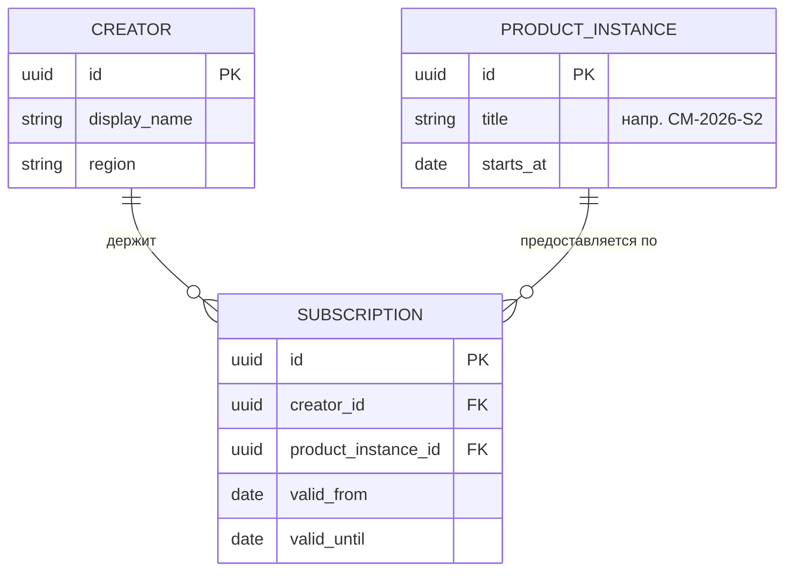

Mermaid упрощает нотацию (не различает ромб), но пригоден для концептуального уровня при соблюдении §1.

## §3 Правила трансформации ER → RDBMS

### §3.1 Сущность → Таблица
Каждая сущность становится таблицей. Атрибуты → колонки. Ключевой атрибут → PK.

### §3.2 Связь 1:1
- Если обязательная с обеих сторон → слить в одну таблицу.
- Если опциональная с одной стороны → FK в таблице опциональной стороны (NULL допустим).

### §3.3 Связь 1:N
FK в таблице на стороне N. Без промежуточных таблиц.

### §3.4 Связь M:N
Промежуточная таблица-связка с составным PK из FK обеих сторон. **Это техническая таблица, на концептуальной ER не показывается как сущность, только как ромб с кардинальностью N:M.** На физической схеме появляется.

Пример: `Creator M:N Role` → физ.схема `creators`, `roles`, `role_assignments(creator_id, role_code, valid_from)`.

### §3.5 Наследование (IS-A)
Три паттерна физ.схемы:
- **STI (Single Table Inheritance)** — одна таблица для всех подклассов + дискриминатор-колонка. Годится при тонких подклассах и большинстве общих атрибутов.
- **CTI (Class Table Inheritance)** — родительская таблица + по одной таблице на подкласс с FK на родителя. Годится при существенно разных атрибутах.
- **Table-per-class** — по одной таблице на подкласс без родительской. Годится при несвязанных подклассах.

Выбор — по ADR в документе архитектуры соответствующей БД.

### §3.6 Слабая сущность
Составной PK из FK родителя + локального ключа. CASCADE DELETE.

### §3.7 Многозначный атрибут
Выносится в отдельную таблицу с FK на исходную сущность.

## §4 Чек-лист проверки ER-диаграммы

Перед публикацией ER-диаграммы пройти:

- [ ] **Каждая сущность — объект физ.мира.** Тест: «Можно ли экземпляру дать имя собственное и показать пальцем?» Нет → это не сущность, удалить или превратить в связь.
- [ ] **Нет технических таблиц.** Нет `audit_log`, `user_sessions`, `request_cache`, `migrations`, `health_checks` как сущностей. Если они есть в физ.схеме — они появляются только на схеме, не на концептуальной ER.
- [ ] **Нет промежуточных M:N-таблиц как сущностей.** `role_assignments` → ромб «имеет роль» между Creator и Role, не узел.
- [ ] **Абстрактные каталоги конкретизированы.** Вместо `Product` → `ProductInstance` с примером имени («СМ-2026-S2»). Вместо `Subscription` (тип) → `Subscription` (экземпляр-контракт с датами).
- [ ] **Каждая сущность имеет хотя бы одну связь** (иначе — изолированный узел, либо связь не показана, либо сущность не относится к этой ER).
- [ ] **Кардинальности проставлены** на всех связях.
- [ ] **Если ER покрывает bounded context — BC обозначен.** Напр. «BC: Identity & Access».

## §5 Антипаттерны

1. **«Техническая ER».** На диаграмме `USER_SESSIONS`, `AUDIT_EVENTS`, `INTEGRATION_ATTEMPTS`. Это не сущности домена. → Удалить, оставить только для физ.схемы.
2. **«Абстрактный каталог».** На диаграмме `PRODUCT` без понимания, что это — тип курса или конкретный запуск. → Разнести: `ProductType` (мета) и `ProductInstance` (запуск с датой).
3. **«Отношение как сущность».** `INTEGRATION` — это связь «Creator ↔ External Service», не узел. → Линия между `CREATOR` и `EXTERNAL_SERVICE` с атрибутами связи (provider, scope).
4. **«Одна ER на всё».** Попытка уместить 12 БД на одну ER (согласно [DP.ARCH.004](../02-domain-entities/DP.ARCH.004-neon-data-architecture.md) §1 v2.3). → Одна ER на BC (bounded context), обзорная картинка §4.0 показывает кластеры, не детали.
5. **«Смешивание уровней».** На одной диаграмме объект «Человек» и таблица `users` (prefix snake_case). → Концептуальная ER: имена сущностей ПРОПИСНЫЕ/CamelCase, доменный язык (Creator, не user). Физ.схема: snake_case таблицы.

## §6 Области применения в платформе

| Документ | Уровень | Что показывает |
|----------|---------|----------------|
| `DP.ARCH.004 §4.0` | Обзор | 12 БД как кластеры + связи между ними (по одному узлу на БД, без таблиц) — согласно §1 v2.3 |
| `DP.ARCH.004 §5` | Концептуальная ER | Одна ER на BC (Identity & Access, Payment, Activity, etc.) — только физ.объекты |
| `DP.ARCH.004 §8` | Физ.схема | Таблицы с колонками, FK, типами (Writers/Readers) |

## §7 Как применять

1. При **новой БД:** сначала §5 (концептуальная ER), потом §8 (физ.схема) по правилам §3. НЕ наоборот.
2. При **ревизии:** проверить §4 чек-лист. Если есть ❌ — переделать ER, физ.схему оставить как есть.
3. При **росте** (новая сущность): сначала добавить на концептуальную ER, проверить §4, потом — миграция физ.схемы.

## §8 Связи

- Источник замечания: ИТ-встреча 19 апр 2026, Андрей.
- Различения: `.claude/rules/distinctions.md` AUTHOR (ER ≠ Физ.схема; Объект ≠ Отношение).
- Применение: `DP.ARCH.004-neon-data-architecture.md` §4.0 и §5 (переделка в WP-228 Ф8-Ф9).
- Решения: `DP.ARCH.004-decisions.md` ADR-003.


# SOURCE_FILE: pack/digital-platform/03-methods/DP.METHOD.041-entity-binding.md
---
---
id: DP.METHOD.041
name: Метод связывания доменных сущностей с физ.реализацией
type: method
status: active
valid_from: 2026-04-24
supersedes: "DP.METHOD.041 v1 (20 апр 2026) — §1-§7 связывание Pack↔§10↔DS"
summary: "Правило связывания доменных сущностей Pack (DP.D.*, DP.CONCEPT.*) с физ.реализацией (таблица БД в DP.ARCH.004 §10) и кодовой реализацией (DS-файлы/модули). Сохраняет OwnerIntegrity: один факт — одно место, обратная ссылка из Pack в реализацию есть, но источник правды — DP.ARCH.004. v2 (24 апр, WP-228 Ф30) расширен §4 ARCH-bump sync-процессом и §5 антипаттерном дублирования формулировок downstream."
related:
  uses:
    - DP.METHOD.040
  informs:
    - DP.ARCH.004
    - DP.ROADMAP.001
    - DP.SC.*
triggers:
  - "WP-228 Ф15b (20 апр 2026) — как связать БД-сущности с Pack-сущностями и DS-реализацией без дублирования"
  - "WP-228 Ф30 (24 апр 2026) — расширение §4 ARCH-bump sync + §5 антипаттерн дублирования формулировок в downstream"
created: 2026-04-20
updated: 2026-04-24
---

# DP.METHOD.041 — Метод связывания доменных сущностей с физ.реализацией

> **see DP.ARCH.004 §10, WP-228 Ф15b**
> Применяется при: создании новой таблицы в БД, появлении новой Pack-сущности с физ.реализацией, ревизии §10 на полноту связей, drift-аудите.

## §1 Принцип

**OwnerIntegrity:** одна связь «Pack-сущность ↔ таблица БД ↔ DS-реализация» описана в **одном** месте — справочнике [DP.ARCH.004 §10](../02-domain-entities/DP.ARCH.004-neon-data-architecture.md#10-справочник-таблиц). Pack-сущность не хранит ссылку на таблицу во frontmatter (избегаем двух источников правды).

**Обратная навигация:** от Pack-сущности к реализации — через поиск (`grep '<ID>' DP.ARCH.004`). Для частых навигаций — раздел «Связи» в самой Pack-сущности (ссылка на §10 строку), но это **линк-для-чтения**, а не дублированный факт.

## §2 Формат связывания в §10

Каждая строка справочника таблиц содержит две явные колонки связи:

| Таблица | … | **Pack-сущность** | **DS-реализация** |
|---------|---|-------------------|-------------------|
| DIGITAL_TWINS | … | [DP.D.036](...) «Цифровой двойник» | aist_bot_newarchitecture/db/queries/digital_twin.py |
| USER_EVENTS | … | §7.0.2 #4 «Событие созидателя (Silver)» | activity-hub/hub.py |

**Правила заполнения:**

1. **Pack-сущность** — ID (`DP.D.NNN` / `DP.CONCEPT.NNN` / `DP.ARCH.NNN`) **или** ссылка на §7.0.2-строку физ.объекта (если доменное имя уже там зафиксировано, отдельная Pack-сущность не нужна).
2. **DS-реализация** — относительный путь к папке/файлу, где таблица создаётся/читается. Если таблица-миграция без активных writers — пометить `—` (кандидат на удаление или на классификацию как 🔗/технический).
3. Если таблица **только физ.реализация** (технический лог, временный state, proxy) — в колонке Pack-сущность указать **«—» + класс** (`—, log`, `—, state`, `—, proxy`). Это сигнал: доменной сущности нет, только техническая.
4. Если одна Pack-сущность реализуется **несколькими таблицами** (partitioned / sharded / multi-layer) — все таблицы ссылаются на одну Pack-сущность. Пример: `RAW_EVENTS` + `USER_EVENTS` + `LEARNING_HISTORY` = три слоя (Bronze/Silver/Gold) одной сущности «Событие созидателя».
5. Если одна таблица реализует **несколько** Pack-сущностей (редкий случай: многоарендная сущность) — перечислить через запятую.

## §3 Drift-детектор

**Инвариант:** `§7.0.2 физ.объект ↔ §10 строка ↔ Pack-сущность (ID или §7.0.2 имя)`. Разрыв любой из трёх связей = drift.

**Проверка (ручная или скрипт):**

1. Каждая строка §10 имеет непустую колонку Pack-сущность (не `—` без класса, не пустую).
2. Каждый физ.объект §7.0.2 имеет хотя бы одну строку в §10 (это уже ВДВ-инвариант, Ф22).
3. Каждый `DP.D.*` / `DP.CONCEPT.*` с пометкой «физ.реализация» в описании находится в §10 как Pack-сущность хотя бы одной строки. Исключения: абстрактные сущности без физ.реализации (методы, принципы, роли без БД).
4. Каждый путь в колонке DS-реализация существует (file/dir check).

**Формализация — отложено в PMB WP-228** (скрипт `check-entity-binding.py` в `DS-ecosystem-development/scripts/`).

## §4 Процесс синхронизации при изменениях

| Событие | Действие |
|---------|----------|
| Новая таблица в БД | → добавить строку в §10 → заполнить Pack-сущность (создать `DP.D.*`, если нет) → заполнить DS-реализация (файл миграции + query-файл) → добавить физ.объект в §7.0.2 (ВДВ-инвариант) |
| Переименование таблицы | → обновить §10 строку → поиск `grep TABLE_NAME` по всему Pack/DS → обновить упоминания |
| Удаление таблицы | → `grep TABLE_NAME` во всех Pack-сущностях и DS-файлах → удалить строку §10 → удалить физ.объект §7.0.2 → если Pack-сущность осталась без реализации → помечаем `status: conceptual` или удаляем |
| Переименование Pack-сущности (ID) | → обновить все строки §10 с новым ID → обновить MAP.001 (auto через hook) |
| Перенос таблицы между БД | → обновить §10 (секция БД #N → #M) → обновить DS-реализация (новые пути к query-файлам) → обновить ER-диаграмму §3 (если есть) |
| **Bump версии ARCH (major)** | → grep по Pack + DS-my-strategy/inbox на ключевые термины старой формулировки (количество БД, имена БД, принципы) → список drift-файлов → заменить формулировку на ссылку «согласно DP.ARCH.NNN §X (vY.Z)» → добавить `derived_from: DP.ARCH.NNN@vY.Z` во frontmatter затронутых downstream → commit ARCH + downstream sync одной атомарной серией |

**Правило одновременности:** §10 + §7.0.2 + Pack-сущность правятся **в одном коммите**. Разрыв = drift.

### §4.1 Semver-классификация ARCH-bump

Не каждый bump требует downstream-sync. Классификация аналогична semver:

| Тип | Что поменялось | Sync-обязательство |
|-----|----------------|---------------------|
| **major** | Семантика решения: число сущностей, имена БД/BC, принципы границ, утверждённый контракт | **Обязателен** — автор делает grep+sync за один коммит |
| **minor** | Добавление новой сущности/раздела/примера без изменения существующего | По решению автора (обычно не нужен) |
| **patch** | Typo, форматирование, уточнение формулировки без смены семантики | Не нужен |

**Owner-обязательство:** sync делает **автор bump'а**, не читатель downstream. Причина — автор знает, что именно изменилось семантически. Читатель downstream столкнётся с устаревшей формулировкой случайно и запустит /archgate на давно решённое (см. Правило 22 `feedback_behaviour.md`).

### §4.2 Формат якоря `derived_from` во frontmatter downstream

Downstream-документы (Roadmap, SC, WP-контексты, другие ARCH, другие METHOD), ссылающиеся на решение ARCH, добавляют во frontmatter:

```yaml
derived_from: DP.ARCH.NNN@vY.Z   # одиночная ссылка
derived_from: [DP.ARCH.004@v2.3, DP.ARCH.006@v1.0]   # список, если зависит от нескольких
```

Якорь позволяет автоматически обнаруживать рассогласование (актуальная версия ARCH vs. `derived_from` в downstream) детектором `iwe-drift.sh` (см. WP-217 child WP-263).

## §5 Антипаттерны

1. **Backlink в Pack-сущности `physical_realization: [...]`** — создаёт два источника правды (Pack и §10). При переносе таблицы нужно править в двух местах, забудешь — drift. Только §10 — источник правды.
2. **Отдельный реестр `DP.MAPPING.NNN`** — третий источник правды, добавляет drift между реестром и §10. Избегаем.
3. **Pack-сущность без физ.реализации, описанная как будто она есть в БД** — доменная абстракция (метод, роль, принцип) не должна иметь строку в §10. Если добавили — это концептуальная ошибка уровня «смешение доменной модели и реализации».
4. **Колонка «Источник» в §10 заполняется ссылкой на WP, а не на DS-файл или миграцию** — WP закроется и контекст потеряется. Источник должен указывать на **существующий в коде артефакт**: миграция `db/migrations/NNN.sql`, WP-файл только как исторический контекст.
5. **Дублирование формулировки ARCH-решения в downstream вместо ссылки.** Roadmap / SC / WP-контекст копирует формулировку вида «9 БД», «или схем», «принцип database-per-BoundedContext» из ARCH в свой текст — при следующем bump ARCH downstream живёт со старой формулировкой неограниченно. Правило: downstream пишет **ссылку** «согласно DP.ARCH.NNN §X (vY.Z)», не формулировку. Формулировка — один раз в ARCH. Частный случай — версия в ссылке: при bump ARCH обновляется только номер версии в downstream-ссылках (grep по старой версии → sync автором bump'а, см. §4 и §4.1).
6. **Search-replace без whitelist.** Механическая замена старой формулировки по всему репо ломает исторические контексты: архив предыдущего состояния, описание антипаттерна, контекст-файлы закрытых WP. Правило: whitelist файлов — только `active` (Pack, inbox активных WP); исключить `archive/*`, `DS-my-strategy/archive/wp-contexts/*`, исторические маркированные блоки («было X, стало Y»). Проверять каждую замену глазами.

## §6 Области применения

- При создании новой БД (совместно с [DP.METHOD.040](DP.METHOD.040-er-modeling.md) ER-моделирование).
- При каждой правке §10 DP.ARCH.004.
- При ревизии Pack-сущности (D/CONCEPT): есть ли у неё физ.реализация? где?
- При ревизии DS-репо: какие таблицы он создаёт/читает? все ли в §10?
- При аудите WP-228 (drift-поиск между Pack и §10).

## §7 Связи

- [DP.METHOD.040](DP.METHOD.040-er-modeling.md) — ER-моделирование. Связывание применяется **после** ER (сначала физ.объекты и их связи, затем связывание с Pack-сущностями).
- [DP.ARCH.004](../02-domain-entities/DP.ARCH.004-neon-data-architecture.md) — источник правды, где хранится реестр связей.
- HD «Pack-знание ≠ Реализационное решение» (hard-distinctions.md #29) — концептуальная основа разделения уровней.
- HD «OwnerIntegrity: Один факт — одно место» — основание §1 принципа.


# SOURCE_FILE: pack/digital-platform/03-methods/DP.METHOD.042-graph-usage-scenarios.md
---
---
id: DP.METHOD.042
name: Сценарии использования concept-графа агентами в runtime
type: method
status: draft
valid_from: 2026-04-24
summary: "4 сценария применения concept-графа агентами платформы IWE: Claude Code (я), автор Pack, ролевые агенты бота (Портной/Оценщик/Навигатор), учебная траектория. Каждый описан по шаблону IntegrationGate шаг 2: потребитель → триггер → запрос → использование → observable-сигнал."
related:
  realizes: [DP.SC.121]
  uses: [DP.SOTA.019, DP.SOTA.017, DP.METHOD.031]
  informs: [WP-242, WP-222, WP-227]
  source: "WP-242 Ф8.1, ритуал согласования 24 апр 2026"
created: 2026-04-24
updated: 2026-04-24
---

# DP.METHOD.042 — Сценарии использования concept-графа агентами в runtime

> **see DP.SC.121, DP.SOTA.019**
>
> Артефакт IntegrationGate шаг 2: «кто запускает, когда, зачем, в каком контексте, что делает с результатом».
> Цель: развернуть обещание SC.121 до операциональной спецификации, достаточной для реализации и observability.

## §1 Шаблон описания сценария

Каждый сценарий описан по 6 полям (совместимо с шаблоном IntegrationGate):

1. **Потребитель** — какой агент + какая роль (из `02-domain-entities/DP.ROLE.*`)
2. **Триггер** — какой входной сигнал активирует использование графа
3. **Данные на входе** — что агент уже знает до обращения к графу
4. **Запрос к графу** — какой MCP-tool вызывается, с какими параметрами
5. **Использование результата** — как чанки + граф-контекст встроены в ответ
6. **Observable-сигнал** — что логируется в `platform.health.graph_usage_events`

## §2 Приоритеты сценариев

Порядок сценариев = порядок развёртывания (Ф8.4+ WP-242). Первый сценарий — первый пилот; последний — после стабилизации метрик.

| # | Сценарий | Приоритет | Режим SC.121 | Ф8.N |
|---|---------|-----------|--------------|------|
| 1 | Я в Claude Code | **1 (пилот)** | (a) всегда + (b) для 4 подслучаев | Ф8.4 |
| 2 | Автор Pack (я через Claude Code) | **2** | (a) + (b) «редактирование Pack» | Ф8.4-Ф8.5 |
| 3 | Портной в проде | **3** | (a) + (b) «Pack-обучение» для Tailor-mode | Ф8.8 |
| 4 | Оценщик / Навигатор | **4-5** | (a) + (b) по контексту | Ф8.8 |
| 5 | Учебная траектория (prereq/specializes) | **6** (опционально, после validation) | (a) + (b) «учебная последовательность» | Ф8.9 |

## §3 Сценарий 1. Я в Claude Code (приоритет 1, первый пилот)

- **Потребитель:** я (opus-4.7 / sonnet-4.6) в `claude code` как Claude Code-агент, исполняющий роли R1 Стратег, R24 Архитектор, R10 Аудитор (контекстно).
- **Триггер:** пользователь задаёт вопрос, ответ на который требует Pack-знания. Примеры:
  - «Что такое X?» → определение + соседи
  - «Чем X отличается от Y?» → дифференциация (граф: общие предки/свойства)
  - «Где в Pack описано Z?» → локализация концепта
  - «Проверь, нет ли противоречий в моей формулировке» → сравнение с онтологией
- **Данные на входе:** текст запроса пользователя, контекст текущей сессии (WP, ветка, недавние правки), список открытых файлов.
- **Запрос к графу:**
  - Шаг 1: `knowledge_search(query=<текст>, top_k=10)` — получить чанки-кандидаты (embedding).
  - Шаг 2: извлечь `concept_ids` из metadata чанков.
  - Шаг 3: `knowledge_concept_neighbors(concept_ids=[...], edge_types=[specializes, part_of, related], depth=1-2)` — получить соседей.
  - Шаг 4 (опц., для режима b): `knowledge_concept_status(concept_ids=[...])` — свежесть/superseded/misconception.
- **Использование результата:**
  - Режим (a): отфильтровать superseded/deprecated/misconception из authoritative-утверждений ответа.
  - Режим (b): добавить в текст ответа 1-3 ближайших концепта + коды `[DP.*]` + file:line ссылки.
  - Формат ссылок: markdown `[DP.SC.121](pack/.../DP.SC.121-ontology-grounded-answers.md)`.
- **Observable-сигнал:**
  - `graph_usage_events` row: `agent_id=claude-code`, `scenario=1`, `concept_ids_retrieved=[...]`, `concept_ids_cited=[...]`, `edge_types_used=[...]`, `citation_rate = cited / retrieved`, `stale_used_count`, `misconception_used_count`, `latency_ms`.
  - Агрегат: `ontology_citation_rate` по режиму (b).

## §4 Сценарий 2. Автор Pack (приоритет 2)

- **Потребитель:** я через Claude Code в роли R?? Pack-Author (или R1 Стратег в режиме правки Pack).
- **Триггер:** явный запрос на правку/расширение Pack:
  - «Добавь концепт Z в Pack»
  - «Проверь, какие рёбра стоит добавить к [DP.D.050]»
  - «Найди orphan-концепты» / «найди suspicious edges»
  - «Есть ли дубликат для этого понятия?»
- **Данные на входе:** предложение на правку Pack (текст), список недавно изменённых файлов.
- **Запрос к графу:**
  - Для проверки дубликатов: `knowledge_concept_search_by_name(name=<RU или EN>, fuzzy=true)` + `knowledge_concept_embedding_neighbors(embedding=..., top_k=5)`.
  - Для предложения рёбер: `knowledge_concept_neighbors(concept_id=..., depth=2, include_weak=true)` + сравнить с FPF-корнями (DP.METHOD.031).
  - Для orphan-аудита: `knowledge_graph_orphans()` → вернуть концепты без рёбер.
  - Для suspicious-аудита: `knowledge_graph_suspicious_edges()` → вернуть рёбра с низкой confidence или кроссязыковые без нормализации.
- **Использование результата:**
  - Предложить автору: «похожий концепт уже есть — [DP.D.XXX]» / «стоит добавить ребро `related →` к [U.System]».
  - Сгенерировать diff в Pack-файле (Edit-tool), **не коммитить автоматически** — автор подтверждает.
- **Observable-сигнал:** `graph_usage_events` с `scenario=2`, `edit_suggestions_accepted`, `edit_suggestions_rejected`, `orphans_found`, `suspicious_found`, `dup_prevented_count`.
- **Связь с регрессом 24 апр** (orphans 9→20, suspicious 3→8, WP-242 §Ф6): этот сценарий — основной механизм диагностики. Запустить при первой реализации.

## §5 Сценарий 3. Портной в проде (приоритет 3)

- **Потребитель:** R?? Портной (DP.ROLE.NNN, draft), запускается в боте `@aist_me_bot` или через `/tailor` в IWE.
- **Триггер:** пользователь запросил адаптацию контента/маршрута под свою ступень или контекст:
  - «Что мне почитать про X?» (пользователь ступень 2, домен «Личное развитие»)
  - «Объясни X на моём уровне»
  - «Построй маршрут до ступени 3»
- **Данные на входе:** `user_profile` (ступень из RCS, предпочтения, недавняя активность из activity-hub), запрос пользователя, `target_concept` (извлечён из запроса через LLM).
- **Запрос к графу:**
  - Шаг 1: `knowledge_concept_resolve(query_text=<X>)` → normalize к concept_id.
  - Шаг 2: `knowledge_concept_neighbors(concept_id=target, edge_types=[prerequisite, specializes], depth=2)` → найти предпосылки и специализации.
  - Шаг 3: `knowledge_guide_for_concept(concept_id=target, level=<ступень>)` → найти подходящие руководства (RCS-aware).
  - Шаг 4: `knowledge_concept_status(concept_ids=[...])` — отфильтровать superseded.
- **Использование результата:**
  - Построить ответ с объяснением на уровне ступени + 1-2 рекомендации руководств + следующий шаг (если есть prereq, не освоен → начать с него).
  - Режим (b) активен всегда для Портного — это Pack-обучение.
- **Observable-сигнал:** `graph_usage_events` с `scenario=3`, `agent_id=tailor`, `user_level`, `target_concept_id`, `prereq_chain_depth`, `guide_recommendations_count`, `recommendation_accepted` (если user кликнул/попросил ещё).
- **Зависимость:** DP.SC.121 × WP-222 (Портной без tailor-mcp) × WP-104 (RCS для ступени).

## §6 Сценарий 4. Оценщик / Навигатор (приоритет 4-5)

### 4.1 Оценщик

- **Потребитель:** R?? Оценщик (DP.ROLE.NNN), проверяет РП/решения/работы пользователя.
- **Триггер:** пользователь отправил артефакт на проверку («оцени мою схему», «проверь задание»).
- **Данные на входе:** артефакт пользователя + эталонный концепт (что должно быть).
- **Запрос к графу:** `knowledge_concept_criteria(concept_id=target)` → извлечь критерии приёмки + `knowledge_concept_neighbors` для соседей «чего не хватает».
- **Использование:** сравнение артефакта с критериями + подсказки по отсутствующим аспектам (на основе соседей).
- **Observable:** `eval_concept_id`, `criteria_coverage`, `missing_aspects_hinted`.

### 4.2 Навигатор

- **Потребитель:** R27 Навигатор (DP.ROLE.027 / MIM.R.007).
- **Триггер:** вопрос «с чего начать» / «что дальше» / «зачем мне это».
- **Данные на входе:** ступень пользователя, активная программа (ЛР), недавняя траектория.
- **Запрос к графу:**
  - `knowledge_concept_path(from=<текущая ступень>, to=<цель>, edge_type=prerequisite)` → траектория.
  - `knowledge_concept_worldview_phase(concept_id=target)` → фаза дуги (PD.FORM.087).
- **Использование:** ответ по дуге нарратива (Навигатор-скилл + граф даёт реалистичность «что следующее»).
- **Observable:** `phase_transition_hint_count`, `path_recommendation_accepted`.

## §7 Сценарий 5. Учебная траектория (приоритет 6, опциональный)

- **Потребитель:** R?? Сборщик-траектории (DP.ROLE.NNN — может возникнуть после обкатки 1-4).
- **Триггер:** запрос «собери курс X» / «полный путь от ступени 2 до ступени 3».
- **Данные на входе:** стартовая точка + целевая точка + ограничения (бюджет времени, предпочитаемый формат).
- **Запрос к графу:** комбинация `knowledge_concept_path(prerequisite)` + `knowledge_concept_neighbors(specializes)` для покрытия всех узлов маршрута.
- **Использование:** сгенерированный план обучения с конкретными руководствами/упражнениями на каждый концепт.
- **Observable:** `trajectory_length`, `trajectory_coverage_gap` (сколько концептов остались без руководств).
- **Причина низкого приоритета:** требует устойчивых prerequisite-рёбер (сейчас всего 33 ребра типа prerequisite — недостаточно). Активируется после Ф8.7 feedback-loop.

## §8 Общие правила для всех сценариев

1. **Fallback при недоступности графа** (HD «Snapshot ДО действия»): любой timeout / 5xx от `knowledge_concept_*` tool → ответ идёт через `knowledge_search` + пометка «без ontology-grounding» в `graph_usage_events.fallback_reason`.
2. **Latency-бюджет** (DP.SOTA.019): 1 вызов graph-tool не должен добавлять >20% к базовой латентности ответа. Если добавляет — кешировать neighbors в Redis/memory.
3. **PII-безопасность** (B7.3 WP-212): в `graph_usage_events` не логируется `query_text` в открытом виде (хэш или обобщение). Только concept_ids, tool_name, counts.
4. **Owner event** (HD #49 «Системная БД ≠ Health-хранилище»): события графа пишутся в `platform.health.graph_usage_events` (DB #8), не в БД knowledge-mcp.

## §9 Reference-параметры MCP-tools

Точный набор tool'ов и их сигнатуры — в `DS-MCP/knowledge-mcp/README.md` после реализации Ф8.4+. Ниже — проектная спецификация (может уточняться):

| Tool | Параметры | Возвращает | Сценарии |
|------|-----------|-----------|----------|
| `knowledge_search` | query, top_k, filters | chunks + concept_ids | все (базовый) |
| `knowledge_concept_neighbors` | concept_ids[], edge_types[], depth | neighbor concepts + edges | 1, 2, 3, 4 |
| `knowledge_concept_status` | concept_ids[] | status, superseded_by, misconception | все (a) |
| `knowledge_concept_resolve` | query_text | normalized concept_id | 3, 4, 5 |
| `knowledge_concept_path` | from, to, edge_type | ordered path | 4.2, 5 |
| `knowledge_graph_orphans` | — | orphan concept list | 2 |
| `knowledge_graph_suspicious_edges` | — | edges with low confidence | 2 |
| `knowledge_concept_criteria` | concept_id | criteria list | 4.1 |
| `knowledge_guide_for_concept` | concept_id, level | guide recommendations | 3 |

## §10 Связь

- **Реализует** DP.SC.121 (Ontology-grounded answers).
- **Опирается на** DP.SOTA.019 (паттерны Graph-RAG runtime), DP.SOTA.017 (гигиена графа), DP.METHOD.031 (FPF-маппинг концептов).
- **Информирует** WP-242 Ф8.2 (системный план), WP-222 (Портной), WP-227 (/twin).
- **Откроет** новую роль `graph-traversal-tool` (owner?) — создаётся в Ф8.3 ArchGate как часть IntegrationGate шаг 3.


# SOURCE_FILE: pack/digital-platform/03-methods/DP.METHOD.050-quantum-like-lens-application.md
---
---
id: DP.METHOD.050
name: Метод применения Quantum-Like Lens (QL-lite)
type: method
status: active
valid_from: 2026-04-27
derived_from: DP.SOTA.020@2026-04
summary: "Дисциплина применения quantum-like линзы FPF C.26* в проектировании метрик, диагностики, наблюдаемости и архитектурных решений. Активируется только при остаточной запутанности после классического набора. Включает 5 предохранителей и явный критерий выхода."
related:
  uses:
    - DP.SOTA.020
    - DP.SOTA.011
    - DP.SOTA.001
  informs:
    - DP.ARCH.001
    - DP.ARCH.004
    - DP.SC.NNN  # все user-facing SC, где есть наблюдаемое поведение
triggers:
  - "Пост Илевского 26-27 апр 2026 — выпуск кластера FPF C.26*"
  - "ArchGate cases с законом Конвея, Гудхарта, диагностики (probe-coupled state change)"
  - "Проектирование KPI / лидерборда / observability metrics — DP.SOTA.015"
  - "Дизайн диагностического диалога (R28 Диагност, MIM.R.009)"
created: 2026-04-27
---

# DP.METHOD.050 — Метод применения Quantum-Like Lens (QL-lite)

> **see DP.SOTA.020, FPF C.26*, FPF C.11 Decision Theory**
> Применяется при: проектировании метрик, диагностики, observability, архитектурных решений с probe-coupling, выявлении entanglement-like non-separability в системах.

## §1 Принципы

1. **QL-lens = representational, не ontological.** Заимствуется математика incompatibility / non-commuting / Hilbert-state, не физическая квантовость носителя.
2. **Classical-first.** Сначала исчерпать классический набор; QL-линза — поверх, не вместо.
3. **Минимальный пол формализма.** «One minimal mathematical floor versus premature heavy formalism» (FPF). Не тащить полный quantum state-space там, где достаточно «order effects matter».
4. **Явные предохранители.** Без 5 ответов §4 линза не активирована.
5. **Явный выход.** Критерий «когда возвращаемся в классику» обязателен до входа.

## §2 Триггеры активации

QL-lite активируется, когда **после** классического набора остаются:

| Симптом | Распознавание | Пример |
|---------|---------------|--------|
| **Order effects** | Ответ на «X→Y» ≠ ответ на «Y→X» | Опрос Диагноста: «как вы устаёте?» → «как вы планируете?» даёт другую картину, чем обратный порядок |
| **Incompatibility** | Два измерения дают несовместимые результаты не из-за шума | Метрика «активность ученика» vs метрика «глубина проработки» — ученик не может максимизировать обе одновременно |
| **Probe-coupling** | Сам факт измерения изменил измеряемое | Гудхарт: ввели KPI лидерборда → люди оптимизируют KPI, не цель |
| **False composition** | «Частичные истины» соединяются в нерабочий результат | Архитектура каждого сервиса корректна, но границы между ними копируют политику команды (Конвей) |
| **Cross-context evidence transfer** | Свидетельство из A нельзя перенести в B без перестройки | «Этот метод работает в проде на B2B SaaS» → перенос на образование без переоснований |

**Классический набор (исчерпать ДО QL-lite):**
1. Простое измерение и анализ
2. Доказательство в одном контексте
3. Понятийные мосты между контекстами (FPF F.9)
4. Работа ролей (FPF A.15)
5. Q-bundle качества (FPF C.25)
6. Coarsening / упрощение (FPF A.6.3.CSC)

## §3 Шаги применения

### Шаг 1. Классификация ситуации

Какой из 4 паттернов C.26* применим?

| Паттерн | Когда выбирать |
|---------|----------------|
| **C.26 root lens** | Несколько симптомов одновременно или неясно, какой именно |
| **C.26.1 Probe-Coupled Boundary Interaction** | Главный симптом — probe изменил состояние через границу контекста |
| **C.26.2 Enacted Distributed State Evidence** | Главный симптом — состояние со-конструируется измерением (не существует «до») |
| **C.26.3 Viability-Envelope Boundary Regulation** | Главный симптом — изменение границы одной системы рушит viability другой (entanglement) |

### Шаг 2. Заполнить чеклист предохранителей §4

Без всех 5 ответов — стоп, остаёмся в классике.

### Шаг 3. Минимальный формализм

- Назвать **observables** (что именно измеряется/наблюдается).
- Назвать **incompatibility** между ними (если есть): какие пары observables не коммутируют.
- Назвать **measurement-class** для каждой observable (через что измеряем, и как это меняет состояние).
- Не вводить полный Hilbert-space, если достаточно order-table или non-commutativity matrix.

### Шаг 4. Принять решение

- **Choose now**: имеющейся модели достаточно, действуем.
- **Reject the current set**: текущий набор observables негоден, искать другие.
- **Probe again**: повторить измерение в другом порядке/контексте.
- **Reroute**: задача не решается на этом уровне, поднимаем выше.

### Шаг 5. Выход в классику

При достижении критерия выхода (§4 п.5) — фиксировать вывод, отключить QL-режим, документировать решение классически.

## §4 Предохранители (5 обязательных ответов)

При активации QL-lite агент **обязан явно ответить**:

1. **Responsible party.** Кто отвечает за систему до применения линзы? (роль, человек, команда)
2. **Конкретный сбой представления.** Какое классическое представление сломалось? (что именно нельзя выразить без QL?)
3. **Самый слабый допустимый вывод.** Минимальное утверждение, ради которого вводится линза. Без overclaim.
4. **Действие, которое зависит от модели.** Какое решение/изменение мы хотим принять?
5. **Критерий остановки.** Когда мы понимаем, что вышли из QL-режима и возвращаемся в классику?

**Если хотя бы один ответ отсутствует — линза не активирована.** Возвращаемся в классический набор и ищем неиспользованный его инструмент.

## §5 Worked examples (применение в IWE)

### Пример 1. Проектирование KPI лидерборда учеников (DP.SOTA.015)

**Сбой классики:** показатель «часов в неделю» нейтрален в моделировании, но в реальности появление публичного рейтинга меняет поведение учеников.
**Паттерн:** C.26.1 Probe-Coupled.
**Observables:** часы / глубина / удержание / NPS.
**Incompatibility:** часы↔глубина (можно тратить часы на лёгкие задания).
**Predохранители:**
1. Responsible: продакт + Стратег.
2. Сбой: классическая модель «KPI отражает прогресс» ломается из-за Гудхарта.
3. Слабый вывод: введение публичной метрики неминуемо изменит распределение поведений в этом измерении.
4. Действие: либо ввести KPI с явным контр-весом, либо отказаться от публичности.
5. Stop: после A/B-теста с/без лидерборда измеримость восстановлена.

### Пример 2. Диагност R28 (PD.MIM.009)

**Сбой классики:** анкета «считывает ступень» как фиксированное состояние ученика; ответы зависят от последовательности и формулировок.
**Паттерн:** C.26.2 Enacted Distributed State + order effects.
**Observables:** ступень мастерства, bottleneck.
**Incompatibility:** «как ты отдыхаешь» vs «как ты планируешь» — разные observables, не сводятся к одной шкале.
**Предохранители:**
1. Responsible: R27 Навигатор после R28.
2. Сбой: модель «ученик имеет ступень X до диагностики» опровергается тем, что вопросы R28 меняют видение себя.
3. Слабый вывод: диагностика **со-конструирует** ступень в момент диалога; она валидна на момент диалога, не «вообще».
4. Действие: проектируем диалог R28 с фиксацией порядка вопросов и явной передачей результата R27.
5. Stop: после фиксации передачи Навигатору ученик действует — обратной связи достаточно для классической калибровки.

### Пример 3. Карта 12 БД (DP.ARCH.004) — закон Конвея

**Сбой классики:** database-per-service моделирует БД как независимые; реальное изменение схемы БД #5 невозможно без коммуникации с командой-владельцем БД #1, чей контракт сцеплен.
**Паттерн:** C.26.3 Viability-Envelope.
**Observables:** schema_version (БД), team_capacity (команда-владелец).
**Incompatibility:** изменения схемы и капасити команды некоммутируют (порядок «сначала БД, потом команда» ≠ «сначала команда, потом БД»).
**Предохранители:**
1. Responsible: Архитектор + owner-роли БД.
2. Сбой: «database-per-service независимы» — миф; они entangled через team boundary.
3. Слабый вывод: миграции БД — это совместное изменение БД И team-границы; нельзя одно без другого.
4. Действие: при любой schema change проверять `Viability(team) × Viability(schema)` совместно.
5. Stop: после стабилизации обоих границ (4 спринта без incident'ов из-за coupling).

### Пример 4. Strategy Session

**Сбой классики:** «обсуждение целей выявляет цели» — но цели меняются в процессе обсуждения.
**Паттерн:** C.26.1 Probe-Coupled + C.26.2 Enacted.
**Простой вывод:** нумерация неудовлетворённостей и порядок их обсуждения **меняют** итоговый набор приоритетов. Стратег обязан вести две версии: вход и выход сессии, и явно фиксировать probe-effect.

### Пример 5. Memory vs Persona (HD #27, DP.D.050)

**Сбой классики:** Persona трактуется как «декларативный read-only слой».
**Паттерн:** C.26.2 Enacted.
**Простой вывод:** запись в Persona меняет автора (рефлексивный эффект). Memory.Derived (расчёт из событий) остаётся байесовской; Persona — quantum-like.

## §6 Антипаттерны

| Антипаттерн | Симптом | Корректное поведение |
|-------------|---------|---------------------|
| **Прыжок в QL** | Применяем линзу до исчерпания классики | Сначала §2 классический набор |
| **Prestige citation** | «Это quantum-like» как украшение текста, без указания, что именно ремонтирует | Явно назвать сбой представления (предохранитель 2) |
| **Heavy formalism** | Тащим Hilbert-space там, где достаточно order-table | Минимальный пол формализма (§1.3) |
| **Physical quantum claim** | Утверждаем, что система «физически квантовая» | Lens = representational, не ontological |
| **Вечный QL-режим** | Не вышли в классику после решения | Предохранитель 5: критерий выхода обязателен |
| **Пропущенный probe-cost** | Не учли, что само измерение требует ресурса | FPF C.11 bounded-resource probe doctrine |

## §7 Связи

- **DP.SOTA.020** — теоретическое основание (FPF C.26*).
- **DP.SOTA.011 Coupling Model** — статическая coupling, дополняется probe-coupling из QL-lens.
- **DP.SOTA.015 AI/LLM Observability** — метрики observability часто probe-coupled.
- **DP.SOTA.001 DDD Strategic** — bounded contexts могут быть entangled (Viability-Envelope).
- **DP.ARCH.001 §7** — применять C.26 как 4-й SOTA-маркер чеклиста современности при ArchGate.
- **DP.ARCH.004 §10** — Viability-Envelope для границ БД↔команда.
- **PD.MIM.009 (Диагност)** — Enacted Distributed State Evidence как онтология диалога.
- **HD #50** в `.claude/rules/distinctions.md` — короткое различение «байесовское наблюдение ≠ QL-вмешательство».

## §8 История

- **2026-04-26/27** — Илевский опубликовал FPF C.26* (4 новых паттерна + правки 13 существующих, edition 2026-04, FPF size → 5.9M).
- **2026-04-27** — DP.METHOD.050 создан в рамках WP-274 (интеграция QL-линзы в IWE).


# SOURCE_FILE: pack/digital-platform/03-methods/MCP-NAMESPACE.md
---
# MCP Namespace — соглашение IWE

> **Источник:** WP-189 Ф2 (1 апр 2026)
> **Статус:** active
> **Связи:** WP-175 (tailor-mcp контракт), WP-187 (knowledge-mcp изоляция), WP-184 (knowledge_feedback), WP-73 ADR-018

## Namespace соглашение

| Префикс | Категория | Кто управляет | Примеры |
|---------|-----------|--------------|---------|
| без префикса | Платформенные (наши) | Платформа (обновляем через update.sh) | `knowledge-mcp`, `digital-twin-mcp` |
| `ext-*` | Вендорские | Вендоры (OAuth-токены пользователя) | `ext-google-calendar`, `ext-linear`, `ext-slack` |
| `<username>-*` | Пользовательские | Пользователь (его данные, его ответственность) | `tseren-notes`, `tseren-obsidian` |

**Правило:** платформенные — без префикса (их имена зарезервированы). Вендорские — `ext-*`. Пользовательские — свой префикс (username или любой уникальный).

## Симметричная схема трёх платформенных MCP

```
Пользователь работает в: claude.ai / Cursor / Telegram
         ↓ (один Gateway URL, OAuth через Ory)
┌──────────────────────────────────────────────────┐
│  MCP Gateway (наш, Ory auth)                     │
│                                                  │
│  knowledge-mcp        ← общее знание платформы  │
│  (L2 shared + L4 per-user) ZP/FPF/SPF/Pack + личные репо │
│                                                  │
│  digital-twin-mcp     ← ЦД пользователя         │
│  (per-user RLS)         прогресс, профиль        │
│                                                  │
│  personal-knowledge-mcp  ← его репо             │
│  (per-user RLS)           эмбеддинги на нашей   │
│                           инфре                 │
└──────────────────────────────────────────────────┘
```

Все три — **наши сервисы**. Изоляция через RLS по `user_id`, не отдельные инстансы.

## Ownership данных

| MCP | Читает | Пишет | Владелец расчёта |
|-----|--------|-------|-----------------|
| `knowledge-mcp` | ZP, FPF, SPF, Pack платформы | — | Платформа |
| `digital-twin-mcp` | `3_derived` из Neon | `1_declarative`, `2_collected` | **R28 Профилировщик** = writer `3_derived` |
| `personal-knowledge-mcp` | Репо пользователя (выбранные) + Qdrant | GitHub коммит (async) | Пользователь |

> **⚠️ digital-twin-mcp = read-only потребитель `3_derived`.** R28 Профилировщик (AISYS.018) = единственный writer. On-demand recalc → вызов через R28, не внутри digital-twin-mcp.

## Выбор репо для индексации (personal-knowledge-mcp)

Пользователь явно указывает какие репо индексировать — платформа не индексирует всё автоматически.

**Где указывается:** настройки Gateway (UI) или `.exocortex.env`:
```
PERSONAL_KNOWLEDGE_REPOS=TserenTserenov/PACK-my-domain,TserenTserenov/DS-my-notes
```

**Как работает:**
1. Пользователь добавляет репо в список
2. Платформа индексирует → эмбеддинги в Neon/Qdrant с его `user_id`
3. При push в репо → webhook → переиндексация изменённых файлов
4. `personal-knowledge-mcp` возвращает только его данные (RLS)

## Контракты MCP (спецификации для downstream РП)

### knowledge-mcp → WP-187

```
Tool: search(query: str, source?: str, source_type?: str, limit: int = 5) → SearchResult[]
  Изоляция:
    - Авторизованный пользователь автоматически видит платформенные + свои личные документы
    - user_id передаётся прозрачно через HTTP-заголовок X-User-Id (Gateway из Ory JWT)
    - НЕ через аргументы tool (защита от подмены user_id)
    - platform namespace (user_id IS NULL): ZP, FPF, SPF, Pack платформы — доступно всем
    - user namespace (user_id = UUID): Pack пользователя — только владельцу
    - прямой доступ минуя Gateway: только platform namespace

Tool: knowledge_feedback(document_id: str, query: str, helpfulness: bool, user_id: str) → void
  Сохраняет в retrieval_feedback(user_id, document_id, query_hash, helpfulness, created_at)
  Реализация: WP-184 Ф3
```

### digital-twin-mcp → WP-175

```
Tool: get_tailor_context(user_id: str) → TailorContext
  Возвращает: diagnostic_profile, learning_history, current_areas, suggested_depth
  RLS: изолировано по user_id
  Latency: < 500ms (кэш, обновляется R28)
```

### personal-knowledge-mcp → WP-187

```
Tool: search(query: str, user_id: str, limit: int = 5) → SearchResult[]
  Ищет только в репо пользователя (его user_id)

Tool: propose_capture(content: str, suggested_location: str, user_id: str) → CaptureProposal
  Поведение: зависит от capture_autonomy в params.yaml
    propose (default): возвращает предложение, ждёт подтверждения
    auto: сразу пишет в GitHub

Tool: write(path: str, content: str, user_id: str) → WriteResult
  Auth: GitHub App Installation Token (repo-scoped)
  Async: write → queue → background commit (~5 сек)
  Side effect: ingest_event() в Activity Hub (ADR-009)
```

## Temporal метаданные (единый формат с WP-180 Ф10.1)

Все эмбеддинги в Qdrant:
```json
{
  "document_id": "PACK-my-domain/concept.md",
  "content": "...",
  "valid_from": "2026-01-15",
  "superseded_by": null,
  "user_id": "TserenTserenov"
}
```

Единый формат с MEMORY.md frontmatter (WP-180 Ф10.1):
```yaml
---
valid_from: 2026-01-15
superseded_by: null
---
```

При поиске: `superseded_by != null` → пониженный score.

## ADR-018 (WP-73 §3.8) — обновить

Добавить namespace соглашение: платформенные (без префикса) / вендорские (`ext-*`) / пользовательские (`<username>-*`).


# SOURCE_FILE: pack/digital-platform/04-work-products/DP.WP.001-extraction-report.md
---
---
id: DP.WP.001
name: Отчёт экстракции
type: work-product
status: draft
summary: "Структурированный отчёт экстракции знаний с классификациями, предложениями и валидацией"
created: 2026-02-10
trust:
  F: 3
  G: domain
  R: 0.5
epistemic_stage: emerging
related:
  produced_by: [DP.M.001]
---

# Отчёт экстракции знаний

## 1. Определение

**Отчёт экстракции** — рабочий продукт метода экстракции знаний (DP.M.001): структурированный список кандидатов на запись в Pack с классификацией, маршрутом и вердиктом.

## 2. Назначение

Отчёт решает проблему «потерянных знаний»: без фиксации результатов экстракции кандидаты забываются между сессиями, записываются не в тот Pack, или записываются без формализации.

## 3. Структура

### 3.1. Заголовок

```yaml
---
type: extraction-report
source: session | bulk | audit
date: YYYY-MM-DD
session_id: (опционально)
pack_target: PACK-digital-platform | PACK-personal | PACK-ecosystem
---
```

### 3.2. Список кандидатов

Каждый кандидат содержит:

| Поле | Описание | Обязательное |
|------|----------|-------------|
| `id` | Порядковый номер в отчёте | Да |
| `source` | Откуда извлечено (файл, диалог, коммит) | Да |
| `raw_text` | Исходный текст/цитата | Да |
| `classification` | Тип знания (distinction, method, entity, fm, wp, rule) | Да |
| `route` | Целевой файл/секция в Pack | Да |
| `formalized` | Формализованный текст для записи | Да |
| `verdict` | accept / reject / defer | Да |
| `reason` | Обоснование вердикта | При reject/defer |

### 3.3. Пример записи

```markdown
### Кандидат #1

- **Источник:** Сессия 2026-02-10, рефакторинг бота
- **Сырой текст:** «Оказалось, что FSM-стейт должен быть idempotent — повторный вход не должен менять данные»
- **Классификация:** failure-mode
- **Маршрут:** PACK-digital-platform/05-failure-modes/DP.FM.XXX-non-idempotent-state.md
- **Формализованный текст:**
  > **FM: Неидемпотентное состояние FSM.** Повторный вход в состояние изменяет данные пользователя. Антипаттерн: side-effect в onEnter без проверки текущего состояния.
- **Вердикт:** accept
```

### 3.4. Сводка

```markdown
## Сводка

| Метрика | Значение |
|---------|----------|
| Всего кандидатов | N |
| Принято (accept) | N |
| Отклонено (reject) | N |
| Отложено (defer) | N |
| Pack'ов затронуто | N |
| Файлов для изменения | N |
```

## 4. Жизненный цикл

```
Создание (экстракция) → Ревью (пользователь) → Применение (запись в Pack) → Архивация
```

| Стадия | Кто | Действие |
|--------|-----|----------|
| Создание | ИИ-система (AISYS.013) или Claude Code (session-capture) | Заполняет отчёт |
| Ревью | Пользователь | Проверяет вердикты, корректирует маршруты |
| Применение | ИИ-система или Claude Code | Записывает accept-кандидатов в Pack |
| Архивация | Система | Сохраняет отчёт для аудита |

## 5. Вердикты

| Вердикт | Когда | Действие |
|---------|-------|----------|
| **accept** | Знание корректно, маршрут верен, формат соответствует | Записать в Pack |
| **reject** | Не является знанием, дупликат, governance-контент | Не записывать, указать причину |
| **defer** | Нужна доп. информация или экспертиза | Перенести в следующий цикл |

## 6. Режимы создания

| Режим | Формат отчёта | Пример |
|-------|---------------|--------|
| **Session-capture** | Встроен в Skill Close (батч анонсов) | «Capture: X → Y» за сессию |
| **Bulk-extraction** | Полный отчёт (файл .md) | Обработка 50 постов → отчёт |
| **Knowledge-audit** | Аудиторский отчёт (расхождения) | Pack vs Downstream → список |

## 7. Критерии качества

| Критерий | Описание |
|----------|----------|
| **Полнота** | Все обнаруженные кандидаты зафиксированы |
| **Корректность классификации** | Тип знания определён верно |
| **Корректность маршрутизации** | Целевой Pack и файл определены верно |
| **Качество формализации** | Текст соответствует формату целевого хранилища |
| **Трассируемость** | Каждый кандидат содержит ссылку на источник |

## 8. Связанные документы

- [DP.M.001 Метод экстракции](../03-methods/DP.M.001-knowledge-extraction.md) — метод, порождающий этот рабочий продукт
- [DP.AISYS.013 Знание-Экстрактор](../02-domain-entities/DP.AISYS.013-knowledge-extractor.md) — ИИ-система, создающая отчёт
- [DP.FM.001 Информация как знание](../05-failure-modes/DP.FM.001-information-as-knowledge.md) — ошибка, которую отчёт предотвращает


# SOURCE_FILE: pack/digital-platform/04-work-products/DP.WP.002-ubiquitous-language.md
---
---
id: DP.WP.002
name: Ubiquitous Language
type: work-product
status: draft
summary: "Единый язык домена: глоссарий терминов, прорастающий во все артефакты — код, UI, документацию, тикеты, планы"
created: 2026-02-13
trust:
  F: 3
  G: domain
  R: 0.6
related:
  produced_by: [DP.M.002]
  uses: [DP.SOTA.001]
  materialized_in: [ontology.md]
tags: [ubiquitous-language, ddd, glossary, terminology, ontology]
---

# Ubiquitous Language

## 1. Определение

**Ubiquitous Language (UL)** — единый язык домена, зафиксированный в глоссарии и прорастающий ВЕЗДЕ: в коде, UI, документации, тикетах, планах, диалогах, тестах. Не просто словарь — это контракт между всеми участниками (людьми и агентами).

> DDD-источник: «The model is the backbone of the Ubiquitous Language» (Evans). Хононов: UL прорастает и в dev time, и в run time.

## 2. Структура WP

| Компонент | Описание | Где в экзокортексе |
|-----------|----------|-------------------|
| **Глоссарий** | Термин → определение (1-2 предложения) | ontology.md (секция «Глоссарий») |
| **Тип-иерархия** | Отношения между терминами (is-a, has-a) | ontology.md (секция «Иерархия типов») |
| **Тест-вопросы** | Для различений: «А ≠ B, тест: ...» | 01B-distinctions.md |
| **Контекстная привязка** | К какому BC относится термин | 01A-bounded-context.md |

## 3. Правила UL

1. **Один термин = одно значение** в пределах bounded context. Омонимы → разные BC.
2. **UL прорастает везде:** если в коде `knowledge_extraction`, в UI «Извлечение знаний», в тикетах «extraction» — это нарушение UL.
3. **UL = контракт:** изменение термина требует обновления ВЕЗДЕ (код + docs + UI + тесты).
4. **UL ≠ словарь:** UL включает не только существительные, но и глаголы (capture, extract, project), отношения (produces, uses, fails_with).

## 4. Критерии качества

| Критерий | Проверка |
|----------|----------|
| Полнота | Все ключевые термины домена зафиксированы? |
| Консистентность | Один термин = одно значение везде? |
| Прорастание | Термины используются одинаково в коде, UI, docs, тикетах? |
| Актуальность | Глоссарий обновляется при изменении модели? |

## 5. Связанные документы

- [DP.M.002](../03-methods/DP.M.002-strategic-ddd-application.md) — метод, производящий этот WP
- [DP.SOTA.001](../06-sota/DP.SOTA.001-ddd-strategic.md) — DDD источник
- [ontology.md](../../ontology.md) — материализация UL


# SOURCE_FILE: pack/digital-platform/04-work-products/DP.WP.003-day-plan.md
---
---
id: DP.WP.003
name: DayPlan
type: work-product
status: draft
summary: "Ежедневный план работы: приоритеты, бюджеты, carry-over с предыдущего дня"
created: 2026-02-25
trust:
  F: 2
  G: domain
  R: 0.5
epistemic_stage: emerging
related:
  produced_by: [S01, S05, S07]
  consumed_by: [S02, S05, S06]
  services: [S01, S05, S07]
---

# DayPlan

## 1. Определение

**DayPlan** — ежедневный план работы, генерируемый Стратегом (R1) на основе WeekPlan, fleeting-notes и итогов предыдущего дня. Определяет приоритеты, бюджеты времени и carry-over.

## 2. Назначение

Без DayPlan работа идёт реактивно — по входящим, а не по плану. DayPlan фиксирует: (1) что делать сегодня, (2) сколько времени на каждый РП, (3) что не сделано вчера.

## 3. Структура

### 3.1. Frontmatter

```yaml
---
type: day-plan
date: YYYY-MM-DD
week: W{N}
status: active | closed
agent: Стратег
---
```

### 3.2. Секции

| Секция | Описание | Обязательная |
|--------|----------|-------------|
| Итоги вчера | Коммиты, закрытые РП, carry-over | Да |
| План на день | Таблица: #, РП, бюджет, приоритет | Да |
| Заметки (разбор) | Новые fleeting-notes с категорией и предложением действия | Да |
| Предложения | Из Note-Review (S04): задачи, инсайты | Нет |

### 3.3. Таблица плана

| Поле | Описание |
|------|----------|
| `#` | Номер РП |
| `РП` | Название рабочего продукта |
| `Бюджет` | Время в часах |
| `Приоритет` | обязательно / высокий / средний |

## 4. Жизненный цикл

```
Генерация (S01, 04:00) → Ревью (R14, утро) → Работа (день) → Закрытие (S05, вечер)
```

## 5. Критерии качества

| Критерий | Проверка |
|----------|----------|
| Реалистичность | Сумма бюджетов ≤ доступному времени? |
| Связь с WeekPlan | Все РП из плана недели? |
| Carry-over | Незавершённые задачи перенесены? |

## 6. Связанные документы

- [DP.WP.004 WeekPlan](DP.WP.004-week-plan.md) — источник приоритетов
- [DP.MAP.002 S01](../07-map/DP.MAP.002-iwe-service-catalog.md) — сервис Day Plan


# SOURCE_FILE: pack/digital-platform/04-work-products/DP.WP.004-week-plan.md
---
---
id: DP.WP.004
name: WeekPlan
type: work-product
status: draft
summary: "Еженедельный план: итоги прошлой недели, РП текущей, бюджеты, контент-план, сверка со стратегией"
created: 2026-02-25
trust:
  F: 2
  G: domain
  R: 0.5
epistemic_stage: emerging
related:
  produced_by: [S02, S07, S08]
  consumed_by: [S01, S05, S06]
  services: [S02, S07, S08]
---

# WeekPlan

## 1. Определение

**WeekPlan** — единый документ недели, создаваемый Стратегом (R1). Содержит итоги прошлой недели (ранее — отдельный WeekReport), inbox triage, MAPSTRATEGIC всех систем и план РП с бюджетами.

## 2. Назначение

WeekPlan — центральный документ недели. Без него нет приоритетов: DayPlan генерируется из WeekPlan, сервис Check Plan (S06) сверяет задачи с WeekPlan, Add Workproduct (S08) добавляет строки в WeekPlan. Итоги прошлой недели (метрики, completion rate, carry-over) включены как секция — отдельный файл WeekReport не создаётся (deprecated с 2026-03-25).

## 3. Структура

### 3.1. Frontmatter

```yaml
---
type: week-plan
week: W{N}
date_start: YYYY-MM-DD
date_end: YYYY-MM-DD
status: active | closed
agent: Стратег
---
```

### 3.2. Секции

| Секция | Описание | Обязательная |
|--------|----------|-------------|
| **Итоги прошлой недели** | Метрики, коммиты по репо, completion rate, carry-over, инсайты (заменяет WeekReport) | Да |
| Inbox Triage | Архив, предложения в РП, вопросы на решение | Да |
| Приоритеты месяца | Топ-6 приоритетов с бюджетами | Да |
| Текущие фазы (MAPSTRATEGIC) | Агрегат из всех систем | Да |
| Контент-план | Публикации на неделю: день, пост, тип, бюджет | Нет |
| План на неделю | Главные РП + зонтичные + carry-over + pending | Да |
| Сверка со стратегией | MAPSTRATEGIC ↔ РП: покрытие и gap'ы | Да |
| Итоги дней | Добавляются по ходу недели (daily close) | Нет |

### 3.3. Таблица РП

| Поле | Описание |
|------|----------|
| `#` | Номер РП |
| `РП` | Название + scope на неделю |
| `Бюджет` | Время в часах |
| `Статус` | pending / in_progress / done |
| `Дедлайн` | Дата (если есть) |

## 4. Жизненный цикл

```
Итоги W{N-1} (S03, Пн 00:00) → Генерация draft (S02, Пн 04:00) → Утверждение (сессия) → Работа (неделя)
```

| Обновления в течение недели | Сервис |
|-----------------------------|--------|
| Добавление нового РП | S08 Add Workproduct |
| Изменение приоритетов | S07 Update Priorities |
| Итоги дня | S05 Evening Review |

## 5. Критерии качества

| Критерий | Проверка |
|----------|----------|
| Полнота | Все carry-over из прошлой недели учтены? |
| Реалистичность | Сумма бюджетов ≤ доступным часам? |
| Стратегическое покрытие | Все системы из MAPSTRATEGIC покрыты РП? |
| Inbox обработан | Все заметки из fleeting-notes классифицированы? |

## 6. Связанные документы

- [DP.WP.003 DayPlan](DP.WP.003-day-plan.md) — производный ежедневный план
- ~~[DP.WP.005 WeekReport](DP.WP.005-week-report.md)~~ — deprecated, итоги теперь в секции WeekPlan
- [DP.MAP.002 S02](../07-map/DP.MAP.002-iwe-service-catalog.md) — сервис Session Prep


# SOURCE_FILE: pack/digital-platform/04-work-products/DP.WP.005-week-report.md
---
---
id: DP.WP.005
name: WeekReport
type: work-product
status: deprecated
summary: "DEPRECATED: итоги недели теперь записываются в секцию «Итоги W{N-1}» внутри WeekPlan (DP.WP.004). Отдельный файл WeekReport больше не создаётся."
created: 2026-02-25
deprecated: 2026-03-25
trust:
  F: 2
  G: domain
  R: 0.5
epistemic_stage: emerging
related:
  replaced_by: [DP.WP.004]
  produced_by: [S03]
  consumed_by: []
  services: [S03]
---

# WeekReport (DEPRECATED)

> **Решение от 2026-03-25:** WeekReport как отдельный файл упразднён.
> Итоги недели записываются в секцию «Итоги W{N-1}» внутри **WeekPlan W{N}** (DP.WP.004).
> Причина: дублирование данных — секция итогов в WeekPlan содержала те же данные, что и WeekReport.

## Куда перенесено

| Было (WeekReport) | Стало (WeekPlan § Итоги) |
|-------------------|--------------------------|
| Статистика по репо | WeekPlan → «Итоги W{N-1}» → таблица по репо |
| Закрытые РП | WeekPlan → «Итоги W{N-1}» → completion rate |
| Ключевые достижения | WeekPlan → «Итоги W{N-1}» → инсайты |
| Carry-over | WeekPlan → «Итоги W{N-1}» → carry-over |
| Пост итогов | Создаётся S03 напрямую (DS-Knowledge-Index) |

## Связанные документы

- [DP.WP.004 WeekPlan](DP.WP.004-week-plan.md) — единый документ недели (план + итоги)
- [DP.MAP.002 S03](../07-map/DP.MAP.002-iwe-service-catalog.md) — сервис Week Review (обновляет секцию в WeekPlan)


# SOURCE_FILE: pack/digital-platform/04-work-products/DP.WP.006-fleeting-notes.md
---
---
id: DP.WP.006
name: Fleeting Notes
type: work-product
status: draft
summary: "Быстрые заметки пользователя: мысли, задачи, наблюдения — сырьё для Note Review и экстракции"
created: 2026-02-25
trust:
  F: 2
  G: domain
  R: 0.5
epistemic_stage: emerging
related:
  produced_by: [S22, S39]
  consumed_by: [S04, S10, S09]
  services: [S22, S39, S04]
---

# Fleeting Notes

## 1. Определение

**Fleeting Notes** — файл быстрых заметок пользователя (`fleeting-notes.md`), куда попадают мысли, задачи, наблюдения через TG-бот (формат `.текст`) или напрямую. Сырьё для Note Review (S04), Inbox Check (S10) и Knowledge Extraction (S09).

## 2. Назначение

Fleeting Notes решают проблему «потерянных мыслей»: идеи приходят в момент, когда нет времени формализовать. Заметка фиксирует сырую мысль, а Note Review (S04) классифицирует и маршрутизирует.

## 3. Структура

### 3.1. Формат записи

```markdown
- **[YYYY-MM-DD HH:MM]** Текст заметки
```

### 3.2. Источники

| Источник | Механизм | Сервис |
|----------|----------|--------|
| TG-бот | `.текст` или `.` + reply/forward | S22 Fleeting Notes Sync |
| Вручную | Прямая запись в файл | S39 Fleeting Note |
| Note Review | WP-proposals (перемещение) | S04 |

### 3.3. Расположение

```
DS-my-strategy/inbox/fleeting-notes.md
```

## 4. Жизненный цикл

```
Запись (S22/S39, любое время) → Накопление → Ревью (S04, 23:00) → Классификация → Архивация / маршрутизация
```

| Стадия | Результат |
|--------|-----------|
| Запись | Новая строка в fleeting-notes.md |
| Ревью (S04) | Классификация: задача / инсайт / мусор |
| Маршрутизация | → WP-proposals, → captures.md, → archive |

## 5. Критерии качества

| Критерий | Проверка |
|----------|----------|
| Своевременность | Заметка записана в момент мысли (не через день)? |
| Минимальный контекст | Понятна ли заметка через неделю без доп. контекста? |
| Обработка | Все заметки обработаны Note Review в течение 24ч? |

## 6. Связанные документы

- [DP.MAP.002 S22](../07-map/DP.MAP.002-iwe-service-catalog.md) — сервис Fleeting Notes Sync
- [DP.MAP.002 S04](../07-map/DP.MAP.002-iwe-service-catalog.md) — сервис Note Review


# SOURCE_FILE: pack/digital-platform/04-work-products/DP.WP.007-consistency-report.md
---
---
id: DP.WP.007
name: Consistency Report
type: work-product
status: draft
summary: "Отчёт проверки согласованности Pack-репо и downstream: расхождения, битые ссылки, дупликаты"
created: 2026-02-25
trust:
  F: 2
  G: domain
  R: 0.5
epistemic_stage: emerging
related:
  produced_by: [S20]
  consumed_by: [R5]
  services: [S20]
---

# Consistency Report

## 1. Определение

**Consistency Report** — отчёт проверки согласованности между Pack-репо и downstream-репо, генерируемый Синхронизатором (R8). Выявляет расхождения, битые ссылки, устаревшие ссылки и дупликаты.

## 2. Назначение

Pack — source-of-truth, downstream — производные. Без проверки согласованности: downstream расходится с Pack, ссылки ломаются, терминология дрейфует.

## 3. Структура

| Секция | Описание |
|--------|----------|
| Scope | Какие Pack и downstream-репо проверялись |
| Расхождения | Список: файл Pack ↔ файл downstream, в чём различие |
| Битые ссылки | Ссылки в downstream на несуществующие Pack-сущности |
| Дупликаты | Одинаковый контент в разных местах |
| Сводка | Метрики: total checks, pass, fail, warnings |

## 4. Жизненный цикл

```
Запуск (S20, по запросу) → Генерация отчёта → Ревью (R5 Архитектор) → Исправление → Закрытие
```

## 5. Критерии качества

| Критерий | Проверка |
|----------|----------|
| Полнота | Все Pack-downstream пары проверены? |
| Точность | Расхождения реальны (нет false positive)? |
| Actionability | Каждое расхождение содержит путь к исправлению? |

## 6. Связанные документы

- [DP.MAP.002 S20](../07-map/DP.MAP.002-iwe-service-catalog.md) — сервис Consistency Check


# SOURCE_FILE: pack/digital-platform/04-work-products/DP.WP.008-code-scan-report.md
---
---
id: DP.WP.008
name: Code Scan Report
type: work-product
status: draft
summary: "Ежедневный отчёт по коммитам за 24ч: репо, авторы, ключевые изменения, TG-нотификация"
created: 2026-02-25
trust:
  F: 2
  G: domain
  R: 0.5
epistemic_stage: emerging
related:
  produced_by: [S18]
  consumed_by: [R14, S01]
  services: [S18]
---

# Code Scan Report

## 1. Определение

**Code Scan Report** — ежедневный отчёт по коммитам за последние 24 часа по всем git-репозиториям, генерируемый Синхронизатором (R8). Доставляется как TG-нотификация и используется Day Plan (S01) как вход.

## 2. Назначение

Без Code Scan утренняя картина неполна: Стратег (S01) не знает, что реально изменилось за ночь. Code Scan даёт факт: какие репо затронуты, сколько коммитов, ключевые изменения.

## 3. Структура

| Секция | Описание |
|--------|----------|
| Дата сканирования | YYYY-MM-DD |
| Таблица коммитов | Репо, количество коммитов, авторы |
| Ключевые изменения | Summary по каждому репо |
| Итого | Общее количество коммитов, количество репо |

## 4. Жизненный цикл

```
Генерация (S18, 04:00) → TG notification (R14) → Вход для S01 (Day Plan)
```

## 5. Критерии качества

| Критерий | Проверка |
|----------|----------|
| Полнота | Все репо из ~/IWE/ просканированы? |
| Точность | Количество коммитов совпадает с git log? |
| Своевременность | Отчёт готов до генерации DayPlan? |

## 6. Связанные документы

- [DP.MAP.002 S18](../07-map/DP.MAP.002-iwe-service-catalog.md) — сервис Code Scan
- [DP.WP.003 DayPlan](DP.WP.003-day-plan.md) — потребитель отчёта


# SOURCE_FILE: pack/digital-platform/04-work-products/DP.WP.009-unsatisfied-questions-report.md
---
---
id: DP.WP.009
name: Unsatisfied Questions Report
type: work-product
status: draft
summary: "Еженедельный отчёт неудовлетворённых вопросов из feedback_triage DB: кластеры проблем, severity"
created: 2026-02-25
trust:
  F: 2
  G: domain
  R: 0.5
epistemic_stage: emerging
related:
  produced_by: [S21]
  consumed_by: [R7, S30]
  services: [S21]
---

# Unsatisfied Questions Report

## 1. Определение

**Unsatisfied Questions Report** — еженедельный отчёт о вопросах пользователей, на которые бот не смог дать удовлетворительный ответ. Генерируется Синхронизатором (R8) из `feedback_triage` DB и записывается в `unsatisfied-questions.md`.

## 2. Назначение

Без этого отчёта проблемы бота невидимы: пользователь получил плохой ответ → ушёл → никто не узнал. Отчёт агрегирует неудовлетворённые вопросы для Триажёра (R7) и сессий техдолга (S30).

## 3. Структура

| Секция | Описание |
|--------|----------|
| Период | Дата начала — дата конца |
| Статистика | Всего вопросов, полезных (👍), неудовлетворённых (🔍), без оценки |
| Кластеры проблем | Группировка по теме (≥3 = urgent) |
| Детальный список | Вопрос, ответ бота, оценка, комментарий пользователя |

### 3.1. Расположение

```
DS-agent-workspace/scheduler/feedback-triage/YYYY-MM-DD.md
```

## 4. Жизненный цикл

```
Генерация (S21, еженедельно) → Ревью (R7, сессия техдолга S30) → Backlog → Исправление → resolved
```

## 5. Критерии качества

| Критерий | Проверка |
|----------|----------|
| Полнота | Все helpful=false вопросы из DB включены? |
| Кластеризация | Повторяющиеся проблемы сгруппированы? |
| Actionability | Каждый кластер содержит предложение: fix / knowledge gap / UX issue? |

## 6. Связанные документы

- [DP.MAP.002 S21](../07-map/DP.MAP.002-iwe-service-catalog.md) — сервис Unsatisfied Report
- [DP.WP.011 Triage Backlog](DP.WP.011-triage-backlog.md) — результат обработки этого отчёта


# SOURCE_FILE: pack/digital-platform/04-work-products/DP.WP.010-cqrs-pack-projection.md
---
---
id: DP.WP.010
name: CQRS Pack Projection
type: work-product
status: draft
summary: "YAML-проекция Pack frontmatter для knowledge-mcp: read-optimized view Pack-сущностей"
created: 2026-02-25
trust:
  F: 2
  G: domain
  R: 0.5
epistemic_stage: emerging
related:
  produced_by: [S19]
  consumed_by: [I4]
  services: [S19]
---

# CQRS Pack Projection

## 1. Определение

**CQRS Pack Projection** — read-optimized YAML-проекция Pack-сущностей, генерируемая Синхронизатором (R8) из frontmatter Pack-файлов. Потребитель — knowledge-mcp (I4), через который агенты и бот ищут знания.

## 2. Назначение

Pack хранит знания в markdown-файлах с frontmatter (write-side). Для поиска (read-side) нужна плоская проекция: все сущности, их типы, связи, статусы — в формате, быстро парсимом MCP-сервером. Без проекции MCP читает сырые файлы → медленно, неполно.

## 3. Структура

### 3.1. Формат

```yaml
entities:
  - id: DP.D.001
    name: "..."
    type: domain-entity
    status: draft
    summary: "..."
    related: [...]
  - id: DP.M.001
    ...
```

### 3.2. Расположение

Генерируется `pack-project.sh` в директорию, доступную knowledge-mcp.

## 4. Жизненный цикл

```
Pack-файлы → pack-project.sh (S19, после S18) → YAML projection → knowledge-mcp (I4) → агенты/бот
```

## 5. Критерии качества

| Критерий | Проверка |
|----------|----------|
| Полнота | Все Pack-сущности из всех Pack-репо включены? |
| Актуальность | Проекция не старше 24ч? |
| Парсимость | YAML валиден, структура стабильна? |

## 6. Связанные документы

- [DP.MAP.002 S19](../07-map/DP.MAP.002-iwe-service-catalog.md) — сервис Pack Projection


# SOURCE_FILE: pack/digital-platform/04-work-products/DP.WP.011-triage-backlog.md
---
---
id: DP.WP.011
name: Triage Backlog
type: work-product
status: draft
summary: "Приоритизированный backlog техдолга: баги, UX-проблемы, knowledge gaps — из Triage Session"
created: 2026-02-25
trust:
  F: 2
  G: domain
  R: 0.5
epistemic_stage: emerging
related:
  produced_by: [S30]
  consumed_by: [R6, R14]
  services: [S29, S30]
---

# Triage Backlog

## 1. Определение

**Triage Backlog** — приоритизированный список задач техдолга, формируемый Триажёром (R7) на сессии триажа (S30). Агрегирует входы из Auto-Triage (S29), Unsatisfied Questions Report (DP.WP.009), fleeting-notes и captures.

## 2. Назначение

Без backlog'а техдолг решается реактивно: «что сломалось сейчас». Triage Backlog даёт: (1) приоритизацию по severity, (2) классификацию (bug / UX / knowledge gap), (3) оценку бюджета.

## 3. Структура

### 3.1. Расположение

Живёт в WP-context file зонтичного РП техдолга:
```
DS-my-strategy/inbox/WP-{N}-bot-techdebt.md
```

### 3.2. Формат записи

| Поле | Описание |
|------|----------|
| Задача | Краткое описание |
| Тип | bug / UX / knowledge-gap / performance / cleanup |
| Severity | critical / high / medium / low |
| Источник | S29 auto-triage / WP.009 / fleeting-note / capture |
| Бюджет | Оценка в часах |
| Статус | pending / in_progress / done |

## 4. Жизненный цикл

```
Intake (S29 auto / manual) → Triage Session (S30) → Backlog → Sprint (WP-debt) → Done → Удаление из backlog
```

## 5. Критерии качества

| Критерий | Проверка |
|----------|----------|
| Актуальность | Done-задачи удалены? Новые intake обработаны? |
| Приоритизация | Critical/high решаются первыми? |
| Размер | 10-20 пунктов (больше = нужна чистка) |

## 6. Связанные документы

- [DP.WP.009](DP.WP.009-unsatisfied-questions-report.md) — один из входов backlog'а
- [DP.MAP.002 S30](../07-map/DP.MAP.002-iwe-service-catalog.md) — сервис Triage Session


# SOURCE_FILE: pack/digital-platform/04-work-products/DP.WP.012-analytics-report.md
---
---
id: DP.WP.012
name: Analytics Report
type: work-product
status: draft
summary: "Аналитический отчёт бота: метрики использования, тренды, качество ответов"
created: 2026-02-25
trust:
  F: 2
  G: domain
  R: 0.5
epistemic_stage: emerging
related:
  produced_by: [S35, S36]
  consumed_by: [R14]
  services: [S35, S36]
---

# Analytics Report

## 1. Определение

**Analytics Report** — аналитический отчёт по использованию бота, генерируемый Статистиком (R10). Включает агрегированные метрики (S35 Metrics Collection) и интерпретацию (S36 Analytics Report). Доставляется по команде `/analytics`.

## 2. Назначение

Без аналитики развитие бота слепое: непонятно, какие фичи используются, где bottleneck, растёт ли engagement. Отчёт даёт данные для принятия решений.

## 3. Структура

| Секция | Описание |
|--------|----------|
| Период | За какой период метрики |
| Пользователи | Активные, новые, retention |
| Q&A | Всего вопросов, helpful rate, avg response time |
| Feed | Доставлено, открыто, engagement |
| Тренды | Сравнение с предыдущим периодом |
| Рекомендации | Что улучшить на основе данных |

## 4. Жизненный цикл

```
Сбор метрик (S35, ежедневно) → Агрегация → Отчёт (S36, по запросу /analytics) → R14 Заказчик
```

## 5. Критерии качества

| Критерий | Проверка |
|----------|----------|
| Полнота | Все ключевые метрики покрыты? |
| Актуальность | Данные не старше 24ч? |
| Actionability | Рекомендации конкретны и реализуемы? |

## 6. Связанные документы

- [DP.MAP.002 S35-S36](../07-map/DP.MAP.002-iwe-service-catalog.md) — сервисы Metrics Collection и Analytics Report


# SOURCE_FILE: pack/digital-platform/04-work-products/DP.WP.013-publication-schedule.md
---
---
id: DP.WP.013
name: Publication Schedule
type: work-product
status: draft
summary: "Расписание публикаций: посты со статусом ready → запланированные даты/время публикации в клубе"
created: 2026-02-25
trust:
  F: 2
  G: domain
  R: 0.5
epistemic_stage: emerging
related:
  produced_by: [S25]
  consumed_by: [S26, S27, R14]
  services: [S25, S26, S27]
---

# Publication Schedule

## 1. Определение

**Publication Schedule** — расписание публикаций контента в клубе (systemsworld.club), генерируемое Публикатором (R21). Daily Scan (S25) сканирует посты со статусом `ready` и формирует расписание; Scheduled Publish (S26) и Manual Publish (S27) исполняют его.

## 2. Назначение

Без расписания публикации хаотичны: то три поста в день, то неделя тишины. Publication Schedule обеспечивает: (1) равномерный ритм, (2) подогрев к мероприятиям, (3) предсказуемость для аудитории.

## 3. Структура

### 3.1. Хранение

DB-таблица `scheduled_publications`:

| Поле | Описание |
|------|----------|
| `id` | Уникальный ID записи |
| `post_path` | Путь к markdown-файлу поста |
| `scheduled_date` | Дата/время публикации |
| `status` | scheduled / published / cancelled |
| `discourse_topic_id` | ID опубликованного топика (после публикации) |

### 3.2. Визуализация

Бот показывает расписание по команде `/club schedule` с кнопками управления (🚀 опубликовать / ❌ удалить).

## 4. Жизненный цикл

```
Скан (S25, 03:00) → Расписание (DB) → Публикация (S26, */30 мин) → frontmatter update (status: published)
```

## 5. Критерии качества

| Критерий | Проверка |
|----------|----------|
| Ритм | Не более 1 поста в день? |
| Покрытие | Все ready-посты запланированы? |
| Подогрев | Есть подогрев к ближайшему мероприятию? |

## 6. Связанные документы

- [DP.MAP.002 S25-S27](../07-map/DP.MAP.002-iwe-service-catalog.md) — сервисы Daily Scan, Scheduled Publish, Manual Publish


# SOURCE_FILE: pack/digital-platform/04-work-products/DP.WP.014-validation-report.md
---
---
id: DP.WP.014
name: Validation Report
type: work-product
status: draft
summary: "Отчёт валидации: проверка шаблона экзокортекса (S24) или Pack-сущности (S38) на соответствие стандарту"
created: 2026-02-25
trust:
  F: 2
  G: domain
  R: 0.5
epistemic_stage: emerging
related:
  produced_by: [S24, S38]
  consumed_by: [R9, R2]
  services: [S24, S38]
---

# Validation Report

## 1. Определение

**Validation Report** — отчёт проверки артефакта на соответствие стандарту. Два варианта:
- **Template Validation (S24):** проверка FMT-exocortex-template на полноту и корректность после синхронизации
- **WP Validation (S38):** проверка Pack-сущности на соответствие SPF-спецификации

## 2. Назначение

Без валидации: шаблон может разойтись с платформой (битые файлы, устаревшие промпты), а Pack-сущности — нарушить структуру (пропущенный frontmatter, неверные ссылки).

## 3. Структура

| Секция | Описание |
|--------|----------|
| Target | Что проверялось (шаблон / Pack-сущность) |
| Checks | Список проверок с результатами (pass/fail/warning) |
| Failures | Детали каждого fail: что ожидалось, что получено |
| Summary | Total checks, pass, fail, warnings |
| Verdict | Pass (все критические ok) / Fail (есть critical fail) |

## 4. Жизненный цикл

```
Запуск (S24 после S23 / S38 по запросу) → Проверки → Отчёт → Исправление (если fail) → Re-run
```

## 5. Критерии качества

| Критерий | Проверка |
|----------|----------|
| Полнота проверок | Все обязательные поля/файлы проверены? |
| Zero false positive | Fail = реальная проблема? |
| Быстрота | Валидация <30 сек? |

## 6. Связанные документы

- [DP.MAP.002 S24](../07-map/DP.MAP.002-iwe-service-catalog.md) — сервис Template Validation
- [DP.MAP.002 S38](../07-map/DP.MAP.002-iwe-service-catalog.md) — сервис WP Validation


# SOURCE_FILE: pack/digital-platform/04-work-products/DP.WP.015-wp-registry.md
---
---
id: DP.WP.015
name: WP-Registry
type: work-product
status: draft
summary: "Реестр всех рабочих продуктов (РП) стратегии: номер, название, статус — единое место для навигации по всей истории работы"
created: 2026-03-03
trust:
  F: 2
  G: domain
  R: 0.5
epistemic_stage: emerging
related:
  produced_by: [S08]
  consumed_by: [S01, S02]
  services: [S01, S08]
---

# WP-Registry

## 1. Определение

**WP-Registry** — единый реестр всех рабочих продуктов (РП) стратегии пользователя. Хранится в `DS-strategy/docs/WP-REGISTRY.md`. Сортировка: от последнего к первому (#N → #1).

Отличие от MEMORY.md (секция «РП текущей недели»): MEMORY.md содержит только активные РП текущей недели. WP-Registry — полная история с момента старта.

## 2. Назначение

WP-Registry — хронологический индекс всей выполненной и текущей работы. Позволяет:
- Найти любой РП без перебора WeekPlan-файлов
- Оценить историю развития системы
- Назначить следующий номер при создании нового РП

## 3. Структура

### 3.1. Легенда статусов

| Статус | Расшифровка |
|--------|-------------|
| ✅ | done |
| 🔄 | in_progress |
| ⏳ | pending |
| 📦 | archived / → MAPSTRATEGIC |
| ↗️ | merged в другой РП |

### 3.2. Таблица

| Поле | Описание |
|------|----------|
| `#` | Уникальный последовательный номер. Буквенные суффиксы (73a, 73b) запрещены |
| `Название` | Краткое название артефакта (существительное, можно распечатать) |
| `Статус` | Текущий статус из легенды |

## 4. Жизненный цикл

| Момент | Действие |
|--------|----------|
| Новый РП зарегистрирован (S08) | Добавить строку с `⏳` |
| Статус РП изменился (Close, шаг 2) | Обновить строку |
| РП поглощён другим | Статус `↗️`, указать #N поглощающего |
| РП закрыт и уходит в MAPSTRATEGIC | Статус `📦` |

**Владелец обновления:** R6 Кодировщик → Close, шаг 2 (одновременно с MEMORY.md).

## 5. Нумерация

- Строго последовательные целые числа (74, 75…)
- Следующий номер = `max(#) + 1`
- Пропуски допустимы только при merge (↗️)

## 6. Связанные документы

- [DP.WP.004 WeekPlan](DP.WP.004-week-plan.md) — РП текущей недели (оперативный трекинг)
- [DP.MAP.002 S08](../07-map/DP.MAP.002-iwe-service-catalog.md) — Add Workproduct
- [DP.EXOCORTEX.001](../../../exocortex/DP.EXOCORTEX.001.md) — архитектура экзокортекса


# SOURCE_FILE: pack/digital-platform/05-failure-modes/DP.FM.001-information-as-knowledge.md
---
---
id: DP.FM.001
name: Информация как знание
type: failure-mode
status: draft
summary: "Необработанная информация ошибочно принимается за формализованное знание без экстракции"
created: 2026-02-10
trust:
  F: 4
  G: domain
  R: 0.7
epistemic_stage: formed
related:
  violates: [DP.D.012]
  applies_to: [DP.M.001]
---

# FM: Размещение информации в Pack без экстракции

## 1. Паттерн ошибки

Неформализованная информация (заметки, черновики, сырые тексты) размещается напрямую в Pack-репозитории, минуя метод экстракции (DP.M.001).

## 2. Почему это ошибка

Pack — source-of-truth предметной области. Размещение неформализованной информации:

1. **Разрушает доверие к Pack** — невозможно отличить проверенное знание от сырых заметок
2. **Нарушает навигацию** — документ без frontmatter, ID и связей невидим для навигационной системы (DP.NAV.001)
3. **Создаёт дупликаты** — без классификации одна и та же идея может быть записана несколько раз в разных формулировках
4. **Блокирует эволюцию** — неструктурированный контент невозможно обновить системно

> Нарушает различение: Знание ≠ Информация (DP.D.012)

## 3. Как выглядит

| Симптом | Пример |
|---------|--------|
| Файл без frontmatter в Pack | `02-domain-entities/заметки-о-боте.md` |
| Файл без ID | Документ есть, но нет `id: DP.XXX.NNN` |
| Черновик в Pack-директории | `03-methods/draft-extraction.md` |
| Копипаст из чата/поста | Вставлен текст без обработки |
| Нет связей | Документ не ссылается на другие сущности Pack |

## 4. Антипаттерн → Паттерн

| Антипаттерн (неправильно) | Паттерн (правильно) |
|--------------------------|---------------------|
| Скопировать пост в Pack | Извлечь знание из поста → формализовать → записать |
| Создать файл без frontmatter | Создать файл с полным frontmatter (id, type, status, trust) |
| Записать «мысль» напрямую | Мысль → inbox → экстракция → Pack |
| «Потом доформализую» | Формализация — часть записи, не отдельный шаг |

## 5. Тест обнаружения

**Перед записью в Pack задать 3 вопроса:**

1. Есть ли у записи ID и frontmatter? → Нет = информация, не знание
2. Размещена ли она в правильной директории Pack (по типу)? → Нет = неклассифицирована
3. Есть ли связи с другими сущностями? → Нет = изолирована

**Если хотя бы один ответ «Нет»** — запись не готова для Pack. Нужна экстракция (DP.M.001).

## 6. Где информация должна быть (вместо Pack)

| Тип информации | Правильное место | Путь к Pack |
|---------------|-----------------|-------------|
| Быстрая мысль | `DS-strategy/inbox/` | Стратегирование → экстракция |
| Черновик из сессии | Skill Close → capture-to-pack | Session-capture → отчёт → Pack |
| Пост/статья | Inbox или Downstream | Bulk-extraction → отчёт → Pack |
| Код с комментариями | Instrument-репо | Cross-repo-sync → Pack |

## 7. Профилактика

1. **WP Gate** — не начинать работу без РП (предотвращает хаотичные записи)
2. **Session-capture** — фиксировать кандидатов в процессе работы
3. **Skill Close** — обрабатывать все captures перед закрытием сессии
4. **Knowledge-audit** — периодически проверять Pack на неформализованные записи

## 8. Связанные документы

- [DP.D.012 Знание ≠ Информация](../01-domain-contract/01B-distinctions.md) — нарушаемое различение
- [DP.M.001 Метод экстракции](../03-methods/DP.M.001-knowledge-extraction.md) — метод, предотвращающий ошибку
- [DP.WP.001 Отчёт экстракции](../04-work-products/DP.WP.001-extraction-report.md) — артефакт правильного процесса
- [DP.FM.002 Смешение слоёв](DP.FM.002-layer-conflation.md) — другая структурная ошибка


# SOURCE_FILE: pack/digital-platform/05-failure-modes/DP.FM.002-layer-conflation.md
---
---
id: DP.FM.002
name: Смешение слоёв
type: failure-mode
status: draft
summary: "Смешение слоёв архитектуры платформы: код в Pack, знания в Downstream, UI в архитектуре"
created: 2026-02-10
trust:
  F: 3
  G: domain
  R: 0.5
epistemic_stage: emerging
related:
  violates: [DP.D.010]
  applies_to: [DP.ARCH.001]
---

# FM: Смешение архитектурных слоёв

## 1. Паттерн ошибки

Логика одного архитектурного слоя (или зоны) размещается в другом, нарушая принцип слабой связанности 3-слойной архитектуры платформы (DP.ARCH.001).

## 2. Почему это ошибка

3-слойная архитектура (Интерфейсы → Обработка [ИИ + Детерминированные] → Данные) существует для обеспечения эволюционируемости. Смешение слоёв или зон:

1. **Блокирует эволюцию** — замена компонента одного слоя тянет за собой изменения в другом
2. **Нарушает масштабируемость** — невозможно подключить нового пользователя без изменения логики
3. **Создаёт хрупкость** — изменение в одном месте ломает непредсказуемые другие места
4. **Мешает отчуждаемости** — смешанные слои невозможно передать другому пользователю

## 3. Варианты смешения

### 3.1. Бизнес-логика в интерфейсе (Слой 3 → Слой 2)

| Симптом | Пример |
|---------|--------|
| Telegram-бот содержит логику FSM | `bot.py` проверяет состояние ученика и решает следующий шаг |
| Интерфейс форматирует данные | HTML-шаблон содержит вычисления |
| Клиент хранит состояние | Telegram-бот помнит контекст диалога |

**Правильно:** Бот — тонкий клиент. Отправляет запрос → получает готовый ответ от обработки (слой 2).

### 3.2. Интерфейс обращается к данным (Слой 3 → Слой 1)

| Симптом | Пример |
|---------|--------|
| Бот читает из БД напрямую | Telegram-бот делает SELECT |
| Фронтенд хранит данные | localStorage как основное хранилище |

**Правильно:** Интерфейс общается только со слоем обработки (слой 2) — с любой зоной.

### 3.3. Смешение зон внутри слоя обработки (Зона А ↔ Зона Б)

| Симптом | Пример |
|---------|--------|
| ИИ-система содержит детерминированную логику | Промпт вычисляет баллы по формуле |
| Сервис содержит LLM-вызовы | MCP-сервер внутри вызывает Claude |
| ИИ-система знает схему данных | Промпт описывает таблицы и поля |

**Правильно:** Детерминированная логика — в зоне Б (сервисы, MCP). LLM-зависимая логика — в зоне А (ИИ-системы). Граница: нужен ли LLM для этой функции? ИИ-система работает с данными предпочтительно через MCP (зона Б), который абстрагирует хранилище.

### 3.4. Агентская логика в инфраструктурном сервисе (Зона А → Зона Б)

| Симптом | Пример |
|---------|--------|
| ИИ-агент (Портной) живёт внутри сервиса сбора событий (activity-hub) | `activity_hub/engines/tailor/` — генерация занятий внутри Event Bus |
| Агентская логика в сервисе из-за удобства общих зависимостей | «activity-hub уже знает asyncpg и identity_map, зачем отдельное репо?» |
| ИТ-сервис содержит LLM-вызовы (Claude API) | activity-hub вызывает Anthropic API для генерации текста занятия |

**Причина ошибки:** Выбор размещения по принципу «удобно — уже есть нужные зависимости», а не по принципу «один bounded context — одна зона». Агентская логика (LLM-dependent, stateless AI, зона А) оказывается внутри инфраструктурного сервиса (deterministic, stateful, зона Б).

**Правильно:** ИИ-агент живёт в DS-autonomous-agents (зона А), инфраструктурный сервис (activity-hub, зона Б) только маршрутизирует события. Агент получает данные через API зоны Б, не живёт внутри неё.

---

## 4. Тест обнаружения

**Для каждого компонента задать вопрос:**

1. **Тест замены:** Можно ли заменить этот компонент, не трогая другие слои/зоны?
   - Нет → слои или зоны смешаны

2. **Тест LLM:** Нужен ли LLM для работы этого компонента?
   - Да → должен быть в слое 2, зона А (ИИ-системы)
   - Нет → слой 2, зона Б (сервисы) или слой 1 (данные)

3. **Тест пользователя:** Видит ли пользователь этот компонент?
   - Да → должен быть в слое 3 (интерфейсы)
   - Нет → внутренний слой (1 или 2)

4. **Тест данных:** Знает ли компонент, где и как хранятся данные?
   - Да → должен быть в слое 1 (данные) или слое 2, зона Б (сервис-обёртка)
   - Нет → слой 2 зона А или слой 3 (работает через абстракции)

## 5. Антипаттерн → Паттерн

| Антипаттерн | Паттерн |
|-------------|---------|
| Бот проверяет подписку | Бот → API подписок (Сервис) → ответ |
| Промпт содержит `INSERT INTO` | Промпт → MCP tool `save_data` → Сервис → БД |
| Telegram-бот рендерит Markdown | Бот получает готовый текст от ИИ-системы |
| MCP-сервер вызывает Claude внутри | MCP-сервер возвращает данные, Claude обрабатывает |

## 6. Профилактика

1. **IPO-контракт** — каждый компонент описан через Входы-Обработка-Выходы, связи явные
2. **MCP как граница** — ИИ-системы работают только через MCP-инструменты
3. **Тонкий клиент** — интерфейсы не содержат логику, только ввод/вывод
4. **Код-ревью** — проверка: не пересекает ли компонент границу слоя?

## 7. Связанные документы

- [DP.ARCH.001 Архитектура](../02-domain-entities/DP.ARCH.001-platform-architecture.md) — 3-слойная модель
- [DP.D.010 Характеристика ≠ Принцип](../01-domain-contract/01B-distinctions.md) — слабая связанность (принцип) обеспечивает эволюционируемость (характеристика)
- [DP.FM.001 Информация как знание](DP.FM.001-information-as-knowledge.md) — другая структурная ошибка


# SOURCE_FILE: pack/digital-platform/05-failure-modes/DP.FM.003-context-blindness.md
---
---
id: DP.FM.003
name: Контекстная слепота AI-агента
type: failure-mode
status: draft
summary: "Ускорение генерации модели без ресурсов на добычу контекста = ускорение самообмана. AI-агент не может сам получить живой контекст из реальной жизни"
created: 2026-02-16
source: "Левенчук, Профессиональное кодирование и моделирование…, 15 фев 2026"
trust:
  F: 4
  G: domain
  R: 0.7
epistemic_stage: formed
related:
  extends: [DP.D.021]
  applies_to: [DP.ROLE.001, DP.AISYS.014]
  see_also: [DP.D.006, DP.FM.001]
tags: [vibe-coding, context, ai-agent, failure-mode]
---

# FM: Контекстная слепота AI-агента

## 1. Паттерн ошибки

AI-агент генерирует модели, код, решения с высокой скоростью, но без доступа к живому контексту: ролям, интересам, ограничениям, которые существуют за пределами формализованных данных. Результат выглядит убедительно, но не соответствует реальности.

## 2. Почему это ошибка

AI-агент — disembodied intelligence. Контекст реального мира защищён ролями с их интересами и недоверием. AI-агент не может:
- Провести интервью с коллегой
- Проверить, работает ли email/адрес в реальности
- Понять неформализованные ограничения предметной области
- Обнаружить конфликт интересов между ролями

«Ускорение генерации модели без ресурсов на добычу контекста — это ускорение самообмана.»

## 3. Как выглядит

| Симптом | Пример |
|---------|--------|
| Модель выглядит профессионально, но не работает | Схема БД с правильными типами, но неверными бизнес-правилами |
| Онтология формально корректна, но семантически пуста | Все поля типизированы, но значения не проверены в реальности |
| Быстрая генерация, медленная отладка | Код написан за 5 мин, дебаг — 3 дня |
| «Все довольны» до первого обмена данными | Каждое подразделение навайбкодило свою мета-модель |

## 4. Антипаттерн → Паттерн

| Антипаттерн | Паттерн |
|-------------|---------|
| AI-агент генерирует модель сразу | AI-агент помогает формулировать вопросы для интервью с экспертами |
| Один человек + AI-агент решают за всех | Сбор контекста от всех затронутых ролей → формализация → валидация |
| Проверка только формальная (типы) | Три уровня проверяемости: формальная + семантическая + операционная (DP.D.022) |

## 5. Тест обнаружения

1. Откуда взят контекст для модели? Если только из промпта/документации → контекстная слепота
2. Проверена ли модель людьми из разных ролей? Нет → контекстная слепота
3. Есть ли интервенции (эксперименты, опросы, анализ реальных данных)? Нет → контекстная слепота

## 6. Профилактика

1. **Context Engineering** (DP.SOTA.002) — явно управлять тем, что попадает в контекст AI-агента
2. **Три уровня проверяемости** (DP.D.022) — не останавливаться на формальном
3. **Capture-to-Pack** — фиксировать реальный контекст при обнаружении, не полагаться на генерацию

## 7. Связанные документы

- [DP.D.021 Вайб ≠ Профессиональное](../01-domain-contract/01B-distinctions.md) — расширяемое различение
- [DP.D.006 Генеративный текст ≠ SoT](../01-domain-contract/01B-distinctions.md) — смежное различение
- [DP.FM.001 Информация как знание](DP.FM.001-information-as-knowledge.md) — другой FM того же семейства


# SOURCE_FILE: pack/digital-platform/05-failure-modes/DP.FM.004-narrow-pregeneration-scope.md
---
---
id: DP.FM.004
type: failure-mode
status: draft
created: 2026-02-16
trust:
  F: 3
  G: domain
  R: 0.8
epistemic_stage: validated
parent_concept: U.Performance
related:
  - DP.SOTA.002
  - DP.AISYS.014
---

# FM: Narrow Pre-Generation Scope

## 1. Паттерн ошибки

Система pre-generation оптимизирует только для следующего атомарного шага пользователя, игнорируя полный сценарий взаимодействия в рамках одной сессии.

**Симптомы:**
- Первый шаг сессии быстрый (pre-generated)
- Последующие шаги в той же сессии медленные (on-the-fly generation)
- Bottleneck возникает не в начале, а в середине user flow

**Пример (Marathon bot):**
- Scheduler pre-generates только для следующего доступного топика
- Пользователь в одной сессии проходит теорию + практику (два топика одного дня)
- Практика = 11.6s Claude API call (не было pre-generated)

## 2. Антипаттерн → Паттерн

| Антипаттерн | Паттерн: Lookahead Pre-Generation |
|-------------|-----------------------------------|
| Pre-generate для next atomic step | Pre-generate для **session scope** (все шаги до естественного break) |
| Scope = «что нужно сразу» | Scope = «что пользователь сделает за один заход» |

**Алгоритм:**
1. Определить session boundary — где пользователь обычно делает паузу
2. Pre-generate весь контент до этой границы
3. Балансировать: compute cost vs UX cost (latency в сессии)

## 3. Тест обнаружения

**Вопрос:** Pre-generation покрывает только следующий шаг или все действия до естественного break?

**Метрика:** Latency distribution по шагам в user flow. Если step 1 <1s, а step 2+ >5s — narrow scope.


# SOURCE_FILE: pack/digital-platform/05-failure-modes/DP.FM.005-model-reality-drift.md
---
---
id: DP.FM.005
name: "Дрейф модель\u2013реальность (Model-Reality Drift)"
type: failure-mode
status: draft
summary: "AI-агент без петли измерения деградирует в самосогласованный текст: внутренняя непротиворечивость растёт, но близость к реальности падает. Двойной дрейф: мир меняется + цели агента дрейфуют"
created: 2026-02-19
source: "Левенчук, Как поумнеть человеку или роботу, 19 фев 2026"
trust:
  F: 4
  G: domain
  R: 0.7
epistemic_stage: formed
related:
  extends: [DP.FM.003]
  distinguished_by: [DP.D.029]
  prevented_by: [DP.M.007]
  references: [DP.SOTA.013, DP.D.025]
tags: [drift, measurement, feedback-loop, failure-mode, world-model]
---

# FM: Дрейф модель–реальность (Model-Reality Drift)

## 1. Паттерн ошибки

AI-агент работает в замкнутых внутренних циклах мышления без регулярного якорения к реальному миру. Внутренние согласования улучшают модель в части непротиворечивости, скорости, форматирования — но не в части близости предсказаний к реальности. При этом:

- **Дрейф мира:** состояние реального мира меняется независимо от модели агента
- **Дрейф целей:** без внешней обратной связи цели агента смещаются к тому, что удобно оптимизировать, а не к тому, что нужно

Результат: агент производит «самосогласованный текст» — формально безупречный, внутренне непротиворечивый, но расходящийся с реальностью.

## 2. Отличие от FM.003 (Контекстная слепота)

| FM.003: Контекстная слепота | FM.005: Model-Reality Drift |
|----------------------------|----------------------------|
| Отсутствие контекста **на входе** | Отсутствие обратной связи **в процессе** |
| Статическая проблема (не дали данных) | Динамическая проблема (данные устаревают) |
| Решение: дать контекст (Context Engineering) | Решение: замкнуть цикл измерения (Intervention Loop) |
| Проявляется сразу | Проявляется со временем, накапливается |

FM.003 и FM.005 — комплементарные: можно дать полный контекст (нет FM.003), но без measurement loop он устареет (FM.005).

## 3. Как выглядит

| Симптом | Пример |
|---------|--------|
| Планы детальные, но не исполняются | WeekPlan с 20 РП, реально сделано 3 |
| Модели внутренне согласованы, но не работают | Онтология из 50 понятий, 45 не используются |
| Агент уверенно отвечает на вопросы, но ответы неверны | Бот цитирует устаревшее знание из Pack |
| Оптимизируется метрика, а не результат | Latency улучшается, но пользователь по-прежнему недоволен |
| Рекомендации не учитывают изменившийся контекст | Стратег повторяет приоритеты прошлого месяца |

## 4. Антипаттерн → Паттерн

| Антипаттерн | Паттерн |
|-------------|---------|
| Агент генерирует → пользователь принимает без проверки | Агент генерирует → измерение → невязка → обновление (DP.M.007) |
| Знания фиксируются один раз и не обновляются | Capture-to-Pack на каждом рубеже + периодический аудит |
| План создаётся в начале и не пересматривается | Week-review сравнивает план/факт, корректирует приоритеты |
| «Больше контекста = лучше» | Контекст + measurement loop = лучше |

## 5. Тест обнаружения

1. Когда в последний раз модель/знание сверялось с реальностью? >2 недели → ⚠️ drift risk
2. Есть ли метрика невязки (план vs факт, ожидание vs результат)? Нет → ⚠️ drift risk
3. Оптимизирует ли агент внутреннюю метрику или внешний результат? Внутреннюю → ⚠️ drift risk

## 6. Профилактика

1. **Intervention Loop** (DP.M.007) — формализованный цикл измерения на платформе
2. **Capture-to-Pack** на рубежах — не откладывать фиксацию наблюдений
3. **Unsatisfied-questions** — сигнал невязки от пользователей
4. **Week-review** (Стратег) — сравнение план/факт, обновление приоритетов
5. **Knowledge Audit** (Экстрактор) — периодическая проверка актуальности Pack-сущностей


# SOURCE_FILE: pack/digital-platform/05-failure-modes/DP.FM.006-cognitive-debt-agentic-ai.md
---
---
id: DP.FM.006
name: "Когнитивный долг как следствие агентного ИИ"
type: failure-mode
status: draft
summary: "Агентный ИИ производит код быстрее, чем разработчики успевают строить теорию системы. Техдолг — в коде, когнитивный долг — в головах. Программа — это теория в головах, код — лишь проекция"
created: 2026-02-19
source: "fleeting-notes, 17 фев 2026"
trust:
  F: 3
  G: domain
  R: 0.6
epistemic_stage: formed
related:
  extends: [DP.FM.005]
  distinguished_by: []
  prevented_by: [DP.M.001, DP.EXOCORTEX.001]
  references: [DP.SOTA.006, DP.SOTA.008]
tags: [cognitive-debt, agentic-ai, theory-code-gap, failure-mode]
---

# FM: Когнитивный долг как следствие агентного ИИ

## 1. Паттерн ошибки

Агентный ИИ производит код быстрее, чем разработчики успевают строить и поддерживать теорию системы. Программа — это не только исходники; программа — это теория в головах разработчиков. Код — лишь одна из проекций этой теории.

При этом два долга накапливаются параллельно, но в разных местах:

- **Техдолг** — в коде (устаревшие паттерны, неоптимальные решения, дублирование)
- **Когнитивный долг** — в головах разработчиков (нет актуальной «теории системы»)

## 2. Отличие от FM.005 (Model-Reality Drift)

| FM.005: Дрейф модель–реальность | FM.006: Когнитивный долг |
|---------------------------------|--------------------------|
| Модель агента расходится с реальностью | Модель в голове разработчика расходится с кодом |
| Дрейфует **агент** (LLM) | Дрейфует **человек** (разработчик) |
| Причина: нет петли измерения | Причина: скорость генерации > скорость осмысления |
| Решение: Intervention Loop (DP.M.007) | Решение: экзокортекс (Pack + агенты = внешняя теория) |

FM.005 и FM.006 — комплементарные: FM.005 — агент теряет связь с миром, FM.006 — человек теряет связь с кодом.

## 3. Как выглядит

| Симптом | Пример |
|---------|--------|
| Разработчик не может объяснить «почему» без чтения кода | «Почему здесь semaphore?» — «Не знаю, агент написал» |
| Изменения вносятся «на авось» | Правка без понимания инвариантов системы |
| Агент генерирует код, противоречащий прошлым решениям | Новый handler дублирует логику, уже реализованную в middleware |
| Растёт скорость, падает предсказуемость | Фичи выходят быстро, но баги становятся неожиданными |
| Рефакторинг невозможен без полного аудита | Никто не знает полную картину, кроме git log |

## 4. Антипаттерн → Паттерн

| Антипаттерн | Паттерн |
|-------------|---------|
| Агент пишет код → разработчик принимает без осмысления | Агент пишет код → Capture-to-Pack → теория обновляется |
| Теория системы — только в голове | Теория системы — в Pack (внешняя, доступная, версионируемая) |
| «Код = документация» | Код — проекция теории, Pack — теория, CLAUDE.md — мост |
| Скорость генерации = мерило прогресса | Скорость осмысления = мерило прогресса |

## 5. Тест обнаружения

1. Может ли разработчик объяснить архитектурные решения системы без чтения кода? Нет → ⚠️ когнитивный долг
2. Знает ли разработчик, какие инварианты нельзя нарушать? Нет → ⚠️ когнитивный долг
3. Генерирует ли агент код, противоречащий ранее принятым решениям? Да → ⚠️ когнитивный долг (агент тоже не имеет теории)

## 6. Профилактика

1. **Экзокортекс** (DP.EXOCORTEX.001) — Pack + агенты = внешняя теория системы, синхронизированная с кодом
2. **Capture-to-Pack** на рубежах (DP.M.001) — фиксация знаний в момент обнаружения, не после
3. **Real-Time Knowledge Capture** (DP.SOTA.008) — capture during work, not after
4. **CLAUDE.md репо** — локальные инварианты и правила, доступные агенту при генерации
5. **Session-Close Extraction** — систематическое извлечение теории из каждой сессии


# SOURCE_FILE: pack/digital-platform/05-failure-modes/DP.FM.007-view-drift.md
---
---
id: DP.FM.007
name: "Дрейф представлений (View Drift)"
type: failure-mode
status: draft
summary: "View-файлы (README, CLAUDE.md, REGISTRY, посты) рассинхронизируются с model-файлами (Pack-сущности, код, файловая система). Причина: отсутствие автоматической валидации claims в view-файлах при изменении model."
created: 2026-02-20
source: "Аудит WP-54: 9 рассинхронов в 5 репо (2026-02-20)"
trust:
  F: 5
  G: domain
  R: 0.9
epistemic_stage: formed
related:
  extends: [DP.FM.005]
  distinguished_by: [DP.D.015]
  prevented_by: [DP.SYS.016]
  references: [DP.SOTA.001, DP.D.024]
tags: [drift, synchronization, view, model, consistency, failure-mode]
---

# FM: Дрейф представлений (View Drift)

## 1. Паттерн ошибки

Model-файлы (Pack-сущности, код, файловая система) обновляются, а view-файлы (README, CLAUDE.md, REGISTRY, посты, MEMORY.md) — нет. View содержат **claims** (утверждения о модели): числа, пути, ссылки, копии, статусы. При изменении модели claims устаревают, но ничто не сигнализирует об этом.

Результат: пользователь (человек или агент) читает view-файл и принимает решения на основе устаревших данных.

## 2. Отличие от FM.005 (Model-Reality Drift)

| FM.005: Model-Reality Drift | FM.007: View Drift |
|-----------------------------|---------------------|
| Модель расходится с **реальным миром** | View расходится с **model-файлами** |
| Нужно измерение реальности | Нужна валидация файловой системы |
| Динамическая: мир меняется | Статическая: модель обновилась, view нет |
| Решение: Intervention Loop (DP.M.007) | Решение: автогенерация + claim validation |
| Дрейф одного объекта | Дрейф **10+ view-файлов** одновременно |

FM.005 и FM.007 — комплементарные: FM.005 — модель ≠ реальность, FM.007 — view ≠ модель. Цепочка: реальность → модель (FM.005) → view (FM.007) → читатель.

## 3. Как выглядит

| Симптом | Пример из аудита WP-54 |
|---------|------------------------|
| README утверждает устаревшее число | «4 архитектурные характеристики» вместо 7 (ЭМОГССБ) |
| README описывает несуществующий раздел | SOTA «пусто», реально 13 сущностей |
| Ссылка на архивированный репо | DS-aist-bot вместо aist_bot_newarchitecture |
| Счётчик расходится с файловой системой | «14 различений» при 32 файлах в 01-domain-contract/ |
| Пост транслирует устаревшую информацию | Пост «4 характеристики» при актуальных 7 |

## 4. 6 типов claims (что может устареть)

| Тип claim | Как проверить | Пример |
|-----------|--------------|--------|
| **Числовой** | `find \| wc` vs stated number | «75 сущностей» — пересчитать файлы |
| **Путь** | `test -f <path>` | Ссылка на DS-aist-bot/ — проверить существование |
| **Ссылка** | Target exists? | `related: [DP.D.099]` — существует ли файл? |
| **Копия** | `sha256sum` match | FMT-exocortex-template CLAUDE.md = оригинал? |
| **Статус** | Cross-check source | README «Phase 0 текущая» vs MAPSTRATEGIC |
| **Существование** | `ls \| wc` | «SOTA пусто» при 13 файлах в 06-sota/ |

## 5. 10 view-файлов, подверженных дрейфу

1. README.md (Pack) — счётчики, структура, описания
2. CLAUDE.md (main ~/IWE/) — ссылки, синонимы
3. MEMORY.md — навигационные ссылки, статусы РП
4. REPOSITORY-REGISTRY.md — список репо, статусы, граф
5. CLAUDE.md (per-repo) — правила, ссылки
6. 00-pack-manifest.md — entity counts, версия
7. ontology.md — понятия, кросс-ссылки
8. Посты (docs/) — транслированные числа, термины
9. WeekPlan — статусы РП (vs реальность)
10. FMT-exocortex-template — копии файлов из оригинала

## 6. Антипаттерн → Паттерн

| Антипаттерн | Паттерн |
|-------------|---------|
| README пишется вручную, обновляется «когда вспомнят» | README auto-generated из файловой системы (pack-readme-gen.sh) |
| Счётчики в view указаны как литералы | Счётчики вычисляются при генерации (`find \| wc`) |
| Ссылки не проверяются | Claim validation (consistency-check.sh): каждая ссылка → `test -f` |
| Копии дрейфуют незаметно | Hash-check при каждом sync (sha256sum) |
| Рассинхрон обнаруживается случайно | Ежедневный отчёт + TG-уведомление при расхождениях |

## 7. Профилактика

1. **pack-readme-gen.sh** — автогенерация README из файловой системы (→ Синхронизатор Phase 2.5)
2. **consistency-check.sh** — валидация 6 типов claims по 10 view-файлам (→ Синхронизатор Phase 2.5)
3. **consistency-audit** промпт — семантическая проверка LLM: устаревшие описания, противоречия (→ Синхронизатор Phase 3)
4. **Capture-to-Pack** протокол — при изменении Pack обновлять view в той же сессии
5. **Selective Reindex** — при изменении Pack пересчитать knowledge-mcp индекс

## 8. Тест обнаружения

1. Совпадает ли число сущностей в README с `find pack/ -name "*.md" | wc -l`? Нет → drift
2. Все ли пути в CLAUDE.md навигации существуют? `test -f` для каждого
3. Совпадает ли версия в README и 00-pack-manifest.md?
4. Есть ли в REGISTRY архивированные репо без пометки `~~Archived~~`?


# SOURCE_FILE: pack/digital-platform/05-failure-modes/DP.FM.008-auto-promote-without-confirmation.md
---
---
id: DP.FM.008
name: Auto-Promote Without Confirmation
category: method-failure
severity: major
status: active
summary: "Автоматический промоут черновика без подтверждения пользователя — нарушение human-in-the-loop gate"
created: 2026-03-21
last_updated: 2026-03-21
related:
  applies_to: [DP.M.001]
---

# [DP.FM.008] Авто-промоут без подтверждения

## Definition

Черновик автоматически переводится на следующую стадию (черновик → заготовка → публикация) без явного подтверждения пользователя. Нарушает принцип human-in-the-loop на переходах между стадиями творческого конвейера.

## Error Type

**Type**: `method-failure` — отсутствие gate между стадиями pipeline

## Observable Symptoms

- [ ] Черновик появился в списке заготовок без подтверждения
- [ ] Пользователь обнаруживает опубликованный материал, который не утверждал
- [ ] Агент принимает решение о готовности контента самостоятельно

## Root Causes

| Причина | Описание |
|---------|----------|
| Отсутствие gate | Конвейер не содержит явной точки подтверждения между стадиями |
| Автоматизация без контроля | Агент оптимизирует скорость, пропуская approval step |

## Detection Methods

| Метод | Когда применять |
|-------|----------------|
| Проверка: есть ли confirmation gate в pipeline | При проектировании конвейера |
| Аудит: все ли промоуты имеют запись подтверждения | Day Close |

## Correction

Каждый переход черновик → заготовка → публикация должен содержать:
1. Уведомление пользователю о готовности к переходу
2. Явное подтверждение (approve / reject / revise)
3. Запись факта подтверждения (кто, когда)

## Related Items

| Тип | Документ | Связь |
|-----|----------|-------|
| Инцидент | Черновик #76 авто-промоутирован (2 мар 2026) | Первое обнаружение |

---

*Pack: DP | Kind: FM | SPF.SPEC.001 compliant*


# SOURCE_FILE: pack/digital-platform/05-failure-modes/DP.FM.009-protocol-hardcoded-script-path.md
---
---
id: DP.FM.009
name: Protocol Hardcoded Script Path
category: method-failure
severity: major
status: resolved
summary: "Протокол ОРЗ хардкодит абсолютный путь к скрипту — ломается при любом перемещении скрипта. Симптом: exit 127 (no such file or directory)."
created: 2026-04-10
last_updated: 2026-04-10
resolved_by: WP-219
related:
  applies_to: [DP.M.008, DP.IWE.002]
  prevents: []
trust:
  F: 3
  G: domain
  R: 0.8
epistemic_stage: validated
tags: [protocol, orz, infrastructure, maintenance, exit-127]
---

# [DP.FM.009] Хардкод пути к скрипту в протоколе ОРЗ

## Определение

Протокол ОРЗ (`memory/protocol-*.md`) содержит абсолютный путь к исполняемому скрипту. При любом перемещении/переименовании скрипта протокол отстаёт — исполнитель получает `exit 127` (no such file or directory).

Это нарушение **инварианта** протокола: «протокол описывает **что** и **зачем**, а не **где именно** лежит инструмент». Инструменты — слой реализации (DS), их расположение может меняться; протоколы — слой метода (Pack-методы / memory/FMT), их зависимость от конкретных путей недопустима.

## Тип ошибки

**Type:** `method-failure` — метод (протокол) связан с реализацией (путь к файлу) через жёсткую ссылку вместо абстракции.

## Наблюдаемые симптомы

- [ ] `bash: <path>: No such file or directory` при шаге автоматизации протокола
- [ ] Exit code 127 в логах фоновых задач
- [ ] Платформенный скрипт существует в репо, но по **другому** пути, чем написано в протоколе
- [ ] `find ~/IWE -name "<script>"` возвращает 1 результат, не совпадающий с захардкоженным путём

## Root Causes

| Причина | Описание |
|---------|----------|
| Хардкод вместо абстракции | Протокол ссылается на конкретный путь, а не на имя скрипта через lookup-слой ($IWE_SCRIPTS, wrapper) |
| Отсутствие синхронизации при перемещении | Скрипт перемещён (рефакторинг структуры репо), но grep по protocol-*.md не был запущен |
| Двойная копия (FMT + auto-memory) | Source-of-truth раздвоен: правка в одном месте не автоматически пропагируется в другое |
| Нет CI-проверки | Нет автоматической проверки «все пути в protocol-*.md существуют» |

## Методы обнаружения

| Метод | Когда применять |
|-------|----------------|
| Grep-аудит | Еженедельно (Week Close) или перед релизом: `rg "~/IWE/FMT-exocortex-template/[a-z]+/[a-z]+" memory/protocol-*.md` |
| Smoke-тест протокола | При изменении структуры репо: прогнать Day Close/Quick Close end-to-end |
| CI validate-template.sh | При каждом template-sync: проверять, что все пути в протоколах существуют |
| Постмортем инцидента | После exit 127 в логах Day Close |

## Последствия

**Прямые:**
- Автоматизация протокола падает на шаге с битым путём
- Содержательный результат протокола (backup, reindex, Linear sync) не выполняется
- Пользователь тратит время на диагностику инфраструктурной проблемы вместо работы

**Косвенные:**
- Протокол воспринимается как «ненадёжный» → растёт соблазн обходить его
- Через несколько повторений — drift: регламент формально есть, но не исполняется

## Стратегии предотвращения

### Тактические (quick fix)

1. **Grep-аудит на Week Close.** Каждую неделю прогонять grep на протоколах: `rg "FMT-exocortex-template/[a-z]+/[a-z]+" memory/protocol-*.md`. Несуществующий путь → фикс немедленно.
2. **Смена пути = немедленный grep.** При перемещении любого скрипта в FMT — сразу grep по всем protocol-*.md. Если нашёл — обновить.
3. **Симметричная правка.** Правка в FMT source **+** auto-memory `~/IWE/memory/`. Если править только одно — template-sync восстановит старое.

### Стратегические (root cause)

**Принятое решение (WP-219, 10 апр 2026):** lookup-слой через shell env-переменные. Выбрано по ЭМОГССБ (conjunctive ≥8) из 4 вариантов — env / wrapper-команды / оба / только CI-линтер. Env прошёл порог; wrapper не прошёл по экономичности (3+ часа работы для 10 скриптов) и совместимости (Windows PATH иначе); CI-линтер не прошёл по сопровождаемости (ловит симптом, не причину).

**Реализация:**

1. **Lookup-слой через env-переменные.** `~/.iwe-paths` (генерируется `setup.sh`) экспортирует:
   ```bash
   export IWE_WORKSPACE="$HOME/IWE"           # (или значение WORKSPACE_DIR из setup.sh)
   export IWE_TEMPLATE="$IWE_WORKSPACE/FMT-exocortex-template"
   export IWE_SCRIPTS="$IWE_TEMPLATE/scripts"
   export IWE_ROLES="$IWE_TEMPLATE/roles"
   ```
   `~/.zshenv` содержит `[ -f "$HOME/.iwe-paths" ] && source "$HOME/.iwe-paths"` — загружается во всех zsh-сессиях, включая Bash tool агента.

   Протоколы и скиллы ссылаются на `"$IWE_SCRIPTS/day-close.sh"`, `"$IWE_TEMPLATE"`, `"$IWE_WORKSPACE/FPF"` — не на абсолютные пути. Перемещение скрипта внутри `scripts/` ломает одну переменную, а не N протоколов. Переустановка IWE в другую директорию — перезаписывает `~/.iwe-paths`, старые ссылки не остаются.

2. **CI проверка хардкодов.** `validate-template.sh` проверка №6: grep по `memory/protocol-*.md` и `.claude/skills/**/SKILL.md` — любая ссылка `FMT-exocortex-template/scripts` или `FMT-exocortex-template/roles/*/scripts` без `$IWE_` префикса → FAIL. Запускается автоматически при `template-sync.sh` и вручную.

3. **Отклонённые варианты (для истории):**
   - **Wrapper-команды** (`iwe-day-close` в PATH): лучше читаемость, но 3h+ работы, Windows PATH иначе, каждый скрипт = новый wrapper — не прошёл Экономичность.
   - **Только CI-линтер** (без env-абстракции): нулевая миграция, но не устраняет корневую причину — протоколы всё равно хрупкие к рефакторингу. Не прошёл Сопровождаемость.
   - **Комбинация env + wrapper:** двойная работа и двойной источник правды. Не прошёл Сопровождаемость.

## Типовые примеры

### Пример 1: day-close.sh (10 апр 2026)

**Контекст:** Скрипт `day-close.sh` был перемещён в FMT с `roles/synchronizer/scripts/` в `scripts/` (дата перемещения неизвестна). `memory/protocol-close.md:184` остался со старым путём.

**Симптом:** Первый запуск из Day Close 9 апр — `exit 127`. Второй запуск (ручной, по найденному новому пути) — успешен.

**Фикс:**
1. `memory/protocol-close.md:184` — `roles/synchronizer/scripts/day-close.sh` → `scripts/day-close.sh`
2. FMT source (`{{WORKSPACE_DIR}}` версия) и auto-memory — оба обновлены
3. Урок в `memory/lessons_infra.md`
4. Создан этот failure mode

**Сколько заняло:** фикс 5 мин, диагностика ~15 мин.

## Связанные артефакты

| Документ | Связь |
|----------|-------|
| DP.M.008 правило 4 (иерархия знаний) | Инвариант «метод над реализацией» |
| DP.IWE.002 (IWE template) | Структура FMT — откуда хардкодить пути |
| memory/lessons_infra.md | Практический урок (как диагностировать exit 127) |
| memory/protocol-close.md | Протокол, в котором был зафиксирован сам баг |

## История

- **2026-04-10:** Создан после инцидента exit 127 при запуске day-close.sh из Day Close 9 апр. Источник: независимая верификация субагента показала нарушение DP.KR.001 §5.2 (failure mode = доменное знание → Pack, не только memory/).
- **2026-04-10 (вечер):** WP-219 реализовал решение — lookup-слой `$IWE_SCRIPTS/$IWE_ROLES/$IWE_TEMPLATE/$IWE_WORKSPACE` через `~/.iwe-paths` + `~/.zshenv`. `setup.sh` шаг `[4d]` генерирует `~/.iwe-paths` при установке. `validate-template.sh` проверка №6 блокирует регрессии. АрхГейт ЭМОГССБ conjunctive ≥8 провели 4 варианта, env-вариант единственный прошёл порог.

---

*Source: DP.KR.001 §5.2 routing rule; incident 2026-04-09 (WP-217 regulatory maintenance)*


# SOURCE_FILE: pack/digital-platform/05-failure-modes/DP.FM.010-agent-failure-patterns.md
---
---
id: DP.FM.010
name: Agent Failure Patterns Catalog
category: meta
severity: major
status: draft
summary: "Каталог повторяющихся паттернов провалов Claude-агента в рамках IWE. Корень дерева защит: паттерн → правило → детектор → Capture. Плоская нумерация P1-PN, постепенное развёртывание в отдельные DP.FM.XXX по мере обкатки"
created: 2026-04-11
last_updated: 2026-04-17
related:
  prevented_by: [DP.EXOCORTEX.001]
  references: [DP.FM.002, DP.FM.003, DP.FM.005, DP.FM.006, DP.FM.007, DP.KR.001]
tags: [agent, failure-mode, catalog, capture-bus, wp-217]
---

# [DP.FM.010] Каталог паттернов провалов AI-агента

## Definition

Таксономия повторяющихся паттернов провалов Claude-агента при работе в режиме экзоскелета интеллектуальной работы. Карта служит source-of-truth для классификации инцидентов и источником требований к детекторам capture-bus (`~/IWE/.claude/detectors/`).

Без карты правила-заплатки в `feedback_*.md` множатся без обобщения (54 правила на 11 апр 2026 — эмпирический маркер паттерна P1). Карта — защита от роста правил без роста compliance (гипотеза Jaroslawicz 2025: compliance не масштабируется с числом правил, нужно обобщение).

## Error Type

**Type**: `meta` — каталог, не отдельный паттерн. Является индексом для будущих `DP.FM.011`–`DP.FM.0NN`, развёртываемых постепенно.

## Принципы нумерации

- Плоская: `P1, P2, ..., PN`. Новый паттерн получает следующий свободный номер.
- Не по частотности и не по тяжести — по **порядку обнаружения** в работе над WP-217, с двумя исключениями: мета-паттерны P1 и P2 помещены вперёд как корневые.
- **Стабильная**: номер не меняется при пересмотре классификации. Классификация живёт отдельно как атрибуты (уровень, фаза, инвариант).
- Подвиды: `P4a`, `P4b`, `P4c` — когда один корневой механизм проявляется несколькими симптомами.

## Каталог паттернов (v1, 11 апр 2026)

| # | Паттерн | Уровень | Детекция | Развёрнутый FM |
|---|---------|---------|----------|----------------|
| **P1** | Не записывать паттерны | мета-корень | semi-auto | [DP.FM.011](DP.FM.011-not-capturing-patterns.md) ✅ |
| **P2** | Действие без загрузки различений | мета | manual | — |
| **P3** | Размещение без карты маршрутизации | частный | **auto (работает)** | — |
| **P4** | OwnerIntegrity нарушен (3 подвида) | частный | auto | — |
| **P5** | Формальное ≠ содержательное | частный | semi-auto | — |
| **P6** | Snapshot ДО действия | частный | semi-auto | — |
| **P7** | Подтверждение вместо действия | частный | auto | — |
| **P8** | Слой путается (L1/L2/L3) | частный | auto | — |
| **P9** | Срезание шагов при составной команде | частный | semi-auto | — |
| **P10** | Пропуск IntegrationGate при новом инструменте | частный | semi-auto | — |
| **P11** | Redesign-before-inspection (новый дизайн вместо портирования) | частный | semi-auto | — |

**Развёрнутый FM** — паттерн имеет собственный файл `DP.FM.XXX` с полным описанием (Definition / Symptoms / Root Causes / Detection / Correction). Краткое описание ниже — для паттернов без развёрнутого FM.

## Краткое описание паттернов P2-P9

### P2 — Действие без загрузки различений

**Симптом:** агент начинает задачу без чтения применимых правил/HD/ролей. Блокирующие гейты (WP Gate, Close Gate, ArchGate) — частичные защиты на крупных границах. Микро-правила (стиль, именование, формат) гейтом не покрыты.

**Пример:** задача «написать пост» запускается без чтения `feedback_writing.md`; задача «создать РП» — без чтения `feedback_wp_naming.md`.

**Уровень детекции:** manual (семи-авто требует модели «задача → применимые правила», пока не существует — это будущий Context Router).

**Уровень:** мета — P2 является условием применения правил, но не их обобщения. Отличие от P1: P1 про то, что паттерн не записан; P2 про то, что записан, но не загружен.

---

### P3 — Размещение без карты маршрутизации

**Симптом:** агент создаёт файл/правило/документ в неверном репо, слое или директории — по аналогии с соседним артефактом, без проверки DP.KR.001 §5.

**Пример инцидента:** WP-183 (10 апр 2026) — `payment-registry` изначально положен в `DS-my-strategy/0.9.Inbox/`; правильное место — отдельный репо `DS-IT-systems/payment-registry/` как instrument. Перенос занял ~1h. Причина: «скрипт возле других скриптов» без проверки карты маршрутизации.

**Уровень детекции:** **auto (работает)**.
**Детектор:** `~/IWE/.claude/detectors/detector_incident.sh` — константа `P3_structure_without_map`.

---

### P4 — OwnerIntegrity нарушен

**Симптом:** один факт хранится в двух местах, либо записан не в то место, либо связанные места рассинхронизированы при обновлении.

**Подвиды:**
- **P4a** — дублирование: один факт в двух source-of-truth.
- **P4b** — неверное место: факт в агрегаторе вместо владельца (или наоборот).
- **P4c** — рассинхрон: обновлено одно из связанных мест, забыты остальные.

**Пример инцидента:** WP-217 Ф8 (11 апр 2026) — при проектировании учёта инцидентов был соблазн положить журнал в governance-хаб DS-my-strategy. Правильное решение: факт принадлежит репо, где произошёл; governance агрегирует через Hub-and-Spoke. Принцип кодифицирован в `.claude/rules/distinctions.md` авторской зоны.

**Уровень детекции:** auto (после write — grep дубликатов по идентификатору).
**Детектор:** будущий `detector_owner_integrity.sh`.

---

### P5 — Формальное ≠ содержательное

**Симптом:** агент отмечает задачу как DONE по форме (шаги чеклиста выполнены), но содержательный результат не достигнут или не проверен на целевом объекте.

**Пример инцидента:** WP-183 (8-10 апр 2026) — миграция БД помечена DONE; при проверке оказалось, что данные импортированы в `public.finance_payments` (старая испорченная таблица), а не в целевую схему. Потребовался V3 swap для исправления. Причина: агент проверил «вставка прошла», но не «вставка прошла в нужную таблицу». Из этого инцидента родилось различение «Формальное ≠ содержательное выполнение» в `.claude/rules/distinctions.md`.

**Уровень детекции:** semi-auto.
**Детектор:** будущий `detector_verification.sh`.

---

### P6 — Snapshot ДО действия

**Симптом:** агент доверяет handoff/документу/памяти вместо проверки текущего состояния системы перед действием. Работает на основании «как было», а не «как есть сейчас».

**Пример инцидента:** WP-183 (10 апр 2026) — handoff сессии утверждал «таблицы `public.finance_payments` нет». Агент не проверил `\dt public.finance*` и начал миграцию, в результате чего старая испорченная таблица сохранилась параллельно с новой. Правило 1b `feedback_behaviour.md` и различение `distinctions.md` — прямое следствие этого инцидента.

**Дополнительный пример:** 11 апр 2026 — handoff из параллельной сессии по Ф8.3 содержал 5 пунктов, из которых 2 устарели за 14 часов. Агент (эта сессия) правильно применил защиту: проверил текущее состояние Read'ом, не полагаясь на handoff.

**Уровень детекции:** semi-auto.
**Детектор:** будущий `detector_snapshot.sh` — детект destructive-команд в Bash без предшествующих read-команд.

---

### P7 — Подтверждение вместо действия

**Симптом:** агент задаёт вопрос «Добавить?», «Переходим?», «Хотите?» вместо принятия экспертного решения и действия; меню вариантов вместо обоснованной рекомендации.

**Пример инцидента:** 22-23 марта 2026 — повторные корректировки пользователя (4+ раза): «не спрашивай, делай». Завершающие фразы «Переходим к...?», «Что дальше?» интерпретировались агентом как вежливость, пользователем — как потеря времени. Привело к созданию `feedback_behaviour.md` Правило 1.

**Уровень детекции:** auto (regex на output Stop hook).
**Детектор:** будущий `detector_confirmation.sh`.

---

### P8 — Слой путается (L1/L2/L3)

**Extends:** [DP.FM.002 Layer Conflation](DP.FM.002-layer-conflation.md). P8 — агентное проявление Layer Conflation в контексте IWE с трёхслойной архитектурой (L1 платформа / L2 staging / L3 авторское).

**Симптом:** агент смешивает платформенный слой (L1 — шаблон), staging (L2) и авторский слой (L3). Хардкод персональных констант в платформенные файлы, или правка L1-файла в инстансе вместо FMT.

**Пример инцидента:** многократно — попытки захардкодить `/Users/tserentserenov/IWE/` или имя конкретного репо в платформенные скрипты FMT-exocortex-template. Защита: `update.sh` + `template-sync.sh` + Extensions Gate. P8 — причина существования трёхслойной архитектуры IWE.

**Уровень детекции:** auto.
**Детектор:** будущий `detector_layer_leak.sh`.

---

### P9 — Срезание шагов при составной команде

**Симптом:** пользователь даёт составную команду («заливай и закрывай»). Агент исполняет первую часть (push), но срезает шаги второй части (Close-протокол), считая «всё равно сделал».

**Пример инцидента:** 8 апреля 2026 — «заливай и закрывай сессию». Агент выполнил push, затем вручную обновил WP context + MEMORY.md, после чего посчитал «уже всё сделал» и пропустил `/run-protocol close`. Результат: пропущены extensions, верификация Haiku R23, structured отчёт. Из инцидента родилось Правило 6 `feedback_behaviour.md`.

**Уровень детекции:** semi-auto.
**Детектор:** будущий `detector_compound_command.sh`.

---

### P10 — Пропуск IntegrationGate при новом инструменте

**Симптом:** агент проектирует новый инструмент, агент, детектор, систему или метод, сразу прыгая в реализацию. Пропускает последовательность «обещание (Service Clause) → сценарии использования → роль → реализация». IntegrationGate из CLAUDE.md §2 свёрнут до формальной проверки «подумал о типе и контуре», без развёртывания в чеклист фаз проектирования.

**Отличие от P2 (действие без загрузки различений):** P2 про то, что метод неизвестен или не загружен. P10 про то, что метод **известен**, формально упомянут в чеклисте, но **не развёрнут** в конкретные шаги проектирования. Прыжок в код — без обещания, сценариев, роли.

**Правила-источники:**
- `CLAUDE.md §2` — IntegrationGate в свёрнутом виде (требует усиления до явного чеклиста)
- `DP.SC.*` — каталог Service Clauses как обязательная фаза проектирования
- `DP.ROLE.*` — реестр ролей как обязательная фаза проектирования нового агента/инструмента

**Пример инцидента:** WP-217 Ф8.1-Ф8.3 (11 апр 2026) — capture-шина и каталог паттернов спроектированы и реализованы без создания роли `DP.ROLE.XXX-capture-detector`, без Service Clause на обещание детектора, без сценариев использования. Три часа молчащая ошибка; обнаружена через вопрос пользователя. Породила фазу Ф8.4 WP-217 как исправление.

**Уровень детекции:** semi-auto.
**Детектор:** будущий `detector_integration_gate.sh` — при обнаружении в контексте сессии new tool/agent/system проверить наличие связанного `DP.SC.*` или `DP.ROLE.*` в целевом Pack.

**Защита:** явный чеклист IntegrationGate в CLAUDE.md §2 (шаг 1: обещание → шаг 2: сценарии → шаг 3: роль → шаг 4: реализация), применяемый при любом Pre-action Gate «Новый инструмент/агент/система».

---

### P11 — Redesign-before-inspection (новый дизайн вместо портирования)

**Симптом:** агент получает замечание о «дыре» в архитектуре (missing feature, security gap, недокументированный компонент), которая закрывается legacy-системой, запланированной к замене, — и сразу запускает проектирование новой подсистемы (ArchGate, Service Clause, 7 измерений дизайна). Пропускает шаг «проверить, как это работает сейчас в legacy». Ключевые маркеры: «🔴 CRITICAL», «нужна новая подсистема», «требуется отдельный РП с IntegrationGate».

**Отличие от P10 (пропуск IntegrationGate):** P10 — агент знает про IntegrationGate, но сокращает последовательность фаз. P11 — агент формально следует IntegrationGate, но применяет его к неверной задаче: проектирует с нуля там, где нужно портирование. Корень — замечание о разрыве читается как «нужна новая функциональность», а не «есть ли уже рабочий механизм».

**Отличие от P6 (Snapshot ДО действия):** P6 про состояние БД/файлов (структурный snapshot). P11 про состояние **поведения** legacy-компонента (функциональный snapshot: cron/API/merchant/токены).

**Пример инцидента:** WP-228 сессия 17 апр 2026. Дима указал на отсутствующие `autopay`/`autopay_data` в Data Map + security-риск `payment_method_id`. Первая итерация агента — security-пафос («🔴 CRITICAL», «нужна новая подсистема с ArchGate», 7 измерений дизайна). Пользователь двумя вопросами остановил: (1) «Нужно всё это решать тут» (раскрыл, что LMS временная), (2) «Проверь, как сейчас функционируют автосписания у Димы?». Субагент за 15 мин показал: механизм LMS рабочий (Spring `@Scheduled` + YooKassa `save_payment_method` + POST `/v3/payments` с `payment_method_id`), merchant-аккаунт один, токены валидны при переезде. Правильное решение — портировать (+16h, WP-246 Стадия 3 Ф10-Ф16), не проектировать с нуля (+40-60h).

**Правила-источники:**
- `memory/feedback_behaviour.md` Правило 10 — «Проверить существующее ДО проектирования нового»
- `CLAUDE.md §2` — `LegacyPortGate`: Pre-action Gate для замены legacy-компонента
- `.claude/rules/distinctions.md` AUTHOR-ONLY — различение «Портирование ≠ новый дизайн»

**Уровень детекции:** semi-auto.
**Детектор:** будущий `detector_legacy_port.sh` — при обнаружении в контексте сессии замечания о legacy-компоненте (триггеры: упоминание LMS/@Scheduled/legacy-сервиса + обсуждение замены) проверить, была ли запущена функциональная проверка (субагент / чтение кода legacy) ДО предложения нового дизайна.

**Защита:** `LegacyPortGate` в CLAUDE.md §2 Pre-action Gates — при замене legacy-компонента обязательный первый шаг «15-мин субагент: как это работает сейчас?». Решение «портировать vs новый дизайн» — только после функционального snapshot.

**Тест перед коммитом решения:** «Могу ли я перечислить 3 компонента существующего механизма (владелец кода, API/вендор, расписание/триггер)? Если нет — я проектирую в вакууме».

---

## Локализация артефактов (OwnerIntegrity)

| Артефакт | Место | Принцип |
|----------|-------|---------|
| Карта паттернов (эта) | `PACK-digital-platform/.../05-failure-modes/` | Pack = source-of-truth доменного знания |
| Развёрнутые FM (DP.FM.011+) | `PACK-digital-platform/.../05-failure-modes/` | Там же, рядом с другими FM |
| Журналы инцидентов (платформа) | `DS-ecosystem-development/C.IT-Platform/C2.IT-Platform/C2.3.Operations/Incidents/incident-log-YYYY-MM.md` | Инциденты AI-агента — про платформу, не про личную стратегию |
| Журналы инцидентов (другие домены) | `<репо>/docs/incidents/incident-log-YYYY-MM.md` | Инциденты доменов (БД, API, auth) — в репо по принадлежности |
| Агрегация событий | `raw_events(source='iwe', event_type='agent_incident')` в Activity Hub | Отдельный слой через Hub-and-Spoke |
| Детекторы | `~/IWE/.claude/detectors/detector_*.sh` | Не в Pack — реализация в IWE-шине |
| Правила (feedback) | `DS-my-strategy/exocortex/feedback_*.md` | Личные правила до промоции |

**Принцип:** хранение ≠ агрегация. Факт принадлежит репо, где произошёл. Governance-хаб агрегирует через скрипты, но не владеет фактом.

## Detection Methods

| Метод | Когда применять |
|-------|----------------|
| Capture-bus детекторы (auto/semi-auto) | PostToolUse, Stop, UserPromptSubmit — runtime |
| Manual classification | При ручном разборе инцидента: какой P{N}? |
| Week Close review | Группировка инцидентов по P{N} за неделю, поиск новых паттернов |
| Month Close revision | Ревизия актуальности карты: объединение, устаревание, новые уровни |

## Write Model (кто/когда пишет)

Модель фиксации инцидентов и паттернов. Разные паттерны требуют разных писателей и разных моментов записи.

| Паттерн | Кто пишет | Когда | Куда source-of-truth | Dual-write? |
|---------|-----------|-------|----------------------|-------------|
| **P1** | детектор `detector_pattern_awareness.sh` | PostToolUse(Write\|Edit) на `feedback_*.md` | `<DS-my-strategy>/docs/incidents/incident-log-YYYY-MM.md` | нет (один путь) |
| **P2** | пользователь вручную | Week Close review: «где я забыл прочитать правила?» | `<governance>/docs/incidents/` | нет |
| **P3** | детектор `detector_incident.sh` (работает) | PostToolUse(Write) на новом файле без Read DP.KR.001 | `<репо-цели>/docs/incidents/` | нет |
| **P4** | детектор `detector_owner_integrity.sh` (будущий) | PostToolUse(Write) с дубликатом идентификатора в 2+ местах | `<репо-цели>/docs/incidents/` | нет |
| **P5** | агент (self-correction) + пользователь | после обнаружения расхождения «DONE ≠ результат» | `<репо-цели>/docs/incidents/` | нет |
| **P6** | детектор `detector_snapshot.sh` (будущий) | PreToolUse(Bash) destructive-команды без предшествующего Read | `<репо-цели>/docs/incidents/` | нет |
| **P7** | детектор `detector_confirmation.sh` (будущий) | Stop hook: regex на output агента | `<репо-current>/docs/incidents/` | нет |
| **P8** | детектор `detector_layer_leak.sh` (будущий) | PostToolUse(Write) в L1-путь с персональными константами | `FMT-exocortex-template/docs/incidents/` | нет |
| **P9** | детектор `detector_compound_command.sh` (будущий) | UserPromptSubmit: составная команда → проверка shutdown-sequence | `<репо-current>/docs/incidents/` | нет |
| **P11** | детектор `detector_legacy_port.sh` (будущий) | UserPromptSubmit: упоминание legacy-компонента + «новый дизайн» без предшествующей функциональной проверки | `<репо-целевого-домена>/docs/incidents/` | нет |

**Принципы Write Model:**

1. **Один писатель — один источник.** Нет dual-write между journal-файлом и БД. Активный source-of-truth — **файл** в репо по принадлежности (OwnerIntegrity). Агрегация в `raw_events(source='iwe')` — отдельный слой через transform-worker (Ф8.4), не параллельная запись.
2. **Время записи — как можно ближе к моменту провала.** Детекторы — synchronous в хуках PostToolUse/PreToolUse/Stop. Manual-запись (P2) — до конца сессии, не «потом».
3. **Формат записи:** JSON Lines в `incident-log-YYYY-MM.md` (frontmatter + тело в code-блоке). Поля: `ts`, `pattern`, `session`, `wp`, `what_happened`, `correction`, `source_detector`.
4. **Идемпотентность.** Детектор, срабатывающий дважды на одно событие, не дублирует запись. Ключ идемпотентности: `(ts_minute, pattern, file_path)`.
5. **Graceful degradation.** Отказ детектора (шина недоступна, writer упал) не блокирует действие агента. Ошибка capture → запись в `capture_log.jsonl` как `status:error`, действие продолжается.

## Read Model (как используется)

Модель потребления карты и журналов. Разные читатели приходят в разные моменты за разным срезом.

| Читатель | Когда читает | Что ищет | Что делает на основе |
|----------|--------------|----------|----------------------|
| **Агент (текущая сессия)** | write в `feedback_*.md` | «Это уже P{N}?» | Ссылается на существующий P{N} или создаёт новый |
| **Агент (следующая сессия)** | session open в рамках WP-217 или связанных | Состояние каталога, последние инциденты | Продолжение работы, избегание уже зафиксированных паттернов |
| **Пользователь** | при ручном разборе «что пошло не так» | Классификация конкретного провала | Решение о корректировке протокола / правил |
| **Week Close (Haiku R23 + агент)** | раз в неделю | Сколько инцидентов, какие паттерны, есть ли новые | Группировка, обновление каталога, промоция правил |
| **Month Close (агент)** | раз в месяц | Актуальность паттернов, деградация, слияния | Ревизия каталога: устаревание, объединение, выделение новых уровней |
| **Детектор `detector_pattern_awareness`** | PostToolUse на write в feedback | Поле `pattern:` в новом правиле | Blocking warn / allow |
| **Будущий Context Router** | начало любой задачи | Применимые правила для типа задачи | Автозагрузка `feedback_writing.md` на «напиши пост» и т.п. |

**Принципы Read Model:**

1. **Карта (DP.FM.010) — не автозагрузка.** Не в MEMORY.md, не в `distinctions.md`. Загружается только по триггеру: write в feedback, Week/Month Close, запрос пользователя. В 80% сессий карта не нужна — не тратим контекст.
2. **Журналы инцидентов — не читаются целиком.** Grep по `pattern: P{N}` или по `ts` диапазону. Week Close читает последнюю неделю, Month Close — последний месяц.
3. **Агрегация (`raw_events`) — для Grafana/dashboards.** Human-читатели идут в файлы журналов, machine-читатели (метрики, алерты) — в БД через transform-worker.
4. **Каскадное чтение для новых инцидентов.** (1) Сначала агент проверяет каталог DP.FM.010 — есть ли P{N}? (2) Нет → проверяет развёрнутые DP.FM.0NN (соседи). (3) Нет → создаёт новый P{N+1}.
5. **Стабильные имена паттернов.** `P{N}` — стабильный ID. Название («Не записывать паттерны») — может переформулироваться, ID — нет.

## Correction

**При обнаружении нового провала:**

1. **Попытаться классифицировать** — есть ли подходящий P{N} в каталоге? Да → записать как инцидент с `pattern: P{N}` в журнал `<репо>/docs/incidents/`.
2. **Нет подходящего** — сформулировать новый паттерн:
   - Симптом, триггер, пример инцидента.
   - Взять следующий свободный номер `P{N+1}`.
   - Добавить строку в §«Каталог паттернов» этого файла.
   - Опционально (для приоритетных): развернуть в отдельный `DP.FM.0NN`.
3. **Обновить карту** — `last_updated` в frontmatter.
4. **Если паттерн пересекается с существующим** — добавить подвид (`P4d`), а не новый номер.

**Анти-паттерн:** записать новое правило в `feedback_*.md` без проверки карты — это повторение **P1** (не записывать паттерны как паттерны).

## Расширение каталога

**Критерий для развёртывания P{N} в отдельный DP.FM.0NN:**
- Есть ≥3 подтверждённых инцидента.
- Паттерн имеет чётко сформулированные Root Causes и Correction.
- Для паттерна реализован или проектируется детектор.

**До этого** — паттерн живёт как краткое описание в каталоге.

## Related Items

| Тип | Документ | Связь |
|-----|----------|-------|
| Развёрнутый FM | [DP.FM.011](DP.FM.011-not-capturing-patterns.md) | P1 — Не записывать паттерны |
| Родительский FM | [DP.FM.002](DP.FM.002-layer-conflation.md) | Layer Conflation = предшественник P8 |
| Родительский FM | [DP.FM.003](DP.FM.003-context-blindness.md) | Context Blindness = родственник P2 |
| Родительский FM | [DP.FM.005](DP.FM.005-model-reality-drift.md) | Model-Reality Drift = родственник P6 |
| Карта маршрутизации | [DP.KR.001](../02-domain-entities/DP.KR.001-knowledge-routing.md) | P3 = нарушение DP.KR.001 §5 |
| Инцидент | WP-217 Ф8 (11 апр 2026) | Создание каталога |
| Инцидент | WP-228 сессия 17 апр 2026 | P11 — redesign-before-inspection (autopay) |
| Метод | [DP.EXOCORTEX.001](../02-domain-entities/DP.EXOCORTEX.001-modular-exocortex.md) | Карта — часть экзокортекса |

---

*Pack: DP | Kind: FM (catalog) | SPF.SPEC.001 compliant*


# SOURCE_FILE: pack/digital-platform/05-failure-modes/DP.FM.011-not-capturing-patterns.md
---
---
id: DP.FM.011
name: Not Capturing Patterns
category: meta
severity: critical
status: draft
summary: "Агент реагирует на провал записью нового правила в feedback_*.md, не обобщая его в паттерн. Правила множатся без роста compliance. Мета-корень дерева провалов: без защиты от P1 деградируют все остальные детекторы"
created: 2026-04-11
last_updated: 2026-04-11
related:
  extends: [DP.FM.010]
  prevented_by: [DP.EXOCORTEX.001]
  references: [DP.FM.006]
tags: [agent, meta, pattern-capture, wp-217, p1, root-cause]
---

# [DP.FM.011] Не записывать паттерны (P1)

## Definition

Агент обнаруживает повторяющийся провал и реагирует **записью нового правила** в `feedback_*.md`, **не задавая вопрос**: «это новый паттерн или частный случай существующего P{N}?». В результате правила-заплатки накапливаются без обобщения в паттерны, а compliance не растёт пропорционально их числу.

**Два подвида:**

- **P1a** — провал зафиксирован как правило, **без обобщения** в паттерн каталога DP.FM.010.
- **P1b** — провал **вообще не зафиксирован** («пронесло, заметил, пошёл дальше»). Самый опасный подвид: невидим без внимания пользователя.

## Error Type

**Type**: `meta` — мета-корень каталога паттернов. P1 не относится к исполнению конкретной задачи; он относится к самой **способности системы обобщать опыт в знание**.

**Позиция в дереве защит:** P1 — корень. Защита от P1 (карта DP.FM.010 + детектор pattern_awareness + ревизия в Week/Month Close) является условием работоспособности всех остальных защит. Без неё новые паттерны не попадают в каталог → детекторы отстают от реальности → карта деградирует за 2-3 месяца.

## Observable Symptoms

- [ ] **Рост числа правил при стабильном уровне провалов.** 54 правила в `feedback_*.md` на 11 апр 2026 (было ~10 в феврале), при этом инциденты продолжают повторяться.
- [ ] **Дубли правил между файлами.** Правила 22↔45 (Close report), 32↔43 (checklist explicit), 24↔48 (5 мест для нового РП), 26↔53 (WeekPlan grep) — описывают один паттерн в разных формулировках.
- [ ] **Новое правило без ссылки на паттерн.** Write в `feedback_*.md` не содержит поля `pattern: P{N}` и не цитирует существующий P{N} из DP.FM.010.
- [ ] **Повторение правила в разных сессиях.** Пользователь повторял одно и то же указание 4+ раз (например, «не спрашивай подтверждение» 22-23 мар) — симптом того, что каждая запись правила не обобщается в паттерн, который можно было бы загрузить перед следующей сессией.
- [ ] **Инсайт не доходит до Pack.** Capture-to-Pack работает для доменного знания, но провалы агента не маршрутизируются в каталог DP.FM.010 — только в локальные правила.
- [ ] **«Пронесло» без записи.** Агент заметил провал, исправил, пошёл дальше — **без** записи в журнал инцидентов и **без** обновления каталога паттернов (P1b).

## Root Causes

| Причина | Описание |
|---------|----------|
| **Отсутствие карты** | До WP-217 Ф8.3 каталога паттернов не существовало. Нечего было загружать, нечего было расширять, обобщение происходило только в голове пользователя. |
| **Реактивный режим записи** | Агент записывает правило как реакцию на указание пользователя («не делай X»), но не задаёт встречный вопрос «это паттерн?». Запись правила — конец интеракции, а не начало обобщения. |
| **Compliance ≠ количество правил** | Гипотеза Jaroslawicz 2025: compliance моделей не растёт линейно с числом правил. 46 правил дают не больше compliance, чем 7 паттернов. Но реактивная реакция «добавь ещё правило» работает против этой гипотезы. |
| **Отсутствие детектора на write в feedback** | Capture-bus детектирует write в файлы, но до Ф8.3 не различал write в `feedback_*.md` как особый случай, требующий проверки против каталога. |
| **Разрыв между знанием и действием (P2)** | Даже если паттерн записан, P2 (действие без загрузки различений) не даёт ему сработать в момент принятия решения. P1 и P2 образуют цикл: если P1 не побеждён — нечего грузить; если P2 не побеждён — нет смысла писать. |

## Detection Methods

| Метод | Когда применять | Уровень |
|-------|-----------------|---------|
| **`detector_pattern_awareness.sh`** — на write в `feedback_*.md` проверить наличие поля `pattern: P{N}` или цитирования существующего паттерна | PostToolUse(Edit\|Write\|MultiEdit) на path matching `feedback_*.md` | semi-auto |
| **Subagent сравнение** (опционально, cost_class=llm) — после write запустить Haiku для сравнения нового правила с существующими в `feedback_*.md` и с каталогом DP.FM.010 | PostToolUse, только при `CAPTURE_COST_LEVEL=llm` | semi-auto (LLM) |
| **Week Close ревью** — подсчёт новых правил за неделю, проверка сколько из них имеют `pattern:` ссылку | Week Close | manual |
| **Month Close ревизия карты** — объединение близких паттернов, устаревание неактуальных, выделение новых из накопленных правил | Month Close | manual |
| **Инвариант карты** — `count(feedback rules without pattern:) / count(feedback rules) < 20%` | Week Close проверка | manual |

## Correction

**При обнаружении P1 (во время write в feedback_*.md):**

1. **Остановиться** перед записью правила. Задать себе вопрос: «это новый паттерн или частный случай существующего P{N}?».
2. **Прочитать DP.FM.010.** Пройти по таблице каталога, найти подходящий паттерн по симптому/триггеру.
3. **Если P{N} найден** — не создавать новое правило в отдельном файле. Добавить к существующему описанию P{N} в DP.FM.010 новый пример инцидента, или расширить поле `Правила-источники`. Обновить `last_updated`.
4. **Если P{N} не найден** — создать новый паттерн в каталоге:
   - Взять следующий свободный номер.
   - Заполнить: симптом, триггер, правила-источники, пример инцидента, уровень детекции.
   - Только после этого добавить запись в `feedback_*.md` со ссылкой `pattern: P{N}`.
5. **При подозрении на дубль** — объединить два правила в один подвид паттерна (`P{N}a`, `P{N}b`). Старые правила пометить `superseded_by: DP.FM.0NN`.

**При обнаружении P1b (провал не зафиксирован вообще):**

1. В момент замечания провала — записать в журнал инцидентов `<repo>/docs/incidents/incident-log-YYYY-MM.md` минимум:
   - `ts`, `pattern: P{N} | unknown`, `what_happened`, `how_corrected`.
2. Если паттерн определён — обновить счётчик инцидентов в DP.FM.010.
3. Если не определён — пометить `pattern: unknown`, раз в неделю (Week Close) прогнать разбор.

## Related Items

| Тип | Документ | Связь |
|-----|----------|-------|
| Каталог | [DP.FM.010](DP.FM.010-agent-failure-patterns.md) | Родительский каталог |
| Паттерн | P2 (действие без загрузки различений) | P1 и P2 образуют цикл защиты знания |
| Инцидент | WP-217 Ф8.3 (11 апр 2026) | Создание P1 и каталога как целого |
| Feedback | `feedback_self_correction.md:7-11` | Ближайшее существующее правило |
| Детектор (будущий) | `~/IWE/.claude/detectors/detector_pattern_awareness.sh` | Реализация defender против P1 |
| Гипотеза | Jaroslawicz 2025 | Compliance не масштабируется с числом правил |

## Notes

**Почему P1, а не P9 (как было в порядке обнаружения).** Изначально в сессии 11 апр 2026 паттерн «не записывать паттерны» был обнаружен последним, как P9. После онтологического анализа (независимый субагент) стало ясно, что это **мета-корень** дерева защит: без P1 невозможно обобщать опыт, без обобщения не работают все остальные детекторы. Перенумерация P9 → P1 отражает эту иерархическую роль.

**Риск для карты в целом.** P1 — единственный паттерн, чья эффективность измеряется состоянием самой карты. Если `count(pattern:P1 incidents) > 0` после 2 недель работы detector_pattern_awareness — сам детектор не работает. Это метрика self-test карты.

---

*Pack: DP | Kind: FM | SPF.SPEC.001 compliant*


# SOURCE_FILE: pack/digital-platform/05-failure-modes/DP.FM.012-lexical-deduplication.md
---
---
id: DP.FM.012
name: Lexical Deduplication (Lossful Ontology Merge)
category: knowledge-management
severity: major
status: active
summary: "ИИ-агент при запросе 'убери дубли' выполняет лексическую нормализацию (совпадение слов/имён) вместо онтологической унификации (совпадение сущностей). Результат: семантически разные концепты сливаются в один, различения теряются без следа."
created: 2026-04-12
last_updated: 2026-04-12
related:
  extends: [DP.FM.010]
  prevented_by: [DP.SC.004]
  references: [DP.FM.001, DP.FM.002]
tags: [knowledge, ontology, deduplication, llm, pack, distinctions]
source: Семинар Левенчука «Зачем вам семиотика» 2026-04-12
---

# [DP.FM.012] Lexical Deduplication — Lossful Ontology Merge

## Суть паттерна

ИИ-агент при запросе «убери дубликаты», «сократи», «объедини похожее» выполняет **лексическую дедупликацию**: ищет совпадающие или похожие слова/имена и сворачивает их в одно.

Это разрушает онтологию, если совпадающие по форме термины означают разные сущности или разные аспекты одной сущности.

## Пример из практики

> «Не делать lexical dedupe. Не надо работать чисто формально — искать слово `wave` и заменять его на `campaign`. Потому что слово `wave` могло означать волну, но другую.» — Левенчук, 12 апр 2026

Применительно к Pack: DP.D.001 (Объект ≠ Модель) и DP.D.002 (Модель ≠ Данные) семантически близки. Lexical dedupe попытается их слить → потеря нюанса обоих различений.

## Где проявляется в IWE

| Место | Риск |
|-------|------|
| Knowledge Extractor (автоиндексация) | Автомердж distinctions по семантической близости |
| Запрос «убери дубли в Pack» | Слияние разных аспектов одного концепта |
| Рефакторинг терминологии в DS | Переименование без проверки онтологии |
| ИИ-помощь в написании SC | Слияние «обещание» и «правило» как синонимов |

## Тест на провал

«Если я знаю различение A, нужно ли мне читать различение B, чтобы понять мою задачу?»
- **Да** → разные, оба нужны, не сливать
- **Нет** → настоящий дубликат, можно объединить

## Защита

1. При любом запросе на дедупликацию Pack-артефактов (distinctions, roles, methods) — **только PROPOSE, не автоматически**
2. Перед слиянием проверить смысл, а не текст: «Это разный вопрос или одно и то же другими словами?»
3. Автоматической дедупликации типа `D` (distinctions) в Extractor — **запрещено**. Только ручное одобрение.

## Операциональный чеклист Extractor-защиты (WP-230 Ф3)

> Применять при любой KE-сессии, когда агент обрабатывает distinctions.

```
[ ] Поиск похожих distinctions выполнен через knowledge_search по СМЫСЛУ, не по тексту
[ ] Если найдено похожее: сформулирован PROPOSE (не выполнен мерж)
[ ] PROPOSE содержит: (a) что предлагается объединить, (b) почему это один объект, (c) что теряется при слиянии
[ ] Пользователь явно подтвердил слияние
[ ] После слияния: исходный ID получил supersedes: [merged_id] или удалён с комментарием
[ ] Граф проверен: orphan-count не вырос (orphan после слияния = признак потерянных рёбер)
```

**Запрещено:** «Нашёл похожее, объединяю» без PROPOSE. «Эти два HD про одно» без проверки теста (см. ниже).

## Эмпирический кейс (WP-242, 15 апр 2026)

Баг `parseFrontmatter()` в knowledge-mcp (`9973c95`): загрузчик не читал nested YAML-ключи → конкатенировал значения как строку → 10-11 orphan-понятий с заполненным frontmatter. Это **техническая** форма лексической нормализации: парсер обработал форму (текст) без понимания структуры (семантики) → связи потеряны. После исправления: pack edges 0 → 536.

**Правило из кейса:** после любого изменения парсера Pack — проверять orphan-count до/после через `knowledge_graph_stats`.

## Связанное различение

`distinctions.md`: **Лексическая дедупликация ≠ Онтологическая дедупликация.** Лексическая = совпадение слов/имён. Онтологическая = совпадение сущностей/смысла. ИИ делает лексическую — результат ломает онтологию.

## Связанные артефакты (WP-230)

- **DP.METHOD.010** — Kinds + Owner Roles: процедура, предотвращающая DP.FM.012 на этапе создания
- **DP.SC.028** — Семиотическое качество Pack: инвариант PROPOSE-only для distinctions
- **DP.SOTA.016** §P5 — паттерн Lexical Dedup = Anti-Pattern с источниками


# SOURCE_FILE: pack/digital-platform/05-failure-modes/DP.FM.013-conservative-rewrite-failure.md
---
---
id: DP.FM.013
name: Conservative Rewrite Failure (Смысловая контаминация при перефразировании)
category: knowledge-management
severity: major
status: active
summary: "При пересказе, переводе формата или summary ИИ-агент добавляет новые предположения и термины, которых не было в исходнике. Граница между 'перевыражением той же вещи' и 'переинтерпретацией с сочинительством' не контролируется."
created: 2026-04-15
valid_from: 2026-04-15
related:
  extends: [DP.FM.012]
  prevented_by: [DP.SC.028]
  see_also: [DP.FM.010]
tags: [knowledge, rewrite, summary, llm, pack, semiotics]
source: "Левенчук А. Семинар «Зачем вам семиотика» (апрель 2026)"
---

# [DP.FM.013] Conservative Rewrite Failure

## Суть паттерна

При переложении текста (summary, перевод формата, пересказ, rewrite) ИИ-агент **подмешивает новые предположения**, которых не было в исходнике. Добавляются новые термины, смещается акцент, исходный объект обсуждения незаметно заменяется другим.

> «Когда вы просите ИИ сделать summary — вы найдёте много нового, чего там не было в исходном тексте. Кучу новых терминов. И чёткие искажения. Не только терминологические — смысловые.» — Левенчук, апр 2026

Ключевой вопрос, который никто не задаёт: **«Где кончается перевыражение той же вещи и начинается переинтерпретация с сочинительством?»**

## Механизм

1. ИИ имеет «байес в сторону своего домена»: при summary технического текста добавляет IT-термины, при пересказе медицинского — медицинские клише. Байес незаметен, потому что текст выглядит связным.
2. **Representation shift как источник потерь:** поменяли диаграмму на таблицу, таблицу на текст — и незаметно начинают обсуждаться другие вопросы. Объект обсуждения сместился, но этого никто не заметил.
3. **Синоним ≠ нейтральная замена:** синоним «привлекает смыслы», которых не было в исходном термине. «Волна → кампания» кажется синонимом, но вводит другой контекст.

## Где проявляется в IWE

| Место | Риск |
|-------|------|
| KE-агент делает summary сессии для Pack | Добавляет паттерны, которых не было в сессии |
| Перевод Pack-документа (EN→RU или RU→EN) | Термин переводится через культурный аналог с другими коннотациями |
| Агент переформулирует SC «своими словами» | Теряется деонтическая модальность: правило превращается в рекомендацию |
| Rewrite distinctions.md для «улучшения стиля» | Различение теряет остроту, становится расплывчатым |
| Summary транскрипта семинара | Добавляются выводы, которых автор не делал |

## Тест на провал

Задать агенту после rewrite: **«Назови три утверждения в этом тексте, которых не было в исходнике»**. Если агент находит — Conservative Rewrite Failure произошёл.

Второй тест: **«Что изменилось в объекте обсуждения при смене формата?»** (диаграмма → таблица, текст → SC-документ). Если агент говорит «ничего» — нужна проверка.

## Защита

1. **Явная граница rewrite:** при любом rewrite/summary — добавить инструкцию: *«Не добавлять ничего, чего нет в исходнике. Сигнализировать, если обнаруживается необходимость добавить»*
2. **Representation shift gate:** при смене формата (диаграмма→текст, текст→SC) — явно проверить: «объект обсуждения остался тем же?»
3. **Двухэтапный review (разделение ролей):** один агент пишет rewrite, другой (с context isolation) проверяет по чеклисту — что добавлено относительно исходника
4. **Checklist-driven discharge:** для критических rewrite (SC, distinctions) — не «в один проход», а по пунктам: (a) что было в исходнике, (b) что есть в rewrite, (c) delta = добавлено/удалено
5. **Синонимы с пояснением:** при замене термина — явно указать почему этот синоним, что он добавляет/теряет

## Операциональный чеклист (для агента при rewrite Pack-артефактов)

```
[ ] Исходник прочитан полностью (не только фрагмент)
[ ] Список ключевых утверждений исходника зафиксирован ДО rewrite
[ ] После rewrite: каждое утверждение rewrite сопоставлено с исходником
[ ] Новые термины (которых нет в исходнике) — помечены явно
[ ] Деонтическая модальность сохранена: правило→правило, обещание→обещание
[ ] Representation shift (смена формата) → проверен объект обсуждения
```

## Связь с другими FM

- **DP.FM.012** (Lexical Deduplication): оба — поломки при обработке текста ИИ. FM.012 = слияние разных сущностей. FM.013 = добавление несуществующих.
- **DP.FM.010** (Agent Failure Patterns): FM.013 = частный случай «агент делает больше, чем просили».

## Связанные артефакты (WP-230)

- **DP.SC.028** §Правило: «каждый документ Pack несёт одну деонтическую модальность» — FM.013 нарушает это при rewrite
- **DP.SOTA.016** §SE: Communicability Test де Суза — позволяет обнаружить FM.013 после rewrite SC


# SOURCE_FILE: pack/digital-platform/05-failure-modes/DP.FM.014-legacy-port-jump.md
---
---
id: DP.FM.014
name: Legacy Port Jump (Прыжок в новый дизайн без проверки legacy)
category: integration
severity: major
status: active
summary: "При замене legacy-компонента (миграция из внешней системы, старой кодовой базы, LMS) агент прыгает сразу в проектирование нового дизайна, не выяснив как работает существующий механизм. Результат — перерасход часов в 3-5 раз или потеря рабочего решения."
created: 2026-04-17
valid_from: 2026-04-17
related:
  extends: [DP.FM.010]
  prevented_by: [LegacyPortGate]
  see_also: [DP.FM.013]
tags: [integration, legacy, migration, llm, agent]
source: "Инцидент WP-228, 17 апреля 2026 (замечание Димы про autopay в LMS)"
---

# [DP.FM.014] Legacy Port Jump

## Суть паттерна

При замечании о «дыре» в legacy-компоненте, который запланирован к замене, ИИ-агент (или человек) **прыгает сразу в проектирование нового дизайна** (SC → сценарии → роль → реализация по IntegrationGate), не задавая вопрос: *«А как этот механизм работает сейчас? Что именно нужно заменить?»*

Пафос «🔴 CRITICAL / нужен новый РП» в сообщении собеседника = триггер ускорения, при котором диагностика существующего механизма пропускается.

## Механизм

1. **Новая проблема выглядит как новая задача.** При замечании «у нас нет X» агент читает «нужно построить X», вместо «нужно понять, как X устроен сейчас и решить — портировать или проектировать».
2. **IntegrationGate провоцирует прыжок.** Правило «новый инструмент → SC → сценарии → роль → реализация» корректно для *новых* систем, но применяется по инерции к *замене* существующих.
3. **Legacy выглядит непрозрачным.** Старый cron / кастомный API / вендорский merchant кажется «чёрным ящиком» → проще спроектировать заново, чем разобраться.
4. **Потеря информации о рабочем решении.** Новый дизайн игнорирует тот факт, что legacy уже решает задачу — с нюансами (токены, контракты внешних API, merchant), которые в новом дизайне всплывут как инциденты.

## Где проявляется в IWE

| Ситуация | Риск |
|----------|------|
| Миграция функции из LMS в новую платформу | Спроектировать 40-60h вместо портировать 16h |
| Замена старого бота новым | Потерять edge-case, которые работали 2 года |
| Перенос merchant/платёжной интеграции | Заново договариваться с провайдером, хотя токены переносимы |
| Замена кастомного скрипта на «современный» | Потерять неявные контракты (формат вывода, коды возврата) |

## Тест на провал

Перед решением «проектируем новый» задать агенту: **«Работает ли legacy-механизм сейчас? Что именно в нём структурно негодно?»**. Если агент не может ответить из фактов (cron-таблица, API endpoint, хранилище токенов, merchant ID) — Legacy Port Jump произошёл.

Второй тест: **«Сколько часов займёт портирование vs новый дизайн?»** Если разница >3× — по умолчанию портируем.

## Защита (LegacyPortGate)

> **БЛОКИРУЮЩЕЕ правило** (CLAUDE.md §2): при замене legacy-компонента — сначала 15-минутный субагент с вопросом *«как это работает сейчас?»*. Решение «портировать vs новый дизайн» — ТОЛЬКО после ответа.

1. **15-мин субагент ДО ArchGate.** Читает код/документацию legacy, отвечает на 4 вопроса: (а) cron/API/ручной запуск? (б) хранилище состояния? (в) внешние зависимости (merchant, токены)? (г) contracts (входы/выходы)?
2. **Решающий тест:** «Механизм работает сейчас?»
   - Да → **портировать** (map 1-к-1, сохранение внешних контрактов).
   - Нет (структурно негоден) → **проектировать** (полный IntegrationGate).
3. **Оценка двух вариантов** в WP-контексте: часы портирования vs часы нового дизайна.
4. **Фиксация решения** в ADR или в WP-контексте с обоснованием, почему не портируем (если выбран новый дизайн).

## Операциональный чеклист

```
[ ] Legacy-механизм найден (файл / сервис / cron-таблица)
[ ] 4 вопроса отвечены фактами (триггер, состояние, зависимости, контракты)
[ ] «Работает сейчас?» → да/нет с обоснованием
[ ] Часы портирования оценены
[ ] Часы нового дизайна оценены (если есть кандидат)
[ ] Решение portировать/проектировать зафиксировано в ADR или WP-context
```

## Пример: WP-228 (17 апр 2026)

**Замечание Димы:** «В autopay нет функции отмены подписки пользователем».

**Ошибочная реакция (Legacy Port Jump):** «🔴 CRITICAL, нужен новый РП, проектируем SC → роль → реализация» — оценка 40-60h на проектирование с нуля.

**Правильная реакция (LegacyPortGate):** 15-мин субагент → обнаружил:
- autopay работает через cron `PaymentSchedulerService` + YooKassa POST с `payment_method_id` и `capture: true`
- merchant один (ИП), токены валидны при переезде
- единственный gap — UI unlink (добавляется за 2h)

**Решение:** портировать механизм (16h) + добавить unlink API (2h) вместо проектировать заново (40-60h). Экономия — 24-44h.

## Связь с другими FM

- **DP.FM.010** (Agent Failure Patterns): FM.014 = частный случай «агент делает больше, чем просили» в контексте интеграции.
- **DP.FM.013** (Conservative Rewrite Failure): оба — поломки при обработке существующих артефактов. FM.013 = rewrite текста, FM.014 = rewrite системы.

## Связанные артефакты

- **LegacyPortGate** в CLAUDE.md §2 — контрмера на уровне правил для всех репо.
- **Правило 10** в `memory/feedback_behaviour.md` — авторская версия урока из инцидента WP-228.


# SOURCE_FILE: pack/digital-platform/06-sota/DP.SOTA.001-ddd-strategic.md
---
---
id: DP.SOTA.001
name: DDD Strategic (Khononov)
type: sota
status: active
summary: "Стратегический DDD: Bounded Context, Context Map, Ubiquitous Language — метод добычи и инженерной реализации доменного ядра"
created: 2026-02-13
edition: "2026-02"
trust:
  F: 4
  G: external
  R: 0.8
related:
  enables: [DP.M.002]
  integrates_with: [DP.SOTA.002, DP.SOTA.011]
  supersedes_partially: [DP.SOTA.010]
tags: [ddd, bounded-context, ubiquitous-language, domain-modeling, khononov]
---

# DDD Strategic (Khononov)

## 1. Определение

**Domain-Driven Design (стратегический)** — метод добычи и формализации доменного знания через три ключевых инструмента: Bounded Context (граница ответственности модели), Context Map (карта интеграции контекстов), Ubiquitous Language (единый язык домена, прорастающий везде).

> FPF-позиционирование: FPF → метапринципы. SPF → спецификация ядра. DDD → метод добычи и инженерной реализации ядра.

## 2. Статус SOTA (февраль 2026)

**SOTA, эволюционирует.** DDD обрёл новую релевантность через два вектора:

- **DDD + Agentic AI:** bounded contexts мапятся на multi-agent архитектуры — каждый агент работает в своём BC с собственными моделями и UL.
- **Khononov 2024:** книга «Balancing Coupling in Software Design» расширяет DDD моделью coupling (knowledge/distance/volatility) — см. DP.SOTA.011.

## 3. SPF-интеграция (10 слотов)

| SPF-слот | Что добавляет DDD |
|----------|-------------------|
| Bounded Context | Context Mapping, ACL, Published Language |
| Словарь (Kinds, термины) | Ubiquitous Language |
| Инварианты / вторые принципы | Aggregates (только стратегические) |
| Boundary Statements | ACL, Published Language, Domain Events |
| Multi-View представления | Domain/Application/Infrastructure layers |
| Проекция в CodeView | Tactical DDD (ограниченно) |
| Интеграция контекстов | Context Mapping Patterns |
| Evidence / Assurance | Domain tests, event-driven проверки |
| Эволюция модели | Refactoring toward deeper insight, core/supporting/generic |
| Разделение политики и механизма | Layered Architecture |

## 4. Правила применения

1. **При создании Pack** — использовать DDD Bounded Context как основу для scope Pack.
2. **При определении словаря** — проверять через UL: используется ли термин одинаково во всех контекстах (код, UI, документация, тикеты)?
3. **При интеграции систем** — применять Context Mapping Patterns для определения границ ответственности.
4. **НЕ применять тактический DDD** (Entity, Value Object, Aggregate) как обязательные паттерны — это ООП-специфика, не универсальна (см. DP.D.017).

## 5. Ключевые различения

- Стратегический DDD (SOTA) ≠ Тактический DDD (ООП-карго-культ) → DP.D.017
- Модель ≠ Код: модель — формализация из предметной области, код — исполняемое представление
- Цель DDD — вернуть разработку в реальный мир, не сделать код моделью

## 6. Источники

- Khononov V. «Learning Domain-Driven Design» (O'Reilly, 2021)
- Khononov V. «Balancing Coupling in Software Design» (Pearson, 2024)
- Evans E. «Domain-Driven Design» (Addison-Wesley, 2003) — оригинал
- SE Radio 662: Khononov on Balancing Coupling (April 2025)


# SOURCE_FILE: pack/digital-platform/06-sota/DP.SOTA.002-context-engineering.md
---
---
id: DP.SOTA.002
name: Context Engineering
type: sota
status: active
summary: "Дисциплина курирования контекста ИИ-агента: Write/Select/Compress/Isolate — что попадает в окно, в каком формате, как обновляется"
created: 2026-02-13
edition: "2026-02"
trust:
  F: 4
  G: external
  R: 0.8
related:
  enables: [DP.M.003, DP.EXOCORTEX.001]
  integrates_with: [DP.SOTA.001, DP.SOTA.008, DP.SOTA.012]
  operationalized_by: [DP.EXOCORTEX.001]
tags: [context-engineering, llm, prompt-engineering, anthropic, memory-management]
---

# Context Engineering

## 1. Определение

**Context Engineering** — дисциплина курирования контекста, который видит LLM/агент: какие токены и артефакты попадают в окно, в каком формате, как обновляются. Заменяет prompt engineering как основную практику 2025-2026.

> FPF-мост: инженерия представлений (views) и их привязка к ядру знания, чтобы агент действовал в bounded context.

## 2. Статус SOTA (февраль 2026)

**SOTA, фронтир.** Самая быстрорастущая практика в AI engineering.

- **Anthropic (2025):** +39% производительности, -84% токенов при комбинации memory tools + context editing.
- **Shopify CEO Tobi Lutke (2025):** «The art of providing all the context for the task to be plausibly solvable by the LLM.»
- **Andrej Karpathy (2025):** популяризировал термин, отделив от prompt engineering.
- **Консенсус 2026:** context engineering заменил prompt engineering как primary discipline.

## 3. Четыре стратегии

| Стратегия | Описание | Реализация в экзокортексе |
|-----------|----------|--------------------------|
| **Write** | Создавать правильные артефакты для контекста | CLAUDE.md, memory/, Pack entities |
| **Select** | Выбирать релевантные артефакты для задачи | WP Gate, Layer 0→1→2 загрузка |
| **Compress** | Сжимать информацию до необходимого минимума | summary в frontmatter, memory ≤100 строк |
| **Isolate** | Изолировать контексты друг от друга | Bounded contexts Pack, repo-CLAUDE.md |

## 4. SPF-интеграция

| SPF-механизм | Context Engineering аспект |
|-------------|---------------------------|
| Pack Layer 0/1/2 | Select: послойная загрузка по необходимости |
| summary в frontmatter | Compress: retrieval без чтения полного файла |
| Bounded Context | Isolate: каждый Pack = отдельный контекст |
| CLAUDE.md + memory/ | Write: операционные инструкции для агента |
| Entity Index в manifest | Select: навигация по summary для точечной загрузки |

## 5. Правила применения

1. **При написании CLAUDE.md / memory/** — это context engineering. Каждая строка = токен в окне агента. Удалять неиспользуемое.
2. **При создании Pack entity** — summary обязателен (≤150 символов). Это не документация, это retrieval key.
3. **При проектировании роли агента** — определить: что в always-in-context (Layer 0)? что on-demand (Layer 1-2)?
4. **Приоритетная тройка:** всегда проверяй — Write (артефакты созданы?), Select (релевантные загружены?), Compress (лишнее убрано?).

## 6. Harness Engineering: Context Engineering в масштабе (OpenAI 2026)

OpenAI применили Context Engineering как один из трёх компонентов «Harness Engineering» — инженерии обвязки для автономной разработки. За 5 месяцев, 3-7 инженеров, 1M строк кода, 0 строк вручную.

**Новые паттерны из практики OpenAI:**

| Паттерн | Описание | Аналог в экзокортексе |
|---------|----------|----------------------|
| **Agent Legibility** | Код и документация навигабельны для ИИ-агента без внешних подсказок | Knowledge legibility: Pack + MCP навигабельны для агентов и людей |
| **Progressive Disclosure** | Агент начинает с маленькой стабильной точки входа, учится где искать дальше | CLAUDE.md Layer 0 → memory/ Layer 1 → Pack Layer 2 |
| **Co-located Plans** | Активные планы, завершённые планы, известный техдолг — всё версионировано рядом с кодом | DS-my-strategy/current/ + inbox/ + archive/ — всё в Git |
| **Taste Invariants** | Человеческий вкус фиксируется один раз (правило/линтер), затем принуждается автоматически | FPF/SPF rules → CLAUDE.md → принуждаются в каждой сессии |

**Ключевой инсайт (Can Boluk, 2026):** изменение только обвязки (не модели) улучшило результаты 15 LLM на 5-14 п.п. Harness > Model. См. DP.D.025.

## 7. Production Performance (Gartner 2026)

> Обновление: Scout 26 мар 2026. CE officially replaced PE as dominant paradigm.

**Adoption stats (2026):**
- 57% organizations have AI agents in production (LangChain 2025)
- 32% cite quality as top barrier → traced to poor context management, NOT LLM capabilities
- 65% enterprise AI failures = context drift, не token limits

**Performance metrics:**
- Response time: +50% improvement
- Output quality: +40% higher
- ROI: measurable, justifies AI investments

**Paradigm shift marker:** Gartner defines CE as «programmatic assembly of the Context Package — data, workflows, environment — enabling AI to understand intent without manual prompts.»

**5 техник CE (deepset framework, 2026):**

| Техника | Описание | Реализация в IWE |
|---------|----------|-----------------|
| **RAG** | Embedding-based retrieval внешних знаний | Pack entities → vector DB → агенты |
| **Context Summarization** | Сжатие длинных историй для token limits | Multi-turn dialogs → compressed view |
| **Memory Systems** | Short-term + long-term (vector stores) | Сессия (ephemeral) + ЦД/Pack (persistent) |
| **Tool Integration** | Форматирование tool schemas в context | Agent tool libraries, MCP servers |
| **System Prompts & Templates** | Структурированные high-level инструкции | CLAUDE.md (platform → role → task layers) |

## 8. Best Practices 2026 (обновление: Scout 29 мар 2026)

> Проблема НЕ в capability (модели обрабатывают 1M+ токенов) — проблема в **providing right info, right time, right amount**.

| Паттерн | Описание | Реализация в IWE |
|---------|----------|-----------------|
| **Sliding window + summarization** | Недавние повороты — полностью, старые — сжимаются | Conversation compression в Claude Code |
| **Context routing** | Classify query → загружать только релевантный KB | WP Gate → Layer 0/1/2 загрузка по задаче |
| **Tool loadout optimization** | >30 tools = confusion, нужен dynamic selection | MCP-серверы: подключать по роли, не все сразу |
| **RAG not obsolete** | Anthropic: >100K токенов degraded reasoning | Pack entities = structured RAG через knowledge-mcp |

**Challenges (2026):**
- **Context rot:** poorly curated info degrades performance (аналог: устаревшие memory/ файлы)
- **Mode collapse:** alignment reduces diversity (risk при слишком жёстких constraints)

**Источники:** SwirlAI Newsletter (2026), LogRocket «LLM Context Problem» (2026), Comet ML «CE Best Practices» (2026)

## 9. Источники

- Anthropic. «Effective Context Engineering for AI Agents» (2025)
- Lutke T. Context Engineering definition (Shopify, 2025)
- Karpathy A. Context Engineering popularization (2025)
- SPF.SPEC.003 — Pack scalability (3-layer loading = Context Engineering applied)
- OpenAI. «Harness Engineering: Leveraging Codex in an Agent-First World» (2026-02-11)
- Boluk C. «The Harness Problem» (2026-02-12)
- Fowler M. «Harness Engineering» (2026)
- Gartner. «Context Engineering for Enterprise AI Success» (2026)
- LangChain. «State of Agent Engineering 2025» report
- deepset. «Context Engineering: The Next Frontier Beyond Prompt Engineering» (2026)


# SOURCE_FILE: pack/digital-platform/06-sota/DP.SOTA.003-open-api-specs.md
---
---
id: DP.SOTA.003
name: Open API Specifications
type: sota
status: active
summary: "Экосистема открытых спецификаций интерфейсов: OpenAPI (sync), AsyncAPI (event-driven), CloudEvents (envelope) + Arazzo (workflows)"
created: 2026-02-13
edition: "2026-02"
trust:
  F: 4
  G: external
  R: 0.9
related:
  integrates_with: [DP.SOTA.001, DP.SOTA.006]
  enables: [DP.SYS.001]
tags: [openapi, asyncapi, cloudevents, arazzo, contracts, api, specifications]
---

# Open API Specifications

## 1. Определение

**Open API Specifications** — экосистема комплементарных открытых спецификаций для описания интерфейсов: OpenAPI (синхронные API), AsyncAPI (event-driven API), CloudEvents (формат событий), Arazzo (workflow chaining). Все четыре дополняют друг друга, не конкурируют.

## 2. Статус SOTA (февраль 2026)

**SOTA, зрелые и расширяющиеся.**

| Спецификация | Версия | Статус |
|-------------|--------|--------|
| OpenAPI | 3.2.0 (v4.0 Moonwalk в планах) | Industry standard |
| AsyncAPI | Linux Foundation member | Standard для event-driven |
| CloudEvents | CNCF graduated (Jan 2024) | Standard для событий |
| Arazzo | 1.0.1 | Новый: workflow chaining для агентов |

**Новое:** Arazzo — прямой ответ на agentic AI: описание цепочек API-вызовов как workflow.

## 3. SPF-интеграция

| SPF-слот | Что даёт |
|----------|----------|
| Boundary Statements | Machine-readable контракты между системами |
| Интеграция контекстов | Context Mapping через API specs |
| Evidence / Assurance | Контрактное тестирование по спецификации |
| Детерминированные системы | Формальное описание MCP-серверов и сервисов |

## 4. Правила применения

1. **При проектировании MCP-сервера** — описывать tools через формат, совместимый с OpenAPI.
2. **При интеграции агентов** — использовать Arazzo для описания multi-step workflows.
3. **При event-driven архитектуре** — AsyncAPI для описания интерфейса, CloudEvents для формата payload.
4. **Не подменять спецификации документацией** — spec = machine-readable contract, doc = human-readable explanation.

## 5. Источники

- OpenAPI Initiative: spec.openapis.org
- AsyncAPI: asyncapi.com (Linux Foundation)
- CloudEvents: cloudevents.io (CNCF graduated)
- Arazzo: spec 1.0.1 (OpenAPI Initiative)


# SOURCE_FILE: pack/digital-platform/06-sota/DP.SOTA.004-graphrag-knowledge-graphs.md
---
---
id: DP.SOTA.004
name: GraphRAG + Knowledge Graphs
type: sota
status: active
summary: "Комбинация vector search + knowledge graph traversal для multi-hop reasoning: 87% vs 23% accuracy по сравнению с базовым RAG"
created: 2026-02-13
edition: "2026-02"
trust:
  F: 4
  G: external
  R: 0.7
related:
  integrates_with: [DP.SOTA.002, DP.SOTA.012, DP.SYS.001]
  extends: [DP.NAV.001]
tags: [graphrag, knowledge-graph, vector-search, retrieval, multi-hop, ontology]
---

# GraphRAG + Knowledge Graphs

## 1. Определение

**GraphRAG** — метод retrieval, комбинирующий vector search (семантическая близость) с knowledge graph traversal (навигация по связям) для ответов на вопросы, требующие multi-hop reasoning. Знание организуется в граф (узлы = сущности, рёбра = типизированные связи).

## 2. Статус SOTA (февраль 2026)

**SOTA, production-ready.**

- **Accuracy:** 87% на multi-hop задачах vs 23% у базового RAG (Fluree, 2026).
- **Production:** Enterprise deployments в Walmart, eBay, финтех.
- **LightRAG** (HKUDS, EMNLP 2025) — lightweight вариант: граф из typed relations в frontmatter, без тяжёлой инфраструктуры.

## 3. SPF-интеграция

Pack уже содержит элементы GraphRAG:

| Pack-механизм | GraphRAG-аналог |
|---------------|-----------------|
| Typed `related:` в frontmatter | Рёбра графа (produces, uses, fails_with) |
| Entity Index в manifest | Индекс узлов |
| summary в frontmatter | Embeddings для vector search |
| MAP (auto-generated) | Graph visualization |

**Gap:** Нет traversal engine — сейчас навигация ручная. knowledge-mcp с pgvector — шаг к замыканию.

## 4. Правила применения

1. **При создании entity** — ВСЕГДА заполнять typed `related:`. Каждая связь = ребро графа.
2. **При проектировании MCP** — добавлять `pack_graph(id, depth)` tool для traversal по связям.
3. **Не использовать Full GraphRAG (Microsoft)** для структурированных Pack — избыточен. LightRAG через frontmatter достаточен.
4. **При >100 сущностей** — рассмотреть pgvector + graph traversal в knowledge-mcp.

## 5. Связь с экзокортексом

knowledge-mcp уже имеет pgvector для vector search. Следующий шаг: добавить graph traversal по `related:` полям для multi-hop запросов (e.g., «какие failure modes связаны с методами, которые использует бот?»).

## 6. Источники

- Microsoft Research. GraphRAG (2024)
- HKUDS. LightRAG (EMNLP, 2025)
- Fluree. «GraphRAG: Making Data AI-Ready for 2026» (2026)
- SPF.SPEC.003 § SOTA-методы (LightRAG, Hybrid Retrieval)


# SOURCE_FILE: pack/digital-platform/06-sota/DP.SOTA.005-ai-native-org.md
---
---
id: DP.SOTA.005
name: AI-Native Org Design
type: sota
status: active
summary: "Организационная архитектура для AI-first: плоские иерархии, agent orchestration, end-to-end accountability вместо функциональных силосов"
created: 2026-02-13
edition: "2026-02"
trust:
  F: 3
  G: external
  R: 0.5
related:
  integrates_with: [DP.SOTA.006, DP.SOTA.002]
  enables: [DP.ARCH.001]
tags: [ai-native, organization, design, deloitte, wef, flat-hierarchy]
---

# AI-Native Org Design

## 1. Определение

**AI-Native Org Design** — принципы организационной архитектуры, оптимизированной для AI-first операций: плоские иерархии, оркестрация агентов вместо ручной координации, end-to-end accountability вместо функциональных силосов, AI architect как ключевая роль.

## 2. Статус SOTA (февраль 2026)

**SOTA, emerging → consolidating.**

- **Deloitte Tech Trends 2026:** «The Great Rebuild: Architecting an AI-Native Tech Organization» — крупнейшие компании перестраивают IT-функцию.
- **WEF (Jan 2026):** «Will the next decade of business quickly become AI-native?» — сдвиг от теории к реализации.
- **Структурные сдвиги:** 10-20% сокращение middle management к концу 2026, AI architect roles растут с 30% до 58%.
- **Anthropic (2026):** agentic coding выходит за пределы инженерных команд в organization-wide transformation.

## 3. SPF-интеграция

| SPF-слот | Что даёт |
|----------|----------|
| Генеративность (4-я характеристика) | AI-native org = org, которая генерирует ценность через агентов |
| Platform-space / User-space | Отчуждаемость платформы = шаблон AI-native организации |
| ИИ-системы (реестр) | Каждый агент = организационная единица с bounded context |

## 4. Правила применения

1. **При проектировании экосистемы** — каждый агент = организационная роль с определённой ответственностью, не просто код.
2. **При добавлении нового агента** — проверять: есть ли end-to-end accountability? Кто владелец результата?
3. **При масштабировании** — думать об организации агентов как об организации команд: каждый со своим bounded context, UL и контрактами.

## 5. Источники

- Deloitte. «Tech Trends 2026: The Great Rebuild» (2026)
- WEF. «AI-Native Business Decade» (Jan 2026)
- Anthropic. «Eight Trends Defining How Software Gets Built in 2026» (2026)


# SOURCE_FILE: pack/digital-platform/06-sota/DP.SOTA.006-agentic-development.md
---
---
id: DP.SOTA.006
name: Agentic Development
type: sota
status: active
summary: "Multi-agent orchestration: инженеры оркестрируют специализированных агентов, а не пишут код напрямую; requirement-to-deploy за часы"
created: 2026-02-13
edition: "2026-02"
trust:
  F: 4
  G: external
  R: 0.7
related:
  integrates_with: [DP.SOTA.001, DP.SOTA.002, DP.SOTA.005]
  operationalized_by: [DP.AISYS.013, DP.ROLE.012]
  enables: [DP.ROLE.001]
tags: [agentic, multi-agent, orchestration, anthropic, claude-code, development]
---

# Agentic Development

## 1. Определение

**Agentic Development** — парадигма разработки, где инженеры оркестрируют специализированных ИИ-агентов, каждый с выделенным контекстом и инструментами, вместо написания кода напрямую. Агенты работают параллельно, каждый в своём bounded context.

## 2. Статус SOTA (февраль 2026)

**SOTA, defining trend.**

- **Anthropic «2026 Agentic Coding Trends Report»:** 8 трендов. Core shift: разработчики используют AI в ~60% работы, но полностью делегируют только 0-20%.
- **Multi-agent coordination** с параллельными специализированными агентами — emerging architecture pattern.
- **Workflow compression:** requirement-to-deploy сокращается с недель/месяцев до часов/дней.

## 3. SPF-интеграция

| SPF-слот | Что даёт |
|----------|----------|
| Bounded Context | Каждый агент = отдельный BC с собственным контекстом |
| IPO-паттерн | Каждый агент = Input → Process → Output |
| Context Mapping | Inter-agent integration через контракты |
| Отчуждаемость | Platform-space агенты работают для любого пользователя |

## 4. Реализация в экзокортексе

| Агент | Bounded Context | Роль |
|-------|----------------|------|
| Claude Code | Сессия работы (Open→Work→Close) | Оркестратор, исполнитель |
| Стратег (DP.ROLE.012) | Планирование (day/week/month) | Governance, расписание |
| Экстрактор (DP.AISYS.013) | Знания (detect→classify→formalize) | Knowledge engineering |
| Синхронизатор | Проекция (Pack→Downstream) | Автоматизация |
| Бот (DP.AISYS.014) | Интерфейс пользователя | Surface |

## 5. Правила применения

1. **При добавлении функциональности** — сначала спросить: какой агент должен это делать? Не класть всё в одного.
2. **При проектировании агента** — определить: BC, IPO, контракты с другими агентами.
3. **При оркестрации** — агенты работают параллельно, не последовательно, если задачи независимы.
4. **Не делегировать 100%** — человек остаётся в петле (human-in-the-loop) для валидации.

## 5.1. Паттерн: Мультиагентный QA (Context Isolation)

**Суть:** Создатель (сильная модель, Opus) производит артефакт, зная весь контекст. Ревьюер (слабая модель, Haiku) видит только финальный результат — без контекста создания. Изоляция контекста спасает от слепых пятен автора.

| | Создатель | Ревьюер |
|---|---|---|
| Модель | Opus/Sonnet (сильная) | Haiku (слабая) |
| Контекст | Полный (история, решения, trade-offs) | Только результат + Pack (source-of-truth) |
| Задача | Создать артефакт | Найти несоответствия, логические дыры |
| Bias | Confirmation bias (видит то, что хотел сделать) | Нет bias (не знает намерений) |

**Принцип:** Один ИИ — усилитель. Два ИИ с изоляцией контекста — система контроля качества. Аналог: Code Review в разработке.

**Реализация в IWE:** Чеклист-верификация (CLAUDE.md §2.4) — sub-agent Haiku R23 проверяет формальное соответствие чеклисту Quick Close и Day Close.

**Ограничение:** Ревьюер проверяет формальное соответствие, не качество содержания. Для содержательной проверки нужен эксперт (human gate, DP.D.046).

## 6. Production Coordination Metrics (2026)

> Обогащение: Scout 26 мар 2026 (IBM Research, LangGraph, Kanerika)

**Coordination challenge:** interaction count grows exponentially with agent count → coordination cost explodes.

| Метрика | Значение | Источник |
|---------|----------|---------|
| Process hand-offs | **-45%** с intelligent routing | IBM Research |
| Decision speed | **3x improvement** | IBM Research |
| Multi-agent unmanageable threshold | **>5 agents** (75% систем) | LangGraph 2026 |
| Pilot-to-production success rate | **10-15%** | Iterathon 2026 |

**Mitigation strategies:**
- Team size limits: 3-7 agents per workflow, hierarchical beyond that
- Centralized (supervisor) vs decentralized — trade-off: clear control vs flexibility
- Intelligent routing: different models for different complexity (cost optimization)

> Подробнее: AS.SOTA.003 (governance), AS.FM.015 (communication failures)

## 7. Источники

- Anthropic. «2026 Agentic Coding Trends Report» (2026)
- The New Stack. «5 Key Trends Shaping Agentic Development in 2026» (2026)
- IBM Research. Multi-agent coordination metrics (2026)
- Iterathon. «Agent Orchestration 2026» (2026)


# SOURCE_FILE: pack/digital-platform/06-sota/DP.SOTA.007-ai-ontology-engineering.md
---
---
id: DP.SOTA.007
name: AI-Accelerated Ontology Engineering
type: sota
status: active
summary: "LLM ускоряют онтологическую инженерию в 10x: моделирование, расширение, population, alignment, entity disambiguation"
created: 2026-02-13
edition: "2026-02"
trust:
  F: 3
  G: external
  R: 0.6
related:
  integrates_with: [DP.SOTA.001, DP.SOTA.004, DP.SOTA.008]
  enables: [DP.M.001]
  operationalized_by: [DP.AISYS.013]
tags: [ontology, knowledge-engineering, llm, automation, extraction]
---

# AI-Accelerated Ontology Engineering

## 1. Определение

**AI-Accelerated Ontology Engineering** — использование LLM для ускорения традиционно ручных задач онтологической инженерии: моделирование (создание структуры), расширение (добавление новых концепций), population (наполнение экземплярами), alignment (согласование между онтологиями), entity disambiguation (устранение неоднозначностей).

## 2. Статус SOTA (февраль 2026)

**SOTA, breakthrough phase.**

- **LLM решают историческое узкое место** — ручная онтологическая работа, которая требовала экспертов и месяцев, теперь выполняется за часы с LLM-ассистом.
- **LOT4KG methodology** (2025) — расширяет традиционную онтологическую инженерию для включения lifecycle management knowledge graphs.
- **Онтологии из структурированных данных** дешевле и не уступают по качеству онтологиям из текстовых корпусов.

## 3. SPF-интеграция

| SPF-механизм | AI Ontology аспект |
|-------------|-------------------|
| Pack manifest (Entity Index) | Автоматически генерируемый реестр = ontology index |
| Typed `related:` | Типизированные связи = ontology relations |
| ontology.md | Иерархия типов + глоссарий = domain ontology |
| Knowledge Extraction (DP.M.001) | LLM-assisted extraction = AI-accelerated OE |

## 4. Реализация в экзокортексе

Наш Knowledge Extractor (DP.AISYS.013) — это реализация AI-Accelerated OE:
- **detect** = ontology gap detection
- **classify** = concept classification
- **route** = ontology placement
- **formalize** = concept formalization with frontmatter
- **validate** = consistency check

## 5. Правила применения

1. **При экстракции знаний** — использовать LLM для первого прохода (draft classification), человек валидирует.
2. **При создании ontology.md** — генерировать из frontmatter автоматически, не писать вручную.
3. **При росте Pack** — периодически запускать Knowledge Audit (alignment между сущностями).
4. **Не доверять LLM на 100%** — валидация через F-G-R trust model обязательна.

## 6. Источники

- ScienceDirect. «Accelerating KG/Ontology Engineering with LLMs» (2025)
- LOT4KG methodology. ACM, ISWC 2025
- Anthropic internal practices: Knowledge Extraction patterns


# SOURCE_FILE: pack/digital-platform/06-sota/DP.SOTA.008-realtime-knowledge-capture.md
---
---
id: DP.SOTA.008
name: Real-Time Knowledge Capture
type: sota
status: active
summary: "Capture during work, not after: знания фиксируются в момент обнаружения, а не ретроспективно — консенсус KM 2026"
created: 2026-02-13
edition: "2026-02"
trust:
  F: 4
  G: external
  R: 0.7
related:
  integrates_with: [DP.SOTA.002, DP.SOTA.007]
  operationalized_by: [DP.M.001]
  enables: [DP.D.016]
tags: [knowledge-management, capture, real-time, km-2026, capture-to-pack]
---

# Real-Time Knowledge Capture

## 1. Определение

**Real-Time Knowledge Capture** — практика фиксации знаний в момент их обнаружения (during work), а не ретроспективно (after work). Индустриальный консенсус KM 2026: «AI does not replace knowledge management — it exposes whether you have it.»

## 2. Статус SOTA (февраль 2026)

**SOTA, industry consensus.**

- **Fire Oak Strategies (2026):** «Capture knowledge during work, not after it. AI copilots and agents are only as effective as the knowledge environment they sit on top of.»
- **Key insight:** Организации с плохим KM не получают пользы от AI. AI усиливает существующее знание, не создаёт его.
- **Сдвиг парадигмы:** от «documentation sprints» к «continuous capture» встроенному в рабочий процесс.

## 3. SPF-интеграция

Наш Capture-to-Pack протокол — **прямая реализация** этой SOTA-практики:

| KM 2026 принцип | SPF/Экзокортекс реализация |
|-----------------|---------------------------|
| Capture during work | Протокол Work: capture на каждом рубеже |
| Continuous, not batch | Анонс «Capture: X → Y» по ходу сессии |
| Embedded in workflow | WP Gate → Ritual → Work (capture) → Close (extraction) |
| AI-assisted | Knowledge Extractor (DP.AISYS.013) формализует captures |

## 4. Различение

**Capture ≠ Extraction** (DP.D.016):
- Capture = обнаружить кандидата на знание → анонсировать
- Extraction = превратить кандидата в формализованную сущность с ID, frontmatter, валидацией

Без Capture нечего экстрагировать. Без Extraction capture остаётся заметкой.

## 5. Правила применения

1. **На каждом рубеже работы** — проверять: есть ли знание для записи? (триггеры: завершена подзадача, обнаружен паттерн, принято решение).
2. **Не откладывать capture** — знание утрачивается exponentially со временем после обнаружения.
3. **Мелкое (1-3 строки)** → записать сразу в CLAUDE.md/memory. Крупное → анонсировать, отложить до Close → KE.
4. **Тест универсальности:** можно ли использовать в другом проекте? Да → capture. Нет → просто заметка.

## 6. Источники

- Fire Oak Strategies. «Knowledge Management in 2026» (2026)
- APQC. «KM Best Practices 2025-2026» (2025)
- Наш протокол: CLAUDE.md § 2 (Capture-to-Pack)


# SOURCE_FILE: pack/digital-platform/06-sota/DP.SOTA.009-knowledge-digital-twins.md
---
---
id: DP.SOTA.009
name: Knowledge-Based User Models (Persona / Memory / Projection)
type: sota
status: active
summary: "Персональные/enterprise knowledge graphs и user models как трёхслойная архитектура: декларативная Персона (user-owned), наблюдаемая Память (platform-owned), runtime Проекция (ephemeral). Эволюция термина 'digital twin' в LLM-эру."
created: 2026-02-13
updated: 2026-04-22
edition: "2026-04"
trust:
  F: 3
  G: external
  R: 0.55
related:
  integrates_with: [DP.SOTA.004, DP.SOTA.002]
  enables: [DP.CONCEPT.001, DP.EXOCORTEX.001, DP.CONCEPT.003]
tags: [persona, memory, projection, user-model, knowledge-graph, personal-ai, pkm]
---

# Knowledge-Based User Models (Persona / Memory / Projection)

## 1. Определение

**Knowledge-Based User Models** — модели, объединяющие доменное знание (ontology, knowledge graph) с данными реального пользователя (события, индикаторы, декларации) для создания «представителя», способного отвечать от лица владельца и принимать решения в его контексте. В индустрии ещё распространён термин **digital twin**, но по мере роста LLM-агентов монолит расслаивается на три сущности по критерию **writer + owner**:

| Слой | Writer | Owner | Аналог-SoTA |
|------|--------|-------|-------------|
| **Персона** | Пользователь | Git пользователя | Letta persona/human blocks, Mem0 user attributes |
| **Память** | Платформа runtime | Хранилище (Neon / Chroma) | Letta archival/recall, LangMem episodic, Mem0 raw memories |
| **Проекция** | Агент в runtime | Эфемерно | CQRS read-models, LLM Context Window, Open Learner Model |

## 2. Статус SOTA (апрель 2026)

**Emerging → consolidating.** Терминологическая смена: «digital twin» → «user model» / «agent memory architecture» / «persona + memory».

### 2.1 Прецеденты расщепления writer/owner

- **Letta (Berkeley, MemGPT 2023+):** явное разделение `persona` (декларация агента) / `human` (декларация пользователя) / `archival` (long-term memory) / `recall` (recent events) — прямой прецедент Персона+Память.
- **Mem0 (2024-2025):** отдельный путь для **structured user attributes** (≈ Персона) и **raw memories** (≈ Память.Observed). API отражает разницу источника.
- **LangMem (LangChain, 2024+):** три типа памяти — *semantic* (факты о пользователе, ≈ Персона), *episodic* (события, ≈ Память.Observed), *procedural* (как пользователь работает, ≈ Память.Derived).
- **Anthropic Memory tool (Claude Files, 2026):** user-editable memory blocks vs agent-observed — прямая поддержка Персоны как user-writable слоя.

### 2.2 SoTA по слоям

**Персона (user-declared):**
- Personal.ai (2025-2026): AI digital twins для PKM — реплицируют индивидуальную перспективу владельца.
- Lenovo Qira (CES 2026): «Fused Knowledge Base» — cross-device декларация контекста пользователя.

**Память (platform-observed):**
- Event Sourcing (Fowler 2005, Young 2010): append-only log + projection — архитектурная база Память.Observed + Derived.
- BKT / HLR как индустриальный стандарт для Derived-проекций обучения.

**Проекция (runtime):**
- CQRS read-models (Young 2010, Vernon 2016): отдельные read-модели под потребителя.
- Open Learner Model (Bull & Kay, 2007+): проекция под пользователя как учебный инструмент.
- Context Engineering (DP.SOTA.002): runtime-сборка LLM-контекста — прямой предок LLM Context Projection.

## 3. SPF-интеграция

Экзокортекс IWE — ранняя реализация этого тренда с явным writer+owner расщеплением:

| Слой | Writer | Owner | Экзокортекс-реализация |
|------|--------|-------|------------------------|
| **Персона** | Пользователь | Git пользователя | PACK-personal + DS-my-strategy + CLAUDE.md + extensions |
| **Память.Observed** | Платформа | Neon (#3 activity-hub, #4 payments) | events, sessions, payments, ai_chat |
| **Память.Derived** | Платформа | Neon (#5 digital-twin) | BKT, HLR, engagement, misconceptions, qualifications, baseline/potential |
| **Проекция LLM Context** | Агент runtime | Эфемерно | Портной, Стратег, Консультант, Диагност — собирают промпт |
| **Проекция User View** | Бот/web | Эфемерно | `/mydata` Open Learner Model |
| **Проекция Nudge** | Nudge Engine | Эфемерно | А/О/В/П/Вз/Тр/С сообщения через бот, email, web |

## 4. Правила применения

1. **Не монолит, а три сущности:** не складывать user-declared и platform-observed в одну таблицу/сущность. Критерий — writer + owner (DP.D.052).
2. **Персона ≠ Память ≠ Проекция** (HD #27): Git-пользователя vs Neon vs runtime.
3. **Платформа не пишет в Персону:** только пользователь (или агент по его поручению через acceptance flow).
4. **Проекция эфемерна:** не хранится; хранится только `*_log` событие о том, что Проекция была сделана.
5. **Проекция, не копирование** (из старого §4): downstream показывает view модели, не дублирует Pack.
6. **При проектировании user-data** — определить: что в platform-space (общее для всех), что в user-space (персональное), что в runtime (ephemeral)?

## 5. 4-Stage AI Framework для User Models (Scout 12 апр 2026)

> Источник: arxiv.org/abs/2601.01321 — «Digital Twin AI: Opportunities and Challenges from LLMs to World Models»

### Lifecycle фреймворк интеграции AI в user models

| Стадия | Описание | AI-роль | Маппинг на слои |
|--------|----------|---------|-----------------|
| **Modeling** | Создание модели системы | Классические методы | Онтология (Pack, ZP, FPF) |
| **Mirroring** | Синхронизация состояния | ML, sensor fusion | Память.Observed + Derived |
| **Intervening** | Рекомендации, оптимизация | LLM as advisor | Проекция (LLM Context + Nudge) |
| **Autonomous Management** | Саморегулирующийся user-model | Agents + foundation models | Агенты-писатели всех трёх слоёв |

Последняя стадия: user-model становится «proactive and self-improving cognitive system».

**Три критических challenge для Autonomous Management:**
1. **Scalability** — управление сложностью при росте числа пользователей и событий
2. **Explainability** — интерпретируемость решений агентов (особенно для Memory.Derived и Projection)
3. **Trustworthiness** — верификация автономных действий (особенно Agent-writes в Persona)

11 прикладных доменов (от промышленности до персональных систем).

**Импликация для IWE:**
IWE-платформа находится на стадии **Mirroring → Intervening** (Память.Derived через `dt_calc.py`, Проекция через Портной/Диагност). Autonomous Management = горизонт R6/R10. Три challenges соответствуют WP-212 (trustworthiness через security), WP-217 (explainability через capture flow), WP-218 (scalability через projection profiler).

## 6. Источники

- Letta (ex-MemGPT, Berkeley) — persona/human/archival/recall blocks, 2023+
- Mem0 — structured attributes vs raw memories, 2024-2025
- LangMem (LangChain) — semantic/episodic/procedural, 2024+
- Anthropic Memory tool (Claude Files) — user-editable blocks, 2026
- Fowler M. «Event Sourcing» — 2005
- Young G. «CQRS and Event Sourcing» — 2010
- Bull S., Kay J. «Open Learner Models» — 2007+
- Personal.ai. «AI Digital Twins: Future of PKM» (2025)
- Lenovo Qira. «Fused Knowledge Base» (CES 2026)
- arxiv.org/abs/2601.01321 — «Digital Twin AI: Opportunities and Challenges from LLMs to World Models» (2026) — §5

---

*Пересмотрено в WP-257 Ф5 (расщепление ЦД на Персона/Память/Проекция, 2026-04-22).*


# SOURCE_FILE: pack/digital-platform/06-sota/DP.SOTA.010-dsl-dslm-evolution.md
---
---
id: DP.SOTA.010
name: DSL → DSLM Evolution
type: sota
status: active
summary: "Бифуркация DSL: классические domain-specific languages стабильны, фронтир ушёл в Domain-Specific Language Models (DSLM)"
created: 2026-02-13
edition: "2026-02"
trust:
  F: 3
  G: external
  R: 0.6
related:
  integrates_with: [DP.SOTA.001, DP.SOTA.007]
  enables: [DP.D.019]
tags: [dsl, dslm, domain-specific, language-models, fine-tuning, enterprise]
---

# DSL → DSLM Evolution

## 1. Определение

**DSL (Domain-Specific Languages)** — языки, ограниченные конкретным доменом (SQL, Terraform, GraphQL). **DSLM (Domain-Specific Language Models)** — LLM, fine-tuned на доменном корпусе, понимающие специфику области без явного программирования DSL.

Бифуркация: классические DSL остаются полезными для конфигурации и infrastructure-as-code, но фронтир энергии сместился в DSLM.

## 2. Статус SOTA (февраль 2026)

**Evolving, bifurcating.**

- **Классические DSL:** стабильны, не фронтир. SQL, Terraform, HCL, Markdown — устоявшиеся инструменты.
- **DSLM (2026):** 68% manufacturers ожидают measurable efficiency gains от DSLM (Cogent/Gartner). Сдвиг от «one-model-fits-all» к специализированным моделям.
- **Для SPF:** принцип DSL (вторые принципы → машинно-проверяемые) сохраняет ценность. Инструментарий меняется.

## 3. SPF-интеграция

| DSL-принцип | SPF-реализация |
|-------------|---------------|
| Формализация доменных правил | Pack entity frontmatter = domain-specific schema |
| Machine-readable constraints | Typed `related:`, summary ≤150 chars, F-G-R trust |
| Validation | generate-map.py checks, KE validation step |
| Domain vocabulary | Ubiquitous Language через ontology.md |

## 4. Правила применения

1. **Не создавать полноценный DSL** для Pack — frontmatter YAML + markdown достаточны.
2. **Использовать DSL-принцип:** вторые принципы должны быть machine-checkable (автотесты, validators).
3. **При масштабировании** — рассмотреть DSLM: fine-tuned модель на корпусе Pack для более точного retrieval.
4. **Различать DSL и DSLM** (DP.D.019): DSL = явный язык, DSLM = implicit language в weights модели.

## 5. Источники

- Cogent/Gartner. «DSLMs: End of General-Purpose LLM Hype» (2026)
- Fowler M. «Domain-Specific Languages» (Addison-Wesley, 2010) — классика


# SOURCE_FILE: pack/digital-platform/06-sota/DP.SOTA.011-coupling-model.md
---
---
id: DP.SOTA.011
name: Coupling Model (Khononov 2024)
type: sota
status: active
summary: "Многомерная модель связанности: knowledge coupling, distance coupling, volatility coupling — 4 уровня интеграции"
created: 2026-02-13
edition: "2026-02"
trust:
  F: 3
  G: external
  R: 0.6
related:
  integrates_with: [DP.SOTA.001, DP.SOTA.006]
  extends: [DP.ARCH.001]
tags: [coupling, khononov, architecture, integration, knowledge, distance, volatility]
---

# Coupling Model (Khononov 2024)

## 1. Определение

**Coupling Model** — многомерная модель оценки связанности между компонентами системы по трём измерениям: knowledge coupling (сколько нужно знать о другом компоненте), distance coupling (физическое/логическое расстояние), volatility coupling (как часто меняется контракт). Определяет 4 уровня интеграции от intrusive до message-based.

## 2. Статус SOTA (февраль 2026)

**SOTA, новейшее теоретическое расширение DDD.**

- **Khononov V. «Balancing Coupling in Software Design» (Pearson, 2024)** — фундаментальная работа.
- **SE Radio 662 (April 2025):** подробное интервью о модели.
- **NDC Oslo 2025:** keynote presentation.
- Расширяет стратегический DDD: не просто «границы контекстов», а количественная оценка связей.

## 3. Три измерения coupling

| Измерение | Вопрос | Пример в экзокортексе |
|-----------|--------|----------------------|
| **Knowledge** | Сколько А знает о внутренностях B? | Бот знает API синхронизатора, не его реализацию |
| **Distance** | Насколько далеко A от B? (процесс, сервис, сеть) | Claude Code (локально) ↔ knowledge-mcp (Cloudflare) |
| **Volatility** | Как часто меняется контракт между A и B? | Pack entities (стабильные) vs bot UI (volatile) |

## 4. 4 уровня интеграции

| Уровень | Описание | Coupling | Пример |
|---------|----------|---------|--------|
| **Intrusive** | Прямой доступ к internal state | Максимальный | (антипаттерн) |
| **Functional** | Вызов функции/API | Высокий | MCP tool calls |
| **Model** | Общая модель данных | Средний | Pack frontmatter schema |
| **Message** | Только сообщения/события | Минимальный | TG notifications, webhooks |

## 5. SPF-интеграция

| SPF-механизм | Coupling-аспект |
|-------------|-----------------|
| Boundary Statements | Определяют knowledge coupling — что видно снаружи |
| typed `related:` | Описывают distance coupling — как далеко связанные сущности |
| Pack (source-of-truth) vs Downstream | Volatility: Pack стабилен, Downstream — проекция (может меняться) |
| 7 характеристик (ЭМОГССБ) | Coupling model = инструмент оценки эволюционируемости |

## 6. Правила применения

1. **При архитектурном решении** — оценивать coupling по 3 измерениям, не только «связано/не связано».
2. **Стремиться к message-level coupling** между системами (TG, webhooks, events).
3. **Knowledge coupling = главный враг эволюционируемости.** Если A знает внутренности B → изменение B ломает A.
4. **Pack → Downstream = model-level coupling** (общий frontmatter schema). Это оптимальный баланс.

## 7. Источники

- Khononov V. «Balancing Coupling in Software Design» (Pearson, 2024)
- SE Radio 662: Khononov on Coupling (April 2025)
- NDC Oslo 2025: Keynote


# SOURCE_FILE: pack/digital-platform/06-sota/DP.SOTA.012-multi-representation-architecture.md
---
---
id: DP.SOTA.012
name: Multi-Representation Knowledge Architecture
type: sota
status: active
summary: "Model/View эволюционировал в multi-representation: vector + graph + hierarchical index, отделённые от surface (бот, курс, API)"
created: 2026-02-13
edition: "2026-02"
trust:
  F: 4
  G: domain
  R: 0.7
related:
  integrates_with: [DP.SOTA.002, DP.SOTA.004]
  enables: [DP.D.018, DP.NAV.001]
  extends: [DP.ARCH.001]
tags: [model-view, multi-representation, knowledge-architecture, vector, graph, hierarchical]
---

# Multi-Representation Knowledge Architecture

## 1. Определение

**Multi-Representation Knowledge Architecture** — принцип проектирования knowledge systems, где одна модель (source-of-truth) порождает множество представлений (views) для разных потребителей и задач. Эволюция классического Model/View в контексте AI-native систем.

## 2. Статус SOTA (февраль 2026)

**SOTA, evolved paradigm.**

- **Autonomous knowledge runtimes (2026-2030):** множественные representations: vector embeddings (semantic search), knowledge graphs (relationship reasoning), hierarchical indexes (categorical navigation).
- **Модульные knowledge bases (2026):** компоненты можно swapать по мере эволюции технологий.
- **Принцип:** чёткое разделение между domain model (Pack/ontology/KG), retrieval layer, и surface (bot, course, API).

## 3. Три паттерна представлений

| Паттерн | Что | Пример в экзокортексе |
|---------|-----|----------------------|
| **viewOf(model)** | Проекция одной модели в другую форму | Pack entity → bot card, Pack → MCP response |
| **compositionViewOf(models[])** | Композиция из нескольких моделей | DayPlan = WeekPlan + commits + captures |
| **projectionView(model, concern)** | Подмножество по аспекту | Pack filtered by kind=SOTA → SOTA dashboard |

## 4. Правило различения Model vs View

- **Новая модель** = изменилась семантика, утверждения, границы, допущения
- **View** = та же семантика, другая форма/подача/потребитель

**Тест:** если изменение требует обновления Pack (source-of-truth) → это изменение модели. Если достаточно обновить downstream → это изменение view.

## 5. SPF-интеграция

| SPF-механизм | Multi-Rep аспект |
|-------------|------------------|
| Pack (source-of-truth) | Model: единственный источник знания |
| Downstream (bot, MCP, courses) | Views: проекции для разных потребителей |
| summary + frontmatter | Compressed view для retrieval |
| MAP (auto-generated) | Navigational view |
| ontology.md | Structural view (type hierarchy) |
| knowledge-mcp (pgvector) | Vector representation для semantic search |
| typed `related:` | Graph representation для traversal |

## 6. Правила применения

1. **Одна модель → много views.** Не дублировать знания в downstream. Проецировать.
2. **При добавлении нового surface** (бот, курс, API) — создавать view, не копировать Pack.
3. **Синхронизатор (DS-ai-systems/synchronizer)** — инструмент проекции, не копирования (DP.D.008).
4. **При проектировании MCP** — каждый tool = view над Pack: `pack_search` = semantic view, `pack_graph` = graph view, `pack_get` = full entity view.

## 7. Источники

- NStarX. «Next Frontier of RAG: Enterprise Knowledge Systems 2026-2030» (2026)
- BoldDesk. «Knowledge Base Architecture» (2026)
- SPF.SPEC.003 § 3-layer loading (= multi-representation protocol)


# SOURCE_FILE: pack/digital-platform/06-sota/DP.SOTA.013-world-models.md
---
---
id: DP.SOTA.013
name: World Models
type: sota
status: active
summary: "Переход от LLM (модели знаний о мире) к World Models (модели мира): замыкание цикла действие-измерение-обновление, три линии исследований, архитектурные импликации для AI-агентов"
created: 2026-02-19
edition: "2026-02"
source: "Левенчук, Как поумнеть человеку или роботу, 19 фев 2026"
trust:
  F: 4
  G: external
  R: 0.7
related:
  extends: [DP.SOTA.006]
  integrates_with: [DP.SOTA.002, DP.SOTA.009]
  operationalized_by: [DP.M.007]
  distinguishes: [DP.D.029]
  prevents: [DP.FM.005, DP.FM.003]
tags: [world-model, llm, embodied-intelligence, open-endedness, lecun, schmidhuber]
---

# World Models

## 1. Определение

**World Model** — модель, которая замыкает цикл действие → измерение → обновление: хранит состояние мира, прогнозирует последствия действий и превращает невязку (расхождение прогноза и реальности) в обновление собственных представлений.

В отличие от LLM («модели знаний о мире из текстов»), world model получает знания из непосредственного взаимодействия с миром, а не из описаний мира в книгах.

## 2. Три значения термина

| # | Вариант | Суть | Линия |
|---|---------|------|-------|
| 1 | **Model-based RL** | Обучаемый симулятор динамики: «воображает» будущие траектории, выбирает действия по imagined rollouts | Ha & Schmidhuber 2018 → MuZero, Dreamer |
| 2 | **Latent predictive** | Предсказание в абстрактном пространстве представлений без генерации пикселей/текстов; семантические, пригодные для контроля и планирования представления | LeCun JEPA (I-JEPA, V-JEPA) |
| 3 | **Not injection** | RAG, retrieval, инструменты и дообучение на текстах расширяют «кабинетное знание», но не заменяют модель, обновляемую из взаимодействия | arxiv 2602.01630 |

Все три варианта ведут к одному: AI-агенту, который замыкает цикл действие–измерение–обновление устойчиво при масштабировании.

## 3. Статус SOTA (февраль 2026)

**Emerging, pre-mainstream.** LLM-based агенты доминируют, но осознание ограничений растёт:

- LeCun (Meta FAIR): JEPA-архитектура как альтернатива генеративным моделям
- «Research on World Models Is Not Merely Injecting World Knowledge into Specific Tasks» (arxiv 2602.01630): нормативный фреймворк = interaction + perception + symbolic reasoning + spatial representation
- «From Kepler to Newton» (arxiv 2602.06923): три минимальных inductive bias превращают трансформер из curve-fitter в «физика»
- Helix architecture (arxiv 2401.15185): multi-rate layered control для embodied intelligence

## 4. SPF-интеграция

| SPF-слот | Что даёт |
|----------|----------|
| Различение (D.029) | LLM ≠ World Model — чёткий критерий для архитектурных решений |
| Failure Mode (FM.005) | Model-Reality Drift — что происходит без measurement loop |
| Метод (M.007) | Intervention Loop — как замкнуть цикл на платформе |
| Harness (D.025) | Harness = inductive bias, компенсирующий ограничения LLM |

## 5. Импликации для платформы

Экзокортекс сегодня = AI-агенты на LLM = «кабинетные учёные». Компенсация:

1. **Human-in-the-loop** как «прокладка» между LLM и реальным миром (DP.SOTA.006 правило 4)
2. **Capture-to-Pack** = измерение на рубежах, не генерация «из головы»
3. **Intervention Loop** (DP.M.007) = формализованный цикл проверки модели реальностью
4. **Unsatisfied-questions** + обратная связь пользователей = сигнал невязки

Не пытаться превратить LLM в world model. Вместо этого — строить harness, который компенсирует отсутствие measurement loop.

## 6. World Models Race (Q1 2026)

> Обновление: Scout 29 мар 2026. Источники: Introl, Built In.

**Взрыв инвестиций (late 2025 — early 2026):**

| Проект | Организация | Масштаб | Фокус |
|--------|-------------|---------|-------|
| **AMI Labs** | Yann LeCun (ex-Meta FAIR) | €500M | Autonomous Machine Intelligence, JEPA-архитектура |
| **Genie 3** | Google DeepMind | — | Real-time 3D generation (24 fps), interactive environments |
| **Marble** | World Labs (Fei-Fei Li) | — | Spatial intelligence, 3D understanding |

**Ключевой тезис (consensus 2026):**
Агенты **не могут generalize** без predictive model мира — «no model-free shortcut». Agentic reasoning paper (arxiv 2601.12538) = world models central to planning (Layer 1, AS.SOTA.006).

**Связь с IWE:**
- Будущие Hub agents: embodied reasoning через world model (не текущий приоритет)
- [DP.ARCH.006 Memory Record](../02-domain-entities/DP.ARCH.006-memory-record.md) §4 Derived (ранее «Layer 3 ЦД»): агрегаты baseline/potential/indicators — world model пользователя? Открытый вопрос (world model = предсказание физ.мира; Derived = предсказание состояния человека — частный случай).
- Текущая стратегия: harness + human-in-the-loop (§5), не попытка превратить LLM в world model

## 7. Источники

- Ha D., Schmidhuber J. «World Models» (2018). arxiv 1803.10122
- Hafner D. et al. «Dream to Control: Learning Behaviors by Latent Imagination» (Dreamer, 2019). arxiv 1912.01603
- Schrittwieser J. et al. «Mastering Atari, Go, Chess and Shogi by Planning with a Learned Model» (MuZero, 2019). arxiv 1911.08265
- Assran M. et al. «Self-Supervised Learning from Images with a Joint-Embedding Predictive Architecture» (I-JEPA, 2023). arxiv 2301.08243
- Bardes A. et al. «V-JEPA: Latent Video Prediction for Visual Representation Learning» (2024). arxiv 2404.08471
- «Research on World Models Is Not Merely Injecting World Knowledge into Specific Tasks» (2026). arxiv 2602.01630
- «From Kepler to Newton: Inductive Biases Guide Learned World Models in Transformers» (2026). arxiv 2602.06923
- «Towards a Theory of Control Architecture» (Helix, 2024). arxiv 2401.15185
- Chollet F. «On the Measure of Intelligence» (2019). arxiv 1911.01547
- Левенчук А. «Как поумнеть человеку или роботу» (2026-02-19). ailev.livejournal.com/1791964


# SOURCE_FILE: pack/digital-platform/06-sota/DP.SOTA.014-mcp-standard-2026.md
---
---
id: DP.SOTA.014
name: "MCP как де-факто стандарт 2026"
type: sota
status: active
summary: "Model Context Protocol — универсальный стандарт подключения AI-агентов к enterprise-инструментам. 97M+ скачиваний SDK, 75+ коннекторов"
created: 2026-03-21
edition: "2026-03"
trust:
  F: 4
  G: external
  R: 0.9
related:
  enables: [DP.EXOCORTEX.001, DP.ARCH.001]
  integrates_with: [DP.SOTA.002]
tags: [mcp, ai-agents, integration, standards]
---

# MCP как де-факто стандарт 2026

## 1. Определение

**Model Context Protocol (MCP)** — открытый протокол для подключения AI-агентов к внешним инструментам, данным и сервисам. Разработан Anthropic, стал де-факто универсальным стандартом в 2026.

## 2. Статус SOTA (март 2026)

**SOTA, консенсус.**

- 97M+ скачиваний SDK
- 75+ готовых коннекторов (GitHub, Slack, Linear, PostgreSQL, Google и др.)
- Поддержка: Anthropic, OpenAI, Google, Microsoft, AWS, Cloudflare
- Adoption: от индивидуальных разработчиков до enterprise (Shopify, Block, Replit)

## 3. Значение для платформы

| Аспект | Влияние |
|--------|---------|
| **Интеграция** | Единый протокол для всех MCP-серверов экзокортекса (knowledge-mcp, calendar, gmail и др.) |
| **Переносимость** | MCP-сервер работает с любым AI-клиентом (Claude, ChatGPT, Cursor) |
| **Масштабируемость** | Новая интеграция = новый MCP-сервер, без изменения агента |
| **Context Engineering** | MCP = реализация стратегий Select и Isolate из DP.SOTA.002 |

## 4. Revision criterion

Пересмотреть при: (1) появлении конкурирующего протокола с >50% adoption, (2) существенном изменении спецификации MCP, несовместимом с текущей архитектурой.

## 5. 2026 Roadmap Priorities (обновление: Scout 29 мар 2026)

> Источники: MCP Blog 2026 Roadmap, The New Stack, Use Apify MCP 2026

**4 приоритета core maintainers:**

| # | Приоритет | Описание | Влияние на IWE |
|---|-----------|----------|----------------|
| 1 | **Transport scalability** | Stateful sessions × load balancers problem, horizontal scaling workarounds → streamable HTTP improvements | WP-187 (Ory MCP integration) |
| 2 | **Agent communication** | Longer-running work: agents trigger multi-day tasks | WP-171 (Activity Hub multi-day orchestration) |
| 3 | **Governance maturation** | Audit trails, SSO, gateway behavior, config portability для enterprise | R2 Архитектура — governance layer |
| 4 | **Enterprise readiness** | 1000+ connectors, major vendors adopted | Экосистема MCP-серверов IWE |

**Market:** $1.8B (2025). All major vendors adopted (OpenAI, Anthropic, Google, Amazon).

**Clarification:** MCP = **open specification** with growing adoption, NOT ISO/IEC standard.

## 6. Официальный Roadmap 2026 (обновление: Scout 12 апр 2026)

> Источник: https://blog.modelcontextprotocol.io/posts/2026-mcp-roadmap/

**Приоритет 1: Transport scalability**
Streamable HTTP → stateless multi-instance операция. Устраняет конфликты с load balancers при горизонтальном масштабировании MCP серверов. Критично для production Gateway deployments.

**Приоритет 2: Enterprise readiness**
Audit trails, SSO auth, gateway behavior, configuration portability.

**Приоритет 3: Agent communication semantics**
Task retry semantics, expiry policies для long-running agent tasks.

**Adoption (апрель 2026):** OpenAI, Microsoft, Google, Amazon — все приняли MCP.
Lead Maintainer: Den Delimarsky. Core: Clare Liguori добавлена.

**Импликация для IWE:**
- Stateless transport снимает current limitation Gateway MCP при scaling (WP-187)
- Enterprise auth = foundation для платного доступа через MCP (R9 Knowledge Gateway)

## 7. Связанные документы

- [DP.SOTA.002](./DP.SOTA.002-context-engineering.md) — Context Engineering (MCP реализует Select/Isolate)
- [DP.EXOCORTEX.001](../02-domain-entities/DP.EXOCORTEX.001-modular-exocortex.md) — модульный экзокортекс
- Источник: Scout 21 мар 2026


# SOURCE_FILE: pack/digital-platform/06-sota/DP.SOTA.015-ai-llm-observability.md
---
---
id: DP.SOTA.015
name: "AI/LLM System Observability (3+1 Framework)"
type: sota
status: draft
summary: "SOTA-модель observability для AI/LLM: 3-сигнальная телеметрия (Traces/Metrics/Logs) + AI-специфичный слой Evaluations. «4-слойная AI observability» как именованный стандарт не существует."
created: 2026-04-12
edition: "2026-04"
trust:
  F: 3
  G: external
  R: 0.7
related:
  integrates_with: [DP.SOTA.008, DP.SOTA.013]
  referenced_by: [DP.FM.005]
  operationalized_by: [DP.SC.025]
tags: [observability, otel, llm-monitoring, ai-ops, evaluation]
---

# DP.SOTA.015 — AI/LLM System Observability (3+1 Framework)

## Метаданные

draft | 2026-04-12 | источник: R23 Scout → WP-170 разбор #7

## Статус SOTA

Emerging, industry consensus forming (2025–2026). OpenTelemetry GenAI SIG ведёт финализацию стандарта — консенсус о модели (3+1) уже сложился, но спецификация ещё в разработке.

## Суть

SOTA-модель observability для AI/LLM систем (2025–2026) — это **3-сигнальная телеметрия + слой Evaluation**, а не «4-слойная модель». Три телеметрических сигнала унаследованы из классической observability, четвёртый компонент — AI-специфичное расширение.

## Модель

| Компонент | Описание | Инструмент |
|-----------|----------|------------|
| **Traces** | End-to-end пути исполнения: prompt → LLM → tool call → retrieval → response. Структура spans. | OTel, Langfuse, Arize |
| **Metrics** | Агрегированные сигналы: latency, token usage, cost, error rates, throughput | OTel, Helicone |
| **Logs** | Структурированные записи событий с correlation IDs | OTel, любой backend |
| **Evaluations** (AI-specific) | LLM-as-a-Judge, human annotation, автоматические evals; drift detection; factuality/relevance/safety scoring | Arize Phoenix, WhyLabs, Langfuse |

## Стандарт

**OpenTelemetry GenAI SIG** — emerging universal standard:
- AI Agent Application Semantic Convention: финализирована (основа — Google AI agent whitepaper)
- AI Agent Framework Semantic Convention: в разработке (CrewAI, AutoGen, LangGraph)

OTel = universal interoperability layer: любой агентный фреймворк → стандартизированная телеметрия → любая observability платформа.

## Сравнение платформ

| Платформа | Модель | Стандарт |
|-----------|--------|----------|
| Langfuse | Trace-first, OTel-native | OpenTelemetry |
| Arize Phoenix | OTel + OpenInference | OpenTelemetry |
| WhyLabs/LangKit | Statistical profiling + drift | whylogs, без OTel |
| Helicone | Proxy-first, lightweight logs | Без OTel |

Neptune.ai приобретён OpenAI (2026) — сигнал консолидации рынка.

## Важное различение

«4-слойная AI observability» (логи/метрики/трейсы/качество) как **именованный отраслевой стандарт** — не существует. Нет papers ICLR/NeurIPS/MLOps Community с этим названием. Встречается только в авторских practitioner-постах. Ссылаться как на SOTA нельзя.

## Failure Mode

Смешение: классическая infra observability (3 pillars, Сридхаран 2018) ≠ AI system observability (3+1 framework). Drift/degradation monitoring = часть Evaluation layer, не отдельный pillar.

## Источники

- OpenTelemetry Blog: https://opentelemetry.io/blog/2025/ai-agent-observability/
- Langfuse vs Phoenix: https://langfuse.com/faq/all/best-phoenix-arize-alternatives
- Portkey Complete Guide: https://portkey.ai/blog/the-complete-guide-to-llm-observability/
- ResearchGate Model Monitoring Review: https://www.researchgate.net/publication/395703466_

## Обновление Q1-Q2 2026 (Scout 23 апр, rt-005)

### Платформенная таксономия 2026 — 3 лагеря

| Лагерь | Платформы | Фокус |
|--------|-----------|-------|
| **Traditional APM** | Datadog, New Relic | LLM-вкладки поверх существующей observability: токены + latency, без глубокой трассировки |
| **AI-native tracing** | Langfuse, LangSmith, Arize Phoenix | Span-level tracing, prompt management, evaluations как first-class граждане |
| **AI gateways** | Helicone, Portkey | Routing + caching + cost control между приложением и провайдером (Traces побочно) |

Ни один лагерь в одиночку не покрывает 3+1 framework полностью. Gartner отмечает, что предприятия в 2026 комбинируют 2-3 платформы (APM + AI-native + gateway).

### Gartner Quality Shift 2026

> "Traditional observability focuses on speed and cost, but the priority is shifting toward quality: factual accuracy, logical correctness, sycophancy detection."

Quality Evaluation перестаёт быть отдельным post-hoc этапом и интегрируется в observability pipeline: инструменты оценивают outputs в production, алертируют на quality degradation, детектируют drift и возвращают insights в dev cycle. Это операционализирует четвёртый компонент (Evaluations) как **непрерывный**, а не периодический.

### Событие рынка: Langfuse + ClickHouse (Q1 2026)

Langfuse приобретён ClickHouse. Open-source модель сохраняется, появляется ClickHouse-backed storage для production-scale. Сигнал консолидации AI-native сегмента вокруг OLAP-backends.

### Статус 3+1 framework после Q1 2026

Framework подтверждён как отраслевой консенсус: Traces, Metrics, Logs (три унаследованных сигнала) + Evaluations (AI-специфичный слой). Quality Shift укрепляет именно четвёртый компонент — теперь он приоритетный, а не дополнительный.

## Прикладной паттерн: Notification ≠ Telemetry-dump (WP-271, 26 апр 2026)

> Применимо к **Grade-0/1 системам** (скрипты, cron-задачи без LLM): Setup Agent, Synchronizer, Scout, Стратег. У них нет полноценного 3+1 framework — только Logs + Notifications. Но именно поэтому notification-канал критичен: он единственный сигнал к пользователю.

**Failure mode:** Notification = дамп счётчиков из лога. Два разных запуска визуально идентичны → пользователь читает их как баг-дубль.

**Принцип:** Notification = сигнал к действию. Сообщение должно нести:
- **Что случилось** (статус: success/failed-terminal/failed-transient/recovered)
- **Минимум контекста** для принятия решения (имя файла, commit hash, причина FAIL)
- **Action-needed** при failure (что именно делать, не просто факт)

**Паттерн «Retry Aggregation»** для catch-up retry-loop'ов (cron-задачи с N wake-up'ов в день):
- 1-я попытка FAIL → 1 TG алерт «attempt 1 failed»
- 2-я, 3-я попытка FAIL → silent (только лог)
- N-я попытка ≥ threshold → 1 TG алерт «giving up after Nx» + mark_done (терминальный)
- SUCCESS после fail-streak → 1 TG алерт «recovered after Nx»

**Антипаттерн:** «N wake-up'ов = N TG-сообщений». Шумовая буря десенсибилизирует пользователя; он перестаёт читать TG, пропускает реальный инцидент.

**Реализация (reference):**
- [scheduler.sh § Retry aggregation](../../../../DS-IT-systems/DS-ai-systems/synchronizer/scripts/scheduler.sh) — `handle_transient_failure` / `handle_terminal_failure` / `handle_success_after_retry`
- [setup-agent.sh § build_message](../../../../DS-IT-systems/DS-ai-systems/synchronizer/scripts/templates/setup-agent.sh) — обработка RETRY_EVENT (first-fail/giving-up/recovered/terminal)
- [template-sync.sh § Sync Report](../../../../DS-IT-systems/DS-ai-systems/setup/scripts/template-sync.sh) — RUN_ID + COMMIT + UPDATED_FILES якоря для парсера

**Связанное различение:** «Терминальный fail ≠ Transient fail в catch-up retry-loop'ах» (`distinctions.md`, 26 апр).

## Связанные сущности

- DP.SOTA.008 (Real-Time Knowledge Capture)
- DP.FM.005 (Model-Reality Drift)
- DP.SC.025 (Capture-шина)
- WP-45 (Ф4 — dep:WP-109, observability layer)


# SOURCE_FILE: pack/digital-platform/06-sota/DP.SOTA.016-database-per-service.md
---
---
id: DP.SOTA.016
name: Database-per-Service (паттерн изоляции данных)
type: sota
status: active
valid_from: 2026-04-14
summary: "Каждый сервис владеет собственной базой данных. Схема ≠ изоляция. FK между сервисами заменяются API-контрактами или событиями."
sources:
  - "microservices.io/patterns/data/database-per-service.html (Fowler 2024)"
  - "docs.aws.amazon.com/prescriptive-guidance/latest/modernization-data-persistence/database-per-service.html"
  - "learn.microsoft.com/en-us/dotnet/architecture/microservices/architect-microservice-container-applications/data-sovereignty-per-microservice"
  - "researchgate.net/publication/393429545 (FK in distributed systems, 2025)"
related:
  - DP.SOTA.001  # DDD Strategic
  - DP.SOTA.011  # Coupling Model
  - DP.ARCH.004  # Neon Data Architecture (создаётся WP-228)
---

# DP.SOTA.016 — Database-per-Service

## Суть паттерна

Каждый сервис **владеет** своей базой данных. Другие сервисы не ходят в неё напрямую — только через API или события. Это прямое следствие DDD Bounded Context: граница контекста = граница владения данными.

> «Data sovereignty per microservice» — Microsoft Microservices Architecture Guide, 2024.

## Три уровня изоляции (от лучшего к худшему)

| Паттерн | Физическая изоляция | Логическая | Blast radius при взломе | Когда применять |
|---------|--------------------|-----------|-----------------------|-----------------|
| **Database-per-service** | ✅ | ✅ | Только один сервис | Разные команды, разный deployment cadence, разный тип БД |
| **Schema-per-service** | ❌ | ✅ (условно) | Вся база | Одна команда, совместный деплой, ранняя стадия |
| **Shared database** | ❌ | ❌ | Все данные | Антипаттерн — только переходный период |

## Ключевое различение: схема ≠ база

**Postgres-специфика:** схема — это namespace, не граница безопасности. Любое приложение с `CONNECT` на базу может потенциально видеть все схемы. Права ограничивают, но:
- при компрометации одного сервиса — credentials дают доступ ко всей базе
- FK между схемами создают скрытые зависимости между «разными» сервисами

**Правильное использование схем:** разграничение **ролей-администраторов** внутри одного сервиса. Например: `finance.*` видит финансист, `analytics.*` — аналитик. Не для изоляции сервисов.

## Проблема Foreign Keys между сервисами

FK constraint не может существовать между разными базами данных физически. Когда FK делают через схемы в одной базе — получают:

1. Скрытый интерфейс: изменение модели сервиса A ломает сервис B без предупреждения
2. Невозможность независимого деплоя схем
3. Невозможность замены типа БД для одного сервиса

**Правило:** ссылка между сервисами = только `id` (UUID/bigint), без FK constraint. Консистентность через API-валидацию или Saga/Event Sourcing.

## ERD-first процесс определения границ

1. **Монолитный ERD** — нарисовать все сущности и связи предметной области
2. **Tight coupling** → одна база: частые JOIN, каскадные удаления, общие FK, одинаковый lifecycle
3. **Loose coupling** → разные базы: ссылка только по `id`, независимый lifecycle, разные команды
4. **Bounded Context** → один сервис = один контекст = одна база

### Индикаторы tight coupling (→ одна база)
- 3+ FK между сущностями
- Частые JOIN в бизнес-запросах
- Каскадные удаления/обновления
- Общие enum/lookup таблицы с доменным смыслом

### Индикаторы loose coupling (→ разные базы)
- Ссылка только по ID (без FK constraint)
- Редкие JOIN (только в аналитике/отчётах)
- Независимый lifecycle (можно удалить одно без другого)
- Разные команды владеют сущностями

## Замена FK между сервисами

| Паттерн | Когда | Компромисс |
|---------|-------|------------|
| **API call** | Немедленная консистентность важна | Latency, coupling на уровне API |
| **Saga** | Распределённые транзакции | Сложность компенсирующих операций |
| **Event Sourcing** | Аудит + временные запросы | Eventual consistency |
| **Materialized view** | Аналитика cross-service | Задержка, дублирование данных |

## Когда schema-per-service допустима

- Одна команда владеет всеми сервисами
- Совместный deployment cadence (нельзя деплоить по одному)
- Ранняя стадия (< 5 разработчиков)
- Стоимость операционного управления N баз неприемлема

**Обязательное условие:** явный governance — запрет на FK между схемами, кодревью на cross-schema references.

## Применение в платформе Aisystant (WP-228)

Вывод из ERD-анализа 14 апр 2026: 6 Bounded Contexts → 6 баз данных в Neon:

| База | Bounded Context |
|------|----------------|
| `platform-core` | Идентичность + подписки (все сервисы читают через API) |
| `digital-twin` | Цифровой двойник пользователя |
| `knowledge` | Документы + граф концептов |
| `activity-hub` | Сырые события + трансформация (кандидат на замену ClickHouse) |
| `payment-registry` | Реестр платежей (максимальная изоляция) |
| `aist-bot` | FSM + диалоги + TG-платежи (только бот) |

Плюс внешние: `metabase` (служебная), Ory Kratos (идентичность).

**Решение принято на встрече ИТ 14 апр 2026.** Источник: транскрипция Zoom, инициатор — архитектор (Андрей).


# SOURCE_FILE: pack/digital-platform/06-sota/DP.SOTA.016-semiotic-engineering.md
---
---
id: DP.SOTA.016
name: Инженерная семиотика — мировой опыт
type: sota
status: active
summary: "SOTA по инженерной семиотике для Pack-архитектуры IWE: триада Пирса, ISO 15926 (Kinds/Owner Roles), DDD Ubiquitous Language, OWL/SKOS. Что берём, что отвергаем, матрица применимости."
created: 2026-04-15
valid_from: 2026-04-15
trust:
  F: 4
  G: sota
  R: 0.85
related:
  informs: [DP.IWE.001, WP-230]
  uses: [DP.SOTA.017, DP.FM.012]
  see_also: [DP.D.046, DP.D.047, DP.D.048]
sources:
  - "Peirce, C.S. Collected Papers (1890s–1910s)"
  - "de Souza, C.S. The Semiotic Engineering of Human-Computer Interaction (MIT Press, 2005)"
  - "Evans, Eric. Domain-Driven Design (Addison-Wesley, 2003)"
  - "ISO 15926-2:2011 — Industrial automation systems and integration"
  - "W3C SKOS Reference (2009)"
  - "Левенчук А. Семинар «Зачем вам семиотика» (апрель 2026)"
---

# DP.SOTA.016: Инженерная семиотика — мировой опыт

> Исследование выполнено в рамках WP-230 (Ф0). Цель: найти применимые паттерны для формализации семиотических правил Pack IWE.
> Смежное исследование: DP.SOTA.017 (концептуальные графы) — повтор не нужен по OBO/Wikidata/GraphRAG.

---

## 1. Теоретический фундамент: Пирс vs Соссюр

### Соссюр (двузначная, статичная)
Знак = означаемое + означающее. Связь произвольная, конвенциональная. Семантика как словарное значение, переносимое через ситуации.

**Ограничение:** не покрывает контекст, намерение, авторитет, деятельностный смысл.

### Пирс (триадная, процессная)
Знак = **репрезентамен** (форма/носитель) + **объект** (что знак означает) + **интерпретант** (смысл, возникающий в интерпретаторе в данном контексте).

**Ключевое:** не статичная пара, а **семиозис** — процесс порождения смысла в акте интерпретации. Знаки появляются, эволюционируют, меняются при смене контекста.

Три типа знаков:
- **Иконический** — связан с объектом по сходству (схема, диаграмма)
- **Индексальный** — связан причинно/смежно (симптом → болезнь, коммит → изменение)
- **Символический** — связь по конвенции (термин «роль» в Pack)

**Применимость к IWE:** Pack-документ — символический знак. Его смысл = интерпретант в контексте чтения. Один и тот же документ может иметь разный смысл для Pack-автора, ИИ-агента и Reviewer. Именно поэтому нужны 4 компонента семиозиса (Левенчук) — они фиксируют, в каком контексте и с какими полномочиями читается знак.

---

## 2. Semiotic Engineering (де Суза, 2005)

**Определение:** HCI-теория, рассматривающая интерфейс как **метакоммуникацию** — сообщение дизайнера пользователю о том, что система есть и как её интерпретировать.

**Metacommunication:** не просто сообщение, а сообщение о том, как интерпретировать сообщения.

**Communicability Evaluation Method (CEM):** метод проверки, может ли пользователь из интерфейса/документации понять, что хотел сказать автор.

**Применимость к IWE:**

| Концепт SE | Аналог в IWE | Как применяем |
|-----------|-------------|---------------|
| Designer-to-user metacommunication | Pack-автор → ИИ-агент/Reviewer | SC-документ = метакоммуникация о намерении сервиса |
| Communicability evaluation | Семиревью Pack | Проверить: ИИ-агент корректно интерпретирует SC? |
| Representation shift | Смена формата Pack-документа | При смене формата — проверить, не изменился ли объект обсуждения |

**Что не берём:** фокус только на HCI-интерфейсах — нам нужна семиотика самого знания, не только его отображения.

---

## 3. ISO 15926 — Kinds, Owner Roles, 4D Ontology

### Проблема, которую решает

Классические OWL-онтологии путаются между типом (Class) и экземпляром (Individual), не имеют понятия Owner (кто авторитетно определяет тип) и не моделируют время.

### Решение ISO 15926

**Kinds vs Individuals:**
- **ClassOfIndividual** (Kind) — тип/категория: «Тип насоса», «Тип документа SC»
- **PossibleIndividual** — конкретный объект в пространстве-времени
- **Temporal Part** — объект в конкретный промежуток: версия документа, состояние системы

**Reference Data Library (RDL):** авторитетный словарь типов (~10 000 предопределённых Kind). Аналог Pack как RDL: Pack = авторитетный словарь типов для домена IWE.

**4D Ontology:** объект = пространственно-временная сущность. Изменение = появление нового temporal part, а не мутация объекта.

**Owner Role:** каждый тип в RDL имеет ответственного (организацию, стандарт), который является source-of-truth для этого типа.

**Применимость к IWE:**

| ISO 15926 | Аналог в IWE | Применение |
|-----------|-------------|-----------|
| RDL | Pack | Pack = авторитетный словарь Kinds домена |
| ClassOfIndividual (Kind) | Сущности Pack (DP.D.*, DP.ROLE.*) | Каждая сущность Pack = Kind с явным owner |
| Owner Role | Автор Pack (VR.R.001 или доменный автор) | Кто имеет право переопределить Kind? |
| Temporal Part | Версия Pack-документа | v1.0 → v1.1 через `supersedes`, не мутация |
| 4D approach | Pack versioning | Не переписываем, а создаём новую версию + связь `supersedes` |

**Ключевой паттерн для Ф2 WP-230:** процедура «Kinds + Owner Roles» — прямо берётся из ISO 15926. Старт онтологической работы: (1) определить Kinds (что за сущности), (2) назначить Owner Role (кто source-of-truth), (3) только потом выравнивать лексику.

**Что не берём:** полная реализация 4D с PossibleIndividual и темпоральными запросами — слишком heavy для лёгкого Pack. Достаточно версионирования через `supersedes`.

---

## 4. DDD — Ubiquitous Language как семиотический контракт

**Ubiquitous Language (Evans, 2003):** общий язык домена, разделяемый разработчиками, domain experts и кодом. Не словарь, а **семантический контракт**: каждый термин имеет точный смысл, зафиксированный в модели домена.

**Bounded Context:** граница, внутри которой язык семантически стабилен. Один термин в разных BC означает разное — это не ошибка, это контролируемая семантическая изоляция.

**Semantic Drift:** когда интерпретант изменяется (код/docs обновились), а знак остаётся прежним → путаница. Обнаруживается через аудит: «definition в v2.0 Pack соответствует definition в v1.0?»

**Применимость к IWE:**

| DDD | Аналог в IWE | Применение |
|-----|-------------|-----------|
| Bounded Context | Pack (один Pack = один BC) | Термин «Role» в PACK-roles ≠ «Role» в PACK-methodology |
| Ubiquitous Language | distinctions.md + 02-domain-entities/ | Явный контракт: что каждый термин значит в этом Pack |
| Semantic drift | Pack drift | Метрика: definition Pack v1.0 vs v2.0 — changed without supersedes? |
| Context Map | Связи между Pack-ами | SKOS `skos:relatedMatch` для cross-Pack маппинга |

**Ключевой инсайт:** Pack — это Bounded Context. Внутри Pack — Ubiquitous Language. Между Pack-ами — Context Map. Именно поэтому нельзя делать лексическую дедупликацию между Pack-ами без онтологической проверки (DP.FM.012).

**Что не берём:** тактические паттерны DDD (Aggregate, Value Object, Repository) — это downstream (DS), не Pack.

---

## 5. OWL/RDF vs SKOS — технологический выбор

### Ограничения OWL/RDF для Pack

| Аспект | OWL/RDF | Что нужно IWE |
|--------|---------|--------------|
| Семантика | Пропозиции (subject-predicate-object) | Триада + контекст + авторитет |
| Контекст | Нет встроенной поддержки | Bounded Context (Pack = named graph) |
| Авторитет | Нет: любой может добавить `owl:sameAs` | Owner Role как source-of-truth |
| Pragmatics | Не учитывает: кто говорит, зачем, кому | Деонтическая модальность (правило/обещание/свидетельство) |
| Временность | RDF-граф статичен | Temporal parts, history tracking |
| Open-world | Всё что не запрещено — разрешено | IWE closed-world: только то, что в Pack |

### SKOS как промежуточный уровень

SKOS (Simple Knowledge Organization System) — controlled vocabulary между тезаурусом и онтологией. Связи: `skos:broader`, `skos:narrower`, `skos:relatedMatch`, `skos:exactMatch`.

**Для IWE:**
- Knowledge Graph = SKOS-уровень (vocabulary, семантические связи)
- OWL = только там, где нужен reasoning (не везде)
- Pragmatic metadata добавляется поверх: authority, temporal, context

### Прагматический слой (паттерн)

Каждое утверждение в Pack несёт деонтическую модальность:
- **Правило** (deontic obligation): «нельзя делать лексическую дедупе без онтологической проверки»
- **Обещание** (deontic permission + commitment): SC-документ
- **Свидетельство** (evidence): «это подтверждено инцидентом WP-183»
- **Данные** (factual): «граф содержит 1126 понятий»

Смешение модальностей = смысловая поломка (тип «gate/evidence» из семиревью Левенчука).

---

## 6. Матрица применимости для IWE

| Источник | Берём | Отвергаем | Причина отказа |
|----------|-------|-----------|---------------|
| **Пирс триада** | Семиозис как процесс; интерпретант = смысл в контексте; три типа знаков | Соссюр (статика) | Нам нужен процесс, не статичная пара |
| **де Суза SE** | Метакоммуникация; SC как «письмо» Pack-автора; Communicability test | Только HCI-фокус | Pack — domain ontology, не только интерфейс |
| **ISO 15926** | Kinds + Owner Roles; versioning через `supersedes`; RDL-паттерн | Полная 4D реализация | Слишком heavy; достаточно версионирования |
| **DDD Evans** | Bounded Context = Pack; UL = distinctions; Semantic Drift detection | Tactical DDD паттерны | Тактика — в DS, не в Pack |
| **OWL/RDF** | RDF graph как базис; named graphs для контекста | Open-world assumption | IWE — closed-world (только Pack) |
| **SKOS** | Vocabulary layer; `relatedMatch` для cross-Pack | Простые иерархии | SKOS + pragmatic metadata = достаточно |

---

## 7. Инженерные паттерны (выводы для WP-230)

### P1: Kinds-First (из ISO 15926 + Левенчук)
При онтологической работе начинать не с лексики, а с определения Kinds: что за сущности, каков identity-критерий, кто Owner. Только потом выравнивать имена.

### P2: Bounded Context = Pack (из DDD)
Один Pack = один BC. Термины внутри Pack — семантически стабильны. При переходе между Pack-ами — явный Context Map (SKOS `relatedMatch`), не молчаливое смешение.

### P3: Деонтическая классификация (из прагматики)
Каждый документ Pack несёт модальность: правило / обещание / свидетельство / данные. Смешение — смысловая поломка. SC = обещание + правила. distinctions.md = правила. diagnostic.md = свидетельства.

### P4: Semantic Drift Detection (из DDD + ISO 15926)
Изменение definition без `supersedes` = semantic drift. Правило: Pack-документ при изменении definition создаёт новую версию со связью `supersedes: [старый_id]`.

### P5: Lexical Dedup = Anti-Pattern (DP.FM.012)
ИИ при слиянии похожих терминов делает лексическую нормализацию, а не онтологическую унификацию. Разрушает Bounded Context. Правило: автоматический мерж distinctions запрещён — только PROPOSE + ручное одобрение. Кейс: баг knowledge-mcp nested YAML (WP-242, коммит 9973c95) — пример того, как лексическая обработка ломает онтологию без предупреждения.

### P6: Communicability Test (из де Суза)
Pack валиден не только синтаксически, но и семиотически: ИИ-агент, прочитав SC-документ, должен корректно понять: что гарантируется, кому, при каких условиях, что является свидетельством. Проверка = вопрос агенту «что этот документ обещает?».

---

## 8. Связь с WP-242 (концептуальный граф)

DP.SOTA.017 уже покрывает: OBO Foundry (BFO-anchoring ≈ Kinds), Wikidata (многоязычность, entity resolution), GraphRAG (editorial pipeline). Повтор не нужен.

**Пересечение:** BFO-anchoring в OBO = частный случай Kinds-First (P1). Wikidata entity resolution = частный случай онтологической дедупликации (антипод DP.FM.012). Используем DP.SOTA.017 как технический слой, DP.SOTA.016 как теоретический фундамент.

**Для Ф4 WP-242** (bridge-связи U.* корней): именно Kinds-First (P1) определяет, какие U.* понятия являются корневыми Kinds домена — и почему U.System должен быть связан с DP.SYS.*, DP.ARCH.* через `specializes`.


# SOURCE_FILE: pack/digital-platform/06-sota/DP.SOTA.017-concept-graphs.md
---
---
id: DP.SOTA.017
name: Концептуальные графы — мировой опыт
type: sota
status: active
summary: "Паттерны управления knowledge graphs: orphan-prevention, центральные узлы, многоязычность, editorial pipeline. Источники: OBO Foundry, Microsoft GraphRAG, Knowledge Space Theory (ALEKS), Wikidata."
created: 2026-04-15
valid_from: 2026-04-15
trust:
  F: 3
  G: sota
  R: 0.8
related:
  informs: [DP.IWE.001, WP-242]
  uses: []
sources:
  - https://obofoundry.org/principles/fp-000-summary.html
  - https://microsoft.github.io/graphrag/index/default_dataflow/
  - https://www.aleks.com/about_aleks/knowledge_space_theory
  - https://www.wikidata.org/wiki/Wikidata:Introduction
---

# DP.SOTA.017: Концептуальные графы — мировой опыт

> Исследование выполнено в рамках WP-242 (Ф0). Цель: найти применимые паттерны по 4 проблемам графа понятий IWE.

## Изученные системы

| Категория | Система | Фокус изучения |
|-----------|---------|----------------|
| Академические онтологии | OBO Foundry | Quality gates, BFO-anchoring, editorial pipeline |
| LLM-era графы | Microsoft GraphRAG | Entity extraction, orphan detection, community detection |
| Образовательные графы | Knowledge Space Theory / ALEKS | Prerequisite-связи, surmise relation |
| Editorial + многоязычность | Wikidata | Label+alias система, property constraints |

## Паттерны

| Проблема | Система | Паттерн | Применимо к IWE | Как именно |
|----------|---------|---------|-----------------|------------|
| **orphan-prevention** | OBO Foundry | **BFO-anchoring:** каждый термин обязан быть потомком корневого узла верхнего уровня. Термин без `parent` к BFO = невалидный | Да | Каждое понятие обязано иметь ≥1 связь с одним из anchor-понятий (Система, Роль, Метод, Артефакт). Добавление без anchor-связи — статус `draft`, не `active` |
| **orphan-prevention** | OBO Foundry | **Definition gate:** термин без текстового определения = незавершённый. `definition` — обязательный атрибут при публикации | Да | Понятие без поля `definition` не переходит в статус `active`. 20 текущих orphan — скорее всего именно такие незавершённые записи |
| **orphan-prevention** | GraphRAG | **Entity resolution при добавлении:** при вставке нового узла LLM ищет семантически близкие существующие (same title+type → merge). Изолированный узел = сигнал, что entity не найдена ни в одном контексте | Частично | При добавлении понятия — автоматически предлагать похожие (fuzzy match по метке). Не найдено кандидатов → флаг «требует ревью редактора» |
| **orphan-prevention** | KST / ALEKS | **Surmise relation requirement:** каждый элемент знания обязан иметь хотя бы одну surmise-связь (prerequisite входящий или исходящий). Концепт без surmise relation физически не включается в knowledge space | Да | Для `guides` и `courses` — mandatory: хотя бы одна `prerequisite` связь. Понятие без prerequisite-in или prerequisite-out = orphan-кандидат, блокировать переход в `active` |
| **центральные узлы** | GraphRAG | **Community detection centrality:** Leiden-алгоритм выявляет «хабы». Если «Система» не является хабом — она семантически недосвязана, а не алгоритм ошибается | Да | Запустить degree centrality. Расхождение с ожидаемыми корневыми узлами = editorial задача: добавить bridge-связи от «Система» к зависящим понятиям |
| **центральные узлы** | OBO Foundry | **Mandatory upper-level bridging:** новые онтологии объявляют bridge axioms к BFO принудительно. Централизованный узел не возникает сам — его централизуют bridge-связями | Да | Каждое понятие из Pack декларирует принадлежность к anchor-понятию (`specializes` или `part_of`) как mandatory поле. Это механически повышает degree корневых узлов |
| **многоязычность** | Wikidata | **Label + Alias система:** каждый item имеет primary label на каждом языке + N aliases. Поиск по всем aliases всех языков. Constraint `label in language` проверяет наличие метки на обязательных языках | Да | 4 поля на понятие: `label_ru`, `label_en`, `aliases_ru[]`, `aliases_en[]`. Поиск — по всем четырём. Constraint при добавлении из Pack: оба языка обязательны; для `guides`/`courses` — хотя бы один |
| **editorial pipeline** | OBO Foundry | **Coordinators-as-editors:** новая онтология проходит peer review координаторов по чеклисту (scope, определения, уникальные ID, versioning, contact person). Без прохождения — статус `unreviewed`, не `active` | Да | Статусная модель: `draft → review → active`. Автоматические gate-проверки при переходе: definition, ≥1 связь, оба языка. Ручная проверка для `active` |

## Главные выводы для IWE

**1. Orphan — симптом незавершённости, не баг импорта.**
Все 4 системы предотвращают orphan-узлы через gate при добавлении, а не постфактум. Решение: блокировать переход `draft → active` без минимального набора (anchor-связь + definition).

**2. Центральность корневых узлов не возникает сама — её конструируют.**
GraphRAG и OBO Foundry используют принудительные bridge axioms. Для IWE: каждое новое понятие из Pack должно декларировать принадлежность к anchor-понятию (`Система`, `Роль`, `Метод`, `Артефакт`) как mandatory поле.

**3. Многоязычность: Wikidata-паттерн label+alias применим напрямую.**
4 поля (`label_ru`, `label_en`, `aliases_ru`, `aliases_en`), поиск по всем. Constraint «оба языка обязательны для Pack-понятий» снимает проблему без дополнительной логики.

**4. Editorial pipeline — это управление состоянием, не контроль качества.**
Статусная модель `draft/review/active` с автоматическими gate-проверками при переходе — единственный масштабируемый подход при 1126+ понятиях.

**5. KST-инсайт: prerequisite-связи — структурный инвариант, не украшение.**
В ALEKS понятие без surmise-связи физически не существует в learning space. Для IWE: понятия из `guides` и `courses` должны иметь prerequisite-структуру как обязательное условие — это одновременно orphan-prevention и педагогическое качество.

## Что НЕ применимо к IWE

| Паттерн | Почему не применимо |
|---------|---------------------|
| OBO Foundry peer review (внешние рецензенты) | IWE — авторский проект, нет внешних координаторов |
| GraphRAG полное LLM-извлечение из текста | Наш граф строится вручную из Pack-документов, а не из произвольного текста |
| ALEKS адаптивное тестирование знаний | Не образовательная платформа в чистом виде; тестирование — отдельная функция (WP-151) |
| Wikidata distributed editing (тысячи авторов) | Один-два автора графа; процесс упрощается |


# SOURCE_FILE: pack/digital-platform/06-sota/DP.SOTA.018-terminology-management.md
---
---
id: DP.SOTA.018
name: Управление терминологией в многоязычных онтологических системах
type: sota
status: active
valid_from: 2026-04-15
summary: "Паттерны управления терминологией из ISO 704, SKOS, DDD UL и реальной практики крупных проектов — применимость к IWE"
related:
  uses:
    - DP.SC.029
    - DP.SOTA.017
created: 2026-04-15
updated: 2026-04-15
---

# DP.SOTA.018 — Управление терминологией в многоязычных онтологических системах

> **Контекст WP-242 Ф7.2.** Исследование для метода терминологического процесса IWE.
> Четыре источника: ISO 704, SKOS, DDD Ubiquitous Language, практика Kubernetes/React/Meadows.

## Таблица применимости

| Источник | Паттерн | Применимо к IWE | Не применимо |
|----------|---------|-----------------|--------------|
| ISO 704 | Понятие = первично, термин = вторично | ✅ EN-pivot корректен (понятие вводится RU, EN — эквивалент) | ❌ Формальная морфология (RU/EN несовместимы структурно) |
| ISO 704 | Preferred / admitted / deprecated статусы | ✅ Версионирование терминов | ❌ Стандартизация (ISO нужна стабильность, IWE — эволюция) |
| ISO 704 | Отличительные признаки в дефиниции | ✅ Distinctions.md = этот паттерн | ❌ Узкие замкнутые домены |
| SKOS | prefLabel / altLabel / hiddenLabel + @lang тег | ✅ Архитектура name_XX расширяема без переделки схемы | ❌ OWL-аксиомы и автовыводы (IWE — не формальная онтология) |
| SKOS | Один prefLabel на язык, N altLabel | ✅ Правило: ровно один «канонический» термин на язык | ❌ hiddenLabel (для поисковых движков, не для графа) |
| DDD UL | Living Glossary = source-of-truth | ✅ ontology.md в Pack = этот паттерн | ❌ Workshop-discovery в реальном времени (ритм IWE другой) |
| DDD UL | Bounded Context = собственный словарь | ✅ Pack = BC; distinctions = разрешение полисемии | ❌ Context Map на уровне команд/org |
| DDD UL | Код отражает UL-термины | ✅ SPF_TYPE_TO_FPF = явный маппинг | ❌ Flat glossary (IWE использует иерархию) |
| Практика | Архитектурные примитивы → EN / транслит | ✅ namespace, hook, deployment оставлены EN | — |
| Практика | Авторские метафоры → калька или RU | ✅ «экзоскелет», «обещание сервиса» остаются RU | — |
| Практика | EN → pivot для третьих языков | ✅ Kubernetes: EN → ZH, DE независимо от RU | — |

## Ключевые выводы

### 1. EN как pivot-язык — подтверждён практикой

Kubernetes, React и ISO 704 независимо пришли к одному: при многоязычности нужен один опорный язык, из которого делаются переводы на остальные. В IWE это EN. RU — язык ввода (авторский), EN — язык распространения и pivot для DE/ZH.

### 2. Дерево решений «RU→EN»

```
Тип термина?
├── Авторский (Левенчук, системное мышление) → RU остаётся каноном, EN = функциональный эквивалент
│   Примеры: экзоскелет → "exoskeleton", обещание сервиса → "service promise"
├── Международный стандарт / архитектурный примитив → EN preferred, RU = транслитерация
│   Примеры: namespace → "неймспейс" (не «пространство имён»), hook → "хук"
└── Общеупотребимая калька работает → использовать кальку
    Примеры: leverage point → "рычажная точка", digital twin → "цифровой двойник"
```

**Тест для выбора:** «Понятие создано для русскоязычной аудитории?» → Да: RU-канон. Нет: EN-канон.

### 3. Архитектура хранения (SKOS-совместимая)

Текущая схема `name_ru / name_en` правильна, но не расширяема на DE без миграции. SKOS указывает решение:

**Вариант A (текущий, простой):** отдельные колонки `name_ru`, `name_en`, `name_de` — добавляются по мере необходимости. Миграция при каждом новом языке.

**Вариант B (SKOS-совместимый):** JSONB-поле `labels`:
```json
{
  "en": {"pref": "service promise", "alt": ["service clause"]},
  "ru": {"pref": "обещание сервиса", "alt": ["клауза"]},
  "de": {"pref": "Serviceversprechen"}
}
```
Добавление DE = вставка ключа в JSON, без изменения схемы.

**Рекомендация для IWE:** Вариант A достаточен для горизонта 1 год (один новый язык). Вариант B — при добавлении 3-го языка или если нужны altLabel (синонимы). ArchGate при переходе.

### 4. Правило «Один prefLabel на язык»

ISO 704 и SKOS сходятся: для каждого языка — ровно один канонический термин. Синонимы явно помечаются как admitted/altLabel. В IWE: `name_ru` = prefLabel, синонимы в поле `aliases_ru` (если нужно — добавить при Ф7.3).

### 5. Distinctions = DDD Anti-Corruption Layer

Distinctions.md в Pack — это одновременно ISO 704 «отличительные признаки» и DDD «разрешение полисемии». Паттерн подтверждён тремя независимыми источниками. Оставить как есть.

## Паттерны для метода DP.METHOD (→ Ф7.3)

| # | Паттерн | Источник | Применение в методе |
|---|---------|----------|---------------------|
| P1 | Понятие первично, термин вторично | ISO 704 | Сначала определить смысл, потом выбрать слово |
| P2 | Preferred / admitted / deprecated | ISO 704 + SKOS | Статус термина в frontmatter |
| P3 | EN как pivot из которого → DE, ZH | Практика Kubernetes | Переводчик работает из EN, не из RU |
| P4 | Авторские метафоры — не переводить механически | Практика IWE/Meadows | Дерево решений §2 |
| P5 | Один канонический термин на язык | SKOS prefLabel | name_ru / name_en = prefLabel |
| P6 | Отличительные признаки в дефиниции | ISO 704 | Distinctions = обязательная часть ввода |
| P7 | Код отражает термин | DDD UL | SPF_TYPE_TO_FPF + frontmatter id |

## Что НЕ брать в метод IWE

- Формальные OWL-аксиомы (тяжело, избыточно для Pack)
- Workshop-discovery в реальном времени (несовместим с асинхронным ритмом)
- Автоматический вывод отношений из иерархии (IWE использует явные ребра)
- ISO 704 морфологические правила образования терминов (несовместимы RU/EN)


# SOURCE_FILE: pack/digital-platform/06-sota/DP.SOTA.019-graph-as-runtime-instrument.md
---
---
id: DP.SOTA.019
name: Граф как runtime-инструмент агента + наблюдаемость
type: sota
status: active
valid_from: 2026-04-24
summary: "Паттерны использования concept-графа агентом в runtime (Graph-RAG 2024-2026) + observability KG в продакшене + feedback loop от usage к эволюции графа. Дополняет DP.SOTA.004 (общая технология) и DP.SOTA.017 (структурная гигиена)."
related:
  complements: [DP.SOTA.004, DP.SOTA.017, DP.SOTA.015]
  informs: [WP-242]
  uses: [DP.SOTA.018]
tags: [graph-rag, observability, mcp-tool-design, feedback-loop, retrieval, hipporag, lightrag, ragas, langfuse]
sources:
  - https://arxiv.org/abs/2405.14831
  - https://arxiv.org/abs/2502.14802
  - https://arxiv.org/abs/2410.05779
  - https://arxiv.org/html/2404.16130v2
  - https://arxiv.org/abs/2501.13956
  - https://arxiv.org/abs/2412.15235
  - https://arxiv.org/abs/2506.02404
  - https://arxiv.org/abs/2506.05690
  - https://arxiv.org/html/2510.13193v1
  - https://arxiv.org/abs/2503.14802
  - https://arxiv.org/abs/2509.15464
  - https://microsoft.github.io/graphrag/
  - https://neo4j.com/nodes-2025/agenda/enhancing-retrieval-augmented-generation-with-graphrag-patterns-in-neo4j/
  - https://github.com/getzep/graphiti
  - https://github.com/OSU-NLP-Group/HippoRAG
  - https://github.com/hkuds/lightrag
  - https://github.com/modelcontextprotocol/servers/tree/main/src/memory
  - https://docs.ragas.io/en/stable/
  - https://deepeval.com/docs/metrics-ragas
  - https://langfuse.com/blog/2025-10-28-rag-observability-and-evals
  - https://opensearch.org/blog/introducing-reciprocal-rank-fusion-hybrid-search/
  - https://medium.com/@claudiubranzan/from-llms-to-knowledge-graphs-building-production-ready-graph-systems-in-2025-2b4aff1ec99a
  - https://ojs.aaai.org/index.php/AAAI-SS/article/view/36888
  - https://modelcontextprotocol.io/specification/2025-06-18/server/tools
  - https://blog.arcade.dev/mcp-tool-patterns
---

# DP.SOTA.019 — Граф как runtime-инструмент агента + наблюдаемость

> **Контекст WP-242 Ф8.0.** Исследование (24 апр 2026) для системного плана «граф как инструмент + observability + feedback loop».
>
> **Отличие от соседних SOTA:**
> - **DP.SOTA.004** — общий GraphRAG как технология retrieval
> - **DP.SOTA.017** — гигиена графа (orphan-prevention, editorial pipeline, bilingual patterns)
> - **DP.SOTA.019 (этот)** — **runtime-использование готового графа агентом** + инструментовка его работы + обратная связь от usage к эволюции

## 1. Контекст применения

IWE имеет ручной concept graph (1185 понятий / 3523 рёбра / типы `related/specializes/part_of/prerequisite` / уровни `pack/guide/fpf/course/zp` / bilingual RU+EN / Neon Postgres). Граф построен, но runtime-агенты (Claude Code, бот, ролевые агенты Портной/Оценщик/Навигатор) его не используют — `knowledge_search` делает только embedding-поиск по чанкам документов.

**Задачи:** (a) runtime-API обхода графа, (b) observability за использованием, (c) feedback loop от usage к эволюции.

## 2. Таблица паттернов применимости

| Паттерн | Источник | IWE | Почему |
|---------|----------|-----|--------|
| **Personalized PageRank от query-seeds** | HippoRAG 1/2 ([arxiv 2405.14831](https://arxiv.org/abs/2405.14831), [2502.14802](https://arxiv.org/abs/2502.14802)) | ✅ **да** | Естественный primitive для ручного графа; реализуется в Postgres или TS без ML-обучения |
| **Dual-level retrieval (entity + concept)** | LightRAG ([arxiv 2410.05779](https://arxiv.org/abs/2410.05779)) | ✅ **да** | Ложится на Pack (low) + FPF (high); две параллельные ветки + RRF-fusion |
| **Bi-temporal рёбра (t_valid / t_invalid)** | Zep/Graphiti ([arxiv 2501.13956](https://arxiv.org/abs/2501.13956)) | ✅ **да** | `valid_from` / `superseded_by` уже заявлены в CLAUDE.md §4 |
| **Retrieval без LLM в hot path** | Graphiti (P95 300ms) | ✅ **да** | Критично для bot/VS Code latency — держать LLM вне retrieval |
| **Ontology-constrained subgraph** | OG-RAG ([arxiv 2412.15235](https://arxiv.org/abs/2412.15235)) | ✅ **да** | Прямо использует FPF→Pack иерархию IWE |
| **3-4 composite MCP tools (не 8+ примитивов)** | MemPalace, Arcade 54 patterns | ✅ **да** | Экономит tokens, понятнее LLM |
| **RRF fusion (dense + sparse + graph)** | Zep, GAHR-MSR, [OpenSearch](https://opensearch.org/blog/introducing-reciprocal-rank-fusion-hybrid-search/) | ✅ **да** | Дефолт индустрии, `k=60` константа, не требует tuning |
| **Query expansion через граф** | Neo4j Advanced RAG | ✅ **да** | Fan-out 1-hop от linked-концептов перед embedding-поиском |
| **Graceful degradation (граф недоступен → embedding-only)** | Memento MCP | ✅ **да** | Response envelope flag `graph_enabled: false` |
| **Query router (простые → vector, multi-hop → graph)** | «When to use Graphs» ([arxiv 2506.05690](https://arxiv.org/abs/2506.05690)) | ✅ **да** | GraphRAG хуже naive RAG на fill-in-blank; нужен классификатор |
| **OTel + Langfuse с graph attrs** | Langfuse 2025 | ✅ **да** | Уже в плане (DB #8 health); OTel-native, self-hostable |
| **Ragas context-metrics + groundedness** | [Ragas](https://docs.ragas.io/en/stable/), DeepEval | ✅ **да** | Стандарт индустрии 2025-2026 |
| **Community summaries (lazy, on-demand)** | LazyGraphRAG, Microsoft 2025 | 🟡 частично | Для FPF-веток как 2-й tier; не нужно на MVP |
| **Cypher + vector hybrid** | Neo4j GraphRAG 2025 | 🟡 идея | IWE не на Neo4j; портируется как SQL+pgvector+JOIN |
| **Entity linking через GLiNER** | SemTab 2025 | 🟡 частично | Bilingual bonus; простой `name_ru`/`name_en` match может хватить |
| **LLM-guided traversal** | ReMindRAG NeurIPS'25 ([arxiv 2510.13193](https://arxiv.org/html/2510.13193v1)) | ❌ на MVP | Дорого (N LLM calls на обход); tier-3 на горизонт Q3+ |
| **Anthropic KG Memory write-stack** | [MCP servers/memory](https://github.com/modelcontextprotocol/servers/tree/main/src/memory) | ❌ | IWE — read-mostly; write-tools не нужны (радикально упрощает API) |
| **Letta/MemGPT blocks** | Letta | ❌ | Agent self-memory, не shared KG — другая модель |
| **Confidence-based KGC (TransE, RotatE)** | Классика | ❌ на MVP | Требует training; co-occurrence сигнал дешевле и даёт первую win |

## 3. Наблюдаемость: метрики

### 3.1 Стандарт индустрии 2025-2026 (Ragas / DeepEval / TruLens)

| Метрика | Что измеряет | Применимо к IWE |
|---------|--------------|------------------|
| Context precision | Доля релевантных документов в retrieved | ✅ offline eval |
| Context recall | Полнота retrieved | ✅ offline eval |
| Context relevancy | Семантическое соответствие | ✅ |
| Faithfulness / Groundedness | Ответ выводится из retrieved | ✅ |
| Answer relevancy | Адекватность ответа вопросу | ✅ |
| Citation accuracy | Корректность цитирования | ✅ — прямой сигнал для SC «Ontology-Grounded Answers» |

### 3.2 KG-specific метрики (production-практика 2025)

Из [Claudiu Branzan 2025](https://medium.com/@claudiubranzan/from-llms-to-knowledge-graphs-building-production-ready-graph-systems-in-2025-2b4aff1ec99a) и [AAAI 2025 Key KG Quality](https://ojs.aaai.org/index.php/AAAI-SS/article/view/36888):

| Метрика | Детектор | Действие при сигнале |
|---------|----------|----------------------|
| `orphan_node_rate` | `nodes WHERE id NOT IN (edges.src ∪ edges.dst)` | Автор Pack → привязать или удалить |
| `relationship_density` | `edges / nodes` | Тренд вниз = граф стагнирует |
| `confidence_distribution` | Гистограмма `edge.weight` | P10 низкий → пересмотр embedding-based рёбер |
| `completeness` (missing expected edges) | LLM/rule-based диагностика | Pack-автор → дополнить |
| `consistency` (противоречия) | Грубое: circular specializes / misconception как authoritative | Ревю |
| `freshness` | `now - updated_at` per концепт | Stale концепты → ревю актуальности |

### 3.3 Runtime-usage метрики (пространство для IWE)

⚠️ **Важная находка:** «concept citation rate», «graph coverage», «traversal utility» — **не стандартизованы** в публичной литературе 2025. GraphRAG-Bench ([arxiv 2506.02404](https://arxiv.org/abs/2506.02404), ICLR'26) даёт end-to-end eval пайплайна, но не per-edge / per-node usage метрики. Это ниша для IWE — собственные формулировки не будут изобретением велосипеда.

Кандидаты определений для IWE:

| Метрика | Формула | Смысл |
|---------|---------|-------|
| `concept_citation_rate` | ответы с ≥1 ссылкой на код концепта / все ответы | Доля ответов, явно грунтованных в онтологии |
| `graph_coverage` | узлы, затронутые retrieval за период / всего узлов | Какая часть графа живёт |
| `traversal_utility` | cited_concepts_via_traversal / total_traversed | Платят ли рёбра за свой обход |
| `stale_citation_count` | ответы со ссылкой на удалённый/переименованный концепт | Прямой сигнал инварианта SC |
| `misconception_as_auth_count` | ответы, использовавшие `misconception` как истину | Критический сигнал |
| `edge_traversal_frequency` | per-edge counter за N дней | Кандидаты мёртвых рёбер |

### 3.4 Инструментация

**Рекомендация:** Langfuse (уже упоминается в `distinctions.md` Observability ≠ Health + WP-192 контекст). OTel-native, Apache 2.0, self-hostable.

Custom attributes на span'ах:
- `graph.query.seed_concepts` — какие концепты взяты как seeds
- `graph.traversal.edge_types` — типы обхоженных рёбер
- `graph.traversal.depth` — глубина обхода
- `graph.result.cited_concepts` — какие концепты вошли в контекст LLM
- `graph.result.graph_enabled` — флаг degrade-режима

Ragas как offline eval-framework — batch-прогон golden-set вопросов через knowledge-mcp, метрики попадают в Langfuse или отдельную таблицу.

## 4. MCP-tool API: каноничный набор

Консенсус 2025 (из Anthropic reference, Memento, Graphiti, knowledgegraph-mcp, Zep):

| Tool | Сигнатура | Роль |
|------|-----------|------|
| `search_nodes` | `(query, limit) → [{id, name, type}]` | Точечный поиск по имени/embedding |
| `open_nodes` / `get_nodes` | `(ids[]) → [{node, edges}]` | Получить узлы + их рёбра |
| `neighbors` | `(id, edge_types, limit) → [...]` | Соседи с фильтром |
| `traverse` / `path` | `(from, to, max_hops) → [path]` | Путь между узлами |
| `subgraph` / `expand_context` | `(seeds[], hops, edge_types) → {nodes, edges}` | Induced subgraph — **композит, экономит round-trips** |

**Паттерн:** стартовать с **3-4 composite tools** (не 8+ примитивов). Добавлять примитивы по факту нужды.

## 5. Feedback loop: observability → эволюция графа

| Сигнал | Детектор | Действие |
|--------|----------|----------|
| Dead edge (ребро не обходится N дней) | `edge_traversal_frequency < threshold` | Автор → ревю: устарело / not-discoverable |
| Missing edge (частый co-retrieval без ребра) | Co-occurrence анализ трейсов + path returning empty | LLM/автор → предложить `related(X,Y)` |
| Stale concept | `max(mentioned_at) + low traversal` | Автор → `superseded_by` или рефреш |
| High-confidence but unused | Confidence ≥ P90 + traversal ≈ 0 | Проблема discoverability, не качества |

**Практика:** weekly drift-report в `DS-my-strategy/inbox/` как WP-кандидат. Соответствует паттерну «ТО ≠ Sync ≠ Review» (distinctions.md авторские, WP-217).

**Важно:** baseline usage собирается минимум 30 дней до первого drift-report, иначе false positives забьют автора Pack.

## 6. Не-очевидные находки (меняют пространство решений)

### 6.1 KG-specific runtime метрики — не стандарт
`concept_citation_rate` / `graph_coverage` / `traversal_utility` не имеют канонических определений в SOTA 2025. Это ниша для IWE — определяем сами, не нарушая индустриальные нормы.

### 6.2 LazyGraphRAG: 99.9% стоимости — в query-time
Не нужно batch-пересобирать community summaries для FPF-веток. On-demand + кэш. Меняет ROI 2-го tier (сначала думалось дорого — оказалось дешёво).

### 6.3 Retrieval БЕЗ LLM — индустриальный стандарт hot-path
Zep/Graphiti/HippoRAG 2 держат LLM ВНЕ retrieval (embedding + PPR + BM25 + RRF = чистая алгебра). P95 300ms. LLM-guided traversal (ReMindRAG) — только для сложных tier-2 запросов.

### 6.4 Ручной граф IWE — редкий актив
Большинство 2024-2025 Graph-RAG пейперов фокусируется на LLM-extraction. Noise amplification — известная проблема автографов. У IWE граф вычитанный, значит применимы алгоритмы, которые **не переобучаются** на auto-graph noise → упрощает implementation.

### 6.5 RRF перестал быть research-темой
OpenSearch/Elasticsearch/Azure Cognitive Search имеют встроенный RRF. `k=60` — стандартная константа. Не исследовать «какой fusion», просто использовать.

### 6.6 IWE граф — read-mostly
В отличие от Memento/Graphiti (agent пишет воспоминания), IWE граф редактируется редко и вручную. **Радикально упрощает MCP-API:** 3-4 read-only composite tool вместо 15+ write+read. Не воспроизводить write-stack.

### 6.7 Двуязычность через EN-pivot — подтверждённый стандарт
BabelNet, Concept-pedia, NounAtlas — все используют pivot-language. Текущая `name_ru` / `name_en` fallback в IWE — канонична, не нужно пересматривать.

### 6.8 «Concept citation» — промпт-инжиниринг, не retrieval
OG-RAG достигает +30% attribution не алгоритмом retrieval, а явным output-format в промпте. Для IWE: `knowledge_search` может возвращать `concept_ids`, но LLM не будет их цитировать без инструкции в tool description / system prompt.

### 6.9 GraphRAG хуже naive RAG на простых вопросах
«When to use Graphs in RAG» ([arxiv 2506.05690](https://arxiv.org/abs/2506.05690)): fill-in-blank / point-fact выигрывают от precision и страдают от graph-noise. **Нужен query-router** — простые → vector-only, multi-hop → graph-augmented. Это явный архитектурный компонент, не прямой «включили граф везде».

### 6.10 «Concept-KG ≠ Memory, но связаны»
Mem0, Letta, Zep разделяют shared concept-KG и user-memory. Для IWE это прямо отражает разделение Persona/Память/Контекст (DP.D.050) — в SOTA это **разные backend-ы**, не один слой.

### 6.11 «Какой граф-БД» — меньше важно, чем паттерн retrieval
Kuzu / Neo4j / Apache AGE / pgvector+JOIN — все конкурируют на одной производительности для графов &lt;10M рёбер. IWE (3523 ребра) заведомо ниже любого порога; технический выбор БД не блокирует дизайн.

### 6.12 Мёртвые рёбра — тонкий сигнал
Отсутствие traversal может значить: (а) ребро неправильное, (б) нет запросов этой темы, (в) ребро важное, но indirect. Нужен минимум 30 дней usage-baseline до первого drift-report, иначе false positives забьют автора Pack.

## 7. Рекомендации для IWE

### 7.1 Архитектурная ось (три опоры retrieval)

1. **HippoRAG 2 PPR** — основной primitive обхода ручного графа
2. **LightRAG dual-level** — разделение запросов на entity-level (Pack) и concept-level (FPF)
3. **Graphiti паттерн** — retrieval без LLM в hot path + hybrid с RRF

### 7.2 MCP API (минимум)

3-4 composite read-only tools:
- `knowledge_concept_search(query, levels, limit)` — точечный поиск
- `knowledge_concept_expand(concept_id, hops, edge_types)` — subgraph вокруг
- `knowledge_concept_rank(seeds[], edge_weights)` — PPR от seeds
- `knowledge_search` (существующий) — enrichment `concept_anchors` + 1-hop соседей

### 7.3 Observability слой

- **Транспорт:** OpenTelemetry spans
- **Backend:** Langfuse (self-hosted, OTel-native)
- **Custom attrs:** `graph.query.*`, `graph.traversal.*`, `graph.result.*`
- **Хранение метрик:** `platform.health.*` (по HD «Системная БД ≠ Health-хранилище»)
- **Eval-harness:** Ragas golden-set, weekly batch

### 7.4 Метрики для MVP

Базовые (первые 30 дней):
- `orphan_node_rate` (существующий сигнал)
- `edge_traversal_frequency` (per-edge counter)
- `concept_citation_rate` (per-response)
- `stale_citation_count` (критический)

Продвинутые (после baseline):
- `graph_coverage`
- `traversal_utility`
- Ragas context-precision/recall/groundedness

### 7.5 Что НЕ брать на MVP

- LLM-guided traversal (ReMindRAG)
- Community summaries (LazyGraphRAG) — только после MVP сигнала «нужно»
- KG Completion через embedding-training (TransE и пр.)
- Neo4j backend (pgvector+JOIN достаточно)

### 7.6 Последовательность

1. **Ф8.4** — `concept_expand` + per-edge traversal counter (минимальный runtime-use + observability)
2. **Ф8.5** — enrichment `knowledge_search` + `concept_anchors` в response
3. **Ф8.6** — PPR (HippoRAG-style) + dual-level router
4. **Ф8.7** — feedback loop: weekly drift-report (orphans / dead-edges / co-retrieval suggested edges)
5. **Ф8.8** — onboarding ролевых агентов бота
6. **Ф8.9** — конверсия SC из мягкого в блокирующий

## 8. Источники

См. frontmatter `sources:` — 25 ключевых ссылок (arxiv 2024-2026, GitHub-проекты, industrial blogs).


# SOURCE_FILE: pack/digital-platform/06-sota/DP.SOTA.020-quantum-like-modeling-lens.md
---
---
id: DP.SOTA.020
name: Quantum-Like Modeling Lens (FPF C.26*, 2026)
type: sota
status: active
summary: "Математическая линза для систем с probe-coupled state change, order effects, incompatibility, false composition. QL-lite режим как дополнение к классическому набору, не замена."
created: 2026-04-27
edition: "2026-04"
trust:
  F: 4
  G: external
  R: 0.7
related:
  integrates_with: [DP.SOTA.001, DP.SOTA.011, DP.SOTA.015]
  extends: [DP.ARCH.001]
tags: [quantum-like, fpf, c26, probe-coupled, entanglement, order-effects, decision-theory, modeling-lens]
---

# Quantum-Like Modeling Lens (FPF C.26*, 2026)

## 1. Определение

**Quantum-Like Modeling Lens** — формализм моделирования макроскопических социотехнических, организационных и когнитивных систем, в которых:

- наблюдение является **взаимодействием** (probe-coupled), а не read-only чтением;
- существенны **order effects** (порядок измерений меняет исход);
- встречается **incompatibility** (разные измерения несравнимы / некоммутативны);
- состояние **enacted** в момент измерения, а не существует «до» него;
- система демонстрирует **entanglement-like non-separability** (нельзя моделировать части отдельно и «склеивать»).

Это **representational lens**, а не утверждение, что система «физически квантовая». Заимствуется математика, не онтология квантовой механики.

## 2. Статус SOTA (апрель 2026)

**Live extension к FPF.** Включён в FPF как кластер C.26* в апреле 2026 после ~2 лет инкубации; источник — Андрей Илевский, итог 12-стадийного hardening цикла (intake СМС25 2022 → DRR ~300K → 4 новых паттерна + правки 13 существующих → 113 атомарных замечаний внешней проверки).

- **FPF C.26 Quantum-Like Modeling Lens** (root)
- **C.26.1 Probe-Coupled Boundary Interaction**
- **C.26.2 Enacted Distributed State Evidence**
- **C.26.3 Viability-Envelope Boundary Regulation**
- Plus updates: C.11 Decision Theory, A.6 Signature Stack, A.6.B Boundary Norm Square, A.6.P Relational Precision Restoration, A.6.8 Service Polysemy Unpacking, F.9 Alignment and Bridge across Contexts, A.15 Role-Method-Work Alignment, C.25 Q-Bundle, A.10 Evidence Graph Referring, B.3 Trust Assurance Calculus, C.16 Measurement Metrics Characterization, A.6.3.CSC Controlled Semantic Coarsening, A.6.3.RT Representation Transduction.

Базовая работа измерения-в-cognition (Khrennikov и др.) — `arxiv.org/abs/2503.05859` (FPF C.11 anchor).

## 3. Четыре паттерна кластера C.26*

| Паттерн | Что моделирует | Когда применять |
|---------|----------------|-----------------|
| **C.26 Quantum-Like Modeling Lens** | Корневой паттерн-линза | Когда классический набор (измерение, доказательство, понятийные мосты, роли, Q-bundle, coarsening) не закрывает остаточную «запутанность» |
| **C.26.1 Probe-Coupled Boundary Interaction** | Зонд/запрос системы меняет её состояние через границу контекста | KPI лидерборд → люди оптимизируют KPI; Гудхарт; диагностический вопрос меняет диагностируемого |
| **C.26.2 Enacted Distributed State Evidence** | Состояние не существует «до» измерения, оно порождается процессом измерения | Ответ респондента на нечётко определённый вопрос со-конструируется в момент опроса; диалог Диагноста (R28) |
| **C.26.3 Viability-Envelope Boundary Regulation** | Регулирование границ жизнеспособности при изменяющихся контекстах | Архитектура↔команда (Конвей): нельзя менять границу одной без сдвига границы другой |

## 4. Триггеры применения (когда «обычный набор» исчерпан)

Сначала пробуем **классический набор**:
1. Простое измерение и анализ
2. Доказательство в рамках одного контекста
3. Понятийные мосты между контекстами (FPF F.9)
4. Работа ролей (FPF A.15)
5. Определение качества (FPF C.25 Q-bundle)
6. Coarsening / упрощение представления (FPF A.6.3.CSC)

**QL-lite активируется**, когда после этих шагов остаются:

- **Order effects:** ответ на «X→Y» отличается от ответа на «Y→X».
- **Incompatibility:** два измерения системы дают несовместимые результаты не из-за шума.
- **Probe-coupling:** сам факт измерения изменил то, что измеряется (метрика стала целью).
- **False composition:** соединение «частичных истин» даёт нерабочий результат.
- **Cross-context evidence transfer:** свидетельство из контекста A нельзя перенести в контекст B без перестройки.

## 5. Предохранители при применении (QL-lite discipline)

При активации линзы агент **обязан назвать**:

1. **Обычного владельца** ответственности (responsible party) — кто отвечает за систему до квантовоподобного моделирования.
2. **Конкретный сбой представления** — какое именно классическое представление не сработало.
3. **Самый слабый допустимый вывод** — минимально необходимое утверждение, ради которого вводится линза.
4. **Что вы хотите сделать** — какое решение/действие зависит от модели.
5. **Когда остановиться в моделировании** — критерий выхода из QL-режима обратно в классический.

Без всех 5 — линза не активирована, остаёмся в классическом наборе.

## 6. Ключевые различения

- **Quantum-like ≠ physical quantum.** Линза заимствует математику (incompatibility, non-commuting observables, Hilbert-space-like state), не физическую квантовость носителя.
- **Linear Hilbert-space dynamics** часто **проще** нелинейной классической биофизической динамики (см. quantum-like в biology, Khrennikov 2020) — это представительный выигрыш, а не онтологическое утверждение.
- **QL-lite ≠ полный quantum-like state-space package.** В FPF C.26 явно: «one minimal mathematical floor versus premature heavy formalism».
- **Probe-coupling ≠ простая связность (coupling).** Coupling Model (DP.SOTA.011) измеряет статическую зависимость; probe-coupling — динамическое изменение состояния под действием измерения.

## 7. Применение в IWE / экзокортексе

| Где | Что было классически | Что добавляет QL-линза |
|-----|--------------------|----------------------|
| **Метрики (DP.SOTA.015 observability)** | KPI как нейтральный индикатор | KPI = probe → меняет систему; проектировать с учётом feedback-loop поведения (Гудхарт) |
| **Диагност R28 (PD.MIM.009)** | Анкета считывает ступень | Диалог со-конструирует ступень; order effects в последовательности вопросов; Enacted Distributed State Evidence |
| **Карта 12 БД (DP.ARCH.004)** | Database-per-service независимы | Конвей: схема БД ↔ команда-владелец = entangled; смена одной без другой ломает viability-envelope |
| **Memory vs Persona (HD #27, DP.D.050)** | Memory.Derived (расчёт из событий) — байесовская | Persona (декларации) — quantum-like: акт записи меняет автора |
| **Strategy Session** | Обсуждение целей выявляет цели | Обсуждение **меняет** цели (probe-coupled); порядок неудовлетворённостей важен |
| **Verification class (HD #32)** | trivial / closed-loop / open-loop / problem-framing | problem-framing часто = QL-ситуация; open-loop = вероятный probe-coupling |

## 8. Антипаттерны

- **«Прыжок в QL»**: применять линзу там, где работают классические средства (нарушает Q-bundle FPF C.25 — сначала простое, потом сложное).
- **Prestige-branch citation**: цитировать quantum-like как модное название без указания, какое ограничение классического подхода она ремонтирует (FPF CC-C11.8).
- **Heavy-formalism overclaim**: тащить полный Hilbert-space package там, где достаточно «order effects matter» (FPF CC-C11.9).
- **Physical quantum claim**: утверждать, что социотехническая система «физически квантовая».
- **Bias первых самолётов**: либо игнорировать линзу из-за «у других не получилось», либо превращать в обязательную бюрократию.

## 9. Источники

- **FPF C.26 Quantum-Like Modeling Lens** + C.26.1 / C.26.2 / C.26.3 (FPF Spec, edition 2026-04)
- Илевский А., пост: <https://systemsworld.club/t/kvantovopodobnost-quantum-like-uzhe-v-fpf/38642> (2026-04-26/27)
- Khrennikov A. et al. — Quantum-like modeling in biology (Sciencedirect, 2020): <https://www.sciencedirect.com/science/article/pii/S0303264720301994>
- Measurement-theory decision/cognition anchor (2025): <https://arxiv.org/abs/2503.05859>


# SOURCE_FILE: pack/digital-platform/07-map/DP.MAP.001.md
---
---
id: DP.MAP.001
name: Pack Navigation Map
scope: full-pack
created: 2026-04-29
last_updated: 2026-04-29
generated: true
---

# [DP.MAP.001] Pack Navigation Map

> Auto-generated from frontmatter on 2026-04-29. Do not edit manually.

---

## Statistics

| Kind | Count |
|------|-------|
| AISYS (AISYS) | 4 |
| ARCH (ARCH) | 8 |
| ASSIST (ASSIST) | 1 |
| CONCEPT (CONCEPT) | 2 |
| Distinctions (D) | 16 |
| ECON (ECON) | 1 |
| EXOCORTEX (EXOCORTEX) | 1 |
| Failure Modes (FM) | 14 |
| IWE (IWE) | 4 |
| KR (KR) | 1 |
| Methods (M) | 9 |
| Maps (MAP) | 2 |
| METHOD (METHOD) | 8 |
| NAV (NAV) | 1 |
| ONT (ONT) | 1 |
| ORG (ORG) | 1 |
| ROADMAP (ROADMAP) | 2 |
| ROLE (ROLE) | 15 |
| RUNBOOK (RUNBOOK) | 1 |
| SC (SC) | 60 |
| SoTA Annotations (SOTA) | 21 |
| SYS (SYS) | 1 |
| Work Products (WP) | 15 |
| **Total** | **189** |

## Distinctions

| ID | Name | Summary | Status |
|----|------|---------|--------|
| DP.D.025 | Harness ≠ Agent | Harness (упряжь/обвязка) определяет результат больше, чем мощность агента/модели | active |
| DP.D.027 | Content Budget Model (3 оси) | Длина, глубина и персонализация контента — три независимые оси, управляемые раздельно | active |
| DP.D.028 | User Data Tiers — тирование данных пользователя | Данные пользователя растут с тиром платформы: T0 без Ory (telegram_id) → T1 с Ory (UUID) → T2 минимальная персонализация (профиль + история) → T3 цифровой двойник (ИИ знает контекст) → T4 личный контекст + ИИ-агенты (со-мыслитель). Ортогональные оси: TM (наставник), TA (администратор), TD (разработчик) | active |
| DP.D.029 | Language Model ≠ World Model | LLM = пассивные знания о мире из текстов (кабинетный учёный). World Model = активная модель, обновляемая из взаимодействия с реальностью (инженер). Критерий: замыкает ли система цикл действие-измерение-обновление | active |
| DP.D.030 | Топология деплоя платформы | Реализационное решение. Перенесено в DS-ecosystem-development → C2.IT-Platform | moved |
| DP.D.031 | MCP Access Model: публичный vs приватный | Реализационное решение. Перенесено в DS-ecosystem-development → C2.IT-Platform | moved |
| DP.D.032 | Единый Circuit Breaker для внешних зависимостей | Реализационное решение. Перенесено в DS-ecosystem-development → C2.IT-Platform | moved |
| DP.D.033 | Role-Centric Architecture (Ролецентричная архитектура) | Роль описывается независимо от исполнителя. Исполнитель выбирается и подготавливается отдельно. Роль = маска, которую надевает система (сама — если агент, или по воле другого агента — если инструмент). Одно имя (например, 'Синхронизатор') может обозначать и роль, и систему-исполнителя — это разные ракурсы, не тождество. | active |
| DP.D.034 | Three-Axis Access Control Model (Трёхосевая модель доступов) | Доступ на платформе определяется тремя ортогональными осями: Entitlement (тир — что доступно по подписке), Role (роль — что можно делать), Scope (область видимости — над чем). Permission = Entitlement × Role × Scope. Устраняет необходимость в подролях (Администратор-1, Администратор-2) — это одна роль с разным scope. | active |
| DP.D.035 | Data Policy — политика данных IWE | Единая политика данных платформы: что собирается, где хранится, кому доступно, как удалить. Принятие — при установке шаблона (setup.sh). Агрегирует DP.D.028, DP.D.031, DP.ARCH.005, DP.ARCH.006, DP.ARCH.007 | active |
| DP.D.036 | BYOB Knowledge Architecture | Различение BYOB (Bring Your Own Backend) vs Managed: данные пользователя хранятся на его ресурсах, платформа даёт код и L2-знания. Связано с MCP Hub (ADR-018 v2) и контурами L2/L4. | draft |
| DP.D.037 | Трёхслойная модель MCP в IWE | Три категории MCP в IWE: платформенные (общее знание), персональные (знания пользователя), вендорские (внешние сервисы). Все платформенные — наши сервисы с RLS изоляцией. | draft |
| DP.D.037 | Рабочий продукт как инструмент связи | РП — не красиво оформленные данные, а инструмент, показывающий связь между элементами и работающий на достижение миссии | active |
| DP.D.040 | Мировоззрение → Pack: аналогия художника | Художник кодирует мировоззрение в произведение. Профессионал кодирует доменное знание в Pack. Оба трансформируют внутреннее в описание | active |
| DP.D.050 | Роли Созидателя | 5 ролей Созидателя (Ученик, Интеллектуал, Профессионал, Исследователь, Просветитель). Каждый человек выполняет все 5 одновременно. Внутри каждой роли — ступени мастерства. Основа траектории персонального развития. | active |
| DP.D.052 | Различение: Персона / Память / Контекст | Три слоя пользовательской модели — замена legacy-термина «ЦД». Критерий разделения = writer + owner (source-of-truth), не когнитивный и не по TTL. Персона = user-owned Git, Память = platform-owned Neon, Контекст (= Проекция) = runtime-ephemeral. | active |

## Methods

| ID | Name | Summary | Status |
|----|------|---------|--------|
| DP.M.001 | Извлечение знаний | Трансформация сырой информации в Pack-совместимые сущности и DS docs/ через обнаружение, классификацию, двойной routing и формализацию | draft |
| DP.M.002 | Применение стратегического DDD | Метод применения стратегического DDD к Pack и экзокортексу: BC mapping, UL extraction, Context Map для inter-agent integration | draft |
| DP.M.003 | Context Engineering Protocol | Метод проектирования контекста ИИ-агента: Write/Select/Compress/Isolate → CLAUDE.md + memory/ + Pack layers | draft |
| DP.M.004 | Адаптивная персонализация по состоянию | Адаптация контента развития (промпты, bloom_level, тематика) на основе состояния пользователя из теста систематичности | draft |
| DP.M.005 | АрхГейт (ArchGate) | Блокирующая оценка архитектурного решения по 7 характеристикам (ЭМОГССБ): эволюционируемость, масштабируемость, обучаемость, генеративность, скорость, современность, безопасность. Без прохождения — решение не принимается | active |
| DP.M.006 | Самопроверка вайб-режима (Vibe-Check) | Метод оценки допустимости вайб-режима работы по 6 характеристикам проектной ситуации. Определяет: вайб допустим или нужна профессиональная работа | draft |
| DP.M.007 | Intervention Loop (Петля интервенции) | Метод замыкания цикла действие-измерение-обновление для AI-агентов на LLM-платформе: зондирование реальности, фиксация невязки, обновление модели. Компенсирует отсутствие world model | draft |
| DP.M.008 | Культура работы IWE (Work Culture) | Культура работы IWE: 14 элементов в трёх разрезах — протоколы (формализованные последовательности), навыки (нарабатываемые по ситуации), форматы (стандарты оформления). #12 ТО = поддержание текущего состояния. #14 Эволюция = развитие системы. Реализация — в DS/FMT, инварианты — здесь | active |
| DP.M.009 | Расширяемость шаблонных систем (Template Extensibility) | Метод проектирования расширяемости в системах с платформенным шаблоном и пользовательскими инстансами. Три паттерна (drop-in, overlay, 3-way merge), критерии выбора, протокол обновления с обнаружением противоречий | draft |

## Work Products

| ID | Name | Summary | Status |
|----|------|---------|--------|
| DP.WP.001 | Отчёт экстракции | Структурированный отчёт экстракции знаний с классификациями, предложениями и валидацией | draft |
| DP.WP.002 | Ubiquitous Language | Единый язык домена: глоссарий терминов, прорастающий во все артефакты — код, UI, документацию, тикеты, планы | draft |
| DP.WP.003 | DayPlan | Ежедневный план работы: приоритеты, бюджеты, carry-over с предыдущего дня | draft |
| DP.WP.004 | WeekPlan | Еженедельный план: итоги прошлой недели, РП текущей, бюджеты, контент-план, сверка со стратегией | draft |
| DP.WP.005 | WeekReport | DEPRECATED: итоги недели теперь записываются в секцию «Итоги W{N-1}» внутри WeekPlan (DP.WP.004). Отдельный файл WeekReport больше не создаётся. | deprecated |
| DP.WP.006 | Fleeting Notes | Быстрые заметки пользователя: мысли, задачи, наблюдения — сырьё для Note Review и экстракции | draft |
| DP.WP.007 | Consistency Report | Отчёт проверки согласованности Pack-репо и downstream: расхождения, битые ссылки, дупликаты | draft |
| DP.WP.008 | Code Scan Report | Ежедневный отчёт по коммитам за 24ч: репо, авторы, ключевые изменения, TG-нотификация | draft |
| DP.WP.009 | Unsatisfied Questions Report | Еженедельный отчёт неудовлетворённых вопросов из feedback_triage DB: кластеры проблем, severity | draft |
| DP.WP.010 | CQRS Pack Projection | YAML-проекция Pack frontmatter для knowledge-mcp: read-optimized view Pack-сущностей | draft |
| DP.WP.011 | Triage Backlog | Приоритизированный backlog техдолга: баги, UX-проблемы, knowledge gaps — из Triage Session | draft |
| DP.WP.012 | Analytics Report | Аналитический отчёт бота: метрики использования, тренды, качество ответов | draft |
| DP.WP.013 | Publication Schedule | Расписание публикаций: посты со статусом ready → запланированные даты/время публикации в клубе | draft |
| DP.WP.014 | Validation Report | Отчёт валидации: проверка шаблона экзокортекса (S24) или Pack-сущности (S38) на соответствие стандарту | draft |
| DP.WP.015 | WP-Registry | Реестр всех рабочих продуктов (РП) стратегии: номер, название, статус — единое место для навигации по всей истории работы | draft |

## Failure Modes

| ID | Name | Summary | Status |
|----|------|---------|--------|
| DP.FM.001 | Информация как знание | Необработанная информация ошибочно принимается за формализованное знание без экстракции | draft |
| DP.FM.002 | Смешение слоёв | Смешение слоёв архитектуры платформы: код в Pack, знания в Downstream, UI в архитектуре | draft |
| DP.FM.003 | Контекстная слепота AI-агента | Ускорение генерации модели без ресурсов на добычу контекста = ускорение самообмана. AI-агент не может сам получить живой контекст из реальной жизни | draft |
| DP.FM.004 | Narrow Pregeneration Scope | — | draft |
| DP.FM.005 | Дрейф модель–реальность (Model-Reality Drift) | AI-агент без петли измерения деградирует в самосогласованный текст: внутренняя непротиворечивость растёт, но близость к реальности падает. Двойной дрейф: мир меняется + цели агента дрейфуют | draft |
| DP.FM.006 | Когнитивный долг как следствие агентного ИИ | Агентный ИИ производит код быстрее, чем разработчики успевают строить теорию системы. Техдолг — в коде, когнитивный долг — в головах. Программа — это теория в головах, код — лишь проекция | draft |
| DP.FM.007 | Дрейф представлений (View Drift) | View-файлы (README, CLAUDE.md, REGISTRY, посты) рассинхронизируются с model-файлами (Pack-сущности, код, файловая система). Причина: отсутствие автоматической валидации claims в view-файлах при изменении model. | draft |
| DP.FM.008 | Auto-Promote Without Confirmation | Автоматический промоут черновика без подтверждения пользователя — нарушение human-in-the-loop gate | active |
| DP.FM.009 | Protocol Hardcoded Script Path | Протокол ОРЗ хардкодит абсолютный путь к скрипту — ломается при любом перемещении скрипта. Симптом: exit 127 (no such file or directory). | resolved |
| DP.FM.010 | Agent Failure Patterns Catalog | Каталог повторяющихся паттернов провалов Claude-агента в рамках IWE. Корень дерева защит: паттерн → правило → детектор → Capture. Плоская нумерация P1-PN, постепенное развёртывание в отдельные DP.FM.XXX по мере обкатки | draft |
| DP.FM.011 | Not Capturing Patterns | Агент реагирует на провал записью нового правила в feedback_*.md, не обобщая его в паттерн. Правила множатся без роста compliance. Мета-корень дерева провалов: без защиты от P1 деградируют все остальные детекторы | draft |
| DP.FM.012 | Lexical Deduplication (Lossful Ontology Merge) | ИИ-агент при запросе 'убери дубли' выполняет лексическую нормализацию (совпадение слов/имён) вместо онтологической унификации (совпадение сущностей). Результат: семантически разные концепты сливаются в один, различения теряются без следа. | active |
| DP.FM.013 | Conservative Rewrite Failure (Смысловая контаминация при перефразировании) | При пересказе, переводе формата или summary ИИ-агент добавляет новые предположения и термины, которых не было в исходнике. Граница между 'перевыражением той же вещи' и 'переинтерпретацией с сочинительством' не контролируется. | active |
| DP.FM.014 | Legacy Port Jump (Прыжок в новый дизайн без проверки legacy) | При замене legacy-компонента (миграция из внешней системы, старой кодовой базы, LMS) агент прыгает сразу в проектирование нового дизайна, не выяснив как работает существующий механизм. Результат — перерасход часов в 3-5 раз или потеря рабочего решения. | active |

## SoTA Annotations

| ID | Name | Summary | Status |
|----|------|---------|--------|
| DP.SOTA.001 | DDD Strategic (Khononov) | Стратегический DDD: Bounded Context, Context Map, Ubiquitous Language — метод добычи и инженерной реализации доменного ядра | active |
| DP.SOTA.002 | Context Engineering | Дисциплина курирования контекста ИИ-агента: Write/Select/Compress/Isolate — что попадает в окно, в каком формате, как обновляется | active |
| DP.SOTA.003 | Open API Specifications | Экосистема открытых спецификаций интерфейсов: OpenAPI (sync), AsyncAPI (event-driven), CloudEvents (envelope) + Arazzo (workflows) | active |
| DP.SOTA.004 | GraphRAG + Knowledge Graphs | Комбинация vector search + knowledge graph traversal для multi-hop reasoning: 87% vs 23% accuracy по сравнению с базовым RAG | active |
| DP.SOTA.005 | AI-Native Org Design | Организационная архитектура для AI-first: плоские иерархии, agent orchestration, end-to-end accountability вместо функциональных силосов | active |
| DP.SOTA.006 | Agentic Development | Multi-agent orchestration: инженеры оркестрируют специализированных агентов, а не пишут код напрямую; requirement-to-deploy за часы | active |
| DP.SOTA.007 | AI-Accelerated Ontology Engineering | LLM ускоряют онтологическую инженерию в 10x: моделирование, расширение, population, alignment, entity disambiguation | active |
| DP.SOTA.008 | Real-Time Knowledge Capture | Capture during work, not after: знания фиксируются в момент обнаружения, а не ретроспективно — консенсус KM 2026 | active |
| DP.SOTA.009 | Knowledge-Based User Models (Persona / Memory / Projection) | Персональные/enterprise knowledge graphs и user models как трёхслойная архитектура: декларативная Персона (user-owned), наблюдаемая Память (platform-owned), runtime Проекция (ephemeral). Эволюция термина 'digital twin' в LLM-эру. | active |
| DP.SOTA.010 | DSL → DSLM Evolution | Бифуркация DSL: классические domain-specific languages стабильны, фронтир ушёл в Domain-Specific Language Models (DSLM) | active |
| DP.SOTA.011 | Coupling Model (Khononov 2024) | Многомерная модель связанности: knowledge coupling, distance coupling, volatility coupling — 4 уровня интеграции | active |
| DP.SOTA.012 | Multi-Representation Knowledge Architecture | Model/View эволюционировал в multi-representation: vector + graph + hierarchical index, отделённые от surface (бот, курс, API) | active |
| DP.SOTA.013 | World Models | Переход от LLM (модели знаний о мире) к World Models (модели мира): замыкание цикла действие-измерение-обновление, три линии исследований, архитектурные импликации для AI-агентов | active |
| DP.SOTA.014 | MCP как де-факто стандарт 2026 | Model Context Protocol — универсальный стандарт подключения AI-агентов к enterprise-инструментам. 97M+ скачиваний SDK, 75+ коннекторов | active |
| DP.SOTA.015 | AI/LLM System Observability (3+1 Framework) | SOTA-модель observability для AI/LLM: 3-сигнальная телеметрия (Traces/Metrics/Logs) + AI-специфичный слой Evaluations. «4-слойная AI observability» как именованный стандарт не существует. | draft |
| DP.SOTA.016 | Database-per-Service (паттерн изоляции данных) | Каждый сервис владеет собственной базой данных. Схема ≠ изоляция. FK между сервисами заменяются API-контрактами или событиями. | active |
| DP.SOTA.016 | Инженерная семиотика — мировой опыт | SOTA по инженерной семиотике для Pack-архитектуры IWE: триада Пирса, ISO 15926 (Kinds/Owner Roles), DDD Ubiquitous Language, OWL/SKOS. Что берём, что отвергаем, матрица применимости. | active |
| DP.SOTA.017 | Концептуальные графы — мировой опыт | Паттерны управления knowledge graphs: orphan-prevention, центральные узлы, многоязычность, editorial pipeline. Источники: OBO Foundry, Microsoft GraphRAG, Knowledge Space Theory (ALEKS), Wikidata. | active |
| DP.SOTA.018 | Управление терминологией в многоязычных онтологических системах | Паттерны управления терминологией из ISO 704, SKOS, DDD UL и реальной практики крупных проектов — применимость к IWE | active |
| DP.SOTA.019 | Граф как runtime-инструмент агента + наблюдаемость | Паттерны использования concept-графа агентом в runtime (Graph-RAG 2024-2026) + observability KG в продакшене + feedback loop от usage к эволюции графа. Дополняет DP.SOTA.004 (общая технология) и DP.SOTA.017 (структурная гигиена). | active |
| DP.SOTA.020 | Quantum-Like Modeling Lens (FPF C.26*, 2026) | Математическая линза для систем с probe-coupled state change, order effects, incompatibility, false composition. QL-lite режим как дополнение к классическому набору, не замена. | active |

## Maps

| ID | Name | Summary | Status |
|----|------|---------|--------|
| DP.MAP.001 | Pack Navigation Map | — | — |
| DP.MAP.002 | IWE Service Catalog | Кросс-системный каталог всех сервисов IWE: сервис → роль → вход → выход → потребитель → исполнитель → триггер | draft |

## Domain-Specific Entities

### AISYS

| ID | Name | Summary | Status |
|----|------|---------|--------|
| DP.AISYS.008 | ДЗ-чекер | ИИ-система автоматической проверки домашних заданий учеников по нормативам из руководств | active |
| DP.AISYS.013 | Знание-Экстрактор | Prompt-based ИИ-система экстракции знаний из сессий в Pack-совместимые сущности и DS docs/ через двойной routing | draft |
| DP.AISYS.014 | AIST Bot | Telegram-бот экосистемы: тонкий клиент с сервисным реестром, ИИ-консультантом, биллингом и связью с цифровым двойником | draft |
| DP.AISYS.015 | Анализатор проговаривания и письма | ИИ-система анализа текста/речи на предмет использования понятий, выявления мемов и обновления модели мастерства ученика | active |

### ARCH

| ID | Name | Summary | Status |
|----|------|---------|--------|
| DP.ARCH.001 | Архитектура платформы | 3-слойная архитектура ИТ-платформы с 7 характеристиками (ЭМОГССБ) и 25 принципами: эволюционируемость, масштабируемость, обучаемость, генеративность, скорость, современность, безопасность | active |
| DP.ARCH.002 | Тиры платформы | 4-осевая модель тиров: T0–T4 (учащийся) + TM1–TM3 (наставник) + TA1–TA4 (администратор) + TD1 (разработчик). Каждый тир — конфигурация среды по 5 измерениям. Оси ортогональны: один человек = T + TM? + TA? + TD? | draft |
| DP.ARCH.004 | Архитектура данных Neon (Database-per-BoundedContext) | 12 баз данных Neon по принципу database-per-BoundedContext. Сводная таблица, карта, ERD по каждой БД, связи, потоки, реестр физ.объектов с маркерами О/С/Р/К, revenue-sharing механика (контракты/сплиты/выплаты), points-ledger (event-sourcing) + эмиссионный отчёт, верификация по чеклистам SPF.SPEC.005, замечаниям Андрея Д1-Д12 и категориям WP-257. | active |
| DP.ARCH.004-decisions | Decisions | — | active |
| DP.ARCH.005 | Персона (декларативная модель созидателя) | Персона — декларативный слой модели пользователя. Писатель = пользователь (или агент по его поручению с acceptance), владелец = Git-репо пользователя (PACK-personal, DS-my-strategy, captures). Платформа — read-only. Заменяет часть монолита ЦД (DP.ARCH.003). | approved |
| DP.ARCH.006 | Память (Observed события + Derived агрегаты) | Память — операционный слой модели пользователя. Писатель = платформа runtime, владелец = Neon. Два под-слоя: Observed (append-only события) + Derived (вычисляемые агрегаты, бывший узкий ЦД). Event Sourcing + CQRS. BKT, HLR, engagement, misconceptions, qualifications. Замещает основную часть монолита DP.ARCH.003. | approved |
| DP.ARCH.007 | Проекция (runtime-компиляция под потребителя) | Проекция — эфемерный runtime-слой: агент на лету собирает из Памяти и Персоны ответ под одного потребителя (LLM-промпт, пользовательский view, nudge). Writer = агент в runtime. Owner = нет (не хранится дольше одного вызова). Заменяет часть монолита ЦД (DP.ARCH.003) — §7 Views + §17 Nudge Engine. | approved |
| DP.ARCH.008 | Enforcement требует наблюдателя вне субъекта | Архитектурный принцип реализации правил агента: правило, которое проверяется самим агентом по памяти, имеет нулевую силу. Наблюдатель должен находиться ВНЕ субъекта, действия которого он контролирует. Шкала сил: memory (0) → hook (средняя) → deterministic generation (максимальная). | approved |

### ASSIST

| ID | Name | Summary | Status |
|----|------|---------|--------|
| DP.ASSIST.001 | ИИ-ассистенты (superseded) | Объединены с DP.ROLE.001 — различие агент/ассистент сохранено как характеристика | superseded |

### CONCEPT

| ID | Name | Summary | Status |
|----|------|---------|--------|
| DP.CONCEPT.001 | Концепция платформы | Концепция ИТ-платформы экосистемы: цифровой двойник, ИИ-системы, интеграции, отчуждаемость | active |
| DP.CONCEPT.003 | Адаптивная персонализация | Принцип и механизм платформы: адаптируется под человека через три слоя — персонализацию, индивидуализацию и адаптивность | active |

### ECON

| ID | Name | Summary | Status |
|----|------|---------|--------|
| DP.ECON.001 | Points Engine — движок начисления баллов | Доменная модель системы баллов: сущности, инварианты, формула, потоки. Source-of-truth для Points Engine (WP-121). Реализация: база platform, схема points. | draft |

### EXOCORTEX

| ID | Name | Summary | Status |
|----|------|---------|--------|
| DP.EXOCORTEX.001 | Модульный экзокортекс | 3-слойная архитектура инструкций ИИ-агентов: CLAUDE.md + Memory + repo-CLAUDE.md | draft |

### IWE

| ID | Name | Summary | Status |
|----|------|---------|--------|
| DP.IWE.001 | Intellectual Work Environment (IWE) | IWE — персональная интегрированная среда для интеллектуальной работы. Описывается через 5 архитектурных видов (ISO 42010): системы (U.System), описания (U.Description), роли (U.RoleAssignment), методы (U.MethodDescription), рабочие продукты (U.Work). Триада A.7: Роль → Метод → Рабочий продукт. Позиционирование: почему именно IWE, а не агенты/экзокортекс/FPF по отдельности. | draft |
| DP.IWE.002 | IWE Template & Setup | Практическое знание о шаблоне IWE: установка, ежедневная работа (ОРЗ), кастомизация (strategy_day, AUTHOR-ONLY зоны, конфиги), роли, обновление, FAQ. Source-of-truth для бота и MCP. | draft |
| DP.IWE.003 | Gateway-архитектура IWE | — | active |
| DP.IWE.004 | Интерфейсы IWE — различения клиентов | — | active |

### KR

| ID | Name | Summary | Status |
|----|------|---------|--------|
| DP.KR.001 | Маршрутизация знаний IWE | Полная карта маршрутизации: какой тип контента куда записывать — от ZP до memory/, от Pack до 0.9.Inbox. Единый source-of-truth для агента и пользователя | draft |

### METHOD

| ID | Name | Summary | Status |
|----|------|---------|--------|
| DP.METHOD.010 | Kinds + Owner Roles | Формальная процедура старта онтологической работы: сначала определить Kinds (типы сущностей) и Owner Roles (кто source-of-truth), только потом выравнивать лексику. Предотвращает DP.FM.012. | active |
| DP.METHOD.020 | Траектория развития Созидателя | Как строить траекторию персонального развития через 5 ролей Созидателя, ступени и степень квалификации. Для Навигатора, Портного и системы персональных руководств. | active |
| DP.METHOD.030 | Метод перевода терминов IWE | Воспроизводимый алгоритм выбора name_en для Pack-понятия с RU-каноном и обратно. EN — pivot-язык для последующих переводов. | active |
| DP.METHOD.031 | Метод онтологического сопоставления Pack-понятий с FPF-корнями | Алгоритм назначения FPF-корня (U.*) для нового Pack-понятия. Предотвращает изолированные понятия и silent drop рёбер при индексации. | active |
| DP.METHOD.040 | Метод ER-моделирования | Правила построения концептуальных ER-диаграмм: сущности физ.мира, связи между ними, трансформация в физическую схему РСУБД. Применяется при проектировании новых БД и при ревизии существующих. | active |
| DP.METHOD.041 | Метод связывания доменных сущностей с физ.реализацией | Правило связывания доменных сущностей Pack (DP.D.*, DP.CONCEPT.*) с физ.реализацией (таблица БД в DP.ARCH.004 §10) и кодовой реализацией (DS-файлы/модули). Сохраняет OwnerIntegrity: один факт — одно место, обратная ссылка из Pack в реализацию есть, но источник правды — DP.ARCH.004. v2 (24 апр, WP-228 Ф30) расширен §4 ARCH-bump sync-процессом и §5 антипаттерном дублирования формулировок downstream. | active |
| DP.METHOD.042 | Сценарии использования concept-графа агентами в runtime | 4 сценария применения concept-графа агентами платформы IWE: Claude Code (я), автор Pack, ролевые агенты бота (Портной/Оценщик/Навигатор), учебная траектория. Каждый описан по шаблону IntegrationGate шаг 2: потребитель → триггер → запрос → использование → observable-сигнал. | draft |
| DP.METHOD.050 | Метод применения Quantum-Like Lens (QL-lite) | Дисциплина применения quantum-like линзы FPF C.26* в проектировании метрик, диагностики, наблюдаемости и архитектурных решений. Активируется только при остаточной запутанности после классического набора. Включает 5 предохранителей и явный критерий выхода. | active |

### NAV

| ID | Name | Summary | Status |
|----|------|---------|--------|
| DP.NAV.001 | Навигация знаний | 4-уровневая навигация знаний между репозиториями: FPF → SPF → Pack → Downstream | draft |

### ONT

| ID | Name | Summary | Status |
|----|------|---------|--------|
| DP.ONT.001 | Онтология платформы | Единая онтология домена «Цифровая платформа развития интеллекта»: 5 первичных родов сущностей (Созидатель, ИТ-система, Действие, Организация, Артефакт), маршрутизация описаний (type-level → Pack, instance-level → Neon/DS/R2/Legacy), виды сущностей по SPF.SPEC.001, глоссарий, отношения, иерархия типов, кросс-Pack связи, реестр различений, аббревиатуры. | active |

### ORG

| ID | Name | Summary | Status |
|----|------|---------|--------|
| DP.ORG.001 | Организация (род сущности) | Организация — коллективный субъект платформы: юр.лицо или сообщество со службами, сотрудниками, процессами. Первичный род наряду с Созидателем, ИТ-системой, Действием, Артефактом. Подтипы: МИМ, Aisystant, ШСМ. Целевая физ.реализация — схема platform-core #1 Neon (organizations/departments/employments) через ArchGate при первом FK. | draft |

### ROADMAP

| ID | Name | Summary | Status |
|----|------|---------|--------|
| DP.ROADMAP.001 | План миграции Neon 9 → 12 БД | Фазовый план перехода Neon с 9 БД (v1 14 апр) на 12 БД (согласно DP.ARCH.004 §1 v2.3). P0 подготовка, P1 низкорисковые переименования, P2 роспуск activity-hub, P2b dt-collect миграция на event-gateway, P3 расщепление platform, P4 knowledge split + aist-bot, P5 новые БД (#10/#11/#12), P6 decommissioning, P7 verification ongoing. Gating-критерии, rollback playbook, координация с child-WP, матрица рисков. | draft |
| DP.ROADMAP.001-A | Neon MVP-greenfield (infra-first, старт 24 апр) | Параллельный к основному Roadmap план: MVP-greenfield на 12 целевых БД (DP.ARCH.004 v2.4), infra-first. Cut-over W18 executed 26-27 апр. Ф9.1-Ф9.4 internal gates PASS, Ф9.5 core-team prep активен, Ф9.6-Ф9.8 запланированы. Нумерация Ф9.X выровнена с context-файлом WP-253. | in_progress |

### ROLE

| ID | Name | Summary | Status |
|----|------|---------|--------|
| DP.ROLE.001 | ИИ-системы | Реестр и классификация ИИ-систем платформы: роли (Стратег, Экстрактор, Проводник и др.) и исполнители (Claude, бот, скрипты) | active |
| DP.ROLE.012 | 00 Role Passport | Роль Стратег (R1) преобразует намерения в структурированные планы рабочих продуктов на месяц, неделю и день с отслеживанием выполнения | draft |
| DP.ROLE.012.SC.01 | 01 Strategy Session | Еженедельная сессия стратегирования (strategy_day 7:00): ревью НЭП, анализ прошлой недели, сдвиг фокуса месяца, формирование плана на неделю | active |
| DP.ROLE.012.SC.02 | — План дня | Ежедневное планирование (7:00): апдейт вчера по коммитам, контекст недели и план дня с рекомендацией старта | draft |
| DP.ROLE.012.SC.03 | 03 Week Review | Итоговое ревью недели (вс 22:00): агрегация дневных планов, анализ коммитов, расчёт статистики и публикация в клуб | draft |
| DP.ROLE.012.SC.04 | 04 Month Report | Итоговый отчёт за месяц: агрегация недельных данных, проверка выполнения приоритетов, анализ трендов и достижений | draft |
| DP.ROLE.012.SC.05 | 01 Evening Review | Вечерний итог дня по запросу: сопоставление коммитов со статусами РП, выявление незапланированного, carry-over на завтра | draft |
| DP.ROLE.012.SC.06 | 02 Check Plan | Сверка задачи с планом по запросу: классификация на in-plan / aligned / unplanned / urgent с рекомендациями действия | draft |
| DP.ROLE.012.SC.07 | 03 Update Priorities | Изменение приоритетов на уровне дня/недели/месяца: определение типа изменения, каскадные эффекты, diff и коммит | draft |
| DP.ROLE.012.SC.08 | 04 Add Workproduct | Добавление нового РП в план: сбор атрибутов, проверка бюджета, определение уровня размещения и коммит в план | draft |
| DP.ROLE.012.SCENARIOS | 00 Scenarios Index | Индекс и навигация по 8 сценариям Стратега: 4 по расписанию и 4 по запросу, с временной сеткой и потоком данных | draft |
| DP.ROLE.031 | Терминолог | Роль Терминолог отвечает за качество терминологии Pack: выбор переводов, онтологическое сопоставление с FPF, разрешение конфликтов имён. | draft |
| DP.ROLE.032 | Event Ingester | Роль единого приёмника доменных событий обучения от всех источников — гарантирует идемпотентность, валидацию и защиту от PII на входе в learning.domain_event | draft |
| DP.ROLE.034 | Rewards Projector | Роль проектора баллов: читает learning.domain_event по LISTEN/NOTIFY, применяет reference.reward_rules, пишет в rewards.point_balances идемпотентно через cursor | draft |
| DP.ROLE.035 | Platform Observer | Роль наблюдателя за здоровьем платформы — оркеструет Better Stack (external observability owner), AIST Bot (TG-алерты команде + автопостинг канал), Neon `health.internal_metrics` (узкая projection для JOIN с business). | draft |

### RUNBOOK

| ID | Name | Summary | Status |
|----|------|---------|--------|
| DP.RUNBOOK.001 | Runbook: Aist Bot Errors | Операционный runbook. Перенесено в DS-ecosystem-development → C2.IT-Platform | moved |

### SC

| ID | Name | Summary | Status |
|----|------|---------|--------|
| DP.SC.001 | Планирование дня | Пользователь получает ясный план работы на день к началу рабочего дня | draft |
| DP.SC.002 | Планирование и ревью недели | Пользователь получает план недели на основе стратегии и итоги прошедшей недели | draft |
| DP.SC.003 | Обучение и развитие | Пользователь получает персонализированное развитие: вопросы, проверку ДЗ, ленту знаний, марафоны | draft |
| DP.SC.004 | Фиксация и экстракция знаний | Знания фиксируются в момент обнаружения и превращаются в формализованные Pack-сущности | draft |
| DP.SC.005 | Публикация контента | Автор пишет лонгрид для клуба (source-of-truth), согласовывает, адаптирует под каналы, публикует автоматически или вручную | draft |
| DP.SC.006 | Автоматическое обслуживание | Платформа автоматически синхронизирует данные, проверяет целостность и поддерживает инфраструктуру без участия пользователя | draft |
| DP.SC.007 | Триаж и техдолг | Негативная обратная связь автоматически классифицируется, а техдолг приоритизируется в сессиях триажа | draft |
| DP.SC.008 | Самовосстановление | Платформа автоматически обнаруживает и устраняет сбои — от зависших пользователей до критических ошибок | draft |
| DP.SC.009 | Аналитика и метрики | Пользователь получает агрегированные метрики по качеству ответов, активности и затратам времени | draft |
| DP.SC.010 | Рабочий ритм (ОРЗ) | Рабочий день и каждая сессия структурированы по циклу Открытие → Работа → Закрытие — ничего не забыто, всё зафиксировано | draft |
| DP.SC.011 | Стратегирование | Неудовлетворённости превращаются в приоритеты, а приоритеты — в утверждённый план недели | draft |
| DP.SC.012 | Онбординг | Новый пользователь настраивает IWE и понимает что делать — от первого запуска до первого рабочего дня | draft |
| DP.SC.013 | Рабочая сессия с Claude Code | Пользователь выполняет задачу с ИИ-ассистентом — от WP Gate до Close с фиксацией знаний | draft |
| DP.SC.014 | Формализация знаний (Pack) | Доменное знание формализуется в Pack-структуру — методы, различения, failure modes, SOTA, рабочие продукты | draft |
| DP.SC.015 | Развитие системы (DS) | Новая функциональность спроектирована и реализована — от UC Gate до работающего сервиса с PROCESSES.md | draft |
| DP.SC.016 | Коллективное управление рабочими продуктами | Команда с индивидуальными IWE работает над общими и назначенными РП — каждый видит свои задания, общую картину и прогресс коллег | draft |
| DP.SC.017 | Адаптивное задание на день | Платформа формирует персональный план дня для участника потока — с учётом тира, прогресса вчера, ступени квалификации и целей программы — и трекает выполнение | draft |
| DP.SC.018 | Переход T3 → T4 (присоединение к git) | Участник дорос до самостоятельного управления своим IWE — платформа помогает перейти от получателя заданий к их автору | draft |
| DP.SC.019 | Автономная работа IWE (Cloud Runtime) | IWE работает 24/7 в облаке: ночная автоматика, мультиустройственный доступ, управление через Telegram | draft |
| DP.SC.019 | Обновление экзокортекса | Пользователь получает обновления платформенных файлов шаблона — новые протоколы, скиллы, скрипты, исправления | draft |
| DP.SC.020 | Event Ingest (единый приёмник доменных событий) | Единая точка приёма доменных событий обучения от всех источников с идемпотентностью, валидацией и PII-фильтрацией | draft |
| DP.SC.020 | Персональная программа развития | Платформа ведёт пользователя через программу «Личное развитие» — от ступени Случайный до Проактивный — через цикл диагностика → сборка занятия → доставка → оценка → фиксация прогресса. Четыре агентные роли (Диагност, Оркестратор, Портной, Навигатор) работают совместно, адаптируя содержание, темп и глубину под конкретного пользователя.
 | draft |
| DP.SC.021 | Mcp Knowledge Access | — | draft |
| DP.SC.022 | Personal Knowledge Indexing | — | draft |
| DP.SC.023 | Mcp Extensibility | — | draft |
| DP.SC.024 | Iwe Maintenance | — | draft |
| DP.SC.025 | Capture Bus | — | draft |
| DP.SC.026 | Мониторинг поведения агента | — | draft |
| DP.SC.027 | Repo Touch Gate | — | draft |
| DP.SC.028 | Семиотическое качество Pack | Pack-автор получает верифицированные сущности с корректной Kinds-структурой, защитой от лексической дедупликации и читаемым смыслом для агентов и людей | draft |
| DP.SC.029 | Терминологический процесс IWE | Автор понятия получает верифицированный перевод name_ru/name_en и сопоставление с FPF-корнем при вводе нового понятия в Pack | draft |
| DP.SC.031 | Personal Read Api | — | draft |
| DP.SC.032 | Personal Data View Audit | — | draft |
| DP.SC.101 | LMS Subscription Webhook (Bridge-2 контракт с LMS Aisystant) | Контракт endpoint'а на стороне LMS Aisystant для приёма подписок от нашего payment-receiver. Артефакт для передачи Диме. | draft-not-delivered |
| DP.SC.101 | Вход и онбординг на платформе | Новый участник регистрируется, создаёт ЦД и получает персональный стартовый маршрут — от любопытства к первому действию | draft |
| DP.SC.102 | Непрерывное обучение | Участник изучает руководства, выполняет задания в рабочей тетради, получает обратную связь от наставника или ИИ | draft |
| DP.SC.103 | Работа над целевыми системами | Участник применяет методологию FPF к реальным проектам — от учёбы к созиданию | draft |
| DP.SC.104 | Адаптивная персонализация через Персону, Память и Проекцию | Платформа адаптируется под человека через три слоя пользовательской модели (Персона декларативная, Память наблюдаемая, Проекция runtime) и три механизма персонализации (персонализация/индивидуализация/адаптивность) | draft |
| DP.SC.105 | Экономика вклада — баллы и репутация | Участники получают баллы за подтверждённые действия, баллы конвертируются в доступ к сервисам | draft |
| DP.SC.106 | Сообщество и культурная диффузия | Участники обсуждают, менторят, проверяют работы друг друга и несут культуру вовне | draft |
| DP.SC.107 | Мультиповерхностный доступ | Одна платформа, много интерфейсов — Web App, Telegram-бот, Claude Code CLI, Discord | draft |
| DP.SC.108 | Формирование команд | Участники формируют гибридные команды (люди + ИИ-агенты) для работы над целевыми системами | draft |
| DP.SC.109 | Масштабирование — Global Core + Local Edge | Платформа масштабируется через единое ядро методологии и локальные адаптации (язык, кейсы, compliance) | draft |
| DP.SC.110 | Управление потоками и наставничество | Администратор создаёт потоки, назначает наставников; наставник проверяет ДЗ и ведёт группу; сертификация автоматическая | draft |
| DP.SC.111 | Назначение на позицию | Администратор назначает позицию (бандл Role+Tier+Scope) одним действием — система раскладывает в три оси доступов | draft |
| DP.SC.112 | Подписка и оплата | От бесплатного старта к устойчивой подписке — Trial 30 дней, тиры T1-T4, YooKassa/Stripe/TG Stars, баллы, revenue sharing | draft |
| DP.SC.113 | Авторство и Revenue Sharing | Автор создаёт руководство, публикует через рецензирование и получает долю дохода (50%) | draft |
| DP.SC.114 | CRM и работа с участниками | Воронка, удержание, отток, группы — управление на основе данных с проактивной работой с at-risk участниками. Directus UI + Telegram CRM-команды + Metabase дашборды | draft |
| DP.SC.115 | Маркетинг и привлечение | Привлечение участников через открытые руководства, рефералы, промо-коды и конверсионные триггеры в боте | draft |
| DP.SC.116 | Уведомления и nudges | Правильное сообщение в правильный момент — ЦД-инсайты, дедлайны, streaks, milestones, конверсия | draft |
| DP.SC.117 | Асинхронная проверка и обсуждение ДЗ | Ответы на ДЗ сохраняются в Память.Observed, проверяются пакетно, результаты персистентны и доступны для обсуждения | draft |
| DP.SC.118 | Ассистент упоминаний в каналах | Бот отслеживает упоминания пользователя в TG-каналах, генерирует черновик ответа через IWE и присылает в личку | draft |
| DP.SC.119 | Рабочее пространство из браузера | Пользователь создаёт и управляет IWE-пространствами из браузера — Pack, DS-репо, заметки — без git, без терминала, без VS Code | draft |
| DP.SC.120 | Приёмник платежей (Payment Receiver) | Webhook-приёмник: провайдеры (YooKassa, Stripe, Paybox) → verify → normalize → idempotent write → finance_payments (Neon) | draft |
| DP.SC.122 | Rewards Projection (точная проекция баллов по доменным событиям) | Точная идемпотентная проекция из learning.domain_event в rewards.point_balances по reference.reward_rules через LISTEN/NOTIFY | draft |
| DP.SC.123 | Platform Observability (internal — наблюдаемость инфраструктуры для команды) | Минимально достаточный набор сигналов о здоровье 12 БД и ~10 сервисов для команды: реактивные ответы, проактивные алерты, retro-queries. SaaS-first (Better Stack owner external observability) + узкая projection в Neon для JOIN с business-данными. | draft |
| DP.SC.124 | Lifework Pack Coaching | Созидатель получает поэтапную помощь Портного в составлении документа очередного уровня охвата пакета Lifework при условии, что документ предыдущего уровня работает ≥6 месяцев | draft |
| DP.SC.124 | User-Facing Platform Health (информирование пользователей о здоровье платформы) | Public status page (status.aisystant.ru) с composite uptime «по девяткам» (формат 99.847%), real-time информирование пользователей об инцидентах через email/RSS subscriptions + TG-канал @aisystant_status. Реализуется через Better Stack SaaS. | draft |
| DP.SC.125 | Гостевой пропуск (реферальная виральность БР) | Подписчик БР приглашает друга → друг получает 14 дней бесплатного БР → при оплате друга и удержании 30 дней приглашающий получает 1 месяц БР | draft |
| DP.SC.126 | Подписка БР как массовый продукт | Участник получает персональную траекторию роста интеллекта на всю жизнь — не курс по навыкам, а среда с памятью о нём, которая адаптируется через методологию, платформу и адаптивную персонализацию | draft |

### SYS

| ID | Name | Summary | Status |
|----|------|---------|--------|
| DP.SYS.001 | Детерминированные системы | Реестр детерминированных подсистем. Перенесено в DS-ecosystem-development → C2.IT-Platform | moved |

## Warnings

- Missing `summary`: DP.ARCH.004-decisions (DP.ARCH.004-decisions.md)
- Missing `summary`: DP.IWE.003 (DP.IWE.003-gateway-architecture.md)
- Missing `summary`: DP.IWE.004 (DP.IWE.004-iwe-interfaces.md)
- Missing `summary`: DP.FM.004 (DP.FM.004-narrow-pregeneration-scope.md)
- Missing `summary`: DP.MAP.001 (DP.MAP.001.md)
- Missing `summary`: DP.SC.021 (DP.SC.021-mcp-knowledge-access.md)
- Missing `summary`: DP.SC.022 (DP.SC.022-personal-knowledge-indexing.md)
- Missing `summary`: DP.SC.023 (DP.SC.023-mcp-extensibility.md)
- Missing `summary`: DP.SC.024 (DP.SC.024-iwe-maintenance.md)
- Missing `summary`: DP.SC.025 (DP.SC.025-capture-bus.md)
- Missing `summary`: DP.SC.026 (DP.SC.026-agent-behavior-monitoring.md)
- Missing `summary`: DP.SC.027 (DP.SC.027-repo-touch-gate.md)
- Missing `summary`: DP.SC.031 (DP.SC.031-personal-read-api.md)
- Missing `summary`: DP.SC.032 (DP.SC.032-personal-data-view-audit.md)

---

*Generated by `scripts/generate-map.py` on 2026-04-29*

# SOURCE_FILE: pack/digital-platform/07-map/DP.MAP.002-iwe-service-catalog.md
---
---
id: DP.MAP.002
name: IWE Service Catalog
type: map
status: draft
summary: "Кросс-системный каталог всех сервисов IWE: сервис → роль → вход → выход → потребитель → исполнитель → триггер"
created: 2026-02-23
updated: 2026-02-23
related:
  uses: [DP.ROLE.001, DP.D.033, DP.ARCH.001]
  extends: [DP.MAP.001]
---

# [DP.MAP.002] IWE Service Catalog
<!-- index-health: skip -->
<!-- Pack service-catalog. Плоская таблица (сервис × 7 атрибутов) — длинные
     строки = ячейки-списки с метаданными. Форма подчинена доменной модели. -->

> **Назначение:** Единая плоская таблица всех описаний методов (MethodDescription) IWE.
> Каждая строка = одно описание метода: интерфейс (вход → выход) + роль + исполнитель + триггер.
> Первичный ключ — имя. Все ссылки ведут на source-of-truth.
>
> **Терминология (FPF A.3.2):**
> Точный термин: **описание метода** (U.MethodDescription) — спецификация «как делать».
> Житейские имена: «процесс», «сервис» — полисемичны (FPF L-PROC, L-SERV):
>
> | Житейское слово | В этой таблице значит | Но может значить и |
> |-----------------|----------------------|--------------------|
> | «процесс» | Описание метода (рецепт/SOP) | Работу (что произошло) или абстрактный Метод |
> | «сервис» | Описание метода (точка входа) | Обещание потребителю или систему-исполнителя |
>
> При чтении этой таблицы «процесс» и «сервис» = описание метода. В других контекстах — уточняй.
>
> **Правило:** Данные описываются ТАМ, ГДЕ рождаются (method card / role description).
> Эта карта — навигация, не source-of-truth данных.

## Условные обозначения

| Символ | Значение |
|--------|----------|
| ⏰ | По расписанию (cron / scheduler) |
| ⚡ | По событию (event-driven) |
| 👤 | По запросу пользователя (on-demand) |

## Ссылки на source-of-truth

| Ресурс | Путь |
|--------|------|
| Каталог ролей | [DP.ROLE.001 §3.2](../02-domain-entities/DP.ROLE.001-platform-roles.md#32-каталог-ролей-платформы) |
| Реестр исполнителей | [DP.ROLE.001 §3.1](../02-domain-entities/DP.ROLE.001-platform-roles.md#31-реестр-исполнителей) |
| PROCESSES: Стратег | [strategist/PROCESSES.md](../../../../DS-IT-systems/DS-ai-systems/strategist/PROCESSES.md) |
| PROCESSES: Экстрактор | [extractor/PROCESSES.md](../../../../DS-IT-systems/DS-ai-systems/extractor/PROCESSES.md) |
| PROCESSES: Синхронизатор | [synchronizer/PROCESSES.md](../../../../DS-IT-systems/DS-ai-systems/synchronizer/PROCESSES.md) |
| PROCESSES: Шаблонизатор | [setup/PROCESSES.md](../../../../DS-IT-systems/DS-ai-systems/setup/PROCESSES.md) |
| PROCESSES: Бот | [aist_bot/PROCESSES.md](../../../../DS-IT-systems/aist_bot_newarchitecture/PROCESSES.md) |
| Сценарии Стратега | [DP.ROLE.012/scenarios/](../02-domain-entities/DP.ROLE.012-strategist/scenarios/) |

---

## Каталог сервисов

| # | Сервис | [Роль](../02-domain-entities/DP.ROLE.001-platform-roles.md#32-каталог-ролей-платформы) | Вход | Выход (РП) | Кому | [Исполнитель](../02-domain-entities/DP.ROLE.001-platform-roles.md#31-реестр-исполнителей) | Триггер | Реализация |
|---|--------|------|------|------------|------|-------------|---------|------------|
| S01 | **Day Plan** | [R1 Стратег](../02-domain-entities/DP.ROLE.001-platform-roles.md#агентские-роли-grade-2) | WeekPlan, fleeting-notes, вчерашний DayPlan, коммиты | DayPlan | R14 Заказчик, R20 Рецензент | A1 Claude → [strategist.sh](../../../../DS-IT-systems/DS-ai-systems/strategist/scripts/strategist.sh) | ⏰ ежедн 04:00 | [PROCESSES](../../../../DS-IT-systems/DS-ai-systems/strategist/PROCESSES.md) |
| S02 | **Session Prep** | [R1 Стратег](../02-domain-entities/DP.ROLE.001-platform-roles.md#агентские-роли-grade-2) | WeekPlan (с итогами W{N-1}), inbox, MAPSTRATEGIC всех систем | WeekPlan (draft) | R14 Заказчик | A1 Claude → strategist.sh | ⏰ Пн 04:00 | [PROCESSES](../../../../DS-IT-systems/DS-ai-systems/strategist/PROCESSES.md) |
| S03 | **Week Review** | [R1 Стратег](../02-domain-entities/DP.ROLE.001-platform-roles.md#агентские-роли-grade-2) | Коммиты за неделю, DayPlans, WeekPlan | Секция «Итоги W{N}» в WeekPlan + пост итогов | R21 Публикатор, R14 Заказчик | A1 Claude → strategist.sh | ⏰ Пн 00:00 | [PROCESSES](../../../../DS-IT-systems/DS-ai-systems/strategist/PROCESSES.md) |
| S04 | **Note Review** | [R1 Стратег](../02-domain-entities/DP.ROLE.001-platform-roles.md#агентские-роли-grade-2) | [fleeting-notes.md](../../../../DS-my-strategy/inbox/fleeting-notes.md), [captures.md](../../../../DS-my-strategy/inbox/captures.md) | Notes-Archive, WP-proposals, captures | R1 (session-prep) | A1 Claude → strategist.sh | ⏰ ежедн 23:00 | [PROCESSES](../../../../DS-IT-systems/DS-ai-systems/strategist/PROCESSES.md) |
| S05 | **Evening Review** | [R1 Стратег](../02-domain-entities/DP.ROLE.001-platform-roles.md#агентские-роли-grade-2) | DayPlan, коммиты за сегодня | Итог дня, carry-over | R14 Заказчик | A1 Claude (CLI) | 👤 по запросу | [SC.05](../02-domain-entities/DP.ROLE.012-strategist/scenarios/on-demand/) |
| S06 | **Check Plan** | [R1 Стратег](../02-domain-entities/DP.ROLE.001-platform-roles.md#агентские-роли-grade-2) | Текущая задача, WeekPlan/DayPlan | in-plan / aligned / unplanned | R14 Заказчик | A1 Claude (CLI) | 👤 по запросу | [SC.06](../02-domain-entities/DP.ROLE.012-strategist/scenarios/on-demand/) |
| S07 | **Update Priorities** | [R1 Стратег](../02-domain-entities/DP.ROLE.001-platform-roles.md#агентские-роли-grade-2) | Изменение приоритетов | Обновлённый Week/DayPlan | R14 Заказчик | A1 Claude (CLI) | 👤 по запросу | [SC.07](../02-domain-entities/DP.ROLE.012-strategist/scenarios/on-demand/) |
| S08 | **Add Workproduct** | [R1 Стратег](../02-domain-entities/DP.ROLE.001-platform-roles.md#агентские-роли-grade-2) | Описание нового РП | Строка в WeekPlan | R14 Заказчик | A1 Claude (CLI) | 👤 по запросу | [SC.08](../02-domain-entities/DP.ROLE.012-strategist/scenarios/on-demand/) |
| S09 | **Knowledge Extraction** | [R2 Экстрактор](../02-domain-entities/DP.ROLE.001-platform-roles.md#агентские-роли-grade-2) | captures.md, сессионные артефакты | Pack-сущности (M/D/FM/WP/SOTA) | Pack-репо | A1 Claude → [extractor.sh](../../../../DS-IT-systems/DS-ai-systems/extractor/scripts/extractor.sh) | ⏰ ежедн 04:00 / 👤 close | [PROCESSES](../../../../DS-IT-systems/DS-ai-systems/extractor/PROCESSES.md) |
| S10 | **Inbox Check** | [R2 Экстрактор](../02-domain-entities/DP.ROLE.001-platform-roles.md#агентские-роли-grade-2) | captures.md, fleeting-notes.md | Классификация + маршрутизация | R1 Стратег, Pack-репо | A1 Claude (CLI) | 👤 по запросу | [PROCESSES](../../../../DS-IT-systems/DS-ai-systems/extractor/PROCESSES.md) |
| S11 | **Ontology Sync** | [R2 Экстрактор](../02-domain-entities/DP.ROLE.001-platform-roles.md#агентские-роли-grade-2) | Pack entities | Обновлённая онтология (SPF.SPEC.002) | I4 knowledge-mcp | A1 Claude (CLI) | 👤 по запросу | [PROCESSES](../../../../DS-IT-systems/DS-ai-systems/extractor/PROCESSES.md) |
| S12 | **Q&A** | [R3 Консультант](../02-domain-entities/DP.ROLE.001-platform-roles.md#агентские-роли-grade-2) | Вопрос ученика + knowledge-mcp + DT | Ответ (TG message) | R16 Ученик | A1 Haiku → I1 Bot | ⚡ вопрос ученика | [PROCESSES](../../../../DS-IT-systems/aist_bot_newarchitecture/PROCESSES.md) |
| S13 | **DZ-Check** | [R3 Консультант](../02-domain-entities/DP.ROLE.001-platform-roles.md#агентские-роли-grade-2) | ДЗ ученика + эталон + DT | Оценка + обратная связь | R16 Ученик | A1 Haiku → I1 Bot | ⚡ ДЗ отправлено | [PROCESSES](../../../../DS-IT-systems/aist_bot_newarchitecture/PROCESSES.md) |
| S14 | **Content Pre-Gen** | [R3 Консультант](../02-domain-entities/DP.ROLE.001-platform-roles.md#агентские-роли-grade-2) | Расписание + knowledge-mcp | Pre-gen cache | R3 (для доставки) | A1 Haiku → I1 Bot | ⏰ scheduler (за 3ч) | [PROCESSES](../../../../DS-IT-systems/aist_bot_newarchitecture/PROCESSES.md) |
| S15 | **Feed Delivery** | [R3 Консультант](../02-domain-entities/DP.ROLE.001-platform-roles.md#агентские-роли-grade-2) | Pre-gen cache + user tier | TG сообщение ленты | R16 Ученик | I1 Bot | ⏰ scheduler | [PROCESSES](../../../../DS-IT-systems/aist_bot_newarchitecture/PROCESSES.md) |
| S16 | **Marathon Step** | [R3 Консультант](../02-domain-entities/DP.ROLE.001-platform-roles.md#агентские-роли-grade-2) | Marathon config + DT | TG сообщение марафона | R16 Ученик | I1 Bot | ⏰ scheduler | [PROCESSES](../../../../DS-IT-systems/aist_bot_newarchitecture/PROCESSES.md) |
| S17 | **Scheduler Dispatch** | [R8 Синхронизатор](../02-domain-entities/DP.ROLE.001-platform-roles.md#функциональные-роли-grade-0-со-смешанными-сценариями) | Текущее время + конфигурация | Запуск агентов | R1/R2/R8/R9/R10/R21 | I5 launchd → [scheduler.sh](../../../../DS-IT-systems/DS-ai-systems/synchronizer/scripts/scheduler.sh) | ⏰ 10x/день | [PROCESSES](../../../../DS-IT-systems/DS-ai-systems/synchronizer/PROCESSES.md) |
| S18 | **Code Scan** | [R8 Синхронизатор](../02-domain-entities/DP.ROLE.001-platform-roles.md#функциональные-роли-grade-0-со-смешанными-сценариями) | git repos (коммиты за 24ч) | TG notification + report | R14 Заказчик | I2 bash → [code-scan.sh](../../../../DS-IT-systems/DS-ai-systems/synchronizer/scripts/code-scan.sh) | ⏰ ежедн 04:00 | [PROCESSES](../../../../DS-IT-systems/DS-ai-systems/synchronizer/PROCESSES.md) |
| S19 | **Pack Projection** | [R8 Синхронизатор](../02-domain-entities/DP.ROLE.001-platform-roles.md#функциональные-роли-grade-0-со-смешанными-сценариями) | Pack frontmatter | CQRS YAML projection | I4 knowledge-mcp | I2 bash → [pack-project.sh](../../../../DS-IT-systems/DS-ai-systems/synchronizer/scripts/pack-project.sh) | ⏰ после S18 | [PROCESSES](../../../../DS-IT-systems/DS-ai-systems/synchronizer/PROCESSES.md) |
| S20 | **Consistency Check** | [R8 Синхронизатор](../02-domain-entities/DP.ROLE.001-platform-roles.md#функциональные-роли-grade-0-со-смешанными-сценариями) | Pack repos, downstream repos | Consistency report | R5 Архитектор | I2 bash / A1 Claude | 👤 по запросу | [PROCESSES](../../../../DS-IT-systems/DS-ai-systems/synchronizer/PROCESSES.md) |
| S21 | **Unsatisfied Report** | [R8 Синхронизатор](../02-domain-entities/DP.ROLE.001-platform-roles.md#функциональные-роли-grade-0-со-смешанными-сценариями) | feedback_triage DB | [feedback-triage/YYYY-MM-DD.md](../../../../DS-agent-workspace/scheduler/feedback-triage/) | R7 Триажёр | I2 bash | ⏰ ежедн | [PROCESSES](../../../../DS-IT-systems/DS-ai-systems/synchronizer/PROCESSES.md) |
| S22 | **Fleeting Notes Sync** | [R8 Синхронизатор](../02-domain-entities/DP.ROLE.001-platform-roles.md#функциональные-роли-grade-0-со-смешанными-сценариями) | TG saved messages (файл) | [fleeting-notes.md](../../../../DS-my-strategy/inbox/fleeting-notes.md) | R1 (note-review) | I5 launchd → fswatch | ⏰ каждые 2 мин | [PROCESSES](../../../../DS-IT-systems/DS-ai-systems/synchronizer/PROCESSES.md) |
| S23 | **Template Sync** | [R9 Шаблонизатор](../02-domain-entities/DP.ROLE.001-platform-roles.md#функциональные-роли-grade-0-со-смешанными-сценариями) | Platform files (CLAUDE.md, prompts, memory/) | [FMT-exocortex-template](../../../../FMT-exocortex-template/) | R14 Заказчик (шаблон) | I3 bash → [template-sync.sh](../../../../DS-IT-systems/DS-ai-systems/setup/scripts/template-sync.sh) | ⏰ ежедн 04:00 | [PROCESSES](../../../../DS-IT-systems/DS-ai-systems/setup/PROCESSES.md) |
| S24 | **Template Validation** | [R9 Шаблонизатор](../02-domain-entities/DP.ROLE.001-platform-roles.md#функциональные-роли-grade-0-со-смешанными-сценариями) | FMT-exocortex-template | Pass/Fail report | R9 Шаблонизатор | I3 bash → [validate-template.sh](../../../../DS-IT-systems/DS-ai-systems/setup/scripts/validate-template.sh) | ⏰ после S23 | [PROCESSES](../../../../DS-IT-systems/DS-ai-systems/setup/PROCESSES.md) |
| S25 | **Daily Scan** | [R21 Публикатор](../02-domain-entities/DP.ROLE.001-platform-roles.md#функциональные-роли-grade-0-со-смешанными-сценариями) | [DS-Knowledge-Index/docs/](../../../../DS-Knowledge-Index-Tseren/docs/) (status=ready) | Расписание публикаций | R14 Заказчик | I9 → scheduler | ⏰ ежедн 03:00 | [PROCESSES](../../../../DS-IT-systems/aist_bot_newarchitecture/PROCESSES.md) |
| S26 | **Scheduled Publish** | [R21 Публикатор](../02-domain-entities/DP.ROLE.001-platform-roles.md#функциональные-роли-grade-0-со-смешанными-сценариями) | scheduled_publications DB | Discourse topic + frontmatter update | systemsworld.club, R14 | I1 Bot → Discourse API | ⏰ */30 мин | [PROCESSES](../../../../DS-IT-systems/aist_bot_newarchitecture/PROCESSES.md) |
| S27 | **Manual Publish** | [R21 Публикатор](../02-domain-entities/DP.ROLE.001-platform-roles.md#функциональные-роли-grade-0-со-смешанными-сценариями) | Команда /club publish | Discourse topic + новый график | R14 Заказчик | I1 Bot | 👤 команда | [PROCESSES](../../../../DS-IT-systems/aist_bot_newarchitecture/PROCESSES.md) |
| S28 | **Comment Check** | [R21 Публикатор](../02-domain-entities/DP.ROLE.001-platform-roles.md#функциональные-роли-grade-0-со-смешанными-сценариями) | published_posts DB | TG notification о комментарии | R14 Заказчик | I1 Bot | ⏰ */15 мин | [PROCESSES](../../../../DS-IT-systems/aist_bot_newarchitecture/PROCESSES.md) |
| S29 | **Auto-Triage** | [R7 Триажёр](../02-domain-entities/DP.ROLE.001-platform-roles.md#агентские-роли-grade-2) | helpful=false / user_comment | feedback_triage DB + TG alert | R14 (alert), R7 (review) | Haiku → I1 Bot | ⚡ unhelpful feedback | [PROCESSES](../../../../DS-IT-systems/aist_bot_newarchitecture/PROCESSES.md) |
| S30 | **Triage Session** | [R7 Триажёр](../02-domain-entities/DP.ROLE.001-platform-roles.md#агентские-роли-grade-2) | feedback_triage DB + inbox | Приоритизированный backlog | R6 Кодировщик, R14 | A1 Claude (CLI) | 👤 сессия техдолга | [PROCESSES](../../../../DS-IT-systems/aist_bot_newarchitecture/PROCESSES.md) |
| S31 | **L1 Unstick** | [R11 Наладчик](../02-domain-entities/DP.ROLE.001-platform-roles.md#функциональные-роли-grade-0-со-смешанными-сценариями) | Зависший пользователь (FSM timeout) | FSM reset | R16 Ученик | I1 Bot | ⚡ timeout event | [PROCESSES](../../../../DS-IT-systems/aist_bot_newarchitecture/PROCESSES.md) |
| S32 | **L2 Auto-Fix** | [R11 Наладчик](../02-domain-entities/DP.ROLE.001-platform-roles.md#функциональные-роли-grade-0-со-смешанными-сценариями) | Повторяющаяся ошибка (error_logs) | Автоматический fix | R11 Наладчик | I7 → I1 Bot | ⚡ error pattern | [PROCESSES](../../../../DS-IT-systems/aist_bot_newarchitecture/PROCESSES.md) |
| S33 | **L3 Restart** | [R11 Наладчик](../02-domain-entities/DP.ROLE.001-platform-roles.md#функциональные-роли-grade-0-со-смешанными-сценариями) | Критическая ошибка | Service restart | R11 Наладчик | I7 bash | ⚡ health check fail | [PROCESSES](../../../../DS-IT-systems/aist_bot_newarchitecture/PROCESSES.md) |
| S34 | **L4 Escalate** | [R11 Наладчик](../02-domain-entities/DP.ROLE.001-platform-roles.md#функциональные-роли-grade-0-со-смешанными-сценариями) | Нерешаемая ошибка | GitHub Issue | R6 Кодировщик | A1 Claude → I7 | ⚡ L2 failed 3x | [PROCESSES](../../../../DS-IT-systems/aist_bot_newarchitecture/PROCESSES.md) |
| S35 | **Metrics Collection** | [R10 Статистик](../02-domain-entities/DP.ROLE.001-platform-roles.md#функциональные-роли-grade-0-со-смешанными-сценариями) | qa_history, user_profiles, feedback_triage | Агрегированные метрики | R10 (report) | I6 bash | ⏰ ежедн | — |
| S36 | **Analytics Report** | [R10 Статистик](../02-domain-entities/DP.ROLE.001-platform-roles.md#функциональные-роли-grade-0-со-смешанными-сценариями) | Метрики, тренды | /analytics response | R14 Заказчик | I6 → A1 Claude | 👤 /analytics | — |
| S37 | **Bloom Eval** | [R12 Оценщик](../02-domain-entities/DP.ROLE.001-platform-roles.md#функциональные-роли-grade-0-со-смешанными-сценариями) | Ответ ученика + эталон | Bloom-оценка (inline) | R3 Консультант | I8 → I1 Bot | ⚡ каждый ответ | [PROCESSES](../../../../DS-IT-systems/aist_bot_newarchitecture/PROCESSES.md) |
| S38 | **WP Validation** | [R12 Оценщик](../02-domain-entities/DP.ROLE.001-platform-roles.md#функциональные-роли-grade-0-со-смешанными-сценариями) | Pack entity draft | Валидация по SPF | R2 Экстрактор | A1 Claude | 👤 по запросу | — |
| S39 | **Fleeting Note** | [R18 Автор заметок](../02-domain-entities/DP.ROLE.001-platform-roles.md#роли-пользователя-a2--7-ролей) | Мысль / наблюдение | .заметка → fleeting-notes.md | R1 (note-review) | R18 (A2 человек) | 👤 когда угодно | — |
| S40 | **Capture-to-Pack** | [R14 Заказчик](../02-domain-entities/DP.ROLE.001-platform-roles.md#роли-пользователя-a2--7-ролей) | Паттерн / различение / метод | Capture: X → Y | R2 Экстрактор | R14 + A1 Claude | 👤 на рубеже | — |
| S41 | **Strategy Session** | [R17 Стратег-интерактив](../02-domain-entities/DP.ROLE.001-platform-roles.md#роли-пользователя-a2--7-ролей) | Вопрос / неудовлетворённость | Решение, обновлённый план | R1 Стратег | R17 + A1 Claude (CLI) | 👤 по запросу | — |
| S42 | **Morning Check** | [R14 Заказчик](../02-domain-entities/DP.ROLE.001-platform-roles.md#роли-пользователя-a2--7-ролей) | Логи, артефакты за ночь | Статус ночных сервисов | R14 Заказчик | R14 + A1 Claude (CLI) | 👤 ежедн утро | — |
| S43 | **Time Tracking** | [R10 Статистик](../02-domain-entities/DP.ROLE.001-platform-roles.md#функциональные-роли-grade-0-со-смешанными-сценариями) | Активность в VS Code (файлы, проекты, языки, ветки) | Дашборд + API метрик (время по проектам/языкам/файлам) | R1 Стратег (week review), R14 Заказчик | I10 WakaTime (SaaS + VS Code extension) | ⏰ непрерывно (фоновый) | [wakatime.com](https://wakatime.com) |
| S44 | **Calendar View** | [R1 Стратег](../02-domain-entities/DP.ROLE.001-platform-roles.md#агентские-роли-grade-2) | Google Calendar events (primary) | Таблица событий дня + свободные слоты (в DayPlan) | R14 Заказчик | A1 Claude (CLI) → I11 Google Calendar MCP | 👤 Day Open (шаг 4c) | [protocol-open.md §4c](../../../../../memory/protocol-open.md) |
| S45 | **Create Calendar Event** | [R1 Стратег](../02-domain-entities/DP.ROLE.001-platform-roles.md#агентские-роли-grade-2) | Описание события от пользователя | Google Calendar event | R14 Заказчик | A1 Claude (CLI) → I11 Google Calendar MCP | 👤 по запросу | [protocol-open.md §4c](../../../../../memory/protocol-open.md) |
| S46 | **Content Adaptation** | [R4 Автор](../02-domain-entities/DP.ROLE.001-platform-roles.md#агентские-роли-grade-2) | Согласованная club-версия поста | Адаптации для соцсетей (facebook, linkedin, telegram, tenchat, x, youtube) | R14 Заказчик | A1 Claude (CLI) | 👤 после согласования club | [PROCESSES](../../../../DS-Knowledge-Index-Tseren/PROCESSES.md) |
| S47 | **Multi-Channel Publish** | [R21 Публикатор](../02-domain-entities/DP.ROLE.001-platform-roles.md#функциональные-роли-grade-0-со-смешанными-сценариями) | Адаптация с status=ready + target={channel} | Пост в соцсети + frontmatter update (status→published) | Внешняя аудитория, R14 Заказчик | I? Publisher script → API каналов | 👤 `/publish {channel}` / ⏰ расписание | [PROCESSES](../../../../DS-Knowledge-Index-Tseren/PROCESSES.md) |
| S48 | **Practicum Messages Upload** | [R4 Автор](../02-domain-entities/DP.ROLE.001-platform-roles.md#агентские-роли-grade-2) | markdown-файлы сообщений (ss/ms-messages.md) | Шаблон сообщений в LMS Aisystant | R16 Ученик (через LMS) | I2 bash → [upload-to-lms.py](../../../../DS-ecosystem-development/A.Systems-Builder/A2.Systems-Builder/A2.3.Operations/Practicum-Messages/upload-to-lms.py) | 👤 по запросу | [README](../../../../DS-ecosystem-development/A.Systems-Builder/A2.Systems-Builder/A2.3.Operations/Practicum-Messages/README.md) |
| S49 | **Downstream Sync** | [R8 Синхронизатор](../02-domain-entities/DP.ROLE.001-platform-roles.md#функциональные-роли-grade-0-со-смешанными-сценариями) | Changed Pack repos (git diff / коммиты за 24ч) | Синхронизированные downstream (reindex + projection + template) | R5 Архитектор, I4 knowledge-mcp | I2 bash → [update.sh](../../../../DS-IT-systems/DS-ai-systems/synchronizer/scripts/update.sh) | ⏰ ежедн 00:05 / 👤 Day Close | [PROCESSES](../../../../DS-IT-systems/DS-ai-systems/synchronizer/PROCESSES.md) |
| S50 | **Template Update** | [R9 Шаблонизатор](../02-domain-entities/DP.ROLE.001-platform-roles.md#функциональные-роли-grade-0-со-смешанными-сценариями) | update-manifest.json (GitHub) + локальные файлы | Обновлённые платформенные файлы (CLAUDE.md, memory/, roles/, skills/) | R14 Заказчик | I2 bash → [update.sh](../../../../FMT-exocortex-template/update.sh) | 👤 `bash update.sh` | [PROCESSES](../../../../DS-IT-systems/DS-ai-systems/setup/PROCESSES.md) |
| S61 | **Cloud Scheduler** | [R8 Синхронизатор](../02-domain-entities/DP.ROLE.001-platform-roles.md#функциональные-роли-grade-0-со-смешанными-сценариями) | Расписание + конфиг (day-rhythm-config.yaml) | Запуск задач (reindex, sync, backup, strategist) | R14 Заказчик | GitHub Actions (базовый) / VPS + Claude Agent SDK (продвинутый) | ⏰ cron (11x/день) | [DP.SC.019](../08-service-clauses/DP.SC.019-autonomous-cloud-runtime.md) |
| S62 | **IWE Telegram Gateway** | [R8 Синхронизатор](../02-domain-entities/DP.ROLE.001-platform-roles.md#функциональные-роли-grade-0-со-смешанными-сценариями) | Telegram-команда (/plan, /note, /status) | Ответ (DayPlan, статус, подтверждение заметки) | R14 Заказчик | I1 Bot (Python, Railway) | ⚡ Telegram-команда | [DP.SC.019](../08-service-clauses/DP.SC.019-autonomous-cloud-runtime.md) |
| S51 | **Principles Training** | [R3 Консультант](../02-domain-entities/DP.ROLE.001-platform-roles.md#агентские-роли-grade-2) | Принцип + текущая глубина + cognitive level | Задание + ИИ-оценка ответа + прогресс (depth) | R16 Ученик | A1 Sonnet → I1 Bot | 👤 `/train` | [PROCESSES](../../../../DS-IT-systems/aist_bot_newarchitecture/PROCESSES.md) |
| S52 | **DT Profile Calculation** | [R28 Профилировщик](../02-domain-entities/DP.ROLE.001-platform-roles.md#функциональные-роли-grade-0-со-смешанными-сценариями) | 2_collected (engagement), learning_history (BKT) | 3_derived в digital_twins (ступень, mastery, gaps, агентность) | digital-twin-mcp, tailor-mcp, R22 Оркестратор, R27 Портной | I11 Профилировщик (Python) | ⏰ 04:30 MSK / ⚡ learning event | [system.yaml](../../../../DS-IT-systems/DS-ai-systems/profiler/system.yaml) |
| S60 | **HW-Discussion** | [R3 Консультант](../02-domain-entities/DP.ROLE.001-platform-roles.md#агентские-роли-grade-2) | Замечание проверки + норматив + вопрос ученика | Разъяснение по замечанию (TG message) | R16 Ученик | A1 Haiku → I1 Bot | ⚡ вопрос по замечанию | — |
| S63 | **Billing Service** | R27 Биллинг | Платёж (YooKassa/Stripe/Монета/Stars webhook) | Подтверждённая оплата + доступ | R16 Участник, R15 Бухгалтер | I1 Bot (Billing Module) + Aisystant LMS | ⚡ webhook от платёжного провайдера | handlers/showcase.py, handlers/workshop.py, [SC.112](../08-service-clauses/DP.SC.112-subscription-billing.md) |
| S64 | **CRM Panel** | R22 CRM-менеджер | Оплаты из двух БД (Aisystant PG + Neon) | Отчёты, выгрузки, ручные оплаты | R15 Бухгалтер, R23 Маркетолог, R19 Декан, R16 Преподаватели | Directus (Railway) | 👤 запрос менеджера | WP-183, [SC.114](../08-service-clauses/DP.SC.114-crm.md) |
| S65 | **Access Manager** | [R6 Кодировщик](../02-domain-entities/DP.ROLE.001-platform-roles.md#функциональные-роли-grade-0-со-смешанными-сценариями) | Подтверждённая оплата / подписка | Invite-ссылка в чат / одобрение заявки / кик неоплативших | R16 Участник | I1 Bot (workshop.py, showcase.py) | ⚡ оплата или ⏰ cron (маршрутка) | handlers/workshop.py, handlers/showcase.py, WP-181 |

---

## Маппинг сервисов на обещания (SC)

> Какое обещание потребителю реализует каждый сервис. Один сервис может участвовать в нескольких SC (разные грани ценности).

| SC | Обещание | Сервисы |
|----|----------|---------|
| [SC.001](../08-service-clauses/DP.SC.001-daily-planning.md) | Планирование дня | S01, S42, S44, S45 |
| [SC.002](../08-service-clauses/DP.SC.002-weekly-planning.md) | Планирование и ревью недели | S02, S03, S05, S06, S07, S08, S41 |
| [SC.003](../08-service-clauses/DP.SC.003-learning-and-development.md) | Обучение и развитие | S12, S13, S14, S15, S16, S37, S48, S51, S52 |
| [SC.004](../08-service-clauses/DP.SC.004-knowledge-capture.md) | Фиксация и экстракция знаний | S04, S09, S10, S11, S22, S39, S40 |
| [SC.005](../08-service-clauses/DP.SC.005-content-publishing.md) | Публикация контента | S25, S26, S27, S28, S46, S47 |
| [SC.006](../08-service-clauses/DP.SC.006-automated-maintenance.md) | Автоматическое обслуживание | S17, S18, S19, S20, S21, S22, S23, S24, S49, S50 |
| [SC.007](../08-service-clauses/DP.SC.007-triage-and-techdebt.md) | Триаж и техдолг | S29, S30 |
| [SC.008](../08-service-clauses/DP.SC.008-self-healing.md) | Самовосстановление | S31, S32, S33, S34 |
| [SC.009](../08-service-clauses/DP.SC.009-analytics-and-metrics.md) | Аналитика и метрики | S35, S36, S38, S43 |
| [SC.010](../08-service-clauses/DP.SC.010-work-rhythm.md) | Рабочий ритм (ОРЗ) | S01, S02, S03, S04, S05, S42, S44, S09 |
| [SC.011](../08-service-clauses/DP.SC.011-strategizing.md) | Стратегирование | S02, S03, S05, S06, S07, S08, S41 |
| [SC.012](../08-service-clauses/DP.SC.012-onboarding.md) | Онбординг | S12, S23, S24 |
| [SC.019](../08-service-clauses/DP.SC.019-template-update.md) | Обновление экзокортекса | S50 |
| [SC.013](../08-service-clauses/DP.SC.013-work-session.md) | Рабочая сессия с Claude Code | S06, S09, S10, S40 |
| [SC.014](../08-service-clauses/DP.SC.014-pack-formalization.md) | Формализация знаний (Pack) | S09, S11, S38 |
| [SC.015](../08-service-clauses/DP.SC.015-system-development.md) | Развитие системы (DS) | S06, S20, S24, S30 |
| [SC.016](../08-service-clauses/DP.SC.016-collective-work-products.md) | Коллективное управление РП | S01, S02, S08 |
| [SC.017](../08-service-clauses/DP.SC.017-adaptive-daily-assignment.md) | Адаптивное задание на день | — (новые сервисы TBD) |
| [SC.018](../08-service-clauses/DP.SC.018-tier-upgrade-t3-t4.md) | Переход T3 → T4 | — (новые сервисы TBD) |
| [SC.112](../08-service-clauses/DP.SC.112-subscription-billing.md) | Подписки и биллинг | S63, S65 |
| [SC.114](../08-service-clauses/DP.SC.114-crm.md) | CRM | S64 |
| [SC.117](../08-service-clauses/DP.SC.117-async-homework-review.md) | Асинхронная проверка и обсуждение ДЗ | S13, S37, S60 |

---

## Статистика

| Показатель | Значение |
|------------|----------|
| Всего сервисов | 56 |
| По расписанию (⏰) | 24 |
| По событию (⚡) | 14 |
| По запросу (👤) | 18 |
| Уникальных ролей | 15 |
| Уникальных инструментов | 11 (I1-I11) |
| Систем | 12 |

## Как использовать

1. **При диагностике:** Ctrl+F по имени сервиса → проверить вход → проверить выход → ссылка на PROCESSES.md
2. **При добавлении:** Добавить строку сюда → убедиться, что роль есть в [DP.ROLE.001](../02-domain-entities/DP.ROLE.001-platform-roles.md) → добавить в PROCESSES.md системы
3. **При ArchGate:** Найти затронутые сервисы → оценить coupling через колонку «Кому»
4. **Инструменты исполнителя:** Эта таблица показывает сервисы (ЧТО делается). Для полного списка инструментов (ЧЕМ делается) каждого исполнителя → [Таблица РА §3.5](../02-domain-entities/DP.ROLE.001-platform-roles.md#35-таблица-ра-роли--исполнители--инструменты)

## Связь с другими картами

| Карта | Что показывает | Ссылка |
|-------|---------------|--------|
| DP.MAP.001 | Навигация по Pack-сущностям | [DP.MAP.001.md](DP.MAP.001.md) |
| DP.MAP.002 | **Эта карта** — потоки сервисов IWE | — |
| DP.ROLE.001 | Каталог ролей + исполнители (source-of-truth) | [DP.ROLE.001](../02-domain-entities/DP.ROLE.001-platform-roles.md) |

---

*Создано: 2026-02-23. Обновлять при добавлении/изменении сервисов.*


# SOURCE_FILE: pack/digital-platform/08-service-clauses/_SC-template.md
---
---
id: DP.SC.NNN
name: [Название обещания]
type: sc
status: draft
layer: L4-Personal  # или L2-Platform
summary: "[Кому] получает [что] при [условии]"
consumer: [R?? Роль потребителя]
created: YYYY-MM-DD
updated: YYYY-MM-DD
related:
  realizes: []
  uses: []
  extends: []  # если расширяет другой SC
---

# [DP.SC.NNN] Название

<!--
  Структура SC — три обязательных компонента (семиотика: Левенчук 2026-04-12):
  1. ПРАВИЛО — что должно выполняться всегда (инвариант)
  2. ОБЕЩАНИЕ — что получит потребитель
  3. СВИДЕТЕЛЬСТВА — как проверить, что обещание выполнено
  Путать эти три = неверифицируемое обещание.
-->

## Правило (инвариант)

> Что ВСЕГДА должно выполняться для данного сервиса. Нарушение = провал SC.

- [ ] ...
- [ ] ...

## Обещание

**Кому:** [Роль потребителя]

**Зачем:** [Контекст и мотивация — зачем потребителю нужен этот сервис]

**Что получит:** [Артефакт / состояние / возможность]

**Триггер:** [Когда запускается]

**Время отклика:** [Когда результат доступен]

**Режим отказа:** [Что происходит, если сервис недоступен]

## Свидетельства (критерий приёмки)

> Операциональные тесты — можно проверить без интерпретации.
> 4 компонента семиозиса (Левенчук 2026): **данные** / **контекст** / **полномочия** / **свидетельства**.
> Каждый SC должен явно покрывать все четыре — иначе обещание неверифицируемо.

**Данные** (что фактически существует):

| Критерий | Как проверить |
|----------|--------------|
| [артефакт/состояние системы] | [команда / grep / SQL] |

**Контекст** (при каких условиях обещание действует):

| Условие | Проверка |
|---------|---------|
| [когда / для кого / при каком триггере] | [как подтвердить контекст] |

**Полномочия** (кто уполномочен подтвердить):

| Роль | Что подтверждает |
|------|-----------------|
| [Owner Role / SC-автор / система] | [что именно авторитетно утверждает] |

**Свидетельства** (как узнать, что обещание выполнено):

| Свидетельство | Источник |
|--------------|---------|
| [документ / лог / метрика] | [откуда берётся] |

## Реализующие сервисы (MAP.002)

| Сервис | Роль | Триггер |
|--------|------|---------|
| S?? | R?? | ⏰/👤 |

## Пользовательский путь

| # | Шаг | Кто | Сервис |
|---|-----|-----|--------|
| 1 | | | |

## Связь с другими обещаниями

- Потребляет: **DP.SC.???**
- Используется в: **DP.SC.???**


# SOURCE_FILE: pack/digital-platform/08-service-clauses/DP.SC.001-daily-planning.md
---
---
id: DP.SC.001
name: Планирование дня
type: sc
status: draft
layer: L4-Personal
summary: "Пользователь получает ясный план работы на день к началу рабочего дня"
consumer: R14 Заказчик (L4 Personal)
created: 2026-03-16
updated: 2026-03-16
related:
  realizes: [S01, S42, S44, S45]
  uses: [DP.M.003, DP.WP.003]
---

# [DP.SC.001] Планирование дня

## Обещание

**Кому:** Пользователь IWE (L4 Personal)

**Зачем:** Начать рабочий день с ясными приоритетами, а не с пустого экрана или вчерашнего хвоста.

**Что получит:** DayPlan — структурированный план дня с:
- Приоритетами из WeekPlan
- Carry-over с предыдущего дня
- Событиями из календаря
- Рекомендацией, с чего начать

**Критерий приёмки:** План доступен к 08:00 (или к моменту Morning Check). Пользователь может начать работу без дополнительных уточнений.

## Реализующие сервисы (MAP.002)

| Сервис | Роль | Триггер |
|--------|------|---------|
| S01 Day Plan | R1 Стратег | ⏰ ежедн 04:00 |
| S42 Morning Check | R14 Заказчик | 👤 ежедн утро |
| S44 Calendar View | R1 Стратег | 👤 Day Open |
| S45 Create Calendar Event | R1 Стратег | 👤 по запросу |

## Пользовательский путь

> Пользователь запускает утренний ритуал, система собирает данные и формирует план дня, пользователь корректирует и утверждает его.

| # | Шаг | Кто | Сервис |
|---|-----|-----|--------|
| 1 | Запускает утренний ритуал | R14 Заказчик | S42 Morning Check |
| 2 | Система собирает данные (коммиты, календарь, РП) и формирует черновик плана | Платформа | S01 Day Plan |
| 3 | Просматривает события календаря на день | R1 Стратег | S44 Calendar View |
| 4 | Корректирует план: меняет приоритеты, добавляет задачи | R1 Стратег | — |
| 5 | Утверждает план дня | R14 Заказчик | — |
| 6 | В течение дня сверяется с планом и при необходимости добавляет события | R1 Стратег | S45 Create Calendar Event |

**Детали реализации:** см. соответствующие описания методов в [PROCESSES.md](../../../../DS-ecosystem-development/PROCESSES.md)

## Связь с другими обещаниями

- Потребляет результат **DP.SC.002** (WeekPlan → приоритеты)
- Потребляет результат **DP.SC.004** (fleeting notes → carry-over)


# SOURCE_FILE: pack/digital-platform/08-service-clauses/DP.SC.002-weekly-planning.md
---
---
id: DP.SC.002
name: Планирование и ревью недели
type: sc
status: draft
layer: L4-Personal
summary: "Пользователь получает план недели на основе стратегии и итоги прошедшей недели"
consumer: R14 Заказчик (L4 Personal)
created: 2026-03-16
updated: 2026-03-16
related:
  realizes: [S02, S03, S05, S06, S07, S08]
  uses: [DP.M.003, DP.WP.004]
---

# [DP.SC.002] Планирование и ревью недели

## Обещание

**Кому:** Пользователь IWE (L4 Personal)

**Зачем:** Еженедельно сверять работу со стратегией, видеть прогресс и корректировать курс.

**Что получит:**
- **WeekPlan** — единый документ недели: итоги прошлой недели (метрики, достижения, carry-over) + план РП с приоритетами, бюджеты, фокус
- Возможность корректировать приоритеты и добавлять РП по ходу недели

**Критерий приёмки:** WeekPlan доступен к утру понедельника. Секция «Итоги W{N-1}» содержит полные метрики прошлой недели. Пользователь понимает, что делать на неделе и что получилось за прошлую.

## Реализующие сервисы (MAP.002)

| Сервис | Роль | Триггер |
|--------|------|---------|
| S02 Session Prep | R1 Стратег | ⏰ Пн 04:00 |
| S03 Week Review | R1 Стратег | ⏰ Пн 00:00 |
| S05 Evening Review | R1 Стратег | 👤 по запросу |
| S06 Check Plan | R1 Стратег | 👤 по запросу |
| S07 Update Priorities | R1 Стратег | 👤 по запросу |
| S08 Add Workproduct | R1 Стратег | 👤 по запросу |

## Пользовательский путь

> Стратег запускает подготовку сессии, система собирает итоги, проводится ревью и приоритизация, формируется план следующей недели.

| # | Шаг | Кто | Сервис |
|---|-----|-----|--------|
| 1 | Запускает подготовку сессии стратегирования | R1 Стратег | S02 Session Prep |
| 2 | Система собирает итоги прошлой недели (статистика, достижения) → секция в WeekPlan | Платформа | S03 Week Review |
| 3 | Проводит ревью: оценивает результаты, фиксирует уроки | R1 Стратег | S05 Evening Review |
| 4 | Приоритизирует РП на следующую неделю | R1 Стратег | S07 Update Priorities |
| 5 | Формирует и утверждает план недели (WeekPlan) | R1 Стратег | S06 Check Plan |
| 6 | В течение недели добавляет новые РП и обновляет приоритеты | R1 Стратег | S08 Add Workproduct |

**Детали реализации:** см. соответствующие описания методов в [PROCESSES.md](../../../../DS-ecosystem-development/PROCESSES.md)

## Инварианты

1. **Результаты месяца из Strategy.md:** WeekPlan наследует формулировки R1-R{N} из `Strategy.md § Результаты месяца` дословно. Session Prep обязан прочитать Strategy.md перед формированием WeekPlan.
2. **Полнота:** WeekPlan содержит ВСЕ активные РП (in_progress, pending с date ≤ W{N}, dep-ready). Пропуск = расхождение.

## Связь с другими обещаниями

- Порождает входные данные для **DP.SC.001** (WeekPlan → DayPlan)
- Потребляет результат **DP.SC.004** (captures → стратегические инсайты)


# SOURCE_FILE: pack/digital-platform/08-service-clauses/DP.SC.003-learning-and-development.md
---
---
id: DP.SC.003
name: Обучение и развитие
type: sc
status: draft
layer: L4-Personal
summary: "Пользователь получает персонализированное развитие: вопросы, проверку ДЗ, ленту знаний, марафоны"
consumer: R16 Ученик (L4 Personal)
created: 2026-03-16
updated: 2026-03-16
related:
  realizes: [S12, S13, S14, S15, S16, S37]
  uses: [DP.M.004, DP.AISYS.014]
---

# [DP.SC.003] Обучение и развитие

## Обещание

**Кому:** Ученик (R16), пользователь IWE (L4 Personal)

**Зачем:** Развивать компетенции через персонализированное взаимодействие с ИИ-консультантом, не через пассивное чтение.

**Что получит:**
- **Ответы на вопросы** по предметной области (с опорой на Pack-знания, не галлюцинации)
- **Проверку домашних заданий** с обратной связью по Bloom-уровням
- **Ленту знаний** — персонализированные материалы по расписанию
- **Марафоны** — пошаговые программы развития

**Критерий приёмки:** Ответ на вопрос < 3 сек. Обратная связь по ДЗ содержит конкретные рекомендации. Лента приходит по расписанию с учётом уровня пользователя.

## Реализующие сервисы (MAP.002)

| Сервис | Роль | Триггер |
|--------|------|---------|
| S12 Q&A | R3 Консультант | ⚡ вопрос ученика |
| S13 DZ-Check | R3 Консультант | ⚡ ДЗ отправлено |
| S14 Content Pre-Gen | R3 Консультант | ⏰ за 3ч |
| S15 Feed Delivery | R3 Консультант | ⏰ scheduler |
| S16 Marathon Step | R3 Консультант | ⏰ scheduler |
| S37 Bloom Eval | R12 Оценщик | ⚡ каждый ответ |

## Пользовательский путь

> Пользователь задаёт вопрос или начинает учебную сессию, система подбирает контент и обеспечивает обратную связь, прогресс фиксируется.

| # | Шаг | Кто | Сервис |
|---|-----|-----|--------|
| 1 | Задаёт вопрос или отправляет домашнее задание | R16 Ученик | S12 Q&A |
| 2 | Система подбирает контент по уровню и предварительно генерирует материалы | Платформа | S14 Content Pre-Gen |
| 3 | Получает персонализированную ленту знаний | R16 Ученик | S15 Feed Delivery |
| 4 | Проходит шаг марафона | R16 Ученик | S16 Marathon Step |
| 5 | Отправляет ответ на задание, получает проверку | R16 Ученик | S13 DZ-Check |
| 6 | Система оценивает ответ по Bloom-уровням и даёт обратную связь | Платформа | S37 Bloom Eval |

**Детали реализации:** см. соответствующие описания методов в [PROCESSES.md](../../../../DS-ecosystem-development/PROCESSES.md)

## Связь с другими обещаниями

- Потребляет результат **DP.SC.004** (Pack-знания → контент для ленты и ответов)
- Порождает входные данные для ЦД (engagement, skill_mastery)
- Расширяется на L2: **DP.SC.102** (Непрерывное обучение — наставники, рабочая тетрадь, потоки)
- Расширяется на L2: **DP.SC.117** (Асинхронная проверка и обсуждение ДЗ — персистентные ответы, пакетная проверка, обсуждение замечаний)


# SOURCE_FILE: pack/digital-platform/08-service-clauses/DP.SC.004-knowledge-capture.md
---
---
id: DP.SC.004
name: Фиксация и экстракция знаний
type: sc
status: draft
layer: L4-Personal
summary: "Знания фиксируются в момент обнаружения и превращаются в формализованные Pack-сущности"
consumer: R14 Заказчик, R2 Экстрактор (L4 Personal → L2 Platform)
created: 2026-03-16
updated: 2026-03-16
related:
  realizes: [S09, S10, S11, S39, S40]
  uses: [DP.M.001, DP.SOTA.008, DP.WP.001]
---

# [DP.SC.004] Фиксация и экстракция знаний

## Обещание

**Кому:** Пользователь IWE (L4) — как источник знаний; Платформа (L2) — как потребитель формализованных сущностей

**Зачем:** Ни одно обнаруженное знание не теряется. Сырая информация (заметки, captures, паттерны) превращается в формализованные Pack-сущности, доступные всей экосистеме.

**Что получит:**
- **Fleeting notes** — быстрая фиксация мыслей (TG → файл, < 2 мин)
- **Capture-to-Pack** — анонсирование знания в момент обнаружения
- **Extraction Report** — формализованные сущности с ID, frontmatter, валидацией
- **Ontology Sync** — обновлённая онтология после экстракции

**Критерий приёмки:** Заметка из TG появляется в fleeting-notes.md < 2 мин. Capture анонсируется в той же сессии. Extraction Report содержит формализованные сущности без потерь.

## Реализующие сервисы (MAP.002)

| Сервис | Роль | Триггер |
|--------|------|---------|
| S39 Fleeting Note | R18 Автор заметок | 👤 когда угодно |
| S40 Capture-to-Pack | R14 Заказчик | 👤 на рубеже |
| S09 Knowledge Extraction | R2 Экстрактор | ⏰ ежедн / 👤 close |
| S10 Inbox Check | R2 Экстрактор | 👤 по запросу |
| S11 Ontology Sync | R2 Экстрактор | 👤 по запросу |

## Пользовательский путь

> Пользователь фиксирует заметку в момент обнаружения, система собирает и предлагает экстракцию, знание формализуется в Pack-сущность.

| # | Шаг | Кто | Сервис |
|---|-----|-----|--------|
| 1 | Фиксирует заметку в момент обнаружения | R18 Автор заметок | S39 Fleeting Note |
| 2 | Анонсирует знание на рубеже сессии (Capture-to-Pack) | R14 Заказчик | S40 Capture-to-Pack |
| 3 | Система проверяет входящие заметки и captures | Платформа | S10 Inbox Check |
| 4 | На рубеже сессии система предлагает экстракцию знаний | Платформа | S09 Knowledge Extraction |
| 5 | Знание формализуется в Pack-сущность (с ID, frontmatter, валидацией) | R2 Экстрактор | S09 Knowledge Extraction |
| 6 | Синхронизация с онтологией | R2 Экстрактор | S11 Ontology Sync |

**Детали реализации:** см. соответствующие описания методов в [PROCESSES.md](../../../../DS-ecosystem-development/PROCESSES.md)

## Связь с другими обещаниями

- Порождает входные данные для **DP.SC.001** (fleeting notes → carry-over)
- Порождает входные данные для **DP.SC.003** (Pack-сущности → контент)
- Порождает входные данные для **DP.SC.002** (captures → стратегические инсайты)


# SOURCE_FILE: pack/digital-platform/08-service-clauses/DP.SC.005-content-publishing.md
---
---
id: DP.SC.005
name: Публикация контента
type: sc
status: draft
layer: L4-Personal
summary: "Автор пишет лонгрид для клуба (source-of-truth), согласовывает, адаптирует под каналы, публикует автоматически или вручную"
consumer: R14 Заказчик, R4 Автор, R21 Публикатор (L4 Personal → L1 Ecosystem)
created: 2026-03-16
updated: 2026-03-18
related:
  realizes: [S25, S26, S27, S28, S46, S47]
  uses: [DP.WP.013]
---

# [DP.SC.005] Публикация контента

## Обещание

**Кому:** Пользователь IWE (L4) — как автор; Сообщество (L1) — как читатели; Внешняя аудитория — через соцсети

**Зачем:** Один текст — несколько каналов. Автор пишет лонгрид один раз (для клуба), согласовывает, а затем получает адаптации для каждого канала. Публикация — автоматическая: в клуб через S25→S26, в соцсети через S47 (Multi-Channel Publisher).

**Что получит:**
- **Лонгрид для клуба** — source-of-truth, полный текст
- **Адаптации для соцсетей** — из лонгрида, с учётом особенностей канала
- **Автоматическую публикацию** в клуб (Discourse) по расписанию
- **Автоматическую публикацию** в соцсети (LinkedIn, X, TenChat, YouTube Community, Telegram, Facebook) по команде или расписанию
- **Уведомления о комментариях** в TG

**Критерий приёмки:** Текст со status: ready публикуется в клуб в течение запланированного слота. Адаптации для соцсетей публикуются автоматически через S47 (по команде или расписанию). Автор получает уведомление о новом комментарии < 15 мин.

## Режимы работы

| Режим | Когда | Каналы | Структура |
|-------|-------|--------|-----------|
| **Одноканальный** | Итоги недели, заметки, быстрые посты | Только клуб | `docs/{YYYY}/{date}-{slug}.md` (один файл) |
| **Мультиканальный** | Идейные посты, лонгриды, кампании | Клуб + соцсети | `docs/{YYYY}/{date}-{NNN}-{slug}/` (папка с файлами по каналам) |

> Одноканальный = текущее поведение (обратная совместимость). Мультиканальный = расширение.

## Реестр каналов

| # | Канал | ID | Формат | Длина | Публикация | Особенности |
|---|-------|----|--------|-------|------------|-------------|
| 1 | Клуб (Discourse) | `club` | Лонгрид | 800-2000 слов | Автоматическая (бот) | **Source-of-truth.** Пишется первым. Согласовывается с автором. Все адаптации — из него |
| 2 | Facebook | `facebook` | Лонгрид | 600-1500 слов | Автоматическая (S47) | Публицистический. Подзаголовки допустимы. Личный тон. Короткие абзацы |
| 3 | LinkedIn | `linkedin` | Профессиональный | 200-500 слов | Автоматическая (S47) | Один инсайт. Деловой тон. Первые 2 строки — крючок (видны до «ещё»). Без markdown-заголовков. Хэштеги 3-5 в конце |
| 4 | Telegram | `telegram` | Тизер | 100-300 слов | Автоматическая (S47) | Крючок + суть + ссылка на полный текст в клубе. Без markdown. 1-2 эмодзи для структуры |
| 5 | TenChat | `tenchat` | Профессиональный | 300-700 слов | Автоматическая (S47) | Деловой тон, как LinkedIn. Подзаголовки допустимы. Хэштеги 5-10. Аудитория: российские предприниматели |
| 6 | X (Twitter) | `x` | Тред / одиночный | 280 симв. или тред 3-7 | Автоматическая (S47) | Провокационный заход. Каждый твит самодостаточен. Ссылка — в последнем |
| 7 | YouTube | `youtube` | Community post | 200-500 слов | Автоматическая (S47) | Community post (не видео). Описание к видео — только когда есть видео-версия |

## Реализующие сервисы (MAP.002)

| Сервис | Роль | Триггер | Описание |
|--------|------|---------|----------|
| S25 Daily Scan | R21 Публикатор | ⏰ ежедн 03:00 | Сканирует docs/ на status=ready, target=club |
| S26 Scheduled Publish | R21 Публикатор | ⏰ */30 мин | Публикует в Discourse по расписанию |
| S27 Manual Publish | R21 Публикатор | 👤 /club publish | Немедленная публикация по команде |
| S28 Comment Check | R21 Публикатор | ⏰ */15 мин | Уведомляет о новых комментариях |
| S46 Content Adaptation | R4 Автор | 👤 после согласования club-версии | Создаёт адаптации из source-of-truth для выбранных каналов |
| S47 Multi-Channel Publish | R21 Публикатор | 👤 `/publish {channel}` / ⏰ расписание | Публикует адаптацию в соцсеть по `target` из frontmatter. 6 адаптеров: linkedin, x, tenchat, youtube, telegram, facebook |

## Пользовательский путь

> Шаги автора от идеи до публикации по всем каналам.

| # | Шаг | Кто | Сервис | Артефакт |
|---|-----|-----|--------|----------|
| 1 | Написать лонгрид для клуба (source-of-truth) | Автор (R14) + Claude (R4) | — | `{NNN}-1-club-{date}.md` (status: draft) |
| 2 | Согласовать текст с автором | Автор (R14) | — | status: draft → правки → готовый текст |
| 3 | Создать адаптации для выбранных каналов | Claude (R4) | S46 | `{NNN}-{N}-{channel}-{date}.md` (status: draft) |
| 4 | Согласовать адаптации | Автор (R14) | — | Правки → готовые адаптации |
| 5 | Пометить club-версию как ready | Автор (R14) | — | status: ready |
| 6 | Система публикует в клуб | Платформа (R21) | S25 → S26 | Discourse topic |
| 7 | Пометить адаптации как ready | Автор (R14) | — | status: ready для каждого канала |
| 8 | Система публикует адаптации в соцсети | Платформа (R21) | S47 | Посты в LinkedIn, X, TenChat, YouTube Community, Telegram, Facebook |
| 9 | Автор получает уведомления о реакциях | Платформа (R21) | S28 | TG notification |

> **Одноканальный режим:** шаги 1-2 → 5-6 → 9. Шаги 3-4, 7-8 пропускаются.
> **Мультиканальный без автопубликации:** шаги 1-6 → 9. Шаги 7-8 заменяются ручной публикацией (fallback).

## Именование файлов

**Мультиканальный пост:**
```
docs/{YYYY}/{YYYY-MM-DD}-{NNN}-{slug}/
├── {NNN}-1-club-{YYYY-MM-DD}.md          ← source-of-truth
├── {NNN}-2-facebook-{YYYY-MM-DD}.md
├── {NNN}-3-linkedin-{YYYY-MM-DD}.md
├── {NNN}-4-telegram-{YYYY-MM-DD}.md
├── {NNN}-5-tenchat-{YYYY-MM-DD}.md
├── {NNN}-6-x-{YYYY-MM-DD}.md
└── {NNN}-7-youtube-{YYYY-MM-DD}.md
```

- `NNN` — сквозной номер поста за год (068, 069…)
- Номер канала — из реестра каналов (фиксированный)
- Не все каналы обязательны — создавать только нужные

**Одноканальный пост:**
```
docs/{YYYY}/{YYYY-MM-DD}-{slug}.md
```

## Антипаттерны текста (обязательные для всех каналов)

| # | Антипаттерн | Правило | Пример |
|---|-------------|---------|--------|
| 1 | **ИИ-налёт** | Текст не должен выглядеть как сгенерированный нейросетью. Убирать характерные маркеры: избыточные вводные («В современном мире…»), перечисления ради перечислений, пустые обобщения, нагнетание пафоса | ❌ «В эпоху стремительного развития ИИ каждый…» → ✅ конкретный тезис с первого предложения |
| 2 | **Злоупотребление тире** | Не использовать тире (—) как основной знак пунктуации. Заменять на точки, двоеточия, запятые. Допустимо: 1-2 тире на абзац для акцента | ❌ «IWE — это система — которая помогает — организовать работу» → ✅ короткие предложения с точками |
| 3 | **Абстрактность без примера** | Каждый тезис подкреплять конкретным примером или действием. Не оставлять голые утверждения | ❌ «Это повышает продуктивность» → ✅ «Я трачу 10 минут на планирование дня вместо 40» |

> **Проверка перед публикацией:** прочитать текст вслух. Если звучит как робот или как маркетинговая презентация, переписать своими словами.

## Связь с другими обещаниями

- Потребляет результат **DP.SC.004** (Knowledge Index → готовые тексты)
- Результат виден в **DP.SC.002** (секция «Итоги W{N}» в WeekPlan → статистика публикаций)
- Контент-стратегия: [Стратегия маркетинга §4](../../../../DS-ecosystem-development/B.Aisystant-Ecosystem/B1.Society/B1.1.Meaning/1.1.2.%20Marketing/Стратегия%20маркетинга%201.1.md)


# SOURCE_FILE: pack/digital-platform/08-service-clauses/DP.SC.006-automated-maintenance.md
---
---
id: DP.SC.006
name: Автоматическое обслуживание
type: sc
status: draft
layer: L2-Platform
summary: "Платформа автоматически синхронизирует данные, проверяет целостность и поддерживает инфраструктуру без участия пользователя"
consumer: R14 Заказчик, R5 Архитектор (L2 Platform)
created: 2026-03-17
updated: 2026-03-17
related:
  realizes: [S17, S18, S19, S20, S21, S22, S23, S24, S49]
  uses: [DP.WP.004, DP.WP.005]
---

# [DP.SC.006] Автоматическое обслуживание

## Обещание

**Кому:** Пользователь IWE (L4 Personal) — как потребитель стабильно работающей платформы; Архитектор (R5) — как потребитель отчётов целостности.

**Зачем:** Платформа работает «сама» — данные синхронизируются, шаблоны обновляются, заметки попадают в inbox, а пользователь не тратит время на ручную поддержку.

**Что получит:**
- **Диспетчеризация агентов** — все ⏰-сервисы запускаются по расписанию без ручного вмешательства
- **Сканирование коммитов** — ежедневный отчёт об изменениях во всех репо
- **Pack-проекция** — актуальные YAML-проекции для knowledge-mcp
- **Downstream Sync** — при изменении Pack все downstream (индекс, проекции, шаблон) синхронизируются одной командой
- **Проверка целостности** — отчёт о расхождениях между Pack и downstream
- **Unsatisfied Report** — еженедельный отчёт о нерешённых вопросах пользователей
- **Fleeting Notes Sync** — заметки из TG автоматически попадают в fleeting-notes.md
- **Template Sync + Validation** — шаблон FMT обновляется и проверяется автоматически

**Критерий приёмки:** Все ⏰-сервисы отрабатывают по расписанию. Code Scan доступен к Morning Check. Fleeting notes появляются в файле < 2 мин. Template Sync не ломает шаблон (Validation = pass).

## Реализующие сервисы (MAP.002)

| Сервис | Роль | Триггер |
|--------|------|---------|
| S17 Scheduler Dispatch | R8 Синхронизатор | ⏰ 10x/день |
| S18 Code Scan | R8 Синхронизатор | ⏰ ежедн 04:00 |
| S19 Pack Projection | R8 Синхронизатор | ⏰ после S18 |
| S20 Consistency Check | R8 Синхронизатор | 👤 по запросу |
| S21 Unsatisfied Report | R8 Синхронизатор | ⏰ еженед |
| S22 Fleeting Notes Sync | R8 Синхронизатор | ⏰ каждые 2 мин |
| S23 Template Sync | R9 Шаблонизатор | ⏰ ежедн 04:00 |
| S24 Template Validation | R9 Шаблонизатор | ⏰ после S23 |
| S49 Downstream Sync | R8 Синхронизатор | ⏰ ежедн 00:05 / 👤 Day Close |

## Пользовательский путь

> Платформа по расписанию запускает задачи обслуживания, синхронизирует данные, проверяет целостность и уведомляет владельца о проблемах.

| # | Шаг | Кто | Сервис |
|---|-----|-----|--------|
| 1 | Запуск задач обслуживания по расписанию | Платформа | S17 Scheduler Dispatch |
| 2 | Сканирование изменений во всех репозиториях | Платформа | S18 Code Scan |
| 2b | Синхронизация всех downstream по графу зависимостей | Платформа | S49 Downstream Sync |
| 3 | Обновление YAML-проекций для knowledge-mcp | Платформа | S19 Pack Projection |
| 4 | Проверка целостности между Pack и downstream | Платформа | S20 Consistency Check |
| 5 | Формирование отчёта о нерешённых вопросах | Платформа | S21 Unsatisfied Report |
| 6 | Синхронизация заметок из TG в fleeting-notes | Платформа | S22 Fleeting Notes Sync |
| 7 | Обновление шаблонов из FMT-источника | Платформа | S23 Template Sync |
| 8 | Валидация обновлённых шаблонов | Платформа | S24 Template Validation |
| 9 | При обнаружении расхождений — уведомление владельца | Платформа | — |

## Связь с другими обещаниями

- Обеспечивает работу **DP.SC.001** (Scheduler Dispatch запускает Day Plan)
- Обеспечивает работу **DP.SC.004** (Fleeting Notes Sync, Pack Projection → knowledge-mcp)
- Обеспечивает работу **DP.SC.005** (Scheduler Dispatch запускает Daily Scan, Scheduled Publish)
- Потребляет результат **DP.SC.007** (Unsatisfied Report → вход для триажа)


# SOURCE_FILE: pack/digital-platform/08-service-clauses/DP.SC.007-triage-and-techdebt.md
---
---
id: DP.SC.007
name: Триаж и техдолг
type: sc
status: draft
layer: L2-Platform
summary: "Негативная обратная связь автоматически классифицируется, а техдолг приоритизируется в сессиях триажа"
consumer: R14 Заказчик, R6 Кодировщик (L2 Platform)
created: 2026-03-17
updated: 2026-03-17
related:
  realizes: [S29, S30]
  uses: [DP.WP.014]
---

# [DP.SC.007] Триаж и техдолг

## Обещание

**Кому:** Заказчик (R14) — как получатель алертов; Кодировщик (R6) — как потребитель приоритизированного бэклога.

**Зачем:** Ни один сигнал о проблеме не теряется. Негативная обратная связь от пользователей бота автоматически классифицируется и попадает в очередь, а техдолг приоритизируется в управляемых сессиях.

**Что получит:**
- **Auto-Triage** — автоматическая классификация unhelpful-ответов с алертом в TG
- **Triage Session** — приоритизированный бэклог задач из feedback_triage + inbox

**Критерий приёмки:** Unhelpful feedback обработан < 1 мин (классификация + алерт). Triage Session выдаёт приоритизированный список с категориями (баг / контент / модель).

## Реализующие сервисы (MAP.002)

| Сервис | Роль | Триггер |
|--------|------|---------|
| S29 Auto-Triage | R7 Триажёр | ⚡ unhelpful feedback |
| S30 Triage Session | R7 Триажёр | 👤 сессия техдолга |

## Пользовательский путь

> Негативная обратная связь автоматически классифицируется, а разработчик проводит сессию триажа для приоритизации техдолга.

| # | Шаг | Кто | Сервис |
|---|-----|-----|--------|
| 1 | Пользователь оставляет негативную обратную связь | Пользователь | — |
| 2 | Автоматическая классификация по категории и серьёзности | Платформа | S29 Auto-Triage |
| 3 | При высокой серьёзности — уведомление разработчика | Платформа | S29 Auto-Triage |
| 4 | Разработчик открывает сессию триажа | Разработчик | S30 Triage Session |
| 5 | Ревью накопленных замечаний и приоритизация | Разработчик | S30 Triage Session |
| 6 | Исправление приоритизированных проблем | Разработчик | — |

## Связь с другими обещаниями

- Потребляет данные из **DP.SC.003** (Q&A, DZ-Check → feedback с helpful=false)
- Порождает входные данные для **DP.SC.006** (Unsatisfied Report агрегирует из feedback_triage)
- Результат (приоритизированный бэклог) реализуется в рабочих сессиях кодирования


# SOURCE_FILE: pack/digital-platform/08-service-clauses/DP.SC.008-self-healing.md
---
---
id: DP.SC.008
name: Самовосстановление
type: sc
status: draft
layer: L2-Platform
summary: "Платформа автоматически обнаруживает и устраняет сбои — от зависших пользователей до критических ошибок"
consumer: R16 Ученик, R6 Кодировщик (L2 Platform)
created: 2026-03-17
updated: 2026-03-17
related:
  realizes: [S31, S32, S33, S34]
  uses: []
---

# [DP.SC.008] Самовосстановление

## Обещание

**Кому:** Ученик (R16) — как пользователь, который не должен «зависать»; Кодировщик (R6) — как получатель эскалаций.

**Зачем:** Платформа сама чинит типовые проблемы. Пользователь не замечает сбоев, а разработчик получает эскалацию только для нерешаемых случаев.

**Что получит:**
- **L1 Unstick** — автоматический сброс зависшего пользователя (FSM timeout)
- **L2 Auto-Fix** — автоматическое исправление повторяющихся ошибок по паттерну
- **L3 Restart** — перезапуск сервиса при критическом сбое (health check fail)
- **L4 Escalate** — создание GitHub Issue при нерешаемой ошибке (L2 failed 3x)

**Критерий приёмки:** L1 — пользователь разблокирован < 5 мин после timeout. L2 — повторяющаяся ошибка исправлена без вмешательства. L3 — сервис восстановлен < 2 мин. L4 — Issue создан с контекстом (логи, трейс, количество попыток).

## Реализующие сервисы (MAP.002)

| Сервис | Роль | Триггер |
|--------|------|---------|
| S31 L1 Unstick | R11 Наладчик | ⚡ timeout event |
| S32 L2 Auto-Fix | R11 Наладчик | ⚡ error pattern |
| S33 L3 Restart | R11 Наладчик | ⚡ health check fail |
| S34 L4 Escalate | R11 Наладчик | ⚡ L2 failed 3x |

## Пользовательский путь

> Система обнаруживает сбой и последовательно применяет уровни восстановления — от автоматического сброса до эскалации разработчику.

| # | Шаг | Кто | Сервис |
|---|-----|-----|--------|
| 1 | Обнаружение сбоя (зависший пользователь, ошибка, недоступный сервис) | Платформа | — |
| 2 | L1: автоматический сброс состояния пользователя | Платформа | S31 L1 Unstick |
| 3 | Если L1 не помог — L2: автоматическое исправление по паттерну | Платформа | S32 L2 Auto-Fix |
| 4 | Если L2 не помог — L3: перезапуск сервиса | Платформа | S33 L3 Restart |
| 5 | Если L3 не помог — L4: эскалация разработчику | Платформа | S34 L4 Escalate |

## Связь с другими обещаниями

- Обеспечивает стабильность **DP.SC.003** (L1 Unstick → ученик не зависает в марафоне/ленте)
- Эскалации (L4) порождают задачи для **DP.SC.007** (GitHub Issue → бэклог техдолга)


# SOURCE_FILE: pack/digital-platform/08-service-clauses/DP.SC.009-analytics-and-metrics.md
---
---
id: DP.SC.009
name: Аналитика и метрики
type: sc
status: draft
layer: L4-Personal
summary: "Пользователь получает агрегированные метрики по качеству ответов, активности и затратам времени"
consumer: R14 Заказчик, R1 Стратег (L4 Personal)
created: 2026-03-17
updated: 2026-03-17
related:
  realizes: [S35, S36, S38, S43]
  uses: [DP.M.008, DP.WP.012]
---

# [DP.SC.009] Аналитика и метрики

## Обещание

**Кому:** Заказчик (R14) — как потребитель аналитики; Стратег (R1) — как потребитель метрик времени для планирования.

**Зачем:** Принимать решения на основе данных, а не ощущений. Видеть качество работы бота, активность пользователей и распределение времени по проектам.

**Что получит:**
- **Metrics Collection** — ежедневный сбор агрегированных метрик (qa_history, user_profiles, feedback_triage)
- **Analytics Report** — отчёт по запросу (/analytics) с трендами и аномалиями
- **WP Validation** — валидация Pack-сущностей по SPF (качество знаний)
- **Time Tracking** — непрерывный трекинг времени по проектам, языкам, файлам (WakaTime)

**Критерий приёмки:** Метрики собираются ежедневно без пропусков. /analytics отвечает < 10 сек. Time Tracking доступен в дашборде и через API для Week Review.

## Реализующие сервисы (MAP.002)

| Сервис | Роль | Триггер |
|--------|------|---------|
| S35 Metrics Collection | R10 Статистик | ⏰ ежедн |
| S36 Analytics Report | R10 Статистик | 👤 /analytics |
| S38 WP Validation | R12 Оценщик | 👤 по запросу |
| S43 Time Tracking | R10 Статистик | ⏰ непрерывно (фоновый) |

## Пользовательский путь

> Платформа непрерывно собирает метрики, агрегирует их в отчёты, а пользователь получает аналитику и валидацию рабочих продуктов по запросу.

| # | Шаг | Кто | Сервис |
|---|-----|-----|--------|
| 1 | Непрерывный сбор метрик активности и качества | Платформа | S35 Metrics Collection |
| 2 | Непрерывный трекинг затрат времени по проектам | Платформа | S43 Time Tracking |
| 3 | Пользователь запрашивает аналитику | Пользователь | S36 Analytics Report |
| 4 | Получение визуализации прогресса с трендами и аномалиями | Пользователь | S36 Analytics Report |
| 5 | Валидация рабочих продуктов по запросу | Пользователь | S38 WP Validation |

## Связь с другими обещаниями

- Потребляет данные из **DP.SC.003** (qa_history, feedback → метрики качества)
- Потребляет данные из **DP.SC.007** (feedback_triage → метрики техдолга)
- Порождает входные данные для **DP.SC.002** (Time Tracking, Metrics → Week Review)


# SOURCE_FILE: pack/digital-platform/08-service-clauses/DP.SC.010-work-rhythm.md
---
---
id: DP.SC.010
name: Рабочий ритм (ОРЗ)
type: sc
status: draft
layer: L4-Personal
summary: "Рабочий день и каждая сессия структурированы по циклу Открытие → Работа → Закрытие — ничего не забыто, всё зафиксировано"
consumer: R14 Заказчик (L4 Personal)
created: 2026-03-17
updated: 2026-03-17
related:
  realizes: [S01, S02, S03, S04, S05, S42]
  uses: [DP.M.003, DP.M.008, DP.WP.003, DP.WP.004, DP.WP.005]
---

# [DP.SC.010] Рабочий ритм (ОРЗ)

## Обещание

**Кому:** Пользователь IWE (L4 Personal) — все роли.

**Зачем:** Каждый рабочий день и каждая сессия имеют чёткую структуру. Пропуск открытия = незапланированная работа. Пропуск закрытия = незафиксированный результат. ОРЗ-фрактал гарантирует, что ни одно действие не начинается без контекста и ни один результат не теряется.

**Что получит:**
- **День: Открытие** — DayPlan готов, календарь просмотрен, ночные сервисы проверены, контекст загружен
- **День: Работа** — каждая задача выполняется в рамках РП, captures фиксируются на рубежах
- **День: Закрытие** — итоги зафиксированы, DayPlan обновлён, carry-over передан, backup сделан
- **Сессия: Открытие** — WP Gate пройден, РП определён, сервисы MAP.002 идентифицированы
- **Сессия: Работа** — задача выполняется с Capture-to-Pack на рубежах
- **Сессия: Закрытие** — KE выполнен, MEMORY обновлён, отчёт сформирован

**Критерий приёмки:**

| Компонент | Содержание |
|-----------|-----------|
| **Данные** | DayPlan-файл (current/Day YYYY-MM-DD.md), MEMORY.md с обновлёнными статусами, backup-коммит в git |
| **Контекст** | Триггеры: (1) начало рабочего дня → Day Open; (2) начало сессии → WP Gate; (3) завершение дня → Day Close; (4) завершение сессии → Close. Потребитель: пользователь IWE, все роли |
| **Полномочия** | R1 Стратег — отвечает за Day Open/Day Close. R14 Заказчик — подтверждает что WP Gate пройден до начала работы |
| **Свидетельства** | (1) DayPlan открывается в VS Code и содержит ≥1 РП с бюджетом — тест: файл существует и непустой. (2) Каждая сессия закрыта: Close-отчёт присутствует в сессии (commits или запись в open-sessions.log). (3) WP Gate: первое действие сессии — чтение MEMORY.md «РП текущей недели» (P3 детектор фиксирует нарушение) |

## Реализующие сервисы (MAP.002)

| Сервис | Роль | Триггер | Стадия ОРЗ |
|--------|------|---------|------------|
| S01 Day Plan | R1 Стратег | ⏰ ежедн 04:00 | День: Открытие |
| S42 Morning Check | R14 Заказчик | 👤 ежедн утро | День: Открытие |
| S44 Calendar View | R1 Стратег | 👤 Day Open | День: Открытие |
| S04 Note Review | R1 Стратег | ⏰ ежедн 23:00 | День: Закрытие |
| S05 Evening Review | R1 Стратег | 👤 по запросу | День: Закрытие |
| S09 Knowledge Extraction | R2 Экстрактор | 👤 close | Сессия: Закрытие |

## Пользовательский путь

> Пользователь проходит полный цикл ОРЗ на двух масштабах: день и сессия. Каждый масштаб имеет три стадии — Открытие, Работа, Закрытие.

| # | Шаг | Кто | Сервис |
|---|-----|-----|--------|
| 1 | Начинает рабочий день — получает готовый план и контекст | Платформа → Пользователь | S01 Day Plan, S42 Morning Check |
| 2 | Просматривает календарь и расписание на день | Пользователь | S44 Calendar View |
| 3 | Работает по плану — выполняет задачи в рамках РП | Пользователь | — |
| 4 | На рубежах фиксирует новые знания | Пользователь | S09 Knowledge Extraction |
| 5 | Завершает рабочий день — формирует итоги | Пользователь | S05 Evening Review |
| 6 | Платформа сохраняет заметки и результаты дня | Платформа | S04 Note Review |
| 7 | Незакрытые задачи переносятся на следующий день | Платформа | S01 Day Plan |

**Детали реализации:** protocol-open.md, protocol-work.md, protocol-close.md

## Связь с другими обещаниями

- Включает **DP.SC.001** (Day Plan — часть Day Open)
- Включает **DP.SC.004** (Capture-to-Pack — часть стадии Работа)
- Включает **DP.SC.013** (Рабочая сессия — экземпляр ОРЗ на масштабе сессии)
- Порождает входные данные для **DP.SC.002** (Evening Review → Week Review)


# SOURCE_FILE: pack/digital-platform/08-service-clauses/DP.SC.011-strategizing.md
---
---
id: DP.SC.011
name: Стратегирование
type: sc
status: draft
layer: L4-Personal
summary: "Неудовлетворённости превращаются в приоритеты, а приоритеты — в утверждённый план недели"
consumer: R17 Стратег-интерактив, R14 Заказчик (L4 Personal)
created: 2026-03-17
updated: 2026-03-24
related:
  realizes: [S02, S03, S05, S06, S07, S08, S41]
  uses: [DP.M.003, DP.M.008, DP.WP.004, DP.WP.005]
---

# [DP.SC.011] Стратегирование

## Обещание

**Кому:** Стратег-интерактив (R17) — как участник сессии; Заказчик (R14) — как потребитель утверждённого плана.

**Зачем:** Работа всегда выровнена со стратегией. Неудовлетворённости не копятся, а превращаются в конкретные РП с приоритетами и бюджетами. Решения принимаются осознанно, а не реактивно.

**Что получит:**
- **Strategy Session** — еженедельная сессия стратегирования (Пн): ревью неудовлетворённостей, приоритизация, утверждение WeekPlan
- **Week Review** — итоги прошлой недели как входные данные для стратегирования
- **Session Prep** — черновик плана, подготовленный агентом к сессии
- **Управление приоритетами** — корректировка по ходу недели (Check Plan, Update Priorities, Add WP)

**Критерий приёмки:** К утру понедельника Session Prep и Week Review готовы. По итогам Strategy Session — утверждённый WeekPlan с бюджетами. В течение недели приоритеты можно корректировать без потери целостности плана.

## Реализующие сервисы (MAP.002)

| Сервис | Роль | Триггер |
|--------|------|---------|
| S02 Session Prep | R1 Стратег | ⏰ Пн 04:00 |
| S03 Week Review | R1 Стратег | ⏰ Пн 00:00 |
| S41 Strategy Session | R17 Стратег-интерактив | 👤 по запросу |
| S05 Evening Review | R1 Стратег | 👤 по запросу |
| S06 Check Plan | R1 Стратег | 👤 по запросу |
| S07 Update Priorities | R1 Стратег | 👤 по запросу |
| S08 Add Workproduct | R1 Стратег | 👤 по запросу |

## Пользовательский путь

> Пользователь превращает неудовлетворённости в утверждённый план недели через еженедельную стратегическую сессию и управляет приоритетами по ходу недели.

| # | Шаг | Кто | Сервис |
|---|-----|-----|--------|
| 1 | Фиксирует неудовлетворённости по ходу недели | Пользователь | S08 Add Workproduct |
| 2 | Платформа готовит повестку стратегической сессии и итоги прошлой недели | Платформа | S02 Session Prep, S03 Week Review |
| 3 | Проводит ревью прошлой недели — анализирует результаты | Пользователь | S05 Evening Review |
| 4 | Приоритизирует неудовлетворённости и формирует план недели с РП и бюджетами | Пользователь | S41 Strategy Session |
| 5 | Утверждает WeekPlan | Пользователь | S41 Strategy Session |
| 5a | Проверяет стоп-критерии активных РП (правило #13): бюджет >150%, блокер >2 нед, приоритет упал | Пользователь | S07 Update Priorities |
| 5b | Прерывает РП при срабатывании — решение по будущей ценности, не по sunk cost | Пользователь | S07 Update Priorities |
| 6 | Ретроспектива правил (правило #14): какое нарушалось? какое не применялось >2 нед? Предложения по изменению DP.M.008 | Пользователь | S03 Week Review |
| 7 | Мониторит выполнение и корректирует приоритеты по ходу недели | Пользователь | S06 Check Plan, S07 Update Priorities |

**Детали реализации:** protocol-open.md (День стратегирования), DS-my-strategy/

## Инварианты

1. **Source-of-truth результатов месяца:** `Strategy.md § Результаты месяца` (R1-R{N}). Направление синхронизации: Strategy.md → WeekPlan → DayPlan → compact dashboard. Изменение результата (переформулировка, новый R) — сначала Strategy.md, затем вниз.
2. **Привязка РП к результатам:** Каждый РП ≥3h привязан к результату месяца (R{N}), поддержке или off-plan. Маппинг хранится в `Strategy.md § РП → Результаты`. WeekPlan отображает краткое название результата (не ID) в колонке «Результат».
3. **Бюджет двойной на всех масштабах:** Формат: `~Zh РП всего (в том числе Xh РП на R1-R{N}) / ~Yh физ / Плановый мультипликатор ~N.Nx`. Показывается в Strategy.md (месяц), WeekPlan (неделя), DayPlan (день).
4. **Стоп-лист (правило #13, DP.M.008):** Каждый Check Plan и Strategy Session включает проверку стоп-критериев активных РП. Критерии: бюджет >150%, блокер >2 нед, гипотеза опровергнута, приоритет упал, достигнуто иначе, калибр-разрыв. Решение — по будущей ценности, не sunk cost.
5. **Эволюция системы (правило #14, DP.M.008):** Strategy Session включает ревью здоровья правил. Входные данные: метрики нарушений за неделю (DP.M.008 §5). Выход: предложение по изменению/удалению правил.

## Связь с другими обещаниями

- Порождает входные данные для **DP.SC.001** (WeekPlan → DayPlan)
- Порождает входные данные для **DP.SC.010** (утверждённый план → структура рабочего дня)
- Потребляет результат **DP.SC.009** (Time Tracking, Metrics → Week Review)
- Потребляет результат **DP.SC.004** (captures → стратегические инсайты)


# SOURCE_FILE: pack/digital-platform/08-service-clauses/DP.SC.012-onboarding.md
---
---
id: DP.SC.012
name: Онбординг
type: sc
status: draft
layer: L4-Personal
summary: "Новый пользователь настраивает IWE и понимает что делать — от первого запуска до первого рабочего дня"
consumer: R16 Ученик (новый), R14 Заказчик (L4 Personal)
created: 2026-03-17
updated: 2026-03-17
related:
  realizes: [S12, S23, S24, S44]
  uses: [DP.WP.015]
---

# [DP.SC.012] Онбординг

## Обещание

**Кому:** Новый пользователь IWE — ещё не знает платформу.

**Зачем:** От первого контакта до первого рабочего дня — без паники, без «а что дальше?». Пользователь получает настроенную среду и понимание всех доступных сценариев.

**Что получит:**
- **Настроенный бот** — /start в TG, выбор режима (лента/марафон), профиль заполнен
- **Настроенный экзокортекс** — шаблон FMT развёрнут, CLAUDE.md настроен, memory/ подключён, Google Calendar подключён (опционально)
- **Каталог сценариев** — USE-CASES.md с пониманием «что IWE умеет для меня»
- **Первый рабочий день** — Day Open пройден, DayPlan создан, пользователь понимает ОРЗ-ритм

**Критерий приёмки:** Новый пользователь от /start до первого DayPlan < 1 день. Знает минимум 3 сценария (планирование, обучение, заметки). Может задать вопрос боту и получить ответ.

## Реализующие сервисы (MAP.002)

| Сервис | Роль | Триггер |
|--------|------|---------|
| S12 Q&A | R3 Консультант | ⚡ первый вопрос |
| S23 Template Sync | R9 Шаблонизатор | ⏰ при установке |
| S24 Template Validation | R9 Шаблонизатор | ⏰ после S23 |

## Пользовательский путь

> Новый пользователь проходит путь от первого запуска платформы до первого рабочего дня с настроенной средой и пониманием возможностей.

| # | Шаг | Кто | Сервис |
|---|-----|-----|--------|
| 1 | Запускает платформу и знакомится с основными возможностями | Пользователь | S12 Q&A |
| 2 | Настраивает профиль и предпочтения | Пользователь | — |
| 3 | Платформа разворачивает шаблон экзокортекса | Платформа | S23 Template Sync |
| 4 | Платформа проверяет корректность развёрнутого шаблона | Платформа | S24 Template Validation |
| 4b | (Опционально) Подключает Google Calendar — `bash setup/optional/setup-calendar.sh` → браузер → «Разрешить» | Пользователь | S44 Calendar View |
| 5 | Получает персональный стартовый маршрут | Пользователь | S12 Q&A |
| 6 | Выполняет первую задачу и подтверждает готовность к работе | Пользователь | — |

**Детали реализации:** USE-CASES.md, FMT-exocortex-template

## Связь с другими обещаниями

- Знакомит пользователя с **DP.SC.010** (ОРЗ-ритм — первый рабочий день)
- Знакомит пользователя с **DP.SC.003** (обучение — первый вопрос боту)
- Знакомит пользователя с **DP.SC.001** (первый DayPlan)
- Использует **DP.SC.006** (Template Sync — доставка шаблона)
- Дополняется **DP.SC.019** (Обновление экзокортекса — после первичной установки)
- Расширяется на L2: **DP.SC.101** (Вход и онбординг на платформе — ORY SSO, ЦД, Проводник)


# SOURCE_FILE: pack/digital-platform/08-service-clauses/DP.SC.013-work-session.md
---
---
id: DP.SC.013
name: Рабочая сессия с Claude Code
type: sc
status: draft
layer: L4-Personal
summary: "Пользователь выполняет задачу с ИИ-ассистентом — от WP Gate до Close с фиксацией знаний"
consumer: R14 Заказчик, R15 Валидатор (L4 Personal)
created: 2026-03-17
updated: 2026-03-17
related:
  realizes: [S06, S09, S10, S40]
  uses: [DP.M.001, DP.M.003, DP.M.008]
---

# [DP.SC.013] Рабочая сессия с Claude Code

## Обещание

**Кому:** Заказчик (R14) — как постановщик задачи; Валидатор (R15) — как одобряющий результат.

**Зачем:** Каждая рабочая сессия продуктивна и завершена. Задача выполнена в рамках РП, знания зафиксированы, ничего не потеряно.

**Что получит:**
- **WP Gate** — задача привязана к РП до начала работы (или новый РП создан и согласован)
- **Идентификация сервисов** — какие сервисы MAP.002 затронуты
- **UC Gate** — какое обещание (SC) затронуто
- **Выполненная задача** — код написан, документ создан, конфигурация обновлена
- **Captures** — знания зафиксированы на рубежах (Capture-to-Pack)
- **Session Close** — KE выполнен, MEMORY обновлён, отчёт сформирован

**Критерий приёмки:** Задача завершена в рамках одного РП. Все captures анонсированы. Close-отчёт содержит: что сделано, captures, статус РП.

## Реализующие сервисы (MAP.002)

| Сервис | Роль | Триггер |
|--------|------|---------|
| S06 Check Plan | R1 Стратег | 👤 Session Open (WP Gate) |
| S40 Capture-to-Pack | R14 Заказчик | 👤 на рубеже (Работа) |
| S09 Knowledge Extraction | R2 Экстрактор | 👤 Session Close |
| S10 Inbox Check | R2 Экстрактор | 👤 Session Close |

## Пользовательский путь

> Пользователь проходит полный цикл рабочей сессии: от задания через WP Gate до закрытия с фиксацией знаний.

| # | Шаг | Кто | Сервис |
|---|-----|-----|--------|
| 1 | Даёт задание — WP Gate проверяет наличие РП | Пользователь → Платформа | S06 Check Plan |
| 2 | Согласование: определяется роль, метод, модель (правило #11 — экзоскелет: 3 вопроса ДО решения, варианты с trade-offs) | Пользователь | — |
| 3 | Выполняет задачу в рамках РП | Пользователь | — |
| 4 | На рубежах фиксирует знания (Capture-to-Pack) | Пользователь | S40 Capture-to-Pack |
| 5 | Закрывает сессию — KE, обновление MEMORY, формирование отчёта | Платформа | S09 Knowledge Extraction, S10 Inbox Check |

**Детали реализации:** protocol-open.md (Сессия), protocol-work.md (Сессия), protocol-close.md (Сессия)

## Связь с другими обещаниями

- Экземпляр **DP.SC.010** (ОРЗ на масштабе сессии)
- Порождает входные данные для **DP.SC.004** (captures → экстракция)
- Порождает входные данные для **DP.SC.014** (captures → формализация в Pack)
- Использует **DP.SC.002** (WeekPlan → WP Gate)


# SOURCE_FILE: pack/digital-platform/08-service-clauses/DP.SC.014-pack-formalization.md
---
---
id: DP.SC.014
name: Формализация знаний (Pack)
type: sc
status: draft
layer: L2-Platform
summary: "Доменное знание формализуется в Pack-структуру — методы, различения, failure modes, SOTA, рабочие продукты"
consumer: M2 Разработчик платформы, R15 Валидатор (L2 Platform)
created: 2026-03-17
updated: 2026-03-17
related:
  realizes: [S09, S11, S38]
  uses: [DP.M.001, DP.SOTA.008]
---

# [DP.SC.014] Формализация знаний (Pack)

## Обещание

**Кому:** Разработчик платформы (M2) — как создатель знания; Валидатор (R15) — как одобряющий.

**Зачем:** Доменное знание не остаётся в головах и чатах, а становится формализованными Pack-сущностями — валидными, связанными, пригодными для использования ботом, агентами и новичками.

**Что получит:**
- **Формализованные сущности** — методы (M), различения (D), failure modes (FM), рабочие продукты (WP), SOTA-статусы
- **Валидация по SPF** — каждая сущность проверена на соответствие формату
- **Связи** — сущности связаны через frontmatter (related), доступны через MAP.001
- **Обновлённая онтология** — knowledge-mcp получает новые сущности

**Критерий приёмки:** Сущность имеет ID, frontmatter, status. Валидация по SPF пройдена. Сущность доступна через knowledge-mcp после Ontology Sync. MAP.001 обновлена.

## Реализующие сервисы (MAP.002)

| Сервис | Роль | Триггер |
|--------|------|---------|
| S09 Knowledge Extraction | R2 Экстрактор | ⏰ ежедн / 👤 close |
| S11 Ontology Sync | R2 Экстрактор | 👤 после KE |
| S38 WP Validation | R12 Оценщик | 👤 по запросу |

## Пользовательский путь

> Обнаруженное доменное знание проходит полный цикл формализации: от сырого capture до валидной Pack-сущности, доступной через онтологию.

| # | Шаг | Кто | Сервис |
|---|-----|-----|--------|
| 1 | Обнаруживает новое доменное знание (capture, инсайт, паттерн) | Пользователь | — |
| 2 | Определяет тип сущности: метод, различение, FM, SOTA, рабочий продукт | Пользователь | S09 Knowledge Extraction |
| 3 | Формализует знание по шаблону Pack (ID, frontmatter, содержание) | Пользователь | S09 Knowledge Extraction |
| 4 | Проверяет соответствие SPF и валидность структуры | Платформа | S38 WP Validation |
| 5 | Синхронизирует с онтологией — сущность становится доступной через knowledge-mcp | Платформа | S11 Ontology Sync |
| 6 | Валидирует связи с другими сущностями (MAP.001, related) | Пользователь | S11 Ontology Sync |

**Детали реализации:** SPF (формат сущностей), generate-map.py (MAP.001)

## Связь с другими обещаниями

- Потребляет результат **DP.SC.004** (captures → сырые знания для формализации)
- Потребляет результат **DP.SC.013** (рабочая сессия → captures)
- Порождает входные данные для **DP.SC.003** (Pack-сущности → контент для бота)
- Порождает входные данные для **DP.SC.006** (Pack Projection → knowledge-mcp)


# SOURCE_FILE: pack/digital-platform/08-service-clauses/DP.SC.015-system-development.md
---
---
id: DP.SC.015
name: Развитие системы (DS)
type: sc
status: draft
layer: L2-Platform
summary: "Новая функциональность спроектирована и реализована — от UC Gate до работающего сервиса с PROCESSES.md"
consumer: M2 Разработчик платформы, M4 Пользователь IWE, R19 Тестировщик (L2 Platform → L4 Personal)
created: 2026-03-17
updated: 2026-03-17
related:
  realizes: [S06, S20, S24, S30]
  uses: [DP.M.005, DP.M.008, DP.ARCH.001]
---

# [DP.SC.015] Развитие системы (DS)

## Обещание

**Кому:** Разработчик платформы (M2) / Пользователь IWE (M4) — как создатель; Тестировщик (R19) — как проверяющий.

**Зачем:** Любое изменение в системе проходит полный цикл: от обещания (SC) через проектирование (АрхГейт) до реализации и тестирования. Ни один сервис не появляется без привязки к обещанию, процессу и тесту.

**Что получит:**
- **UC Gate пройден** — обещание (SC) определено до начала реализации
- **IntegrationGate пройден** — контур, роли, продукты, процессы определены
- **АрхГейт ≥8** — архитектурное решение оценено по ЭМОГССБ
- **Работающий сервис** — код задеплоен, PROCESSES.md написан, MAP.002 обновлена
- **Тест на pilot** — Тестировщик (R19) проверил на pilot-боте до мержа в прод

**Критерий приёмки:** Новый сервис: есть SC + строка в MAP.002 + PROCESSES.md + тест на pilot. Изменение сервиса: Consistency Check (S20) пройден. Template Validation (S24) — pass (если затронут шаблон).

## Реализующие сервисы (MAP.002)

| Сервис | Роль | Триггер |
|--------|------|---------|
| S06 Check Plan | R1 Стратег | 👤 WP Gate |
| S20 Consistency Check | R8 Синхронизатор | 👤 после изменений |
| S24 Template Validation | R9 Шаблонизатор | ⏰ после Template Sync |
| S30 Triage Session | R7 Триажёр | 👤 сессия техдолга (вход для РП) |

## Пользовательский путь

> Потребность в новой функциональности проходит полный цикл: от обещания через проектирование до работающего сервиса с документацией.

| # | Шаг | Кто | Сервис |
|---|-----|-----|--------|
| 1 | Появляется потребность — UC Gate: определяется обещание (SC) | Пользователь | S06 Check Plan |
| 2 | Проектирование по ВДВ (правило #5): определяются входы, данные, выходы, сервисы, процессы (IntegrationGate, АрхГейт) | Пользователь | — |
| 3 | Триаж: приоритизация и планирование в рамках РП | Пользователь | S30 Triage Session |
| 4 | Реализация: код, конфигурация, деплой на pilot | Пользователь | — |
| 5 | Проверка целостности: Consistency Check после изменений | Платформа | S20 Consistency Check |
| 6 | Валидация шаблона (если затронут) | Платформа | S24 Template Validation |
| 7 | Обновление PROCESSES.md и каталога сервисов (MAP.002) | Пользователь | — |

**Детали реализации:** PROCESSES.md (системы), MAP.002 (каталог сервисов)

## Связь с другими обещаниями

- Потребляет результат **DP.SC.011** (WeekPlan → РП на разработку)
- Потребляет результат **DP.SC.007** (приоритизированный бэклог → РП на исправление)
- Порождает входные данные для **DP.SC.006** (новый сервис → Consistency Check, Template Sync)
- Порождает входные данные для **DP.SC.014** (реализационное решение → capture → DS docs)
- Использует **DP.SC.013** (рабочая сессия — контекст выполнения)


# SOURCE_FILE: pack/digital-platform/08-service-clauses/DP.SC.016-collective-work-products.md
---
---
id: DP.SC.016
name: Коллективное управление рабочими продуктами
type: sc
status: draft
layer: L4-Personal
summary: "Команда с индивидуальными IWE работает над общими и назначенными РП — каждый видит свои задания, общую картину и прогресс коллег"
consumer: R14 Заказчик (L4 Personal), R1 Стратег
created: 2026-03-18
updated: 2026-03-18
related:
  realizes: [S01, S02, S08]
  extends: [DP.SC.010, DP.SC.002]
  uses: [DP.WP.004, DP.WP.015, DP.ARCH.002]
---

# [DP.SC.016] Коллективное управление рабочими продуктами

## Обещание

**Кому:** Команда пользователей IWE (T4) — каждый имеет свой экзокортекс, свой WeekPlan, свои РП.

**Зачем:** Индивидуальная работа в IWE эффективна, но не масштабируется на команду. Нет способа: (1) назначить РП коллеге, (2) увидеть общую картину по проекту, (3) координировать зависимости между РП разных людей. Этот сценарий добавляет коллективный слой поверх индивидуальных IWE, не ломая автономию каждого.

**Что получит:**
- **Назначение РП:** Любой участник может предложить РП другому. Получатель принимает или отклоняет
- **Общая доска:** Визуальное представление всех РП команды с фильтрами по исполнителю, статусу, приоритету
- **Синхронизация:** Принятый РП автоматически появляется в WeekPlan и MEMORY.md исполнителя
- **Прогресс:** Статус РП (pending → in_progress → done) виден всем участникам команды
- **Зависимости:** Если РП-A блокирует РП-B другого участника — оба видят связь

**Критерий приёмки:** Назначенный РП появляется в IWE исполнителя после принятия. Статус синхронизируется между визуальным фронтендом и git (source of truth). Отклонённый РП не попадает в план исполнителя.

## Ключевое различение

> **Визуальный фронтенд ≠ Source of truth.**
> Git (WP-REGISTRY.md, MEMORY.md, WeekPlan) = source of truth для РП.
> Визуальный фронтенд (Linear / другой) = удобный интерфейс для просмотра и назначения.
> Направление синхронизации: git → фронтенд (статусы, прогресс). Фронтенд → git (новые назначения, принятые РП).

## Участники и роли

| Роль | Кто | Тир | Что делает |
|------|-----|-----|-----------|
| Назначающий | Любой T4 | T4 | Создаёт РП и назначает исполнителя |
| Исполнитель | Любой T4 | T4 | Принимает/отклоняет, выполняет, отчитывается через свой IWE |
| Наблюдатель | Любой T4 | T4 | Видит общую доску, зависимости, прогресс |

## Пользовательский путь

| # | Шаг | Кто | Что происходит |
|---|-----|-----|---------------|
| 1 | Создаёт РП на общей доске, указывает исполнителя | Назначающий | РП появляется со статусом «предложен» |
| 2 | Получает уведомление о назначенном РП | Исполнитель | Бот / email / визуальный фронтенд |
| 3 | Принимает или отклоняет РП | Исполнитель | Принял → РП записывается в его WeekPlan + MEMORY.md. Отклонил → назначающий видит отказ |
| 4 | Планирует РП в Day Open | Исполнитель (его IWE) | РП появляется в DayPlan как обычный |
| 5 | Выполняет РП через свой ОРЗ-цикл | Исполнитель | Session Open → WP Gate → работа → Close |
| 6 | Статус обновляется на общей доске | Платформа | git → визуальный фронтенд (автосинхронизация) |
| 7 | Видит прогресс команды | Все участники | Фильтры: мои РП, назначенные мной, все |

## Правила

1. **Автономия:** Исполнитель ВСЕГДА может отклонить. Нет принудительного назначения
2. **Source of truth:** При конфликте git побеждает визуальный фронтенд
3. **Один исполнитель:** У каждого РП — один исполнитель (не группа). Если нужна группа — декомпозиция на РП
4. **WP Gate сохраняется:** Принятый РП проходит через обычный WP Gate в сессии исполнителя
5. **Бюджет:** Назначающий предлагает бюджет, исполнитель корректирует при принятии

## Данные для синхронизации

| Поле | Git → Фронтенд | Фронтенд → Git |
|------|----------------|----------------|
| Название РП | ✅ | ✅ (при создании) |
| Статус | ✅ | ❌ (только через git) |
| Исполнитель | ✅ | ✅ (при назначении) |
| Приоритет | ✅ | ✅ |
| Бюджет | ✅ | ✅ (при создании/принятии) |
| Зависимости | ✅ | ✅ |
| Артефакт (ссылка) | ✅ | ❌ |

## Связь с другими обещаниями

- Расширяет **DP.SC.010** (Рабочий ритм) — добавляет коллективный слой
- Расширяет **DP.SC.002** (Недельное планирование) — РП могут приходить извне
- Потребляет данные от **DP.SC.116** (Nudge) — уведомление о назначении ≠ nudge (это task notification)
- Связан с **DP.SC.017** (Адаптивное задание) — T1-T3 получают задания через тот же визуальный фронтенд


# SOURCE_FILE: pack/digital-platform/08-service-clauses/DP.SC.017-adaptive-daily-assignment.md
---
---
id: DP.SC.017
name: Адаптивное задание на день
type: sc
status: draft
layer: L2-Platform
summary: "Платформа формирует персональный план дня для участника потока — с учётом тира, прогресса вчера, ступени квалификации и целей программы — и трекает выполнение"
consumer: R16 Ученик (T1-T3), R10 Наставник (TM1-TM3)
created: 2026-03-18
updated: 2026-03-18
related:
  realizes: []
  extends: [DP.SC.003, DP.SC.010]
  uses: [DP.ARCH.002, DP.NUDGE]
  distinct_from: [DP.SC.116]
---

# [DP.SC.017] Адаптивное задание на день

## Обещание

**Кому:** Участник потока (T1–T3) — получает задания. Наставник (TM1–TM3) — видит прогресс подопечных.

**Зачем:** Участники T1–T3 не имеют своего IWE с WeekPlan и WP Gate. Им нужен аналог Day Open, но проще: платформа сама формирует план дня и трекает выполнение. Без этого участник зависит от собственной дисциплины: открыл LMS → нашёл, где остановился → решил, что делать. Большинство теряется.

**Что получит:**
- **Утром:** Персональное задание на день (1–3 задачи), сформированное с учётом:
  - Тира участника (T0–T3) — определяет сложность и тип задач
  - Прогресса вчера — что сделано, что пропущено
  - Ступени в программе — текущий модуль, тема, уровень Bloom
  - Целей программы — deadline потока, темп группы
- **Днём:** Возможность отметить задание как выполненное, задать вопрос, попросить помощь
- **Вечером:** Краткий итог дня (что сделал, streak, прогресс к цели)

**Критерий приёмки:**

| Компонент | Содержание |
|-----------|-----------|
| **Данные** | JSON-структура задания (1–3 задачи с типом, Bloom-уровнем, контекстом «почему»), событие `task_assigned` в ЦД, событие `task_completed` при выполнении |
| **Контекст** | Триггер: ежедневный cron утром (до 09:00 МСК) для всех активных T1–T3. Условие: участник в активном потоке (не завершил, не заморожен) |
| **Полномочия** | Платформа (алгоритм SC.017) — формирует задание и несёт ответственность за его качество для T0–T2. R16 Наставник (TM1–TM3) — Owner Role для T3: видит сводку группы и имеет право скорректировать задание вручную через интерфейс наставника. Escalation: если задание не открывается >3 дней — Наставник получает уведомление (accountability gate) |
| **Свидетельства** | (1) Участник получил задание: сообщение в боте доставлено + статус `pending` в визуальном фронтенде. (2) Задание учитывает вчера: поле `yesterday_context` непустое. (3) Выполнение трекается: после `task_completed` событие в ЦД, streak обновляется. (4) Наставник видит сводку: в интерфейсе наставника доступна таблица группы с % выполнения за текущий день |

## Ключевое различение

> **Задание (task) ≠ Nudge.**
>
> | | Задание (этот SC) | Nudge (SC.116) |
> |---|---|---|
> | **Природа** | Конкретное действие с результатом | Мотивационное сообщение |
> | **Пример** | «Прочитай §3 и ответь на 2 вопроса» | «Ты не заходил 3 дня — попробуй вернуться» |
> | **Трекинг** | Статус: pending → done | Нет статуса (отправлено и всё) |
> | **Источник** | Программа + ЦД + прогресс | Правила + ЦД |
> | **Обязательность** | Рекомендуемое (можно не принять), но трекается | Необязательное |
> | **Визуальный фронтенд** | Доска / список задач | Уведомление |
>
> **Принцип экзоскелета:** Задание НАПРАВЛЯЕТ, не ЗАМЕНЯЕТ мышление. Формулировка задания включает «почему это важно» и «что ты получишь». НЕ просто «сделай X».

## Как формируется задание

### Входные данные (из ЦД)

| Данные | Откуда | Что даёт |
|--------|--------|---------|
| Тир (T0–T3) | DP.ARCH.002 | Сложность и тип задач |
| Прогресс вчера | События ЦД (log_event) | Что продолжить, что пропущено |
| Текущая ступень | LMS (Aisystant) | Модуль, тема, позиция в программе |
| Bloom-уровень | S37 Bloom Eval | Текущий уровень мышления → тип задачи |
| Streak / активность | ЦД | Интенсивность (не перегрузить, не недогрузить) |
| Deadline потока | LMS | Темп (отстаёт / в графике / опережает) |

### Алгоритм (упрощённый)

```
1. Загрузить профиль участника из ЦД
2. Определить: что было вчера? (done / пропущено / частично)
3. Определить: где он в программе? (модуль, тема, Bloom-уровень)
4. Определить: какой темп нужен? (deadline потока - текущая позиция)
5. Сформировать 1–3 задачи:
   - Пропущенное вчера (если есть) → повторить
   - Следующий шаг в программе → основная задача
   - Практика / рефлексия → дополнительная (если Bloom ≥ Application)
6. Добавить контекст: «почему», «что получишь», ссылка на материал
7. Отправить утром (бот + визуальный фронтенд)
```

### Типы задач по Bloom-уровню

| Bloom | Тип задачи | Пример |
|-------|-----------|--------|
| Remember | Прочитать / посмотреть | «Прочитай §3 главы 2» |
| Understand | Ответить на вопросы | «Ответь на 3 вопроса к §3» |
| Apply | Выполнить практику | «Примени метод X к своей ситуации» |
| Analyze | Написать разбор | «Сравни подходы A и B, запиши вывод» |
| Evaluate | Ревью чужой работы | «Проверь ответ коллеги по критериям» |
| Create | Создать артефакт | «Напиши черновик своего описания метода» |

## Пользовательский путь

| # | Шаг | Кто | Что происходит |
|---|-----|-----|---------------|
| 1 | Утром получает задание на день | Участник | Бот: «Доброе утро! Вот план на сегодня: ...». Визуальный фронтенд: задачи со статусом pending |
| 2 | Просматривает задание, может скорректировать | Участник | Отложить задачу, попросить замену, задать вопрос |
| 3 | Выполняет задачу | Участник | Читает, отвечает, практикует — в LMS / боте |
| 4 | Отмечает выполнение | Участник | В боте («.готово») или визуальном фронтенде (✅) |
| 5 | Платформа фиксирует прогресс в ЦД | Платформа | log_event → обновление профиля |
| 6 | Вечером получает итог дня | Участник | «Сегодня: 2/3 выполнено. Streak: 5 дней. До завершения модуля: 3 задачи» |
| 7 | Наставник видит сводку по группе | Наставник | «Группа: 8/12 активны. 3 отстают от графика. 1 не заходил 3 дня» |

## Прогрессия по тирам

| Тир | Что формирует задание | Кто формирует | Интерфейс |
|-----|----------------------|---------------|-----------|
| **T0** | Шаги марафона (фиксированный) | Платформа (scheduler) | Бот |
| **T1** | Задачи по программе (линейный) | Платформа (алгоритм) | Бот + фронтенд |
| **T2** | Адаптивные задачи (с учётом Bloom) | Платформа (алгоритм + ЦД) | Бот + фронтенд |
| **T3** | Персональные задачи (с учётом ЦД + целей) | Платформа (ИИ-наставник) | Бот + фронтенд + начальный экзокортекс |
| **T4** | Сам формирует (WeekPlan, DayPlan) | Пользователь (свой IWE) | SC.016 (коллективные РП) |

> **T3 → T4 переход:** Когда участник начинает формировать задания сам (а не принимать от платформы) — это сигнал готовности к T4. См. SC.018.

## Связь с другими обещаниями

- Расширяет **DP.SC.003** (Обучение и развитие) — добавляет структурированный план дня
- НЕ заменяет **DP.SC.116** (Nudge) — nudge мотивирует, задание направляет. Работают параллельно
- Связан с **DP.SC.010** (Рабочий ритм) — упрощённая версия ОРЗ для T1-T3
- Связан с **DP.SC.016** (Коллективные РП) — T4 используют тот же визуальный фронтенд
- Порождает данные для **DP.SC.104** (Адаптивная персонализация) — каждое выполнение = событие в Память.Observed


# SOURCE_FILE: pack/digital-platform/08-service-clauses/DP.SC.018-tier-upgrade-t3-t4.md
---
---
id: DP.SC.018
name: Переход T3 → T4 (присоединение к git)
type: sc
status: draft
layer: L2-Platform
summary: "Участник дорос до самостоятельного управления своим IWE — платформа помогает перейти от получателя заданий к их автору"
consumer: R16 Ученик (T3 → T4)
created: 2026-03-18
updated: 2026-03-18
related:
  realizes: []
  extends: [DP.SC.012]
  uses: [DP.ARCH.002, DP.EXOCORTEX.001]
  distinct_from: []
---

# [DP.SC.018] Переход T3 → T4 (присоединение к git)

## Обещание

**Кому:** Участник T3, готовый к самостоятельному управлению своим развитием.

**Зачем:** T3 получает задания от платформы (SC.017). T4 формирует задания сам (SC.010 + SC.016). Между ними — разрыв: нужно освоить git, экзокортекс, WeekPlan, WP Gate. Без сопровождения этот переход пугает и откладывается. Этот сценарий делает переход плавным и сопровождаемым.

**Что получит:**
- **Сигнал готовности:** Платформа определяет, когда участник готов к переходу (по данным ЦД)
- **Пошаговый план:** Конкретные шаги для настройки IWE (git, CLAUDE.md, memory/, экзокортекс)
- **Параллельный режим:** На время перехода задания приходят И от платформы (SC.017), И из собственного WeekPlan
- **Наставничество:** T4-наставник (или платформа) ревьюит первые WeekPlan и DayPlan

**Критерий приёмки:** Участник имеет работающий git-репо с экзокортексом. Первый WeekPlan создан и содержит ≥3 РП. Задания SC.017 плавно сокращаются и заменяются собственными.

## Сигналы готовности (из ЦД)

| Сигнал | Порог | Вес |
|--------|-------|-----|
| Streak активности | ≥30 дней (не обязательно подряд) | высокий |
| Bloom-уровень | ≥ Application (по последним 10 заданиям) | высокий |
| Самостоятельные заметки | ≥5 записей в боте (заметки, рефлексии) | средний |
| Корректировка заданий | Участник регулярно меняет предложенные задачи | средний |
| Запрос от участника | «Хочу свой IWE» / «Как настроить git?» | критический (немедленный триггер) |

> **Порог:** ≥3 сигнала из 5 ИЛИ явный запрос участника.

## Пользовательский путь

| # | Шаг | Кто | Что происходит |
|---|-----|-----|---------------|
| 1 | Платформа определяет готовность участника | Платформа (ЦД) | Анализ сигналов → уведомление наставнику |
| 2 | Наставник или платформа предлагает переход | Наставник / Платформа | «Ты готов к следующему уровню. Хочешь свой IWE?» |
| 3 | Участник соглашается | Участник | Переход начинается |
| 4 | Установка git + клонирование шаблона FMT-exocortex-template | Участник (с помощью) | Гайд или live-сессия с наставником |
| 5 | Настройка CLAUDE.md (standard) | Платформа | Автоматически из шаблона |
| 6 | Первый WeekPlan — совместно с наставником или ИИ | Участник + Наставник | Перенос текущих задач из SC.017 в WeekPlan |
| 7 | Параллельный режим (2–4 недели) | Участник | SC.017 задания продолжают приходить, но участник учится планировать сам |
| 8 | Плавное отключение SC.017 | Платформа | Когда 80%+ заданий совпадают с собственным планом → SC.017 останавливается |
| 9 | Полный T4 | Участник | Свой IWE, свой WeekPlan, доступ к SC.016 (коллективные РП) |

## Параллельный режим (переходный)

> Ключевая идея: не обрывать SC.017 резко. Мягкий переход.

| Неделя | SC.017 (задания от платформы) | Свой WeekPlan | Доля самостоятельности |
|--------|------------------------------|---------------|----------------------|
| 1 | 100% (как раньше) | Пробный (наставник помогает) | 0% |
| 2 | 70% | 30% задач из своего плана | 30% |
| 3 | 30% | 70% задач из своего плана | 70% |
| 4+ | 0% (отключён) | 100% | 100% |

## Связь с другими обещаниями

- Расширяет **DP.SC.012** (Онбординг) — онбординг в T4
- Завершает цикл **DP.SC.017** (Адаптивное задание) — участник переходит от получателя к автору
- Включает в **DP.SC.016** (Коллективные РП) — после перехода участник может получать/назначать коллективные РП
- Потребляет данные от **DP.SC.104** (Адаптивная персонализация) — сигналы готовности из Памяти.Derived


# SOURCE_FILE: pack/digital-platform/08-service-clauses/DP.SC.019-autonomous-cloud-runtime.md
---
---
id: DP.SC.019
name: Автономная работа IWE (Cloud Runtime)
type: sc
status: draft
layer: L4-Personal
summary: "IWE работает 24/7 в облаке: ночная автоматика, мультиустройственный доступ, управление через Telegram"
consumer: Пользователь IWE (L4-Personal)
created: 2026-03-20
updated: 2026-03-20
related:
  realizes: [S61, S62]
  uses: [DP.ARCH.001]
  extends: [DP.SC.007, DP.SC.107]
  source: "WP-138"
---

# DP.SC.019 — Автономная работа IWE (Cloud Runtime)

## Обещание

**Кому:** Пользователю IWE (любой, кто развернул шаблон FMT-exocortex-template)

**Зачем:** IWE привязана к одному компьютеру. Когда Mac спит/выключен — ночная автоматика (reindex, note-review, strategist) не работает. Нет доступа к планам и заметкам с телефона. Потеря Mac = потеря доступа к IWE.

**Что получит:**
- Автоматика IWE работает 24/7 независимо от состояния компьютера
- Просмотр планов и добавление заметок через Telegram с любого устройства
- Синхронизация cloud ↔ local через git (source of truth не меняется)
- Отказоустойчивость: Mac потерян — IWE продолжает работать

**Критерий приёмки:**
1. Ночная автоматика (scheduler) отрабатывает при выключенном Mac ≥7 дней подряд без сбоев
2. Через Telegram: `/plan` показывает DayPlan, `/note <текст>` создаёт заметку — задержка <3 сек
3. Утром при включении Mac: `git pull` получает все изменения от cloud runtime

## Архитектура: два уровня

### Базовый (для всех пользователей шаблона)

```
GitHub Actions (cron) → bash-скрипты (без LLM)
  ├── reindex.sh — переиндексация knowledge-mcp
  ├── template-sync.sh — синхронизация с шаблоном
  ├── update.sh — Pack→DS propagation
  ├── backup — memory/, CLAUDE.md → git
  └── $0/мес (бесплатный tier GitHub Actions)
```

Не требует Claude API. Обычные bash-скрипты в GitHub Actions по расписанию.

### Продвинутый (opt-in, выделенный сервер)

```
NixOS на Hetzner (dedicated/VPS) → декларативная конфигурация
  ├── configuration.nix — весь сервер описан в git
  ├── ZFS — сжатие данных на лету (текст в 2-3x меньше)
  ├── Шифрование — из коробки
  ├── Автоматический rollback при ошибке деплоя
  ├── cron → bash-скрипты (reindex, sync, backup)
  ├── Claude Agent SDK → strategist, note-review, week-review
  ├── Telegram Gateway — /plan, /note, /status
  └── ~€30-50/мес (Hetzner dedicated auction) + ~$30-90/мес (Claude API Haiku)
```

Конфигурация в git → шаблонизируемость. Правишь `configuration.nix` → деплоишь → работает или откатывается на предыдущую версию.

### Разделение задач (что требует LLM, а что нет)

| Задача | Нужен Claude? | Уровень | Стоимость |
|--------|:---:|---------|-----------|
| reindex.sh | Нет | Базовый | $0 |
| template-sync.sh | Нет | Базовый | $0 |
| update.sh (propagation) | Нет | Базовый | $0 |
| backup (memory, CLAUDE.md) | Нет | Базовый | $0 |
| extractor inbox-check | Нет | Базовый | $0 |
| **strategist morning** | **Да** | Продвинутый | ~$1-3/день |
| **note-review** | **Да** | Продвинутый | ~$0.5-1/день |
| **week-review (пн)** | **Да** | Продвинутый | ~$1-3/неделю |

## Реализующие сервисы (MAP.002)

| Сервис | Название | Роль | Вход | Выход | Триггер |
|--------|----------|------|------|-------|---------|
| S61 | Cloud Scheduler | R8 Синхронизатор | Расписание + конфиг | Запуск задач | ⏰ cron (GitHub Actions / VPS) |
| S62 | IWE Telegram Gateway | R8 Синхронизатор | Команда пользователя | Ответ (план, статус, заметка) | ⚡ Telegram-команда |

## Пользовательский путь

> Пользователь разворачивает IWE из шаблона. Базовый cloud runtime включается автоматически (GitHub Actions). Продвинутый — по желанию (deploy.sh на VPS).

| # | Шаг | Кто | Сервис |
|---|-----|-----|--------|
| 1 | Создать репо из шаблона FMT-exocortex-template (Use this template) → `bash setup/optional/setup-cloud-scheduler.sh` | Пользователь | — |
| 2 | GitHub Actions cron запускает bash-скрипты по расписанию (reindex, sync, backup) | S45 Cloud Scheduler | GitHub Actions |
| 3 | Утром пользователь включает Mac, делает `git pull` — получает результаты ночной работы | Пользователь | — |
| 4 | (Продвинутый) `deploy.sh` на VPS — разворачивает полный cloud runtime с Claude Agent SDK | Пользователь | — |
| 5 | (Продвинутый) Strategist генерирует DayPlan ночью через Claude API | S45 Cloud Scheduler | Claude Agent SDK |
| 6 | (Продвинутый) Через Telegram: `/plan` — просмотр, `/note текст` — заметка | Пользователь | S46 TG Gateway |

### Пример: Telegram-команды

```
Пользователь: /plan
Бот: 📋 DayPlan 20 марта 2026 (Пятница)

| # | РП | Статус |
|---|-----|--------|
| 77/78 | Саморазвитие | pending |
| 129 | Мультиканальная публикация | in_progress |
| 138 | Cloud runtime | in_progress |

⏱ Бюджет: ~4h осталось

Пользователь: /note проверить интеграцию calendar-mcp с cloud runtime
Бот: ✅ Заметка записана в inbox/fleeting-notes.md
```

## Связь с другими обещаниями

- Расширяет **[DP.SC.007]** Автоматический ОРЗ-цикл — добавляет cloud execution
- Расширяет **[DP.SC.107]** Мультиповерхностный доступ — добавляет Telegram + mobile
- Потребляет **S17** Scheduler Dispatch (та же логика, другой runtime)
- Питает **[DP.SC.017]** Адаптивное задание на день (DayPlan из облака)

## Фазы реализации

| Фаза | Что | Для кого | Зависимости | Бюджет |
|------|-----|----------|-------------|--------|
| **Ф0** | GitHub Actions workflows для bash-скриптов | Все (шаблон) | — | 4-6h |
| **Ф1** | VPS deploy.sh + Claude Agent SDK strategist | Продвинутые | Claude API key | 8-12h |
| **Ф2** | Telegram Gateway (/plan, /note, /status) | Продвинутые | Ф1 + Telegram bot token | 8-12h |
| **Ф3** | PWA Dashboard | Продвинутые | Ф1 | 20-40h |


# SOURCE_FILE: pack/digital-platform/08-service-clauses/DP.SC.019-template-update.md
---
---
id: DP.SC.019
name: Обновление экзокортекса
type: sc
status: draft
layer: L4-Personal
summary: "Пользователь получает обновления платформенных файлов шаблона — новые протоколы, скиллы, скрипты, исправления"
consumer: R14 Заказчик (L4 Personal)
created: 2026-03-20
updated: 2026-03-20
related:
  realizes: [S50]
  extends: [DP.SC.012]
  uses: [DP.SC.006]
---

# [DP.SC.019] Обновление экзокортекса

## Обещание

**Кому:** Пользователь IWE с настроенным экзокортексом.

**Зачем:** Шаблон эволюционирует — новые протоколы, улучшенные промпты, новые скиллы, исправления. Пользователь должен получать обновления без сложных git-операций и без риска потерять свои данные.

**Что получит:**
- **Обновлённые платформенные файлы** — CLAUDE.md, протоколы, промпты ролей, скиллы, hooks, скрипты
- **Сохранённые пользовательские данные** — MEMORY.md, DS-strategy/, .secrets/, personal/, permissions
- **Прозрачный превью** — перед применением видит: что нового, что обновлено, что не затрагивается
- **Контроль** — может отказаться от обновления или проверить без применения (`--check`)

**Критерий приёмки:** Одна команда (`bash update.sh`). Превью ДО применения. Пользовательские данные не затронуты. Новые файлы доставляются. Скрипт обновляет сам себя (bootstrap).

## Реализующие сервисы (MAP.002)

| Сервис | Роль | Триггер |
|--------|------|---------|
| S50 Template Update | R9 Шаблонизатор | 👤 `bash update.sh` |

## Пользовательский путь

| # | Шаг | Кто | Сервис |
|---|-----|-----|--------|
| 1 | Замечает, что чего-то не хватает / видит анонс обновления / запускает периодически | Пользователь | — |
| 2 | Запускает `bash update.sh` из корня экзокортекс-репо | Пользователь | S50 |
| 3 | Скрипт проверяет себя на обновления (self-update) | Скрипт | S50 |
| 4 | Скрипт загружает манифест и сравнивает файлы | Скрипт | S50 |
| 5 | Показывает превью: новые файлы, обновлённые, не затрагиваемые | Скрипт | S50 |
| 6 | Пользователь решает: применить (`y`) или отменить (`n`) | Пользователь | — |
| 7 | Скрипт скачивает и применяет обновления, подставляет переменные | Скрипт | S50 |
| 8 | Копирует обновлённые memory/ и CLAUDE.md в рабочие места | Скрипт | S50 |
| 9 | Переустанавливает роли (launchd) если изменились | Скрипт | S50 |
| 10 | Пользователь перезапускает Claude Code | Пользователь | — |

**Детали реализации:** `FMT-exocortex-template/update.sh`, `update-manifest.json`

## Связь с другими обещаниями

- Дополняет **DP.SC.012** (Онбординг) — первичная установка через `setup.sh`, обновления через `update.sh`
- Реализует часть **DP.SC.006** (Автоматическое обслуживание) — поддержка актуальности платформы


# SOURCE_FILE: pack/digital-platform/08-service-clauses/DP.SC.020-event-ingest.md
---
---
id: DP.SC.020
name: Event Ingest (единый приёмник доменных событий)
type: sc
status: draft
layer: L2-Platform
summary: "Единая точка приёма доменных событий обучения от всех источников с идемпотентностью, валидацией и PII-фильтрацией"
consumer: Системы-источники (LMS, бот, MCP, скиллы, aggregator)
created: 2026-04-24
updated: 2026-04-24
related:
  realizes: [WP-253]
  uses: [DP.ARCH.004]
  source: "WP-253 Ф9 MVP-greenfield — IntegrationGate для event-gateway"
---

# DP.SC.020 — Event Ingest (единый приёмник доменных событий)

## Обещание

**Кому:** Системам-источникам доменных событий обучения — LMS Aisystant, aist-bot, MCP-сервисам (knowledge, twin), IWE-скиллам (`/personal-guide-start`, capture-flow), aggregator'у из журнала.

**Зачем:** До этого писатели writer'или в свои БД (aist_bot, LMS systemschool) или в общую без контрактов. Это давало: (а) нарушение OwnerIntegrity (несколько writer'ов одной учётной единицы); (б) race-условия при webhook-петлях; (в) утечку PII в свалочные JSONB.

**Что получит источник:**
- Единая точка приёма `POST /events` с гарантированной идемпотентностью по ключу `(source, external_id)`.
- Валидация payload по JSON Schema, привязанной к паре `(source, event_type)` — запрещённые поля (telegram_id, email, message_text) отклоняются на ingress.
- `202 Accepted` сразу после записи в буфер — источник не блокируется, eventual consistency.
- Асинхронная запись в `learning.domain_event` — читатели (calculate_points, analytics) видят событие в пределах ≤5s в нормальном режиме.

## Критерий приёмки

1. **Идемпотентность:** повторный POST с тем же `(source, external_id)` возвращает 202 без дубля в таблице (проверка: 100 повторов одного события → 1 строка в БД).
2. **Валидация PII:** payload с полем `email`/`telegram_id`/`phone` без schema-whitelist отклоняется с 400 + причиной (проверка: synthetic payload с PII → reject + лог в security-incident).
3. **Latency p95 ≤500ms** для POST /events под нагрузкой 50 rps (Cloudflare Worker + Neon pooled).
4. **Durability (MVP):** при недоступности Neon источник получает 503, делает retry с exponential backoff; идемпотентность (`UNIQUE source, external_id`) гарантирует отсутствие дублей при повторах. **Phase 2 (при кросс-БД проекции или росте нагрузки ×100):** CF Queues поверх event-gateway — события копятся ≥24h, worker дренит после восстановления Neon. Решение MVP: прямая запись без outbox (см. DP.ROADMAP.001-A §ArchGate П1).
5. **Observability:** каждое событие → trace в Langfuse с `source`/`event_type`/`user_id`. Расхождение ingress/egress счётчиков >1% → TG-алерт в #platform-health.

## Архитектура

```
Источники ─── POST /events ──► event-gateway (Cloudflare Worker)
                                        │
                                        ├── JSON Schema validate (per source+event_type)
                                        ├── PII reject (whitelist полей)
                                        ├── Idempotency check (source, external_id)
                                        ▼
                               INSERT learning.domain_event (прямая запись в Neon для MVP)
                                        │
                                        ▼
                               LISTEN/NOTIFY → rewards projection-worker (Python, Railway) → rewards.point_balances

Phase 2 (опционально при росте нагрузки ×100 или кросс-БД проекции):
  event-gateway → CF Queues → consumer-worker → INSERT learning.domain_event
```

## Схема таблицы

```sql
CREATE TABLE learning.domain_event (
  id BIGSERIAL PRIMARY KEY,
  user_id UUID NOT NULL,
  event_type TEXT NOT NULL,      -- 'lesson_completed', 'skill_applied', 'capture_saved', 'slot_logged'
  source TEXT NOT NULL,          -- 'lms-aisystant', 'aist-bot', 'mcp-knowledge', 'skill-personal-guide', 'journal-aggregator'
  external_id TEXT,              -- id в системе-источнике (для идемпотентности)
  payload JSONB NOT NULL,
  occurred_at TIMESTAMPTZ NOT NULL,
  ingested_at TIMESTAMPTZ DEFAULT NOW(),
  UNIQUE (source, external_id)
);
```

## JSON Schema пример (для source='lms-aisystant', event_type='lesson_completed')

```yaml
required: [user_ory_id, lesson_id, course_id, completed_at]
properties:
  user_ory_id: {type: string, format: uuid}
  lesson_id:   {type: integer}
  course_id:   {type: integer}
  completed_at: {type: string, format: date-time}
additionalProperties: false    # любые дополнительные поля = reject
forbidden_fields: [email, telegram_id, phone, message_text]
```

**Schema location (MVP):** в коде event-gateway (`DS-MCP/event-gateway/src/schemas/*.json`). **Phase 2:** перенос в `reference.event_schemas` (БД #8) при появлении plugin-источников (WP-258, Q3) — там hot-reload без deploy критичен. Решение MVP: в коде (см. DP.ROADMAP.001-A §ArchGate П3).

## Источники (текущие и плановые)

| Source | Event types | Режим доставки |
|--------|-------------|----------------|
| `lms-aisystant` | lesson_completed, qualification_granted, payment_received | Bridge-1 (Cloudflare Worker polling 15 мин — фаза coexistence) → прямой POST (после переделки LMS Димой) |
| `aist-bot` | slot_logged, command_invoked | Inline в bot handler → POST |
| `mcp-knowledge` | knowledge_searched, document_accessed | Inline в MCP tool handler |
| `skill-personal-guide` | skill_invoked, guide_rendered | Inline в skill |
| `journal-aggregator` | (derived events из raw journal) | Отдельный worker (journal → gateway) |

## Режимы отказа

| Сбой | Поведение | Восстановление |
|------|-----------|----------------|
| Neon недоступен (MVP) | Gateway возвращает 503, источник делает retry с exponential backoff | После восстановления Neon источник успешно повторяет; UNIQUE constraint блокирует дубли |
| Neon недоступен (Phase 2, при добавлении CF Queues) | Gateway пишет в CF Queues, возвращает 202 | Consumer-worker дренит очередь после восстановления Neon |
| Gateway недоступен | Источник получает 503/timeout, retry с exponential backoff | После восстановления gateway принимает буферизованные на клиенте события |
| Schema validation fail | 400 + причина + лог в `security.reject_log` | Source-команда исправляет payload, retry; schema-issue эскалируется владельцу Source |
| PII обнаружен | 400 `pii_forbidden` + инцидент в #security | Source-команда убирает PII из payload (обычно: использовать `user_uuid` вместо `telegram_id`) |

## Граница ответственности

| event-gateway делает | Не делает |
|----------------------|-----------|
| Принимает POST /events | Не интерпретирует event_type (домен — это projection-worker) |
| Валидирует payload | Не считает баллы (это rewards projection-worker) |
| Дедуплицирует по `(source, external_id)` | Не хранит состояние пользователя (это Память.Derived) |
| Пишет в learning.domain_event | Не rebuild'ит проекции (это projection-worker по LISTEN/NOTIFY) |

## Related

- **Роль:** DP.ROLE.032 Event Ingester
- **Реализация:** `DS-MCP/event-gateway/` (Cloudflare Worker, создаётся в Ф9.1 WP-253)
- **Карта БД:** DP.ARCH.004 v2.2 §8 — writer `learning.domain_event` = event-gateway (патч v2.3 через WP-228 Ф28 reopen)
- **Родительский РП:** WP-253 Ф9 MVP-greenfield


# SOURCE_FILE: pack/digital-platform/08-service-clauses/DP.SC.020-personal-development-program.md
---
---
id: DP.SC.020
name: Персональная программа развития
name_en: Personal Development Program
type: sc
status: draft
layer: L4-Personal
summary: >
  Платформа ведёт пользователя через программу «Личное развитие» — от ступени Случайный
  до Проактивный — через цикл диагностика → сборка занятия → доставка → оценка → фиксация прогресса.
  Четыре агентные роли (Диагност, Оркестратор, Портной, Навигатор) работают совместно,
  адаптируя содержание, темп и глубину под конкретного пользователя.
consumer: R16 Ученик (ступени 0–4)
created: 2026-03-22
updated: 2026-04-05
sub_scenarios: [SS.1-start, SS.2-diagnostic, SS.3-memes, SS.4-pomodoro, SS.5-weekly-review, SS.6-why]
related:
  realizes: [MIM.SOP.001]
  extends: [DP.SC.003, DP.SC.012]
  uses: [DP.ARCH.002, DP.ARCH.005, DP.ARCH.006, DP.ARCH.007, DP.SC.104]
  distinct_from: [DP.SC.017]
roles: [R22 Оркестратор, R27 Портной, MIM.R.007 Навигатор, MIM.R.009 Диагност, R8 Синхронизатор, R13 Проводник]
scope: "MVP: ступени ученика (0–4). Будущее: все степени квалификации"
---

# [DP.SC.020] Персональная программа развития

## Обещание

**Кому:** Пользователь IWE — ученик на ступенях 0 (Случайный) → 4 (Проактивный).

**Зачем:** Пользователь не знает, что изучать, в каком порядке, на какой глубине. Без структурированной программы он читает хаотично, не замечает пробелов, не развивает слабые стороны. Платформа берёт на себя навигацию: определяет bottleneck, собирает занятие, доставляет, оценивает результат, фиксирует прогресс — пока пользователь не станет способен управлять развитием самостоятельно (ступень Проактивный с работающим IWE).

**Что получит:**
- **Диагностику** — определение текущего уровня по 6 направлениям (многоосевой профиль)
- **Персональные занятия** — тема, глубина, формат и примеры подобраны под профиль
- **Адаптивный ритм** — частота и объём подстраиваются под энергию и вовлечённость
- **Прогресс в ЦД** — каждое занятие, ответ и оценка фиксируются
- **Scaffolding ИТ-навыков** — постепенное введение IWE-инструментов (VS Code, Claude Code, Pack)
- **Смысловую навигацию** — объяснение «зачем это нужно» с привязкой к целям пользователя

**Целевой результат:** Проактивный ученик со своим IWE, готовый к программе «Рабочее развитие».

**Критерий приёмки:** Пользователь проходит диагностику → получает занятия → отвечает на вопросы → прогресс фиксируется в ЦД → глубина повышается по мере освоения.

## Ключевое различение

> **SC.020 (этот) ≠ SC.017 (Адаптивное задание на день).**
>
> | | SC.020 (этот) | SC.017 |
> |---|---|---|
> | **Потребитель** | Автономный пользователь IWE | Участник потока (T1–T3) |
> | **Программа** | «Личное развитие» (6 направлений, 4 фазы) | Программа потока (модули LMS) |
> | **Наставник** | Нет (все роли — агентные, ИИ) | Живой наставник видит группу |
> | **Контур** | L4-Personal (IWE) | L2-Platform (Aisystant) |
> | **Темп** | Индивидуальный (нет deadline потока) | Групповой (deadline потока) |
> | **Цель** | Довести до Проактивного (ступень 4) | Выполнить программу потока |
> | **Роли** | Оркестратор + Портной + Навигатор + Диагност | Платформа (алгоритм) + Наставник |
>
> **Принцип:** SC.017 — для тех, кто учится в группе с наставником. SC.020 — для тех, кто развивается самостоятельно с ИИ-поддержкой.

## Scope и расширение

**MVP (текущий):** Ступени ученика (0–4). Программа «Личное развитие» — 6 направлений, 4 фазы.

**Будущее:** Распространение на все степени квалификации (Инженер, Менеджер, Предприниматель и т.д.) с соответствующими программами и Pack-источниками.

---

## Роли в сценарии

| Роль | Когда работает | Что делает | Реализация (MVP) |
|------|---------------|-----------|-----------------|
| **MIM.R.009 Диагност** | При старте + периодически | Определяет профиль: глубины по 6 направлениям, bottleneck, ступень | Self-assessment (Ф1), адаптивный тест (Ф2+) |
| **R22 Оркестратор** | Каждый цикл (ежедневно) | Решает состав цикла: нужна ли диагностика? навигатор? только занятие? | Упрощённый (Ф1: всегда Портной). Полный — Ф3 |
| **R27 Портной** | Каждый цикл | Собирает занятие: тема × глубина × формат под профиль | MIM.SOP.001 (7 шагов) |
| **MIM.R.007 Навигатор** | Reactive: по запросу пользователя (кнопка, implicit). Proactive: при смене фазы, потере мо��ивации (Ф3+, через Оркестратор) | Объясняет «зачем», показывает место на карте, к��либрует мотивацию, помогает выбрать программу | Reactive: Ф1 (все ступени). Proactive: Ф3 |
| **R8 Синхронизатор** | Каждый цикл | Доставляет занятие по расписанию (cron) | scheduler → bot |
| **R13 Проводник** | При ответе пользователя | FSM-маршрутизация: получил ответ → оценка → следующий шаг | FSM state в боте |

---

## Пользовательский путь

### Полный цикл (один день)

| # | Шаг | Кто (роль) | Что происходит | Интерфейс |
|---|-----|-----------|---------------|-----------|
| 1 | **Диагностика** (при старте или периодически) | Диагност | Определяет уровень по 6 направлениям. Результат → ЦД L3 (diagnostic_profile) | Бот: вопросы + self-assessment |
| 2 | **Решение о цикле** | Оркестратор | Анализирует ЦД: давность диагностики, engagement, состояние → решает что делать сегодня | Невидим для пользователя |
| 3 | **Сборка занятия** | Портной | MIM.SOP.001: профиль → фаза → направление → тема → контент → адаптация → упаковка | Невидим для пользователя |
| 4 | **Доставка** | Синхронизатор | Занятие отправляется по расписанию (утро, feed_schedule_time) | Бот: сообщение с уроком, вопросом, заданием |
| 5 | **Изучение урока** | Пользователь | Читает урок, осмысляет | Бот: текст + bridge + retrieval |
| 6 | **Ответ на вопрос** | Пользователь → Проводник | Пользователь отвечает текстом. Бот оценивает (Claude) → score. Результат → ЦД | Бот: кнопка «Ответить» → ввод текста → обратная связь |
| 7 | **Выполнение задания** | Пользователь | Практическое задание (в боте или IWE в зависимости от ИТ-уровня) | Бот или IWE |
| 8 | **Фиксация прогресса** | Платформа | `log_event(learning_completed)` → trigger → learning_history → ЦД | Автоматически |
| 9 | **Обратная связь** | Портной / Навигатор | Краткий итог: «Ты освоил [тема] на уровне Understand. Завтра — [следующая тема]» | Бот: после ответа |

### Вариации шага 6 (ответ на вопрос)

| Действие пользователя | Что происходит |
|----------------------|---------------|
| **Отвечает текстом** | Claude Haiku оценивает по can-do → score (0–1) → passed/not → learning_history |
| **Нажимает «Пропустить»** | score=0, passed=false → learning_history. Тема вернётся в следующем цикле |
| **Не реагирует** | Занятие считается доставленным, но не пройденным. Оркестратор учтёт при следующем цикле |

---

## Прогрессия по ступеням ученика

| Ступень | Фаза | Фокус | Роли активны | ИТ-уровень |
|---------|------|-------|-------------|-----------|
| **0 Случайный** | Ф1 Основания | Мотивация, мировоззрение, первые практики | Портной + Синхронизатор + Навигатор (reactive) | 0 (всё через бот) |
| **1 Практикующий** | Ф1→Ф2 | Закрепление + различения | Портной + Синхронизатор + Навигатор (reactive) | 0→1 |
| **2 Систематический** | Ф2→Ф3 | Различения + создание | + Диагн��ст (периодически) | 1→2 |
| **3 Дисциплинированный** | Ф3→Ф4 | Создание + автономия | + Навигатор (proactive) + Оркестратор | 2→3 |
| **4 Проактивный** | Ф4 | Автономия, IWE, Pack | Все роли → пользователь сам | 3 (IWE) |

> **Принцип scaffolding:** На ранних ступенях proactive роли минимальны (только Портной доставляет занятие). Навигатор доступен reactive на всех ступенях (по кнопке или implicit pattern matching). По мере роста подключаются proactive роли: Диагност (ступень 2+), Навигатор + Оркестратор (ступень 3+). На ступени Проактивный пользователь сам управляет развитием.
>
> **Различение reactive/proactive:** Reactive = пользователь сам обращается (кнопк�� «🧭 Навигатор», вопрос с паттерном). Proactive = система решает подключить роль (Оркестратор анализирует ЦД → «engagement падает, подключить Навигатора»).

---

## 6 направлений программы

| # | Направление | Что развивает | Примеры тем (MVP: СС) |
|---|------------|--------------|----------------------|
| 1 | Картины мира | Мировоззрение, допущения, неопределённость | SS.F1.02, SS.F1.03, SS.F1.07 |
| 2 | Навыки и мастерство | Мета-навыки, степени мастерства, роль ученика | SS.F1.01, SS.F1.06, SS.F1.09 |
| 3 | Ограничения и состояния | Эмоции, застревания, ресурс | SS.F1.05 |
| 4 | Экзокортекс и ИИ | IWE, инструменты, моделирование | SS.F1.08 |
| 5 | Окружение | Среда, сообщество, поддержка | (Ф2+) |
| 6 | Организм | Ритм, энергия, спокойствие | SS.F1.04 |

> Веса направлений по фазам: см. MIM.SOP.001 § Матрица весов.

---

## Входные данные (из ЦД)

| Данные | Слой ЦД | Кто использует | Откуда |
|--------|---------|---------------|--------|
| Ступень ученика | L1 (самооценка) / L3 (вычисленная) | Портной (фаза), Оркестратор | Диагност / онбординг |
| Состояние (Хаос/Тупик/Поворот/Развитие) | L1 | Портной (корректировка весов) | Самооценка |
| ИТ-уровень (0–3) | L1 | Портной (scaffolding) | Самооценка / Диагност |
| Энергия (1–5) | L1 | Портной (корректировка весов) | Самооценка |
| Стиль подачи | L1 | Портной (адаптация) | Онбординг |
| Профессиональный домен | L1 | Портной (примеры) | Онбординг |
| История прохождения | L2 (learning_history) | Портной (bottleneck), Диагност | Автоматически |
| Диагностический профиль | L3 (diagnostic_profile) | Портной (глубины), Оркестратор | Диагност |
| Streak / активность | L2 | Оркестратор (ритм) | Автоматически |

---

## Алгоритм Оркестратора R22 (SOP)

> **Роль:** R22 Оркестратор (DP.ROLE.001 §3.2). **Suprasystem:** Система персонального развития.
> **Ключевое различение:** R8 Синхронизатор = cron (КОГДА). R22 Оркестратор = решение (ЧТО). R28 Профилировщик = расчёт (ступень, индексы). R27 Портной = содержание порции.
> **Scope:** SC.020. Оркестратор НЕ управляет рабочим ритмом IWE (SC.010, R1 Стратег) и НЕ управляет потоками (SC.017).
> **Реализация:** Ф1 MVP (ступени 0-1) -- hardcoded «всегда Портной». Ф2 (ступень 2) -- минимальный. Ф3+ (ступень 3+) -- полный.

### Входные данные

| Данные | Путь в ЦД | Источник | Кто пишет |
|--------|-----------|---------|-----------|
| Ступень ученика | `3_derived/3_4_qualification.student_stage` | dt_calc v0.8 | R28 Профилировщик (batch 04:30 MSK) |
| Активные дни за неделю | `2_collected/2_4_time.active_days` | engagement VIEW | dt_sync (batch 04:30 MSK) |
| Streak | `2_collected/2_4_time.streak` | engagement VIEW | dt_sync |
| Интегральный индекс агентности | `3_derived/3_10_integral.integral_agency_index` | dt_calc v0.8 | R28 |
| Давность последней диагностики | `3_derived/3_11_diagnostic.last_assessment` | Диагност (SS.2) | MIM.R.009 |
| Результат последнего занятия | `2_collected/2_10_learning_history` | feed_answered event | Автоматически |
| Энергия | `1_declarative/1_3_selfeval.energy` | Самооценка | Пользователь |
| Mastery by area | `3_derived/3_2_mastery.mastery_by_area` | dt_calc v0.8 (BKT) | R28 |
| Предыдущее решение Оркестратора | Лог решений (event_type: `orchestrator_decision`) | Event Store | R22 |

> **Принцип:** Оркестратор ЧИТАЕТ `3_derived` (вычисленное R28), но НЕ пересчитывает ступень или индексы самостоятельно. Freshness constraint: данные не старше 24ч (batch R28 ежесуточный).

### Выходные данные

| Выход | Получатель | Формат |
|-------|-----------|--------|
| Решение о составе цикла | R27 Портной, MIM.R.007 Навигатор, MIM.R.009 Диагност | `{roles: [...], reason: "...", params: {...}}` |
| Параметры доставки | R8 Синхронизатор | `{frequency, volume, time}` |
| Событие решения | Event Store | `orchestrator_decision` event |

---

### Метод 1: Orchestration Dispatch (состав цикла)

> **Триггеры:** (1) Ежедневный cron (R8, утро). (2) Еженедельный cron (воскресенье). (3) Событийный: `marathon_completed`, `goal_set`, `profile_updated`.

**Шаг 0.** Прочитать `3_derived` от R28 + `2_collected` (engagement, learning_history) + предыдущее решение Оркестратора.

**Шаг 1.** Определить режим по ступени:

```
IF student_stage ∈ {0, 1}:
    → [Портной].  # Hardcoded. Оркестратор не нужен (Ф1 MVP).
    КОНЕЦ.

IF student_stage == 2:
    → Минимальный Dispatch (Шаг 2a).

IF student_stage ≥ 3:
    → Полный Dispatch (Шаг 2b).
```

**Шаг 2a. Минимальный Dispatch (ступень 2):**

```
IF last_diagnostic > 14 дней AND active_days < 3 за последнюю неделю:
    → [Диагност → Портной].
    reason: "Давность диагностики + падение вовлечённости"
ELSE IF last_lesson_result.passed == false (два последних подряд):
    → [Диагност → Портной].
    reason: "Два неуспешных занятия подряд -- возможно неверная глубина"
ELSE:
    → [Портной].
```

**Шаг 2b. Полный Dispatch (ступень 3+):**

```
# Проверка еженедельного цикла
IF day_of_week == воскресенье:
    → [Навигатор SS.5 (итоги недели)].
    reason: "Еженедельная рефлексия"
    # Портной в этот день не доставляет занятие.

# Событийные проверки (приоритет сверху вниз, первое сработавшее)
IF engagement_dropping (active_days_this_week < active_days_prev_week × 0.5):
    → [Навигатор SS.3 (мемы) или SS.5 (итоги)].
    reason: "Engagement падает >50%"
    # Выбор SS.3 vs SS.5: SS.3 если пользователь объяснял причину в чате,
    # SS.5 если просто молчит.

IF stage_changed (student_stage изменился с последнего решения):
    → Stage Transition Response (Метод 3).

IF last_diagnostic > 14 дней:
    → [Диагност → Навигатор → Портной].
    reason: "Плановая диагностика"

IF stagnation_detected:
    → Stagnation Escalation (Метод 4).

# Обработка нулевого сигнала
IF previous_lesson_not_opened (занятие доставлено, но не открыто):
    → [Портной] с пометкой: уменьшить объём, повторить тему.
    reason: "Пользователь не открыл предыдущее занятие"

# Default
→ [Портной].
```

**Граница с R27:** Оркестратор передаёт Портному запрос с контекстом (`student_stage`, `energy`, `engage_metrics`, `reason`). Оркестратор НЕ диктует область, глубину или тип воздействия -- это решения Портного внутри MIM.SOP.001.

---

### Метод 2: Rhythm Adaptation (параметры доставки)

> **Триггер:** Каждый Orchestration Dispatch (после Шага 2). Изменения применяются к следующему циклу.
> **Scope:** Только параметры доставки (когда, сколько, какой объём). НЕ содержание порции (это R27).

**Параметры:**

| Параметр | Диапазон | Default |
|----------|---------|---------|
| `frequency` | 1-2 раза/день | 1 |
| `volume` | mini / standard / extended | standard |
| `time` | Время доставки (MSK) | feed_schedule_time из профиля |

**Правила адаптации:**

```
# Over-Push Guard (failure mode: Over-Push)
IF lessons_skipped_ratio > 0.5 за последние 7 дней:
    frequency = max(frequency - 1, 1)
    volume = mini
    reason: "Пользователь пропускает >50% занятий -- снижаю нагрузку"

# Энергия
IF energy ≤ 2:
    volume = mini
    reason: "Низкая энергия"

# Позитивный сигнал
IF active_days ≥ 6 AND streak ≥ 14 AND all_lessons_opened:
    volume = extended
    reason: "Устойчивый ритм ≥2 недель"

IF active_days ≥ 6 AND energy ≥ 4 AND student_stage ≥ 2:
    frequency = 2  # Два занятия в день (теория + практика)
    reason: "Высокая вовлечённость и энергия"
```

**Ограничение:** Rhythm Adaptation изменяет параметры постепенно (не более одного шага за цикл). Резкие изменения = Over-Push.

---

### Метод 3: Stage Transition Response (реакция на смену ступени)

> **Триггер:** `student_stage` в `3_derived` изменился (определяется R28 при batch dt_calc).
> **Принцип:** Оркестратор НЕ вычисляет ступень. R28 Профилировщик вычисляет `student_stage` по gate-индикаторам (PD.FORM.080). Оркестратор читает результат и реагирует.

**Алгоритм:**

```
IF student_stage_new > student_stage_prev:
    # Повышение ступени
    → [Навигатор SS.6 ("Зачем следующая ступень") → SS.1 (новая программа) → Портной].
    reason: "Переход на ступень {new}. Навигатор объясняет новый контекст."
    # Rhythm Adaptation: сбросить volume = standard (новая ступень = новый ритм).

IF student_stage_new < student_stage_prev:
    # Понижение ступени (деградация)
    → [Навигатор SS.3 (мемы/барьеры)].
    reason: "Деградация со ступени {prev} на {new}. Навигатор выясняет причину."
    # Rhythm Adaptation: volume = mini, frequency = 1 (мягкий режим).
```

**Частота проверки:** Каждый Orchestration Dispatch (ежедневно). Сравнение с `student_stage` из предыдущего решения Оркестратора.

**Что меняется при переходе:**

| Переход | Что добавляется |
|---------|----------------|
| 0→1 (Случайный → Практикующий) | -- (Оркестратор на ступенях 0-1 неактивен) |
| 1→2 (Практикующий → Систематический) | Минимальный Dispatch активируется. Периодический Диагност |
| 2→3 (Систематический → Дисциплинированный) | Полный Dispatch. Proactive Навигатор. Еженедельные итоги |
| 3→4 (Дисциплинированный → Проактивный) | Оркестратор предлагает переход на канал Экзокортекс. Scaffolding decay |

---

### Метод 4: Stagnation Escalation (эскалация при застревании)

> **Триггер:** Вычисляется при каждом Orchestration Dispatch (Шаг 2b, проверка `stagnation_detected`).
> **Failure mode:** Stagnation Blindness -- Оркестратор не замечает потерю прогресса.

**Определение стагнации (≠ низкий engagement):**

```
stagnation_detected =
    active_days ≥ 3 за неделю                    # Пользователь АКТИВЕН
    AND mastery_delta(7 дней) ≈ 0                 # Но прогресса по mastery_by_area нет
    AND lessons_completed ≥ 3 за неделю           # И занятия проходит
    AND duration ≥ 14 дней на текущей ступени     # И давно на этой ступени
```

> **Различение:** Низкий engagement (пользователь не приходит) → Rhythm Adaptation снижает нагрузку. Стагнация (пользователь приходит, но не продвигается) → Stagnation Escalation.

**Алгоритм эскалации (лестница):**

```
Шаг 1 (первая неделя стагнации):
    → [Навигатор SS.6] -- "зачем" (возможно, потерян смысл).
    reason: "Прогресс остановился при активном engagement"

Шаг 2 (вторая неделя):
    → [Диагност SS.2] -- переоценка ступени и bottleneck.
    reason: "Стагнация >7 дней. Возможно, неверный bottleneck"

Шаг 3 (третья неделя):
    → [Навигатор SS.3] -- работа с мемами/барьерами.
    reason: "Стагнация >14 дней. Возможен скрытый мем"

Шаг 4 (четвёртая неделя):
    → Уведомление пользователю: "Замечаю, что прогресс остановился.
       Хочешь пересмотреть программу или сделать паузу?"
    reason: "Стагнация >21 день. Эскалация к пользователю"
    # Оркестратор НЕ принимает решение за пользователя (экзоскелет, не автопилот).
```

---

### Событийные триггеры (вне cron)

> Помимо ежедневного cron (R8), следующие события из [DP.ARCH.006 Memory Record](../02-domain-entities/DP.ARCH.006-memory-record.md) §3 (Observed) активируют внеочередной Orchestration Dispatch:

| event_type | Реакция R22 |
|------------|-------------|
| `marathon_completed` | Stage Gate Check: возможен переход ступени. Навигатор SS.1 (выбор следующей программы) |
| `goal_set` | Пересмотр состава цикла: новые цели могут сменить приоритетное направление |
| `profile_updated` | Пересмотр Rhythm Adaptation: изменились параметры пользователя |
| `session_start` (после паузы >7 дней) | Уже покрыто reactive path (WP-156 Ф2: greeting). Оркестратор дополняет: скорректировать volume = mini для мягкого возврата |

---

### Диаграмма взаимодействия

```
                          R28 Профилировщик
                          (batch 04:30 MSK)
                               │
                               │ пишет 3_derived
                               ▼
  R8 Синхронизатор ────► R22 Оркестратор ◄──── Event Store
  (cron, триггер)         │  читает ЦД         (события)
                          │
              ┌───────────┼───────────┐
              ▼           ▼           ▼
        MIM.R.009    MIM.R.007     R27 Портной
        Диагност     Навигатор     (MIM.SOP.001)
              │           │           │
              └─────┬─────┘           │
                    ▼                 ▼
              Пользователь ◄──── R8 доставка
```

---

## Фазы реализации

| Фаза | Что | Роли | Когда |
|------|-----|------|-------|
| **Ф1 (MVP)** | Портной + 1 тема (СС) + доставка + сбор ответов + learning_history | Портной, Синхронизатор, Проводник | W13–W14 |
| **Ф2** | Все 4 темы + Диагност (адаптивный тест) + полный L3 | + Диагност | W15–W16 |
| **Ф3** | Оркестратор + Навигатор + адаптивный ритм | + Оркестратор, Навигатор | W17–W18 |
| **Ф4** | Расширение на все степени квалификации | Все | W19+ |

---

## Точки входа Навигатора и Диагноста

> **Два пути:** Reactive (пользователь обращается сам) и proactive (система предлагает, Ф3+).

### Reactive (все ступени, Ф1+)

| Точка входа | Триггер | Что происходит |
|-------------|---------|---------------|
| **Кнопка в главном меню** | Пользователь нажимает «🧭 Навигатор» в mode_select | ConsultationState с `detected_role=navigator`. SS.1 если профиль пуст, иначе Навигатор спрашивает «чем помочь?» |
| **Implicit pattern matching** | Пользователь пишет `?с чего начать`, `?не могу учиться`, `?итоги` и т.п. | `_detect_role()` в ConsultationState -- Навигатор или Диагност. Текущая реализация (Ф1) |
| **После онбординга** | `/start` завершён, профиль создан | Бот предлагает: «🧭 Навигатор поможет выбрать, с чего начать». Inline-кнопка. SS.1 диалоговый: ЦД пуст, Навигатор задаёт 2-3 вопроса |
| **После паузы >7 дней** | Пользователь возвращается | Greeting: «Давно не виделись! Навигатор поможет вернуться в ритм?» Inline-кнопка |
| **После диагностики** | SS.2 (Диагност) шаг 6 | Диагност передаёт Навигатору для рекомендаций. Уже в промпте |

### Proactive (ступень 3+, Ф3, через Оркестратор -- WP-203)

| Триггер | Условие | Что происходит |
|---------|---------|---------------|
| Engagement падает | active_days < 2 за неделю | Оркестратор подключает Навигатора (SS.3 или SS.5) |
| Смена фазы | student_stage переходит на новую ступень | Оркестратор подключает Навигатора (SS.1 или SS.6) |
| Конец недели | Воскресенье (scheduled) | Push: «Итоги недели? 🧭» -- SS.5 |

---

## Sub-сценарии Навигатора и Диагноста (WP-156)

> **Источник:** Промпт «Ассистент Ученика» (ранее -- OpenAI GPT). Функции распределены по ролям IWE.
> **Канал:** Бот (основной, ступени 0-3), IWE/Claude Code (ступень 3-4). Сценарии канало-независимы.
> **Принцип:** Навигатор и Диагност -- отдельные роли с отдельным контекстом (DP.D.044). При вызове -- смена промпта (бот) или sub-agent (IWE). Пользователь видит подпись роли (WP-162 Role Attribution).

### SS.1: «С чего начать / Какую программу выбрать?»

> **Триггер:** Кнопка «🧭 Навигатор» в главном меню, предложение после онбординга, implicit pattern matching, или в любой момент через вопрос.
> **Роль:** Навигатор (MIM.R.007)
> **Ступени:** Все (0-4), но чаще всего 0-1.

| # | Шаг | Кто | Что происходит |
|---|-----|-----|---------------|
| 1 | Пользователь спрашивает «С чего начать?» / «Какую программу выбрать?» / «Что мне изучать?» | Пользователь | Консультант (R3) обнаруживает запрос навигации → передаёт Навигатору |
| 2 | Навигатор читает ЦД: ступень, профиль, цели, интересы, пройденное | Навигатор | `read_digital_twin` → профиль + learning_history |
| 3 | Если профиль пуст — задаёт 2-3 уточняющих вопроса: «Чем занимаетесь?», «Что хотите развить?», «Сколько времени в день готовы уделять?» | Навигатор | Диалог (max 3 вопроса) |
| 4 | Навигатор определяет стартовую точку и объясняет «зачем»: связь программы с целями пользователя | Навигатор | Ответ: рекомендация + обоснование |
| 5 | Предлагает конкретный первый шаг (микрошаг на сегодня) | Навигатор | «Начните с [тема]. Это займёт 25 минут. Попробуйте сегодня.» |

**Выход:** Рекомендация программы + первый микрошаг. Не более 7 пунктов. Заканчивается приглашением: *«Могу подробнее рассказать о программе или помочь спланировать неделю.»*

**Данные:** ЦД (L1: профиль, цели, интересы, ИТ-уровень. L2: learning_history. L3: student_stage).

### SS.2: «Протестируй меня» — диалоговая диагностика ступени

> **Триггер:** Пользователь просит «протестируй меня» / «какая у меня ступень» / `/test`.
> **Роль:** Диагност (MIM.R.009)
> **Ступени:** Все.

| # | Шаг | Кто | Что происходит |
|---|-----|-----|---------------|
| 1 | Пользователь запрашивает тестирование | Пользователь | Консультант → передаёт Диагносту |
| 2 | Ключевой вопрос: «Есть ли у вас ежедневный слот саморазвития?» | Диагност | Нет / редко → ступень ≤1. Да → возможны 2-4 |
| 3 | 2-4 уточняющих вопроса: регулярность, устойчивость при низкой мотивации, фиксация результатов, пересмотр плана, смыслы | Диагност | Адаптивно: достаточно уверенности → стоп |
| 4 | Определение ступени: сопоставление с критериями (≥ половины признаков по Агентности и мастерству) | Диагност | Оценивает типичный паттерн за период ступени, не единичные успехи |
| 5 | Результат: ступень + 3-5 признаков + сравнение с автоматической из ЦД | Диагност | Если расхождение с `student_stage` из dt_calc → объясняет |
| 6 | 2-3 шага развития на неделю + микрошаг на сегодня | Диагност → Навигатор | Передача Навигатору для рекомендаций |

**Выход:** Ступень + обоснование + шаги. Запись в ЦД: `diagnostic_profile.last_assessment`.

### SS.3: «Не могу учиться» — работа с мемами

> **Триггер:** Пользователь говорит «нет времени» / «сбиваюсь» / «не получается» / «нужно идеально».
> **Роль:** Навигатор (MIM.R.007)
> **Ступени:** 0-3 (на 4 — пользователь сам работает с мемами).

| # | Шаг | Кто | Что происходит |
|---|-----|-----|---------------|
| 1 | Консультант обнаруживает паттерн мема в тексте пользователя | Консультант → Навигатор | Ключевые слова: «нет времени», «сбился», «не мне», «поздно», «идеально», «сначала пойму» |
| 2 | Навигатор мягко подсвечивает мем: формулирует гипотезу, НЕ ярлык | Навигатор | «Замечаю паттерн: [описание]. Бывает, что [объяснение эффекта]. Это знакомо?» |
| 3 | Показывает эффект мема на практику | Навигатор | Связь: мем → конкретное следствие для ритма/прогресса |
| 4 | Предлагает малый эксперимент (15-30 мин, проверяемый) | Навигатор | «Попробуйте на этой неделе: [эксперимент]. Через неделю обсудим, что получилось» |

**Выход:** Гипотеза мема + эксперимент замены. Без ярлыков, без оценки личности.

**Источники знаний:** PD.METHOD.011 (аудит мемов), PD.METHOD.014 (редактирование мемов), PD.FORM.056 (диагностическая карта, уровень 2 — Убеждения).

### SS.4: «Сколько помидорок на неделю» — планирование ритма

> **Триггер:** Пользователь спрашивает «сколько учиться» / «как спланировать неделю» / «помоги с ритмом».
> **Роль:** Навигатор (MIM.R.007)
> **Ступени:** 0-3.

| # | Шаг | Кто | Что происходит |
|---|-----|-----|---------------|
| 1 | Навигатор спрашивает два числа: (1) сколько дней в неделю готовы заниматься, (2) сколько помидорок в день | Навигатор | Если данные есть в ЦД (engagement.active_days) — предлагает на основе реальности |
| 2 | Два варианта расчёта: «по дням» и «по порядку помидорок» | Навигатор | Приоритет: минимум 1 помидорка/день на изучение Руководства. При избытке: сначала больше на изучение, потом на разбор и мышление письмом |
| 3 | Уточняет: «Нужно пересчитать по другому количеству или другому варианту?» | Навигатор | Два варианта + вопрос |
| 4 | Фиксирует план: ежедневный слот, число помидорок | Навигатор | Рекомендация конкретная, проверяемая |

**Выход:** План на неделю (2 варианта) + рекомендация ежедневного слота. Приглашение: *«В конце недели подведём итоги — напишите «итоги».»*

**Принцип:** Систематичность важнее объёма. Даже 1 помидорка в день = уже учёба.

### SS.5: «Итоги недели» — рефлексия

> **Триггер:** Пользователь пишет «итоги» / «итоги недели» / «как у меня дела».
> **Роль:** Навигатор (MIM.R.007)
> **Ступени:** 1-4 (на 0 — рано для итогов).

| # | Шаг | Кто | Что происходит |
|---|-----|-----|---------------|
| 1 | Навигатор читает данные за неделю из ЦД | Навигатор | engagement: active_days, total_sessions, learning_history за 7 дней |
| 2 | Сводка: дни практики, помидорки, созданные РП (заметки, черновики, ДЗ) | Навигатор | Факты, не оценки |
| 3 | Что помогало / что мешало (если пользователь делился в диалогах) | Навигатор | Из истории диалогов (qa_history) |
| 4 | Похвала за удержание ритма | Навигатор | «Вы удержали ежедневную практику N дней и создали X рабочих продуктов. Это устойчивое движение.» |
| 5 | Предложение на следующую неделю: сохранить ритм или +1 помидорка (если не достигли 10ч/нед) | Навигатор | Конкретный микрошаг |
| 6 | Если выявлен мем за неделю — напоминание об эксперименте | Навигатор | «На прошлой неделе мы обсуждали [мем]. Удалось попробовать [эксперимент]?» |

**Выход:** Сводка + похвала + микрошаг на следующую неделю.

### SS.6: «Зачем мне это учить?» — смысловая навигация

> **Триггер:** Пользователь спрашивает «зачем это» / «какой смысл» / «не понимаю зачем».
> **Роль:** Навигатор (MIM.R.007)
> **Ступени:** Все, но особенно 0-2 (на 3-4 пользователь уже понимает зачем).

| # | Шаг | Кто | Что происходит |
|---|-----|-----|---------------|
| 1 | Навигатор определяет текущую тему (из learning_history или контекста диалога) | Навигатор | Связь с конкретным модулем/занятием |
| 2 | Связывает тему с целями пользователя из ЦД | Навигатор | «Вы говорили, что хотите [цель из профиля]. Тема [X] даёт [конкретный навык], который нужен для [цель]» |
| 3 | Показывает место на карте развития | Навигатор | «Вы сейчас здесь: [ступень]. Эта тема двигает вас к [следующая ступень], потому что [конкретный критерий]» |
| 4 | Если целей нет в ЦД — помогает сформулировать | Навигатор | 1-2 вопроса: «Что вас не устраивает сейчас?», «Что хотели бы изменить через 3 месяца?» |

**Выход:** Связь темы с целями + место на карте. Без абстракций — конкретно.

---

## Каналы доставки заданий

> **Принцип:** Занятие канало-независимо (генерируется одним Портным), но **интерфейс получения** адаптируется под ступень пользователя и его ИТ-уровень.

### Два канала

| | Бот (Telegram) | Экзокортекс (VS Code) |
|---|---|---|
| **Ступени** | 0–3 (основной) | 3–4 (основной), 2 (опциональный) |
| **ИТ-уровень** | 0–2 | 2–3 |
| **Формат** | Сообщение в чат | Markdown-файлы в личном репо |
| **Инициатива** | Push (бот присылает по расписанию) | Push (Портной пушит ночью) + Pull (пользователь запрашивает) |
| **Контекст** | Изолированный (только текущее занятие) | Богатый (все предыдущие занятия, Pack, Claude Code, MCP) |
| **Интерактивность** | Ответ текстом → оценка | Ответ текстом + создание артефактов (заметки, РП, код) |
| **Прогресс** | Автоматический (FSM бота) | Смешанный (автоматический + git history) |

### Архитектура канала «Экзокортекс»

> **Идея:** Каждый пользователь IWE (ступень ≥2) получает персональный репо — **рабочую тетрадь развития** — в рамках экзокортекса. Портной генерирует материал на день и пушит в этот репо ночью (по итогам анализа ЦД за день). Утром пользователь получает занятие как часть своего рабочего пространства.

#### Структура репо пользователя (шаблон)

```
DS-learning-workbook/            # Рабочая тетрадь развития (DS, подтип surface)
├── CLAUDE.md                    # Инструкции Claude Code для работы с тетрадью
├── current/                     # Текущие задания (Портной пишет сюда)
│   ├── today.md                 # Задание на сегодня (перезаписывается каждую ночь)
│   ├── week-focus.md            # Фокус недели (направление, тема, цели)
│   └── resources/               # Дополнительные материалы к заданию
│       └── *.md                 # Статьи, примеры, упражнения
├── progress/                    # История и прогресс
│   ├── journal/                 # Дневник развития (пользователь пишет)
│   │   └── YYYY-MM-DD.md       # Рефлексия дня: что понял, что сложно
│   ├── answers/                 # Ответы на вопросы занятий
│   │   └── YYYY-MM-DD.md       # Ответы дня (для оценки Портным)
│   └── artifacts/               # Созданные артефакты (РП ученика)
│       └── *.md                 # Заметки, черновики, разборы
├── profile/                     # Профиль ученика (read-only, обновляет Портной)
│   ├── diagnostic.md            # Текущий диагностический профиль (6 направлений)
│   ├── roadmap.md               # Карта развития: где сейчас → куда идём
│   └── history.md               # Сводка пройденного (автогенерация)
└── archive/                     # Архив прошлых заданий
    └── YYYY-WNN/                # По неделям
        └── *.md                 # Занятия, ответы, оценки
```

#### Цикл работы

```
          ┌─────────────────────────────────────────┐
          │           Портной (R27, cron)            │
          │  MIM.SOP.001 → генерация → git push      │
          └──────────────┬──────────────────────────┘
                         │ ночь: push в DS-learning-workbook
                         ▼
          ┌─────────────────────────────────────────┐
          │     DS-learning-workbook (GitHub)         │
          │  current/today.md ← новое занятие         │
          │  profile/diagnostic.md ← обновлённый      │
          └──────────────┬──────────────────────────┘
                         │ утро: git pull (автоматический или ручной)
                         ▼
          ┌─────────────────────────────────────────┐
          │     VS Code + Claude Code                 │
          │  Пользователь открывает today.md          │
          │  Claude Code = ассистент (Q&A, подсказки) │
          │  Ответы → progress/answers/               │
          │  Артефакты → progress/artifacts/           │
          └──────────────┬──────────────────────────┘
                         │ вечер/ночь: git push ответов
                         ▼
          ┌─────────────────────────────────────────┐
          │     Портной (анализ ответов)              │
          │  progress/answers/ → оценка → ЦД          │
          │  → следующее занятие                       │
          └─────────────────────────────────────────┘
```

#### Получение задания: два режима

| Режим | Триггер | Что происходит |
|-------|---------|---------------|
| **Push (автоматический)** | cron (утро) или git hook | `git pull` → новый `today.md` появляется. Day Open показывает: «Есть задание на сегодня: [тема]» |
| **Pull (по запросу)** | Пользователь в Claude Code: «что мне сегодня учить?» / «задание» | Claude Code читает `current/today.md` → показывает занятие. Если today.md устарел — запрашивает у Портного через API |

#### Интеграция с экзокортексом

- **CLAUDE.md репо** содержит роль Проводника (R13): Claude Code знает, как работать с занятиями, оценивать ответы, направлять к материалам
- **MCP (knowledge-mcp)** даёт доступ к Pack-знаниям: пользователь может задать вопрос по теме занятия → Claude Code найдёт ответ в Pack
- **Day Open** (protocol-open.md) включает проверку `current/today.md`: если есть новое задание — показать в dashboard
- **Day Close** (protocol-close.md) включает фиксацию: что из задания выполнено → запись в `progress/answers/`

#### Scaffolding: переход бот → экзокортекс

| ИТ-уровень | Канал | Что меняется |
|-----------|-------|-------------|
| **0** (всё через бот) | Только бот | Занятия в Telegram, ответы в Telegram |
| **1** (бот + браузер) | Бот + LMS | Бот направляет в LMS для чтения материалов |
| **2** (бот + VS Code) | Бот (основной) + экзокортекс (пробный) | Бот: «Попробуй открыть задание в VS Code: `current/today.md`». Дублирование |
| **3** (IWE) | Экзокортекс (основной) + бот (уведомления) | Основная работа в VS Code. Бот только: «Новое задание доставлено» |

#### Хранилище: Git vs Neon

| Что | Где | Почему |
|-----|-----|--------|
| Задания (контент) | Git (DS-learning-workbook) | Версионируемость, offline, markdown, контекст Claude Code |
| Ответы (текст) | Git (progress/answers/) + Neon (learning_history) | Git = для Портного. Neon = для аналитики и ЦД |
| Оценки (score) | Neon (learning_history) | Числовые данные → БД |
| Профиль (диагностика) | Neon (ЦД L3) → Git (profile/diagnostic.md — read-only snapshot) | Neon = source-of-truth. Git = snapshot для контекста |
| Прогресс (streak, уровни) | Neon (ЦД L2) | Вычисляемые данные → БД |

> **Различение: Git = контент и контекст. Neon = данные и метрики.** Портной пишет контент в Git (человеко-читаемый). Платформа пишет метрики в Neon (машино-обрабатываемый). Snapshot профиля в Git — для контекста Claude Code, не source-of-truth.

---

## Связь с другими обещаниями

- Расширяет **SC.003** (Обучение и развитие) — добавляет структурированную программу с адаптацией
- Расширяет **SC.012** (Онбординг) — после онбординга пользователь попадает в программу развития
- НЕ заменяет **SC.017** (Адаптивное задание) — SC.017 для потоков с наставником, SC.020 для автономных
- Порождает данные для **SC.104** (Адаптивная персонализация) — каждое занятие = событие в Память.Observed ([DP.ARCH.006](../02-domain-entities/DP.ARCH.006-memory-record.md))
- Использует **DP.ARCH.002** (Graduated Governance) — тиры определяют доступные фичи
- Реализует **MIM.SOP.001** (Tailor Assembly) — SOP Портного
- Расширяет **DP.EXOCORTEX.001** — рабочая тетрадь = новый тип DS-репо в экзокортексе

---

*Создан: 2026-03-22. Обновлён: 2026-03-23 (добавлена архитектура канала «Экзокортекс»).*


# SOURCE_FILE: pack/digital-platform/08-service-clauses/DP.SC.021-mcp-knowledge-access.md
---
---
id: DP.SC.021
title: "Доступ к знаниям через MCP"
status: draft
layer: L2-Platform
audience: [технарь, нетехнарь]
created: 2026-04-01
updated: 2026-04-11
links: [WP-189, DP.D.031, DP.ARCH.001, WP-210, DP.SC.112]
---

# DP.SC.021 — Доступ к знаниям через MCP

## Обещание

Агент пользователя знает методологию IWE и его персональные знания — без ручной настройки и без копипасты контекста в каждую сессию.

## Для кого

**Технарь (VS Code + Claude Code):** `knowledge-mcp` и `digital-twin-mcp` подключены автоматически после `setup.sh`. Агент знает ZP, FPF, SPF, Pack платформы и Память пользователя (прогресс, агрегаты) + Персону (декларации) из коробки.

**Нетехнарь (claude.ai / ChatGPT / Cursor):** Один Gateway URL — добавляется как connector один раз. Агент получает тот же доступ к знаниям через Gateway. Gateway — паттерн (DP.IWE.003); инстанс — **Aisystant MCP** (`mcp.aisystant.com`).

## Что пользователь получает

1. **Методология всегда в контексте.** Агент знает ZP, FPF, SPF, Pack платформы — не нужно объяснять термины каждый раз.
2. **Агент знает тебя.** Память (прогресс, агрегаты, активные области) + Персона (декларации, preferences) доступны агенту через `digital-twin-mcp`. Новая сессия — агент уже в курсе.
3. **Персональный Pack в контексте.** Выбранные репо пользователя проиндексированы и доступны агенту через `personal-knowledge-mcp`.

## Что НЕ входит в обещание

- Агент не знает репо, которые пользователь не добавил в список индексации
- Агент не имеет доступа к личным данным (email, файлы на диске) без явного подключения вендорского MCP
- **Двухуровневый доступ Gateway (2026-04-16).** Платформенные знания (`knowledge_*`) доступны бесплатно при авторизации Ory. Персональные знания (`personal_*`), Память/Персона (`dt_*`), GitHub (`github_*`), unified search (`search`) — требуют подписку БР. Без авторизации Ory — 401 на все tools. Граница описана в [DP.SC.112 § Техническая граница](DP.SC.112-subscription-billing.md)

## Как работает (технически)

```
knowledge-mcp     ← ZP/FPF/SPF/Pack платформы (shared)
                    + личные репо пользователя (per-user RLS по X-User-Id)
digital-twin-mcp  ← Память пользователя (Observed+Derived) + Персона (per-user RLS по user_id)
personal-knowledge-mcp ← выбранные репо пользователя (per-user RLS)
```

> **Имя сервиса `digital-twin-mcp` сохранено из v1** (до WP-257 Ф5, 22 апр 2026). Онтологически сервис обслуживает слои Память ([DP.ARCH.006](../02-domain-entities/DP.ARCH.006-memory-record.md)) и Персона ([DP.ARCH.005](../02-domain-entities/DP.ARCH.005-persona-entity.md)). Имя меняется не будет — оно фиксировано в конфигах deployment. Канон онтологии — [DP.D.052](../01-domain-contract/DP.D.052-persona-memory-context.md).

Все три доступны через один Gateway URL (нетехнарь) или напрямую через `.mcp.json` (технарь).

**Изоляция личных знаний:** Авторизованный пользователь автоматически видит и платформенные, и свои личные документы. Gateway извлекает `user_id` из Ory JWT и передаёт его knowledge-mcp через заголовок `X-User-Id`. Фильтрация прозрачна: личные документы видит только владелец, платформенные — все. Прямой доступ к knowledge-mcp (минуя Gateway) возвращает только платформенные документы.

## Сценарии

**С1 (технарь):** Установил IWE → запустил Claude Code → агент сразу знает Pack и Память/Персону. Ничего не настраивал.

**С2 (нетехнарь):** Добавил Gateway URL в claude.ai → агент знает методологию и мой прогресс. Одно действие при регистрации.

**С3 (оба):** Открываю новую сессию — не объясняю кто я и что делаю. Агент знает мои активные области и историю.


# SOURCE_FILE: pack/digital-platform/08-service-clauses/DP.SC.022-personal-knowledge-indexing.md
---
---
id: DP.SC.022
title: "Индексация личных знаний"
status: draft
layer: L4-Personal
audience: [технарь, нетехнарь]
created: 2026-04-01
links: [WP-189, WP-187, DP.SC.021]
---

# DP.SC.022 — Индексация личных знаний

## Обещание

Знания из выбранных репо пользователя доступны агенту — платформа сама считает эмбеддинги и поддерживает их актуальными.

## Для кого

**Оба.** Технарь добавляет репо через `.exocortex.env`. Нетехнарь — через UI Gateway.

## Что пользователь получает

1. **Выбор что индексировать.** Пользователь явно указывает репо — платформа индексирует только их.
2. **Актуальность автоматически.** Push в репо → webhook → переиндексация изменённых файлов. Агент видит свежие знания без ручных действий.
3. **Изоляция.** Знания пользователя видит только он. Другие пользователи не имеют доступа.
4. **Поиск по своим знаниям.** Агент ищет в личном Pack пользователя так же как в платформенном — через тот же интерфейс.

## Что НЕ входит в обещание

- Платформа не индексирует репо без явного разрешения пользователя
- Качество поиска зависит от структуры репо (Markdown + frontmatter работает лучше)

## Как работает

```
Пользователь добавляет репо → PERSONAL_KNOWLEDGE_REPOS
        ↓
Платформа индексирует → эмбеддинги в Neon (user_id изолировано)
        ↓
Push в репо → webhook → переиндексация delta
        ↓
Gateway → X-User-Id (из Ory JWT) → knowledge-mcp → результаты только его
```

**Изоляция:** Авторизованный пользователь автоматически видит свои личные документы — никаких дополнительных действий не нужно. Gateway извлекает `user_id` из Ory JWT и прозрачно передаёт его knowledge-mcp. Личные документы видит только владелец.

## Сценарии

**С1:** Добавил `PACK-my-domain` в список → агент нашёл мою доменную онтологию при работе над задачей. Не нужно было прикладывать файл вручную.

**С2:** Обновил концепцию в репо → через несколько минут агент видит обновлённую версию.

**С3:** Добавил три репо — агент ищет по всем одновременно, возвращает результаты с источником.


# SOURCE_FILE: pack/digital-platform/08-service-clauses/DP.SC.023-mcp-extensibility.md
---
---
id: DP.SC.023
title: "Расширяемость MCP"
status: draft
layer: L4-Personal
audience: [технарь]
created: 2026-04-01
links: [WP-189, WP-180, DP.SC.021]
---

# DP.SC.023 — Расширяемость MCP

## Обещание

Технарь может подключить свои MCP и вендорские сервисы без конфликтов с платформенными, поделиться ими с сообществом и установить чужие.

## Для кого

**Технарь** (VS Code + Claude Code). Нетехнарь подключает вендорские сервисы через UI Gateway — это отдельный SC.021.

## Что пользователь получает

1. **Свой MCP без конфликтов.** Добавляю `extensions/mcp-user.json` → после `update.sh` появляется в `.mcp.json`. Платформенные `knowledge-mcp` и `digital-twin-mcp` не затронуты.
2. **Namespace защита.** Платформенные имена зарезервированы. Вендорские — префикс `ext-*`. Свои — любой уникальный префикс (например username).
3. **Поделиться с сообществом.** Оформляю свой MCP как bundle (`extensions/` + `README.md`) → публикую на GitHub. Другие устанавливают одной командой.
4. **Установить community MCP.** Нашёл чужой bundle → `cp bundle/extensions/* ~/IWE/extensions/` → появляется при следующем `update.sh`.
5. **Обновления не ломают мои MCP.** `update.sh` не трогает `extensions/mcp-user.json` — пользовательские MCP сохраняются при обновлении платформы.

## Что НЕ входит в обещание

- Платформа не верифицирует community MCP на безопасность — ответственность пользователя
- Каталог community MCP — будущее (не реализовано)

## Namespace соглашение

| Тип | Префикс | Пример |
|-----|---------|--------|
| Платформенные (зарезервированы) | без префикса | `knowledge-mcp`, `digital-twin-mcp` |
| Вендорские | `ext-*` | `ext-linear`, `ext-google-calendar` |
| Свои | `<username>-*` или любой | `tseren-crm`, `tseren-notes` |

## Сценарии

**С1:** Написал MCP для своей CRM. Добавил в `extensions/mcp-user.json` как `tseren-crm`. После `update.sh` агент видит инструменты CRM.

**С2:** Нашёл community MCP для Obsidian. Установил bundle. Агент теперь ищет в Obsidian-заметках.

**С3:** Вышло обновление IWE. Запустил `update.sh` — свои MCP остались, платформенные обновились.

**С4:** Поделился своим MCP с другим участником. Он установил bundle и использует тот же инструмент.


# SOURCE_FILE: pack/digital-platform/08-service-clauses/DP.SC.024-iwe-maintenance.md
---
---
id: DP.SC.024
title: "Техобслуживание IWE (экзоскелетное)"
status: draft
layer: L4-Personal
audience: [технарь, R1 Стратег, R14 Заказчик]
created: 2026-04-10
updated: 2026-04-10
links: [WP-217, DP.SC.006, DP.SC.001, DP.SC.002]
related:
  extends: DP.SC.006  # L2-автопилот
  realizes: [S-TBD-maintenance-checklist, S-TBD-drift-report, S-TBD-review-questionnaire]
  uses: [DP.WP.008-memory-md, DP.WP.009-distinctions, DP.WP.010-staging-md]
---

# DP.SC.024 — Техобслуживание IWE (экзоскелетное)

> **Связь с DP.SC.006:** L2-платформа (DP.SC.006) делает автопилотное ТО — cron, sync, scan, расписание. L4-пользователь (SC.024) делает то, что автоматизировать нельзя: классификация, переосмысление, судящие решения. Граница — по признаку «нужно ли человеческое суждение».

## Обещание

**Кому:** Владелец IWE (R1 Стратег, R14 Заказчик на L4) — как потребитель стабильно работающего личного инструмента. Также R5 Архитектор — как потребитель drift-отчётов для принятия решений об эволюции.

**Зачем:** IWE — сложный инструмент. Без регулярного обслуживания он деградирует: memory раздувается, различения устаревают, правила мертвеют, Pack расходится с DS, docs расходится с кодом. «Заточка пилы» (Кови, элемент #15 культуры работы) — регулярное обновление инструмента, без которого работа деградирует. При этом у владельца жёсткий cognitive budget, и наивный календарный чеклист из 22 пунктов потопит любой бюджет за 2 недели.

**Что получит:**
- **T-чеклист в `/close`** — линейный список идемпотентных календарных действий (commit, backup, архив, обновление статусов). Выполняется агентом, человек только утверждает.
- **S-отчёт drift** — `bash scripts/iwe-drift.sh` выводит таблицу пар «источник → производное» с lag в днях и статусом ok/warn/critical. Запускается ежедневно в Day Open (топ-3 critical) и полностью в Week Close.
- **R-вопросник в Week/Month Close** — 5-7 вопросов, провоцирующих переосмысление: «какое правило я чаще всего обходил?», «какое различение сработало?», «какой ТО-пункт я пропустил и что из-за этого накопилось?». Не yes/no. Цель — поймать сигналы, которые нельзя поймать чеклистом.
- **Decommission-правило** — T-действие с фактической частотой = 0 за 3 окна подряд автоматически становится кандидатом на удаление. R-вопрос, на который 3 раза подряд «нечего сказать» — кандидат на удаление. Гарантия от разбухания.
- **Cognitive budget cap 1-3h/неделю** — жёсткий SLO. При превышении срабатывает триггер «что отрезать», не «добавить ещё чеклист».
- **Drift MTBF как метрика здоровья** — среднее время между инцидентами в каждом классе (docs-вне-синка, Pack-DS-divergence, staging-неперенесено) отслеживается ежемесячно. Снижение MTBF = сигнал перегруза.

**Критерий приёмки:**

| Компонент | Содержание |
|-----------|-----------|
| **Данные** | T-чеклист в протоколе Close, S-отчёт `iwe-drift.sh` (таблица пар с lag в днях), R-вопросник в Week/Month Close (ответы сохранены в Week Report), `sync-manifest.yaml` с `activity_checks:` полем |
| **Контекст** | Триггеры по типу: T → Quick Close / Day Close / Week Close (идемпотентно). S → Day Open (топ-3 critical) и Week Close (полный). R → Week Close (5-7 вопросов) и Month Close (3-5 вопросов). Потребитель: R1 Стратег, R14 Заказчик (L4), R5 Архитектор (drift-данные) |
| **Полномочия** | R1 Стратег — Owner всего SC.024, утверждает decommission-решения. R8 Синхронизатор — выполняет T-действия. R24 Аудитор — детектирует drift (S-поток). Человек (R14 Заказчик) — Owner для R-вопросника: только он может принять решение |
| **Свидетельства** | (1) Cognitive budget ≤3h/нед: WakaTime + ручной лог с тегом `maintenance`. (2) Drift-отчёт виден: в Day Report присутствует секция с топ-3 critical пар. (3) Decommission работает: за 2 недели ≥1 T-действие переведено в `dormant`. (4) R-вопросник прогнан: оба Week Close содержат R-ответы (файл Week Report непустой в секции R). (5) SC.024.∞ активен: ≥1 draft-правка на `aist_bot_newarchitecture/docs/` за период обкатки |

## Инварианты

1. **Классификация обязательна.** Каждое ТО-действие должно быть помечено T/S/R. Смешанные (например, staging-промоция = S+T) — явно декомпозируются.
2. **Owner-per-action.** У каждого действия ровно один владелец: агент, человек, либо «оба» (тогда указан протокол взаимодействия).
3. **Наблюдаемый симптом пропуска.** Для каждого действия в манифесте/чеклисте записано: «как я замечу, что это пропущено?». Если симптом не определим — действие кандидат на удаление (либо автоматизацию, либо decommission).
4. **Порог decommission: 3 окна подряд без срабатывания → кандидат на перевод в dormant.** Окно = типичная частота действия (день/неделя/месяц). Кандидат выносится на Week/Month Close review, человек принимает решение.
5. **Decommission — трёхступенчатый: active → dormant → archived.** Drift-скрипт (`iwe-drift.sh` + `activity_checks:` в `sync-manifest.yaml`) автоматически считает частоту T-действий с измеримым следом и предлагает кандидатов. R-вопросник Month Close собирает решение человека. `active` → не делалось 3 окна → `dormant` (перенесено в секцию «спящие», не в основном чеклисте). Если симптом появится — владелец возвращает в `active`. `dormant` → не вернулось ещё 1 окно → `archived` (переносится в `WP-217-retired-actions.md` с датой и причиной). Автоматически НИЧЕГО не удаляется — решение всегда человеческое.
6. **T не требует суждения. R не автоматизируется. S только детектит, не чинит.** Путать = ломать весь регламент.
7. **Бюджет — жёсткий потолок, не ориентир.** 3h/неделю — абсолют. Превышение = триггер «резать», не «оптимизировать».

## Negative guarantees (что НЕ покрывает)

- **НЕ заменяет DP.SC.006** — автопилотное ТО на уровне L2 (Scheduler, Code Scan, Pack Projection, Template Sync). L2 и L4 работают параллельно.
- **НЕ отвечает за эволюцию системы** — это элемент #14 культуры работы (изменение правил, добавление distinctions). ТО = поддержание, эволюция = развитие. Разные обещания.
- **НЕ автофиксит drift** — только детектит и сообщает. Решение о том, как закрыть drift (руками, `git merge`, пересоздать), принимает человек или другой специализированный агент.
- **НЕ гарантирует 100% актуальности всех docs** — гарантирует видимость накопленного долга, не его отсутствие.
- **НЕ покрывает внеплановые инциденты** — для них отдельный flow (WP-инцидент). SC.024 про регулярное.

## Метрики здоровья

| Метрика | Определение | Зелёная зона | Жёлтая | Красная |
|---------|-------------|--------------|--------|---------|
| **Cognitive budget (h/нед на ТО)** | WakaTime + ручной лог по тегу `maintenance` | ≤2h | 2-3h | >3h |
| **Drift MTBF (docs)** | ср. время между появлениями docs-drift на критический порог | >14 дней | 7-14 | <7 |
| **Drift MTBF (Pack↔DS)** | аналогично | >30 дней | 14-30 | <14 |
| **Decommission ratio** | % действий, переживших 3 окна без срабатывания | <20% | 20-40% | >40% |
| **R-вопросник completion rate** | % Week Close'ов с ответами на R-вопросник | 100% | 80-99% | <80% |

## Сценарии использования

### SC.024.1 — Сессионное ТО (T, автопилот)

**Триггер:** Quick Close / Day Close сессии.
**Владелец:** агент. **Человек:** утверждает через «close» / «заливай».
**Шаги:**
1. Агент: commit + push (по триггеру «заливай» — без доп. вопросов).
2. Агент: обновляет WP Context «Осталось» (handoff).
3. Агент: обновляет статусы РП в MEMORY.md.
4. Агент: выводит summary закрытия.
**Время:** 1-3 мин на сессию, полностью автопилот.
**Симптом пропуска:** незакоммиченные изменения, устаревший handoff, «в MEMORY.md не видно что сегодня делал».

### SC.024.2 — Дневное ТО (T+S+R mix)

**Триггер:** Day Close.
**Владелец:** агент (T) + человек (R «на плане ли я»).
**Шаги:**
1. Агент: архивация done WP → archive/ (T).
2. Агент: backup memory + CLAUDE.md → exocortex (T).
3. Агент: downstream sync (update.sh / reindex) (T).
4. Агент: linear sync (T).
5. Агент: `bash scripts/iwe-drift.sh --top 3 --critical` → в Day Report (S).
6. Человек: вопрос себе «ушёл ли с плана?» → 1 строка в Day Report (R).
**Время:** 3-5 мин (агент) + 1 мин (человек).
**Симптом пропуска:** exocortex старее 2 дней, drift-отчёт не появился в Day Report.

### SC.024.3 — Недельное ТО (T+S+R)

**Триггер:** Week Close (воскресенье).
**Владелец:** человек запускает, агент выполняет T+S, человек отвечает на R.
**Шаги:**
1. Агент: свежая таблица РП — done вычищены (T).
2. Агент: `bash scripts/iwe-drift.sh` → полный drift-отчёт в Week Report (S).
3. Агент: проверка STAGING.md — есть `validated`? → предложить промоцию (S+T).
4. Агент: `/iwe-rules-review` — какие правила обходились? (S).
5. Человек: R-вопросник (5-7 вопросов) → ответы в Week Report.
6. Человек: принимает решения по drift и staging.
**Время:** 20-30 мин.
**Симптом пропуска:** staging заморожен ≥2 недель с `validated`, drift растёт, Week Report без R-ответов.

### SC.024.4 — Месячное ТО (R, только судящее)

**Триггер:** первый Пн месяца, скилл `/month-close` (см. `.claude/skills/month-close/SKILL.md`, протокол `memory/protocol-month-close.md`). Стадия 7 каскада ВДВ v9 (PD.METHOD.008).
**Владелец:** человек (R1 Стратег) + агент (R23 Верификатор Haiku) для формальной верификации.
**Шаги:**
1. Агент: собирает данные — коммиты, Week Report'ы, drift, decision log, метрики memory (файлы без valid_from, правила без срабатываний, distinctions не применённые за месяц).
2. Человек: R-вопросник M1-M6 (`memory/r-questionnaire.md § Month Close`).
3. Человек: T-чеклист T23-T25 (`memory/t-checklist.md § Month Close`) — Lesson Hygiene, аудит протоколов, decommission-триаж (active → dormant → archived).
4. Человек: обновление Strategy.md § Результаты месяца + запись `DS-my-strategy/archive/MonthClose YYYY-MM.md`.
5. Агент (R23): формальная верификация по чеклисту SKILL.md.
**Время:** 30-45 мин (раз в месяц).
**Симптом пропуска:** memory растёт, distinctions не применяются, правил становится больше, а толку меньше; Strategy.md не отражает фактический месяц.

### SC.024.5 — Внеплановое ТО (после инцидента / крупного рефакторинга)

**Триггер:** по событию (инцидент, crash, большой рефакторинг, смена архитектуры).
**Владелец:** человек решает масштаб.
**Шаги:**
1. Прогнать полный `iwe-drift.sh` — найти все точки, где могло поплыть.
2. Запустить R-вопросник с фокусом «что показал инцидент про регламент?».
3. Добавить/удалить пары в sync-manifest.
4. Записать урок в memory/lessons_*.md.
**Время:** 15-60 мин в зависимости от масштаба.
**Симптом пропуска:** повторный инцидент того же класса в течение месяца.

### SC.024.∞ — Агентский auto-update docs/ (MVP на aist_bot)

**Триггер:** post-merge в DS-instrument репо (aist_bot_newarchitecture — единственный активный на 10 апр; activity-hub/docs ещё не существует, aisystant read-only) после каждого PR с меткой `touches-docs`.
**Владелец:** субагент (Sonnet, context isolation) с ролью **R24 Аудитор** (Pack DP.ROLE.001, строка R24 = VR.R.002) + человек (ревью). Метод: R24 coverage + R23 pair-diff. R8 Синхронизатор НЕ является методом — R8 это оператор (делает sync), а /audit-docs только детектирует и отчитывается.
**Шаги:**
1. Hook: после merge PR → запускается sub-agent с diff PR.
2. Агент: читает `sync-manifest.yaml` → находит пары с `relation: reference`, где `source` пересекает diff.
3. Агент: для каждой такой пары читает связанные docs и предлагает правки (patch-файл или draft-PR).
4. Человек: ревью draft-PR → merge или доработка.
**Время:** ~0 для человека в случае «draft OK», 5-15 мин при доработке.
**Зачем нужно:** ручной аудит (Ф7 10 апр) показал долг ~8h на `aist_bot_newarchitecture/docs/`. При темпе 40+ коммитов за 2 недели эта цифра будет расти. Агент закрывает 60-80% правок автоматически, человек ревьюит, не создаёт.
**Связь с существующими решениями:** Mintlify (CI-агент для docs на коммерческих проектах), Swimm (auto-sync code ↔ docs). SC.024.∞ — owner-версия: субагент в Claude Code harness, не отдельный сервис.

## Реализующие сервисы (MAP.002, предварительно)

| Сервис | Роль | Триггер |
|--------|------|---------|
| S-TBD-1 Maintenance Checklist | R1 Стратег | Day Close / Week Close |
| S-TBD-2 Drift Report | R5 Архитектор | Day Open / Week Close / ручной |
| S-TBD-3 Review Questionnaire | R1 Стратег | Week Close / Month Close |
| S-TBD-4 Docs Auto-Sync Agent | R8 Синхронизатор (новая подроль) | post-merge hook |

## Связь с другими обещаниями

- **Extends:** DP.SC.006 (автопилотное ТО L2) — SC.024 покрывает L4, что L2 не может автоматизировать.
- **Uses:** DP.SC.001 (Daily Planning), DP.SC.002 (Weekly Planning) — ТО встроено в Close-протоколы этих обещаний.
- **Potentially-conflicts:** нет. Cognitive budget — главный ограничитель.

---

**Статус:** draft, 10 апр 2026. Промотировано из `DS-my-strategy/inbox/WP-217-dp-sc-024-draft.md` 10 апр. Требует ревью владельца → MAP.002 + WP-файлы для новых сервисов.


# SOURCE_FILE: pack/digital-platform/08-service-clauses/DP.SC.025-capture-bus.md
---
---
id: DP.SC.025
title: "Capture-шина паттернов и инцидентов агента"
status: draft
layer: L4-Personal
audience: [R1 Стратег, R5 Архитектор, R14 Заказчик, R29 Детектор]
created: 2026-04-11
updated: 2026-04-11
links: [WP-217, WP-229, DP.FM.010, DP.FM.011, DP.ROLE.001, DP.KR.001, DP.SC.024]
related:
  extends: []
  realizes: [capture-bus.sh, capture_writer.sh, detector_incident.sh]
  uses: [DP.FM.010, DP.KR.001, DP.EXOCORTEX.001]
---

# DP.SC.025 — Capture-шина паттернов и инцидентов агента

> **Связь с другими обещаниями:** [DP.SC.024](DP.SC.024-iwe-maintenance.md) обеспечивает регулярное ТО IWE, в т.ч. drift-отчёты. SC.025 закрывает *внеплановую* часть: автоматическая фиксация факта провала агента в момент его совершения, без участия человека. Вместе они образуют замкнутый контур эволюции системы (элемент #14 культуры работы): SC.025 собирает сырые сигналы → SC.024 R-вопросник переосмысливает их в правила и различения.

## Обещание

**Кому:** Владелец IWE (R1 Стратег, R14 Заказчик) — как потребитель incident-log'ов и паттерн-статистики для принятия решений об эволюции правил. R5 Архитектор — как потребитель сигналов о системных провалах для решений об изменении регламентов и инструментов. Новые защиты (детекторы) как потребители общей инфраструктуры — dispatcher, writer, routing, логирование.

**Зачем:** Гипотеза [Jaroslawicz 2025](https://arxiv.org/abs/2411.02603): compliance агента не масштабируется с числом правил. На 11 апр 2026 в `feedback_*.md` накоплено 54 правила, а новые инциденты того же класса продолжают возникать. Значит, нужна не очередная заплатка-правило, а механизм, который: (1) ловит провал в момент совершения, (2) записывает факт в фиксированное место, (3) отделяет хранение факта от его агрегации и переосмысления. Без (1)-(3) урок теряется — либо человек его не заметит в потоке, либо запишет в не то место, либо переоткрывает заново через неделю.

Дополнительно: принцип OwnerIntegrity (хранение ≠ агрегация) — факт инцидента принадлежит репо, где произошёл, не governance-хабу. Governance-хаб агрегирует, но не владеет. Без этого принципа возникает дублирование source-of-truth.

**Что получит:**

- **Dispatcher** (`~/IWE/.claude/hooks/capture-bus.sh`) — зарегистрирован в `settings.json` на события `PostToolUse(Edit|Write|MultiEdit)` и `Stop`. Вызывается harness'ом после каждого tool-вызова агента, читает конфиг `config/capture-detectors.sh` и последовательно запускает enabled-детекторы. Dispatcher никогда не блокирует исполнение — exit 0 в любом случае.
- **Каталог детекторов** (`~/IWE/.claude/detectors/*.sh`) — каждый детектор = shell-скрипт, соответствующий одному паттерну из [DP.FM.010](../05-failure-modes/DP.FM.010-agent-failure-patterns.md). Контракт: stdin = harness JSON, stdout = event JSON или пусто, exit 0. Детектор не имеет побочных эффектов — только вычисление.
- **Writer** (`~/IWE/.claude/lib/capture_writer.sh`) — принимает event JSON, резолвит target_repo (принцип OwnerIntegrity — без fallback), маршрутизирует по `event_type` в правильный файл целевого репо. Для `agent_incident` в governance-репо → `C2.3.Operations/Incidents/incident-log-YYYY-MM.md`, в instrument-репо → `docs/incidents/incident-log-YYYY-MM.md`.
- **Incident-log** — markdown-файл с записями формата `## ISO-timestamp — agent_incident` + JSON payload (pattern, severity, description, tool_context). Append-only, читается человеком при R-вопроснике SC.024.3/SC.024.4.
- **Capture-log** (`~/IWE/.claude/logs/capture_log.jsonl`) — операционный лог самой шины: fired/skip/detector_error/writer_reject с `detector`, `latency_ms`, `reason`. Используется для контроля здоровья шины (latency-бюджет, false positive rate, detector errors).
- **Бюджет latency** — каждый детектор ≤150ms (эмпирический, детектор `detector_incident` v1 держится 29-34ms). Суммарный бюджет dispatcher ≤500ms. Превышение блокирует промоцию новых детекторов.

**Критерий приёмки:**

1. Dispatcher зарегистрирован в `settings.json` на 2+ hook-события, срабатывает на каждый Edit/Write/MultiEdit/Stop.
2. Минимум один production-детектор (v1: `detector_incident.sh` для P3) пишет в incident-log целевого репо без потерь (проверка: 3+ живые записи за 2 нед обкатки, OwnerIntegrity — в правильный репо каждая).
3. Writer отклоняет (не пишет в fallback) события без разрешённого target_repo, логирует `writer_reject: target_repo_unresolved`.
4. Capture-log содержит записи для каждого dispatcher-вызова — fired или skip или detector_error. Тишина = баг.
5. Latency каждого детектора ≤150ms по замерам capture-log. Суммарно dispatcher ≤500ms.
6. R-вопросник Week/Month Close (SC.024) хотя бы раз использует incident-log как входные данные — цикл хранение→агрегация→переосмысление замкнулся.

## Инварианты

1. **Dispatcher не блокирует.** Любая ошибка детектора или writer'а → exit 0, лог в capture_log, следующий детектор. Шина никогда не ломает основной поток работы агента.
2. **OwnerIntegrity без fallback.** Если target_repo не резолвится детерминированно (из file_path→git root→hint→cwd), событие отклоняется с `writer_reject: target_repo_unresolved`, *не* сохраняется в governance-хаб или дефолтное место. Дублирование source-of-truth запрещено жёстче, чем потеря события.
3. **Детектор = одно вычисление без side-effects.** Детектор читает stdin, вычисляет, пишет в stdout. Не пишет файлы, не вызывает API, не меняет state. Все эффекты — через writer.
4. **Один детектор = один паттерн из DP.FM.010.** Нельзя в одном shell-скрипте ловить P3 и P5 одновременно — это нарушает модульность и мешает промоции/отключению по одному. Подвиды (P4a/P4b) могут делить один детектор только если различие — параметр, а не алгоритм.
5. **Warn-before-block.** Новый детектор стартует в пассивном режиме (только capture, без action). Промоция в блокирующий гейт (`action: block`) — через 2 недели обкатки + fire rate > 0 + false-positive rate < 10%. Правило из WP-229 Ф1, принято как общий принцип capture-шины.
6. **IntegrationGate обязателен для нового детектора.** Добавление детектора = добавление нового инструмента → 4 шага: обещание (описать в этом SC или новом) → 3 сценария использования → роль (R29 Детектор в DP.ROLE.001, если меняется контракт) → реализация. Пропуск = P10.
7. **Latency-бюджет — жёсткий потолок.** Детектор >150ms не промотируется независимо от ценности. Dispatcher >500ms → триггер на оптимизацию или отключение детекторов.
8. **Капча без ручного ввода.** Фиксация факта — автоматическая, по событию harness. Ручной механизм «я записал инцидент руками» нарушает принцип: человек не ловит всё, а автоматика ловит то, что определимо правилом.

## Negative guarantees (что НЕ покрывает)

- **НЕ ловит семантические провалы, которые не выразимы правилом на stdin-JSON.** Если паттерн требует LLM-рассуждения («агент дал неверный совет по архитектуре»), он не для capture-шины — это работа R23 Верификатора или R25 Рецензента через `/verify`.
- **НЕ заменяет R-вопросник SC.024.** Capture-шина собирает сырые сигналы. Переосмысление «какое правило мертво, какое различение сработало» — отдельный слой (человек + R-вопросник).
- **НЕ чинит провалы автоматически.** Детектор только фиксирует. Фикс — либо блокирующий гейт (если `action: block`, промоция через 2 нед), либо R-решение человека.
- **НЕ покрывает провалы вне harness-событий.** Если ошибка произошла без tool-вызова (например, агент неверно отвечает в тексте), шина не сработает. Для таких случаев — ручной incident-log или R24 Аудитор.
- **НЕ гарантирует полноту каталога.** DP.FM.010 = open list. Отсутствие детектора для паттерна означает «ещё не реализован», не «не проблема».
- **НЕ масштабируется на external surfaces.** Шина локальная (claude code harness на macOS владельца). Bot-агент, MCP-клиенты, cron-агенты — отдельные инфраструктуры capture (в планах WP-217 Ф8.4+).

## Режимы отказа

| Отказ | Симптом | Обнаружение | Восстановление |
|-------|---------|-------------|----------------|
| **Dispatcher не зарегистрирован** | capture_log пустой за сессию с Edit/Write | Day Open: `wc -l capture_log.jsonl` | Проверить `settings.json`, hook path, execute permission |
| **Детектор падает** | `status: detector_error` в capture_log | Week Close R-вопрос | Читать `reason`, фиксить детектор |
| **Writer отклоняет все события** | `status: writer_reject` массово | Week Close R-вопрос | Проверить resolve_target_repo.sh, git repos в ~/IWE/ |
| **False positive rate >10%** | Incident-log полон «ложных» записей | Week Close: человек ставит ❌ в incident-log | Отключить детектор в config, переписать или удалить |
| **Latency >150ms** | `latency_ms` в capture_log | Ежедневный grep по capture_log | Оптимизация детектора или отключение |
| **Incident-log не читается** | R-вопросник не ссылается на incident-log 2+ нед | Week Close R-вопрос | Цикл разорван → пересмотр SC.024.3 |

## Сценарии использования

### SC.025.1 — Автоматическая фиксация инцидента P3 (primary)

**Триггер:** Агент вызывает `Write` с новым `.md`-файлом в корне любого репо `~/IWE/*`, который не в allowlist (CLAUDE.md, README.md, MEMORY.md, WORKPLAN.md, REGISTRY.md, MAP.md, STAGING.md, PROCESSES.md, CHANGELOG.md).

**Потребитель:** R1 Стратег (владелец IWE) — читает incident-log на Week Close; R5 Архитектор — использует статистику паттернов для решений об эволюции DP.KR.001 (routing-карта).

**Владелец:** R29 Детектор (детектор_incident.sh) + dispatcher + writer. Человек не участвует в фиксации.

**Шаги:**
1. Harness вызывает `capture-bus.sh` с JSON (`tool_name`, `tool_input.file_path`, `cwd`, `hook_event_name: PostToolUse`).
2. Dispatcher фильтрует enabled детекторы по `triggers`, запускает `detector_incident.sh` с тем же stdin.
3. Детектор проверяет: `tool_name=Write` + `.md` + в корне репо + не в allowlist → эмитит event JSON.
4. Dispatcher передаёт event в `capture_writer.sh`.
5. Writer резолвит target_repo через git root file_path → записывает в `C2.3.Operations/Incidents/incident-log-YYYY-MM.md` или `docs/incidents/incident-log-YYYY-MM.md` в целевом репо.
6. Writer логирует `status: fired` в capture_log.

**Время отклика:** ≤150ms (детектор) + ≤50ms (writer) = ≤200ms на событие.

**Ожидаемый результат:** Запись в incident-log с паттерном `P3_structure_without_map`, severity `minor`, описанием и tool_context.

**Симптом пропуска:** Агент написал файл мимо routing-карты, инцидент-лог пуст → баг шины. Capture_log показывает `skip` или `detector_error`.

### SC.025.2 — Обкатка нового детектора в пассивном режиме

**Триггер:** Архитектор IWE добавляет детектор для нового паттерна из DP.FM.010 (например, P7 `detector_confirmation` ловит «подтверждение без действия»).

**Потребитель:** R5 Архитектор — как заказчик нового детектора; R1 Стратег — как ревьюер false-positive rate.

**Владелец:** R5 Архитектор (дизайн) + R6 Кодировщик (реализация) + R29 Детектор (runtime после промоции).

**Шаги:**
1. **Gate:** Детектор должен пройти IntegrationGate — обещание (новый сценарий в этом SC или отдельный SC), 3 сценария, проверка что R29 описан в DP.ROLE.001. Пропуск → P10.
2. **Реализация:** Новый shell-скрипт в `~/IWE/.claude/detectors/detector_<pattern>.sh` по контракту (stdin→stdout, exit 0, без side-effects).
3. **Регистрация:** Добавить строку в `config/capture-detectors.sh` с `enabled: false` или с `action: warn` (если warn-режим поддержан).
4. **Smoke-test:** E2E на тестовом входе — detector_out не пустой при matching, пустой при non-matching.
5. **Включение:** `enabled: true`, action остаётся warn/passive.
6. **Обкатка 2 недели:** grep capture_log → `fire rate`, ручной ревью incident-log → `false positive rate`.
7. **Промоция:** fire rate > 0 + FP < 10% + latency ≤150ms → можно поменять action на `block` (если детектор этого требует).
8. **Записать решение** о промоции в decision-log.

**Время:** 3-6 часов на реализацию, 2 недели пассивная обкатка, 30 минут на промоцию.

**Симптом пропуска:** Детектор сразу в `block` без обкатки → первый же false-positive блокирует работу владельца → потеря доверия к шине.

### SC.025.3 — Использование incident-log в R-вопроснике Week Close

**Триггер:** Воскресенье, Week Close, шаг R-вопросника SC.024.3.

**Потребитель:** R1 Стратег — как владелец эволюции правил.

**Владелец:** Человек (R1) + агент как помощник (агрегация данных).

**Шаги:**
1. Агент собирает `incident-log-YYYY-MM.md` за неделю → группирует по pattern → даёт таблицу (паттерн, count, severity).
2. Человек отвечает на R-вопросы SC.024.3, используя таблицу как вход:
   - «Какой паттерн повторился 3+ раза? → кандидат на новое правило в `feedback_*.md` или новое различение в `distinctions.md`.»
   - «Какой паттерн исчез? → существующее правило работает, не трогаем.»
   - «Есть ли инциденты в классе, для которого нет детектора? → кандидат на новый детектор (→ SC.025.2).»
3. Решения фиксируются в Week Report + decision-log.
4. Изменения в правилах применяются (новое правило / удаление мёртвого).

**Время:** 5-10 минут на чтение incident-log внутри 20-30 мин Week Close.

**Симптом пропуска:** Week Report не ссылается на incident-log 2+ недели подряд → цикл хранение→агрегация разорван → шина собирает мусор. Требует пересмотра SC.024.3 или самой полезности детекторов.

## Реализующие сервисы (MAP.002, предварительно)

| Сервис | Роль | Триггер | Путь |
|--------|------|---------|------|
| S-TBD-capture-dispatcher | R29 Детектор | PostToolUse, Stop | `~/IWE/.claude/hooks/capture-bus.sh` |
| S-TBD-capture-writer | R29 Детектор | stdin event | `~/IWE/.claude/lib/capture_writer.sh` |
| S-TBD-detector-incident | R29 Детектор | PostToolUse | `~/IWE/.claude/detectors/detector_incident.sh` |

## Связь с другими обещаниями

- **Uses:** [DP.FM.010](../05-failure-modes/DP.FM.010-agent-failure-patterns.md) — источник каталога паттернов (source-of-truth для нумерации и описаний). [DP.KR.001](../02-domain-entities/DP.KR.001-knowledge-routing.md) — routing-карта (детектор P3 проверяет соответствие). [DP.EXOCORTEX.001](../02-domain-entities/DP.EXOCORTEX.001-modular-exocortex.md) — архитектурный контекст экзокортекса.
- **Feeds:** DP.SC.024 (Техобслуживание IWE) — SC.025 поставляет входные данные для R-вопросника SC.024.3/SC.024.4.
- **Related:** WP-229 (Gate infrastructure) — наследует принцип warn-before-block от capture-шины, строит параллельный слой для блокирующих гейтов.
- **Potentially-conflicts:** нет. Warn-режим по умолчанию гарантирует, что шина не блокирует работу.

---

**Статус:** draft, 11 апр 2026. Реализация: Ф8.1-Ф8.3 WP-217 (dispatcher+writer+detector_incident v1). Retroactive документирование (паттерн P10 признан и пофикшен). Требует: (1) ревью владельца, (2) регистрации R29 Детектор в DP.ROLE.001, (3) промоции после обкатки 2 недели.


# SOURCE_FILE: pack/digital-platform/08-service-clauses/DP.SC.026-agent-behavior-monitoring.md
---
---
id: DP.SC.026
name: "Мониторинг поведения агента"
layer: L4-Personal
status: draft
created: 2026-04-12
related:
  extends: [DP.SC.025]
  depends_on: [DP.FM.010, DP.FM.011]
  implemented_by: [WP-229]
tags: [agent, monitoring, gates, capture-bus, incident-log, week-close]
---

# [DP.SC.026] Мониторинг поведения агента

## Обещание (инвариант)

Система обнаруживает паттерн провала агента → фиксирует событие в журнале → на Week Close предъявляет аналитическую сводку с рекомендацией действия.

**Гарантия:** если провал обнаружен детектором, он попадёт в incident-log. Если гейт сработал — попадёт в gate_log с полем `pattern`. На Week Close сводка формируется из этих журналов.

**Ограничение:** система ловит то, что умеют детекторы (P1, P3 в v1). Непойманные паттерны (P1b — «пронесло») требуют R8-R9 вопросов в R-вопроснике.

## Триггер

Автоматический: каждый PostToolUse / Stop — capture-bus запускает зарегистрированные детекторы.
Ручной: Week Close — агент читает gate_log и incident-log, формирует сводку по шаблону R-вопросника.

## Входы

| Вход | Источник |
|------|---------|
| PostToolUse / Stop JSON | Claude Code harness |
| gate_log.jsonl | `.claude/logs/gate_log.jsonl` |
| incident-log-YYYY-MM.md | `<repo>/docs/incidents/` или `<repo>/C2.3.Operations/Incidents/` |

## Выходы

| Выход | Куда | Когда |
|-------|------|-------|
| Запись в incident-log (agent_incident) | Целевой репо | При срабатывании детектора |
| Запись в gate_log (gate_fired) | `.claude/logs/gate_log.jsonl` | При срабатывании гейта |
| Аналитическая сводка | Week Report (раздел «Журналы гейтов и инцидентов») | Week Close |
| Рекомендация: warn→block / создать детектор | В сводке | Week Close |

## Время отклика

- Детектор: ≤150 ms (латентный бюджет capture-bus, warn-before-block)
- Гейт: синхронный (Stop hook, не блокирует при `action=warn`)
- Сводка Week Close: формируется агентом по запросу (~2 мин)

## Инварианты

1. **warn-before-block:** новый детектор/гейт стартует в `action=warn`. Промоция в `block` только после 2 нед обкатки при fire rate > 0 И FP < 10%.
2. **OwnerIntegrity:** инцидент пишется в репо, где произошёл провал. Сводка — агрегация, не первоисточник.
3. **Graceful degradation:** сбой детектора не блокирует сессию. capture-bus exit 0 всегда.
4. **Паттерн в каждой записи:** gate_log содержит поле `pattern: P{N}`. incident-log содержит `pattern` в payload. Записи без паттерна — кандидаты P1b.
5. **Самоизмерение:** если `count(P1 incidents) > 0` за 2 нед → detector_pattern_awareness не работает или правило неверно.

## Режимы отказа

| Ситуация | Последствие | Митигация |
|----------|-------------|-----------|
| Детектор не запускается | Паттерн не пойман | `bash -n` при деплое, capture_log проверка статуса |
| FP rate > 10% | Шум → доверие к системе падает | R8 вопрос в Week Close, откат гейта |
| gate_log не читается агентом в Week Close | Сводка пустая | Агент явно читает gate_log в шаблоне Week Close |
| Инцидент без `pattern:` | Не агрегируется по паттерну | R9 вопрос + DP.FM.011 §Correction |

## Сценарии использования

### Сценарий 1: Детектор поймал P1

Агент пишет в `feedback_behaviour.md` новое правило без ссылки `pattern: P{N}`.
→ detector_pattern_awareness срабатывает PostToolUse.
→ capture-bus → capture_writer → incident-log: запись с `pattern: "P1_not_capturing"`, description с DP.FM.011 §Correction.
→ На Week Close: сводка показывает P1=1. R9 вопрос: «есть ли паттерн, которого нет в DP.FM.010?» → человек решает, добавить ли в каталог.

### Сценарий 2: Гейт заблокировал P9

Агент запускает `day-close` скилл без TodoWrite ≥3 items.
→ protocol-stop-gate.sh сработал Stop hook.
→ gate_log: запись `{fired: true, pattern: "P9", action: "warn"}`. Агент видит предупреждение, создаёт TodoWrite, проходит протокол.
→ На Week Close: gate_log показывает fire=1, FP=? (R8 вопрос). Если паттерн реальный → через 2 нед action=block.

### Сценарий 3: Пользователь заметил инцидент

Пользователь видит, что агент пропустил шаг. Нет детектора для этого паттерна.
→ Пользователь говорит «это DP.FM.010 паттерн P{N}».
→ Агент добавляет запись в incident-log вручную с `pattern: P{N}`.
→ На Week Close: если 3+ таких записей → создать детектор.


# SOURCE_FILE: pack/digital-platform/08-service-clauses/DP.SC.027-repo-touch-gate.md
---
---
id: DP.SC.027
title: "Repo-Touch Gate — загрузка контекста репозитория"
status: draft
layer: L4-Personal
audience: [R6 Кодировщик, R1 Стратег, R5 Архитектор, R30 Контекст-менеджер]
role: DP.ROLE.001#R30
created: 2026-04-12
updated: 2026-04-12
links: [WP-5, DP.EXOCORTEX.001, DP.KR.001, DP.FM.010, DP.FM.011]
related:
  extends: [DP.SC.013]
  uses: [DP.KR.001, DP.EXOCORTEX.001]
  realizes: [IWE/CLAUDE.md §2 Pre-action Gates, <repo>/CLAUDE.md блок «ОБЯЗАТЕЛЬНО ЗАГРУЖАЙ»]
---

# DP.SC.027 — Repo-Touch Gate

> **Связь с другими обещаниями:** DP.SC.013 (Рабочая сессия) содержит общий WP Gate — SC.027
> уточняет специфический гейт внутри сессии: загрузку репо-контекста при первом касании репо.
> DP.SC.024 (IWE Maintenance) отвечает за периодическое обновление CLAUDE.md файлов.
> DP.SC.025 (Capture-шина) ловит провалы гейта как паттерн P3/P5.

## Контекст: зачем это вообще нужно

**Проблема масштаба.** У владельца IWE 16+ репозиториев, каждый с CLAUDE.md. Загружать все
одновременно — context pollution (>100 правил снижают когерентность, Fowler 2025). Не загружать
совсем — агент работает без репо-специфичных правил и совершает ошибки размещения (инцидент
10 апр 2026: два витка правок в DS-ecosystem-development без загрузки 0.OPS/).

**Архитектурное решение (SOTA):** ленивая загрузка (lazy context loading). Корневой CLAUDE.md
всегда загружен и минимален (триггеры + гейты, ≤150 строк). Репо-CLAUDE.md загружается только
при первом касании репо и тоже минимален (≤50 строк). Детали — on-demand через «ОБЯЗАТЕЛЬНО
ЗАГРУЖАЙ».

**Ограничение платформы.** Claude Code не имеет встроенного enforcement: нет хука, который
автоматически загружал бы CLAUDE.md при открытии файла. Гейт работает через инструкцию агенту
в корневом CLAUDE.md — декларативно. Это означает: гейт может быть нарушен. Для регистрации
нарушений — DP.SC.025 (capture-шина, паттерн P3).

## Обещание

**Кому:** R6 Кодировщик и любая роль, работающая в репозитории — как потребитель правильного
репо-контекста. R14 Заказчик — как потребитель корректных результатов без инцидентов размещения.

**Зачем:** Агент знает правила конкретного репо до первого ответа о нём. Без этого: неверное
семейство документа, запись в DS вместо Pack, нарушение структуры S2R, игнорирование Ops-First
Rule — всё это паттерн P3 (игнорирование контекста репо).

**Что получит:**

- **Репо-CLAUDE.md прочитан** — до любого ответа о структуре репо, размещении файла, коммита,
  правки.
- **Файлы из блока «ОБЯЗАТЕЛЬНО ЗАГРУЖАЙ» загружены** — конкретный список файлов, без которых
  ответ в данном репо некорректен (например, 01-kernels-model.md + 02-document-families.md
  для DS-ecosystem-development).
- **Fallback chain применён** — если в репо-CLAUDE.md нет ответа, агент поднимается по цепочке:
  DS → Pack → Base (SPF → FPF → ZP).
- **Контекст не загрязнён** — правила других репо не активны в текущей сессии работы с данным
  репо (lazy: только то, что нужно).

**Триггер:** первое содержательное действие агента с файлами репозитория за сессию: Read,
Edit, Write, Glob, Grep по пути внутри репо, ответ на вопрос о структуре репо.

**Не-триггер:** навигационные вопросы без касания конкретного репо («сколько у меня репо»,
«что такое Pack»).

**Критерий приёмки:**

1. В репо с блоком «ОБЯЗАТЕЛЬНО ЗАГРУЖАЙ» в CLAUDE.md — указанные файлы загружены ДО
   первого содержательного ответа.
2. В репо без такого блока — CLAUDE.md репо прочитан, работа продолжена.
3. В репо без CLAUDE.md — гейт не блокирует, работа продолжена без задержки.
4. Нарушение гейта (P3) фиксируется capture-шиной (DP.SC.025) в incident-log репо.

**Режим отказа:**

| Ситуация | Поведение |
|----------|-----------|
| Репо-CLAUDE.md не существует | Продолжить без блокировки |
| Блок «ОБЯЗАТЕЛЬНО ЗАГРУЖАЙ» есть, но файл не найден | Предупредить пользователя, продолжить |
| Агент нарушил гейт (не прочитал) | Capture-шина фиксирует P3; при обнаружении — немедленно прочитать |

## Инварианты

1. **Lazy, не eager.** Корневой CLAUDE.md не загружает все репо-CLAUDE.md заранее. Загрузка
   только при касании репо. Иначе: context pollution при 16+ репо.
2. **Репо-CLAUDE.md ≤50 строк.** Только домен-специфика + блок «ОБЯЗАТЕЛЬНО ЗАГРУЖАЙ».
   Всё остальное — ссылка на корневой CLAUDE.md (уже загружен). Нарушение — P1 (структура
   без карты) или P3 (дублирование правил).
3. **Блок «ОБЯЗАТЕЛЬНО ЗАГРУЖАЙ» — в начале файла.** Attention decay (dbreunig 2025): правила
   в конце файла получают меньше внимания модели. Блок должен быть первым содержательным
   элементом после заголовка.
4. **Один блок — один репо.** Нет наследования между репо-CLAUDE.md файлами. Claude Code
   не поддерживает cross-repo imports. Общие правила — только в корневом CLAUDE.md.
5. **Гейт не блокирует при отсутствии CLAUDE.md.** Репо без CLAUDE.md = нет репо-специфичных
   правил. Гейт пропускается, работа не блокируется.

## Сценарии использования

### S1 — Работа в репо со сложной структурой (DS-ecosystem-development)

**Кто:** R6 Кодировщик  
**Когда:** Пользователь просит «положи документ о стратегии разделения РФ/мир в правильную папку»  
**Контекст:** DS-ecosystem-development содержит матрицу 3×3 (A/B/C × F1-F9), без знания которой
агент кладёт документ в неверное семейство.

**Без гейта:** агент кладёт документ в первую подходящую папку по аналогии с соседними файлами →
инцидент P3/P5 (10 апр 2026: B2→B1→B3.1, два витка исправлений).

**С гейтом:** агент читает DS-ecosystem-development/CLAUDE.md → видит блок «ОБЯЗАТЕЛЬНО ЗАГРУЖАЙ»
→ загружает 01-kernels-model.md + 02-document-families.md + 07-naming.md → применяет тест
целевого читателя (§5.4) → правильно определяет F3 (B3.1.Meaning) → кладёт в нужное место
с первого раза.

**Потребитель результата:** Пользователь получает корректное размещение без итераций.

---

### S2 — Работа в Pack-репо (PACK-digital-platform)

**Кто:** R2 Экстрактор  
**Когда:** Пользователь просит «запиши Service Clause для нового инструмента»  
**Контекст:** Pack — source-of-truth. Правила размещения специфичны: SC → 08-service-clauses/,
нумерация DP.SC.NNN, layer L4 vs L2.

**Без гейта:** агент записывает в DS-ecosystem-development или нарушает нумерацию →
OwnerIntegrity ломается (правило из distinctions.md).

**С гейтом:** агент читает PACK-digital-platform/CLAUDE.md → видит §7 «Нумерация сценариев»
и §6 «Правило синхронизации MAP.002» → правильно выбирает номер (DP.SC.027) и layer →
создаёт файл в правильном месте.

**Потребитель результата:** Pack остаётся source-of-truth, DS не дублирует.

---

### S3 — Новое репо без CLAUDE.md (DS-strategy, DS-creator-development)

**Кто:** R6 Кодировщик  
**Когда:** Пользователь впервые работает в репо без CLAUDE.md  
**Контекст:** Репо молодое, специфичных правил ещё нет.

**Поведение гейта:** репо-CLAUDE.md не найден → гейт не блокирует → агент работает по
корневому CLAUDE.md + fallback chain (DS → Pack → Base).

**Побочный эффект:** агент предлагает создать CLAUDE.md для репо если в ходе работы обнаружит
домен-специфичные правила, заслуживающие фиксации. Это триггер для DP.SC.014 (формализация
Pack) или для DP.SC.024 (IWE Maintenance).

**Потребитель результата:** Работа не блокируется; при накоплении правил возникает артефакт
(CLAUDE.md репо) для будущих сессий.

---

### S4 — Обнаружение нарушения гейта в ходе работы

**Кто:** R30 Контекст-менеджер (автоматически через capture-шину)  
**Когда:** Агент уже дал ответ о репо, но CLAUDE.md не читал (паттерн P3)  
**Контекст:** Capture-шина (DP.SC.025) засекла признак P3: агент сослался на структуру
репо, не загрузив его правила.

**Поведение:** detector_context.sh → capture_writer.sh → incident-log целевого репо.
Агент при обнаружении нарушения немедленно читает CLAUDE.md + блок «ОБЯЗАТЕЛЬНО ЗАГРУЖАЙ»
и при необходимости корректирует ответ.

**Потребитель результата:** R1 Стратег видит инцидент на Week Close, решает — добавить
блок «ОБЯЗАТЕЛЬНО ЗАГРУЖАЙ» в данный CLAUDE.md или оставить как есть.

## Связь с SOTA

| Принцип | Источник | Как реализован в SC.027 |
|---------|----------|------------------------|
| Lazy context loading | Cursor rules, boliv 2025 | Репо-CLAUDE.md грузится только при касании, не заранее |
| Attention decay protection | dbreunig 2025 | Блок «ОБЯЗАТЕЛЬНО ЗАГРУЖАЙ» — первый в файле |
| Context pollution prevention | Fowler 2025, Cursor forum | Репо-CLAUDE.md ≤50 строк, без дублирования корневых правил |
| No enforcement → capture | Jaroslawicz 2025 | Нарушение гейта → capture-шина (P3), не блокировка |
| Semantic scoping | Cursor .mdc rules | Аналог: блок «ОБЯЗАТЕЛЬНО ЗАГРУЖАЙ» = явный scope для репо |

## Связь с другими обещаниями

- **Экземпляр DP.SC.013** — специализация WP Gate для момента касания репо
- **Использует DP.SC.025** — нарушение гейта → capture-шина (паттерн P3)
- **Информирует DP.SC.024** — Week Close: список репо без «ОБЯЗАТЕЛЬНО ЗАГРУЖАЙ» → решение
  о создании
- **Ограничивает DP.KR.001 §5** — Routing Gate не может работать без загрузки карты
  маршрутизации (файлы из блока «ОБЯЗАТЕЛЬНО ЗАГРУЖАЙ»)


# SOURCE_FILE: pack/digital-platform/08-service-clauses/DP.SC.028-semiotic-quality-pack.md
---
---
id: DP.SC.028
name: Семиотическое качество Pack
type: sc
status: draft
layer: L4-Personal
summary: "Pack-автор получает верифицированные сущности с корректной Kinds-структурой, защитой от лексической дедупликации и читаемым смыслом для агентов и людей"
consumer: R6 Кодировщик (Pack-автор), R30 Верификатор (Reviewer), R?? ИИ-агент (читатель Pack)
created: 2026-04-15
updated: 2026-04-15
related:
  realizes: []
  uses: [DP.SOTA.016, DP.FM.012, DP.METHOD.010]
  extends: [DP.SC.014]
---

# [DP.SC.028] Семиотическое качество Pack

<!--
  Структура SC — три обязательных компонента (семиотика: Левенчук 2026-04-12):
  1. ПРАВИЛО — что должно выполняться всегда (инвариант)
  2. ОБЕЩАНИЕ — что получит потребитель
  3. СВИДЕТЕЛЬСТВА — как проверить, что обещание выполнено
  Путать эти три = неверифицируемое обещание.
-->

## Правило (инвариант)

> Что ВСЕГДА должно выполняться. Нарушение = провал SC.

- Каждая сущность Pack имеет явный **Kind** (тип) и связана с Owner Role — ролью, являющейся source-of-truth для этого Kind.
- Автоматическое слияние или переименование различений (distinctions) **запрещено** — только PROPOSE + ручное одобрение (защита от DP.FM.012 Lexical Deduplication).
- Каждый документ Pack несёт одну **деонтическую модальность**: правило / обещание / свидетельство / данные — смешение трёх = смысловая поломка.
- При изменении **definition** сущности создаётся новая версия со связью `supersedes:` — мутация смысла без версионирования запрещена (Semantic Drift).
- SC-документ проходит **Communicability Test**: ИИ-агент, прочитав SC, должен корректно ответить на вопрос «что этот документ обещает, кому, при каких условиях».

## Обещание

**Кому:**
- **Pack-автор (R6 Кодировщик)** — создаёт и обновляет сущности Pack
- **Reviewer (R30 Верификатор)** — проверяет семиотическое качество Pack на ревью
- **ИИ-агент (читатель Pack)** — интерпретирует Pack-сущности в ходе работы

**Зачем:** Pack является source-of-truth для доменного знания IWE. Сейчас Pack создаётся интуитивно: distinctions накапливаются без Kinds, SC смешивают правило с обещанием и свидетельствами, агент при дедупликации делает лексическую нормализацию вместо онтологической. Это ведёт к semantic drift, неверифицируемым SC, разрушению Bounded Context между Pack-ами.

**Что получит:**

| Потребитель | Что получает |
|------------|-------------|
| Pack-автор | Чёткую процедуру добавления новой сущности (Kinds-First), шаблон SC с 3 компонентами, правило защиты distinctions от авто-мержа |
| Reviewer | Чеклист Семиревью (7 типов смысловых поломок) для аудита Pack-документов |
| ИИ-агент | Pack-документы с явной модальностью (правило/обещание/свидетельство/данные), однозначным Kind, корректными frontmatter-связями — без смысловых поломок при интерпретации |

**Триггер:**
- Pack-автор добавляет новое различение, SC-документ или SOTA → процедура Kinds-First
- Reviewer проводит аудит Pack → Семиревью по чеклисту
- ИИ-агент читает SC → Communicability Test

**Время отклика:** синхронно — в момент создания/обновления документа.

**Режим отказа:** если Kind или Owner Role не определены → документ остаётся в статусе `draft`, не попадает в knowledge-mcp (S11 Ontology Sync блокируется). Авто-мерж distinctions → блокирующее предупреждение в pre-commit.

## Свидетельства (критерий приёмки)

> Операциональные тесты — проверяются без интерпретации.
> Структура: 4 компонента семиозиса (DP.METHOD.010 + _SC-template.md).

| Компонент | Содержание |
|-----------|-----------|
| **Данные** | Факты, фиксируемые при выполнении: (1) файл Pack-сущности с frontmatter (type:, related:, `supersedes:` при смене definition); (2) лог коммитов distinctions (только PROPOSE, без авто-мержей); (3) SC-файл с тремя разделами (## Правило, ## Обещание, ## Свидетельства) |
| **Контекст** | Триггеры применения SC.028: (a) Pack-автор создаёт/обновляет сущность → применяет Kinds-First; (b) Reviewer проводит аудит → применяет Семиревью (7 типов поломок); (c) ИИ-агент читает SC → Communicability Test. Граница: только Pack-репозитории, не DS или FMT |
| **Полномочия** | R6 Кодировщик (Pack-автор) — Owner для Kinds-First и PROPOSE-only. R30 Верификатор — Owner для Семиревью и Communicability Test. Подтверждение: ревью-комментарий в PR или запись в аудит-отчёте |
| **Свидетельства** | Операциональные тесты: (1) Pre-commit: список сущностей без `type:` или `related:` = 0; (2) Git log: нет коммитов с автомержем distinctions (паттерн `merge distinctions` без `PROPOSE`); (3) grep SC-файла: `## Правило`, `## Обещание`, `## Свидетельства` — все три присутствуют; (4) grep frontmatter: `supersedes:` присутствует, если `definition` изменилась; (5) Communicability Test: агент отвечает на «что обещает этот SC?» — ответ содержит: кому, что, при каких условиях |

**Кейс-верификация (WP-242 инцидент):** баг `parseFrontmatter()` в knowledge-mcp (коммит `9973c95`) — загрузчик не читал nested YAML ключи → конкатенировал как строку → 10-11 orphan-понятий, 0 frontmatter-связей в графе. Это конкретный провал инварианта «frontmatter-связи попадают в граф». После исправления: pack edges 0 → 536. Правило: любое изменение парсера Pack проходит верификацию по orphan-count до/после.

## Сценарии использования

### Сценарий 1: Pack-автор добавляет новое различение

Церен обнаруживает паттерн в работе: «Данные ≠ Контекст ≠ Полномочия ≠ Свидетельства». Хочет добавить в distinctions.md.

1. **Kinds-First:** что за сущность? → Kind: `Distinction` (HD). Owner Role: Pack-автор (R6).
2. **Проверка существующих:** поиск по knowledge-mcp — нет ли похожего HD по смыслу (не по тексту). Найдено: «Данные ≠ Свидетельство» уже есть как DP.D.031. Вывод: не дублировать, а расширить.
3. **Если новое:** создать с `type: distinction`, `related: extends: [U.Episteme]`, явный definition. Не merge → PROPOSE.
4. **Результат:** Pack-автор уверен, что не сломал онтологию лексической нормализацией.

### Сценарий 2: Reviewer проводит Семиревью SC-документа

Андрей (архитектор) делает аудит DP.SC.112 (подписки). Применяет чеклист 7 типов смысловых поломок:

- **gate/evidence:** документ смешивает условие активации (gate) и подтверждение оплаты (evidence) в одном разделе → разделить
- **authority/convenience:** не указано, кто является Owner данного SC → добавить `consumer:` и `owner:`
- **данные/контекст:** раздел «Критерий приёмки» содержит описание данных без контекста интерпретации → уточнить

**Результат:** Reviewer получает чёткую рамку для аудита — 7 типов поломок вместо «смотрю по ощущениям».

### Сценарий 3: ИИ-агент читает Pack для выполнения задачи

Агент R6 работает над WP-X, читает DP.SC.028. Communicability Test:
- «Что обещает?» → семиотическое качество Pack-сущностей
- «Кому?» → Pack-автор, Reviewer, ИИ-агент
- «При каком условии?» → при создании/обновлении Pack-документа
- «Свидетельства?» → pre-commit, grep разделов, история мержей

**Результат:** агент правильно применяет инварианты без дополнительных инструкций.

## Реализующие сервисы (MAP.002)

| Сервис | Роль | Триггер |
|--------|------|---------|
| S09 Knowledge Extraction | R6 Кодировщик | 👤 при capture |
| S11 Ontology Sync | R6 Кодировщик | 👤 после KE |
| S38 WP Validation | R30 Верификатор | 👤 по запросу / при ревью |
| DP.METHOD.010 Kinds+Owner Roles | R6 Кодировщик | 👤 старт онтол. работы |

## Связь с другими обещаниями

- Расширяет: **DP.SC.014** (формализация знаний → семиотическое качество — следующий уровень)
- Потребляет: **DP.SC.004** (Knowledge Capture → сырой материал для формализации)
- Потребляет: **DP.SC.025** (Capture Bus → детектор DP.FM.012 срабатывает)
- Используется в: **DP.SC.006** (Automated Maintenance → Ontology Sync проверяет Kind+related)


# SOURCE_FILE: pack/digital-platform/08-service-clauses/DP.SC.029-terminology-process.md
---
---
id: DP.SC.029
name: Терминологический процесс IWE
type: sc
status: draft
layer: L4-Personal
summary: "Автор понятия получает верифицированный перевод name_ru/name_en и сопоставление с FPF-корнем при вводе нового понятия в Pack"
consumer: R?? Автор понятия, R?? Переводчик, R6 Кодировщик (агент)
created: 2026-04-15
updated: 2026-04-15
related:
  realizes: []
  uses:
    - DP.SC.022  # personal-knowledge-indexing
    - DP.SC.025  # capture-bus
  extends: []
---

# [DP.SC.029] Терминологический процесс IWE

<!--
  Два раздела:
  §A — Перевод терминов (EN как pivot-язык → все остальные)
  §B — Онтологическое сопоставление (Pack-понятие → FPF-корень U.*)
  Разделены концептуально, но запускаются одновременно при вводе понятия.
-->

## §A — Перевод терминов

### Правило (инвариант §A)

- Английское название (name_en) является **pivot-языком**: все переводы на другие языки делаются из EN, а не из RU друг в друга
- Каждое понятие в Pack имеет `name_ru` и `name_en` до включения в граф
- При добавлении третьего языка (DE, ZH и т.д.) — добавляется поле `name_XX` без изменения существующей структуры

### Обещание §A

**Кому:** Автор понятия (при ручном вводе) / Переводчик (при batch-обработке) / Агент (при автоматическом прогоне)

**Зачем:** При вводе нового понятия в Pack автор знает только родной язык термина. Без перевода понятие не попадает в граф или попадает с пустым полем — поиск на другом языке не работает, двуязычность графа деградирует.

**Что получит:** Верифицированная пара `name_ru` / `name_en` (и `name_XX` для дополнительных языков) в frontmatter Pack-документа, записанная в граф понятий.

**Триггер:** Создание нового Pack-документа с пустым `name_ru` или `name_en` — OR — batch-запрос на перевод группы понятий.

**Время отклика:**
- Автоматический режим (агент): ≤1 мин на понятие
- Human-in-the-loop (переводчик верифицирует): ≤24h

**Режим отказа:** Если перевод не найден или спорный — поле помечается `name_en: "?"` и создаётся issue в `DS-my-strategy/inbox/fleeting-notes.md` с тегом `[terminology]`. Понятие индексируется без перевода, но с флагом.

### Дерево решений перевода (§A)

```
Есть устоявшийся EN-термин в системном мышлении / aisystant?
├── Да → использовать его (пример: "role" → "роль", "system" → "система")
└── Нет → авторский или новый термин IWE?
    ├── Авторский (введён Левенчуком и пр.) → транслитерация + пояснение
    │   (пример: "экзоскелет" → "exoskeleton")
    └── Новый в IWE → калька с EN как основа, RU — переводной эквивалент
        (пример: "service clause" → "обещание сервиса" / "клауза")
```

**Правило для агента:** при выборе перевода проверить граф на наличие синонимов (`knowledge_search`). Если синоним уже есть — предпочесть его, не вводить новое слово.

### Свидетельства §A

**Данные:**

| Критерий | Как проверить |
|----------|--------------|
| `name_ru` и `name_en` непусты | `SELECT id, name_ru, name_en FROM concepts WHERE name_ru IS NULL OR name_en IS NULL` |
| Понятие проиндексировано с обоими именами | `knowledge_search("episteme")` → возвращает U.Episteme; `knowledge_search("эпистема")` → то же |

**Контекст:**

| Условие | Проверка |
|---------|---------|
| Pack-документ изменён или создан | `git diff --name-only` содержит `PACK-*/` файл |
| Понятие имеет frontmatter `id:` | grep `^id:` в файле |

**Полномочия:**

| Роль | Что подтверждает |
|------|-----------------|
| Автор понятия / Переводчик | Перевод соответствует смыслу в контексте IWE |
| pack-lint.sh | Формальное наличие полей name_ru + name_en |

**Свидетельства:**

| Свидетельство | Источник |
|--------------|---------|
| Коммит с заполненными name_ru/name_en | git log Pack-репо |
| Граф: 0 понятий с пустым name_en из числа проиндексированных | SQL-запрос выше |

---

## §B — Онтологическое сопоставление

### Правило (инвариант §B)

- Каждое Pack-понятие типа `dp.*`, `pd.*`, `mim.*` имеет хотя бы одно ребро `specializes →` к FPF-корню (U.*)
- Маппинг типов кода → FPF-корень зафиксирован в `SPF_TYPE_TO_FPF` в knowledge-mcp; изменение маппинга = изменение кода + коммит + re-index
- Новое пространство имён (новый prefix) регистрируется в `SPF_TYPE_TO_FPF` ДО первой индексации

### Обещание §B

**Кому:** Автор понятия (при вводе) / Кодировщик-агент (при re-index) / Исследователь графа (при анализе)

**Зачем:** Без FPF-корня понятие висит изолировано в своём namespace — граф не связан между собой, поиск через семантические связи не работает, онтологическая структура не прослеживается.

**Что получит:** Для каждого Pack-понятия — явное ребро `specializes → U.*` (или `related → U.*` для слабой связи), видимое в графе и объясняющее, к какому первому принципу относится понятие.

**Триггер:** Создание нового Pack-документа — OR — изменение `related:` в frontmatter существующего — OR — добавление нового prefix в Pack.

**Время отклика:** При следующей индексации knowledge-mcp (обычно при деплое или ручном re-index, ≤10 мин).

**Режим отказа:** Если FPF-корень не определён однозначно — понятие получает `related → U.Episteme` как fallback (наиболее общий корень) + issue `[ontology-mapping]` в fleeting-notes. Не блокирует индексацию.

### Таблица сопоставления типов (§B)

| Prefix | FPF-корень | Обоснование |
|--------|-----------|-------------|
| `DP.ARCH.*` | U.System | Архитектурные решения описывают системы |
| `DP.ROLE.*` | U.RoleAssignment | Роли = назначения на функцию |
| `DP.METHOD.*` | U.Method | Методы = способы достижения |
| `DP.SC.*` | U.ServiceClause | Обещания = сервисные клаузы |
| `DP.SOTA.*` | U.Episteme | SoTA = знание о состоянии отрасли |
| `DP.D.*` | U.Episteme | Различения = знание |
| `DP.ECON.*` | U.ServiceClause | Экономика = обещания ценности |
| `DP.IWE.*` | U.System | IWE-конструкты = системы |
| `PD.*` | U.Work | Паттерны деятельности |
| `MIM.*` | U.RoleAssignment | Методологические роли МИМ |

### Свидетельства §B

**Данные:**

| Критерий | Как проверить |
|----------|--------------|
| Понятие имеет ≥1 ребро к U.* | `SELECT id FROM concepts WHERE id LIKE 'DP.%' AND NOT EXISTS (SELECT 1 FROM edges WHERE from_id = concepts.id AND to_id LIKE 'U.%')` |
| Новый prefix зарегистрирован | grep в `knowledge-mcp/src/ingest-concepts.ts` ключ `SPF_TYPE_TO_FPF` |

**Контекст:**

| Условие | Проверка |
|---------|---------|
| Prefix является Pack-понятием (не guide/fpf) | `source` в concepts таблице = 'pack' |

**Полномочия:**

| Роль | Что подтверждает |
|------|-----------------|
| Автор Pack-репо | Выбор FPF-корня соответствует смыслу понятия |
| `buildSpecializesEdges()` в ingest | Технически ребро создано при индексации |

**Свидетельства:**

| Свидетельство | Источник |
|--------------|---------|
| `knowledge_graph_stats` показывает 0 изолированных Pack-понятий типа DP.* | MCP tool |
| Коммит с обновлённым `related:` в frontmatter | git log Pack-репо |

---

## Сценарии использования

### Сценарий A — Автор вводит новое понятие вручную

**Потребитель:** Создатель контента (автор Pack)
**Ситуация:** Фиксирует новое различение или метод в PACK-digital-platform. Создаёт файл `DP.D.050-new-distinction.md`.
**Действия:**
1. Автор заполняет `name_ru` и `name_en` в frontmatter по дереву решений §A
2. Добавляет `related: [U.Episteme]` (или иной FPF-корень по таблице §B)
3. При `git commit` — `pack-lint.sh` проверяет наличие обоих полей и `related:`
4. При следующей индексации knowledge-mcp — понятие появляется в графе с переводом и ребром к U.*
**Результат:** Понятие индексировано, доступно по поиску на RU и EN, встроено в онтологию.

### Сценарий B — Агент batch-переводит ~90 понятий без name_en

**Потребитель:** Кодировщик-агент (автоматический режим)
**Ситуация:** После Ф3 осталось ~90 понятий с пустым `name_en`. Запускается Llama 4 Scout с полным Pack в контексте.
**Действия:**
1. Агент получает системный промпт = §A этого SC + дерево решений
2. Для каждого понятия — предлагает перевод с обоснованием (калька / транслит / авторский)
3. Результат = patch-файл с изменениями frontmatter
4. Автор верифицирует выборку (20-30 штук), остальные принимаются автоматически
5. Коммит → re-index
**Результат:** Все понятия получают name_en. Метод §A валидирован на реальном корпусе.

### Сценарий C — Переводчик добавляет третий язык (DE)

**Потребитель:** Переводчик (внешний или команда)
**Ситуация:** IWE выходит на немецкий рынок. Переводчик получает Pack и добавляет `name_de` к ~500 понятиям.
**Действия:**
1. В схеме БД добавляется поле `name_de` (migration); инgest-concepts читает `name_de` из frontmatter
2. Переводчик работает: для каждого понятия берёт `name_en` как источник (не `name_ru`)
3. pack-lint.sh обновляется: `name_de` — предупреждение (не блокер) при отсутствии
4. knowledge_search расширяется: поиск по `name_de`
**Результат:** Граф трёхязычный. EN остаётся pivot — при добавлении 4-го языка повторяется тот же паттерн.

---

## Реализующие сервисы (MAP.002)

| Сервис | Роль | Триггер |
|--------|------|---------|
| pack-lint.sh | pre-commit проверка | 👤 git commit в Pack-репо |
| knowledge-mcp ingest-concepts | индексация + ребра | ⏰ деплой / ручной re-index |
| Llama 4 Scout batch | автоперевод | 👤 ручной запуск (Ф7.4) |

## Связь с другими обещаниями

- Потребляет: **DP.SC.022** (indexing — этот SC определяет качество данных для индексации)
- Потребляет: **DP.SC.025** (capture-bus — термины, пойманные через capture, должны пройти через этот SC)
- Используется в: **DP.SC.021** (mcp-knowledge-access — поиск работает корректно только если name_ru/name_en заполнены)


# SOURCE_FILE: pack/digital-platform/08-service-clauses/DP.SC.031-personal-read-api.md
---
---
id: DP.SC.031
title: "Единый Read API над Памятью.Derived для пользовательских поверхностей"
status: draft
layer: L4-Personal
audience: [R1 Стратег, R5 Архитектор, R14 Заказчик]
created: 2026-04-24
updated: 2026-04-24
links: [DP.D.050, DP.ARCH.004, WP-187, WP-227, WP-73, WP-109, WP-117]
related:
  extends: []
  realizes: [dt_* MCP tools в gateway-mcp, /twin MCP endpoint]
  uses: [DP.D.050, DP.ARCH.004]
---

# DP.SC.031 — Единый Read API над Памятью.Derived

> **Контекст:** возник из закрытия WP-135 «Мой ЦД — мультиканальный интерфейс самообслуживания» 24 апр 2026. Пять фаз WP-135 распределены по WP-117 (бот), WP-187 (VS Code через Gateway), WP-212 (экспорт GDPR), WP-73 (Web App). Распределение рискует потерять главную архитектурную ценность WP-135: «один API, много поверхностей». Этот SC фиксирует инвариант, чтобы независимые реализации в разных РП не дублировали SELECT-логику и не обходили тир-гейтинг.

## Обещание

**Кому:** любой канал-потребитель пользовательских данных (бот `/me`, `/progress`, `/twin`; VS Code IWE extension; Web App dashboard; сторонние плагины L3 через Plugin API WP-258) и стоящие за ними роли — R1 Стратег (владелец собственных данных), R14 Заказчик (потребитель своих индикаторов), R5 Архитектор (ответственный за целостность read-модели).

**Зачем:** согласно модели Персона/Память/Контекст (DP.D.050, введена WP-257 22 апр 2026), расчётные индикаторы пользователя (baseline, potential, RCS, streak, active_days, coding_time, IWE-активность) живут в **Память.Derived** (Neon `platform`, бывший `digital-twin` #5). Если каждый канал ходит напрямую в БД своим SELECT'ом, возникают три проблемы:

1. Дублирование логики расчёта/агрегации → расхождение чисел между каналами (бот показывает streak 5, VS Code — 4).
2. Обход tier-gating (T1-T4) и RLS → пользователь одного тира видит через Web App то, что запрещено в боте.
3. Невозможность централизовать audit trail (см. DP.SC.032) — часть обращений не логируется.

**Что получит:**

- **Единственная точка доступа к Памяти.Derived для UI-каналов** — MCP tools `dt_*` в `gateway-mcp` (или `/twin` MCP endpoint, WP-227). Любой канал (бот, VS Code, Web App, L3-плагин) ходит через этот слой, не напрямую в Neon `platform`.
- **Стабильный контракт read-model** — набор именованных выборок (`dt_read_digital_twin`, `dt_describe_by_path`, будущие `dt_activity_week`, `dt_indicators`), с версионированием схемы.
- **Tier-gating на уровне API** — не на уровне канала. T1/T2/T3/T4 проверяется в gateway, каналы получают только разрешённые секции.
- **Единый формат snapshot** для audit trail (DP.SC.032) — структура `{sections, snapshot}` одинакова во всех каналах.

**Критерий приёмки:**

1. Ни один UI-канал (бот, VS Code, Web App, L3-плагин) не содержит прямых SQL-запросов к Neon `platform` для чтения Памяти.Derived. Проверка: `grep -r "platform\." aist_bot_newarchitecture/` на паттернах SELECT не находит read-индикаторы.
2. Добавление нового канала не требует правок схемы БД — только новый адаптер над `dt_*` tools.
3. Tier-gating проверяется в одном месте (gateway или `/twin` handler), не дублируется в каналах.
4. Расхождение метрик между каналами = баг gateway (один источник), не баг канала.
5. L3-плагины (WP-258, Plugin API) подключаются через те же `dt_*` tools, получая те же гарантии tier-gating.

## Инварианты

1. **Read-only.** Этот SC покрывает только чтение. Запись в Память.Derived — отдельный контур (projection-workers, event-gateway, WP-253).
2. **Derived, не Observed.** Через этот API отдаются агрегаты и расчёты (baseline, indicators, streaks). Сырые события (activity-hub #3) — отдельный endpoint, не смешиваются.
3. **Персона — не здесь.** Декларации пользователя о себе (PACK-personal, DS-my-strategy, captures) живут в Git пользователя, владелец — пилот. Gateway может проксировать чтение Персоны (`personal_*` tools), но это другое обещание (DP.SC.022), не смешивается с Памятью.Derived.
4. **Tier-gating — не переопределяется каналом.** Если бот запрашивает секцию `iwe_activity`, а у пользователя тир T2 — gateway возвращает 403 / пустую секцию, бот не может «договориться» о выдаче.
5. **Один формат snapshot.** Каналы могут рендерить по-разному (TG-строка vs webview vs rich dashboard), но источник данных — один JSON-контракт.

## Negative guarantees (что НЕ покрывает)

- **НЕ покрывает write-path.** Запись событий → event-gateway (WP-253). Изменение подписок → `/subscribe` в боте. Изменение Персоны → push в Git пользователя.
- **НЕ покрывает Platform-knowledge.** PACK-digital-platform, FPF, ZP — общая онтология команды, читается через `knowledge_*` tools, не `dt_*`.
- **НЕ заменяет Metabase (#7).** Административная отчётность (Методсовет, команда) — отдельный read-путь через Metabase/Directus. Этот SC — только для пользовательских UI-каналов.
- **НЕ гарантирует консистентность на субсекундном интервале.** Projection-workers имеют lag (обычно <10 сек). Канал видит «почти свежий» snapshot, не транзакционно-согласованный с write-потоком.

## Сценарии использования

### SC.029.1 — Чтение дашборда в боте (`/me`, `/progress`)

**Триггер:** пользователь пишет `/me` или `/progress` в @aist_me_bot.

**Потребитель:** R1 Стратег (владелец данных) — видит свой профиль, активность, обучение, IWE.

**Владелец:** gateway-mcp (handler `dt_read_digital_twin`) + bot handler (тонкий адаптер).

**Шаги:**
1. Bot получает update, извлекает `user_id` из `telegram_id`.
2. Bot вызывает `dt_read_digital_twin(user_id, sections=['profile','activity','learning','iwe'])` через Gateway (JWT auth).
3. Gateway проверяет тир (по подписке в БД #1 `platform`), фильтрует запрошенные секции.
4. Gateway читает Память.Derived одним SELECT'ом, возвращает `{sections, snapshot}`.
5. Bot рендерит TG-сообщение из snapshot (≤15 строк, emoji-метрики, кнопки drill-down).

**Время отклика:** ≤500 ms p95.

**Ожидаемый результат:** пользователь видит актуальный профиль + audit-событие `dt_view_requested` (см. DP.SC.032).

### SC.029.2 — Status line + webview в VS Code IWE extension

**Триггер:** пользователь открывает VS Code с IWE extension.

**Потребитель:** R1 Стратег — видит streak + coding_time в status bar, по клику открывается webview с полным дашбордом.

**Владелец:** gateway-mcp + IWE extension (VS Code).

**Шаги:**
1. Extension на старте (и каждые 5 мин) вызывает `dt_read_digital_twin(sections=['profile','coding'])` через OAuth-аутентифицированный Gateway.
2. Status line обновляется: `🔥5 · ⏱5h42m`.
3. По клику — webview запрашивает `sections=['profile','activity','learning','iwe','coding']`, рендерит rich panel.

**Время отклика:** ≤300 ms p95 (status line обновляется неблокирующе).

### SC.029.3 — Web App dashboard (будущий канал)

**Триггер:** пользователь открывает вкладку «Мой ЦД» в Web App Aisystant (WP-73 Ф1.1).

**Потребитель:** R1 Стратег — видит графики, heatmap, фильтры по периодам.

**Владелец:** gateway-mcp + Web App frontend.

**Шаги:**
1. Web App через OAuth получает JWT.
2. Вызывает `dt_read_digital_twin(sections=[...], period='30d')` + `dt_activity_timeseries(period='90d')` (новый endpoint, добавляется при реализации Ф4).
3. Рендерит rich dashboard.

**Симптом нарушения SC:** Web App ходит напрямую в Neon `platform` — критическое нарушение инварианта 1. Gateway обойдён, tier-gating не проверяется, audit trail (SC.030) теряет события.

## Реализующие сервисы (MAP.002)

| Сервис | Роль | Триггер | Путь |
|--------|------|---------|------|
| gateway-mcp (`dt_*` tools) | R29 API-слой | MCP request с JWT | DS-MCP/gateway-mcp |
| /twin MCP endpoint | R29 API-слой | HTTP POST с JWT | /twin (WP-227) |
| projection-worker | R6 Кодировщик | LISTEN/NOTIFY от event-gateway | WP-253 P2 |

## Связь с другими обещаниями

- **Extends:** DP.SC.021 (mcp-knowledge-access) — паттерн «единая точка доступа для MCP tools» повторяется для Памяти.Derived.
- **Feeds:** DP.SC.032 (audit trail view personal data) — каждое обращение через этот API логируется.
- **Related:** WP-187 (Gateway MVP), WP-227 (/twin service), WP-73 (Platform Architecture), WP-258 (Plugin API L2).
- **Potentially-conflicts:** нет. Write-path (WP-253 event-gateway) идёт в другую сторону, не пересекается.

---

**Статус:** draft, 24 апр 2026. Создан при закрытии WP-135 как фиксация архитектурного инварианта перед распределением фаз по WP-117/WP-212/WP-73. Требует: (1) ревью владельцем, (2) включения в DP.ARCH.004 read-path раздел, (3) регистрации `dt_*` tools в MAP.002 как реализующих сервисов.


# SOURCE_FILE: pack/digital-platform/08-service-clauses/DP.SC.032-personal-data-view-audit.md
---
---
id: DP.SC.032
title: "Audit trail чтения персональных данных (dt_view_requested)"
status: draft
layer: L4-Personal
audience: [R1 Стратег, R14 Заказчик, R5 Архитектор, R24 Аудитор]
created: 2026-04-24
updated: 2026-04-24
links: [DP.SC.031, DP.D.050, DP.ARCH.004, WP-212, WP-109]
related:
  extends: []
  realizes: ["user_events запись dt_view_requested", "/me history в боте", "Full Export API"]
  uses: [DP.SC.031, DP.D.050]
---

# DP.SC.032 — Audit trail чтения персональных данных

> **Контекст:** парный SC к DP.SC.031. Возник из закрытия WP-135 24 апр 2026 — чтобы при распределённой реализации каналов (бот, VS Code, Web App, L3-плагины) не потерялась механика «выданных выписок» (audit trail). Одновременно закрывает обязательство GDPR Art.15 (право доступа к информации об обработке) для read-путей.

## Обещание

**Кому:** R1 Стратег / R14 Заказчик — как субъект данных, имеющий право видеть историю обращений к своим данным. R24 Аудитор — как роль, использующая audit trail для расследования инцидентов. R5 Архитектор — как ответственный за GDPR-compliance read-путей.

**Зачем:** в модели Персона/Память/Контекст (DP.D.050) Память.Derived содержит чувствительные индикаторы (baseline/potential/RCS, engagement, coding_time, IWE-активность). GDPR Art.15 требует прозрачности: субъект может запросить, кто, когда и зачем читал его данные. Без централизованного audit trail:

1. Невозможно ответить на запрос пользователя «покажи историю моих выписок».
2. Невозможно обнаружить аномальные обращения (например, массовое чтение ЦД всех пользователей через скомпрометированный токен).
3. Расследование инцидентов безопасности (B7.3, WP-212) становится невозможным.

**Что получит:**

- **Централизованная запись `dt_view_requested` в `user_events`** — каждое обращение любого канала к Памяти.Derived через DP.SC.031 API порождает событие.
- **Формат события:**
  ```json
  {
    "event_type": "dt_view_requested",
    "user_id": "<uuid>",
    "source": "bot | vscode | webapp | plugin:<name>",
    "payload": {
      "sections": ["profile", "activity", "learning", "iwe"],
      "snapshot": { "streak": 5, "active_days": 16, "events_7d": 127 },
      "tier_at_request": "T3",
      "latency_ms": 247
    },
    "occurred_at": "2026-04-24T15:32:10Z"
  }
  ```
- **Команда пользователя для просмотра истории** — `/me history` в боте (или соответствующий endpoint в VS Code/Web App) показывает: когда смотрел, какие секции запрашивались, какие числа показывались.
- **Экспорт audit trail** — часть GDPR Full Export (WP-212 B8 / WP-73 Full Export API): все `dt_view_requested` события субъекта за всё время.

**Критерий приёмки:**

1. Каждый вызов `dt_*` tool через Gateway (DP.SC.031) порождает ровно одно событие `dt_view_requested` в `user_events` (Neon #3 activity-hub).
2. Отсутствие события при успешном read = баг Gateway (не канала). Проверка: интеграционный тест, 100 вызовов → 100 событий.
3. `source` корректно различает каналы: bot / vscode / webapp / `plugin:<name>`.
4. Пользователь может запросить свою историю чтения собственных данных через любой из каналов, получая одинаковый набор событий.
5. Full Export API (WP-212 B8) включает все `dt_view_requested` события субъекта.
6. Canary-детектор (passive ≥2 нед) засекает аномалии: >N обращений/час к одному пользователю от одного источника = алерт в WP-244 health.

## Инварианты

1. **Write в audit trail не блокирует read.** Если запись в `user_events` падает (Neon недоступен), Gateway возвращает данные пользователю и логирует `audit_write_failed` в operational log. Read никогда не блокируется audit'ом.
2. **Audit trail — append-only.** Gateway не умеет удалять или обновлять `dt_view_requested`. Удаление — только через процесс GDPR Art.17 (право на забвение, WP-212 B8), с отдельным аудируемым действием.
3. **Owner = субъект данных.** События `dt_view_requested` по `user_id=X` доступны только субъекту X и ролям с явным полномочием (R24 Аудитор при активном расследовании; не Metabase-пользователи по умолчанию).
4. **Snapshot payload — ≤1 KB.** Чтобы audit trail не раздувал БД, в payload попадают только ключевые агрегаты (числа), не полный ответ API. Полный ответ воспроизводится детерминированно при повторном вызове API с тем же `occurred_at`.
5. **Нет audit'а для audit'а.** Чтение собственной истории `/me history` также порождает событие (audit of audit), но без бесконечной рекурсии — это плоская запись одного типа.
6. **Source обязателен.** Событие без `source` отклоняется Gateway'ем. Анонимное чтение персональных данных запрещено.

## Negative guarantees (что НЕ покрывает)

- **НЕ покрывает write-audit.** Изменения в Памяти.Derived (через projection-workers) логируются отдельно в event-gateway (WP-253). Этот SC — только про read.
- **НЕ покрывает Платформенные знания.** Чтение `knowledge_*` tools не попадает в `dt_view_requested`. Общие PACK-знания не чувствительны в смысле GDPR Art.15.
- **НЕ покрывает Персону.** Чтение пользовательского Git (captures, PACK-personal) аудируется GitHub-ом, не этим механизмом. Gateway может прокси-аудитить `personal_*` tools — отдельным `personal_view_requested` event'ом, но это расширение, не этот SC.
- **НЕ заменяет access-log Cloudflare.** Низкоуровневые HTTP-логи (IP, user-agent, статус) живут в CF Workers logs. Этот SC — про семантическое событие «пользователь X прочитал секцию Y своего ЦД».

## Сценарии использования

### SC.030.1 — Автоматическая фиксация обращения

**Триггер:** любой канал вызывает `dt_*` tool через Gateway (DP.SC.031).

**Потребитель:** R24 Аудитор — при расследовании. R1 Стратег — при запросе `/me history`.

**Владелец:** gateway-mcp (handler записи события).

**Шаги:**
1. Gateway получает MCP-запрос `dt_read_digital_twin(sections=[...])`.
2. После успешного чтения из Памяти.Derived формирует snapshot (ключевые числа).
3. Записывает `dt_view_requested` в `activity-hub.user_events` (через event-gateway или напрямую — TBD в WP-253).
4. Возвращает ответ каналу.

**Время отклика:** overhead аудита ≤30 ms (асинхронная запись, не блокирует response).

### SC.030.2 — Пользователь смотрит историю обращений

**Триггер:** пользователь пишет `/me history` в боте или открывает вкладку «История» в Web App.

**Потребитель:** R1 Стратег (владелец данных).

**Владелец:** gateway-mcp handler `dt_view_history` + UI-канал.

**Шаги:**
1. Канал вызывает `dt_view_history(user_id, period='30d')` через Gateway.
2. Gateway читает `user_events` where `event_type='dt_view_requested' AND user_id=<self>`.
3. Возвращает список: когда, source, sections, snapshot.
4. Канал рендерит (TG: последние 10 записей в сообщении; Web App: таблица с фильтрами).
5. Само это действие порождает событие `dt_view_requested` с `sections=['history']`.

### SC.030.3 — Расследование инцидента B7.3 (R24 Аудитор)

**Триггер:** алерт безопасности или жалоба пользователя «кто читал мой профиль?».

**Потребитель:** R24 Аудитор (WP-224).

**Владелец:** WP-212 B7.3 SOP расследования.

**Шаги:**
1. Аудитор с явным полномочием (SOP запроса) читает `user_events` where `user_id=<subject>` за расследуемый период.
2. Группирует по `source`, анализирует аномалии (необычные плагины, частота).
3. Сверяет с CF access-logs (низкоуровневый транспорт) для полной картины.
4. Оформляет отчёт в incident-log.

### SC.030.4 — Canary-детектор аномалий (passive 2 нед → active)

**Триггер:** фоновая аналитика на `user_events`.

**Потребитель:** WP-244 (health monitoring) + R24 Аудитор.

**Владелец:** projection в БД #8 health + алерт-правило.

**Шаги:**
1. Projection считает `dt_view_requested` по (source, user_id) в скользящем окне 1 час.
2. Правило: >N событий (TBD в реализации; стартовая гипотеза N=120, обкатка 2 нед) = алерт в TG канал команды.
3. Аудитор открывает расследование (SC.030.3).

## Реализующие сервисы (MAP.002)

| Сервис | Роль | Триггер | Путь |
|--------|------|---------|------|
| gateway-mcp (audit hook) | R29 Детектор | PostToolUse `dt_*` | DS-MCP/gateway-mcp |
| `dt_view_history` tool | R29 API-слой | MCP request | DS-MCP/gateway-mcp (новое, при реализации SC.030.2) |
| activity-hub projection | R6 Кодировщик | LISTEN/NOTIFY `user_events` | WP-109 Ф3+ |

## Связь с другими обещаниями

- **Requires:** DP.SC.031 — единый Read API, на котором висит audit hook.
- **Feeds:** WP-212 B8 Full Export API — audit trail входит в GDPR-экспорт. WP-244 health — аномальные обращения как health-сигнал.
- **Related:** WP-109 Ф3 Event Bus (транспорт для `dt_view_requested`), WP-152 Universal Idempotency (гарантия «ровно одно событие»).
- **Potentially-conflicts:** write-audit (WP-253 event-gateway) — отдельный контур, не смешивается.

---

**Статус:** draft, 24 апр 2026. Создан при закрытии WP-135 как фиксация privacy/audit-инварианта перед распределением фаз. Требует: (1) ревью владельцем, (2) включения в WP-212 B7.3 SOP расследования, (3) реализации audit hook в Gateway при работе над WP-117 Ф1 или WP-212 B8.


# SOURCE_FILE: pack/digital-platform/08-service-clauses/DP.SC.101-lms-subscription-webhook.md
---
---
id: DP.SC.101
name: LMS Subscription Webhook (Bridge-2 контракт с LMS Aisystant)
type: sc
status: draft-not-delivered
layer: L2-Platform
summary: "Контракт endpoint'а на стороне LMS Aisystant для приёма подписок от нашего payment-receiver. Артефакт для передачи Диме."
consumer: LMS Aisystant (команда Димы)
provider: IWE payment-receiver
created: 2026-04-24
updated: 2026-04-24
related:
  realizes: [WP-253]
  uses: [DP.SC.020]
  source: "WP-253 Ф9 — Bridge-2 контракт"
handoff:
  to: "Дмитрий Ляшенко (LMS Aisystant)"
  when: "после стабилизации MVP на волонтёрах (≈17 мая)"
  status: "not-delivered-yet"
---

# DP.SC.101 — LMS Subscription Webhook (Bridge-2)

## Статус документа

**Draft, не передан Диме.** Передача планируется **после** стабилизации MVP на волонтёрах (≈17 мая). До этого момента подписки волонтёров живут только в нашем Neon `subscription` — LMS их не видит. Это приемлемо, потому что волонтёры — core team (5 человек), они не оплачивают через LMS в MVP-период.

## Обещание (что мы просим у Димы)

**Кому:** Dimитрий Ляшенко / команда LMS Aisystant.

**Зачем:** Источник истины по подпискам переезжает в наш Neon (`subscription.subscription_grants`). LMS сейчас ведёт собственный `user_subscriptions` для гейта к курсам. Чтобы оба сервиса видели одну картину — нужен **webhook**: мы уведомляем LMS о каждом INSERT/UPDATE `subscription_grants`, LMS зеркалит у себя.

**Что LMS реализует:**

Endpoint, принимающий POST с нашей стороны. Характеристики ниже.

## Характеристики endpoint'а

### URL

```
POST https://lms.aisystant.com/api/webhooks/iwe/subscription-grant
```

Рекомендуем не публичный URL — бросаем за cloudflare с IP allowlist на наш Worker.

### Authentication

```
Authorization: Bearer <IWE_LMS_SERVICE_TOKEN>
Content-Type: application/json
```

`IWE_LMS_SERVICE_TOKEN` — общий секрет, ротируется раз в квартал. Генерим мы, передаём Диме в vault.

### Request body

```json
{
  "idempotency_key": "sub-grant-{uuid}",
  "event_type": "grant.created",        // или "grant.updated", "grant.revoked"
  "source": "iwe-payment-receiver",
  "user": {
    "ory_id": "ory-uuid-...",
    "email": "user@example.com",        // если известен из Ory
    "telegram_id": 123456789              // если известен из бота
  },
  "subscription": {
    "id": "grant-uuid-...",
    "type": "pack_digital_platform",    // или иной тариф из DP.SC.015
    "valid_from": "2026-05-02T00:00:00Z",
    "valid_until": "2026-08-02T00:00:00Z",
    "payment": {
      "external_payment_ref_hash": "sha256(yookassa:yk-abc123)",  // хэш handle, не сам ID
      "payment_system": "yookassa",
      "amount_rub": 2000
    }
  }
}
```

### Response

**Успех:**
```
HTTP 200 OK
Content-Type: application/json

{"status": "ok", "lms_subscription_id": 12345}
```

**Идемпотентность (повтор того же idempotency_key):**
```
HTTP 200 OK
{"status": "duplicate", "lms_subscription_id": 12345}
```

**Ошибки:**
- `HTTP 401` — невалидный token
- `HTTP 400` — malformed payload (с деталями)
- `HTTP 500` — внутренняя ошибка LMS → мы retry до 5 раз с exponential backoff

### Гарантии, которые даём мы

- **At-least-once delivery** — одно событие может прийти 1+ раз. LMS обязан идемпотентно обработать по `idempotency_key`.
- **Ordered per-user** — для одного `user.ory_id` события приходят в порядке `occurred_at` (мы не шлём `grant.revoked` до `grant.created`).
- **Retry budget** — 5 попыток с backoff 5s/30s/5min/30min/6h. После — событие в DLQ + алерт нам.
- **Throughput** — в MVP ≤10 событий/сутки. Можно без оптимизаций.
- **Не передаём payment_credentials.** По DP.ARCH.004 §2 П6.1 `external_payment_id` (handle к транзакции YooKassa/Stars) относится к классу `payment_credentials` (строже PII). В payload передаётся только односторонний хэш `external_payment_ref_hash = sha256(payment_system + ':' + external_payment_id)` — позволяет Диме связать запросы поддержки от пользователя с конкретной транзакцией без передачи самого handle. Сопоставление с YooKassa-кабинетом остаётся на нашей стороне (payment-receiver hashes → external_id mapping в `subscription.payment_audit`).

### Гарантии, которые ждём от LMS

1. Endpoint возвращает 200 **только после** записи в `user_subscriptions` (не fire-and-forget).
2. `idempotency_key` сохраняется ≥30 дней для дедупа.
3. Field `source='iwe-payment-receiver'` не перезаписывается LMS-логикой (позволяет Bridge-1 фильтровать наши же записи).
4. При `grant.revoked` — доступ к курсам закрывается ≤15 мин.

## Альтернативы (если endpoint Диме не подходит)

**Альт-1 (append-only outbox):** Мы пишем события в публичную таблицу `subscription.outbox_for_lms`, Дима pull'ит её cursor'ом по `created_at DESC`. Плюс: нет endpoint'а на стороне LMS. Минус: задержка зависит от pull-частоты Димы.

**Альт-2 (shared table):** Мы даём Диме service-user с `INSERT` на `subscription.subscription_grants` напрямую. Плюс: zero coordination. Минус: нарушает OwnerIntegrity (`subscription` становится с двумя writer'ами).

Рекомендуем основной вариант (webhook). Альт-1 — fallback если Дима занят.

## Вопросы к Диме (к обсуждению при передаче)

1. Какой схемой зеркалить у вас — `user_subscriptions` или отдельная таблица `iwe_subscriptions`?
2. Как обрабатывать overlap с текущими подписками LMS (пользователь купил курс в LMS *и* имеет IWE-подписку)?
3. Нужны ли дополнительные события: `trial.started`, `trial.ended`, `upgrade.applied`?
4. Готов ли LMS поднять endpoint за 5 дней после передачи документа, или нужно дольше?

## Related

- **Обратный Bridge:** Bridge-1 LMS → наш event-gateway (DP.SC.020) — pulls lesson_progress/payment из `systemschool.*`.
- **Event Ingester:** DP.ROLE.032 — использует `source='lms-aisystant'` для маркировки событий от Bridge-1.
- **Целевая таблица (наша):** `subscription.subscription_grants` в БД #4.
- **Родительский РП:** WP-253 Ф9 MVP-greenfield.

## История передачи

| Дата | Событие | Исполнитель |
|------|---------|-------------|
| 2026-04-24 | Draft создан в Pack | Tseren |
| ≈2026-05-17 | Передача Диме (после MVP smoke) | Tseren |
| TBD | LMS реализация endpoint'а | Дима |
| TBD | Интеграционный smoke-test | Совместно |


# SOURCE_FILE: pack/digital-platform/08-service-clauses/DP.SC.101-platform-onboarding.md
---
---
id: DP.SC.101
name: Вход и онбординг на платформе
type: sc
status: draft
layer: L2-Platform
summary: "Новый участник регистрируется, создаёт ЦД и получает персональный стартовый маршрут — от любопытства к первому действию"
consumer: Участник сообщества (T0→T1)
created: 2026-03-17
updated: 2026-03-17
related:
  realizes: []
  extends: [DP.SC.012]
  source: "WP-74 §4 SC-1"
---

# [DP.SC.101] Вход и онбординг на платформе

## Обещание

**Кому:** Человек, ощущающий потребность в развитии (профессионал, руководитель, студент).

**Зачем:** Порог входа 5 минут. Нет шока от объёма. Персонализация с первого шага.

**Что получит:**
- **Регистрация** через Web App или Telegram-бот (ORY SSO)
- **Цифровой двойник** — начальная фиксация целей, навыков, контекста
- **Персональный стартовый маршрут** от ИИ-Проводника
- **Первый слот саморазвития** (30-60 минут): руководство + задание + обратная связь
- **Знакомство с сообществом** (клуб, группа новичков)

**Критерий приёмки:** От регистрации до первого задания < 30 мин. Участник понимает свой маршрут и может начать без дополнительных вопросов.

## Реализующие сервисы (MAP.002)

> Сервисы L2-Platform ещё не описаны в MAP.002. Будут добавлены при реализации (WP-73).

## Пользовательский путь

> Участник регистрируется на платформе, создаёт профиль и цифровой двойник, получает стартовый маршрут и приступает к первому заданию.

| # | Шаг | Кто | Сервис |
|---|-----|-----|--------|
| 1 | Регистрация на платформе через выбранный интерфейс | Участник | — |
| 2 | Создание профиля и цифрового двойника | Платформа | — |
| 3 | Определение стартового маршрута на основе целей участника | Платформа | — |
| 4 | Прохождение ознакомительной сессии | Участник | — |
| 5 | Переход к первому заданию | Участник | — |

## Связь с другими обещаниями

- Расширяет **DP.SC.012** (L4 Онбординг) для многопользовательского контекста
- Порождает входные данные для **DP.SC.104** (Адаптивная персонализация) — начальные события в Память.Observed + начальная Персона
- Ведёт к **DP.SC.102** (Обучение) — первый слот саморазвития


# SOURCE_FILE: pack/digital-platform/08-service-clauses/DP.SC.102-platform-learning.md
---
---
id: DP.SC.102
name: Непрерывное обучение
type: sc
status: draft
layer: L2-Platform
summary: "Участник изучает руководства, выполняет задания в рабочей тетради, получает обратную связь от наставника или ИИ"
consumer: Участник сообщества (все ступени)
created: 2026-03-17
updated: 2026-03-17
related:
  realizes: []
  extends: [DP.SC.003]
  source: "WP-74 §4 SC-2"
---

# [DP.SC.102] Непрерывное обучение

## Обещание

**Кому:** Участник на любой ступени (Ученик → Интеллектуал → Профессионал → Исследователь → Просветитель).

**Зачем:** Разделение теории (открытый доступ к руководствам) и практики (рабочая тетрадь по подписке). Теория привлекает аудиторию, практика создаёт навык.

**Что получит:**
- **Руководства** — открытый текст в docs/MCP/Web App (бесплатно)
- **Рабочая тетрадь** — кейсы, моделирование, упражнения (по подписке)
- **Обратная связь** — ИИ-чекер или наставник проверяет задания
- **Артефакт** — рабочий продукт: схема, модель, решение, текст
- **Перенос в практику** (7-14 дней) — применение в реальном проекте
- **Адаптация маршрута** — Проводник корректирует на основе ЦД

**Предметные области:** Личное развитие, системное мышление, инженерия и менеджмент, исследования.

**Критерий приёмки:** Ответ ИИ-консультанта < 3 сек. Обратная связь по ДЗ содержит конкретные рекомендации. Маршрут адаптируется по прогрессу.

## Реализующие сервисы (MAP.002)

> Сервисы L2-Platform ещё не описаны в MAP.002. Будут добавлены при реализации (WP-73).

## Пользовательский путь

> Участник выбирает руководство, изучает материал, выполняет задание и получает обратную связь — прогресс фиксируется и влияет на следующий шаг.

| # | Шаг | Кто | Сервис |
|---|-----|-----|--------|
| 1 | Выбор руководства для изучения | Участник | — |
| 2 | Изучение материала | Участник | — |
| 3 | Выполнение задания в рабочей тетради | Участник | — |
| 4 | Получение обратной связи от ИИ или наставника | Платформа | — |
| 5 | Фиксация прогресса в цифровом двойнике | Платформа | — |
| 6 | Рекомендация следующего шага на основе прогресса | Платформа | — |

## Связь с другими обещаниями

- Расширяет **DP.SC.003** (L4 Обучение и развитие) для платформенного контекста
- Потребляет результат **DP.SC.104** (Адаптивная персонализация) для адаптации маршрута
- Потребляет результат **DP.SC.110** (Потоки) для расписания
- Порождает данные для **DP.SC.105** (Баллы) — за артефакты и переносы


# SOURCE_FILE: pack/digital-platform/08-service-clauses/DP.SC.103-target-systems.md
---
---
id: DP.SC.103
name: Работа над целевыми системами
type: sc
status: draft
layer: L2-Platform
summary: "Участник применяет методологию FPF к реальным проектам — от учёбы к созиданию"
consumer: Участник сообщества (Профессионал+)
created: 2026-03-17
updated: 2026-03-17
related:
  realizes: []
  extends: []
  source: "WP-74 §4 SC-3"
---

# [DP.SC.103] Работа над целевыми системами

## Обещание

**Кому:** Участник уровня Профессионал и выше. Или любой участник, применяющий методологию к своим проектам.

**Зачем:** Полигон для применения. Обратная связь от реальности (не от теста). Софинансирование перспективных проектов.

**Что получит:**
- **Целевая система в портфеле** — стартап, продукт, НКО, личная продуктивность
- **Методология FPF** — декомпозиция → моделирование → критерии → проверка
- **IWE** — экзокортекс, агенты-помощники (Стратег, Экстрактор, Консультант)
- **Peer-review** — публикация инкрементов для обратной связи
- **Баллы за вклад** — лучшие проекты = кейсы-маяки

**Критерий приёмки:** Участник может завести проект, применить FPF и получить обратную связь от сообщества.

## Реализующие сервисы (MAP.002)

> Сервисы L2-Platform ещё не описаны в MAP.002. Будут добавлены при реализации (WP-73).

## Пользовательский путь

> Участник определяет целевую систему, применяет методологию, формирует артефакты и итерирует на основе обратной связи.

| # | Шаг | Кто | Сервис |
|---|-----|-----|--------|
| 1 | Определение целевой системы | Участник | — |
| 2 | Применение изученной методологии к проекту | Участник | — |
| 3 | Формирование артефактов (описания, модели) | Участник | — |
| 4 | Получение обратной связи от сообщества или наставника | Платформа | — |
| 5 | Итерация до результата | Участник | — |

## Связь с другими обещаниями

- Потребляет результат **DP.SC.102** (Обучение) — методология как входные знания
- Потребляет результат **DP.SC.104** (Адаптивная персонализация) — Память + Персона для рекомендаций
- Порождает данные для **DP.SC.105** (Баллы) — за переносы и peer-review
- Связан с **DP.SC.108** (Команды) — совместная работа над целевой системой


# SOURCE_FILE: pack/digital-platform/08-service-clauses/DP.SC.104-adaptive-personalization.md
---
---
id: DP.SC.104
name: Адаптивная персонализация через Персону, Память и Проекцию
type: sc
status: draft
layer: L2-Platform
summary: "Платформа адаптируется под человека через три слоя пользовательской модели (Персона декларативная, Память наблюдаемая, Проекция runtime) и три механизма персонализации (персонализация/индивидуализация/адаптивность)"
consumer: Участник сообщества (все)
created: 2026-03-17
updated: 2026-04-24
derived_from: [DP.ARCH.004@v2.3, DP.ARCH.005@v1, DP.ARCH.006@v1, DP.ARCH.007@v1]
related:
  realizes: [DP.CONCEPT.003]
  extends: []
  source: "WP-74 §4 SC-4, пересмотр WP-257 Ф5, WP-228 Ф30 sync (24 апр)"
---

# [DP.SC.104] Адаптивная персонализация через Персону, Память и Проекцию

> **Концепт:** [DP.CONCEPT.003](../02-domain-entities/DP.CONCEPT.003-adaptive-personalization.md) — три механизма персонализации.
> **Онтология:** [DP.D.052](../01-domain-contract/DP.D.052-persona-memory-context.md) — различение Персона / Память / Проекция.
> **Реализация:** [DP.ARCH.005](../02-domain-entities/DP.ARCH.005-persona-entity.md), [DP.ARCH.006](../02-domain-entities/DP.ARCH.006-memory-record.md), [DP.ARCH.007](../02-domain-entities/DP.ARCH.007-projection.md).

## Обещание

**Кому:** Каждый участник платформы.

**Зачем:** Платформа адаптируется под человека, а не человек — под универсальный курс. Непрерывность траектории: уход и возврат без потери контекста. Каждый встречает платформу через свой слой пользовательской модели, и владение моделью разделено по writer+owner.

**Три слоя пользовательской модели:**

| Слой | Что это | Кто пишет | Где живёт |
|------|---------|-----------|-----------|
| **Персона** (DP.ARCH.005) | Декларация: цели, роли, ценности, предпочтения | Пользователь (или агент по его поручению) | Git пользователя (PACK-personal, DS-my-strategy) |
| **Память** (DP.ARCH.006) | Наблюдаемая реальность: события (Observed) + агрегаты (Derived) | Платформа runtime | Neon (12 БД, согласно [DP.ARCH.004](../02-domain-entities/DP.ARCH.004-neon-data-architecture.md) §1 v2.3) |
| **Проекция** (DP.ARCH.007) | Сборка под потребителя: LLM-контекст, view, nudge | Агент в runtime | Не хранится (эфемерна) |

**Три механизма адаптивной персонализации:**

| Механизм | Что получает участник | Реализация |
|---|---|---|
| **Персонализация** (платформа → человек) | Контент, маршрут и рекомендации под ступень, мемы, стиль | Портной читает Память.Derived + Персона.preferences → Проекция (LLM Context) → генерирует контент |
| **Индивидуализация** (человек → среда) | Среда настроена под него: IWE, Pack по его предметной области | Персона хранит цели, контекст, preferences; платформа — read-only |
| **Адаптивность** (система во времени) | Сложность и расписание повторов меняются по его прогрессу | Память.Derived обновляется по Observed: BKT (skill_mastery), HLR (memory_decay) |

**Также получит:**
- **Накопление данных** — Память.Observed хранит append-only события; Derived пересчитываются
- **Проекции состояния** — skill_mastery (BKT), memory_decay (HLR), engagement, misconceptions, qualifications, baseline/potential (Память.Derived §4 из DP.ARCH.006)
- **Open Learner Model** — Проекция под пользователя (`/mydata`): визуализация собственной модели
- **Nudge Engine** — Проекция под уведомление: micro-intervention в Intervention Loop (DP.M.007)
- **Непрерывность** — уход и возврат без потери контекста: Персона в Git пользователя, Память в платформе

**Критерий приёмки:**
- Персона принадлежит пользователю (`git clone` — унёс полную Персону)
- Память отражает реальные наблюдаемые события (не декларации)
- Проекция собирается под каждого потребителя на лету
- Проводник (агент) использует Память + Персону для персональных рекомендаций
- Данные не теряются при перерыве

## Реализующие сервисы (MAP.002)

> Сервисы L2-Platform ещё не описаны в MAP.002. Будут добавлены при реализации (WP-73).

Три роли-писателя соответствуют трём сущностям:
- **Персона** — писатель = пользователь (через Git commit, MCP `personal_write`, capture flow с acceptance)
- **Память** — писатель = платформа (activity-hub логирует события; dt-calc пересчитывает Derived)
- **Проекция** — писатель = агент в runtime (Портной, Стратег, Консультант, Nudge Engine)

## Пользовательский путь

> Участник взаимодействует с платформой. Персона растёт через его собственные коммиты, Память наполняется автоматически, Проекция собирается под каждый запрос.

| # | Шаг | Кто | Слой |
|---|-----|-----|------|
| 1 | Декларирует цели и предпочтения в PACK-personal / DS-my-strategy | Участник | Персона |
| 2 | Взаимодействие участника с платформой (урок, чат, тест, оплата) | Участник | — |
| 3 | Сбор событий (Observed) | Платформа | Память |
| 4 | Пересчёт агрегатов (Derived): BKT, HLR, engagement | Платформа | Память |
| 5 | Агент собирает Проекцию под потребителя (LLM / view / nudge) | Агент | Проекция |
| 6 | Пользователь получает персонализированный ответ / view / nudge | Участник | — |
| 7 | Просмотр своей модели через Open Learner Model (`/mydata`) | Участник | Проекция |

## Связь с другими обещаниями

- **Потребляет события** (в Память.Observed): DP.SC.102 (Обучение), DP.SC.103 (Целевые системы), DP.SC.105 (Баллы), DP.SC.117 (Асинхронная проверка ДЗ — homework_answer_submitted, homework_checked, homework_discussion)
- **Поставляет Проекции** (из Память.Derived + Персона): DP.SC.101 (Онбординг), DP.SC.102 (Обучение), DP.SC.116 (Уведомления)
- **Онтологическое основание:** DP.D.052 (различение слоёв), DP.CONCEPT.003 (три механизма)


# SOURCE_FILE: pack/digital-platform/08-service-clauses/DP.SC.105-reputation-economy.md
---
---
id: DP.SC.105
name: Экономика вклада — баллы и репутация
type: sc
status: draft
layer: L2-Platform
summary: "Участники получают баллы за подтверждённые действия, баллы конвертируются в доступ к сервисам"
consumer: Участник сообщества (все активные)
created: 2026-03-17
updated: 2026-04-13
related:
  realizes: [DP.ECON.001]
  extends: []
  source: "WP-74 §4 SC-5, WP-121 Ф0 калибровка 9 апр 2026"
---

# [DP.SC.105] Экономика вклада — баллы и репутация

## Обещание

**Кому:** Все участники, активно вносящие вклад.

**Зачем:** Экономика вклада вместо экономики доступа. Признание за реальное мастерство, а не за формальный статус.

**Что получит:**
- **Баллы за действия** по формуле: `min(Base × ActionType × Streak × Qualification, daily_cap)`
- **Три оси множителей** (детали: DP.ECON.001):
  - По типу действия — время ×1, РП в физ. мире ×2, качество ×3, развитие платформы ×5
  - Streak (удержание) — ×1.0 → ×1.5 за 7 дней подряд, сброс при пропуске
  - По **8 степеням квалификации МИМ** ([system-school.ru/qualification](https://system-school.ru/qualification), не тир подписки):
    Ученик ×1.0, Работник ×1.3, Стратег ×1.6, Специалист ×2.0, Практик ×2.5, Мастер ×3.0, Реформатор ×4.0, Общественный деятель ×5.0
- **Дневной cap** — зависит от квалификации (100–1000 баллов). Начисляются все баллы (видны в истории), но в расчёт скидок идут только баллы в пределах cap
- **Конвертация** (1 балл ≈ $0.01) — практикумы, резидентуры, семинары, менторские сессии, приоритетная ИИ-поддержка. Скидка может покрывать 100% стоимости

**Экономика (калибровка 9 апр 2026, 66 934 events, 102 users):**
- Целевой payout: ~20% выручки при смешанных квалификациях
- Рекомендуемый сценарий (streak без штрафа): payout 24%
- Возврат на пользователя: $30–36/год в среднем

**Критерий приёмки:** Баллы начисляются автоматически за подтверждённые действия. Участник видит свой баланс и историю (/points в боте). Баллы можно потратить на сервисы.

## Реализующие сервисы (MAP.002)

> Сервисы L2-Platform ещё не описаны в MAP.002. Будут добавлены при реализации (WP-73).

## Пользовательский путь

> Участник выполняет действия на платформе, система начисляет баллы, баллы конвертируются в доступ к возможностям.

| # | Шаг | Кто | Сервис |
|---|-----|-----|--------|
| 1 | Выполнение действия (задание, ревью, менторство) | Участник | — |
| 2 | Начисление баллов по правилам | Платформа | — |
| 3 | Накопление баллов в профиле участника | Платформа | — |
| 4 | Конвертация баллов в доступ к возможностям | Участник | — |

## Связь с другими обещаниями

- Потребляет данные от **DP.SC.102** (Обучение), **DP.SC.103** (Целевые системы), **DP.SC.106** (Сообщество)
- Потребляет данные от **DP.SC.104** (Адаптивная персонализация) — epistemic status из Памяти.Derived
- Поставляет данные для **DP.SC.112** (Подписка) — альтернативная оплата баллами


# SOURCE_FILE: pack/digital-platform/08-service-clauses/DP.SC.106-community.md
---
---
id: DP.SC.106
name: Сообщество и культурная диффузия
type: sc
status: draft
layer: L2-Platform
summary: "Участники обсуждают, менторят, проверяют работы друг друга и несут культуру вовне"
consumer: Участники, наставники, кураторы, просветители
created: 2026-03-17
updated: 2026-03-17
related:
  realizes: []
  extends: []
  source: "WP-74 §4 SC-6"
---

# [DP.SC.106] Сообщество и культурная диффузия

## Обещание

**Кому:** Участники, наставники, кураторы, просветители.

**Зачем:** Экосистема как место жизни, а не курс с началом и концом. «Невидимая сеть малых мастерских, которая создаёт новую ткань мира».

**Что получит:**
- **Клуб** (Discourse / Web App) — дискуссии, обсуждения, книжные клубы, мастер-классы
- **Peer-review** — участники проверяют работы друг друга по критериям FPF
- **Менторство** — продвинутые участники ведут новичков
- **Публичные инкременты** — недельные показы «что сделал → что понял → что дальше»
- **Культурная диффузия** — участники применяют системное мышление вовне

**Критерий приёмки:** Активный клуб с регулярными дискуссиями. Peer-review работает. Менторство доступно.

## Реализующие сервисы (MAP.002)

> Сервисы L2-Platform ещё не описаны в MAP.002. Будут добавлены при реализации (WP-73).

## Пользовательский путь

> Участник публикует работу, получает обратную связь от сообщества и наставников, лучшие практики распространяются.

| # | Шаг | Кто | Сервис |
|---|-----|-----|--------|
| 1 | Публикация работы в клубе | Участник | — |
| 2 | Комментирование и ревью другими участниками | Участник | — |
| 3 | Обратная связь от наставников | Участник | — |
| 4 | Распространение лучших практик | Платформа | — |
| 5 | Менторство новичков продвинутыми участниками | Участник | — |

## Связь с другими обещаниями

- Порождает данные для **DP.SC.105** (Баллы) — за peer-review и менторство
- Связан с **DP.SC.108** (Команды) — командная работа вырастает из сообщества


# SOURCE_FILE: pack/digital-platform/08-service-clauses/DP.SC.107-multi-surface.md
---
---
id: DP.SC.107
name: Мультиповерхностный доступ
type: sc
status: draft
layer: L2-Platform
summary: "Одна платформа, много интерфейсов — Web App, Telegram-бот, Claude Code CLI, Discord"
consumer: Все участники
created: 2026-03-17
updated: 2026-03-17
related:
  realizes: []
  extends: []
  source: "WP-74 §4 SC-7"
---

# [DP.SC.107] Мультиповерхностный доступ

## Обещание

**Кому:** Любой участник в разных контекстах и на разных устройствах.

**Зачем:** Непрерывность сеанса. Один ЦД, одна учётная запись (ORY SSO), разные каналы для разных контекстов.

**Что получит:**
- **Web App** — каноническая поверхность, глубокая работа (все роли)
- **Telegram-бот** — на ходу, микро-взаимодействия (T1-T3)
- **Claude Code CLI / IWE** — продвинутые пользователи (T4)
- **Discord** — реал-тайм командная работа
- **Мультиустройство** — смартфон для потребления и микро-действий, компьютер для производства и глубокой работы

**Принцип:** Смартфон = потребление, микро-действия, уведомления. Компьютер = производство, глубокая работа, администрирование. Панель наставника — только Web App.

**Критерий приёмки:** Участник переключается между каналами без потери контекста. ORY SSO работает кросс-канально.

## Реализующие сервисы (MAP.002)

> Сервисы L2-Platform ещё не описаны в MAP.002. Будут добавлены при реализации (WP-73).

## Пользовательский путь

> Участник обращается к платформе через удобный интерфейс, получает единый опыт и свободно переключается между поверхностями.

| # | Шаг | Кто | Сервис |
|---|-----|-----|--------|
| 1 | Обращение к платформе через выбранный интерфейс | Участник | — |
| 2 | Обеспечение единого опыта независимо от поверхности | Платформа | — |
| 3 | Синхронизация данных между поверхностями | Платформа | — |
| 4 | Переключение между интерфейсами без потери контекста | Участник | — |

## Связь с другими обещаниями

- Инфраструктурный SC — используется всеми остальными L2-сценариями
- Расширяет принцип multi-surface из **DP.SC.012** (L4 Онбординг)


# SOURCE_FILE: pack/digital-platform/08-service-clauses/DP.SC.108-teams.md
---
---
id: DP.SC.108
name: Формирование команд
type: sc
status: draft
layer: L2-Platform
summary: "Участники формируют гибридные команды (люди + ИИ-агенты) для работы над целевыми системами"
consumer: Участники (Профессионал+), ИИ-агенты
created: 2026-03-17
updated: 2026-03-17
related:
  realizes: []
  extends: []
  source: "WP-74 §4 SC-8"
---

# [DP.SC.108] Формирование команд

## Обещание

**Кому:** Участники, готовые к совместной работе; ИИ-агенты как полноценные члены команды.

**Зачем:** Гибридные команды (люди + ИИ) для работы над целевыми системами через недельные инкременты.

**Что получит:**
- **Подбор команды** на основе ЦД — компетенции, интересы, слоты, совместимость
- **Гибрид** — люди = инициатива и ответственность; ИИ = аналитика, поиск, проверка, черновики
- **Общее пространство** — канал, общий экзокортекс, доска задач
- **Варианты** — учебная группа, проектная команда, мастерская, рабочая группа экосистемы

**Критерий приёмки:** Команда формируется за < 1 день. ИИ-агенты интегрированы в рабочий процесс. Недельные инкременты фиксируются.

## Реализующие сервисы (MAP.002)

> Сервисы L2-Platform ещё не описаны в MAP.002. Будут добавлены при реализации (WP-73).

## Пользовательский путь

> Участник определяет задачу, платформа подбирает команду, команда работает над задачей и фиксирует результаты.

| # | Шаг | Кто | Сервис |
|---|-----|-----|--------|
| 1 | Определение задачи для команды | Участник | — |
| 2 | Подбор участников по компетенциям из ЦД | Платформа | — |
| 3 | Формирование команды (люди + ИИ-агенты) | Платформа | — |
| 4 | Совместная работа команды над задачей | Участник | — |
| 5 | Фиксация результатов | Платформа | — |

## Связь с другими обещаниями

- Потребляет результат **DP.SC.104** (Адаптивная персонализация) — Память.Derived для подбора участников
- Связан с **DP.SC.103** (Целевые системы) — команда работает над проектом
- Связан с **DP.SC.106** (Сообщество) — команды формируются из сообщества


# SOURCE_FILE: pack/digital-platform/08-service-clauses/DP.SC.109-scaling.md
---
---
id: DP.SC.109
name: Масштабирование — Global Core + Local Edge
type: sc
status: draft
layer: L2-Platform
summary: "Платформа масштабируется через единое ядро методологии и локальные адаптации (язык, кейсы, compliance)"
consumer: Экосистема в целом
created: 2026-03-17
updated: 2026-03-17
related:
  realizes: []
  extends: []
  source: "WP-74 §4 SC-9"
---

# [DP.SC.109] Масштабирование — Global Core + Local Edge

## Обещание

**Кому:** Экосистема в целом (не отдельный пользователь).

**Зачем:** Платформа доступна для миллионов людей по всему миру. $10 и 10 часов в неделю.

**Что получит:**
- **Global Core** — единые стандарты методологии (FPF), общая платформа, универсальные рубрикаторы
- **Local Edge** — адаптация языка (RU/EN/...), локальные кейсы, compliance, местные наставники
- **Персонализация** — Проводник «шовнит» глобальное ядро и локальный контекст

**Предметные области:** Личное развитие, рабочее развитие, исследовательское развитие + любые новые программы.

**Критерий приёмки:** Платформа работает минимум на 2 языках. Локальные кейсы не ломают глобальные рубрики.

## Реализующие сервисы (MAP.002)

> Сервисы L2-Platform ещё не описаны в MAP.002. Будут добавлены при реализации (WP-73).

## Пользовательский путь

> Организация разворачивает платформу, настраивает локальную адаптацию и подключает участников при едином ядре методологии.

| # | Шаг | Кто | Сервис |
|---|-----|-----|--------|
| 1 | Решение организации развернуть платформу | Участник | — |
| 2 | Выбор модели развёртывания (SaaS / self-hosted) | Участник | — |
| 3 | Настройка локальной адаптации (язык, кейсы) | Участник | — |
| 4 | Подключение участников | Участник | — |
| 5 | Обеспечение единого ядра методологии | Платформа | — |

## Связь с другими обещаниями

- Инфраструктурный SC — влияет на все L2-сценарии (локализация)
- Связан с **DP.SC.107** (Каналы) — multi-surface + multi-locale


# SOURCE_FILE: pack/digital-platform/08-service-clauses/DP.SC.110-cohort-management.md
---
---
id: DP.SC.110
name: Управление потоками и наставничество
type: sc
status: draft
layer: L2-Platform
summary: "Администратор создаёт потоки, назначает наставников; наставник проверяет ДЗ и ведёт группу; сертификация автоматическая"
consumer: Администратор (TA1-TA3), Наставник (TM1-TM3), Участник
created: 2026-03-17
updated: 2026-03-17
related:
  realizes: []
  extends: []
  source: "WP-74 §4 SC-10"
---

# [DP.SC.110] Управление потоками и наставничество

## Обещание

**Кому:** Администратор потоков, наставник, куратор программы.

**Зачем:** Процесс, а не хаос. Наставник сфокусирован на обратной связи, не на организации. Сертификация автоматическая.

**Что получит:**
- **Создание потока** — выбор программы, даты, размер группы
- **Назначение наставников** — привязка к группе (1 наставник = 1-3 группы по 5-15 человек)
- **Панель наставника** — табель, очередь ДЗ, инструменты проверки (рубрики), аналитика, ИИ-помощник
- **Расписание** — еженедельная или свободная разблокировка, мягкие/жёсткие дедлайны, iCal-экспорт
- **Автоматическая сертификация** — по достижению порога квалификаций в ЦД (PDF + цифровой, мультиязычность)
- **Варианты проверки ДЗ** — полный ИИ, ИИ + наставник, только наставник, peer-review

**Критерий приёмки:** Поток запускается без участия разработчика. Наставник проверяет ДЗ через панель. Сертификат выдаётся автоматически.

## Реализующие сервисы (MAP.002)

> Сервисы L2-Platform ещё не описаны в MAP.002. Будут добавлены при реализации (WP-73).

## Пользовательский путь

> Администратор формирует поток, наставник ведёт группу, система автоматизирует сертификацию.

| # | Шаг | Кто | Сервис |
|---|-----|-----|--------|
| 1 | Создаёт поток: выбирает программу, даты, размер группы | Администратор | — |
| 2 | Назначает наставников на группы | Администратор | — |
| 3 | Участники записываются в поток | Участник | — |
| 4 | Проверяет задания по рубрикам, даёт обратную связь | Наставник | — |
| 5 | Отслеживает прогресс участников и дедлайны | Платформа | — |
| 6 | По достижению порога квалификаций выдаёт сертификат | Платформа | — |

## Связь с другими обещаниями

- Потребляет результат **DP.SC.102** (Обучение) — контент программ
- Потребляет результат **DP.SC.104** (Адаптивная персонализация) — квалификации из Память.Derived для сертификации
- Связан с **DP.SC.111** (Позиции) — назначение ролей наставников
- Связан с **DP.SC.116** (Уведомления) — дедлайны, напоминания наставникам


# SOURCE_FILE: pack/digital-platform/08-service-clauses/DP.SC.111-position-assignment.md
---
---
id: DP.SC.111
name: Назначение на позицию
type: sc
status: draft
layer: L2-Platform
summary: "Администратор назначает позицию (бандл Role+Tier+Scope) одним действием — система раскладывает в три оси доступов"
consumer: Администратор (TA2+), сотрудник организации
created: 2026-03-17
updated: 2026-03-17
related:
  realizes: []
  extends: []
  source: "WP-74 §4 SC-11"
---

# [DP.SC.111] Назначение на позицию

## Обещание

**Кому:** Администратор (назначает), сотрудник организации (получает доступ).

**Зачем:** Одно действие вместо трёх. Назначил позицию — человек сразу работает.

**Что получит:**
- **Позиции (presets)** — именованные бандлы (Role + Tier + Scope), переиспользуемые
- **Одно действие** — администратор выбирает человека → выбирает позицию → система раскладывает в Entitlement ∩ Role ∩ Scope
- **Массовое назначение** — CSV / ручной ввод → одна позиция всем
- **Дополнительные роли** — добавляются поверх позиции
- **Manual override** — администратор может скорректировать вручную

**Критерий приёмки:** Позиция назначается одним действием. Массовое назначение работает. Доступы раскладываются автоматически.

## Реализующие сервисы (MAP.002)

> Сервисы L2-Platform ещё не описаны в MAP.002. Будут добавлены при реализации (WP-73). См. ADR-014, DP.D.034.

## Пользовательский путь

> Администратор назначает позицию одним действием, система раскладывает доступы автоматически.

| # | Шаг | Кто | Сервис |
|---|-----|-----|--------|
| 1 | Выбирает участника для назначения | Администратор | — |
| 2 | Назначает позицию (роль + тир + scope) одним действием | Администратор | — |
| 3 | Раскладывает позицию в права и доступы | Платформа | — |
| 4 | Видит обновлённый интерфейс и доступы | Участник | — |

## Связь с другими обещаниями

- Инфраструктурный SC — используется **DP.SC.110** (Потоки) для назначения наставников
- Связан с **DP.SC.112** (Подписка) — тир как часть позиции


# SOURCE_FILE: pack/digital-platform/08-service-clauses/DP.SC.112-subscription-billing.md
---
---
id: DP.SC.112
name: Подписка и оплата
type: sc
status: draft
layer: L2-Platform
summary: "От бесплатного старта к устойчивой подписке — Trial 30 дней, тиры T1-T4, YooKassa/Stripe/TG Stars, баллы, revenue sharing"
consumer: Участник (платит), Бухгалтер (видит), Администратор (управляет), Sales-менеджер (регистрирует)
created: 2026-03-17
updated: 2026-04-16
related:
  realizes: []
  extends: []
  source: "WP-74 §4 SC-12, WP-210 Ф2a"
---

# [DP.SC.112] Подписка и оплата

## Обещание

**Кому:** Участник (платит), Бухгалтер (видит), Администратор (управляет тарифами).

**Зачем:** Низкий порог входа (бесплатный T1), прозрачное ценообразование, единый Billing Service.

**Что получит:**
- **Бесплатный старт (T0/T1)** — базовые сценарии Telegram-бота (Марафон, Тест, Навигатор, Диагност). Gateway: бесплатный доступ к платформенным знаниям (knowledge_search, knowledge_get_document, knowledge_list_sources) при авторизации Ory. ЦД, персональные знания, GitHub — только по подписке БР
- **Trial 30 дней (T2)** — расширяет бот-сценарии: Лента, полноценные программы развития, уведомления, индивидуальные рекомендации. Gateway knowledge_* доступен (как и T1). **Триал НЕ даёт доступ к ЦД, персональным знаниям, GitHub через Gateway** — эти функции только по оплаченной БР-подписке
- **Подписка БР (T2–T4)** — одна подписка, включает все тиры и **полный доступ к Gateway** (ЦД, персональные знания, GitHub, unified search + всё из бесплатного уровня). YooKassa (РФ) или Stripe (мир). Цена растёт постепенно, отдельных платных тиров нет
- **Переход T2→T3** включён в подписку (заполнить ЦД через Gateway), T3→T4 включён в подписку (Gateway URL или setup.sh)
- **Платформенный API-ключ** — базовый лимит AI-вызовов включён в подписку БР и в триал. Личный API-ключ не требуется
- **LLM-биллинг (отдельный от подписки)** — превышение базового лимита токенов → уведомление + докупка пакета токенов (отдельная оплата). Direct MCP (T4): опционально свой ключ для неограниченного использования
- **Оплата событий** — практикумы, семинары деньгами, баллами (1 балл ≈ $0.01) или **Telegram Stars** (без email и аккаунта)
- **Ручная регистрация оплаты** — Sales-менеджер фиксирует B2B-платёж (вузовские группы, корпоративные контракты)
- **CRM-панель для Бухгалтера** — MRR, ARR, LTV, CAC, churn, Revenue Sharing (Metabase)
- **Отмена и рефанд** — участник отменяет подписку (grace 7 дней), менеджер оформляет рефанд Stars

**Критерий приёмки:** Trial автоматически активируется. Подписка работает через 3 провайдера (YooKassa, Stripe, TG Stars). Бухгалтер видит метрики. Менеджер может зарегистрировать ручной платёж.

## Реализующие сервисы (MAP.002)

> Billing Module (Strategy pattern) → адаптеры YooKassa/Stripe/TG Stars/Баллы/Manual. Schema `finance` в Neon. Webhook-обработка — в боте, не в Directus. Детали → WP-183, WP-73 §2.9.

## Каналы оплаты

| Канал | Юрисдикция | Юрлицо | Идентификатор | Комиссия | Сценарий |
|-------|-----------|--------|---------------|----------|----------|
| **YooKassa** | РФ | ИП | ory_id (email) | 2-3% | Подписки, курсы — основной поток |
| **Paybox** | РФ | ИП | ory_id (email) | ~2% | Резервный провайдер РФ |
| **Stripe** | Мир | Aisystant Corp (USA) | ory_id (email) | 2.9% + $0.3 | Подписки, курсы — международный |
| **Монета/PayAnyWay** | РФ+СНГ+Мир | ИП | ory_id (email) | ~3-5% | Иностранные карты → рубли (через сайт) |
| **Tilda + Ecwid** | РФ | ИП | email (из формы) | — | Витрина сайта events.system-school.ru |
| **TG Stars** | Глобальный | — | telegram_id (без email) | ~30% | Семинары в боте — низкое трение |
| **Баллы** | Внутренний | — | ory_id | 0% | Альтернативная оплата |
| **Manual** | B2B | Любое | telegram_id или email | 0% | Вузовские группы, корпоративные |

> **Три получателя:** ИП (РФ) — YooKassa, Paybox, Монета, Tilda. Aisystant Corp (USA) — Stripe. Телеграм (физ.лицо) — TG Stars.
> **Два хранилища:** Aisystant PG (каналы 1-5) + Neon (каналы 6-7, бот). Directus подключается к обоим (read-only).
> **Детали:** `DS-ecosystem-development/0.OPS/0.9.Inbox/WP-183-unified-payments-proposal.md`

## Платформенный LLM как сервис

Платформа предоставляет доступ к AI-моделям как сервис — пользователю не нужен свой API-ключ.

| Аспект | Значение |
|--------|---------|
| **Модели** | Claude (Anthropic), GPT (OpenAI) и др. — платформа выбирает оптимальную для задачи |
| **Биллинг** | **Отдельный от подписки БР.** Базовый лимит включён в подписку. Trial: базовый лимит. Превышение — отдельный биллинг |
| **Превышение лимита** | Уведомление → докупка пакета токенов (отдельная оплата) или подключение своего API-ключа |
| **Маржа** | Платформа покупает токены оптом (volume discount) → продаёт в составе подписки с маржой |
| **Мониторинг** | Usage per user_id, alert при приближении к лимиту, dashboard в Metabase |

**Экономика:** себестоимость AI-вызовов ~$3-5/мес на активного пользователя (при оптимальном routing между моделями). Базовый лимит покрывается из подписки. Превышение — дополнительный поток дохода (LLM-биллинг).

## Пользовательские пути

### Путь A: Подписка (основной, как сейчас)

| # | Шаг | Кто | Сервис |
|---|-----|-----|--------|
| 1 | Начинает с бесплатных бот-сценариев (T0/T1). При активации trial (T2) получает расширенный набор в боте | Участник | — |
| 2 | Использует бот в течение trial (30 дней). Gateway knowledge_* доступен бесплатно. Полный Gateway (ЦД, персональные знания) — после оплаты БР. Бот объясняет границу и ведёт к подписке | Участник | — |
| 3 | Отправляет предложение подписки при приближении конца trial | Платформа | DP.SC.116 (Уведомления) |
| 4 | Выбирает тариф и оплачивает подписку (YooKassa/Stripe) | Участник | Billing Module |
| 5 | Расширяет доступ в соответствии с тарифом (T2) | Платформа | Billing Module → Ory metadata |
| 6 | Автопродление или уведомление об окончании | Платформа | Billing Module (cron) |
| 7 | (Опционально) Отмена подписки | Участник | /cancel → grace 7 дней → T1 |

### Путь B: Оплата события без аккаунта (новое)

| # | Шаг | Кто | Сервис |
|---|-----|-----|--------|
| 1 | Нажимает «Оплатить» в Telegram-боте | Участник | Бот |
| 2 | Оплачивает Telegram Stars | Участник | TG Payments API |
| 3 | Billing Module: idempotency check → INSERT payment + chat_access (одна транзакция) | Бот | Billing Module → Neon |
| 4 | Добавляет в чат по telegram_id | Бот | Telegram API |
| 5 | Уведомляет менеджера | Бот | — |
| 6 | (Позже) Регистрируется на платформе → склейка identity | Участник | Ory webhook → `crm.identity_links` |

### Путь C: Вузовская группа (B2B)

| # | Шаг | Кто | Сервис |
|---|-----|-----|--------|
| 1 | Получает список студентов от вуза | Sales-менеджер | — |
| 2 | Import CSV → группа + контакты в Directus UI | Sales-менеджер | Directus |
| 3 | Регистрирует оплату (вуз заплатил за всех) | Sales-менеджер | Directus → Billing Module (manual) |
| 4 | Массовое добавление в чат | Directus Flow → бот | Telegram API |
| 5 | Отслеживает прогресс группы | Sales-менеджер | Directus + Metabase |

## Revenue Sharing

| Роль | Доля | Settle |
|------|------|--------|
| Platform | 30% | Немедленно (calculate), доступно через 14 дней (settle) |
| Author | 50% | То же |
| Instructor | 15% | То же |
| Curator | 5% (остаток) | То же. Получает остаток от округления |

**Chargeback:** если после settle — вычитается из следующей выплаты stakeholder'а.

## Видение: подписка на всю жизнь

**Родительский сценарий:** родители привязывают ребёнка к платформе → ребёнок растёт вместе со своим IWE → получает среднее и фундаментальное образование мимо вуза через непрерывную подписку.

Подписка на всю жизнь — не метафора, а буквальная модель. Каждому нужно своё время для прохождения пути от Первокурсника до Общественного деятеля. Платформа заменяет формальное образование: непрерывное развитие вместо разовой оплаты за диплом.

**Главный рычаг роста:** масштаб базы подписчиков (больше людей на платформе), а не повышение LTV отдельного подписчика.

**B2B-сегмент:** корпоративные лицензии для команд и организаций. Один контракт = 10-50 подписчиков. Предсказуемость: контракты на 6-12 мес. УТП: ЦД + измеримый прогресс команды. Форматы: команда (5-20 чел), организация (20+ чел), партнёр-наставник (revenue sharing 30%). Цена вырастет по мере роста ценности T3, но приоритет — привлечение.

## Техническая граница trial ↔ БР (WP-210 Ф2a)

**Двухуровневый доступ Gateway (mcp.aisystant.com), обновлено 16 апреля 2026:**

Gateway имеет два уровня доступа:
1. **Бесплатный (авторизация Ory):** `get_instructions` + `knowledge_*` (knowledge_search, knowledge_get_document, knowledge_list_sources, knowledge_graph_stats и др.) — L2 платформенное знание. Требует только валидный Ory JWT.
2. **Подписка БР:** `dt_*`, `personal_*`, `search` (unified), `github_*`, `create_repository` — ЦД, персональные знания, GitHub-интеграция. Требует активную подписку в `subscription_grants`.

Source of truth для подписки: `subscription_grants` в Neon (DATABASE_URL). Kratos `metadata_public.subscription_status` — НЕ source of truth. Триал бота (`interns.trial_start_date`) НЕ влияет на Gateway — это локальный флаг бот-канала.

**Что из этого следует:**

| Канал | T0/T1 (Ory auth) | T2 trial | T2 БР (оплачено) | T3/T4 БР |
|-------|-------------------|----------|-------------------|----------|
| Бот — Марафон, Тест, Навигатор, Диагност | ✅ | ✅ | ✅ | ✅ |
| Бот — Лента, расширенные программы | ❌ | ✅ | ✅ | ✅ |
| Gateway — knowledge_* (L2 платформенные знания) | ✅ | ✅ | ✅ | ✅ |
| Gateway — dt_*, personal_*, search, github_* | ❌ 403 | ❌ 403 | ✅ | ✅ |

**Почему такая граница:**

1. **Knowledge = воронка привлечения.** Бесплатный доступ к платформенным знаниям через Claude Code / claude.ai снижает порог входа. Пользователь видит ценность → конвертируется в подписку для ЦД и персональных знаний.
2. **Экономика контролируема.** knowledge-mcp = read-only запросы к Vectorize (дёшево). dt-mcp + personal-knowledge-mcp = per-user RLS + write + fan-out (дорого). Бесплатный knowledge не создаёт неконтролируемых расходов.
3. **Защита от abuse.** Авторизация Ory обязательна (без JWT = 401). Rate limit 60 req/60s per userId. Без авторизации — ни один tool не работает.
4. **Честное обещание.** «Поиск по базе знаний — бесплатно, персонализация — по подписке» — чёткая граница, легко объяснить.

**UX при попытке подписочного tool без БР:** paywall «Для ЦД, персональных знаний и GitHub требуется подписка БР. Поиск по платформенным знаниям (knowledge_search) доступен бесплатно. Оформить БР → system-school.ru». Реализация: [process-10-gateway-mcp.md](../../../DS-IT-systems/aist_bot_newarchitecture/docs/processes/process-10-gateway-mcp.md) — обработчик `_last_call_error == "no_subscription"`.

**Техническая реализация:** [DS-MCP/gateway-mcp/src/index.ts](../../../DS-MCP/gateway-mcp/src/index.ts) — `validateOryToken()` проверяет JWT, `hasSubscription` проверяется только для non-knowledge tools. Триал-флаг бота в этот процесс не попадает.

**История решений:** 11 апреля 2026 — полная блокировка Gateway без подписки (WP-210 Ф2a). 16 апреля 2026 — разделение на бесплатный knowledge_* и подписочный dt_*/personal_*/search.

## Связь с другими обещаниями

- Потребляет данные от **DP.SC.105** (Баллы) — альтернативная оплата
- Связан с **DP.SC.111** (Позиции) — тир как часть позиции
- Связан с **DP.SC.114** (CRM) — карточка участника, воронка, группы
- Связан с **DP.SC.116** (Уведомления) — trial expiry, payment confirmation, churn nudge
- Связан с **DP.SC.113** (Авторство) — revenue sharing

## Реализация

> Детали: [WP-183 CRM+Billing proposal](../../../DS-ecosystem-development/0.OPS/0.9.Inbox/WP-183-crm-billing-architecture-proposal.md)


# SOURCE_FILE: pack/digital-platform/08-service-clauses/DP.SC.113-authoring-revenue.md
---
---
id: DP.SC.113
name: Авторство и Revenue Sharing
type: sc
status: draft
layer: L2-Platform
summary: "Автор создаёт руководство, публикует через рецензирование и получает долю дохода (50%)"
consumer: Автор руководств, Куратор программы, Бухгалтер
created: 2026-03-17
updated: 2026-03-17
related:
  realizes: []
  extends: []
  source: "WP-74 §4 SC-13"
---

# [DP.SC.113] Авторство и Revenue Sharing

## Обещание

**Кому:** Автор руководств (создаёт), Куратор программы (редактирует), Бухгалтер (отчётность).

**Зачем:** Экономика создания знаний. Просветитель (ступень 5) зарабатывает на передаче мастерства.

**Что получит:**
- **Редактор контента** — модули, задания, рубрики (Web App)
- **Рецензирование** — peer-review от кураторов
- **Публикация** в docs/LMS
- **Revenue Sharing** — platform 30% / author 50% / instructor 15% / curator 5%
- **Аналитика контента** — сколько учащихся, средние оценки, узкие места, доход

**Критерий приёмки:** Автор может создать и опубликовать руководство. Revenue Sharing начисляется автоматически.

## Реализующие сервисы (MAP.002)

> Сервисы L2-Platform ещё не описаны в MAP.002. Будут добавлены при реализации (WP-73).

## Пользовательский путь

> Автор создаёт руководство, проходит рецензирование, публикует и получает долю дохода.

| # | Шаг | Кто | Сервис |
|---|-----|-----|--------|
| 1 | Создаёт руководство в редакторе контента | Автор | — |
| 2 | Отправляет руководство на рецензирование | Автор | — |
| 3 | Проводит peer-review, даёт замечания | Куратор | — |
| 4 | Публикует руководство на платформе | Платформа | — |
| 5 | Используют руководство в обучении | Участники | — |
| 6 | Распределяет доход между автором, платформой, наставником и куратором | Платформа | — |

## Связь с другими обещаниями

- Поставляет контент для **DP.SC.102** (Обучение) — руководства
- Связан с **DP.SC.112** (Подписка) — доход от подписчиков
- Связан с **DP.SC.110** (Потоки) — руководство используется в потоке


# SOURCE_FILE: pack/digital-platform/08-service-clauses/DP.SC.114-crm.md
---
---
id: DP.SC.114
name: CRM и работа с участниками
type: sc
status: draft
layer: L2-Platform
summary: "Воронка, удержание, отток, группы — управление на основе данных с проактивной работой с at-risk участниками. Directus UI + Telegram CRM-команды + Metabase дашборды"
consumer: Sales-менеджер (5 чел), Бухгалтер / CRM-оператор (TA4), Маркетолог, Руководитель
created: 2026-03-17
updated: 2026-03-26
related:
  realizes: []
  extends: []
  source: "WP-74 §4 SC-14, WP-183"
---

# [DP.SC.114] CRM и работа с участниками

## Обещание

**Кому:** Sales-менеджер (5 чел), Бухгалтер, Маркетолог, Руководитель.

**Зачем:** Единая карточка участника. Управление группами (вузы, B2B). Воронка продаж. Проактивная работа с оттоком. Unit economics.

**Что получит:**
- **Карточка участника** — telegram + email + имя + тир + баллы + активность + платежи + группа + доступы к чатам
- **Группы** — создание (вуз, поток), bulk import CSV, массовое добавление в чат, отслеживание прогресса
- **Воронка** — лид → оплатил → в чате → зарегистрировался → тир (T1→T2→T3→T4)
- **Удержание** — streak, last_active, engagement score; сегментация: активные / dormant / at-risk
- **Работа с оттоком** — nudge при 14+ дней без активности, exit survey при отмене
- **Identity linking** — telegram_id ↔ ory_identity_id, автоматическая склейка при регистрации
- **Дашборды** — MRR, churn rate, cohort analysis, LTV по тирам, unit economics, баллы (Metabase)

**Критерий приёмки:** Менеджер может: создать группу, добавить 20 студентов CSV, зарегистрировать оплату, видеть воронку. Руководитель видит MRR и churn. At-risk выявляются автоматически.

## Реализующие сервисы

> CRM = Directus (UI + RBAC + API) поверх Neon PG (schemas `crm.*`). Не отдельная БД. Детали → WP-183.

## Интерфейсы (multi-surface)

| Интерфейс | Тип | Устройство | Кто | Что |
|-----------|-----|-----------|-----|-----|
| **Telegram-бот** | Мессенджер | Телефон + десктоп Telegram | Sales-менеджер, участники | `/contact`, `/group`, `/pay`, `/pipeline`, `/at_risk` — быстрые операции |
| **Directus** | **Веб-приложение** (crm.example.com) | Браузер на компьютере | Руководитель, менеджеры | Таблицы, bulk import CSV, группы, RBAC, полная карточка |
| **Metabase** | **Веб-приложение** (bi.example.com) | Браузер на компьютере | Руководитель, бухгалтер | MRR, воронка, LTV, churn, когорты, unit economics |

## Пользовательские пути

### Путь A: Ежедневная работа менеджера

| # | Шаг | Кто | Сервис |
|---|-----|-----|--------|
| 1 | Проверяет `/at_risk` в Telegram — кто неактивен 14+ дней | Менеджер | Бот → Neon (crm.leads + activity data) |
| 2 | Связывается с at-risk участником (Telegram/email) | Менеджер | — |
| 3 | Просматривает `/pipeline` — свои сделки по стадиям | Менеджер | Бот → Neon |
| 4 | Регистрирует платёж `/pay @user 5000 stars семинар` | Менеджер | Бот → Billing Module → Neon |
| 5 | Проверяет карточку `/contact @user` — платежи, группа, тир | Менеджер | Бот → Neon |

### Путь B: Управление вузовской группой

| # | Шаг | Кто | Сервис |
|---|-----|-----|--------|
| 1 | Создаёт группу «МГУ Поток-5» в Directus UI | Менеджер | Directus |
| 2 | Import CSV (20 студентов: имя, telegram_username) | Менеджер | Directus |
| 3 | Привязывает студентов к группе (M:N relation) | Менеджер | Directus |
| 4 | Регистрирует оплату (вуз заплатил за всех) → статус «оплачено» | Менеджер | Directus |
| 5 | Directus Flow: статус → «оплачено» → webhook → бот добавляет всех в чат | Автоматически | Directus Flow → Бот |
| 6 | Отслеживает: кто зарегистрировался на платформе? кто активен? | Менеджер | Directus view + Metabase |

### Путь C: Руководитель — аналитика

| # | Шаг | Кто | Сервис |
|---|-----|-----|--------|
| 1 | Открывает Metabase дашборд | Руководитель | Metabase |
| 2 | Видит: MRR, churn, конверсия воронки, LTV по тирам | Руководитель | Metabase → Neon |
| 3 | Drill-down: какие группы конвертируются лучше? | Руководитель | Metabase |
| 4 | Настраивает RBAC: кто из менеджеров что видит | Руководитель | Directus Admin |

## Identity linking

**Проблема:** участник может оплатить через TG Stars (telegram_id) без аккаунта на платформе. Позже он может зарегистрироваться (ory_identity_id). Нужна склейка.

**Механизм:**
1. Ory webhook `identity.created` → бот получает событие
2. Бот проверяет: есть ли telegram_id нового пользователя в `crm.leads`?
3. Если да → INSERT `crm.identity_links` (telegram_id ↔ ory_identity_id)
4. Cron (ежедневно): найти неслинкованные записи → уведомить менеджера

## Связь с другими обещаниями

- Потребляет данные от **DP.SC.104** (Адаптивная персонализация) — engagement, активность из Памяти.Derived
- Потребляет данные от **DP.SC.112** (Подписка) — MRR, churn, платежи
- Потребляет данные от **DP.SC.105** (Баллы) — баланс, конверсия
- Связан с **DP.SC.116** (Уведомления) — nudge для at-risk
- Связан с **DP.SC.113** (Авторство) — revenue sharing в дашборде

## Реализация

> Детали: [WP-183 CRM+Billing proposal](../../../DS-ecosystem-development/0.OPS/0.9.Inbox/WP-183-crm-billing-architecture-proposal.md)


# SOURCE_FILE: pack/digital-platform/08-service-clauses/DP.SC.115-marketing.md
---
---
id: DP.SC.115
name: Маркетинг и привлечение
type: sc
status: draft
layer: L2-Platform
summary: "Привлечение участников через открытые руководства, рефералы, промо-коды и конверсионные триггеры в боте"
consumer: Маркетолог, Амбассадор, Участник
created: 2026-03-17
updated: 2026-04-19
related:
  realizes: []
  extends: []
  source: "WP-74 §4 SC-15; WP-188 Ф2 (отстройка+месседж-фреймворк)"
---

# [DP.SC.115] Маркетинг и привлечение

## Обещание

**Кому:** Маркетолог (кампании), Амбассадор (рефералы), Участник (сарафанное радио).

**Зачем:** Открытые руководства как инструмент привлечения (теория бесплатна → практика по подписке). Рефералы через амбассадоров. Автоматические конверсионные триггеры.

**Что получит:**
- **Каналы привлечения** — лендинги, соц. сети, контент-маркетинг (SEO), события
- **Реферальная программа** — амбассадор получает баллы за привлечённых T2+
- **Промо-коды** — скидка или бесплатный период
- **A/B тесты** — лендинги, офферы, сообщения
- **Конверсионные триггеры в боте** — 7 типов (C1–C7), cooldown 7 дней, max 2/нед

**Критерий приёмки:** Реферальная программа работает. Конверсионные триггеры отправляются по правилам. Маркетолог видит CAC по каналам.

## Позиционирование

**Ключевая проблема клиента:** интеллектуальная экспертность не масштабируется через традиционные каналы — курсы масштабируются, но поверхностны; MBA глубок, но не масштабируется; коучинг глубок, но 1-на-1. Промпт-курсы устареют с моделью.

**Наш ответ:** экспертиза переносится через **среду**, не через часы преподавателя. Среда IWE (бот + IWE Template + ЦД + Pack + сообщество) делает массовую адаптивную доставку возможной через три механизма (DP.CONCEPT.003, HD #49): Персонализация (Портной), Индивидуализация (Personal IWE), Адаптивность (BKT, HLR).

**Формула (одной строкой):** «IWE — среда, где интеллект и ИИ = одна система». Ценность (продукт) — сильный системный интеллект; среда — главный инструмент (feedback_writing правило 12).

**Крючок:** «ИИ переписывает работу, промпт-курсы не спасут — спасёт способ думать».

**Отстройка:**
- От вендоров (Perplexity/ChatGPT-EDU): вертикаль на их платформе (Pack + ЦД + сообщество + домен), не конкурент.
- От курсов (Coursera/Stepik): адаптивная доставка в ответ на состояние ученика, не линейный контент.
- От инфобизнеса: инструменты и среда, не обещания успеха.
- От MBA: деятельная экспертность, не диплом.

**Язык продукта:** whitelist — подписка, экосистема, среда, созидатель, траектория, мастерство. Blacklist — курс, выпускник, окончание, MBA-аналог, «изготавливаем/растим» (как обещание, а не как следствие).

**Источник позиционирования:** сессия 18-19 апр после talk-1/2 МИМ (WP-233) + пост #117 «IWE vs вендоры» + аудит коуча WP-188. Доставлен маркетологу 19 апр для доклада «О масштабировании интеллектуальной экспертности».

## Реализующие сервисы (MAP.002)

> Конверсионные триггеры C1–C7 описаны в DP.ARCH.002 §12.

## Пользовательский путь

> Потенциальный участник обнаруживает платформу, знакомится с бесплатным контентом и регистрируется.

| # | Шаг | Кто | Сервис |
|---|-----|-----|--------|
| 1 | Обнаруживает платформу (открытый контент, реферал, промо) | Потенциальный участник | — |
| 2 | Знакомится с бесплатными материалами | Потенциальный участник | — |
| 3 | Получает конверсионный триггер | Потенциальный участник | — |
| 4 | Регистрируется на платформе | Потенциальный участник | — |
| 5 | Начинает пробный период | Участник | — |

## Связь с другими обещаниями

- Поставляет участников для **DP.SC.101** (Онбординг)
- Связан с **DP.SC.105** (Баллы) — реферальные бонусы
- Связан с **DP.SC.114** (CRM) — аналитика привлечения


# SOURCE_FILE: pack/digital-platform/08-service-clauses/DP.SC.116-notifications-nudges.md
---
---
id: DP.SC.116
name: Уведомления и nudges
type: sc
status: draft
layer: L2-Platform
summary: "Правильное сообщение в правильный момент — ЦД-инсайты, дедлайны, streaks, milestones, конверсия"
consumer: Все роли (получают), Администратор (настраивает)
created: 2026-03-17
updated: 2026-03-17
related:
  realizes: []
  extends: []
  source: "WP-74 §4 SC-16"
---

# [DP.SC.116] Уведомления и nudges

## Обещание

**Кому:** Все роли (получают), платформа (отправляет автоматически), Администратор (настраивает).

**Зачем:** Проактивное сопровождение без навязчивости. Принцип: предлагать, не навязывать.

**Что получит:**

| Тип | Что | Канал | Кто получает |
|-----|-----|-------|-------------|
| ЦД-инсайт | «Ты не практиковал X 3 недели» | Бот (push) | Участник T3+ |
| Дедлайн ДЗ | «До дедлайна осталось 2 дня» | Бот + email | Участник в потоке |
| Streak | «5 дней подряд!» / «Ты пропустил день» | Бот (push) | Все участники |
| Milestone | «Месяц с нами! Прогресс: ...» | Бот | Все участники |
| Проверка ДЗ | «Ваше задание проверено» | Бот + email | Участник в потоке |
| Наставнику | «3 непроверенных ДЗ» | Бот + email | Наставник |
| Расписание | «Семинар через 2 дня» | Бот + email | Участники |
| Trial | «Бесплатный период заканчивается» | Бот | T1 (trial) |
| Конверсия | Триггеры C1–C7 | Бот | T1–T2 |

**Правила:** Opt-out по категориям, cooldown 7 дней между конверсионными (max 2/нед), по часовому поясу участника.

**Критерий приёмки:** Уведомления отправляются по правилам. Opt-out работает. Конверсионные не спамят.

## Реализующие сервисы (MAP.002)

> Nudge-система описана в [DP.ARCH.007](../02-domain-entities/DP.ARCH.007-projection.md) §5 (Nudge Engine = Проекция под уведомление). Конверсионные триггеры — DP.ARCH.002 §12.

## Пользовательский путь

> Платформа анализирует состояние участника, отправляет уведомление в нужный момент и учитывает реакцию.

| # | Шаг | Кто | Сервис |
|---|-----|-----|--------|
| 1 | Анализирует состояние участника через Память.Derived | Платформа | — |
| 2 | Определяет подходящий тип уведомления и момент отправки | Платформа | — |
| 3 | Отправляет уведомление в выбранный канал | Платформа | — |
| 4 | Реагирует на уведомление (открывает, выполняет действие, отключает) | Участник | — |
| 5 | Учитывает реакцию для калибровки будущих уведомлений | Платформа | — |

## Ключевое различение: Nudge ≠ Task

> **Nudge (этот SC)** — мотивационное сообщение без трекинга выполнения. Цель: подтолкнуть, напомнить, вдохновить.
> **Task / Задание (SC.017)** — конкретное действие с результатом и статусом (pending → done). Цель: направить работу.
>
> Nudge и Task работают **параллельно**, не заменяют друг друга:
> - Nudge: «Ты не заходил 3 дня — попробуй вернуться» (нет статуса, нет трекинга)
> - Task: «Прочитай §3 и ответь на 2 вопроса» (статус: pending, трекается в Памяти)
>
> Nudge НЕ содержит конкретных заданий. Если нужно задание — это SC.017.

## Связь с другими обещаниями

- Потребляет данные от **DP.SC.104** (Адаптивная персонализация: Память+Персона+Проекция), **DP.SC.110** (Потоки), **DP.SC.112** (Подписка)
- Связан с **DP.SC.114** (CRM) — nudge для at-risk
- Связан с **DP.SC.115** (Маркетинг) — конверсионные триггеры
- **НЕ заменяет** **DP.SC.017** (Адаптивное задание) — nudge мотивирует, задание направляет


# SOURCE_FILE: pack/digital-platform/08-service-clauses/DP.SC.117-async-homework-review.md
---
---
id: DP.SC.117
name: Асинхронная проверка и обсуждение ДЗ
type: sc
status: draft
layer: L2-Platform
summary: "Ответы на ДЗ сохраняются в Память.Observed, проверяются пакетно, результаты персистентны и доступны для обсуждения"
consumer: R16 Ученик (L4 Personal)
created: 2026-03-18
updated: 2026-04-22
related:
  realizes: [S13, S37, S60]
  uses: [DP.ARCH.006, DP.AISYS.008, DP.M.004]
  extends: [DP.SC.003, DP.SC.104]
---

# [DP.SC.117] Асинхронная проверка и обсуждение ДЗ

## Обещание

**Кому:** Ученик (R16), пользователь IWE

**Зачем:** Текущая проверка ДЗ — синхронная: ученик ждёт 20-30 сек, результат исчезает, обсудить замечания нельзя. Это тормозит обучение и теряет ценные данные.

**Что получит:**
- **Персистентные ответы** — каждый ответ сохраняется в ЦД навсегда, доступен для пересмотра
- **Пакетную проверку** — ответил на все вопросы раздела → получил проверку всего блока разом
- **Обсуждение замечаний** — по каждому замечанию можно задать вопрос, получить разъяснение, отправить доработку
- **Полную траекторию** — ответ → проверка → обсуждение → доработка → повторная проверка, всё в истории ЦД

**Критерий приёмки:**
- Ответ записывается в ЦД за < 1 сек (ученик не ждёт)
- Пакетная проверка раздела (5-10 вопросов) завершается за < 60 сек
- Результат доступен для просмотра в любое время (бот, LMS)
- Обсуждение замечания опирается на тот же норматив, что и проверка

## Проблемы текущего решения (SC.003 → S13)

| Проблема | Следствие |
|----------|-----------|
| Синхронная проверка (20-30 сек ожидание) | Пользователь теряет фокус, уходит |
| Результат не сохраняется | Нельзя вернуться через день, нет истории |
| Нет контекста между ответами | Чекер не видит, что ученик уже ответил на 4 из 5 вопросов |
| Нельзя обсудить замечание | Обратная связь однонаправленная |
| skill_mastery обновляется один раз | Нет итеративного уточнения уровня |

## Реализующие сервисы (MAP.002)

| Сервис | Роль | Триггер | Описание |
|--------|------|---------|----------|
| S13 | R3 Консультант | ⚡ batch ready | Пакетная проверка (расширение текущего S13) |
| S37 | R12 Оценщик | ⚡ каждый ответ | Bloom-оценка |
| S60 | R3 Консультант | ⚡ вопрос ученика | **Новый.** Обсуждение замечаний по проверке |

> **S60 HW-Discussion** — новый сервис. Ведёт контекстный диалог по конкретному замечанию с опорой на норматив. Отличие от S12 (Q&A): S12 отвечает на произвольные вопросы; S60 привязан к конкретному замечанию конкретной проверки.

## Данные в Память.Observed (development.user_events)

Три новых event_type в существующей таблице (append-only, Observed-слой [DP.ARCH.006](../02-domain-entities/DP.ARCH.006-memory-record.md) §3):

| event_type | source | payload | confidence |
|------------|--------|---------|------------|
| `homework_answer_submitted` | lms, bot | `{question_id, question_text, answer_text, course_name, section_name, batch_id}` | 1.0 |
| `homework_checked` | ai_checker | `{answer_event_id, verdict, score, strengths[], issues[], normative_fragments[], checker_version}` | 0.9 |
| `homework_discussion` | bot, lms | `{check_event_id, message_text, role (student/tutor), issue_index}` | 1.0 |

**batch_id** (UUID) — группирует ответы одного раздела для пакетной проверки.

**Влияние на Layer 2 (State):**
- `skill_mastery` — пересчитывается при `homework_checked` и при повторной проверке доработки
- `engagement` — учитывается весь цикл (ответ + обсуждение + доработка)
- `misconceptions` — извлекаются из `homework_discussion` (типичные ошибки понимания)

## Пользовательский путь

> Ученик отвечает на все вопросы раздела без ожидания, получает пакетную проверку, обсуждает замечания, дорабатывает ответы.

| # | Шаг | Кто | Сервис | Что происходит в ЦД |
|---|-----|-----|--------|---------------------|
| 1 | Начинает раздел ДЗ | R16 Ученик | — | — |
| 2 | Отвечает на вопрос | R16 Ученик | — | → `homework_answer_submitted` |
| 3 | Отвечает на следующий вопрос (без ожидания) | R16 Ученик | — | → `homework_answer_submitted` |
| 4 | ... повторяет для всех вопросов раздела | R16 Ученик | — | → N событий с одним `batch_id` |
| 5 | Завершает раздел (или нажимает «Проверить») | R16 Ученик | — | Триггер пакетной проверки |
| 6 | Система проверяет все ответы batch | Платформа | S13 DZ-Check | → N событий `homework_checked` |
| 7 | Получает уведомление: «Проверено 5 ответов» | R16 Ученик | S60 | push/TG notification |
| 8 | Просматривает результаты | R16 Ученик | S60 | — |
| 9 | Задаёт вопрос по замечанию | R16 Ученик | S60 HW-Discussion | → `homework_discussion` |
| 10 | Получает разъяснение с опорой на норматив | Платформа | S60 HW-Discussion | → `homework_discussion` |
| 11 | Отправляет доработанный ответ | R16 Ученик | — | → `homework_answer_submitted` (новый, тот же question_id) |
| 12 | Система перепроверяет | Платформа | S13 | → `homework_checked` (обновлённый score) |

### Пример диалога (бот)

```
Ученик: /homework "Системное саморазвитие" раздел 1
Бот: Раздел «Физический мир и ментальное пространство» — 5 вопросов.
     Отвечайте по очереди, я запишу все ответы.

Ученик: [ответ на вопрос 1]
Бот: Записано (1/5). Вопрос 2: ...

... (все 5 ответов, каждый < 1 сек)

Бот: Все 5 ответов записаны. Проверяю...

[через 30-60 сек — уведомление]
Бот: Проверка раздела 1 готова!
     ✓ Принято: 3 из 5
     ⟳ На доработку: 2 из 5
     Нажмите /review для подробностей.

Ученик: /review
Бот: Вопрос 1 (87/100) ✓ Принято
     Вопрос 2 (62/100) ⟳ На доработку
       — Упущены свойства: протяжённость в пространстве и времени
       → /discuss 2 — обсудить
     ...

Ученик: /discuss 2
Бот: Замечание: «Упущены ключевые свойства...»
     По нормативу из руководства «Системное саморазвитие»:
     [цитата из норматива]
     Что хотите уточнить?

Ученик: А можно пример протяжённости во времени?
Бот: [разъяснение на основе того же норматива]
     Хотите доработать ответ? /revise 2

Ученик: /revise 2
Бот: Отправьте доработанный ответ:
Ученик: [улучшенный ответ]
Бот: Записано. Перепроверяю...
     Вопрос 2 (91/100) ✓ Принято!
```

## Архитектурные решения

### Почему append-only events, а не отдельная таблица

Ответы, проверки и обсуждения — события в Память.Observed ([DP.ARCH.006](../02-domain-entities/DP.ARCH.006-memory-record.md) §3). Это даёт:
- Полную траекторию (replay любого момента)
- Единый механизм `log_event()` (Activity Hub, WP-109)
- skill_mastery пересчитывается стандартным pipeline из событий
- Никаких новых таблиц и миграций

### Пакетная vs синхронная проверка

Semantic search вызывается **один раз на batch** (вопросы одного раздела обычно из одного guide) → кэш нормативных фрагментов переиспользуется для всех ответов batch. При миграции на pgvector (Neon) пакетная проверка 5-10 ответов < 10 сек.

### Обсуждение как отдельный сервис (S60)

Отличие от Q&A (S12): контекст привязан к конкретному замечанию + конкретному нормативу. Агент получает: замечание, ответ ученика, нормативные фрагменты из проверки — и ведёт фокусированный диалог. Это не «задай любой вопрос», а «разбери конкретную ошибку».

## Связь с другими обещаниями

- **Расширяет SC.003** (Обучение и развитие) — асинхронный режим проверки ДЗ
- **Расширяет SC.104** (ЦД) — новые event_type для learning trajectory
- **Потребляет SC.116** (Уведомления и nudges) — push о готовности проверки
- **Порождает данные для SC.104** — skill_mastery, misconceptions, engagement

## Фазы реализации

| Фаза | Что | Зависимости |
|------|-----|-------------|
| 0 | Запись ответов в ЦД (`homework_answer_submitted`) | Activity Hub (WP-109) |
| 1 | Пакетная проверка + персистентные результаты (`homework_checked`) | S13 рефакторинг |
| 2 | Просмотр результатов (/review) | Бот: новые команды |
| 3 | Обсуждение замечаний (S60, `homework_discussion`) | S60 реализация |
| 4 | Доработка + повторная проверка (/revise) | Фаза 1 + 3 |
| 5 | Миграция semantic search на pgvector (Neon) | WP — отдельный |

---

*Создан: 2026-03-18*


# SOURCE_FILE: pack/digital-platform/08-service-clauses/DP.SC.118-channel-mentions-assistant.md
---
---
id: DP.SC.118
name: Ассистент упоминаний в каналах
type: sc
status: draft
layer: L2-Platform
summary: "Бот отслеживает упоминания пользователя в TG-каналах, генерирует черновик ответа через IWE и присылает в личку"
consumer: Участник сообщества (T3+)
created: 2026-03-19
updated: 2026-03-19
related:
  realizes: []
  extends: [DP.SC.116]
  source: "WP-5"
---

# [DP.SC.118] Ассистент упоминаний в каналах

## Обещание

**Кому:** Участник платформы, который ведёт TG-каналы или участвует в групповых чатах.

**Зачем:** Не пропускать вопросы и упоминания в каналах. Получить черновик ответа от своего IWE — экономия времени и когнитивной нагрузки. Принцип: IWE как экзоскелет для коммуникации — усиливает, не заменяет.

**Что получит:**

| Возможность | Описание |
|-------------|----------|
| **Мониторинг упоминаний** | Бот (как админ канала) отслеживает: `@username`, reply на сообщение пользователя, имя пользователя в тексте |
| **Черновик ответа** | IWE генерирует ответ на основе базы знаний пользователя (knowledge-mcp) и контекста сообщения |
| **Уведомление в личку** | Бот присылает: исходное сообщение + канал + черновик ответа + кнопки действий |
| **Уведомление об упоминании** | Другие участники бота получают уведомление, если их упомянули или ответили на их сообщение в подключённом канале |

**Правила:**

- Бот должен быть добавлен админом канала
- Каждый пользователь сам подключает каналы, где хочет отслеживать упоминания (`/channels`)
- Черновик ответа генерируется для владельца или админа канала (у кого подключён IWE). Остальные участники получают только уведомление
- Cooldown: не чаще 1 уведомления в 30 сек на канал (защита от флуда)
- Бот НЕ отвечает в канал автоматически (Phase 1). Только черновик в личку

**Критерий приёмки:** Пользователь получает уведомление в течение 60 сек после упоминания. Черновик релевантен контексту. Пользователь может скопировать и отправить ответ самостоятельно.

## Реализующие сервисы (MAP.002)

> Новый сервис: S49 Channel Mentions Assistant. Добавить в MAP.002 при реализации.

| Сервис | Роль | Триггер |
|--------|------|---------|
| S49 Channel Mentions Assistant | Мониторинг + генерация черновика | Сообщение в канале с упоминанием |
| S22 Проводник (Claude) | Генерация ответа | Вызов от S49 |
| knowledge-mcp | Контекст для ответа | Поиск по теме сообщения |

## Пользовательский путь

### Путь 1: Подключение канала

| # | Шаг | Кто | Сервис |
|---|-----|-----|--------|
| 1 | Добавляет бота как админа в свой TG-канал/группу | Пользователь | Telegram |
| 2 | Вводит `/channels` в боте | Пользователь | — |
| 3 | Показывает список каналов, где бот — админ. Предлагает включить мониторинг | Бот | S49 |
| 4 | Выбирает каналы для мониторинга, указывает триггеры (username, имя, reply) | Пользователь | S49 |
| 5 | Сохраняет настройки. Подтверждает: «Мониторинг включён для [каналы]» | Бот | S49 |

### Путь 2: Упоминание → черновик (владелец / админ канала)

| # | Шаг | Кто | Сервис |
|---|-----|-----|--------|
| 1 | Кто-то пишет сообщение с упоминанием пользователя в канале | Участник канала | — |
| 2 | Детектирует упоминание: @username / reply / имя в тексте | Бот | S49 |
| 3 | Извлекает контекст: текст сообщения, автор, тема обсуждения (последние N сообщений) | Бот | S49 |
| 4 | Ищет релевантные знания в базе пользователя | Бот | knowledge-mcp |
| 5 | Генерирует черновик ответа с учётом контекста и знаний | Бот | S22 (Claude) |
| 6 | Присылает в личку: канал, сообщение, черновик, кнопки | Бот | S49 |
| 7 | Читает черновик. Копирует / редактирует / игнорирует | Пользователь | — |

### Путь 3: Упоминание или ответ → уведомление (участник бота)

| # | Шаг | Кто | Сервис |
|---|-----|-----|--------|
| 1 | Кто-то упоминает участника бота или отвечает на его сообщение в канале | Участник канала | — |
| 2 | Детектирует упоминание или reply, находит участника в БД бота | Бот | S49 |
| 3 | Присылает уведомление: «Вас упомянули в [канал]» или «На ваше сообщение ответили в [канал]» + цитата + кнопка «Открыть» | Бот | S49 |

## Формат уведомления (черновик)

```
📩 Упоминание в [Название канала]

👤 Автор: Имя Фамилия
💬 Сообщение:
«текст сообщения с упоминанием»

───────────────────
✏️ Черновик ответа:

[сгенерированный текст]

───────────────────
📋 Скопировать черновик
```

## Формат уведомления (простое — упоминание)

```
📩 Вас упомянули в [Название канала]

👤 Автор: Имя Фамилия
💬 «текст сообщения»

🔗 Открыть в Telegram
```

## Формат уведомления (простое — ответ на сообщение)

```
💬 На ваше сообщение ответили в [Название канала]

📝 Ваше сообщение:
«ваш текст»

👤 Ответ от: Имя Фамилия
💬 «текст ответа»

🔗 Открыть в Telegram
```

## Ключевое различение: Ассистент упоминаний ≠ Авто-ответчик

> **Ассистент упоминаний (этот SC, Phase 1)** — мониторинг + черновик в личку. Человек решает, отвечать ли и как. Экзоскелет: усиливает, не заменяет.
> **Персональный ассистент (Phase 2)** — черновик на основе персональной базы знаний (экзокортекс), а не только общей knowledge-mcp.
> **Авто-ответчик (Phase 4)** — бот отвечает в канал самостоятельно, пользователь модерирует постфактум. Выше риск, требует доверия к качеству ответов.
>
> Phase 1 → Phase 2: после подтверждения полезности черновиков. Phase 3 → Phase 4: только после подтверждения качества (>80% используются без правок).

## Фазы реализации

| Фаза | Что | Когда |
|------|-----|-------|
| **Phase 1** | Мониторинг + черновик в личку (владелец/админ) + уведомление (участники). Генерация через Opus + knowledge-mcp | ✅ done (WP-5, W12) |
| **Phase 2** | Персональная база знаний: промпт обогащается профилем, стилем, контекстом проектов, историей правок из экзокортекса пользователя | После валидации Phase 1 |
| **Phase 3** | Распространение для всех пользователей T3+: каждый подключает свой экзокортекс, бот генерирует черновики на основе персональной базы | После Phase 2 |
| **Phase 4** | Авто-ответ в канал + модерация постфактум (редактировать / удалить) | После подтверждения качества Phase 3 |

## Ограничения Phase 1

- Только группы/каналы, где бот — админ с правом чтения сообщений
- Черновик ответа — только для владельцев/админов с подключённым IWE (T3+)
- Остальные участники бота — уведомления об упоминании и ответах на их сообщения (без черновика)
- Бот НЕ отвечает в канал (только в личку)
- Генерация на основе общей knowledge-mcp, не персональной базы
- Контекст обсуждения: последние 5 сообщений в треде/топике

## Связь с другими обещаниями

- Использует **DP.SC.104** (Адаптивная персонализация) — Память + Персона для персонализации ответа
- Расширяет **DP.SC.116** (Уведомления) — новый тип уведомления (channel mention)
- Использует knowledge-mcp — база знаний для генерации черновика
- Не пересекается с **DP.SC.107** (Multi-surface) — тот про публикацию, этот про мониторинг входящих


# SOURCE_FILE: pack/digital-platform/08-service-clauses/DP.SC.119-browser-workspace.md
---
---
id: DP.SC.119
name: Рабочее пространство из браузера
type: sc
status: draft
layer: L2-Platform
summary: "Пользователь создаёт и управляет IWE-пространствами из браузера — Pack, DS-репо, заметки — без git, без терминала, без VS Code"
consumer: Участник сообщества (T1-T4, любой уровень техничности)
created: 2026-04-07
updated: 2026-04-11
related:
  realizes: []
  extends: [DP.SC.012, DP.SC.101, DP.SC.021]
  source: "WP-187 Ф6, WP-210 Ф2a"
---

# [DP.SC.119] Рабочее пространство из браузера

## Обещание

**Кому:** Участник, который работает через браузер (claude.ai, ChatGPT, бот) и не использует VS Code / терминал.

**Зачем:** IWE не должно требовать технических навыков. Пользователь управляет знаниями голосом — AI делает инфраструктуру. Пользователь не знает что такое git — и ему не нужно.

**Что получит:**
- **Первая польза за 60 секунд** — ответ из базы знаний МИМ, который качественнее обычного ChatGPT
- **Рабочее пространство** — создаётся автоматически одной фразой, пользователь видит «личная база знаний»
- **Pack из браузера** — формализация предметной области через диалог с AI, без знания структуры SPF
- **Несколько пространств** — для разных областей жизни (стратегия, домен, проект), каждое одной фразой
- **Знания в контексте** — поиск по платформенным (L2) и своим (L4) знаниям через один Gateway URL
- **Запись и хранение** — заметки, результаты, маршруты сохраняются через AI, без ручного git
- **Прогрессивное усложнение** — по мере роста AI предлагает структурировать, подключить новые возможности
- **Управление подключениями** — смена GitHub-аккаунта, просмотр статуса, отключение — через диалог

**Что НЕ входит в обещание:**
- Протоколы ОРЗ (day-open, close) — требуют Claude Code
- Skills с файловыми операциями — требуют доступ к FS
- Hooks, pre-commit проверки — требуют локальную среду
- Memory-система (auto-memory) — требуют Claude Code
- MCP серверы (IWE, composer, guides) — недоступны в нативном чате claude.ai; доступны только через AI-клиенты с подключением к Anthropic API (Claude Code, claude.ai с MCP-артефактами)
- **Частичный доступ без подписки БР.** Платформенные знания (`knowledge_*`) доступны бесплатно при авторизации Ory. Персональные знания, ЦД, GitHub, создание репо — требуют подписку БР. Граница описана в [DP.SC.112 § Техническая граница](DP.SC.112-subscription-billing.md)

**Критерий приёмки:** От первого сообщения до полезного ответа < 60 секунд. От первого сообщения до первой записи в личную базу < 10 минут. Создание нового Pack < 3 минут (одна фраза + OAuth). Пользователь ни разу не видит git CLI.

---

## Сценарии использования

### С1. Онбординг нового пользователя

> Участник впервые открывает AI-клиент с подключённым IWE.

**Предусловие:** Нет ЦД, нет подписки, нет личных репозиториев.

**Путь:**

| # | Шаг | Кто | Что происходит | Техническое |
|---|-----|-----|----------------|-------------|
| 0 | Определение контекста | AI | Классификация: новый / знакомый с МИМ / опытный | `get_instructions` + `dt_read_digital_twin` + `personal_list_sources` |
| 1 | Приветствие + ценность | AI | Объясняет зачем IWE на языке пользы. Один вопрос: «знаком с МИМ?» | Текст |
| 2 | Первое полезное действие | Участник | Задаёт вопрос / запускает Навигатора / Диагноста → ответ из базы знаний | `knowledge_search`, роли R27/R28 |
| 3 | Предложение сохранить | AI | «Хочешь, чтобы я запоминал?» — мягкое, после 1-2 полезных взаимодействий | Текст |
| 4 | Создание личной базы | Платформа | GitHub OAuth + `create_repository(name: "DS-strategy")`. Пользователь видит: «Личная база создана» | `github_connect` + `create_repository` |
| 5 | Первая запись | AI | Сохраняет результат предыдущего взаимодействия | `personal_write` |
| 6 | Подписка | AI | Только при прямом вопросе или окончании trial | Текст |
| 7 | Прогрессивное усложнение | AI | 5+ заметок → «организуем?». 10+ → «структурируем в систему?» | `personal_write` (структура) |

**Результат:** Пользователь с работающим пространством, первой записью, пониманием ценности.

### С2. Создание нового Pack (формализация предметной области)

> Существующий пользователь хочет формализовать знания по новому домену.

**Предусловие:** GitHub подключён, есть хотя бы один репозиторий.

**Триггеры:**
- Пользователь говорит: «Хочу систематизировать знания по [домену]»
- AI предлагает после 10+ записей по одной теме: «У тебя много заметок про [тему]. Оформим как систему знаний?»
- Навигатор рекомендует: «Для этого уровня полезно вести Pack по [домену]»

**Путь:**

| # | Шаг | Кто | Что происходит | Техническое |
|---|-----|-----|----------------|-------------|
| 1 | Определение домена | Диалог | AI уточняет: название области, краткое описание (1-3 предложения), код (2-4 буквы) | Текст |
| 2 | Создание репозитория | Платформа | `create_repository(name: "PACK-{slug}")` → GitHub OAuth → репо из шаблона | `create_repository` |
| 3 | Scaffold структуры | Платформа | 13 файлов SPF-структуры: manifest, контракт, сущности, методы, WP, ошибки, SOTA, карта, обещания | `create_pack` |
| 4 | Первое заполнение | Диалог | AI помогает заполнить Bounded Context и 2-3 ключевых различения | `personal_write` |
| 5 | Индексация | Платформа | Новый Pack автоматически появляется в поиске | webhook + reindex |

**Результат:** Полноценный Pack по SPF-структуре. Пользователь заполняет через диалог, не зная SPF.

**Пользователь видит:** «Система знаний по [домену] создана. Я заполнил основу — название, границы, первые различения. Теперь можешь добавлять знания по мере изучения.»

**Пользователь НЕ видит:** PACK-{slug}, SPF, 01-domain-contract, frontmatter, YAML.

### С3. Создание DS-репозитория (проект, курс, заметки)

> Пользователь хочет завести новое пространство для проекта, курса или рабочих документов.

**Предусловие:** GitHub подключён.

**Триггеры:**
- «Создай мне пространство для [проекта/курса]»
- «Хочу вести заметки по [теме] отдельно»
- AI предлагает после диагностики: «Для марафона удобно завести отдельное пространство»

**Путь:**

| # | Шаг | Кто | Что происходит | Техническое |
|---|-----|-----|----------------|-------------|
| 1 | Определение типа | AI | Решает на основе контекста: Pack, Project или Notes | Автоматически |
| 2 | Именование | AI | Генерирует slug по конвенции + определяет `template_type` | Транслитерация |
| 3 | Создание + scaffold | Платформа | `create_repository(template_type)` → OAuth → репо + структура **автоматически** | Один OAuth, scaffold в callback |
| 4 | Первая запись | AI | Сохраняет контекст, с которого начался разговор | `personal_write` |

**Результат:** Отдельное пространство со структурой, проиндексированное и доступное через поиск.

**Три подтипа DS:**

| Контекст пользователя | template_type | Что создаётся |
|------------------------|---------------|---------------|
| «Хочу систематизировать знания по [домену]» | `pack` | 13 файлов SPF |
| «Создай проект / систему [название]» | `project` | S2R-ядро: concept, architecture, WORKPLAN, PROCESSES |
| «Заведи заметки / пространство для [тема]» | `notes` | README, inbox/, docs/ |

**Различение (HD #29):** AI определяет тип автоматически и передаёт `template_type`. Пользователь не выбирает тип. Для project AI также определяет `system_name` из контекста.

### С4. Управление подключениями (GitHub-аккаунт)

> Пользователь хочет посмотреть статус, сменить или отключить GitHub-аккаунт.

**Предусловие:** Пользователь авторизован через Ory.

**Подсценарии:**

| Действие | Что говорит пользователь | Что делает AI | Техническое |
|----------|--------------------------|---------------|-------------|
| **Статус** | «Что у меня подключено?» | Показывает: аккаунт, список пространств, объём | `github_status` |
| **Смена** | «Хочу сменить GitHub» | Отключает текущий → предлагает подключить новый | `github_disconnect` → `github_connect` |
| **Отключение** | «Отключи GitHub» | Предупреждает о последствиях → отключает | `github_disconnect` |

**Пользователь видит:** «Подключён аккаунт [username]. 5 пространств, 2500 записей.»

**Пользователь НЕ видит:** installation_id, user_sources, OAuth tokens.

**Статус реализации:** ⚪ Ф6.5 pending. Workaround: ручная инструкция через GitHub Settings.

### С5. Прогрессивное усложнение (starter → structured → full)

> AI сопровождает пользователя от минимального пространства до полного IWE.

**Уровни:**

| Уровень | Когда | Что есть | Возможности |
|---------|-------|----------|-------------|
| **starter** | При регистрации (С1, шаг 4) | inbox/, docs/, README.md | Заметки, поиск по знаниям, роли (Навигатор, Диагност) |
| **structured** | AI предлагает при 10+ записях | Тематические разделы, Pack | + Организация по темам, формализация знаний, связи |
| **full** | Ручной переход на Claude Code | FMT-exocortex-template | + ОРЗ-протоколы, memory, hooks, skills, day-open/close |

**Триггеры перехода:**

| Переход | Триггер | Предложение AI |
|---------|---------|----------------|
| starter → structured | 10+ заметок в inbox/ | «У тебя много записей. Давай организуем по темам?» |
| starter → structured (Pack) | 5+ заметок по одной теме | «Похоже, у тебя складывается система по [теме]. Оформим?» |
| structured → full | Регулярная работа 2+ недели | «Есть полная версия с планированием дня и недели. Интересно?» |

**Принцип:** Экзоскелет (DP.D.046) — AI предлагает следующий шаг, когда пользователь готов. Не раньше.

---

## Ключевые принципы

1. **Ценность → действие → техника.** Сначала «зачем», потом «попробуй», техника под капотом
2. **Язык ценности, не техники.** «Личная база знаний», не «GitHub репозиторий»; «система знаний», не «Pack»
3. **Один рекомендованный шаг.** Не 5 вариантов, а одно конкретное действие
4. **AI определяет тип.** Пользователь описывает что хочет, AI выбирает Pack или DS
5. **Подписка — не барьер.** Trial 30 дней, подписка когда возникает потребность
6. **Экзоскелет, не автопилот (DP.D.046).** Усиливать мышление, не заменять

## Запрещённые слова (для нетехнических пользователей)

GitHub, git, repo, fork, clone, commit, push, CLI, терминал, bash, npm, VS Code, IDE, DS-strategy, Downstream, Pack, MCP, Gateway, OAuth, API, webhook, CLAUDE.md, memory/, экзокортекс, SPF, frontmatter, YAML.

**Замены:**

| Техническое | Язык ценности |
|-------------|---------------|
| repo / repository | личная база знаний / пространство |
| Pack | система знаний по [домену] |
| DS-repo | рабочее пространство |
| commit / push | сохранить |
| scaffold | создать структуру |
| OAuth | подтверждение доступа |
| ЦД (цифровой двойник) | твой профиль |
| reindex | обновить поиск |
| GitHub App install | подключить хранилище |

## Классификация на входе

| Сигнал | Кто это | Путь |
|--------|---------|------|
| Нет ЦД, нет подписки | **Совсем новый** | С1 полный онбординг |
| Есть ЦД, есть подписка БР | **Знакомый с МИМ** | С1 быстрый путь (шаги 1Б→2Б→3→...) |
| Есть ЦД + personal repos | **Опытный (T4)** | Не онбордим, работаем. С2/С3/С4 по запросу |
| Терминология в вопросе | **Опытный** | Не онбордим, работаем |

## Антипаттерны

| Антипаттерн | Правильно |
|-------------|-----------|
| Начинать с «подключи GitHub» | Сначала ценность, потом хранилище |
| Предлагать выбор имени репозитория | AI именует автоматически по конвенции |
| Объяснять архитектуру (тиры, Pack, DS) | Только если пользователь спросит |
| Требовать подписку на шаге 1 | Trial 30 дней, подписка позже |
| Давать 5+ вариантов действий | Один рекомендованный шаг |
| Спрашивать «Pack или DS?» | AI решает сам по контексту (HD #29) |
| Показывать SPF-структуру перед scaffold | «Создаю систему знаний» — структура под капотом |
| Создавать пустое пространство | Всегда первая запись сразу после создания |

## Подписки (когда спрашивают)

Две подписки:
1. **Знания МИМ** — ~$10/мес на system-school.ru (фиксируется навсегда при автопродлении, позже ~$40/мес). Программы, руководства, персонализация, сообщество
2. **ИИ-помощник** — Claude Pro $20/мес (или GPT, Gemini). Сам диалог с ИИ

**Trial:** 30 дней полный доступ от /start. После — марафон + поиск знаний бесплатно.

## Статус реализации

| Компонент | Статус | Примечание |
|-----------|--------|------------|
| `create_repository` + auto-scaffold | ✅ код готов | template_type: pack/project/notes. После OAuth — автоматический scaffold. Prompt compliance → 100% |
| `create_pack` (standalone) | ✅ deployed | Для добавления Pack в существующий репо |
| `scaffoldProject` (S2R) | ✅ код готов | 7 файлов: concept, architecture, WORKPLAN, PROCESSES, src/, inbox/ |
| `scaffoldNotes` (minimal) | ✅ код готов | 3 файла: README, inbox/, docs/ |
| `POST /scaffold` endpoint | ✅ код готов | personal-knowledge-mcp HTTP endpoint для Gateway callback |
| `github_connect` | ✅ deployed | GitHub App install flow |
| `personal_write` / `personal_delete` | ✅ deployed | Чтение/запись/удаление через Gateway |
| `get_instructions` | ✅ deployed | System prompt обновлён для auto-scaffold flow |
| `github_status` (С4) | ✅ deployed | Аккаунт, пространства, количество документов |
| `github_disconnect` (С4) | ✅ deployed | Revoke installation + deactivate sources, данные в GitHub сохраняются |
| Прогрессивные триггеры (С5) | ✅ deployed | Hints в get_instructions по количеству docs/sources/pack |
| Пилотная приёмка (Ф5) | 🔄 in_progress | Набор 3-5 пользователей |

## Связь с другими обещаниями

- Расширяет **DP.SC.012** (L4 Онбординг) для браузерных пользователей — без VS Code
- Расширяет **DP.SC.101** (Платформенный онбординг) — подключение рабочего пространства после регистрации
- Использует **DP.SC.021** (Доступ к знаниям через MCP) — Gateway как единая точка входа
- Использует **DP.SC.107** (Мультиповерхностный доступ) — claude.ai как одна из поверхностей
- Ведёт к **DP.SC.014** (Формализация Pack) — С2 при переходе на structured/full
- Ведёт к **DP.SC.022** (Индексация личных знаний) — автоматическая индексация при записи
- Реализация: **FMT-exocortex-template/docs/onboarding/web-onboarding.md** — операционная инструкция для AI


# SOURCE_FILE: pack/digital-platform/08-service-clauses/DP.SC.120-payment-receiver.md
---
---
id: DP.SC.120
name: Приёмник платежей (Payment Receiver)
type: sc
status: draft
layer: L2-Platform
summary: "Webhook-приёмник: провайдеры (YooKassa, Stripe, Paybox) → verify → normalize → idempotent write → finance_payments (Neon)"
consumer: Участник (платит), Реестр подписок (subscription_grants), Gateway MCP (доступ), Бухгалтер (Metabase), Администратор (Directus)
created: 2026-04-16
related:
  realizes: []
  extends: [DP.SC.112]
  source: "WP-246 Ф0"
---

# [DP.SC.120] Приёмник платежей (Payment Receiver)

## Обещание

**Кому:** Платформа (все сервисы, читающие `finance_payments` и `subscription_grants`).

**Зачем:** Единая точка приёма оплат от внешних провайдеров. Изолирует бизнес-логику от специфики провайдеров. Обеспечивает real-time запись платежей в Neon вместо pull-sync с задержкой 10–40 мин.

**Что гарантирует:**

| Инвариант | Описание |
|-----------|----------|
| **Идемпотентность** | Один webhook = один платёж в `finance_payments`. Дублированные webhook (retry провайдера) не создают дубль записи |
| **Верификация** | Только подлинные webhook от провайдеров обрабатываются. Spoofed/replayed — отклоняются |
| **Нормализация** | Все провайдеры приведены к единому формату `finance_payments` (Anti-Corruption Layer) |
| **Время отклика** | HTTP 200 ≤ 1 секунды провайдеру. Запись в Neon ≤ 3 секунд (через `ctx.waitUntil`) |
| **Audit trail** | Каждый принятый webhook сохраняется с оригинальным payload |

**Что НЕ гарантирует:**
- Биллинг-логику (подписки, стажировки, продления) — это DP.SC.112
- Маршрутизацию по провайдерам (какой провайдер для какой валюты) — это решается при создании платежа, не при приёме
- Identity enrichment (привязка ory_id) — это Gateway OAuth (WP-231 Вариант A)

## Триггер

Webhook от провайдера (YooKassa, Stripe, Paybox, Tilda) при изменении статуса платежа.

## Входы

| Вход | Источник | Формат |
|------|---------|--------|
| Webhook `payment.succeeded` | YooKassa | JSON: `{type, event, object}` |
| Webhook `payment_intent.succeeded` | Stripe | JSON: Event с `data.object` |
| Webhook `payment.completed` | Paybox | JSON (формат Paybox) |
| Webhook оплаты | Tilda | JSON (формат Ecwid/Tilda) |

## Выходы

| Выход | Назначение | Формат |
|-------|-----------|--------|
| Запись в `finance_payments` | Neon (platform) | INSERT с нормализованными полями |
| Запись в `processed_webhooks` | Neon (platform) | INSERT event_id для дедупликации |
| HTTP 200 | Провайдеру | Подтверждение приёма |

## Время отклика

- **HTTP 200 провайдеру:** < 1 сек (до записи в Neon, через `ctx.waitUntil`)
- **Запись в Neon:** < 3 сек после получения webhook
- **Видимость в subscription_grants:** < 1 мин (через sync-subscriptions cron или trigger)

## Режим отказа

| Ситуация | Поведение |
|----------|-----------|
| Невалидная подпись / IP | HTTP 403, webhook отклонён, не записан |
| Дубль webhook (retry) | HTTP 200, skip обработки (idempotent) |
| Neon недоступен | HTTP 500, провайдер повторит (YooKassa: 24h, Stripe: 72h) |
| Неизвестный провайдер/формат | HTTP 400, залогировать raw payload |
| Частичная обработка (crash) | processed_webhooks INSERT первым → retry безопасен |

## Потребители (downstream)

| Потребитель | Что читает | Как |
|-------------|-----------|-----|
| **sync-subscriptions** (GHA cron) | `finance_payments` → upsert `subscription_grants` | SQL poll каждые 30 мин (будет < 1 мин) |
| **Gateway MCP** | `subscription_grants` | SELECT EXISTS при каждом MCP-запросе |
| **Metabase** | `finance_payments`, `subscription_grants` | Аналитические дашборды |
| **Directus** | `finance_payments` | Просмотр и ручное управление |
| **Бот** | `subscription_grants` | Проверка доступа, UI подписки |

---

## Сценарии использования

### Сценарий 1: Пользователь оплатил подписку через YooKassa (ch1 — РФ)

**Кто запускает:** YooKassa (webhook автоматически).
**Когда:** Пользователь на сайте Aisystant оплатил подписку БР картой.
**Зачем:** Зафиксировать факт оплаты и активировать подписку для Gateway.
**Контекст:** Пользователь уже зарегистрирован в Aisystant (есть email, suser_id). Может не иметь ory_id.

**Поток:**
1. YooKassa → POST `/webhook/yookassa` с `payment.succeeded`
2. Payment Receiver: verify IP ∈ {185.71.76.0/27, ...}
3. Normalize: `channel=1, amount, currency=RUB, purpose=SUBSCRIPTION, email`
4. INSERT `processed_webhooks` (event_id=yookassa_payment_id)
5. INSERT `finance_payments` (ON CONFLICT DO NOTHING)
6. HTTP 200
7. sync-subscriptions (≤ 1 мин) → upsert `subscription_grants`
8. Gateway MCP: `checkSubscription(ory_id)` → `true`

**Что потребитель делает с результатом:** Gateway разрешает доступ к платным tools. Metabase видит новый платёж в real-time.

### Сценарий 2: Международная оплата через Stripe (ch3 — Мир)

**Кто запускает:** Stripe (webhook автоматически).
**Когда:** Пользователь за рубежом оплатил подписку на stripe.com/aisystant.
**Зачем:** Обеспечить международные оплаты без зависимости от российской инфраструктуры.
**Контекст:** Aisystant Corp (USA). HMAC-verified. Пользователь имеет email.

**Поток:**
1. Stripe → POST `/webhook/stripe` с `payment_intent.succeeded`
2. Payment Receiver: verify HMAC-SHA256 signature
3. Normalize: `channel=3, amount, currency=USD, purpose=SUBSCRIPTION, email`
4. INSERT `processed_webhooks` + INSERT `finance_payments`
5. HTTP 200

**Что потребитель делает с результатом:** Аналогично сценарию 1. Дополнительно: Metabase видит USD-выручку отдельно для отчёта Corp.

### Сценарий 3: Бухгалтер проверяет reconciliation (Metabase)

**Кто запускает:** Бухгалтер (Гиляна) вручную.
**Когда:** Ежедневно/еженедельно — сверка.
**Зачем:** Убедиться что все оплаты от провайдеров попали в Neon. Найти расхождения.
**Контекст:** Metabase dashboard «Финансовая оперативка».

**Поток:**
1. Бухгалтер открывает Metabase dashboard
2. Видит: total finance_payments за день vs ожидаемое из провайдеров
3. Если расхождение: фильтр по `processed_webhooks` — какие event_id получены, какие processed
4. Если webhook потерян: GET API провайдера (recovery) → ручной INSERT

**Что потребитель делает с результатом:** Фиксирует расхождение, инициирует recovery.

### Сценарий 4: Бот принимает Stars-подписку (ch7)

**Кто запускает:** Пользователь через Telegram бот.
**Когда:** Нажал «Оплатить звёздами» в боте.
**Зачем:** Минимальное трение — оплата без email, без карты.
**Контекст:** Пользователь знает только telegram_id. Stars — не webhook Payment Receiver, а Bot API напрямую.

**Поток (вне Payment Receiver — через бота):**
1. Пользователь → `pre_checkout_query` → бот: `answerPreCheckoutQuery(ok=true)`
2. `successful_payment` → бот: INSERT `finance_payments` + `upsert_subscription_grant(telegram_id)`
3. Позже: Gateway OAuth → Вариант A: UPDATE ory_id по email

**Замечание:** Stars не проходит через Payment Receiver (Bot API, не webhook). Но результат тот же: запись в `finance_payments` + `subscription_grants`.

### Сценарий 5: Администратор вручную регистрирует B2B-платёж (ch8)

**Кто запускает:** Sales-менеджер / Администратор.
**Когда:** B2B-контракт с вузом или корпорацией, оплата банковским переводом.
**Зачем:** Зафиксировать платёж и выдать доступ группе.
**Контекст:** Directus UI, ручной ввод.

**Поток (вне Payment Receiver — через Directus):**
1. Администратор открывает Directus → finance_payments → Create
2. Заполняет: channel=8, amount, currency, purpose, email/telegram_id
3. Directus INSERT → finance_payments
4. sync-subscriptions → subscription_grants

**Замечание:** ch8 тоже не проходит через Payment Receiver (ручной ввод). Но результат тот же.

### Сценарий 6: Retry после сбоя Neon

**Кто запускает:** Провайдер (автоматически).
**Когда:** Neon был недоступен при первом webhook, провайдер retry через backoff.
**Зачем:** Гарантия доставки (at-least-once).
**Контекст:** YooKassa retry в течение 24h, Stripe — 72h.

**Поток:**
1. Первый webhook → Payment Receiver → Neon timeout → HTTP 500
2. Провайдер retry через exponential backoff
3. Второй webhook → Payment Receiver → Neon доступен → INSERT → HTTP 200
4. Если третий retry (дубль) → INSERT `processed_webhooks` UNIQUE violation → skip → HTTP 200

---

## Реализующий сервис

| Параметр | Значение |
|----------|---------|
| **Сервис** | Payment Receiver |
| **Runtime** | Cloudflare Worker (TypeScript) |
| **Репо** | `DS-MCP/payment-receiver/` (новый) |
| **База** | Neon `platform` (public.finance_payments, public.processed_webhooks) |
| **Роль Neon** | `payment_receiver_writer` (INSERT finance_payments, INSERT/UPDATE processed_webhooks) |
| **Secrets** | `DATABASE_URL` (Neon pooled), `STRIPE_WEBHOOK_SECRET`, `YOOKASSA_SHOP_ID` |
| **Мониторинг** | CF Analytics + processed_webhooks count + Metabase «Webhook Health» |

## Связь с другими SC

- **Расширяет DP.SC.112** (Подписка и оплата) — Payment Receiver = инфраструктурный слой, SC.112 = бизнес-логика
- **Питает DP.SC.025** (sync-subscriptions) — данные для upsert subscription_grants
- **Работает с DP.SC.114** (CRM) — Directus/Metabase читают те же данные


# SOURCE_FILE: pack/digital-platform/08-service-clauses/DP.SC.121-ontology-grounded-answers.md
---
---
id: DP.SC.121
name: Актуальная онтология в ответах агентов
type: sc
status: draft
layer: L2-Platform
summary: "Любой пользователь платформы получает от агента ответ, который не противоречит актуальной онтологии Pack (и опционально обогащён ссылками на концепты)"
consumer: Любой пользователь платформы IWE (через любого агента: я в Claude Code, Портной, Оценщик, Навигатор, Консультант, ролевые агенты бота)
created: 2026-04-24
updated: 2026-04-24
related:
  realizes: []
  uses: [DP.SC.021, DP.SC.028, DP.SC.029]
  extends: []
  source: "WP-242 Ф8, ритуал согласования 24 апр 2026"
  informed_by: [DP.SOTA.019, DP.SOTA.017, DP.SOTA.018]
---

# [DP.SC.121] Актуальная онтология в ответах агентов

<!--
  Структура SC (Левенчук 2026-04-12):
  1. ПРАВИЛО — инвариант, который ВСЕГДА выполняется
  2. ОБЕЩАНИЕ — что получит потребитель
  3. СВИДЕТЕЛЬСТВА — 4 компонента семиозиса (данные/контекст/полномочия/свидетельства)
-->

## Правило (инвариант)

Два режима (a) обязательный + (b) опциональный.

### (a) Base mode — «не противоречит актуальной онтологии» (всегда активен)

Ответ агента, использующий Pack-знание как источник, **не содержит**:

- [ ] удалённых концептов (помеченных `status: superseded` или `status: deprecated` в Pack)
- [ ] переименованных концептов под старым именем (если есть `superseded_by` — используется новое имя)
- [ ] концептов, помеченных как `misconception: true`, в роли authoritative-утверждения (их можно цитировать как «частая ошибка», но не как истину)
- [ ] рёбер `part_of`/`specializes`/`prerequisite`, которых нет в текущем графе (если агент утверждает «X — часть Y», это ребро должно существовать в `concept_graph.edges`)

**Мягкий инвариант на старте:** нарушение логируется как сигнал (`stale_citation_count`, `misconception_as_auth_count`), не блокирует ответ. Конверсия в блокирующий — после стабилизации метрик (Ф8.9 WP-242).

### (b) Enriched mode — «обогащает явными кодами и ссылками» (опционально, по сценарию)

Для перечисленных сценариев ответ **дополнительно** содержит:

- [ ] явные коды концептов в формате `[DP.SOTA.NNN]`, `[DP.D.NNN]`, `[DP.METHOD.NNN]`, `[DP.SC.NNN]`, `[U.*]`
- [ ] ссылки на файлы концептов (`PACK-digital-platform/.../<file>.md`)
- [ ] указание 1-3 соседних концептов из графа (`specializes`, `part_of`, `related`), когда это помогает раскрыть контекст

**Сценарии активации (b):**
1. Запрос определения термина («что такое X», «в чём отличие X от Y»)
2. Pack-обучение (агент помогает пользователю освоить онтологию)
3. Онтологические ответы (разметка спорных мест: «это относится к [U.System], не к [U.Method]»)
4. Редактирование Pack (автор хочет видеть соседей и возможные пропущенные рёбра)

Для остальных сценариев (разговор, планирование, код, диагностика) — (b) **не активен**; работает только (a).

## Обещание

**Кому:** Любой пользователь платформы IWE через любого агента, использующего Pack-знание.

**Зачем:** Pack — source-of-truth для доменного знания платформы. Ответы, противоречащие Pack или использующие устаревшие концепты, подрывают доверие к знанию и создают рассинхрон между источником и потреблением. Онтологическое заземление ответов превращает Pack из архива в живой инструмент.

**Что получит:**
- Ответ, **совместимый с актуальной онтологией** (базовое, всегда)
- Опционально для указанных сценариев — **явная трассировка в Pack** (коды + ссылки + соседи)
- **Гарантия пометки** «без ontology-grounding» если граф недоступен (честный fallback)
- **Observable-сигнал** о качестве grounding (не виден пользователю напрямую, используется для эволюции графа — см. DP.SOTA.019 §observability)

**Триггер:** Каждый ответ агента, в котором используется Pack-знание (читается файл из `pack/digital-platform/`, вызывается `knowledge_*` MCP tool, цитируется DP.*-код).

**Время отклика:** Не добавляет задержки относительно базового ответа сверх 20% (SOTA-бюджет Graph-RAG обхода для top-k≤10, DP.SOTA.019). Если граф недоступен — fallback мгновенный.

**Режим отказа:** Граф недоступен (MCP tool не работает / таблица заблокирована / timeout >N ms) → агент отвечает через embedding-search + помечает ответ «⚠ без ontology-grounding» в метаданных (поле лога, не видимое пользователю обязательно; политика видимой пометки — решается в Ф8.2 WP-242).

## Свидетельства (4 компонента семиозиса)

### Данные (что фактически существует)

| Критерий | Как проверить |
|----------|--------------|
| Граф построен и свежий | `SELECT COUNT(*) FROM concept_graph.concepts;` > 1000 и `MAX(updated_at)` — за последние 7 дней |
| Концепты имеют status-поля | `SELECT COUNT(*) FROM concept_graph.concepts WHERE status IS NULL;` → 0 (или явно нерелевантные) |
| MCP tool для обхода графа существует и отвечает | `knowledge_concept_neighbors(concept_id='...')` возвращает 200 + непустой список |
| Лог использования графа пишется | `SELECT COUNT(*) FROM platform.health.graph_usage_events WHERE created_at > NOW() - INTERVAL '1 day';` > 0 |

### Контекст (при каких условиях обещание действует)

| Условие | Проверка |
|---------|---------|
| Агент интегрирован с MCP knowledge-tool (имеет доступ к графу) | Каталог интеграций `DP.SC.023` (MCP extensibility), запись о подключении агента |
| Пользователь имеет активную подписку на knowledge-level Gateway ИЛИ это бесплатный сценарий `knowledge_*` | `subscription_grants` активна ИЛИ tool в белом списке (DP.SC.112 «Бесплатный Gateway») |
| Ответ агента цитирует Pack-знание (иначе SC не применяется) | Наличие DP.*-кода или ссылки на файл из `pack/` в тексте ответа |
| Режим (b) активирован по одному из 4 сценариев | Sentinel-поле в запросе / классификатор намерения |

### Полномочия (кто уполномочен подтвердить)

| Роль | Что подтверждает |
|------|-----------------|
| Владелец Pack-сущности (R1 Стратег для RU-слой, авторы Pack-пакетов для en-слоя) | Концепт действителен / обновлён / помечен superseded |
| Owner графа (R??, назначается Ф8.3 — вероятно R1 до выделения специальной роли) | Свежесть графа (пересборка ≤7 дней, orphan count ниже порога, suspicious edges в допустимых границах) |
| Owner health-хранилища (R??, Ф3 WP-244) | Корректность логирования `graph_usage_events`, доступность метрик для Grafana/Metabase |
| R10 Аудитор (через Ф6 мониторинг + Ф8.7 feedback-loop) | Периодическая сверка: превысил ли `stale_citation_count` порог? |

### Свидетельства (как узнать, что обещание выполнено)

| Свидетельство | Источник |
|--------------|---------|
| `graph_freshness_age ≤ 7 дней` | Grafana / Metabase dashboard поверх `platform.health.graph_build_events` |
| `stale_citation_count / total_citations ≤ 2%` (soft threshold) | Ежедневный отчёт из `platform.health.graph_usage_events` |
| `misconception_as_auth_count = 0` | Тот же отчёт (hard threshold — любое срабатывание = инцидент) |
| `ontology_citation_rate ≥ 30%` для сценариев (b) | Отчёт с разбивкой по типу сценария |
| `graph_availability ≥ 99%` | Uptime probe на MCP-endpoint (встроено в `platform.health.service_health`) |
| Ежемесячный Pack-lint прошёл без ошибок | CI-артефакт `pack-lint.log` + WP-132 Knowledge Linting |
| Метрики доступны для обзора | Дашборд «Concept graph usage» в Metabase |

## Реализующие сервисы (MAP.002)

| Сервис | Роль | Триггер |
|--------|------|---------|
| knowledge-mcp + граф-tool'ы | R?? (graph-traversal-tool — назначается Ф8.3) | 👤 агент запрашивает соседей / обход |
| ingest-concepts (Ф8 WP-242 метод) | R9 Регистратор | ⏰ еженедельная пересборка |
| pack-lint (WP-132) | R10 Аудитор | ⏰ ежедневная проверка status-полей |
| graph-usage-observer | R?? (назначается Ф3 WP-244) | 👤 каждый вызов `knowledge_*` tool |

## Пользовательский путь

| # | Шаг | Кто | Сервис |
|---|-----|-----|--------|
| 1 | Отправляет запрос агенту | Пользователь | — |
| 2 | Определяет, нужно ли Pack-знание | Агент | LLM-промпт |
| 3 | Если да — вызывает `knowledge_search` + `knowledge_concept_neighbors` | Агент | knowledge-mcp |
| 4 | Получает чанки + граф-контекст | Агент | — |
| 5 | Проверяет актуальность концептов (status ≠ superseded/deprecated, misconception-флаг) | Агент | — |
| 6 | Формирует ответ (режим a — всегда; режим b — если сценарий подходит) | Агент | — |
| 7 | Логирует использование (какие концепты, какие рёбра, что процитировал) | knowledge-mcp | `platform.health.graph_usage_events` |
| 8 | Periodic audit: feedback loop → эволюция графа | R10 Аудитор | — |

## Связь с другими обещаниями

- **Использует** DP.SC.021 (MCP knowledge access) — базовая возможность читать Pack
- **Использует** DP.SC.028 (Semiotic quality Pack) — гигиена пак-сущностей как предусловие
- **Использует** DP.SC.029 (Терминологический процесс) — bilingual имена концептов
- **Информируется** DP.SOTA.019 (граф как runtime-инструмент) — паттерны и метрики
- **Информируется** DP.SOTA.017 (структурная гигиена) — качество графа как предусловие
- **Порождает данные** для WP-132 (Knowledge Linting), WP-244 (DB #8 health)
- **Зависит от** WP-242 Ф8 (реализация runtime-tool'ов и observability)


# SOURCE_FILE: pack/digital-platform/08-service-clauses/DP.SC.122-rewards-projection.md
---
---
id: DP.SC.122
name: Rewards Projection (точная проекция баллов по доменным событиям)
type: sc
status: draft
layer: L2-Platform
summary: "Точная идемпотентная проекция из learning.domain_event в rewards.point_balances по reference.reward_rules через LISTEN/NOTIFY"
consumer: Читатели баланса баллов — бот (/balance), gateway-mcp (/twin), Метабаза, будущий UI
created: 2026-04-24
updated: 2026-04-24
related:
  realizes: [WP-253]
  uses: [DP.ARCH.004, DP.SC.020]
  source: "WP-253 Ф9.3 MVP-greenfield — IntegrationGate для projection-worker"
---

# DP.SC.122 — Rewards Projection

## Обещание

**Кому:** читателям баланса баллов пользователей — бот (команда `/balance`), gateway-mcp инструмент `/twin`, Метабаза (BI), будущий Web UI.

**Зачем:** до этого баллы считались в двух местах — legacy `payment-registry.points_*` и экспериментальный скилл-handler. Расхождение между ними = споры «сколько у меня баллов на самом деле». Нужен **единственный источник истины** — пересчёт из событий по опубликованным правилам.

**Что получит потребитель:**
- Запрос `SELECT points FROM rewards.point_balances WHERE account_id = $1` даёт актуальное значение в пределах **≤1 секунды** после записи события в `learning.domain_event`.
- Баллы **всегда** равны сумме начислений по всем сработавшим `reference.reward_rules` для всех событий с этим `account_id` (контрактно — не эвристика, пересчитываемо).
- Повтор одного события **не удваивает** баланс (идемпотентность через cursor).
- Downtime проекции ≤15 мин не теряет события — после рестарта replay с cursor закрывает gap.

## Критерий приёмки

1. **Latency p95 ≤1s** между `INSERT learning.domain_event` и `UPDATE rewards.point_balances` под нагрузкой 10 events/s (LISTEN/NOTIFY + Python asyncpg + Neon pooled).
2. **Идемпотентность:** повтор обработки того же `domain_event.id` не изменяет баланс — UPDATE cursor + UPDATE balance в одной транзакции, cursor-check перед apply.
3. **Gap recovery:** после перезапуска worker читает `rewards.processed_events.last_event_id`, применяет все события с `id > cursor` — 10k events за ≤60s.
4. **Determinism:** при одинаковой истории событий и одинаковых `reward_rules` (valid_from/to неизменны) финальный `point_balances` идентичен независимо от порядка NOTIFY — правила отсортированы по `rule_id`, события — по `id`.
5. **Business invariant:** `CHECK (points >= 0)` не нарушается — при попытке увести в минус транзакция откатывается, cursor не двигается, событие возвращается при replay.
6. **Observability:** каждое применение правила → structured log с `event_id`, `rule_id`, `account_id`, `amount`; расхождение `events_processed` vs `domain_event count` >0.1% за 1h → TG-алерт.

## Архитектура

```
event-gateway (DP.ROLE.032) ─── INSERT learning.domain_event
                                       │
                                       ├─ AFTER INSERT trigger → pg_notify('domain_event_added', id)
                                       ▼
  ┌────────────────────────────────────────────────┐
  │ projection-worker (DP.ROLE.034, Python Railway)│
  │                                                │
  │   on NOTIFY(event_id):                         │
  │     cursor := get_cursor(rewards)              │
  │     if event_id ≤ cursor: skip                 │
  │     event := fetch_event(learning, event_id)   │
  │     apps  := match(event, cached_rules)        │
  │     tx(rewards):                               │
  │       UPDATE point_balances ...                │
  │       UPDATE processed_events SET cursor=event_id
  │                                                │
  │   startup: replay events from cursor           │
  │   loop: refresh rules from reference every 60s │
  └────────────────────────────────────────────────┘
                                       │
                                       ▼
                        rewards.point_balances ← читают бот/gateway/Metabase
```

## Матчинг правил

Правило `reference.reward_rules` применяется если:
1. `rule.trigger_event == event.event_type` (строгое равенство).
2. `rule.match_condition` — `NULL` (unconditional) **ИЛИ** subset-match: каждая пара `(key, value)` из condition присутствует в `event.payload` со строгим равенством (без type coercion).
3. Правило активно: `valid_from <= now() AND (valid_to IS NULL OR valid_to > now())` — проверяется при загрузке правил из БД (не в матчере).
4. Событие имеет `account_id` — иначе некого награждать, правило пропускается.

Несколько правил могут сработать на одно событие — все применяются (суммируются в balance).

## Режимы отказа

| Сбой | Поведение | Восстановление |
|------|-----------|----------------|
| Neon learning недоступен | NOTIFY пропускается, worker retry'ит на следующем NOTIFY | Replay от cursor после восстановления |
| Neon rewards недоступен | Транзакция откатывается, cursor не двигается | Следующий NOTIFY или restart → replay |
| Neon reference недоступен | Используется cached rules (последний успешный fetch) | Через 60s будет попытка refresh |
| Правило уводит в минус | CHECK (points >= 0) блокирует, tx rollback | Ручной разбор (rule design error) — incident |
| Worker crash | Systemd/Railway рестарт, startup replay от cursor | ≤60s gap recovery |
| Потеряна NOTIFY (сеть/замок) | Следующая NOTIFY триггерит catch-up через replay | Автоматическое — cursor-based |

## Граница ответственности

| projection-worker делает | Не делает |
|--------------------------|-----------|
| LISTEN domain_event_added | Не принимает входящие события (это event-gateway, DP.SC.020) |
| Применяет reward_rules → point_balances | Не создаёт правила (это admin через Directus) |
| Обеспечивает idempotency через cursor | Не валидирует payload (это event-gateway) |
| Replay от cursor на старте | Не rebuild'ит balance с нуля (только forward) — rebuild = отдельный CLI `replay --from=0` |
| Атомарная tx (balance + cursor) | Не обрабатывает achievement (Phase 2 — отдельный projection) |
| Cache rules 60s | Не пишет rules (read-only для reference) |

## Related

- **Роль:** [DP.ROLE.034 Rewards Projector](../02-domain-entities/DP.ROLE.034-rewards-projector.md)
- **Писатель событий:** [DP.SC.020 Event Ingest](./DP.SC.020-event-ingest.md) (event-gateway)
- **Реализация:** `DS-IT-systems/rewards-projection-worker/` (Python 3.11+ asyncpg, Railway)
- **Карта БД:** DP.ARCH.004 v2.3 §3.12 (reader `learning.domain_event`, writer `rewards.point_balances`, writer `rewards.processed_events`)
- **Родительский РП:** WP-253 Ф9 MVP-greenfield


# SOURCE_FILE: pack/digital-platform/08-service-clauses/DP.SC.123-platform-observability.md
---
---
id: DP.SC.123
name: Platform Observability (internal — наблюдаемость инфраструктуры для команды)
type: sc
status: draft
layer: L2-Platform
summary: "Минимально достаточный набор сигналов о здоровье 12 БД и ~10 сервисов для команды: реактивные ответы, проактивные алерты, retro-queries. SaaS-first (Better Stack owner external observability) + узкая projection в Neon для JOIN с business-данными."
consumer: Платформенная команда (R2 Архитектор, R5 CRM+оплата), AIST-бот (TG-алерты), WP-253 Ф9.6 reliability gate verifier
created: 2026-04-25
updated: 2026-04-25
related:
  realizes: [WP-244]
  uses: [DP.ARCH.004, DP.SC.020, DP.SC.122]
  realized_by_user_facing: [DP.SC.124]  # Public status page для пользователей — отдельное обещание
  complementary: [WP-217]  # AI-observability (поведение агента) — другой слой
  source: "WP-244 Ф0 IntegrationGate (drift-ревизия 25 апр 2026 после DP.ARCH.004 v2.3) + ArchGate (вариант β: Better Stack owner external + узкая internal_metrics в Neon)"
---

# DP.SC.123 — Platform Observability

## Обещание

> **Изменение 25 апр (после ArchGate):** scope этого SC сужен до **internal observability** (для команды). Public status page для пользователей вынесен в **[DP.SC.124 User-Facing Platform Health](DP.SC.124-user-facing-platform-health.md)**. ArchGate выбрал вариант β: SaaS-first (Better Stack owner external), узкая `health.internal_metrics` в Neon только для projection lag и custom business metrics, JOIN которых с business-таблицами невозможен в Better Stack.

**Кому:** платформенной команде (R2 Архитектор, R5 CRM+оплата), AIST-боту (как потребителю TG-алертов команде), WP-253 Ф9.6 reliability gate verifier (читает projection lag/custom metrics из `health.internal_metrics`).

**Зачем:** до этого аптайм наших сервисов измерялся ad-hoc (`wrangler tail` руками, grep по логам). Инциденты ловились по жалобам пользователей (WP-187 Ф-J: 401 Евгения 17 апр узнали через 6 часов; WP-183: GHA cron упал на 4.5 часа без алерта). Reliability gate WP-253 Ф9.6 («zero data loss + 0 ложных reject + p95 стабилен 48-72h») не верифицируем без структурированных метрик. Нет данных для SLA, нет корреляции с Anthropic деградацией.

**Что получит потребитель:**
- **Реактивный ответ** на запрос «жив ли сервис X?», «сколько 401 на tool Y за неделю?», «когда последний инцидент Z?», «какой p95 W?» — за **≤30s** через SQL-запрос к схеме `health` ИЛИ Grafana dashboard.
- **Проактивный алерт** в TG (через AIST Bot DM) при `>3 fail подряд` или `p95 > baseline × 2` — за **≤5 min** от события.
- **Retro-query за окно ≥7 дней:** структурированные логи в `health.mcp_request_logs`/`uptime_checks` хранятся минимум 30 дней — корневая причина инцидента находится без `wrangler tail`.

## Критерий приёмки

1. **Coverage:** все сервисы из DP.ARCH.004 §4.2 со статусом ✅ имеют запись в `health.service_registry` и пингуются с интервалом ≤5 мин.
2. **Latency reactive query:** `SELECT … FROM health.uptime_checks WHERE service=$1 AND checked_at > NOW() - INTERVAL '24h'` отрабатывает ≤30s на dataset 1 год × 10 сервисов × 5-min интервал (~10M строк).
3. **Alert latency:** от события `is_up=false × 3` до TG-сообщения ≤5 min (включая cron-период коллектора).
4. **Retro-query availability:** для любого MCP-tool вызова за последние 7 дней доступен `tool_name + status_code + error_code + user_id (ory_sub) + latency_ms` в `health.mcp_request_logs`.
5. **Reliability gate WP-253 Ф9.6:** запрос «projection lag p99 за 72h» возвращает значение ≤10 min И «p95 event-gateway за 72h» возвращает значение ≤500ms.
6. **PII-граница:** в `health.mcp_request_logs` нет полей `email`, `telegram_id`, `phone`, `payment_credentials`, request body. `user_id` = только `ory_sub` UUID. Соблюдение DP.ARCH.004 §2 П6.1.
7. **Anthropic correlation:** `health.anthropic_status_snapshots` обновляется ≤15 мин и доступен JOIN с `mcp_request_logs` по `time_bucket('5min', …)`.

## Архитектура (после ArchGate, вариант β)

```
┌─────────────────────────────────────────────────────────────────────┐
│  Сервисы платформы (12 БД + ~10 workers/бот)                        │
│                                                                     │
│   ┌─────────────┐  ┌──────────────┐  ┌──────────────┐               │
│   │ event-      │  │ aist-bot     │  │ 4 MCP        │               │
│   │ gateway     │  │ (Railway)    │  │ Workers      │               │
│   │ (CF Worker) │  │              │  │ (CF Workers) │               │
│   └──────┬──────┘  └──────┬───────┘  └──────┬───────┘               │
│          │ structured     │                 │ structured            │
│          │ console.log    │ Langfuse        │ console.log           │
│          │ (whitelist)    │                 │ (whitelist)           │
└──────────┼────────────────┼─────────────────┼───────────────────────┘
           │                │                 │
           ▼                ▼                 ▼ Cloudflare Logpush
   ┌──────────────────────────────────────────────────────┐
   │ Better Stack (SaaS — owner of external observability)│
   │                                                      │
   │  ├ Uptime monitoring (probes 5-min из 13 регионов)   │
   │  ├ Status page (status.aisystant.ru, см. DP.SC.124)  │
   │  ├ Logs aggregation (CF Workers через Logpush)       │
   │  ├ Composite uptime SLA «по девяткам» (см. DP.SC.124)│
   │  ├ Incidents detection (3+ fail подряд)              │
   │  └ Alert routing (webhook → AIST Bot)                │
   └─────────────────────┬────────────────────────────────┘
                         │
                         │ Webhook на инциденты
                         ▼
   ┌──────────────────────────────────────────────────────┐
   │ AIST Bot — TG DM команде (новый инцидент / recovery) │
   └──────────────────────────────────────────────────────┘

   ┌──────────────────────────────────────────────────────┐
   │ Платформенная Neon БД (на MVP — schema внутри;       │
   │  после P0/P1 — отдельная DB #8 health)               │
   │                                                      │
   │  schema `health` (узкая, только internal):           │
   │  └ internal_metrics                                  │
   │     • projection_lag_ms (от projection-worker        │
   │       DP.ROLE.034 для Ф9.6 reliability gate)         │
   │     • custom business metrics (events processed,     │
   │       reject_rate, schema validation failures)       │
   │                                                      │
   │  Опц. при появлении триггера JOIN observability ×    │
   │  business: `health.mcp_request_logs_projection`      │
   │  (узкая копия из Better Stack для SQL-JOIN с persona,│
   │  account, subscription_grants).                      │
   └─────────────────────┬────────────────────────────────┘
                         │
                         ▼
   ┌──────────────────────────────────────────────────────┐
   │ Grafana Cloud (datasource = Neon health.internal_*)  │
   │  + опц. datasource = Better Stack API (read-only)    │
   │  для unified dashboard «Platform Health»             │
   └──────────────────────────────────────────────────────┘
```

**Граница owner:**
- **Better Stack** — owner: probes, request logs, incidents, composite SLA, status page rendering, public subscriptions.
- **Neon `health.internal_metrics`** — owner: projection lag, custom business metrics (то, что Better Stack не знает, потому что они internal к нашему коду).
- **Grafana** — read-only consumer обоих (через datasource).
- **AIST Bot** — клиент Better Stack alert webhook, не owner данных.

**Когда узкая copy `mcp_request_logs_projection` ВСЁ-ТАКИ создаётся в Neon:**
- Триггер: появляется регулярная необходимость JOIN observability × business (например, security-аудит «какие user_id затронуты 401 за квартал, и кто из них с активной подпиской»).
- До триггера — JOIN'ы делаем через Better Stack export API (раз в неделю/квартал), не дублируем real-time.

## PII-граница

**Что пишем в `health.mcp_request_logs`:**
- `tool_name` (например, `personal_list_sources`)
- `status_code` (200/401/500)
- `error_code` (`unauthorized`/`jwt_invalid`/`backend_error`)
- `user_id` — **только `ory_sub` UUID** (нужен для инцидент-рекавери: «сколько user_X затронуто 401 за неделю»)
- `latency_ms`
- `request_id` (Cloudflare ray id для корреляции с tail)
- `request_at`

**Что НЕ пишем:**
- `email`, `telegram_id`, `phone` — PII, не нужны для observability
- `request_body`, `response_body` — могут содержать payment_credentials (DP.ARCH.004 §2 П6.1 = строже PII)
- `auth_token`, `session_id` — secrets

**Соответствие:** DP.ARCH.004 §2 П6.1 «PII vs payment_credentials». `user_id=ory_sub` входит в класс PII (доступ через JWT при retro-query, не в публичном dashboard).

## Режимы отказа

| Сбой | Поведение | Восстановление |
|------|-----------|----------------|
| `health` БД недоступна | Целевые сервисы продолжают работу. Логи Workers буферизуются Cloudflare Logpush (R2 destination, retry до 3 дней). uptime-collector retry'ит next-cycle. | Auto-recovery когда health БД доступна. Gap в данных = время недоступности. |
| Logpush недоступен | Tail Worker как fallback пишет напрямую в Neon. Если оба недоступны — request-level logs теряются (НЕ блокируем запросы пользователя). | Перезапуск Logpush через Cloudflare. Lost data = irrecoverable, но retro-query за оставшийся период работает. |
| Coллектор пинга timeout | Запись `is_up=false, error_msg='timeout'` в `uptime_checks`. После 3 подряд → `INSERT uptime_incidents`. | Сервис восстановился → `is_up=true` → `UPDATE uptime_incidents SET resolved_at=NOW()`. |
| TG алерты не доходят | Нет фолбэка — критично. Алерт остаётся в `health.alerts_pending` с retry. | Если `alerts_pending` накопилось >10 → автоматический e-mail (Q3+). |

## Out of scope

**Не обещаем (этим SC):**
- **Public status page для пользователей + composite uptime «по девяткам» + информирование пользователей (subscriptions, TG-канал)** — вынесено в **[DP.SC.124 User-Facing Platform Health](DP.SC.124-user-facing-platform-health.md)**. Реализуется тем же Better Stack instance, но обещание адресовано другому потребителю (пользователю, не команде).
- **AI-observability** (поведение агента, паттерны, P1-P11) — отдельный слой WP-217 (capture-bus + детекторы). Граница: WP-217 = семантические сигналы LLM-поведения; этот SC = синтаксические сигналы инфраструктуры.
- **APM / distributed tracing на уровне строк кода** — child WP-236 (OTel trace_id CHAR(32) в RAW→USER→LEARNING). Активация после первого production-инцидента, требующего кросс-слоевой трассировки.
- **Бизнес-метрики** (DAU, retention, conversion) — это journal/Metabase, не health.
- **Логи «всё подряд»** — пишем структурированные сигналы по контракту PII-границы. Free-form logging остаётся в Cloudflare/Railway tail (эфемерно).

## Митигация L2.6 Сохранность знаний (после ArchGate)

**Риск:** при смене SaaS теряется external observability history (probes, logs, incidents). 1 митигируемый ⚠️ из L2 шкалы ArchGate.

**Митигация:** квартальный export Better Stack snapshot → JSON в `DS-ecosystem-development/observability-archive/YYYY-Q*.json` (15 мин, ритуал /month-close в первый Пн квартала). Покрывает: composite uptime отчёты, инцидент-таймлайн, агрегаты latency. Logs полные не дублируются (объём, ценность падает).

## Связи

- **Реализуется ролью:** [DP.ROLE.035 Platform Observer](../02-domain-entities/DP.ROLE.035-platform-observer.md)
- **Реализуется WP:** [WP-244](../../../DS-my-strategy/inbox/WP-244-platform-observability.md)
- **Парный SC (для пользователей):** [DP.SC.124 User-Facing Platform Health](DP.SC.124-user-facing-platform-health.md) — composite SLA, public status page, информирование пользователей.
- **Использует данные от:** DP.SC.020 Event Ingest (event-gateway пишет structured logs), DP.SC.122 Rewards Projection (projection-worker latency для Ф9.6 reliability gate).
- **Карта БД:** DP.ARCH.004 v2.3 §3.8 (схема `health` минимизируется до `internal_metrics` + опц. `mcp_request_logs_projection` при триггере JOIN; перенос в отдельную DB #8 — после P0/P1).
- **Внешняя зависимость:** Better Stack SaaS (https://betterstack.com) — owner external observability data. ArchGate β зафиксирован 25 апр.
- **Комплементарно:** WP-217 AI-observability (другой слой наблюдаемости — поведение агента vs инфраструктура).
- **Child SC (при росте):** SC «Platform Notifier» (если alerter выделится в отдельную роль с маршрутизацией Slack/email/PagerDuty).

## Trace через 3 уровня

| Уровень | Что | Где |
|---------|-----|-----|
| **L4-Personal** (IWE) | capture-bus инциденты агента | `<repo>/inbox/incident-log-YYYY-MM.md` (HD «Лог рядом с исполнителем», DP.D.049) |
| **L2-Platform** (этот SC) | uptime + request logs + Anthropic status | schema `health` |
| **External** (Q3) | public-facing статус | SaaS (Better Uptime / Statuspage.io) |

Слои не дублируются (HD «Хранение факта ≠ Агрегация», WP-217 Ф22). Hub-and-Spoke: факт у исполнителя, агрегация в `health`, публикация во вне через SaaS.


# SOURCE_FILE: pack/digital-platform/08-service-clauses/DP.SC.124-lifework-pack-coaching.md
---
---
id: DP.SC.124
name: Lifework Pack Coaching
type: sc
status: draft
layer: L2-Platform
summary: "Созидатель получает поэтапную помощь Портного в составлении документа очередного уровня охвата пакета Lifework при условии, что документ предыдущего уровня работает ≥6 месяцев"
consumer: R? Созидатель (роль самопроектирующегося пользователя; уточнить в Pack при создании DP.ROLE.NNN-creator)
created: 2026-04-25
updated: 2026-04-25
related:
  realizes: [PD.METHOD.018]
  uses: [PD.FORM.090, PD.FORM.087, PD.SOTA.005]
  extends: []
---

# [DP.SC.124] Lifework Pack Coaching — поэтапная помощь в составлении пакета Lifework

## Правило (инвариант)

> Что ВСЕГДА должно выполняться для данного сервиса. Нарушение = провал SC.

- [ ] Портной помогает с **одним переходом N → N+1** уровня охвата за сессию, не «всем пакетом сразу». Запрос «помоги составить весь пакет» отклоняется как нарушение метода
- [ ] Перед стартом фазы 0 метода (PD.METHOD.018) Портной проверяет gate: документ уровня N-1 существует и работает ≥6 месяцев. Без подтверждения gate — отказ с объяснением
- [ ] Портной не подставляет ответы за созидателя. Документы пакета — артефакты Персоны (L4), их пишет пользователь; Портной задаёт вопросы, проверяет инварианты, подсвечивает несоответствия
- [ ] Артефакты пакета записываются в Git-репо пользователя (L4-Personal), не в платформенную БД. Портной (L2) — runtime-сервис без долгого хранения содержания пакета
- [ ] При обнаружении имитации подъёма (созидатель не может назвать конкретные решения за 6 месяцев против инвариантов уровня N-1) — Портной отказывает в составлении документа уровня N и направляет на работу с предыдущим уровнем
- [ ] Портной не модифицирует документы пакета без явного запроса пользователя — только предлагает редакции, которые принимает или отклоняет автор

## Обещание

**Кому:** R? Созидатель (пользователь IWE на ст. 3+ программы ЛР, либо в более поздних программах развития)

**Зачем:** Сборка пакета Lifework — рамочный метод (PD.METHOD.018) с gate-проверками между уровнями охвата. Самостоятельное прохождение метода требует владения SOTA-методами (Dunbar, Singer, GTD Horizons, Theory of Change, Founder Letters), которыми не все созидатели владеют. Портной обеспечивает осведомлённое сопровождение перехода без подмены работы созидателя.

**Что получит:** Консультативную поддержку в составлении одного инвариантного документа очередного уровня охвата (Личный устав / Договор с близкими / Профпозиция / Манифест направления / Миссия / Конституция Дела). Поддержка покрывает 6 фаз метода (готовность → раскопки → структура → тест на инвариантах → проверка аудиторией → фиксация и встройка) с распределением между сессиями.

**Триггер:**
- Явный запрос созидателя: «помоги составить документ уровня N» / «у меня готов документ уровня N-1, хочу собрать N»
- Либо: запрос «помоги с пакетом Lifework» — Портной диагностирует текущий уровень охвата (через PD.METHOD.016 Самодиагностика + PD.FORM.090) и предлагает работу с конкретным переходом

**Время отклика:** Диалоговый формат — поэтапная работа в нескольких сессиях. Одна сессия 30-90 мин. Полный цикл (6 фаз) на один документ: 4-12 сессий в зависимости от уровня и сложности (уровень 1 — быстрее, уровень 6 — длительнее с раундами проверки аудиторией).

**Режим отказа:**
- Если документ уровня N-1 не существует или работает <6 месяцев → отказ с объяснением gate, направление на работу с предыдущим уровнем
- Если в раскопках обнаружено отсутствие реального паттерна жизни на уровне (документ-витрина) → откат, рекомендация прожить уровень дольше
- Если у созидателя ярко выражено несоответствие роли и уровня охвата (по PD.FORM.087) → диагностика и направление на работу с ролью прежде составления документа
- Технический сбой Портного → созидатель продолжает по PD.METHOD.018 самостоятельно, пакет создаётся без сервиса (метод не зависит от наличия Портного, только от его обогащающей поддержки)

## Свидетельства (критерий приёмки)

> Операциональные тесты — можно проверить без интерпретации.

**Данные** (что фактически существует):

| Критерий | Как проверить |
|----------|--------------|
| Артефакт документа уровня N в Git-репо пользователя (Персона, L4) | `git log` в `personal-guide` или соответствующем репо пользователя — коммит с файлом `lifework-{level}-{name}.md` |
| Связь нового документа с документом уровня N-1 | Ссылка на документ N-1 в frontmatter или тексте нового документа |
| Метаданные ревизии в frontmatter | `created`, `review_cycle`, `audience`, `scope: lifework` в frontmatter |
| Запись в Карте документов пакета | Если пакет ≥3 документов — обновлена карта в репо пользователя |

**Контекст** (при каких условиях обещание действует):

| Условие | Проверка |
|---------|---------|
| Созидатель прошёл gate перехода N-1 → N | Документ N-1 существует ≥6 месяцев в Git-репо; в логе Портного зафиксированы 5+ конкретных решений созидателя против инвариантов N-1 |
| Запрос явный, не «вообще про пакет» | Лог сессии содержит идентификацию уровня перехода и согласие созидателя |
| Подписка пользователя активна | Gateway проверяет JWT + subscription_grants (DP.SC.112 free/paid tier для платформенных сервисов) |

**Полномочия** (кто уполномочен подтвердить):

| Роль | Что подтверждает |
|------|-----------------|
| R? Созидатель (владелец пакета) | Финальная редакция документа — подтверждение через коммит в свой Git-репо |
| R? Аудитория документа (близкие / команда / сообщество) | Фаза 4 «Проверка аудиторией» — устное или письменное подтверждение, что документ резонирует |
| Портной (R? в Pack) | Подтверждает соответствие документа структурным требованиям метода (PD.METHOD.018) и gate-критерию между уровнями |

**Свидетельства** (как узнать, что обещание выполнено):

| Свидетельство | Источник |
|--------------|---------|
| Документ зафиксирован в репо пользователя с полным frontmatter | Git-коммит в Персона-репо пользователя |
| Запись в логе Портного: gate проверен, фазы пройдены | Activity-hub events (#3) с типом `lifework_pack_coaching_session` |
| Документ работает (≥1 решение принято против инварианта в течение 3 месяцев после фиксации) | Followup-сессия Портного через 3 месяца — фиксирует факт применения инварианта |
| Карта документов пакета обновлена | Файл `Карта документов.md` в Lifework/-папке репо пользователя |

## Реализующие сервисы (MAP.002)

| Сервис | Роль | Триггер |
|--------|------|---------|
| Tailor MCP (S?? — после WP-222) | R? Портной | 👤 (запрос созидателя через бот / Claude Code) |
| GitHub Connect (часть Gateway) | R? Gateway | 👤 (запись документа в репо пользователя) |
| Activity Hub | R? Logger | ⏰ (запись событий сессии) |

Сервисы конкретизируются по мере реализации Портного (WP-222) и интеграции с Lifework Pack Coaching.

## Пользовательский путь

| # | Шаг | Кто | Сервис |
|---|-----|-----|--------|
| 1 | Запрос «помоги с пакетом Lifework» / «составить уровень N» | Созидатель | бот / Claude Code |
| 2 | Диагностика текущего уровня охвата + gate-проверка предыдущего уровня | Портной | Tailor MCP + чтение репо пользователя |
| 3 | Если gate не пройден — отказ + объяснение + направление на работу с предыдущим уровнем | Портной | бот |
| 4 | Если gate пройден — старт фазы 0 (готовность) метода PD.METHOD.018 | Портной + Созидатель | Tailor MCP |
| 5 | Поэтапная работа по фазам 1-5 (раскопки → структура → тест → проверка аудиторией → фиксация). Несколько сессий | Портной + Созидатель | Tailor MCP + GitHub Connect |
| 6 | Финальная фиксация документа в репо пользователя + обновление Карты документов | Созидатель | Git commit в личный репо |
| 7 | Followup через 3 месяца: проверка, что документ работает (≥1 решение применено против инварианта) | Портной | бот / Claude Code |

## Связь с другими обещаниями

- **Потребляет:** DP.SC.112 (free/paid tier subscription) — определение уровня доступа
- **Используется в:** будущая программа Партнёрского / Рабочего / Исследовательского / Просветительского развития (агентами этих программ при сборке документов уровней 2-6)
- **Расширяет:** — (новое обещание, не extends)
- **Реализует метод:** [PD.METHOD.018 Lifework Pack Composition](../../../../PACK-personal/pack/personal-development/03-methods/PD.METHOD.018-lifework-pack-composition.md)
- **Использует формализации:** [PD.FORM.090 Уровни охвата созидателя](../../../../PACK-personal/pack/personal-development/02-domain-entities/formalizations/PD.FORM.090-creator-scope-levels.md), [PD.FORM.087 Ролевая траектория](../../../../PACK-personal/pack/personal-development/02-domain-entities/formalizations/PD.FORM.087-creator-role-trajectory.md)
- **Использует SOTA:** [PD.SOTA.005 Lifework Design Methods Across Scope Levels](../../../../PACK-personal/pack/personal-development/06-sota/PD.SOTA.005-lifework-design-methods.md)


# SOURCE_FILE: pack/digital-platform/08-service-clauses/DP.SC.124-user-facing-platform-health.md
---
---
id: DP.SC.124
name: User-Facing Platform Health (информирование пользователей о здоровье платформы)
type: sc
status: draft
layer: L2-Platform
summary: "Public status page (status.aisystant.ru) с composite uptime «по девяткам» (формат 99.847%), real-time информирование пользователей об инцидентах через email/RSS subscriptions + TG-канал @aisystant_status. Реализуется через Better Stack SaaS."
consumer: Конечные пользователи платформы (ученики, волонтёры, core-team, потенциальные клиенты, инвесторы) — все, кто может зависеть от доступности платформы.
created: 2026-04-25
updated: 2026-04-25
related:
  realizes: [WP-244]  # требования R1 + R2
  uses: [DP.SC.123]  # internal observability как источник probes
  complementary: [DP.SC.123]
  source: "WP-244 расширение 25 апр (требования R1 информирование пользователей + R2 composite SLA «по девяткам») + ArchGate β"
---

# DP.SC.124 — User-Facing Platform Health

## Обещание

**Кому:** конечным пользователям платформы — ученикам, волонтёрам, core-team, потенциальным клиентам, инвесторам. Любой, кому важно знать «работает ли платформа Aisystant сейчас».

**Зачем:** пользователь не должен узнавать о проблеме платформы из своих жалоб в поддержку. Когда сервис деградирует, пользователь хочет (а) **видеть**, что мы знаем о проблеме, (б) понимать **масштаб** (полный outage / частичный / отдельный сервис), (в) получать **уведомление** о восстановлении. Без этого: ощущение «бот сломался — это надолго или нет?», падение доверия, всплеск support-запросов.

Дополнительно: composite SLA «по девяткам» — публичный показатель надёжности платформы. Это **сигнал зрелости** для инвесторов, B2B-партнёров, потенциальных учеников.

**Что получит потребитель:**
- **Public status page** на `status.aisystant.ru` (custom domain CNAME на Better Stack):
  - Список сервисов с цветовой индикацией (зелёный/жёлтый/красный)
  - История инцидентов за 90 дней
  - Real-time детали активного инцидента (что задето, начало, ETA восстановления, обходные пути)
  - Composite uptime «по девяткам» (см. ниже)
- **Composite uptime метрика** в формате `99.847%` (3 знака после точки = «3 девятки + 847»):
  - Расчёт: multiplicative product per-service uptime по critical-path сервисам, weighted by criticality (см. §Расчёт)
  - Окна: за 24h, 7d, 30d, 90d, 1 год — все одновременно отображаются
  - Source-of-truth — Better Stack SLA reports
- **Подписки на инциденты** — пользователь сам выбирает канал:
  - Email subscription (Better Stack встроенный)
  - RSS feed (Better Stack встроенный)
  - **TG-канал @aisystant_status** (Better Stack webhook → AIST Bot poster, автопостит каждый incident start/update/resolve)
  - In-app banner в `@aist_me_bot` при критическом инциденте (опц., если детектируем что бот всё-таки жив)
- **Время реакции:**
  - От инцидента (`is_up=false × 3` детекция Better Stack) до публикации на status page: ≤2 мин (автоматическая)
  - От инцидента до TG-канал поста: ≤3 мин (Better Stack webhook + AIST Bot обработка)
  - Manual incident update от команды (комментарий «работаем над фиксом»): по мере появления, не SLA

## Критерий приёмки

1. **status.aisystant.ru работает**, отображает ≥5 critical-path сервисов (event-gateway, aist-bot webhook, gateway-mcp, payment-receiver, Neon health), каждый с историей за 30+ дней.
2. **Composite uptime отображается** в формате `99.XYZ%` (3 знака после точки). Метод расчёта зафиксирован (см. §Расчёт). Окна: 24h, 7d, 30d, 90d.
3. **Email subscription работает:** пользователь подписался → получает email при start/update/resolve каждого инцидента.
4. **TG-канал @aisystant_status работает:** Better Stack webhook → AIST Bot poster → пост в канал. От инцидента до поста ≤3 мин на тестовом инциденте.
5. **RSS feed валиден** (W3C validator passes).
6. **Custom domain CNAME** настроен правильно (HTTPS, валидный сертификат от Let's Encrypt через Better Stack).
7. **Branding:** логотип Aisystant + цвета бренда + ссылки на основной домен. Не дефолтное Better Stack оформление.
8. **Composite uptime под нагрузкой:** при росте до 22 monitors (12 БД + 10 workers) расчёт остаётся корректным (Better Stack handles scaling).

## Расчёт composite uptime

**Формула (multiplicative product, weighted by criticality):**

Per-service uptime: `U_i = (uptime_seconds_i / window_seconds) × 100%`

Composite:
```
U_composite = Π U_i^(w_i / Σw_j)  для всех critical-path сервисов
```

Где `w_i` — вес сервиса по критичности (1-5 шкала). Альтернативно (проще):
```
U_composite = min(U_critical_services)  # worst-of по critical-path
```

**Что считается critical-path** (можем перевести деградацию в видимое пользователю):
- event-gateway (без него — потеря событий)
- aist-bot webhook (без него — бот не отвечает)
- gateway-mcp (без него — Claude Code не работает)
- payment-receiver (без него — нельзя купить)
- Ory Hydra (без него — login не работает)

**Что НЕ critical-path** (не влияет на user-facing):
- knowledge-mcp (read-only, кэш)
- digital-twin-mcp (опц. для UI)
- LMS-bridge (lazy sync)
- projection-worker rewards (баланс обновится с задержкой, не блокирует)

**Решение между multiplicative и min:**
- Multiplicative — точнее, отражает «cumulative experience» пользователя (если бот 99% И платёж 99% → composite ≈ 98%)
- Min worst-of — пессимистичнее, проще объяснить
- **Better Stack по умолчанию multiplicative.** Используем его out-of-box.

**Формат отображения:**
- На status page: `99.847% uptime over 30 days`
- В Grafana команды: ту же метрику + per-service breakdown
- В TG-канал inцидентa: `Total uptime impact this incident: 0.034% (32 минуты deg.)`

## Информирование пользователей — каналы

| Канал | Кто настраивает | Что получает | Латентность |
|-------|------------------|--------------|-------------|
| **status.aisystant.ru** | автоматически (Better Stack) | визуальный статус всех сервисов, история, composite uptime | ≤2 мин (auto) |
| **Email subscriptions** | пользователь сам (форма на status page) | start/update/resolve email | ≤3 мин |
| **RSS feed** | пользователь сам (RSS reader) | XML feed инцидентов | ≤2 мин (auto) |
| **TG-канал @aisystant_status** | команда (создаёт канал, AIST Bot — admin); пользователь подписывается | автопост каждый incident lifecycle event | ≤3 мин |
| **In-app banner в боте** (опц., post-MVP) | автоматически (AIST Bot слушает webhook) | UX-подсказка «у нас инцидент с X, обходной путь Y» | ≤5 мин |

**Команда (опц., для большой деградации):** ручное обновление инцидента в Better Stack UI — добавляет message «работаем над причиной», который автоматически распространяется по всем каналам.

## Режимы отказа

| Сбой | Поведение | Восстановление |
|------|-----------|----------------|
| Better Stack down | Status page недоступен. Probes не идут. AIST Bot не получает webhook. | Better Stack имеет свой status.betterstack.com — мы его пингуем (status check на нашей стороне через Cloudflare Workers cron). Альтернативный канал: ручной TG-пост от команды. |
| TG webhook delivery fail | Сообщения в канал не приходят. Email/RSS работают как fallback. | Better Stack retry до 5 раз. AIST Bot имеет idempotency на duplicate webhook. |
| Composite uptime неточный | Отображается, но цифра расходится с realtime. Пользователь видит выше/ниже истинного. | SLA reports из Better Stack пересчитываются 1 раз/час; обновление страницы вернёт корректное значение. |
| Custom domain (CNAME) недоступен | status.aisystant.ru не открывается; пользователь идёт на дефолтный Better Stack URL (status-betterstack-uptime.com/...). | DNS fix; на главной странице aisystant.ru явная ссылка на резервный URL. |

## Конфиденциальность инцидентов

**Что показываем публично:**
- Имя сервиса (gateway-mcp, aist-bot)
- Уровень degradation (degraded / outage)
- Время начала / окончания
- Composite SLA influence
- Manual message от команды (если решили публиковать)

**Что НЕ показываем:**
- Числа пользователей затронутых (пока не больше N)
- Конкретные ID запросов / users
- Internal causes (Neon connection pool exhausted) — до пост-мортема и решения команды
- PII / payment_credentials в любом виде

**Решение между transparency и privacy:** по умолчанию transparency-first (показываем достаточно, чтобы пользователь понимал «что и насколько»), но без internal details, которые могут (а) запутать, (б) использоваться атакующими.

## Out of scope

- **Internal observability** для команды (probes, logs, projection lag) — это [DP.SC.123](DP.SC.123-platform-observability.md).
- **Платные tier features Better Stack:** custom branding до уровня enterprise, white-label, SAML SSO для команды — на free tier не критично, рассмотрим при росте.
- **Push-нотификации в браузер** (Web Push API) — техзадача, не приоритетна, добавляется при появлении web-UI (после WP-188 Ф10.0 Landing).
- **SMS-нотификации** — слишком дорого + не нужно для нашей аудитории.
- **24/7 on-call** для команды — отдельная роль, не покрывается этим SC. Сейчас on-call = best-effort (Tseren днём, никто ночью).

## Эволюция доставки (push ↔ pull, 25 апр 2026)

**Контекст:** Better Stack free tier не предоставляет outgoing webhooks (escalation policies = $29/мес). При активации WP-244 Ф4 25 апр обнаружено это ограничение.

**Решение (без upgrade):** observability-webhook CF Worker переключён с push (webhook receiver) на **pull (Cron Trigger)** — каждую минуту опрашивает Better Stack `/api/v2/incidents`, новые incidents (id > last_seen в KV cursor) форматирует и отправляет в TG-канал и DM.

**Контракт DP.SC.124 не изменён:** Better Stack остаётся owner observability data; CF Worker теперь pull-consumer вместо push-receiver. Это **implementation detail доставки**, не нарушение ArchGate β.

**Метрики доставки:**
| | push (escalation policy) | pull (cron) |
|---|---|---|
| Latency инцидент → TG | 5-15 сек | 60-90 сек |
| Стоимость | $29/мес | $0 |
| Интервал опроса | event-driven | 1 минута |
| Зависимость от Better Stack tier | upgrade required | работает на free |

**Триггер возврата на push:** апгрейд Better Stack до paid tier (например при росте команды до ≥3 человек с реальной on-call rotation) → переключение pull → push занимает ~5 минут (env-var переключение MODE + создание escalation policy в Better Stack UI).

**Где живёт implementation:** `DS-MCP/observability-webhook/src/poller.ts` (~120 LOC), Cron `* * * * *`, KV `OBSERVABILITY_STATE` для cursor.

## Связи

- **Парный SC (для команды):** [DP.SC.123 Platform Observability](DP.SC.123-platform-observability.md) — internal observability, источник probes для status page.
- **Реализуется ролью:** [DP.ROLE.035 Platform Observer](../02-domain-entities/DP.ROLE.035-platform-observer.md) implementations C+E (status page rendering + alert routing).
- **Реализуется WP:** [WP-244](../../../DS-my-strategy/inbox/WP-244-platform-observability.md) фазы Ф2 (настройка Better Stack) + Ф4 (alert routing) + Ф7 (TG-канал @aisystant_status).
- **Внешняя зависимость:** Better Stack SaaS (https://betterstack.com) — пишет, агрегирует, рендерит status page, рассылает email/RSS.
- **Использует AIST Bot:** для постинга в TG-канал @aisystant_status (webhook receiver).
- **Связь с UI:** в будущем (web-UI после Ф10.0 Landing) — banner на главной странице aisystant.ru при активном инциденте (lazy fetch status.aisystant.ru API).

## Маркетинговый аспект

Composite uptime метрика — это **публичный сигнал зрелости платформы**. На лендинге (после WP-188 Ф10.0) можно показывать «99.95% uptime последние 30 дней» как один из proof-points. Это не основной маркетинговый посыл, но рабочий вторичный сигнал для B2B и инвесторов.

> «Aisystant — платформа развития интеллекта с публичной прозрачностью работы. status.aisystant.ru обновляется в реальном времени, инциденты документируются, метрика SLA публикуется ежемесячно.»

Это создаёт ожидание operational excellence, что мотивирует команду поддерживать высокий uptime — побочный эффект публичности.


# SOURCE_FILE: pack/digital-platform/08-service-clauses/DP.SC.125-guest-pass.md
---
---
id: DP.SC.125
name: Гостевой пропуск (реферальная виральность БР)
type: sc
status: draft
layer: L2-Platform
summary: "Подписчик БР приглашает друга → друг получает 14 дней бесплатного БР → при оплате друга и удержании 30 дней приглашающий получает 1 месяц БР"
consumer: Подписчик БР (приглашающий), Гость (приглашённый), Бухгалтер (учёт), Sales-менеджер (видит воронку)
created: 2026-04-25
updated: 2026-04-25
related:
  realizes: []
  uses: [DP.SC.112, DP.SC.115, DP.SC.116, DP.SC.120]
  extends: [DP.SC.112]
  source: "WP-266 концепция реферального механизма (research-based, 25 апр 2026)"
---

# [DP.SC.125] Гостевой пропуск

<!--
  Структура SC — 3 обязательных компонента:
  1. ПРАВИЛО — инвариант
  2. ОБЕЩАНИЕ — что получит потребитель
  3. СВИДЕТЕЛЬСТВА — как проверить
-->

## Правило (инвариант)

> Что ВСЕГДА должно выполняться. Нарушение = провал SC.

- [ ] **Приз только в собственной валюте платформы** (месяц БР / в будущем баллы) — деньги/внешние призы запрещены, чтобы избежать классификации как стимулирующая лотерея по ФЗ-38 ст. 9
- [ ] **Watermark выплаты:** приглашающий получает приз ТОЛЬКО после первой оплаты друга **И** удержания подписки ≥30 дней (`friend.first_payment_at + 30d ≤ NOW AND friend.subscription_active = TRUE`)
- [ ] **Concurrent quota ≤5** одновременно активных пропусков на одного приглашающего
- [ ] **Lifetime cap ≤12 месяцев БР** выплат на одного приглашающего за скользящие 12 месяцев
- [ ] **Self-referral блок:** `granter ≠ guest` по любому из идентификаторов (telegram_id, ory_id, phone_hash)
- [ ] **Phone OTP** обязательна при активации пропуска гостем
- [ ] **Согласие гостя на ПДн** даётся гостем в момент активации (по ссылке) — приглашающий не передаёт данные друга платформе (ФЗ-152)
- [ ] **Пропуск дёт доступ только к БР-уровню**, не к T3/T4 расширенным возможностям (которые вне БР)
- [ ] **Истечение пропуска без активации** через 14 дней автоматически освобождает квоту приглашающего

## Обещание

**Кому:** Подписчик БР (приглашающий), Гость (приглашённый), Бухгалтер, Sales-менеджер.

**Зачем:** Виральный канал acquisition подписок БР с управляемой стоимостью (приз = собственный продукт, не cash). Снижает CAC относительно холодных каналов; по research приглашённые конвертируются 2-3× лучше холодного трафика и имеют LTV +15-30%.

**Что получит:**
- **Подписчик БР (приглашающий):** команда `/invite` в боте → invite-link с кодом → при успехе друга (оплата + удержание 30 дней) автоматическое продление личной подписки БР на 1 календарный месяц
- **Гость (приглашённый):** по invite-link одношаговая активация (Telegram + phone OTP + согласие на ПДн) → 14 дней полного доступа к БР (бот-сценарии Лента/программы развития + Gateway dt_*/personal_*/search/github_*)
- **Бухгалтер:** видит в Metabase воронку (codes → clicks → signups → conversions → grants) + доход с реферального канала + стоимость в эквиваленте подаренных месяцев БР
- **Sales-менеджер:** видит в CRM-карточке участника источник = `guest_pass`, кто пригласил, когда конвертировался

**Триггер:**
- Создание пропуска: команда `/invite` подписчика в боте (после проверки квоты)
- Активация: гость кликает invite-link
- Выплата приза: cron каждые 24h проверяет watermark (оплата друга + 30 дней)

**Время отклика:**
- Создание пропуска ≤2с
- Активация (валидация кода + Ory регистрация + phone OTP) ≤30с
- Выплата приза приглашающему ≤24h после прохождения watermark

**Режим отказа:**
- Сервис недоступен → команда `/invite` возвращает «временно недоступно, попробуйте позже»; существующие активные пропуски продолжают работать (subscription_grants в БД #1 не зависит от сервиса invite)
- Cron выплат упал на >48h → SLA-инцидент, ручная компенсация выплат за период простоя
- ФАС/Роскомнадзор оспорили приз = собственный продукт → freeze новых пропусков; существующие активные продолжают работать; child-РП юр.сопровождения

## Свидетельства (критерий приёмки)

**Данные** (что фактически существует):

| Критерий | Как проверить |
|----------|--------------|
| 5 таблиц `referral_*` в БД #1 platform | `\dt platform.referral_*` → 5 строк |
| Команда `/invite` в боте генерирует invite-link | TG-логи: bot отвечает с deeplink `t.me/aist_me_bot?start=invite_<code16>` |
| Активация создаёт запись в `subscription_grants` с `source='guest_pass'` | `SELECT count(*) FROM subscription_grants WHERE source='guest_pass'` > 0 после ≥1 активации |
| Watermark cron работает | `SELECT count(*) FROM referral_grants WHERE status='paid' AND paid_at IS NOT NULL` > 0 после первой конверсии + 30d |
| Quota enforced: 6-й активный пропуск отклоняется | Тест: создать 6 пропусков подряд → 6-й returns ошибку `quota_exceeded` |

**Контекст** (при каких условиях обещание действует):

| Условие | Проверка |
|---------|---------|
| Приглашающий — активный подписчик БР | `subscription_grants.valid_until > NOW() AND ory_id = granter` |
| Гость — не существующий подписчик БР | `NOT EXISTS active subscription_grant for guest.ory_id` ИЛИ guest впервые активирует Ory |
| Гость прошёл phone OTP | `referral_signups.phone_hash IS NOT NULL` |
| Гость дал согласие на ПДн | UI-чекбокс при активации → log в `referral_signups.consent_given_at` |

**Полномочия** (кто уполномочен подтвердить):

| Роль | Что подтверждает |
|------|-----------------|
| **Owner: Платформа** | Что приз = собственный продукт (не лотерея по ФЗ-38) |
| **Бухгалтер** | Финансовый учёт (стоимость подаренных месяцев в P&L) |
| **DPO / юрист** | Соответствие ФЗ-152 (согласие гостя), ОРД-маркировка для крупных каналов распространения, НДФЛ <4000₽ |
| **Sales-менеджер** | Атрибуция (кто пригласил, кто конвертировался) |

**Свидетельства** (как узнать, что обещание выполнено):

| Свидетельство | Источник |
|--------------|---------|
| Подписчик получил `/invite` link | TG-логи бота + запись в `referral_codes` |
| Гость получил 14 дней БР | `subscription_grants WHERE source='guest_pass' AND ory_id=guest` + audit log Gateway access |
| Watermark пройден и приз выплачен | `referral_grants WHERE status='paid'` + extension `subscription_grants.valid_until` granter += 30d |
| Метрики виральности доступны | Metabase dashboard: K-factor, conversion rate, fraud-rate |

## Реализующие сервисы (MAP.002)

| Сервис | Роль | Триггер |
|--------|------|---------|
| **aist-bot** (S6) | UX `/invite`, валидация активации, phone OTP | 👤 (команда от подписчика, клик гостя) |
| **payment-registry** (S4) | Cron выплат (watermark check + extension granter subscription) | ⏰ (cron 24h) |
| **gateway-mcp** (S2) | Контроль доступа гостя через `subscription_grants` (без изменений в логике — переиспользует DP.SC.112) | 👤 (запросы гостя) |
| **БД #1 platform** | Хранение `referral_codes`, `referral_clicks`, `referral_signups`, `referral_grants`, `fraud_signals` | — |
| **Metabase** (S7) | Воронка реферала, K-factor, fraud rate | ⏰ (refresh) |

> **Без отдельного referral-service.** MVP реализует механику в существующих сервисах. Если объём вырастет (>10K активных пропусков/мес), вынести в отдельный CF Worker.

## Пользовательский путь

### Путь A: Создание пропуска (приглашающий)

| # | Шаг | Кто | Сервис |
|---|-----|-----|--------|
| 1 | Отправляет `/invite` в боте | Подписчик БР | aist-bot |
| 2 | Бот проверяет квоту: ≤5 активных + ≤12 за 12 мес выплат | aist-bot | aist-bot → БД #1 |
| 3 | Бот генерирует код (16 hex) и invite-link | aist-bot | aist-bot |
| 4 | Бот возвращает `https://t.me/aist_me_bot?start=invite_<code>` | aist-bot | aist-bot |
| 5 | Подписчик делится ссылкой с другом | Подписчик | (вне платформы) |

### Путь B: Активация (гость)

| # | Шаг | Кто | Сервис |
|---|-----|-----|--------|
| 1 | Кликает invite-link | Гость | (TG) |
| 2 | Бот фиксирует click (referral_clicks) | aist-bot | aist-bot → БД #1 |
| 3 | Бот запрашивает phone share + OTP | aist-bot | TG API |
| 4 | Гость даёт согласие на ПДн (чекбокс) | Гость | aist-bot |
| 5 | Бот валидирует код (не used, granter active, granter≠guest) | aist-bot | aist-bot |
| 6 | Бот создаёт Ory identity + INSERT subscription_grants source='guest_pass' valid_until=NOW+14d | aist-bot | aist-bot → Ory + БД #1 |
| 7 | Гость получает 14 дней БР (бот + Gateway) | Гость | aist-bot + gateway-mcp |

### Путь C: Конверсия и выплата

| # | Шаг | Кто | Сервис |
|---|-----|-----|--------|
| 1 | Гость оплачивает БР до конца 14 дней | Гость | DP.SC.112 (Billing) |
| 2 | finance_payments записывает success | payment-registry | БД #4 |
| 3 | WP-231 cron sync продлевает subscription_grants гостя | payment-registry | БД #1 |
| 4 | Через 30 дней cron-watermark проверяет: subscription_active AND first_payment_at + 30d ≤ NOW | payment-registry | БД #4 + БД #1 |
| 5 | INSERT referral_grants status='paid' + продление subscription_grants приглашающего на 30 дней | payment-registry | БД #1 |
| 6 | Уведомление приглашающему в боте | aist-bot | DP.SC.116 |

### Путь D: Истечение и фрод

| # | Шаг | Кто | Сервис |
|---|-----|-----|--------|
| 1 | Гость не активировал за 14 дней | — | aist-bot cron |
| 2 | UPDATE referral_codes status='expired' | aist-bot | БД #1 |
| 3 | Освобождается 1 слот в квоте granter | — | (логика в `/invite`) |
| - | Velocity rule: ≥3 активаций за 1h из одной /24 | system | INSERT fraud_signals + manual review |
| - | Гость отменил подписку до 30 дней | Гость | watermark fail → НЕ выплачиваем приз |

## Связь с другими обещаниями

- **Расширяет** [DP.SC.112](DP.SC.112-subscription-billing.md) — Подписка и оплата (новый канал acquisition)
- **Использует** [DP.SC.115](DP.SC.115-marketing.md) — Маркетинг (нарратив реферала в коммуникации)
- **Использует** [DP.SC.116](DP.SC.116-notifications-nudges.md) — Уведомления (notify приглашающего о конверсии)
- **Использует** [DP.SC.120](DP.SC.120-payment-receiver.md) — Payment Receiver (триггер watermark от finance_payments)

## Связанные распределения

- **Концепция:** [WP-266 Гостевой пропуск](../../../DS-my-strategy/inbox/WP-266-guest-pass-concept.md) — research, 7 параметров, регуляция РФ, антифрод
- **Реализация:** child-РП после Ф0 PMF Gate (Sean Ellis ≥40% + D30 retention plateau)
- **Регуляция РФ:** ФЗ-38 ст. 9 (приз = собственный продукт ≠ лотерея); ФЗ-152 (согласие гостя); ОРД-маркировка для каналов >1000; НДФЛ <4000₽

## Регуляторные ограничения (РФ)

| Норма | Применение | Соответствие |
|-------|-----------|--------------|
| ФЗ-38 ст. 9 «Стимулирующая лотерея» | Приз = собственный продукт | ✅ месяц БР — не лотерея |
| ФЗ-152 «Персональные данные» | Согласие гостя | ✅ согласие даётся гостем при активации (не приглашающим) |
| ОРД-маркировка (поправки 2022) | Реклама в TG-каналах >1000 подписчиков | ⚠️ требуется при крупном распространении; в условиях обслуживания указать |
| НДФЛ ст. 217 п. 28 | Подарок ≤4000₽/год | ✅ месяц БР ~1000₽; lifetime cap 12 мес = ~12000₽/год при текущей цене → **внимание: при цене ≥350₽/мес лимит будет превышен**; уведомить юриста при росте цены БР до 350₽+ |


# SOURCE_FILE: pack/digital-platform/08-service-clauses/DP.SC.126-subscription-br-mass-product.md
---
---
id: DP.SC.126
name: Подписка БР как массовый продукт
type: sc
status: draft
layer: L2-Platform
summary: "Участник получает персональную траекторию роста интеллекта на всю жизнь — не курс по навыкам, а среда с памятью о нём, которая адаптируется через методологию, платформу и адаптивную персонализацию"
consumer: Участник (потенциальный подписчик), Маркетолог (позиционирование), Продуктовая команда
created: 2026-04-29
updated: 2026-04-29
related:
  realizes: [DP.CONCEPT.003]
  extends: [DP.SC.112]
  informs: [PD.FORM.092]
  source: "WP-194 Ф2; talk-1 конференция МИМ 17 апр 2026; встреча с Андреем 19 апр 2026"
---

# [DP.SC.126] Подписка БР как массовый продукт

> Это обещание позиционирования — **чем является подписка** для участника.
> Транзакционная сторона (тиры, биллинг, каналы оплаты) — в DP.SC.112.

## Правило (инвариант)

> Нарушение любого из пунктов — провал обещания.

- Подписка БР — **не курс**: не заканчивается после прохождения модулей, не привязана к учебному плану фиксированной длины
- Подписка БР — **не наставник 1-к-1**: персонализация реализуется платформой, не индивидуальным человеком
- Ценность подписки **раскрывается адаптивной персонализацией**: без накопленной Памяти и активной Персоны подписка не отличается от generic-курса
- **Созидательная мощь = интеллект × ИИ**: платформа растит интеллект (первое слагаемое), не заменяет его

## Обещание

**Кому:** Участник — человек, который хочет системно развиваться интеллектуально, но не может позволить себе наставника 1-к-1 или не находит формат программы MBA/вуза подходящим.

**Зачем:** Методологическое развитие (рост интеллекта через трансдисциплины) раньше было возможно только при наставнике 1-к-1 — дорого, нешкалируемо. Платформа снимает это ограничение через триаду: методология (что развивать) + платформа (как инструмент) + адаптивная персонализация (под кого именно).

**Что получит:**

| Компонент | Что это | Как работает |
|---|---|---|
| **Персональная траектория** | Программа ЛР, адаптированная под ступень, мемы, стиль участника | Портной (Память.Derived + Персона.preferences) → Проекция → контент |
| **Память о тебе** | Накопленный ЦД — то, что не обнуляется при отмене (потеря = главный режим отказа) | digital-twin БД + personal-guide репо |
| **Рост интеллекта** | Мировоззренческий сдвиг по дуге «Я могу меняться → Мы меняем мир» (PD.FORM.087) | Прохождение ступеней 1→5 через методологию |
| **Экзоскелет, не автопилот** | Платформа усиливает мышление участника, не заменяет (DP.D.046) | Human gate на ключевых рубежах |

**Триггер:** оформление подписки БР (переход T0/T1 → T2 через Billing, DP.SC.112).

**Инвариант:** «10$/мес + 10ч/нед + согласие на персонализацию через ЦД = персональная траектория роста» — три входа обязательны одновременно. Без регулярных 10 часов в неделю персонализация деградирует: Память.Observed не пополняется → Портной работает на устаревшем снимке.

**Время отклика:** персональная траектория формируется после первого заполнения ЦД (онбординг T3, DP.SC.112). Полная адаптация — через 2-4 недели активной работы (накопление сигналов в Память.Derived).

**Режим отказа:** при отмене подписки участник теряет:
1. Доступ к Памяти (ЦД, персональная коллекция знаний, personal-guide) — основной якорь удержания (гипотеза: D30 retention >60% у пользователей с заполненным ЦД, см. PD.FORM.092 §8 H2)
2. Адаптивную траекторию — переход в generic-режим без персонализации
3. Gateway-доступ к dt_*, personal_*, github_* (DP.SC.112 §Техническая граница)

При возвращении подписки — Память восстанавливается (данные не удаляются, только доступ закрывается).

## Свидетельства (критерий приёмки)

**Данные** (что фактически существует):

| Критерий | Как проверить |
|---|---|
| Участник с подпиской T2+ имеет активный personal-guide в GitHub | `github_status` + `personal_list_sources` — репо `personal-guide` в sources |
| Памяти достаточно для персонализации | `dt_get_profile` возвращает ступень + стиль + мемы (не null) |
| Контент адаптирован под ступень | Запрос к `knowledge_search` с `user_stage` — возвращает контент соответствующего уровня |
| Портной использует Память при рендере | Tracing в Langfuse: Портной читает Память.Derived при каждом вызове |

**Контекст** (когда обещание действует):

| Условие | Проверка |
|---|---|
| Подписка активна (T2+) | `subscription_grants`: `status=active`, `expires_at > now()` |
| ЦД заполнен (T3+) | `dt_get_profile` не пустой (ступень определена) |
| Регулярная активность | Память.Observed: ≥1 событие в 7 дней |

**Полномочия:**

| Роль | Что подтверждает |
|---|---|
| Портной (MIM.SOP.001) | Персонализация применена (трейс в Langfuse) |
| Диагност (R28) | Ступень определена по ЦД (не default) |
| Навигатор (R27) | Траектория выдана в контексте дуги PD.FORM.087 |

**Свидетельства:**

| Свидетельство | Источник |
|---|---|
| Ступень в ЦД отличается от default «Случайный» | `digital_twin` БД, таблица `persona.ory_identity.traits` |
| personal-guide содержит персональный раздел (не шаблон) | GitHub: `TserenTserenov/personal-guide` — `profile.md` не пустой |
| Навигатор даёт рекомендации с учётом ступени | Лог сессии бота (helpfulness score ≥4) |

## Реализующие сервисы (MAP.002)

| Сервис | Роль | Триггер |
|---|---|---|
| Портной | Адаптивная персонализация контента | 👤 каждый запрос с подпиской |
| Gateway (Aisystant MCP) | Доступ к dt_*/personal_*/github_* | 👤 вызов tool при наличии `subscription_grants` |
| digital-twin (#5) | Память.Derived (BKT, HLR, baseline) | ⏰ projection-worker continuous |
| personal-guide | Персонального руководство (Персона.инфра) | 👤 onboarding + /personal-guide-render |

## Пользовательский путь (ценностный)

| # | Шаг | Что получает |
|---|---|---|
| 1 | Регистрация + Trial (T2, DP.SC.112) | Generic-доступ к платформе и знаниям |
| 2 | Заполнение ЦД (онбординг T3) | Портной «узнаёт» — первая персонализация |
| 3 | Регулярные 10ч/нед (Память.Observed пополняется) | Память накапливается → траектория становится точнее |
| 4 | Мировоззренческий сдвиг (ступень 1→2→3...) | Дуга «Я — система» → «Окружение влияет» → «Мир — система» |
| 5 | Lifework-пакет (T4, PD.METHOD.018) | Фиксация калибра, осознанная роль в надсистеме |
| 6 | (Опционально) Отмена | Потеря Памяти и траектории → стимул к возврату |

## Ключевое различение: почему это массовый продукт

> До 2026: персонализация = наставник 1-к-1 → нешкалируемо (10→100 человек = 10× затрат).
> После (IWE): персонализация = платформа × Память × Портной → маржинальная стоимость нового участника → 0.
>
> «11 лет курсов не взлетели как массовый продукт. Тестируем IWE — другого продукта нет.» (Андрей, 19 апр 2026)

Триада, делающая это возможным:

| Компонент | Роль | Почему необходима |
|---|---|---|
| **Методология** (ZP/FPF/Pack) | Что развивать | Без онтологии — хаос контента, нет «куда расти» |
| **Платформа** (IWE, Gateway, бот) | Инструмент | Экзоскелет мышления, доступный 24/7 без наставника |
| **Адаптивная персонализация** (DP.CONCEPT.003) | Под кого | Без этого платформа generic; с этим — наставник 1-к-1 в масштабе |

Массовость = **методология** задаёт стиль жизни, **адаптивная персонализация** ведёт каждого, **ИИ+платформа** снимают ограничение наставника 1-к-1.

## Связь с другими обещаниями

- **DP.SC.112** — транзакционная сторона: тиры, биллинг, trial; SC.126 — ценностная сторона того же продукта
- **DP.CONCEPT.003** — механизм адаптивной персонализации (реализует этот SC)
- **PD.FORM.092** — формализация «ЛР как массовой программы» (содержательная сторона траектории)
- **PD.FORM.087** — мировоззренческая дуга (то, что участник проходит по подписке)
- **DP.SC.104** — персонализация через Персону, Память и Проекцию (механизм)
- **DP.SC.112** — уведомления при churn-риске (nudge использует этот SC как аргумент удержания)


# SOURCE_FILE: REPO-TYPE.md
---
# Тип репозитория

**Тип**: `Pack`

**Source-of-truth**: yes

## Область

**ИТ-платформа и цифровой двойник**

Предметная область ИТ-платформы экосистемы, включая цифровой двойник: различения объект/модель/данные/представление, характеристики качества двойника, методы валидации, рабочие продукты, типовые ошибки интерпретации.

## Upstream dependencies

- [TserenTserenov/SPF](https://github.com/TserenTserenov/SPF) — Second Principles Framework
- [ailev/FPF](https://github.com/ailev/FPF) — First Principles Framework
- [aisystant/PACK-personal](https://github.com/aisystant/PACK-personal) — контракт индикаторов созидателя

## Downstream outputs

- [aisystant/DS-twin](https://github.com/aisystant/DS-twin) — MCP-реализация цифрового двойника
- Другие сервисы ИТ-платформы

## Non-goals

- НЕ содержит кода MCP-сервиса (это DS-twin)
- НЕ содержит конфигураций деплоя
- НЕ является документацией API
- НЕ описывает «как реализовать» — только «что это и как валидировать»


# SOURCE_FILE: WORKPLAN.md
---
---
type: workplan
updated: 2026-03-16
---

# WORKPLAN

> Операционный план рабочих продуктов для PACK-digital-platform (Pack, source-of-truth).

## Месячные приоритеты (март 2026)

| # | Приоритет | Бюджет | Статус |
|---|-----------|--------|--------|
| 1 | **WP-73** — Новая архитектура ИТ-платформы Phase 2 (спецификации модулей) | 15-20h | in_progress |
| 2 | **WP-74** — Концепция использования Aisystant (ревью) | ~3h | in_progress |
| 3 | Паспорта stub-ИИ-систем (AISYS.004, 006, 009, 010, 011, 014, 015, 016) | 4h | pending |

## Недельный план (W12: 16–22 мар)

| РП | Бюджет | Статус |
|----|--------|--------|
| **WP-73 Phase 2** — спецификации модулей в связке с Pack-сущностями | 10-12h | in_progress |

## Done (март)

- ~~WP-93~~ — Чистый PACK-digital-platform + реализационная документация в C.IT-Platform
- ~~WP-111~~ — Структурированный FAQ IWE (done 16 мар)

## Бэклог

### Ближайший (март-апрель)

- [ ] Паспорта stub-ИИ-систем (8 систем)
- [ ] SoTA-аннотации (MCP, FSM-ассистенты, knowledge extraction)
- [ ] Обновить DP.CONCEPT.001 (IPO, каналы, 3 характеристики)
- [ ] Кросс-Pack индекс связей (формат `pack:ID`)

### Средний срок (Q2)

- [ ] Failure modes: DP.FM.003, DP.FM.004
- [ ] Метод: DP.M.002 — навигация знаний
- [ ] Work Product: DP.WP.002 — паспорт ИИ-системы
- [ ] Интеграция с PACK-personal: контракт характеристик → индикаторы двойника

---

*Последнее обновление: 2026-03-16 (post-session sync W12)*
